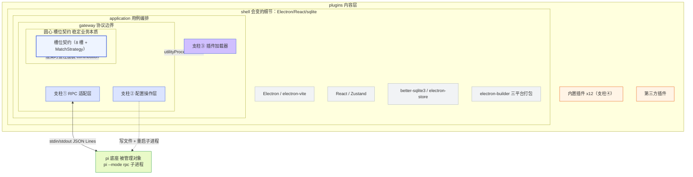
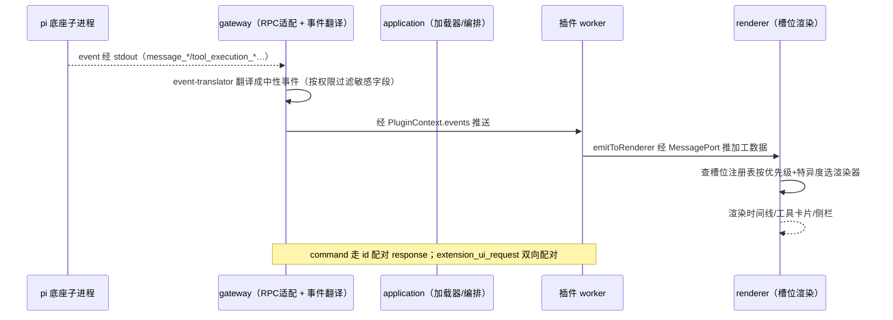

# pi-desktop 文档导读与索引

本文档是 pi-desktop 文档体系的入口（编号 00）。它不重复 `DESIGN.md` 的设计论证，也不替代任何一篇子文档的内容——它的唯一职责是：**让你在最短时间内判断"我该读哪一篇"，并给出一条从总纲到细节的阅读路径**。

`DESIGN.md` 是唯一的设计真相源（single source of truth），共 8 节（0–7），约 2500 行；docs 目录把这条主线按"核心设计 → 模块 → 插件 → 结构 → 指南"切成 26 篇已落地子文档，另有 2 篇计划新增文档（todo）。本文索引这 26+2 篇与 `DESIGN.md` 章节的映射、阅读顺序、架构总览、按场景快速定位，并标注每篇的盲审状态。**"已落地"指文件已存在于 docs/ 目录、可被打开阅读，不等于已通过盲审定稿**——盲审状态以 §0.6.1 表与各子文档正文内嵌的盲审回应段落为准。

读完本文你应该能回答三件事：这个项目是什么（VSCode 式薄壳）、文档怎么排（四支柱 × 洋葱六层）、现在该打开哪一篇。

> **编号约定（重要）**：本文索引使用**全局编号**（下表 `#` 列），全局编号在整张表内唯一、按落地/计划顺序续编。子文档**文件名里的编号仅在同一目录前缀内唯一**——例如 `core/02-security-model.md` 与 `modules/02-module-rpc-adapter.md` 的文件名都是 `02`，但分属不同目录、全局编号分别为 25 与 02，不构成冲突。读者"按编号查文档"时，请以本文 §0.3 表的全局 `#` 列为准，不要用文件名编号跨目录检索。

## 0.1 文档体系的组织逻辑

### 0.1.1 为什么按这个维度切

`DESIGN.md` 的主线是"四根支柱 + 洋葱六层 + 内置插件 + 缺口与 QA"。这条主线适合**通读**——它把设计哲学和工程取舍一气呵成讲透。但落地实现时，读者要的不是哲学连贯，而是**定位精度**：写 RPC 适配层的人不想读主题插件、写主题插件的人不想读打包链路。所以 docs 目录按"读者角色 × 文件粒度"二次切分：

- **核心设计 + 安全（01、25）**：01 把主线里最该讲透的纪律单独拎出来，是"为什么这么薄"的哲学文档，对应 `DESIGN.md` §0 + §5；25 是把散落在 §3/§5 各处的权限与安全论断收成一条主线的集中参考（威胁模型、沙箱边界、permissions 授权、敏感字段过滤），对应 `DESIGN.md` §3 + §5。
- **模块（02–04）**：四根支柱中的三根机制支柱（RPC 适配、配置操作、插件加载器，02–04），每根对应一个 `DESIGN.md` 大节，落到可写代码的粒度；另含 24 一篇"对接底座的机制说明"（RPC 能力协商的可视化，主题属机制层非用户内容）。
- **插件（05–16）**：支柱④的 12 个内置默认插件，每个对应 `DESIGN.md` §4 的一个子节或既有模式复用，是"照着能写一个插件"的规格说明。其中 05–15 对应 §4.2–§4.12 各子节，16（todo）是新增的第十二个内置插件、复用 §4.10 review 插件确立的"文件传输同步"模式。
- **结构（16–18、27、28）**：项目目录、技术栈、打包部署（16–18），对应 `DESIGN.md` §5；测试策略（27）按洋葱分层切测试金字塔，对应 `DESIGN.md` §5.1.4 + §5.3；演进路线（28）汇总散落各文档的演进项并排序，对应 `DESIGN.md` §6。
- **指南（19–21）**：操作向文档，面向"我要对接底座 / 写新插件 / 接外部插件"的三类执行者。

### 0.1.2 DESIGN.md 与 docs 的关系

`DESIGN.md` 是**设计真相源**，docs 是**落地展开**。两者不重复：`DESIGN.md` 讲"为什么、边界在哪、取舍理由"，docs 讲"字段叫什么、调用链怎么走、照着怎么写"。每个 docs 子文件开头都标注它对应 `DESIGN.md` 的哪个章节，并在涉及 pi 底座时对照 `packages/coding-agent/src` 下的真实源码标注 `底座:文件:行`。**当 docs 与 `DESIGN.md` 出现表述差异时，以 `DESIGN.md` 为准**——docs 是展开，可能比主线更细，但主线是裁决依据。

## 0.2 架构总览

### 0.2.1 一句话定位

pi-desktop 是一个 **VSCode 式薄壳桌面应用**：core 只提供机制（支柱①②③ + 槽位契约），支柱④是随壳分发的默认内容插件、非机制，一切功能是插件，pi 底座（一个 `pi --mode rpc` 子进程）是被管理对象而非另一套插件体系。它替换现有方案——那个把 pi SDK 娶进自己进程、造 Worker 进程池与 adapter 翻译层的厚客户端；pi-desktop 走 RPC、不做翻译、只一套插件体系。

### 0.2.2 四根支柱

四根支柱不是并列模块，而是从外到内的依赖层次：① RPC 适配（会话运行时控制）和 ② 配置操作（pi 自身状态）是 core 对接 pi 的两条通道；③ 插件加载器是 core 唯一的能力供给机制；④ 内置默认插件随壳分发、保证开箱即用，但架构地位与第三方插件平等（优先级最低、可被覆盖）。内置默认插件共 12 个（05–16），其中 16（todo）是复用 §4.10 模式新增的第十二个。

### 0.2.3 洋葱六层

依赖方向只向内：圆心是槽位契约（最稳定的业务本质），向外依次是 gateway（协议边界）、application（用例编排）、shell（会变的细节：Electron/React/sqlite）、plugins（内容层）、packages（外层资产）。换 shell 技术栈只动外层，圆心和中层接口不动。

**图 0-1 — pi-desktop 洋葱分层：依赖只向内，core 只认槽位契约、不认具体插件**

> 注 1：图以同心嵌套表达六层（由内向外）：圆心槽位契约 → gateway（协议边界）→ application（用例编排）→ shell → plugins → packages。plugins 环在 shell 环之外、内容插件是会变的外层，与"一切功能是插件"一致。
>
> 注 2：三根机制支柱跨 gateway 与 application 两层、非等同任一层——支柱①（RPC 适配）落在 gateway（协议边界），支柱③（插件加载器）落在 application（用例编排/能力供给），支柱②（配置操作）横跨协议读写与用例编排。支柱④（内置默认插件）属 plugins 内容层、非机制。
>
> 注 3：图省略 packages（外层资产）层。packages 指 `packages/pi-cli` 等可执行外层资产，不被任何洋葱层 import，处于依赖最外侧（plugins 之外），不参与壳内分层，正文"洋葱六层"含此层。（`DESIGN.md` §5.3 的洋葱图同样省略此层，README 与之保持一致。）
>
> 注 4：圆心到 plugins 的反向虚线 `SLOT <-.->|渲染时查注册表| PLG` 指 core 在渲染时读取自身槽位注册表（插件启动时把 contribution 写入该注册表），core 不反向 import 插件模块，依赖方向仍只向内。把"读注册表"与"依赖插件代码"区分开，该虚线不构成对"依赖只向内"的破坏。

### 0.2.4 数据流：从底座事件到 UI 渲染

**图 0-2 — 事件流单向：底座推事件 → gateway 翻译过滤 → 插件消费 → renderer 查槽位渲染**

## 0.3 文档索引映射表

下表是核心：`DESIGN.md` 章节 → docs 文档的逐项映射。全局编号、文件路径、对应章节、职责一句话、盲审状态。**全局编号唯一；文件名编号仅在同一目录前缀内唯一**（见篇首"编号约定"）。

| # | 文档（相对 docs/） | 对应 DESIGN.md 章节 | 职责一句话 | 盲审 |
|---|---|---|---|---|
| 01 | `core/01-core-design.md` | §0 薄壳定位 + §5.3 架构总览/洋葱分层 | 把"为什么薄、薄到什么程度、圆心为何不识 pi"的纪律从哲学推到机制 | 已盲审（设计纪律） |
| 02 | `modules/02-module-rpc-adapter.md` | §1 支柱① RPC Mode | 起子进程、收发 JSON Lines、三类消息、Extension UI 翻译、事件转发 | 已盲审 |
| 03 | `modules/03-module-config-ops.md` | §2 支柱② 配置与热加载 | 读写 settings/trust/auth/MCP、重启子进程式热加载、操作链路 | 未盲审 |
| 04 | `modules/04-module-plugin-loader.md` | §3 支柱③ 插件系统 | 插件抽象（manifest+可选代码+contribution）、加载器九项职责、双入口、权限 | 未盲审 |
| 05 | `plugins/05-plugin-i18n.md` | §4.2 i18n | 唯一影响 core 自身渲染的内容插件，语言槽贡献、fallback、i18next 集成 | 已盲审 |
| 06 | `plugins/06-plugin-theme.md` | §4.11 主题 | core 不内嵌视觉常量，颜色/字号/间距/圆角全来自主题槽设计 token | 未盲审 |
| 07 | `plugins/07-plugin-management-ui.md` | §4.3 管理 UI | 管理页/项槽位、通用表单 schema、扩展管理的统一列表两路分发 | 未盲审 |
| 08 | `plugins/08-plugin-timeline.md` | §4.4 时间线 | event 流 + get_entries → 可滚动/可增量/可分流式时间线 | 已盲审 |
| 09 | `plugins/09-plugin-file-preview.md` | §4.5 文件预览 | 预览器槽、按扩展名/mime 匹配、markdown/diff/代码高亮 | 未盲审 |
| 10 | `plugins/10-plugin-file-editor.md` | §4.12 文件编辑器 | editable 标记扩展只读预览、两条存盘路径、文件锁、冲突 diff | 已盲审 |
| 11 | `plugins/11-plugin-session-manager.md` | §4.6 会话管理 | 会话树/列表、switch/fork/clone、cancelled 处理、重绑事件 | 未盲审 |
| 12 | `plugins/12-plugin-commands.md` | §4.7 命令与快捷键 | 命令面板、when clause 语法、快捷键仲裁、输入框为唯一发送出口 | 已盲审 |
| 13 | `plugins/13-plugin-terminal-trust.md` | §4.8 终端与信任 | 侧栏终端、信任状态机、两种 bash 通路、excludeFromContext 前缀 | 未盲审 |
| 14 | `plugins/14-plugin-model-params.md` | §4.9 模型与运行参数 | 模型选择、thinking/队列/压缩/重试的 RPC 契约与 event 订阅 | 已盲审 |
| 15 | `plugins/15-plugin-review.md` | §4.10 review | 批注定位锚点、事件总线协作、不绕过输入框发送 | 未盲审 |
| 16 | `structure/16-structure-project-layout.md` | §5.1.4 + §5.3 目录结构 | 按激进洋葱六层切源码目录，依赖方向在文件系统可见 | 未盲审 |
| 17 | `structure/17-structure-tech-stack.md` | §5.1 shell 技术栈 | 每个依赖的选型理由、职责边界、如何落到分层目录 | 未盲审 |
| 18 | `structure/18-structure-build-deploy.md` | §5.2 三平台打包 | electron-vite 构建、electron-builder 打包、自动更新、底座 self-update 解耦 | 未盲审 |
| 19 | `guides/19-guide-integration.md` | §1（落地向）+ §6.4 handshake | 对接 pi 底座全链路：起子进程、收发、双向配对、版本协商 | 已盲审 |
| 20 | `guides/20-guide-extension.md` | §3（落地向） | 开发新桌面插件的端到端指南：进程归属、数据来源、权限、热重载 | 未盲审 |
| 21 | `guides/21-guide-external-plugins.md` | §3.9 外部插件接入 | npm 在线拉包、.pidesktop 离线投递、签名校验、授权、更新卸载 | 未盲审 |
| 24 | `modules/05-module-pi-capability-panel.md` | §6.4 handshake + §1.5 命令集 + §1.7 类型（新增能力面板） | 基于 handshake 的 availableCommands/protocolVersion 渲染"底座能力浏览面板"，未协商走假定旧快照 | 已盲审 |
| 25 | `core/02-security-model.md` | §3 插件系统 + §5 架构总览（权限/安全横切汇总） | 把散落在 §3.2/§3.5/§3.6/§3.9/§4.3/§4.8/§4.12.5/§5.1.5 的安全论断收成一条主线：威胁模型、沙箱边界、permissions 授权、敏感字段过滤、凭证隔离，推到"照着能审计" | 未盲审 |
| 26 | `plugins/16-plugin-todo.md` | §4.10 review 模式复用（新增第十二个内置插件） | 用户与 agent 共享任务清单：文件为唯一真相源、零协议开销、底座不感知，复用 §4.10 文件传输同步模式 | 未盲审 |
| 27 | `structure/19-testing-strategy.md` | §5.1.4 tests/ 分层 + §5.3 洋葱分层 | 测试金字塔按洋葱依赖层次切分：domain 零依赖单测、gateway 协议翻译测试、application 集成测试、shell E2E、PluginTestHarness、文档三轮盲审流程与 CI | 未盲审 |
| 28 | `structure/20-evolution-roadmap.md` | §6 已知缺口 + 散落演进项汇总 | 把分散在 §6/19/03/10/13/07 各文档的演进项集中排序，给 v1 兜底→v2 底座补 RPC→v3 多窗口→v4 真热更新四阶段时间轴 | 未盲审 |

### 0.3.1 计划新增与新增设计文档

下表覆盖 `DESIGN.md` 当前 docs 未独立成篇的章节、以及不对应 `DESIGN.md` 单一节直接展开的新增设计文档。编号 22–28：22、23 尚未落地（todo）；24–28 已撰写落地（其中 24 经盲审第 1 轮修订归入 `modules/`；25–28 为本轮新纳入索引的成文文档，尚未盲审）。**全局编号续编**，与各文件名内的目录前缀编号无关（见篇首"编号约定"）。

| # | 路径 | 对应 DESIGN.md 章节 | 职责一句话 | 状态 |
|---|---|---|---|---|
| 22 | `guides/22-guide-known-gaps.md`（todo） | §6 已知缺口与边界 | reload/list_sessions/TUI 渲染/RPC 版本协商四类缺口、当前兜底、演进路线 | 待撰写 |
| 23 | `guides/23-guide-qa.md`（todo） | §7 QA | 12 条边界场景与取舍问答，每条独立可读 | 待撰写 |
| 24 | `modules/05-module-pi-capability-panel.md`（已落地） | §6.4 handshake + §1.5 命令集 + §1.7 类型 | 基于 handshake 渲染底座能力浏览面板，未协商走假定旧快照 | 已撰写（已盲审） |
| 25 | `core/02-security-model.md`（已落地） | §3 + §5（安全横切汇总） | 权限与安全集中参考：威胁模型、沙箱、permissions、敏感字段过滤 | 已撰写（未盲审） |
| 26 | `plugins/16-plugin-todo.md`（已落地） | §4.10 模式复用 | 第十二个内置插件：用户与 agent 共享任务清单 | 已撰写（未盲审） |
| 27 | `structure/19-testing-strategy.md`（已落地） | §5.1.4 + §5.3 | 测试金字塔按洋葱分层 + 文档三轮盲审流程 | 已撰写（未盲审） |
| 28 | `structure/20-evolution-roadmap.md`（已落地） | §6 + 散落演进项汇总 | 演进项集中排序、v1→v4 时间轴 | 已撰写（未盲审） |

**关于 24（pi-capability-panel）**：这是 `DESIGN.md` 单一节直接展开之外的全新设计。它消费 `DESIGN.md` §6.4 的 handshake 响应（`protocolVersion` / `availableCommands` / `features`）与 §1.5 的 31 命令清单、§1.7 的返回类型，渲染一个让用户/开发者直观看到"当前连接的底座支持哪些命令、哪些特性、协议版本"的面板。它落在管理槽（management），是缺口 §6.4 落地后的第一个受益插件——在底座补 handshake 之前，它以"假定旧快照"模式展示硬编码 31 命令并标注"未协商"。**路径与编号说明**：经盲审第 1 轮修订，本文归入 `modules/`（主题是 RPC 能力协商机制的可视化、属"对接底座的机制说明"层，非用户内容插件），文件名 `05-module-pi-capability-panel.md`（modules 目录序列 02→03→04→05）；全局索引编号为 24，不与 `plugins/05-plugin-i18n.md` 的全局 #05 冲突（目录前缀消歧）。详见该文档 §0.4 的归属判定。

**关于 25–28（本轮新纳入索引）**：这四篇文档此前已存在于磁盘并已成文数百至两千余行，但因索引遗漏对读者不可见，本轮盲审第 3 轮修正。它们都不对应 `DESIGN.md` 某一节的直接展开，而是横切汇总或新增设计：25（安全模型）把散落在 §3/§5 多处的安全论断收成一条主线；26（todo 插件）是 §4.10 review 模式的复用、第十二个内置内容插件；27（测试策略）是 §5.1.4 tests/ 分层与 §5.3 洋葱分层在测试维度的展开，并钉死文档三轮盲审流程；28（演进路线）把分散在 §6 及各模块/插件文档的演进项汇总排序。它们的文件名编号（02/16/19/20）与既有 §0.3 表行（modules/02、structure/16、guides/19、guides/20）在文件名上重号，但分属不同目录前缀、全局编号（25–28）唯一，不构成冲突。

## 0.4 推荐阅读顺序

### 0.4.1 主线阅读路径

按全局编号顺序读，是经过设计的递进：先立哲学、再讲机制、再讲内容、再讲落地、最后讲操作。每一步都建立在前一步的概念上。

**图 0-3 — 主线阅读路径：哲学 → 机制 → 内容 → 落地 → 操作 → 计划**

> 注：图中末端"22-23 todo"节点为**未就绪**（虚线标示），对应文件在磁盘上尚不存在。25（安全模型）、26（todo 插件）、27（测试策略）、28（演进路线）已落地、按"核心/插件/结构"阶段分别并入对应节点。在 22/23 落地前，缺口与 QA 议题请直接查阅 `DESIGN.md` §6（已知缺口与边界）、§7（QA）或已落地的 28（演进路线汇总）；原 24（能力面板）已撰写落地于 `modules/05-module-pi-capability-panel.md`，在 §6.4 handshake 落地前以"假定旧快照"模式存在。

### 0.4.2 按角色裁剪

不是所有人都要读全 26 篇。按下表按角色跳读，能更快进入有效工作区。

| 角色 | 必读 | 选读 | 跳过 |
|---|---|---|---|
| 架构理解者 / 评审 | 01、25、DESIGN.md §0–§5 | 16、17、27 | 18、19–21 |
| RPC 适配层实现者 | 02、19、DESIGN.md §1 | 01、04、25 | 05–16 |
| 配置/热加载实现者 | 03、DESIGN.md §2 | 07、13 | 02、19 |
| 插件加载器实现者 | 04、25、DESIGN.md §3 | 20、16 | 02、03 |
| 写新插件（UI 类） | 20、04、26、DESIGN.md §3.2–§3.3 | 05、06、08 | 18、19 |
| 写新插件（工具卡片类） | 20、08、DESIGN.md §3.8 | 09、10 | 06、11 |
| 主题/i18n 作者 | 05、06、20 | 01 | 11–16 |
| 打包/发布 | 18、17、DESIGN.md §5.2 | 16 | 05–16 |
| 外部插件分发者 | 21、04、25、DESIGN.md §3.9 | 20 | 02、03 |
| 安全/权限审计者 | 25、04、21、DESIGN.md §3.9 | 02、13 | 05–12 |
| 测试工程 | 27、16、DESIGN.md §5.1.4+§5.3 | 02、04、08 | 06、11、15 |
| 排查缺口/边界问题 | 28、DESIGN.md §6–§7（22/23 待撰写，当前以此为据） | 03、11、14、19、25 | 05–10 |

## 0.5 按场景快速定位

不按文档编号、按"我现在要做什么"找。每个场景给出最相关的 1–3 篇文档和 DESIGN.md 章节。

### 0.5.1 理解项目定位与为什么薄

- 为什么不走 SDK 进程内、走 RPC：01（哲学）+ DESIGN.md §0.2、§1.1
- 为什么只有一套插件体系、不造 adapter：01 + DESIGN.md §3.1
- 四根支柱的依赖层次：01 + DESIGN.md §0.3.2
- 洋葱六层与依赖方向：01 + 16 + DESIGN.md §5.3

### 0.5.2 对接 pi 底座

- 起子进程与 stdio 通道：02 + 19 + DESIGN.md §1.2
- 三类消息（command/response/event）：02 + DESIGN.md §1.4
- 31 个 RPC 命令逐条：02 + DESIGN.md §1.5
- 事件流全集（订阅哪些 event）：02 + DESIGN.md §1.6
- Extension UI 子协议（双向配对）：02 + 19 + DESIGN.md §1.9
- session resume 机制：02 + DESIGN.md §1.3.2

### 0.5.3 管理配置与热加载

- 两份 settings 合并规则：03 + DESIGN.md §2.1
- 改配置怎么生效（重启子进程）：03 + DESIGN.md §2.4
- 扩展启停真相（路径增删）：03 + DESIGN.md §2.3
- 管理端管底座 extension 的五步链路：03 + DESIGN.md §2.5
- 项目信任前置：03 + 13 + DESIGN.md §2.1.2

### 0.5.4 写插件

- 插件抽象（manifest + 可选代码 + contribution）：04 + 20 + DESIGN.md §3.2
- 八个槽位契约与字段 schema：04 + DESIGN.md §3.3
- MatchRule / MatchStrategy 匹配：04 + DESIGN.md §3.3
- 双入口（worker vs renderer）怎么选：04 + 20 + DESIGN.md §3.6、§7.5
- 端到端示例（自定义工具卡片渲染器）：DESIGN.md §3.8 + 08
- 权限模型（content:sensitive / net: 域名白名单）：04 + 25 + 21 + DESIGN.md §1.7.6、§7.6
- 外部插件分发链路：21 + DESIGN.md §3.9
- 复用既有模式新增内置插件（文件传输同步范式）：26 + 15 + DESIGN.md §4.10

### 0.5.5 理解某个内置插件

- 时间线渲染：08 + DESIGN.md §4.4
- i18n 与文案 fallback：05 + DESIGN.md §4.2、§7.7
- 主题与设计 token：06 + DESIGN.md §4.11
- 管理 UI 与通用表单：07 + DESIGN.md §4.3
- 文件预览：09 + DESIGN.md §4.5
- 文件编辑器（两条存盘路径）：10 + DESIGN.md §4.12
- 会话管理（树/列表/fork）：11 + DESIGN.md §4.6
- 命令面板与 when clause：12 + DESIGN.md §4.7
- 终端与信任：13 + DESIGN.md §4.8
- 模型与运行参数：14 + DESIGN.md §4.9
- review 批注与锚点：15 + DESIGN.md §4.10、§7.12
- todo 任务清单（agent 共享）：26 + DESIGN.md §4.10（模式复用）

### 0.5.6 落地工程

- 项目目录布局：16 + DESIGN.md §5.1.4
- 技术栈选型：17 + DESIGN.md §5.1.2
- 三平台打包与自动更新：18 + DESIGN.md §5.2
- 底座 self-update 与壳更新解耦：18 + DESIGN.md §5.2.3（自动更新与底座更新解耦）
- 测试策略与分层：27 + DESIGN.md §5.1.4 + §5.3
- 多窗口/多项目：DESIGN.md §7.11（当前 v1 单窗口单进程）

### 0.5.7 排查缺口与边界

> 下列场景原计划由 22（缺口）+ 23（QA）承接，但 22/23 **尚未撰写**，磁盘上不存在。在它们落地前，每条已补"临时入口"直接指向 `DESIGN.md` 对应小节或已落地的 28（演进路线汇总），避免读者落到空指针。

- 底座无 reload 命令：28 + 22(todo) + 03 + DESIGN.md §6.1、§7.1　**临时入口 → 28 §1.2 / DESIGN.md §6.1（缺口确认/当前处置/演进项）**
- 会话列表列不全：28 + 22(todo) + 11 + DESIGN.md §6.2、§7.2　**临时入口 → 28 §1.1 / DESIGN.md §6.2**
- 重启时正在跑的任务：28 + 22(todo) + DESIGN.md §7.3　**临时入口 → DESIGN.md §7.3**
- RPC 协议无版本协商 / handshake：28 + 22(todo) + 19 + DESIGN.md §6.4　**临时入口 → 28 §1.1 / DESIGN.md §6.4（含 §6.4.3 handshake 完整设计）**
- 内置插件被覆盖怎么提示：28 + 22(todo) + DESIGN.md §7.4　**临时入口 → DESIGN.md §7.4**
- 演进项总览与优先级排序：28 + DESIGN.md §6（v1 兜底→v2 底座补 RPC→v3 多窗口→v4 真热更新）
- 底座 extension 与桌面插件同名：DESIGN.md §7.8
- 终端与信任该不该拆：DESIGN.md §7.10

### 0.5.8 权限与安全排查

- 第三方插件能做什么、不能做什么：25 + DESIGN.md §3.9.1
- permissions 声明与授权（fs/net/content:sensitive）：25 + 04 + DESIGN.md §3.2、§3.9.4
- 沙箱边界（utilityProcess + scoped API）：25 + 04 + DESIGN.md §3.5
- 敏感字段过滤在哪一层做：25 + 02 + DESIGN.md §5.1.5
- 凭证保护与数据隐私：25 + DESIGN.md §4.3
- 项目信任与插件权限为何是两条独立轴：25 + 13 + DESIGN.md §4.8、§2.1.2

## 0.6 文档状态与盲审

### 0.6.1 盲审覆盖范围

盲审是设计文档质量的把关环节：由非作者角色通读、挑出"三年后最可能烂掉的地方"与内聚/边界问题，作者据反馈修订。下面是 docs 各篇的盲审状态，依据是文档正文是否引用并回应了盲审发现。本表覆盖 §0.3 + §0.3.1 全部 26 篇已落地文档与 2 篇待撰写文档（共 28 个条目）。

| 状态 | 文档 |
|---|---|
| 已盲审（正文回应盲审发现） | 01（设计纪律）、02（RPC 适配）、05（i18n）、08（时间线）、10（文件编辑器）、12（命令与快捷键）、14（模型参数）、19（集成指南）、24（能力面板，文件落地于 `modules/05-`） |
| 未盲审 / 待盲审 | 03、04、06、07、09、11、13、15、16、17、18、20、21、25（安全模型）、26（todo 插件）、27（测试策略）、28（演进路线） |
| 待撰写 | 22、23（todo） |

> **关于本轮新纳入索引的 25–28**：这四篇文档此前已成文但未被索引，自然也未经盲审。其中 27（测试策略）正文虽描述了"文档三轮盲审流程"（作为测试策略的一部分），但那是流程定义、不代表本文档自身已通过盲审——这四篇均列入"未盲审/待盲审"，应在后续盲审轮次中补审。

> **关于 `DESIGN.md` 自身的盲审地位**：`DESIGN.md` 是设计真相源，非 docs 篇目，不纳入本表计数。其盲审回应以正文内嵌段落为准——典型如 §6.4 已就"RPC 协议无版本协商、三年后最可能烂掉"的盲审发现给出回应（立为缺口、给 handshake 完整设计、记演进项）。§0.6.2 举例表中的"DESIGN.md §6.4"一行即指该内嵌回应，与本文档体系对其盲审判定一致，不另立计数。

### 0.6.2 盲审发现举例

下表给出几个已落地文档回应的典型盲审发现，让读者理解盲审在抓什么类问题。

| 文档 | 盲审发现 | 修订方向 |
|---|---|---|
| 12（命令） | `!` 前缀结合性易写错成 `(!a) == "x"` | 显式写入词法/求值契约：`!` 作用于"变量+可选比较"整体原子 |
| 12（命令） | MRU 更新未覆盖 desktop 与 rpc 两类命令 | 明确触发点两类都要覆盖 |
| 10（文件编辑器） | 直写磁盘 vs 经 agent 的存盘路径边界模糊 | 拆成两条独立路径并钉死文件锁当前兜底 |
| 14（模型参数） | set_model 后乐观更新 UI 有竞态 | 改为等 `model_select` event 回来再确认 |
| 02/19（RPC/集成） | RPC 协议无版本协商、三年后最易漂移 | 补 handshake 降级决策树与版本化适配层 |
| DESIGN.md §6.4 | 同上（盲审点名"3 年后最可能烂掉"） | 立为缺口、给 handshake 完整设计、记演进项 |

### 0.6.3 文档可信度声明

docs 子文件正文凡涉及 pi 底座细节，均以 `底座:文件:行` 标注源码位置、逐条核实；凡涉及 pi-desktop 自身设计，均对应 `DESIGN.md` 章节号。个别尚未从底座源码核对的确切值（如 trust 记录文件名、MCP 配置文件名、`pi update --check` 的 JSON 输出契约）在对应文档内标注为"待底座源码核对的实现假设"或"演进项"，不在正文当事实陈述。读者若发现 docs 与 `DESIGN.md` 表述不一，以 `DESIGN.md` 为准并提 issue 修订 docs。本声明的覆盖范围为 §0.3 + §0.3.1 全部 26 篇已落地子文档。

**盲审状态的可核实方式**：§0.6.1 的盲审判定依据是"文档正文是否引用并回应了盲审发现"——索引层未单独维护盲审 issue/PR 链接。读者核实"已盲审"篇目时，请直接打开对应子文档，查找正文内嵌的"盲审回应"段落（典型如 12 文档内 `!` 前缀结合性、10 文档内两条存盘路径的拆分说明），盲审发现与修订方向以各子文档正文记录为准。

### 0.6.4 篇幅说明

00-README 是纯索引/导读文档，刻意保持精简（约 1.3 万字），不重复任何子文档的实现内容。文档体系对单篇 15000 字下限的审计判据，对本文不适用——索引的职责是"定位精度"而非"内容完备"，内容完备由 01–28 各子文档与 `DESIGN.md` 承担。

## 0.7 术语锚点

文档假设读者具备开发者常识，不展开解释底层术语。这里给出最关键的几个锚点，不熟可对照。

| 术语 | 在本文档体系里的角色 |
|---|---|
| pi 底座 | 一个可执行 Node CLI（`@earendil-works/pi-coding-agent`），桌面壳通过 `--mode rpc` 起子进程、把它当被管理对象 |
| core | pi-desktop 自己的核心层，跑在 Electron main/renderer，提供四根支柱 |
| 四根支柱 | RPC 适配① / 配置操作② / 插件加载器③ / 内置默认插件④，从外到内的依赖层次 |
| 槽位契约 | core 与插件之间唯一的耦合点，八槽（语言/主题/管理/卡片渲染/侧栏/预览器/命令/设置子页），洋葱圆心 |
| 洋葱架构 | 依赖只向内的分层范式：圆心稳定业务本质、外层会变细节（见 §0.2.3） |
| utilityProcess | Electron 的 Node 子进程 API，桌面插件 worker 跑在这，提供进程级隔离 |
| MessagePort | Web/Electron 跨进程序列化消息通道，worker↔renderer 通信用 |
| jiti | TS/ESM 运行时加载器，底座 extension 用它动态加载 TS |
| MCP | Model Context Protocol，底座连外部工具服务器的协议，MCP 管理页管的就是这些 server |
| handshake | DESIGN.md §6.4 提出的 RPC 版本协商命令，桌面端据此 feature detection（待底座补） |
| 现有方案 | pi-desktop 替换掉的旧项目（同 name、v0.4.20），把 SDK 娶进进程 + 造 adapter 翻译层的厚客户端反面教材 |

## 0.8 如何使用本文档

- **第一次接触项目**：读 §0.2 架构总览，再按 §0.4.1 主线从 01 开始。
- **带着具体任务**：直接查 §0.5 按场景定位，跳到对应文档。
- **评审 / 排查边界**：先看 §0.6 文档状态确认该篇是否经盲审，再结合 §0.5.7 缺口场景与 §0.5.8 权限安全场景。
- **写新文档**：对齐 §0.1.2 的"DESIGN.md 为真相源、docs 为落地展开"原则，开头标注对应章节号，底座细节标 `底座:文件:行`，未核对值标注假设。
- **发现 docs 与 DESIGN.md 冲突**：以 DESIGN.md 为准，提 issue 修订 docs。

---

### 架构自检
- [x] 高内聚：本文只做"索引/导读"一件事，不重复任何子文档的实现内容
- [x] 低耦合：通过章节号与文件路径引用其他文档，不复制其内部逻辑
- [x] 开闭原则：新增文档（22–28）通过扩展映射表加入，不改已有索引结构；24 已落地（`modules/05-`）、25–28 本轮新纳入索引，22/23 仍待撰写
- [x] 方案视角：解决"读者找不到该读哪篇"的根本问题，而非堆砌文档清单
