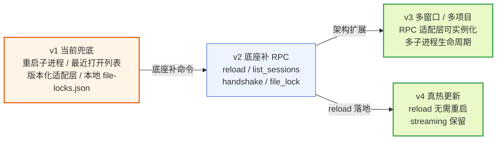
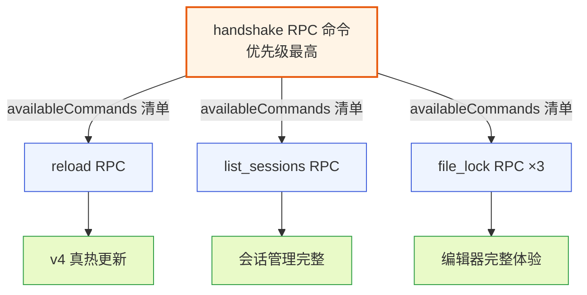
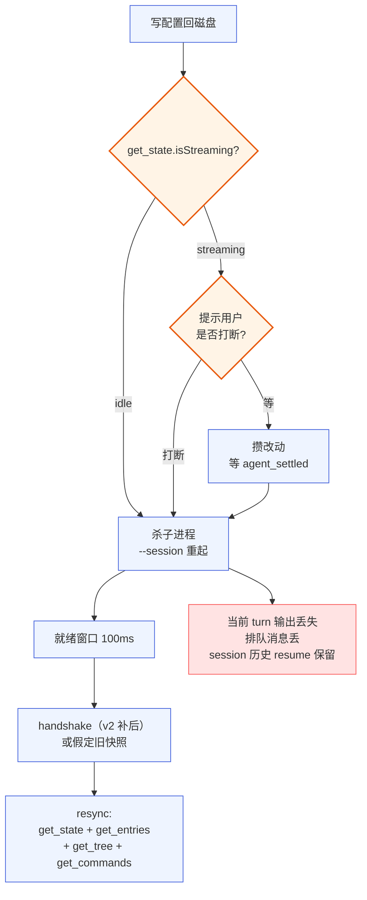
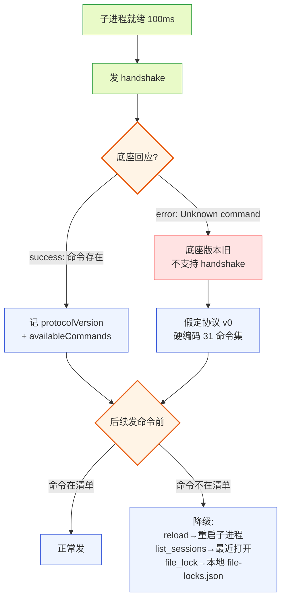
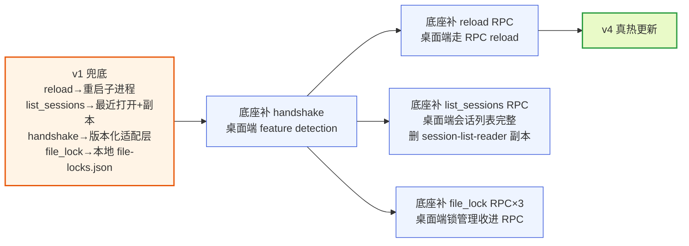
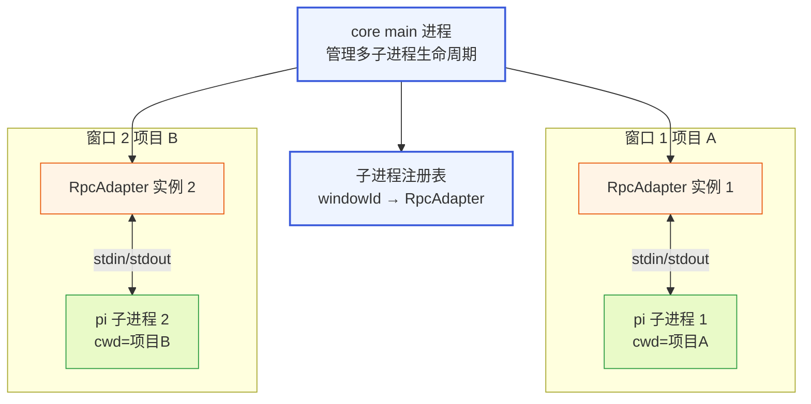
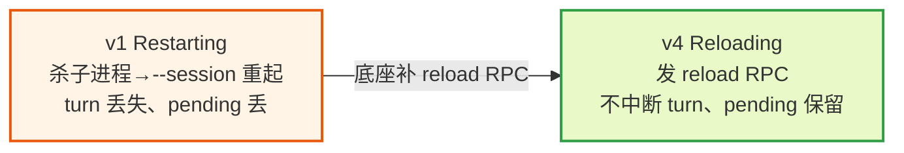
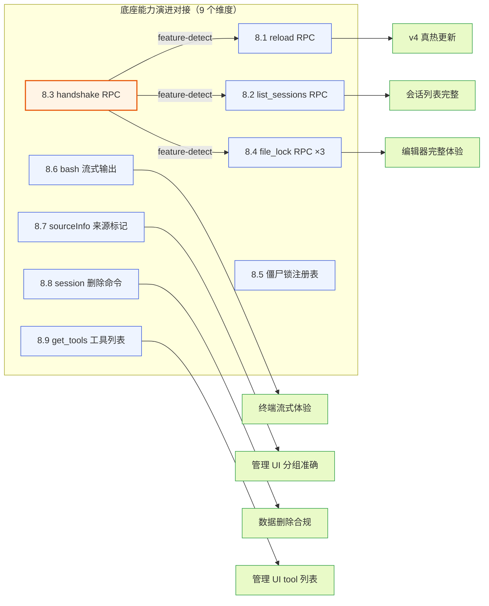
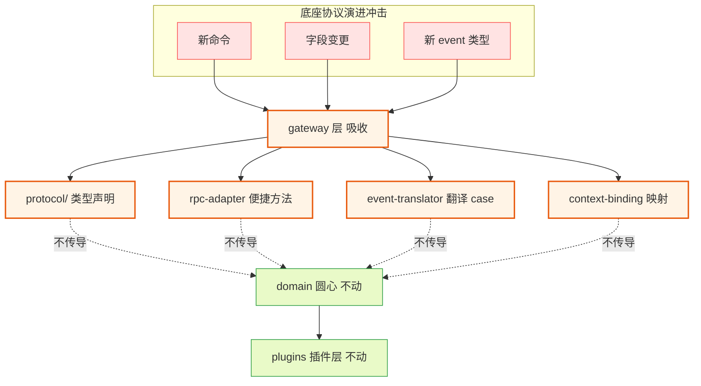

# 演进路线汇总

本文把散落在 `DESIGN.md` 第 6 节（已知缺口与边界）和各模块/插件文档里的"演进项""演进方向""待底座补""向底座提"标记集中汇总，按优先级排序，每条给出**当前状态 / 演进目标 / 影响范围**三项。这是一份路线图，不是设计变更——所有演进项都已在各自的原文档里登记过缺口，这里只是把它们从分散的章节里拎出来、排成一条从"当前兜底"到"真热更新"的时间轴，让实现者和底座团队能一眼看清"现在站在哪、下一步往哪走、换掉哪些代码、哪些不动"。

阅读前置：本文假设读者已读过 `DESIGN.md` 的 0-3 节（四根支柱与插件系统）、第 6 节（已知缺口）、第 7 节 QA，以及 `docs/guides/19-guide-integration.md` 的第 10 节（已知缺口）和第 14 节（集成的演进路径）。本文不重复这些文档的论证，只做汇总与排序。涉及 pi 底座源码的结论锚定 `packages/coding-agent/src/` 下的真实文件。

---

## 1 为什么需要一份演进路线汇总

### 1.1 演进项散落的现状

### 1.1.1 缺口标记分布在六处文档里

`DESIGN.md` 第 6 节只列了三个缺口（reload / list_sessions / TUI 渲染不承接）和一个协议漂移问题（handshake），但实际散落在文档体系里的"演进项"远不止这些。一份完整的清单要跨六处文档拼：

- `DESIGN.md` 第 6 节：reload（6.1）、list_sessions（6.2）、TUI 渲染不承接（6.3）、handshake 版本协商（6.4）。
- `docs/guides/19-guide-integration.md` 第 10 节：reload、list_sessions、handshake、file_lock（配置文件僵尸锁）四个缺口，外加 10.5 的诊断决策表和 10.6 的统一处置策略。
- `docs/modules/03-module-config-ops.md` 第 9.6/10.x 节：`file-locks.json` 中心化锁注册表（当前不存在、是未来演进项）、`listAll` 复刻副本的同步运维缺口、`deepMergeSettings`/`migrateSettings` 向底座提 PR 治本的演进项。
- `docs/plugins/10-plugin-file-editor.md` 第 4.5 节：`query_file_lock` / `acquire_file_lock` / `release_file_lock` 三条 RPC 命令、agent 写盘前查锁。
- `docs/plugins/13-plugin-terminal-trust.md` 第 4.5 节：bash 流式输出（`onChunk` 经 event 推给桌面端）。
- `docs/plugins/07-plugin-management-ui.md` 第 11.6/15.2 节：底座 extension 的 `sourceInfo` 来源标记（`installed` 档不可判定）、provider 归属关系未暴露、`delete_session` / `delete_all_sessions` 命令、`get_tools` 工具列表可见性。

每处文档只从自己的视角说一段，读者要拼出全貌得自己跨文档对照。本文把这张拼图拼好。

### 1.1.2 没有排序就没有路线

散落的另一面是"没有排序"。各文档的演进项是按"文档结构"组织的（缺口表排在文档末尾），不是按"先做哪个、后做哪个、哪个是另一个的前置依赖"组织的。但实际演进有依赖次序——handshake 是 feature detection 的通道，reload / list_sessions / file_lock 都靠它判断"底座补了没有、能不能用"，所以 handshake 优先级最高；reload 是 v4 真热更新的前置；file_lock 是编辑器插件完整体验的前置。没有排序，实现者不知道先动哪个、底座团队不知道先补哪个。本文按优先级排成 v1→v2→v3→v4 四阶段。

### 1.2 路线图的核心叙事

### 1.2.1 一条从"兜底"到"真热更新"的时间轴

演进的核心叙事是一条时间轴：

- **v1 当前兜底**：底座 RPC 没开口子的能力，桌面端用"副作用等价"的方式兜底——reload 用重启子进程、list_sessions 用最近打开列表、handshake 用版本化适配层 + pin 版本、file_lock 用本地 `file-locks.json` + `proper-lockfile`。功能不残缺，只是实现路径不够优雅。
- **v2 底座补 RPC**：底座补 `reload` / `list_sessions` / `handshake` / `file_lock` 四组管理类 RPC 命令，桌面端切到走 RPC 通道、消除兜底代价。handshake 是这组的收敛点——其余三条靠它 feature-detect。
- **v3 多窗口 / 多项目**：从单窗口单底座子进程扩展到多窗口多子进程，RPC 适配层做成可实例化，core main 管理多个子进程生命周期。
- **v4 真热更新**：`reload` RPC 落地后，配置改动不再重启子进程、不丢运行态、streaming 中也能安全 reload，达到"真热更新"。



**图 1 — 演进四阶段时间轴：v1 兜底 → v2 底座补 RPC → v3 多窗口 → v4 真热更新**

### 1.2.2 演进守得住边界

这条路线图不是"重写一切"。每一步演进都守两条边界：

- **槽位契约不动**：所有演进项都是支柱①（RPC 适配）或支柱②（配置操作）的内部实现变化，槽位契约（圆心）和插件层一概不动。reload 从"重启子进程"换成"发 reload 命令"，插件层的 `context.rpc` 接口不变、插件代码不改。
- **降级路径保留**：handshake 让桌面端能 feature-detect 底座能力——底座补了新命令就用、没补就走兜底。演进不是"一刀切换"，是"有能力就用、没能力就降级"，桌面端可以**先于底座**实现客户端逻辑、向后兼容旧底座。这让桌面端和底座能各自发版、不互相阻塞。

这两条边界是激进洋葱架构在演进上的体现——圆心（槽位契约）稳定、外层（RPC 适配 / 配置操作 / shell 细节）会变，演进冲击被外层吸收、圆心和插件不受影响。

---

## 2 演进总览：四阶段全图

### 2.1 四阶段的能力对照

### 2.1.1 每个缺口在四阶段里的状态

下表把每个演进项在四个阶段的状态列清楚——"当前怎么做、v2 切到什么、v3/v4 进一步变化"。

| 演进项 | v1 当前兜底 | v2 底座补 RPC | v3 多窗口 | v4 真热更新 |
|---|---|---|---|---|
| reload | 重启 RPC 子进程（`--session` resume） | 发 `reload` RPC 命令、不重启 | 多子进程各自 reload | streaming 中也能 reload、不丢 turn |
| list_sessions | "最近打开"偏好列表 + 复刻 `listAll` 副本 | 发 `list_sessions` RPC 拿 `SessionInfo[]` | 列表跨多项目聚合 | 不变 |
| handshake | 版本化适配层 + pin 底座版本 + 硬编码 31 命令 | 底座补 `handshake` 命令、feature detection | 每子进程各 handshake | 不变 |
| file_lock | 本地 `file-locks.json` + `proper-lockfile` + TTL | 底座补 `query/acquire/release_file_lock` 三条 | 不变 | 不变 |
| 配置文件僵尸锁注册表 | `proper-lockfile` 进程级锁 + 手动清理 `.lock` 文件 | 底座补 `~/.pi/agent/file-locks.json` 中心化注册表 | 不变 | 不变 |
| bash 流式 | 合并单 `output` 字段、按退出码染色 | 底座补 `onChunk` 经 event 推流式输出 | 不变 | 不变 |
| extension sourceInfo | `installed` 档不可判定、归 `builtin` 兜底 | 底座补 `sourceInfo` 来源标记 | 不变 | 不变 |
| session 删除 | 标"待底座提供命令"、不直接删目录 | 底座补 `delete_session` / `delete_all_sessions` | 不变 | 不变 |
| get_tools 工具列表可见性 | 不可见底座 extension 注册的 tool 列表 | 底座补 `get_tools` RPC | 不变 | 不变 |
| TUI 渲染 | 不承接、走消费 | 不演进（设计选择） | 不演进 | 不演进 |

**图 2 — 演进项在四阶段的状态对照表**

### 2.2 阶段依赖关系

### 2.2.1 handshake 是收敛点

四个 v2 演进项之间有依赖：`handshake` 是其余三条的收敛点。reload / list_sessions / file_lock 三条 RPC 命令，桌面端到底能不能用，靠 handshake 返回的 `availableCommands` 清单判断——底座补了 handshake 但清单里没这仨，桌面端照旧走兜底；清单里有，桌面端 feature-detect 地用。所以 handshake 要**最先补**，它是"能力探测的通道"，没它就只能靠版本 pin + 硬编码命令集。



**图 3 — handshake 是收敛点：其余三条 RPC 靠它 feature-detect**

### 2.2.2 v3 和 v4 的前置

v3（多窗口）的前置是 v2 的 handshake——多子进程意味着每个子进程都要独立 handshake、各维护自己的 `availableCommands`。没有 handshake，多窗口场景下协议漂移的防护更脆弱。v4（真热更新）的前置是 v2 的 reload RPC——reload 落地后才能谈"streaming 中也能 reload"这个更激进的目标。所以 v3、v4 都建立在 v2 的底座 RPC 补齐之上。

---

## 3 v1：当前兜底阶段

v1 是 pi-desktop 当前的实现状态。底座 RPC 没开口子的能力，桌面端用"副作用等价"的方式兜底——把"底座内部有能力但 RPC 没暴露"的事，用另一种能达成同样效果的方式做出来。本节逐项说清兜底怎么做、代价是什么、在哪段代码里落地。

### 3.1 重启子进程热加载（reload 兜底）

### 3.1.1 当前状态

底座内部有完整的 reload 能力：`SettingsManager.reload()`（从磁盘重读 settings.json）、`ResourceLoader.reload()`（重新 discover / load extensions / skills / themes / prompts）、`AgentSession.reload()`（绑定新 extension runtime、重发 `session_start` 事件 reason: `"reload"`）。交互式 TUI 模式下也有 `/reload` 斜杠命令。但 RPC 协议的 31 个命令里**没有 `reload`**——`RpcCommand` 联合类型里没有它，`pi reload` 这样的 CLI 子命令也不存在。在 RPC 模式下 prompt 里写 `/reload` 只是普通文本、不触发 reload。

桌面端改完配置（settings.json、扩展路径列表、trust 记录、auth、MCP 配置）后，让底座生效的唯一路径是**重启 RPC 子进程**：写回磁盘 → 杀掉当前 `pi --mode rpc` 子进程 → 用 `args: ["--session", sessionFile]` 重起一个。新进程启动时从磁盘重读全部配置、重新 discover 扩展——等于一次完整的 reload。

### 3.1.2 带判断的重启决策

重启不是无脑执行。桌面端先 `get_state` 查 `isStreaming`：

- **agent idle**：直接重启，新进程 resume 同一 session，用户几乎无感。
- **agent streaming**：弹提示"改动需要重启底座生效，当前 agent 正在工作，是否打断"，让用户决定。用户选打断 → 当前 turn 输出丢失、session 历史 resume 保留；用户选等待 → 攒改动、等 `agent_settled` 再重启。



**图 4 — v1 热加载重启决策：streaming 时提示用户，idle 直接重启，session resume 保留历史**

### 3.1.3 代价与影响范围

代价是重启瞬间的运行态中断：streaming 中的 agent 被打断、排队的 pending 消息丢（pending 是底座进程的内存队列、还没落进 session 文件，进程死了内存态自然丢）。靠 session 持久化 + `--session` resume 缓解——已完成的历史和分叉树都在，只是"正在进行的那个 turn"丢了。对"改配置"这种低频操作，这个代价可接受。

影响范围：落在 `application/orchestrations/config-restart.ts`（改配置→重启子进程→resync 的编排）和 `application/config/restart.ts`。这个编排调 gateway 的 `RpcAdapter.start/stop` 原子能力和 application 的 `resync` 原语——**不落进 `gateway/rpc-adapter.ts`**，因为 `resync(this)` 会让 gateway 反向 import application、违反依赖方向。gateway 只暴露原子能力、由中层编排。重启决策状态机（`Reloading` / `Restarting` 两态）在 management-ui 文档 24.3 节定义，当前底座未补 reload 命令、实际只走 `Restarting` 路径；`Reloading` 状态在状态机里预留、待 v2 演进后启用。

### 3.2 最近打开列表（list_sessions 兜底）

### 3.2.1 当前状态

底座内部有 `SessionManager.listAll()`（`session-manager.ts:1564`），返回 `SessionInfo[]`——能列出全部 session（带 path / id / cwd / name / created / modified / messageCount / firstMessage）。但 RPC 的 31 个命令里**没有 `list_sessions`**，桌面端无法通过 RPC 拿到这个列表。

桌面端**不**自己去扫 sessionDir 解析 session 文件——那违背"session 存储是底座内部事务"的边界、要理解底座 session 文件格式（JSONL 带 header 行、格式会随底座版本演化）。当前兜底走两条：

- **"最近打开"偏好列表**：桌面端维护一份自己打开过的 session 路径列表（存路径、不解析内容），列出通过桌面端打开过的 session、可切换。列不出 CLI 直接创建的、没用桌面端打开过的历史 session。
- **`listAll` 复刻副本**（`config-ops` 文档 10.3 节）：桌面端 core 复刻 `SessionManager.listAll` 的纯文件读逻辑（扫 `~/.pi/agent/sessions/` 下目录、读 `.jsonl` 文件头、复用底座的 `MAX_CONCURRENT_SESSION_INFO_LOADS = 10` 并发控制、type-only import `SessionInfo` 类型不带运行时），不 import `SessionManager` 整类（避免把 `@earendil-works/pi-agent-core` 拖进 core 依赖图）。这条比"最近打开"更完整，但是底座源码的**副本**——底座改了 `listAll` 实现时桌面端无感知，是逻辑同步运维缺口，需 CI 脚本 diff 两边实现。

### 3.2.2 影响范围

落在 `application/config/session-list-reader.ts`（复刻副本）和会话管理插件（`docs/plugins/11-plugin-session-manager.md`）的侧栏"会话"Tab。当前 session 的 `sessionFile` 从 `get_state` 拿（闭环关键参数），切换走 `switch_session` RPC 命令（这条底座有）。完整的"枚举全部历史 session"能力等 v2 底座补 `list_sessions` RPC 命令。

### 3.3 handshake 降级（协议版本协商兜底）

### 3.3.1 当前状态

RPC 协议没有版本协商——没有协议版本号、没有 feature detection、没有"未知命令优雅降级"。底座演进时命令会增删改（`RpcCommand` 联合类型会变），桌面端只能被动追兼容，追不上就崩或静默错。这是盲审指出的"3 年后最可能烂掉的地方"。

当前兜底走**版本化适配层 + pin 底座版本**：

- 桌面端把 RPC 命令封装在 `gateway/rpc-adapter.ts` + `gateway/protocol/versions.ts` 里，底座协议变时只动这层、不动插件层。圆心（domain）不 import `gateway/protocol/`，靠 `gateway/context-binding.ts` 把底座类型翻译成圆心中性类型（`SessionState` / `ModelInfo` / `MessageEntry`）——圆心永远只吃中性类型、不感知 pi 事件结构。
- 短期靠"桌面端和底座同版本发布"约束（pi-desktop 发版时 pin 一个底座版本范围）。但这不是长期解——底座独立演进、桌面端有自己发版节奏，迟早漂移。
- 对返回类型用 `?.` 链式访问 + 类型卫士，防止底座增删字段导致反序列化崩溃。event-translator 的 default 分支返回 null（未知 event 类型不崩）。

### 3.3.2 桌面端先行的 handshake 客户端逻辑

桌面端可以**先于底座**实现 handshake 客户端逻辑、向后兼容旧底座——这是 v1 的重要细节。桌面端在子进程就绪后（100ms 就绪窗口之后）发任何业务命令前，先发 `handshake` 做能力探测：

- 底座**支持** handshake：回 `{ success: true, data: { protocolVersion, availableCommands, features } }`，桌面端记下命令清单、后续按清单 feature-detect。
- 底座**不支持**（旧版本）：按 RPC 协议 default 分支回 `{ success: false, error: "Unknown command: handshake" }`，桌面端捕获这个 error（这是**预期的降级信号、不是故障**）、走"假定协议 v0（无 handshake 的旧协议）、回退到硬编码 31 命令集、不期待 reload/list_sessions"降级路径。注意这里假定的是**协议版本 v0**（即 handshake 尚未引入时的旧协议快照），不是 pi 软件版本号——协议版本与 pi 版本是两个独立维度（契约里 `protocolVersion` 与 `piVersion` 分开，见 4.3.2）。硬编码 31 命令集对应的就是协议 v0 的命令快照，由 `FALLBACK_COMMAND_SET` 维护。



**图 5 — handshake 降级决策树：底座支持就 feature detection、不支持就假定旧快照**

### 3.3.3 影响范围

落在 `gateway/rpc-adapter.ts` 的 `handshake()` 方法、`gateway/protocol/versions.ts`（`FALLBACK_COMMAND_SET` 硬编码命令集 + 协议版本声明）、`gateway/correlator.ts`（`RequestCorrelator` 带 5s timeout，超时即降级、不阻塞启动）。handshake 时机：子进程启动后、发任何业务命令前发一次，结果缓存到子进程关闭；**热加载重启子进程后要重新 handshake**——新进程等 100ms 就绪窗口后第一件事发 handshake 重新探测能力。handshake 超时分级：启动期命令 5s 超时（超时即降级、不阻塞启动流程）。

### 3.4 file_lock 本地兜底

### 3.4.1 当前状态

这里要区分**两个同名但不同的 file_lock**（`integration` 文档 10.4 节的术语区分重要）：

- **配置文件锁**（`~/.pi/agent/` 下，settings.json / trust.json 的 `proper-lockfile` 锁）：底座用 `proper-lockfile` 做文件锁，每个配置文件独立锁、靠文件路径隔离。但底座**没有统一的 `~/.pi/agent/file-locks.json` 中心化锁注册表**——没有"哪些文件被谁锁着、锁了多久"的全局视图。问题：僵尸锁残留（底座进程崩溃时锁文件没清理、下次 `ELOCKED` 持续失败）、死锁诊断困难。当前兜底：桌面端复用底座的 `FileSettingsStorage` 类（纯 TS、import 进来、传相同 `cwd`/`agentDir`），锁路径锁行为完全一致；僵尸锁靠查锁文件 mtime（很旧且无底座进程在跑则判僵尸、强制清理）；进程内写队列串行化多个 setter。
- **编辑器文件锁**（`<cwd>/.pi/desktop/file-locks.json`，文件编辑器 ↔ agent 改项目文件的弱协调）：`DESIGN.md` 4.12.4 的 advisory lock。当前兜底是本地 JSON 文件，桌面端 core 和文件编辑器插件都能读写、agent 改文件前（在底座侧）也读它查锁。但**底座当前没有查锁逻辑**——`packages/coding-agent/src/core/tools/write.ts` / `edit.ts` 的实现里没有读 `file-locks.json` 的代码。"agent 查锁"在当前兜底里是**未实现的期望**，agent 直接写盘、不查锁，和用户直写可能冲突，冲突靠 diff 解决兜底。`file-locks.json` 当前只服务于"编辑器实例间互斥"和"未来的 agent 查锁预留"。

### 3.4.2 影响范围

配置文件锁落在 `application/config/` 层（复用 `FileSettingsStorage` + 进程内写队列 wrapper），文件路径解析封装在 `TrustConfigStore` / `McpConfigStore` / settings store 里、插件只调受控 API。编辑器文件锁落在文件编辑器插件的 `lock-manager.ts`（插件模块，组织锁生命周期）+ core 的 `FsApi.acquireLock/verifyLock/renewLock/releaseLock` 原语（原子性保证，`proper-lockfile` 串行化 `file-locks.json` 读写）。`file-locks.json` 的并发保护在 core、不在插件——插件 worker 沙箱不暴露 `require`/`fs`/`process`，无法直接用 `proper-lockfile`。

### 3.5 bash 流式输出兜底

### 3.5.1 当前状态

底座 `executeBash` 已经接受 `onChunk` 回调（`bash-executor.ts:24`），但 RPC mode 当前传的是 `undefined`（`rpc-mode.ts:554` 第二个参数），没把流式输出经 event 推给桌面端。`BashResult` 是合并的单 `output` 字段（stdout/stderr 不分离），桌面端终端面板只能等 `bash` 命令的完整响应回来后一次性渲染、不能实时看到输出流。长命令（如 `npm install`）会卡在"等响应"，用户看不到进度。

当前兜底：终端面板按退出码整体标色 + 行级启发式染色（不靠 stdout/stderr 流分离），合并 `output` 一次性渲染。core 的 RPC 适配层**必须对 `bash` 这类长命令豁免 30s 全局超时**——这不是中期演进项，而是 core RPC 适配层落地终端插件的前提（`terminal-trust` 文档 6.3 节硬性要求）。

### 3.5.2 影响范围

落在终端与项目信任插件（`docs/plugins/13-plugin-terminal-trust.md`）的终端面板渲染 + `gateway/rpc-adapter.ts` 的 `bash` 命令 timeout 分级。`BashResult` 字段口径已对照底座源码裁定：圆心中性 `BashResult` 采用合并 `output`、不在圆心捏造 stdout/stderr；染色降级为按退出码整体标色 + 行级启发式。若未来底座补流式分离字段再升级为精确分流（演进项）。

### 3.6 TUI 渲染不承接（设计选择，不演进）

### 3.6.1 当前状态与立场

底座 extension 的 UI 渲染能力（`ToolDefinition.renderCall/renderResult`、`registerMessageRenderer`）返回 `@earendil-works/pi-tui` 的 `Component`——终端 TUI 组件树。Web 桌面端吃不下 TUI Component。现有方案 的应对是造 34 个纯 JSON `.adapter.json` 当翻译层，结果翻车（纯声明、两套体系、第三方无法自带）。

pi-desktop 的处置是**不承接这个问题**——不把自己定位成"底座 extension 的 UI 翻译层"，所以根本不需要吃下底座的 TUI 渲染。底座 extension 在桌面上要有 UI 时，做法是写一个桌面插件，这个插件通过 RPC（`get_commands`、订阅 `tool_execution_*` / `message_*` event、`get_entries`）主动消费底座数据、自己用 Web 技术渲染。这是单向消费、不是双向翻译，TUI 渲染机制对桌面端完全无关。

### 3.6.2 这个选择不演进

这个选择**保持不变、不演进**——pi-desktop 永远不承接 TUI 渲染、底座 extension 要在桌面展示富 UI 靠桌面插件订阅数据自己画。唯一边界是 Extension UI 子协议（1.9）的表达力上限：`setWidget` 只传字符串数组、`set_editor_text` 单向。需要富 UI 的交互由桌面插件自己画、不指望底座通过 RPC 提供。这条登记在缺口表里是为了**显式声明不演进**，避免后人误以为"该补 adapter"。

---

## 4 v2：底座补 RPC 阶段

v2 是底座补齐管理类 RPC 命令的阶段。这组命令是同一个"补 RPC 管理类命令"的演进方向，一次底座发版能一起带上、避免多次往返。本节逐条说清每条命令的契约、底座侧改造点、桌面端切换路径。

### 4.1 reload RPC 命令

### 4.1.1 演进目标

在 `RpcCommand` 联合类型里加 `reload`、`rpc-mode.ts` 的 `handleCommand` 加对应分支调 `session.reload()`。桌面端切换到走 RPC reload——不重启子进程、不丢运行态、走统一 RPC 通道。

### 4.1.2 底座侧改造点

- `packages/coding-agent/src/modes/rpc/rpc-types.ts` 的 `RpcCommand` 联合加 `reload`。
- `packages/coding-agent/src/modes/rpc/rpc-mode.ts` 的 `handleCommand` 加 `reload` 分支，调 `session.reload()`。`session.reload()` 内部链路是 `AgentSession.reload` → `ResourceLoader.reload` → `SettingsManager.reload`，重发 `session_start` 事件 reason: `"reload"`。
- 响应：`{ success: true }` 在 reload 完成后发。

### 4.1.3 桌面端切换路径

桌面端的 `config-restart.ts` 编排从"stop + start（传 --session）"换成"发 reload 命令"。切换点在 application 层的"让配置生效"接口——management-ui 文档 24.3 的状态机里 `Reloading` 状态启用（底座补齐前只走 `Restarting`）。切换靠 handshake feature-detect：`availableCommands` 里有 `reload` 就走 RPC reload、没有就走重启兜底。这个切换对桌面端是支柱②热加载路径的内部实现变化、不影响槽位契约和插件层——低风险。

reload 的契约（建议向底座提）：

```
发送：{ type: "reload", id }
响应（成功）：{ type: "response", command: "reload", success: true }
响应（失败）：{ type: "response", command: "reload", success: false, error: string }
```

### 4.2 list_sessions RPC 命令

### 4.2.1 演进目标

在 `RpcCommand` 加 `list_sessions`、返回 `SessionInfo[]`。桌面端会话列表完整，删掉 `session-list-reader.ts` 复刻副本。

### 4.2.2 契约与底座侧改造

契约（`config-ops` 文档 10.6 节）：

```
发送：{ type: "list_sessions", id }
响应（成功）：{ type: "response", command: "list_sessions", success: true,
            data: { sessions: SessionInfo[] } }
```

底座侧改造：`handleCommand` 加 `list_sessions` 分支，调 `SessionManager.listAll()` 返回。如果未来补这条，建议也支持流式进度（底座边扫边推 event、桌面端渐进渲染列表），否则用户面对几百个 session 时 UI 会卡住等全量返回。

### 4.2.3 桌面端切换路径

会话管理插件的侧栏"会话"Tab 从"最近打开 + 复刻副本"换成"发 list_sessions 拿全量列表"。切换靠 handshake feature-detect：清单里有 `list_sessions` 就用 RPC、没有走兜底。桌面端删掉 `session-list-reader.ts` 副本、不再维护 CI diff 脚本——彻底消除"逻辑同步"运维缺口。

### 4.3 handshake RPC 命令

### 4.3.1 演进目标

底座原生支持 `handshake` 命令——启动时通过一条 `handshake` 暴露自己的协议版本和可用命令清单，桌面端据此 feature detection。把"硬编码 31 命令"变成"运行时发现能力"。

### 4.3.2 契约

```
发送：{ type: "handshake", id, clientVersion: "0.1.0", protocolConstraint: "^1.0" }
响应（支持时）：{ type: "response", command: "handshake", id, success: true,
               data: {
                 protocolVersion: "1.0",
                 piVersion: "0.91.0",
                 // 当前形态：31 个已落地命令（prompt/steer/...）
                 // 未来形态：底座补齐后追加 reload、list_sessions 等
                 // 两者是否同批取决于底座发版，桌面端各自独立 feature-detect（见 4.6.2）
                 availableCommands: ["prompt","steer",...(已落地 31 命令)...,"reload?","list_sessions?"],
                 features: { streaming: true, autoRetry: true, extensionUi: true }
               } }
```

`availableCommands` 是**完整清单**：底座返回的是该版本支持的全部命令（含旧 31 + 新增），不是增量。桌面端据此判断每个命令能否用——不假设"旧命令一定在"。协议版本号走 semver：minor（向后兼容新增）加新命令 / 给现有命令加可选字段 / 加新 event 类型，旧宿主忽略未知命令即可；major（破坏性）改字段语义或删命令，`protocolConstraint` 不匹配时桌面端提示用户升级。

### 4.3.3 不强制底座改、桌面端先行

handshake **不强制底座改**——底座没补这个命令时，按 RPC 协议返回 `{ success: false, error: "Unknown command: handshake" }`，桌面端捕获走"假定旧版本"降级路径。所以桌面端可以**先于底座**实现 handshake 客户端逻辑（v1 已做）、向后兼容旧底座。底座补了之后，同一份客户端代码自动 feature-detect 到能力清单。这是"降级路径保留"的典型体现。

### 4.4 file_lock RPC 命令

### 4.4.1 演进目标

底座补三条 RPC 命令，把锁管理收进底座 RPC 通道，让 agent 工具改文件前查锁更可靠。这把协调从"桌面端本地文件 + 弱协调"升级为"底座进程内强一致"。

### 4.4.2 三条命令契约

```
query_file_lock：
  发送：{ type: "query_file_lock", path: string, id }
  响应：{ success: true, data: { locked: boolean, holder?: string, expiresAt?: number } }
  用途：agent 的 write/edit 工具写盘前调它查锁（进程内调用、比读文件快且一致）

acquire_file_lock（草案，待与 file-editor 文档 4.5.1 对齐）：
  发送：{ type: "acquire_file_lock", path: string, holder: string, ttl?: number, id }
  响应（取锁成功）：{ success: true, data: { acquired: true } }
  响应（锁已被他人持有）：{ success: true, data: { acquired: false, holder: string, expiresAt: number } }
  用途：编辑器打开文件时经 RPC 取锁、锁存底座进程内存；
        锁已被持有时不报错（顶层 success 仍为 true，区别于协议级错误），
        在 data 返回当前持有者 holder 与过期时间 expiresAt 供 UI 提示"文件正被 X 编辑"。
        本契约尚未定案——它提出语义分层（顶层 success 表 RPC 调用是否成功、
        data 内的 acquired 表本次取锁是否成功），但 file-editor 文档 4.5.1
        仍以顶层 success 既表 RPC 成功又表取锁结果（锁冲突=success:false）。
        两份文档需先对齐裁定：是采用语义分层还是沿用顶层布尔，
        裁定后回写两处文档使口径一致。裁定前此处以建议草案口吻陈述，
        不暗示已取代 file-editor 4.5.1。

release_file_lock：
  发送：{ type: "release_file_lock", path: string, holder: string, id }
  响应：{ success: true, data: { released: boolean } }
  用途：编辑器关闭文件 / 退出编辑态时主动释放锁；校验 holder 一致后删条目
        holder 不匹配则不删（防误释放别人的锁）、返回 released: false
```

`release_file_lock` 是锁生命周期的主动释放出口——没有它，锁只能靠 TTL 过期清理，用户关闭文件后锁仍占着、阻塞 agent 直至过期（最长 30 分钟）。所以 RPC 演进必须含 release，与 acquire / query 三条成组。

### 4.4.3 底座侧改造点

- `rpc-types.ts` 的 `RpcCommand` 联合加三条。
- `rpc-mode.ts` 的 `handleCommand` 加三个对应分支（acquire / release 校验 holder、操作进程内锁表）。
- `core/tools/write.ts` / `edit.ts` 的写盘逻辑前插查锁（被锁则走 Extension UI `confirm` 问用户"文件 X 正被编辑、是否覆盖"）。

### 4.4.4 桌面端切换路径

文件编辑器插件经 handshake feature-detect：`availableCommands` 里有 `query_file_lock` 用 RPC 查锁 / 释放、没有则走 `file-locks.json` 本地兜底。`lock-manager.ts` 从"调 core `FsApi` 原语操作本地 file-locks.json"换成"调 `context.rpc.send` 发 RPC"，锁状态从本地文件迁到底座进程内存。当前兜底的释放走 `file-locks.json` 本地删条目、不依赖底座；切换后走 RPC、本地 `file-locks.json` 退化为兜底。

### 4.5 配置文件僵尸锁注册表（`~/.pi/agent/file-locks.json`）

### 4.5.1 演进目标

向底座提、补一个中心化的 `~/.pi/agent/file-locks.json` 兜底注册表——记录"哪些文件被谁锁着、锁了多久"，用于诊断死锁和清理僵尸锁。注意此 `~/.pi/agent/file-locks.json`（配置文件僵尸锁注册表）与 3.4 的 `<cwd>/.pi/desktop/file-locks.json`（编辑器文件锁）是两个同名但不同路径、不同用途的文件，3.4.1 已做区分。这是配置文件锁（不是编辑器文件锁）的演进项。

### 4.5.2 当前处置与影响

当前靠 `proper-lockfile` 的进程级锁已足够——锁文件（如 `settings.json.lock`）是进程级锁，进程正常退出会释放；若进程异常崩溃留下僵尸锁文件，由用户或运维手动清理 `.lock` 文件。当前 `~/.pi/agent/file-locks.json` **不存在、未实现**——文档曾把它定位为"诊断僵尸锁的兜底注册表"，这是未来演进项，当前无需实现、也无需读取。实现者不要去找、不要去读这个文件。待未来若加中心化协调（全局写队列、跨文件写顺序保证、僵尸锁自动诊断），再引入并在此处补文档。

### 4.6 演进切换的 feature-detect 机制

### 4.6.1 命令白名单隔离

v2 四组命令补齐后，桌面端不是"一刀切换"，是"有能力就用、没能力就降级"。机制是 RPC 适配层维护一个"已知命令集合"（来自 handshake 的 `availableCommands` 或硬编码 31），调用前检查 `if (!availableCommands.has(cmd))` → 记 warning + 走降级。对返回类型用 `?.` 链式访问 + 类型卫士，防止底座增删字段导致反序列化崩溃。

### 4.6.2 三条收敛点

四个缺口一起靠 handshake 通道收敛：

- 底座没补 handshake → 假定没有 reload/list_sessions/file_lock、走当前兜底。
- 底座补了 handshake 但命令清单里没这三组 → 也走兜底。
- 清单里有 → feature-detect 地用。



**图 6 — v2 缺口演进路线：handshake 是收敛点，reload/list_sessions/file_lock 待底座补**

### 4.7 向底座提需求的统一姿势

### 4.7.1 一起提、附用例与契约

四个缺口都需要底座补能力。向底座提需求时应该**一起提**、而不是分散提——因为它们是同一个"补 RPC 管理类命令"的演进方向、一次底座发版能一起带上、避免多次往返。提需求时附上：

- **用例**：宿主在什么场景下需要这个能力（reload：改配置后热加载；list_sessions：会话管理 UI 列表；handshake：协议版本协商；file_lock：编辑器↔agent 改同文件的强一致协调）。
- **契约**：建议的命令格式和返回类型（本文 4.1-4.4 给了契约；handshake 见 4.3）。
- **降级路径**：宿主已有兜底方案，底座补了之后宿主能优雅切换、不破坏现有逻辑。

---

## 5 v3：多窗口 / 多项目

v3 从单窗口单底座子进程扩展到多窗口多子进程。`DESIGN.md` 7.11 明确"当前设计是单窗口单底座子进程，多窗口意味着多 RPC 子进程——这条记为多窗口演进的起点，不是 v1 范围"。本节展开这个起点的架构问题。

### 5.1 当前单窗口假设

### 5.1.1 全文假设单窗口单底座

`DESIGN.md` 全程假设单窗口单项目：一个 core main 进程、一个 `pi --mode rpc` 子进程、一个 RPC 适配层实例、一个 session。多窗口场景（用户开多个窗口、每个连不同项目的底座）在这个假设下不成立。

### 5.2 RPC 适配层可实例化

### 5.2.1 从单例到多实例

多窗口意味着多 RPC 子进程——每个窗口一个 `pi --mode rpc` 子进程、各自的 RPC 适配层实例。这要求 RPC 适配层（`gateway/rpc-adapter.ts`）做成**可实例化的**（不是单例）。core main 进程管理多个子进程的生命周期：每个窗口 spawn 自己的子进程、各自维护 `pendingRequests` Map、`eventListeners` 列表、`sessionFile` 缓存、`availableCommands` 清单。



**图 7 — v3 多窗口：每个窗口一个 RpcAdapter 实例 + 一个 pi 子进程，core main 统一管理**

### 5.3 多子进程生命周期管理

### 5.3.1 进程事件全接住

每个子进程的进程事件（`exit` / `error` / stdin 报错）都要 core main 接住。任何一个都可能是"底座挂了"的信号，RPC 适配层要能据此通知对应窗口的 UI、触发重连或提示用户。多窗口下，一个子进程崩了只影响那个窗口、不连坐其他窗口——进程隔离本来就是 RPC 架构的好处。

### 5.3.2 每子进程独立 handshake

v3 的前置是 v2 的 handshake——多子进程意味着每个子进程都要独立 handshake、各维护自己的 `availableCommands`。新子进程起来后等 100ms 就绪窗口、第一件事发 handshake 重新探测能力、再按新清单发后续命令。不缓存跨进程的能力探测结果。没有 handshake，多窗口场景下协议漂移的防护更脆弱——这是 v3 依赖 v2 的原因。

### 5.4 插件 worker 每窗口独立 vs 共享

### 5.4.1 后续设计点

插件 worker 是否每窗口独立还是共享，是 v3 的后续设计点——当前文档没展开。两种选择：

- **每窗口独立**：每个窗口一个 utilityProcess worker 池，插件状态隔离彻底、但资源占用 ×N（N 个窗口 N 份 worker）。
- **共享 worker**：一个 worker 池服务多窗口，资源省、但插件状态要按窗口区分（`pluginId + windowId` 复合 key），跨窗口状态隔离复杂。

当前文档留白，是 v3 要解决的第一个架构问题。倾向每窗口独立——进程隔离的好处（一个插件崩只崩那个窗口）在多窗口下更值。

### 5.5 多项目同窗口暂不支持

### 5.5.1 更复杂的场景

多项目同窗口（一个窗口连多个底座）更复杂——一个 core main 管多个子进程、UI 要在多个 session 间切换、contextKeys 要按 session 区分。当前**暂不支持**。这条记为 v3 之后的演进起点，不是 v3 范围。

---

## 6 v4：真热更新（无需重启）

v4 是演进的终态——配置改动不再重启子进程、不丢运行态、streaming 中也能安全 reload。v4 的前置是 v2 的 reload RPC 落地。

### 6.1 reload RPC 落地后的真热加载

### 6.1.1 从 Restarting 到 Reloading

v1 的热加载走 `Restarting` 状态（关闭旧进程 stdin 触发 EOF→shutdown、必要时 kill 兜底、再 spawn 新进程重起）。v4 切到 `Reloading` 状态（发 reload 命令、不中断当前 turn）。管理 UI 层不感知这条选择——它只调 application 层的"让配置生效"接口、由 application 层在两个状态间选（呼应"组装和调用分开"）。



**图 8 — v1 Restarting → v4 Reloading：reload RPC 落地后不再中断运行态**

### 6.2 streaming 保留与 agent_settled 门控

### 6.2.1 v1 的 agent_settled 门控

v1 的热加载靠 `agent_settled` 门控——agent 完全落定（没有自动重试、没有 compaction、没有排队续跑了）才安全重启。streaming 中如果用户选打断，当前 turn 输出丢失。v4 的目标是 streaming 中也能安全 reload——reload 命令让底座在不中断当前 turn 的前提下重读配置、重 bind extension runtime。这要求底座的 `session.reload()` 实现"无中断 reload"，比 v2 的"reload 命令"更激进：v2 的 reload 命令在 agent idle 时生效就够了，v4 要求 streaming 中也生效。

### 6.2.2 pending 消息保留

v1 重启子进程时，排队的 pending 消息丢——因为它们是底座进程的内存队列、还没落进 session 文件，进程死了内存态自然丢。不"重启前 dump pending 再 replay"是因为 pending 消息的语义依赖它入队时的 agent 状态，重启后状态变了 replay 可能语义错乱。v4 的 reload 不杀进程、内存队列保留，pending 自然不丢——这是 v4 相对 v1 的核心收益。

### 6.3 配置生效路径统一

### 6.3.1 两条路径合一

v1 有两条"让配置生效"的路径：

- **涉及底座子进程的改动**（settings.json / extensions 路径 / trust / auth / MCP）：写配置文件 + 重启子进程。
- **桌面插件配置**（支柱③，不动底座子进程）：加载器热重载。

v4 之后，第一条路径的"重启"换成"发 reload 命令"（不杀进程、不丢运行态），第二条不变（它本来就不动底座子进程）。两条路径在 v4 后：涉及底座的统一为"改完发 reload"、桌面插件配置仍走加载器热重载（那是桌面端自己的事、和底座无关）。

---

## 7 演进项全量汇总表（按优先级排序）

本节是全部演进项的一张表，按优先级排序——优先级判定依据是"前置依赖 + 影响面 + 实现成本"。每条给当前状态 / 演进目标 / 影响范围三项。这张表是本文的索引，照着能排实现日程。

### 7.1 优先级排序原则

### 7.1.1 三个判据

- **前置依赖**：被依赖的先做。handshake 是 reload/list_sessions/file_lock 的 feature-detect 通道，优先级最高。
- **影响面**：影响圆心 / 插件层的演进要谨慎（但本路线图里所有演进项都不动圆心）；影响外层（gateway/application）的演进成本低。
- **实现成本**：底座侧改造量小的先做（向底座提的命令，底座加一个 `handleCommand` 分支比改 agent 工具写盘逻辑容易）。

### 7.2 全量汇总表

| # | 演进项 | 优先级 | 当前状态（v1） | 演进目标 | 影响范围 |
|---|---|---|---|---|---|
| 1 | handshake RPC 命令 | P0（最高） | 版本化适配层 + pin 版本 + 桌面端先行客户端逻辑（首发 error 走降级） | 底座原生支持 handshake、feature detection | `gateway/protocol/versions.ts` / `gateway/rpc-adapter.ts` handshake() |
| 2 | reload RPC 命令 | P1 | 重启子进程（`--session` resume）、streaming 时提示打断 | 底座补 reload RPC、桌面端走 RPC reload | `application/orchestrations/config-restart.ts`、状态机 Reloading 态 |
| 3 | list_sessions RPC 命令 | P1 | "最近打开"偏好 + `listAll` 复刻副本 + CI diff | 底座补 list_sessions、删副本 | `application/config/session-list-reader.ts`、会话管理插件 |
| 4 | file_lock RPC 命令（×3） | P2 | 本地 `file-locks.json` + `proper-lockfile` + TTL、agent 不查锁 | 底座补 query/acquire/release_file_lock + agent 写盘前查锁 | 文件编辑器 `lock-manager.ts`、底座 `write.ts`/`edit.ts` |
| 5 | 配置文件僵尸锁注册表 | P3 | `proper-lockfile` 进程级锁 + 手动清理 `.lock` 文件 | 底座补 `~/.pi/agent/file-locks.json` 中心化注册表 | `application/config/` 文件锁协调 |
| 6 | extension sourceInfo 来源标记 | P2 | `installed` 档不可判定、归 `builtin` 兜底；provider 归属未暴露 | 底座在 sourceInfo 补 `installed` 标记、Model 带 sourceInfo 或补 `get_providers` | 管理槽扩展管理页、provider 区块 |
| 7 | session 删除命令 | P2 | 标"待底座提供命令"、不直接删目录 | 底座补 `delete_session` / `delete_all_sessions` | 管理槽数据与隐私页、会话管理插件 |
| 8 | bash 流式输出 | P3 | 合并单 `output` 字段、按退出码染色（注：长命令豁免 30s 全局超时是落地终端插件的前提、非演进项，见 3.5.1） | 底座补 `onChunk` 经 event 推流式输出 | 终端插件渲染、`gateway/rpc-adapter.ts` bash timeout |
| 9 | get_tools 工具列表可见性 | P3 | 不可见底座 extension 注册的 tool 列表 | 底座补 `get_tools` RPC（返回 `RegisteredTool[]` 的 name/description/parameters/sourceInfo） | 管理槽扩展管理页展开项 |
| 10 | TUI 渲染承接 | 不演进 | 不承接、走消费（桌面插件订阅 RPC 数据自己画） | 设计选择、永远不承接 | 无（保持立场） |
| 11 | 多窗口 / 多项目 | P4（v3） | 单窗口单底座子进程 | RPC 适配层可实例化、多子进程生命周期管理 | `gateway/rpc-adapter.ts`、core main 子进程注册表 |
| 12 | 真热更新（streaming 中 reload） | P5（v4） | streaming 时提示打断、turn 丢失 | reload RPC 落地后 streaming 中也能 reload、pending 保留 | `application/orchestrations/config-restart.ts` |
| 13 | 配置 schema 源码级同步 | P3 | 桌面端 `settings-merge.ts`/`settings-migrate.ts` 复刻 `deepMergeSettings`/`migrateSettings` 副本 + CI diff 脚本同步 | 底座把 `deepMergeSettings`/`migrateSettings` 改为 export、桌面端直接 import、删副本 | `application/config/settings-merge.ts`/`settings-migrate.ts`、CI diff 脚本 |

**图 9 — 演进项全量汇总表（按优先级排序）**

### 7.3 优先级分组

### 7.3.1 四个优先级档

- **P0（最先做）**：handshake——是其余 feature-detect 的通道。
- **P1（v2 核心）**：reload、list_sessions——消除两个最常用兜底。
- **P2（v2 扩展）**：file_lock RPC、extension sourceInfo、session 删除——补齐边缘能力。
- **P3（v2 收尾 / 体验 / 配置同步）**：配置文件僵尸锁注册表、bash 流式、get_tools、配置 schema 源码级同步——体验优化与配置逻辑同步。
- **P4 / P5（v3 / v4）**：多窗口、真热更新——架构扩展，依赖 v2 落地。

---

## 8 底座能力演进对接

本节把"底座该补的能力"按底座能力维度展开。这些维度是 pi-desktop 向底座提需求、补 RPC 命令或协议协商机制的对接点——每条都是底座有内部能力但 RPC 没开口子、或协议没协商机制的问题，处置一致：当前用兜底、演进向底座提需求补 RPC 命令。注意这些是底座 **RPC 能力维度的缺口**，不是"底座 extension"——extension 是底座侧的扩展单元，本节讲的是 RPC 协议该开口子的能力，两者不要混淆。

本节与第 7 节汇总表的关系：第 7 节按优先级排全部 13 项演进项（含多窗口/真热更新/TUI 不演进/配置 schema 源码级同步），本节只切其中 9 个**底座 RPC 能力维度的缺口**（reload/list_sessions/handshake/file_lock/僵尸锁注册表/bash 流式/sourceInfo/session 删除/get_tools），方便底座团队按自己的能力归口认领。多窗口 / 真热更新（架构演进，见第 5、6 节）、TUI 渲染（不演进，见 3.6）、配置 schema 源码级同步（配置逻辑同步类，见 9.3.1）不在此列。

### 8.1 reload 能力对接

### 8.1.1 当前状态

底座内部有完整 reload 链路（`AgentSession.reload` → `ResourceLoader.reload` → `SettingsManager.reload`），TUI 模式有 `/reload` 斜杠命令，但 RPC 没暴露。

### 8.1.2 演进目标与影响

演进目标：底座补 `reload` RPC 命令（`RpcCommand` 加 `reload`、`handleCommand` 加分支调 `session.reload()`）。桌面端切换到走 RPC reload、不重启子进程、不丢运行态。影响范围：`application/orchestrations/config-restart.ts`、management-ui 状态机 `Reloading` 态。这是 v4 真热更新的前置。

### 8.2 list_sessions 能力对接

### 8.2.1 当前状态

底座内部有 `SessionManager.listAll()` 返回 `SessionInfo[]`，但 RPC 没开口子。桌面端要么记"最近打开"偏好、要么复刻 `listAll` 副本（带逻辑同步运维缺口）。

### 8.2.2 演进目标与影响

演进目标：底座补 `list_sessions` RPC 命令。桌面端删 `session-list-reader.ts` 副本、会话列表完整。影响范围：会话管理插件侧栏"会话"Tab、`application/config/session-list-reader.ts`。建议底座补时支持流式进度（边扫边推 event、桌面端渐进渲染）。

### 8.3 handshake 版本协商对接

### 8.3.1 当前状态

RPC 协议无版本协商——无协议版本号、无 feature detection、无未知命令优雅降级。桌面端靠版本化适配层 + pin 版本兜底，可先于底座实现客户端逻辑。

### 8.3.2 演进目标与影响

演进目标：底座原生支持 `handshake` 命令、暴露 `protocolVersion` + `availableCommands` + `features`。这是其余对接的收敛点——靠它 feature-detect reload/list_sessions/file_lock 是否已补。影响范围：`gateway/protocol/versions.ts`、`gateway/rpc-adapter.ts` handshake()。不强制底座改、桌面端先行、向后兼容。

### 8.4 file_lock 能力对接

### 8.4.1 当前状态

底座 `write.ts` / `edit.ts` 写盘前不查桌面端文件锁，agent 和用户直写可能冲突。桌面端靠本地 `file-locks.json` + `proper-lockfile` + TTL 弱协调，agent 侧查锁是未实现的期望。

### 8.4.2 演进目标与影响

演进目标：底座补 `query_file_lock` / `acquire_file_lock` / `release_file_lock` 三条 RPC + agent 写盘前查锁（被锁走 Extension UI confirm）。锁管理从"本地文件弱协调"升级为"底座进程内强一致"。影响范围：文件编辑器 `lock-manager.ts`、底座 `write.ts` / `edit.ts`。三条成组（缺 release 锁只能靠 TTL 过期、阻塞 agent）。

### 8.5 配置文件僵尸锁注册表对接

### 8.5.1 当前状态

底座用 `proper-lockfile` 做配置文件锁、无中心化注册表。僵尸锁靠手动清理 `.lock` 文件、死锁诊断困难。`~/.pi/agent/file-locks.json` 当前不存在、未实现。

### 8.5.2 演进目标与影响

演进目标：底座补中心化 `~/.pi/agent/file-locks.json` 兜底注册表——记录"哪些文件被谁锁着、锁了多久"，用于诊断死锁和清理僵尸锁。影响范围：`application/config/` 文件锁协调。当前靠进程级锁已足够、跨进程协调复杂时才不够，是兜底机制、优先级低。

### 8.6 bash 流式输出对接

### 8.6.1 当前状态

底座 `executeBash` 接受 `onChunk` 回调，但 RPC mode 传 `undefined`、没把流式输出经 event 推给桌面端。`BashResult` 是合并单 `output` 字段。桌面端长命令卡在"等响应"。

### 8.6.2 演进目标与影响

演进目标：底座补 bash 流式输出——`onChunk` 经 event 推给桌面端（`tool_execution_update` 或新 event），终端面板实时看到 bash 输出流、长命令不再卡。影响范围：终端插件渲染、`gateway/rpc-adapter.ts` bash timeout 分级。桌面端 `BashResult` 中性类型已对照底座裁定为合并 `output`、若底座补流式分离字段再升级为精确分流染色。

### 8.7 extension sourceInfo 来源标记对接

### 8.7.1 当前状态

底座 `get_commands` 返回的 `sourceInfo` 含 path / source / scope / origin，但**没有 `installed` 来源标记**——桌面加载器不管理底座 extension、`ResourceLoader` 是底座内部类不可访问。管理 UI 对底座 extension 只能推出 `project` / `user` / `builtin`（兜底）/ `temporary` 四档、没有 `installed` 档。provider 归属关系也未暴露——`get_available_models` 返回的 `Model` 不带 `sourceInfo`、桌面端无法把某个 provider 归属到具体 extension。

### 8.7.2 演进目标与影响

演进目标：底座在 `sourceInfo` 补 `installed` 来源标记（让桌面端能区分"随底座分发的内置 extension"vs"用户经 installer 装入的第三方 extension"）、补 provider 归属（`get_available_models` 返回值带 `sourceInfo` 或新增 `get_providers` 命令）。影响范围：管理槽扩展管理页的分组展示、provider 区块。补齐后 `installed` 档回填独立分组、`providers` 字段回填。

### 8.8 session 删除对接

### 8.8.1 当前状态

底座无 `delete_session` / `delete_all_sessions` RPC 命令。桌面端 session 删除标"待底座提供命令"、不直接删目录——底座 session 文件格式是底座私有格式、直接删目录有并发写冲突风险（底座可能正在写 session）、底座离线时无法安全清理。

### 8.8.2 演进目标与影响

演进目标：底座补 `delete_session` / `delete_all_sessions` 命令。影响范围：管理槽数据与隐私页（GDPR 被遗忘权的一键删除）、会话管理插件。补齐前删除流程的 session 步骤标记"待底座提供"、不执行直接文件删除。

### 8.9 get_tools 工具列表可见性对接

### 8.9.1 当前状态

底座 extension 注册的 `RegisteredTool` 列表（name / description / parameters / sourceInfo）未通过 RPC 暴露——桌面端管理槽的扩展管理页无法列出某个底座 extension 注册了哪些 tool、各自描述与参数 schema 是什么。当前不可见，用户只能在实际调用 tool 时从 `tool_execution_*` event 里零散感知。

### 8.9.2 演进目标与影响

演进目标：底座补 `get_tools` RPC（返回 `RegisteredTool[]` 的 name / description / parameters / sourceInfo）。影响范围：管理槽扩展管理页的展开项——补齐后每个底座 extension 可展开列出其注册的全部 tool 及参数 schema，与 sourceInfo 来源标记（8.7）配合形成完整的 extension 能力画像。优先级 P3（属 v2 收尾 / 体验档），与 bash 流式、僵尸锁注册表同档。



**图 10 — 底座能力演进对接：handshake 是收敛点，其余各项各自落地**

---

## 9 各文档演进项标记的归集

本节把散落在各文档里的"演进项"标记按文档归集，给出每条的原文锚点和本文对应的汇总条目。这是"散落 → 汇总"的对照索引，方便回查原文。

### 9.1 DESIGN.md 第 6 节

### 9.1.1 四个缺口

- **6.1 reload**：底座无对外 reload 命令。当前处置重启子进程。演进项底座补 reload RPC。→ 本文 3.1 / 4.1 / 8.1。
- **6.2 list_sessions**：底座无对外 list_sessions 命令。当前处置"最近打开"列表。演进项底座补 list_sessions RPC。→ 本文 3.2 / 4.2 / 8.2。
- **6.3 TUI 渲染吃不下**：不承接、走消费。**不演进**（设计选择）。→ 本文 3.6。
- **6.4 RPC 协议无版本协商**：handshake 演进。当前处置版本化适配层 + pin 版本。→ 本文 3.3 / 4.3 / 8.3。

### 9.2 integration 指南第 10 节

### 9.2.1 四个缺口 + 统一处置

- **10.1 reload**、**10.2 list_sessions**、**10.3 handshake**：同 DESIGN.md 6.1-6.4。→ 本文 3.1-3.3 / 4.1-4.3。
- **10.4 file_lock**：配置文件僵尸锁。当前处置复用 `FileSettingsStorage` + 手动清理。演进项底座补 `file-locks.json` 注册表。→ 本文 3.4 / 4.5 / 8.5。
- **10.5 诊断决策表**：四个缺口的症状 / 当前处置 / 演进方向对照。→ 本文第 7 节汇总表。
- **10.6 统一处置策略**：三个缺口（reload/list_sessions/handshake）一起收敛、handshake 是收敛点。→ 本文 4.6。

### 9.3 config-ops 模块

### 9.3.1 配置操作相关演进项

- **9.6 file-locks.json 兜底**：当前不存在、未实现，是未来演进项。→ 本文 4.5 / 8.5。
- **10.3 listAll 复刻副本**：桌面端复刻 `listAll` 纯文件读逻辑、不 import `SessionManager` 整类。是逻辑同步运维缺口、CI 脚本 diff。演进项底座补 `list_sessions` 删副本。→ 本文 3.2 / 4.2 / 8.2。
- **10.6 list_sessions 契约**：建议的命令格式和返回类型。→ 本文 4.2。
- **向底座提 PR（治本）**：把 `deepMergeSettings` / `migrateSettings` 改为 export、桌面端直接 import、schema/合并/迁移规则源码级一致零漂移。→ 这是配置 schema 同步的演进项，不在 RPC 缺口之列、属"配置逻辑同步"运维项。

### 9.4 插件文档

### 9.4.1 file-editor（第 10 篇）

- **4.5 query_file_lock / acquire_file_lock**：底座补三条 RPC（query/acquire/release）、agent 写盘前查锁。→ 本文 3.4 / 4.4 / 8.4。
- **4.6 confirm 的 RPC 契约**：agent 被锁走 Extension UI confirm。→ 本文 4.4。
- **11.1.2 演进：底座补 query_file_lock**：同类缺口、一起向底座提。→ 本文 4.4 / 8.4。

### 9.4.2 terminal-trust（第 13 篇）

- **4.5 bash 流式输出长期演进**：底座补 `onChunk` 经 event 推流式输出。→ 本文 3.5 / 8.6。
- **BashResult 字段口径**：合并单 `output`、染色降级、若底座补流式分离字段再升级。→ 本文 3.5 / 8.6。

### 9.4.3 management-ui（第 7 篇）

- **11.6 extension sourceInfo / provider 归属缺口**：底座 extension `installed` 档不可判定、provider 归属未暴露。演进项底座补 sourceInfo 标记 / `get_providers`。→ 本文 8.7。
- **15.2 缺口表**：底座无 `delete_session` / `delete_all_sessions`、trust/MCP 文件名待源码核对、单 tool 禁用不演进。→ 本文 8.8（session 删除）/ 单 tool 禁用属设计选择（见 management-ui 11.4/15.2，桌面只消费、不干预底座 tool 可见性，同 TUI 不承接的立场）。
- **15.2 get_tools 工具列表可见性缺口**：底座未通过 RPC 暴露 extension 注册的 `RegisteredTool` 列表。演进项底座补 `get_tools` RPC。→ 本文 8.9。
- **15.3 演进项**：schema 表单的数组/嵌套对象支持、权限审计更细粒度。→ 体验优化、未入 RPC 缺口表。

### 9.4.4 commands（第 12 篇）

- **6.9 底座快捷键镜像缺口**：底座没通过 RPC 暴露快捷键表，快捷键中心当前不显示底座 extension 注册的快捷键。→ 体验缺口、第一版快捷键中心标注"仅显示桌面快捷键"。
- **16.3 演进项**：底座补 reload RPC 后"重载"操作改为无重启热加载。→ 本文 4.1。
- **when 元数据缺口**：底座 `RpcSlashCommand` 不带 `when` 字段、面板硬编码 `when: "true"`。演进项底座补 `when` 元数据。→ 体验缺口。

### 9.4.5 file-preview（第 9 篇）

- **14.2 / 14.3 流式预览缺口**：event-translator 尚未把 edit 预览 diff 翻译进 `ToolCallUpdate` 中性字段。演进项补齐后 edit 卡片在 update 阶段渲染预览 diff。→ 体验优化、未入 RPC 缺口表。
- **mime 检测魔数**：当前靠扩展名映射、魔数检测是演进项。→ 体验优化。

### 9.4.6 i18n（第 5 篇）

- **12.4 演进项**：区域变体（zh-CN vs zh-TW）、多语言协商、远程语言包、字面值 locale map、RTL 布局（二期演进）。→ 本地化能力演进、未入 RPC 缺口表。

### 9.5 归集后的分类

### 9.5.1 四类演进项

散落的演进项归为四类：

- **底座 RPC 缺口类**（本文主线）：reload / list_sessions / handshake / file_lock / sourceInfo / session 删除 / bash 流式 / get_tools。当前用兜底、演进向底座提 RPC 命令。→ 本文第 7 节汇总表 + 第 8 节九个对接维度。
- **配置逻辑同步类**：`deepMergeSettings`/`migrateSettings` 向底座提 PR 改为 export、桌面端删副本消除源码漂移。→ 本文 9.3.1 / 7.2 第 13 行。此类不属 RPC 缺口（底座能力已具备、只是未 export），属"配置逻辑同步"运维项，故不入第 8 节底座能力对接维度，但在 7.2 全量表里占一行以排期。
- **设计选择不演进类**：TUI 渲染不承接（→ 本文 3.6）、单 tool 禁用不允许（→ management-ui 文档 11.4/15.2，桌面只消费、不干预底座 tool 可见性）。
- **体验优化类**（未入 RPC 缺口表）：schema 表单增强、权限审计细粒度、流式预览 diff、mime 魔数、i18n 区域变体、底座快捷键镜像、when 元数据。→ 各插件文档自己的演进项、不阻塞主线。

---

## 10 演进过程的架构纪律

### 10.1 守得住的两条边界

### 10.1.1 槽位契约不动

所有演进项都是支柱①（RPC 适配）或支柱②（配置操作）的内部实现变化，槽位契约（圆心 domain）和插件层一概不动。reload 从"重启子进程"换成"发 reload 命令"，插件层的 `context.rpc` 接口不变、插件代码不改。list_sessions 从"复刻副本"换成"发 RPC"，会话管理插件的侧栏 Tab 不变。file_lock 从"本地 file-locks.json"换成"发 RPC"，文件编辑器的锁生命周期状态机不变。这是激进洋葱在演进上的体现——圆心稳定、外层会变、演进冲击被外层吸收。

### 10.1.2 降级路径保留

handshake 让桌面端能 feature-detect 底座能力——底座补了新命令就用、没补就走兜底。演进不是"一刀切换"，是"有能力就用、没能力就降级"。桌面端可以**先于底座**实现客户端逻辑（handshake 就是典型）、向后兼容旧底座。这让桌面端和底座能各自发版、不互相阻塞——底座发版节奏和桌面端脱钩，桌面端不会因为底座没补某条命令而崩。

### 10.2 演进冲击的吸收层

### 10.2.1 gateway 层吸收协议漂移

底座协议演进（加命令、改字段、加 event）的冲击被 `gateway/` 层吸收——`gateway/protocol/` 的类型声明加一个、`gateway/rpc-adapter.ts` 加一个便捷方法、`gateway/event-translator.ts` 加一个翻译 case、`gateway/context-binding.ts` 加一个映射。圆心和插件不动。这是 `DESIGN.md` 5.1.5 圆心类型纯度纪律和 5.3.3 换 shell 只动外层判据的落地——协议漂移的冲击不向内传。



**图 11 — 演进冲击吸收：协议漂移在 gateway 层吸收、圆心和插件不动**

### 10.2.2 application 层吸收兜底切换

兜底→RPC 的切换冲击被 `application/` 层吸收——`application/orchestrations/config-restart.ts` 的"让配置生效"接口从"重启"换成"发 reload 命令"，management-ui 层不感知（它只调接口、由 application 层在两态间选）。这是"组装和调用分开"——management-ui 负责组装（决定改什么配置）、application 层负责调用（决定怎么让底座生效）。

### 10.3 演进不是重写

### 10.3.1 每步都是低风险切换

每个演进项的切换都是低风险的，因为：

- 切换点在外层（gateway / application），圆心和插件不动。
- 切换靠 feature-detect（handshake 清单），有降级路径兜底、不会因为底座没补而崩。
- 切换是内部实现变化、接口不变——`context.rpc` / `context.events` / 槽位契约的接口形状不变，插件代码不改。

这条纪律让演进可以分步推进——handshake 先行、reload / list_sessions 跟上、file_lock 收尾、多窗口/真热更新最后——每步独立可发布、不互相阻塞。

---

### 架构自检

- [x] 高内聚：本文只做汇总与排序、不引入新设计。第 3 节 v1 兜底、第 4 节 v2 底座补 RPC、第 5 节 v3 多窗口、第 6 节 v4 真热更新、第 7 节汇总表、第 8 节九个对接维度、第 9 节归集索引——职责边界清晰。
- [x] 低耦合：所有演进项都是支柱①/支柱②内部实现变化、槽位契约和插件层不动；演进冲击被 gateway/application 层吸收、不向内传导；handshake 让桌面端能各自发版、和底座解耦。
- [x] 开闭原则：底座补新 RPC 命令是扩展（handshake 清单加一条、rpc-adapter 加便捷方法）、不改已有命令；event-translator default 分支返回 null、新 event 类型不崩；圆心类型纯度纪律让协议漂移只动 gateway、不动 domain。
- [x] 方案视角：解决根本问题（底座有内部能力但 RPC 没开口子）而非打补丁——"兜底→RPC"是系统性方案、不是逐个 hack；handshake 是 feature-detect 的统一通道、不是每个缺口各自版本协商；演进守得住边界（槽位契约不动 + 降级路径保留）、不是重写。
