# pi-desktop 设计文档

## 0 这是什么：一个 VSCode 式薄壳

### 0.1 两个贯穿全文的词

#### 0.1.1 pi 底座是什么

**pi**（pi 底座）是一个 AI coding agent，本体是一个可执行的 Node CLI（`@earendil-works/pi-coding-agent`）——用户在终端跑 `pi` 起一个交互式 TUI、和 agent 对话、让它读写文件执行命令。pi 跑成一个进程，内部有 agent loop、工具执行、session 管理、扩展加载。它自带一个 `--mode rpc` 启动模式，把 agent 嵌进别的应用用（stdin 收 JSON 命令、stdout 吐 JSON 响应和事件）——pi-desktop 就是嵌它的那个"别的应用"。后文说"底座"都是指 pi 这个进程及其全部内部机制。

#### 0.1.2 core 指什么

**core** 指 pi-desktop 自己的核心层：不是 pi 的核心，是 pi-desktop 这个桌面壳里"四根支柱"的实现代码，跑在 Electron 的 main/renderer 进程里。后文说"core"都是指 pi-desktop 的 core。两者的关系是：pi-desktop 的 core 通过 RPC 和配置文件对接 pi 底座（一个独立子进程），底座是被 core 管理的对象。

### 0.2 替换 现有方案，把架构摆正

#### 0.2.1 现有方案 的两条岔路

pi-desktop 替换掉现有的 现有方案——那个项目其实也叫 pi-desktop（`package.json` 里 `name: "pi-desktop"`，v0.4.20），但它走了两条岔路：一是把 pi 的 SDK 娶进自己进程，于是不得不造一堆 Worker 进程池、SDK 加载器、版本管理器来兜底；二是因为吃不下底座 extension 的终端渲染，又另起了一套纯 JSON 的 adapter 当 UI 翻译层，把"一个扩展如何贡献桌面外观"这件事劈成了行为和外观两套并列概念。这两条路把一个本该轻的东西做重了。

#### 0.2.2 重新摆正

pi-desktop 重新来过：core 只提供机制，一切功能是插件，pi 是被管理对象而非另一套插件体系。现有方案 翻车的根，恰恰就是它把自己定位成"底座 extension 的 UI 翻译层"，于是被迫去适配底座 extension 那套终端渲染机制。pi-desktop 不做这个翻译：底座 extension 在桌面上怎么呈现，由桌面插件自己决定怎么呈现 pi 经 RPC 吐出来的数据，而不是把底座的 TUI 组件树翻译成 Web。pi 底座对桌面插件而言，只是"通过 RPC 和配置文件能触达的一组 pi 能力"，和"能触达的 git 能力""能触达的文件系统能力"是同一层抽象——都是被管理的资源。

### 0.3 VSCode 式薄壳模型

#### 0.3.1 VSCode 的启示

核心思想是 VSCode 式的薄壳。VSCode 的内核很薄，语言包、主题、默认渲染器、debug adapter 全是 built-in extension，不是硬编码进内核的；插件通过 contribution points 往内核预定的槽位上挂东西，内核只认槽位契约、不认具体插件。pi-desktop 镜像这个模型：core 提供四根支柱，其余一切功能——含界面文案、管理面板、时间线渲染——全是往槽位上挂的桌面插件。

#### 0.3.2 四根支柱的依赖层次

四根支柱不是并列的功能模块，而是一个从外到内的依赖层次。支柱①（RPC 适配）和支柱②（配置操作）是 core 对接 pi 的两条通道：RPC 管会话运行时控制，配置文件管 pi 自身的状态。支柱③（插件加载器）是 core 唯一的能力供给机制，所有功能都通过它注入。支柱④（内置默认插件）是随壳分发的一组插件，保证开箱即用，但架构地位和第三方插件平等——走同一套加载器、同一套槽位契约，优先级最低、可被覆盖。

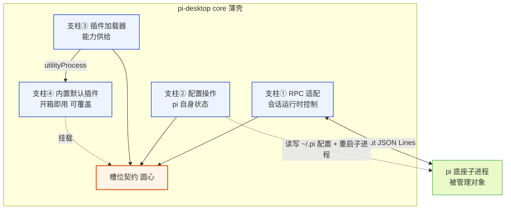
```mermaid
flowchart TB
    subgraph CORE["pi-desktop core 薄壳"]
        P1["支柱① RPC 适配<br/>会话运行时控制"]
        P2["支柱② 配置操作<br/>pi 自身状态"]
        P3["支柱③ 插件加载器<br/>能力供给"]
        P4["支柱④ 内置默认插件<br/>开箱即用 可覆盖"]
        SLOTS["槽位契约 圆心"]
        P1 --> SLOTS
        P2 --> SLOTS
        P3 --> SLOTS
        P4 -.->|挂载| SLOTS
    end
    PI["pi 底座子进程<br/>被管理对象"]
    P1 <-->|"stdin/stdout JSON Lines"| PI
    P2 -.->|"读写 ~/.pi 配置 + 重启子进程"| PI
    P3 -->|utilityProcess| P4
    classDef core fill:#eef4ff,stroke:#3b5bdb,stroke-width:1.5px;
    classDef slots fill:#fff4e6,stroke:#e8590c,stroke-width:2px;
    classDef pi fill:#e9fac8,stroke:#2f9e44;
    class P1,P2,P3,P4 core;
    class SLOTS slots;
    class PI pi;
```

**图 0 — 四根支柱与底座的关系：core 通过 RPC + 配置文件对接 pi，插件通过槽位挂载**

这四根支柱下面分头展开。

## 1 支柱①：对接 pi 的 RPC Mode

### 1.1 薄壳只走 RPC 一条路

#### 1.1.1 放弃同进程 import SDK

薄壳对接 pi 只走一条路：RPC Mode。pi 底座自带一个 `--mode rpc` 启动模式，起一个子进程，stdin 收 JSON 命令、stdout 吐 JSON 响应和事件流。这套东西本来就是为"把 agent 嵌进别的应用"设计的（`rpc-mode.ts` 文件头注释原话：`Used for embedding the agent in other applications`），pi-desktop 就是那个"别的应用"。薄壳不把 pi 的 SDK 娶进自己进程——现有方案 那条同进程 import `@earendil-works/pi-coding-agent` 的路被彻底放弃，连带放弃的是它被迫造的 WorkerManager、sdk-loader、sdk-manager、进程池、idle eviction 这一整套。那些复杂度几乎全部是"把 SDK 塞进自己进程"这个决定的副产物；走 RPC，它们一个都不需要。

#### 1.1.2 RPC 适配层照着 RpcClient 写

pi 底座还提供了一个现成的 `RpcClient`（`packages/coding-agent/src/modes/rpc/rpc-client.ts`），它是 RPC 协议的参考实现，pi-desktop 的 RPC 适配层应该照着它写、而不是照着 现有方案 的那一坨。`RpcClient.start()` 用 `spawn("node", [cliPath, "--mode", "rpc", ...args], { stdio: ["pipe", "pipe", "pipe"] })` 起进程，收 stderr 做调试、监听 `exit`/`error`、stdin 报错都接住、stdout 接 JSONL reader。它给每个命令分配 `req_${++requestId}` 的 id，写进 `pendingRequests` Map，响应回来按 id 配对 resolve——这套 id 配对机制是 RPC 客户端的标配，pi-desktop 照搬。

### 1.2 起子进程与 stdio 通道

#### 1.2.1 stdout 接管与裸写

RPC Mode 的入口是底座的 `runRpcMode(runtimeHost)`（`packages/coding-agent/src/modes/rpc/rpc-mode.ts`）。它做的第一件事是 `takeOverStdout()`——接管 stdout，因为 RPC 要独占 stdout 来吐 JSON Lines，不能让别的输出混进来污染协议。之后所有发给前端的东西都走 `writeRawStdout(serializeJsonLine(obj))`，即裸写一行 JSON 加换行。

#### 1.2.2 stdin 逐行读与 EOF 关闭

stdin 那边用 `attachJsonlLineReader(process.stdin, callback)` 逐行读，每读到一行就 `JSON.parse` 后交给 `handleInputLine`。stdin 的 EOF（`process.stdin` 的 `end` 事件）直接触发 shutdown——这意味着桌面端只要关掉 stdin 写端，底座子进程就会自己退，这是个干净的关闭通道。

#### 1.2.3 就绪窗口与进程生命周期

一个细节值得注意：`RpcClient.start()` 起完进程后 `await new Promise(r => setTimeout(r, 100))` 等 100ms 再检查 exitCode，给底座初始化时间。pi-desktop 起子进程时也要处理这个"进程起来了但还没就绪"的窗口，不能假设 spawn 返回就能立刻发命令。进程生命周期事件（`exit`/`error`/stdin 报错）都要接住，任何一个都可能是"底座挂了"的信号，RPC 适配层要能据此通知 UI、触发重连或提示用户。

### 1.3 起子进程的可调项

#### 1.3.1 RpcClientOptions 字段

`RpcClientOptions` 暴露的几个字段定义了 pi-desktop 起底座子进程时的全部可调项：`cliPath`（底座 CLI 入口路径，默认 `dist/cli.js`）、`cwd`（agent 的工作目录，就是用户打开的项目）、`env`（环境变量，OAuth 凭证、API key 往往走 env）、`provider`/`model`（启动时直接指定 provider 和 model，等价于 `--provider`/`--model` 命令行参数）、`args`（额外 CLI 参数）。pi-desktop 起底座时要让 `cwd` 跟随用户当前打开的项目目录，这样底座的 bash、文件工具、session 存储都落在正确的项目上下文里——这是薄壳的本分，底座自己会处理工作目录相关的一切，桌面不掺和。

#### 1.3.2 session resume 机制

**session resume 的机制**就在 `args` 里。底座 CLI 支持几个 session 选择参数（`main.ts:209` 起）：`--session <path>` 指定要打开的 session 文件路径、`--resume` 恢复该 cwd 下最近的 session、`--session-id <id>` 按 id 选 session（不能和前两者混用）。pi-desktop 重启 RPC 子进程时要 resume 同一个 session，就把当前 session 文件路径（从 `get_state` 的 `sessionFile` 拿）通过 `args: ["--session", sessionFile]` 传给新进程——新进程起来就打开那个 session 文件、历史和分叉树都在。不传任何 session 参数时，底座按默认行为（该 cwd 下最近 session 或新建）。这个机制是 2.4 热加载"重启子进程后 resume 同一 session"的操作落地——`sessionFile` 是闭环的关键参数。

#### 1.3.3 cliPath 的定位

`cliPath` 默认 `dist/cli.js` 是相对底座安装目录解析的，pi-desktop 打包时要把它指向随壳分发或用户安装的底座路径（5.2 的打包要处理底座 CLI 的发现/定位，不是硬编码 `dist/cli.js`）。

### 1.4 三类消息

#### 1.4.1 command / response / event 的区分

RPC 协议有三类消息，全部定义在 `rpc-types.ts`。第一类是 **command**，从 stdin 发给底座，每条带一个可选的 `id` 做关联。第二类是 **response**，从 stdout 回，`type: "response"`，带 `command`（回的是哪个命令）、`success`、可选的 `data` 或 `error`。第三类是 **event**，从 stdout 推，是底座 agent 运行时的事件流（`AgentSessionEvent`），没有 id、fire-and-forget，桌面端订阅着用。这三类共用同一条 stdout，靠 `type` 字段区分：`type === "response"` 且有 id 就去配对 pending request，否则当 event 转发给事件订阅者——`RpcClient.handleLine` 就是这么干的。

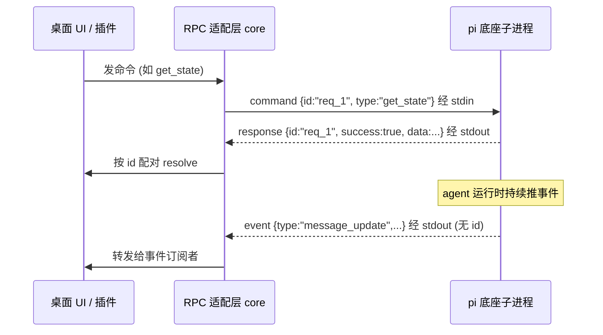
```mermaid
sequenceDiagram
    participant UI as 桌面 UI / 插件
    participant RPC as RPC 适配层 core
    participant PI as pi 底座子进程
    UI->>RPC: 发命令 (如 get_state)
    RPC->>PI: command {id:"req_1", type:"get_state"} 经 stdin
    PI-->>RPC: response {id:"req_1", success:true, data:...} 经 stdout
    RPC->>UI: 按 id 配对 resolve
    Note over PI: agent 运行时持续推事件
    PI-->>RPC: event {type:"message_update",...} 经 stdout (无 id)
    RPC->>UI: 转发给事件订阅者
```

**图 1 — RPC 三类消息时序：command 带 id 配对 response，event 无 id 直接转发**

#### 1.4.2 id 配对机制

桌面端发命令时分配递增的 `id`（如 `req_1`），写进 pending Map；底座的 response 带回同一个 id，按 id 取出 pending 的 resolve/reject。这套机制让"一个命令对应一个响应"的同步语义建立在异步的 stdin/stdout 通道上。timeout 兜底也挂在 id 上——`RpcClient.send` 给每个 pending 设了 30s 超时，超时自动 reject、清 pending，避免某个命令永远卡住。

#### 1.4.3 event 流的订阅模型

event 没有 id、是单向推送。RPC 适配层维护一个事件订阅者列表（`eventListeners`），每收到一个 event 就遍历转发给所有订阅者。桌面端（含插件）通过 `onEvent(listener)` 订阅、拿返回的取消订阅函数退订。这是发布-订阅模型，事件流是 core 的全局观察窗口——时间线渲染、状态栏、工具卡片都靠它。

### 1.5 命令集（31 个）

#### 1.5.1 Prompting 提示与流控制

- `prompt`：发一条用户消息，参数 `message`、可选 `images`、可选 `streamingBehavior`（`"steer" | "followUp"`，控制 agent 正在流式输出时这条消息怎么排队）。它是异步的——底座收到后立刻开始处理，但 success 响应要等 preflight（预检）通过才发。`rpc-mode.ts` 里 prompt 的处理是先 `void session.prompt(...)` 不等，传一个 `preflightResult` 回调，预检成功才 `output(success(id, "prompt"))`，预检失败才 `output(error(...))`。这个设计意味着桌面端发完 prompt 不能立刻假设它开始了，要等那条 success 响应——桌面 UI 上的"发送中"状态应该由这个响应驱动，而不是由发送动作本身驱动。
- `steer` / `follow_up`：独立排队命令。**关于 `streamingBehavior` 和独立 `steer`/`follow_up` 命令的关系**：`prompt` 在 agent idle 时直接处理（不需要 streamingBehavior）；但若 agent 正在 streaming，`prompt` **必须**带 `streamingBehavior`，否则底座报错"Agent is already processing. Specify streamingBehavior"（`agent-session.ts:1122`）——内部按 streamingBehavior 的值调 `steer()` 或 `followUp()`。所以 `prompt + streamingBehavior` 是"发消息，并声明 streaming 时的排队策略"；独立的 `steer`/`follow_up` 命令则是直接走排队语义（不带"idle 时直接处理"的 fallback）。桌面端大多数场景用 `prompt`：发消息前先查 `get_state` 的 `isStreaming`，idle 就直接 prompt、streaming 就带 streamingBehavior 发。steer/follow_up 留给桌面端明确只想排队、不想兜底处理的场景。
- `abort`：中止当前操作，无参数，走 `session.abort()`。
- `new_session`：开新 session，可选 `parentSession`（父 session 路径，做谱系追踪），返回 `{ cancelled: boolean }`——extension 可以取消 new session，所以 cancelled 要处理。

#### 1.5.2 State 状态查询

- `get_state`：拿当前 session 的完整状态快照，返回 `RpcSessionState`。这个结构是桌面端渲染状态栏、模型指示器、thinking level 显示的基础，字段包括：`model`（当前模型）、`thinkingLevel`、`isStreaming`（是否正在流式输出）、`isCompacting`（是否正在压缩上下文）、`steeringMode`/`followUpMode`（`"all" | "one-at-a-time"`）、`sessionFile`/`sessionId`/`sessionName`、`autoCompactionEnabled`、`messageCount`、`pendingMessageCount`（排队中的消息数）。桌面端连接底座后第一件事就该是 `get_state`，把 UI 同步到当前状态。

#### 1.5.3 Model 模型

- `set_model`：按 `provider` + `modelId` 切模型，底座会在可用模型里找匹配的，找不到返回 error。返回切到的那个 `Model`。
- `cycle_model`：循环到下一个模型，返回 `{ model, thinkingLevel, isScoped } | null`（null 表示没有可循环的）。
- `get_available_models`：拿可用模型列表，返回 `{ models: Model[] }`。这是桌面端模型选择器下拉项的数据源。

#### 1.5.4 Thinking 思考级别

- `set_thinking_level`：设思考级别，参数 `level: ThinkingLevel`。
- `cycle_thinking_level`：循环思考级别，返回 `{ level } | null`。

#### 1.5.5 Queue modes 队列模式

- `set_steering_mode`：设 steering 队列模式，`"all" | "one-at-a-time"`。
- `set_follow_up_mode`：设 follow-up 队列模式，同上。这两个控制多条排队消息时是全部处理还是只处理一条。

#### 1.5.6 Compaction 上下文压缩

- `compact`：手动触发上下文压缩，可选 `customInstructions`，返回 `CompactionResult`。
- `set_auto_compaction`：开关自动压缩，参数 `enabled: boolean`。

#### 1.5.7 Retry 重试

- `set_auto_retry`：开关自动重试，参数 `enabled`。
- `abort_retry`：中止进行中的重试。

#### 1.5.8 Bash

- `bash`：执行一条 bash 命令，参数 `command`、可选 `excludeFromContext`（是否不进 LLM 上下文，对应 `!!` 前缀），返回 `BashResult`。注意这是"用户通过桌面端执行的 bash"，和 agent 自己调 bash 工具是两回事——这个走 `session.executeBash()`，底座内部产生 `user_bash` 扩展事件（给底座 extension 用的 `ExtensionEvent`，**不在 RPC AgentSessionEvent 流里**、桌面插件无法订阅）。桌面端要知道"用户执行了 bash"靠的是自己发 `bash` 命令的响应，不涉及这个事件（见 4.8.4）。`!` 前缀（进上下文）和 `!!` 前缀（`excludeFromContext: true`，不进上下文）的区分通过这个参数控制。
- `abort_bash`：中止运行中的 bash。

#### 1.5.9 Session 会话管理

- `get_session_stats`：拿 session 统计，返回 `SessionStats`。
- `export_html`：把 session 导出成 HTML，可选 `outputPath`，返回 `{ path }`。
- `switch_session`：切到另一个 session 文件，参数 `sessionPath`，返回 `{ cancelled }`。切换成功后底座会 rebind session，桌面端要跟着重新订阅事件。
- `fork`：从某个 entry 分叉出新 session，参数 `entryId`，返回 `{ text, cancelled }`。
- `clone`：克隆当前活跃分支，返回 `{ cancelled }`。
- `get_fork_messages`：拿可分叉的消息列表，返回 `{ messages: [{ entryId, text }] }`。
- `get_entries`：拿 session 的全部 entry（追加序），可选 `since`（只拿某个 entry 之后的），返回 `{ entries, leafId }`。这是桌面端时间线渲染的主要数据源——增量拉取靠 `since`，首次全量靠不带 `since`。
- `get_tree`：拿 session 的 entry 树（分叉结构），返回 `{ tree, leafId }`。
- `get_last_assistant_text`：拿最后一条 assistant 消息的文本，返回 `{ text: string | null }`。
- `set_session_name`：设 session 显示名，参数 `name`，空名会报错。

**Messages**：

- `get_messages`：拿 session 全部消息（LLM 视角的完整消息流），返回 `{ messages: AgentMessage[] }`。和 `get_entries` 的区别：entries 是带分叉树的展示层条目，messages 是送给 LLM 的扁平消息流。

**Commands**：

- `get_commands`：拿当前可调用的命令（extension 注册的命令、prompt 模板、skills），返回 `{ commands: RpcSlashCommand[] }`。每条命令带 `name`、`description`、`source`（`"extension" | "prompt" | "skill"`）、`sourceInfo`。这是桌面端命令面板和斜杠命令自动补全的数据源。

这 31 个命令就是桌面端通过 RPC 能对底座做的全部事（1.5.1-1.5.9 逐组列出、1.5.10 给核心命令的调用契约）。PluginContext.rpc（3.2.4）为**常用命令**提供便捷方法（`prompt`/`getState`/`getEntries`/`getTree`/`getCommands`/`setModel`/`getAvailableModels`/`steer`/`followUp`/`abort` 等、返回中性类型），其余命令（`set_thinking_level`/`set_steering_mode`/`compact`/`bash`/`fork`/`clone`/`export_html` 等）经 `rpc.send(unknown)` 逃生舱发——**便捷方法覆盖高频命令，不与 31 命令一一对应**（不是"31 个命令各有专用方法"的假一一对应）。`send` 兜住全部 31 命令、便捷方法覆盖日常 90% 场景的强类型需求，两者分工。注意这里没有任何"管理 pi 自身"的命令——没有 list/enable/disable extension，没有读 settings，没有 reload config。这是有意为之的边界：RPC 只管会话运行时控制，"管理 pi 自身"走支柱②。这个边界一旦守住，桌面端就不会去碰底座的内部状态管理，底座怎么存 session、怎么执行工具、怎么加载扩展，桌面端一概不掺和。

#### 1.5.10 核心命令调用契约

上面按职责分组列了命令，这里把桌面端最常用的几个补全调用契约——参数结构、响应 data 结构、错误场景、桌面端典型用法，照着能写适配层。

**`prompt` 的完整契约**：

- 发送：`{ type: "prompt", message: string, images?: ImageContent[], streamingBehavior?: "steer" | "followUp", id }`
- 响应（成功）：`{ type: "response", command: "prompt", success: true }`（无 data，在预检通过后发）
- 响应（失败）：`{ type: "response", command: "prompt", success: false, error: string }`（预检失败，error 是原因）
- 错误场景：agent 正在 streaming 且没带 `streamingBehavior` → error "Agent is already processing. Specify streamingBehavior"；message 为空 → 预检失败
- 桌面端用法：发送前先 `get_state` 查 `isStreaming`；idle 直接发不带 streamingBehavior；streaming 带 `streamingBehavior: "followUp"`（追加到队尾）或 `"steer"`（转向）。success 响应回来才把 UI 输入框清空、置"agent 工作中"态。agent 的实际输出不在这个响应里——靠订阅 `message_*` event 流拿。

**`get_state` 的完整契约**：

- 发送：`{ type: "get_state", id }`
- 响应（成功）：`{ type: "response", command: "get_state", success: true, data: RpcSessionState }`，`RpcSessionState` 结构见 1.7.1
- 错误场景：极少失败（除非子进程已死）
- 桌面端用法：连接底座后第一件事；每次 `agent_settled` 后刷新状态栏；热加载重启子进程后重新拉。是"同步 UI 到底座真相"的基础，配合 `rpc.resync()`（3.2.4）一起用。

**`bash` 的完整契约**：

- 发送：`{ type: "bash", command: string, excludeFromContext?: boolean, id }`
- 响应（成功）：`{ type: "response", command: "bash", success: true, data: BashResult }`，`BashResult` 含 stdout/stderr/exitCode 等
- 错误场景：命令执行失败不是 RPC 错误（`success: true`、`BashResult.exitCode` 非 0）；只有"子进程崩了""命令超时"这类才 `success: false`
- 桌面端用法：4.8 终端插件用。`excludeFromContext` 控制是否进 LLM 上下文——`!` 前缀（进上下文）`excludeFromContext: false/省略`，`!!` 前缀（不进）`excludeFromContext: true`。和 agent 自己调 bash 工具区分（1.5.8）——这个是"用户发起的"，走命令响应；agent 的走 `tool_execution_*` event。

**`get_entries` 的完整契约**：

- 发送：`{ type: "get_entries", since?: string, id }`（`since` 是某 entry id，只返回它之后的）
- 响应（成功）：`{ type: "response", command: "get_entries", success: true, data: { entries: SessionEntry[], leafId: string | null } }`
- 错误场景：`since` 指向不存在的 entry → error "Entry not found: {since}"
- 桌面端用法：4.4 时间线插件用。首次全量（不带 `since`）；之后靠 `entry_appended` event 增量、或断线重连时用 `since: lastKnownEntryId` 拉增量补齐。`leafId` 是当前叶子节点（分叉树的当前位置），UI 据此高亮。

**`set_model` 的完整契约**：

- 发送：`{ type: "set_model", provider: string, modelId: string, id }`
- 响应（成功）：`{ type: "response", command: "set_model", success: true, data: Model }`（切到的模型）
- 响应（失败）：`{ ..., success: false, error: "Model not found: {provider}/{modelId}" }`
- 桌面端用法：4.9 模型参数插件用。下拉项来自 `get_available_models`；用户选后发 `set_model`，success 后还会收到 `model_select` event（source: "set"）——别乐观更新 UI，等 event 回来再确认（4.9.2）。

**`compact` 的完整契约**：

- 发送：`{ type: "compact", customInstructions?: string, id }`
- 响应（成功）：`{ type: "response", command: "compact", success: true, data: CompactionResult }`
- 错误场景：compaction 过程中出错（如 LLM 调用失败）→ success: false
- 桌面端用法：4.9 用。手动压缩按钮。压缩过程中底座会推 `compaction_start`/`compaction_end` event（带 reason），UI 显示进度。`customInstructions` 是给压缩 LLM 的额外指令（如"保留代码示例"）。

**Extension UI 子协议的调用契约**（1.9 的补充，从桌面端视角）：

- 底座发：`{ type: "extension_ui_request", id: string, method: "select"|"confirm"|..., ...methodSpecificFields }`
- 桌面端回：`{ type: "extension_ui_response", id: string, value: string }`（select/input/editor）| `{ id, confirmed: boolean }`（confirm）| `{ id, cancelled: true }`（取消）
- 关键：response 的 `id` 必须和 request 的 `id` 一致——底座按 id 配对（1.9.2 的 `pendingExtensionRequests` Map）。桌面端收到 request 后渲染交互、用户操作完用同一个 id 回 response。notify/setStatus/setWidget/setTitle/set_editor_text 这些 fire-and-forget 的不回 response。
- 错误场景：桌面端不回（用户没操作）、底座 timeout 自动 resolve 默认值——所以桌面端不必担心交互卡死底座，但也别故意不回（影响用户体验）。

这几个契约覆盖了桌面端 90% 的 RPC 调用场景。其余命令（cycle_model/set_thinking_level/set_steering_mode 等）结构同构——发送带参数、响应 `{ success, data? }`、UI 靠对应 event 确认，照这个模式套。`rpc.send`（3.2.4）是这些没有专用便捷方法时的逃生舱。

### 1.6 事件流全集

上面提到 event 是 stdout 推的 `AgentSessionEvent`，fire-and-forget，桌面端订阅着用。这个事件流是桌面端 UI 的实时数据源——时间线渲染、状态栏、工具卡片都靠它。这里把全部 event 类型列出来（来自 `agent-session.ts:128` 起的 `AgentSessionEvent` 联合类型定义），按用途分组：

#### 1.6.1 Agent 生命周期

- `agent_start`：一轮 agent 循环开始。
- `agent_end`：一轮 agent 循环结束，带 `messages: AgentMessage[]`（这一轮产生的全部消息）。
- `agent_settled`：agent 完全落定——没有自动重试、没有 compaction、没有排队续跑了。**这是桌面端判断"一轮真的结束了"的标志**，2.4 热加载用它判断能否安全重启子进程。

#### 1.6.2 Turn 与消息

- `turn_start` / `turn_end`：一个 turn 的开始/结束，带 `turnIndex`、`timestamp`（start）/`message`、`toolResults`（end）。
- `message_start` / `message_update` / `message_end`：消息的开始/流式更新/结束，带 `message: AgentMessage`。`message_update` 还带 `assistantMessageEvent`（token 级流式细节）。这是时间线渲染用户气泡和 assistant 气泡的核心事件。
- `entry_appended`：一个 entry 追加到 session，带 `entry: SessionEntry`。这是桌面端增量更新时间线的依据——收到这个就 append 一条，不用重新 `get_entries` 全量拉。

#### 1.6.3 工具执行

- `tool_execution_start`：工具开始执行，带 `toolCallId`、`toolName`、`args`。
- `tool_execution_update`：工具执行中的流式输出，带 `partialResult`。
- `tool_execution_end`：工具执行结束，带 `result`、`isError`。卡片渲染槽的渲染器靠这三个事件画工具卡片。

#### 1.6.4 Session 与模型

- `session_start`：session 启动/加载/重载，带 `reason: "startup" | "reload" | "new" | "resume" | "fork"`。重启子进程后桌面端会收到 reason: "startup" 或 "resume"。
- `session_info_changed`：session 名字变了，带 `name`。
- `model_select`：模型切换，带 `model`、`previousModel`、`source: "set" | "cycle" | "restore"`。
- `thinking_level_changed` / `thinking_level_select`：思考级别变化。

#### 1.6.5 队列与压缩

- `queue_update`：消息队列变了（新消息入队/出队）——桌面端据此更新"排队中 N 条"的显示。
- `compaction_start` / `compaction_end`：上下文压缩开始/结束，带 `reason: "manual" | "threshold" | "overflow"`。
- `auto_retry_start` / `auto_retry_end`：自动重试开始/结束，带 `attempt`、`maxAttempts`、`errorMessage`、`success`。

这套事件流就是桌面端"观察 pi"的全部窗口。桌面插件（包括内置的时间线插件 4.4、模型参数插件 4.9）通过 `PluginContext.events.on` 订阅这些事件，自己决定怎么渲染。core 不解释事件含义——event 的字段结构由底座定义，桌面端照单全收、按 type 分发。

### 1.7 关键返回类型字段

几个反复出现的返回类型，列出字段结构，桌面端 UI 渲染要照这些字段取数据：

#### 1.7.1 RpcSessionState

`get_state` 返回，状态栏/模型指示器数据源。字段：`model`（当前 Model，见 1.7.2）、`thinkingLevel`、`isStreaming`、`isCompacting`、`steeringMode`、`followUpMode`（`"all" | "one-at-a-time"`）、`sessionFile`、`sessionId`、`sessionName`、`autoCompactionEnabled`、`messageCount`、`pendingMessageCount`。

#### 1.7.2 Model

`set_model`/`get_available_models` 返回，模型选择器数据源。字段：`provider: string`（如 `"anthropic"`）、`id: string`（如 `"claude-sonnet-4-20250514"`）、`name: string`（展示名）、`reasoning: boolean`（是否支持扩展思考）、`input: ("text" | "image")[]`（支持的输入类型）、`contextWindow: number`、`maxTokens: number`、`cost: { input, output, cacheRead, cacheWrite }`（每百万 token 单价）、`thinkingLevelMap?`（思考级别到 provider 值的映射）。`ThinkingLevel` 的枚举是 `"minimal" | "low" | "medium" | "high"`。

#### 1.7.3 SessionStats

`get_session_stats` 返回。字段：`sessionFile`、`sessionId`、`userMessages`、`assistantMessages`、`toolCalls`、`toolResults`、`totalMessages`、`tokens: { input, output, cacheRead, cacheWrite, total }`、`cost: number`、`contextUsage?: { tokens, contextWindow, percent }`。这是会话统计面板的数据源。

#### 1.7.4 SessionInfo

`SessionManager.listAll()` 返回，会话列表数据源。字段：`path`、`id`、`cwd`（session 启动时的工作目录）、`name?`、`parentSessionPath?`（fork 来源）、`created: Date`、`modified: Date`、`messageCount`、`firstMessage: string`、`allMessagesText: string`。**注意**：这个类型来自底座内部的 `SessionManager.listAll()`（`session-manager.ts:1564`），但 RPC 的 31 个命令里**没有** `list_sessions`——这是和 reload 一样的缺口：底座内部有 list 能力、RPC 没开口子。6.2 记这个缺口，当前会话列表的取法见 4.6 的处置。

#### 1.7.5 SessionEntry / SessionTreeNode

`get_entries`/`get_tree` 返回，时间线/会话树数据源。`SessionEntry` 是时间线里的单条记录（用户消息、assistant 消息、工具调用、compact、custom 类型等），带 `id`、`type`、内容。`SessionTreeNode` 是会话分叉树的节点，结构：

```typescript
interface SessionTreeNode {
  entryId: string;              // 该节点对应的 entry id
  children?: SessionTreeNode[];  // 子节点（分叉点有多个、普通节点无或单子）
  isLeaf?: boolean;             // 是否当前活跃叶子（当前位置）
  label?: string;               // 节点标签（分叉点的摘要/用户命名）
}
```

会话树是嵌套结构（非平铺数组）——根节点是会话起点、children 是分支、isLeaf 标当前所在分支末端。`get_tree` 返回 `{ tree: SessionTreeNode[], leafId }`，4.6 会话树视图据此渲染可导航的分叉树。这两个结构是时间线渲染插件的核心数据模型。

#### 1.7.6 AgentMessage

`get_messages` 返回、`message_*`/`agent_end` event 携带。LLM 视角的消息结构，带 `role: "user" | "assistant" | "toolResult"`、`content: (TextContent | ImageContent)[]`（文本或图片内容块）、`toolCalls?`（assistant 消息发起的工具调用数组，每项带 `id`/`name`/`args`）、`toolCallId?`（toolResult 消息回指哪个工具调用）。这是 `message_*` event 里 `message` 字段的类型，时间线渲染 user/assistant 气泡靠它。`ImageContent` 是图片内容块（`{ type: "image", data: base64, mimeType }` 或 URL 形式，prompt 的 `images` 参数用这个结构）。

**敏感字段与 `content:sensitive` 权限**：AgentMessage 的 `content[]`（对话文本/图片）、`toolCalls[].args`（工具参数，可能含文件内容）是敏感字段。gateway/event-translator（5.1.5）翻译 pi 事件成中性 SessionEvent 时，按订阅插件的权限过滤——未声明 `content:sensitive` 权限的插件，收到的 event 里敏感字段置空（只保留 role/toolName 等元数据）。过滤点在 gateway 层、不在圆心（圆心不感知权限），也不在插件侧（插件无法绕过）。这防止恶意插件默默收对话内容外传（配合 `net:` 域名白名单）。

### 1.8 事件流边界：哪些收得到、哪些收不到

#### 1.8.1 AgentSessionEvent vs ExtensionEvent

要厘清一个边界，避免插件作者踩坑。RPC event 流（`session.subscribe` 转发出来的 `AgentSessionEvent`）覆盖 agent 运行时的全部状态变化——上面 1.6 列的那些。但底座还有一套**扩展事件**（`ExtensionEvent`，定义在 `extensions/types.ts`），那是给**底座 extension**用的（extension 的 `pi.on("tool_call")`/`pi.on("user_bash")` 等），**不在 RPC event 流里**。桌面插件通过 `PluginContext.events.on` 收的是经 gateway 翻译后的中性 `SessionEvent`（源自底座 `AgentSessionEvent` 流，见 5.1.5），收不到 ExtensionEvent。

#### 1.8.2 处理后状态可见

两者的关系：底座 extension 订阅 ExtensionEvent 做行为拦截（比如 extension 拦截 tool_call 改参数），它的处理结果会反映到 AgentSessionEvent 里（比如被改了参数的工具调用，桌面端在 `tool_execution_start` event 里看到的 args 就是改后的）。所以桌面端看到的 event 流是"底座 extension 处理过之后"的状态——桌面插件不参与底座 extension 的行为拦截，只观察结果。这个边界呼应 3.7：桌面插件只消费、不干预底座行为。


### 1.9 Extension UI 子协议

Extension UI 子协议是 RPC 对接里最精巧的部分，也是 GUI 能跟上底座交互的关键。底座的 extension 跑在底座进程里，它需要和用户交互——弹个选择框、要求确认、要输入、显示个状态、设个 widget。在 TUI 模式下这些直接画在终端上；在 RPC 模式下，底座把它们序列化成消息发给桌面端，桌面端翻译成原生 GUI 交互，再把结果回传。这套协议是双向的、有请求-响应配对的。

#### 1.9.1 extension_ui_request 方法集

底座发给桌面端的叫 `extension_ui_request`，定义在 `rpc-types.ts` 的 `RpcExtensionUIRequest` 联合类型，按 `method` 区分：

- `select`：弹选择框。字段 `title`、`options: string[]`、可选 `timeout`。桌面端要渲染一个选择列表，用户选了之后回 `{ value: string }`。
- `confirm`：弹确认框。字段 `title`、`message`、可选 `timeout`。桌面端回 `{ confirmed: boolean }`。
- `input`：弹输入框。字段 `title`、可选 `placeholder`、可选 `timeout`。桌面端回 `{ value: string }`。
- `editor`：弹多行编辑器。字段 `title`、可选 `prefill`。桌面端回 `{ value: string }`。这个和 input 的区别是它是多行编辑、给大段文本用的。
- `notify`：发个通知。字段 `message`、可选 `notifyType`（`"info" | "warning" | "error"`）。**fire-and-forget**，不需要回。
- `setStatus`：设状态栏文本。字段 `statusKey`、`statusText`（undefined 表示清除）。**fire-and-forget**。
- `setWidget`：设一个 widget（编辑器上方/下方的固定内容块）。字段 `widgetKey`、`widgetLines: string[] | undefined`、可选 `widgetPlacement`（`"aboveEditor" | "belowEditor"`）。**fire-and-forget**。注意 RPC 模式下 widget 只支持字符串数组——底座的 `setWidget` 还有一个重载接受 TUI 组件工厂，但 RPC mode 里那个被显式忽略了（`rpc-mode.ts` 里 `setWidget` 的实现：`if (content === undefined || Array.isArray(content))` 才发，组件工厂直接跳过）。这是 TUI 渲染吃不下问题的具体表现之一，后面支柱③会展开。
- `setTitle`：设窗口/标签标题。字段 `title`。**fire-and-forget**。
- `set_editor_text`：设编辑器文本。字段 `text`。**fire-and-forget**，桌面端可以拿它实现"agent 把内容填进输入框"。它的目标组件是 4.7 命令插件贡献的主输入框（renderer 组件），路由通道在 1.9.2 末尾钉死。

#### 1.9.2 extension_ui_response 与 id 配对

桌面端回给底座的叫 `extension_ui_response`，定义在 `RpcExtensionUIResponse`，三种形态：`{ value: string }`、`{ confirmed: boolean }`、`{ cancelled: true }`。每个 response 带一个 `id`，和 request 的 `id` 配对。

配对机制在 `rpc-mode.ts` 的 `createDialogPromise` 里。底座要弹一个对话框时，生成一个 `crypto.randomUUID()` 当 id，把 `{ resolve, reject }` 存进 `pendingExtensionRequests` Map，然后 `output({ type: "extension_ui_request", id, ...request })` 发出去。桌面端收到 request 后，由 core main 的 extension-ui 适配层处理——但这个适配层**只做协议解析 + 向 renderer 发渲染指令**，不碰 React、不画模态框（gateway 层按纪律不 import React/renderer）。具体职责分层：

- **gateway/extension-ui.ts（协议边界，不碰 React）**：解析底座的 `extension_ui_request` 消息（拆 method/字段）、维护 id 配对（和 rpc-adapter 的 `RequestCorrelator` 同一个模式，1.4.2/5.1.4）、把渲染指令经 MessagePort 转发给 renderer 侧的 extension-ui 渲染组件、收到 renderer 回的 response 后组装成 `extension_ui_response` 发回底座。这层只处理协议、不渲染。
- **shell/renderer/extension-ui-modal.tsx（渲染层，React 模态框）**：renderer 侧的独立渲染组件，订阅 gateway 发来的渲染指令，把 select/confirm/input/editor 翻译成 React 模态框在 renderer 最上层渲染（React portal + ErrorBoundary，遵循 1.9.4 焦点管理）——不是 Electron 原生 dialog、而是 React 组件（统一风格、可走主题 4.11、可无障碍）。notify/setStatus 等也在这层翻译成 renderer 的通知/状态栏更新。用户操作完，这个渲染组件经 MessagePort 把结果回给 gateway、由 gateway 发回底座。

这样 gateway 不碰 React（依赖方向守住：gateway 只依赖 domain、不 import shell 的 React），跨层桥（gateway main → renderer 的 MessagePort）由 shell/renderer/extension-ui-modal.tsx 负责接收渲染指令、画模态、回传结果。模态归属的槽位是 shell/renderer 层自己的顶层 portal、不进桌面插件的槽位注册表（Extension UI 是底座发起的交互、不是桌面插件的贡献项）。底座的 `handleInputLine` 收到 `extension_ui_response` 类型的行，按 id 从 Map 里取出 pending，resolve 掉那个 Promise——extension 的代码就这么拿到用户的回答了。这条 Extension UI 的渲染路径和"桌面插件自己的 UI"完全独立——extension_ui_request 来自底座 stdout、经 gateway 协议解析、由 shell/renderer 模态组件渲染、不经过桌面插件的槽位系统。这套机制还支持 `timeout`（超时自动 resolve 默认值）和 `AbortSignal`（信号触发也 resolve 默认值），所以桌面端不必担心某个交互永远卡住——底座自己有兜底。

**`set_editor_text` 的路由钉死**——它是这套子协议里唯一一个目标不是 `extension-ui-modal.tsx` 模态框、而是 4.7 命令插件主输入框（renderer 组件）的请求，所以单独说明它怎么从 gateway 到达输入框，避免"底座发起的交互要落到插件贡献的组件上、中间却没有定义通道"的歧义：

- **路由通道**：gateway/extension-ui.ts 解析出 `method: "set_editor_text"` 后，**不**经 extension-ui-modal 的模态渲染通道转发，而是经一条 core 提供的固定 channel `core:editor-text` 广播到 renderer 侧。这条 channel 是 core main → renderer 的 MessagePort 上一个保留的固定 topic，名字稳定不变、由 core 拥有（不是某个插件私有的 topic）。
- **订阅方**：4.7 命令插件的主输入框组件在 renderer 侧通过 `RendererPluginContext.onMessage("core:editor-text", ...)`（3.2.5）订阅这条 channel，收到 `{ text }` 后把文本填进输入框。主输入框是命令插件的渲染贡献项，但它订阅的是 core 提供的固定 channel、不是命令插件自己 publish 的私有 topic——所以 gateway 不需要知道"哪个插件提供了输入框"。
- **为什么用 core 固定 channel 而不是命令插件 bus topic**：`set_editor_text` 是底座经 RPC 发起的交互（1.9 子协议），发起方是底座不是插件，不该依赖某个桌面插件是否激活/是否订阅了某个 bus topic。core 提供固定 channel 让"底座设主输入框文本"这条能力始终可达（只要命令插件激活，输入框就订阅着），gateway 只负责往固定 channel 转发、不耦合具体插件。这等价于把"主输入框"提升为一个 core 约定的 editor 槽（输入框不是普通插件槽位、而是 core 提供的 editor 槽契约，命令插件填充实现），`set_editor_text` 自然落到这个 editor 槽。
- **fire-and-forget 不变**：set_editor_text 仍是 fire-and-forget，gateway 广播完即结束、不等输入框确认收到；输入框未激活（命令插件被禁用）时这条广播自然落空，不报错——和 notify 等其它 fire-and-forget 请求一致。

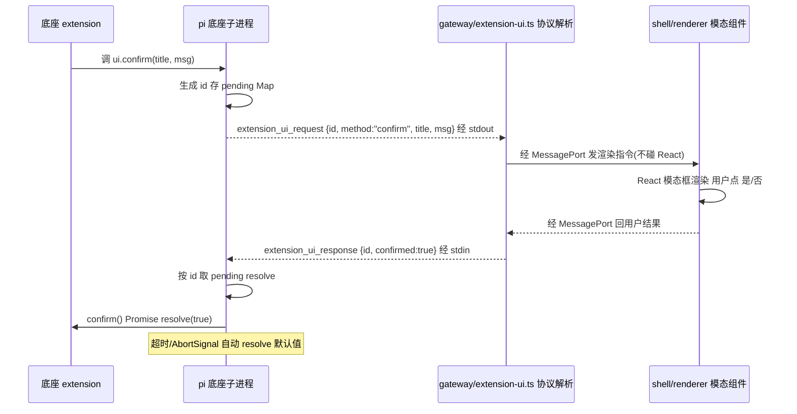
```mermaid
sequenceDiagram
    participant EXT as 底座 extension
    participant PI as pi 底座子进程
    participant GW as gateway/extension-ui.ts 协议解析
    participant UI as shell/renderer 模态组件
    EXT->>PI: 调 ui.confirm(title, msg)
    PI->>PI: 生成 id 存 pending Map
    PI-->>GW: extension_ui_request {id, method:"confirm", title, msg} 经 stdout
    GW->>UI: 经 MessagePort 发渲染指令(不碰 React)
    UI->>UI: React 模态框渲染 用户点 是/否
    UI-->>GW: 经 MessagePort 回用户结果
    GW-->>PI: extension_ui_response {id, confirmed:true} 经 stdin
    PI->>PI: 按 id 取 pending resolve
    PI->>EXT: confirm() Promise resolve(true)
    Note over PI: 超时/AbortSignal 自动 resolve 默认值
```

**图 2 — Extension UI 请求-响应配对时序：id 关联，底座侧有 timeout 兜底**

#### 1.9.3 表达力上限

这套子协议覆盖了大部分 GUI 交互需求。但它的表达力有上限：widget 只能传字符串数组、不能传结构化组件，set_editor_text 是单向的（`getEditorText` 在 RPC 模式下直接返回空字符串，因为同步方法没法等 RPC 响应）。这些限制是 RPC 模式的固有边界——它够覆盖"对话框式"交互，覆盖不了"agent 在桌面上画一个动态自定义组件"。后者是桌面插件自己的领地，不该指望 RPC 提供。**底座 extension 要在桌面展示富 UI（表格/图表/自定义组件）的解法**：不依赖 RPC 的 setWidget，而是把数据吐出来（通过 `notify` 发消息、或靠 `tool_execution_*` event 推送），让桌面插件订阅并自己画。这是 3.7"消费而非翻译"的体现——extension 提供数据、桌面插件负责 UI。

#### 1.9.4 焦点管理与无障碍规范

Extension UI 的对话框（select/confirm/input/editor）和桌面端所有模态（命令面板 4.7、设置页、review 模式 4.10）遵循统一的无障碍焦点规范：

- **打开**：模态弹出时焦点自动移到第一个可交互元素（如输入框、第一个选项）。
- **Tab 陷阱**：Tab 在模态内循环（到最后一个元素跳回第一个）、Shift+Tab 反向，不跳出模态到背景。
- **Esc 关闭**：Esc 等同取消（对应 extension_ui_response 的 `{ cancelled: true }`）。
- **关闭后还原**：焦点还原到打开模态的触发元素。
- **键盘可达**：时间线条目（4.4 虚拟滚动）支持上/下箭头遍历 + Enter 操作；会话树（4.6）支持箭头展开/折叠；侧栏 Tab 支持快捷键切换。所有 contribution item 要键盘可用、不只靠鼠标。

这些是 core 渲染层 + pi.ui 组件库的规范、不是底座的事。pi.ui 组件库（4.11.4）内置 focus trap 能力（推荐 react-focus-lock 等库），插件用 pi.ui 组件自动获得；自定义元素要自己遵循。这条补的是"无障碍是规范、不是可选"——之前文档只说交互不说可达性。

### 1.10 边界：RPC 只管运行时控制

#### 1.10.1 支柱①的职责清单

把这一节收一下。支柱①的职责，且仅此：起 `pi --mode rpc` 子进程、在子进程和 UI 之间收发 JSON Lines（command/response/event）、把 Extension UI 子协议的协议解析归 gateway/extension-ui.ts（渲染指令转发给 shell/renderer 的模态组件画、见 1.9.2 的职责分层）、把 event 流转发给 UI 渲染。底座已有的能力桌面端不重写：session 怎么存（磁盘上的 session 文件）、工具怎么执行、文件怎么改、扩展怎么加载——全是底座子进程的内部事务，桌面端通过 RPC 触发、通过 event 观察，但不接管实现。

#### 1.10.2 守不住边界会怎样

这个边界守不住，薄壳就会变厚。现有方案 就是反面教材：它把 SDK 娶进自己进程，于是 session 存储、扩展加载、工具执行这些本该是底座内部事务的东西，它都得自己管一份，Worker 进程池、sdk-loader、sdk-manager 就是这么长出来的。pi-desktop 走 RPC，这些一个都不需要——底座子进程自己管自己的内部状态，桌面端只管发命令、收事件。

唯一的代价是桌面端没法做"底座内部 reload"——RPC 没暴露这个命令。这个缺口在支柱②处理，当前兜底是重启 RPC 子进程（新进程从磁盘重读配置，等于变相 reload），演进项是底座补 reload RPC 命令后改为无重启热加载（6.1）。

## 2 支柱②：操作 pi 的配置文件与热更新热加载

RPC 管会话运行时，配置文件管 pi 自身的状态。桌面端要让用户能装/卸/启停扩展、改模型默认值、配置 MCP、管理项目信任——这些操作改的不是当前会话，而是 pi 的持久化状态，落点全部在磁盘上的配置文件。支柱②就是桌面端读写这些文件、改完让 pi 生效的能力。它和支柱①是两条独立的通道：RPC 是运行时控制、配置文件是状态管理，两条路归不同的进程机制管，但桌面端在 UI 上把它们呈现为一个统一的"管理 pi"面板。

### 2.1 两份配置与合并规则

#### 2.1.1 全局与项目级 settings

pi 的配置分两份，一份全局、一份项目级。全局在 `~/.pi/agent/settings.json`，项目级在 `<cwd>/.pi/settings.json`（`CONFIG_DIR_NAME` 是 `.pi`）。两份都是 JSON，schema 完全一样，靠 `SettingsManager` 合并。合并规则在 `settings-manager.ts` 的 `deepMergeSettings`：以全局打底，项目级覆盖，嵌套对象递归合并（`{ ...baseValue, ...overrideValue }`），数组和原始值整体替换。也就是说项目级 settings 不会和全局的数组合并拼接——项目级只要写了 `extensions`，就完全替换全局的 `extensions` 数组。这个语义桌面端在 UI 上要表达清楚：项目级的扩展列表是"覆盖"不是"追加"。

**关于图 3 的"内置默认值"第三层**：图 3 把合并画成三层输入（内置默认值 → 全局 → 项目级），这是**示意性的视觉表达**——"内置默认值"不是磁盘上的第三份 settings 文件、也不是 `deepMergeSettings` 的第三个合并源。它的实际含义是：底座代码里对 `Settings` 各字段有内置默认值（字段省略时取的 fallback，如 `defaultProjectTrust` 省略时是 `"ask"`），全局 settings 文件本身就是在这套内置默认值之上覆盖来的。`deepMergeSettings` 合并的实质是"全局（已含内置默认值打底）+ 项目级"两份文件的合并，不是三层独立源参与 deepMerge。数组合并的"整体替换"规则对内置默认值不单独适用——内置默认值只是字段省略时的 fallback，不参与数组拼接/替换的判定。图中画"内置默认值"节点是为了让读者看到"全局不是从零开始的、它本身就建立在底座内置默认值之上"，不是第三个合并源。

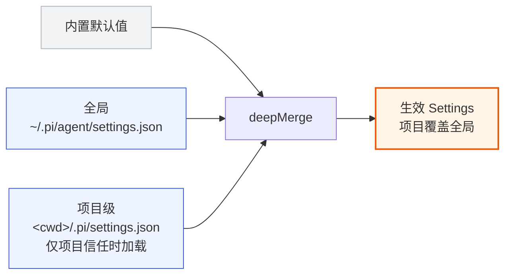
```mermaid
flowchart LR
    A["内置默认值"] --> M["deepMerge"]
    G["全局<br/>~/.pi/agent/settings.json"] --> M
    P["项目级<br/>&lt;cwd&gt;/.pi/settings.json<br/>仅项目信任时加载"] --> M
    M --> R["生效 Settings<br/>项目覆盖全局"]
    classDef def fill:#f1f3f5,stroke:#adb5bd;
    classDef file fill:#eef4ff,stroke:#3b5bdb;
    classDef res fill:#fff4e6,stroke:#e8590c,stroke-width:2px;
    class A def;
    class G,P file;
    class R res;
```

**图 3 — 配置合并优先级：内置打底、全局覆盖、项目级最上（需项目信任）**

#### 2.1.2 项目信任前置

合并有个前置条件：**项目信任**。项目级 settings 只有在项目被信任时才加载——`SettingsManager.loadFromStorage` 里 `if (scope === "project" && !projectTrusted) return {}`。不信任的项目，它的 `.pi/settings.json` 被直接忽略，防止恶意项目通过配置文件注入。桌面端的"项目信任"管理就是控制这个开关（后面支柱④的终端与项目信任插件处理 UI）。settings 写入也受信任约束：`assertProjectTrustedForWrite` 在写项目级配置时检查，不信任就拒绝。文件并发用 `proper-lockfile` 做文件锁（`FileSettingsStorage.acquireLockSyncWithRetry`，最多重试 10 次、每次等 20ms），保证桌面端和底座同时写一个文件不打架。

#### 2.1.3 Settings 字段

`Settings` 的字段（`settings-manager.ts:83`）是桌面端配置编辑器的 schema 来源，关键的几个：

- `defaultProvider` / `defaultModel` / `defaultThinkingLevel`：默认 provider、模型、思考级别。模型选择器改默认值就是写这三个字段。
- `transport`：`"auto" | "sse" | "websocket"`，HTTP 传输方式。
- `steeringMode` / `followUpMode`：`"all" | "one-at-a-time"`，队列模式。
- `theme`：主题名。
- `compaction`：`{ enabled?, reserveTokens?, keepRecentTokens? }`，上下文压缩策略。
- `retry`：`{ enabled?, maxRetries?, baseDelayMs?, provider?: { timeoutMs?, maxRetries?, maxRetryDelayMs? } }`，重试策略。
- `extensions: string[]`：**本地扩展文件/目录路径列表**——这是扩展安装的落点之一。增删路径 = 装卸扩展。
- `packages: PackageSource[]`：**npm/git 包源**，每个可以是字符串（加载全部资源）或对象（`{ source, autoload?, extensions?, skills?, prompts?, themes? }`，过滤要加载哪些资源）。这是扩展安装的另一个落点，面向通过 npm/git 分发的扩展包。
- `skills: string[]` / `prompts: string[]` / `themes: string[]`：本地 skill/prompt/theme 路径。
- `enabledModels: string[]`：模型循环的范围（和 `--models` CLI 同格式）。
- `sessionDir: string`：自定义 session 存储目录。
- `httpProxy` / `httpIdleTimeoutMs` / `websocketConnectTimeoutMs`：网络相关。
- `defaultProjectTrust`：`"ask" | "always" | "never"`，默认是否信任新项目（仅全局）。
- `enableAnalytics` / `trackingId` / `enableInstallTelemetry`：分析相关。

#### 2.1.4 其他状态文件

除了 settings.json，pi 在 `~/.pi/agent/` 下还有别的状态文件：auth 凭证（`auth-storage.ts` 管理的，OAuth token、API key）、项目信任记录（`trust-manager.ts` / `project-trust.ts`）、MCP 配置。这些和 settings.json 一样，都是桌面端"管理 pi"的操作对象。桌面端管 auth 时调的是底座的 auth-storage 能力（通过 RPC 的 OAuth 流或直接读写凭证文件），管 trust 时读写 trust 记录，管 MCP 时读写 MCP 配置文件。它们的共同点是：改完都要让底座生效，走下一节的热加载。

### 2.2 热加载是显式的，不是 watch

#### 2.2.1 没有 watch，必须显式 reload

一个容易踩的坑：以为改了配置文件 pi 会自动热加载。**不会**。pi 没有对配置目录做持久 file watcher——`fs.watch` / `chokidar` 在 pi 里只用在 footer 渲染、theme 这类非配置场景（`utils/fs-watch.ts`），配置文件改了不会自动触发任何东西。热加载是显式调用 `reload()` 才发生的。

#### 2.2.2 三个 reload 的调用链

pi 内部有三个 reload，分头管不同的资源：

- `SettingsManager.reload()`（`settings-manager.ts:479`）：从磁盘重读 settings.json（全局和项目级），重新 deepMerge。它只重读配置值，不重新加载扩展。
- `ResourceLoader.reload()`（`resource-loader.ts:338`）：重新 discover 和 load extensions/skills/themes/prompts。它内部会先 `await this.settingsManager.reload()` 拿最新配置，再按新配置重新发现资源。这是"改了扩展列表后让 pi 重新加载扩展"的真正入口。
- `AgentSession.reload()`（`agent-session.ts:2544`）：绑定新的 extension runtime、重发 `session_start` 事件（reason: `"reload"`）、刷新工具注册。它内部调 `settingsManager.reload()` 和 `_resourceLoader.reload()`。这是最上层的 reload，extension 的 `ctx.reload()` 最终就是调到它。

这三个 reload 的调用关系是 `AgentSession.reload` → `ResourceLoader.reload` → `SettingsManager.reload`，越往下越底层。桌面端要触发底座热加载，理论上需要调最上层的 `AgentSession.reload`——但问题来了：**这三个 reload 都是进程内部方法，没有一个通过 RPC 暴露给外部**。RPC 的 31 个命令里没有 reload。这就是支柱②的核心缺口。

### 2.3 扩展启停的真相

#### 2.3.1 没有启停开关，只有路径增删

顺带把"扩展怎么装/启停"说清楚，因为它直接落在 settings 上，是支柱②最常被触发的事。pi 没有"启用/禁用单个 extension"的独立开关——没有 `extensions: [{ name, enabled }]` 这种结构。启停就是增删路径列表：

- 装一个本地扩展：把它的路径加进 `Settings.extensions` 数组，调 `setExtensionPaths`（全局）或 `setProjectExtensionPaths`（项目级），然后 reload。
- 卸一个本地扩展：从 `extensions` 数组移除路径，reload。
- 装 npm/git 扩展包：加进 `Settings.packages`，调 `setPackages` / `setProjectPackages`，reload。
- 装主题/skill/prompt：同理加进 `themes`/`skills`/`prompts`，reload。

#### 2.3.2 UI 开关背后的数据层

也就是说，pi 的"扩展管理"在数据层就是路径列表的增删，"启用"=在列表里、"禁用"=不在列表里。桌面端的扩展管理 UI 看起来是开关列表，背后是路径数组的增删 + reload。现有方案 的 extensions handler 基本就是转发这套（读写 settings + 触发生效），pi-desktop 的内置管理 UI 插件也走同一条路——因为它没有别的路可走，底座就是这么设计的。

### 2.4 桌面端的热加载路径

#### 2.4.1 决策：重启 RPC 子进程

缺口确认了：底座的 reload 没对外开口子，桌面端没法通过 RPC 让底座 reload。三个选项里——重启 RPC 子进程、改底座加 reload RPC 命令、调 pi CLI——决策是**重启 RPC 子进程**。理由是零改底座、确定性强、立即可用，不依赖 pi 源码改动或发版。

具体路径：桌面端改完配置（settings.json、扩展路径列表、trust 记录、auth、MCP 配置），写回磁盘，然后杀掉当前 `pi --mode rpc` 子进程，重新起一个。新进程启动时从磁盘重读全部配置、重新 discover 扩展——这就等于一次完整的 reload。代价是重启那一瞬，当前会话的运行态会中断：正在流式输出的 agent 会被打断、排队的消息会丢。但 session 本身持久化在磁盘上（session 文件在 `sessionDir`，默认 `~/.pi/agent/sessions/` 或项目配置的目录），新进程起来后用同一个 session 文件 resume，消息历史和分叉树都在，只是"正在进行的那个 turn"丢了。对于"改配置"这种低频操作，这个代价可以接受。

#### 2.4.2 带判断的重启决策

为了让这个代价可控，桌面端要做的不是无脑重启，而是**带判断的重启**——而且判断口径要和 7.3 的语义一致：重启会丢的是底座进程**内存队列里尚未处理的消息**（pending），不只是"正在流式输出的那个 turn"。所以重启安全守卫统一用"是否已落定"语义，不看单一的 `isStreaming`：

- 守卫条件是 `agent_settled` 已触发（等价于 `isStreaming === false && pendingMessageCount === 0`）——即 agent 既不在流式输出、内存队列里也没有已入队但尚未处理的 steer/followUp 消息。只有这个条件成立才走"直接重启"分支。
- 只要 `pendingMessageCount > 0`（哪怕 `isStreaming === false`），按 streaming 同样提示用户"改动需要重启底座生效，当前有 N 条排队消息未处理，是否打断"——因为重启会静默丢掉这些已排队用户输入（7.3 承认 pending 是内存队列、重启即丢、且因语义依赖入队时状态不 replay）。让用户决定打断还是等 `agent_settled` 再重启。
- 如果 `isStreaming === true`，同样提示用户"当前 agent 正在工作，是否打断"。不打断就先攒着改动、等 `agent_settled` 再重启。
- 重启后桌面端第一件事是调 `resync()` 拉取 state+entries+tree+commands，把 UI 同步回 session 当前状态。

**为什么 idle 分支也查 `pendingMessageCount`**：wait 分支用的是 `agent_settled`（队列排空才触发），而第一版 idle 分支只看 `isStreaming`——两者判定口径不一致，idle 分支漏掉 pending 场景，会在"agent 不在流式输出但队列里还压着用户消息"时静默丢消息。统一改成"已落定"语义（`agent_settled` 已触发 / `isStreaming === false && pendingMessageCount === 0`）后，两个分支的判定口径对齐，不再有静默丢失已排队用户输入的窗口。

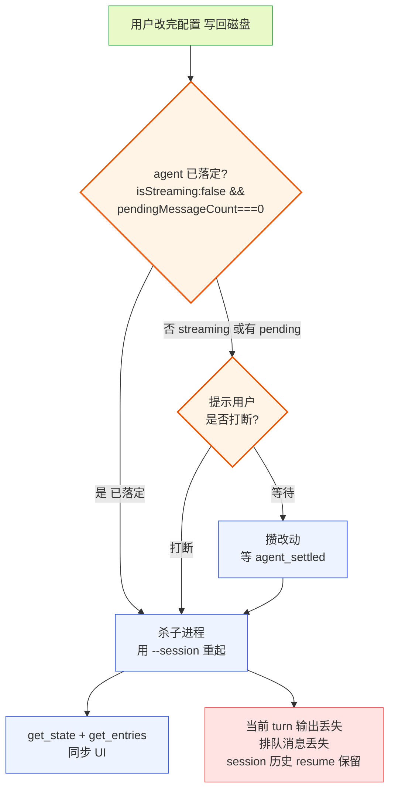
```mermaid
flowchart TD
    START["用户改完配置 写回磁盘"] --> CHECK{"agent 已落定?<br/>isStreaming:false &&<br/>pendingMessageCount===0"}
    CHECK -->|是 已落定| RESTART["杀子进程<br/>用 --session 重起"]
    CHECK -->|否 streaming 或有 pending| PROMPT{"提示用户<br/>是否打断?"}
    PROMPT -->|打断| RESTART
    PROMPT -->|等待| WAIT["攒改动<br/>等 agent_settled"]
    WAIT --> RESTART
    RESTART --> SYNC["get_state + get_entries<br/>同步 UI"]
    RESTART --> LOSS["当前 turn 输出丢失<br/>排队消息丢失<br/>session 历史 resume 保留"]
    classDef start fill:#e9fac8,stroke:#2f9e44;
    classDef dec fill:#fff4e6,stroke:#e8590c,stroke-width:2px;
    classDef act fill:#eef4ff,stroke:#3b5bdb;
    classDef warn fill:#ffe3e3,stroke:#fa5252;
    class START start;
    class CHECK,PROMPT dec;
    class RESTART,SYNC,WAIT act;
    class LOSS warn;
```

**图 4 — 热加载重启决策：已落定（isStreaming:false 且 pendingMessageCount:0）才直接重启，streaming 或有 pending 都提示用户，session resume**

#### 2.4.3 桌面插件配置走另一路

桌面插件自己的配置改了，不走这条重启路径——走支柱③加载器的热重载，只重载那一个插件、不动底座子进程。两路分开，因为它们归不同的进程机制管：底座配置归底座子进程（要重启）、桌面插件配置归桌面加载器（热重载）。这是 2.1 说的"两条独立通道"在热加载上的具体体现。

### 2.5 桌面"管理端"管底座 extension 的操作链路

#### 2.5.1 五步操作链路

把前面几节串成一条完整的操作链路，这是桌面"管理端"管底座 extension 时的真实流程。用户在桌面端的"扩展管理"界面点"启用某个底座 extension"：

1. 桌面端读到这个 extension 的路径（从 packages 源解析、或用户指定本地路径）。
2. 桌面端调 `SettingsManager` 的等价能力（直接读写 `~/.pi/agent/settings.json` 或 `<cwd>/.pi/settings.json`），把路径加进 `extensions` 数组，写回磁盘。这一步走的是支柱②的配置文件操作，不是 RPC。
3. 桌面端判断 agent 是否已落定（`isStreaming === false && pendingMessageCount === 0`）；已落定则重启 RPC 子进程，streaming 中或有 pending 消息则等 `agent_settled` 或提示用户（判定口径见 2.4.2）。
4. 新子进程起来，从磁盘重读 settings（含新加的扩展路径），ResourceLoader 重新 discover 加载该 extension。
5. 桌面端 `get_state` + `get_entries` 同步 UI，新扩展注册的工具/命令通过 `get_commands` 拿到、出现在命令面板里。

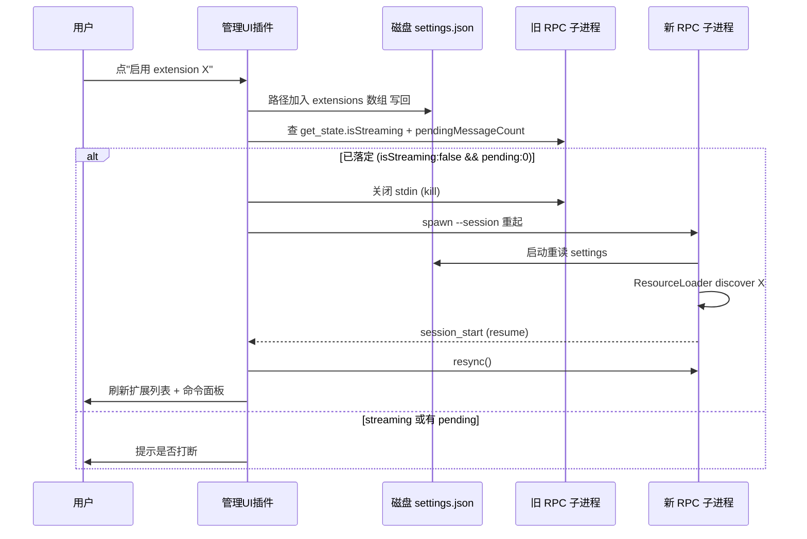
```mermaid
sequenceDiagram
    participant U as 用户
    participant UI as 管理UI插件
    participant FS as 磁盘 settings.json
    participant OLD as 旧 RPC 子进程
    participant NEW as 新 RPC 子进程
    U->>UI: 点"启用 extension X"
    UI->>FS: 路径加入 extensions 数组 写回
    UI->>OLD: 查 get_state.isStreaming + pendingMessageCount
    alt 已落定 (isStreaming:false && pending:0)
        UI->>OLD: 关闭 stdin (kill)
        UI->>NEW: spawn --session 重起
        NEW->>FS: 启动重读 settings
        NEW->>NEW: ResourceLoader discover X
        NEW-->>UI: session_start (resume)
        UI->>NEW: resync()
        UI->>U: 刷新扩展列表 + 命令面板
    else streaming 或有 pending
        UI->>U: 提示是否打断
    end
```

**图 5 — 管理端管底座 extension 的操作链路：写文件 → 重启子进程 → 同步 UI**

#### 2.5.2 共享状态 + 重启消费者模式

这条链路里，桌面端是"操作者"，底座子进程是"被操作对象"，磁盘配置文件是两者的共享状态。桌面端不直接调底座的 reload 方法（调不到），而是通过"改文件 + 重启进程"间接达成。这就是"管理 pi 自身"在 RPC 架构下的真实形态——没有 RPC 命令能一步到位，靠的是"写共享状态 + 重启消费者"这个模式。

#### 2.5.3 统一列表两路分发

UI 上这一切呈现为一个统一的扩展列表。用户看到的只是"有哪些扩展、哪些开着"，不区分某个扩展是底座 extension 还是桌面 UI 插件。但架构上，背后分两个来源、走两条链路：

- 是底座 extension → 走本节这条链路（写 settings + 重启子进程）。
- 是桌面 UI 插件 → 走支柱③的加载器（桌面自己的发现/加载/热重载，底座子进程不参与）。

这个"统一列表、两路分发"的设计呼应了前面定下的边界：桌面插件只管桌面 UI 不碰底座行为，底座 extension 走底座自己的加载机制。用户不必关心归谁管，桌面端在管理 UI 里负责正确地分发。

## 3 支柱③：desktop 插件系统本身

插件系统是 pi-desktop 的心脏，也是它和 现有方案 拉开差距的地方。这一节要讲透三件事：为什么只有一套插件体系（而不是 现有方案 那种"extension + adapter"两层）、插件长什么样、加载器要做什么。前两件定抽象，第三件定实现，都要做到能照着写代码的程度。

### 3.1 唯一一套插件体系

#### 3.1.1 现有方案 翻车的根

先认清楚 现有方案 翻车的根。底座本来就有一套 extension 机制：TS 模块，factory 函数 `(pi: ExtensionAPI) => void`，jiti 动态加载，能 `on/registerTool/registerCommand/registerShortcut/registerFlag/registerMessageRenderer/registerEntryRenderer/registerProvider`，能订阅三十多种事件（session/tool/context/agent/input/model…），发现路径是项目级 `<cwd>/.pi/extensions/` → 全局 `~/.pi/agent/extensions/` → 显式配置。这是一套**完整的、能跑代码的**插件机制。那 现有方案 为什么还要再造 adapter？

因为底座 extension 的 UI 渲染能力（`ToolDefinition.renderCall/renderResult`、`registerMessageRenderer`）返回的是 `@earendil-works/pi-tui` 的 `Component`——终端 TUI 组件树。现有方案 是 Electron/Web，吃不下 TUI Component。于是 现有方案 退而求其次，造了一套纯 JSON 的 adapter（34 个 `.adapter.json`，全在 `src/extension-compat/builtin/`，第三方无法自带），用声明式映射描述"这个底座扩展的某种交互在桌面上用哪个组件呈现"。后果是：同一个扩展被劈成两半——行为归底座 extension、外观归 现有方案 adapter；第三方扩展想在桌面有像样的 UI，光写 extension 不够，还得给 现有方案 仓库贡献 adapter.json，等 现有方案 发版才能带上；adapter 被钉死成纯 JSON，动态需求做不了，留的 `customRenderer` 逃生舱全仓库只有 `skills-manager`/`mcp-diagnostics` 两个硬编码实现走通。

#### 3.1.2 不做翻译层

这个根的本质是：现有方案 把自己定位成"底座 extension 的 UI 翻译层"。一旦这么定位，它就必然要处理底座 extension 那套 TUI 渲染机制吃不下的问题，于是必然要造 adapter 当中间层。pi-desktop 不做这个定位。pi-desktop 的立场是：**桌面插件是桌面端的唯一一套插件体系，纯管理、纯 UI；pi 底座是被管理对象，不是另一套插件体系**。底座 extension 在桌面上怎么呈现，由桌面插件自己决定怎么呈现 pi 经 RPC 吐出来的数据，不是把底座的 TUI 渲染翻译过来。这就像 VSCode 不管 Git 这个外部进程有没有"自己的插件"——Git 对 VSCode 来说只是"能通过 Git CLI 触达的一组能力"。pi 底座对桌面插件也是这个地位：被管理对象、能力来源，不是要被适配的同胞插件体系。

#### 3.1.3 消解 adapter

这个立场一旦立住，现有方案 的 adapter 整个就不需要了——没有"翻译底座 extension UI"这件事，自然不需要 adapter 这层中间产物。桌面插件自己贡献 UI、自己调 RPC 拿数据、自己渲染。一个底座 extension 如果想在桌面有 UI，做法不是给它配 adapter，而是写一个桌面插件，这个插件通过 RPC 观察该 extension 注册的工具/命令/事件，自己决定怎么呈现。这是单向的、桌面插件主动的，不是双向翻译。

### 3.2 插件抽象：manifest + 可选代码 + contribution

一个桌面插件由三部分组成：一份 manifest（`plugin.json`）、一段可选的代码模块、它声明的 UI 贡献项。这三部分各有归属，关键设计在"可选代码"——这正是吸取 现有方案 adapter 教训的核心。

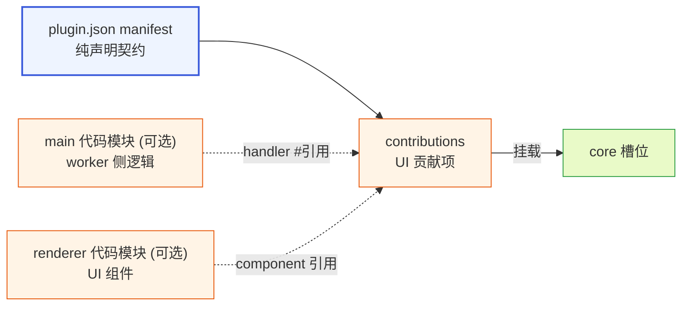
```mermaid
flowchart LR
    M["plugin.json manifest<br/>纯声明契约"]
    MAIN["main 代码模块 (可选)<br/>worker 侧逻辑"]
    REN["renderer 代码模块 (可选)<br/>UI 组件"]
    CONTR["contributions<br/>UI 贡献项"]
    M --> CONTR
    MAIN -.->|"handler #引用"| CONTR
    REN -.->|"component 引用"| CONTR
    CONTR -->|挂载| SLOTS["core 槽位"]
    classDef decl fill:#eef4ff,stroke:#3b5bdb,stroke-width:2px;
    classDef code fill:#fff4e6,stroke:#e8590c;
    classDef res fill:#e9fac8,stroke:#2f9e44;
    class M decl;
    class MAIN,REN,CONTR code;
    class SLOTS res;
```

**图 6 — 插件三部分：manifest 声明契约，main/renderer 可选代码模块，contributions 引用并挂载到槽位**

#### 3.2.1 manifest（plugin.json）

**manifest（plugin.json）** 是插件和 core 之间的契约，纯声明。它写清楚这个插件叫什么（`id`/`version`/`displayName`）、它要贡献哪些 UI 贡献项（contributions）、它依赖哪些 core 能力、它的优先级。core 读 manifest，才知道往哪个槽位挂什么、以什么优先级挂。manifest 是静态的、可被校验的、可被审核的——一个不带代码模块的插件，manifest 就是它的全部，core 读完就知道怎么挂，不需要执行任何插件代码。这保证了"声明式插件"的简单和安全：声明式插件不需要沙箱、不需要加载代码、不依赖运行时，core 纯粹按 manifest 配置 UI。现有方案 把 adapter 钉死成纯 JSON 是错在"把所有插件都降级成纯声明"，而不是"纯声明本身有错——纯声明是默认形态之一，不该是唯一形态。

#### 3.2.2 代码模块（可选）

**代码模块（可选）** 是插件需要动态行为时才带的。什么时候需要动态行为？侧栏 Tab 里放一个会实时刷新的 dashboard（要订阅 RPC event 流、要定时拉数据）、命令面板项点一下执行一段逻辑（要发 RPC 命令、要处理响应）、工具卡片要嵌入自定义渲染（要拿到 tool_execution 事件、要按自定义规则画）。这些光靠 manifest 声明做不到，必须跑代码。代码模块是一个 TS/JS 模块，导出一个 activate/deactivate 生命周期函数，core 在受控环境里加载它（3.6 的 utilityProcess worker）。带不带代码模块，是插件作者按需选择的，不是两套系统。

#### 3.2.3 UI 贡献项（contributions）

**UI 贡献项（contributions）** 是 manifest 里声明的、往 core 预定槽位挂的具体东西。这是"一个插件如何贡献桌面外观"这件事的统一表达。现有方案 把它拆成 adapter（外观）和 extension（行为）两套并行概念，这里收成一份清单：contributions 是清单的项，每项指向一个槽位、带这个槽位需要的数据。带代码模块的插件，contributions 可以引用代码模块导出的渲染器/处理器；不带的，contributions 引用 core 内置的默认渲染器。

这里的关键设计纪律（呼应 §1.3 和 §1.4）：**不带代码和带代码不是两套并列系统，是同一抽象的两种形态**。区别只在"这个插件带不带代码模块"，由这个内容涌现，不靠一个 `kind: "declarative" | "code"` 字段来标记。

这里要厘清一个容易混的点：`main` 字段的有无，确实会让 core 走不同分支（有 `main` 就加载代码模块、起 worker、调 activate；没有就纯按 manifest 挂贡献项）。这看起来像"if-else 分支"，但和反对 `kind` 字段不矛盾——区分在于 `kind` 和 `main` 是两种性质完全不同的东西。`kind` 是纯类型戳：它本身不携带任何行为，只是让引擎拿它去 switch 分支，行为是引擎按戳查表得来的，戳和内容可以不一致（声明 `kind: "code"` 但根本没有代码模块，或反过来）。`main` 是内容引用：它指向一段真实存在的代码模块文件，"有没有 main"等于"有没有这个文件"，是客观的内容事实，不是声明出来的标签。core 看 `main` 在不在，是在读内容（这个文件存在吗），不是在读一个声明出来的类型戳。换句话说，行为不是"core 按 kind 查表分发"出来的，而是"代码模块自己 activate 时注册出来的"——core 只是决定要不要去加载那段真实代码。这就是内容驱动 vs 类型戳 switch 的区别：`kind` 让引擎按声明分发行为，`main` 让内容自己产生行为、core 只负责加载。

落到贡献项处理上：每个贡献项要么引用内置渲染器（manifest 里直接声明用哪个内置的，比如 `"renderer": "builtin.markdown"`），要么引用插件代码模块导出的自定义渲染器（`"renderer": "#myRenderer"`，`#` 前缀表示从本插件代码模块导出的）。core 统一查这个引用——引用内置的就不加载代码、引用自定义的就去找代码模块、找不到或加载失败就降级到内置渲染器。这是内容驱动的降级，不是按 kind switch。引入 `kind` 字段重蹈 现有方案 的覆辙：把"带不带代码"这个内容事实硬塞成一个声明戳，让戳和内容可能不一致，徒增复杂度。

manifest 的字段结构（借鉴 VSCode 的 `contributes`，但精简到桌面端需要的）：

```json
{
  "id": "session-manager",
  "version": "0.1.0",
  "displayName": "会话管理",
  "main": "./index.ts",
  "renderer": "./ui.ts",
  "contributes": {
    "sidePanel": [
      { "id": "sessions", "label": "会话", "icon": "messages-square", "component": "SessionsPanel" }
    ],
    "commands": [
      { "id": "session.new", "title": "新建会话", "keybinding": "cmd+n", "handler": "#onNewSession" }
    ],
    "settings": [
      { "id": "sessions", "title": "会话设置", "component": "SessionSettings" }
    ]
  }
}
```

字段说明：

- `id`（必填，string）：插件唯一标识，全局唯一，用于插件级覆盖判定（3.4）。
- `version`（必填，string）：语义化版本。
- `displayName`（必填，string）：展示名，同时是 fallback 文案。core 渲染插件展示名时，先按固定 key `plugin.{id}.displayName` 去语言槽查当前 locale 的翻译（如 `plugin.session-manager.displayName`），查到就用翻译；查不到就 fallback 到 `displayName` 字段的字面值。所以字面值填什么有意义——它是没有翻译时的兜底显示（比如内置插件填中文 `"会话管理"`，没有对应 locale 翻译时就显示这个中文）。第三方插件只填字面值、不贡献翻译也正常工作。`contributes` 里贡献项的 `label`/`title` 同理（key 约定是 `{slot}.{pluginId}.{itemId}.label`）。
- `main`（可选，string）：worker 侧代码模块入口（相对插件根目录）。**插件根目录** = `plugin.json` 所在目录（本地手写插件）或 npm 包 `package.json` 的 `pi.desktop` 字段指向的目录（外部插件，3.9）。省略表示该插件没有 worker 侧逻辑。导出 `activate`/`deactivate`（见下面 PluginContext）。
- `renderer`（可选，string）：renderer 侧 UI 模块入口。省略表示该插件用内置渲染器、不自带 UI 组件。导出按命名导出，每个导出名是一个组件（如 `SessionsPanel`、`SessionSettings`）。
- `permissions`（可选，string[]）：声明本插件需要的额外权限。沙箱默认只给 `rpc`/`events`/`bus`/`config`/`i18n`/`http.fetch(白名单域名)`，要更多能力必须在此声明、由用户在管理 UI 授权。取值是枚举字符串：`"fs:{读写插件的 data 目录}"`（默认就有，不用声明）、`"fs:project"`（读写当前项目目录）、`"fs:global"`（读写 `~/.pi`，慎用）、`"net:域名"`（允许 http.fetch 该域名，如 `"net:api.github.com"`）、`"child:command"`（执行特定子进程命令）。用户授权后 core 才把对应能力注入 PluginContext，未声明未授权的能力调用会抛错。这把沙箱权限做成显式声明 + 用户授权，不是隐式放行。

  **权限细分**（数据隐私需求，3.2.4 数据隐私页）：`fs:project` 可细分为 `"fs:project:read"`（只读，文件预览用）/ `"fs:project:write"`（写，文件编辑器直写用）；`fs:global` 同理细分。另外加 `"content:sensitive"`——声明后插件才能在订阅的 SessionEvent 里看到消息文本内容（对话内容、文件内容等敏感字段）；未声明的插件收到的 event 里敏感字段为空。这防止恶意插件默默偷对话内容外传（配合 net 权限的域名白名单）。`content:sensitive` + `net:` 同时声明时管理 UI 要重点提示用户"此插件能读你的对话并外发到 X 域名"。
- `contributes`（可选，object）：按槽位分组的贡献项数组。每个槽位的贡献项 schema 见 3.3。贡献项里引用组件用 `component` 字段填 renderer 模块的导出名（如 `"SessionsPanel"`），引用 handler 用 `handler` 字段填 worker 模块的导出名（`#` 前缀，如 `"#onNewSession"`）——`#` 前缀表示"从本插件代码模块导出"。这样 3.6 的双入口就能定位到正确的侧：`component` → renderer 模块、`handler` → worker 模块。
- `author`（可选，string）：插件作者标识。分发场景用于溯源，本地手写插件可不填。
- `source`（可选，string）：分发来源溯源串。格式 `"npm:<包名>"`（npm 渠道）或 `"file:<url>"`（.pidesktop 渠道）。本地手写插件不填、来源标记是 `local`。installer（3.9）靠它做更新检查和卸载溯源。详见 3.9.3。
- `homepage`（可选，string）：插件主页 URL。更新提示、管理 UI 展示用。
- `dependsOn`（可选，`Array<string | { id: string; minVersion?: string }>`）：声明本插件依赖哪些插件先加载/激活。值是依赖描述数组，每项既可以是插件 id 字符串（如 `"timeline"`，向后兼容旧形态），也可以是对象形式（如 `{ "id": "timeline", "minVersion": "1.2.0" }`，声明最低版本）。加载器按依赖图拓扑排序 activate 顺序——被依赖的先 activate、依赖者后 activate（3.5.9）。**依赖判定按 id 不按版本做严格约束**——只要任何来源（project/user/installed/builtin）有该 id 的插件生效，依赖 id 判定就满足；插件级覆盖（3.4，同 id 高优先级整体替换低优先级）不影响依赖判定——覆盖后该 id 仍存在（是高优先级版本）。只有"该 id 完全没有任何版本生效"才算依赖缺失 → 本插件加载失败、标错、不拖垮整壳（3.5 第 6 项错误隔离）。循环依赖（A 依赖 B、B 依赖 A）→ 检测到环、标错、环上的插件都禁用。

  **minVersion 是可选的自保手段、不是强制语义化版本约束**：声明了 `minVersion` 时，加载器在拓扑排序阶段做一次最低版本比对——生效的该 id 插件的 `version` 低于 `minVersion` 时，视为依赖不满足，本插件标错禁用、给出可读原因（"依赖 timeline >=1.2.0，但生效版本 1.0.3 不满足"）。版本比对按语义化版本的 major.minor.patch 数字比较（非语义化版本字符串原样比较，比不了就视为不满足并提示）。不声明 `minVersion`（用字符串形式或省略 minVersion 字段）时不做版本检查、只查 id 存在性——这是默认的宽松形态，避免给作者增加负担。这个字段让插件能可靠地编排"我要用 timeline 的 entryId 锚点、且需要 1.2 引入的锚点稳定 API"这类跨插件依赖，而不是假设加载顺序或版本。

`main` 和 `renderer` 都省略 = 纯声明式插件（贡献项的 `component`/`handler` 引用内置实现，如 `"component": "builtin.markdown"`）。只省一个 = 单侧插件。都有 = 完整双入口插件。这个组合自然覆盖所有形态，不需要 `kind` 字段。

manifest 校验（3.5 第 3 步）会检查：`id`/`version`/`displayName` 必填；`contributes` 里每个槽位名是已知槽位、贡献项字段符合该槽位 schema；`component`/`handler` 引用的导出名在对应入口模块（`main`→worker、`renderer`→renderer）里确实存在（加载后校验，加载前只查 `main`/`renderer` 文件存在性）。

#### 3.2.4 PluginContext 接口（worker 侧）

**PluginContext 接口**——`activate(context)` 收到的 context，是 worker 侧插件能调用的全部 API。这是盲测点名的最大接口缺口，这里钉死：

```typescript
interface PluginContext {
  /** 插件自己的元信息 */
  plugin: { id: string; version: string; rootDir: string };
  /** RPC 适配层——发命令给底座子进程，便捷方法返回中性类型（见 5.1.5），未覆盖命令走 send 逃生舱 */
  rpc: {
    prompt(message: string, opts?: { images?: ImageContent[]; streamingBehavior?: "steer" | "followUp" }): Promise<void>;
    steer(message: string, images?: ImageContent[]): Promise<void>;
    followUp(message: string, images?: ImageContent[]): Promise<void>;
    abort(): Promise<void>;
    getState(): Promise<SessionState>;
    setModel(provider: string, modelId: string): Promise<ModelInfo>;
    getAvailableModels(): Promise<ModelInfo[]>;
    getEntries(since?: string): Promise<{ entries: MessageEntry[]; leafId: string | null }>;
    getTree(): Promise<{ tree: TreeNode[]; leafId: string | null }>;
    getCommands(): Promise<CommandInfo[]>;
    // 便捷方法只覆盖高频命令，不与 31 命令一一对应；其余命令（set_thinking_level/compact/bash/fork 等）经 send 发。
    // 返回值一律用圆心中性类型（SessionState/ModelInfo/MessageEntry/TreeNode/CommandInfo，见 5.1.5）
    send(command: unknown): Promise<unknown>; // 通用逃生舱，参数/返回用 unknown 不绑底座协议类型（见 5.1.5 例外说明；不用泛型 <T>，返回始终是 unknown、调用方自己断言）。命中未知命令（不在 handshake availableCommands 清单）时 reject 一个 UnsupportedCommandError，插件可 catch 并自行降级（见 6.4.3）
    resync(): Promise<SyncSnapshot>; // 重新拉 state+entries+tree+commands 同步 UI（见 3.2.4 末尾原语）
  };
  /** 受限网络通道——走 core main 代理，受 permissions 域名白名单约束 */
  http: { fetch(url: string, opts?: RequestInit): Promise<Response> };
  /** 订阅底座 event 流——回调收中性 SessionEvent（圆心自有，gateway 翻译 pi 事件成它，见 5.1.5） */
  events: {
    on(listener: (event: SessionEvent) => void): () => void; // 返回取消订阅
  };
  /** 插件间事件总线——发布订阅，和 RPC events 两套。fire-and-forget、无缓冲、无历史回放：
   *  subscribe 前发布的消息订阅不到、后来的 subscribe 收不到过去的消息。
   *  若需可靠收到 B 的消息：① 用 dependsOn 声明依赖（B 先 activate，见 3.5），
   *  ② B activate 后发"已就绪"信号、A activate 时立刻 subscribe 再查询 B 状态。
   *  要传历史状态用 RPC event 流(1.6 有历史)或插件自己的 config 持久化，别指望 bus。 */
  bus: {
    publish(topic: string, payload: unknown): void;
    subscribe(topic: string, listener: (payload: unknown) => void): () => void;
  };
  /** 读写本插件配置（隔离在插件自己的目录，不碰 pi settings） */
  config: {
    get<T>(key: string): T | undefined;
    set<T>(key: string, value: T): Promise<void>;
    all(): Record<string, unknown>;
  };
  /** i18n——从语言槽取文案 */
  i18n: {
    t(key: string, vars?: Record<string, unknown>): string;
    locale: string;
  };
  /** 把数据推给 renderer 侧的组件——worker→renderer 的主动推送通道 */
  emitToRenderer(channel: string, data: unknown): void;
  /** 收 renderer 侧 postToWorker 推来的消息（与 emitToRenderer 对称，worker 侧用 onRendererMessage 收、renderer 侧用 onMessage 收，命名区分两侧避免混淆，需插件自己约定 channel 语义） */
  onRendererMessage(channel: string, cb: (data: unknown) => void): () => void;
  /** 注册贡献项的运行时补充（manifest 静态声明之外，插件运行时动态注册的） */
  register(contribution: DynamicContribution): void;
  /** 注册清理回调，deactivate 时自动调用（和 deactivate 二选一，便于资源管理） */
  onDeactivate(fn: () => void): void;
}
```

这个接口就是 worker 侧插件的全部能力边界——沙箱只暴露这些，`require`/`fs`/`process` 都不可见，`fetch` 也不可见（3.5 第 7 项）——网络访问走 `context.http`（受限、要声明权限，见下）。`rpc.send` 是逃生舱：core 没有为某个 RPC 命令单独包方法时，插件可以直接发任意 `RpcCommand`、拿回原始 `RpcResponse`。`emitToRenderer` 是 worker 主动推数据给 UI 组件的通道。`register` 让插件能动态注册贡献项（不只是 manifest 静态声明），比如某个插件根据配置决定挂不挂某个侧栏 Tab——`DynamicContribution` 的形状是 `{ slot: SlotName, contribution: ContributionItem }`，`slot` 指明挂哪个槽位（如 `"commands"`），`contribution` 是该槽位的贡献项（和 manifest 里静态 contribution 同结构，如 `{ id, title, handler }`），core 校验后挂进对应槽位注册表。

补几个之前留白的细节：`rpc.prompt()` 的 Promise 在**预检通过时就 resolve**（不是 agent 处理完）——它 resolve 只代表"底座接受了这条 prompt、开始处理了"，agent 的输出要靠订阅 `message_*` event 流拿，agent 结束靠 `agent_settled`。预检失败时 reject。`config` 存储在 `~/.pi-desktop/plugins-data/{pluginId}/config.json`（用户级）和 `<cwd>/.pi-desktop/plugins-data/{pluginId}/config.json`（项目级），合并规则同 settings（项目覆盖用户）。`http` 是受限网络通道：`http.fetch(url, opts)` 走 core main 代理、受 manifest `permissions` 声明的域名白名单约束（3.5 第 7 项），不直接暴露全局 fetch。

**core 提供的可复用原语**——盲审发现文档里反复出现三个模式却各写一遍（能持有就持有最弱），这里收成 core 持有的共享实现，插件/各场景调用同一份、不各写：

- `context.rpc.resync(): Promise<SyncSnapshot>`——重启子进程（2.4）、会话切换/分叉（4.6.3）、模型重载后都要"调 `resync()` + `get_tree` + `get_commands` 同步 UI"。这个编排收进 `resync()`：内部并发发这组命令、返回统一快照 `SyncSnapshot`、广播给所有订阅的插件。三处场景都调它，不各自拼命令。`SyncSnapshot` 结构：`{ state: SessionState, entries: MessageEntry[], tree: TreeNode[], leafId: string | null, commands: CommandInfo[] }`——一次拿到全部同步所需数据，**字段全部中性**（圆心自有类型，底座类型 `RpcSessionState`/`SessionEntry`/`SessionTreeNode`/`RpcSlashCommand` 经 gateway 的 `toSessionState()`/`toMessageEntry()`/`toTreeNode()`/`toCommandInfo()` 翻译后才进快照，见 5.1.5）。
- `RequestCorrelator<T>`——RPC command-response 配对（1.4.2）和 Extension UI request-response 配对（1.9.2）是同一个模式：生成 id → 存 pending Map → 按 id resolve、带 timeout/AbortSignal 兜底。抽成工具类，两处持有同一实现实例化使用（一个用递增 id、一个用 UUID，只是 id 生成器不同）。
- `resolveByPriority<T>(items, getPriority): T`——插件级覆盖（3.4）和贡献项级冲突仲裁（3.5 第 8 项）规则一致（都按 project > user > installed > builtin，3.4 的完整优先级含 installed 外部插件），文档自己承认。抽成共享仲裁函数，两个粒度的调用点共用，不各写仲裁逻辑。

这三个原语由中层（RPC 适配层/加载器）提供、圆心不感知——它们是"用例编排"层的复用，不是圆心契约。插件通过 PluginContext 拿到 `rpc.resync`；`RequestCorrelator`/`resolveByPriority` 是 core 内部工具、不对插件暴露（插件不需要）。

**关于 `steer`/`followUp` 在 PluginContext.rpc 里的定位**——它们就是 1.5 列出的 31 个命令里的 `steer`/`follow_up`（在 Prompting 分组），不是 31 之外的额外命令。PluginContext.rpc 把它们单列为便捷方法，只是 API 封装（`rpc.steer(msg)` 等价于 `rpc.send({ type: "steer", message: msg })`），让插件作者不用记 `rpc.send` 的命令字面量。"31 个命令"是底座 RPC 协议的全部对外命令，但 PluginContext.rpc 的方法集**不与之一一对应**——便捷方法只覆盖高频命令，未覆盖的命令走 `send` 逃生舱（见 3.2.4 末尾原语上方的便捷方法清单）。

#### 3.2.5 renderer 侧插件接口

**renderer 侧插件接口**——盲测点名的最大缺口，这里钉死。renderer 侧的 UI 组件收到的 `pi` 对象（通过 React Context 或 props 注入），接口如下：

```typescript
interface RendererPluginContext {
  plugin: { id: string; version: string };
  /** RPC 转发——内部走 MessagePort 给 worker（有 main 时）或直接给 core main（无 main 时）再发底座 */
  rpc: {
    send(command: unknown): Promise<unknown>;
    // 常用命令的便捷封装，同 worker 侧，但都经 MessagePort 转发；返回中性类型
    getState(): Promise<SessionState>;
    getEntries(since?: string): Promise<{ entries: MessageEntry[]; leafId: string | null }>;
    // ...其余按需暴露，和 worker 侧 rpc 便捷方法集一致（非 31 命令一一对应，见 3.2.4）
  };
  /** 订阅底座 event 流——core main 内置默认转发，纯 renderer 插件也能收（见下文数据流）；回调收中性 SessionEvent（非底座 AgentSessionEvent，见 5.1.5） */
  events: { on(listener: (event: SessionEvent) => void): () => void };
  /** 收 worker 侧 emitToRenderer 推来的数据 */
  onMessage(channel: string, cb: (data: unknown) => void): () => void;
  /** 往 worker 发消息（worker 侧用 context.onRendererMessage 收，需插件自己约定） */
  postToWorker(channel: string, data: unknown): void;
  i18n: {
    t(key: string, vars?: Record<string, unknown>): string;  // 文案 + 复数（vars.count，见 4.2.5）
    locale: string;
    formatDate(date: Date, opts?: Intl.DateTimeFormatOptions): string;  // 4.2.5 日期格式
    formatNumber(num: number, opts?: Intl.NumberFormatOptions): string;  // 4.2.5 数字格式
  };
  /** 当前主题 token 值映射（主题槽合并产生，见 4.11）——自定义元素时读，优先用 pi.ui 自带主题组件 */
  theme: Theme;
  /** core 提供的 UI 组件库——Button/Input/Dialog/Icon 等，自带主题、保证插件 UI 视觉一致 */
  ui: { Button: React.FC<...>; Input: React.FC<...>; Dialog: React.FC<...>; Icon: React.FC<{ name: string }>; /* ... */ };
}
// 注：rpc/events 的类型同 PluginContext（5.1.5 中性化）——send 用 unknown、events 收中性 SessionEvent、
// getState 返回中性 SessionState，圆心不绑底座协议类型。worker↔renderer 收发命名对称区分：
// worker 侧用 onRendererMessage 收 renderer 的 postToWorker；renderer 侧用 onMessage 收 worker 的 emitToRenderer。
```

#### 3.2.6 事件如何到达渲染组件

**事件如何到达渲染组件**——盲测第 6 条问得对，这里钉死数据流。渲染组件拿底座事件有三条路，按推荐顺序：

- **core 内置默认 event→renderer 转发**（首选，纯 renderer 插件用）：core main 订阅底座 event 流，默认把 event 转发给所有 renderer 侧插件运行时上下文。所以**只有 `renderer`、没有 `main` 的插件**也能通过 `pi.events.on` 直接收 `tool_execution_*` 等 event——不需要 worker 中转。这让"纯渲染 cardRenderer"成立：manifest 只写 `renderer`、组件里 `pi.events.on` 订阅 `tool_execution_*` 自己画，零 worker。
- **worker 处理后推送**（要加工数据时用）：插件有 `main`、worker 侧 `events.on` 收 event、做转换/聚合、`context.emitToRenderer(channel, data)` 推加工后的数据给组件，组件 `pi.onMessage(channel, cb)` 收。适合"要把多个 event 聚合成 dashboard 数据"这种。
- **core 调度、props 传入**（cardRenderer 场景用）：卡片渲染槽的组件，core 在匹配到这个渲染器、渲染某个工具调用卡片时，把该工具调用的事件数据当 props 传入组件。**注册在 cardRenderers 槽位的组件自动走这条路——组件不用自己订阅 event，core 喂数据**。这是 cardRenderer 最省事的路径，也是推荐路径（路径二只用于要加工数据、路径一用于不在 cardRenderers 槽位但要观察事件流的纯 renderer 插件）。

cardRenderer 组件的 props 契约（第三条路自动传入）。**这里有个依赖方向纪律（呼应洋葱架构）**：圆心（槽位契约）不 import pi 的类型——cardRenderer 的 props 用的是 core 自己定义的中性事件接口（`ToolCallStart`/`ToolCallUpdate`/`ToolCallEnd`），不是 pi 的 `ToolExecutionStartEvent` 等。RPC 适配层（中层）负责把 pi 的 event 翻译成圆心的中性接口——这样圆心不绑死 pi 的类型系统、依赖只向内。pi 协议改了，只动中层的翻译、不动圆心契约和插件层。同理 `when` clause 的条件变量（`agent.idle` 等）也是 core 维护的中性 contextKeys（派生自 `RpcSessionState` 但不直接暴露 pi 类型）。

```typescript
// 圆心定义的中性事件接口（不 import pi 类型）
// domain/events/tool-call.ts —— 工具执行事件（cardRenderer props 契约用）
interface ToolCallStart { toolCallId: string; toolName: string; args: unknown }
interface ToolCallUpdate { toolCallId: string; partialResult: unknown }
interface ToolCallEnd { toolCallId: string; result: unknown; isError: boolean }

// domain/events/session.ts —— Agent/消息/Turn/Session/模型/队列/压缩/重试中性事件
// 对应底座 AgentSessionEvent 流（1.6），圆心逐条枚举、不留"其余"
interface SessionEvent {
  type: string;                 // 判别字段，取值见下各事件
  // 通用：timestamp 来自底座事件
}
interface AgentStart { type: "agent_start"; turnIndex: number; timestamp: string }
interface AgentEnd { type: "agent_end"; turnIndex: number; messages: NeutralMessage[] }
interface AgentSettled { type: "agent_settled" }                    // 一轮完全落定
interface TurnStart { type: "turn_start"; turnIndex: number; timestamp: string }
interface TurnEnd { type: "turn_end"; turnIndex: number; message: NeutralMessage | null }
interface MessageStart { type: "message_start"; message: NeutralMessage }
interface MessageUpdate { type: "message_update"; message: NeutralMessage; assistantMessageEvent?: unknown }
interface MessageEnd { type: "message_end"; message: NeutralMessage }
interface EntryAppended { type: "entry_appended"; entry: MessageEntry }
interface SessionStart { type: "session_start"; reason: "startup" | "reload" | "new" | "resume" | "fork" }
interface SessionInfoChanged { type: "session_info_changed"; name: string }
interface ModelSelect { type: "model_select"; model: ModelInfo; previousModel: ModelInfo | null; source: "set" | "cycle" | "restore" }
interface ThinkingLevelChanged { type: "thinking_level_changed"; level: ThinkingLevel }
interface ThinkingLevelSelect { type: "thinking_level_select"; level: ThinkingLevel }
interface QueueUpdate { type: "queue_update"; pendingCount: number }
interface CompactionStart { type: "compaction_start"; reason: "manual" | "threshold" | "overflow" }
interface CompactionEnd { type: "compaction_end"; reason: "manual" | "threshold" | "overflow" }
interface AutoRetryStart { type: "auto_retry_start"; attempt: number; maxAttempts: number }
interface AutoRetryEnd { type: "auto_retry_end"; attempt: number; success: boolean; errorMessage?: string }

// SessionEvent 是上面全部事件（含工具执行三类）的联合，不再用 /* 其余 */ 兜底
type SessionEvent =
  | ToolCallStart | ToolCallUpdate | ToolCallEnd
  | AgentStart | AgentEnd | AgentSettled
  | TurnStart | TurnEnd
  | MessageStart | MessageUpdate | MessageEnd
  | EntryAppended
  | SessionStart | SessionInfoChanged
  | ModelSelect | ThinkingLevelChanged | ThinkingLevelSelect
  | QueueUpdate
  | CompactionStart | CompactionEnd
  | AutoRetryStart | AutoRetryEnd;

interface CardRendererProps {
  toolCallId: string;          // 工具调用唯一 id（跨 start/update/end 稳定）
  toolName: string;            // 工具名
  args: unknown;              // 工具调用参数
  updates: ToolCallUpdate[];  // 这个 toolCallId 的全部 update（流式输出，按时间序）
  end: ToolCallEnd | null;     // end，null 表示还没结束
  isStreaming: boolean;        // 是否还在流式
  theme: Theme;                // 当前主题
}
```

core 负责按 toolCallId 收集 pi 的 `tool_execution_*` 事件、翻译成上面中性接口、传给组件。组件每次有新 update 或 end 到来时被重新渲染（props 更新）。`Theme` 是 core 维护的主题对象——颜色/字号/间距/圆角 token 的值映射，由主题槽（3.3）合并当前主题插件的 tokens 产生（4.11）。通过 `pi.ui` 暴露的组件库已内置主题，cardRenderer 组件一般不需要直接读 theme 字段——用 `pi.ui.Button`/`pi.ui.Icon` 这些自带主题的组件即可；只在需要自定义颜色时读 token（如 `theme["color.primary"]`），不硬编码颜色值。

这样三条路覆盖了从"纯渲染零逻辑"到"worker 加工后推送"的全部场景，路径选择由"要不要加工数据"决定——不加工用第一条或第三条、加工用第二条。

### 3.3 槽位契约（VSCode contribution points 蓝本）

槽位是 core 暴露给插件的扩展点，直接借鉴 VSCode 的 contribution points，但只保留桌面端需要的。core 只认槽位契约、不认具体插件——这是洋葱架构的圆心：槽位契约是稳定的业务本质，具体插件是会变的外层内容。core 渲染某个区域时，去对应槽位查"当前有哪些贡献项"，按优先级合并后渲染，不关心贡献项来自哪个插件。

每个槽位有明确的输入和输出契约：

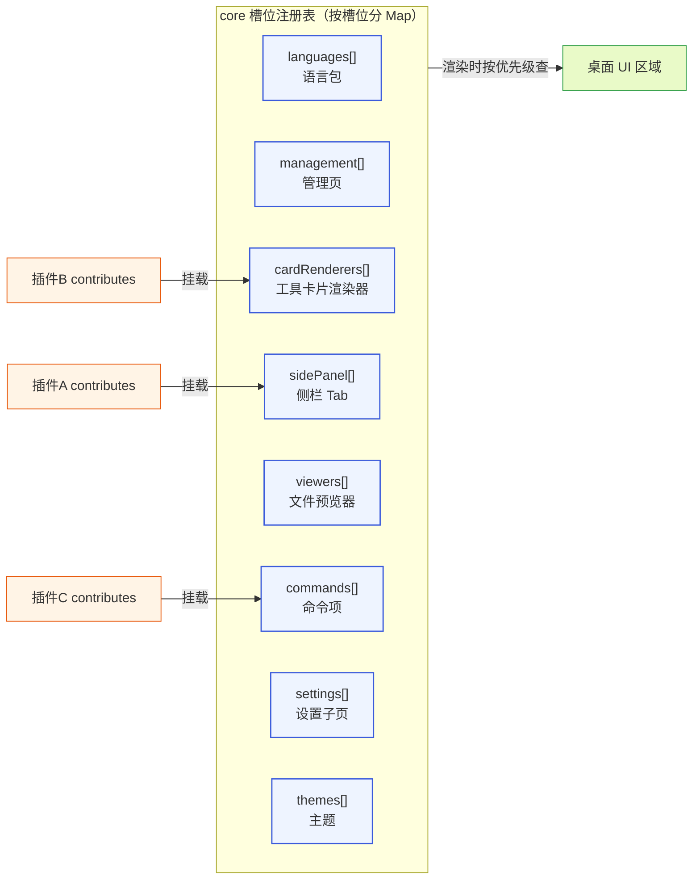
```mermaid
flowchart LR
    subgraph REG["core 槽位注册表（按槽位分 Map）"]
        S1["languages[]<br/>语言包"]
        S2["management[]<br/>管理页"]
        S3["cardRenderers[]<br/>工具卡片渲染器"]
        S4["sidePanel[]<br/>侧栏 Tab"]
        S5["viewers[]<br/>文件预览器"]
        S6["commands[]<br/>命令项"]
        S7["settings[]<br/>设置子页"]
        S8["themes[]<br/>主题"]
    end
    P1["插件A contributes"] -->|挂载| S4
    P2["插件B contributes"] -->|挂载| S3
    P3["插件C contributes"] -->|挂载| S6
    REG -->|"渲染时按优先级查"| UI["桌面 UI 区域"]
    classDef reg fill:#eef4ff,stroke:#3b5bdb,stroke-width:1.5px;
    classDef plug fill:#fff4e6,stroke:#e8590c;
    classDef ui fill:#e9fac8,stroke:#2f9e44;
    class S1,S2,S3,S4,S5,S6,S7,S8 reg;
    class P1,P2,P3 plug;
    class UI ui;
```

**图 7 — 槽位注册表：core 维护按槽位分的注册表（8 槽含主题），插件挂贡献项，渲染时按优先级查**

- **语言槽（languages）**：贡献语言包。贡献项提供 `{ id, locale, resources }`——`id` 是这个语言包贡献项的标识（通常 `{pluginId}` 或 `{pluginId}.{namespace}`，区分一个插件贡献的多组文案），`locale` 是 `"zh"`/`"en"` 等，`resources` 是 key→文案的映射。`resources` 的 key 用 dot 分隔 namespace，对应 i18next 的 namespace 机制（4.2 实现用 i18next）——比如 `"timeline.toolExecuting"` 表示 timeline namespace 下的 toolExecuting key、`"settings.modelSection"` 表示 settings namespace 下的 key。core 启动时把所有插件同 locale 的语言包贡献项的 resources 合并成一个 i18next 资源字典（按 namespace 聚合），渲染文案时 `i18n.t("timeline.toolExecuting")` 查。**语言槽的冲突仲裁和别的槽位不同**：同 locale 同 namespace 的文案不是"二选一覆盖"，而是"后注册覆盖先注册的同 key"（key 级合并）——因为语言包天然是合并语义（多个插件都给 timeline namespace 贡献 key、各自 key 不冲突时全要）。只有同 key 冲突时按来源插件优先级取高的。这个特例在 3.5 第 8 项的通用仲裁之外，是语言槽的专属规则。i18n 就是往这个槽位挂的插件（4.2）。这个槽位特殊在它影响 core 自身渲染——core 渲染底座内容（时间线、工具卡片标签、系统提示）时用的文案也走语言槽，core 不内嵌任何文案常量。
- **主题槽（themes）**：贡献界面风格。贡献项提供 `{ id, name, tokens, base? }`——`id` 主题标识（如 `"dark"`/`"light"`/`"solarized"`）、`name` 展示名、`tokens` 是设计 token 的值映射（`{ "color.bg": "#1e1e2e", "color.fg": "#cdd6f4", "color.primary": "#89b4fa", "font.size.base": "14px", "radius.md": "8px", "spacing.sm": "8px", ... }`，见 4.11 的 token 清单）、`base` 是继承的父主题 id（主题可继承另一个主题只覆盖部分 token）。和语言槽一样**特殊**：它影响 core 自身渲染——core 渲染任何 UI（时间线、工具卡片、状态栏、pi.ui 组件）时用的颜色/字号/间距/圆角全部从主题槽取，core 不内嵌任何视觉常量。core 启动时按"当前主题 id"取该主题的 tokens，合并成圆心 `Theme` 对象（5.1.5 的类型），经 `pi.ui` 组件库和 cardRenderer props 注入。主题切换 = 换当前主题 id + 重渲染（不用重启）。**冲突仲裁按 base 分流**（详见 `docs/plugins/06-plugin-theme.md` 1.3.3 / 17.1.1）：不声明 `base` 的整套主题同 id 二选一（按来源插件优先级取高、低优先级整体丢弃）；声明 `base` 的补丁主题按自身 id 注册、同 id 的多个补丁按 key 级覆盖；当补丁与同 id 整套主题碰撞时，补丁的 tokens 按 key 覆盖到整套上、其 `base` 字段被丢弃（合并条目沿用被覆盖条目的 `base`）、不触发继承——避免补丁 base 指向同 id 形成自引用循环。主题插件就是往这挂的（4.11）。
- **管理槽（management）**：贡献管理面板的页/项。贡献项提供 `{ id, title, component?, schema?, order? }`——`component` 引用 renderer 模块导出的页面组件名；省略 `component` 时用 core 内置的通用表单渲染器，此时必须提供 `schema` 字段（一个声明式表单 schema：字段数组，每项 `{ key, type: "text"|"secret"|"select"|"number"|"boolean", label?, description?, default?, options?, readOnly? }`，和 现有方案 的 adapter `ConfigField` 同构），通用表单渲染器按 schema 生成表单、读写值绑到 `PluginContext.config` 或 pi settings（通过 4.3 的配置能力）。这让"简单的配置页"不用写任何组件代码、只声明 schema 就有 UI。基础管理 UI 插件往这里挂"扩展管理""配置编辑""模型选择""MCP 管理"等页（4.3）。
- **卡片渲染槽（cardRenderers）**：贡献工具调用结果的渲染器。贡献项提供 `{ match, component }`——`match` 按工具名/自定义类型匹配，`component` 引用 renderer 模块导出的渲染组件名（不是函数、是字符串引用，core 在 renderer 侧加载组件、按 3.6 的 cardRenderer props 契约喂事件数据）。时间线渲染插件挂默认的 bash/edit/read 等渲染器（4.4），第三方插件可以挂自定义工具的自定义渲染。
- **侧栏槽（sidePanel）**：贡献侧栏 Tab。贡献项提供 `{ id, label, icon, component }`。会话管理插件挂"会话"Tab（4.6），第三方插件可以挂自定义 dashboard。
- **预览器槽（viewers）**：贡献文件预览器。贡献项提供 `{ match, component }`——`match` 按文件扩展名/mime 匹配，`component` 渲染预览。文件预览插件挂 markdown/diff/代码高亮（4.5）。
- **命令项槽（commands）**：贡献命令面板项和斜杠命令。贡献项提供 `{ id, title, keybinding?, handler }`。命令与快捷键插件挂一堆命令（4.7）。
- **设置子页槽（settings）**：贡献设置页。和管理槽的区别：管理槽是"管 pi 的页"（扩展、模型、MCP），设置子页槽是"插件自己的配置页"（某个插件的偏好）。贡献项提供 `{ id, title, component }`。

各槽位贡献项的字段级 schema（插件作者照着写、加载器照着校验）：

- **语言槽**：`{ id: string, locale: string, resources: Record<string, string> }`。`locale` 是 `"zh"`/`"en"` 等，`resources` 是 key→文案的映射。core 按 locale 聚合所有插件的语言包贡献项、按 namespace（key 前缀）查。这个槽位特殊：贡献项不是"渲染时查注册表"，而是 core 启动时合并所有 locale 资源成 i18n 字典。
- **管理槽**：`{ id: string, title: string, component?: string, schema?: ConfigField[], order?: number }`。`component` 引用 renderer 模块导出的组件名；省略 `component` 表示该页用 core 内置的通用表单渲染器，此时必须提供 `schema`（声明式表单 schema：字段数组，每项 `{ key, type, label?, description?, default?, options?, readOnly? }`，见 3.3 管理槽 bullet）。`order` 控制页在管理面板里的排序。
- **卡片渲染槽**：`{ match: MatchRule, component: string }`。`match` 决定这个渲染器匹配哪些工具调用，`component` 是 renderer 导出的渲染组件名。MatchRule 规则见下。
- **侧栏槽**：`{ id: string, label: string, icon: string, component: string, order?: number, defaultVisible?: boolean }`。`icon` 是 lucide 图标名（如 `"messages-square"`），`component` 是侧栏 Tab 内容组件。`label` 是 i18n key。
- **预览器槽**：`{ match: MatchRule, component: string }`。和卡片渲染槽同结构，`match` 按文件扩展名/mime 匹配。
- **命令项槽**：`{ id: string, title: string, keybinding?: string, handler?: string, icon?: string, when?: string }`。`keybinding` 是快捷键描述（`"cmd+n"`），`handler` 是 worker 模块导出的处理函数名（`#` 前缀）。`when` 是条件表达式（如 `"agent.idle"`，控制命令何时可用/可见），借鉴 VSCode 的 when clause。
- **设置子页槽**：`{ id: string, title: string, component: string }`。

**MatchRule**（盲测点名的 match 规则）——卡片渲染槽和预览器槽用它匹配。规则在 manifest 里是声明式数据，core 加载时通过**策略注册表**把它转成可求值的匹配器，core 渲染时只调接口、不 switch 规则变体。

```typescript
// manifest 里声明的 match（纯数据）
type MatchRule =
  | { strategy: "toolName"; value: string }        // 精确匹配工具名
  | { strategy: "toolNames"; value: string[] }     // 匹配多个工具名之一
  | { strategy: "customType"; value: string }      // 匹配自定义消息/entry 类型
  | { strategy: "extension"; value: string }       // 预览器：匹配文件扩展名
  | { strategy: "mime"; value: string }             // 预览器：匹配 mime（支持 "image/*" 通配）
  | { strategy: "all" };                            // 兜底：匹配全部

// core 维护的策略注册表（内层抽象，实现可外层提供）
interface MatchStrategy {
  matches(ctx: MatchContext): boolean;  // ctx 携带当前工具调用的 toolName/args 或文件的 extension/mime
  specificity: number;                    // 该策略的特异度，策略自己声明、core 不硬编码排序表
}

// MatchContext：被匹配的实体（工具调用或文件），中性类型、不绑 pi
interface MatchContext {
  toolName?: string;       // 工具调用时：工具名
  customType?: string;     // 自定义消息/entry 类型时
  filePath?: string;       // 文件时：路径（用于取 extension）
  mimeType?: string;       // 文件时：mime
}
// MatchStrategy 实现按需读 ctx 字段，如 ToolNameStrategy 只看 ctx.toolName
// core 加载 match 时按 strategy 名查注册表拿 MatchStrategy 实例
```

这里的关键设计（呼应 §1.4 不做类型戳 switch）：match 在 manifest 里是纯数据，但 core **不按 `strategy` 字段 if-else 分发匹配逻辑**——而是用 strategy 名查策略注册表拿到 `MatchStrategy` 实例，调它的 `matches()` 和读 `specificity`。新增匹配方式 = 注册一个新 `MatchStrategy`（扩展，不改 core），不是给 core 的 switch 加分支（开闭原则）。特异度由每个策略自己声明（`toolName.specificity=100`、`all.specificity=0` 之类），core 只比数值、不维护硬编码排序表——消除了"特异度排序是引擎硬编码知识"这个问题。内置策略集（toolName/toolNames/customType/extension/mime/all）随 core 提供、放在 `domain/slots/strategies.ts`（5.1.4）作为 MatchStrategy 的内置实现集合注册，它们的 specificity 值是 core 定义的稳定常量。

冲突仲裁（多个渲染器都 match 同一个工具调用）：按贡献项来源插件的优先级取最高（3.5 第 8 项），同优先级按 `specificity` 数值大的胜出，同 specificity 按注册顺序取先注册的。预览器槽同理。

**`when` clause 语法**（命令项槽的 `when` 字段用）——借鉴 VSCode when clause，但精简。表达式由条件变量和逻辑运算符组成：变量是 core 运行时状态的布尔/值投影（如 `agent.idle`、`agent.streaming`、`session.hasName`、`project.trusted`、`model.reasoning`），运算符支持 `&&`（与）、`||`（或）、`==`（相等，如 `model.provider == "anthropic"`）、`!`（非）。变量值来自 `get_state` 返回的 `RpcSessionState` 字段及其派生，加上少数 UI 派生 key（如 `selection.nonEmpty` 有无选区、`selection.source` 选区来自 `"timeline"`/`"viewer"`、`review.modeActive` 是否在 review 模式——这些由 core 监听 UI 状态维护，4.10.7 review 插件用到）。例：`"agent.idle && session.hasName"` 表示"agent 空闲且当前会话有名字时命令可见"；`"selection.nonEmpty"` 表示"有选区时可用"。core 维护一个 contextKeys 表，运行时按状态更新这些 key，命令的可见/可用由 `when` 求值决定。

**运算符优先级与结合性**（钉死语义、避免混合运算符歧义）：

- 优先级从高到低：`!`（非）> `==`（相等）> `&&`（与）> `||`（或）。
- 结合性：`!`/`==` 不可结合（`!a == b` 非法、必须写 `(!a) == b` 或 `a == !b`；`a == b == c` 非法），`&&`/`||` 左结合（`a && b && c` = `(a && b) && c`）。
- `!` 的作用域仅紧随其后的单个变量或括号表达式：`!a && b` = `(!a) && b`，`!` 不跨 `&&`/`||`。
- 支持括号显式分组：`(a || b) && c`、`!(selection.nonEmpty)` 都合法。**推荐混合运算符时用括号显式分组**，避免歧义。
- 短路求值：`&&` 左操作数为 false 时不求值右操作数；`||` 左操作数为 true 时不求值右操作数。

求值示例（钉死语义）：

| 表达式 | 求值结果 | 说明 |
|---|---|---|
| `a \|\| b && c` | `a \|\| (b && c)` | `&&` 优先于 `\|\|`，与多数语言约定一致 |
| `!a && b` | `(!a) && b` | `!` 只作用于 a |
| `a && b \|\| c` | `(a && b) \|\| c` | `&&` 优先于 `\|\|` |
| `a == b && c` | `(a == b) && c` | `==` 优先于 `&&`，c 视为布尔变量 |
| `(a \|\| b) && c` | `(a \|\| b) && c` | 括号显式分组 |

这套优先级表和示例消除了混合运算符的歧义——之前文档写"从左到右短路求值"会让人误以为 `a || b && c` = `(a||b)&&c`（与常规约定相反），现改为显式优先级表 + 括号分组推荐。

这套槽位契约是 core 和插件之间唯一的耦合点。插件只能通过往槽位挂贡献项来影响 UI，不能直接 import core 的内部状态、不能直接操作 DOM。core 在槽位契约这一层提供稳定的 API，插件的实现细节（用什么状态管理、怎么拉数据）封在插件内部。这呼应洋葱架构：core 是圆心（槽位契约 + 加载器机制），插件是外层（具体内容），依赖只向内。

槽位契约要随版本演化时，走开闭原则——新增槽位类型是扩展，不改已有槽位 schema；已有槽位加字段是向后兼容的字段（旧插件不带新字段时 core 给默认值），不删字段不改变字段语义。这保证插件生态不会被 core 升级打破。

### 3.4 发现与优先级

插件的发现路径镜像底座 extension 的约定，但落在桌面专属目录下，避免和底座 extension 混在一起：

- 项目级：`<cwd>/.pi-desktop/plugins/`
- 用户级：`~/.pi-desktop/plugins/`
- 内置：随壳分发的默认插件（4 节那一组）

**注意：发现层只扫这三处本地手写/内置插件目录**。外部安装的插件（npm/.pidesktop 安装的）落在 `~/.pi-desktop/installed/{id}/{version}/`——这个目录**不在发现路径下**、发现层不扫它，因为 installed 多版本目录层级深（`installed/{id}/{version}/` 三层）、靠发现层扫会出递归层级问题。外部插件走 `loader.loadExplicit()` 显式加载入口（3.9.7），installer 装完后显式通知加载器加载。两条入口（发现层扫本地、显式加载外部）最终进同一个加载器（3.5）。

优先级是项目 > 用户 > 内置，和底座 settings 的合并方向一致（项目级覆盖用户级、用户级覆盖内置）。同名插件（按 `id` 判定）高优先级覆盖低优先级——这是"内置默认插件可被覆盖"的机制：用户或项目级放一个同 id 插件，就覆盖了内置的那个。覆盖的粒度是整个插件，不是单个 contribution——一个插件要么整体启用要么整体被覆盖，不做"用项目级插件的 A 贡献项 + 内置插件的 B 贡献项"这种拼贴。这简化了合并逻辑，也避免了贡献项级别的冲突仲裁复杂度。外部插件也参与优先级仲裁——它来源标记是 `installed`，优先级介于用户和内置之间（`project > user > installed > builtin`），用户可用项目级/用户级同名插件覆盖外部装的。

**外部插件（installed）的优先级处置契约**（补 loadExplicit 流程，弥补"发现层不扫 installed、installed 却声明参与优先级仲裁"的流程缺口）：外部插件不在 3.4 发现层扫描的目录里（installed 多版本目录深、走 `loader.loadExplicit()` 显式加载，3.9.7），但它的优先级仲裁仍要发生——否则 `project > user > installed > builtin` 的声明落不了地。处置契约如下：

- **显式加载时比对已加载插件**：`loader.loadExplicit(installedPlugin)` 加载前，先在"已加载的生效插件注册表"里查同 id 插件是否存在。
  - 不存在：直接按 `installed` 优先级挂载该外部插件。
  - 已存在：按 `project > user > installed > builtin` 比较两者的 source 优先级。
    - 已存在的优先级**高于或等于** installed（是 project/user）：外部插件**不挂载**、在覆盖记录里登记"installed 版本被已存在的 {source} 版本压制"，不替换。
    - 已存在的优先级**低于** installed（是 builtin）：外部插件**挂载**、已存在的 builtin 版本被卸载/摘除贡献项、在覆盖记录里登记"builtin 版本被 installed 版本覆盖"。
- **用户级/项目级后到时反向覆盖**：若 installed 插件已挂载、之后用户级/项目级同名插件被加进发现层（热重载场景），发现层的 `mergeByPriority` 产出时会把已挂载的 installed 版本也纳入比较——`resolveByPriority` 在两个粒度（插件级覆盖 + 贡献项级仲裁）共用同一实现（3.2.4 的原语），保证 installed 的位置一致。
- **多版本 installed**：installed 目录支持多版本共存（`installed/{id}/{version}/`），`loadExplicit` 激活时按"已装最新"或用户指定版本。多版本间不互相覆盖——只激活一个版本（同 id 只能一个版本生效），其余版本只是磁盘上保留、不进加载流程。

这条补的是 3.5.9 的 `loadAllPlugins` 伪代码只对"发现层扫到的候选"做 `mergeByPriority`、而 installed 不在发现层的流程缺口——`loadExplicit` 是和 `loadAllPlugins` 并列的第二个加载入口，它的优先级比对独立执行、复用 `resolveByPriority` 原语，保证 `installed` 优先级位置在两个入口下都一致。

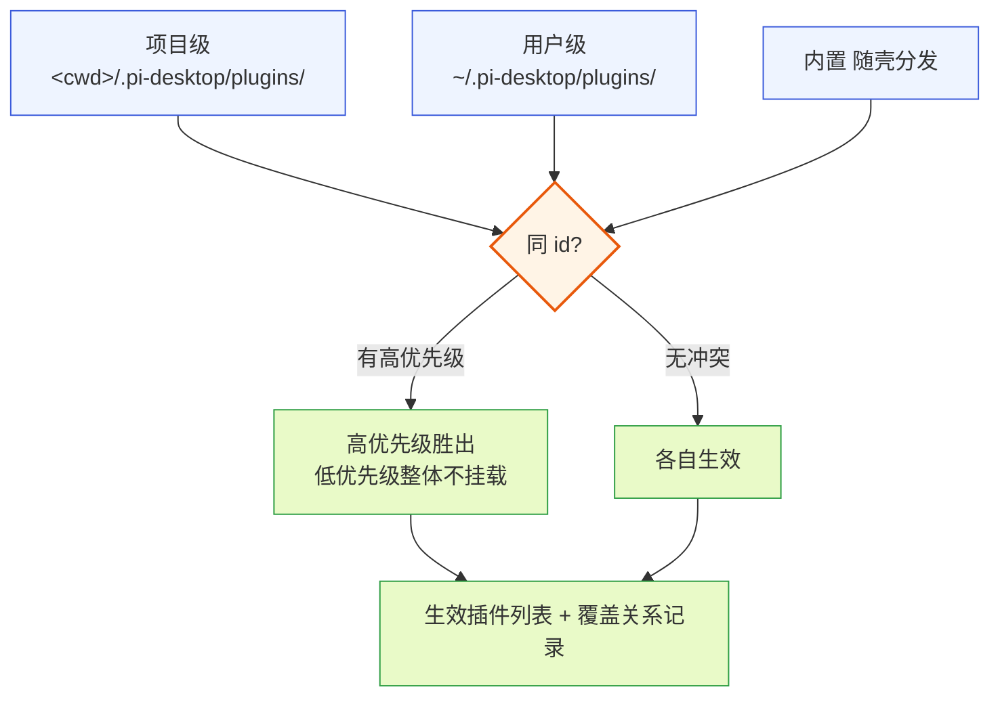
```mermaid
flowchart TD
    D1["项目级<br/>&lt;cwd&gt;/.pi-desktop/plugins/"] --> M{"同 id?"}
    D2["用户级<br/>~/.pi-desktop/plugins/"] --> M
    D3["内置 随壳分发"] --> M
    M -->|"有高优先级"| WIN["高优先级胜出<br/>低优先级整体不挂载"]
    M -->|"无冲突"| ALL["各自生效"]
    WIN --> RES["生效插件列表 + 覆盖关系记录"]
    ALL --> RES
    classDef dir fill:#eef4ff,stroke:#3b5bdb;
    classDef dec fill:#fff4e6,stroke:#e8590c,stroke-width:2px;
    classDef res fill:#e9fac8,stroke:#2f9e44;
    class D1,D2,D3 dir;
    class M dec;
    class WIN,ALL,RES res;
```

**图 8 — 插件发现与优先级：三处目录，同 id 高优先级整体覆盖**

发现逻辑（借鉴底座 `discoverExtensionsInDir`）：扫三处目录，每个目录下直接文件（`*.ts`/`*.js` 带 `plugin.json`）和子目录（子目录里有 `plugin.json` 或 `package.json` 带 `pi.desktop` 字段）都算一个插件候选。不递归超过一层——复杂插件包必须用 `package.json` 的 `pi.desktop` 字段显式声明入口，和底座 extension 的 `pi` 字段约定一致。这个"只一层"的限制是有意的：防止目录树深度不可控，也让插件包必须显式声明结构而不是靠目录约定猜。

合并时要做 id 冲突检测：如果用户级和项目级有同 id 插件，按优先级取项目级，但要在管理 UI 里提示"项目级覆盖了用户级同名插件"，让用户知道有覆盖发生。内置被覆盖也要提示。这是"可观测性"——覆盖是允许的、正常的，但不能静默发生。

### 3.5 加载器要极其完善的清单

加载器是支柱③的核心交付，要"极其完善"——这一节列的九项是加载器必须做到的，每一项都关系到插件生态能不能站住。这九项不是 checklist 打完就完，是加载器实现时要逐项设计、逐项测试的。

**1. 发现**：扫三处目录 + 读 `plugin.json`/`package.json` 的 `pi.desktop` 字段。发现要处理目录不存在（跳过）、符号链接（跟随，和底座 extension 一致）、权限错误（跳过并记录）。发现的输出是插件候选列表，每个候选带路径、来源（project/user/builtin）、manifest 原文。

**2. 优先级合并**：按 3.4 的规则合并同 id 插件，输出最终生效的插件列表，附带覆盖关系记录（谁覆盖了谁）。合并是纯数据操作，不涉及代码加载——这一步只产出生效的 manifest 列表。

**3. manifest 校验**：对每个生效 manifest 做 schema 校验。校验失败的不拖垮整壳——记录错误、在管理 UI 里标红这个插件、跳过它、继续加载其他的。校验包括：必填字段（id/version）、contributions 指向的槽位是否存在、槽位贡献项的字段是否符合该槽位 schema、`main` 路径指向的文件是否存在。校验是加载器保护 core 不被脏 manifest 污染的第一道防线。

**4. 依赖检查与拓扑排序**：在优先级合并（第 2 项）之后、manifest 校验（第 3 项）之后执行——此时 `dependsOn` 判定看到的已是高优先级覆盖后的最终生效 id 列表。对每个声明了 `dependsOn` 的插件，做依赖关系校验和 activate 排序——

- **依赖缺失检测**：`dependsOn` 里的 id 是否都在生效插件列表里。不在（没装、或被更高优先级覆盖掉）→ 本插件标错、加载时 skip，不拖垮整壳（走第 6 项错误隔离）。
- **minVersion 比对**：`dependsOn` 项若声明了 `minVersion`（3.2.3 的对象形式），取出该 id 生效插件的 `version` 做最低版本比较。生效版本低于 `minVersion` → 本插件标错禁用、给出可读原因（"依赖 X >=1.2.0，但生效版本 1.0.3 不满足"），不拖垮整壳。用字符串形式或省略 `minVersion` 的项不做版本检查、只查 id 存在性。版本比较按语义化版本 major.minor.patch 数字比较。
- **循环依赖检测**：构建依赖有向图、topological sort 检测环。检测到环（A→B→A）→ 环上的插件都标错禁用，不无限递归。
- **activate 顺序**：按依赖图拓扑排序——被依赖的先 activate、依赖者后 activate。同层（无依赖关系）的插件按来源优先级（project>user>installed>builtin）+ id 字典序排序，保证可重现。
- **动态注册可见性**：插件 `activate` 里调 `context.register()` 动态注册的贡献项，激活时立刻挂进槽位注册表、对其他已激活插件可见（依赖者 activate 时能查到被依赖者动态注册的贡献项）。

**5. 生命周期**：每个带代码模块的插件走 `activate → deactivate` 生命周期。core 加载代码模块后调 `activate(context)`，传入插件上下文（能发 RPC、能订阅 event、能注册贡献项的运行时引用）；卸载时调 `deactivate()`，给插件清理资源的机会（取消订阅、关定时器、释放 worker）。纯声明式插件没有代码模块，跳过 activate/deactivate。生命周期管理要保证：activate 抛错不影响其他插件、deactivate 超时要有兜底（不能让一个卡住的 deactivate 拖住整个卸载流程）。activate 顺序由第 4 项的依赖拓扑排序决定（不随机）。

**6. 错误隔离**：一个插件崩，只禁用它，不连累 core 和其他插件。隔离分两层：manifest 校验失败（第 3 步）是加载前隔离；代码模块运行时抛错是运行时隔离。运行时隔离靠 3.6 的 worker 进程——插件代码跑在独立 worker 里，worker 崩了 core 主进程还活着，core 捕获 worker 崩溃事件、禁用该插件、通知 UI。错误隔离是"极其完善"的核心指标：任何一个第三方插件的 bug 都不该让桌面端挂掉。

**7. 沙箱**：带代码模块的插件跑在受控环境里，不能任意访问文件系统、网络、子进程。沙箱由 3.6 的 utilityProcess worker 提供，core 给插件上下文注入受控的 API（发 RPC、订阅 event、读写插件自己的配置目录），插件只能通过这些 API 和外界交互，不能直接 `require('fs')` 或 `fetch`。沙箱的严格程度是安全性和表达力的权衡——太严插件做不了事、太松有安全风险。默认策略是白名单 API，需要更高权限的插件（比如要访问特定文件）在 manifest 里声明权限、用户在管理 UI 里授权。

**8. 槽位挂载**：把每个插件 contributions 里声明的贡献项，注册进对应槽位的注册表。注册表是 core 维护的、按槽位分的 Map——key 是贡献项 id、value 是贡献项数据 + 来源插件 + 优先级。core 渲染某个区域时查这个注册表，按优先级取生效的贡献项。挂载要处理冲突：同槽位同 id 的贡献项，按来源插件的优先级仲裁（项目 > 用户 > 内置）。这里要和 3.4 的"插件级覆盖"区分清楚，这是两个粒度、不矛盾的两层——

- **插件级覆盖（3.4）**：两个**同 id 插件**，高优先级整个覆盖低优先级，低优先级插件的所有贡献项都不挂载。这是插件粒度的"有你没我"。
- **贡献项级冲突仲裁（本项）**：两个**不同 id 的插件**，各自往同一个槽位贡献了**同 id 的贡献项**（比如两个插件都贡献了 `commands: [{ id: "session.new" }]`）。这时两个插件都生效（它们 id 不同、不互相覆盖），但它们贡献的那个重名贡献项冲突——按来源插件优先级取高优先级那条，低优先级那条不挂载，并在管理 UI 里标"命令项 `session.new` 冲突，已用 X 插件的版本"。

也就是说：插件级覆盖是"同 id 插件二选一"，贡献项级仲裁是"不同 id 插件的重名贡献项二选一"，两者规则一致（都按优先级）、作用对象不同。挂载是 manifest 声明到运行时注册表的翻译，纯数据操作。

**9. 热重载**：单个插件的文件改了（manifest 或代码模块），卸载旧的、加载新的，不动其他插件、不重启底座子进程。热重载靠 file watcher 监听插件目录。**注意这个 watcher 和 2.2 说的"底座没有配置 watcher"不冲突**——2.2 说的是底座（pi 子进程）不对自己的 `~/.pi/agent` 配置目录做 watcher；这里说的是桌面端（pi-desktop core）对自己的 `~/.pi-desktop/plugins/` 和 `<cwd>/.pi-desktop/plugins/` 插件目录做 watcher。两者是不同进程、不同目录、不同作用域：底座靠显式 reload（重启子进程触发）、桌面插件靠桌面自己的 watcher 热重载。检测到改动 → 定位是哪个插件 → deactivate 旧的 → 重新发现/校验/activate 新的 → 更新槽位注册表。热重载要防抖（编辑器保存时连续触发只重载一次）、要处理重载失败（新版加载失败时回退到旧版，不让插件进入"既不是旧版也不是新版"的悬空状态）。

这九项里，1-4 是加载前的纯数据处理（发现/合并/校验/依赖编排），5-9 是加载后的运行时管理（生命周期/隔离/沙箱/挂载/热重载）。加载器的实现要分层：外层是纯数据的 manifest 管线（发现→合并→校验→依赖检查→挂载注册表），内层是带代码模块的运行时管理（activate/deactivate/worker/热重载）。这两层分开，因为声明式插件只走外层、不进内层，纯声明式插件的加载是零运行时成本的。

#### 3.5.9 加载器关键流程伪代码

把上面九项落成关键伪代码，照着能写实现。外层数据管线（发现→合并→校验→依赖检查→挂载）：

```typescript
// 外层：纯数据 manifest 管线
async function loadAllPlugins(cwd: string): Promise<LoadedPlugin[]> {
  const candidates = [
    ...discoverInDir(`${cwd}/.pi-desktop/plugins/`, "project"),
    ...discoverInDir(`${homedir()}/.pi-desktop/plugins/`, "user"),
    ...discoverInDir(builtinDir, "builtin"),  // 随壳分发
  ];
  // 第1项发现：扫目录，每个候选带 {path, source, manifest}
  const merged = mergeByPriority(candidates);  // 第2项：同id按 project>user>builtin 取胜者、记录覆盖
  const valid: LoadedPlugin[] = [];
  for (const c of merged) {
    const errors = validateManifest(c.manifest);  // 第3项：schema校验
    if (errors.length) { markPluginError(c.id, errors); continue; }  // 失败不拖垮整壳
    valid.push({...c, codeModules: resolveEntryFiles(c.manifest)});  // main/renderer 文件存在性
  }
  for (const p of valid) mountContributions(p);  // 第8项：挂进槽位注册表
  // 第4项依赖检查：检查 dependsOn 缺失 + 循环依赖，按拓扑排序返回激活顺序
  const ordered = topoSortByDeps(valid);  // 被依赖的在前、同层按 source 优先级+id字典序
  return ordered;  // 调用方按此顺序 activatePlugin（见下）
}

// 第8项槽位挂载：contribution 按 slot 注册，冲突走 resolveByPriority
function mountContributions(plugin: LoadedPlugin) {
  for (const [slot, items] of Object.entries(plugin.manifest.contributes ?? {})) {
    const registry = slotRegistries[slot];
    for (const item of items) {
      const existing = registry.get(item.id);
      if (existing && !isHigherPriority(plugin, existing.sourcePlugin)) {
        markConflict(slot, item.id, existing.sourcePlugin, plugin.id);  // 标冲突
        continue;
      }
      registry.set(item.id, { ...item, sourcePlugin: plugin, priority: plugin.source });
    }
  }
}
```

内层运行时管理（生命周期/隔离/热重载）：

```typescript
// 内层：仅有代码模块的插件才进
async function activatePlugin(plugin: LoadedPlugin) {
  if (!plugin.manifest.main) return;  // 纯renderer/纯声明式插件不起worker
  const worker = spawnUtilityProcess(plugin.manifest.main, {
    env: { PLUGIN_ID: plugin.id, PLUGIN_ROOT: plugin.rootDir },
  });  // 第7项沙箱：worker进程隔离，注入scoped API不暴露require/fs
  const context = createPluginContext(plugin, worker);  // rpc/events/bus/config/http/i18n
  try {
    // 经 postMessage 握手触发 activate（utilityProcess 无 import 方法；握手契约见 5.1.6）
    const configSeed = await loadPluginConfig(plugin.id);
    await activateViaPostMessage(worker, plugin.id, plugin.grantedPermissions, configSeed);
    activePlugins.set(plugin.id, { worker, context, permissions: plugin.grantedPermissions, configSeed, timeouts: [] });
  } catch (e) {
    worker.kill();  // 第6项错误隔离：activate抛错只禁用本插件
    markPluginError(plugin.id, [`activate failed: ${e.message}`]);
  }
}

// 第9项热重载：watcher + 防抖 + 回退
fileWatcher.on("change", debounce(async (pluginPath) => {
  const pluginId = pathToId(pluginPath);
  const old = activePlugins.get(pluginId);
  try {
    // 经 postMessage 握手触发 deactivate（utilityProcess 无 import 方法；见 5.1.6）
    await deactivateViaPostMessage(old?.worker);  // 带超时兜底
    await activatePlugin(await reloadManifest(pluginPath));
  } catch (e) {
    // 新版加载失败：回退旧版，不进悬空状态
    if (old) { await activateViaPostMessage(old.worker, pluginId, old.permissions, old.configSeed); activePlugins.set(pluginId, old); }
    markPluginError(pluginId, [`reload failed, rolled back: ${e.message}`]);
  }
}, 300));
```

这套结构把九项落成代码骨架：外层纯数据（声明式插件零成本）、内层带 worker 的运行时（有代码插件才付成本）、热重载带防抖回退。`createPluginContext` 注入的 scoped API 就是 3.2.4 的 PluginContext，`RequestCorrelator`/`resolveByPriority` 这些共享原语在内部被 worker 通信和槽位挂载复用（3.2.4 的三个原语）。

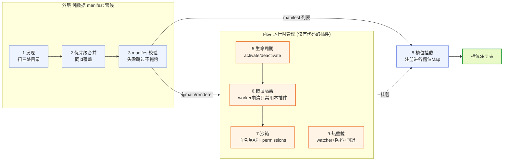
```mermaid
flowchart LR
    subgraph OUTER["外层 纯数据 manifest 管线"]
        F["1.发现<br/>扫三处目录"] --> MG["2.优先级合并<br/>同id覆盖"] --> V["3.manifest校验<br/>失败跳过不拖垮"]
    end
    V -->|"manifest 列表"| MOUNT["8.槽位挂载<br/>注册进各槽位Map"]
    V -->|"有main/renderer"| INNER
    subgraph INNER["内层 运行时管理 (仅有代码的插件)"]
        LC["5.生命周期<br/>activate/deactivate"] --> ISO["6.错误隔离<br/>worker崩溃只禁用本插件"] --> SB["7.沙箱<br/>白名单API+permissions"]
        HR["9.热重载<br/>watcher+防抖+回退"]
    end
    INNER -.->|挂载| MOUNT
    MOUNT --> REG["槽位注册表"]
    classDef out fill:#eef4ff,stroke:#3b5bdb;
    classDef inn fill:#fff4e6,stroke:#e8590c;
    classDef res fill:#e9fac8,stroke:#2f9e44,stroke-width:2px;
    class F,MG,V,MOUNT out;
    class LC,ISO,SB,HR inn;
    class REG res;
```

**图 9 — 加载器双层管线：外层纯数据处理（声明式插件只走这层），内层运行时管理（有代码插件才进）**

### 3.6 插件代码跑在哪：双入口与 worker↔renderer 桥接

这一节解决一个物理约束带来的设计问题，也是 pi-desktop 插件架构最关键的技术决策。先说约束：React 组件是函数/闭包，不可序列化、不可跨 JS 堆传递；`utilityProcess` 是 Node 环境，没有 `react`、没有 DOM reconciler。所以"在 worker 里 import 一个 React 组件对象，再发给 renderer 渲染"这条路物理上不成立。这意味着——插件的"逻辑/数据/副作用"代码跑在 worker（Node），但插件的"UI 渲染"代码必须在 renderer（有 React 的环境）执行。两者不能用同一个入口、不能跑在同一个进程。

**双入口设计**由此而来。一个带代码模块的插件，manifest 声明两个入口：

- `main`：worker 入口，跑插件的逻辑/数据/副作用——订阅 RPC event、发 RPC 命令、定时拉数据、读写插件配置。导出 `activate(context)` / `deactivate()`。
- `renderer`：UI 入口，导出 React 组件。renderer 侧的插件加载器动态 import 它，把导出的组件注册进 `componentRegistry[componentId]`，贡献槽位渲染时挂载 `<PluginComponent id/>`。

纯声明式插件（用内置渲染器）省略这两个字段——core 读 manifest 直接挂载、用内置渲染器，零代码加载、零 worker、零 renderer 模块。带代码的插件按需带 `main`（只需要逻辑、用内置渲染器展示）或 `renderer`（只需要自定义 UI、逻辑很简单）或两者都要（复杂插件）。这和 3.2 的"可选代码、内容驱动"一致——`main`/`renderer` 有无是内容事实，不是类型戳。

**worker 进程选择**：带 `main` 的插件，其逻辑跑在 Electron `utilityProcess`。这是 Node 子进程，提供进程级隔离——插件抛未捕获异常只崩这个 worker、core 主进程捕获崩溃事件禁用该插件、插件资源占用可按插件计量。`utilityProcess` 和 renderer 之间**不**走 `ipcMain/ipcRenderer`（那套基于 BrowserWindow，utilityProcess 没有），唯一的官方通道是 **MessagePort**。core main 进程在插件装载时建一对 `MessageChannelMain`，一个端口给该插件的 utility、一个给 renderer 侧该插件的运行时上下文，之后 worker↔renderer 直接 postMessage 对传、不再经 main 转发。renderer 侧给插件 UI 注入的 scoped `pi` API，内部就是往这个端口 postMessage——插件 UI 调 `pi.rpc.get_state()`，实际是往端口发消息、worker 侧收到后发 RPC 给底座、结果回传。

**通信链路**因此是：底座子进程 (RPC event/response) → core main → worker (插件逻辑处理) → 经 MessagePort → renderer (插件 UI 渲染)。每跳都是显式消息、可观测、可断点。worker 之间默认不直接通信（避免插件间隐式耦合），需要协作的走 core 提供的事件总线（一个发布订阅通道，和 RPC event 是两套——RPC event 来自底座，事件总线是桌面插件之间的）。

**renderer 侧沙箱**：UI 模块跑在 renderer，要防它直接操作宿主 DOM 顶层或 import 任意模块。用受限加载器加载 UI 模块——只暴露 scoped `pi` 对象（rpc、events、i18n、组件库），不暴露 `require`/`process`/`fs`/`window` 的危险面；组件渲染进 React portal + ErrorBoundary + React.lazy 包裹，插件组件抛错被 ErrorBoundary 接住、不影响宿主树。这里要诚实承认：renderer 侧的隔离弱于独立进程（UI 代码和宿主共享 renderer 堆），真正的不可信代码隔离由 worker 进程边界兜底——`main` 侧的逻辑在独立进程、碰不到 renderer 状态；`renderer` 侧的 UI 代码做受限加载 + portal 隔离。如果某个插件要加载完全不可信的第三方富内容（比如渲染任意 HTML），那个槽位单独走 webview（每插件一个独立浏览器上下文，只靠 postMessage 通信，UI bundle 彻底独立）——这是 VSCode webview 的路线，作为强隔离槽位的降级方案，不作为默认。

这套设计是 VSCode 思路在"融入宿主 React 树"约束下的变体。VSCode 的 extension host（Node 进程）不跑 React，视图分两类：声明式贡献视图（宿主原生渲染、扩展只给数据）和 webview（独立浏览器上下文、加载扩展自己的 HTML/JS）。VSCode 用 webview 换隔离、放弃了"扩展 UI 融进宿主原生组件树"。pi-desktop 的产品诉求是插件 UI 嵌进宿主 React 树（侧栏 Tab、工具卡片都是宿主布局的一部分），所以默认走双入口 + portal，webview 只给强隔离场景留作旁路。这呼应洋葱架构：worker（逻辑）和 renderer（UI）两侧职责由进程边界 + 双入口契约固定、不交叉；两者只经 MessagePort + scoped API 通信、互不 import 对方模块；宿主通过 componentId 抽象引用插件组件、不依赖具体实现。

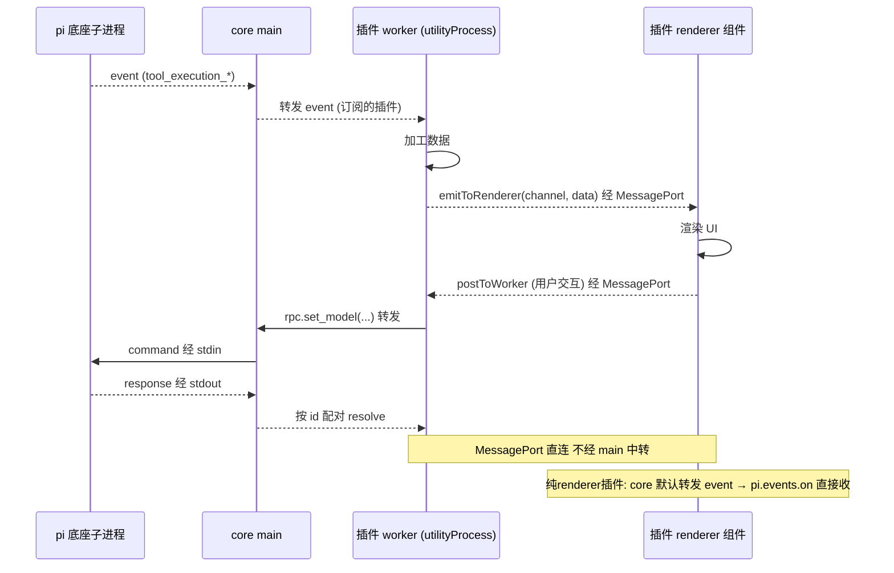
```mermaid
sequenceDiagram
    participant PI as pi 底座子进程
    participant MAIN as core main
    participant W as 插件 worker (utilityProcess)
    participant R as 插件 renderer 组件
    PI-->>MAIN: event (tool_execution_*)
    MAIN-->>W: 转发 event (订阅的插件)
    W->>W: 加工数据
    W-->>R: emitToRenderer(channel, data) 经 MessagePort
    R->>R: 渲染 UI
    R-->>W: postToWorker (用户交互) 经 MessagePort
    W->>MAIN: rpc.set_model(...) 转发
    MAIN->>PI: command 经 stdin
    PI-->>MAIN: response 经 stdout
    MAIN-->>W: 按 id 配对 resolve
    Note over W,R: MessagePort 直连 不经 main 中转
    Note over R: 纯renderer插件: core 默认转发 event → pi.events.on 直接收
```

**图 10 — 双入口数据流：worker 逻辑与 renderer UI 经 MessagePort 直连，RPC 经 core main 中转**

**worker 侧 RPC 通信架构**（补 F 盲测发现的归属不清）：worker（utilityProcess）不能直接碰底座 stdin/stdout——那条管道归 core main 的 RPC 适配层独占。worker 的 `PluginContext.rpc` 和 `PluginContext.events` 经一条 **worker↔main 的 MessagePort** 转发到 main：

- core main 起子进程时、同时为每个 worker 建一对 MessagePort（一端给 worker、一端 main 持有）。
- worker 调 `context.rpc.getState()` → 往 worker 端口发 `{ kind: "rpc", command: {...} }` → main 收到、由 RPC 适配层发给底座 → 底座响应回 main → main 往 worker 端口回 `{ kind: "rpc-resp", id, data }` → worker 的 PluginContext.rpc 按 id resolve。
- event 流同理：底座推 event 到 main → main 的 event-translator 翻译成中性 SessionEvent（5.1.5、按 content:sensitive 过滤）→ main 往所有订阅该 event 的 worker 端口转发 `{ kind: "event", event }` → worker 的 `context.events.on` 回调收到。
- 每个 worker 有自己的 worker↔main MessagePort（和 worker↔renderer 的 MessagePort 是两对、互不干扰）——worker 隔离靠这个，一个 worker 的 RPC/event 不串到别的 worker。

这条和 3.6 的"worker↔renderer MessagePort"是**两条独立通道**：worker↔main 管 RPC/event（worker 侧 API）、worker↔renderer 管插件内部 UI 数据（emitToRenderer/postToWorker）。两者都经 MessagePort、但端点不同。core main 是中枢——它持有底座子进程的 stdin/stdout、转发给各 worker/renderer。

**纯 renderer 插件的通道约定**（盲审点名的缺口，补齐 3.2.5/3.2.6 力推的"简单路径"如何物理落地）：3.2.6 路径一说"core main 默认把 event 转发给所有 renderer 侧插件运行时上下文"、3.2.5 说纯 renderer 插件 `rpc.send` 无 main 时直接给 core main 再发底座——这背后没有 worker 中转，靠的是 renderer↔main 直连通道，具体约定如下：

- **通道建立**：core main 在 renderer 进程启动时，为"纯 renderer 插件运行时上下文"建一对 `MessageChannelMain`（一端给 renderer 全局的纯 renderer 注册表、一端 main 持有），与有 `main` 插件的 worker↔renderer MessagePort 是**独立的第三类通道**——它不绑某个 worker，而是绑"renderer 侧没有 worker 的插件集合"。renderer 侧受限加载器把 scoped `pi` API（rpc/events/i18n/ui/theme）挂在这条端口上：插件 UI 调 `pi.rpc.getState()`，实际是往这条 renderer↔main 端口 postMessage、main 收到后由 RPC 适配层发给底座、响应原路回传。
- **event 转发**：底座推 event 到 main → main 的 event-translator 翻译成中性 `SessionEvent`（5.1.5、按 content:sensitive 过滤）→ main 往这条 renderer↔main 端口广播 `{ kind: "event", event }` → 所有纯 renderer 插件的 `pi.events.on` 回调收到（和有 worker 的插件走各自 worker 端口是两条路径，event 数据同一份、分发到不同端点）。这让"纯渲染 cardRenderer"成立：manifest 只写 `renderer`、组件 `pi.events.on` 订阅 `tool_execution_*` 自己画，零 worker。
- **rpc.send 响应回传**：renderer→main 的 RPC 请求用 `RequestCorrelator`（3.2.4 原语、和 worker 侧同一实现实例化）做 id 配对：renderer 调 `pi.rpc.send(cmd)` → 端口发 `{ kind: "rpc", id, command }` → main 发底座 → 底座响应回 main → main 往端口回 `{ kind: "rpc-resp", id, data }` → renderer 侧按 id resolve。和 worker 侧唯一差别是端点不同（renderer↔main 端口 vs worker↔main 端口）、id 生成器空间隔离避免串号。
- **隔离**：纯 renderer 插件 UI 代码仍受 renderer 侧沙箱约束（受限加载器 + ErrorBoundary + portal，3.6 renderer 侧沙箱），只是不走独立进程——隔离弱于有 worker 的插件，真正的不可信逻辑仍应由 worker 承担。纯 renderer 插件适合"渲染 + 轻量 RPC/event 订阅"，不适合跑不可信重逻辑。

### 3.7 和底座 extension 的关系

最后把桌面插件和底座 extension 的关系钉死，这是最容易混淆也最该清楚的一点。

#### 3.7.1 桌面插件不碰底座行为

桌面插件只管桌面 UI，不碰底座行为。底座 extension（底座进程里那套 TS extension）该咋装咋装、该咋跑咋跑，桌面端不接管它的逻辑加载——那是底座子进程自己的事。桌面端管底座 extension 的方式是 2.5 那条链路：写 settings 路径列表 + 重启子进程，让底座自己重新加载。桌面插件不参与底座 extension 的加载执行。

#### 3.7.2 消费而非翻译

底座 extension 在桌面上有 UI 需求时，不是给它配 adapter（那是 现有方案 的路），而是写一个桌面插件，这个插件通过 RPC 观察底座——`get_commands` 拿 extension 注册的命令、订阅 `tool_execution_*` event 拿工具调用、订阅 `message_*` event 拿消息流——然后自己决定怎么呈现。这是桌面插件主动"消费"底座数据，不是被动"翻译"底座 UI。两者的区别：翻译是双向的、要吃下底座的渲染机制；消费是单向的、只拿数据自己画。pi-desktop 走消费这条路，所以底座的 TUI 渲染机制（`renderCall/renderResult` 返回 TUI Component）对桌面端完全无关——桌面端从来不吃它，也不需要把它翻译成 Web。

#### 3.7.3 三个问题根上消除

这个区分消解了 现有方案 的整个 adapter 层。没有"翻译底座 extension UI"这件事，就没有 adapter 这层中间产物；没有 adapter，就没有"行为/外观两套并列概念"；没有两套并列概念，第三方扩展想在桌面有 UI，就只要写一个桌面插件（自带 UI、自带代码、随插件包分发），不用给 现有方案 仓库贡献 JSON 等发版。现有方案 的三个问题——第三方没法自带桌面 UI、adapter 被降级成纯声明、一个概念两套体系——全部从这里根上消除。

### 3.8 端到端示例：写一个自定义工具卡片渲染器

把前面几节拼成一个照着能写的例子。假设底座有个扩展注册了一个工具 `generate_image`，agent 调用它时，桌面端想用自定义 UI 渲染这个工具调用的卡片（而不是内置默认卡片）。这是一个纯 renderer 插件——只写 UI、不写 worker 逻辑。

**目录结构**（放在 `~/.pi-desktop/plugins/my-image-card/`）：

```
my-image-card/
├── plugin.json      # manifest
└── ui.tsx           # renderer 入口（main 省略，纯 renderer 插件）
```

**plugin.json**：

```json
{
  "id": "my-image-card",
  "version": "0.1.0",
  "displayName": "Image Tool Card",
  "renderer": "./ui.tsx",
  "contributes": {
    "cardRenderers": [
      { "match": { "strategy": "toolName", "value": "generate_image" }, "component": "ImageCard" }
    ]
  }
}
```

注意：`main` 省略（纯 renderer 插件，不需要 worker）；`renderer` 指向 UI 入口；`contributes.cardRenderers` 贡献一个渲染器，`match` 用 MatchRule 的 `toolName` 策略精确匹配工具名 `generate_image`（见 3.3 MatchRule，需含 `strategy`+`value`），`component` 引用 renderer 模块里命名导出的 `ImageCard` 组件。

**ui.tsx**：

```tsx
import * as React from "react";
import { usePluginContext } from "@pi-desktop/react";  // core 提供的 hook，拿 RendererPluginContext

export function ImageCard(props: CardRendererProps) {
  const pi = usePluginContext();  // 拿到 RendererPluginContext（rpc/events/i18n/ui）
  const { toolName, args, updates, end, isStreaming } = props;

  // core 自动把 tool_execution_* 事件按 CardRendererProps 传入，组件不用自己订阅。
  // 这里从 end 或 updates 里提取图片数据（工具自定义的 result 结构）。
  const lastUpdate = updates[updates.length - 1];
  const imageData = end?.result ?? lastUpdate?.partialResult;
  const imageUrl = imageData?.url;  // 假设这个工具的 result 带个 url 字段

  return (
    <div className="image-card">
      <pi.ui.Icon name="image" />
      <span>{pi.i18n.t("myImageCard.generating", { tool: toolName })}</span>
      {imageUrl ? (
        
      ) : isStreaming ? (
        <pi.ui.Button disabled>{pi.i18n.t("myImageCard.loading")}</pi.ui.Button>
      ) : null}
    </div>
  );
}
```

**加载与渲染流程**（core 侧，作者不用写，但要理解）：

1. 加载器发现 `my-image-card/plugin.json`，发现只有 `renderer` 没有 `main`，判定为纯 renderer 插件（3.6）。
2. 校验 manifest（3.5 第 3 项）：`id`/`version`/`displayName` 齐全，`cardRenderers` 是已知槽位，`match` 符合 MatchRule，`component` 是 renderer 入口 `ui.tsx` 的命名导出 `ImageCard`（加载后校验导出存在）。
3. renderer 侧加载器动态 import `ui.tsx`，把 `ImageCard` 注册进 `componentRegistry["my-image-card:ImageCard"]`，并在卡片渲染槽注册表挂这个贡献项（按 3.3 的 MatchRule）。
4. agent 调 `generate_image` 工具时，底座推 `tool_execution_start` → core 的卡片渲染槽按 MatchRule 匹配到这个渲染器 → core 创建 `<ImageCard {...cardProps} />`，`cardProps` 按 CardRendererProps 契约从该 toolCallId 的事件流填充。
5. 后续 `tool_execution_update`/`tool_execution_end` 来时，core 更新 cardProps 重新渲染组件（props.updates 追加、props.end 填上、isStreaming 变 false）。
6. 用户卸载/禁用这个插件时，加载器从卡片渲染槽注册表移除这个贡献项，渲染中的 `ImageCard` 卸载。

这个例子覆盖了纯 renderer 插件的全部环节：manifest 双入口省略 `main`、cardRenderers 槽位贡献、MatchRule 匹配、core props 喂入、组件用 RendererPluginContext（`pi.i18n`/`pi.ui`）。带 worker 逻辑的插件（要加工数据、要发 RPC 命令）再加 `main` 入口、在 `activate(context)` 里用 `context.rpc`/`context.events`/`context.emitToRenderer`，组件侧 `pi.onMessage` 收——结构对称，不重复。

### 3.9 外部插件接入

前面 3.4 的插件发现是扫本地三处目录（项目/用户/内置），那是"已经躺在磁盘上的插件"。这一节讲第三方怎么**分发**插件、桌面端怎么**获取并加载**——这是插件生态能不能长出来的关键机制。

#### 3.9.1 设计立场：外部插件同内置，不分信任级

先定调（呼应你对齐的决策）：**外部插件和内置插件走同一套加载器、同一沙箱、同一 permissions 授权**，不引入"可信/不可信"分级、不额外加 webview 强隔离层。第三方插件不可信的风险靠沙箱挡——`utilityProcess` worker 进程隔离 + 白名单 scoped API + `permissions` 显式声明 + 用户授权（3.5 第 7 项/3.2.4）。外部插件和内置插件唯一的区别是**来源标记 + 分发链路**（安装/校验/更新/卸载），加载执行时一视同仁。这避免了 VSCode 那种"本地扩展/工作区扩展/Marketplace 扩展"多套加载路径的复杂度——pi-desktop 只有一套加载路径，来源只影响怎么落到磁盘、不影响怎么加载。

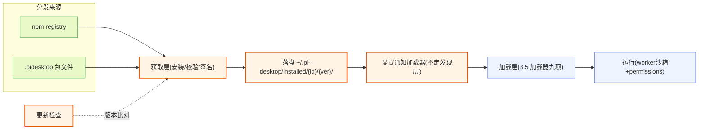
```mermaid
flowchart LR
    subgraph SRC["分发来源"]
        NPM["npm registry"]
        FILE[".pidesktop 包文件"]
    end
    FETCH["获取层(安装/校验/签名)"] --> STORE["落盘 ~/.pi-desktop/installed/{id}/{ver}/"]
    STORE --> NOTIFY["显式通知加载器(不走发现层)"]
    NOTIFY --> LOAD["加载层(3.5 加载器九项)"]
    LOAD --> RUN["运行(worker沙箱+permissions)"]
    NPM --> FETCH
    FILE --> FETCH
    UPDATE["更新检查"] -.->|版本比对| FETCH
    classDef src fill:#e9fac8,stroke:#2f9e44;
    classDef fetch fill:#fff4e6,stroke:#e8590c,stroke-width:2px;
    classDef reuse fill:#eef4ff,stroke:#3b5bdb;
    class NPM,FILE src;
    class FETCH,STORE,NOTIFY,UPDATE fetch;
    class LOAD,RUN reuse;
```

**图 17 — 外部插件接入链路：分发来源 → 获取层(安装/校验) → 落盘 → 复用 3.5 加载层（不经 3.4 发现层）**

关键：获取层（安装/校验/更新）是**新增**的，落盘后复用已有的加载层（3.5）——外部插件**不经 3.4 发现层**（installed 多版本目录不在发现路径下、靠 `loader.loadExplicit()` 显式加载，见 3.9.2/3.9.7），只复用 3.5 的加载/沙箱/槽位挂载机制，不分发相关的逻辑不重写。这呼应"能复用就复用、能持有就持有"。

#### 3.9.2 两种分发渠道

- **npm 包（在线主渠道）**：第三方发布成 npm 包（如 `@scope/pi-desktop-plugin-foo` 或 `pi-desktop-foo`），用户在桌面端管理 UI 搜包名安装。桌面端经 shell 提供的 `PackageFetcher` 接口（依赖倒置，见 3.9.7）拉包、解到 installed 目录。和底座 extension 的 `Settings.packages` 机制同源（底座 packages 也是 npm/git 源，2.1/2.3），但**落点不同**——底座 packages 落 `~/.pi/agent/extensions/`（底座进程加载），桌面插件落 `~/.pi-desktop/installed/{id}/{version}/`（桌面加载器加载）。两套 packages、两个目录、两个加载器，不混。
- **.pidesktop 包文件（离线/内网渠道）**：第三方打包成单文件 `.pidesktop`（实质是个 zip：`plugin.json` + `main.ts/js` + `renderer.*` + 资源 + 可选签名块）。用户从文件拖入、或贴 URL 下载安装。适合内网分发、离线场景、不想走 npm registry 的场景。和 npm 的区别只是"怎么拿到包文件"——拿到后解压、校验、落盘的步骤一样。

两种渠道产出的都是"`~/.pi-desktop/installed/{id}/{version}/` 下一份完整的插件目录"。**注意 installed 目录不在 3.4 的发现路径下**（3.4 扫的是 `~/.pi-desktop/plugins/`，installed 是 `~/.pi-desktop/installed/`，分开）——外部插件不靠发现层自动扫，靠 installer 安装完后**显式通知加载器加载**（调 application/loader 的"加载指定插件"入口，不是全量重扫）。这样避免发现层递归层级问题、也让 installed 支持多版本共存（`installed/{id}/{version}/`）。手写本地插件放 `~/.pi-desktop/plugins/` 走发现层、安装的外部插件放 `~/.pi-desktop/installed/` 走显式加载——两条入口，但都进同一个加载器（3.5）。**分发渠道只决定"怎么落盘"，落盘后统一进 3.5 加载。**

#### 3.9.3 包格式与签名校验

`.pidesktop` 包格式（npm 包的 package.json 等价物）：

```
foo.pidesktop (zip)
├── plugin.json          # manifest（3.2 的格式：id/version/displayName/main/renderer/contributes/permissions）
├── index.ts / ui.tsx    # 代码模块
├── resources/           # 静态资源（图标、语言包 JSON 等）
└── SIGNATURE            # 可选：对包内容的签名（作者私钥签）
```

manifest 里对分发场景多两个字段（本地手写插件不需要，分发才需要）：

```json
{
  "id": "foo",
  "version": "1.2.0",
  "displayName": "Foo",
  "author": "author-id",
  "source": "npm:pi-desktop-foo",       // 分发来源溯源（npm 包名 / file:url）
  "homepage": "https://...",            // 插件主页
  "permissions": ["net:api.foo.com"],
  "contributes": { ... }
}
```

`source` 字段用于溯源——卸载、更新检查、冲突报告时知道这插件哪来的。本地手写插件（直接放 `~/.pi-desktop/plugins/`）没有 `source`，来源标记是 `local`。

**签名校验**：`.pidesktop` 包可选带 `SIGNATURE`（作者用私钥签包内容哈希）。安装时桌面端校验签名——校验通过标 `verified`、校验失败或无签名标 `unverified`，管理 UI 显示这个标记让用户知情。签名不是强制（强制会挡掉社区小作者），但 verified 标记帮用户判断可信度。npm 包靠 npm registry 的发布者机制做一层信任（包名 scope 归属）。这条和"不分信任级、靠沙箱挡"不矛盾——沙箱是技术隔离（任何插件都过沙箱），签名是信息提示（帮用户决策装不装），两者职责不同。

#### 3.9.4 安装链路

用户在管理 UI 点"安装插件"（输 npm 包名 / 选 .pidesktop 文件 / 贴 URL），安装链路：

1. **获取**：npm 渠道调 npm 拉包到临时目录；.pidesktop 渠道下载/读文件到临时目录。
2. **解包**：解压到临时目录，读 `plugin.json`。
3. **校验**：manifest schema 校验（3.5 第 3 项同规则）+ 签名校验（如有）+ 版本检查（已装同 id 是否更高版本）+ 权限预览（把 `permissions` 列给用户看，让用户**安装时授权**，3.2.4 的 permissions 授权在装时就做）。
4. **落盘**：校验通过、用户授权后，移到 `~/.pi-desktop/installed/{id}/{version}/`（不在 3.4 发现路径下，见 3.4 互引）。版本进目录名——支持多版本共存，激活时按"已装最新"或用户指定。
5. **加载**：调 `loader.loadExplicit()` 显式通知加载器加载（3.5 第 9 项热重载机制，外部插件不走 3.4 发现层），加载器校验+activate。
6. **失败回滚**：任一步失败（校验不过、用户拒授权、解包损坏）都清理临时目录、不留半装状态。

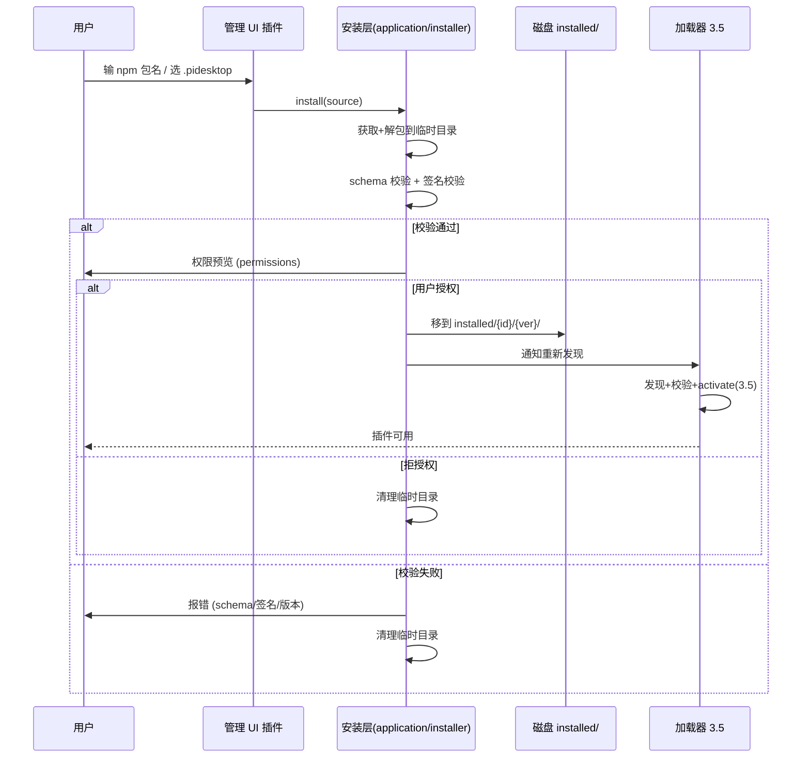
```mermaid
sequenceDiagram
    participant U as 用户
    participant UI as 管理 UI 插件
    participant INST as 安装层(application/installer)
    participant FS as 磁盘 installed/
    participant L as 加载器 3.5
    U->>UI: 输 npm 包名 / 选 .pidesktop
    UI->>INST: install(source)
    INST->>INST: 获取+解包到临时目录
    INST->>INST: schema 校验 + 签名校验
    alt 校验通过
        INST->>U: 权限预览 (permissions)
        alt 用户授权
            INST->>FS: 移到 installed/{id}/{ver}/
            INST->>L: 通知重新发现
            L->>L: 发现+校验+activate(3.5)
            L-->>U: 插件可用
        else 拒授权
            INST->>INST: 清理临时目录
        end
    else 校验失败
        INST->>U: 报错 (schema/签名/版本)
        INST->>INST: 清理临时目录
    end
```

**图 18 — 插件安装链路：获取→校验→授权→落盘→加载，任一步失败回滚**

#### 3.9.5 更新与卸载

- **更新检查**：安装层记每个已装插件的 `source`（npm 包名或 file:url）。npm 渠道定期（或用户手动）查 registry 最新版本，比对已装版本，有新版提示用户更新。.pidesktop 渠道靠包内的 `homepage` 或 source URL 提示用户手动更新（无自动 registry 检查）。更新 = 走一遍安装链路（获取新版→校验→落盘新版本目录→加载器切到新版本→清理旧版本或保留）。
- **卸载**：管理 UI 点卸载 → 加载器 deactivate 该插件（3.5 第 5 项生命周期）→ 从槽位注册表摘除贡献项 → 删 `~/.pi-desktop/installed/{id}/` 目录（或标记卸载、保留配置）→ 通知加载器卸载完成（外部插件不走发现层，不经重扫）。卸载也要干净——不留悬空槽位、不留死 worker。
- **配置保留**：插件自己的配置（`~/.pi-desktop/plugins-data/{id}/config.json`，3.2.4）卸载时默认保留——用户重装能恢复偏好。管理 UI 提供"卸载并清除配置"选项做彻底清理。

#### 3.9.6 权限的运行时撤销

用户装时授权了 permissions，后续在管理 UI 可以**撤销**某个权限（或整个禁用插件）。撤销时：

- 撤销单权限：加载器更新该插件的授权表、把对应能力从 PluginContext 注入里摘掉。已 activate 的插件下次调该能力时抛错（"权限已撤销"）——插件要能优雅降级，不能崩（3.5 第 6 项错误隔离兜底）。
- 禁用插件：deactivate 它、摘槽位贡献项、但保留磁盘文件和配置（区别卸载）。用户可重新启用。
- 这套撤销机制和"装时授权"对称——权限是动态的、用户随时可改，不是装了就永久。管理 UI 是权限的单一管理面。

#### 3.9.7 落到目录与分层

外部插件接入的新代码落激进洋葱目录（5.1.4）的 `application/installer/` 子目录（已在主目录树列出）：`package-fetcher.ts`（接口）、`verifier.ts`（纯逻辑校验）、`installer.ts`（编排）、`updater.ts`、`uninstaller.ts`。

为什么放 application：installer 是"把外部插件弄到磁盘并通知加载"的用例编排，属 application 层。但 installer 的实际网络/磁盘 IO（npm 拉包、下载 .pidesktop、写 installed 目录）是 shell 级能力——用依赖倒置解：application 定义 `PackageFetcher` 接口（描述"获取一个包到临时目录"需要什么），shell 实现它（npm fetcher 用 npm 客户端、file fetcher 用 http 下载）。installer 调接口、不 import shell 实现，和 PluginRuntime（5.1.6）同样的倒置模式。签名校验（crypto）是纯逻辑、无外部依赖、放 application。

```typescript
// application/installer/package-fetcher.ts —— application 定义接口（依赖倒置）
export interface PackageFetcher {
  fetch(spec: string, dest: string): Promise<FetchedPackage>;  // spec: npm 包名 或 file:url
  // shell 提供 NpmFetcher / FileFetcher 两个实现
}
export interface FetchedPackage { manifest: PluginManifest; contentDir: string; signature?: Buffer }

// application/installer/installer.ts —— installer 调接口、调 loader、不调 shell
async function install(spec: string, fetcher: PackageFetcher, loader: Loader) {
  const fetched = await fetcher.fetch(spec, tempDir);        // 经接口，不 import shell
  const errors = verify(fetched);                              // application 纯逻辑
  if (errors.length) { cleanup(tempDir); throw errors; }
  const granted = await promptPermissions(fetched.manifest);  // 复用 permissions（3.2.4）
  if (!granted) { cleanup(tempDir); return; }
  moveTo(path.join(installedDir, fetched.manifest.id, fetched.manifest.version));  // 经注入的 fs 通道
  await loader.loadExplicit(...);                              // 显式通知加载器加载（不走发现层）
}
```

关键复用点（呼应"能持有就持有"）：

- **加载层、生命周期、沙箱、槽位挂载**——外部插件全部复用 3.5，不重写。installer 只负责"把插件正确落到 `installed/` 目录并显式通知加载器"，加载走已有加载器。**发现层（3.4）不参与外部插件**——外部插件走 `loader.loadExplicit()` 显式加载入口，不经 3.4 的目录扫描（因为 installed 多版本目录深、不该靠发现层扫）。
- **permissions 授权**——复用 3.2.4 的 permissions 机制，installer 在装时调它做授权预览、装后写入授权表，不另造权限系统。
- **manifest 校验**——复用 3.5 第 3 项的 schema 校验逻辑，verifier 调同一个校验器，不重写校验。
- **PackageFetcher 接口**——npm/file 两个渠道是实现差异，接口统一，installer 不 switch 渠道（接口多态、不 if-else）。

这套设计让外部接入是**加载器的外围增强**（负责怎么把插件弄到磁盘并通知加载），不是新的加载体系。核心加载路径只有一条——无论内置、本地手写、npm 安装、.pidesktop 安装，最终都进 3.5 加载 → worker 沙箱 → 槽位挂载。来源只影响"怎么落盘"和"来源标记"，不影响"怎么加载"。这是激进洋葱的体现——分发是 application 层的一个用例编排、加载是同一套；渠道差异隔离在 shell 的 PackageFetcher 实现里。


## 4 支柱④：desktop 内置默认插件

内置默认插件是"开箱即用"的保障。pi-desktop 装上就能用，不是因为 core 硬编码了一堆功能，而是因为它自带了一组默认插件。这些插件随壳分发、优先级最低（`builtin`）、可被用户级/项目级同名插件覆盖、架构地位和第三方插件完全平等——走同一套加载器、同一套槽位契约，没有任何特权。这一节展开这一组内置插件，每个都说清楚它贡献什么槽位、依赖哪些 RPC 命令、渲染什么。

| 内置插件 | 语言槽 | 主题槽 | 管理槽 | 卡片渲染槽 | 侧栏槽 | 预览器槽 | 命令项槽 | 设置子页槽 |
|---|---|---|---|---|---|---|---|---|
| i18n 插件 | ✓ | | | | | | | |
| 主题插件 | | ✓ | | | | | | |
| 基础管理 UI 插件 | | | ✓ | | | | | |
| 时间线渲染插件 | | | | ✓ | | | | |
| 文件预览插件 | | | | ✓ | | ✓ | | |
| 会话管理插件 | | | | | ✓ | | ✓ | ✓ |
| 命令与快捷键插件 | | | | | | | ✓ | |
| 终端与项目信任插件 | | | ✓ | | ✓ | | | |
| 模型与运行参数插件 | | | ✓ | | ✓ | | ✓ | ✓ |
| review 插件 | | | | ✓ | ✓ | | ✓ | ✓ |
| 文件编辑器插件 | | | | | ✓ | | |

**图 11 — 内置插件×槽位挂载矩阵：12 个内置插件 × 8 槽位（含主题槽）**

### 4.1 core 极薄与开箱即用如何兼容

#### 4.1.1 机制与内容分层

"core 极薄"和"开箱即用"看起来矛盾——core 薄到只剩机制，那功能从哪来？答案在分层：core 薄的是**机制**（RPC 适配 + 配置操作 + 加载器 + 槽位契约），开箱即用的是它自带的**默认内容插件**。机制是稳定不变的圆心，内容插件是会变的外层。core 不内嵌任何功能性内容——不内嵌文案常量（走 i18n 插件）、不内嵌管理页（走管理 UI 插件）、不内嵌时间线渲染逻辑（走渲染插件）。core 只提供让这些内容能被挂上来的槽位和加载它们的能力。

#### 4.1.2 内置插件可被覆盖

内置插件可被覆盖，是这套设计的关键性质。因为内置插件优先级最低（`builtin`），用户或项目级放一个同 id 插件就能整个替换它——想换一套时间线渲染？写个同名插件放 `~/.pi-desktop/plugins/`，覆盖内置的。想换语言包？同理。这让 core 不霸占任何功能位：core 提供机制和默认实现，用户有完全的替换自由。VSCode 也是这么做的——它的默认主题、默认语言包都是 extension，可被替换。

#### 4.1.3 十二个内置插件的最小集合

下面十二个内置插件是开箱即用所需的最小集合。按职责分四组：基础渲染层五个（i18n、主题、管理 UI、时间线、文件预览，覆盖本地化、视觉、管理面板、对话渲染、只读文件查看），操作层四个（会话、命令与快捷键、终端与项目信任、模型与运行参数，覆盖对话/命令/终端/agent 运行参数的操作入口），协作层一个（review，定点评论 + 汇总发送），文件编辑层一个（文件编辑器，用户 GUI 直写/经 agent 改项目文件）。主题（4.11）和文件编辑器（4.12）是后续新增的内置插件，和前九个地位平等、走同一套加载器与槽位。

#### 4.1.4 三个内置插件的完整 manifest 样板

为了给"照着写"一个具体参照，这里给三个代表形态的完整 plugin.json：纯声明式（i18n）、双入口（时间线）、含 when clause + 事件总线（review）。

**i18n 插件（纯声明式，无 main 无 renderer）**：

```json
{
  "id": "i18n",
  "version": "0.1.0",
  "displayName": "i18n",
  "contributes": {
    "languages": [
      { "id": "i18n", "locale": "zh", "resources": { "common.send": "发送", "timeline.toolExecuting": "工具执行中" } },
      { "id": "i18n", "locale": "en", "resources": { "common.send": "Send", "timeline.toolExecuting": "Tool executing" } }
    ]
  }
}
```

无 `main`/`renderer`——core 启动时合并所有 languages 贡献项成 i18next 字典，零代码加载。

**时间线插件（双入口 main + renderer）**：

```json
{
  "id": "timeline",
  "version": "0.1.0",
  "displayName": "时间线",
  "main": "./index.ts",
  "renderer": "./ui.tsx",
  "contributes": {
    "cardRenderers": [
      { "match": { "strategy": "toolName", "value": "bash" }, "component": "BashCard" },
      { "match": { "strategy": "toolName", "value": "edit" }, "component": "DiffCard" },
      { "match": { "strategy": "all" }, "component": "DefaultCard" }
    ]
  }
}
```

`main` 订阅 `message_*`/`tool_execution_*` event 做增量状态聚合、`renderer` 导出 `BashCard`/`DiffCard`/`DefaultCard` 组件。cardRenderers 走 3.3 的 MatchRule 策略匹配。

**review 插件（含 when clause + 事件总线）**：

```json
{
  "id": "review",
  "version": "0.1.0",
  "displayName": "Review",
  "main": "./index.ts",
  "renderer": "./ui.tsx",
  "contributes": {
    "sidePanel": [
      { "id": "review-comments", "label": "Review 评论", "icon": "message-square-plus", "component": "ReviewPanel" }
    ],
    "commands": [
      { "id": "review.toggleMode", "title": "进入/退出 Review 模式", "keybinding": "cmd+shift+r", "handler": "#onToggleMode" },
      { "id": "review.addComment", "title": "添加 Review 评论", "handler": "#onAddComment", "when": "selection.nonEmpty" }
    ],
    "settings": [
      { "id": "review", "title": "Review 设置", "component": "ReviewSettings" }
    ]
  }
}
```

`when: "selection.nonEmpty"` 让"添加评论"命令只在有选区时可用（3.3 的 when clause）。`main` 走事件总线（`context.bus`）发布 `review.pending`、和输入框组件协作汇总发送（4.10.4）。

这三个样板覆盖了"纯声明式 / 双入口 / 含条件命令"三种形态，其余内置插件按各自章节的描述、照这三个结构组合即可。

### 4.2 i18n 插件（中/英）

#### 4.2.1 影响核心渲染的语言槽

i18n 是一个纯声明式插件，往**语言槽**挂中英文语言包。这是所有内置插件里最特殊的一个——因为它影响 core 自身渲染。core 渲染底座内容（时间线、工具卡片标签、系统提示、状态栏）时用的文案，全部从语言槽取，core 不内嵌任何文案常量。这意味着 core 在渲染时调"给我 `timeline.toolExecuting` 这条文案"，语言槽按当前 locale 返回中或英，core 拿到什么画什么。core 自己不知道这条文案是中是英，也不知道有没有这条文案——取不到就回退到默认 locale（en）的、再取不到用 key 本身。

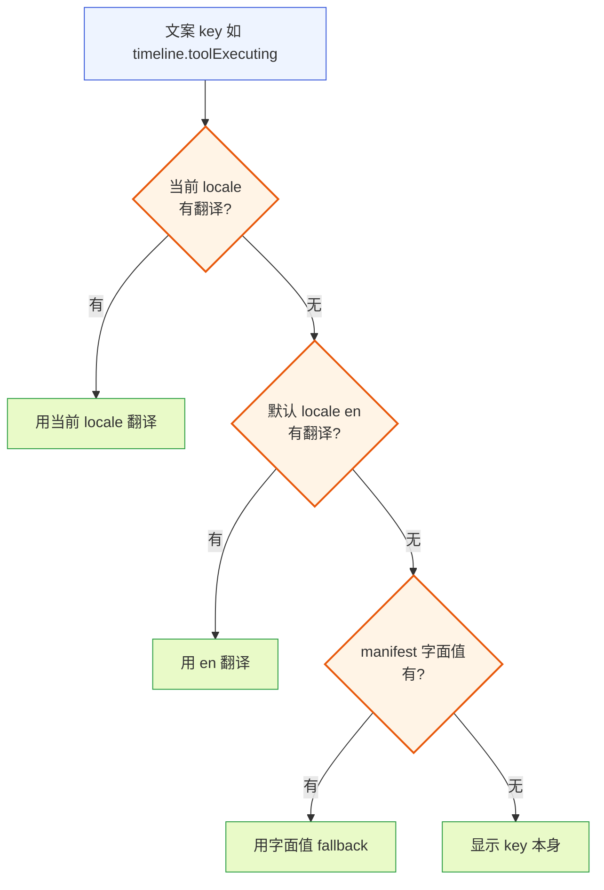
```mermaid
flowchart TD
    K["文案 key 如 timeline.toolExecuting"] --> Q1{"当前 locale<br/>有翻译?"}
    Q1 -->|有| USE1["用当前 locale 翻译"]
    Q1 -->|无| Q2{"默认 locale en<br/>有翻译?"}
    Q2 -->|有| USE2["用 en 翻译"]
    Q2 -->|无| Q3{"manifest 字面值<br/>有?"}
    Q3 -->|有| USE3["用字面值 fallback"]
    Q3 -->|无| KEY["显示 key 本身"]
    classDef key fill:#eef4ff,stroke:#3b5bdb;
    classDef dec fill:#fff4e6,stroke:#e8590c,stroke-width:2px;
    classDef res fill:#e9fac8,stroke:#2f9e44;
    class K key;
    class Q1,Q2,Q3 dec;
    class USE1,USE2,USE3,KEY res;
```

**图 12 — i18n 文案 fallback 链：当前 locale → 默认 en → manifest 字面值 → key 本身**

#### 4.2.2 namespace 组织与 locale 检测

借鉴 现有方案 的做法（它用 i18next + react-i18next，按 namespace 切 JSON：common/timeline/review/settings/composer/context/adapters/run/extension/files/update），pi-desktop 的 i18n 也按 namespace 组织文案——每个 namespace 对应一组功能（timeline 管时间线、settings 管设置页、sessions 管会话管理等）。语言包是 JSON 文件，zh 和 en 各一套。locale 检测走 `navigator.language`（和 现有方案 一致），用户在设置里改语言时持久化到桌面自己的偏好（不是 pi 的 settings.json，因为语言是桌面端的偏好、和 pi 无关）。

#### 4.2.3 改进 现有方案 的文案散落

这里要改进 现有方案 的一个毛病。现有方案 把 i18n 一定程度上硬编码在 renderer 里（`i18n.ts` 里 import 一堆语言包、初始化 i18next），而且 adapter.json 里还自带 `i18n` 字段（`AdapterI18nLocale`，每个 adapter 自己带一套 displayName/description 的翻译）——这是文案散落两处。pi-desktop 的 i18n 纯粹是语言槽插件，所有文案（含其他插件的 displayName、命令标题、设置页标题）统一走语言槽，core 和其他插件渲染文案时一律向语言槽要，不各自带 i18n 字段。一个文案 key 只在一个地方定义，locale 切换全局生效。

#### 4.2.4 自我翻译的递归

i18n 插件本身的 displayName/description 也要走语言槽——这听起来递归，但解决方法是：i18n 插件的 manifest 里 `displayName` 填字面值 `"i18n"`（作为 fallback 链第三级的兜底），同时在自己的 `languages` 贡献项里贡献 `plugin.i18n.displayName` 的 zh/en 翻译。core 渲染插件列表时按 key `plugin.i18n.displayName` 去语言槽取：取到翻译就用翻译（语言槽已构建完时），取不到就回退到 manifest `displayName` 字面值（启动早期语言槽未构建完时）、再取不到才用 key 本身。这保证 i18n 插件自己也被自己翻译，没有特例——字面值兜底让它在任何阶段都能显示一个像样的名字。详见 `docs/plugins/05-plugin-i18n.md` 7.2。

#### 4.2.5 本地化格式（日期/数字/复数/排序/RTL）

i18n 插件除了文案翻译，还提供 locale 感知的格式化能力——这些通过 `pi.i18n` 暴露给渲染插件（PluginContext.i18n / RendererPluginContext.i18n）：

- **日期格式**：`pi.i18n.formatDate(date)`——按当前 locale 格式化日期/时间（底座 event 的 timestamp 1.6.2、session 的 created/modified 1.7.4 显示时用它，不硬编码 toLocaleString）。底层走 `Intl.DateTimeFormat`。
- **数字格式**：`pi.i18n.formatNumber(num, opts)`——千分位/小数点按 locale（token 数 1.7.3、cost 1.7.2 显示用它）。底层 `Intl.NumberFormat`。
- **复数**：`pi.i18n.t(key, { count })`——i18next 原生支持按 locale 复数规则选文案（"1 message"/"5 messages"、俄语三复数等）。文案 key 在 resources 里写 plural form（`{key}_one`/`{key}_other`）。
- **排序**：会话列表（4.6）默认按修改时间、命令面板（4.7）按相关度——非必要不字母排序。若需字母排序用 `Intl.Collator`（locale 感知）不用 `localeCompare`。
- **RTL 语言**：当前**不支持**阿拉伯/希伯来语的 RTL 布局镜像——i18n 插件 locale 列表不含 `ar`/`he`，避免装起来不好用。这是诚实的声明、不是缺陷；未来支持需 core 系统地加 CSS `direction` 变量 + pi.ui 组件用逻辑属性（margin-inline-start 等）+ 内置插件适配。记为二期演进。

这些格式化能力都走 i18n 插件、不散在各插件各写一遍——"能持有就持有"。底层的 Intl API 是 JS 内置、i18n 插件只是按 locale 包一层。

### 4.3 基础管理 UI 插件

#### 4.3.1 协调者角色

基础管理 UI 插件往**管理槽**挂一组管理页，它是用户"管理 pi"的统一入口。这个插件本身不直接操作 pi，而是协调其他操作——它调支柱②的配置文件能力管 settings/trust/auth/MCP，调支柱①的 RPC 管会话运行时状态。

#### 4.3.2 管理页清单

这个插件挂的管理页包括：

- **扩展管理页**：统一列表（两来源分发，2.5），列底座 extension（走 settings + 重启）和桌面 UI 插件（走加载器）。每项显示名称、来源、状态、开关。底座 extension 的开关背后是 settings 路径增删 + 重启子进程；桌面插件的开关背后是加载器启用/禁用。**展开底座 extension 的 tool/command 可见性**：每个底座 extension 项可展开，列出它注册的 tool 和 command——数据来自 `get_commands` RPC 命令（1.5.9）的返回，按 `sourceInfo`（extension 来源信息）分组归属到对应 extension。用户能看到"这个 extension 贡献了哪些工具/命令"，但**不能在桌面端单独禁用某个 tool**——单 tool 的启停是底座 extension 内部的事、底座没暴露这个能力（和 6.1/6.2 同类的"底座有内部能力、RPC 没开口子"边界）。桌面端只展示、不干预底座 tool 粒度——这是"桌面只消费、不干预底座行为"（3.7）在管理 UI 的体现。若某 extension 注册了 provider（模型 provider，1.2），也一并列出，让用户知道这个 extension 贡献了哪些可选模型。
- **配置编辑页**：直接编辑 settings.json（全局和项目级分开），按 Settings schema 生成表单。高级用户可以直接改 JSON 原文，普通用户用表单。改完触发 2.4 的热加载路径（重启子进程）。
- **项目信任页**：管当前项目的信任状态、默认信任策略（`defaultProjectTrust`）。切信任状态走 `setProjectTrusted`。
- **MCP 管理页**：管 MCP 配置（server 列表、启停）。改完同样走重启子进程生效。
- **关于页**：版本、底座版本。
- **诊断页**（可观测性）：RPC 连接状态（活跃/断线/重连中 + 最后心跳）、底座子进程状态（PID/启动时间/内存占用/重启次数）、禁用的插件列表（id + 禁用原因）、最近一小时的错误数统计。这是用户出问题时定位"是底座挂了还是哪个插件崩了"的入口，数据来自 core 各层采集（1.2.3 进程事件、3.5 第 6 项错误隔离记录）。
- **日志页**：core 收集的日志——RPC 适配层捕获 pi 子进程 stderr、插件 worker 的 console 拦截、core 自身的日志，按 pluginId/level/timestamp 分类存内存环形缓冲（最近 N 条，会话级、重启丢失）。日志页展示缓冲、支持 level 过滤/关键字搜索/一键导出（导出时落文件）。插件作者开发时也靠这看 worker 日志。注意：日志存内存缓冲、**不进 better-sqlite3**（5.1.2 的 sqlite 只存持久化的命令历史/缓存，日志是临时态；插件配置另走 JSON 文件见 3.2.4）。
- **插件错误 toast**：插件加载失败或运行时崩溃（3.5 第 6 项错误隔离）→ toast 通知用户（插件名 + 推荐行动），点击跳诊断页。禁用的插件在管理页标灰 badge、展开看错误栈。这是"插件崩了用户得知道"的可见性——3.5 第 6 项只说禁用、没说用户怎么知道，这里补。
- **数据与隐私页**：
  - **本地数据清理**：展示本地存储占用并分两类路径展示——插件配置（KV 偏好，JSON 文件，存 `~/.pi-desktop/plugins-data/{pluginId}/config.json`，见 3.2.4）、命令历史与缓存（better-sqlite3，存 `~/.pi-desktop/data/desktop.db`，见 5.1.2），各自带清除按钮——满足用户控制本地数据的需求。
  - **数据导出**：一键导出全部本地数据（session 列表、插件配置、本地 sqlite 备份）打包成可读包——满足 GDPR 数据可携带权。**导出不含凭证**（API key/OAuth token 由底座 auth-storage 管理、不进导出包，用户另行备份凭证）。
  - **数据删除**：一键彻底删除（清 session、清 sqlite、清 plugins-data），多次确认 + 备份提示——满足被遗忘权。
  - **遥测透明**：列清底座遥测（enableAnalytics/trackingId，2.1.3）和桌面端遥测各自的开关、收什么数据、trackingId 含义。用户能在此关掉所有遥测。插件遥测受 `net:` 权限沙箱约束（不声明授权不能外发）。
  - **凭证说明**：pi 的 auth/API key 由底座 auth-storage 管理（2.1.4）、**插件无权直接读凭证**——PluginContext 不暴露凭证读接口，插件要发 API 请求只能走 RPC（底座自动加 auth）或 `http.fetch`（受权限约束）。凭证文件建议底座加密存储（向底座提）。

#### 4.3.3 现有方案 的正式归位与可覆盖

这个插件是 现有方案 的 settings 页 + extensions handler 的正式归位——现有方案 把这些硬编码成主界面的一部分、分散在 ipc handlers 里，pi-desktop 收成一个插件、走统一的管理槽。它本身可被覆盖：想要一套完全不同的管理 UI，写个同名插件覆盖它。

### 4.4 基础时间线渲染插件

#### 4.4.1 消费 event 流与历史 entries

基础时间线渲染插件往**卡片渲染槽**挂底座事件流的默认渲染器。这是桌面端最核心的视图——agent 的对话和工具调用都在这里展示。它消费 RPC 的 event 流（`message_start`/`message_update`/`message_end`、`tool_execution_start`/`tool_execution_update`/`tool_execution_end`、`turn_start`/`turn_end`）和 `get_entries` 拉取的历史 entries，把它们渲染成可滚动的时间线。

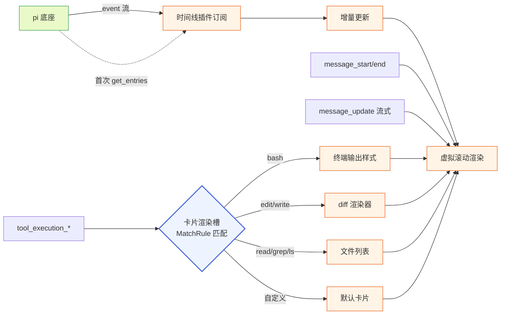
```mermaid
flowchart LR
    PI["pi 底座"] -->|"event 流"| SUB["时间线插件订阅"]
    PI -.->|"首次 get_entries"| SUB
    SUB --> INCR["增量更新"]
    INCR --> RENDER["虚拟滚动渲染"]
    MS["message_start/end"] --> RENDER
    MU["message_update 流式"] --> RENDER
    TE["tool_execution_*"] --> MATCH{"卡片渲染槽<br/>MatchRule 匹配"}
    MATCH -->|bash| B["终端输出样式"]
    MATCH -->|edit/write| D["diff 渲染器"]
    MATCH -->|read/grep/ls| L["文件列表"]
    MATCH -->|自定义| DEF["默认卡片"]
    B --> RENDER
    D --> RENDER
    L --> RENDER
    DEF --> RENDER
    classDef src fill:#e9fac8,stroke:#2f9e44;
    classDef plug fill:#fff4e6,stroke:#e8590c;
    classDef dec fill:#eef4ff,stroke:#3b5bdb,stroke-width:2px;
    classDef res fill:#fff4e6,stroke:#e8590c;
    class PI src;
    class SUB,INCR,RENDER plug;
    class MATCH dec;
    class B,D,L,DEF res;
```

**图 13 — 时间线渲染数据流：event 流 + 历史拉取 → 工具卡片按 MatchRule 匹配渲染器 → 虚拟滚动**

#### 4.4.2 几类渲染

这个插件要处理几类渲染：

- **用户消息**：`message_start` 里 role 是 user 的，渲染成用户气泡。
- **assistant 消息流**：`message_update` 逐 token 更新，渲染成 assistant 气泡，支持 markdown 渲染（复用文件预览插件的 markdown 渲染器，4.5）、代码块高亮。
- **工具调用卡片**：`tool_execution_start` 显示工具名和参数、`tool_execution_update` 显示流式输出、`tool_execution_end` 显示结果。按工具名匹配卡片渲染槽里的渲染器——bash 工具渲染成终端输出样式、edit/write 渲染成 diff、read/grep/find/ls 渲染成文件列表、自定义工具用默认卡片。这是 现有方案 用 adapter.json 声明 toolCard 想做的事，pi-desktop 用卡片渲染槽做对了：渲染器是真正的代码组件（React），不是 JSON 声明，能做动态渲染。
- **thinking 块**：assistant 的思考过程，可折叠。
- **session 控制条目**：compact、fork 等产生的 session 级条目（`SessionEntry` 里的 custom 类型），用 `registerEntryRenderer` 等价的机制渲染。

#### 4.4.3 增量更新与虚拟滚动

时间线插件还要处理增量更新：首次 `get_entries` 全量、之后靠 event 流增量。`agent_settled` 是一轮完成的标志，UI 据此停止"加载中"状态。流式更新要做防抖和虚拟滚动（长会话条目多，不能全渲染）。

### 4.5 基础文件预览插件

#### 4.5.1 两类预览需求

基础文件预览插件往**预览器槽**挂文件预览渲染器。它处理两类需求：一是时间线里工具调用产生的文件内容预览（edit 的 diff、write/read 的文件内容），二是用户主动打开的文件预览。渲染器按文件类型匹配。预览是只读、声明 `"fs:project:read"` 权限（3.2 权限细分）——和 4.12 文件编辑器的 `fs:project:write` 区分。

#### 4.5.2 预览器清单

- **markdown 预览器**：渲染 markdown 成富文本，用 dompurify 做 XSS 防护（借鉴 现有方案 的依赖）。代码块高亮复用代码高亮能力。
- **diff 预览器**：渲染文件改动 diff，红绿标色、支持统一视图和分栏视图。
- **代码高亮预览器**：按扩展名识别语言、高亮渲染。这是其他预览器的基础组件。
- **图片预览器**：渲染图片（agent 生成的、或 read 的图片文件）。
- **默认文本预览器**：兜底，未知类型当文本显示。

这个插件是工具卡片渲染的依赖——4.4 时间线里的 bash 输出、edit diff 都会调预览器槽的渲染器。卡片渲染槽和预览器槽是协作关系：卡片决定"用什么框架包这个工具结果"，预览器决定"这个文件内容怎么画"。

### 4.6 会话管理插件

#### 4.6.1 侧栏会话 Tab

会话管理插件往**侧栏槽**挂"会话"Tab，往**命令项槽**挂会话相关命令。它把 RPC 的 session 类命令包成 UI。这是用户管理对话历史和分支的入口。

侧栏"会话"Tab 展示：

- **会话列表**：列出最近的 session。这里有个边界要注意——1.4 说过 session 存储是底座内部事务、桌面端不掺和，所以桌面端**不该自己去扫 sessionDir 解析 session 文件**。底座内部有 `SessionManager.listAll()`（`session-manager.ts:1564`）返回 `SessionInfo[]`（带 path/id/cwd/name/created/modified/messageCount/firstMessage，见 1.7.4），这是正确的数据源。但 RPC 31 命令里没有 `list_sessions`——和 reload 一样，底座有内部能力、RPC 没开口子（6.2 记这个缺口）。**v1 中间方案**：桌面端维护一份"最近打开的 session 列表"（自己的偏好，不解析底座 session 文件）——列出通过桌面端打开过的 session、可切换。这不是功能残缺、是能力兜底：用户能管理自己用过的 session，只是列不出 CLI 直接创建的、没用桌面端打开过的历史 session。完整全列表能力等底座补 `list_sessions` RPC 命令（6.2）。每项显示名称、最后活动时间、消息数。点击切换 → `switch_session`（走 RPC）。
- **会话树视图**：当前 session 的分叉树（`get_tree` 返回的 `SessionTreeNode[]`），可视化分支结构，点击节点导航。
- **当前会话状态**：`get_state` 返回的 sessionId/sessionName/messageCount/pendingMessageCount，显示在侧栏顶部。

#### 4.6.2 会话命令

命令项槽挂的命令：

- **新建会话**（`cmd+n`）：`new_session`，可选父 session 做谱系。
- **重命名会话**：`set_session_name`，弹输入框。
- **分叉**（`fork`）：从某条消息分叉，先 `get_fork_messages` 拿可选分叉点、用户选后 `fork(entryId)`。
- **克隆**：`clone`，克隆当前分支。
- **导出 HTML**：`export_html`，选保存路径。
- **压缩上下文**：`compact`，可选 customInstructions；还有 `set_auto_compaction` 开关。

#### 4.6.3 切换后重新绑定

会话管理插件要处理"切换/分叉后重新绑定"——`switch_session`/`fork`/`new_session` 成功后底座会 rebind session，桌面端要调 `resync()` 拉取 state+entries+tree+commands 同步时间线和侧栏。cancelled 状态（extension 取消了操作）要正确处理，不能假设切换一定成功。

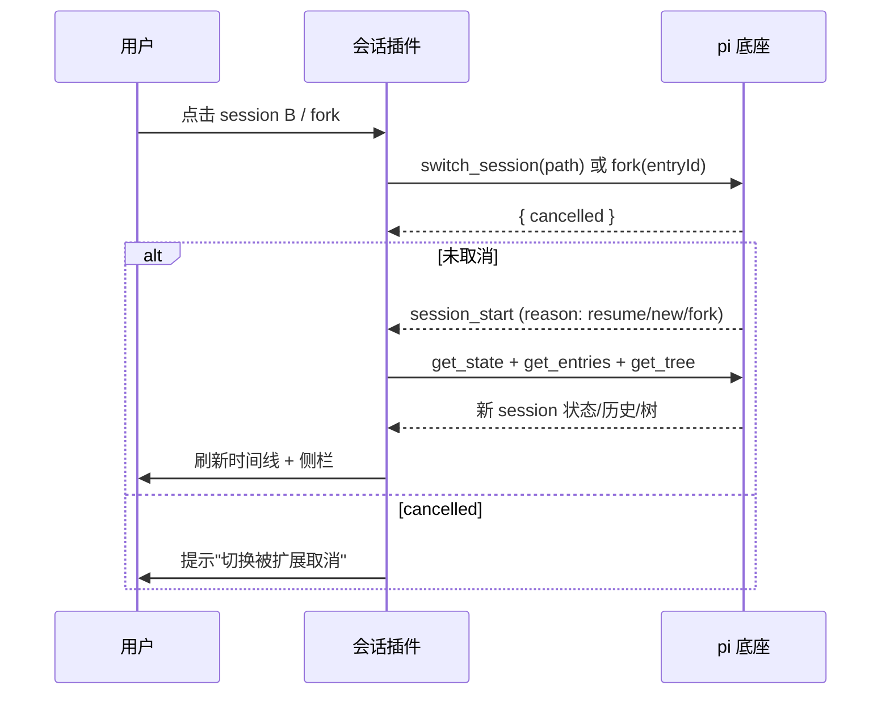
```mermaid
sequenceDiagram
    participant U as 用户
    participant UI as 会话插件
    participant PI as pi 底座
    U->>UI: 点击 session B / fork
    UI->>PI: switch_session(path) 或 fork(entryId)
    PI-->>UI: { cancelled }
    alt 未取消
        PI-->>UI: session_start (reason: resume/new/fork)
        UI->>PI: get_state + get_entries + get_tree
        PI-->>UI: 新 session 状态/历史/树
        UI->>U: 刷新时间线 + 侧栏
    else cancelled
        UI->>U: 提示"切换被扩展取消"
    end
```

**图 14 — 会话切换/分叉流程：rebind 后重新拉取状态同步 UI**

### 4.7 命令与快捷键插件

#### 4.7.1 VSCode 式命令面板

命令与快捷键插件往**命令项槽**挂命令面板项和快捷键中心。它复用底座 extension 注册的命令（`get_commands` 返回的），加桌面端自己的命令，组成一个 VSCode 式的命令面板（Cmd+P / Ctrl+P 唤起）。

这个插件的数据源是 `get_commands`——底座 extension 注册的命令、prompt 模板、skills 都在这里，带 `source`（`extension`/`prompt`/`skill`）和 `sourceInfo`。命令面板列这些命令，用户选中后通过 prompt 触发（斜杠命令是通过发 `prompt` 带 `/command` 实现的，因为 RPC 没有独立的"执行命令"消息——命令是 prompt 的一种）。

#### 4.7.2 桌面端自己的命令

桌面端自己加的命令（不来自底座）：

- **命令面板本身**（Cmd+P）：唤起命令面板。
- **快速操作**：新建会话、切换模型、切 thinking level、compact 等，作为快捷入口。
- **设置**（Cmd+,）：打开设置页（管理槽的设置子页）。
- **快捷键中心**：列出所有注册的快捷键、支持自定义重绑。快捷键注册对应底座 extension 的 `registerShortcut`，桌面端镜像这个能力——插件往命令项槽贡献项带 `keybinding` 字段，core 维护全局快捷键表。

#### 4.7.3 快捷键冲突处理

快捷键冲突处理：同 keybinding 多个命令时，按插件优先级取最高优先级的，冲突在快捷键中心标红提示。这是槽位契约在命令项槽的具体冲突策略，和 3.4 的覆盖逻辑一致。

#### 4.7.4 主输入框（主发送出口）

这个插件还贡献桌面端的**主输入框**——用户写消息、点发送的地方。它是 prompt 的**推荐**发送出口：用户在输入框写消息、点发送，插件调 `rpc.prompt(message, ...)` 发给底座。这个"主出口"设计是有意的——它守住"组装和执行分开"（1.13）：别的插件（如 review，4.10）要往消息里塞内容，**应该**把内容交给输入框、由输入框统一发送，而不是自己调 `rpc.prompt` 绕过。

**关于"唯一出口"的诚实说明**：PluginContext.rpc（3.2.4）把 `prompt`/`steer`/`followUp` 暴露给每一个带 `main` 的插件——任何插件 worker 都能直接 `context.rpc.prompt()` 发消息。所以"主输入框是 prompt 的唯一出口"是一条**写作约定、不是架构强制**：core 不会在运行时拦截非输入框插件的 `rpc.prompt` 调用。之所以仍坚持这条约定，理由是：

- **可见性**：用户在输入框能看到"将要发送什么"。插件绕过输入框直接发 prompt，用户看不到发送内容，破坏可预期性。
- **可组合性**：多个插件（review、文件编辑器的"经 agent"路径）若各自直接发 prompt，会和正在流式输出的 agent 冲突（要各自管 streamingBehavior）、会互相抢占队列。经输入框统一发送，由输入框一处处理 streamingBehavior 和排队。
- **可审计**：输入框是桌面端记录"用户发过哪些 prompt"的唯一入口（命令历史、review 锚点序列化都挂在这里），分散发送会打破这个记录链。

但承认这是自觉纪律：内置插件（review 4.10.4、文件编辑器 4.12.2 的"经 agent"路径）都遵守这条约定、把待发内容交给输入框；第三方插件若不遵守、直接调 `rpc.prompt`，core 不会阻止——和"review 守规矩是自觉"一样，靠沙箱 permissions 和用户授权兜底恶意行为、不靠架构强制日常约定。若未来确需强制，演进方向是能力分级注入（prompt 类方法只注入给命令插件、不给通用插件），当前不引入这层复杂度。

具体协作（review 场景见 4.10.4）：review 插件把待发评论经事件总线 `review.pending` topic 发出，输入框组件订阅、显示"有 N 条 review 评论待随发"；用户在输入框写总消息、点发送时，输入框组件从 review 拉待发评论列表、格式化附在消息后、一起发 `prompt`。发送后通知 review 清空待发列表。

输入框也处理 streaming 时的排队——发消息前查 `get_state` 的 `isStreaming` 和 `pendingMessageCount`，已落定（`isStreaming === false && pendingMessageCount === 0`）直接发、streaming 或有 pending 带 `streamingBehavior` 发（1.5.1，判定口径同 2.4.2）。底座的 `set_editor_text` Extension UI 请求（1.9.1）由输入框组件响应——agent 要把内容填进输入框时，gateway/extension-ui.ts 把它经 core 提供的固定 channel `core:editor-text` 广播到 renderer 侧（1.9.2 末尾钉死的路由），输入框组件用 `RendererPluginContext.onMessage("core:editor-text", ...)` 订阅、收到后填入。这条 channel 是 core 约定的 editor 槽，主输入框是它的实现填充方。主输入框是 UI 的一部分、不是独立槽位——它随 4.7 插件渲染在主界面底部，贡献项里不需要单独声明（命令面板项和快捷键才走命令项槽）。

### 4.8 终端与项目信任插件

#### 4.8.1 分工边界

终端与项目信任插件往**侧栏槽**挂终端面板，并负责"首次执行 bash"这个交汇点的信任流程交互。它处理用户直接执行 bash、以及信任流程在首次 bash 时的运行时交互。注意它**不**往管理槽挂独立的项目信任管理页——项目信任的设置页归 4.3 基础管理 UI 插件（信任是"管 pi"的状态，属于管理页范畴）。两个插件的分工边界：4.3 管信任的持久状态（信任列表、默认策略、信任开关），4.8 只管**首次执行 bash 这个交汇点**的信任交互（把用户当场的选择回写给 core 配置操作层落 `trust.json`、在终端面板展示当前信任状态）。这样避免了两个内置插件往管理槽贡献同 id 信任页的冲突。

**项目信任横幅归 core、不归 4.8**：项目刚打开时（底座子进程起来前）的信任检查与全局信任横幅，是 **core 的职责，不是 4.8 的职责**。原因：项目是否信任直接决定项目级 settings 是否加载（2.1.2），这影响整个 pi 子进程的启动配置，属于 core 启动编排范畴，不该归某个具体插件。core 通过支柱②配置操作层直接访问 `ProjectTrustStore`（core main 自己持有 trust 读写能力，不经过 worker 侧插件），在加载项目级 settings 前完成信任决策、在项目打开时展示全局信任横幅。4.8 只负责**首次执行 bash 这个交汇点**的信任交互——这是"两个职责在首次 bash 时交汇"的唯一下沉到插件的触发点。即：打开项目时的横幅归 core，4.8 不接管；4.8 只在用户首次敲 bash 时按当前信任状态决定是否拦截。

#### 4.8.2 终端面板

- **bash 执行**：用户输入命令，走 RPC 的 `bash` 命令（`excludeFromContext` 控制是否进 LLM 上下文，对应 `!` 和 `!!` 前缀）。结果渲染成终端输出样式——这里不是"直接 import 4.4 的渲染器"（那会破坏插件隔离，3.5 第 6 项），而是终端插件自己渲染 bash 结果，或查卡片渲染槽里 bash 工具的渲染器（按 3.3 的 MatchRule 查注册表，间接引用、不破坏隔离）。两种都走注册表查，不直接 import 别的插件的代码。
- **命令历史**：记录用户执行过的 bash 命令，支持上箭头回溯、补全。
- **中止**：`abort_bash` 中止运行中的命令。

#### 4.8.3 项目信任运行时流程

- **信任状态**：显示当前项目是否信任、为什么（全局 `defaultProjectTrust` 策略、或用户显式选择）。切换走 `setProjectTrusted`。
- **信任列表**：全局已信任的项目列表，支持移除信任。
- **首次 bash 拦截**：用户首次执行 bash 时，按当前信任状态决定是否拦截（待决策才弹交互、已信任直接执行、已拒绝直接拒绝并提示）。**项目打开时的信任检查与全局信任横幅归 core（4.8.1），4.8 不接管打开项目时的提示**——4.8 只管首次 bash 这个交汇点（呼应 2.1 的项目级 settings 仅在信任时加载，信任决策由 core 在子进程启动前完成）。

#### 4.8.4 两种 bash 的区分

这个插件把用户的 bash 执行和信任管理 UI 化。要分清两种 bash：**用户通过桌面端直接执行的 bash**（这个插件管的）走 RPC 的 `bash` 命令，桌面端发命令、拿 `BashResult` 响应、渲染输出，全程是桌面端发起的；**agent 自己调 bash 工具**（agent 决定跑命令时）走 `tool_execution_*` event 流，由 4.4 时间线渲染插件画成工具卡片。两者数据来源不同：用户 bash 走 `bash` 命令的响应、agent bash 走 event 流。注意底座有个 `user_bash` 事件，但那是底座 extension 体系（`ExtensionEvent`）里的、给底座 extension 用的，**不在** RPC event 流里（`AgentSessionEvent` 不含 user_bash）——桌面插件通过 `PluginContext.events.on` 收的是经 gateway 翻译后的中性 `SessionEvent` 流（源自底座 `AgentSessionEvent`，见 5.1.5），收不到 user_bash。所以桌面端要知道"用户执行了 bash"，靠的是自己发 `bash` 命令时的响应，不是订阅某个事件。这点之前文档误写过"插件订阅 user_bash event"，已修正。

### 4.9 模型与运行参数插件

#### 4.9.1 覆盖的 RPC 命令分组

模型与运行参数插件往**侧栏槽**或**管理槽**挂模型和运行参数控制 UI。它把 RPC 的 model/thinking/queue/retry 类命令全包成 UI，是用户调 agent 运行行为的入口。

这个插件覆盖的 RPC 命令分组：

- **模型选择**：`get_available_models` 拉列表、`set_model` 切换、`cycle_model` 循环。UI 是一个下拉/快捷键循环，显示当前模型（从 `get_state` 的 `model` 字段）。
- **思考级别**：`set_thinking_level`、`cycle_thinking_level`。UI 是几档选择（minimal/low/medium/high，对应 `ThinkingLevel`）。
- **队列模式**：`set_steering_mode`、`set_follow_up_mode`。控制多条排队消息时全部处理还是只处理一条。
- **重试策略**：`set_auto_retry`、`abort_retry`。开关自动重试、中止进行中的重试。
- **压缩策略**：`compact` 手动触发、`set_auto_compaction` 开关自动压缩。显示当前 context 占用（从 `get_state`/`get_session_stats`）。

#### 4.9.2 event 驱动的状态同步

这个插件的 UI 要实时反映状态变化——模型切换、thinking level 变化都会触发 RPC event（`model_select`、`thinking_level_select`），插件订阅这些 event 同步 UI。用户在 UI 上的操作发对应 RPC 命令，命令成功后 event 回来再确认状态更新——不是乐观更新、是 event 驱动的确认。这避免 UI 和底座状态不一致。

### 4.10 review 插件

#### 4.10.1 它解决什么

review 插件让用户在浏览桌面端对话内容（时间线里的 assistant 消息、用户消息）和文档（文件预览器打开的文件）时，可以划选一段文字、给它写评论，攒一批后连同输入框的消息一并发给 agent。类似 GitHub/GitLab PR 里 review 代码的方式——逐段圈出来留 comment、最后整体 submit，而不是每条评论单独发一条消息打断 agent。

为什么需要它：和 agent 协作时，用户常想"针对输出的这几处分别提意见"——比如 assistant 写的代码第 10 行有问题、第 30 行风格不对、某段解释不准确。逐条发消息会让 agent 在处理第 1 条时就跑偏、后面几条语义错位。review 模式把这些"定点评论"攒到一起、附在一条总消息里发，agent 一次拿到全部反馈、按定位逐条处理。

#### 4.10.2 两种交互入口

- **直接划选右键评论**：在任何可选文字的地方（时间线消息、文件预览内容）划选一段文字，右键菜单出现"添加 review 评论"。点后弹输入框写评论，写完这条评论进"待发送评论列表"。这种方式是即时的——用户随时圈一处、留一句，不破坏当前阅读流。
- **进入 review 模式批量操作**：点工具栏的"进入 review 模式"按钮（或快捷键），进入后整个内容区变成"可批注态"——划选文字直接出评论气泡、可拖动调整批注范围（前面列一列标记 + 固定位置拖动都接受），连续圈多处、各留评论。再点"退出 review 模式"回到正常态。这种方式适合系统性地通读一遍、留一批评论。

两种入口产出的评论都进同一个"待发送评论列表"，列表在侧栏或底部固定面板展示，每条带定位锚点（选的是哪段、在哪个消息/文件里）。

#### 4.10.3 贡献的槽位

review 插件往几个槽位挂贡献项：

- **侧栏槽**：挂"review 评论"面板，列待发送评论列表，每条带定位（消息id/文件路径+行范围）、评论内容、删除按钮。面板顶部有"随输入框发送"按钮。
- **命令项槽**：挂"进入/退出 review 模式"命令（带快捷键 + `when` 条件 `true`，随时可用）、"添加评论"命令（`when` 条件 `selection.nonEmpty`，只在有选区时可用）。
- **卡片渲染槽**：可选——如果要在时间线里把"被评论的消息"高亮、画一个锚点标记，贡献一个渲染器（match 自定义类型 `reviewed_message`）。但这不是必须，第一版可以只靠侧栏面板。
- **设置子页槽**：review 行为偏好（如评论气泡样式、是否进 review 模式自动清空已发送评论）。

#### 4.10.4 发送时怎么和输入框合并

关键机制：review 插件**不直接发 prompt**——它把攒好的评论列表交给主输入框（4.7.4 定义的主发送出口），由输入框"发送"动作一并提交。具体：

- 评论列表通过事件总线（3.2.4 的 `context.bus`）发布 `review.pending` topic，输入框组件订阅、显示"有 N 条 review 评论待随发"。
- 用户在输入框写总消息、点发送时，输入框组件先从 review 插件拉（或经事件总线收）待发评论列表，把它们格式化成结构化内容附在消息后，一起发 `prompt`。
- 格式化的结构是"总消息 + 评论清单"——每条评论带定位锚点和评论文本，例如：`[关于消息 #abc 的 "xxx" 段] 评论：这里逻辑不对`。agent 收到后能按锚点定位、逐条回应。
- 发送后 review 插件清空待发列表、退出 review 模式（如果在）。

这个"输入框是主发送出口、review 只贡献待发内容"的设计守住了"组装和调用分开"——review 插件负责组装评论（构造），输入框负责发送（执行），两者分开（呼应 1.13）。review 插件遵守 4.7.4 的约定、不自己调 `rpc.prompt`、经输入框统一发送链路（注意这是约定、不是架构强制，详见 4.7.4 的诚实说明）。

#### 4.10.5 定位锚点的稳定性

评论的定位锚点必须稳定——否则 agent 回看时找不到被评论的段。锚点分两类：

- **对话内容**：锚点是 `entryId + 选区在该 entry 内的字符偏移`。entryId 是底座 session 里的稳定 id（1.5.9 的 `get_entries` 返回的），agent 能据此定位是哪条消息、哪段。review 插件从时间线渲染（4.4）拿 entryId——4.4 渲染 entry 时把 entryId 暴露给 DOM（data 属性），review 插件划选时从选区最近的 `data-entry-id` 拿。
- **文档内容**：锚点是 `文件路径 + 行范围`（或字符偏移）。文档预览（4.5）打开的文件路径已知，划选时拿选区行号。agent 拿到路径+行能直接 `read`/`edit` 定位。

锚点随评论一起存进 review 插件的待发列表（`PluginContext.config` 或内存），发送时序列化进消息。底座 session 不感知 review 锚点——它只是 prompt 消息文本的一部分，底座照常处理。

#### 4.10.6 与其他插件的协作

review 插件不强依赖其他插件，但和几个有交集：时间线（4.4）的 entryId 是对话评论的锚点来源、文件预览（4.5）的文件路径是文档评论的锚点来源、主输入框（4.7.4）是发送出口、命令面板（4.7）触发 review 模式。这些协作走槽位契约和事件总线——review 插件不直接 import 它们的实现（3.5 第 6 项的隔离），只通过 `context.bus` 收发信号、通过槽位注册表间接引用。它是纯消费者：从别的插件渲染的内容里取锚点、往输入框送待发评论、自己不产生底座行为。

#### 4.10.7 review 模式如何让内容区进入可批注态

4.10.2 说"进入 review 模式后整个内容区变成可批注态"，但内容区是时间线（4.4）和文件预览（4.5）渲染的——review 插件不直接改它们的渲染态（那要 import 它们的实现、破坏隔离）。协调走**事件总线 + contextKeys**两条：

- **事件总线广播模式切换**：review 插件进入/退出 review 模式时，往 `context.bus` 发 `review.mode` 事件（payload: `{ active: boolean }`）。时间线插件和文件预览插件订阅这个 topic——收到 `active: true` 后，它们在自己的渲染里把每条消息/每段文件内容标记为"可选+可批注"（给 DOM 加 `data-entry-id`/`data-file-range` 属性、划选时出 review 浮层而非默认选区行为）。收到 `active: false` 退出。这是松耦合的——渲染插件选择订阅，不订阅就不响应（review 模式对它们无副作用）。
- **contextKeys 暴露选区状态**：`when: "selection.nonEmpty"`（4.10.3）这个条件变量由 core 维护——core 监听当前焦点区域的选区变化（时间线或文件预览的 DOM selection），有非空选区时把 `selection.nonEmpty` 置 true。"添加评论"命令据此可用。`selection.source`（值为 `"timeline"`/`"viewer"`）标识选区来自哪类内容区，review 插件据此知道该用哪种锚点格式（entryId 还是文件路径+行）。

这个机制让 review 模式不碰渲染插件的内部实现——它只发"我进 review 模式了"的信号，渲染插件自己决定怎么响应（加 data 属性、改选区行为）。如果某个第三方渲染插件不订阅 `review.mode`，它在 review 模式下就不支持批注——这是可接受的降级，review 插件不强制所有渲染插件配合。core 提供的 contextKeys（`selection.nonEmpty`/`selection.source`）是中性的、不绑 review——其他插件也能用选区状态。

这里有个细节：选区锚点的提取（从选区 DOM 拿 `data-entry-id` 或文件路径+行）由 review 插件自己做——它监听选区事件、从选区所在的 DOM 节点读 data 属性。渲染插件只负责在 review 模式下把 data 属性放上去、把选区行为切到"出 review 浮层"，不负责提取锚点。这样 review 插件持有了"锚点提取"逻辑（一处），渲染插件只持有"暴露 data 属性 + 切选区行为"——职责分清，不重复。

### 4.11 主题插件

#### 4.11.1 界面风格也是插件

界面风格（主题）是一个纯声明式插件，往**主题槽**挂设计 token 的值。和 i18n 一样，它是"影响 core 自身渲染的内容插件"——core 渲染任何 UI 时用的颜色、字号、间距、圆角全部从主题槽取，core 不内嵌任何视觉常量。这意味着 core 极薄到连"默认配色"都没有——配色是主题插件贡献的，core 只认 token 契约（`color.bg`/`color.fg`/`font.size.base` 这些 key）、不认具体值。换一套视觉风格 = 换主题插件，core 一行不改。

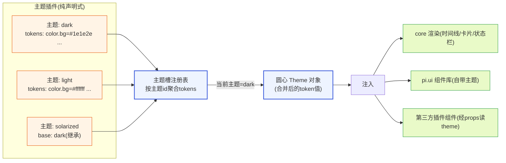
```mermaid
flowchart LR
    subgraph PLUG["主题插件(纯声明式)"]
        T1["主题: dark<br/>tokens: color.bg=#1e1e2e ..."]
        T2["主题: light<br/>tokens: color.bg=#ffffff ..."]
        T3["主题: solarized<br/>base: dark(继承)"]
    end
    REG["主题槽注册表<br/>按主题id聚合tokens"]
    T1 --> REG
    T2 --> REG
    T3 --> REG
    REG -->|"当前主题=dark"| THEME["圆心 Theme 对象<br/>(合并后的token值)"]
    THEME --> INJ["注入"]
    INJ --> UI1["core 渲染(时间线/卡片/状态栏)"]
    INJ --> UI2["pi.ui 组件库(自带主题)"]
    INJ --> UI3["第三方插件组件(经props读theme)"]
    classDef plug fill:#fff4e6,stroke:#e8590c;
    classDef reg fill:#eef4ff,stroke:#3b5bdb,stroke-width:2px;
    classDef core fill:#e9fac8,stroke:#2f9e44;
    class T1,T2,T3 plug;
    class REG,THEME reg;
    class UI1,UI2,UI3 core;
```

**图 19 — 主题插件数据流：贡献 token → 主题槽合并成 Theme 对象 → 注入 core/pi.ui/插件**

#### 4.11.2 token 清单（稳定契约）

主题贡献的 token 是 core 和所有插件之间的稳定视觉契约——key 固定、值可变。内置 token 清单（core 定义这些 key，主题插件给值）：

```
颜色:
  color.bg            主背景      color.fg            主前景
  color.surface       卡片/面板背景  color.surface-fg    卡片前景
  color.primary       主色(链接/按钮)  color.primary-fg    主色上的前景
  color.accent.success/warning/error/danger  状态色
  color.border        边框        color.muted         次要文本
字号:
  font.size.base      基础字号(14px)  font.size.sm/lg    小/大字号
  font.family.mono    等宽(代码)    font.family.sans    无衬线(正文)
间距:
  spacing.xs/sm/md/lg/xl   8/12/16/24/32px 间距档
圆角:
  radius.sm/md/lg     4/8/12px
边框:
  border.width.thin    1px        border.color        (=color.border)
阴影:
  shadow.sm/md/lg     卡片浮起阴影
```

core 只认这些 key（圆心 `Theme` 类型就是 `Record<tokenKey, string>` + 几个语义分组），主题插件填值。新增 token 是扩展（core 加 key + 默认值、旧主题不填用默认）、不改已有 key 语义——开闭原则。

#### 4.11.3 主题切换与继承

- **切换**：用户在管理 UI 选主题，core 记当前主题 id（桌面端偏好，存 electron-store，不进 pi settings——主题是桌面端偏好、和 pi 无关，同 i18n）。切换 = 换 id + 重合并 token + 重渲染整个 UI。不重启、不丢会话。第三方插件组件经 props 收到新 theme、自动重渲染（React 响应式）。
- **继承**：主题可声明 `base: "dark"`——继承 dark 主题的全部 token、只覆盖自己声明的几个。这让"dark 基础上的某个品牌微调"不用复制整套 token。合并时先取 base 的 token、再覆盖自己的。
- **明暗模式跟随系统**：内置主题插件贡献 `dark`/`light` 两个主题，并贡献一个"跟随系统"主题（`base` 动态指向系统当前 prefers-color-scheme）。用户选它，桌面端监听系统主题变化、切 base。

#### 4.11.4 与 pi.ui 组件库的关系

`pi.ui` 组件库（Button/Input/Dialog/Icon 等，shell/renderer/ui 提供）**自带主题**——每个组件内部读 `theme`、用 token 值渲染。插件写 UI 时用 `pi.ui.Button` 等内置组件、自动跟主题、不用自己处理颜色。只有插件要画"内置组件库没有的自定义元素"时，才经 props 的 `theme` 字段直接读 token（如 `theme["color.primary"]`）——但不该硬编码颜色值（`"#89b4fa"` 这种），必须经 theme 取。这条 lint 可校验（renderer 侧沙箱加载器可扫插件代码是否硬编码颜色、警告）。

**无障碍（a11y）**：pi.ui 组件库自带 ARIA 支持——每个组件暴露 `ariaLabel`/`ariaDescribedBy` 等 props，并内置正确的 role（Dialog 是 `dialog`、Button 是 `button` 等），插件用 pi.ui 组件自动获得无障碍。焦点管理（1.9.4）也由 pi.ui 的 Dialog/focus-trap 承担。主题 token 有**对比度约束**——所有前景/背景颜色对（`color.fg`/`color.bg`、`color.muted`/`color.surface` 等）必须满足 WCAG AA（≥4.5:1 对比度）。校验时机是**运行时**：主题槽合并 token 时（4.11.3，内置或第三方主题切换/加载时）校验，不符合记入诊断页警告（4.3 诊断页，不禁用主题插件——警告≠禁用）。第三方主题插件安装（3.9）时不校验对比度（安装链路不感知主题语义），靠运行时主题合并校验兜底。状态指示不只用颜色——如 bash 输出的 stdout/stderr 不只红绿、加图标/前缀辅助（色盲友好）。这些让主题插件不只管"好看"、也管"可读可达"。

#### 4.11.5 为什么主题是插件不是 core

和 i18n 同理：core 极薄、内容插件化。把主题放 core 会硬编码一套默认视觉、用户换不了（或得改 core）；放插件，用户能整体替换、项目能定制品牌色、第三方能发新主题。VSCode 的默认主题就是 extension、可被覆盖——pi-desktop 镜像这个。主题插件是纯声明式（只有 token 值、无代码模块）、零运行时成本，和 i18n 同形态。

### 4.12 文件编辑器插件

#### 4.12.1 它解决什么

4.5 文件预览只读、不编辑——但用户的诉求是"操作文件都有 GUI 跟着操作"（诉求2），包括**用户自己用 GUI 编辑项目文件**。底座 agent 能 read/edit/write 文件，那是 agent 改；用户也该能直接在桌面端编辑文件、不只在终端跑 `!` 命令或等 agent 改。文件编辑器插件补这个缺口：用户在桌面端打开项目文件、编辑、存盘，和 agent 的文件操作并存。

#### 4.12.2 两种编辑路径（小改直写 + 大改经 agent）

用户编辑文件后存盘，走哪条路是个分叉——直接写磁盘还是发给 agent 改。两种各有适用场景，**都支持**：

- **小改直写磁盘**（用户手动编辑、小范围改动）：文件编辑器插件申请 `fs:project:write` 权限（3.2.4 权限细分），用户编辑存盘时直接写磁盘文件。这是"用户自己改文件"，和用 VSCode 改一样。代价是和 agent 并发改同一文件会冲突——用**纯桌面侧 advisory lock**（非强制锁、仅编辑器侧提示）协调：编辑器打开文件时取一个 advisory lock，这个锁只给编辑器自己看、不阻止 agent 改文件。agent 改了同一文件后，编辑器靠"变更通知"（4.12.4 下一条）检测到、提示用户重新加载。要让 agent 改文件前主动查锁、被锁时走 Extension UI `confirm` 问用户"是否覆盖"，需要底座补 `query_file_lock`/`acquire_file_lock` RPC（见 4.12.4 的诚实说明 + 6.x 缺口），当前不依赖底座改动的兜底**不承诺阻止 agent 覆盖**。直写路径不进 LLM 上下文（用户改的文件内容不自动发给 agent，除非用户主动 prompt）。
- **大改经 agent**（想让 agent 改、或改动需要 agent 理解上下文）：用户在编辑器里写改动意图、点"让 agent 改"按钮，编辑器把"把文件 X 的这段改成 Y"格式化成 prompt（类似 review 的锚点格式，4.10.5），经主输入框（4.7.4）发 `prompt` 给 agent、agent 用 edit 工具改。这条路不直接写磁盘、agent 改、不冲突（agent 自己管文件锁）。适合"我不知道怎么改、让 agent 改"或"改的东西要 agent 理解语义"。

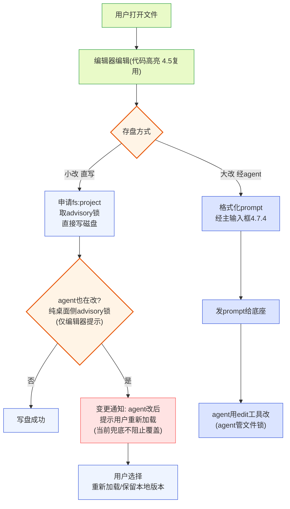
```mermaid
flowchart TD
    OPEN["用户打开文件"] --> EDIT["编辑器编辑(代码高亮 4.5复用)"]
    EDIT --> SAVE{"存盘方式"}
    SAVE -->|"小改 直写"| DIRECT["申请fs:project<br/>取advisory锁<br/>直接写磁盘"]
    SAVE -->|"大改 经agent"| AGENT["格式化prompt<br/>经主输入框4.7.4"]
    DIRECT --> LOCK{"agent也在改?<br/>纯桌面侧advisory锁<br/>(仅编辑器提示)"}
    LOCK -->|否| WRITE["写盘成功"]
    LOCK -->|是| NOTIFY["变更通知: agent改后<br/>提示用户重新加载<br/>(当前兜底不阻止覆盖)"]
    NOTIFY --> RELOAD["用户选择<br/>重新加载/保留本地版本"]
    AGENT --> PROMPT["发prompt给底座"]
    PROMPT --> AGENTEDIT["agent用edit工具改<br/>(agent管文件锁)"]
    classDef user fill:#e9fac8,stroke:#2f9e44;
    classDef dec fill:#fff4e6,stroke:#e8590c,stroke-width:2px;
    classDef direct fill:#eef4ff,stroke:#3b5bdb;
    classDef agent fill:#dbe4ff,stroke:#3b5bdb;
    classDef warn fill:#ffe3e3,stroke:#fa5252;
    class OPEN,EDIT user;
    class SAVE,LOCK dec;
    class DIRECT,WRITE,RELOAD direct;
    class AGENT,PROMPT,AGENTEDIT agent;
    class NOTIFY warn;
```

**图 20 — 文件编辑器两条存盘路径：小改直写磁盘(文件锁协调agent) / 大改经agent**

两条路都从主输入框以外出发——直写不绕输入框（用户直接存盘，不是发消息），经 agent 才走输入框（因为要发 prompt）。这守住了"prompt 主出口是主输入框"（4.7.4）——直写不是 prompt、是文件操作，经 agent 才是 prompt，而 prompt 经输入框发送是约定（详见 4.7.4）。

#### 4.12.3 贡献的槽位与复用

文件编辑器插件往**预览器槽**挂贡献项——它扩展 4.5 文件预览的预览器，让预览器有"编辑态"。不新设槽位：

- 预览器槽贡献：`{ match: { strategy: "extension", value: ".*" }, component: "FileEditor", editable: true }`——match 所有文件扩展名、组件是 FileEditor、`editable` 标记支持编辑。和 4.5 的只读预览器（`editable` 省略/false）区别开。优先级上，编辑器插件优先级高于纯预览插件，用户打开文件时命中编辑器（可编辑）、没装编辑器时退到纯预览。
- 复用 4.5 的代码高亮能力（代码高亮预览器是 FileEditor 的基础组件）——不重写高亮。
- 复用 4.7.4 主输入框（经 agent 路径走它）——不自己发 prompt。
- 复用 3.2.4 的 `fs:project` permission（直写路径申请它）——不另造文件 IO 能力。

#### 4.12.4 与 agent 文件操作的协调

agent 和用户都会改文件，协调靠三条：

- **文件锁**：编辑器打开文件取 advisory lock（轻量、非强制）。**当前兜底（纯桌面侧 advisory lock，仅用于编辑器自身提示用户）**：锁存本地 `<cwd>/.pi-desktop/file-locks.json`，编辑器和 core 都能读写；编辑器打开文件时取锁、存盘后释放。**诚实说明**：这个本地锁文件**只能用于编辑器侧自身提示用户"该文件正被编辑"**——agent 改文件前不会自动去读这个桌面端私有的锁文件，底座的 edit/write 工具没有"先查桌面端锁文件"的逻辑。要让"agent 改文件前先查锁、被锁则走 Extension UI confirm 问用户"成立，**必然要改底座**（底座 file 工具查锁）——"不依赖底座改动"与"底座会先查锁"不能同时成立。当前兜底因此降级为：纯桌面侧 advisory lock，仅给编辑器自己看、不承诺阻止 agent 覆盖；agent 改了文件后靠"变更通知"（下一条）让编辑器检测到、提示用户重新加载。**完整方案**归入 6.x 缺口，等底座补 `query_file_lock`/`acquire_file_lock` RPC 命令后，底座 agent 工具改文件前查锁、被锁则走 confirm——那时才真正实现"agent 改文件前查锁"。在那之前，agent 和用户编辑同一文件有覆盖风险、靠变更通知缓解。
- **变更通知**：agent 改了文件（`tool_execution_end` 的 write/edit 工具结果带文件路径），编辑器订阅 event 流、检测到打开的文件被 agent 改了、提示用户"文件已被 agent 修改、是否重新加载"。这是编辑器的标准"外部修改检测"。
- **冲突解决**：用户和 agent 都改了同一文件、都有未存盘/已存盘版本，编辑器提供 diff 对比、让用户选保留哪个。这是文件编辑器的标配能力。

#### 4.12.5 权限与安全

直写路径要 `fs:project:write` 权限——用户装/启用文件编辑器插件时授权（3.9.4 装时授权或 3.9.6 运行时授权）。未授权则只能走"经 agent"路径（不直接写盘）。这把"用户能直接改项目文件"做成显式授权的能力——防止恶意插件默默写文件。编辑器只写 `fs:project`（当前项目目录）范围、不给 `fs:global`（除非用户显式授权全局）——范围受限。

这十二个内置插件覆盖了 pi-desktop 开箱即用的全部功能：渲染（时间线、文件预览、文件编辑器）、管理（管理 UI、会话、模型参数、终端信任）、输入（命令与快捷键、review）、本地化（i18n、主题）。它们都是普通插件、走同一套加载器和槽位，没有任何特权，可被覆盖。core 加上这十二个，就是一个能用的 pi 桌面端；用户想加功能，写第三方插件往槽位挂；想换默认实现或视觉风格，写同名插件覆盖。这就是"薄壳 + 内置默认插件"的全部图景。

## 5 技术栈与架构总览

### 5.1 shell：Electron + React

#### 5.1.1 选 Electron 的理由与代价

shell 选 Electron + React。这个选择在前面定过——三平台 Mac/Win/Linux、插件链路最简、和 现有方案 同栈可参考。这里把理由钉死，也把代价说清楚。

选 Electron 的核心理由是它自带 Node 运行时，这一点直接决定了支柱③的可行性。桌面插件用 TS/JS 写，跑在 `utilityProcess` worker 里，天然成立——worker 是 Node 进程，能 require 模块、能跑 TS（经编译或 jiti）。如果选 Tauri（Rust 壳），shell 不带 Node，TS 插件就得另起 Node sidecar，插件加载链路多一层、复杂度上升。Electron 用"包大"换"插件链路简"，这个取舍接受了：Electron 装包 ~100MB+，Tauri ~10MB。对于一个本地 AI agent 的桌面端（用户本就要跑 pi 底座、装模型），100MB 的壳不构成实际负担；而插件链路的简洁直接影响整个项目的可维护性。现有方案 已经用 Electron + electron-vite + React 验证过这条路线（v0.4.20 可用），pi-desktop 直接沿用，能参考它的 GUI 交互实现。

#### 5.1.2 依赖清单

技术栈具体到依赖：

- **Electron + electron-vite**：壳和构建。electron-vite 管 main/renderer/preload 三端构建。
- **React**：renderer 框架。状态管理用轻量的（Zustand 之类，不用 Redux 这种重的），因为插件各自管状态、core 只管槽位注册表。
- **better-sqlite3**：桌面端自己的本地状态（命令历史、缓存等持久化数据，不碰 pi 的 session 存储——那是底座的事）。注意：插件 KV 偏好配置**不**进 sqlite，走 JSON 文件（见 3.2.4，存 `~/.pi-desktop/plugins-data/{pluginId}/config.json`）；sqlite 只存命令历史、缓存这类结构化/时序数据，落 `~/.pi-desktop/data/desktop.db`。
- **electron-store**：桌面端偏好（语言、窗口位置等），和 pi 的 settings.json 分开。
- **dompurify**：markdown/HTML 渲染的 XSS 防护。
- **i18next + react-i18next**：i18n 插件的实现（4.2），按 namespace 切。

#### 5.1.3 栈相似架构不同

这套栈和 现有方案 高度一致是有意的——现有方案 在 GUI 交互上踩过的坑、做对的实现，pi-desktop 可以直接参考，不用从零摸索。但 pi-desktop 的架构和 现有方案 完全不同：现有方案 是厚客户端（SDK 进进程 + adapter），pi-desktop 是薄壳（RPC + 插件）。栈相似是复用经验，架构不同是纠正方向。

#### 5.1.4 项目目录结构

按洋葱分层组织源码目录，依赖方向在文件系统上可见——内层不 import 外层目录。这个布局比"三层 core/middle/outer"更激进：把**底座协议类型、shell 细节、插件运行时**这些会变的都推到最外层边界，圆心只剩纯中性契约，思考未来（底座协议会漂移 6.4、shell 可能换 Tauri、插件运行时可能从 utilityProcess 换 sidecar）时每层都可独立替换。

```
pi-desktop/
├── packages/
│   └── pi-cli/                         # 随壳分发的底座 CLI（5.2.2 的 cliPath 定位，外层资产）
│
├── src/
│   ├── domain/                         # 圆心：纯中性契约，零外部依赖（不 import pi/electron/react）
│   │   ├── slots/                       #   槽位契约（8 槽含主题 + MatchStrategy/MatchContext）
│   │   │   ├── registry.ts               #     SlotRegistry（按槽位分的 Map）
│   │   │   ├── strategies.ts             #     内置 MatchStrategy（toolName/all/extension...）注册
│   │   │   └── schema.ts                 #     各槽位贡献项 schema（声明式校验用）
│   │   ├── events/                      #   中性事件接口（圆心自有，不绑 pi；逐条枚举、不留遗漏）
│   │   │   ├── tool-call.ts              #     ToolCallStart/Update/End
│   │   │   └── session.ts                #     Agent/Turn/Message/Entry/Session/Model/Thinking/Queue/Compaction/AutoRetry 全部中性事件类型
│   │   ├── context.ts                  #   PluginContext / RendererPluginContext 接口（用中性类型）
│   │   └── contributions.ts             #   ContributionItem / DynamicContribution / SyncSnapshot 类型
│   │
│   ├── gateway/                        # 第一外层：底座协议边界（依赖 domain，唯一可 import pi 类型处）
│   │   ├── protocol/                   #   底座 RPC 协议类型（RpcCommand/RpcResponse/AgentSessionEvent/RpcSessionState/Model/SessionEntry...）
│   │   │   └── versions.ts              #     协议版本声明 + handshake（6.4 的版本协商落点，未来漂移只动这）
│   │   ├── rpc-adapter.ts             #   支柱①：起 pi --mode rpc 子进程 / 收发 JSON Lines
│   │   ├── event-translator.ts         #   pi 事件 → domain 中性事件（ToolCallStart 等）的翻译
│   │   ├── extension-ui.ts             #   Extension UI 子协议解析（只解析+经 MessagePort 发渲染指令、不碰 React）
│   │   ├── context-binding.ts          #   底座类型 → 圆心中性类型映射（toSessionState/toMessageEntry，见 5.1.5）
│   │   └── correlator.ts               #   RequestCorrelator<T>（id 配对+timeout，rpc-adapter 与 extension-ui 复用，只在本层）
│   │
│   ├── application/                    # 第二外层：用例编排（依赖 domain + gateway，不依赖 shell）
│   │   ├── config/                     #   支柱②：配置文件操作（读写 ~/.pi/agent 与 <cwd>/.pi settings/trust/auth/MCP）
│   │   │   └── restart.ts               #     改配置→重启子进程编排（调 gateway/rpc-adapter + orchestrations/resync）
│   │   ├── loader/                     #   支柱③：插件加载器九项
│   │   │   ├── discover.ts               #     发现（扫三处目录）
│   │   │   ├── merge.ts                  #     优先级合并（用本层 resolveByPriority，见下 priority.ts）
│   │   │   ├── validate.ts              #     manifest 校验
│   │   │   ├── mount.ts                 #     槽位挂载（调 domain/slots/registry）
│   │   │   └── hot-reload.ts            #     热重载（watcher+防抖+回退）
│   │   ├── lifecycle/                  #   插件生命周期（activate/deactivate，依赖 PluginRuntime 接口见下）
│   │   ├── plugin-runtime.ts           #   PluginRuntime 接口（依赖倒置：shell 实现它，application 调它不调 shell）
│   │   ├── orchestrations/             #   用例编排（调 gateway + loader）
│   │   │   ├── resync.ts                #     共享原语 resync()（并发拉 state+entries+tree+commands）
│   │   │   ├── config-restart.ts        #     改配置→重启子进程→resync 的编排（2.4/2.5）
│   │   │   └── session-switch.ts       #     switch/fork→rebind→resync（4.6.3）
│   │   ├── priority.ts                 #   resolveByPriority<T>（本层用：插件级覆盖+贡献项仲裁，只有 loader 用）
│   │   └── installer/                  #   外部插件接入（3.9）：npm/.pidesktop 分发链路
│   │       ├── package-fetcher.ts        #     PackageFetcher 接口（依赖倒置，shell 实现 npm/file）
│   │       ├── verifier.ts               #     schema+签名+版本校验（纯逻辑）
│   │       ├── installer.ts              #     编排：获取→校验→授权→落盘→显式通知加载器
│   │       ├── updater.ts                #     更新检查+版本切换
│   │       └── uninstaller.ts            #     卸载+配置保留
│   │
│   ├── shell/                          # 第三外层：会变的 shell 细节（依赖 application，可整体替换）
│   │   ├── electron-main/             #   Electron main：进程管理 / MessagePort 桥 / utilityProcess 池
│   │   │   ├── plugin-host.ts            #     utilityProcess worker 启停（3.6 双入口 worker 侧）
│   │   │   ├── port-bridge.ts           #     MessageChannelMain 建桥（worker↔renderer 直连）
│   │   │   └── subprocess-lifecycle.ts  #     pi 子进程 spawn/kill/exit 监听
│   │   ├── renderer/                   #   React renderer：框架 + pi.ui 组件库 + ErrorBoundary/portal
│   │   │   ├── component-registry.ts     #     componentRegistry[componentId]（renderer 侧插件组件注册）
│   │   │   ├── plugin-context.ts        #     RendererPluginContext 注入（React Context/props）
│   │   │   ├── extension-ui-modal.tsx   #     Extension UI 模态渲染（收 gateway 指令、画 React 模态、回结果，1.9.2）
│   │   │   └── ui/                       #     pi.ui 组件库（Button/Input/Dialog/Icon，自带主题）
│   │   ├── store/                      #   桌面端本地状态（better-sqlite3 插件配置/electron-store 偏好）
│   │   └── build/                      #   electron-vite / electron-builder 三平台配置
│   │
│   └── plugins/                        # 第四外层：内置默认插件（内容，只依赖 domain 契约）
│       ├── i18n/                        #   纯声明式（contributes.languages，无 main/renderer）
│       ├── theme/                      #   纯声明式（contributes.themes，dark/light/跟随系统）
│       ├── management-ui/              #   管理槽（扩展管理/配置编辑/信任/MCP/关于）
│       ├── timeline/                   #   卡片渲染槽（双入口 main+renderer，event 订阅）
│       ├── file-preview/               #   预览器槽（markdown/diff/code/image/text，只读）
│       ├── file-editor/               #   预览器槽扩展（编辑态：小改直写/大改经agent）
│       ├── session-manager/            #   侧栏+命令（session 切换/fork/compact）
│       ├── commands/                   #   命令项槽 + 主输入框（4.7.4 主发送出口，约定非强制）
│       ├── terminal-trust/             #   侧栏终端 + 信任运行时流程
│       ├── model-params/               #   模型/thinking/queue/retry/compaction
│       └── review/                     #   review 评论（划选+锚点+随输入框发送）
│
└── tests/                              # 跨层测试（domain 可纯单测，gateway 用 mock 子进程）
    ├── domain/                         #   圆心契约单测（无任何外部依赖）
    ├── gateway/                        #   协议翻译测试（mock pi 事件）
    └── application/                    #   加载器/编排集成测试
```

**依赖方向（从外到内，箭头只向内）**：

- `shell/`（最外层）→ `application/` → `gateway/` → `domain/`（圆心）
- `plugins/`（内容层）→ 只依赖 `domain`（槽位契约 + PluginContext 接口），不依赖任何中层实现
- `packages/pi-cli` 是外层资产，不被任何层 import
- 工具归各使用层：`RequestCorrelator` 在 `gateway/`（只 gateway 用）、`resolveByPriority` 在 `application/`（只 loader 用）、`resync` 在 `application/orchestrations/`——不设跨层 shared 层，避免内层依赖外层的反转

这个布局的几个激进点（区别于旧的三层 core/middle/outer）：

- **圆心（domain/）绝对纯**：只有中性契约（槽位、中性事件 ToolCallStart/等、PluginContext/RendererPluginContext 接口、ContributionItem/SyncSnapshot 类型）。不 import pi 类型（Model/RpcSessionState 这些底座协议类型全在 `gateway/protocol/`），不 import electron/react。这是洋葱的圆心——稳定、协议无关、shell 无关。换底座协议版本只动 `gateway/protocol/`，换 shell 只动 `shell/`，圆心不动。
- **底座协议隔离在 gateway/**：唯一能 import pi 类型的层。`gateway/protocol/` 是协议漂移的落点（6.4 的 handshake/版本协商未来在这）；`event-translator` + `context-binding` 把 pi 事件/类型翻译成圆心中性事件/类型——圆心永远只吃中性类型、不感知 pi 事件结构。这呼应 3.2.6 的"圆心不绑 pi 类型、RPC 适配层翻译"。
- **shell/ 整层可替换**：utilityProcess worker、MessagePort、React、sqlite 全封在 `shell/`。未来换 Tauri（Rust 壳 + Node sidecar）只替换 `shell/electron-main/` 为 sidecar 实现、`shell/renderer/` 保持（或换框架），`application/`/`gateway/`/`domain/` 全不动。这是 5.3.3 的"换 shell 只动外层"在目录上的落实。
- **运行时可换（PluginRuntime 倒置）**：`application/plugin-runtime.ts` 定义接口、`shell/electron-main/plugin-host.ts` 实现。换运行时（utilityProcess→sidecar）只写新实现、application/lifecycle 不改（见 5.1.6）。
- **plugins/ 只依赖圆心**：内置插件是内容、走同一加载器，只 import `domain/` 的契约（槽位、PluginContext 接口），不 import `gateway/`/`application/`/`shell/` 实现。这守住了"插件只经槽位契约和圆心交互、不直接 import 中层"（3.7）。

这个目录纪律让"依赖只向内"在 code review 时一眼可查：任何 `domain/` 文件 import 了 `gateway`/`application`/`shell`/`plugins` 就是违规；任何 `plugins/` 文件 import 了 `gateway`/`application`/`shell` 就是违规（插件只该 import `domain`）。

#### 5.1.5 圆心类型纯度纪律

激进洋葱的关键纪律：`domain/`（圆心）的接口和类型**不引用任何 `gateway/protocol/` 的底座协议类型**。这有个张力要处理——PluginContext 接口的 `rpc.getState()` 返回什么类型？不能返回 `RpcSessionState`（那是 gateway 的底座类型），否则圆心 import 了 gateway、依赖反转。

解法：`domain/` 定义一组**中性投影类型**，字段和底座类型对应、但归圆心拥有。`gateway/` 提供映射层把底座类型翻译成中性类型：

```typescript
// domain/events/session-state.ts —— 圆心自有中性类型
export interface SessionState {        // 对应底座 RpcSessionState，但归圆心
  model: ModelInfo | undefined;
  thinkingLevel: ThinkingLevel;
  isStreaming: boolean;
  isCompacting: boolean;
  steeringMode: "all" | "one-at-a-time";
  sessionFile: string | undefined;
  sessionId: string;
  sessionName: string | undefined;
  pendingMessageCount: number;
  // ... 其余字段
}
export interface ModelInfo { provider: string; id: string; name: string; reasoning: boolean; contextWindow: number; input: ("text" | "image")[]; maxTokens: number; cost: { input: number; output: number; cacheRead: number; cacheWrite: number }; thinkingLevelMap?: Record<ThinkingLevel, unknown>; }  // 字段与底座 Model（1.7.2）对齐，不静默丢 input/maxTokens/cost/thinkingLevelMap
export interface MessageEntry { id: string; type: string; /* ... */ }  // 对应 SessionEntry（展示层条目，1.7.5），仅用于 get_entries/get_tree/entry_appended
export interface NeutralMessage { /* role/content[]/toolCalls? 等，对应 AgentMessage LLM 视角扁平消息流，1.7.6 */ }
export interface TreeNode { entryId: string; children?: TreeNode[]; isLeaf?: boolean; label?: string; }  // 圆心中性类型（结构同底座 SessionTreeNode §1.7.5，但归圆心拥有、不 import gateway；命名取 TreeNode 与底座类型 SessionTreeNode 区分）
export interface CommandInfo { name: string; description: string; source: "extension" | "prompt" | "skill"; sourceInfo?: unknown; }  // 对应底座 RpcSlashCommand
export type SessionEvent = ToolCallStart | ToolCallUpdate | ToolCallEnd | AgentStart | AgentEnd | AgentSettled | TurnStart | TurnEnd | MessageStart | MessageUpdate | MessageEnd | EntryAppended | SessionStart | SessionInfoChanged | ModelSelect | ThinkingLevelChanged | ThinkingLevelSelect | QueueUpdate | CompactionStart | CompactionEnd | AutoRetryStart | AutoRetryEnd;  // 完整枚举见 domain/events/，不再用 /* 其余 */ 兜底
export type Theme = Record<string, string>;  // token key → 值（如 "color.bg" → "#1e1e2e"），主题槽合并产生（4.11）

// domain/context.ts —— PluginContext 只用圆心类型
interface PluginContext {
  rpc: {
    getState(): Promise<SessionState>;          // 返回中性 SessionState，不是 RpcSessionState
    getEntries(since?: string): Promise<{ entries: MessageEntry[]; leafId: string | null }>;
    getTree(): Promise<{ tree: TreeNode[]; leafId: string | null }>;
    getCommands(): Promise<CommandInfo[]>;
    setModel(provider: string, modelId: string): Promise<ModelInfo>;
    getAvailableModels(): Promise<ModelInfo[]>;
    resync(): Promise<SyncSnapshot>;             // SyncSnapshot 也用中性类型
    send(command: unknown): Promise<unknown>;  // 逃生舱：用 unknown 不绑底座协议类型，见下注
  };
  events: { on(listener: (event: SessionEvent) => void): () => void };  // 中性事件，不是 AgentSessionEvent
  // ...
}

// gateway/context-binding.ts —— 把底座类型映射成圆心中性类型
export function toSessionState(pi: RpcSessionState): SessionState { /* 字段拷贝/转换 */ }
export function toMessageEntry(pi: SessionEntry): MessageEntry { /* ... */ }
export function toNeutralMessage(pi: AgentMessage): NeutralMessage { /* 对应 LLM 视角消息流，与 toMessageEntry 是两条独立投影线 */ }
export function toCommandInfo(pi: RpcSlashCommand): CommandInfo { /* ... */ }
// 注意：SessionEntry→MessageEntry（展示层条目）与 AgentMessage→NeutralMessage（LLM 消息）是两条不同的投影线，
// 不要共用 MessageEntry 投影 AgentMessage。rpc-adapter 收到底座响应/event 后、调这些映射、再交给圆心/插件。

// gateway/event-translator.ts —— 把 pi 的 AgentSessionEvent 翻译成圆心 SessionEvent（逐条映射、不留遗漏）
// 1.6 的全部 event 类型都要有对应 toNeutral* 映射，否则圆心事件流缺类型、插件无法"只依赖圆心"：
export function toToolCallStart(pi: ToolExecutionStartEvent): ToolCallStart { /* ... */ }
export function toToolCallUpdate(pi: ToolExecutionUpdateEvent): ToolCallUpdate { /* ... */ }
export function toToolCallEnd(pi: ToolExecutionEndEvent): ToolCallEnd { /* ... */ }
export function toAgentStart(pi: AgentStartEvent): AgentStart { /* ... */ }
export function toAgentEnd(pi: AgentEndEvent): AgentEnd { /* messages 经 toNeutralMessage */ }
export function toAgentSettled(pi: AgentSettledEvent): AgentSettled { /* ... */ }
export function toTurnStart(pi: TurnStartEvent): TurnStart { /* ... */ }
export function toTurnEnd(pi: TurnEndEvent): TurnEnd { /* message 经 toNeutralMessage */ }
export function toMessageStart(pi: MessageStartEvent): MessageStart { /* message 经 toNeutralMessage */ }
export function toMessageUpdate(pi: MessageUpdateEvent): MessageUpdate { /* ... */ }
export function toMessageEnd(pi: MessageEndEvent): MessageEnd { /* ... */ }
export function toEntryAppended(pi: EntryAppendedEvent): EntryAppended { /* entry 经 toMessageEntry */ }
export function toSessionStart(pi: SessionStartEvent): SessionStart { /* ... */ }
export function toSessionInfoChanged(pi: SessionInfoChangedEvent): SessionInfoChanged { /* ... */ }
export function toModelSelect(pi: ModelSelectEvent): ModelSelect { /* model 经 toModelInfo */ }
export function toThinkingLevelChanged(pi: ThinkingLevelChangedEvent): ThinkingLevelChanged { /* ... */ }
export function toThinkingLevelSelect(pi: ThinkingLevelSelectEvent): ThinkingLevelSelect { /* ... */ }
export function toQueueUpdate(pi: QueueUpdateEvent): QueueUpdate { /* ... */ }
export function toCompactionStart(pi: CompactionStartEvent): CompactionStart { /* ... */ }
export function toCompactionEnd(pi: CompactionEndEvent): CompactionEnd { /* ... */ }
export function toAutoRetryStart(pi: AutoRetryStartEvent): AutoRetryStart { /* ... */ }
export function toAutoRetryEnd(pi: AutoRetryEndEvent): AutoRetryEnd { /* ... */ }
// 翻译时按 content:sensitive 权限过滤敏感字段（1.7.6、5.1.5）。
// 底座新增 event 类型时，必须同时补 domain/events/ 的中性类型 + 这里对应 toNeutral* 映射，
// 否则圆心事件流不完整、4.4/4.9 等只依赖圆心的插件收不到新事件。
```

这样圆心完全不 import `gateway/protocol/`——它只认自己的 `SessionState`/`ModelInfo`/`MessageEntry`/`NeutralMessage`/`TreeNode`/`CommandInfo`/`SessionEvent`。底座协议变了（`RpcSessionState` 加字段、改字段），只动 `gateway/protocol/` 的类型声明和 `gateway/context-binding.ts` 的映射，圆心和插件不动。这是 6.4（协议漂移）在类型层面的隔离。

**逃生舱 send 的处理**：`rpc.send(command: unknown): Promise<unknown>` 用 `unknown` 签名、不绑底座协议类型——这样圆心 context.ts 完全不 import `gateway/protocol/`，圆心真正纯。逃生舱本就不是类型安全路径（它让插件发任意底座命令），用 `unknown` 让插件自己断言返回结构、比假装类型安全更诚实。常规路径插件用 PluginContext 的中性方法（`getState` 返回中性 `SessionState` 等）、不碰 `send`，日常只依赖圆心中性类型。这是激进洋葱的代价：逃生舱失去强类型、换圆心零外部依赖——值得。

这个纪律让圆心真正稳定——底座协议、shell、插件运行时三个会变维度都在圆心之外的层隔离，圆心只描述"桌面插件和 core 交互的中性契约"，三年后底座演进、shell 换代、运行时升级，圆心不动。

#### 5.1.6 PluginRuntime 依赖倒置

激进洋葱有一个张力要解：`application/lifecycle/` 要 activate 插件（spawn worker、调 activate、注入 context），但 worker 进程能力（utilityProcess/MessagePort）在 `shell/electron-main/`。如果 lifecycle 直接 import shell 的 `plugin-host.ts`，就是 application 依赖 shell——依赖反转。用依赖倒置解：

```typescript
// application/plugin-runtime.ts —— application 层定义接口（圆心之外、shell 之上）
export interface PluginRuntime {
  // fork 即运行 mainPath（utilityProcess.fork(modulePath)），不返回模块导出
  spawn(pluginId: string, mainPath: string, env: Record<string, string>): Promise<PluginWorker>;
  kill(pluginId: string): Promise<void>;
}
export interface PluginWorker {
  // 经 postMessage 和 worker 通信（utilityProcess 唯一通道）；不 import 模块导出
  postMessage(channel: string, data: unknown): void;
  onMessage(channel: string, cb: (data: unknown) => void): () => void;
  onCrash(cb: (err: Error) => void): void;
}

// shell/electron-main/plugin-host.ts —— shell 层实现接口（utilityProcess + MessagePort）
export class UtilityProcessRuntime implements PluginRuntime { /* spawn=utilityProcess.fork, postMessage=MessagePort */ }

// application/lifecycle/activate.ts —— lifecycle 调接口、不调实现
async function activatePlugin(plugin: LoadedPlugin, runtime: PluginRuntime) {
  const worker = await runtime.spawn(plugin.id, plugin.manifest.main, { PLUGIN_ID: plugin.id });
  worker.onCrash(err => markPluginError(plugin.id, [err.message]));  // 错误隔离
  const configSeed = await loadPluginConfig(plugin.id);
  const permissions = plugin.grantedPermissions;
  // 经 postMessage 握手触发 activate（不调 worker.import，该方法不存在）
  const activated = new Promise<void>((resolve, reject) => {
    const off = worker.onMessage("plugin:activated", (m: any) => {
      off();
      m?.ok ? resolve() : reject(new Error(m?.error ?? "activate failed"));
    });
  });
  worker.postMessage("plugin:activate", { pluginId: plugin.id, permissions: [...permissions], configSeed });
  await activated;  // worker 侧 host runtime 用种子数据 + transferable MessagePort 自建 PluginContext proxy
}
```

> **注意**：`PluginWorker` 不暴露 `import(modulePath)` 方法——Electron `utilityProcess.fork(modulePath)` 在 fork 时就运行模块、返回的 `UtilityProcess` 对象只有 `postMessage`/`kill`/`on`，没有 `.import`、也不返回模块导出句柄。activate/deactivate 的触发靠 worker 间 `postMessage` 握手协议。fork 的目标是一个 host bootstrap 模块（由它安装 `globalThis.__pi` 后动态 import 插件 main），不是插件 main 本身。

**握手契约摘要**（activate/deactivate 是支柱③可落地的核心，这里把契约钉死在 DESIGN.md 自足、不外推；更完整的实现细节见 `docs/plugins/17-*.md` 7.3.1，但以本摘要为契约基准）：

**消息序列**（activate）：

1. core main `runtime.spawn()` 后，worker 进程跑 host bootstrap → bootstrap 安装 `globalThis.__pi` host runtime、注册 `plugin:activate`/`plugin:deactivate` 消息处理 → bootstrap 完成后往 main 端口发 `{ kind: "plugin:ready", pluginId }`。core 收到 `plugin:ready` 表示 worker 已就绪、可接受 activate 指令。
2. core main 往 worker 端口发 `{ kind: "plugin:activate", pluginId, permissions: [...], configSeed }`——把授权表 + 配置种子传给 worker。
3. worker 的 host runtime 用 `configSeed` + transferable MessagePort 自建 `PluginContext` proxy，然后动态 import 插件 main、调 `activate(context)`。
4. activate 成功 → worker 往 main 端口发 `{ kind: "plugin:activated", ok: true }`；activate 抛错 → 发 `{ kind: "plugin:activated", ok: false, error: string }`。core 据此 resolve/reject activate Promise。

**消息序列**（deactivate）：core main 发 `{ kind: "plugin:deactivate" }` → worker 调 `deactivate()`（或触发 `onDeactivate` 注册的清理回调）→ 完成后发 `{ kind: "plugin:deactivated", ok: true }`。

**超时**：core main 对每步都设超时兜底——`plugin:ready` 等 10s、`plugin:activated` 等 30s（activate 可能含重型 import/初始化）、`plugin:deactivated` 等 10s。超时按失败处理，不无限挂等。

**失败语义**：

- `plugin:ready` 超时或 bootstrap 崩溃 → activate 失败、`worker.kill()`、标 `markPluginError`、禁用该插件、通知 UI、不拖垮整壳（3.5 第 6 项）。
- `plugin:activated` 回 `ok: false` → activate 失败，同上隔离处置；`activate` 抛的未捕获异常被 host runtime 接住、转成 `ok: false`。
- `plugin:activated` 超时 → 视同失败、kill worker、禁用插件（不让插件进"activate 未完成却被当激活态"的悬空状态）。
- deactivate 超时 → kill worker 强制回收资源（deactivate 是给插件清理机会、超时则强制结束，不阻塞卸载/热重载流程）。
- worker 进程崩溃（`onCrash`）→ core 捕获、禁用该插件、通知 UI，不影响其他插件 worker。

这套握手让 activate/deactivate 的触发、超时、失败隔离都在 core 掌控下，插件代码只实现 `activate`/`deactivate` 两个生命周期函数、不感知握手协议本身。

`PluginRuntime` 接口在 application 层定义（描述"应用需要什么插件运行时能力"），shell 层实现它。lifecycle 调接口、不 import shell 实现。启动时 shell 的 `UtilityProcessRuntime` 实例注入给 application（依赖注入）。这样：

- application 不依赖 shell——换 Tauri 时只写个 `NodeSidecarRuntime implements PluginRuntime`（sidecar 版实现），application/lifecycle 一行不改。
- 接口归 application 拥有，意味着"应用定义它需要什么"——这是洋葱的依赖倒置原则（内层拥有抽象、外层提供实现）。
- 圆心（domain）不感知 PluginRuntime——它是 application 层的用例抽象，不是圆心契约。插件更不感知（插件只拿到 PluginContext、不碰 runtime）。

这个倒置和 5.1.5 的类型纯度一起，把"会变的运行时"彻底隔离在 shell 层——圆心纯契约、application 用接口调运行时、shell 提供实现。三层各自可换。

### 5.2 三平台打包

#### 5.2.1 electron-builder 三平台 target

electron-builder 打包，targets 覆盖 Mac/Win/Linux 三平台。现有方案 的 `package.json` 已经有 `package:win` 脚本和 electron-builder 配置，pi-desktop 照着配三平台 target：

- **Mac**：dmg + zip，universal binary（arm64 + x64）或分架构包。
- **Windows**：nsis 安装包 + portable。
- **Linux**：AppImage + deb + rpm。

#### 5.2.2 内置插件随包分发

内置默认插件随包分发——它们打包进 Electron 的 `process.resourcesPath/pi-desktop-builtin/` 目录（asar 内置），作为 `builtin` 优先级的插件源被加载器发现。加载器把这个目录视作**第四个发现源**（3.4 的三处本地目录之外），扫描时标记 source 为 `builtin`、优先级最低（project > user > installed > builtin）。这不是把它们编译进 core，而是作为插件文件放在内置插件目录下，走同一套加载器。所以"内置"不等于"硬编码"——内置插件也是磁盘上的插件文件（只读、随壳更新），只是来源标记是 `builtin`、优先级最低。这保证了内置插件和第三方插件在加载路径上完全一致，没有任何代码路径分支。

#### 5.2.3 自动更新与底座更新解耦

自动更新走 electron-updater（如果要做）。pi 底座自身的更新走它自己的 self-update 机制（`config.ts` 里的 `detectInstallMethod`/`SelfUpdateCommand`），桌面端不掺和底座更新——底座是独立进程、自己管自己。桌面端只管自己的壳更新。两者解耦。

### 5.3 架构分层（洋葱视角）

把整个 pi-desktop 用洋葱架构的视角画出来，依赖方向只向内——圆心是稳定的机制本质，外层是会变的细节。

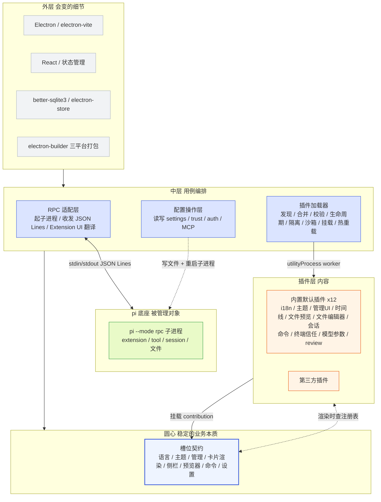
```mermaid
flowchart TD
    subgraph OUTER["外层 会变的细节"]
        ELECTRON["Electron / electron-vite"]
        REACT["React / 状态管理"]
        SQLITE["better-sqlite3 / electron-store"]
        BUILDER["electron-builder 三平台打包"]
    end
    subgraph MID["中层 用例编排"]
        RPCADAPT["RPC 适配层<br/>起子进程 / 收发 JSON Lines / Extension UI 翻译"]
        CFGOPS["配置操作层<br/>读写 settings / trust / auth / MCP"]
        LOADER["插件加载器<br/>发现 / 合并 / 校验 / 生命周期 / 隔离 / 沙箱 / 挂载 / 热重载"]
    end
    subgraph CORE["圆心 稳定的业务本质"]
        SLOTS["槽位契约<br/>语言 / 主题 / 管理 / 卡片渲染 / 侧栏 / 预览器 / 命令 / 设置"]
    end
    subgraph PLUGINS["插件层 内容"]
        BUILTIN["内置默认插件 x12<br/>i18n / 主题 / 管理UI / 时间线 / 文件预览 / 文件编辑器 / 会话<br/>命令 / 终端信任 / 模型参数 / review"]
        THIRD["第三方插件"]
    end
    subgraph PI["pi 底座 被管理对象"]
        PISUB["pi --mode rpc 子进程<br/>extension / tool / session / 文件"]
    end

    OUTER --> MID
    MID --> CORE
    PLUGINS -->|挂载 contribution| SLOTS
    SLOTS <-.->|渲染时查注册表| PLUGINS
    RPCADAPT <-->|stdin/stdout JSON Lines| PI
    CFGOPS -.->|写文件 + 重启子进程| PI
    LOADER -->|utilityProcess worker| PLUGINS

    classDef core fill:#eef4ff,stroke:#3b5bdb,stroke-width:2px;
    classDef mid fill:#dbe4ff,stroke:#3b5bdb;
    classDef outer fill:#f1f3f5,stroke:#adb5bd;
    classDef plugin fill:#fff4e6,stroke:#e8590c;
    classDef pi fill:#e9fac8,stroke:#2f9e44;
    class SLOTS core;
    class RPCADAPT,CFGOPS,LOADER mid;
    class ELECTRON,REACT,SQLITE,BUILDER outer;
    class BUILTIN,THIRD plugin;
    class PISUB pi;
```

**图 15 — pi-desktop 洋葱分层，依赖只向内**

#### 5.3.1 圆心是槽位契约

圆心是**槽位契约**——这是最稳定的业务本质，core 和插件之间的唯一耦合点。中层是用例编排：RPC 适配层（支柱①）、配置操作层（支柱②）、插件加载器（支柱③）。外层是会变的细节：Electron/React/sqlite/electron-builder，换 shell 技术栈只动这层，不动中层和圆心。插件层是内容，通过槽位契约和圆心交互，不直接依赖中层实现。pi 底座是被管理对象，和中层通过 RPC（运行时控制）和配置文件（状态管理）两条通道交互，但不被圆心依赖——圆心根本不知道 pi 的存在，它只知道"有 RPC 适配层和配置操作层提供的能力"。

#### 5.3.2 依赖方向严格向内

这个分层里，插件加载器和插件层的关系值得注意：加载器（中层）通过 utilityProcess worker 跑插件代码（插件层），但插件层和圆心的交互走槽位契约、不直接调加载器内部。这呼应 3.6 的"插件和 UI/RPC 通信走结构化消息"——插件不 import 中层实现，只通过槽位契约和注入的受控 API 交互。依赖方向严格向内：插件依赖圆心（槽位契约），不依赖中层（加载器实现）；中层依赖圆心，不依赖外层（shell 细节）；外层依赖中层，圆心谁都不依赖。

#### 5.3.3 守住依赖方向的判据

一个验证依赖方向是否守住的判据：如果把 Electron 换成 Tauri，哪些层要动？答：只动外层（shell 细节）和中层的 worker 实现部分（utilityProcess 换成 Node sidecar），圆心（槽位契约）和中层的接口定义不动、插件层不动、pi 底座交互不动。这就是洋葱架构的价值——稳定的圆心不被会变的外层污染。

## 6 已知缺口与边界

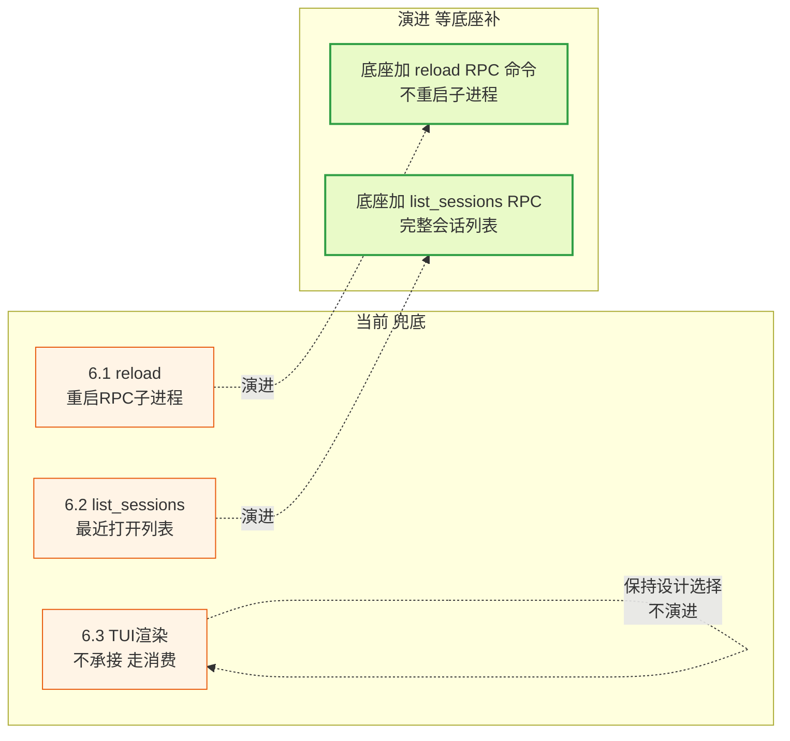
```mermaid
flowchart LR
    subgraph NOW["当前 兜底"]
        R1["6.1 reload<br/>重启RPC子进程"]
        R2["6.2 list_sessions<br/>最近打开列表"]
        R3["6.3 TUI渲染<br/>不承接 走消费"]
    end
    subgraph FUTURE["演进 等底座补"]
        F1["底座加 reload RPC 命令<br/>不重启子进程"]
        F2["底座加 list_sessions RPC<br/>完整会话列表"]
    end
    R1 -.->|演进| F1
    R2 -.->|演进| F2
    R3 -.->|保持设计选择<br/>不演进| R3
    classDef now fill:#fff4e6,stroke:#e8590c;
    classDef fut fill:#e9fac8,stroke:#2f9e44,stroke-width:2px;
    class R1,R2,R3 now;
    class F1,F2 fut;
```

**图 16 — RPC 缺口演进路线：reload/list_sessions 等底座补命令，TUI 渲染保持不承接**

### 6.1 底座无对外 reload 命令

#### 6.1.1 缺口确认

这是支柱②遇到的真实缺口，2.4 已经给了处置方案，这里收成显式记录。pi 底座内部有完整的 reload 能力（`SettingsManager.reload` / `ResourceLoader.reload` / `AgentSession.reload`），交互式 TUI 模式下也有 `/reload` 斜杠命令（`interactive-mode.ts:1676`），但 RPC 协议没有把 reload 暴露成对外命令——31 个命令里没有它，`pi reload` 这样的 CLI 子命令也不存在。所以桌面端没法通过一条命令让底座热加载配置/扩展。

#### 6.1.2 当前处置：重启子进程

当前处置：重启 RPC 子进程（写完配置文件 → 杀子进程 → 重新起 → 新进程从磁盘重读配置 = 变相 reload）。零改底座、确定性强、立即可用。代价是重启瞬间的运行态中断（streaming 中的 agent 被打断、排队消息丢），靠 session 持久化 + resume 缓解。

#### 6.1.3 演进项

这是演进项。未来底座如果补一个 reload RPC 命令（在 `RpcCommand` 联合类型里加 `reload`、`rpc-mode.ts` 的 `handleCommand` 加对应分支调 `session.reload()`），pi-desktop 切换到走 RPC reload——不重启子进程、不丢运行态、走统一 RPC 通道。这个切换对桌面端是支柱②热加载路径的内部实现变化，不影响槽位契约和插件层，所以是低风险的演进。在那之前，重启子进程是兜底方案，对"改配置"这种低频操作足够。

### 6.2 底座无对外 list_sessions 命令

#### 6.2.1 缺口确认

和 6.1 同类的缺口。底座内部有 `SessionManager.listAll()`（`session-manager.ts:1564`），返回 `SessionInfo[]`——能列出全部 session（带 path/id/cwd/name/created/modified/messageCount/firstMessage，结构见 1.7.4）。但 RPC 的 31 个命令里没有 `list_sessions`，桌面端无法通过 RPC 拿到这个列表。这导致 4.6 会话管理插件的"会话列表"功能当前不完整——桌面端只能切到已知路径的 session、记一份自己维护的"最近打开"列表，不能枚举底座全部历史 session。

#### 6.2.2 当前处置与演进

当前处置：桌面端不自己去扫 sessionDir（那违背 1.4"session 存储是底座内部事务"的边界、要解析底座 session 文件格式），而是记一份桌面端的"最近打开 session"偏好（存路径列表，不解析内容）。完整能力等底座补 `list_sessions` RPC 命令——在 `RpcCommand` 加 `list_sessions`、返回 `SessionInfo[]`，桌面端会话列表就完整了。这个缺口和 6.1 一样是"底座有内部能力、RPC 没开口子"，处置一致：等底座补、桌面端先用兜底。两个缺口一起向底座提（加 `reload` 和 `list_sessions` 两条 RPC 命令），是同一个"补 RPC 管理类命令"的演进方向。

### 6.3 现有方案 adapter 的 TUI 渲染吃不下问题

#### 6.3.1 缺口确认

这是 3.1 讲过的根因，这里从"缺口"角度再定位一次。底座 extension 的 UI 渲染能力（`ToolDefinition.renderCall/renderResult`、`registerMessageRenderer`）返回 `@earendil-works/pi-tui` 的 `Component`——终端 TUI 组件树。Web 桌面端吃不下 TUI Component。现有方案 的应对是造 adapter.json 当翻译层，结果翻车（纯声明、两套体系、第三方无法自带）。

#### 6.3.2 不承接的处置

pi-desktop 的处置是不承接这个问题。pi-desktop 不把自己定位成"底座 extension 的 UI 翻译层"，所以根本不需要吃下底座的 TUI 渲染。底座 extension 在桌面上要有 UI 时，做法是写一个桌面插件，这个插件通过 RPC（`get_commands`、订阅 `tool_execution_*`/`message_*` event、`get_entries`）主动消费底座数据，自己用 Web 技术渲染。这是单向消费，不是双向翻译，所以 TUI 渲染机制对桌面端完全无关。

唯一的边界是 Extension UI 子协议（1.9）的表达力上限：`setWidget` 只传字符串数组、`set_editor_text` 是单向的。这些是 RPC 模式的固有约束，桌面端接受这个上限——需要富 UI 的交互由桌面插件自己画、不指望底座通过 RPC 提供。这个边界是设计选择、不是缺陷：把"富 UI"的职责明确归给桌面插件层，而不是让底座 extension 跨进程画 Web 组件（那会重新引入 adapter 式的翻译复杂度）。

### 6.4 RPC 协议无版本协商

#### 6.4.1 缺口确认

盲审发现的、3 年后最可能烂掉的地方。pi-desktop 硬编码了 RPC 协议的 31 个命令及其返回类型（1.2/1.7），但没有版本协商机制——没有协议版本号、没有 feature detection、没有"未知命令优雅降级"。底座演进时命令会增删改（`RpcCommand` 联合类型会变），桌面端只能被动追兼容，追不上就崩或静默错。

#### 6.4.2 当前处置与演进

当前底座 RPC 协议是 v0.80.x 的快照、桌面端照着这个版本写。短期靠"桌面端和底座同版本发布"约束（pi-desktop 发版时 pin 一个底座版本）。但这不是长期解——底座独立演进、桌面端有自己发版节奏，迟早漂移。

演进方向：和 6.1/6.2 一起向底座提，补 RPC 的版本协商——底座启动时通过一条 `handshake` 命令暴露自己的协议版本和可用命令清单，桌面端据此 feature detection（有的命令才用、没有的降级或提示）。这把"硬编码 31 命令"变成"运行时发现能力"，是 RPC 层最该补的一条。在那之前，桌面端把 RPC 命令封装在一个版本化的适配层里（1.1.2 说的 RpcClient 等价层），底座协议变时只动这层、不动插件层——靠这层隔离缓解漂移冲击。这条和 6.1/6.2 是同一类"底座 RPC 该补的能力"，三个一起提。

#### 6.4.3 handshake 的具体设计

handshake 命令的设计（向底座提的演进方案，当前兜底走 6.4.2 的适配层）：

**时机**：RPC 子进程起来、就绪后（1.2.3 的 100ms 窗口之后），桌面端发任何业务命令前，先发 handshake 做能力探测。

**协议**：

```jsonc
// 桌面端发（stdin）
{ "type": "handshake", "id": "req_hs", "clientVersion": "0.1.0", "protocolConstraint": "^1.0" }
// 底座回（stdout，支持 handshake 时）
{ "type": "response", "command": "handshake", "id": "req_hs", "success": true,
  "data": {
    "protocolVersion": "1.0",
    "piVersion": "0.91.0",
    "availableCommands": ["prompt","steer",...,"reload","list_sessions"],  // 含 31 + 演进新增
    "features": { "streaming": true, "autoRetry": true, "extensionUi": true }
  }
}
```

**降级决策树**（桌面端收到 handshake 响应后）：

```mermaid
flowchart TD
    SEND["发 handshake"] --> RESP{"底座回应?"}
    RESP -->|"success: handshake 命令存在"| VERCHECK{"protocolVersion<br/>满足 constraint?"}
    RESP -->|"error: Unknown command: handshake"| OLD["底座版本旧、不支持 handshake"]
    VERCHECK -->|满足| OK["记 protocolVersion + availableCommands"]
    VERCHECK -->|不满足| INCOMPAT["视为不兼容<br/>提示用户升级/降级底座<br/>可选退回假定旧快照降级"]
    OK --> USE{"后续发命令前"}
    USE -->|"命令在 availableCommands"| CALL["正常发"]
    USE -->|"命令不在清单"| DEGRADE["降级:\nreload→重启子进程\nlist_sessions→最近打开列表"]
    OLD --> ASSUME["假定 v0.80 快照、用硬编码31命令、不期待 reload/list_sessions"]
    ASSUME --> USE
    INCOMPAT --> STOP["停止业务命令<br/>仅允许只读或退出"]
    classDef send fill:#e9fac8,stroke:#2f9e44;
    classDef dec fill:#fff4e6,stroke:#e8590c,stroke-width:2px;
    classDef act fill:#eef4ff,stroke:#3b5bdb;
    classDef warn fill:#ffe3e3,stroke:#fa5252;
    class SEND send;
    class RESP,VERCHECK,USE dec;
    class OK,CALL,ASSUME act;
    class OLD,DEGRADE,INCOMPAT,STOP warn;
```

**图 21 — handshake 降级决策树：底座支持就 feature detection、不支持就假定旧快照、版本不满足 constraint 就视为不兼容**

**关键设计**：

- handshake **不强制底座改**——底座没补这个命令时，按 RPC 协议返回 `{ success: false, error: "Unknown command: handshake" }`（1.4 的 default 分支），桌面端捕获这个 error、走"假定旧版本"降级路径。所以桌面端可以**先于底座**实现 handshake 客户端逻辑、向后兼容旧底座。
- **protocolVersion 不满足 constraint 的处置**：底座回了 `success: true` 但 `protocolVersion` 不满足桌面端发的 `protocolConstraint`（如桌面端要 `^1.0`、底座回 `2.0` 或 `0.9`）时，桌面端视为**协议不兼容**——向用户提示"底座版本不兼容，建议升级/降级 pi 底座至与桌面端 ^1.0 匹配的版本"，并停止发送业务命令（不再假定旧快照、也不强行发命令，避免协议语义错乱）。可选地，若桌面端自身实现了旧快照兼容路径，可退回"假定 v0.80 快照"降级运行，但默认行为是停止业务命令、只允许只读或退出，由用户决定升级底座还是降级运行。constraint 比对按语义化版本 range（`^`、`~` 等）匹配，匹配不了的字符串原样比较失败即视为不满足。
- 命令白名单隔离：RPC 适配层（gateway/rpc-adapter）维护一个"已知命令集合"（来自 handshake 或硬编码 31），调用前检查 `if (!availableCommands.has(cmd))` → 记 warning + 走降级。**白名单只对 `rpc.send` 逃生舱生效**：插件经 `context.rpc.send(cmd)` 发的命令在运行时查白名单，命中未知命令（不在 availableCommands）时**拒绝、reject 一个 `UnsupportedCommandError`**（不是静默 warning），让插件能 catch 并自行降级——插件据 reject 区分"命令没发出去（UnsupportedCommandError）"和"发出去了但底座报错（底座 response success:false）"。而 PluginContext.rpc 的便捷方法（`prompt`/`steer`/`getState` 等）编译期就对应到桌面端打包时 pin 的底座快照那 31 个命令、不在运行时再查白名单——它们的名字在快照里是固定的，运行时若底座缺了某个便捷方法对应的命令，底座会回 `{ success: false, error: "Unknown command: ..." }`、便捷方法把它转成 reject 返回（非 UnsupportedCommandError、是底座错误）。这条区分让逃生舱有运行时探能力、便捷方法有编译期稳定性。对返回类型用 `?.` 链式访问 + 类型卫士，防止底座增删字段导致反序列化崩溃。
- 版本协商走 handshake、不走环境变量或文件——handshake 和 RPC 协议同通道、一次往返拿到全部能力，最简单可靠。
- **availableCommands 是完整清单**：底座返回的是该版本支持的**全部**命令（含旧的 31 个 + 新增的），不是增量。桌面端据此判断每个命令能否用——不假设"旧命令一定在"。
- **handshake 时机与缓存**：子进程启动后、发任何业务命令前发一次 handshake，结果缓存到子进程关闭。**热加载重启子进程后（2.4）要重新 handshake**——新进程等 100ms 就绪窗口（1.2.3）后、第一件事发 handshake 重新探测能力，再按新清单发后续命令。不缓存跨进程的能力探测结果。
- 这套设计让 6.1/6.2 的 reload/list_sessions 缺口也能优雅降级：底座没补 handshake → 假定没有这俩命令、走当前兜底；底座补了 handshake 但命令清单里没这俩 → 也走兜底；清单里有 → feature-detect 地用。三个缺口（handshake/reload/list_sessions）一起靠 handshake 通道收敛。

### 6.5 文件锁需底座配合，当前纯桌面侧 advisory

#### 6.5.1 缺口确认

4.12 文件编辑器插件要协调"用户直写"和"agent 改"同一文件的并发。理想流程是 agent 改文件前先查锁、被锁则走 Extension UI confirm 问用户。但底座的 edit/write 工具没有"先查桌面端锁文件"的逻辑——底座 agent 工具不会自动去读一个桌面端私有的 `<cwd>/.pi-desktop/file-locks.json`。要让"底座先查锁"必然要改底座，这和"不依赖底座改动的弱协调"直接矛盾。

#### 6.5.2 当前处置与演进

**当前兜底**（纯桌面侧 advisory lock）：编辑器打开文件时取 advisory lock、存本地锁文件、编辑器侧自己提示"该文件正被编辑"。这个锁**只给编辑器自己看、不阻止 agent 覆盖**。agent 改了同一文件后，编辑器靠"变更通知"（订阅 `tool_execution_*` event、检测到打开的文件被 agent 改了）提示用户重新加载——这是编辑器的标准"外部修改检测"，不依赖 agent 查锁。

**演进项**：和 6.1/6.2 一起向底座提，补 `query_file_lock`/`acquire_file_lock` RPC 命令——底座 agent 的 file 工具改文件前查桌面端锁、被锁则走 Extension UI confirm 问用户（1.9 的 confirm 子协议跨进程）。这是"底座该补的能力"类缺口，补齐后才能真正实现"agent 改文件前查锁"。在那之前，用户和 agent 并发改同一文件有覆盖风险、靠变更通知缓解。诚实承认这条兜底是"纯桌面侧、不阻止覆盖"，不说"底座会先查锁"。

## 7 QA

这一节收的是读者/实现者会真实卡住的边界场景和取舍，不是 filler。每条独立可读。

### 7.1 底座无 reload 命令，改了配置怎么生效

**Q：底座 RPC 没有 reload 命令，桌面端改了配置怎么生效？为什么不直接让底座 watch 配置文件？**

走重启 RPC 子进程：桌面端写完配置/扩展路径列表到磁盘，杀掉当前 `pi --mode rpc` 子进程、用 `args: ["--session", sessionFile]` 重起一个（resume 同一 session）。这是当前唯一路径，因为底座 RPC 的 31 个命令里没有 reload，`pi reload` CLI 也不存在（底座的 reload 是进程内部方法、交互式 TUI 有 `/reload` 但 RPC 模式下 prompt 里写 `/reload` 只是普通文本、不触发 reload）。

不直接让底座 watch 配置文件，是因为底座的设计选择就是"热加载显式触发、不做持久 file watcher"（2.2）——这避免了"改半个文件就被加载到不一致状态"的竞态。桌面端用"写完整 + 重启"替代，确定性更强。代价是重启瞬间的 turn 丢失（见 7.3），对改配置这种低频操作可接受。这是已知缺口 6.1，演进项：未来底座补 `reload` RPC 命令后，桌面端切到走 RPC reload、不重启子进程。

### 7.2 会话列表为什么列不出全部历史 session

**Q：桌面端的"会话列表"为什么列不出全部历史 session？**

因为底座内部有 `SessionManager.listAll()` 能列全部 session（返回 `SessionInfo[]`，带 path/id/cwd/name/created/modified/messageCount），但 RPC 没暴露这个命令——和 reload 一样的缺口（6.2）。桌面端当前只能切到已知路径的 session（当前 sessionFile 从 `get_state` 拿）、记一份自己维护的"最近打开"列表，不能枚举底座全部历史 session。桌面端**不**自己去扫 sessionDir 解析 session 文件——那违背 1.4"session 存储是底座内部事务"的边界、要理解底座 session 文件格式。等底座补 `list_sessions` RPC 命令后这个能力完整。两个缺口（reload + list_sessions）是同一个"补 RPC 管理类命令"的演进方向，一起向底座提。

### 7.3 重启子进程时正在跑的任务怎么办

**Q：重启 RPC 子进程时，agent 正在跑的任务怎么办？排队的消息为什么丢？**

桌面端先 `get_state` 查 `isStreaming` 和 `pendingMessageCount`，判定口径是"是否已落定"（`isStreaming === false && pendingMessageCount === 0`，等价于 `agent_settled` 已触发，见 2.4.2）：已落定直接重启；streaming 中或 `pendingMessageCount > 0` 时弹提示让用户决定打断还是等 `agent_settled`。streaming 时若用户选打断，当前 turn 的进行中输出会丢；有 pending 时若用户选打断，队列里已入队但尚未处理的 steer/followUp 消息也会丢。

排队的消息（pending messages）丢，是因为它们是底座进程的**内存队列**、还没落进 session 文件——session 文件持久化的是已经处理完的 entry（消息历史、分叉树），不是内存里的待办队列。进程死了内存态自然丢，这和 session 持久化不矛盾（持久化的是已完成、内存是待办）。不"重启前 dump pending 再 replay"是因为：pending 消息的语义依赖它入队时的 agent 状态（比如一条 steer 是针对当时的流式方向的），重启后状态变了，replay 可能语义错乱。低频操作下接受丢失，UI 上提示"有 N 条排队消息因重启未执行"。重启后新进程用 `--session` resume 同一 session 文件，已完成的历史和分叉树都在。

### 7.4 内置插件被覆盖，用户怎么知道

**Q：用户级/项目级插件覆盖了内置插件，用户怎么知道？**

加载器合并时记录覆盖关系（3.4），管理 UI（4.3 基础管理 UI 插件的扩展管理页）展示"内置 X 被用户级/项目级 Y 覆盖"。覆盖是允许且正常的——内置插件优先级最低（`builtin`）、就是设计来被覆盖的。但覆盖不能静默发生，必须显式提示，否则用户会困惑"内置的怎么不一样了"。覆盖粒度是整个插件（3.4），不是单个贡献项拼贴。

### 7.5 纯 renderer / 纯 worker / 双入口怎么选

**Q：写插件时，纯 renderer（只 renderer）、纯 worker（只 main）、双入口（main + renderer）怎么选？**

按"要不要在 worker 侧跑逻辑"选。纯 renderer：只渲染、不需要发 RPC 命令不需要加工数据（cardRenderer 用 core props 喂数据、静态展示组件），最省、不起 worker。纯 worker：只需要在后台跑逻辑（订阅 event 做统计、定时发 RPC），UI 用内置渲染器或不在 UI 上有贡献，不起 renderer 模块。双入口：既要后台逻辑又要自定义 UI，worker 加工数据 `emitToRenderer` 推给 renderer 组件。三条路都正常、按需选，不是优劣分层——简单插件尽量纯 renderer 或纯声明式，零 worker 零 renderer 模块的纯声明式插件开销最小。

### 7.6 沙箱禁了 fetch，怎么请求外部 API

**Q：插件需要请求外部 API（比如统计上报、拉第三方数据），沙箱禁了 fetch 怎么办？**

用 `PluginContext.http.fetch(url, opts)`（worker 侧），它走 core main 代理、受 manifest `permissions` 声明的域名白名单约束。在 `plugin.json` 声明 `"permissions": ["net:api.example.com"]`、用户在管理 UI 授权后，`context.http.fetch` 才能访问该域名。未声明未授权的域名请求会抛错。这是显式声明 + 用户授权的网络能力，不是无限制 fetch——防止恶意插件偷偷外传数据。renderer 侧没有 `http`（UI 代码不该直接发网络请求），要拉数据走 worker 中转或 `pi.rpc`。

### 7.7 翻译缺失时显示什么

**Q：插件文案翻译缺失时显示什么？第三方插件不贡献语言包能用吗？**

core 渲染文案时按 key 查语言槽，查不到 fallback：先回退到默认 locale（en），再查不到用 key 本身（如 `timeline.toolExecuting`）。第三方插件只填 `displayName`/`label` 的字面值、不贡献语言包翻译，也能正常工作——显示字面值（4.2 的 fallback 机制）。所以语言包是"锦上添花"，不是插件可用的前提。core 自己不内嵌任何文案常量——连"加载中""错误"这些 core 自身渲染的文案也走语言槽，取不到用 key 本身（这是 core 极薄的代价：启动阶段 i18n 插件还没加载时，core 渲染的极少数文案会显示 key 本身，可接受）。

### 7.8 底座 extension 和桌面插件能同名共存吗

**Q：一个底座 extension 和一个桌面插件能不能同名共存？桌面插件能"对应"某个底座 extension 吗？**

能同名、但它们是两套独立体系，不靠名字关联。桌面插件的 id 在桌面插件体系内唯一（项目/用户/内置三处优先级覆盖），底座 extension 的标识在底座 extension 体系内（settings.json 的 extensions 路径列表）。两者命名空间不冲突——一个叫 `foo` 的桌面插件和一个叫 `foo` 的底座 extension 可以同时存在，互不干扰。桌面插件要"对应"某个底座 extension（为它提供 UI），靠的是数据消费：桌面插件通过 `rpc.getCommands()` 拿到该 extension 注册的命令、通过 event 流观察它注册的工具调用，自己决定怎么呈现（3.7）。这个对应关系是行为上的（插件去观察底座 extension 产生的事件/命令），不是声明上的（没有"这个桌面插件归属那个底座 extension"的字段）。这也是 pi-desktop 不重蹈 现有方案 adapter 覆辙的关键：不做"扩展-adapter"的声明式配对，桌面插件自己主动消费。

### 7.9 术语不熟怎么办

**Q：文档里的 jiti / utilityProcess / MessagePort / 洋葱架构 / MCP 这些术语，不熟怎么办？**

这些是设计文档假设读者具备的开发者常识，不展开解释。简要锚点：jiti 是 TS/ESM 运行时加载器（底座 extension 用它动态加载 TS）；utilityProcess 是 Electron 的 Node 子进程 API（提供进程级隔离，桌面插件 worker 跑在这）；MessagePort 是 Web/Electron 的跨进程序列化消息通道（worker↔renderer 通信用）；洋葱架构是依赖只向内的分层范式（圆心是稳定业务本质、外层是会变细节，见 5.3 的分层图）；MCP 是 Model Context Protocol（底座连外部工具服务器的协议，MCP 管理页管的就是这些 server）。不熟某个的话，按这个锚点知道它在本文里的角色即可，不展开不影响理解架构主线。

### 7.10 终端与项目信任是否该拆成两个插件

**Q：4.8 把"终端 bash 执行"和"项目信任运行时流程"放在一个插件里，是不是违反高内聚？该不该拆成两个插件？**

是盲审指出的内聚问题。当前放一起的理由是"两者都围绕'用户和项目交互'的场景"——信任流程常在用户首次打开终端执行命令时触发，逻辑上有交集。但这确实是两个职责：bash 执行是数据流（发 RPC 命令、渲染输出），信任流程是状态流（读写信任记录、和 4.3 管理页协作）。拆不拆是边界取舍：

- 拆：两个插件各自高内聚，但信任流程要订阅"用户首次执行 bash"这件事，得通过事件总线（3.2.4 的 `context.bus`）从终端插件拿信号，多一层跨插件耦合。
- 不拆（当前）：逻辑交集内聚在一个插件，代价是 4.8 承担两个职责。

当前选不拆，理由是交集紧、拆开反而要造跨插件信号。但如果未来信任流程复杂到独立成块（比如加权限审批流），就该拆——那时 4.8 拆成"终端插件"+"信任流程插件"，终端插件往事件总线发 `user.firstBash` 信号、信任插件订阅。这是开放的演进，不是硬性错误。

### 7.11 多窗口/多项目怎么办

**Q：文档全程假设单窗口单项目。如果用户开多个窗口、每个连不同项目的底座，怎么办？**

当前设计是单窗口单底座子进程。多窗口意味着多 RPC 子进程——每个窗口一个 `pi --mode rpc` 子进程、各自的 RPC 适配层实例。这要求 RPC 适配层做成可实例化的（不是单例），core main 进程管理多个子进程的生命周期。插件 worker 是否每窗口独立还是共享，是后续设计点——当前文档没展开，是多窗口场景的第一个要解决的架构问题。多项目同窗口（一个窗口连多个底座）更复杂，暂不支持。这条记为多窗口演进的起点，不是 v1 范围。

### 7.12 review 评论怎么让 agent 知道哪段被评论

**Q：review 插件攒的评论，agent 收到后怎么知道每条评论针对的是哪段？会不会乱套？**

不会乱套，靠定位锚点（4.10.5）。发送时 review 插件把每条评论格式化成"锚点 + 评论文本"的结构化文本，附在输入框总消息后一起发 `prompt`。锚点分两种：

- 对话内容评论：锚点是 `消息 #<entryId> 的 "<选区原文>" 段`。entryId 是底座 session 稳定 id，agent 能在 `get_entries` 里定位这条消息；选区原文是用户划的那段文字，agent 按原文匹配定位段。
- 文档评论：锚点是 `<文件路径>:<起始行>-<结束行>`。agent 收到路径+行能直接 `read`/`edit` 定位。

格式化后整条消息大概长这样（举例）：

```
请按以下评论逐条修改：

[消息 #m_42 的 "async function loadConfig()" 段]
评论：这里应该加 try/catch，配置文件可能不存在。

[src/config.ts:15-23]
评论：这段重复了上面的逻辑，抽成函数。

[消息 #m_50 的 "return result" 段]
评论：result 在错误时是 undefined，要处理。
```

agent 看到这种结构，能逐条按锚点定位、分别回应。锚点的稳定性由 entryId（底座保证稳定）和文件路径+行保证——review 插件不自己发明锚点格式、只用这两类稳定标识。如果用户评论后 agent 改了内容、entryId 还在（entry 不可变、改是新增 entry），锚点仍指原段、不会失效。

**关键**：review 不绕过输入框发送——锚点序列化进的是普通 prompt 消息文本，底座照常处理、不感知 review 机制。这守住了"review 只组装、输入框才发送"的边界（4.10.4）。

