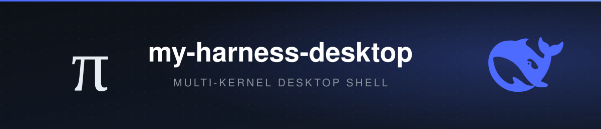

<h1 align="center">my-harness-desktop</h1>

<p align="center"><em>I'm not the harness — I'm just the harness's dispatcher.</em></p>

<p align="center"><a href="README_zh.md">中文</a> · English</p>

<p align="center">
  
  
  
  
  
</p>

> **Put pi and DeepSeek Harness on your desktop** — one shell, two peer kernels, 50 plugins, all in one window.

<p align="center">
  ⭐ Find it useful? Leave a <a href="https://github.com/GOODDAYDAY/my-harness-desktop">star</a> — it makes the author's day.
</p>

---

## What is this

**You use pi or DeepSeek Harness (DSH) in a terminal to write code, but you want a visual interface** — what your session branches look like, which files changed, how many tokens you've burned, ideally all in one window, and extensible with plugins the way you'd add browser extensions.

- Want to **see it all**: session tree, file tree, Git Review, and a token dashboard — in one window.
- Want to **extend it your way**: install plugins on demand, instead of waiting for a release.
- Want **both kernels**: pi and DSH hosted as peers, switchable at any time.

**my-harness-desktop is that shell.** It hosts pi and DSH as two peer kernels — neither is more built-in than the other: **pi** is the open-source terminal coding agent started by Mario Zechner ([pi.dev](https://pi.dev)), whose core is deliberately minimal and leaves everything else to extensions; **DeepSeek Harness** (DSH, the whale mark) is another peer kernel. The shell provides mechanism only: each kernel runs as a managed subprocess — pi over JSONL RPC (one JSON message per line on stdin/stdout), DSH over stdio JSON-RPC — and the entire UI is assembled from 50 built-in plugins, rather than wrapping a terminal UI in a window.

<p align="center">
  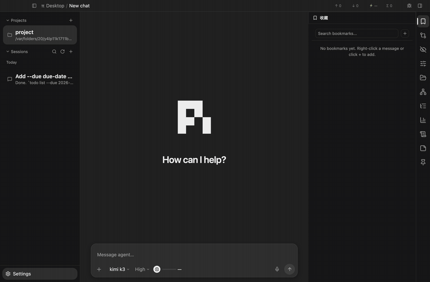
</p>

Here's what it looks like running: the conversation stream, sidebar, and side panel, all in one window.

## ✨ What you get

| Capability | What it does |
|---|---|
| 🧠 Two peer kernels | pi and DeepSeek Harness (DSH) are interchangeable peers, each with its own version install and model config; switching kernels = switching adapters, the UI doesn't move |
| 🌳 Session tree | git-graph-style branch map; fork / bookmark / jump-to-message from any node |
| 📁 File tree | VSCode-style lazy-loaded file tree, paths sandboxed to the project root |
| 🔍 Git Review | three diff views (round / conversation / working tree); select files to commit precisely, push with one click |
| 🤖 Sub-agent orchestration | dispatch work, parallel fan-out, war-room multi-subagent collaboration, parent-child lifecycle |
| 🕵️ Blind review | independent red teams review in isolation + a judge consolidates — no more "grading your own homework" |
| 📊 Token dashboard | three scopes (round / session / project total), real-time, purely event-driven |
| 💬 Inline comments | select a text span in a message, attach a comment, delivered to the model merged into the next message |
| 🎨 Themes | light/dark base + 7 color schemes (ChatGPT / Everforest / Midnight / Mocha / New York / Stone / Terminal), pure JSON declarations |
| 🌍 i18n | Simplified / Traditional Chinese, English, German; third-party plugins can override any copy key |
| 🔌 Plugin system | 50 built-in plugins ship with the shell, ready out of the box, on the same loader and contracts as third-party plugins — overridable, deletable |

> 📌 All of these come from built-in plugins, architecturally equal to third-party plugins. Full catalog: [§3.4 Built-in plugins](#34-built-in-plugins).

## 🚀 60-second quick start

```bash
bash scripts/setup.sh   # installs Node (>= 18) if missing, then npm install; Windows: scripts\setup.ps1
npm run dev             # electron-vite dev mode, opens the window
```

Once the window opens: install a kernel on the Settings page (gear icon, bottom-left) — pi or DSH, or both → configure provider and API key on the "Models" tab → back on the main screen, pick a working directory, create a session, pick a kernel, and chat. Full steps: [§2 Getting it running](#2-getting-it-running).

## 💡 1 Design philosophy: from pi to desktop

### 1.1 pi's philosophy

One sentence in pi's README sums up its entire design: *aggressively extensible, so it doesn't have to dictate your workflow*.

Things pi refuses to do:

- The core gives you only four tools: `read`, `write`, `edit`, `bash`. The model does everything with these four; everything else is an add-on.
- No MCP (Model Context Protocol) — write a CLI tool with a README (pi calls it a skill), or write your own extension to add MCP support.
- No sub-agents — run multiple pi instances in a terminal multiplexer like tmux, or install an extension package that does it your way.
- No permission popups — run in a container, or build a confirmation flow that meets your own security requirements with an extension.
- No plan mode, no built-in to-do, no background bash — the answer to each one is the same: build it yourself if you want it.

The beauty is not that it has few features — it's that every "no" gives the choice back to the user: features don't enter the core, everyone assembles their own workflow. The core therefore stays small enough to be fully understood, while the ecosystem can grow faster than any vendor's roadmap. The full argument is in the Philosophy section of pi's README and Mario Zechner's long-form design post, [pi-coding-agent](https://mariozechner.at/posts/2025-11-30-pi-coding-agent/).

### 1.2 The same medicine, applied to the desktop

my-harness-desktop applies the same principle to the desktop shell:

- **The shell's functional content approaches zero.** The shell is the mechanism code my-harness-desktop provides itself: loader, slot contracts, RPC adapters, config read/write, permission sandbox, event bus. Copy, colors, admin pages, rendering logic, business branches — all shell plugins, none welded into the shell.

- **The kernels are not plugins; they're managed resources.** pi and DSH are two peer kernels — independent subprocesses the shell manages over RPC, the same layer of abstraction as git and the file system. Neither is more built-in than the other.

- **Built-ins get no privileges.** Delete any built-in plugin and the shell still starts, you just lose that feature; built-ins and third-party plugins go through the same loader and the same contracts, and built-ins have the lowest priority and can be overridden.

This model has an industrial-grade sample on the desktop: VSCode — its language packs, themes, and default renderers are all extensions, not hard-coded. my-harness-desktop borrows its architectural discipline (thin shell + slot contracts + no privileged status), but not its API shape: that's optimized for a code editor. my-harness-desktop's slots are the session list, settings pages, themes — optimized for a conversational desktop app.

### 1.3 my-harness-desktop's own increments

On the desktop, my-harness-desktop adds three of its own judgments:

- **Consume, don't translate.** It never translates a kernel's terminal UI — no adapters that turn a terminal component tree into a web component tree. The kernels emit structured data over RPC; desktop plugins take the data and decide how to draw it themselves. The translation layer is gone entirely: a third party that wants UI on the desktop just writes a desktop plugin — no need to contribute JSON to the shell and wait for a release.

- **Slot contracts.** The shell predefines mounting points — sidebar, main view, settings pages, themes, languages, etc. — plugins mount content onto slots, and the shell only knows contracts, not specific plugins. Swap out every plugin and the shell mechanisms don't change a line.

- **The shell handles the generic, specialization goes to plugins.** Things every settings page needs — save / dirty / interception / refresh — are centralized in the shell; plugins only render UI and report changes. Dozens of plugins' save logic went from dozens of copies to one.

Full argument: [docs/DESIGN.md](docs/DESIGN.md).

## 2 Getting it running

### 2.1 Environment requirements

- Node.js 18 or higher (electron-vite's requirement; the dev machine actually uses Node v25).
- macOS is the platform that has been verified in development. `npm install` runs a postinstall script that renames and re-icons the dev-mode Electron.app — that's macOS-only, skipped silently on other platforms. Windows / Linux have no known platform-specific blockers — the dependencies are all cross-platform (Electron / React / Node) — but nobody has fully tested them end to end.

### 2.2 Two commands

A bootstrap script detects your environment, installs Node.js if missing, then runs `npm install`:

```bash
bash scripts/setup.sh                                          # macOS / Linux
powershell -ExecutionPolicy Bypass -File scripts\setup.ps1     # Windows
```

Or do it manually:

```bash
npm install   # installs dependencies; postinstall renames/re-icons the dev-mode Electron.app
npm run dev   # electron-vite dev mode, opens the window
```

If Windows reports `'env' is not a command`, the npm script calls the Unix `env` — run `npm run dev` from Git Bash instead.

After the window opens, install a kernel and configure its models, all on the Settings page (gear icon at the bottom of the left sidebar). Two peer kernels are available — pick either, or both:

- **pi** — on the "Pi" tab (pi-manager plugin), install a pi version: pi is the `@earendil-works/pi-coding-agent` package on the public npm registry (the UI lists available versions, pick one and install — it is not distributed with the repo). Then on the "Models" tab, configure a provider and API key (supported providers are decided by pi — Anthropic, OpenAI and other mainstream ones are all there; keys come from the respective provider's site).
- **DSH** — on the "DSH" tab (dsh-manager plugin), install the DSH kernel — the `@deepseek-ai/dsh-sdk-jsonrpc-demo` package plus its Cordis plugin set. Then configure the model and API key on its models tab, and manage its Cordis plugins on the extensions tab.

Back on the main screen, pick a local directory as the working directory (any code project works) in the left sidebar, create a session, pick a kernel, and start chatting.

Other useful commands:

- `npm run build` — builds artifacts into `out/`.
- `npm run typecheck` — full `tsc --noEmit` type check.
- `npm run lint` — ESLint over `src/plugins/`, zero-warning threshold.
- `npm start` — runs the built artifacts in `out/` directly, with `--remote-debugging-port=9222`.

### 2.3 Building installers (stable and dev versions coexist)

```bash
npm run dist       # builds an installer for the current platform into dist/
npm run dist:all   # one mac builds all three: mac(.dmg/.zip) + Windows(nsis/.zip) + Linux(AppImage/.deb)
npm run pack       # directory form only (no installer), for quickly validating the packaged state
```

Artifacts are unsigned: on macOS, first open goes through right-click → Open to pass Gatekeeper; on Windows, SmartScreen's "Run anyway". Signing / notarization requires a developer certificate — that's a separate topic.

**Data directory split**: packaged installs (`app.isPackaged`) read and write `~/.my-harness-desktop/`, while `npm run dev` / `npm start` dev builds use `~/.my-harness-desktop-dev/` — keep a stable release installed for daily use and iterate freely on dev builds; the two sides never pollute each other. Two exceptions that don't split: the kernels' own config dirs — `~/.pi/agent/` (pi's models and settings, shared by both versions — configure once) and `~/.dsh/` (DSH's settings.yaml) — plus project-level `<cwd>/.my-harness-desktop/` (travels with the project). To have a dev build inherit stable-version data on first launch: `cp -r ~/.my-harness-desktop ~/.my-harness-desktop-dev`, then delete the parts you want isolated.

**Window and platform adaptation**: macOS uses the native traffic lights; Windows/Linux use a frameless window with a self-drawn title bar including min/max/close buttons (via `window:*` IPC). spawn calls on win/linux (npm install, pi CLI) have `.cmd`/shell adaptation, but those two platforms haven't been tested on real hardware — the first person to run on Windows / Linux is the validator.

## 🏗 3 Understanding the architecture in three minutes

### 3.1 The one-sentence model

Three layers, each doing one thing: the **kernels** are capability (the pi and DSH subprocesses, driven over RPC), the **shell** is mechanism (loader, slots, config, permissions), and **plugins** are content (all UI and features). The shell doesn't know specific plugins, only slot contracts; plugins don't touch shell internals — they get a controlled API only through the two public surfaces `packages/contract` and `packages/react`.

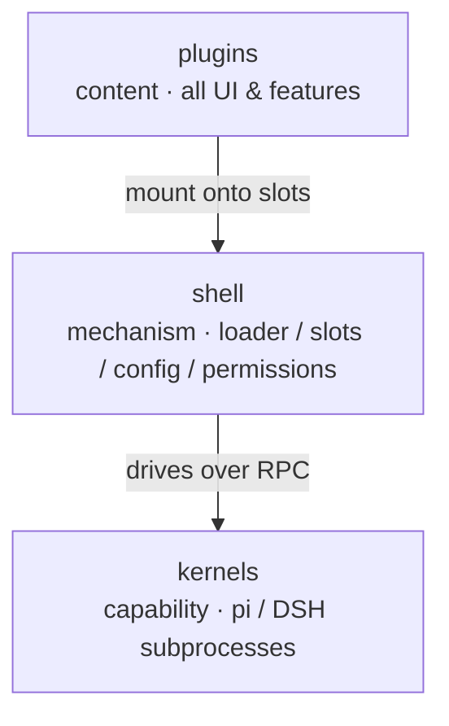

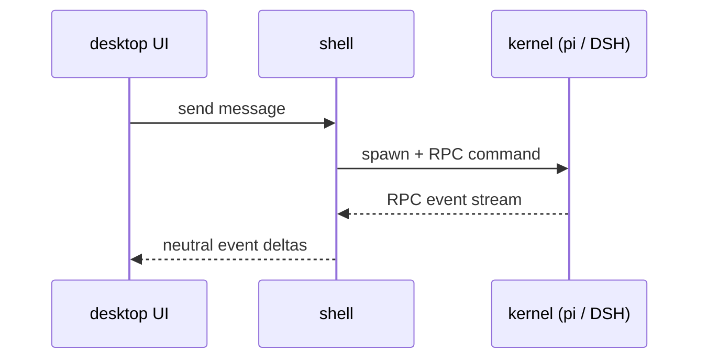

### 3.2 Directory layout

```
src/
  core/         # the center: domain(slot contracts, neutral types, pure functions, zero deps) + protocol(protocol contracts & translation)
                #   + application(use-case orchestration: loader, config, sessions, theme/i18n merge)
  api/          # inbound adapters: ipc(main-process IPC handlers, split by capability domain) + preload(window.pi bridge)
                #   + renderer(React entry, slot shells, plugins-host, stores)
  client/       # outbound adapters: pi + dsh(kernel RPC adapters, subprocess lifecycle) + fs + git + npm
  bootstrap/    # assembly root: Electron main entry — reads env, builds deps, injects MainContext, manages the window
  plugins/      # content layer: every feature, grouped into six domains(themes/sessions/project/insight/manager/system)
packages/
  contract/     # public surface: re-exports of domain + path/style preset contracts
  react/        # public surface: React components & hooks, the only API entry plugins are allowed
  pi-cli/       # landing spot for the pi kernel copy when packaging (empty in the repo; at dev runtime the app installs the kernel into ~/.my-harness-desktop/)
```

"Neutral" means dependent on no framework and no runtime — pure TypeScript types and structured data, unaffected by swapping Electron or React.

Dependencies point inward only: `core/domain/` imports no external packages, and `plugins/` references types and APIs only through `packages/`. The former is physical — there's no external package to import inside `core/domain/`; the latter is enforced by ESLint — plugin imports that reach into `src/` internals get blocked by lint.

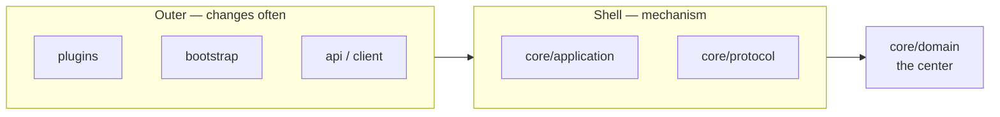

### 3.3 Slot overview

The shell's predefined mounting points; plugins mount content onto slots. The seventeen that currently have implemented contribution interfaces:

- **`sidebar`** — the left sidebar: session list, project list.
- **`sidePanel`** — the right panel: session tree, Git review, file tree, token stats.
- **`mainView`** — the center main view: the session message stream contributed by the timeline plugin.
- **`titlebar`** — buttons on the right side of the title bar.
- **`settings`** — settings pages: pi management, model management, theme management, languages, etc.
- **`settingsGroups`** — generic settings field groups: pure-JSON declarations that mount a box of fields onto the "General" settings page; a generic renderer turns them into controls — zero rendering code in the contributing plugin.
- **`themes`** — theme color schemes.
- **`languages`** — language packs.
- **`messageRenderers`** — custom cards by message role/kind, overriding the default rendering.
- **`messageActions`** — action buttons on messages (copy, bookmark, retry, etc.).
- **`blockRenderers`** — block-level renderers in the session stream: tool cards, thinking chains, user bubbles, Markdown text, dividers, resolved by a two-key lookup (block type, tool name/kind); third parties can claim or override a single block's rendering by name (e.g. draw a card for a new tool); the built-in batch is contributed by the message-blocks plugin (blocks) and the markdown plugin (text).
- **`codeBlockRenderers`** — fenced-code-language renderers inside text blocks: plugins claim languages (`mermaid`, `puml`…) and the markdown renderer dispatches fenced blocks to them; third parties add new diagram/chart languages without touching the markdown plugin. The built-in batch is contributed by the mermaid, puml and graphviz plugins.
- **`fileActions`** — file context actions (e.g. blind review a file).
- **`fileIcons`** — file tree row icons (extension/filename → icon mapping, overridable by key).
- **`sessionGroupings`** — session grouping strategies (nested sub-sessions).
- **`composerPolicies`** — conditional input rendering policies (read-only notice bars).
- **`systemPrompts`** — injecting system prompt files into kernel session spawns.

The center's `SlotName` type also has four reserved names — `management` / `cardRenderers` / `viewers` / `commands` — whose contribution interfaces aren't implemented yet; declaring them in `plugin.json` (a plugin's manifest) is ignored.

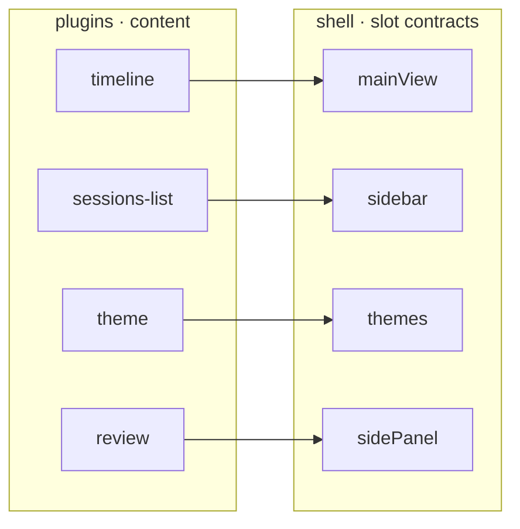

### 3.4 Built-in plugins

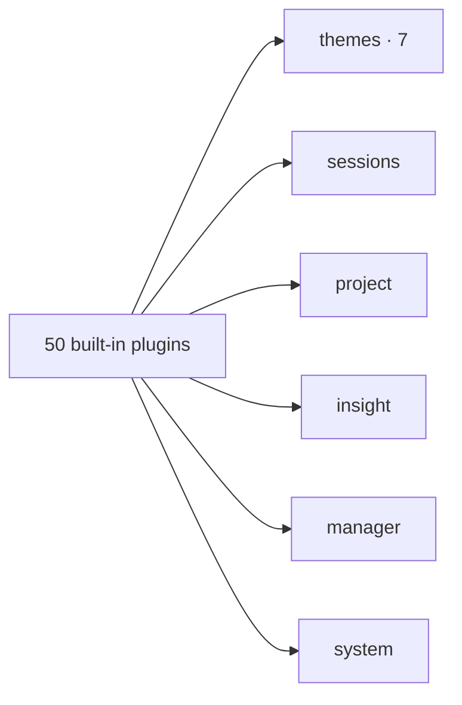

50 built-in plugins ship with the shell, ready to use, and architecturally equal to third-party plugins — overridable, deletable. The three most representative come first (bookmarks, notes, pins), then the rest grouped by domain (matching `src/plugins/`; the seven themes merge into one section). Plugins with a dedicated design doc are under `docs/plugins/` (covering about half of them — start with the one whose responsibilities sound closest to what you want to do).

#### 3.4.1 session-bookmarks

Save a valuable node in a session as a persistent snapshot. pi's fork is immediate and follows the original session — delete the original and the branch is gone; bookmarks solve "save this node, restart from that point later". A bookmark = a full JSONL copy + metadata, fully isolated from the original session: the copy is never touched by the pi process; clicking a bookmark uses the `forkFromSession` atomic use-case to copy out the intermediate file and then fork — the same bookmark can be reused indefinitely, like a "conversation template". Three creation entries — timeline message context menu, session tree node button (both go through the event bus `bookmarkRequested`, only allowed on user-message anchors because pi's fork rejects assistant anchors), and manual add in the panel (validate first, then create). Bookmarks travel with the project (bucketed by cwd), with write ordering plus self-healing validation on load guarding the consistency of copies and index.

<p align="center">
  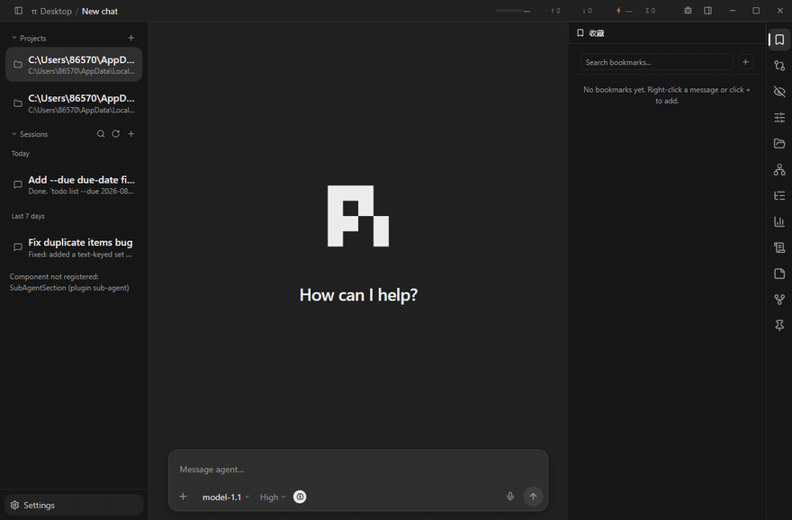
</p>

#### 3.4.2 notes

One-click canned phrases. "Organize this into a daily report", "write the commit per the convention" — typing these a hundred times is expensive; clicking a card = input + send in one step, going through the managed `sendMessage` write path straight into the session (no composer round-trip, so it doesn't disturb what you're drafting). Title optional — without one, the first 120 characters of the content become the summary — the same abstraction parameterized, no kind field. Storage is two-layered: global `~/.my-harness-desktop/notes.json` spans projects, project-level `<cwd>/.my-harness-desktop/notes.json` travels with the project and can be committed/shared; the merge is a union ordered by `order` (not an override), and cross-layer migration is a move (not a copy). Visually they're stickers: the id hash gives a stable tilt between -1.6° and 1.6°, tape or pin at a 50/50 rate. Writes go straight to disk, no framework save overlay; to let the two layers read each their own, the shell gained a symmetric read entry `config-file:getProject` — its only shell change.

<p align="center">
  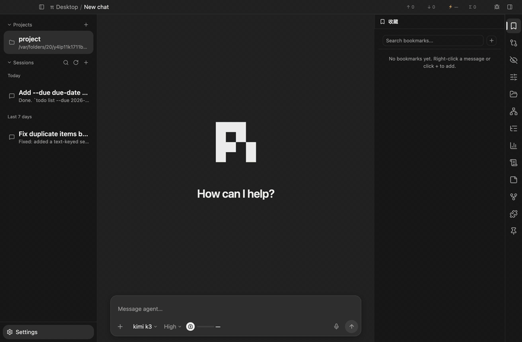
</p>

#### 3.4.3 session-colors

Pin colored pushpins to session rows and session messages. Pick a color from a seven-color palette to enter pin mode, the pin follows the mouse as a preview, and clicking anywhere on a session row or a message drops it — row pins are recorded by row-relative coordinates, message pins anchor to their message (following scroll and streaming growth); both follow their host across list reordering and grouping switches. A new pin of the same color on the same host replaces the old one. The right panel's pins page has two sections: row-pinned sessions as cards (click to open), and message pins as a cross-session index grouped by session — pins from other sessions are listed too, with a pin-time text snapshot as preview; clicking navigates (current session scrolls directly, other sessions open first then scroll). Pin visibility is a global toggle. A pure content plugin: pin data goes through the plugin config channel, mounting points are DOM anchors (`data-session-path` / `data-message-id`) with pins portaled straight into their host elements — not one line of sessions-list or timeline code changed.

<p align="center">
  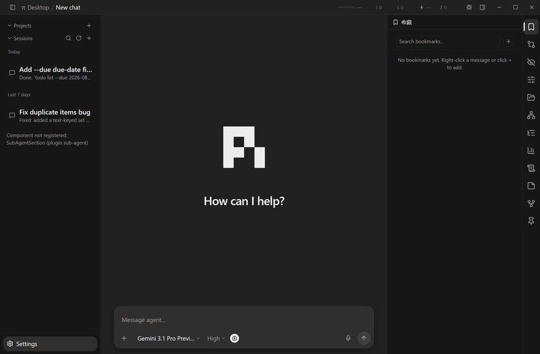
</p>

**sessions/ domain**

#### 3.4.4 sessions-list

The left sidebar's session organization hub (`sidebar` slot). Search, create, four time groups (today / yesterday / past 7 days / older), pin, archive, bulk archive, custom drag-sort; right-click rename, open the raw JSONL file. Subscribes to kernel events to show "running in background" and unread/read state live. Pin/archive write back to the session header's `custom-my-harness-desktop` namespace and rename appends a `session_info` entry (`updateHeader`, one lock serializes writes); the read flag lives in the plugin's private config — no fighting the pi process over session file writes.

#### 3.4.5 session-tree

The right panel's session branch map, git-graph-ified: lane-track rendering (trunk runs straight down, side branches indent), an SVG overview overlay (bezier edges across lanes), four filter modes (all / no tools / user only / tags only), automatic compression of no-information event chains. Hovering a node reveals three actions: locate (`invoke("timeline:scrollTo")` jumps to the corresponding position in the message stream), fork (`ctx.tree.fork` branches from that node), bookmark (emits an event to session-bookmarks). Fork and bookmark buttons only appear on user nodes — pi's fork only accepts user anchors.

#### 3.4.6 timeline

The center main view (`mainView` slot), rendering the session-store's neutral messages as message bubbles, thinking blocks (collapsed by default), tool call cards, and dividers. Real Markdown rendering: GFM, code blocks with language labels and copy buttons; unknown entry types fall back to showing raw JSON rather than silently disappearing. User messages can be revised (fork + pre-filled composer, editable and resendable); pi's auto-retry backoff period is treated as streaming (stop button available), consecutive failures collapse into a "retry N/max" divider. During streaming the composer breathes with a glow and thinking blocks get flowing borders; user bubbles longer than 10 lines auto-collapse. It consumes the `messageActions` / `composerPolicies` slots and contributes to the `settingsGroups` slot (session-stream preferences mount into the General settings page with zero rendering code).

<p align="center">
  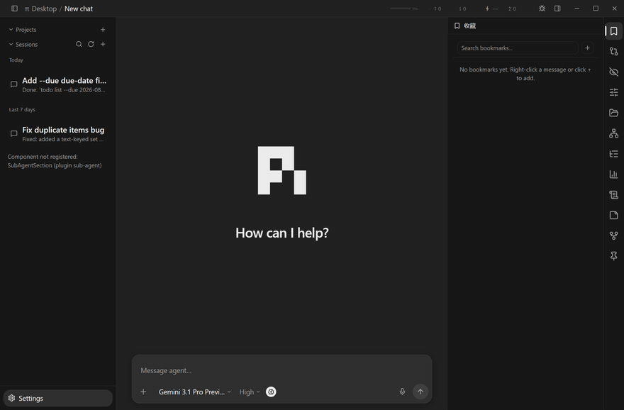
</p>

#### 3.4.7 message-blocks

The session stream's block-level renderers (the built-in batch for the `blockRenderers` slot): Bash/Edit/Read/default tool cards, thinking chains, user bubbles, dividers. (Text blocks belonged to this batch once; they now live in the standalone markdown plugin.) timeline keeps only the mechanism (scrolling, assembly, decomposition, slot dispatch); "how to draw" lives entirely in plugins — third parties override single blocks by `names` (swap the Bash card, draw a card for a new MCP tool, render a new divider kind), and neither timeline nor this plugin changes a line.

#### 3.4.8 markdown

The session stream's text block renderer (the `text` entry of the `blockRenderers` slot): real Markdown via react-markdown + GFM + highlight.js, code block cards with language labels and copy buttons, and fenced-language dispatch through the `codeBlockRenderers` slot — a ` ```mermaid ` / ` ```puml ` block is handed to whichever plugin claimed that language, and markdown itself knows none of them. Disable the plugin and text falls back to timeline's plain-text fallback; the stream keeps working.

#### 3.4.9 mermaid

Renders `mermaid` fenced code blocks in the session stream as diagrams (the `codeBlockRenderers` slot's built-in contribution for language "mermaid"). The engine is dynamically imported — the ~1MB mermaid bundle never touches first paint; while streaming (fence not yet closed) and on parse errors it degrades to the plain source view, never breaking the message flow. Theme follows the app's light/dark.

#### 3.4.10 puml

Renders `puml` / `plantuml` fenced blocks as PlantUML diagrams (the `codeBlockRenderers` slot contribution for those two languages): `plantuml-encoder` compresses the source and a server endpoint (default plantuml.com) returns SVG — no local JAR/WASM. Encoding or network failures degrade to the source view.

#### 3.4.11 graphviz

Renders `dot` / `graphviz` / `gv` fenced blocks as Graphviz diagrams (the `codeBlockRenderers` slot contribution for those three languages): `@viz-js/viz` — Graphviz compiled to WASM, inlined in a single ~1.1MB file — is dynamically imported so it never touches first paint, and the instance is a module-level singleton (WASM instantiates once, all renders reuse it). Streaming and parse failures degrade to the source view. The output is a transparent-background SVG with black strokes, so the container gets a white card background to stay readable under dark themes.

#### 3.4.12 sub-agent

Sub-agent orchestration. On top of Session Bus's flat communication world it builds a relationship layer: delegation, parallel fan-out, war rooms (multiple sub-agents collaborating in one room), parent-child ownership and lifecycle management (child cleaned up when parent dies, resource gates). It contributes five slots at once — `sidebar` (sub-agent panel), `sidePanel` (war room monitor), `messageRenderers` (spawn/done cards), `sessionGroupings` (sub-sessions nested under their parent), `composerPolicies` (sub-session composer becomes a read-only notice); on the kernel side a pi extension provides 5 tools. Division of labor: bus handles addressing, routing, "speaking is transmitting"; sub-agent handles directed ownership and orchestration.

#### 3.4.13 review

Inline session comments. Select a text fragment in the message stream, attach a comment; comments accumulate in a comment basket above the composer (numbered, editable in place) and are assembled into the next message in one shot — the model receives the body and all annotation correspondence in a single message. The design anchors are "selection anchoring + zero-interruption collection + one merged delivery": citation snapshots don't drift with scrolling, registering costs one action, and it's never one message per comment.

<p align="center">
  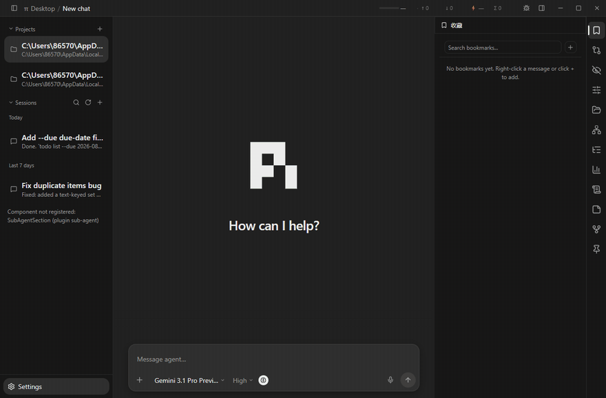
</p>

#### 3.4.14 im-graph

Real-time visualization of Session Bus's session relationships (`sidePanel` slot). Room members, spawn parent-child edges, message flow animations — the topology of multi-session collaboration drawn as a network graph. A pure consumer: subscribes to bus data and renders, doesn't participate in routing.

#### 3.4.15 retry

Message retry button (`messageActions` slot, only on assistant message rows). Forks from any assistant/tool node and regenerates. A lightweight single-purpose plugin — retry strategy (backoff, cap) is pi's business; it only forks and resends.

**project/ domain**

#### 3.4.16 projects

The left sidebar's recent working-directory list (`sidebar` slot, above the session list). One-click cwd switching, drag-sorting, persisted collapse state; directory switches broadcast through the framework's state, and project-scoped views (session list, file tree, notes) refresh with it — plugins don't talk to each other directly.

#### 3.4.17 file-tree

The right panel's VSCode-style file tree (`sidePanel` slot, `fs:project` permission, paths jailed to the project root). Lazy loading: children fetched only when a directory is expanded; folders first, sorted by name. It's also the built-in batch contributor of the `fileIcons` slot: 30 extension/filename → icon + color mappings, exact filename match beats extension, third-party plugins can override a single icon by key.

#### 3.4.18 git-review

The right panel's Git change review. Three diff views: current round (most recent round with file changes), this conversation (rounds grouped and collapsible), Git working tree (staged/changed/untracked, tree-grouped). Check files and commit — pathspec-limited to only the checked files, no dragging in other staged content; push is argumentless to upstream; commit messages can be hand-written or generated in one shot by the kernel via `llm:oneshot`. The round → file-set mapping is derived purely from the toolCall entries in the messages, no dependency on kernel metadata.

#### 3.4.19 file-preview

File content preview (`fileActions` slot's "Preview" action + `titlebar` entry, `fs:project` permission). Render paths: text (plain text with line numbers), images (base64 ``, including SVG), PDF (`<embed>` native rendering), Markdown, and diagrams (`.mmd`/`.puml`/`.dot`). Rich routes never import a render engine — they consume slots: `.md` resolves the `blockRenderers` text winner (the markdown plugin), diagram files resolve by extension through the `fileExtensions` declarations of `codeBlockRenderers` (the mermaid / puml / graphviz plugins) — the mapping lives with the contributor, so a new diagram language needs zero changes here; disable the plugin and the route degrades to the plain-text view, nothing breaks. Rendered/source toggle included.

**insight/ domain**

#### 3.4.20 token-stats

The right panel's token usage dashboard. Three scopes, each with its own data source, never cross-calibrated: current round / last round (the session projection's `turn` / `lastTurn`, accumulated in the main-side dispatch — the panel is a pure renderer, so tab visibility never affects collection), current session (the same RPC projection), project total (aggregated from all session files in the directory, ground truth). Round turnover happens only at the single agentStart moment, avoiding double-firing. Pure event-driven, zero polling.

#### 3.4.22 blind-review

Multi-blue-team independent review + judge synthesis, inspired by Anthropic's blind auditing game. Multiple mutually invisible blue teams each review the same content in fresh sessions (information barrier — zero history context, the model can't infer the code's origin; treats "reviewing your own work and sugar-coating it"), graded access (black-box = content only / white-box = includes project structure), and finally a judge role synthesizes all reports, deduplicates and grades them, marking consensus and disagreement. Four built-in blue teams (correctness / security / logic / hidden intent), prompt templates editable on the settings page. Contributes three slots: `sidePanel` + `settings` + `fileActions` (right-click a file to send it to review).

#### 3.4.21 llm-recorder

Records the full request body and response messages of every LLM call. It's the first content plugin of the `piExtension` declarative channel: the manifest declares `./pi-extension`, and the framework syncs the kernel extension into `~/.pi/agent/extensions/` on enable and removes it on disable/uninstall (unlike toolgate, which is a resident kernel extension). The extension hooks `before_provider_request` / `message_end` etc. inside the kernel process and writes requests/responses per session to `<cwd>/.my-harness-desktop/llm-logs/` (travels with the project, auto-shards past 512KB); the desktop side pairs and displays the full request/response per session in a `sidePanel`, and `settings` provides project-level stats, one-click cleanup, and an immediate-effect recording toggle. Credentials never enter the logs (the headers hook leaves the whole thing untouched). Design doc: [docs/design/llm-recorder-design.md](docs/design/llm-recorder-design.md).

<p align="center">
  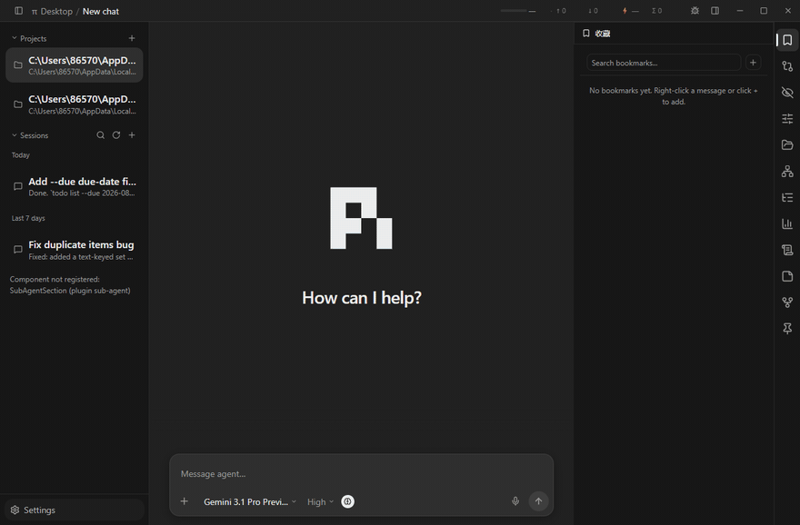
</p>

**manager/ admin pages**

<p align="center">
  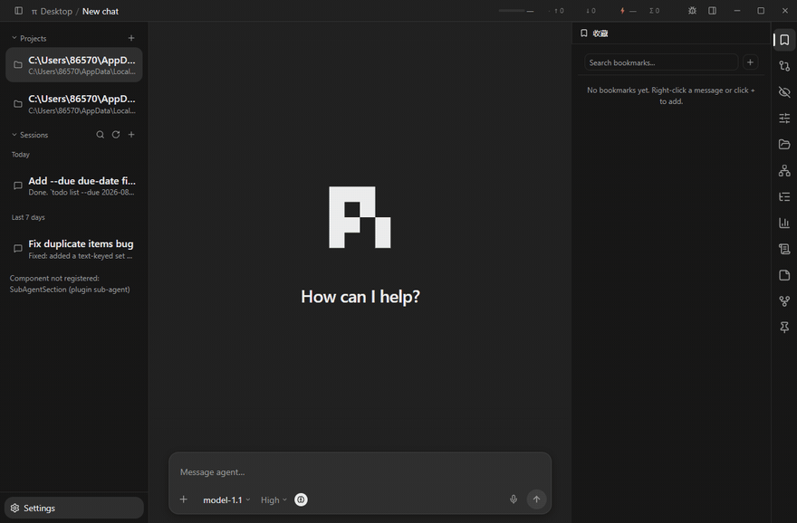
</p>

#### 3.4.23 pi-manager

The first settings tab. Pi kernel version management: lists available versions of `@earendil-works/pi-coding-agent` on the npm registry, installs into the isolated environment `~/.my-harness-desktop/pi/` (no global npm pollution), supports a custom kernel executable path. The lower section is a description table of 57 kernel settings (`~/.pi/agent/settings.json`); the framework handles the configFile dirty/save/interception lifecycle, the plugin only renders the form.

#### 3.4.24 pi-model-manager

Model providers and model config (`~/.pi/agent/models.json`). Two-column provider/model CRUD (right-click copy/delete), default model ★, API Key/Base URL editing, connectivity testing — tests run in a kernel-isolated session ping (`test:{uuid}` process key, no activation, no baseline), never hijacking the session you're using.

#### 3.4.25 plugin-manager

The management page for desktop plugins themselves: enable/disable/install/uninstall/reload, three-state tag filters (only / exclude / cancel). Protected: cannot uninstall itself. Note it manages my-harness-desktop desktop plugins — the kernel's skills and extensions belong to skill-manager / extension-manager.

#### 3.4.26 theme-manager

More than picking a theme: theme grid preview (including an independent session-stream theme — a second theme instance on the `mainView` slot, left/right bars unaffected), font stack selection, per-zone font sizes (interface / code / composer as independent sliders), three width sliders for left bar / right panel / session stream. Immediate effect, no save overlay.

<p align="center">
  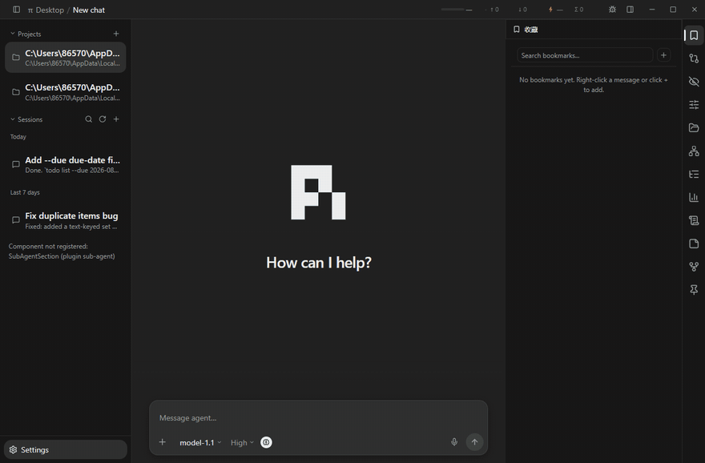
</p>

#### 3.4.27 skill-manager

The management page for pi kernel skills (SKILL.md): the skill list scanned from four sources (explicit paths in settings.json, `~/.pi/agent/skills/`, `~/.agents/skills/`, project-level `.pi/skills/`), enable/disable + force-context toggle (writes the `disable-model-invocation` frontmatter). Changes take effect in the next session (pi has no reload RPC).

#### 3.4.28 tool-manager

Session-level tool filtering. The settings page manages tool group definitions (project-level plugin config); the right panel checks off which tools the current session allows; toggles go through "in-memory preference + onSend flush to disk" — written into the session header's `custom-my-harness-desktop.toolConfig`, hard-filtered by toolgate (the tool gateway, a shell-synced kernel extension) via `pi.setActiveTools` at turn_start; when toolgate isn't installed it degrades to a soft prompt injection. Authoritative tool-list discovery is also toolgate's job: at turn_start the extension broadcasts `pi.getAllTools()` into a sidecar file, which the desktop reads via `kernel:knownTools` (design: [docs/design/tool-manager-design.md](docs/design/tool-manager-design.md) §4.4) — so extension tools that have never run can still join groups and the allowlist.

<p align="center">
  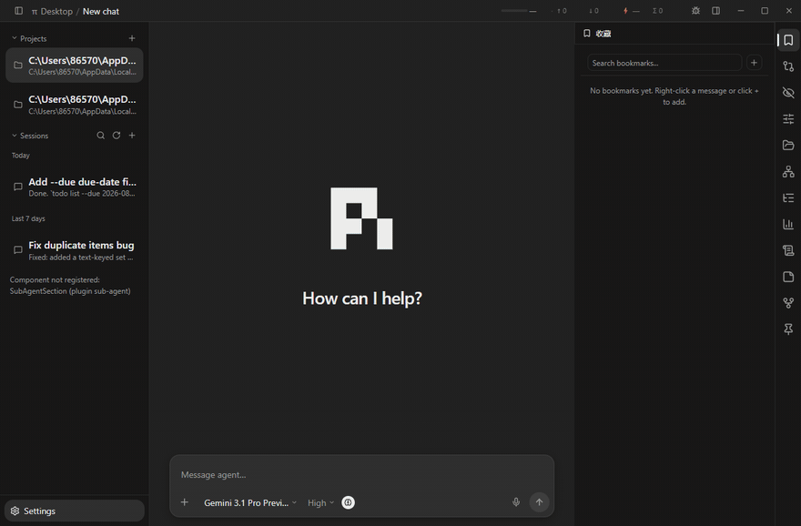
</p>

#### 3.4.29 extension-manager

The management page for pi kernel TypeScript extensions: enable/disable/install for extensions under `~/.pi/agent/extensions/`. Plugin (desktop plugin), skill (kernel skill package), extension (kernel extension) are two layers of three asset types; this plugin manages the third.

**themes/ appearance** (all pure JSON declarations, zero code)

#### 3.4.30 theme (default) + seven color schemes

theme is the base: built-in dark / light / auto base color schemes, defining the complete token system (colors/font sizes/spacing/radii/shadows/scrollbars/dividers), auto follows the system light/dark. The seven color themes are all pure JSON declarations, inheriting from it as base and overriding locally:

- **theme-chatgpt** — ChatGPT-style dark: neutral gray background, large radii, monochrome send button, brand-green accents.
- **theme-everforest** — Everforest dark and light pairs: low-saturation green-tinted palette.
- **theme-midnight** — Midnight dark: low-saturation palette, restrained shadows, light visual weight.
- **theme-mocha** — Mocha warm: the Catppuccin Mocha palette — deep purple-gray background, blue primary, green success, red error.
- **theme-new-york** — light and dark pairs, zinc neutrals + sky-blue primary, large radii, aligned with shadcn/ui's New York style.
- **theme-stone** — light and dark pairs, warm grays, plain low-contrast.
- **theme-terminal** — terminal style: pure black background, phosphor green primary, global monospace font, zero radii zero shadows, very fast animation rhythm.

**system/ framework-level content**

#### 3.4.31 i18n

Four-language packs (Simplified/Traditional Chinese, English, German; 12 namespaces × 4 languages = 48 resource files) + the language settings page. Every plugin's `t("key")` consumes these resources; third-party plugins can override any key through the `languages` slot. Protected: cannot be uninstalled — without it, all UI copy degrades to raw keys.

#### 3.4.32 general-config

The host of the General settings page, and the generic renderer for the `settingsGroups` slot: other plugins (timeline's "session stream", review's "comments", etc.) declare field groups as pure JSON, and it renders them uniformly as toggles/dropdowns/sliders — zero rendering code in the contributing plugin. It also contributes its own "Interface" field group through the same slot (sidebar default-expanded, floating cards, etc.) — built-ins and third parties use the same contract.

#### 3.4.33 debug-bar

Title bar debug button (`titlebar` slot), controlled by the debugMode toggle in General settings. Two capabilities: copy the page DOM to the clipboard (with optional inline-style simplification); element inspection mode — full-screen framed numbering, three-level granularity filtering, hover highlighting, click to copy the innermost hit element's DOM, so you can tell an AI "element #N is broken".

<p align="center">
  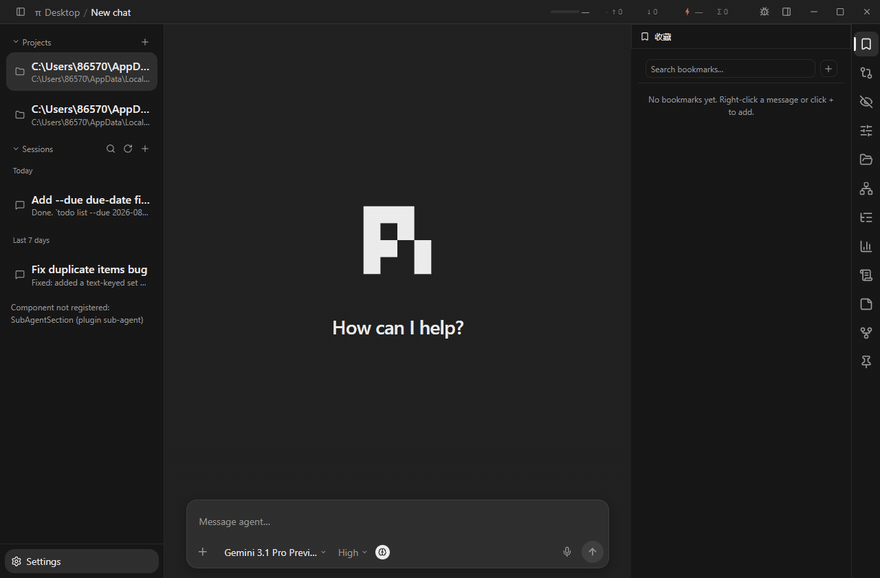
</p>

#### 3.4.34 goody-hao

The first contributor to the `systemPrompts` slot: on session spawn the shell collects all contributions and injects the built-in engineering-principles file into the kernel's system prompt via `--append-system-prompt`. Purely declarative, zero rendering code; uninstalling stops the injection.

#### 3.4.35 read-claude-md

The second content plugin of the `piExtension` declarative channel (after llm-recorder): the manifest declares `./pi-extension`, and the framework syncs the carried kernel extension into `~/.pi/agent/extensions/read-claude-md/` on enable, removes it on disable/uninstall. The extension discovers CLAUDE.md instruction files at session start — global (`~/.claude/CLAUDE.md` + `~/.claude/rules/`) and project-level (walking upward from cwd: `CLAUDE.md`, `.claude/CLAUDE.md`, `.claude/rules/`, `CLAUDE.local.md`, farthest-first in CSS-cascade order) — and injects them once per session as a hidden conversation message rather than a system-prompt modification, so the system prompt stays stable and prompt caching keeps working; only the main interactive session receives it (sub-agents skipped). Purely declarative, zero rendering code; shown as protected in extension-manager (plugin-synced by the shell, so allowing disable would contradict itself).

Third-party plugins go in `~/.my-harness-desktop/plugins/` (user level) or `.my-harness-desktop/plugins/` at the project root (project level), going through the same loader and the same contracts as built-ins — project level overrides user level, user level overrides built-in.

## 🗂 4 Documentation map

- **Architecture & discipline** → [docs/DESIGN.md](docs/DESIGN.md): why a thin shell, shell vs plugin division, directory discipline, communication.
- **Shell mechanism internals** → [docs/core/](docs/core/): loader, RPC adapters, session management, config locking, theme/i18n merge, security boundaries.
- **Topic-by-topic** → [docs/desktop/](docs/desktop/): numbered docs 001–012.

## 🩹 5 Troubleshooting (gotchas)

| Symptom | Cause & fix |
|---|---|
| Windows reports `'env' is not a command` | The npm script calls the Unix `env` — run `npm run dev` from **Git Bash** instead |
| `npm install` hangs / Electron download is slow | The Electron binary comes from the official source; retry with a proxy on slow networks; postinstall renames/re-icons the dev-mode Electron.app (macOS only, skipped elsewhere) |
| macOS says "cannot verify developer" | Artifacts are unsigned: right-click the app → Open to pass Gatekeeper |
| Windows SmartScreen blocks it | Artifacts are unsigned: click "Run anyway" |
| Linux (Debian/Ubuntu) `npm run dev` won't open a window | Electron needs system libraries (libgtk-3, libnss3, libasound2 etc.; Ubuntu 24.04+ renames libasound2 to libasound2t64); `scripts/setup.sh` asks whether to install them — install manually if you skipped |
| dev and installed builds "share" data / settings gone | The two versions split data dirs: dev uses `~/.my-harness-desktop-dev/`, installed uses `~/.my-harness-desktop/`; to inherit, `cp -r` then delete the parts you want isolated |
| Can't find the pi kernel / where did it go | After clicking install on the settings page, pi is pulled from npm into `~/.my-harness-desktop/pi/` — not distributed with the repo; `packages/pi-cli/` is the installers' copy landing spot, deliberately empty in the repo |
| Node version error | Node 18+ required; `scripts/setup.sh` detects it and installs if missing |

## ❓ 6 QA

**Q: If I delete a built-in plugin, what exactly does the UI look like?**
The shell starts normally, and the corresponding slot is empty. Two typical cases: delete timeline and the center shows a gray line "mainView slot has no contribution"; delete i18n and all UI copy degrades to raw keys — even i18next's English fallback (`fallbackLng: "en"`) has no resources to fall back to. Nothing crashes, you just lose that feature.

**Q: Does it run on Windows / Linux?**
`npm run dist:all` on one mac produces installers for all three platforms. Cross-platform points already handled in code: self-drawn title bar buttons on win/linux frameless windows, `.cmd` vs shell differences for npm/pi CLI, environment variable casing (`Path` vs `PATH`), window icons in three formats. The dependencies are all cross-platform (Electron / React / Node). But win/linux haven't been tested on real hardware — between "produces packages" and "runs well" there's still a round of real-machine validation.

**Q: What's the relationship between plugin, skill, and extension?**
They belong to two layers. plugin is a my-harness-desktop desktop plugin — everything this document is about. skill and extension are the two kinds of extension assets of the pi kernel (skill packages and the kernel's TypeScript extensions), defined and loaded by the kernel. The built-in skill-manager and extension-manager are the UIs managing those two asset kinds; they themselves are desktop plugins.

**Q: What did the patch script during `npm install` do? Is it safe?**
Everything it does is visible in `assets/scripts/patch-electron.cjs`: it uses PlistBuddy to change the `CFBundleName` and `CFBundleDisplayName` of the Electron.app in `node_modules/` to "My Harness Desktop", swaps in the project icon, and refreshes the LaunchServices cache. It only touches the local `node_modules`, skips straight past if Electron.app isn't found, and is safe to re-run. It only affects the dev-mode display name, not functionality.

**Q: `packages/pi-cli/` is empty — where does the kernel actually live?**
In dev mode, after clicking install on the settings page, the kernel is pulled from the public npm registry and installed into `~/.my-harness-desktop/pi/` — not in the repo. `packages/pi-cli/` is where a copy of the pi kernel lands when building desktop installers; it's deliberately empty in the repo.

**Q: What's the relationship between `@earendil-works/pi-coding-agent` and pi?**
pi's upstream is Mario Zechner's open-source project ([pi.dev](https://pi.dev)). `@earendil-works/pi-coding-agent` is the distributed pi kernel package my-harness-desktop actually pulls and drives, published on the public npm registry — version listing and installation are done in-app by the pi-manager plugin.

**Q: How do I write my first plugin?**
Shortest path: follow [docs/plugins/PLUGINS.md](docs/plugins/PLUGINS.md) for the manifest and renderer, pick one of the 50 built-in plugins under `src/plugins/` with similar responsibilities as a reference, then drop your result into `~/.my-harness-desktop/plugins/` (user level) or `.my-harness-desktop/plugins/` at the project root (project level). No need to change a single line of the shell.

## 📄 License

[MIT](LICENSE) © earendil-works
