<h1 align="center">my-harness-desktop</h1>

<p align="center"><em>I'm not the harness — I'm just the harness's dispatcher.</em></p>

<p align="center"><a href="README_zh.md">中文</a> · English</p>

<p align="center">
  
  
  
  
  
</p>

> **Put pi and DeepSeek Harness on your desktop** — one shell, two peer kernels, 50 plugins, all in one window.

<p align="center">
  ⭐ Find it useful? Leave a <a href="https://github.com/GOODDAYDAY/my-harness-desktop">star</a> — it makes the author's day.
</p>

---

## What is this

**You use pi or DeepSeek Harness (DSH) in a terminal to write code, but you want a visual interface** — what your session branches look like, which files changed, how many tokens you've burned, ideally all in one window, and extensible with plugins the way you'd add browser extensions.

- Want to **see it all**: session tree, file tree, Git Review, and a token dashboard — in one window.
- Want to **extend it your way**: install plugins on demand, instead of waiting for a release.
- Want **both kernels**: pi and DSH hosted as peers, switchable at any time.

**my-harness-desktop is that shell.** It hosts pi and DSH as two peer kernels — neither is more built-in than the other: **pi** is the open-source terminal coding agent started by Mario Zechner ([pi.dev](https://pi.dev)), whose core is deliberately minimal and leaves everything else to extensions; **DeepSeek Harness** (DSH, the whale mark) is another peer kernel. The shell provides mechanism only: each kernel runs as a managed subprocess — pi over JSONL RPC (one JSON message per line on stdin/stdout), DSH over stdio JSON-RPC — and the entire UI is assembled from 50 built-in plugins, rather than wrapping a terminal UI in a window.

<p align="center">
  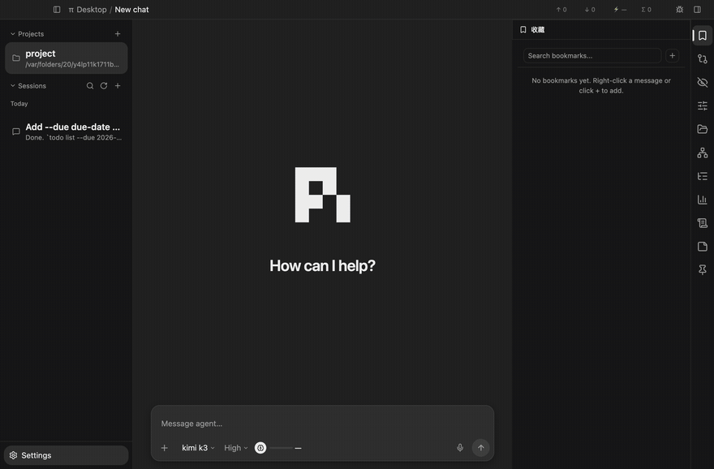
</p>

Here's what it looks like running: the conversation stream, sidebar, and side panel, all in one window.

## ✨ What you get

| Capability | What it does |
|---|---|
| 🧠 Two peer kernels | pi and DeepSeek Harness (DSH) are interchangeable peers, each with its own version install and model config; switching kernels = switching adapters, the UI doesn't move |
| 🎯 Persistent goals | a goal rides on the session: the model works the objective round after round, calls `achieve_goal` when done — kernel-agnostic, works with pi and DSH |
| ⏯ Crash-safe continue | after an abnormal stop (tool failure / LLM failure / cancel), resume in place with one button — no fork, no resending history |
| ❓ Ask the human | the model can pause mid-turn and ask you a question with options / free-text; your answer flows back and generation continues |
| 🌳 Session tree | git-graph-style branch map; fork / bookmark / jump-to-message from any node |
| 📁 File tree & preview | VSCode-style lazy file tree (paths sandboxed to the project root) + file preview (text / image / PDF / Markdown / diagrams) |
| 🔍 Git Review | three diff views (round / conversation / working tree); select files to commit precisely, push with one click |
| 🤖 Sub-agent orchestration | dispatch work, parallel fan-out, war-room multi-subagent collaboration, parent-child lifecycle |
| 🕵️ Blind review | independent red teams review in isolation + a judge consolidates — no more "grading your own homework" |
| 📊 Token dashboard | three scopes (round / session / project total), real-time, purely event-driven |
| 📝 LLM call recorder | full request/response of every LLM call, per session, credentials excluded |
| 💬 Inline comments | select a text span in a message, attach a comment, delivered to the model merged into the next message |
| 🎙 Voice input | local Whisper transcription right into the composer — model weights download on demand, never enter git |
| ⌨️ Keyboard-first | declarative keybindings + Vimium-style link hints: reach any clickable without touching the mouse |
| 🌐 Remote access | open the same UI from a browser on your LAN, password-protected with QR pairing |
| 🔔 Background notifications | a system notification when a session finishes while the window is unfocused |
| 🎨 Themes | light/dark base + 7 color schemes (ChatGPT / Everforest / Midnight / Mocha / New York / Stone / Terminal), pure JSON declarations |
| 🌍 i18n | Simplified / Traditional Chinese, English, German; third-party plugins can override any copy key |
| 🔌 Plugin system | 50 built-in plugins ship with the shell, ready out of the box, on the same loader and contracts as third-party plugins — overridable, deletable |

> 📌 All of these come from built-in plugins, architecturally equal to third-party plugins. Full catalog: [§3.4 Built-in plugins](#34-built-in-plugins).

## 🚀 60-second quick start

```bash
bash scripts/setup.sh   # installs Node (>= 18) if missing, then npm install; Windows: scripts\setup.ps1
npm run dev             # electron-vite dev mode, opens the window
```

Once the window opens: install a kernel on the Settings page (gear icon, bottom-left) — pi or DSH, or both → configure provider and API key on the "Models" tab → back on the main screen, pick a working directory, create a session, pick a kernel, and chat. Full steps: [§2 Getting it running](#2-getting-it-running).

## 💡 1 Design philosophy: from pi to desktop

### 1.1 pi's philosophy

One sentence in pi's README sums up its entire design: *aggressively extensible, so it doesn't have to dictate your workflow*.

Things pi refuses to do:

- The core gives you only four tools: `read`, `write`, `edit`, `bash`. The model does everything with these four; everything else is an add-on.
- No MCP (Model Context Protocol) — write a CLI tool with a README (pi calls it a skill), or write your own extension to add MCP support.
- No sub-agents — run multiple pi instances in a terminal multiplexer like tmux, or install an extension package that does it your way.
- No permission popups — run in a container, or build a confirmation flow that meets your own security requirements with an extension.
- No plan mode, no built-in to-do, no background bash — the answer to each one is the same: build it yourself if you want it.

The beauty is not that it has few features — it's that every "no" gives the choice back to the user: features don't enter the core, everyone assembles their own workflow. The core therefore stays small enough to be fully understood, while the ecosystem can grow faster than any vendor's roadmap. The full argument is in the Philosophy section of pi's README and Mario Zechner's long-form design post, [pi-coding-agent](https://mariozechner.at/posts/2025-11-30-pi-coding-agent/).

### 1.2 The same medicine, applied to the desktop

my-harness-desktop applies the same principle to the desktop shell:

- **The shell's functional content approaches zero.** The shell is the mechanism code my-harness-desktop provides itself: loader, slot contracts, RPC adapters, config read/write, permission sandbox, event bus. Copy, colors, admin pages, rendering logic, business branches — all shell plugins, none welded into the shell.

- **The kernels are not plugins; they're managed resources.** pi and DSH are two peer kernels — independent subprocesses the shell manages over RPC, the same layer of abstraction as git and the file system. Neither is more built-in than the other.

- **Built-ins get no privileges.** Delete any built-in plugin and the shell still starts, you just lose that feature; built-ins and third-party plugins go through the same loader and the same contracts, and built-ins have the lowest priority and can be overridden.

This model has an industrial-grade sample on the desktop: VSCode — its language packs, themes, and default renderers are all extensions, not hard-coded. my-harness-desktop borrows its architectural discipline (thin shell + slot contracts + no privileged status), but not its API shape: that's optimized for a code editor. my-harness-desktop's slots are the session list, settings pages, themes — optimized for a conversational desktop app.

### 1.3 my-harness-desktop's own increments

On the desktop, my-harness-desktop adds three of its own judgments:

- **Consume, don't translate.** It never translates a kernel's terminal UI — no adapters that turn a terminal component tree into a web component tree. The kernels emit structured data over RPC; desktop plugins take the data and decide how to draw it themselves. The translation layer is gone entirely: a third party that wants UI on the desktop just writes a desktop plugin — no need to contribute JSON to the shell and wait for a release.

- **Slot contracts.** The shell predefines mounting points — sidebar, main view, settings pages, themes, languages, etc. — plugins mount content onto slots, and the shell only knows contracts, not specific plugins. Swap out every plugin and the shell mechanisms don't change a line.

- **The shell handles the generic, specialization goes to plugins.** Things every settings page needs — save / dirty / interception / refresh — are centralized in the shell; plugins only render UI and report changes. Dozens of plugins' save logic went from dozens of copies to one.

Full argument: [docs/core-design.md](docs/core-design.md).

## 2 Getting it running

### 2.1 Environment requirements

- Node.js 18 or higher (electron-vite's requirement; the dev machine actually uses Node v25).
- macOS is the platform that has been verified in development. `npm install` runs a postinstall script that renames and re-icons the dev-mode Electron.app — that's macOS-only, skipped silently on other platforms. Windows / Linux have no known platform-specific blockers — the dependencies are all cross-platform (Electron / React / Node) — but nobody has fully tested them end to end.

### 2.2 Two commands

A bootstrap script detects your environment, installs Node.js if missing, then runs `npm install`:

```bash
bash scripts/setup.sh                                          # macOS / Linux
powershell -ExecutionPolicy Bypass -File scripts\setup.ps1     # Windows
```

Or do it manually:

```bash
npm install   # installs dependencies; postinstall renames/re-icons the dev-mode Electron.app
npm run dev   # electron-vite dev mode, opens the window
```

If Windows reports `'env' is not a command`, the npm script calls the Unix `env` — run `npm run dev` from Git Bash instead.

After the window opens, install a kernel and configure its models, all on the Settings page (gear icon at the bottom of the left sidebar). Two peer kernels are available — pick either, or both:

- **pi** — on the "Pi" tab (the pi kernel plugin), install a pi version: pi is the `@earendil-works/pi-coding-agent` package on the public npm registry (the UI lists available versions, pick one and install — it is not distributed with the repo). Then on the "Models" tab, configure a provider and API key (supported providers are decided by pi — Anthropic, OpenAI and other mainstream ones are all there; keys come from the respective provider's site).
- **DSH** — on the "DSH" tab (the dsh kernel plugin), install the DSH kernel — the `@deepseek-ai/dsh-sdk-jsonrpc-demo` package plus its Cordis plugin set. Then configure the model and API key on its models tab, and manage its Cordis plugins on the extensions tab.

Back on the main screen, pick a local directory as the working directory (any code project works) in the left sidebar, create a session, pick a kernel, and start chatting.

Other useful commands:

- `npm run build` — builds artifacts into `out/`.
- `npm run typecheck` — full `tsc --noEmit` type check.
- `npm run lint` — ESLint over `src/plugins/`, zero-warning threshold.
- `npm start` — runs the built artifacts in `out/` directly, with `--remote-debugging-port=9222`.

### 2.3 Building installers (stable and dev versions coexist)

```bash
npm run dist       # builds an installer for the current platform into dist/
npm run dist:all   # one mac builds all three: mac(.dmg/.zip) + Windows(nsis/.zip) + Linux(AppImage/.deb)
npm run pack       # directory form only (no installer), for quickly validating the packaged state
```

Artifacts are unsigned: on macOS, first open goes through right-click → Open to pass Gatekeeper; on Windows, SmartScreen's "Run anyway". Signing / notarization requires a developer certificate — that's a separate topic.

**Data directory split**: packaged installs (`app.isPackaged`) read and write `~/.my-harness-desktop/`, while `npm run dev` / `npm start` dev builds use `~/.my-harness-desktop-dev/` — keep a stable release installed for daily use and iterate freely on dev builds; the two sides never pollute each other. Two exceptions that don't split: the kernels' own config dirs — `~/.pi/agent/` (pi's models and settings, shared by both versions — configure once) and `~/.dsh/` (DSH's settings.yaml) — plus project-level `<cwd>/.my-harness-desktop/` (travels with the project). To have a dev build inherit stable-version data on first launch: `cp -r ~/.my-harness-desktop ~/.my-harness-desktop-dev`, then delete the parts you want isolated.

**Window and platform adaptation**: macOS uses the native traffic lights; Windows/Linux use a frameless window with a self-drawn title bar including min/max/close buttons (via `window:*` IPC). spawn calls on win/linux (npm install, pi CLI) have `.cmd`/shell adaptation, but those two platforms haven't been tested on real hardware — the first person to run on Windows / Linux is the validator.

## 🏗 3 Understanding the architecture in three minutes

### 3.1 The one-sentence model

Three layers, each doing one thing: the **kernels** are capability (the pi and DSH subprocesses, driven over RPC), the **shell** is mechanism (loader, slots, config, permissions), and **plugins** are content (all UI and features). The shell doesn't know specific plugins, only slot contracts; plugins don't touch shell internals — they get a controlled API only through the two public surfaces `packages/shared` and `packages/react`.

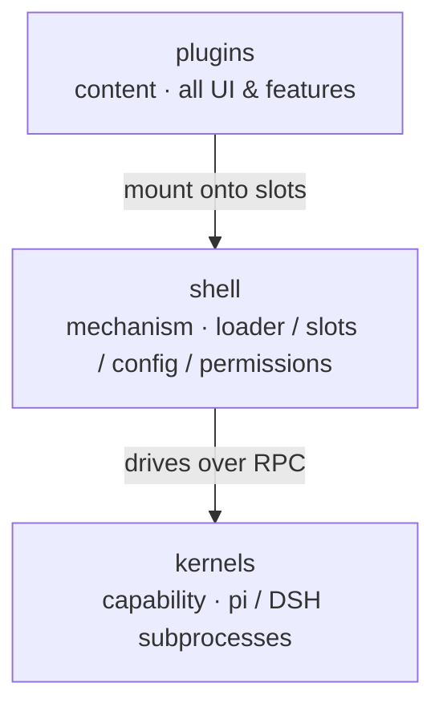
```mermaid
flowchart TB
    P[plugins<br/>content · all UI & features] -->|mount onto slots| S
    S[shell<br/>mechanism · loader / slots / config / permissions] -->|drives over RPC| K[kernels<br/>capability · pi / DSH subprocesses]
```

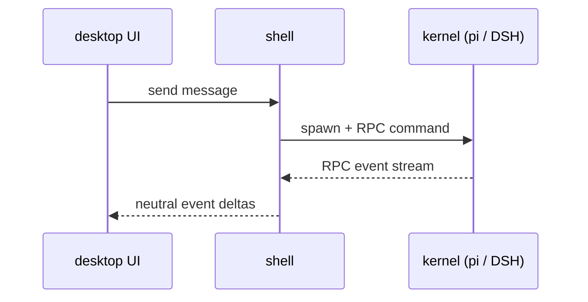
```mermaid
sequenceDiagram
    participant UI as desktop UI
    participant S as shell
    participant K as kernel (pi / DSH)
    UI->>S: send message
    S->>K: spawn + RPC command
    K-->>S: RPC event stream
    S-->>UI: neutral event deltas
```

### 3.2 Directory layout

```
src/
  server/            # shell backend
    application/     #   use-case orchestration: plugin loader/registry, config, sessions, models, i18n, themes
    kernel/          #   kernel layer (peers, one adapter each)
      core/          #     abstract base classes only — imports no concrete kernel
      pi/            #     pi adapter: backend + protocol(31-command contract) + manager + model + extensions
      dsh/           #     dsh adapter: backend + json-rpc protocol + manager + event translator
      minimal/       #     minimal kernel (test fixture for "a third kernel exists")
    client/          #   outbound adapters: fs / git / npm / remote
    controllers/     #   gateway handlers, split by capability domain
    transport/       #   HTTP + WS servers (frontend/backend split)
    host/            #   Host interface implementations: electron-host + node-host
    bootstrap/       #   assembly root: shared assemble + electron / server entries
  web/               # frontend renderer: app shell, stores, transport, UI components
  plugins/           # content layer: built-in plugins, grouped by domain (themes/sessions/project/insight/manager/system/kernels)
                     #   kernels/<id> = one kernel plugin per kernel (kernel block + renderer/ + locales/)
packages/
  shared/            # the center: src/domain/ (slot contracts, neutral types, pure functions — zero deps, nothing else)
  react/             # public surface: React components & hooks, the only API entry plugins are allowed
  my-harness-fit-pi-extension/   # pi adapter extension (toolgate / bus / subagent / skills tools), synced into ~/.pi/agent/extensions/
```

"Neutral" means dependent on no framework and no runtime — pure TypeScript types and structured data, unaffected by swapping Electron or React.

Dependencies point inward only: `packages/shared/src/domain/` imports no external packages, and `plugins/` references types and APIs only through `packages/`. The former is physical — there's no external package to import inside `domain/`; the latter is enforced by ESLint — plugin imports that reach into `src/` internals get blocked by lint.

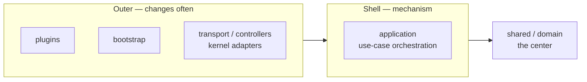
```mermaid
flowchart LR
    subgraph outer[Outer — changes often]
        P[plugins]
        B[bootstrap]
        C[transport / controllers<br/>kernel adapters]
    end
    subgraph mid[Shell — mechanism]
        A[application<br/>use-case orchestration]
    end
    D[shared / domain<br/>the center]
    outer --> mid --> D
```

### 3.3 Slot overview

The shell's predefined mounting points; plugins mount content onto slots. The **22 implemented** contribution interfaces:

- **`sidebar`** — the left sidebar: session list, project list, sub-agent panel.
- **`sidePanel`** — the right panel: session tree, Git review, file tree, token stats, war-room monitor.
- **`mainView`** — the center main view: the session message stream contributed by the timeline plugin.
- **`titlebar`** — buttons on the right side of the title bar.
- **`settings`** — settings pages: kernel managers (pi / DSH), model management, theme management, languages, etc.
- **`settingsGroups`** — generic settings field groups: pure-JSON declarations that mount a box of fields onto the "General" settings page; a generic renderer turns them into controls — zero rendering code in the contributing plugin.
- **`themes`** — theme color schemes.
- **`languages`** — language packs.
- **`fontPresets`** — font stack presets (a plugin contributes them as data; the shell merge pipeline picks them up).
- **`messageRenderers`** — custom cards by message role/kind, overriding the default rendering (e.g. goal round cards, sub-agent spawn cards).
- **`messageActions`** — action buttons on messages (copy, bookmark, retry, continue).
- **`blockRenderers`** — block-level renderers in the session stream: tool cards, thinking chains, user bubbles, Markdown text, dividers, resolved by a two-key lookup (block type, tool name/kind); third parties can claim or override a single block's rendering by name (e.g. draw a card for a new tool); the built-in batch is contributed by the message-blocks plugin (blocks) and the markdown plugin (text).
- **`codeBlockRenderers`** — fenced-code-language renderers inside text blocks: plugins claim languages (`mermaid`, `puml`, `dot`…) and the markdown renderer dispatches fenced blocks to them; third parties add new diagram/chart languages without touching the markdown plugin. The built-in batch is contributed by the mermaid, puml and graphviz plugins.
- **`fileActions`** — file context actions (e.g. blind review a file).
- **`fileIcons`** — file tree row icons (extension/filename → icon mapping, overridable by key).
- **`sessionGroupings`** — session grouping strategies (nested sub-sessions).
- **`composerPolicies`** — conditional input rendering policies (read-only notice bars).
- **`composerTop`** — banner components above the composer (goal bar, comment basket).
- **`composerAttachments`** — attachment sources for the composer.
- **`composerActions`** — buttons at the composer's bottom edge (sticker picker, voice input).
- **`systemPrompts`** — injecting system prompt files into kernel session spawns.

The center's `SlotName` type also has reserved names — `management` / `cardRenderers` / `viewers` / `commands` — whose contribution interfaces aren't implemented yet; declaring them in `plugin.json` (a plugin's manifest) is ignored.

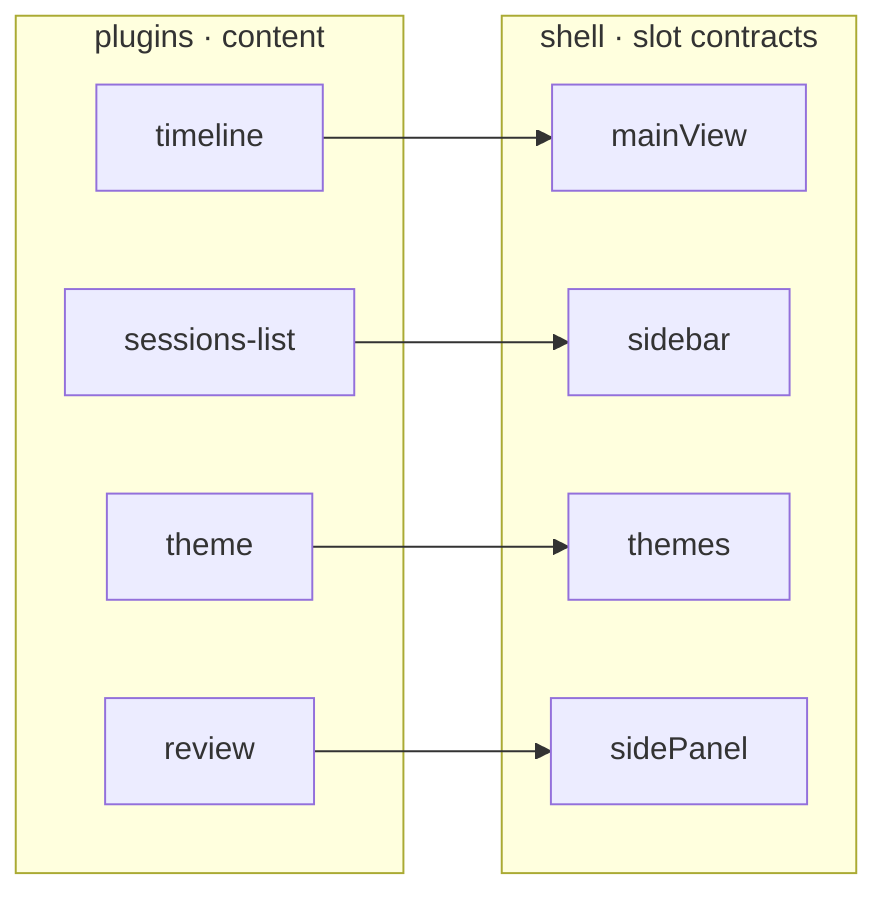
```mermaid
flowchart LR
    subgraph plugins[plugins · content]
        A[timeline]
        B[sessions-list]
        C[theme]
        D[review]
    end
    subgraph shell[shell · slot contracts]
        S1[mainView]
        S2[sidebar]
        S3[themes]
        S4[sidePanel]
    end
    A --> S1
    B --> S2
    C --> S3
    D --> S4
```

### 3.4 Built-in plugins

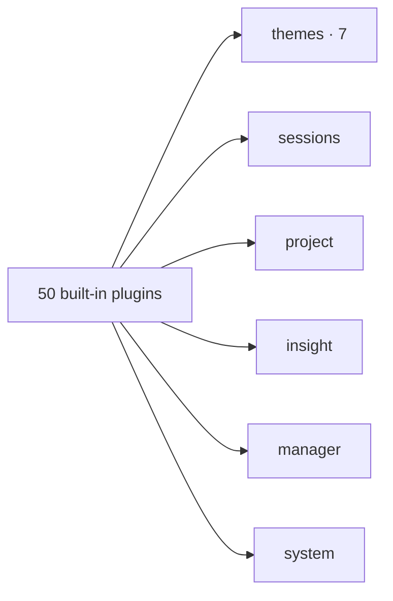
```mermaid
flowchart LR
    R[50 built-in plugins] --> T[themes · 7]
    R --> S[sessions]
    R --> P[project]
    R --> I[insight]
    R --> M[manager]
    R --> Y[system]
```

50 built-in plugins ship with the shell, ready to use, and architecturally equal to third-party plugins — overridable, deletable. The three most representative come first (bookmarks, stickers, pins), then the rest grouped by domain (matching `src/plugins/`; the seven themes merge into one section). Plugins with a dedicated design doc are under `docs/plugins/` (the majority — start with the one whose responsibilities sound closest to what you want to do).

#### 3.4.1 session-bookmarks

Save a valuable node in a session as a persistent snapshot. pi's fork is immediate and follows the original session — delete the original and the branch is gone; bookmarks solve "save this node, restart from that point later". A bookmark = a full JSONL copy + metadata, fully isolated from the original session: the copy is never touched by the pi process; clicking a bookmark uses the `forkFromSession` atomic use-case to copy out the intermediate file and then fork — the same bookmark can be reused indefinitely, like a "conversation template". Three creation entries — timeline message context menu, session tree node button (both go through the event bus `bookmarkRequested`, only allowed on user-message anchors because pi's fork rejects assistant anchors), and manual add in the panel (validate first, then create). Bookmarks travel with the project (bucketed by cwd), with write ordering plus self-healing validation on load guarding the consistency of copies and index.

<p align="center">
  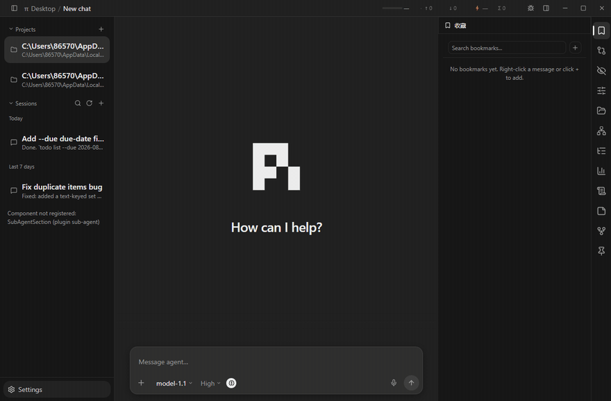
</p>

#### 3.4.2 stickers

Sticker cards: click one and it's sent — text stickers go straight into the prompt, image stickers render in the session stream. Typing "帮我整理成日报" a hundred times is expensive; clicking a card = input + send in one step, going through the managed `sendMessage` write path (no composer round-trip, so it doesn't disturb what you're drafting). Storage is three layered scopes: global (the config store's stickers key, spans projects), project-level `<cwd>/.my-harness-desktop/config/stickers.json` (travels with the project, committable), and a built-in stock that ships with the shell (deletable by tombstone, never editable); the merge is a union ordered by `order` (not an override), and cross-layer migration is a move (not a copy), with zip import/export. Banner images ride in the global data root so they survive project-scope deletions. Visually they're stickers: the id hash gives a stable tilt between -1.6° and 1.6°, tape or pin at a 50/50 rate. Entry points are the `sidePanel` page and the `composerActions` picker button.

<p align="center">
  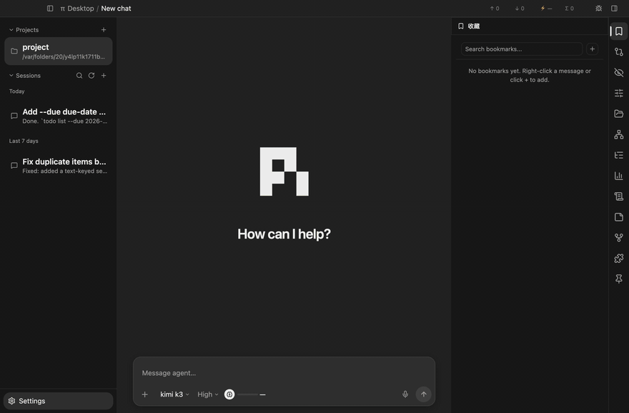
</p>

#### 3.4.3 session-colors

Pin colored pushpins to session rows and session messages. Pick a color from a seven-color palette to enter pin mode, the pin follows the mouse as a preview, and clicking anywhere on a session row or a message drops it — row pins are recorded by row-relative coordinates, message pins anchor to their message (following scroll and streaming growth); both follow their host across list reordering and grouping switches. A new pin of the same color on the same host replaces the old one. The right panel's pins page has two sections: row-pinned sessions as cards (click to open), and message pins as a cross-session index grouped by session — pins from other sessions are listed too, with a pin-time text snapshot as preview; clicking navigates (current session scrolls directly, other sessions open first then scroll). Pin visibility is a global toggle. A pure content plugin: pin data goes through the plugin config channel, mounting points are DOM anchors (`data-session-path` / `data-message-id`) with pins portaled straight into their host elements — not one line of sessions-list or timeline code changed.

<p align="center">
  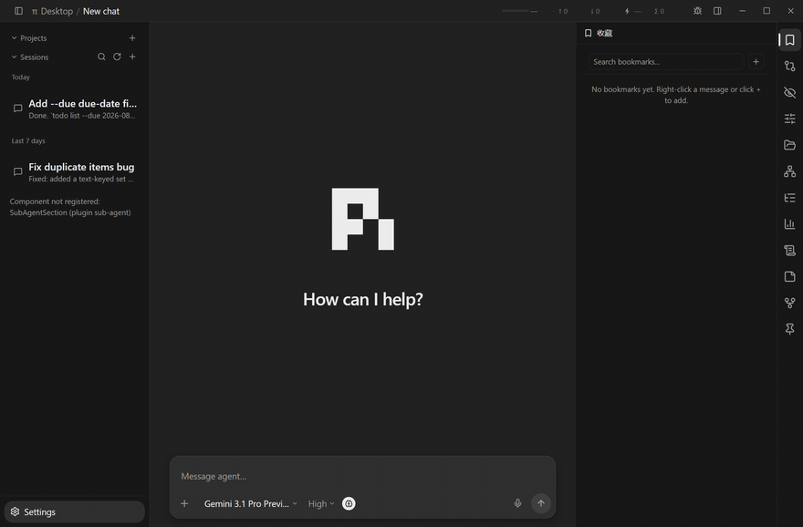
</p>

**sessions/ domain**

#### 3.4.4 sessions-list

The left sidebar's session organization hub (`sidebar` slot). Search, create, four time groups (today / yesterday / past 7 days / older), pin, archive, bulk archive, custom drag-sort; right-click rename, open the raw JSONL file. Subscribes to kernel events to show "running in background" and unread/read state live. Pin/archive write back to the session header's `custom-my-harness-desktop` namespace and rename appends a `session_info` entry (`updateHeader`, one lock serializes writes); the read flag lives in the plugin's private config — no fighting the pi process over session file writes.

#### 3.4.5 session-tree

The right panel's session branch map, git-graph-ified: lane-track rendering (trunk runs straight down, side branches indent), an SVG overview overlay (bezier edges across lanes), four filter modes (all / no tools / user only / tags only), automatic compression of no-information event chains. Hovering a node reveals three actions: locate (`invoke("timeline:scrollTo")` jumps to the corresponding position in the message stream), fork (`ctx.tree.fork` branches from that node), bookmark (emits an event to session-bookmarks). Fork and bookmark buttons only appear on user nodes — pi's fork only accepts user anchors.

#### 3.4.6 timeline

The center main view (`mainView` slot), rendering the session-store's neutral messages as message bubbles, thinking blocks (collapsed by default), tool call cards, and dividers. Real Markdown rendering: GFM, code blocks with language labels and copy buttons; unknown entry types fall back to showing raw JSON rather than silently disappearing. User messages can be revised (fork + pre-filled composer, editable and resendable); pi's auto-retry backoff period is treated as streaming (stop button available), consecutive failures collapse into a "retry N/max" divider. During streaming the composer breathes with a glow and thinking blocks get flowing borders; user bubbles longer than 10 lines auto-collapse. It consumes the `messageActions` / `composerPolicies` slots and contributes to the `settingsGroups` slot (session-stream preferences mount into the General settings page with zero rendering code).

<p align="center">
  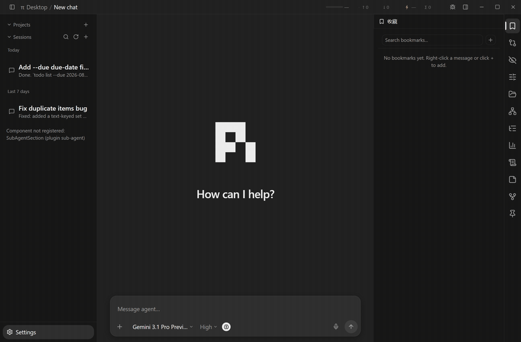
</p>

#### 3.4.7 message-blocks

The session stream's block-level renderers (the built-in batch for the `blockRenderers` slot): Bash/Edit/Read/default tool cards, thinking chains, user bubbles, dividers. (Text blocks belonged to this batch once; they now live in the standalone markdown plugin.) timeline keeps only the mechanism (scrolling, assembly, decomposition, slot dispatch); "how to draw" lives entirely in plugins — third parties override single blocks by `names` (swap the Bash card, draw a card for a new MCP tool, render a new divider kind), and neither timeline nor this plugin changes a line.

#### 3.4.8 markdown

The session stream's text block renderer (the `text` entry of the `blockRenderers` slot): real Markdown via react-markdown + GFM + highlight.js, code block cards with language labels and copy buttons, and fenced-language dispatch through the `codeBlockRenderers` slot — a ` ```mermaid ` / ` ```puml ` block is handed to whichever plugin claimed that language, and markdown itself knows none of them. Disable the plugin and text falls back to timeline's plain-text fallback; the stream keeps working.

#### 3.4.9 mermaid

Renders `mermaid` fenced code blocks in the session stream as diagrams (the `codeBlockRenderers` slot's built-in contribution for language "mermaid"). The engine is dynamically imported — the ~1MB mermaid bundle never touches first paint; while streaming (fence not yet closed) and on parse errors it degrades to the plain source view, never breaking the message flow. Theme follows the app's light/dark.

#### 3.4.10 puml

Renders `puml` / `plantuml` fenced blocks as PlantUML diagrams (the `codeBlockRenderers` slot contribution for those two languages): `plantuml-encoder` compresses the source and a server endpoint (default plantuml.com) returns SVG — no local JAR/WASM. Encoding or network failures degrade to the source view.

#### 3.4.11 graphviz

Renders `dot` / `graphviz` / `gv` fenced blocks as Graphviz diagrams (the `codeBlockRenderers` slot contribution for those three languages): `@viz-js/viz` — Graphviz compiled to WASM, inlined in a single ~1.1MB file — is dynamically imported so it never touches first paint, and the instance is a module-level singleton (WASM instantiates once, all renders reuse it). Streaming and parse failures degrade to the source view. The output is a transparent-background SVG with black strokes, so the container gets a white card background to stay readable under dark themes.

#### 3.4.12 sub-agent

Sub-agent orchestration. On top of Session Bus's flat communication world it builds a relationship layer: delegation, parallel fan-out, war rooms (multiple sub-agents collaborating in one room), parent-child ownership and lifecycle management (child cleaned up when parent dies, resource gates). It contributes five slots at once — `sidebar` (sub-agent panel), `sidePanel` (war room monitor), `messageRenderers` (spawn/done cards), `sessionGroupings` (sub-sessions nested under their parent), `composerPolicies` (sub-session composer becomes a read-only notice); on the kernel side a pi extension provides 5 tools. Division of labor: bus handles addressing, routing, "speaking is transmitting"; sub-agent handles directed ownership and orchestration.

#### 3.4.13 review

Inline session comments. Select a text fragment in the message stream, attach a comment; comments accumulate in a comment basket above the composer (numbered, editable in place) and are assembled into the next message in one shot — the model receives the body and all annotation correspondence in a single message. The design anchors are "selection anchoring + zero-interruption collection + one merged delivery": citation snapshots don't drift with scrolling, registering costs one action, and it's never one message per comment.

<p align="center">
  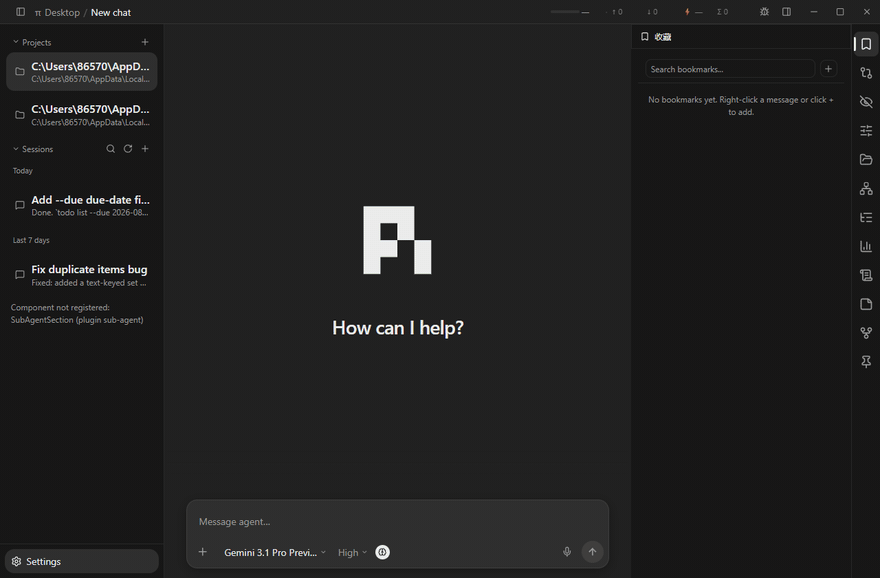
</p>

#### 3.4.14 im-graph

Real-time visualization of Session Bus's session relationships (`sidePanel` slot). Room members, spawn parent-child edges, message flow animations — the topology of multi-session collaboration drawn as a network graph. A pure consumer: subscribes to bus data and renders, doesn't participate in routing.

#### 3.4.15 retry

Message retry button (`messageActions` slot, only on settled assistant rows). It walks back from the clicked answer to the nearest user message, then `fork(ns, userMsgId, "before", { abortSource: true })` derives a **new session** holding the prefix up to (but excluding) that user message, and resends its original text — so the discarded answer stays readable in the old session instead of being overwritten. A lightweight single-purpose plugin: automatic retry policy (backoff, cap) is the kernel's business; this only branches and resends. Together with continue it marks the semantic border — continue resumes in place (just sends a message), retry branches afresh (`fork` + resend): one button each, never mixed.

#### 3.4.16 ask

The kernel asking the human, rendered inline: when the model pauses mid-turn with a question (`ask_user_question` — options or free-text), ask draws a question bubble with option rows and a custom input right in the session stream; picking an answer feeds it back to the kernel and generation continues. Question requests are **persistent tickets** — they survive process death and app relaunch (the card revives in place and can still be answered; late answers are patched into the kernel's session store). Kernel tools come from the declarative `extensions` channel (pi extension; the dsh tool ships inside the shell's dsh extension). The renderer carries zero kernel identity — both kernels surface as the same neutral question event. Design doc: [docs/plugins/sessions/ask.md](docs/plugins/sessions/ask.md).

#### 3.4.17 goal

A persistent goal riding on the session: `/goal` (or the goal bar above the composer) records an objective, and after each round the shell injects an invisible continuation prompt — the model keeps working until it calls `achieve_goal`, hits the round cap (configurable via `settingsGroups`), or you pause/delete. Fully kernel-agnostic: the state machine lives in the plugin and persists in the session header; the two kernels each get a thin `set_goal` / `achieve_goal` tool via the declarative `extensions` channel. Round-by-round progress renders as goal cards in the stream. Design doc: [docs/plugins/sessions/goal.md](docs/plugins/sessions/goal.md).

#### 3.4.18 continue

A "continue" button on any abnormally stopped assistant message (tool failure / LLM failure / user cancel). One click sends a localized "continue" prompt down the ordinary managed send path — **resuming *is* sending a message**, so there's no separate kernel intent and nothing kernel-specific to degrade. No fork, no history rewrite: the stopped turn stays in the transcript and the model picks up from there. Zero rendering beyond the button; visibility rides two neutral flags (error / stopped), and clicking while a generation is in flight is refused with a toast rather than queued. Design doc: [docs/plugins/sessions/continue.md](docs/plugins/sessions/continue.md).

#### 3.4.19 voice-input

A microphone button at the composer's corner (`composerVoice` slot): click to record, a local Whisper model (transformers.js) transcribes, text lands in the composer for you to edit and send. The heavy engine lives entirely inside the plugin — lazily imported, model weights download on demand into browser cache (never enter git, offline on second use). The composer only provides the mount point: mechanics in the shell, the STT content in the plugin. Design doc: [docs/plugins/sessions/voice-input.md](docs/plugins/sessions/voice-input.md).

**project/ domain**

#### 3.4.20 projects

The left sidebar's recent working-directory list (`sidebar` slot, above the session list). One-click cwd switching, drag-sorting, persisted collapse state; directory switches broadcast through the framework's state, and project-scoped views (session list, file tree, stickers) refresh with it — plugins don't talk to each other directly.

#### 3.4.21 file-tree

The right panel's VSCode-style file tree (`sidePanel` slot, path sandboxing to the project root). Lazy loading: children fetched only when a directory is expanded; folders first, sorted by name. It's also the built-in batch contributor of the `fileIcons` slot: 30 extension/filename → icon + color mappings, exact filename match beats extension, third-party plugins can override a single icon by key.

#### 3.4.22 git-review

The right panel's Git change review. Three diff views: current round (most recent round with file changes), this conversation (rounds grouped and collapsible), Git working tree (staged/changed/untracked, tree-grouped). Check files and commit — pathspec-limited to only the checked files, no dragging in other staged content; push is argumentless to upstream; commit messages can be hand-written or generated in one shot by the kernel via `llm:oneshot`. The round → file-set mapping is derived purely from the toolCall entries in the messages, no dependency on kernel metadata.

#### 3.4.23 file-preview

File content preview (right-click "Preview" in the file tree + a `titlebar` entry). Render routes: text (plain text with line numbers), images (base64 ``, including SVG), PDF (`<embed>` native rendering), Markdown, and diagrams (`.mmd`/`.puml`/`.dot`). Rich routes never import a render engine — they consume slots: `.md` resolves the `blockRenderers` text winner (the markdown plugin), diagram files resolve by extension through the `fileExtensions` declarations of `codeBlockRenderers` (the mermaid / puml / graphviz plugins) — the mapping lives with the contributor, so a new diagram language needs zero changes here; disable the plugin and the route degrades to the plain-text view, nothing breaks. Rendered/source toggle included.

**insight/ domain**

#### 3.4.24 token-stats

The right panel's token usage dashboard. Three scopes, each with its own data source, never cross-calibrated: current round / last round (the session projection's `turn` / `lastTurn`, accumulated in the main-side dispatch — the panel is a pure renderer, so tab visibility never affects collection), current session (the same RPC projection), project total (aggregated from all session files in the directory, ground truth). Round turnover happens only at the single agentStart moment, avoiding double-firing. Pure event-driven, zero polling.

#### 3.4.25 blind-review

Multi-blue-team independent review + judge synthesis, inspired by Anthropic's blind auditing game. Multiple mutually invisible blue teams each review the same content in fresh sessions (information barrier — zero history context, the model can't infer the code's origin; treats "reviewing your own work and sugar-coating it"), graded access (black-box = content only / white-box = includes project structure), and finally a judge role synthesizes all reports, deduplicates and grades them, marking consensus and disagreement. Four built-in blue teams (correctness / security / logic / hidden intent), prompt templates editable on the settings page. Contributes three slots: `sidePanel` + `settings` + `fileActions` (right-click a file to send it to review).

#### 3.4.26 llm-recorder

Records the full request body and response messages of every LLM call. A content plugin of the declarative `extensions` channel: the manifest declares `"extensions": { "pi": "./pi-extension", "dsh": "./dsh-extension" }`, and the framework syncs the kernel extension into the kernel's extension directories on enable and removes it on disable/uninstall (unlike toolgate, which is a resident kernel extension). The extension hooks provider-request/message lifecycle events inside the kernel process and writes requests/responses per session to `<cwd>/.my-harness-desktop/llm-logs/` (travels with the project, auto-shards past 512KB); the desktop side pairs and displays the full request/response per session in a `sidePanel`, and `settings` provides project-level stats, one-click cleanup, and an immediate-effect recording toggle. Credentials never enter the logs (the headers hook leaves the whole thing untouched). Design doc: [docs/plugins/insight/llm-recorder.md](docs/plugins/insight/llm-recorder.md).

<p align="center">
  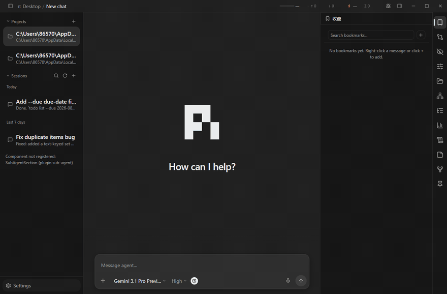
</p>

**manager/ admin pages**

> The pi / DSH kernel admin pages now live as **kernel plugins** (`src/plugins/kernels/<id>/`) — one kernel, one plugin: its settings tabs and its desktop surface ship and uninstall together. The standalone pi-manager / pi-model-manager pages have merged into these.

<p align="center">
  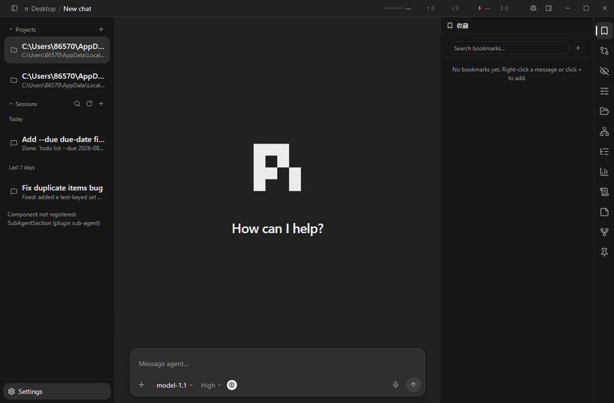
</p>

#### 3.4.27 pi (kernel plugin)

The pi kernel's admin entry — one settings group with three tabs. **Pi**: version management — lists available versions of `@earendil-works/pi-coding-agent` on the npm registry, installs into the isolated environment `~/.my-harness-desktop/pi/` (no global npm pollution), supports a custom kernel executable path; below it a description table of ~57 kernel settings (`~/.pi/agent/settings.json`), with the framework handling the configFile dirty/save/interception lifecycle — the plugin only renders the form. **PI extensions**: enable/disable/install for TypeScript extensions under `~/.pi/agent/extensions/`. **Models**: providers and model config (`~/.pi/agent/models.json`) — provider/model CRUD, default model ★, API Key/Base URL editing, connectivity testing that runs in a kernel-isolated session ping (`test:{uuid}` process key, never hijacking the session you're using).

#### 3.4.28 dsh (kernel plugin)

The DSH kernel's admin entry, a peer of the pi plugin — same settings shape: **DSH** tab installs the DSH kernel (`@deepseek-ai/dsh-sdk-jsonrpc-demo` + its Cordis plugin set) and edits `~/.dsh/settings.yaml`; **DSH extensions** manages its Cordis plugins (`~/.dsh/.my-harness-desktop-plugins/`); **Models** configures DSH models and API keys. The two kernel plugins differ in data but not in standing — deleting either leaves the shell running with one less kernel.

#### 3.4.29 plugin-manager

The management page for desktop plugins themselves: enable/disable/install/uninstall/reload, three-state tag filters (only / exclude / cancel). Protected: cannot uninstall itself. Note it manages my-harness-desktop desktop plugins — the kernels' skills and extensions belong to skill-manager and the kernel plugins' extension tabs.

#### 3.4.30 theme-manager

More than picking a theme: theme grid preview (including an independent session-stream theme — a second theme instance on the `mainView` slot, left/right bars unaffected), font stack selection, per-zone font sizes (interface / code / composer as independent sliders), three width sliders for left bar / right panel / session stream. Immediate effect, no save overlay.

<p align="center">
  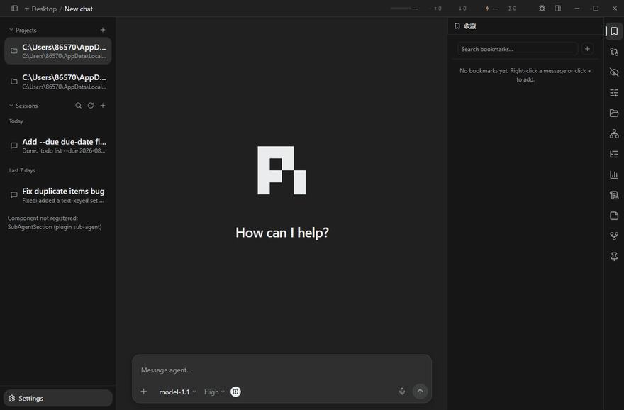
</p>

#### 3.4.31 skill-manager

The management page for kernel skills (SKILL.md): the skill list scanned from multiple sources (explicit paths in kernel settings, `~/.pi/agent/skills/`, `~/.agents/skills/`, project-level `.pi/skills/`), enable/disable + force-context toggle (writes the `disable-model-invocation` frontmatter). Changes take effect in the next session (kernels have no reload RPC).

#### 3.4.32 tool-manager

Session-level tool filtering. The settings page manages tool group definitions (project-level plugin config); the right panel checks off which tools the current session allows; toggles go through "in-memory preference + onSend flush to disk" — written into the session header's `custom-my-harness-desktop.toolConfig`, hard-filtered by toolgate (the tool gateway, a shell-synced kernel extension) at turn start; when toolgate isn't installed it degrades to a soft prompt injection. Authoritative tool-list discovery is also toolgate's job: at turn start the extension broadcasts the full tool list into a sidecar file, which the desktop reads — so extension tools that have never run can still join groups and the allowlist.

<p align="center">
  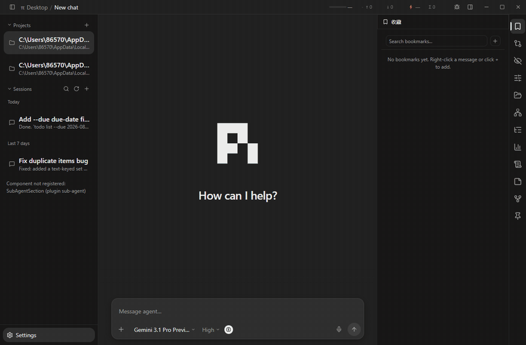
</p>

**themes/ appearance**

#### 3.4.33 theme (default) + seven color schemes + font-presets

theme is the base: built-in dark / light / auto base color schemes, defining the complete token system (colors/font sizes/spacing/radii/shadows/scrollbars/dividers), auto follows the system light/dark. The seven color themes are all pure JSON declarations, inheriting from it as base and overriding locally:

- **theme-chatgpt** — ChatGPT-style dark: neutral gray background, large radii, monochrome send button, brand-green accents.
- **theme-everforest** — Everforest dark and light pairs: low-saturation green-tinted palette.
- **theme-midnight** — Midnight dark: low-saturation palette, restrained shadows, light visual weight.
- **theme-mocha** — Mocha warm: the Catppuccin Mocha palette — deep purple-gray background, blue primary, green success, red error.
- **theme-new-york** — light and dark pairs, zinc neutrals + sky-blue primary, large radii, aligned with shadcn/ui's New York style.
- **theme-stone** — light and dark pairs, warm grays, plain low-contrast.
- **theme-terminal** — terminal style: pure black background, phosphor green primary, global monospace font, zero radii zero shadows, very fast animation rhythm.

**font-presets** — also a themes-domain plugin, but pure data: 17 font options (mono / Latin / CJK stacks) contributed entirely through the `fontPresets` slot, zero code. Font stacks are "content that changes" pushed out of the center — adding a font option is one manifest line plus one i18n key.

**system/ framework-level content**

#### 3.4.34 i18n

Four-language packs (Simplified/Traditional Chinese, English, German; 12 namespaces × 4 languages = 48 resource files) + the language settings page. Every plugin's `t("key")` consumes these resources; third-party plugins can override any key through the `languages` slot. Protected: cannot be uninstalled — without it, all UI copy degrades to raw keys.

#### 3.4.35 general-config

The host of the General settings page, and the generic renderer for the `settingsGroups` slot: other plugins (timeline's "session stream", review's "comments", goal's round limit, etc.) declare field groups as pure JSON, and it renders them uniformly as toggles/dropdowns/sliders — zero rendering code in the contributing plugin. It also contributes its own "Interface" field group through the same slot (sidebar default-expanded, floating cards, etc.) — built-ins and third parties use the same contract.

#### 3.4.36 debug-bar

Title bar debug button (`titlebar` slot), controlled by the debugMode toggle in General settings. Two capabilities: copy the page DOM to the clipboard (with optional inline-style simplification); element inspection mode — full-screen framed numbering, three-level granularity filtering, hover highlighting, click to copy the innermost hit element's DOM, so you can tell an AI "element #N is broken".

<p align="center">
  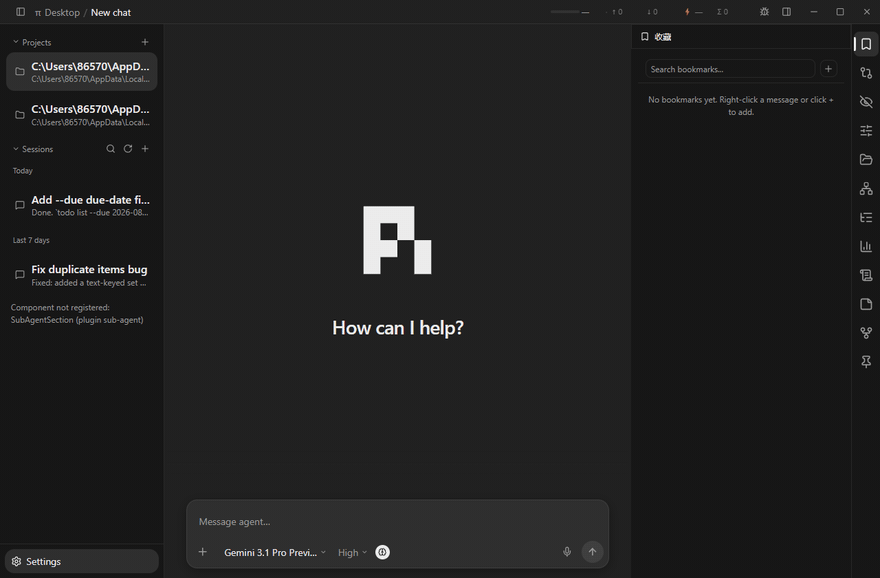
</p>

#### 3.4.37 keybindings + key-hints

Keyboard accessibility, split into two plugins with one discipline: **neither implements any action, they only add new trigger sources** — the action stays owned by its executor.

- **keybindings** declares keystroke → event-bus channel mappings (11 defaults: focus the composer, switch models, cycle thinking depth, open settings…). Pressing a binding invokes the target plugin's existing channel handler — no copied business logic. The settings page offers record-style binding editing and a live event list.
- **key-hints** is Vimium-style link hints: press the trigger and every clickable element lights up with a letter tag; type the tag to click it. It covers what keybindings can't — buttons and menu items that never exposed a channel — by scanning and driving the DOM directly. The two meet at a single channel and evolve independently.

#### 3.4.38 notifier

A resident, zero-visible-slot background plugin: subscribes to the kernel event stream and posts an OS notification (macOS / Windows / Linux) when a session round settles while the main window is unfocused — a four-gate chain (toggle → focus → cooldown → notify). No panels, no settings page; its single option rides the General settings page via `settingsGroups`.

#### 3.4.39 remote-access

The settings page for the remote-access control plane: LAN browser access to the same UI, toggle + password + QR-code pairing, plus a device list with one-click kick. The security machinery itself lives in the shell backend (`src/server/remote/` — scrypt-hashed password, rate limiting, tokens); this plugin is only the UI operating that mechanism over invoke/push channels.

#### 3.4.40 goody-hao

The first contributor to the `systemPrompts` slot: on session spawn the shell collects all contributions and injects the built-in engineering-principles file into the kernel's system prompt. Purely declarative, zero rendering code; uninstalling stops the injection.

#### 3.4.41 read-claude-md

A content plugin of the declarative `extensions` channel: the manifest declares `./pi-extension`, and the framework syncs the carried kernel extension into the pi kernel's extension directory on enable, removes it on disable/uninstall. The extension discovers CLAUDE.md instruction files at session start — global (`~/.claude/CLAUDE.md` + `~/.claude/rules/`) and project-level (walking upward from cwd: `CLAUDE.md`, `.claude/CLAUDE.md`, `.claude/rules/`, `CLAUDE.local.md`, farthest-first in CSS-cascade order) — and injects them once per session as a hidden conversation message rather than a system-prompt modification, so the system prompt stays stable and prompt caching keeps working; only the main interactive session receives it (sub-agents skipped). Purely declarative, zero rendering code.

Third-party plugins go in `~/.my-harness-desktop/plugins/` (user level) or `.my-harness-desktop/plugins/` at the project root (project level), going through the same loader and the same contracts as built-ins — project level overrides user level, user level overrides built-in.

## 🗂 4 Documentation map

- **Doc index & reading order** → [docs/README.md](docs/README.md). The anchor is [core-design.md](docs/core-design.md) (~15k words: the center, kernel abstraction, neutral layer, thin shell); [desktop-kernel-pi-dsh.md](docs/desktop-kernel-pi-dsh.md) is the multi-kernel main document, comparing pi / DSH implementation method by method.
- **Deep dives** → session flow, session mapping, thin-shell argument, adding a third kernel ([add-new-kernel.md](docs/add-new-kernel.md)), directory structure, goal, i18n, sidebar/sidepanel.
- **Per-plugin design docs** → [docs/plugins/](docs/plugins/): one file per plugin, grouped by domain (sessions / project / insight / manager / system / themes), each with a "interactions with other plugins" section.
- **New plugin guide** → [docs/new-plugin.md](docs/new-plugin.md). **Verification playbook** → [docs/e2e-verify.md](docs/e2e-verify.md).

## 🩹 5 Troubleshooting (gotchas)

| Symptom | Cause & fix |
|---|---|
| Windows reports `'env' is not a command` | The npm script calls the Unix `env` — run `npm run dev` from **Git Bash** instead |
| `npm install` hangs / Electron download is slow | The Electron binary comes from the official source; retry with a proxy on slow networks; postinstall renames/re-icons the dev-mode Electron.app (macOS only, skipped elsewhere) |
| macOS says "cannot verify developer" | Artifacts are unsigned: right-click the app → Open to pass Gatekeeper |
| Windows SmartScreen blocks it | Artifacts are unsigned: click "Run anyway" |
| Linux (Debian/Ubuntu) `npm run dev` won't open a window | Electron needs system libraries (libgtk-3, libnss3, libasound2 etc.; Ubuntu 24.04+ renames libasound2 to libasound2t64); `scripts/setup.sh` asks whether to install them — install manually if you skipped |
| dev and installed builds "share" data / settings gone | The two versions split data dirs: dev uses `~/.my-harness-desktop-dev/`, installed uses `~/.my-harness-desktop/`; to inherit, `cp -r` then delete the parts you want isolated |
| Can't find the pi kernel / where did it go | After clicking install on the settings page, pi is pulled from npm into `~/.my-harness-desktop/pi/` — not distributed with the repo |
| Voice input downloads nothing / fails offline | The Whisper model downloads from HuggingFace on first use (cached in browser storage); it's large — first transcription needs network and patience |
| DSH tab shows no models | DSH reads its model config from `~/.dsh/settings.yaml`; configure the model and API key on the DSH settings tab, and check its Cordis extensions tab for disabled plugins |
| Node version error | Node 18+ required; `scripts/setup.sh` detects it and installs if missing |

## ❓ 6 QA

**Q: If I delete a built-in plugin, what exactly does the UI look like?**
The shell starts normally, and the corresponding slot is empty. Two typical cases: delete timeline and the center shows a gray line "mainView slot has no contribution"; delete i18n and all UI copy degrades to raw keys — even i18next's English fallback (`fallbackLng: "en"`) has no resources to fall back to. Nothing crashes, you just lose that feature.

**Q: Does it run on Windows / Linux?**
`npm run dist:all` on one mac produces installers for all three platforms. Cross-platform points already handled in code: self-drawn title bar buttons on win/linux frameless windows, `.cmd` vs shell differences for npm/pi CLI, environment variable casing (`Path` vs `PATH`), window icons in three formats. The dependencies are all cross-platform (Electron / React / Node). But win/linux haven't been tested on real hardware — between "produces packages" and "runs well" there's still a round of real-machine validation.

**Q: What's the relationship between plugin, skill, and extension?**
Three asset kinds on two layers. **plugin** is a my-harness-desktop desktop plugin — everything this document is about. **skill** and **extension** are the kernels' own extension assets (skill packages and in-process extensions like pi's TypeScript extensions / DSH's Cordis plugins), defined and loaded by each kernel. A desktop plugin can carry kernel extensions via the manifest's `"extensions": { "pi": ..., "dsh": ... }` block — the shell syncs them into the kernel's extension directories on enable and removes them on disable. The built-in skill-manager and each kernel plugin's extension tab are the UIs managing the kernel-side assets; they themselves are desktop plugins.

**Q: What did the patch script during `npm install` do? Is it safe?**
Everything it does is visible in `assets/scripts/patch-electron.cjs`: it uses PlistBuddy to change the `CFBundleName` and `CFBundleDisplayName` of the Electron.app in `node_modules/` to "My Harness Desktop", swaps in the project icon, and refreshes the LaunchServices cache. It only touches the local `node_modules`, skips straight past if Electron.app isn't found, and is safe to re-run. It only affects the dev-mode display name, not functionality.

**Q: Where does the kernel actually live? It's not in the repo.**
In dev mode, after clicking install on the settings page, the kernel is pulled from the public npm registry: pi (`@earendil-works/pi-coding-agent`) into `~/.my-harness-desktop/pi/`, DSH (`@deepseek-ai/dsh-sdk-jsonrpc-demo`) into its own managed environment. Kernels are never committed to the repo — the shell installs versions on demand at runtime.

**Q: What's the relationship between `@earendil-works/pi-coding-agent` and pi?**
pi's upstream is Mario Zechner's open-source project ([pi.dev](https://pi.dev)). `@earendil-works/pi-coding-agent` is the distributed pi kernel package my-harness-desktop actually pulls and drives, published on the public npm registry — version listing and installation are done in-app by the pi kernel plugin.

**Q: How do I write my first plugin?**
Shortest path: follow [docs/new-plugin.md](docs/new-plugin.md) and the manifest reference, pick one of the 50 built-in plugins under `src/plugins/` with similar responsibilities as a reference, then drop your result into `~/.my-harness-desktop/plugins/` (user level) or `.my-harness-desktop/plugins/` at the project root (project level). No need to change a single line of the shell.

**Q: Is there a headless / server mode?**
Yes — the shell backend can run without Electron: `npm run server` starts the same assembled backend (`out/main/server.js`, Node host, HTTP + WS). The remote-access feature optionally exposes the same UI to your LAN with password protection.

## 📄 License

[MIT](LICENSE) © earendil-works
