<div align="center">
  
  

  <h1>my-harness-desktop</h1>

  <p>多内核 AI coding agent 桌面壳 —— 薄壳 + 槽位 + 插件，一切功能是外挂</p>

  <p>中文 · <a href="README.md">English</a></p>

  <p>
    
    
    
    
    
  </p>
</div>

---

my-harness-desktop 是一个多内核的 AI coding agent 桌面壳，把 pi 和 dsh 当作两个同级内核托管——谁也不比谁更内建。当前驱动两个内核：**pi**，Mario Zechner 发起的开源终端 coding agent（[pi.dev](https://pi.dev)），核心刻意收窄、其余一切靠扩展；以及 **DeepSeek Harness**（DSH，鲸鱼标）。壳只提供机制：每个内核都是被管理的子进程——pi 走 JSONL RPC（stdin/stdout 上每行一个 JSON 消息），DSH 走 stdio JSON-RPC——整个 UI 由插件体系组装出来，而不是把终端界面搬进窗口。

<p align="center">
  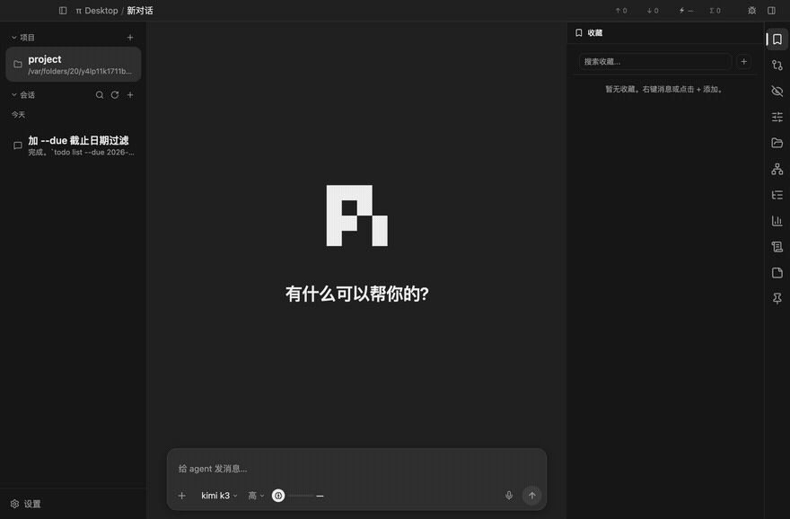
</p>

## 1 设计思想：从 pi 到桌面

### 1.1 pi 的哲学

pi 的 README 里有一句话概括了它的全部设计：*aggressively extensible, so it doesn't have to dictate your workflow*——极端可扩展，这样它就不必规定你的工作方式。

刻意的不做清单：

- 核心只给四个工具：`read`、`write`、`edit`、`bash`。大模型靠这四个工具完成一切，其余能力全是外挂。
- 没有 MCP（Model Context Protocol）——写一个带 README 的 CLI 工具（pi 称之为 skill），或者自己写个扩展去支持 MCP。
- 没有 sub-agents——用终端复用器 tmux 起多个 pi 实例，或者装一个按你的方式做的扩展包。
- 没有权限弹窗——跑在容器里，或者用扩展自建一套符合你安全要求的确认流。
- 没有 plan mode、没有内置 to-do、没有后台 bash——每一种的答案都是同一个：要就自己去扩展。

妙处不在功能少，在于每个"不做"都把选择权还给了用户：功能不进核心，谁的工作流谁自己组装。核心因此小到可以被完全理解，而生态可以长得比任何一家厂商的路线图都快。完整论证见 pi README 的 Philosophy 一节和 Mario Zechner 的设计长文 [pi-coding-agent](https://mariozechner.at/posts/2025-11-30-pi-coding-agent/)。

### 1.2 同一副药，抓到桌面上

my-harness-desktop 把同一条原则原样抓到桌面壳上：

- **壳的功能含量趋近于零**。壳指 my-harness-desktop 自己提供的机制代码：加载器、槽位契约、RPC 适配、配置读写、权限沙箱、事件总线。文案、配色、管理页、渲染逻辑、业务分支——全是壳插件，不焊死在壳里。

- **内核不是插件，是被管理的资源**。pi 和 dsh 是两个同级内核——独立子进程，壳经 RPC 管它们——和 git、文件系统处在同一层抽象。谁也不比谁更内建。

- **内置件没有特权**。删掉任何一个内置插件，壳照常启动，只是少了那块功能；内置件和第三方件走同一套加载器、同一套契约，内置件优先级最低、可被覆盖。

这套模型在桌面端有一个工业级样本：VSCode——它的语言包、主题、默认渲染器全是扩展，不是硬编码。my-harness-desktop 借它的架构纪律（薄壳 + 槽位契约 + 无特权差异），但不借它的 API 形状：那是为代码编辑器优化的，my-harness-desktop 的槽位是会话列表、设置页、主题，为对话式桌面应用优化。

### 1.3 my-harness-desktop 自己的增量

落到桌面，my-harness-desktop 加了三个自己的判断：

- **消费而非翻译**。不把自己定位成某个内核终端界面的翻译层——不造 adapter 把终端组件树翻译成 Web 组件树。内核经 RPC 吐出结构化数据，桌面插件拿到数据自己决定怎么画。翻译层整个被消解，第三方想在桌面有 UI，写一个桌面插件就行，不用给壳贡献 JSON 等发版。

- **槽位契约**。壳预定挂载点——侧栏、主视图、设置页、主题、语言等——插件往槽位上挂内容，壳只认契约不认具体插件。换掉所有插件，壳机制一行不动。

- **壳管通用，特化归插件**。save / dirty / 拦截 / 刷新这类每个设置页都要做的事，收进壳统一承担；插件只管渲染 UI 和报告改动。几十个插件的保存逻辑从几十份变成一份。

完整论证：[docs/DESIGN.md](docs/DESIGN.md)。

## 2 跑起来

### 2.1 环境要求

- Node.js 18 或更高（electron-vite 的要求；开发机实际用的是 Node v25）。
- macOS 是目前验证过的开发平台。`npm install` 时有个 postinstall 脚本会给 dev 模式的 Electron.app 换名换图标，那是 macOS 专用的，其他平台自动跳过、不报错。Windows / Linux 没有已知的平台特定障碍——依赖全是跨平台的（Electron / React / Node）——但也没有人实测过。

### 2.2 两条命令

一条引导脚本会检测环境、缺了就按平台帮你装 Node.js，然后自动 `npm install`：

```bash
bash scripts/setup.sh                                          # macOS / Linux
powershell -ExecutionPolicy Bypass -File scripts\setup.ps1     # Windows
```

或者手动两条命令：

```bash
npm install   # 装依赖，postinstall 顺手把 dev 模式的 Electron.app 换名换图标
npm run dev   # electron-vite 开发模式，起窗口
```

Windows 若提示 `'env' 不是命令`：npm 脚本里有 Unix 的 `env` 调用，改用 Git Bash 跑 `npm run dev` 即可。

窗口起来后，先在设置页（左栏底部的齿轮入口）装好内核、配好模型。有两个同级内核，装哪个都行，也可都装：

- **pi**——在 Pi tab（pi-manager 插件）安装 pi 版本：pi 是公共 npm registry 上的 `@earendil-works/pi-coding-agent` 包，界面会列出可用版本，选一个安装，不随仓库分发；再到"模型"tab 配好 provider 和 API Key（支持哪些 provider 由 pi 决定，Anthropic、OpenAI 等主流都在，Key 去对应 provider 官网申请）。
- **DSH**——在 DSH tab（dsh-manager 插件）安装 dsh 内核（`@deepseek-ai/dsh-sdk-jsonrpc-demo` 包及其 Cordis 插件集），再到模型 tab 配好模型与 API Key，"拓展"tab 管它的 Cordis 插件。

之后回主界面，在左栏选一个本地目录作为工作目录（任意代码项目即可）、新建会话、选内核，开始对话。

其他常用命令：

- `npm run build` — 构建产物到 `out/`。
- `npm run typecheck` — `tsc --noEmit` 全量类型检查。
- `npm run lint` — ESLint 检查 `src/plugins/`，零 warning 门槛。
- `npm start` — 直接跑 `out/` 里的构建产物，带 `--remote-debugging-port=9222`。

### 2.3 打安装包（稳定版与迭代版共存）

```bash
npm run dist       # 出本机平台的安装包到 dist/
npm run dist:all   # 一台 mac 一次出三端：mac(.dmg/.zip) + Windows(nsis/.zip) + Linux(AppImage/.deb)
npm run pack       # 只打目录形式(不压安装包)，快速验证打包态
```

产物未签名：macOS 首次打开走 右键→打开 过 Gatekeeper；Windows SmartScreen 选"仍要运行"。签名/公证需要开发者证书，是另一摊事。

**数据目录分流**：打包安装的版本（`app.isPackaged`）读写 `~/.my-harness-desktop/`，`npm run dev` / `npm start` 跑的开发版读写 `~/.my-harness-desktop-dev/`——安装一个稳定版日常用，dev 版随便迭代，两边数据互不污染。两个例外不分流：内核各自的配置目录——`~/.pi/agent/`（pi 的模型与设置，两版共享，只配一次）和 `~/.dsh/`（DSH 的 settings.yaml）——以及项目级 `<cwd>/.my-harness-desktop/`（跟着项目走）。dev 版首次启动想继承稳定版数据，可以 `cp -r ~/.my-harness-desktop ~/.my-harness-desktop-dev` 后再删要隔离的部分。

**窗口与平台适配**：macOS 用原生红绿灯；Windows/Linux 无边框窗口的标题栏自带 min/max/close 按钮（自绘，经 `window:*` IPC）。win/linux 的 spawn 调用（npm install、pi CLI）已做 `.cmd`/shell 适配，但这两端尚未真机实测——第一个在 Windows / Linux 上跑的人就是验证者。

## 3 三分钟看懂架构

### 3.1 一句话模型

三层各管一件事：**内核**是能力（pi 和 dsh 子进程，经 RPC 驱动），**壳**是机制（加载器、槽位、配置、权限），**插件**是内容（一切 UI 和功能）。壳不认具体插件，只认槽位契约；插件不碰壳实现，只经 `packages/contract` 和 `packages/react` 两个发布面拿受控 API。

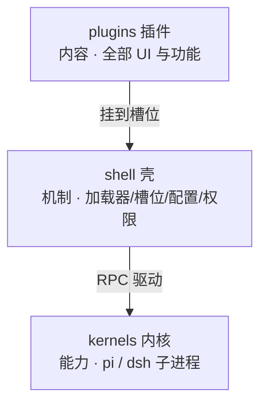

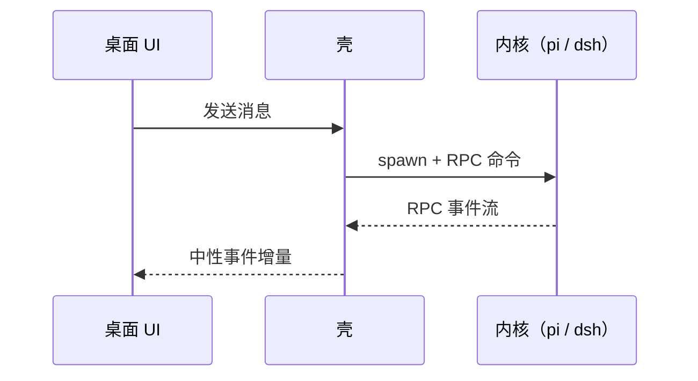

### 3.2 目录分区

```
src/
  core/         # 圆心：domain(槽位契约、中性类型、纯函数，零依赖) + protocol(协议契约与翻译)
                #   + application(用例编排：加载器、配置、会话、主题/i18n 合并)
  api/          # 流入适配器：ipc(main 进程 IPC handler，按能力域分文件) + preload(window.pi 桥接面)
                #   + renderer(React 入口、槽壳、plugins-host、stores)
  client/       # 流出适配器：pi + dsh(内核 RPC 适配、子进程生命周期) + fs + git + npm
  bootstrap/    # 组装根：Electron main 入口——读环境、建依赖、注入 MainContext、管窗口
  plugins/      # 内容层：一切功能，按域分六组(themes/sessions/project/insight/manager/system)
packages/
  contract/     # 发布面：domain + 路径/样式预设契约的 re-export
  react/        # 发布面：React 组件与 hooks，插件唯一允许的 API 入口
  pi-cli/       # 打安装包时的 pi 内核副本落点（仓库里为空；dev 运行时内核由应用装进 ~/.my-harness-desktop/）
```

"中性"指不依赖任何框架、任何运行时——纯 TypeScript 类型和结构化数据，换掉 Electron 或 React 都不受影响。

依赖只向内：`core/domain/` 不 import 任何外部包，`plugins/` 只经 `packages/` 引用类型和 API。前者是物理的——`core/domain/` 里没有任何外部包可引；后者由 ESLint 强制——插件直接 import `src/` 内部实现的引用会被 lint 拦下。

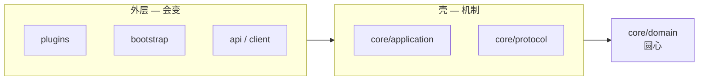

### 3.3 槽位一览

壳预定的挂载点，插件往槽上挂内容。当前已实现贡献接口的十七个：

- **`sidebar`** — 左侧栏：会话列表、项目列表。
- **`sidePanel`** — 右侧面板：会话树、Git review、文件树、Token 统计。
- **`mainView`** — 中区主视图：timeline 插件贡献的会话消息流。
- **`titlebar`** — 标题栏右侧按钮。
- **`settings`** — 设置页：pi 管理、模型管理、主题管理、语言等。
- **`settingsGroups`** — 通用设置字段组：纯 JSON 声明往「通用」设置页挂一框字段，通用渲染器渲成控件，插件零渲染代码。
- **`themes`** — 主题配色方案。
- **`languages`** — 语言文案包。
- **`messageRenderers`** — 按消息 role/kind 自定义卡片，覆盖默认渲染。
- **`messageActions`** — 消息行动作按钮（如复制、收藏、重试）。
- **`blockRenderers`** — 会话流块级渲染件：工具卡、思考链、用户气泡、Markdown 文本、分隔线，按 (块类型, 工具名/kind) 二键解析，第三方可按名认领或覆盖单块呈现（如给新工具画卡），内置批次由 message-blocks 插件（块）与 markdown 插件（文本）贡献。
- **`codeBlockRenderers`** — 文本块内部的围栏语言渲染件：插件按语言（`mermaid`、`puml`…）认领，markdown 渲染器把围栏块分发过去；第三方不改 markdown 插件即可新增图/表语言。内置批次由 mermaid、puml、graphviz 插件贡献。
- **`fileActions`** — 文件上下文动作（如盲审文件）。
- **`fileIcons`** — 文件树行图标（扩展名/文件名 → 图标映射，可按 key 覆盖）。
- **`sessionGroupings`** — 会话分组策略（子会话嵌套）。
- **`composerPolicies`** — 输入框条件渲染策略（只读提示条）。
- **`systemPrompts`** — 往内核会话 spawn 注入 system prompt 文件。

圆心的 `SlotName` 类型里另有 `management` / `cardRenderers` / `viewers` / `commands` 四个预留名，贡献接口未实现，在 `plugin.json`（插件的 manifest）里声明了会被忽略。

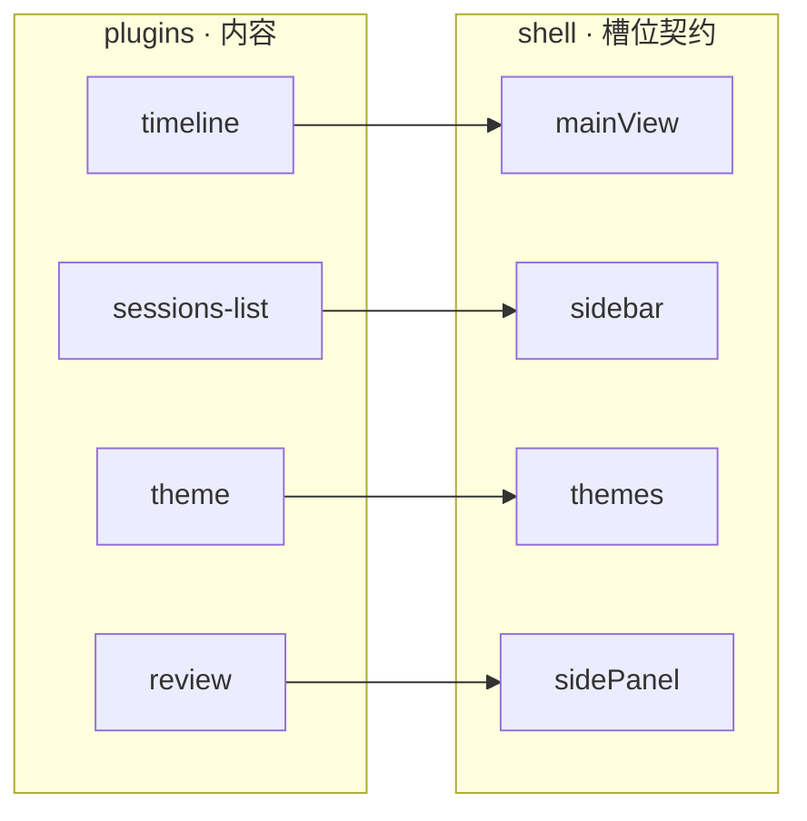

### 3.4 内置插件目录

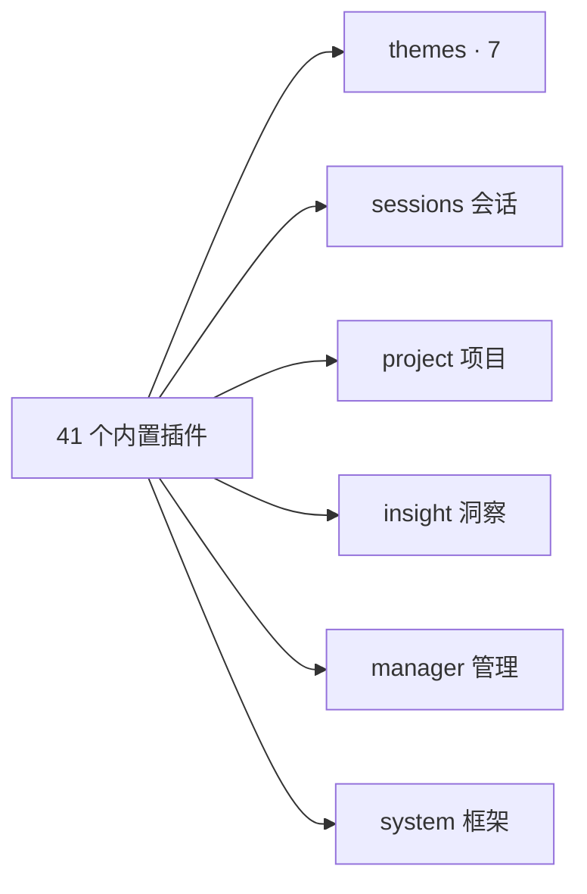

41 个内置插件随壳分发、开箱即用，架构地位和第三方插件完全平等——可被覆盖、可被删掉。先讲三个最有代表性的（收藏、笔记、图钉），再按域分组（与 `src/plugins/` 下的物理分组一致；七套主题合并为一节）。写了单篇设计文档的插件在 `docs/plugins/` 下（覆盖一半左右，优先看职责和你想法相近的）。

#### 3.4.1 session-bookmarks（会话收藏）

把会话里某个有价值的节点存成持久快照。pi 的 fork 是即时的、跟着原会话走——原会话删了分支就没了；收藏解决的是"保存某个节点，日后从那个点重新开始"。收藏 = 完整 JSONL 副本 + 元数据，与原会话完全隔离：副本全程不被 pi 进程触碰，点击收藏时经 `forkFromSession` 原子用例复制出中间文件再 fork，同一收藏可反复使用，像个"对话模板"。创建有三个入口——timeline 消息右键、会话树节点按钮（两个入口都走事件总线 `bookmarkRequested`，只对 user 消息锚点放行，pi 内核 fork 不接受 assistant 锚点）、面板手动添加（先校验再创建）。收藏跟项目走（按 cwd 分桶），写入顺序 + 加载时自愈校验兜底副本与索引的一致性。

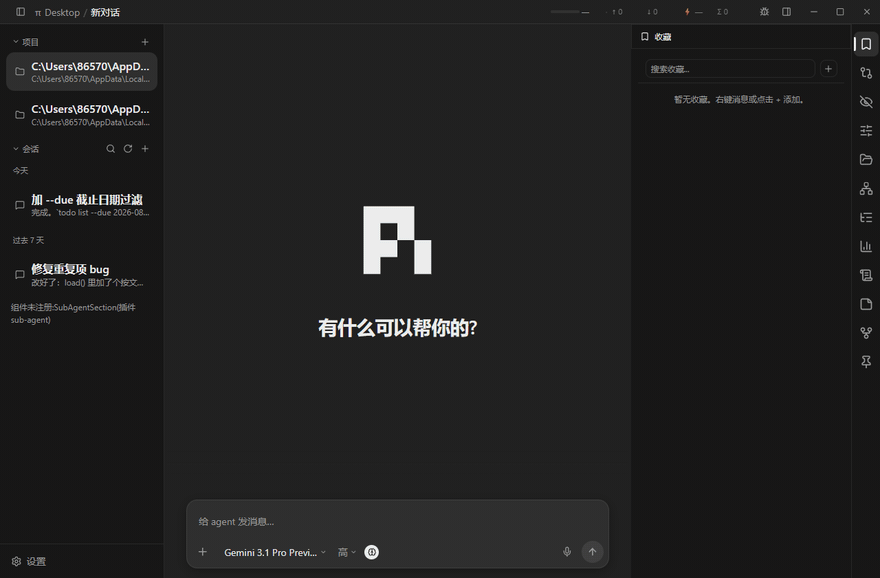

#### 3.4.2 notes（笔记）

一键发送的常用语卡片。"帮我整理成日报""commit 按规范写"这类话重复打一百次成本高——点卡片 = 输入 + 发送一步完成，走 `sendMessage` 受管写口直发会话，不经过输入框（不打扰你正在草拟的内容）。标题可选，没标题拿内容前 120 字当摘要——同一抽象的参数化，没有 kind 字段。存储分两层：全局 `~/.my-harness-desktop/notes.json` 跨项目通用，项目层 `<cwd>/.my-harness-desktop/notes.json` 跟着项目走可入库共享；合并是并集按 order 排序（不是覆盖），层间迁移是移动（不是复制）。视觉是贴纸：id 哈希定 -1.6°~1.6° 稳定倾角，胶带/图钉各半。即时落盘不走框架 save 浮层；为让两层各读各的，给壳补了一个对称读口子 `config-file:getProject`——这是它唯一的壳改动。

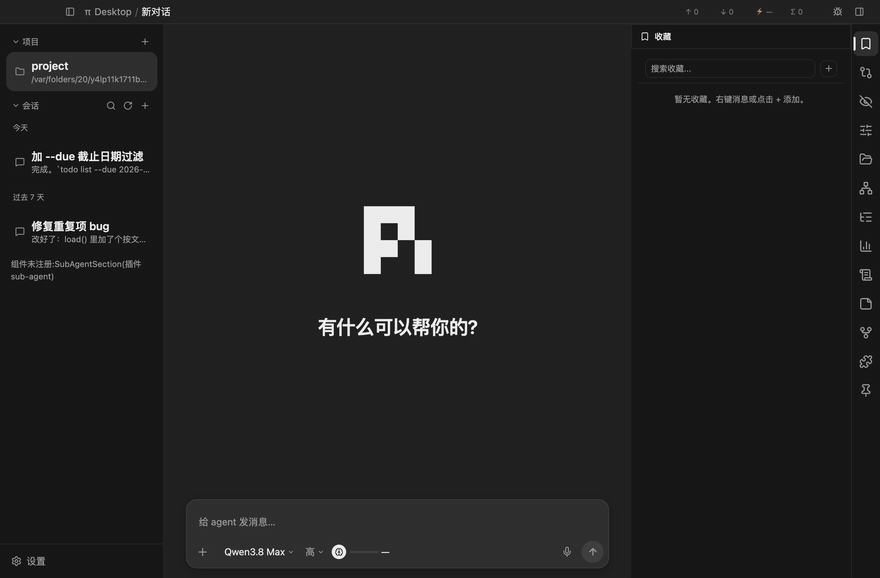

#### 3.4.3 session-colors（会话图钉）

给会话行和会话消息钉彩色图钉。从七色调色板选一个颜色进入钉图钉模式，鼠标带着钉子预览，点在会话行或消息的任意位置落下——行钉按行内相对坐标记录，消息钉锚定消息（跟随滚动与流式增长），列表重排、分组切换时跟着行走。同一行/同一条消息同色的新钉顶替旧钉。右面板图钉页分两段：行钉会话列成卡片（点一下打开对应会话），消息钉按会话聚合成跨会话索引——别的会话里的消息钉也列出（带钉入时刻的文本快照预览），点击即导航：当前会话直接滚，其他会话先打开再滚；图钉显隐可全局开关。纯内容插件：钉数据走插件配置通道，挂载点靠 DOM 锚点（data-session-path / data-message-id），图钉 portal 直钉进宿主元素，不改 sessions-list / timeline 一行代码。

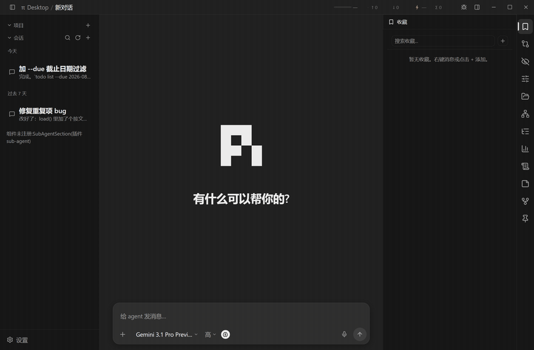

**sessions/ 会话域**

#### 3.4.4 sessions-list（会话列表）

左栏的会话组织中枢（`sidebar` 槽）。搜索、新建、时间四档分组（今天/昨天/过去 7 天/更早）、置顶、归档、批量归档、自定义拖拽排序；右键重命名、打开原始 JSONL 文件。订阅内核事件实时显示"后台执行中"和未读/已读状态。置顶/归档写回会话头行 `custom-my-harness-desktop` 命名空间、重命名追加 `session_info` 条目（`updateHeader` 一把锁串行化），已读位标落插件私有配置，不与 pi 进程抢写会话文件。

#### 3.4.5 session-tree（会话树）

右面板的会话分支地图，已 git-graph 化：泳道铁轨渲染（主干一路直下、旁支缩进），SVG 全景图覆盖层（跨泳道贝塞尔边），四种过滤模式（全部/无工具/仅用户/仅标签），无信息事件链自动压缩。节点 hover 出三个动作：定位（`invoke("timeline:scrollTo")` 跳到消息流对应位置）、fork（`ctx.tree.fork` 从该节点分叉）、收藏（发事件给 session-bookmarks）。分叉和收藏按钮只出现在 user 节点上——pi 内核 fork 只接受 user 锚点。

#### 3.4.6 timeline（时间线）

中区主视图（`mainView` 槽），把 session-store 的中性消息渲成消息气泡、思考块（默认折叠）、工具调用卡片、分隔线。真 Markdown 渲染：GFM、代码块带语言标签和复制按钮；未知条目类型兜底显示原始 JSON，不静默消失。user 消息可回退（fork + 预填输入框，可改可发）；pi 内核 auto-retry 的退避期视作流式中，停止按钮可停，连续失败折叠成"重试 N/max"分隔线。流式期间 composer 呼吸发光、思考块边框流光；长用户气泡超 10 行自动收起。它是 messageActions / composerPolicies 槽的消费方，也是 settingsGroups 槽的贡献者（会话流偏好设置零渲染代码挂进通用设置页）。

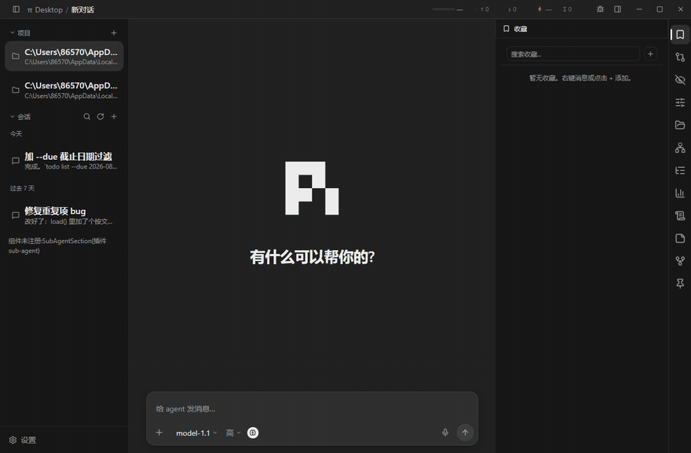

#### 3.4.7 message-blocks（消息块）

会话流的块级渲染件（`blockRenderers` 槽的内置批次）：Bash/Edit/Read/默认四种工具卡、思考链、用户气泡、分隔线。（文本块曾属本批次，现已拆出为独立的 markdown 插件。）timeline 只留机制（滚动、装配、分解、查槽分派），"怎么画"全在插件里——第三方按 `names` 单点覆盖（换掉 Bash 卡、给新 MCP 工具画卡、给新 divider kind 补呈现），timeline 和本插件一行不动。

#### 3.4.8 markdown（Markdown 渲染）

会话流的文本块渲染器（`blockRenderers` 槽的 `text` 项）：react-markdown + GFM + highlight.js 真渲染，代码块卡带语言标签与复制按钮；围栏语言经 `codeBlockRenderers` 槽分发——` ```mermaid ` / ` ```puml ` 块交给认领该语言的插件，markdown 自己不认识任何具体语言。禁用本插件，文本回落 timeline 的纯文本兜底，会话流照常工作。

#### 3.4.9 mermaid（Mermaid 图）

把会话流里的 `mermaid` 围栏代码块渲染成图（`codeBlockRenderers` 槽对 "mermaid" 语言的内置贡献）。引擎动态加载——约 1MB 的 mermaid 包不占首屏；流式期间（围栏未闭合）与解析失败都降级为源码呈现，不炸消息流。主题跟随应用明暗。

#### 3.4.10 puml（PlantUML 图）

把 `puml` / `plantuml` 围栏块渲染成 PlantUML 图（`codeBlockRenderers` 槽对这两个语言的贡献）：`plantuml-encoder` 压缩源码，server 端点（默认 plantuml.com）返回 SVG——不引本地 JAR/WASM。编码或网络失败降级为源码呈现。

#### 3.4.11 graphviz（Graphviz 图）

把 `dot` / `graphviz` / `gv` 围栏块渲染成 Graphviz 图（`codeBlockRenderers` 槽对这三个语言的贡献）：`@viz-js/viz`——Graphviz 的 WASM 编译版，内联在单个 ~1.1MB 文件里——动态加载不进首屏，实例为模块级单例（WASM 只实例化一次，渲染复用）。流式期间与解析失败自降级为源码呈现。输出是透明底黑线 SVG，容器给白底卡片，保证暗色主题下可读。

#### 3.4.12 sub-agent（子 Agent）

子代理编排。在 Session Bus 平的通信世界之上建关系层：派活、并行 fan-out、作战室（多子代理同室协作），父子归属与生命周期管理（父死子清、资源闸）。一口气贡献五个槽位——`sidebar`（子代理面板）、`sidePanel`（作战室监控）、`messageRenderers`（spawn/done 卡片）、`sessionGroupings`（子会话嵌套在父会话下）、`composerPolicies`（子会话输入框换只读提示条）；内核侧由 pi extension 提供 5 个 tool。分工：bus 管地址、路由、说话即传输，sub-agent 管有向归属和编排。

#### 3.4.13 review（评论）

会话内联评论。选中消息流里的文字片段，附上意见，评论累积在输入框上方的评论篮（编号、可就地编辑），随下一条消息一次性拼装发给模型——模型在同一条消息里拿到正文和全部批注的对应关系。设计锚点是"选区锚定 + 收集零打断 + 投递合并成一条"：引文快照不随滚动漂移，登记成本一个动作，不一条评论发一次消息。

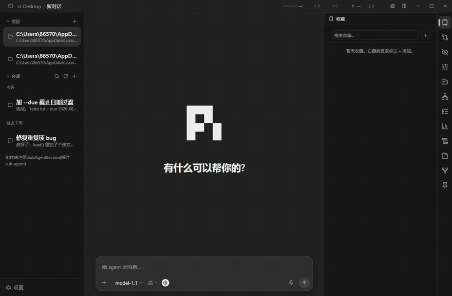

#### 3.4.14 im-graph（IM）

Session Bus 的会话关系图实时可视化（`sidePanel` 槽）。房间成员、spawn 父子、消息流动画，把多会话协作的拓扑画成网络图。纯消费者：订阅 bus 数据渲染，不参与路由。

#### 3.4.15 retry（重试）

消息重试按钮（`messageActions` 槽，只挂在 assistant 消息行上）。从任意 assistant/tool 节点 fork 并重新生成。轻量单功能插件——重试策略（退避、上限）是 pi 内核的事，它只做 fork + 重发。

**project/ 项目域**

#### 3.4.16 projects（项目）

左栏的最近工作目录列表（`sidebar` 槽，排在会话列表上方）。一键切换 cwd、拖拽排序、折叠态持久化；切目录经框架状态广播，会话列表、文件树、笔记等项目级视图跟着刷新——插件之间不直接通信。

#### 3.4.17 file-tree（文件树）

右面板的 VSCode 式文件树（`sidePanel` 槽，`fs:project` 权限，路径圈禁在项目根）。懒加载：展开目录才拉子层；文件夹在前按名排序。同时是 `fileIcons` 槽的内置批次贡献者：30 条扩展名/文件名 → 图标 + 颜色映射，文件名精确匹配优先于扩展名，第三方插件可按 key 覆盖单个图标。

#### 3.4.18 git-review（Git Review）

右面板的 Git 改动审查。三个视角的 diff：本轮（最近有文件改动的轮次）、本对话（轮次分组折叠）、Git 工作区（staged/更改/未跟踪树形分组）。勾选文件 commit——pathspec 限定只提交勾选文件，不卷入其他已暂存内容；push 无参到 upstream；commit message 可手写也可经 `llm:oneshot` 让内核一次性生成。轮次 → 文件集的映射从消息里的 toolCall 纯推导，不依赖内核元数据。

#### 3.4.19 file-preview（文件预览）

文件内容预览（`fileActions` 槽的"预览"动作 + `titlebar` 入口，`fs:project` 权限）。渲染路径：文本（行号纯文本）、图片（base64 ``，含 svg）、PDF（`<embed>` 原生渲染）、Markdown、图（`.mmd`/`.puml`/`.dot`）。富文本路由不 import 任何渲染引擎，全部走槽消费：`.md` 解析 `blockRenderers` 槽的 text 赢家（markdown 插件），图文件按扩展名查 `codeBlockRenderers` 槽的 `fileExtensions` 声明（mermaid / puml / graphviz 插件）——映射知识归贡献方，新增图语言本插件零改动；插件被禁用即回落纯文本视图，不炸。带渲染/源码切换。

**insight/ 洞察**

#### 3.4.20 token-stats（Token 统计）

右面板的 Token 用量仪表盘。三层口径各一数据源、互不校准：本轮/上一次（会话投影的 `turn`/`lastTurn`，累计在 main 侧 dispatch 常驻完成——面板是纯渲染器，页签显隐不影响采集）、本会话（同一 RPC 权威投影）、项目总（聚合本目录全部会话文件真值）。翻轮只在 agentStart 一个时机，避免双发覆盖。纯事件驱动，零轮询。

#### 3.4.22 blind-review（盲审）

多蓝队独立审查 + 裁判汇总，借鉴 Anthropic 的 blind auditing game。多支互不可见的蓝队各自在全新会话里审查同一份内容（信息屏障——零历史上下文，模型推断不出代码来源，治"自己评自己报喜不报忧"），访问权限分级（黑盒仅内容/白盒含项目结构），最后裁判角色汇总全部报告、去重分级、标注共识与分歧。内置四支蓝队（正确性/安全/逻辑/隐藏意图），prompt 模板可在设置页增删改。贡献 `sidePanel` + `settings` + `fileActions`（文件右键直接送审）三个槽位。

#### 3.4.21 llm-recorder（LLM 请求记录）

记录每次 LLM 调用的完整请求体和响应消息。它是 `piExtension` 声明式通道的第一个内容插件：manifest 声明 `./pi-extension`，框架在启用时把内核扩展同步进 `~/.pi/agent/extensions/`、停用/卸载时摘除（区别于 toolgate 这类常驻内核扩展）。扩展在内核进程内挂 `before_provider_request`/`message_end` 等 hook，把请求/响应按会话落到 `<cwd>/.my-harness-desktop/llm-logs/`（跟项目走，超 512KB 自动分片）；桌面侧 `sidePanel` 按当前会话配对展示请求/响应全文，`settings` 提供项目级统计、一键清理和即时生效的记录开关。凭证不进日志（headers hook 整条不碰）。设计文档 [docs/design/llm-recorder-design.md](docs/design/llm-recorder-design.md)。

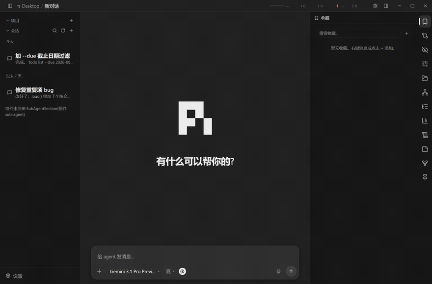

**manager/ 管理页**

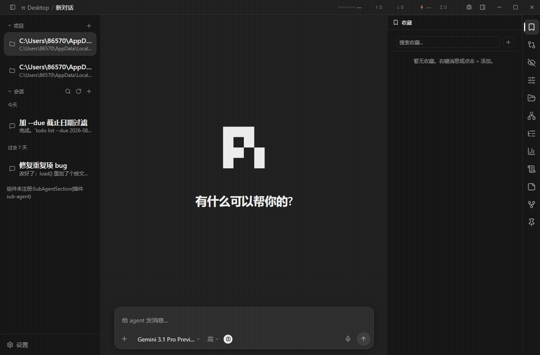

#### 3.4.23 pi-manager（Pi 管理）

设置页第一个 tab。pi 内核版本管理：列出 npm registry 上 `@earendil-works/pi-coding-agent` 的可用版本，装进独立环境 `~/.my-harness-desktop/pi/`（不污染全局 npm），支持自定义内核可执行路径。下区是 57 项内核配置的描述表（`~/.pi/agent/settings.json`），框架管 configFile 的 dirty/save/拦截生命周期，插件只管渲染表单。

#### 3.4.24 pi-model-manager（模型管理）

模型供应商与模型配置（`~/.pi/agent/models.json`）。供应商/模型双栏 CRUD（右键复制/删除）、默认模型 ★、API Key/Base URL 编辑、连通性测试——测试走内核隔离会话 ping（`test:{uuid}` 进程 key，不设激活、不走基线），不劫持用户正在用的会话。

#### 3.4.25 plugin-manager（插件管理）

桌面插件自身的管理页：启用/禁用/安装/卸载/重载，tags 三态筛选（只看/排除/取消）。受保护不可卸载自己。注意它管的是 my-harness-desktop 桌面插件——内核的技能和扩展归 skill-manager / extension-manager。

#### 3.4.26 theme-manager（主题管理）

不止选主题：主题网格预览（含会话流独立主题——mainView 槽第二主题实例，左右栏不受影响）、字体栈选择、分区字号（界面/代码/输入框独立 slider）、左栏/右面板/会话流三处宽度 slider。即时生效不走 save 浮层。

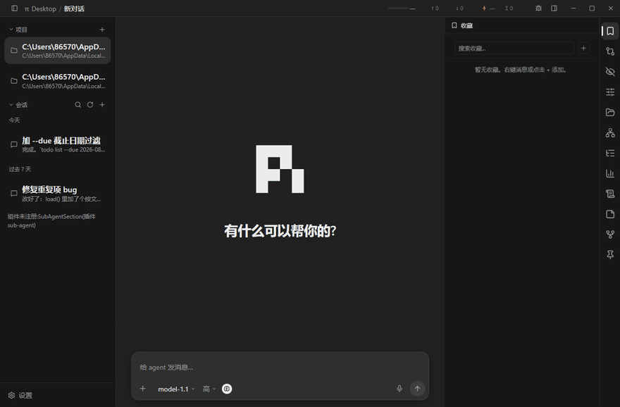

#### 3.4.27 skill-manager（技能管理）

pi 内核技能（SKILL.md）的管理页：四大来源（settings.json 显式路径、`~/.pi/agent/skills/`、`~/.agents/skills/`、项目级 `.pi/skills/`）扫描出来的技能列表，启用/禁用 + 强制上下文 toggle（写 frontmatter 的 `disable-model-invocation`）。改动下次会话生效（pi 内核无 reload RPC）。

#### 3.4.28 tool-manager（工具管理）

会话级工具过滤。设置页管工具组定义（项目级插件配置），右面板按组勾选当前会话放行的工具；开关走"内存偏好 + onSend flush 落盘"——写进会话头行 `custom-my-harness-desktop.toolConfig`，由 toolgate（工具网关，壳同步到内核的 extension）在 turn_start 调 `pi.setActiveTools` 硬过滤；toolgate 未装时降级为 prompt 软注入。工具清单的权威发现也由 toolgate 承担：扩展在 turn_start 把 `pi.getAllTools()` 播报进侧车文件，桌面经 `kernel:knownTools` 读取（设计 docs/design/tool-manager-design.md §4.4），没跑过的扩展工具也能进组进白名单。

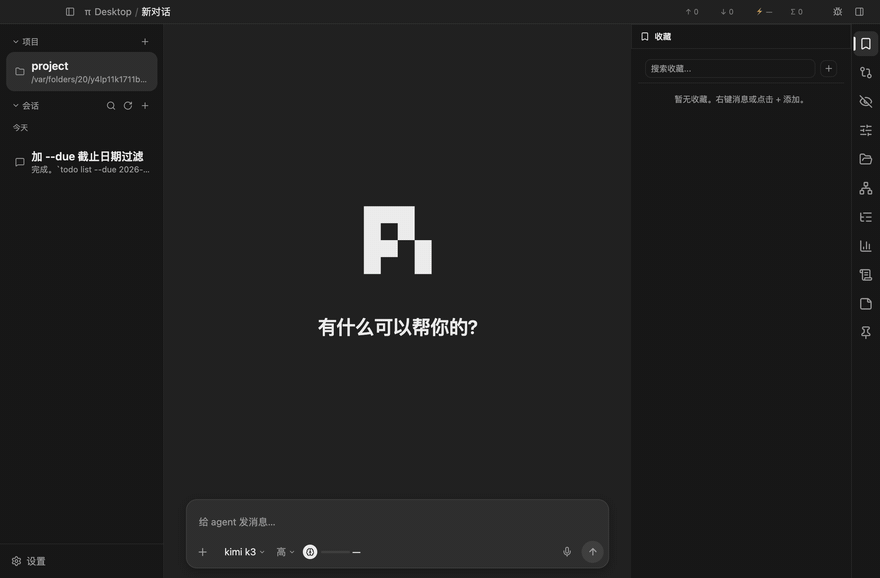

#### 3.4.29 extension-manager（扩展管理）

pi 内核的 TypeScript 扩展管理页：`~/.pi/agent/extensions/` 下扩展的启用/禁用/安装。plugin（桌面插件）、skill（内核技能包）、extension（内核扩展）是两层三类资产，这个插件管的是第三类。

**themes/ 外观**（全部是纯 JSON 声明，零代码）

#### 3.4.30 theme（默认主题）+ 六套配色

theme 是基座：内置 dark / light / auto 三套基础配色，定义完整 token 体系（颜色/字号/间距/圆角/阴影/滚动条/分割线），auto 跟随系统明暗。六套配色主题都是纯 JSON 声明，以它为 base 继承再局部覆盖：

- **theme-chatgpt** — ChatGPT 风格深色：中性灰底、大圆角、单色发送键、品牌绿点缀。
- **theme-midnight** — Midnight 深色：低饱和配色，收敛阴影，视觉重量轻。
- **theme-mocha** — Mocha 暖色：Catppuccin Mocha 调色板——深紫灰底、蓝主色、绿成功、红错误。
- **theme-new-york** — 明暗两套，zinc 中性灰 + 天蓝主色，大圆角，对齐 shadcn/ui 的 New York 风格。
- **theme-stone** — 明暗两套，暖灰色系，质朴低对比。
- **theme-terminal** — 终端风：纯黑底、磷光绿主色、全局等宽字体、零圆角零阴影、动画节奏极快。

**system/ 框架级内容**

#### 3.4.31 i18n（国际化）

四语言文案包（简/繁/英/德，12 个命名空间 × 4 语言共 48 个资源文件）+ 语言设置页。所有插件的 `t("key")` 消费这里的资源，第三方插件可经 languages 槽覆盖任意 key。受保护不可卸载——删了它所有界面文案退化为 key 原文。

#### 3.4.32 general-config（通用配置）

通用设置页宿主，同时是 `settingsGroups` 槽的通用渲染器：别的插件（timeline 的"会话流"、review 的"评论"等）以纯 JSON 声明字段组，由这里统一渲成开关/下拉/滑块控件——贡献插件零渲染代码。自己也经同一个槽贡献"界面"字段组（侧栏默认展开、浮动卡片等），内置与第三方同契约。

#### 3.4.33 debug-bar（Debug 按钮）

标题栏 debug 按钮（`titlebar` 槽），受通用设置的 debugMode 开关控制。两个能力：复制页面 DOM 到剪贴板（可简化去除 inline style）；元素审查模式——全屏画框标序号、三级粒度过滤、悬停高亮、点击复制最内层命中元素的 DOM，方便"跟 AI 说 #N 元素有问题"。


#### 3.4.34 goody-hao（工程原则注入）

`systemPrompts` 槽的首个贡献者：spawn 会话时壳收集所有贡献项，经 `--append-system-prompt` 把内置工程原则文件注入内核 system prompt。纯声明式，零渲染代码，卸载即停止注入。

#### 3.4.35 read-claude-md（CLAUDE.md 自动加载）

`piExtension` 声明式通道的第二个内容插件（首个是 llm-recorder）：manifest 声明 `./pi-extension`，框架在启用时把携带的内核扩展同步到 `~/.pi/agent/extensions/read-claude-md/`，禁用/卸载时摘除。扩展在会话启动时发现 CLAUDE.md 指令文件——全局（`~/.claude/CLAUDE.md` + `~/.claude/rules/`）与项目级（cwd 逐级向上：`CLAUDE.md`、`.claude/CLAUDE.md`、`.claude/rules/`、`CLAUDE.local.md`，CSS cascade 序远者先行）——以隐藏会话消息每会话注入一次，不改 system prompt，保住 prompt cache 命中；只注入主交互会话（跳过 sub-agent）。纯声明式，零渲染代码；扩展管理页显示为受保护（壳随插件同步，允许禁用语义自相矛盾）。

第三方插件放 `~/.my-harness-desktop/plugins/`（用户级）或项目根目录的 `.my-harness-desktop/plugins/`（项目级），和内置件走同一套加载器、同一套契约——项目级覆盖用户级，用户级覆盖内置。

## 4 文档地图

- **架构与纪律** → [docs/DESIGN.md](docs/DESIGN.md)：为什么薄壳、壳与插件的分工、分区依赖纪律、通信机制。
- **壳机制实现** → [docs/core/](docs/core/)：加载器、RPC 适配、会话管理、配置加锁、主题/i18n 合并、安全边界。
- **按主题读** → [docs/desktop/](docs/desktop/)：001–012 编号主题文档。

## 5 QA

**Q：删掉某个内置插件，界面具体会变成什么样？**
壳照常启动，对应槽位空着。两个典型：删掉 timeline，中区显示一行灰字"mainView 槽无贡献"；删掉 i18n，所有界面文案退化为显示 key 原文——i18next 配的英文回退（`fallbackLng: "en"`）也没有资源可回了。删哪个都不会崩，只是那块功能没了。

**Q：Windows / Linux 能跑吗？**
`npm run dist:all` 在一台 mac 上就能出齐三端安装包。代码层面已处理的跨平台点：win/linux 无边框窗口的自绘标题栏按钮、npm/pi CLI 的 `.cmd` 与 shell 差异、环境变量大小写（`Path` vs `PATH`）、窗口 icon 三端格式。依赖全是跨平台的（Electron / React / Node）。但 win/linux 未真机实测——"能出包"和"跑得好"之间还差一轮真机验证。

**Q：plugin、skill、extension 三个词是什么关系？**
分属两层。plugin 是 my-harness-desktop 的桌面插件——本文讲的全部内容。skill 和 extension 是 pi 内核的两类扩展资产（技能包和内核的 TypeScript 扩展），由内核定义和加载。内置的 skill-manager、extension-manager 是管理内核那两类资产的界面，它们自己是桌面插件。

**Q：`npm install` 时的 patch 脚本干了什么，安全吗？**
干的事在 `assets/scripts/patch-electron.cjs` 里全部可见：用 PlistBuddy 把 `node_modules/` 里 Electron.app 的 `CFBundleName` 和 `CFBundleDisplayName` 改成 "My Harness Desktop"，换上项目图标，刷新 LaunchServices 缓存。只动本地 `node_modules`，找不到 Electron.app 就直接跳过，可重复执行。它只影响 dev 模式的显示名，不影响功能。

**Q：`packages/pi-cli/` 是空的，内核到底装在哪？**
dev 模式下，在设置页点安装后，内核从公共 npm registry 拉取、装进 `~/.my-harness-desktop/pi/`，不在仓库里。`packages/pi-cli/` 是打桌面安装包时存放 pi 内核副本的落点，仓库里刻意为空。

**Q：`@earendil-works/pi-coding-agent` 和 pi 是什么关系？**
pi 的上游是 Mario Zechner 发起的开源项目（[pi.dev](https://pi.dev)）。`@earendil-works/pi-coding-agent` 是 my-harness-desktop 实际拉取并驱动的 pi 内核分发包，发布在公共 npm registry——版本列表和安装都由 pi-manager 插件在应用内完成。

**Q：怎么写自己的第一个插件？**
最短路径：照 [docs/plugins/PLUGINS.md](docs/plugins/PLUGINS.md) 写 manifest 和 renderer，在 `src/plugins/` 的 41 个内置插件里挑一个职责相近的对照着写，然后把成品放进 `~/.my-harness-desktop/plugins/`（用户级）或项目根的 `.my-harness-desktop/plugins/`（项目级）。不需要改壳任何一行。

## License

[MIT](LICENSE) © earendil-works
