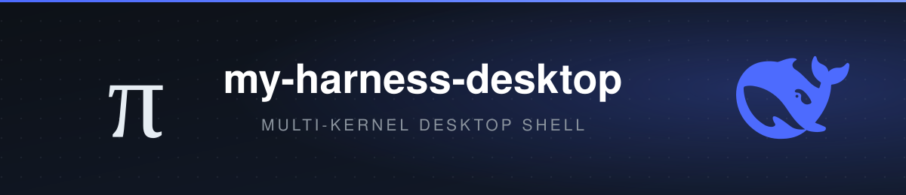

<h1 align="center">my-harness-desktop</h1>

<p align="center"><em>我不是 harness，我只是 harness 的调度工</em></p>

<p align="center">中文 · <a href="README.md">English</a></p>

<p align="center">
  
  
  
  
  
</p>

> **把 pi 和 DeepSeek Harness 装进你的桌面** —— 一个壳、两个同级内核、50 个插件，全在一个窗口。

<p align="center">
  ⭐ 觉得有用？留颗 <a href="https://github.com/GOODDAYDAY/my-harness-desktop">Star</a>，作者能高兴一整天。
</p>

---

## 这是什么

**你在终端里用 pi 或 DeepSeek Harness（DSH）写代码，但想要一个看得见的界面**——会话分支长什么样、改了哪些文件、token 烧了多少，最好全在一个窗口里，还能像装浏览器扩展一样自己加插件。

- 想**看得见**：会话树、文件树、Git Review、Token 仪表盘，全在一个窗口
- 想**可扩展**：按需装插件，而不是等官方发版
- 想**多内核**：pi 和 DSH 都当同级内核托管，随时切换

**my-harness-desktop 就是那个壳。** 它把 pi 和 dsh 当作两个同级内核托管——谁也不比谁更内建：**pi** 是 Mario Zechner 发起的开源终端 coding agent（[pi.dev](https://pi.dev)），核心刻意收窄、其余一切靠扩展；**DeepSeek Harness**（DSH，鲸鱼标）是另一个同级内核。壳只提供机制：每个内核都是被管理的子进程——pi 走 JSONL RPC（stdin/stdout 上每行一个 JSON 消息），DSH 走 stdio JSON-RPC——整个 UI 由 50 个内置插件组装出来，而不是把终端界面硬搬进窗口。

<p align="center">
  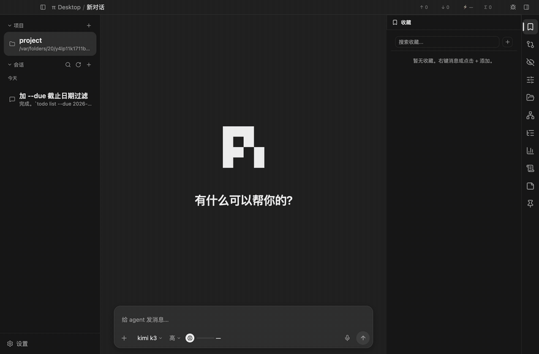
</p>

跑起来长这样：会话流、侧栏、右面板，全在一个窗口里。

## ✨ 装完你能得到什么

| 能力 | 说明 |
|---|---|
| 🧠 双内核托管 | pi 与 DeepSeek Harness（DSH）同级可切换，各自独立装版本、配模型；换内核 = 换适配器，界面不动 |
| 🎯 持久目标 | `/goal` 把目标挂在会话上：模型一轮轮持续推进，自己调 `achieve_goal` 声明完成——内核无关，pi / dsh 都能用 |
| ⏯ 崩溃安全续跑 | 异常停机（工具失败 / LLM 失败 / 取消）后一键原地续跑，不 fork、不重发旧消息 |
| ❓ 向人提问 | 模型生成中途暂停，向你提问（选项 / 自由输入），答案回灌后继续生成 |
| 🌳 会话树 | git-graph 式分支地图，任意节点一键定位回消息流；用户节点上可 fork / 收藏（fork 只接受用户回合锚点） |
| 📁 文件树与预览 | VSCode 式懒加载文件树（路径圈禁在项目根）+ 文件预览（文本 / 图片 / PDF / Markdown / 图表） |
| 🔍 Git Review | 本轮 / 本对话 / 工作区三视角 diff，勾选文件精确 commit、一键 push |
| 🤖 子 Agent 编排 | 派活、并行 fan-out、作战室多子代理协作，父子生命周期管理 |
| 🕵️ 盲审 | 多支互不可见的蓝队独立审查 + 裁判汇总，治「自己评自己报喜不报忧」 |
| 📊 Token 仪表盘 | 本轮 / 本会话 / 项目总三层口径实时统计，纯事件驱动 |
| 📝 LLM 请求记录 | 每次调用的完整请求体与响应按会话落盘，凭证不进日志 |
| 💬 内联评论 | 选中消息文字片段附意见，随下一条消息合并投递给模型 |
| 🎙 语音输入 | 本地 Whisper 转写直接进输入框，模型权重按需下载不进 git |
| ⌨️ 键盘优先 | 声明式快捷键 + Vimium 式按键导览，手不离鼠标也能到任意按钮 |
| 🌐 远程访问 | 局域网浏览器打开同一界面，密码保护 + 二维码配对 |
| 🔔 后台通知 | 会话回合在后台完成、窗口失焦时发一条系统通知 |
| 🎨 主题 | 明暗基础 + 7 套配色（ChatGPT / Everforest / Midnight / Mocha / New York / Stone / Terminal），纯 JSON 声明 |
| 🌍 国际化 | 简 / 繁 / 英 / 德四语言，第三方插件可覆盖任意文案 key |
| 🔌 插件体系 | 50 个内置插件随壳分发、开箱即用，与第三方走同一套加载器和契约，可覆盖、可删除 |

> 📌 这些能力全部来自内置插件，架构地位和第三方插件完全平等。完整清单见 [§3.4 内置插件目录](#34-内置插件目录)。

## 🚀 60 秒上手

```bash
bash scripts/setup.sh   # 自动装好 Node（>= 22.12）并 npm install；Windows 用 scripts\setup.ps1
npm run dev             # electron-vite 开发模式，起窗口
```

窗口起来后：设置页（左下齿轮）装一个内核（pi 或 DSH，都装也行）→「模型」tab 配 provider 和 API Key → 主界面选工作目录、新建会话、选内核，开聊。完整步骤见 [§2 跑起来](#2-跑起来)。

## 💡 1 设计思想：从 pi 到桌面

### 1.1 pi 的哲学

pi 的 README 里有一句话概括了它的全部设计：*aggressively extensible, so it doesn't have to dictate your workflow*——极端可扩展，这样它就不必规定你的工作方式。

刻意的不做清单：

- 核心只给四个工具：`read`、`write`、`edit`、`bash`。大模型靠这四个工具完成一切，其余能力全是外挂。
- 没有 MCP（Model Context Protocol）——写一个带 README 的 CLI 工具（pi 称之为 skill），或者自己写个扩展去支持 MCP。
- 没有 sub-agents——用终端复用器 tmux 起多个 pi 实例，或者装一个按你的方式做的扩展包。
- 没有权限弹窗——跑在容器里，或者用扩展自建一套符合你安全要求的确认流。
- 没有 plan mode、没有内置 to-do、没有后台 bash——每一种的答案都是同一个：要就自己去扩展。

妙处不在功能少，在于每个"不做"都把选择权还给了用户：功能不进核心，谁的工作流谁自己组装。核心因此小到可以被完全理解，而生态可以长得比任何一家厂商的路线图都快。完整论证见 pi README 的 Philosophy 一节和 Mario Zechner 的设计长文 [pi-coding-agent](https://mariozechner.at/posts/2025-11-30-pi-coding-agent/)。

### 1.2 同一副药，抓到桌面上

my-harness-desktop 把同一条原则原样抓到桌面壳上：

- **壳的功能含量趋近于零**。壳指 my-harness-desktop 自己提供的机制代码：加载器、槽位契约、RPC 适配、配置读写、权限沙箱、事件总线。文案、配色、管理页、渲染逻辑、业务分支——全是壳插件，不焊死在壳里。

- **内核不是插件，是被管理的资源**。pi 和 dsh 是两个同级内核——独立子进程，壳经 RPC 管它们——和 git、文件系统处在同一层抽象。谁也不比谁更内建。

- **内置件没有特权**。删掉任何一个内置插件，壳照常启动，只是少了那块功能；内置件和第三方件走同一套加载器、同一套契约，内置件优先级最低、可被覆盖。

这套模型在桌面端有一个工业级样本：VSCode——它的语言包、主题、默认渲染器全是扩展，不是硬编码。my-harness-desktop 借它的架构纪律（薄壳 + 槽位契约 + 无特权差异），但不借它的 API 形状：那是为代码编辑器优化的，my-harness-desktop 的槽位是会话列表、设置页、主题，为对话式桌面应用优化。

### 1.3 my-harness-desktop 自己的增量

落到桌面，my-harness-desktop 加了三个自己的判断：

- **消费而非翻译**。不把自己定位成某个内核终端界面的翻译层——不造 adapter 把终端组件树翻译成 Web 组件树。内核经 RPC 吐出结构化数据，桌面插件拿到数据自己决定怎么画。翻译层整个被消解，第三方想在桌面有 UI，写一个桌面插件就行，不用给壳贡献 JSON 等发版。

- **槽位契约**。壳预定挂载点——侧栏、主视图、设置页、主题、语言等——插件往槽位上挂内容，壳只认契约不认具体插件。换掉所有插件，壳机制一行不动。

- **壳管通用，特化归插件**。save / dirty / 拦截 / 刷新这类每个设置页都要做的事，收进壳统一承担；插件只管渲染 UI 和报告改动。几十个插件的保存逻辑从几十份变成一份。

完整论证：[docs/core-design.md](docs/core-design.md)。

## 2 跑起来

### 2.1 环境要求

- Node.js **22.12 或更高**（electron-vite 要求 ^20.19.0 || >=22.12.0，且内置 Electron 本体要求 node >= 22.12.0；CI 用 22。开发机实际用的是 Node v25）。
- macOS 是目前验证过的开发平台。`npm install` 时有个 postinstall 脚本会给 dev 模式的 Electron.app 换名换图标，那是 macOS 专用的，其他平台自动跳过、不报错。Windows / Linux 没有已知的平台特定障碍——依赖全是跨平台的（Electron / React / Node）——但也没有人实测过。

### 2.2 两条命令

一条引导脚本会检测环境、缺了就按平台帮你装 Node.js，然后自动 `npm install`：

```bash
bash scripts/setup.sh                                          # macOS / Linux
powershell -ExecutionPolicy Bypass -File scripts\setup.ps1     # Windows
```

或者手动两条命令：

```bash
npm install   # 装依赖，postinstall 顺手把 dev 模式的 Electron.app 换名换图标
npm run dev   # electron-vite 开发模式，起窗口
```

Windows 若提示 `'env' 不是命令`：npm 脚本里有 Unix 的 `env` 调用，改用 Git Bash 跑 `npm run dev` 即可。

窗口起来后，先在设置页（左栏底部的齿轮入口）装好内核、配好模型。有两个同级内核，装哪个都行，也可都装：

- **pi**——在 Pi tab（pi 内核插件）安装 pi 版本：pi 是公共 npm registry 上的 `@earendil-works/pi-coding-agent` 包，界面会列出可用版本，选一个安装，不随仓库分发；再到"模型"tab 配好 provider 和 API Key（支持哪些 provider 由 pi 决定，Anthropic、OpenAI 等主流都在，Key 去对应 provider 官网申请）。
- **DSH**——在 DSH tab（dsh 内核插件）安装 dsh 内核（`@deepseek-ai/dsh-sdk-jsonrpc-demo` 包及其 Cordis 插件集），再到模型 tab 配好模型与 API Key，"拓展"tab 管它的 Cordis 插件。

之后回主界面，在左栏选一个本地目录作为工作目录（任意代码项目即可）、新建会话、选内核，开始对话。

其他常用命令：

- `npm run build` — 构建产物到 `out/`。
- `npm run typecheck` — `tsc --noEmit` 全量类型检查。
- `npm run lint` — ESLint 检查 `src/plugins/`，零 warning 门槛。
- `npm start` — 直接跑 `out/` 里的构建产物，带 `--remote-debugging-port=9222`。

### 2.3 打安装包（稳定版与迭代版共存）

```bash
npm run dist       # 出本机平台的安装包到 dist/
npm run dist:all   # 一台 mac 一次出三端：mac(.dmg/.zip) + Windows(nsis/.zip) + Linux(AppImage/.deb)
npm run pack       # 只打目录形式(不压安装包)，快速验证打包态
```

产物未签名：macOS 首次打开走 右键→打开 过 Gatekeeper；Windows SmartScreen 选"仍要运行"。签名/公证需要开发者证书，是另一摊事。

**数据目录分流**：打包安装的版本（`app.isPackaged`）读写 `~/.my-harness-desktop/`，`npm run dev` / `npm start` 跑的开发版读写 `~/.my-harness-desktop-dev/`——安装一个稳定版日常用，dev 版随便迭代，两边数据互不污染。两个例外不分流：内核各自的配置目录——`~/.pi/agent/`（pi 的模型与设置，两版共享，只配一次）和 `~/.dsh/`（DSH 的 settings.yaml）——以及项目级 `<cwd>/.my-harness-desktop/`（跟着项目走）。dev 版首次启动想继承稳定版数据，可以 `cp -r ~/.my-harness-desktop ~/.my-harness-desktop-dev` 后再删要隔离的部分。

**窗口与平台适配**：macOS 用原生红绿灯；Windows/Linux 无边框窗口的标题栏自带 min/max/close 按钮（自绘，经 `window:*` IPC）。win/linux 的 spawn 调用（npm install、pi CLI）已做 `.cmd`/shell 适配，但这两端尚未真机实测——第一个在 Windows / Linux 上跑的人就是验证者。

## 🏗 3 三分钟看懂架构

### 3.1 一句话模型

三层各管一件事：**内核**是能力（pi 和 dsh 子进程，经 RPC 驱动），**壳**是机制（加载器、槽位、配置、权限），**插件**是内容（一切 UI 和功能）。壳不认具体插件，只认槽位契约；插件不碰壳实现，只经 `packages/shared` 和 `packages/react` 两个发布面拿受控 API。

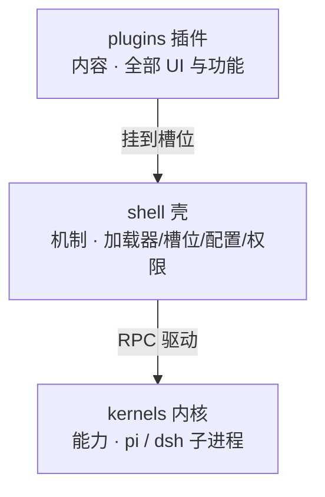
```mermaid
flowchart TB
    P[plugins 插件<br/>内容 · 全部 UI 与功能] -->|挂到槽位| S
    S[shell 壳<br/>机制 · 加载器/槽位/配置/权限] -->|RPC 驱动| K[kernels 内核<br/>能力 · pi / dsh 子进程]
```

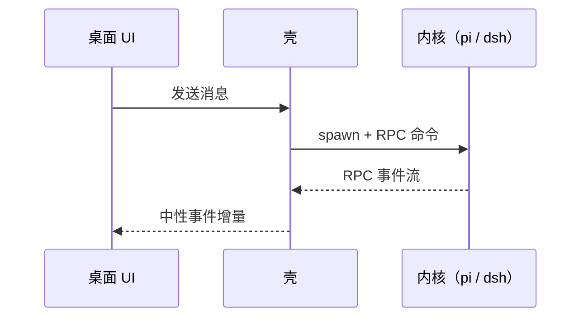
```mermaid
sequenceDiagram
    participant UI as 桌面 UI
    participant S as 壳
    participant K as 内核（pi / dsh）
    UI->>S: 发送消息
    S->>K: spawn + RPC 命令
    K-->>S: RPC 事件流
    S-->>UI: 中性事件增量
```

### 3.2 目录分区

```
src/
  server/            # 壳后端
    application/     #   用例编排：插件加载器/注册表、配置、会话、模型、i18n、主题
    kernel/          #   内核层（同级，一内核一适配器）
      core/          #     抽象基类——不 import 任何具体内核
      pi/            #     pi 适配器：backend + protocol(31 命令契约) + manager + model + extension
      dsh/           #     dsh 适配器：backend + json-rpc 协议 + manager + 事件翻译器
      minimal/       #     minimal 内核（验证「第三个内核存在」的测试夹具）
    client/          #   流出适配器：fs / git / npm / remote
    controllers/     #   网关 handler，按能力域分文件
    transport/       #   HTTP + WS 服务（前后端分离）
    host/            #   Host 接口实现：electron-host + node-host
    bootstrap/       #   组装根：共享组装 + electron / server 双入口
  web/               # 前端 renderer：app 壳、stores、transport、UI 组件
  plugins/           # 内容层：内置插件，按域分组(themes/sessions/project/insight/manager/system/kernels)
                     #   kernels/<id> = 一个内核一个插件（kernel 块 + renderer/ + locales/）
packages/
  shared/            # 圆心：src/domain/（槽位契约、中性类型、纯函数——零依赖，别无他物）
  react/             # 发布面：React 组件与 hooks，插件唯一允许的 API 入口
  my-harness-fit-pi-extension/   # pi 适配扩展（toolgate/bus/subagent/skills 工具），同步进 ~/.pi/agent/extensions/
```

"中性"指不依赖任何框架、任何运行时——纯 TypeScript 类型和结构化数据，换掉 Electron 或 React 都不受影响。

依赖只向内：`packages/shared/src/domain/` 不 import 任何外部包，`plugins/` 只经 `packages/` 引用类型和 API。前者是物理的——`domain/` 里没有任何外部包可引；后者由 ESLint 强制——插件直接 import `src/` 内部实现的引用会被 lint 拦下。

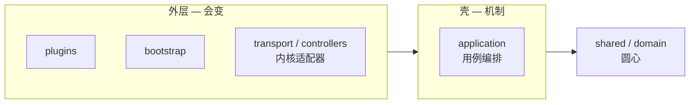
```mermaid
flowchart LR
    subgraph outer[外层 — 会变]
        P[plugins]
        B[bootstrap]
        C[transport / controllers<br/>内核适配器]
    end
    subgraph mid[壳 — 机制]
        A[application<br/>用例编排]
    end
    D[shared / domain<br/>圆心]
    outer --> mid --> D
```

### 3.3 槽位一览

壳预定的挂载点，插件往槽上挂内容。有实现贡献接口的**二十三个**（`PluginContributes` 是唯一权威清单，这里只是描述性列举）：

- **`sidebar`** — 左侧栏：会话列表、项目列表、子代理面板。
- **`sidePanel`** — 右侧面板：会话树、Git review、文件树、Token 统计、作战室监控。
- **`mainView`** — 中区主视图：timeline 插件贡献的会话消息流。
- **`titlebar`** — 标题栏右侧按钮。
- **`settings`** — 设置页：内核管理（pi / DSH）、模型管理、主题管理、语言等。
- **`settingsGroups`** — 通用设置字段组：纯 JSON 声明往「通用」设置页挂一框字段，通用渲染器渲成控件，插件零渲染代码。
- **`themes`** — 主题配色方案。
- **`languages`** — 语言文案包。
- **`fontPresets`** — 字体栈预设（插件纯数据贡献，主题合并管线消费）。
- **`messageRenderers`** — 按消息 role/kind 自定义卡片，覆盖默认渲染（goal 轮次卡、子代理 spawn 卡）。
- **`messageActions`** — 消息行动作按钮（复制、收藏、重试、继续）。
- **`blockRenderers`** — 会话流块级渲染件：工具卡、思考链、用户气泡、Markdown 文本、分隔线，按 (块类型, 工具名/kind) 二键解析，第三方可按名认领或覆盖单块呈现（如给新工具画卡），内置批次由 message-blocks 插件（块）与 markdown 插件（文本）贡献。
- **`codeBlockRenderers`** — 文本块内部的围栏语言渲染件：插件按语言（`mermaid`、`puml`、`dot`…）认领，markdown 渲染器把围栏块分发过去；第三方不改 markdown 插件即可新增图/表语言。内置批次由 mermaid、puml、graphviz 插件贡献。
- **`fileActions`** — 文件上下文动作（如盲审文件、文件预览）。
- **`fileIcons`** — 文件树行图标（扩展名/文件名 → 图标映射，可按 key 覆盖）。
- **`sessionGroupings`** — 会话分组策略（子会话嵌套）。
- **`composerPolicies`** — 输入框条件渲染策略（只读提示条）。
- **`composerTop`** — 输入框上方的横幅组件（goal 条、评论篮）。
- **`composerAttachments`** — 输入框附件来源。
- **`composerActions`** — 输入框底缘按钮（表情包快速入口）。
- **`composerStats`** — composer 中段状态指示组件（上下文占用条）。
- **`composerVoice`** — composer 右下角语音输入按钮（voice-input 插件的界面入口）。
- **`systemPrompts`** — 往内核会话 spawn 注入 system prompt 文件（当前仅 pi 兑现；其他内核在插件管理页显式降级提示）。

圆心的 `SlotName` 类型里另有 `management` / `cardRenderers` / `viewers` / `commands` 四个预留名，贡献接口未实现，在 `plugin.json`（插件的 manifest）里声明了会被忽略。

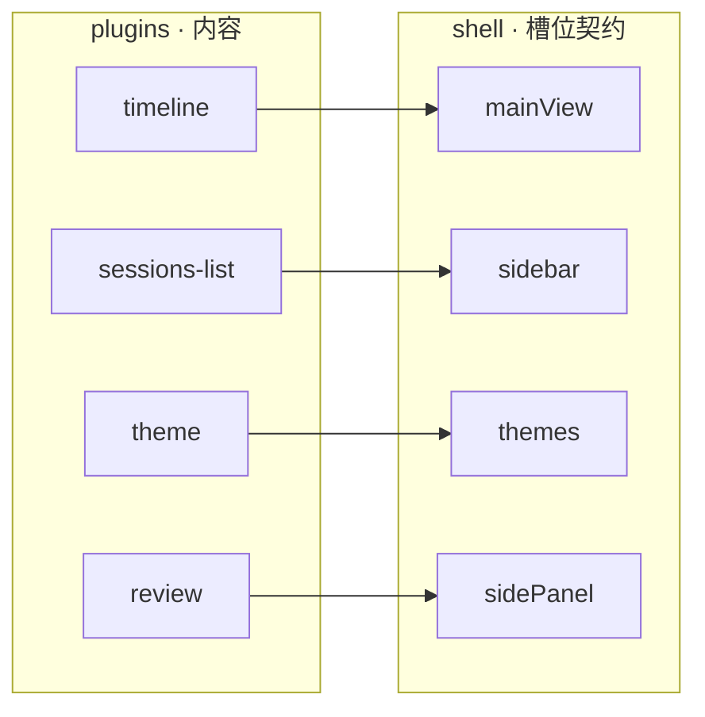
```mermaid
flowchart LR
    subgraph plugins[plugins · 内容]
        A[timeline]
        B[sessions-list]
        C[theme]
        D[review]
    end
    subgraph shell[shell · 槽位契约]
        S1[mainView]
        S2[sidebar]
        S3[themes]
        S4[sidePanel]
    end
    A --> S1
    B --> S2
    C --> S3
    D --> S4
```

### 3.4 内置插件目录

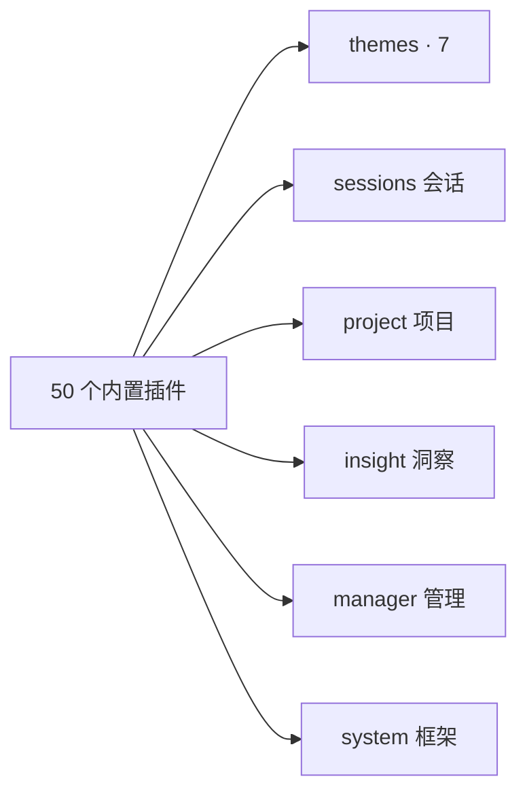
```mermaid
flowchart LR
    R[50 个内置插件] --> T[themes · 7]
    R --> S[sessions 会话]
    R --> P[project 项目]
    R --> I[insight 洞察]
    R --> M[manager 管理]
    R --> Y[system 框架]
```

50 个内置插件随壳分发、开箱即用，架构地位和第三方插件完全平等——可被覆盖、可被删掉。先讲三个最有代表性的（收藏、表情包、图钉），再按域分组（与 `src/plugins/` 下的物理分组一致；七套主题合并为一节）。写了单篇设计文档的插件在 `docs/plugins/` 下（绝大多数都有——优先看职责和你想法相近的）。

#### 3.4.1 session-bookmarks（会话收藏）

把会话里某个有价值的节点存成持久快照。pi 的 fork 是即时的、跟着原会话走——原会话删了分支就没了；收藏解决的是"保存某个节点，日后从那个点重新开始"。收藏 = 完整 JSONL 副本 + 元数据，与原会话完全隔离：副本全程不被 pi 进程触碰，点击收藏时经 `forkFromSession` 原子用例复制出中间文件再 fork，同一收藏可反复使用，像个"对话模板"。创建有三个入口——timeline 消息右键、会话树节点按钮（两个入口都走事件总线 `bookmarkRequested`，只对 user 消息锚点放行，pi 内核 fork 不接受 assistant 锚点）、面板手动添加（先校验再创建）。收藏跟项目走（按 cwd 分桶），写入顺序 + 加载时自愈校验兜底副本与索引的一致性。

<p align="center">
  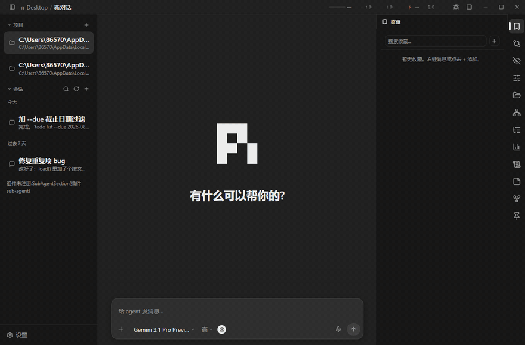
</p>

#### 3.4.2 stickers（表情包）

表情包贴纸卡片：点一下即发送——文本贴纸直接进 prompt，banner 图随会话流展示。「帮我整理成日报」重复打一百次成本高——点卡片 = 输入 + 发送一步完成，走 `sendMessage` 受管写口（不经过输入框，不打扰你正在草拟的内容）。存储分三层：全局层（配置仓的 stickers key，跨项目）、项目层 `<cwd>/.my-harness-desktop/config/stickers.json`（跟项目走可入库）、内置层（随壳分发、可按墓碑删除、不可编辑）；合并是并集按 order 排序（不是覆盖），层间迁移是移动（不是复制），支持 zip 整体导入导出。banner 图存全局数据根，删项目层条目图还在。视觉是贴纸：id 哈希定 -1.6°~1.6° 稳定倾角，胶带/图钉各半。入口两个：`sidePanel` 面板 + `composerActions` 输入框快速入口。

<p align="center">
  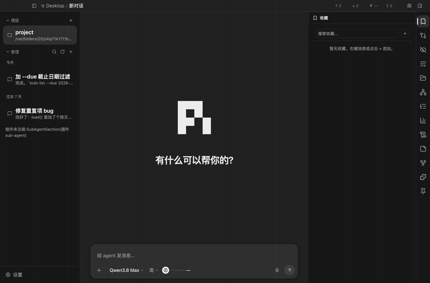
</p>

#### 3.4.3 session-colors（会话图钉）

给会话行和会话消息钉彩色图钉。从七色调色板选一个颜色进入钉图钉模式，鼠标带着钉子预览，点在会话行或消息的任意位置落下——行钉按行内相对坐标记录，消息钉锚定消息（跟随滚动与流式增长），列表重排、分组切换时跟着行走。同一行/同一条消息同色的新钉顶替旧钉。右面板图钉页分两段：行钉会话列成卡片（点一下打开对应会话），消息钉按会话聚合成跨会话索引——别的会话里的消息钉也列出（带钉入时刻的文本快照预览），点击即导航：当前会话直接滚，其他会话先打开再滚；图钉显隐可全局开关。纯内容插件：钉数据走插件配置通道，挂载点靠 DOM 锚点（data-session-path / data-message-id），图钉 portal 直钉进宿主元素，不改 sessions-list / timeline 一行代码。

<p align="center">
  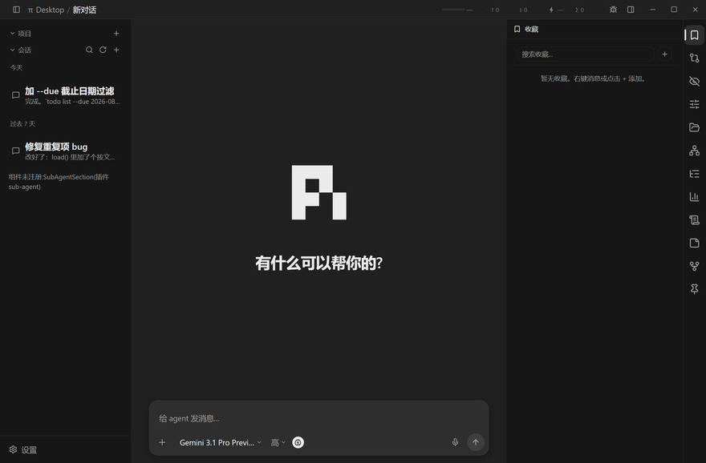
</p>

**sessions/ 会话域**

#### 3.4.4 sessions-list（会话列表）

左栏的会话组织中枢（`sidebar` 槽）。搜索、新建、时间四档分组（今天/昨天/过去 7 天/更早）、置顶、归档、批量归档、自定义拖拽排序；右键重命名、打开原始 JSONL 文件。订阅内核事件实时显示"后台执行中"和未读/已读状态。置顶/归档写回会话头行 `custom-my-harness-desktop` 命名空间、重命名追加 `session_info` 条目（`updateHeader` 一把锁串行化），已读位标落插件私有配置，不与 pi 进程抢写会话文件。

#### 3.4.5 session-tree（会话树）

右面板的会话分支地图，已 git-graph 化：泳道铁轨渲染（主干一路直下、旁支缩进），SVG 全景图覆盖层（跨泳道贝塞尔边），四种过滤模式（全部/无工具/仅用户/仅标签），无信息事件链自动压缩。节点 hover 出三个动作：定位（`invoke("timeline:scrollTo")` 跳到消息流对应位置）、fork（`ctx.tree.fork` 从该节点分叉）、收藏（发事件给 session-bookmarks）。分叉和收藏按钮只出现在 user 节点上——pi 内核 fork 只接受 user 锚点。

#### 3.4.6 timeline（时间线）

中区主视图（`mainView` 槽），把 session-store 的中性消息渲成消息气泡、思考块（默认折叠）、工具调用卡片、分隔线。真 Markdown 渲染：GFM、代码块带语言标签和复制按钮；未知条目类型兜底显示原始 JSON，不静默消失。user 消息可回退（fork + 预填输入框，可改可发）；pi 内核 auto-retry 的退避期视作流式中，停止按钮可停，连续失败折叠成"重试 N/max"分隔线。流式期间 composer 呼吸发光、思考块边框流光；长用户气泡超 10 行自动收起。它是 messageActions / composerPolicies 槽的消费方，也是 settingsGroups 槽的贡献者（会话流偏好设置零渲染代码挂进通用设置页）。

<p align="center">
  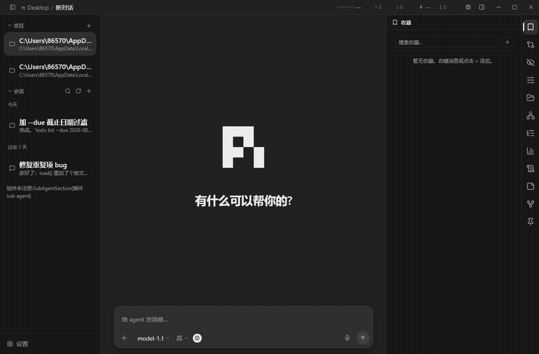
</p>

#### 3.4.7 message-blocks（消息块）

会话流的块级渲染件（`blockRenderers` 槽的内置批次）：Bash/Edit/Read/默认四种工具卡、思考链、用户气泡、分隔线。（文本块曾属本批次，现已拆出为独立的 markdown 插件。）timeline 只留机制（滚动、装配、分解、查槽分派），"怎么画"全在插件里——第三方按 `names` 单点覆盖（换掉 Bash 卡、给新 MCP 工具画卡、给新 divider kind 补呈现），timeline 和本插件一行不动。

#### 3.4.8 markdown（Markdown 渲染）

会话流的文本块渲染器（`blockRenderers` 槽的 `text` 项）：react-markdown + GFM + highlight.js 真渲染，代码块卡带语言标签与复制按钮；围栏语言经 `codeBlockRenderers` 槽分发——` ```mermaid ` / ` ```puml ` 块交给认领该语言的插件，markdown 自己不认识任何具体语言。禁用本插件，文本回落 timeline 的纯文本兜底，会话流照常工作。

#### 3.4.9 mermaid（Mermaid 图）

把会话流里的 `mermaid` 围栏代码块渲染成图（`codeBlockRenderers` 槽对 "mermaid" 语言的内置贡献）。引擎动态加载——约 1MB 的 mermaid 包不占首屏；流式期间（围栏未闭合）与解析失败都降级为源码呈现，不炸消息流。主题跟随应用明暗。

#### 3.4.10 puml（PlantUML 图）

把 `puml` / `plantuml` 围栏块渲染成 PlantUML 图（`codeBlockRenderers` 槽对这两个语言的贡献）：`plantuml-encoder` 压缩源码，server 端点（默认 plantuml.com）返回 SVG——不引本地 JAR/WASM。编码或网络失败降级为源码呈现。

#### 3.4.11 graphviz（Graphviz 图）

把 `dot` / `graphviz` / `gv` 围栏块渲染成 Graphviz 图（`codeBlockRenderers` 槽对这三个语言的贡献）：`@viz-js/viz`——Graphviz 的 WASM 编译版，内联在单个 ~1.1MB 文件里——动态加载不进首屏，实例为模块级单例（WASM 只实例化一次，渲染复用）。流式期间与解析失败自降级为源码呈现。输出是透明底黑线 SVG，容器给白底卡片，保证暗色主题下可读。

#### 3.4.12 sub-agent（子 Agent）

子代理编排。在 Session Bus 平的通信世界之上建关系层：派活、并行 fan-out、作战室（多子代理同室协作），父子归属与生命周期管理（父死子清、资源闸）。一口气贡献五个槽位——`sidebar`（子代理面板）、`sidePanel`（作战室监控）、`messageRenderers`（spawn/done 卡片）、`sessionGroupings`（子会话嵌套在父会话下）、`composerPolicies`（子会话输入框换只读提示条）；内核侧由 pi extension 提供 5 个 tool。分工：bus 管地址、路由、说话即传输，sub-agent 管有向归属和编排。

#### 3.4.13 review（评论）

会话内联评论。选中消息流里的文字片段，附上意见，评论累积在输入框上方的评论篮（编号、可就地编辑），随下一条消息一次性拼装发给模型——模型在同一条消息里拿到正文和全部批注的对应关系。设计锚点是"选区锚定 + 收集零打断 + 投递合并成一条"：引文快照不随滚动漂移，登记成本一个动作，不一条评论发一次消息。

<p align="center">
  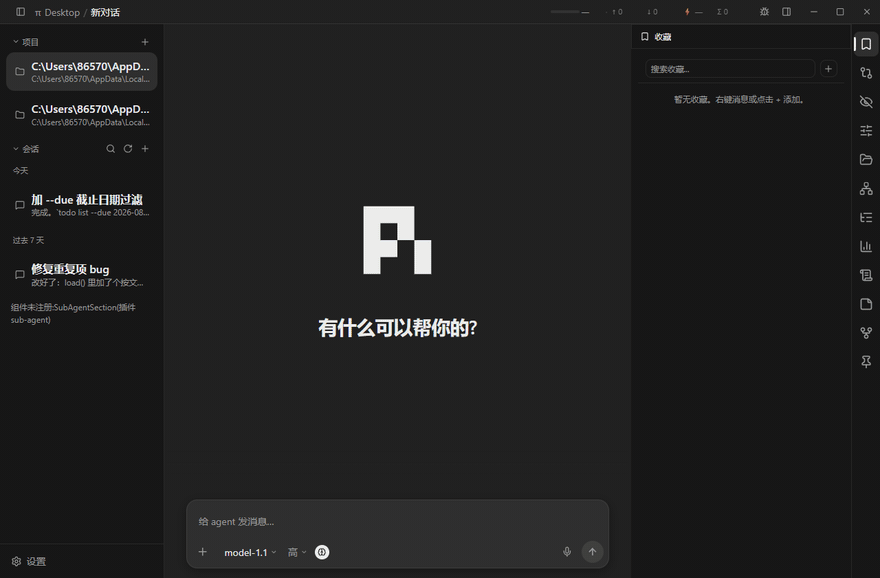
</p>

#### 3.4.14 im-graph（IM）

Session Bus 的会话关系图实时可视化（`sidePanel` 槽）。房间成员、spawn 父子、消息流动画，把多会话协作的拓扑画成网络图。纯消费者：订阅 bus 数据渲染，不参与路由。

#### 3.4.15 retry（重试）

消息重试按钮（`messageActions` 槽，只挂在**已落定**的 assistant 行上）。点下去不是原地覆盖：从被点的那条回答往回找最近的 user 消息，`fork(中立主键, 该 user 消息 id, "before", { abortSource: true })` 把前缀（到该 user 消息**之前**，排除它本身以免重复）派生成一个**全新会话**，切激活、跳过去，再把那条 user 消息的原文重发一遍。所以「这条不要了」的那次回答仍完整留在老会话里可读。`abortSource` 的语义是产品裁定：回退重跑隐含「不要了」→ 源会话若在飞，先中断、事件驱动等它落定、再算前缀（编排收在壳侧，顺序不能拆——abort 打的是激活会话的进程，而派生会把激活切走）。轻量单功能插件：自动重试策略（退避、上限）是内核的事，它只做分叉 + 重发。它与 continue 一起标出语义分界——continue 原地续跑（就是发一条消息），retry 分叉重来（fork + 重发）：一个按钮一件事，永不混淆。

#### 3.4.16 ask（提问）

内核向人提问的内联渲染：模型生成中途挂起提问（`ask_user_question`——选项或自由输入），ask 在会话流里画一个「问题气泡 + 选项行 + 自定义输入」的卡片，点选答案回灌内核、生成继续。提问是**持久请求单**——进程死了、应用重启了，卡片原地复活还能作答（迟到的答案由壳补进内核会话存储）。内核侧工具走 `extensions` 声明式通道（pi 扩展；dsh 工具随壳的 dsh 扩展分发）。渲染零内核身份——两个内核都投成同一条中性提问事件。设计文档 [docs/plugins/sessions/ask.md](docs/plugins/sessions/ask.md)。

#### 3.4.17 goal（目标）

挂在会话上的持久目标：`/goal`（或输入框上方的 goal 条）记录目标，每轮收敛后壳注入一份隐形续跑提示——模型持续推进，直到自己调 `achieve_goal`、撞轮数上限（`settingsGroups` 可配）或你暂停/删除。完全内核无关：状态机住在插件里、持久化进会话头行；两个内核各经 `extensions` 声明式通道拿一个薄的 `set_goal` / `achieve_goal` 工具。每轮进度渲成会话流里的 goal 卡片。设计文档 [docs/plugins/sessions/goal.md](docs/plugins/sessions/goal.md)。

#### 3.4.18 continue（继续）

异常停机（工具失败 / LLM 失败 / 用户取消）的 assistant 消息上一个「继续」按钮。点下去发一条本地化的「继续」提示，走普通的受管发送路径——**续跑就是发消息**（设计 `docs/design/goal.md` §3.2），契约里没有独立的 continue 意图，所以也就没有内核差异需要降级：不 fork、不改写历史，那条停掉的回答原样留在会话流里，模型从那儿接着往下写。除按钮外零渲染；显隐骑两个中性标记（error / stopped），生成在飞时点击被拦下并 toast 提示，不排队。设计文档 [docs/plugins/sessions/continue.md](docs/plugins/sessions/continue.md)。

#### 3.4.19 voice-input（语音输入）

输入框角上的麦克风按钮（`composerVoice` 槽）：点击录音，本地 Whisper 模型（transformers.js）转写，文字回填输入框、改完再发。重型引擎整个住在插件里——懒加载、模型权重按需下载进浏览器缓存（不进 git、二次使用离线命中）。输入框只提供挂载点：机制在壳，STT 内容在插件。设计文档 [docs/plugins/sessions/voice-input.md](docs/plugins/sessions/voice-input.md)。

**project/ 项目域**

#### 3.4.20 projects（项目）

左栏的最近工作目录列表（`sidebar` 槽，排在会话列表上方）。一键切换 cwd、拖拽排序、折叠态持久化；切目录经框架状态广播，会话列表、文件树、表情包等项目级视图跟着刷新——插件之间不直接通信。

#### 3.4.21 file-tree（文件树）

右面板的 VSCode 式文件树（`sidePanel` 槽，路径圈禁在项目根）。懒加载：展开目录才拉子层；文件夹在前按名排序。同时是 `fileIcons` 槽的内置批次贡献者：36 条扩展名/文件名 → 图标 + 颜色映射，文件名精确匹配优先于扩展名，第三方插件可按 key 覆盖单个图标。

#### 3.4.22 git-review（Git Review）

右面板的 Git 改动审查。三个视角的 diff：本轮（最近有文件改动的轮次）、本对话（轮次分组折叠）、Git 工作区（staged/更改/未跟踪树形分组）。勾选文件 commit——pathspec 限定只提交勾选文件，不卷入其他已暂存内容；push 无参到 upstream；commit message 可手写也可经 `llm:oneshot` 让内核一次性生成。轮次 → 文件集的映射从消息里的 toolCall 纯推导，不依赖内核元数据。

#### 3.4.23 file-preview（文件预览）

文件内容预览（文件树右键"预览" + `titlebar` 入口）。渲染路径：文本（行号纯文本）、图片（base64 ``，含 svg）、PDF（`<embed>` 原生渲染）、Markdown、图（`.mmd`/`.puml`/`.dot`）。富文本路由不 import 任何渲染引擎，全部走槽消费：`.md` 解析 `blockRenderers` 槽的 text 赢家（markdown 插件），图文件按扩展名查 `codeBlockRenderers` 槽的 `fileExtensions` 声明（mermaid / puml / graphviz 插件）——映射知识归贡献方，新增图语言本插件零改动；插件被禁用即回落纯文本视图，不炸。带渲染/源码切换。

**insight/ 洞察**

#### 3.4.24 token-stats（Token 统计）

右面板的 Token 用量仪表盘。三层口径各一数据源、互不校准：本轮/上一次（会话投影的 `turn`/`lastTurn`，累计在 main 侧 dispatch 常驻完成——面板是纯渲染器，页签显隐不影响采集）、本会话（同一 RPC 权威投影）、项目总（聚合本目录全部会话文件真值）。翻轮只在 agentStart 一个时机，避免双发覆盖。纯事件驱动，零轮询。

#### 3.4.25 blind-review（盲审）

多蓝队独立审查 + 裁判汇总，借鉴 Anthropic 的 blind auditing game。多支互不可见的蓝队各自在全新会话里审查同一份内容（信息屏障——零历史上下文，模型推断不出代码来源，治"自己评自己报喜不报忧"），访问权限分级（黑盒仅内容/白盒含项目结构），最后裁判角色汇总全部报告、去重分级、标注共识与分歧。内置四支蓝队（正确性/安全/逻辑/隐藏意图），prompt 模板可在设置页增删改。贡献 `sidePanel` + `settings` + `fileActions`（文件右键直接送审）三个槽位。

#### 3.4.26 llm-recorder（LLM 请求记录）

记录每次 LLM 调用的完整请求体和响应消息。它是 `extensions` 声明式通道的内容插件：manifest 声明 `{ "pi": "./pi-extension", "dsh": "./dsh-extension" }`，框架在启用时把内核扩展同步进对应内核的扩展目录、停用/卸载时摘除（区别于 toolgate 这类常驻内核扩展）。扩展在内核进程内挂 provider 请求/消息生命周期 hook，把请求/响应按会话落到 `<cwd>/.my-harness-desktop/llm-logs/`（跟项目走，超 512KB 自动分片）；桌面侧 `sidePanel` 按当前会话配对展示请求/响应全文，`settings` 提供项目级统计、一键清理和即时生效的记录开关。凭证不进日志（headers hook 整条不碰）。设计文档 [docs/plugins/insight/llm-recorder.md](docs/plugins/insight/llm-recorder.md)。

<p align="center">
  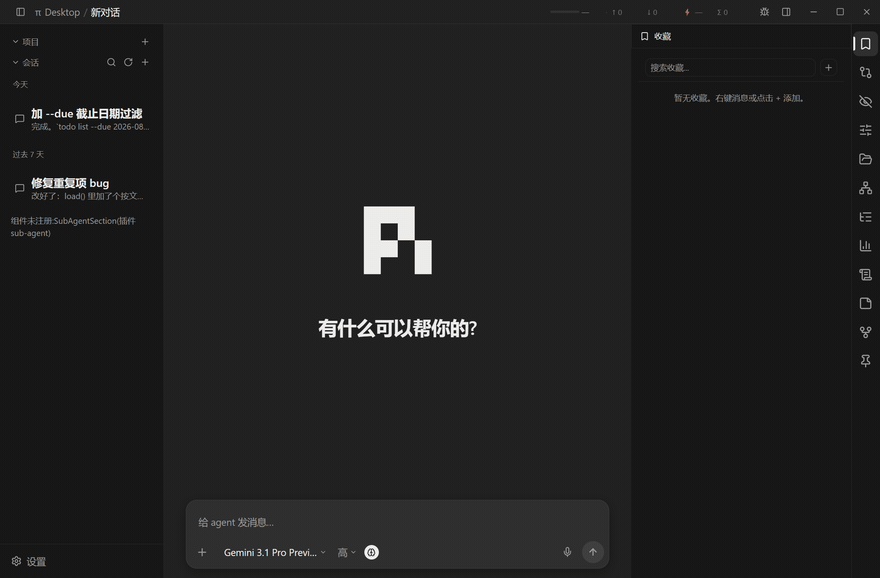
</p>

**manager/ 管理页**

<p align="center">
  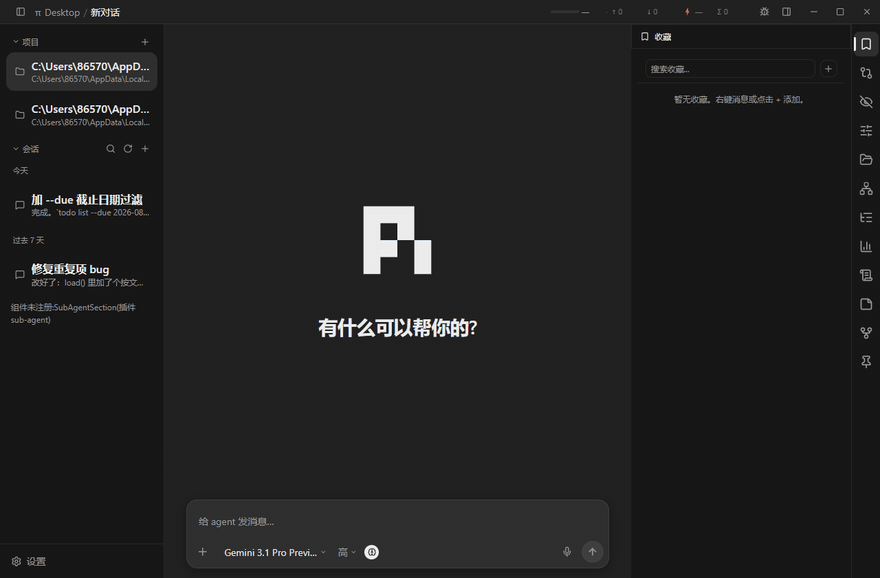
</p>

#### 3.4.27 pi（内核插件）

pi 内核的设置入口——一个设置组三个 tab。**Pi**：版本管理——列出 npm registry 上 `@earendil-works/pi-coding-agent` 的可用版本，装进独立环境 `~/.my-harness-desktop/pi/`（不污染全局 npm），支持自定义内核可执行路径；下区是约 57 项内核配置的描述表（`~/.pi/agent/settings.json`），框架管 configFile 的 dirty/save/拦截生命周期，插件只管渲染表单。**PI 拓展**：`~/.pi/agent/extensions/` 下 TypeScript 扩展的启用/禁用/安装。**模型**：供应商与模型配置（`~/.pi/agent/models.json`）——CRUD、默认模型 ★、API Key/Base URL 编辑、连通性测试——测试走内核隔离会话 ping（`test:{uuid}` 进程 key），不劫持用户正在用的会话。

#### 3.4.28 dsh（内核插件）

DSH 内核的设置入口，与 pi 插件同级同形：**DSH** tab 安装 dsh 内核（`@deepseek-ai/dsh-sdk-jsonrpc-demo` 及其 Cordis 插件集）、编辑 `~/.dsh/settings.yaml`；**DSH 拓展**管理 Cordis 插件（`~/.dsh/.my-harness-desktop-plugins/`）；**模型**配 DSH 的模型与 API Key。两个内核插件只差数据不差地位——卸掉任何一个，壳照跑，少一个内核而已。

#### 3.4.29 plugin-manager（插件管理）

桌面插件自身的管理页：启用/禁用/安装/卸载/重载，tags 三态筛选（只看/排除/取消）。受保护不可卸载自己。注意它管的是 my-harness-desktop 桌面插件——内核的技能归 skill-manager，内核的扩展归各内核插件的拓展 tab。

#### 3.4.30 theme-manager（主题管理）

不止选主题：主题网格预览（含会话流独立主题——mainView 槽第二主题实例，左右栏不受影响）、字体栈选择、字号倍率——字体 tab 一个全局 slider，左栏/右面板/会话流三个 tab 各一个分区字号 slider。宽度经布局引擎拖拽手柄调整（不是 slider）。即时生效不走 save 浮层。

<p align="center">
  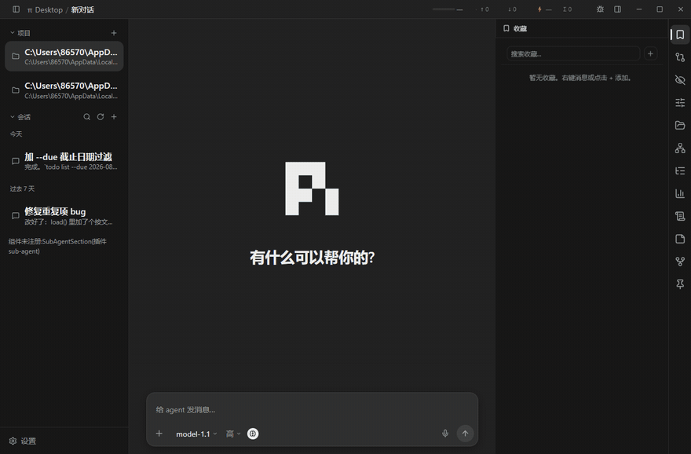
</p>

#### 3.4.31 skill-manager（技能管理）

内核技能（SKILL.md）的管理页：多来源（内核 settings 显式路径、`~/.pi/agent/skills/`、`~/.agents/skills/`、项目级 `.pi/skills/`）扫描出来的技能列表，启用/禁用 + 强制上下文 toggle（写 frontmatter 的 `disable-model-invocation`）。改动下次会话生效（内核无 reload RPC）。

#### 3.4.32 tool-manager（工具管理）

会话级工具过滤。设置页管工具组定义（项目级插件配置），右面板按组勾选当前会话放行的工具；开关走"内存偏好 + onSend flush 落盘"——写进会话头行 `custom-my-harness-desktop.toolConfig`，由 toolgate（工具网关，壳同步到内核的 extension）在轮开始硬过滤；toolgate 未装时降级为 prompt 软注入。工具清单的权威发现也由 toolgate 承担：扩展在轮开始把全量工具清单播报进侧车文件，桌面读取，没跑过的扩展工具也能进组进白名单。

<p align="center">
  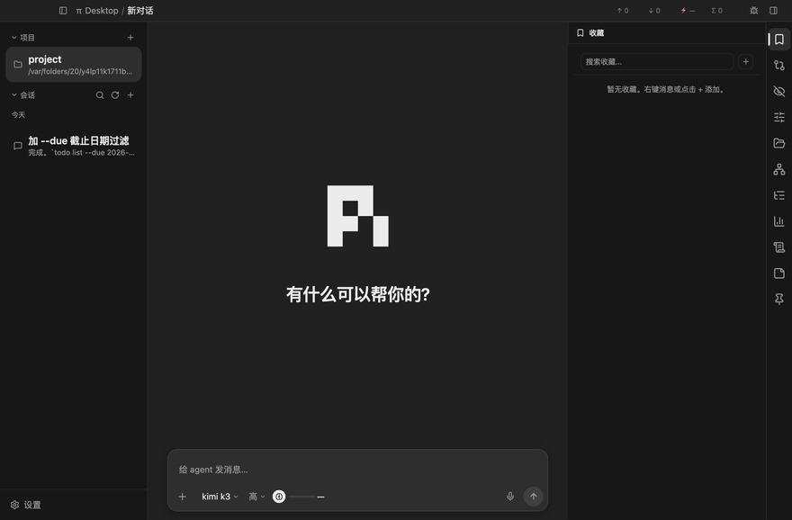
</p>

**themes/ 外观**

#### 3.4.33 theme（默认主题）+ 七套配色 + font-presets

theme 是基座：内置 dark / light / auto 三套基础配色，定义完整 token 体系（颜色/字号/间距/圆角/阴影/滚动条/分割线），auto 跟随系统明暗。七套配色主题都是纯 JSON 声明，以它为 base 继承再局部覆盖：

- **theme-chatgpt** — ChatGPT 风格深色：中性灰底、大圆角、单色发送键、品牌绿点缀。
- **theme-everforest** — Everforest 明暗成对：低饱和绿调色板。
- **theme-midnight** — Midnight 深色：低饱和配色，收敛阴影，视觉重量轻。
- **theme-mocha** — Mocha 暖色：Catppuccin Mocha 调色板——深紫灰底、蓝主色、绿成功、红错误。
- **theme-new-york** — 明暗两套，zinc 中性灰 + 天蓝主色，大圆角，对齐 shadcn/ui 的 New York 风格。
- **theme-stone** — 明暗两套，暖灰色系，质朴低对比。
- **theme-terminal** — 终端风：纯黑底、磷光绿主色、全局等宽字体、零圆角零阴影、动画节奏极快。

**font-presets** — 同属外观域，但是纯数据插件：18 项字体选项（等宽 / 西文 / 中文三组字体栈），全部经 `fontPresets` 槽贡献，零代码。字体栈是「会变的内容」从圆心外推的落点——新增字体选项 = manifest 一行 + 一条语言 key。

**system/ 框架级内容**

#### 3.4.34 i18n（国际化）

四语言文案包（简/繁/英/德，i18n 插件本体自带 5 个命名空间 × 4 语言共 20 个资源文件）+ 语言设置页。所有插件的 `t("key")` 消费这里的资源，第三方插件可经 languages 槽覆盖任意 key。受保护不可卸载——删了它所有界面文案退化为 key 原文。

#### 3.4.35 general-config（通用配置）

通用设置页宿主，同时是 `settingsGroups` 槽的通用渲染器：别的插件（timeline 的"会话流"、review 的"评论"、goal 的轮数上限等）以纯 JSON 声明字段组，由这里统一渲成开关/下拉/滑块控件——贡献插件零渲染代码。自己也经同一个槽贡献"界面"字段组（侧栏默认展开、浮动卡片等），内置与第三方同契约。

#### 3.4.36 debug-bar（Debug 按钮）

标题栏 debug 按钮（`titlebar` 槽），受通用设置的 debugMode 开关控制。两个能力：复制页面 DOM 到剪贴板（可简化去除 inline style）；元素审查模式——全屏画框标序号、三级粒度过滤、悬停高亮、点击复制最内层命中元素的 DOM，方便"跟 AI 说 #N 元素有问题"。

<p align="center">
  
</p>

#### 3.4.37 keybindings + key-hints（快捷键 + 按键导览）

键盘可达性，拆成两个插件、一条纪律：**都不实现任何动作，只给已有交互加新触发源**——动作永远归执行方。

- **keybindings** 声明组合键 → 事件总线 channel 映射（默认 10 条：聚焦输入框、切模型、切思考深度、打开设置……）。按下命中就 invoke 目标插件的既有 channel 处理逻辑——不复制任何业务逻辑。设置页提供录制式绑定编辑 + 动态事件列表。
- **key-hints** 是 Vimium 式按键导览：按触发键，页面上所有可点击元素高亮并标字母，按字母即触发点击。它补 keybindings 的盲区——没 channel 化的按钮、菜单项——直接扫描驱动 DOM。两者经一个 channel 对接，独立演化。

#### 3.4.38 notifier（系统通知）

零可见槽的后台常驻插件：订阅内核事件流，在回合收敛、且主窗口不在前台时发一条操作系统级通知（macOS / Windows / Linux）——四道闸（开关 → 焦点 → 冷却 → 弹出）。没有面板、没有设置页，唯一选项经 `settingsGroups` 挂进通用设置页。

#### 3.4.39 remote-access（远程访问）

远程访问控制面的设置页：局域网开关、密码管理、二维码配对、设备列表一键踢出。安全机制本身全在壳后端（`src/server/remote/`——scrypt 哈希密码、限流、token）；本插件只是经 invoke/push 通道操作这套机制的 UI。

#### 3.4.40 goody-hao（工程原则注入）

`systemPrompts` 槽的首个贡献者：spawn 会话时壳收集所有贡献项，经 `--append-system-prompt` 把内置工程原则文件注入内核 system prompt。纯声明式，零渲染代码，卸载即停止注入。

#### 3.4.41 read-claude-md（CLAUDE.md 自动加载）

`extensions` 声明式通道的内容插件：manifest 声明 `./pi-extension`，框架在启用时把携带的内核扩展同步进 pi 内核的扩展目录，禁用/卸载时摘除。扩展在会话启动时发现 CLAUDE.md 指令文件——全局（`~/.claude/CLAUDE.md` + `~/.claude/rules/`）与项目级（cwd 逐级向上：`CLAUDE.md`、`.claude/CLAUDE.md`、`.claude/rules/`、`CLAUDE.local.md`，CSS cascade 序远者先行）——以隐藏会话消息每会话注入一次，不改 system prompt，保住 prompt cache 命中；只注入主交互会话（跳过 sub-agent）。纯声明式，零渲染代码。

第三方插件放 `~/.my-harness-desktop/plugins/`（用户级）或项目根目录的 `.my-harness-desktop/plugins/`（项目级），和内置件走同一套加载器、同一套契约——项目级覆盖用户级，用户级覆盖内置。

## 🗂 4 文档地图

- **文档索引与阅读顺序** → [docs/README.md](docs/README.md)。锚点是 [core-design.md](docs/core-design.md)（约 1.5 万字：圆心、内核抽象、中立层、薄壳、依赖倒置、三分法）；[desktop-kernel-pi-dsh.md](docs/desktop-kernel-pi-dsh.md) 是多内核主文档，逐契约方法对照 pi / dsh 实现。
- **深挖文档** → 会话流、会话标识映射、薄壳论证、新增第三个内核（[add-new-kernel.md](docs/add-new-kernel.md)）、目录结构、goal 理解、i18n、侧栏/右栏。
- **按插件** → [docs/plugins/](docs/plugins/)：一个插件一篇，按域分组（sessions / project / insight / manager / system / themes），每篇含「与其他插件交互」一节。
- **新建插件指南** → [docs/new-plugin.md](docs/new-plugin.md)。**验收口径** → [docs/e2e-verify.md](docs/e2e-verify.md)。

## 🩹 5 常见问题（别踩的坑）

| 现象 | 原因与解决 |
|---|---|
| Windows 报 `'env' 不是命令` | npm 脚本里有 Unix 的 `env` 调用，改用 **Git Bash** 跑 `npm run dev` |
| `npm install` 卡住 / Electron 下载慢 | Electron 二进制从官方源拉取，网络慢时挂代理重试；postinstall 会给 dev 版 Electron.app 换名换图标（仅 macOS，其他平台自动跳过） |
| macOS 打开报「无法验证开发者」 | 产物未签名：右键 App → 打开，过一次 Gatekeeper |
| Windows SmartScreen 拦截 | 产物未签名：点「仍要运行」 |
| Linux（Debian/Ubuntu）`npm run dev` 起不来窗口 | Electron 需要系统库（libgtk-3、libnss3、libasound2 等，Ubuntu 24.04 起 libasound2 改名 libasound2t64）；`scripts/setup.sh` 会问是否自动装，跳过的话手动补 |
| dev 版和安装版数据「串」了 / 设置不见了 | 两版数据目录分流：dev 走 `~/.my-harness-desktop-dev/`，安装版走 `~/.my-harness-desktop/`；想继承可 `cp -r` 后再删要隔离的部分 |
| 找不到 pi 内核 / 不知道装哪去了 | pi 内核在设置页点安装后从 npm 拉到 `~/.my-harness-desktop/pi/`，不随仓库分发 |
| 语音输入下载不动 / 离线失败 | Whisper 模型首次使用时从 HuggingFace 下载（缓存在浏览器存储），文件较大——第一次转写需要网络和耐心 |
| DSH 面板看不到模型 | DSH 的模型配置读 `~/.dsh/settings.yaml`；在 DSH 设置 tab 配好模型与 API Key，再看拓展 tab 是否有插件被禁用 |
| Node 版本报错 | 需要 Node 22.12+；`scripts/setup.sh` 会自动检测，缺了就帮你装 |

## ❓ 6 QA

**Q：删掉某个内置插件，界面具体会变成什么样？**
壳照常启动，对应槽位空着。两个典型：删掉 timeline，中区显示一行灰字"mainView 槽无贡献"；删掉 i18n，所有界面文案退化为显示 key 原文——i18next 配的英文回退（`fallbackLng: "en"`）也没有资源可回了。删哪个都不会崩，只是那块功能没了。

**Q：Windows / Linux 能跑吗？**
`npm run dist:all` 在一台 mac 上就能出齐三端安装包。代码层面已处理的跨平台点：win/linux 无边框窗口的自绘标题栏按钮、npm/pi CLI 的 `.cmd` 与 shell 差异、环境变量大小写（`Path` vs `PATH`）、窗口 icon 三端格式。依赖全是跨平台的（Electron / React / Node）。但 win/linux 未真机实测——"能出包"和"跑得好"之间还差一轮真机验证。

**Q：plugin、skill、extension 三个词是什么关系？**
两层三类资产。**plugin** 是 my-harness-desktop 的桌面插件——本文讲的全部内容。**skill** 和 **extension** 是各内核自己的扩展资产（技能包，和内核进程内扩展——pi 的 TypeScript 扩展、DSH 的 Cordis 插件），由各内核定义和加载。桌面插件可经 manifest 的 `"extensions": { "pi": ..., "dsh": ... }` 块携带内核扩展——壳在启用时同步进对应内核的扩展目录、停用时摘除。内置 skill-manager 和各内核插件的拓展 tab 是管理内核侧资产的界面，它们自己是桌面插件。

**Q：`npm install` 时的 patch 脚本干了什么，安全吗？**
干的事在 `assets/scripts/patch-electron.cjs` 里全部可见：用 PlistBuddy 把 `node_modules/` 里 Electron.app 的 `CFBundleName` 和 `CFBundleDisplayName` 改成 "My Harness Desktop"，换上项目图标，刷新 LaunchServices 缓存。只动本地 `node_modules`，找不到 Electron.app 就直接跳过，可重复执行。它只影响 dev 模式的显示名，不影响功能。

**Q：内核到底装在哪？仓库里没有。**
dev 模式下，在设置页点安装后，内核从公共 npm registry 拉取：pi（`@earendil-works/pi-coding-agent`）进 `~/.my-harness-desktop/pi/`，DSH（`@deepseek-ai/dsh-sdk-jsonrpc-demo`）进自己的受管环境。内核从不进仓库——壳在运行时按需装版本。

**Q：`@earendil-works/pi-coding-agent` 和 pi 是什么关系？**
pi 的上游是 Mario Zechner 发起的开源项目（[pi.dev](https://pi.dev)）。`@earendil-works/pi-coding-agent` 是 my-harness-desktop 实际拉取并驱动的 pi 内核分发包，发布在公共 npm registry——版本列表和安装都由 pi 内核插件在应用内完成。

**Q：怎么写自己的第一个插件？**
最短路径：照 [docs/new-plugin.md](docs/new-plugin.md) 和 manifest 参考写 manifest 和 renderer，在 `src/plugins/` 的 50 个内置插件里挑一个职责相近的对照着写，然后把成品放进 `~/.my-harness-desktop/plugins/`（用户级）或项目根的 `.my-harness-desktop/plugins/`（项目级）。不需要改壳任何一行。

**Q：有没有无窗口 / 服务器模式？**
有——壳后端可以脱离 Electron 跑：`npm run server` 起同一套组装出的后端（`out/main/server.js`，Node 宿主，HTTP + WS）。远程访问功能可选用密码保护把同一界面暴露给局域网。

## 📄 License

[MIT](LICENSE) © earendil-works
