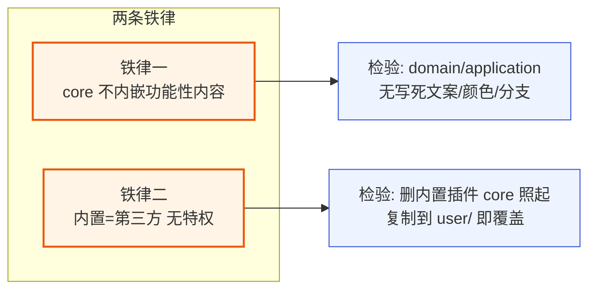
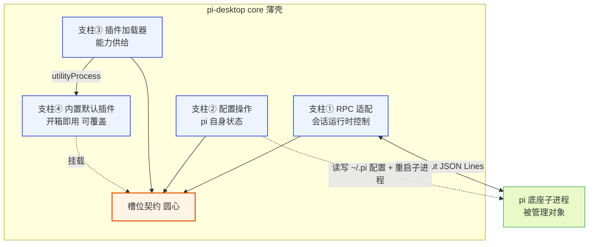
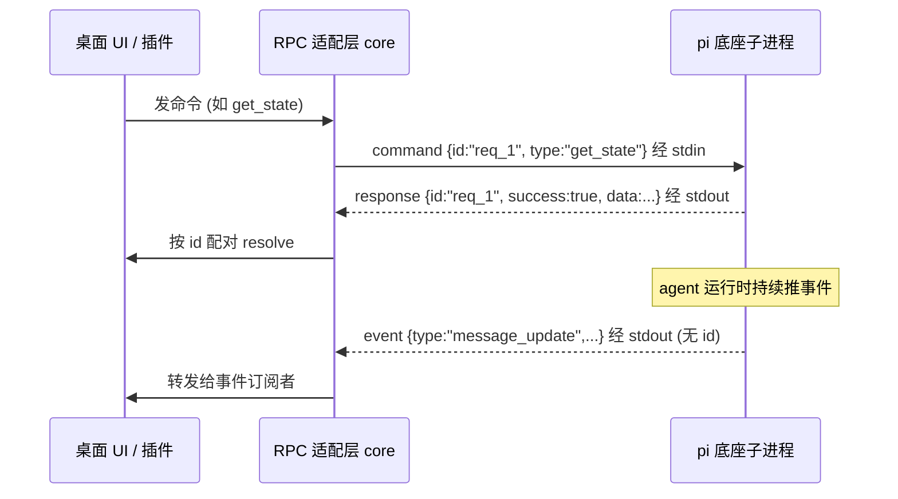
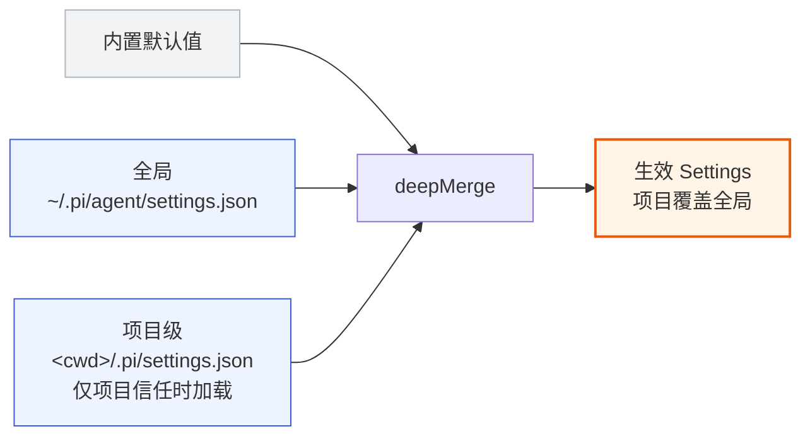
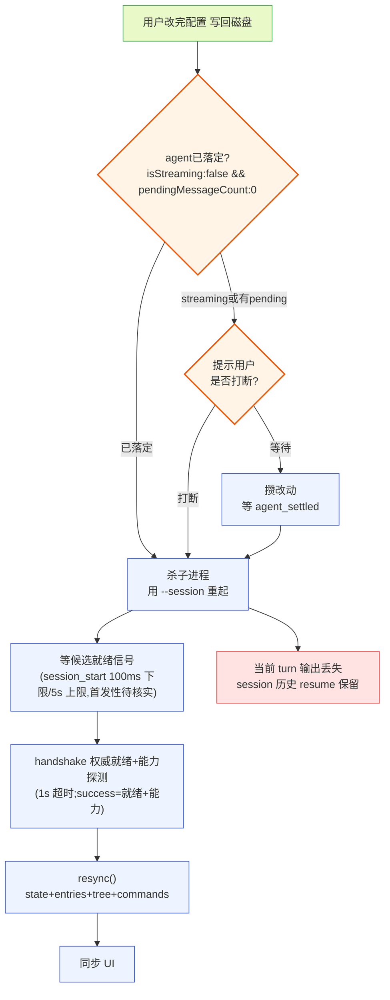
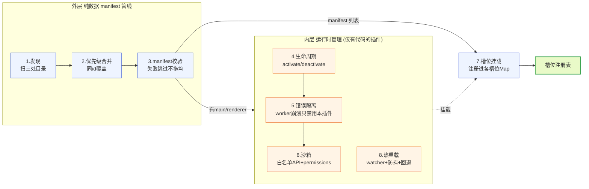
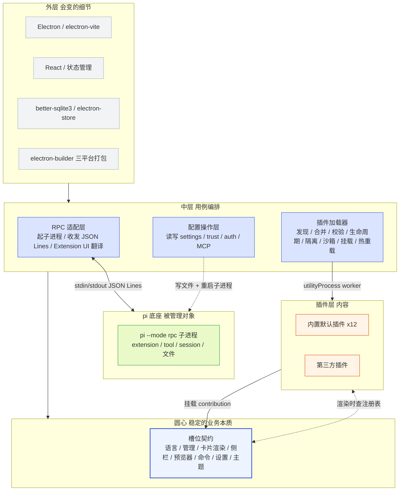
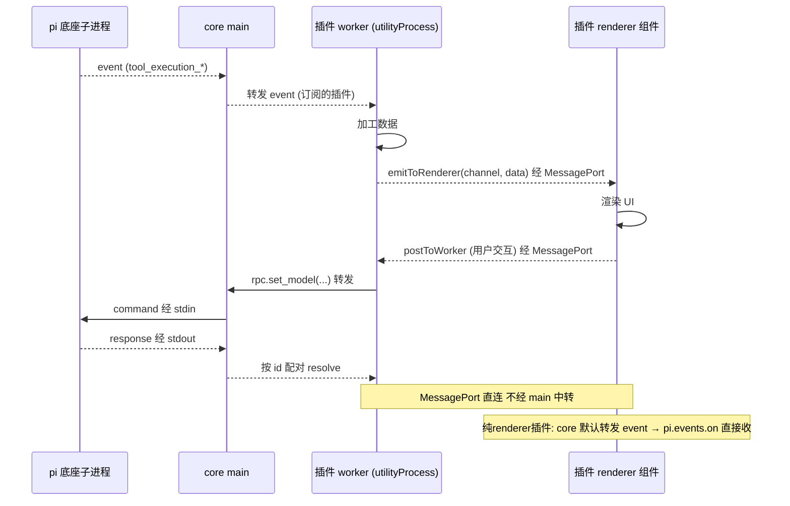
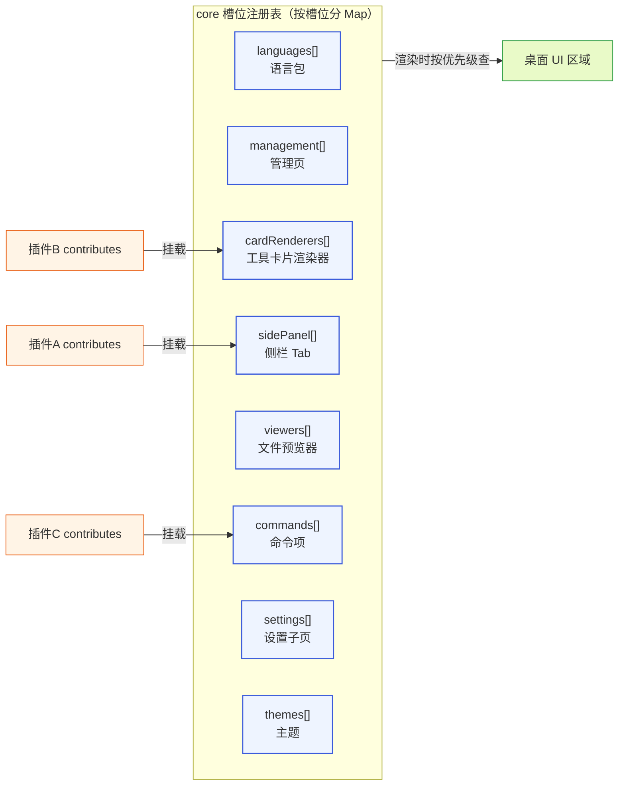
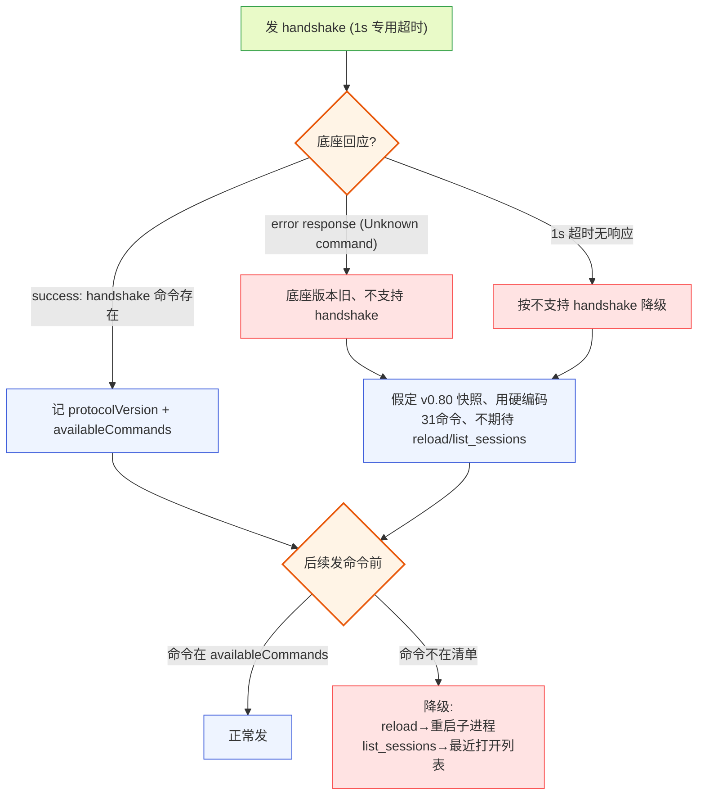

# 核心设计文档

> 本文档是 pi-desktop 的核心设计总纲。它不重复 [DESIGN.md](../DESIGN.md) 的全部细节,而是把那条主线里最该讲透、最容易被实现者写歪的几条纪律——薄壳理念、四支柱层次、洋葱六层、圆心类型纯度、PluginRuntime 依赖倒置、双入口、槽位契约、MatchStrategy 策略注册表、content 驱动非 kind——从哲学一直推到机制与取舍,推到"照着能写代码"的程度。读完它,你应该能回答:为什么这个壳要薄?薄到什么程度?哪些东西被刻意推到了外层?圆心为什么不认识 pi?文中所有论断对应 `DESIGN.md` 的第 0 节(薄壳定位)与第 5 节(架构总览),并在涉及 pi 底座时对照 `packages/coding-agent/src` 下的真实源码。
>
> **字数统计口径**(约定):本文"字数"按**含代码块与 mermaid 图的全字符数**(非空白字符)计,目标 ≥ 30000 字。设计文档的代码骨架、类型签名、图表是"照着能写代码"的载体,计入字数;纯叙述文字单独不设下限,但保证关键论断均有足够叙述论证、不被代码淹没。若团队另以"纯叙述字数"为准,需在评审时补足叙述部分。

---

## 1. 哲学:VSCode 式薄壳

### 1.1 薄壳是什么

#### 1.1.1 一句话定义

pi-desktop 是一个**薄壳**:它本身只提供"让功能挂上来"的机制,一切功能——含界面文案、管理面板、时间线渲染、主题配色——都是挂上来的插件。壳薄到没有任何功能性内容硬编码在内核里;壳也厚到足以让插件安全、隔离、按槽位挂载地存在。这两句话合起来,就是本项目的全部立场。

#### 1.1.2 薄与厚的辩证

"薄"和"厚"不是对立的。薄指的是**内核的功能含量**趋近于零;厚指的是**内核提供的机制**(进程隔离、槽位注册表、双入口桥接、权限沙箱)足够强,强到第三方插件能在不碰内核代码的前提下,把整个桌面端填满功能。这两个方向同时成立,才叫薄壳。只薄不厚,是空壳——插件挂不上、挂上也不安全;只厚不薄,是胖客户端——功能焊死在内核,第三方只能补边角。pi-desktop 要的是前者:极薄的机制内核 + 极强的机制保障。

#### 1.1.3 为什么选 VSCode 做蓝本

VSCode 是薄壳模型最成功的工业级样本。它的内核很薄:语言包、主题、默认渲染器、debug adapter 全是 built-in extension,不是硬编码进内核的。插件通过 contribution points 往内核预定的槽位上挂东西,内核只认槽位契约、不认具体插件。这套模型证明了"薄壳 + 插件槽位"能在严肃产品里跑起来,而且能撑起庞大的插件生态。pi-desktop 镜像这个模型——不是照抄 VSCode 的 API,而是照抄它的**架构纪律**:内核只提供机制与槽位,功能全是内容插件。

### 1.2 两个贯穿全文的词

#### 1.2.1 pi 底座是什么

**pi**(pi 底座)是一个 AI coding agent,本体是一个可执行的 Node CLI(`@earendil-works/pi-coding-agent`)——用户在终端跑 `pi` 起一个交互式 TUI、和 agent 对话、让它读写文件执行命令。pi 跑成一个进程,内部有 agent loop、工具执行、session 管理、扩展加载。它自带一个 `--mode rpc` 启动模式,把 agent 嵌进别的应用用(stdin 收 JSON 命令、stdout 吐 JSON 响应和事件)——pi-desktop 就是嵌它的那个"别的应用"。后文说"底座"都是指 pi 这个进程及其全部内部机制。底座对桌面端而言,只是"通过 RPC 和配置文件能触达的一组 pi 能力",和"能触达的 git 能力""能触达的文件系统能力"是同一层抽象——都是**被管理的资源**,不是要被适配的同胞插件体系。

> **底座在仓库中的包路径与统一称呼**。底座 CLI 在 pi 仓库中以 npm 包 `@earendil-works/pi-coding-agent` 发布,其可执行入口(`pi` 命令)对应仓库内 `packages/pi-cli`(构建产物 `dist/cli.js`)。后文凡说"`pi` 命令""底座 CLI""`pi --mode rpc`""`@earendil-works/pi-coding-agent`""`packages/pi-cli`",指的都是这同一个可执行底座——它既是用户在终端敲的 `pi`,也是 pi-desktop 通过 `spawn("node", [cliPath, "--mode", "rpc", ...])` 起的子进程(§2.2.3)。gateway 层(`gateway/protocol/`)对照它的 `rpc-types.ts`/`agent-session.ts` 等源码定义协议类型,但圆心不 import 它。§11.2.1 依赖方向检验里 "`packages/pi-cli` 是外层资产,不被任何层 import" 说的就是它。统一称呼避免读者把 `packages/pi-cli` 误当成另一个独立 CLI。

#### 1.2.2 core 指什么

**core** 指 pi-desktop 自己的核心层:不是 pi 的核心,是 pi-desktop 这个桌面壳里"四根支柱"的实现代码,跑在 Electron 的 main/renderer 进程里。后文说"core"都是指 pi-desktop 的 core。两者的关系是:pi-desktop 的 core 通过 RPC 和配置文件对接 pi 底座(一个独立子进程),底座是被 core 管理的对象。这条关系一旦记反——把 pi 当成 core 的一部分、或把 core 当成 pi 的 UI 翻译层——整个架构就会走形,现有方案 就是这么翻的车。

### 1.3 替换 现有方案,把架构摆正

#### 1.3.1 现有方案的两条岔路

pi-desktop 替换掉现有的 现有方案——那个项目其实也叫 pi-desktop(`package.json` 里 `name: "pi-desktop"`,v0.4.20),但它走了两条岔路:一是把 pi 的 SDK 娶进自己进程,于是不得不造一堆 Worker 进程池、SDK 加载器、版本管理器来兜底;二是因为吃不下底座 extension 的终端渲染,又另起了一套纯 JSON 的 adapter 当 UI 翻译层,把"一个扩展如何贡献桌面外观"这件事劈成了行为和外观两套并列概念。这两条路把一个本该轻的东西做重了。

#### 1.3.2 翻车的根:把自己定位成翻译层

现有方案的问题的根,不是某个具体技术选型错了,而是它的**自我定位**错了——它把自己定位成"底座 extension 的 UI 翻译层"。一旦这么定位,它就必然要处理底座 extension 那套 TUI 渲染机制吃不下的问题,于是必然要造 adapter 当中间层。这是定位的必然,不是实现的不小心:底座 extension 的 UI 渲染能力(`ToolDefinition.renderCall/renderResult`、`registerMessageRenderer`)返回 `@earendil-works/pi-tui` 的 `Component`——终端 TUI 组件树,Web 吃不下;现有方案 退而求其次造了 34 个纯 JSON adapter,第三方无法自带,只剩两个硬编码 `customRenderer` 走通。

#### 1.3.3 重新摆正:消费而非翻译

pi-desktop 重新来过:core 只提供机制,一切功能是插件,pi 是被管理对象而非另一套插件体系。底座 extension 在桌面上怎么呈现,由桌面插件自己决定怎么呈现 pi 经 RPC 吐出来的数据,而不是把底座的 TUI 组件树翻译成 Web。这是单向的、桌面插件主动的"消费",不是双向的、被动的"翻译"。这一字之差,消解了 adapter 这整个中间层——没有"翻译底座 extension UI"这件事,自然不需要 adapter 这层中间产物;没有 adapter,就没有"行为/外观两套并列概念";没有两套并列概念,第三方扩展想在桌面有 UI,就只要写一个桌面插件(自带 UI、自带代码、随插件包分发),不用给 现有方案 仓库贡献 JSON 等发版。现有方案的三个问题全部从这里根上消除。

### 1.4 薄壳的两条铁律

#### 1.4.1 铁律一:core 不内嵌任何功能性内容

core 不内嵌文案常量(走 i18n 插件)、不内嵌管理页(走管理 UI 插件)、不内嵌时间线渲染逻辑(走渲染插件)、不内嵌默认配色(走主题插件)。core 只提供让这些内容能被挂上来的槽位和加载它们的能力。这条铁律的检验方式很直接:打开 `src/domain/` 和 `src/application/` 里的任何一个文件,如果看到一个写死的中文文案、一个写死的颜色值、一段"如果工具名是 bash 就渲染成终端"的分支逻辑——那就是违规。

> **token key 不算"写死的值"**。这条铁律和 §7.2.2 的"core 渲染时文案/配色从语言槽、主题槽取"看似冲突:core 必然出现 `"timeline.toolExecuting"`(i18n key 字符串)、`theme["color.primary"]`(token key 字符串)这类写死的 key。这里的判据是——**禁止的是 token 的值(颜色十六进制如 `#89b4fa`、文案原文如"发送"),允许的是 token 的 key(稳定字符串标识如 `color.primary`、`timeline.toolExecuting`)**。core 内嵌 token key 不算违规(它是查询契约、稳定不变);core 内嵌 token 值才算违规(它是内容、会变、该由插件贡献)。即:写 `theme["color.primary"]` 合规,写 `"#89b4fa"` 违规;写 `i18n.t("timeline.toolExecuting")` 合规,写 `"工具执行中"` 违规。key 是圆心契约、值是外层内容,两者性质不同。

#### 1.4.2 铁律二:内置插件和第三方插件无特权差异

内置默认插件随壳分发、保证开箱即用,但架构地位和第三方插件完全平等——走同一套加载器、同一套槽位契约,优先级最低(`builtin`)、可被用户级/项目级同名插件覆盖。这条铁律的检验方式:把任何一个内置插件从内置目录删掉,core 应该照常启动(只是少了那块功能);把任何一个内置插件复制到 `~/.pi-desktop/plugins/`,它应该以 `user` 优先级覆盖内置版,core 不该有任何"识别内置插件并特殊对待"的代码路径。



**图 1-1 — 薄壳两条铁律及其可执行检验**

---

## 2. 四支柱:从外到内的依赖层次

### 2.1 支柱总览

#### 2.1.1 四根支柱不是并列的功能模块

四根支柱不是并列的四个功能模块,而是一个**从外到内的依赖层次**。这是理解整个 core 的钥匙:支柱①(RPC 适配)和支柱②(配置操作)是 core 对接 pi 的两条通道;支柱③(插件加载器)是 core 唯一的能力供给机制;支柱④(内置默认插件)是随壳分发的内容。从外到内,越往内越接近圆心、越稳定;从内到外,越往外越会变、越可替换。

#### 2.1.2 支柱的全景图



**图 2-1 — 四根支柱与底座的关系:core 通过 RPC + 配置文件对接 pi,插件通过槽位挂载**

#### 2.1.3 两条通道、一套加载、一组内容

把四支柱收成一句话:core 通过**两条通道**(RPC 管运行时、配置文件管状态)对接底座,通过**一套加载器**给所有功能供给能力,通过**一组内容插件**保证开箱即用。后四节分别钉死每根支柱的职责边界——尤其要钉死"它不管什么",因为支柱翻车都是从越界开始的。

### 2.2 支柱①:RPC 适配

#### 2.2.1 职责:只走 RPC 一条路

支柱①的职责,且仅此:起 `pi --mode rpc` 子进程、在子进程和 UI 之间收发 JSON Lines(command/response/event)、把 Extension UI 子协议翻译成原生 GUI 交互、把 event 流转发给 UI 渲染。薄壳对接 pi 只走这一条路:RPC Mode。

> **术语界定——"翻译"一词的两层对象**。这里说"把 Extension UI 子协议翻译成原生 GUI 交互",指的是底座 Extension UI 子协议里的对话框原语(`select`/`confirm`/`input`/`editor`/`notify`/`setStatus`/`setWidget` 等,见 §2.2.4 与 DESIGN.md §1.9)——这些原语是协议层的结构化消息,core main 的 extension-ui 适配层(`gateway/extension-ui.ts`)把它们翻译成 renderer 里的 React 模态框/通知/状态栏。它**不是**指 §1.3.3 / §3.7.2 说的"不翻译底座 extension 的 TUI 组件树"。后者是底座 extension 的 `ToolDefinition.renderCall/renderResult`/`registerMessageRenderer` 返回的 `@earendil-works/pi-tui` `Component` 终端组件树——那东西 Web 吃不下,pi-desktop 的立场是**不翻译它**(改由桌面插件主动消费 RPC 数据自己画)。两层"翻译"对象不同:Extension UI 子协议的对话框原语**要翻译**成原生 GUI;底座 extension 的 TUI 组件树**不翻译**、由桌面插件消费。全文出现的"翻译"一词都按这两层区分理解,不存在自相矛盾。pi 底座自带 `--mode rpc` 启动模式,起一个子进程,stdin 收 JSON 命令、stdout 吐 JSON 响应和事件流——这套东西本来就是为"把 agent 嵌进别的应用"设计的,pi-desktop 就是那个"别的应用"。

#### 2.2.2 不做什么:放弃同进程 import SDK

薄壳不把 pi 的 SDK 娶进自己进程——现有方案 那条同进程 import `@earendil-works/pi-coding-agent` 的路被彻底放弃,连带放弃的是它被迫造的 WorkerManager、sdk-loader、sdk-manager、进程池、idle eviction 这一整套。那些复杂度几乎全部是"把 SDK 塞进自己进程"这个决定的副产物;走 RPC,它们一个都不需要。这是"机制选择决定复杂度上限"的典型案例:选了同进程 import,复杂度就在进程管理侧爆炸;选了 RPC,复杂度收敛到一条 stdin/stdout 管道。

#### 2.2.3 照着 RpcClient 写

pi 底座还提供了一个现成的 `RpcClient`(`packages/coding-agent/src/modes/rpc/rpc-client.ts`),它是 RPC 协议的参考实现,pi-desktop 的 RPC 适配层应该照着它写、而不是照着 现有方案的那一坨。下面是底座 `RpcClient` 的真实代码骨架(`rpc-client.ts` 节选):

```typescript
export class RpcClient {
  private process: ChildProcess | null = null;
  private eventListeners: RpcEventListener[] = [];
  private pendingRequests: Map<string, { resolve, reject }> = new Map();
  private requestId = 0;

  async start(): Promise<void> {
    const cliPath = this.options.cliPath ?? "dist/cli.js";
    const args = ["--mode", "rpc"];
    if (this.options.provider) args.push("--provider", this.options.provider);
    if (this.options.model) args.push("--model", this.options.model);
    if (this.options.args) args.push(...this.options.args);

    const childProcess = spawn("node", [cliPath, ...args], {
      cwd: this.options.cwd,
      env: { ...process.env, ...this.options.env },
      stdio: ["pipe", "pipe", "pipe"],
    });
    this.process = childProcess;
    // 接住 exit / error / stdin error 三个生命周期事件
    childProcess.once("exit", (code, signal) => { /* reject 所有 pending */ });
    childProcess.once("error", (error) => { /* 同上 */ });
    childProcess.stdin?.on("error", (error) => { /* 同上 */ });
    // stdout 接 JSONL reader
    this.stopReadingStdout = attachJsonlLineReader(childProcess.stdout!, (line) => this.handleLine(line));
    // 等 100ms 让进程初始化
    await new Promise((r) => setTimeout(r, 100));
    if (this.process.exitCode !== null) throw this.exitError;
  }
}
```

要点:它用 `spawn("node", [cliPath, "--mode", "rpc", ...args], { stdio: ["pipe","pipe","pipe"] })` 起进程,收 stderr 做调试、监听 `exit`/`error`、stdin 报错都接住、stdout 接 JSONL reader。它给每个命令分配 `req_${++requestId}` 的 id,写进 `pendingRequests` Map,响应回来按 id 配对 resolve——这套 id 配对机制是 RPC 客户端的标配,pi-desktop 照搬。这个 id 配对 + timeout 兜底的模式会被抽成圆心之外的共享原语 `RequestCorrelator<T>`(见 §5.3),RPC 适配和 Extension UI 两处复用同一份实现。

> **100ms 就绪窗口是底座 RpcClient 的参考值,桌面端应以 handshake 为权威就绪+能力探测**。底座 `RpcClient.start()` 用 `await new Promise(r => setTimeout(r, 100))` 等 100ms 再检查 `exitCode`,这只是"进程起来了但还没就绪"的兜底经验值,在底座启动慢(冷启动、首次加载大扩展、磁盘 IO 抖动)时可能不够,导致握手/首条命令在底座尚未就绪时发出、被丢失或拒收。pi-desktop 的 RPC 适配层不照搬这个硬编码延迟,而采用**事件驱动提示 + 探测确认**两段式就绪判据:
>
> - **就绪信号(候选,待核实)**:优先等底座 stdout 推出的 `session_start` 事件(reason 通常是 `"startup"` 或 `"resume"`)作为"底座已进入会话循环"的**候选就绪信号**。⚠️ 该信号依赖一个**尚未核实的底座行为**——`session_start` 是否总是子进程就绪后推送的第一条 stdout 消息(见 §10.6 底座契约假设表)。核实前不假设其首发性:底座可能先推别的 event、或在 `session_start` 前有 stdout 诊断噪声。因此 `session_start` 仅作"可以尝试探测"的提示,**不作"已就绪"的最终判据**。100ms 作等待下限兜底、5s 作上限硬超时;超时仍未收到 `session_start` **不阻塞**,直接进入下一段 handshake 探测(由 handshake 成败一锤定音)。
> - **权威就绪+能力探测(handshake)**:不论是否收到 `session_start`,都向底座发一条 `handshake` 命令(§10.4.2),给它 1s 专用超时。1s 内收到 `success` → **同时确认"底座已就绪能处理命令"与"底座能力清单"**(合并就绪判据与能力探测为一条探测链,消除"就绪信号"与"能力探测"两条判据的潜在冲突);收到 `error` 或 1s 超时 → 底座不支持 handshake,按旧快照降级(假定 v0.80、31 命令全可用),此时**仍视为就绪**(旧底座无 handshake 但能处理命令)。
>
> 这套设计的容错性在于:`session_start` 即便不是首发、即便有噪声,handshake 的成功/失败最终裁定就绪状态——首条业务命令一定在 handshake 成功(或降级确认)后才发出,不会被"底座尚未就绪"丢失,这正是 §2.2.3 想消除的启动竞态。后续业务命令的发出时机以 handshake 结果为准,不以 `session_start` 为准。100ms/5s 仅作 `session_start` 等待窗口的兜底上下限,不作就绪最终判据。

#### 2.2.4 三类消息与 id 配对

RPC 协议有三类消息,全部定义在 `rpc-types.ts`(底座 `packages/coding-agent/src/modes/rpc/rpc-types.ts`):

- **command**:从 stdin 发给底座,每条带一个可选的 `id` 做关联(`RpcCommand` 联合类型,共 31 个 `type`)。
- **response**:从 stdout 回,`type: "response"`,带 `command`(回的是哪个命令)、`success`、可选的 `data` 或 `error`。
- **event**:从 stdout 推,是底座 agent 运行时的事件流(`AgentSessionEvent`),没有 id、fire-and-forget,桌面端订阅着用。



**图 2-2 — RPC 三类消息时序:command 带 id 配对 response,event 无 id 直接转发**

三类共用同一条 stdout,靠 `type` 字段区分:`type === "response"` 且有 id 就去配对 pending request,否则当 event 转发给事件订阅者——底座 `RpcClient.handleLine` 就是这么干的。timeout 兜底也挂在 id 上——`RpcClient.send` 给每个 pending 设了 30s 超时,超时自动 reject、清 pending,避免某个命令永远卡住。event 没有 id、是单向推送,RPC 适配层维护一个事件订阅者列表(`eventListeners`),每收到一个 event 就遍历转发给所有订阅者——发布-订阅模型,事件流是 core 的全局观察窗口,时间线渲染、状态栏、工具卡片都靠它。

#### 2.2.5 边界:RPC 只管运行时控制

31 个命令就是桌面端通过 RPC 能对底座做的全部事——`prompt`/`steer`/`follow_up`/`abort`/`new_session`/`get_state`/`set_model`/`cycle_model`/`get_available_models`/`set_thinking_level`/`cycle_thinking_level`/`set_steering_mode`/`set_follow_up_mode`/`compact`/`set_auto_compaction`/`set_auto_retry`/`abort_retry`/`bash`/`abort_bash`/`get_session_stats`/`export_html`/`switch_session`/`fork`/`clone`/`get_fork_messages`/`get_entries`/`get_tree`/`get_last_assistant_text`/`set_session_name`/`get_messages`/`get_commands`。注意这里**没有任何"管理 pi 自身"的命令**——没有 list/enable/disable extension,没有读 settings,没有 reload config。这是有意为之的边界:RPC 只管会话运行时控制,"管理 pi 自身"走支柱②。这个边界一旦守住,桌面端就不会去碰底座的内部状态管理,底座怎么存 session、怎么执行工具、怎么加载扩展,桌面端一概不掺和。

### 2.3 支柱②:配置操作

#### 2.3.1 职责:管 pi 自身的持久化状态

RPC 管会话运行时,配置文件管 pi 自身的状态。桌面端要让用户能装/卸/启停扩展、改模型默认值、配置 MCP、管理项目信任——这些操作改的不是当前会话,而是 pi 的持久化状态,落点全部在磁盘上的配置文件。支柱②就是桌面端读写这些文件、改完让 pi 生效的能力。它和支柱①是两条独立的通道:RPC 是运行时控制、配置文件是状态管理,两条路归不同的进程机制管,但桌面端在 UI 上把它们呈现为一个统一的"管理 pi"面板。

#### 2.3.2 两份配置与合并规则

pi 的配置分两份,一份全局、一份项目级。全局在 `~/.pi/agent/settings.json`,项目级在 `<cwd>/.pi/settings.json`。两份都是 JSON,schema 完全一样,靠底座 `SettingsManager` 合并。合并规则在 `settings-manager.ts` 的 `deepMergeSettings`:以全局打底,项目级覆盖,嵌套对象递归合并,数组和原始值整体替换。也就是说项目级 settings 不会和全局的数组合并拼接——项目级只要写了 `extensions`,就完全替换全局的 `extensions` 数组。这个语义桌面端在 UI 上要表达清楚:项目级的扩展列表是"覆盖"不是"追加"。



**图 2-3 — 配置合并优先级:内置打底、全局覆盖、项目级最上(需项目信任)**

#### 2.3.3 项目信任前置

合并有个前置条件:**项目信任**。项目级 settings 只有在项目被信任时才加载——底座 `SettingsManager.loadFromStorage` 里 `if (scope === "project" && !projectTrusted) return {}`。不信任的项目,它的 `.pi/settings.json` 被直接忽略,防止恶意项目通过配置文件注入。桌面端的"项目信任"管理就是控制这个开关。settings 写入也受信任约束:写项目级配置时不信任就拒绝。文件并发用 `proper-lockfile` 做文件锁(最多重试 10 次、每次等 20ms),保证桌面端和底座同时写一个文件不打架。

> **信任记录的落点与协议**。桌面端写"信任某项目"的记录,必须落到底座 `trust-manager.ts`/`project-trust.ts` 读取的同一来源,否则会出现"桌面端写了信任、底座读不到"的格式错位。信任记录存在 `~/.pi/agent/project-trust.json`(底座 trust-manager 管理的全局信任表),结构是 `{ "<项目绝对路径>": { "trusted": true, "trustedAt": "<ISO 时间>", "source": "desktop" } }` 的 path→record 映射。桌面端"信任某项目"时往这个文件追加/更新对应 path 的记录,底座 `SettingsManager.loadFromStorage` 读它判 `projectTrusted`。读写都要走 `proper-lockfile` 文件锁,和 settings 写入同样的并发保护。`defaultProjectTrust`(`"ask"|"always"|"never"`)是全局 settings 字段,控制"遇到未信任项目时的默认行为"——桌面端据此决定是弹确认框还是自动信任/拒绝。trust 记录的文件路径和结构若与底座实现有出入,以底座 `trust-manager.ts` 为准(本条核实状态见 §10.6.2 第 4 条,属待核实硬前置);详情与字段微调见 [03-module-config-ops.md](./03-module-config-ops.md)。

#### 2.3.4 热加载是显式的,不是 watch

一个容易踩的坑:以为改了配置文件 pi 会自动热加载。**不会**。pi 没有对配置目录做持久 file watcher——`fs.watch`/`chokidar` 在 pi 里只用在 footer 渲染、theme 这类非配置场景,配置文件改了不会自动触发任何东西。热加载是显式调用底座内部的 `reload()` 才发生的。而底座的三个 reload(`SettingsManager.reload`/`ResourceLoader.reload`/`AgentSession.reload`)都是进程内部方法,**没有一个通过 RPC 暴露给外部**。RPC 的 31 个命令里没有 reload。这就是支柱②的核心缺口。

#### 2.3.5 当前处置:重启 RPC 子进程

缺口确认了,处置决策是**重启 RPC 子进程**。理由是零改底座、确定性强、立即可用,不依赖 pi 源码改动或发版。具体路径:桌面端改完配置,写回磁盘,然后杀掉当前 `pi --mode rpc` 子进程,重新起一个。新进程启动时从磁盘重读全部配置、重新 discover 扩展——这就等于一次完整的 reload。代价是重启那一瞬,当前会话的运行态会中断:正在流式输出的 agent 会被打断、排队的消息会丢。但 session 本身持久化在磁盘上,新进程起来后用同一个 session 文件 resume(`args: ["--session", sessionFile]`,该 flag 的存在性是待核实硬前置,见 §10.6.2 第 2 条——若底座无此 flag,本路径断裂,需改走 `--resume` 或其他 resume 机制),消息历史和分叉树都在,只是"正在进行的那个 turn"丢了。对于"改配置"这种低频操作,这个代价可以接受。



**图 2-4 — 热加载重启决策:streaming 时提示用户,idle 直接重启,session resume 后经就绪→handshake→resync→同步 UI**

> **重启后同步时序统一**。图 2-4 把重启后的同步链路钉死为一条顺序,消除之前三处口径的不一致(§2.3.5 只说 `get_state + get_entries`、§5.3.2 定义 `resync()` 拉 `state+entries+tree+commands`、§10.4.2 要求重启后先 handshake 再发命令)。统一后的时序是:① 重启子进程 → ② 等候选就绪信号(§2.2.3:优先等底座 stdout 的 `session_start` 事件,以 100ms 为下限兜底、5s 为上限硬超时;`session_start` 首发性待核实,仅作提示不作最终判据)→ ③ 发 `handshake` 作**权威就绪+能力探测**(1s 专用超时;`success` 同时确认"底座就绪能处理命令"与"能力清单 `availableCommands`/`protocolVersion`",不支持则假定旧快照,见 §10.4.2)→ ④ `handshake` 确认就绪后调 `resync()` 并发拉 `get_state`+`get_entries`+`get_tree`+`get_commands`(返回 `SyncSnapshot`,§4.1.3)→ ⑤ 据 `SyncSnapshot` 同步 UI。`resync()` 本身**不包含** handshake 的能力发现——handshake 是协议层的就绪确认+能力探测(决定哪些命令可发),`resync()` 是业务层的快照拉取(在已知可发命令范围内拉数据),两者职责分开、串联执行:`resync()` 发的命令必须先经 handshake 确认在 `availableCommands` 内(不支持 handshake 的旧底座则假定 31 命令全可用),所以 handshake 在 resync 前。这条时序同时被会话切换/fork(`application/orchestrations/session-switch.ts`,见 §5.3.2)、模型重载等场景复用——任何"新子进程就绪后要同步"的路径都走 handshake→resync,不各拼命令。

#### 2.3.6 共享状态 + 重启消费者模式

这条链路里,桌面端是"操作者",底座子进程是"被操作对象",磁盘配置文件是两者的共享状态。桌面端不直接调底座的 reload 方法(调不到),而是通过"改文件 + 重启进程"间接达成。这就是"管理 pi 自身"在 RPC 架构下的真实形态——没有 RPC 命令能一步到位,靠的是"写共享状态 + 重启消费者"这个模式。这个模式不是临时凑合,它是 RPC 边界的必然产物:只要坚持"RPC 只管运行时控制"这条边界,管理类操作就只能走文件 + 重启。底座未来如果补 `reload` RPC 命令,桌面端切到走 RPC reload——不重启子进程、不丢运行态——但那只是支柱②热加载路径的内部实现变化,不影响槽位契约和插件层,所以是低风险的演进。

### 2.4 支柱③:插件加载器

#### 2.4.1 职责:core 唯一的能力供给机制

支柱③是 core 唯一的能力供给机制,所有功能都通过它注入。它要"极其完善"——这里只钉死它**作为支柱的定位**:加载器是圆心之外的 application 层机制,它发现/合并/校验/挂载/生命周期/隔离/沙箱/热重载,但它本身不贡献任何槽位内容——它只把别人声明的内容正确地挂到圆心的槽位上。九项清单(发现/优先级合并/manifest 校验/生命周期/错误隔离/**沙箱(部分设计/未落地,见 §10.5.3)**/槽位挂载/热重载)的逐项展开见 [03-module-config-ops.md](./03-module-config-ops.md) 与 DESIGN.md §3.5。其中第 6 项"沙箱"当前状态为:**gateway 敏感字段过滤 + worker 侧网络/文件/子进程出口代理已设计**,而**模块级 require 强制(阻止插件直接 `require('fs')`/`child_process`)是待落地设计目标、尚未实现、能否拦住绕过路径未测试**——不可信第三方插件的安全隔离在模块级强制就绪前不成立,暂走 §10.3.1 的 webview 强隔离槽位兜底。九项清单里只有这一项不是既成纪律,实现者据此安排安全隔离的落地节奏。

#### 2.4.2 唯一一套插件体系

pi-desktop 只有**一套**插件体系,不是 现有方案 那种"extension + adapter"两层。底座本来就有一套 extension 机制(底座进程里那套 TS extension),该咋装咋装、该咋跑咋跑,桌面端不接管它的逻辑加载——那是底座子进程自己的事。桌面端管底座 extension 的方式是支柱②那条链路:写 settings 路径列表 + 重启子进程,让底座自己重新加载。桌面插件不参与底座 extension 的加载执行。两套体系各自独立、各走各的加载器、互不混淆。

#### 2.4.3 加载器的双层管线

加载器分两层:外层是纯数据的 manifest 管线(发现→合并→校验→挂载注册表),内层是带代码模块的运行时管理(activate/deactivate/worker/热重载)。这两层分开,因为声明式插件只走外层、不进内层,纯声明式插件的加载是零运行时成本的。这条分层纪律在代码层面体现为:外层函数纯数据操作、可单测、不依赖任何进程能力;内层才碰 `utilityProcess`/`MessagePort` 这些 shell 级能力(经 `PluginRuntime` 接口倒置,见 §5)。



**图 2-5 — 加载器双层管线:外层纯数据处理(声明式插件只走这层),内层运行时管理(有代码插件才进)**

#### 2.4.4 发现源:四个目录、四个 source 标记

图 2-5 写"发现 扫三处目录",§2.5.2 又把内置目录列为"第四个发现源"——这里把四个发现源钉死,缺一处都建不出加载器。加载器的发现层扫描以下四个目录,产出 `(manifest, source, priority)` 三元组列表交给优先级合并:

| 发现源 | 目录路径 | source 标记 | 优先级 | 说明 |
|---|---|---|---|---|
| 项目级 | `<cwd>/.pi-desktop/plugins/` | `project` | 最高 | 当前项目目录下手写的桌面插件。受项目信任约束(§2.3.3):不信任项目时此目录不扫,防止恶意项目注入插件。 |
| 用户级 | `~/.pi-desktop/plugins/` | `user` | 次高 | 用户全局手写插件,跨项目共享。 |
| installed | `~/.pi-desktop/installed/{id}/{version}/` | `installed` | 次低 | 经 installer(§5.4)从 npm/.pidesktop 安装的外部插件。**注意:此目录不在发现层的递归扫描路径下**——installed 是 `{id}/{version}/` 三层嵌套、靠发现层递归扫会出层级问题,所以 installed 走 `loader.loadExplicit()` 显式加载入口(installer 装完显式通知加载器),不靠发现层自动扫。这里把它列为"发现源"是从来源/优先级角度归类,实际加载入口与 project/user 不同(显式 vs 扫描),但最终都进同一个加载器(§2.4.3)的同一份优先级仲裁。 |
| 内置 | `process.resourcesPath/pi-desktop-builtin/`(打包后) / `plugins/builtin/`(dev) | `builtin` | 最低 | 随壳分发的内置默认插件,只读。 |

优先级序为 `project > user > installed > builtin`,与 §7.3.1 的插件级覆盖、底座 settings 的合并方向一致。

**builtin 目录的两种解析方式(dev vs 打包)**:
- **开发态(electron-vite dev)**:builtin 目录解析为源码仓库内的 `plugins/builtin/`(相对工程根),由 electron-vite 的 dev server 直接服务 TS 源、走 §5.2.1 的 jiti 运行时转译,支持热重载。
- **打包态(electron-builder 产物)**:builtin 目录解析为 `process.resourcesPath/pi-desktop-builtin/`(asar 内的只读资源路径,由 electron-builder 在 `extraResources`/`files` 配置里把 `plugins/builtin/` 打进去并重命名),加载器从这里扫。两者通过一个 `resolveBuiltinDir()` 函数(放在 `application/loader/`,按 `app.isPackaged` 分发)统一返回当前态的正确路径,上层只拿一个目录路径、不感知 dev/packaged 差异——这是 shell 细节被推到外层、加载器逻辑不受影响的体现。

发现层只扫 project/user/builtin 三处本地目录(不递归超过一层,复杂包用 `package.json` 的 `pi.desktop` 字段显式声明入口);installed 不进扫描、走显式加载。四个来源产出的插件候选最终进同一份优先级仲裁(`resolveByPriority`,§7.3.1/§5.3.2),按 source 标记的优先级合并、同 id 高优先级整个覆盖低优先级。

### 2.5 支柱④:内置默认插件

#### 2.5.1 职责:开箱即用的内容保障

内置默认插件是"开箱即用"的保障。pi-desktop 装上就能用,不是因为 core 硬编码了一堆功能,而是因为它自带了一组默认插件。这些插件随壳分发、优先级最低(`builtin`)、可被用户级/项目级同名插件覆盖、架构地位和第三方插件完全平等——走同一套加载器、同一套槽位契约,没有任何特权。

#### 2.5.2 机制与内容分层

"core 极薄"和"开箱即用"看起来矛盾——core 薄到只剩机制,那功能从哪来?答案在分层:core 薄的是**机制**(RPC 适配 + 配置操作 + 加载器 + 槽位契约),开箱即用的是它自带的**默认内容插件**。机制是稳定不变的圆心,内容插件是会变的外层。core 不内嵌任何功能性内容,只提供让这些内容能被挂上来的槽位和加载它们的能力。内置插件是磁盘上的插件文件(只读、随壳更新,放在 `process.resourcesPath/pi-desktop-builtin/`),不是编译进 core 的代码——加载器把这个目录视作第四个发现源,扫描时标记 source 为 `builtin`、优先级最低。

#### 2.5.3 内置插件可被覆盖是关键性质

内置插件可被覆盖,是这套设计的关键性质。因为内置插件优先级最低,用户或项目级放一个同 id 插件就能整个替换它——想换一套时间线渲染?写个同名插件放 `~/.pi-desktop/plugins/`,覆盖内置的。想换语言包?同理。这让 core 不霸占任何功能位:core 提供机制和默认实现,用户有完全的替换自由。VSCode 也是这么做的——它的默认主题、默认语言包都是 extension,可被替换。这条性质也是 §1.4.2 铁律二的落地:覆盖时不该有任何"识别内置插件并特殊对待"的代码路径,走的是和第三方插件完全一样的优先级仲裁(`resolveByPriority`,见 §7.3)。

---

## 3. 洋葱六层:依赖只向内的几何纪律

### 3.1 六层划分

#### 3.1.1 为什么是六层

pi-desktop 用洋葱架构的视角看依赖,依赖方向只向内——圆心是稳定的业务本质,外层是会变的细节。把整个系统切成六层,是为了让"会变的"各归其位、各自可独立替换。这六层是:圆心(domain 纯契约)→ gateway(协议边界)→ application(用例编排)→ shell(可换细节)→ plugins(内容)→ pi 底座(被管理对象,最外层外部依赖)。前五层是 pi-desktop 自己的代码,第六层是它对接的外部进程。



**图 3-1 — pi-desktop 洋葱六层,依赖只向内**

#### 3.1.2 判据:换掉某层,哪些要动

一个验证依赖方向是否守住的判据:

- **换底座协议版本**(pi 演进、`RpcCommand` 加字段)→ 只动 `gateway/protocol/` 和 `gateway/context-binding.ts` 的映射,圆心和插件不动。
- **换 shell**(Electron → Tauri)→ 只动 `shell/`,圆心、gateway、application 的接口定义不动、插件层不动、pi 底座交互不动。
- **换运行时**(utilityProcess → Node sidecar)→ 只写新的 `PluginRuntime` 实现,`application/lifecycle/` 一行不改。
- **换内容**(换一套时间线渲染)→ 只换 `plugins/timeline/` 插件,core 全部不动。

这就是洋葱架构的价值——稳定的圆心不被会变的外层污染。每一层都可独立替换,替换的涟漪不向内传播。

### 3.2 圆心(domain):纯中性契约

#### 3.2.1 圆心是什么

圆心是**槽位契约**——这是最稳定的业务本质,core 和插件之间的唯一耦合点。圆心里只有:八个槽位的 schema、中性事件接口(`ToolCallStart`/`ToolCallUpdate`/`ToolCallEnd`)、`PluginContext`/`RendererPluginContext` 接口、`ContributionItem`/`SyncSnapshot` 类型、`MatchStrategy`/`MatchContext` 抽象、`Theme` 类型。圆心**不 import pi 类型**(`Model`/`RpcSessionState` 这些底座协议类型全在 `gateway/protocol/`),**不 import electron/react**。这是洋葱的圆心——稳定、协议无关、shell 无关。

> **八个槽位的结构**。八槽位不是"7+1"这种未定义拆分,统一称作"八个槽位"。其中六个是**内容槽**(管理/卡片渲染/侧栏/预览器/命令项/设置子页),贡献项各管各的 UI 区域、互不冲突;另两个是**影响 core 自身渲染的特殊槽**(语言槽 `languages`、主题槽 `themes`)——core 渲染底座内容时用的文案和视觉 token 全从这两个槽取,它们走 key 级合并语义而非整项覆盖(见 §7.2.2、§7.3.2)。6 内容 + 2 特殊 = 8,不要把"特殊槽"理解成"1 个",也不要把"7+1"当成有结构含义的拆分——那是未定义写法,已统一为"八个槽位"。

#### 3.2.2 圆心不感知 pi 的存在

圆心根本不知道 pi 的存在,它只知道"有 RPC 适配层和配置操作层提供的能力"。这条纪律的意义在于:三年后底座演进、shell 换代、运行时升级,圆心不动。pi 协议改了,只动 gateway 的翻译;换 Tauri,只动 shell;换 sidecar,只动 PluginRuntime 实现。圆心是整个项目里最该长寿的代码,它的长寿靠"不认识任何会变的东西"保证。

### 3.3 gateway:协议边界

#### 3.3.1 唯一能 import pi 类型的层

gateway 是第一外层,是底座协议边界。它是**唯一能 import pi 类型的层**。`gateway/protocol/` 放底座 RPC 协议类型(`RpcCommand`/`RpcResponse`/`AgentSessionEvent`/`RpcSessionState`/`Model`/`SessionEntry`...),也是协议漂移的落点(未来的 handshake/版本协商在这)。`gateway/event-translator.ts` + `gateway/context-binding.ts` 把 pi 事件/类型翻译成圆心中性事件/类型——圆心永远只吃中性类型、不感知 pi 事件结构。

#### 3.3.2 翻译而非透传

gateway 做的是**翻译**,不是透传。底座的 `RpcSessionState` 不会原样传给插件——它经 `context-binding.ts` 的 `toSessionState()` 映射成圆心的 `SessionState`,字段对应但归圆心拥有。这样底座协议字段增删改时,圆心和插件不感知,只动 gateway 的映射。这是 §4 圆心类型纯度的实现落点。也正因 gateway 是唯一翻译层、所有底座→圆心的数据都经它一手,敏感字段的权限过滤(按订阅插件的 `content:sensitive` 权限置空敏感字段)才能落地——过滤点天然存在于此。

### 3.4 application:用例编排

#### 3.4.1 用例编排层

application 是第二外层,是用例编排。它依赖 domain + gateway,不依赖 shell。这里住着支柱②(`application/config/`)、支柱③加载器(`application/loader/`、`application/lifecycle/`)、外部插件接入(`application/installer/`)、以及用例编排(`application/orchestrations/`——`resync`、`config-restart`、`session-switch` 等)。

#### 3.4.2 application 调接口、不调 shell

application 层有一个关键纪律:它要 activate 插件(spawn worker、调 activate、注入 context),但 worker 进程能力(utilityProcess/MessagePort)在 shell 层。如果 application 直接 import shell 的 `plugin-host.ts`,就是 application 依赖 shell——依赖反转。用依赖倒置解:`PluginRuntime` 接口在 application 层定义、shell 层实现(见 §5)。这是洋葱的依赖倒置原则在内层的落地:内层拥有抽象、外层提供实现。

### 3.5 shell:可换细节

#### 3.5.1 会变的 shell 细节

shell 是第三外层,是会变的 shell 细节。这里住着 Electron main(进程管理/MessagePort 桥/utilityProcess 池)、React renderer(框架/pi.ui 组件库/ErrorBoundary/portal)、本地状态(better-sqlite3/electron-store)、构建(electron-vite/electron-builder)。这整层可整体替换——未来换 Tauri(Rust 壳 + Node sidecar)只替换 `shell/electron-main/` 为 sidecar 实现、`shell/renderer/` 保持或换框架,`application/`/`gateway/`/`domain/` 全不动。

#### 3.5.2 选 Electron 的理由与代价

选 Electron 的核心理由是它自带 Node 运行时,这一点直接决定了支柱③的可行性。桌面插件用 TS/JS 写,跑在 `utilityProcess` worker 里,天然成立——worker 是 Node 进程,能 require 模块、能跑 TS。如果选 Tauri(Rust 壳),shell 不带 Node,TS 插件就得另起 Node sidecar,插件加载链路多一层、复杂度上升。Electron 用"包大"换"插件链路简":Electron 装包 ~100MB+,Tauri ~10MB。对于一个本地 AI agent 的桌面端(用户本就要跑 pi 底座、装模型),100MB 的壳不构成实际负担;而插件链路的简洁直接影响整个项目的可维护性。这个取舍接受了。

### 3.6 plugins:内容

#### 3.6.1 内容层只依赖圆心

plugins 是第四外层,是内容。内置插件(11 个)和第三方插件都住在这层,只依赖 `domain/` 的契约(槽位、PluginContext 接口),不依赖 `gateway/`/`application/`/`shell/` 实现。这守住了"插件只经槽位契约和圆心交互、不直接 import 中层"的边界。

#### 3.6.2 内置插件即磁盘文件

内置插件不是编译进 core 的代码,是磁盘上的插件文件(只读、随壳更新)。加载器把它们视作第四个发现源,扫描时标记 source 为 `builtin`、优先级最低。这保证了内置插件和第三方插件在加载路径上完全一致,没有任何代码路径分支——这是 §1.4.2 铁律二的代码层面落地。

### 3.7 pi 底座:被管理对象

#### 3.7.1 最外层的外部依赖

pi 底座是第六层,也是最外层——但它不是 pi-desktop 的代码,是被管理对象。它和中层通过 RPC(运行时控制)和配置文件(状态管理)两条通道交互,但不被圆心依赖。圆心根本不知道 pi 的存在,它只知道"有 RPC 适配层和配置操作层提供的能力"。这条独立性是整个架构能长期演进的根基:pi 底座独立演进、独立发版,pi-desktop 通过 gateway 的翻译层和 handshake 机制(演进项)追兼容,圆心不被动摇。

#### 3.7.2 不做翻译层

pi 底座对桌面插件而言,只是"通过 RPC 和配置文件能触达的一组 pi 能力",和"能触达的 git 能力""能触达的文件系统能力"是同一层抽象——都是被管理的资源。底座 extension 在桌面上要有 UI 时,不是给它配 adapter,而是写一个桌面插件,这个插件通过 RPC 观察底座——`get_commands` 拿 extension 注册的命令、订阅 `tool_execution_*` event 拿工具调用、订阅 `message_*` event 拿消息流——然后自己决定怎么呈现。这是桌面插件主动"消费"底座数据,不是被动"翻译"底座 UI。两者的区别:翻译是双向的、要吃下底座的渲染机制;消费是单向的、只拿数据自己画。

---

## 4. 圆心类型纯度

### 4.1 中性投影类型

#### 4.1.1 张力:PluginContext.rpc.getState() 返回什么

激进洋葱有一个张力要处理:`PluginContext` 接口的 `rpc.getState()` 返回什么类型?不能返回 `RpcSessionState`(那是 gateway 的底座类型),否则圆心 import 了 gateway、依赖反转。这是圆心类型纯度的核心张力——插件要拿底座状态,但圆心不能认识底座类型。

#### 4.1.2 解法:圆心自有中性投影类型

解法:`domain/` 定义一组**中性投影类型**,字段和底座类型对应、但归圆心拥有。`gateway/` 提供映射层把底座类型翻译成中性类型:

```typescript
// domain/events/session-state.ts —— 圆心自有中性类型
export interface SessionState {        // 对应底座 RpcSessionState,但归圆心
  model: ModelInfo | undefined;
  thinkingLevel: ThinkingLevel;
  isStreaming: boolean;
  isCompacting: boolean;
  steeringMode: "all" | "one-at-a-time";
  sessionFile: string | undefined;
  sessionId: string;
  sessionName: string | undefined;
  pendingMessageCount: number;
  // ... 其余字段
}
export interface ModelInfo { provider: string; id: string; name: string; reasoning: boolean; contextWindow: number; }
export interface MessageEntry { id: string; type: string; /* ... */ }  // 对应 SessionEntry(展示层条目,§1.7.5),仅用于 get_entries/get_tree/entry_appended
export interface NeutralMessage {              // 对应底座 AgentMessage(LLM 视角扁平消息流,§1.7.6),归圆心
  role: "user" | "assistant" | "toolResult";
  content: (TextContent | ImageContent)[];
  toolCalls?: { id: string; name: string; args: unknown }[];
  toolCallId?: string;                          // toolResult 消息回指哪个工具调用
}
export type SessionEvent = ToolCallStart | ToolCallUpdate | ToolCallEnd | MessageStart | MessageUpdate | MessageEnd | EntryAppended | AgentStart | AgentEnd | AgentSettled | /* 其余中性事件 */;
export type Theme = Record<string, string>;  // token key → 值,主题槽合并产生

// domain/context.ts —— PluginContext 只用圆心类型
interface PluginContext {
  rpc: {
    // 便捷方法(常用命令子集,非 31 命令一一对应;完整清单见 §4.2.2)
    getState(): Promise<SessionState>;          // 返回中性 SessionState,不是 RpcSessionState
    getEntries(since?: string): Promise<{ entries: MessageEntry[]; leafId: string | null }>;
    getTree(): Promise<{ tree: TreeNode[]; leafId: string | null }>;
    getCommands(): Promise<CommandInfo[]>;
    prompt(message: string, opts?: { images?: ImageContent[]; streamingBehavior?: "steer" | "followUp" }): Promise<void>;
    steer(message: string, images?: ImageContent[]): Promise<void>;
    followUp(message: string, images?: ImageContent[]): Promise<void>;
    abort(): Promise<void>;
    setModel(provider: string, modelId: string): Promise<ModelInfo>;
    getAvailableModels(): Promise<ModelInfo[]>;
    resync(): Promise<SyncSnapshot>;             // 编排:get_state+get_entries+get_tree+get_commands 并发
    send<T>(command: unknown): Promise<unknown>; // 逃生舱:未覆盖的命令经此发送,见 §4.2
  };
  events: { on(listener: (event: SessionEvent) => void): () => void };  // 中性事件
  /** worker→renderer 主动推送:经 worker↔renderer MessagePort 直传,不经 core main 中转 */
  emitToRenderer(channel: string, data: unknown): void;
  /** 收 renderer 侧 postToWorker 推来的消息(与 emitToRenderer 对称,worker 侧用 onRendererMessage 收、renderer 侧用 onMessage 收,命名区分两侧避免混淆,需插件自己约定 channel 语义) */
  onRendererMessage(channel: string, cb: (data: unknown) => void): () => void;
}

// gateway/context-binding.ts —— 把底座类型映射成圆心中性类型
export function toSessionState(pi: RpcSessionState): SessionState { /* 字段拷贝/转换 */ }
export function toMessageEntry(pi: SessionEntry): MessageEntry { /* ... */ }
export function toNeutralMessage(pi: AgentMessage): NeutralMessage { /* 字段拷贝/转换,对应 LLM 视角消息流,与 toMessageEntry 是两条独立投影线 */ }
// rpc-adapter 收到底座响应/event 后、调这些映射、再交给圆心/插件
// 注意:SessionEntry→MessageEntry(展示层条目)与 AgentMessage→NeutralMessage(LLM 消息)
// 是两条不同的投影线,不要共用 MessageEntry 投影 AgentMessage(见 §6.4.1 映射表)。
```

#### 4.1.3 SyncSnapshot 与 ContributionItem 的中性结构

§3.2.1 把 `SyncSnapshot`、`ContributionItem` 列为圆心类型,但未给字段结构——它们是重启/重连同步(§2.3.5)与槽位挂载(§7)的核心数据载体,实现者和插件作者都要据此使用。这里钉死:

```typescript
// domain/sync.ts —— resync() 返回值,圆心自有中性类型(对应底座 4 个命令的响应,但归圆心)
export interface SyncSnapshot {
  state: SessionState;            // 来自 get_state,经 toSessionState() 中性化
  entries: MessageEntry[];        // 来自 get_entries,经 toMessageEntry() 中性化
  tree: TreeNode[];        // 来自 get_tree(TreeNode 为圆心中性类型,结构同底座 SessionTreeNode §1.7.5,命名取 TreeNode 与底座类型区分)
  leafId: string | null;          // 当前活跃叶子节点(get_entries/get_tree 共带,取一致值)
  commands: CommandInfo[];        // 来自 get_commands,经 toCommandInfo() 中性化
  /** handshake 探测到的能力(可选,旧底座无 handshake 时为 undefined,见 §10.4.2) */
  capabilities?: { protocolVersion?: string; availableCommands?: string[] };
}
// 注:resync() 内部并发发 get_state+get_entries+get_tree+get_commands 四条命令、
// 各自经 gateway 翻译成中性类型后拼成 SyncSnapshot 一次返回(§5.3.2)。
// capabilities 不由 resync 拉取,而是 handshake 阶段已得、注入到快照里供 UI 判断能力。
// 插件在会话中途(非重启后)主动调 rpc.resync() 时,capabilities 复用上次成功 handshake
// 的能力快照(进程内缓存,仅在子进程重启时失效、需重新 handshake);重启后由 §2.3.5 的
// handshake→resync 串联链路重新探测并注入。即 §10.4.2 的"不缓存"限定为"不缓存跨子进程
// 重启"——同一子进程生命周期内复用握手结果,跨重启必重新探测。
//
// 跨层落点(谁持有缓存、resync 从何处取):handshake 结果缓存在 gateway/rpc-adapter
// (gateway 层持有,生命周期绑定当前子进程——同一子进程内有效、跨重启失效清空)。
// application/orchestrations/resync.ts 拼装 SyncSnapshot 时,capabilities 字段从该
// gateway 缓存读取注入——即 resync() 通过 gateway 暴露的读取入口(如 rpcAdapter
// .getCapabilities(): { protocolVersion?, availableCommands? } | undefined)取值,
// 不自己再发 handshake、不另拼一套。这把 gateway→application 的 capabilities 读取
// 入口钉死为单一来源,与 §10.4.2"同一子进程内复用握手结果、跨重启重新探测"一致,
// 避免实现者在 resync() 里各拼一套能力探测。

// domain/contributions.ts —— 贡献项统一中性类型(各槽位贡献项的公共字段)
export interface ContributionItem {
  /** 贡献项 id,槽位内唯一(用于贡献项级冲突仲裁,§7.3.1) */
  id: string;
  /** 来源插件 id(用于按插件优先级仲裁,§7.3.1) */
  pluginId: string;
  /** 来源标记:project/user/installed/builtin(§2.4.4) */
  source: "project" | "user" | "installed" | "builtin";
  /** 渲染组件引用:内置渲染器名("builtin.markdown")或本插件 renderer 模块命名导出("#BashCard") */
  component?: string;
  /** worker handler 引用(本插件 main 模块命名导出,"#onScrollBottom") */
  handler?: string;
  /** 匹配规则,仅 cardRenderers/viewers 槽位需要(MatchRule 声明式数据,§8.1.1) */
  match?: MatchRule;
  /** 其余槽位专属字段(label/icon/locale/resources/tokens/defaultVisible 等)按槽位 schema 扩展 */
  [key: string]: unknown;
}
// 注:ContributionItem 是各槽位贡献项的公共基形态,具体槽位(management/cardRenderers/
// sidePanel/viewers/commands/settings/languages/themes)在它之上加专属字段(§7.3.3 给了
// languages/themes 的 schema)。loader 挂载时把 manifest 的 contributes.* 项翻译成带
// pluginId/source 的 ContributionItem 写进对应槽位注册表(§7.2.1)。
```

这两个类型归圆心拥有、字段全部中性——`SyncSnapshot` 里不出现 `RpcSessionState`/`SessionEntry`(底座类型),全用 `SessionState`/`MessageEntry`(圆心中性投影);`ContributionItem` 的 `match` 是圆心 `MatchRule`、`component`/`handler` 是字符串引用(不绑 React 类型)。这呼应 §4.1.2 的纯度纪律:重启同步与槽位挂载的核心数据结构也不感知 pi 协议与 shell。

#### 4.1.4 为什么不直接复用底座类型

为什么不直接复用底座类型?因为底座类型会漂移。底座独立演进、独立发版,`RpcSessionState` 今天有 `isStreaming` 字段、明天可能改名 `status: "streaming"|"idle"`,后天可能加 `queueDepth`。如果圆心直接 import `RpcSessionState`,底座一改字段,圆心编译挂、所有依赖圆心的插件跟着挂。用中性投影类型,底座字段变了只动 `gateway/protocol/` 的类型声明和 `gateway/context-binding.ts` 的映射,圆心和插件不动。这是用"多写一层映射"换"圆心零外部依赖"——值得。

### 4.2 send 用 unknown

#### 4.2.1 逃生舱的诚实

`rpc.send(command: unknown): Promise<unknown>` 用 `unknown` 签名、不绑底座协议类型——这样圆心 `context.ts` 完全不 import `gateway/protocol/`,圆心真正纯。逃生舱本就不是类型安全路径(它让插件发任意底座命令),用 `unknown` 让插件自己断言返回结构、比假装类型安全更诚实。

#### 4.2.2 常规路径与逃生路径的分工

常规路径:插件用 PluginContext 的中性方法(`getState` 返回中性 `SessionState`、`getEntries` 返回中性 `MessageEntry`),日常只依赖圆心中性类型、不碰 `send`。逃生路径:core 没有为某个 RPC 命令单独包方法时,插件可以直接发任意 `RpcCommand`、拿回原始 `RpcResponse`,自己断言结构。这是激进洋葱的代价:逃生舱失去强类型、换圆心零外部依赖——值得。

> **`PluginContext.rpc` 的方法集不是和 31 命令一一对应**。它为**常用命令**提供便捷方法,未覆盖的命令经 `send` 逃生舱发送。便捷方法清单(返回值一律用圆心中性类型):`getState()` → `get_state`、`getEntries(since?)` → `get_entries`、`getTree()` → `get_tree`、`getCommands()` → `get_commands`、`prompt(msg,opts?)` → `prompt`、`steer(msg)`/`followUp(msg)` → `steer`/`follow_up`、`abort()` → `abort`、`setModel(provider,id)` → `set_model`、`getAvailableModels()` → `get_available_models`、`resync()` → 编排(`get_state`+`get_entries`+`get_tree`+`get_commands` 并发,见 §5.3)。其余命令(`set_thinking_level`/`set_steering_mode`/`compact`/`bash`/`fork`/`clone`/`export_html` 等)没有专用便捷方法,插件经 `rpc.send({ type: "...", ...args })` 发。这样既覆盖日常 90% 场景的强类型需求,又用 `send` 兜住全部 31 命令——不是"31 个命令各有专用方法"的假一一对应。

### 4.3 为什么不能直接用底座类型

#### 4.3.1 依赖方向的反例

如果圆心直接用底座类型,依赖方向就反了——圆心(最内层)依赖了 gateway(外层),依赖箭头从内指向外,洋葱纪律破产。这不是洁癖,是实际的可维护性问题:底座协议一改,圆心要跟着改,圆心一改所有插件要跟着改,涟漪从最外层一路传到最内层再反传出来。中性投影类型把这股涟漪挡在 gateway 层——底座改,gateway 翻译,圆心和插件纹丝不动。

#### 4.3.2 敏感字段的过滤点

圆心类型纯度还有一个安全副作用:`AgentMessage` 的 `content[]`(对话文本/图片)、`toolCalls[].args`(工具参数,可能含文件内容)是敏感字段。gateway/event-translator 翻译 pi 事件成中性 `SessionEvent` 时,按订阅插件的权限过滤——未声明 `content:sensitive` 权限的插件,收到的 event 里敏感字段置空(只保留 role/toolName 等元数据)。过滤点在 gateway 层、不在圆心(圆心不感知权限),也不在插件侧(插件无法绕过)。这防止恶意插件默默收对话内容外传(配合 `net:` 域名白名单)。这个过滤点能在 gateway 落地,正是因为 gateway 是翻译层、所有底座→圆心的数据都经它一手——过滤点天然存在。

### 4.4 RendererPluginContext 接口

#### 4.4.1 renderer 侧也有契约

§4.1.2 钉死了 worker 侧的 `PluginContext`。renderer 侧的 UI 组件同样要拿到一个受控的 `pi` 对象(经 React Context 或 props 注入),这是 `RendererPluginContext`——它和 `PluginContext` 并列,是圆心的另一份中性契约。两者方法集大量重叠(都有 `rpc`/`events`/`i18n`/`theme`),但有关键差异,这些差异源于"renderer 没有 worker 进程能力"这一物理事实。

```typescript
// domain/renderer-context.ts —— 圆心自有中性类型,renderer 侧能力边界

/**
 * 圆心中性组件类型:不绑 React 或任何 shell 框架,只描述"接收 props、产出渲染"的抽象。
 * 实际的 React.FC(或换框架后的等价组件)由 shell 的 renderer 运行时在注入
 * RendererPluginContext 时绑定——与 PluginRuntime(§5)、MatchStrategyRegistry(§8.2.2)
 * 同为"圆心定义抽象、shell 提供实现"的依赖倒置。圆心不出现 React 字面量,
 * 换 shell(React→别的框架)只动 shell、圆心 renderer-context.ts 不动(§11.1.1)。
 */
export type UiComponent<P = unknown> = (props: P) => unknown;

interface RendererPluginContext {
  plugin: { id: string; version: string };
  /** RPC 转发——内部走 MessagePort 给 worker(有 main 时)或直给 core main(无 main 时)再发底座 */
  rpc: {
    // 便捷方法同 worker 侧(常用命令子集),返回中性类型;经 MessagePort 转发,非本地直发
    getState(): Promise<SessionState>;
    getEntries(since?: string): Promise<{ entries: MessageEntry[]; leafId: string | null }>;
    send<T>(command: unknown): Promise<unknown>; // 逃生舱,同 worker 侧
    // ...其余便捷方法与 worker 侧 rpc 方法集一致
  };
  /** 订阅底座 event 流——core main 内置默认转发给 renderer,纯 renderer 插件也能收(见 §6.4.1) */
  events: { on(listener: (event: SessionEvent) => void): () => void };
  /** 收 worker 侧 emitToRenderer 推来的数据 */
  onMessage(channel: string, cb: (data: unknown) => void): () => void;
  /** 往 worker 发消息(worker 侧用 context.onRendererMessage 收,需插件自己约定 channel 语义) */
  postToWorker(channel: string, data: unknown): void;
  i18n: {
    t(key: string, vars?: Record<string, unknown>): string;
    locale: string;
    formatDate(date: Date, opts?: Intl.DateTimeFormatOptions): string;
    formatNumber(num: number, opts?: Intl.NumberFormatOptions): string;
  };
  /** 当前主题 token 值映射(主题槽合并产生,见 §7.2.2) */
  theme: Theme;
  /** core 提供的 UI 组件库(Button/Input/Dialog/Icon 等),自带主题。
   *  类型用圆心 UiComponent<P>,不出现 React.FC——React 绑定由 shell renderer 运行时在
   *  注入本 context 时完成(见上文 UiComponent 注释)。 */
  ui: {
    Button: UiComponent<unknown>;
    Input: UiComponent<unknown>;
    Dialog: UiComponent<unknown>;
    Icon: UiComponent<{ name: string }>;
    /* ... */
  };
}
```

#### 4.4.2 与 worker 侧 PluginContext 的差异

`RendererPluginContext` 与 `PluginContext` 的关键差异,都源于"renderer 侧没有自己的 worker 进程":

- **没有 `emitToRenderer`**:renderer 是被推送的一端,不需要"推给自己"的方法;它收 `onMessage`、发 `postToWorker`。`emitToRenderer` 只在 worker 侧存在。
- **`rpc` 不是本地直发**:worker 侧的 `rpc` 经 worker↔main 的 MessagePort 转发到 core main 的 RPC 适配层;renderer 侧的 `rpc` 经 worker↔renderer 的 MessagePort 转给 worker(有 `main` 时)或直给 core main(无 `main` 时)再发底座。两端都返回中性类型,圆心不绑底座协议——但传输路径不同。
- **`http` 不在 renderer 侧**:受限网络通道(`http.fetch` 走 core main 代理、受 `net:` 白名单约束)只在 worker 侧 `PluginContext` 暴露;renderer 侧没有 `http`,网络请求一律经 `postToWorker` 让 worker 代发——这把网络出口收敛到 worker 沙箱,renderer 不直接发网络。
- **`config`/`bus`/`register` 不在 renderer 侧**:插件配置读写、插件间事件总线、运行时动态注册贡献项都在 worker 侧;renderer 侧 UI 组件如需配置值,由 worker 经 `emitToRenderer` 推过来、或经 `postToWorker` 向 worker 查询。

这两份接口归圆心(domain)拥有、同样不 import pi 类型——`rpc.send` 用 `unknown`、`events` 收中性 `SessionEvent`、`getState` 返回中性 `SessionState`。renderer 侧的实现由 shell 的 renderer 运行时提供,注入给 React 组件。这是 §5 依赖倒置在 renderer 侧的镜像:圆心定义抽象,shell 提供实现。

---

## 5. PluginRuntime 依赖倒置

### 5.1 张力

#### 5.1.1 application 要 activate,但 worker 能力在 shell

激进洋葱有一个张力要解:`application/lifecycle/` 要 activate 插件(spawn worker、调 activate、注入 context),但 worker 进程能力(`utilityProcess`/`MessagePort`)在 `shell/electron-main/`。如果 lifecycle 直接 import shell 的 `plugin-host.ts`,就是 application 依赖 shell——依赖反转,洋葱纪律破产。

#### 5.1.2 不能用"把 worker 能力搬进 application"解

这个张力不能用"把 worker 能力搬进 application"解——因为 `utilityProcess` 是 Electron 的 API,搬进 application 就让 application 依赖了 Electron,未来换 Tauri 时 application 也要改。这违背"shell 整层可替换"的承诺。正确的解法是依赖倒置。

### 5.2 接口与实现

#### 5.2.1 application 定义接口、shell 实现

`PluginRuntime` 接口在 application 层定义(描述"应用需要什么插件运行时能力"),shell 层实现它。lifecycle 调接口、不 import shell 实现。启动时 shell 的 `UtilityProcessRuntime` 实例注入给 application(依赖注入)。

```typescript
// application/plugin-runtime.ts —— application 层定义接口(圆心之外、shell 之上)
export interface PluginRuntime {
  spawn(pluginId: string, mainPath: string, env: Record<string, string>): Promise<PluginWorker>;
  kill(pluginId: string): Promise<void>;
}
export interface PluginWorker {
  import(modulePath: string): Promise<{ activate: (ctx: PluginContext) => Promise<void>; deactivate?: () => Promise<void> }>;
  postMessage(channel: string, data: unknown): void;
  onMessage(channel: string, cb: (data: unknown) => void): () => void;
  onCrash(cb: (err: Error) => void): void;
}

// shell/electron-main/plugin-host.ts —— shell 层实现接口(utilityProcess + MessagePort)
export class UtilityProcessRuntime implements PluginRuntime { /* spawn=utilityProcess, postMessage=MessagePort */ }

// application/lifecycle/activate.ts —— lifecycle 调接口、不调实现
async function activatePlugin(plugin: LoadedPlugin, runtime: PluginRuntime) {
  const worker = await runtime.spawn(plugin.id, plugin.manifest.main, { PLUGIN_ID: plugin.id });
  worker.onCrash(err => markPluginError(plugin.id, [err.message]));  // 错误隔离
  const ctx = createPluginContext(plugin, worker);  // 注入中性 PluginContext
  await worker.import(plugin.manifest.main).then(m => m.activate(ctx));
}
```

> **worker 侧 TS 加载机制**。`PluginWorker.import(modulePath)` 在 `utilityProcess`(Node 子进程)里动态加载插件 `main` 路径,但插件代码是 TS、位于 `~/.pi-desktop/plugins/` 或 `process.resourcesPath/pi-desktop-builtin/`——Node 不能直接 `require`/`import` `.ts`。shell 的 `UtilityProcessRuntime` 在 worker 里用 **jiti**(底座 extension 也用它动态加载 TS,见 DESIGN.md §3.1)作运行时 TS→JS 转译加载器:`worker.import` 内部走 jiti 把 `.ts` 模块即时转译并求值、返回导出对象。jiti 选型而非 esbuild/ts-node,是因为它能"运行时按需转译、无预编译步骤",和底座 extension 的加载机制一致、降低心智负担。模块解析根目录设为插件根目录(`plugin.json` 所在目录),让插件能 `require` 自己 `node_modules` 下的依赖。这套机制全在 shell 层、圆心不感知——`PluginRuntime` 接口只描述"spawn 一个能 import 模块的 worker",加载器选型是 shell 实现细节,换 Tauri 时换成 sidecar 的 Node 加载器、application 一行不改(呼应 §3.3 翻译层:圆心不感知加载器)。

#### 5.2.2 接口归 application 拥有

`PluginRuntime` 接口归 application 拥有,意味着"应用定义它需要什么"——这是洋葱的依赖倒置原则(内层拥有抽象、外层提供实现)。圆心(domain)不感知 PluginRuntime——它是 application 层的用例抽象,不是圆心契约。插件更不感知(插件只拿到 PluginContext、不碰 runtime)。

### 5.3 换运行时

#### 5.3.1 换 Tauri 时只写新实现

这个倒置和 §4 的类型纯度一起,把"会变的运行时"彻底隔离在 shell 层——圆心纯契约、application 用接口调运行时、shell 提供实现。三层各自可换。换 Tauri 时只写个 `NodeSidecarRuntime implements PluginRuntime`(sidecar 版实现),`application/lifecycle/` 一行不改。这是"换 shell 只动外层"在运行时层面的落实。

#### 5.3.2 共享原语的归属

`RequestCorrelator<T>`(RPC command-response 配对 + Extension UI request-response 配对的共享模式)放在 `gateway/correlator.ts`,只 gateway 用——它不该上浮到圆心(圆心不感知 id 配对这种传输细节),也不该下沉到 application(application 不该关心 RPC 协议层)。`resolveByPriority<T>`(插件级覆盖 + 贡献项级冲突仲裁的共享规则)放在 `application/priority.ts`,只 loader 用。`resync()`(并发拉 state+entries+tree+commands 的编排,返回中性 `SyncSnapshot`,见 §4.1.3)放在 `application/orchestrations/resync.ts`。工具归各使用层——不设跨层 shared 层,避免内层依赖外层的反转。这是洋葱纪律在工具复用上的体现:能持有就持有,但持有在正确的层。

> **`resync()` 与 handshake 的分工**。`resync()` 是业务层快照拉取(在已知可发命令范围内并发拉 state/entries/tree/commands),它**不包含** handshake 的能力探测——handshake 是协议层的事(决定哪些命令可发),由 `gateway/rpc-adapter` 在 `resync()` 之前单独执行(§10.4.2)。正确顺序是:子进程就绪 → handshake(探测 `availableCommands`,旧底座降级为假定 31 命令全可用)→ `resync()`(在能力清单范围内拉快照)。`resync()` 发的命令假定已通过 handshake 确认可发——若 handshake 发现某命令不在清单内,`resync()` 该子项降级(跳过/用缓存),整个快照不因此崩。重启后会话切换/fork/模型重载等"要同步"场景都走 handshake→resync 这条统一链路(§2.3.5 图 2-4),不各拼命令。

### 5.4 PackageFetcher:依赖倒置的第二个样本

#### 5.4.1 installer 要拉包,但网络/磁盘 IO 在 shell

架构自检(§12)把 `PackageFetcher` 和 `PluginRuntime`/`MatchStrategy` 并列为"接口倒置"的三个样本。它和 `PluginRuntime` 是同一个模式在另一个张力上的应用:外部插件接入(`application/installer/`)要把 npm 包或 `.pidesktop` 文件拉到磁盘并通知加载器加载,但实际的网络拉取(npm registry)、HTTP 下载、写 `~/.pi-desktop/installed/` 目录是 shell 级能力。如果 installer 直接 import shell 的 npm 客户端或 `fetch`,就是 application 依赖 shell——依赖反转,洋葱纪律破产,且未来换 shell(Tauri)时 installer 也要改。

#### 5.4.2 application 定义接口、shell 实现

解法和 `PluginRuntime` 完全对称:`PackageFetcher` 接口在 application 层定义(描述"获取一个包到临时目录"需要什么),shell 层提供两个实现(`NpmFetcher` 用 npm 客户端、`FileFetcher` 用 http 下载)。installer 调接口、不 import shell 实现。

```typescript
// application/installer/package-fetcher.ts —— application 定义接口(依赖倒置)
export interface PackageFetcher {
  fetch(spec: string, dest: string): Promise<FetchedPackage>;  // spec: npm 包名 或 file:url
}
export interface FetchedPackage { manifest: PluginManifest; contentDir: string; signature?: Buffer }

// application/installer/installer.ts —— installer 调接口、调 loader、不调 shell
async function install(spec: string, fetcher: PackageFetcher, loader: Loader) {
  const fetched = await fetcher.fetch(spec, tempDir);        // 经接口,不 import shell
  const errors = verify(fetched);                              // application 纯逻辑(签名校验)
  if (errors.length) { cleanup(tempDir); throw errors; }
  const granted = await promptPermissions(fetched.manifest);  // 复用 permissions(§10.5)
  if (!granted) { cleanup(tempDir); return; }
  moveTo(path.join(installedDir, fetched.manifest.id, fetched.manifest.version));
  await loader.loadExplicit(...);                              // 显式通知加载器(不走发现层)
}
```

#### 5.4.3 倒置在 application↔shell 之间

`PackageFetcher` 的依赖倒置发生在 **application ↔ shell** 两层之间(application 拥有抽象、shell 提供实现),和 `PluginRuntime` 同层、和 `MatchStrategy`(圆心内部倒置)不同粒度。它服务于支柱③的"外部插件接入"用例:把 npm/git 包源拉到磁盘,让加载器加载。`PackageFetcher` 是 application 层的用例抽象(不是圆心契约),圆心不感知它——正如圆心不感知 `PluginRuntime`。installer 通过这个接口,把"包怎么落到磁盘"的细节隔离在 shell,自己只管"拉到包 → 校验 → 授权 → 落盘 → 通知加载"的编排。详情(签名校验、npm/file 两渠道、installed 目录结构、显式加载入口)见 [03-module-config-ops.md](./03-module-config-ops.md) 与 DESIGN.md §3.9。

---

## 6. 双入口:worker + renderer

### 6.1 物理约束

#### 6.1.1 React 组件不可跨堆传递

这一节解决一个物理约束带来的设计问题,也是 pi-desktop 插件架构最关键的技术决策。先说约束:React 组件是函数/闭包,不可序列化、不可跨 JS 堆传递;`utilityProcess` 是 Node 环境,没有 `react`、没有 DOM reconciler。所以"在 worker 里 import 一个 React 组件对象,再发给 renderer 渲染"这条路物理上不成立。

#### 6.1.2 逻辑和 UI 必须分进程

这意味着——插件的"逻辑/数据/副作用"代码跑在 worker(Node),但插件的"UI 渲染"代码必须在 renderer(有 React 的环境)执行。两者不能用同一个入口、不能跑在同一个进程。这不是设计偏好,是物理事实。

### 6.2 main / renderer

#### 6.2.1 双入口设计

**双入口设计**由此而来。一个带代码模块的插件,manifest 声明两个入口:

- `main`:worker 入口,跑插件的逻辑/数据/副作用——订阅 RPC event、发 RPC 命令、定时拉数据、读写插件配置。导出 `activate(context)`/`deactivate()`。
- `renderer`:UI 入口,导出 React 组件。renderer 侧的插件加载器动态 import 它,把导出的组件注册进 `componentRegistry[componentId]`,贡献槽位渲染时挂载。

#### 6.2.2 四种形态由内容涌现

纯声明式插件(用内置渲染器)省略这两个字段——core 读 manifest 直接挂载、用内置渲染器,零代码加载、零 worker、零 renderer 模块。带代码的插件按 `main`/`renderer` 两个字段的有无组合出四种形态:纯声明式(都省)、仅 main 单侧(只要逻辑、用内置渲染器展示)、仅 renderer 单侧(只要自定义 UI、逻辑极简,如纯渲染 cardRenderer)、完整双入口(两者都要、复杂插件)。这和 §9 的"content 驱动非 kind"一致——`main`/`renderer` 有无是内容事实,不是类型戳;§9.3.2 把这四种形态与"单侧 = 仅 main 或 仅 renderer"的口径对齐。

### 6.3 MessagePort 桥接

#### 6.3.1 worker↔renderer 直连

带 `main` 的插件,其逻辑跑在 Electron `utilityProcess`。这是 Node 子进程,提供进程级隔离——插件抛未捕获异常只崩这个 worker、core 主进程捕获崩溃事件禁用该插件、插件资源占用可按插件计量。`utilityProcess` 和 renderer 之间**不**走 `ipcMain/ipcRenderer`(那套基于 BrowserWindow,utilityProcess 没有),唯一的官方通道是 **MessagePort**。core main 进程在插件装载时建一对 `MessageChannelMain`,一个端口给该插件的 utility、一个给 renderer 侧该插件的运行时上下文,之后 worker↔renderer 直接 postMessage 对传、不再经 main 转发。

> **端口分发的具体调用**。Electron 里把 port 传给 utilityProcess 和传给 renderer 是两个不同 API,且 utilityProcess 与 renderer 不能自己握手——必须由 main 中转建立,之后两端直连。具体:`main` 用 `MessageChannelMain.create()` 建一对 `port1`/`port2`;把 `port1` 经 `utilityProcess.postMessage(message, [port1])`(transferList 转交端口所有权)发给该插件的 worker;把 `port2` 经 `webContents.postMessage(channel, message, [port2])` 发给 renderer 侧该插件的运行时上下文。两端各自收到端口后,worker 侧 `process.on("message")` 接 port、renderer 侧 `window.addEventListener("message")` 接 port,之后两端直接 `port.postMessage(...)` 对传——**建立时经 main、建立后直连**,不再经 main 转发每条消息。这澄清了"不经 main 中转"的边界:是说建立后的数据流不经 main,不是说握手不经 main——握手必须经 main(只有 main 能同时碰 utilityProcess 和 webContents)。

#### 6.3.2 两条独立通道

worker 侧 RPC 通信架构有个关键:worker(utilityProcess)不能直接碰底座 stdin/stdout——那条管道归 core main 的 RPC 适配层独占。worker 的 `PluginContext.rpc` 和 `PluginContext.events` 经一条 **worker↔main 的 MessagePort** 转发到 main。这条和"worker↔renderer 的 MessagePort"是**两条独立通道**:worker↔main 管 RPC/event(worker 侧 API)、worker↔renderer 管插件内部 UI 数据(`emitToRenderer`/`postToWorker`)。两者都经 MessagePort、但端点不同。core main 是中枢——它持有底座子进程的 stdin/stdout、转发给各 worker/renderer。每跳都是显式消息、可观测、可断点。每个 worker 有自己的 worker↔main MessagePort——worker 隔离靠这个,一个 worker 的 RPC/event 不串到别的 worker。



**图 6-1 — 双入口数据流:worker 逻辑与 renderer UI 经 MessagePort 直连,RPC 经 core main 中转**

#### 6.3.3 纯 renderer 插件的 main↔renderer 通道

§6.3.1/§6.3.2 只为"带 `main` 的插件"建立了 worker↔main、worker↔renderer 两条 MessagePort。但还有一类**纯 renderer 插件**(无 `main`、只带 `renderer`,即 §9.3.2 的"仅 renderer 单侧"):它没有 worker,事件下行(core main 转发 event 给它)和命令上行(它的 `rpc.send`/便捷方法发底座)走什么通道必须钉死,否则实现者会各拼一套。

- **事件下行**:core main 默认把中性 `SessionEvent` 转发给所有 renderer 侧插件运行时上下文(§6.4.1),纯 renderer 插件与带 main 的插件一样在 renderer 侧接收。这条转发走 Electron 的 `ipcMain`→`webContents.send`(或一条 core 在 renderer 启动时建立的默认 main↔renderer `MessagePort`),由 shell 的 renderer 运行时统一承载——纯 renderer 插件不感知传输载体,只调 `pi.events.on`。
- **命令上行**:纯 renderer 插件的 `RendererPluginContext.rpc`(§4.4.1)没有自己的 worker 可转发,直接经 `ipcRenderer`→`ipcMain`(或默认 main↔renderer MessagePort)送到 core main 的 RPC 适配层、再发底座 stdin;响应按 id 配对原路返回。这与"带 main 插件"的 renderer→worker→main 路径不同:带 main 时 renderer 的 `rpc` 经 worker↔renderer MessagePort 先到 worker、再由 worker 经 worker↔main MessagePort 转给 main;纯 renderer 时跳过 worker 这一级、renderer 直连 main。

关键区分:`utilityProcess`(worker)不能用 `ipcMain`/`ipcRenderer`、必须用 MessagePort(§6.3.1);但 **renderer 是 BrowserWindow 渲染进程,天然支持 `ipcRenderer`/`ipcMain`**,所以纯 renderer 插件的 main↔renderer 通道用 `ipcRenderer`/`ipcMain` 是合法且最直接的载体。带 main 插件的 worker↔renderer 直连仍走 MessagePort(经 main 中转建立)。两种插件、两类通道,不混用——避免实现者误以为 renderer 也只能走 MessagePort。

### 6.4 三条事件到达路径

#### 6.4.1 core 内置默认 event→renderer 转发

渲染组件拿底座事件有三条路,按推荐顺序。第一条:core main 订阅底座 event 流,默认把 event 转发给所有 renderer 侧插件运行时上下文。所以**只有 `renderer`、没有 `main` 的插件**也能通过 `pi.events.on` 直接收 `tool_execution_*` 等 event——不需要 worker 中转。这让"纯渲染 cardRenderer"成立:manifest 只写 `renderer`、组件里 `pi.events.on` 订阅 `tool_execution_*` 自己画,零 worker。

> **renderer 侧 `pi.events.on` 收到的是中性 `SessionEvent`,不是底座 `AgentSessionEvent`**。统一规定:core main 转发给 renderer 侧插件的事件,与转发给 worker 侧的事件一样,**先经 gateway/event-translator 翻译成圆心中性 `SessionEvent`、再转发**——renderer 插件 `pi.events.on(listener: (event: SessionEvent) => void)` 拿到的永远是中性事件,不感知底座事件名。之前文档在 §6.4.1 写"订阅 `tool_execution_*`"、在 §6.4.3 又说"gateway 把 pi 的 `tool_execution_*` 翻译成中性接口"的口径不一致,以此处为准:renderer 侧订阅的是中性 `SessionEvent`,底座事件名(`tool_execution_start` 等)是 gateway 内部翻译的输入、不暴露给插件。底座事件名→中性事件类型的映射表:

> | 底座事件(AgentSessionEvent) | 中性事件(SessionEvent) | 说明 |
> |---|---|---|
> | `tool_execution_start` | `ToolCallStart` | `{ toolCallId, toolName, args }`(§4.1.2/§6.4.3) |
> | `tool_execution_update` | `ToolCallUpdate` | `{ toolCallId, partialResult }` |
> | `tool_execution_end` | `ToolCallEnd` | `{ toolCallId, result, isError }` |
> | `message_start`/`message_update`/`message_end` | `MessageStart`/`MessageUpdate`/`MessageEnd` | 携带中性 `NeutralMessage`(经 toNeutralMessage,§4.1.2) |
> | `entry_appended` | `EntryAppended` | `{ entry: MessageEntry }` |
> | `agent_start`/`agent_end`/`agent_settled` | `AgentStart`/`AgentEnd`/`AgentSettled` | `AgentEnd` 带 `messages: NeutralMessage[]`(经 toNeutralMessage) |
> | `model_select`/`thinking_level_changed` 等 | `ModelChanged`/`ThinkingLevelChanged` 等 | 携带中性 `ModelInfo`(经 toModelInfo) |
>
> 其余事件同理按"底座名 → 圆心名 + 中性字段"翻译,映射表实现在 `gateway/event-translator.ts`。底座协议增删事件名时只动这张表,圆心契约和插件不动。插件代码里**只引用中性事件名**(`ToolCallStart` 等),不直接写 `tool_execution_*` 字面量——后者是 gateway 的内部知识。cardRenderers 槽位走第三条路(props 传入)时,core 喂的就是中性 `ToolCallStart/Update/End`(§6.4.3),与 `pi.events.on` 收到的事件类型一致、可互操作。

> **转发时按目标 renderer 插件权限过滤敏感字段**。§4.3.2/§10.5.3 规定 gateway 翻译事件时按订阅插件的 `content:sensitive` 权限过滤敏感字段(`AgentMessage.content[]`/`toolCalls[].args` 等置空)。这条过滤不仅作用于 worker 侧订阅——core main 把中性事件转发给各 renderer 侧插件运行时上下文时,**同样按目标 renderer 插件的权限过滤**:对未声明 `content:sensitive` 的 renderer 插件,转发给它的事件副本里敏感字段置空(只保留 `role`/`toolName` 等元数据)。过滤点仍在 gateway 层(main 转发时复用 gateway 的过滤函数、不另起一套),这样 §6.4.1 "core main 默认把 event 转发给所有 renderer 侧插件"与 §4.3.2 "按订阅插件权限过滤"形成一致闭环——"转发给所有"指的是分发范围、不是"无差别给原始内容";每个 renderer 插件收到的是按自己权限裁剪后的副本,未授权插件拿不到敏感字段,绕不过 §4.3.2 的过滤点。worker 侧与 renderer 侧过滤规则、过滤点完全相同,只是分发通道不同(worker↔main、main→renderer 各自一份裁剪后副本)。

#### 6.4.2 worker 处理后推送

第二条:插件有 `main`、worker 侧 `events.on` 收 event、做转换/聚合、`context.emitToRenderer(channel, data)` 推加工后的数据给组件,组件 `pi.onMessage(channel, cb)` 收。适合"要把多个 event 聚合成 dashboard 数据"这种。

#### 6.4.3 core 调度、props 传入

第三条:卡片渲染槽的组件,core 在匹配到这个渲染器、渲染某个工具调用卡片时,把该工具调用的事件数据当 props 传入组件。**注册在 cardRenderers 槽位的组件自动走这条路——组件不用自己订阅 event,core 喂数据**。这是 cardRenderer 最省事的路径,也是推荐路径。cardRenderer 组件的 props 用的是 core 自己定义的中性事件接口(`ToolCallStart`/`ToolCallUpdate`/`ToolCallEnd`),不是 pi 的 `ToolExecutionStartEvent` 等——RPC 适配层(gateway)负责把 pi 的 event 翻译成圆心的中性接口,这样圆心不绑死 pi 的类型系统、依赖只向内。

---

## 7. 槽位契约:contribution points

### 7.1 槽位是什么

#### 7.1.1 core 和插件之间的唯一耦合点

槽位是 core 暴露给插件的扩展点,直接借鉴 VSCode 的 contribution points,但只保留桌面端需要的。core 只认槽位契约、不认具体插件——这是洋葱架构的圆心:槽位契约是稳定的业务本质,具体插件是会变的外层内容。core 渲染某个区域时,去对应槽位查"当前有哪些贡献项",按优先级合并后渲染,不关心贡献项来自哪个插件。

#### 7.1.2 槽位契约是圆心

这套槽位契约是 core 和插件之间唯一的耦合点。插件只能通过往槽位挂贡献项来影响 UI,不能直接 import core 的内部状态、不能直接操作 DOM。core 在槽位契约这一层提供稳定的 API,插件的实现细节(用什么状态管理、怎么拉数据)封在插件内部。这呼应洋葱架构:core 是圆心(槽位契约 + 加载器机制),插件是外层(具体内容),依赖只向内。

### 7.2 八槽位

#### 7.2.1 槽位清单

八个槽位:**语言槽(languages)** 贡献语言包;**主题槽(themes)** 贡献界面风格 token;**管理槽(management)** 贡献管理面板页;**卡片渲染槽(cardRenderers)** 贡献工具调用结果渲染器;**侧栏槽(sidePanel)** 贡献侧栏 Tab;**预览器槽(viewers)** 贡献文件预览器;**命令项槽(commands)** 贡献命令面板项和斜杠命令;**设置子页槽(settings)** 贡献设置页。



**图 7-1 — 槽位注册表:core 维护按槽位分的注册表,插件挂贡献项,渲染时按优先级查**

#### 7.2.2 影响核心自身渲染的特殊槽位

语言槽和主题槽**特殊**:它们影响 core 自身渲染——core 渲染底座内容(时间线、工具卡片标签、系统提示、状态栏)时用的文案和颜色/字号/间距/圆角全部从这两个槽位取,core 不内嵌任何文案常量、不内嵌任何视觉常量。这意味着 core 极薄到连"默认配色""默认文案"都没有——配色和文案是主题插件、i18n 插件贡献的,core 只认 token 契约和 i18n key、不认具体值。换一套视觉风格 = 换主题插件,core 一行不改;换一套文案 = 换 i18n 插件,core 一行不改。

### 7.3 冲突仲裁

#### 7.3.1 两个粒度

冲突仲裁有两个粒度,不矛盾、作用对象不同:

- **插件级覆盖**:两个**同 id 插件**,高优先级整个覆盖低优先级,低优先级插件的所有贡献项都不挂载。这是插件粒度的"有你没我"。优先级是 `project > user > installed > builtin`。
- **贡献项级冲突仲裁**:两个**不同 id 的插件**,各自往同一个槽位贡献了**同 id 的贡献项**。这时两个插件都生效(它们 id 不同、不互相覆盖),但它们贡献的那个重名贡献项冲突——按来源插件优先级取高优先级那条,低优先级那条不挂载。

两者规则一致(都按优先级)、作用对象不同。挂载是 manifest 声明到运行时注册表的翻译,纯数据操作。两处共用 `resolveByPriority<T>` 共享仲裁函数(放在 `application/priority.ts`,只 loader 用),不各写仲裁逻辑——这是"能持有就持有"的体现。

#### 7.3.2 语言槽/主题槽的合并特例

语言槽和主题槽的冲突仲裁和别的槽位不同:同 locale 同 namespace 的文案不是"二选一覆盖",而是"后注册覆盖先注册的同 key"(key 级合并)——因为语言包天然是合并语义(多个插件都给 timeline namespace 贡献 key、各自 key 不冲突时全要)。只有同 key 冲突时按来源插件优先级取高的。主题槽同理:同 token key 后注册覆盖先注册(合并语义),只有整主题 id 冲突(两个插件都叫 `dark`)才按来源插件优先级取高。这个特例在通用仲裁之外,是语言槽/主题槽的专属规则。

#### 7.3.3 语言包与主题包的 contribution schema

§7.3.2 的合并语义要可落地,得把 `locale`/`namespace`/`token key` 的结构钉死。两个特殊槽的 contribution schema:

**语言槽 contribution schema**——贡献项结构 `{ id, locale, resources }`:

```json
{
  "id": "i18n",
  "version": "0.1.0",
  "displayName": "i18n",
  "contributes": {
    "languages": [
      {
        "id": "i18n",
        "locale": "zh",
        "resources": {
          "common.send": "发送",
          "common.cancel": "取消",
          "timeline.toolExecuting": "工具执行中",
          "settings.modelSection.title": "模型设置"
        }
      },
      {
        "id": "i18n",
        "locale": "en",
        "resources": {
          "common.send": "Send",
          "timeline.toolExecuting": "Tool executing"
        }
      }
    ]
  }
}
```

字段语义:
- `id`:该语言包贡献项的标识,通常 `{pluginId}` 或 `{pluginId}.{namespace}`,区分一个插件贡献的多组文案。
- `locale`:语言代码(`"zh"`/`"en"` 等),core 按 locale 聚合所有插件同 locale 的 `resources`。
- `resources`:`key → 文案` 映射。key 用 dot 分隔 **namespace**,对应 i18next 的 namespace 机制——`"timeline.toolExecuting"` 表示 `timeline` namespace 下的 `toolExecuting` key、`"settings.modelSection.title"` 表示 `settings` namespace 下 `modelSection` 对象的 `title` 字段。core 启动时把所有插件同 locale 的 resources 合并成 i18next 资源字典(按 namespace 聚合),渲染时 `i18n.t("timeline.toolExecuting")` 查。

合并语义落地:`{ locale: "zh", resources: { "timeline.toolExecuting": "工具执行中" } }`(插件 A)和 `{ locale: "zh", resources: { "timeline.entryAppended": "新条目" } }`(插件 B)合并成 `{ "zh": { "timeline": { "toolExecuting": "工具执行中", "entryAppended": "新条目" } } }`——同 namespace 不同 key 全要。只有同 locale 同 namespace 同 key 冲突时,按来源插件优先级取高(project > user > installed > builtin)。

**主题槽 contribution schema**——贡献项结构 `{ id, name, tokens, base? }`:

```json
{
  "id": "theme",
  "version": "0.1.0",
  "displayName": "主题",
  "contributes": {
    "themes": [
      {
        "id": "dark",
        "name": "深色",
        "tokens": {
          "color.bg": "#1e1e2e",
          "color.fg": "#cdd6f4",
          "color.primary": "#89b4fa",
          "font.size.base": "14px",
          "radius.md": "8px",
          "spacing.sm": "8px"
        }
      },
      {
        "id": "solarized-dark",
        "name": "Solarized",
        "base": "dark",
        "tokens": { "color.bg": "#002b36", "color.primary": "#268bd2" }
      }
    ]
  }
}
```

字段语义:
- `id`:主题标识(`"dark"`/`"light"`/`"solarized-dark"` 等),core 按主题 id 聚合 tokens。
- `name`:展示名(i18n key)。
- `tokens`:设计 token 的值映射,key 是稳定契约(见 §7.2.2 的 token 清单)、值是具体颜色/字号/间距/圆角。
- `base`:可选,继承的父主题 id。合并时先取 base 主题的全部 token、再用本主题的 `tokens` 覆盖——"dark 基础上的品牌微调"不用复制整套 token。

合并语义落地:用户选当前主题 `dark`,core 把所有 id 为 `dark` 的贡献项的 tokens 按 key 合并(同 token key 后注册覆盖先注册,合并语义)成圆心 `Theme` 对象(`Record<string,string>`)。只有两个插件都声明 id 为 `dark` 的整主题 id 冲突时,按来源插件优先级取高那个插件的全部 tokens(整主题二选一)。`base: "dark"` 的 `solarized-dark` 合并时先取 `dark` 的合并结果、再覆盖自己声明的几个 token。

这两份 schema 把 §7.3.2 的 `locale`/`namespace`/`token key` 概念落到可照抄的 manifest 片段,合并语义可执行。

### 7.4 开闭演化

#### 7.4.1 新增槽位是扩展

槽位契约要随版本演化时,走开闭原则——新增槽位类型是扩展,不改已有槽位 schema;已有槽位加字段是向后兼容的字段(旧插件不带新字段时 core 给默认值),不删字段不改变字段语义。这保证插件生态不会被 core 升级打破。

#### 7.4.2 插件只依赖圆心契约

插件只能通过往槽位挂贡献项来影响 UI。这条纪律的代码层面检验:任何 `plugins/` 文件 import 了 `gateway/`/`application/`/`shell/` 就是违规(插件只该 import `domain`)。这条检验在 code review 时一眼可查。

---

## 8. MatchStrategy:策略注册表非 switch

### 8.1 问题

#### 8.1.1 卡片渲染槽的匹配需求

卡片渲染槽和预览器槽要用 `MatchRule` 匹配——决定"这个渲染器匹配哪些工具调用"或"这个预览器匹配哪些文件"。match 在 manifest 里是声明式数据:

```typescript
type MatchRule =
  | { strategy: "toolName"; value: string }        // 精确匹配工具名
  | { strategy: "toolNames"; value: string[] }     // 匹配多个工具名之一
  | { strategy: "customType"; value: string }      // 匹配自定义消息/entry 类型
  | { strategy: "extension"; value: string }       // 预览器:匹配文件扩展名
  | { strategy: "mime"; value: string }             // 预览器:匹配 mime
  | { strategy: "all" };                            // 兜底:匹配全部
```

#### 8.1.2 朴素实现的陷阱

朴素实现是:core 渲染时拿到 MatchRule,按 `strategy` 字段 switch 分发——`if (rule.strategy === "toolName") return rule.value === ctx.toolName`。这看起来直接,但违反开闭原则:新增一种匹配方式(比如"按工具名正则""按 args 字段匹配"),要改 core 的 switch,core 越长越胖。更隐蔽的问题是特异度排序——多个渲染器都 match 同一个工具调用时,要按特异度排序取最具体的(`toolName` 比 `all` 具体),如果特异度是 core 硬编码的一张表(`toolName=100`/`all=0`),新增策略时 core 还要维护这张表。

### 8.2 策略注册表

#### 8.2.1 core 不 switch,调接口

解法是策略注册表。match 在 manifest 里是纯数据,但 core **不按 `strategy` 字段 if-else 分发匹配逻辑**——而是用 strategy 名查策略注册表拿到 `MatchStrategy` 实例,调它的 `matches()` 和读 `specificity`:

```typescript
// core 维护的策略注册表(内层抽象,实现可外层提供)
interface MatchStrategy {
  matches(ctx: MatchContext): boolean;  // ctx 携带当前工具调用的 toolName/args 或文件的 extension/mime
  specificity: number;                    // 该策略的特异度,策略自己声明、core 不硬编码排序表
}

// MatchContext:被匹配的实体(工具调用或文件),中性类型、不绑 pi
interface MatchContext {
  toolName?: string;       // 工具调用时:工具名
  customType?: string;     // 自定义消息/entry 类型时
  filePath?: string;       // 文件时:路径(用于取 extension)
  mimeType?: string;       // 文件时:mime
}
// MatchStrategy 实现按需读 ctx 字段,如 ToolNameStrategy 只看 ctx.toolName
// core 加载 match 时按 strategy 名查注册表拿 MatchStrategy 实例
```

#### 8.2.2 新增匹配方式是扩展不是修改

新增匹配方式 = 注册一个新 `MatchStrategy`(扩展,不改 core),不是给 core 的 switch 加分支(开闭原则)。内置策略集(toolName/toolNames/customType/extension/mime/all)随 core 提供、放在 `domain/slots/strategies.ts` 作为 MatchStrategy 的内置实现集合注册,它们的 specificity 值是 core 定义的稳定常量。第三方插件要发明新的匹配方式(比如"按 args.schema 匹配"),只要往注册表注册一个新策略,core 的匹配代码一行不动。

> **第三方 MatchStrategy 的注册路径与跨进程关系**。卡片/预览器匹配发生在 **renderer 侧**(core 渲染某个工具调用卡片时,在 renderer 里查 cardRenderers 槽位、跑 `MatchStrategy.matches(ctx)`),所以第三方策略代码的入口与注册时机必须落到 renderer。注册走**编程式命名导出**而非槽位式声明:第三方插件在其 `renderer` 模块(由 manifest 顶层 `renderer` 字段指向)里导出一个命名导出 `matchStrategies`(类型 `Record<string, MatchStrategy>`,或等价的 `{ id, instance }[]`),renderer 侧加载器在加载该插件 renderer 模块时读取该导出、把每条策略实例注册进 renderer 侧的 `MatchStrategyRegistry`(策略名即 key,如 `argsSchema`)。之后 core 渲染卡片时,manifest 的 `match: { strategy: "argsSchema", value: ... }` 里出现的 `argsSchema` 就能在 renderer 注册表里查到对应实例、调它的 `matches()`。可照抄的写法见 §9.4.4。

> **strategies 不是槽位**。需强调:`strategies` **不是** §7.2.1 的八个槽位之一。八个槽位(languages/themes/management/cardRenderers/sidePanel/viewers/commands/settings)都是**声明式内容贡献项**,统一挂在 manifest 的 `contributes.*` 下;而 `MatchStrategy` 是带代码行为的对象(函数闭包、不可序列化,见下一段),不能走 `contributes.strategies` 这种槽位式声明。它的注册与 `component`/`handler` 经 `#` 引用挂载同类——都是 renderer/worker 模块的命名导出在加载时被 loader 读取注册,属编程式注册、不占槽位。manifest 因此**不新增** `contributes.strategies` 字段;`MatchStrategy` 的扩展点由 renderer 模块的 `matchStrategies` 命名导出承载,与 §7.4 开闭演化一致(新增策略是加命名导出、不改已有槽位 schema)。

> **为什么策略只能注册到 renderer 侧、不跨进程**。`MatchStrategy.matches(ctx)` 是带代码行为的对象(函数闭包),不可跨 JS 堆序列化——和 §6.1.1 的"React 组件不可跨堆传递"是同一个物理约束。所以策略实例必须和"执行匹配的进程"同处一个堆:匹配在 renderer 跑,策略就注册到 renderer 的注册表。第三方策略代码因此**只放在 renderer 模块**、不放在 worker(`main`)——若策略需要 worker 侧的数据(如读 RPC 拉来的 args schema),worker 经 `emitToRenderer` 把数据推给 renderer,策略在 renderer 侧用这份数据匹配,不让策略对象本身跨进程。注册时机是插件 renderer 入口加载时(等价于 renderer 侧的 activate),早于任何卡片渲染——保证渲染时注册表已就绪。worker 侧不持有策略注册表、不参与匹配,worker 与 renderer 的关系仅是"worker 推数据、renderer 用数据 + 本地策略匹配"。这条约束把"第三方策略跨 MessagePort 注册到 renderer"这个不可能成立的疑点消解:策略不跨进程,它的代码入口在 renderer、注册到 renderer、在 renderer 执行。

> **策略注册表的归属层**。`MatchStrategyRegistry` 和 `MatchStrategy`/`MatchContext` 接口一样归圆心(domain)定义其抽象(注册表接口 `register(name, strategy)`/`get(name): MatchStrategy`),renderer 侧的具体注册表实例由 shell 的 renderer 运行时持有、注入给 core 渲染逻辑——这是 §5 依赖倒置在 renderer 侧的又一个落地:圆心定义抽象、shell 提供实现、第三方扩展注册实现。内置策略集在 core 启动时由 `domain/slots/strategies.ts` 的初始化函数注册进注册表(作为 renderer 侧的默认条目),第三方策略在各自插件 renderer 加载时追加注册,两者共用同一份注册表、同一份 `matches()` 调用路径。

### 8.3 特异度

#### 8.3.1 特异度由策略自己声明

特异度由每个策略自己声明(`toolName.specificity=100`、`all.specificity=0` 之类),core 只比数值、不维护硬编码排序表——消除了"特异度排序是引擎硬编码知识"这个问题。冲突仲裁:多个渲染器都 match 同一个工具调用时,按贡献项来源插件的优先级取最高,同优先级按 `specificity` 数值大的胜出,同 specificity 按注册顺序取先注册的。预览器槽同理。

#### 8.3.2 策略注册表是依赖倒置的微观样本

`MatchStrategy` 是依赖倒置在圆心内的微观样本:圆心定义抽象(`MatchStrategy` 接口 + `MatchContext`),内置实现放在 `domain/slots/strategies.ts`(同层提供),第三方新策略是外层扩展。圆心的匹配代码只调接口、不 switch 变体——和 §5 的 `PluginRuntime` 是同一个模式在不同粒度的应用:内层拥有抽象、外层提供实现。

---

## 9. content 驱动非 kind

### 9.1 kind 的陷阱

#### 9.1.1 现有方案把所有插件降级成纯声明

现有方案把 adapter 钉死成纯 JSON 是错在"把所有插件都降级成纯声明",而不是"纯声明本身有错——纯声明是默认形态之一,不该是唯一形态"。如果 pi-desktop 走另一极端,引入一个 `kind: "declarative" | "code"` 字段来标记插件类型,会重蹈覆辙。

#### 9.1.2 kind 是纯类型戳

`kind` 是纯类型戳:它本身不携带任何行为,只是让引擎拿它去 switch 分支,行为是引擎按戳查表得来的,戳和内容可以不一致(声明 `kind: "code"` 但根本没有代码模块,或反过来)。这是类型戳 switch 的根本缺陷——戳和内容可能不一致,引擎要么信任戳(可能被骗)、要么校验戳(那就等于读内容,戳多余)。

### 9.2 main 是内容引用

#### 9.2.1 main 指向真实文件

`main` 是内容引用:它指向一段真实存在的代码模块文件,"有没有 main"等于"有没有这个文件",是客观的内容事实,不是声明出来的标签。core 看 `main` 在不在,是在读内容(这个文件存在吗),不是在读一个声明出来的类型戳。换句话说,行为不是"core 按 kind 查表分发"出来的,而是"代码模块自己 activate 时注册出来的"——core 只是决定要不要去加载那段真实代码。

#### 9.2.2 区分在于内容不是戳

`main` 字段的有无,确实会让 core 走不同分支(有 `main` 就加载代码模块、起 worker、调 activate;没有就纯按 manifest 挂贡献项)。这看起来像"if-else 分支",但和反对 `kind` 字段不矛盾——区分在于 `kind` 和 `main` 是两种性质完全不同的东西(戳 vs 内容引用)。这就是 content 驱动 vs 类型戳 switch 的区别:`kind` 让引擎按声明分发行为,`main` 让内容自己产生行为、core 只负责加载。

### 9.3 降级

#### 9.3.1 引用内置或自定义

落到贡献项处理上:每个贡献项要么引用内置渲染器(manifest 里直接声明用哪个内置的,比如 `"renderer": "builtin.markdown"`),要么引用插件代码模块导出的自定义渲染器(`"renderer": "#myRenderer"`,`#` 前缀表示从本插件代码模块导出的)。core 统一查这个引用——引用内置的就不加载代码、引用自定义的就去找代码模块、找不到或加载失败就降级到内置渲染器。

#### 9.3.2 降级是内容驱动的

这是内容驱动的降级,不是按 kind switch。引入 `kind` 字段重蹈现有方案的覆辙:把"带不带代码"这个内容事实硬塞成一个声明戳,让戳和内容可能不一致,徒增复杂度。`main` 和 `renderer` 两个入口字段的有无组合出**四种**插件形态(与 §6.2.2 对齐):两者都省略 = 纯声明式插件;只带 `main`(省略 `renderer`) = **仅 main 单侧**插件(要逻辑、用内置渲染器展示);只带 `renderer`(省略 `main`) = **仅 renderer 单侧**插件(纯 UI、逻辑极简,§6.4.1 的纯渲染 cardRenderer 就是这种);两者都带 = 完整双入口插件。所谓"单侧"显式指代"仅 main"或"仅 renderer"两种,不是残缺的形态——单侧是完整、自洽的插件类别,只是按内容事实少带一个入口。这个 2×2 组合自然覆盖所有形态,不需要 `kind` 字段。"单侧 = 仅 main 或 仅 renderer 两种"这条明确避免读者误以为"单侧"是不完整形态。

### 9.4 plugin.json manifest schema

#### 9.4.1 字段表

全文散落引用的 `main`/`renderer`/`contributions`/`permissions`/`match` 等字段,在此收成一份可照抄的 manifest schema。`plugin.json` 是插件和 core 之间的纯声明契约,字段如下:

| 字段 | 必填 | 类型 | 说明 |
|---|---|---|---|
| `id` | 是 | string | 插件唯一标识,全局唯一,用于插件级覆盖判定(§7.3.1)。 |
| `version` | 是 | string | 语义化版本。 |
| `displayName` | 是 | string | 展示名,同时是 fallback 文案。core 渲染时先按 key `plugin.{id}.displayName` 去语言槽查翻译,查不到 fallback 到此字面值。 |
| `main` | 否 | string | worker 侧代码模块入口(相对插件根目录),导出 `activate`/`deactivate`。省略 = 无 worker 逻辑。 |
| `renderer` | 否 | string | renderer 侧 UI 模块入口,按命名导出组件(如 `SessionsPanel`)。省略 = 用内置渲染器。 |
| `contributes` | 否 | object | 按槽位分组的贡献项数组,见 §9.4.3。 |
| `permissions` | 否 | string[] | 声明本插件需要的额外权限,见 §10.5。 |
| `author` | 否 | string | 作者标识,分发场景用于溯源。 |
| `source` | 否 | string | 分发来源溯源串(`"npm:<包名>"`/`"file:<url>"`/`"local"`)。 |
| `homepage` | 否 | string | 主页 URL,更新提示用。 |
| `dependsOn` | 否 | string[] | 依赖的插件 id 数组,加载器按依赖图拓扑排序 activate 顺序。 |

#### 9.4.2 两种形态的端到端示例

**纯声明式插件**(无 `main`/`renderer`,贡献项引用内置实现):

```json
{
  "id": "i18n",
  "version": "0.1.0",
  "displayName": "i18n",
  "contributes": {
    "languages": [
      { "id": "i18n", "locale": "zh", "resources": { "common.send": "发送", "timeline.toolExecuting": "工具执行中" } },
      { "id": "i18n", "locale": "en", "resources": { "common.send": "Send", "timeline.toolExecuting": "Tool executing" } }
    ]
  }
}
```

**双入口插件**(`main` + `renderer`,贡献项引用本插件导出的组件/handler):

```json
{
  "id": "timeline",
  "version": "0.1.0",
  "displayName": "时间线",
  "main": "./index.ts",
  "renderer": "./ui.tsx",
  "permissions": ["content:sensitive"],
  "contributes": {
    "cardRenderers": [
      { "match": { "strategy": "toolName", "value": "bash" }, "component": "#BashCard" },
      { "match": { "strategy": "toolName", "value": "edit" }, "component": "#DiffCard" },
      { "match": { "strategy": "all" }, "component": "#DefaultCard" }
    ],
    "sidePanel": [
      { "id": "timeline", "label": "timeline.label", "icon": "messages-square", "component": "#TimelinePanel", "defaultVisible": true }
    ],
    "commands": [
      { "id": "timeline.scrollBottom", "title": "timeline.scrollToBottom", "keybinding": "cmd+down", "handler": "#onScrollBottom" }
    ]
  }
}
```

#### 9.4.3 贡献项引用约定

- `component` 字段引用渲染组件,两种引用靠前缀零歧义区分:**自定义组件一律带 `#` 前缀**(如 `"#BashCard"`、`"#myRenderer"`),表示"从本插件 `renderer` 模块的命名导出取";**内置渲染器用 `builtin.` 前缀**(如 `"builtin.markdown"`)。即:`"#X"` = 本插件导出的自定义组件、`"builtin.Y"` = core 内置渲染器,二者不混用、不带前缀的裸名(如 `"BashCard"`)不合法。这与 §4.1.3 的 `ContributionItem.component` 注释一致。
- `handler` 字段引用 worker 模块导出,同样一律带 `#` 前缀(如 `"#onNewSession"`),指向 `main` 模块的命名导出。
- `match` 字段放在**贡献项内**(不是 manifest 顶层),只有 `cardRenderers`/`viewers` 槽位的贡献项需要它,是 §8 的 `MatchRule` 声明式数据。
- `renderer`/`main` 字段是**插件级入口**(manifest 顶层),决定加载哪个代码模块;`component`/`handler` 是**贡献项级引用**(contribution 项内),决定这个贡献项用模块里的哪个导出。两者层次不同,不要混。

manifest 校验(加载器第 3 步)会检查:`id`/`version`/`displayName` 必填;`contributes` 里每个槽位名是已知槽位、贡献项字段符合该槽位 schema;`component`/`handler` 引用的导出名在对应入口模块(`main`→worker、`renderer`→renderer)里确实存在(加载后校验,加载前只查 `main`/`renderer` 文件存在性)。

#### 9.4.4 第三方 MatchStrategy 的写法

§8.2.2 规定第三方匹配策略走 renderer 模块的命名导出注册(**不是** `contributes.strategies` 槽位声明——strategies 不是 §7.2.1 的八个槽位之一)。这里给出可照抄的形态。插件的 `renderer` 模块除了导出 UI 组件外,再导出一个 `matchStrategies`:

```typescript
// plugins/args-matcher/ui.ts —— renderer 模块(manifest 的 renderer 字段指向此文件)
import type { MatchStrategy, MatchContext } from "@pi-desktop/domain";

class ArgsSchemaStrategy implements MatchStrategy {
  specificity = 80;                            // 策略自声明特异度,core 不硬编码排序表
  matches(ctx: MatchContext): boolean {
    // ctx.argsSchema 由 worker 经 emitToRenderer 推来的 schema 数据填充(若插件带 main)
    return !!ctx.argsSchema && this.matchSchema(ctx.argsSchema);
  }
  private matchSchema(schema: unknown): boolean { /* ... */ return true; }
}

// 命名导出:loader 加载本模块时读取此导出,注册进 renderer 侧 MatchStrategyRegistry
export const matchStrategies: Record<string, MatchStrategy> = {
  argsSchema: new ArgsSchemaStrategy(),
};

// 同时照常导出 UI 组件(供贡献项的 component 引用)
export function ArgsSchemaCard() { /* ... */ return null; }
```

对应 manifest 片段(注意:`contributes` 里**没有** `strategies` 槽位,策略经 renderer 模块导出注册):

```json
{
  "id": "args-matcher",
  "version": "0.1.0",
  "displayName": "Args 匹配器",
  "renderer": "./ui.ts",
  "contributes": {
    "cardRenderers": [
      { "match": { "strategy": "argsSchema" }, "component": "#ArgsSchemaCard" }
    ]
  }
}
```

renderer 侧加载器加载 `./ui.ts` 时:① 读 `matchStrategies` 导出,把 `argsSchema` → `ArgsSchemaStrategy` 实例注册进 `MatchStrategyRegistry`;② 读 `ArgsSchemaCard` 组件注册进 `componentRegistry`。之后 core 渲染卡片时,`match: { strategy: "argsSchema" }` 在注册表查到实例、调 `matches()`,匹配则挂载 `ArgsSchemaCard`。策略需要的数据(如 args schema)由插件 worker 侧(若有 `main`)经 `emitToRenderer` 推给 renderer,策略在 renderer 侧用这份数据匹配——策略对象本身不跨进程(§8.2.2 物理约束)。

---

## 10. 取舍与边界

### 10.1 RPC 边界

#### 10.1.1 守不住会怎样

支柱①的边界守不住,薄壳就会变厚。现有方案是反面教材:它把 SDK 娶进自己进程,于是 session 存储、扩展加载、工具执行这些本该是底座内部事务的东西,它都得自己管一份,Worker 进程池、sdk-loader、sdk-manager 就是这么长出来的。pi-desktop 走 RPC,这些一个都不需要——底座子进程自己管自己的内部状态,桌面端只管发命令、收事件。

#### 10.1.2 唯一代价:无 reload

唯一的代价是桌面端没法做"底座内部 reload"——RPC 没暴露这个命令。这个缺口在支柱②处理,当前兜底是重启 RPC 子进程(新进程从磁盘重读配置,等于变相 reload),演进项是底座补 reload RPC 命令后改为无重启热加载。这是已知缺口,不是设计失误——是"坚持 RPC 只管运行时控制"这条边界的必然代价,接受。

### 10.2 热加载代价

#### 10.2.1 重启瞬间的运行态中断

热加载走重启子进程,代价是重启瞬间的运行态中断:正在流式输出的 agent 会被打断、排队的消息会丢。但 session 本身持久化在磁盘上,新进程起来后用同一个 session 文件 resume,消息历史和分叉树都在,只是"正在进行的那个 turn"丢了。

#### 10.2.2 为什么不 dump pending 再 replay

不"重启前 dump pending 再 replay"是因为:pending 消息的语义依赖它入队时的 agent 状态(比如一条 steer 是针对当时的流式方向的),重启后状态变了,replay 可能语义错乱。低频操作下接受丢失,UI 上提示"有 N 条排队消息因重启未执行"。这是诚实的取舍——不为了掩盖缺口而引入更复杂的、语义可能错乱的机制。

### 10.3 隔离强弱

#### 10.3.1 renderer 侧隔离弱于独立进程

要诚实承认:renderer 侧的隔离弱于独立进程(UI 代码和宿主共享 renderer 堆),真正的不可信代码隔离由 worker 进程边界兜底——`main` 侧的逻辑在独立进程、碰不到 renderer 状态;`renderer` 侧的 UI 代码做受限加载 + portal 隔离。如果某个插件要加载完全不可信的第三方富内容(比如渲染任意 HTML),那个槽位单独走 webview(每插件一个独立浏览器上下文,只靠 postMessage 通信,UI bundle 彻底独立)——这是 VSCode webview 的路线,作为强隔离槽位的降级方案,不作为默认。

#### 10.3.2 默认走双入口 + portal

pi-desktop 的产品诉求是插件 UI 嵌进宿主 React 树(侧栏 Tab、工具卡片都是宿主布局的一部分),所以默认走双入口 + portal,webview 只给强隔离场景留作旁路。这呼应洋葱架构:worker(逻辑)和 renderer(UI)两侧职责由进程边界 + 双入口契约固定、不交叉;两者只经 MessagePort + scoped API 通信、互不 import 对方模块;宿主通过 componentId 抽象引用插件组件、不依赖具体实现。

### 10.4 协议漂移

#### 10.4.1 三年后最可能烂掉的地方

经审视,3 年后最可能烂掉的地方:pi-desktop 硬编码了 RPC 协议的 31 个命令及其返回类型,但没有版本协商机制。底座演进时命令会增删改,桌面端只能被动追兼容,追不上就崩或静默错。

#### 10.4.2 当前兜底与演进

当前底座 RPC 协议是 v0.80.x 的快照、桌面端照着这个版本写。短期靠"桌面端和底座同版本发布"约束。演进方向:和 reload/list_sessions 一起向底座提,补 RPC 的 handshake——底座启动时通过一条 `handshake` 命令暴露自己的协议版本和可用命令清单,桌面端据此 feature detection(有的命令才用、没有的降级或提示)。这把"硬编码 31 命令"变成"运行时发现能力"。在那之前,桌面端把 RPC 命令封装在一个版本化的适配层里(`gateway/rpc-adapter.ts`),底座协议变时只动这层、不动插件层——靠这层隔离缓解漂移冲击。这条隔离之所以能落地,正是因为 §4 的圆心类型纯度——pi 协议类型全在 gateway,圆心和插件不绑死,漂移的涟漪被 gateway 挡住。



**图 10-1 — handshake 降级决策树:底座支持就 feature detection、不支持(显式 error 或超时)就假定旧快照**

handshake 不强制底座改——桌面端可以**先于底座**实现 handshake 客户端逻辑、向后兼容旧底座。这是"演进不破坏现状"的纪律——新能力先在桌面端就绪,底座跟上后自动启用,跟不上时优雅降级。

> **待验证假设:底座对未知命令的响应行为**。降级路径依赖一个尚未核实的底座行为:底座没补 `handshake` 命令时,按 RPC 协议对未知 command type 返回 `{ success: false, error: "Unknown command: handshake" }`——这一行为依赖底座 `rpc-mode.ts` 的 `handleInputLine` 对未知命令 type 的处理,但**底座源码不在本仓库、尚未核实**(它可能回 error response,也可能静默丢弃导致握手 pending 挂到 §2.2.4 的 30s 超时才 reject)。落地前需去 pi 仓库核对 `handleInputLine` 对未知 type 的真实行为(核实入口见 §10.6.2 第 5 条)。为避免"底座静默丢弃导致握手挂起 30s、feature detection 实际不可用",桌面端必须给 `handshake` 命令一个**远短于 30s 的专用超时(如 1s)**作就绪探测上限:1s 内收到 success → 记能力;收到 error response → 按旧底座降级;1s 超时无响应 → 按"不支持 handshake"降级(假定 v0.80 快照、用硬编码 31 命令、不期待 reload/list_sessions)。这样无论底座对未知命令是回 error 还是静默丢弃,feature detection 都不会长时间挂起。图 10-1 的 RESP→TIMEOUT 分支即此超时路径。本条与 §10.6 底座契约假设表第 5 条同源,统一以该表为核实台账。

热加载重启子进程后(§2.3.5)要重新 handshake——新进程等候选就绪信号(§2.2.3:优先等 `session_start`、以 100ms 为下限/5s 为上限兜底,首发性待核实)后、第一件事发 handshake 作权威就绪+能力探测(success 同时确认就绪与能力清单),再走 `resync()`(§5.3.2)并发拉 `state+entries+tree+commands` 同步 UI;**不缓存跨子进程重启**的能力探测结果(同一子进程生命周期内,插件主动 `resync()` 复用上次握手快照,见 §4.1.3)。这条"候选就绪信号→handshake(权威就绪+能力)→resync→同步 UI"的统一时序见 §2.3.5 图 2-4。

### 10.5 权限模型

#### 10.5.1 权限域清单

§4.3.2 提到 `content:sensitive`、§10.3.1 提到 `net:` 白名单,但权限模型从未统一定义。这里钉死。权限是"显式声明 + 用户授权"模型:沙箱默认只给一组基础能力(`rpc`/`events`/`bus`/`config`/`i18n`/`http.fetch(白名单域名)`)之外的额外能力,插件必须在 manifest 的 `permissions: string[]` 里声明、由用户在管理 UI 授权,core 才把对应能力注入 `PluginContext`,未声明未授权的能力调用抛错。权限域清单:

| 权限域 | 取值示例 | 说明 |
|---|---|---|
| 文件系统 | `fs:project:read` / `fs:project:write` / `fs:global:read` / `fs:global:write` | 读写当前项目目录或 `~/.pi` 全局目录。`fs:{插件 data 目录}` 默认就有、不用声明。 |
| 网络 | `net:api.github.com` / `net:registry.npmjs.org` | 允许 `http.fetch` 该域名。出网络走 core main 代理。 |
| 敏感内容 | `content:sensitive` | 声明后插件才能在订阅的 SessionEvent 里看到消息文本/文件内容等敏感字段;未声明则敏感字段置空(§4.3.2)。 |
| 子进程 | `child:command` | 执行特定子进程命令,慎用。 |

#### 10.5.2 manifest 声明语法

```json
{
  "id": "github-cards",
  "version": "0.1.0",
  "displayName": "GitHub 卡片",
  "main": "./index.ts",
  "permissions": ["content:sensitive", "net:api.github.com", "fs:project:read"]
}
```

`permissions` 是枚举字符串数组,每项是 `{域}:{细分}` 格式。安装时 installer(§5.4)把 `permissions` 列给用户预览、让用户在装时授权(写入授权表);运行时 core 读授权表、只把已授权的能力注入 `PluginContext`。`content:sensitive` + `net:` 同时声明时管理 UI 要重点提示用户"此插件能读你的对话并外发到 X 域名"。

#### 10.5.3 沙箱拦截点

权限不是只在 manifest 里声明了事,沙箱在两侧各有拦截点:

- **gateway 侧(敏感内容)**:gateway/event-translator 翻译 pi 事件成中性 `SessionEvent` 时,按订阅插件的 `content:sensitive` 权限过滤——未授权的插件收到的 event 里 `NeutralMessage.content[]`/`toolCalls[].args` 等敏感字段置空,只保留 `role`/`toolName` 等元数据。过滤点在 gateway 层,因为它是唯一翻译层、所有底座→圆心数据都经它一手(§4.3.2)。圆心不感知权限、插件侧无法绕过。
- **worker 侧(网络/文件/子进程)**:`http.fetch` 走 core main 代理,代理在出口处按 `net:` 白名单校验域名、不在白名单的请求拒绝;`fs:project`/`fs:global` 的文件操作经 worker↔main 的 MessagePort 转发到 core main、由 core 按权限校验路径后执行;`child:command` 同理经 core main 校验命令白名单后执行。worker 侧出口拦截已落地;模块级强制(阻止插件直接 `require('fs')`/`child_process`)见下。

> **worker 侧模块级强制(设计目标,需 shell 层实现)**。worker 是 Electron `utilityProcess`(Node 进程),插件 TS 经 jiti 加载(§5.2.1),而 jiti 只是运行时 TS→JS 转译器、**不是**模块隔离沙箱——Node `utilityProcess` 物理上能 `require('fs')`/`require('child_process')`。要兑现"worker 插件拿不到 Node 内建模块、只能用 `PluginContext` 受控 API",需在 shell 层(`shell/electron-main/plugin-host.ts` 的 worker 启动入口)注入一个**受限 require 钩子**:在 jiti 转译后求值前,覆写 worker 的 `Module._resolveFilename`/`require`,对 Node 内建模块(`fs`/`child_process`/`net`/`os` 等)按白名单拦截(默认全拒,仅放行 jiti 自身与插件 `node_modules` 中已授权的纯 JS 模块),把 `require('fs')` 等重定向到抛错或返回受控 shim。jiti 负责转译、受限 loader 负责求值时的模块可见性,两者协同(§5.2.1)。该机制目前是**设计目标、尚未落地**:落地前需在 shell 层实现并测试能否拦住 `require('child_process')` 及绕过路径(`process.binding`、动态 `import()` 等);在实现就绪前,"worker 没有直接 require"应理解为设计意图而非已落地事实——不可信第三方插件应额外走 §10.3.1 的 webview 强隔离槽位兜底。

这两个拦截点合起来,把"沙箱"这项(支柱③九项清单第 6 项)的现状钉清楚:**gateway 敏感字段过滤已设计、worker 侧网络/文件/子进程出口代理已设计**,这两部分是可写代码的设计态;而**模块级 require 钩子兜底(阻止插件直接 `require('fs')`/`child_process`)是待落地设计目标、尚未实现**——在它就绪前,"沙箱已就绪"不成立,不可信第三方插件的安全隔离不兑现,需走 §10.3.1 webview 强隔离槽位兜底。权限声明在 manifest、授权在管理 UI、执行在两侧拦截点。读者不要因本节列出拦截点就以为模块级强制已落地——它与 §2.4.1 九项清单的标注一致:沙箱是九项里唯一未既成纪律的项。

### 10.6 底座契约假设表

#### 10.6.1 为什么需要这张表

本文档以 `file:line` 精度断言底座(pi 底座子进程)的行为——31 命令清单、全部 event 类型、`RpcSessionState`/`Model`/`SessionEntry` 字段、`deepMergeSettings` 合并语义、三个 reload 调用链、`--session` resume flag、trust 记录文件结构与路径、`setExtensionPaths`/`setProjectExtensionPaths` API。但**底座源码不在本仓库**:本仓库无 `packages/` 目录、无 `src/`、`plugins/` 为空——底座以独立 npm 包 `@earendil-works/pi-coding-agent`(仓库内 `packages/coding-agent`/`packages/pi-cli`)发布,读者无法在本仓库内核实上述断言。因此把全部底座行为断言集中到一张表,逐条标注核实状态,落地前照此表去 pi 仓库核对。其中标 **待核实** 且直接影响支柱①②落地性的四条(`--session` flag、trust 文件格式、deepMerge 数组语义、unknown-command 响应、`session_start` 首发性)是闭环的硬前置——核实不通过会让对应路径断裂(详见各行"若不符的后果")。

#### 10.6.2 假设表

> 核实状态说明:**已核实** = 本文档写作时对照过 pi 仓库源码;**待核实** = 断言依赖底座行为但本仓库无法核实,落地前必须去 pi 仓库核对;**底座版本** = 断言所依据的 pi 版本基线。

| # | 底座行为断言 | 出处(本文) | 底座版本 | 核实状态 | 核实入口(pi 仓库) | 若不符的后果 |
|---|---|---|---|---|---|---|
| 1 | RPC 命令集为 31 个,无 `reload`/`list_sessions`/extension 管理命令 | §2.2.5、§1.5 | v0.80.x | 待核实 | `packages/coding-agent/src/modes/rpc/rpc-types.ts` 的 `RpcCommand` 联合类型 | 便捷方法/逃生舱覆盖范围与文档不符;reload 缺口判断失效 |
| 2 | **`--session <path>` flag 存在,可指定 session 文件 resume** | §2.3.5 | v0.80.x | **待核实(硬前置)** | `packages/pi-cli` CLI 入口 `main.ts` 的 session 选择参数解析(`--session`/`--resume`/`--session-id`) | **若 flag 不存在,支柱②热加载"重启子进程+resume 同一 session"路径直接断裂**——重启后无法恢复历史 |
| 3 | **`deepMergeSettings` 数组语义为"整体替换"而非拼接** | §2.3.2 | v0.80.x | **待核实(硬前置)** | `packages/coding-agent/src/.../settings-manager.ts` 的 `deepMergeSettings` | **若实为拼接,"项目级扩展列表是覆盖不是追加"的 UI 提示就是错的**;用户误以为覆盖 |
| 4 | **trust 记录文件 `~/.pi/agent/project-trust.json`,结构为 path→record 映射** | §2.3.3 | v0.80.x | **待核实(硬前置)** | `packages/coding-agent/src/.../trust-manager.ts`/`project-trust.ts` | **若格式/路径与底座不符,出现"桌面端写信任、底座读不到"**——项目信任开关失效 |
| 5 | **底座对未知 command type 返回 `{success:false, error:"Unknown command"}`** | §10.4.2 | v0.80.x | **待核实(硬前置)** | `packages/coding-agent/src/modes/rpc/rpc-mode.ts` 的 `handleInputLine` 对未知 type 的处理 | **若底座静默丢弃而非回 error,handshake 挂到 30s 超时**;feature detection 依赖 1s 专用超时兜底,但响应行为需核实 |
| 6 | **`session_start` 是子进程就绪后推送的第一条 stdout 消息**(首发性) | §2.2.3 | v0.80.x | **待核实(硬前置)** | `packages/coding-agent/src/modes/rpc/rpc-mode.ts` 启动序列;`agent-session.ts` 的 `session_start` 推送时机 | **若非首发(先推别的 event 或有诊断噪声),"收到 session_start 即就绪"误判**;本设计已用 handshake 作权威判据兜底(§2.2.3),但首发性仍需核实以简化探测链 |
| 7 | 三个 reload(`SettingsManager.reload`/`ResourceLoader.reload`/`AgentSession.reload`)均为进程内部方法、不通过 RPC 暴露 | §2.3.4 | v0.80.x | 待核实 | `packages/coding-agent/src/.../settings-manager.ts`、`resource-loader.ts`、`agent-session.ts` | 若已补 RPC reload,支柱②可改走 RPC reload 无需重启子进程(演进项,非断裂) |
| 8 | `RpcSessionState`/`Model`/`SessionEntry`/`AgentMessage` 字段结构 | §4.1.2、DESIGN.md §1.7 | v0.80.x | 待核实 | `packages/coding-agent/src/modes/rpc/rpc-types.ts`、`agent-session.ts` 的类型定义 | 中性投影类型字段映射漏字段;gateway 翻译层需补 |
| 9 | 全部 `AgentSessionEvent` 类型与分组 | §6.4.1 映射表、DESIGN.md §1.6 | v0.80.x | 待核实 | `packages/coding-agent/src/.../agent-session.ts` 的 `AgentSessionEvent` 联合类型 | gateway 事件翻译表漏事件;renderer 侧订阅缺失 |
| 10 | `setExtensionPaths`/`setProjectExtensionPaths`/`setPackages`/`setProjectPackages` API 存在 | §2.3、DESIGN.md §2.3 | v0.80.x | 待核实 | `packages/coding-agent/src/.../settings-manager.ts` 的写方法 | 扩展启停操作链路落地方式需调整 |
| 11 | Extension UI 子协议方法集(select/confirm/input/editor/notify/setStatus/setWidget/setTitle/set_editor_text)及 fire-and-forget 语义 | §2.2.4、DESIGN.md §1.9 | v0.80.x | 待核实 | `packages/coding-agent/src/modes/rpc/rpc-types.ts` 的 `RpcExtensionUIRequest` | extension-ui 适配层翻译覆盖不全 |
| 12 | `RpcClient.start()` 用 `spawn("node",[cliPath,"--mode","rpc",...])` + 100ms 就绪窗口 + req_id 配对 + 30s 超时 | §2.2.3 | v0.80.x | 待核实 | `packages/coding-agent/src/modes/rpc/rpc-client.ts` | RPC 适配层参考实现细节偏差;就绪探测由 handshake 权威化兜底(§2.2.3) |

#### 10.6.3 闭合前的影响评估

在上述待核实项闭合前,支柱①②的"照着能写代码"程度低于其余部分:第 2/3/4/5/6 条直接决定热加载重启、配置合并 UI 提示、项目信任闭环、handshake feature detection、就绪探测这五条落地路径是否成立。闭合方式二选一:(a) 把底座源码(`packages/coding-agent`、`packages/pi-cli`)作为 git submodule 或版本化快照引入本仓库,使全部 `file:line` 引用可核实;或 (b) 落地实现者按"核实入口"列去 pi 仓库逐条核对,更新本表核实状态为"已核实"并在文档中修正不符项。在闭合前,涉及这五条的代码不应视为最终态。

### 11.1 圆心纯度检验

#### 11.1.1 domain 不 import 外层

打开 `src/domain/` 下任何文件,检查 import 语句:不应出现 `gateway`、`application`、`shell`、`plugins`、`electron`、`react`、`@earendil-works/pi-*`。出现就是违规。圆心只描述"桌面插件和 core 交互的中性契约",不该认识任何会变的东西。

#### 11.1.2 中性投影类型完整

`PluginContext.rpc.getState()` 返回类型是 `SessionState`(圆心自有),不是 `RpcSessionState`(gateway 的)。`events.on` 回调参数是 `SessionEvent`(圆心自有),不是 `AgentSessionEvent`。`getEntries`/`entry_appended` 用 `MessageEntry`(圆心,投影 `SessionEntry` 展示层条目);`getTree` 用 `TreeNode`(圆心,投影底座 `SessionTreeNode` 会话树节点);`message_*`/`agent_end` 事件里的消息用 `NeutralMessage`(圆心,投影 `AgentMessage` LLM 消息流)——`MessageEntry`/`TreeNode`/`NeutralMessage` 是三条独立投影线、不互相共用(§4.1.2)。`send` 用 `unknown`。出现底座类型直接进圆心就是违规。

### 11.2 依赖方向检验

#### 11.2.1 依赖箭头只向内

`shell/` → `application/` → `gateway/` → `domain/`(圆心);`plugins/` → 只依赖 `domain/`;`packages/pi-cli` 是外层资产,不被任何层 import。任何反向 import 就是违规。

#### 11.2.2 工具归各使用层

`RequestCorrelator` 在 `gateway/`(只 gateway 用)、`resolveByPriority` 在 `application/`(只 loader 用)、`resync` 在 `application/orchestrations/`——不设跨层 shared 层。出现跨层 shared 就是内层依赖外层的反转信号。

### 11.3 薄壳检验

#### 11.3.1 core 不内嵌功能性内容

`src/domain/` 和 `src/application/` 里的任何文件,不应出现写死的中文文案(原文如"发送")、写死的颜色值(如 `#89b4fa`)、"如果工具名是 bash 就渲染成终端"的分支逻辑。文案走 i18n 插件、配色走主题插件、渲染器走 cardRenderers 槽位 + MatchStrategy。出现硬编码就是违规。注意 token key 字符串(如 `"color.primary"`、`"timeline.toolExecuting"`)不算违规——禁止的是 token 的值、允许的是 token 的 key(见 §1.4.1 界定)。

#### 11.3.2 内置插件无特权

把任何一个内置插件从内置目录删掉,core 应该照常启动(只是少了那块功能);把任何一个内置插件复制到 `~/.pi-desktop/plugins/`,它应该以 `user` 优先级覆盖内置版,core 不该有任何"识别内置插件并特殊对待"的代码路径。出现 `if (source === 'builtin') 特殊处理` 就是违规。

### 11.4 content 驱动检验

#### 11.4.1 不该有 kind 字段

manifest schema 里不该有 `kind: "declarative" | "code"` 字段。插件形态由 `main`/`renderer` 的有无涌现,不靠类型戳标记。出现 `kind` 字段就是重蹈 现有方案 覆辙。

#### 11.4.2 匹配不 switch

core 渲染卡片/预览器时,匹配代码不该按 `rule.strategy` switch 分发——应调 `MatchStrategy.matches(ctx)`、读 `specificity`。新增匹配方式是注册新策略,不是改 core switch。出现 `switch (rule.strategy)` 就是违规。

---

## 12. 一句话回顾每条纪律

- **薄壳**:core 只提供机制,一切功能是插件;内置插件和第三方插件无特权差异。
- **四支柱**:RPC 适配管运行时、配置操作管状态、加载器管能力供给、内置插件管开箱即用;从外到内依赖层次。
- **洋葱六层**:domain(圆心纯)→ gateway(协议边界)→ application(用例)→ shell(可换)→ plugins(内容)→ pi(被管理);依赖只向内。
- **圆心类型纯度**:中性投影类型 + `send` 用 `unknown`;圆心不 import pi 类型。
- **PluginRuntime 依赖倒置**:application 定义接口、shell 实现;换运行时只写新实现。
- **双入口**:worker 跑逻辑、renderer 跑 UI,经 MessagePort 直连;React 组件不可跨堆传递是物理约束。
- **沙箱(部分设计/未落地)**:gateway 敏感字段过滤 + worker 侧网络/文件/子进程出口代理已设计,模块级 require 强制(阻止插件直接 `require('fs')`/`child_process`)为待落地设计目标、尚未实现、能否拦住绕过未测试;不可信第三方插件暂走 §10.3.1 webview 强隔离兜底,模块级强制就绪前不承诺安全隔离。
- **槽位契约**:core 和插件之间唯一耦合点;新增槽位是扩展不改已有 schema。
- **MatchStrategy 策略注册表**:core 不 switch 策略变体、调接口;特异度由策略自声明。
- **content 驱动非 kind**:`main`/`renderer` 有无是内容事实,不靠 `kind` 类型戳;行为由代码模块 activate 产生、core 只负责加载。
- **协议漂移**:handshake 先于底座就绪、向后兼容;圆心类型纯度把漂移挡在 gateway 层。

这十条纪律合起来,就是 pi-desktop 的核心设计。它们不是孤立的规定,而是相互支撑的一套——薄壳要求 core 不内嵌内容(§1.4),所以需要槽位契约让内容挂上来(§7),槽位契约要求圆心稳定(§3.2),圆心稳定要求类型纯度(§4)和依赖倒置(§5),双入口(§6)是物理约束下的落地形式,MatchStrategy(§8)和 content 驱动(§9)是圆心纪律在两个微观点的具体应用,协议漂移(§10.4)是圆心纯度的长期回报。理解了这套相互支撑,就理解了为什么每条纪律都不能单独妥协——抽掉任何一条,整套都会松。

---

### 架构自检
- [x] 高内聚:各模块职责单一、边界清晰(domain 纯契约 / gateway 翻译 / application 编排 / shell 细节 / plugins 内容,各层不越界)
- [x] 低耦合:依赖最小化,通过接口而非具体实现(PluginRuntime §5 / MatchStrategy §8 / PackageFetcher §5.4 均为接口倒置,内层拥有抽象、外层提供实现)
- [x] 开闭原则:新逻辑通过扩展实现,未修改已有稳定代码(MatchStrategy 注册表加策略不改 core switch;新增槽位不改已有 schema)
- [x] 方案视角:解决根本问题,而非打补丁(重启子进程是 RPC 边界的必然产物而非临时凑合;中性投影类型把协议漂移挡在 gateway 而非到处追兼容)
