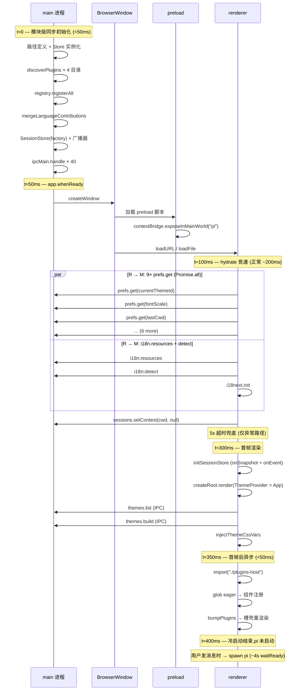

# 冷启动

> 本文讲 pi-desktop 从进程启动到首帧可见的完整链路——main 进程同步初始化做什么、renderer hydrate 竞速怎么跑、插件 renderer 怎么异步挂载、pi 子进程为什么不在冷启动里。通用原理和分层纪律见 `DESIGN.md`，内核内部机制（RPC 适配、会话管理、配置读写、插件加载器、主题合并、i18n 合并）见 `kernel.md`，本文不重复那些文档的内容，只讲冷启动这条线上的东西。

## 1 问题：从零到可用的最短路径

冷启动要解决的问题是：一个插件化的 Electron 桌面应用，从进程拉起到用户看到可交互界面，中间要做什么、不做什么、按什么顺序做。核心矛盾不是"怎么快"——是"哪些东西必须在首帧前做完，哪些可以推迟"。把不该在首帧前做的事推迟，冷启动自然就快了。

### 1.1 冷启动要解决什么——机制就绪与内容就绪的分离

pi-desktop 的冷启动把"就绪"拆成两层：

- **机制就绪**：main 进程的路径/Store/插件发现/注册表/IPC handler 全部到位，preload 桥接已暴露 `window.pi`，renderer 的 hydrate 完成（hydrate 指从 main 进程拉取偏好和 i18n 资源填充 renderer 侧状态的过程，§6 详述），React 树挂上，ThemeProvider 注入了 CSS 变量。这些是"系统能运转"的前提——缺了任何一个，要么白屏，要么首帧后功能不可用。注意：hydrate 有 5 秒超时兜底（§6.2），超时后偏好和 i18n 降级为默认值而非完全可用，但 React 树照常挂载——"机制就绪"在超时路径下是"降级就绪"而非"完整就绪"。

- **内容就绪**：插件 renderer 已加载并注册了组件、槽壳已渲染出 sidebar/sidePanel/settings 的实际内容、pi 子进程已启动并同步了基线。这些是"功能可用"的前提——但不是首帧可见的前提。

冷启动的定义边界是**机制就绪**。内容就绪中的插件 renderer 加载在首帧后异步发生（§8），pi 子进程在用户发首条消息时才按需起（§9）。这两层分离是整个冷启动设计的根因——不分离的版本曾经把冷启动拖到 2.5–4 秒，分离后压到 1.3 秒以内。

### 1.2 什么不算冷启动——pi 子进程不在其中

pi 子进程（`pi --mode rpc`）不在冷启动链路里。pi 是一个独立的 AI coding agent 进程——它通过 stdin 收 JSON 命令、stdout 吐 JSON 响应和事件，负责处理用户的对话请求（生成代码、执行工具等）。pi-desktop 通过 spawn 起它、通过 RPC 管它。它是按需的临时工——用户发首条消息时才 spawn，之前的所有阶段都不碰它。这条边界是刻意画的：

- 看会话（打开历史会话）= 纯文件读，解析 JSONL 全部行渲染消息列表，不启 pi 进程、不发 RPC、秒开。

- 发消息（`prompt`）= 按需起进程，走 `ensureForSend` → `start` → `waitReady` → `sync` 的链路。这条链路只在用户真正要和 AI 对话时才触发。

- 切会话 = 设激活上下文（`setContext`），如果激活会话的 pi 还活着就 resync 推基线，没活就清基线走文件读。不因切换而 spawn 新进程。

这个设计决策的背景：最初版本把"看会话"和"发消息"绑在一起——看会话也要先起 pi 进程、切会话也要 RPC。冷启动从 2.5–4 秒压到 1.3 秒，靠的不是缓存补丁，是把整个模型从"启动即 spawn pi"改成了"会话是文件，进程是临时工"。

### 1.3 不抄现成方案——为什么不照搬 Electron boilerplate

Electron 官方的 quick-start 和 electron-vite 的默认模板给出的冷启动模式是：main 进程 `app.whenReady` 里创建窗口、窗口加载 HTML、renderer 里跑 React。这个模式对简单应用够用，但对 pi-desktop 有三个不满足：

- **插件发现必须在 main 模块级完成**，不能等 `app.whenReady`——因为 IPC handler 要在窗口创建前注册好，否则 renderer 发的第一个 IPC 会无人接听。Electron 的 `ipcMain.handle` 是同步注册的，但模板把所有逻辑塞进 `whenReady` 回调里，混了初始化顺序。

- **renderer 的 hydrate 必须竞速**，不能串行——9 个偏好 + i18n resources 如果串行 IPC 拉取，每个 round-trip 算 5ms 也是 50ms+。并行 `Promise.all` 一次批次完成，配合 5 秒超时兜底，保证不卡白屏。模板没有这个模式。

- **插件 renderer 必须首帧后异步加载**，不能阻塞主渲染——Vite 的 `import.meta.glob` eager 模式在 build 期静态内联所有插件 renderer，运行时同步执行注册，但这个同步发生在 `createRoot().render()` 之后，不挡首帧。模板没有这个分层。

所以 pi-desktop 的冷启动是自己的模式，不是模板的照搬。借鉴了 VSCode 扩展体系的"薄壳 + 槽位契约 + 无特权差异"架构纪律，但落地方式是 Electron 特化的。

## 2 两条进程，六个阶段

冷启动横跨 Electron 的两个进程：main（Node.js 主进程，管文件系统、子进程、窗口）和 renderer（Chromium 渲染进程，跑 React UI）。两者之间不能直接互调，靠 preload 脚本通过 `contextBridge` 暴露的 `window.pi` 对象通信。

### 2.1 全景时序——从 t=0 到首帧可见

六个阶段按时间线排列：

1. **main 模块级同步初始化**（`shell/electron-main/index.ts` 模块加载时）：路径定义、Store 实例化、插件发现与注册、i18n 合并、SessionStore 装配、IPC handler 注册。全部同步，在 `app.whenReady` 之前完成。

2. **窗口创建**（`app.whenReady` 回调里）：确保 `general.json` 存在、创建 `BrowserWindow`、加载 renderer URL（dev）或 HTML 文件（pkg）。

3. **preload 桥接**（窗口创建时 Electron 自动执行 preload 脚本）：`contextBridge.exposeInMainWorld("pi", pi)` 暴露受控 API。

4. **renderer hydrate 竞速**（`shell/renderer/index.tsx` 执行时）：prefs hydrate（9 个 IPC 并行）+ i18n init（1 个 IPC + i18next 初始化），5 秒超时兜底。

5. **React 首帧渲染**（hydrate 完成后）：`createRoot().render()` 挂载 React 树，ThemeProvider 注入 CSS 变量，App 渲染三栏布局。

6. **插件 renderer 异步加载**（首帧渲染后）：`import("./plugins-host")` 动态 import，Vite eager glob 同步执行所有插件 renderer 的组件注册，`bumpPlugins()` 触发槽壳重渲染。

六个阶段里，1–3 在 main 侧，4–6 在 renderer 侧。六个阶段是顺序的——每个阶段完成（或被超时兜底放行）后才进下一个。阶段 6 相对于阶段 5 是异步的（`import("./plugins-host")` 不阻塞主线程），但它发生在首帧渲染之后，不是和阶段 4 并行。

### 2.2 main 与 renderer 的分工边界——IPC 是唯一通道

main 和 renderer 之间没有共享内存、没有直接函数调用。唯一的通道是 IPC，经 preload 的 `contextBridge` 受控暴露。IPC 有两种模式：

- **请求-响应**（`ipcRenderer.invoke` / `ipcMain.handle`）：renderer 主动调 main，main 处理后返回结果。如 `window.pi.themes.list()` → main 的 `registry.themeOptions()` → 回。
- **单向推送**（`webContents.send` / `ipcRenderer.on`）：main 主动推给 renderer，renderer 注册监听器接收。如 `session:event` 和 `session:snapshot`（§10）。

这意味着：

- main 侧的初始化结果（注册表、i18n resources、Store 实例）不能直接传给 renderer——必须经 IPC 暴露查询方法。renderer 要主题列表，调 `window.pi.themes.list()` → IPC → main 的 `registry.themeOptions()` → 回。每个查询都是一次 IPC round-trip。

- renderer 侧的状态变更（用户切了主题、改了字号）不能直接写 main 的 Store——必须经 IPC 调 `window.pi.prefs.set(key, value)` → main 的 `prefsStore.set()`。setter 调完才落盘。

- 事件流是单向推送：main 的 SessionStore 推 `session:event` / `session:snapshot` 给所有窗口的 `webContents.send`，renderer 的 `ipcRenderer.on` 接收。renderer 不主动拉——这是"事件驱动，不轮询"的落地（§10）。

这个边界是有意的安全设计：`contextIsolation=true`、`nodeIntegration=false`，renderer（插件代码运行的地方）没有 Node.js 全局——没有 `require`、没有 `fs`、没有 `process`，只有 `window.pi` 上暴露的 API。

## 3 阶段一：main 进程模块级同步初始化

这是冷启动最重的一个阶段。`shell/electron-main/index.ts` 在被 Electron 加载时，模块级别的代码同步执行——不等 `app.whenReady`，不等窗口创建。原因是 IPC handler 必须在窗口创建前注册好，否则 renderer 的第一个 IPC 调用会无人接听。

### 3.1 路径注入——application 不读 process 环境的纪律

main 侧首先定义所有路径常量：

```typescript
const PI_DESKTOP_DIR = join(homedir(), ".pi-desktop");
const CONFIG_DIR = join(PI_DESKTOP_DIR, "config");
const PLUGINS_DATA_DIR = join(CONFIG_DIR, "plugins-data");
const PI_INSTALL_DIR = join(PI_DESKTOP_DIR, "pi");
const PI_AGENT_DIR = join(homedir(), ".pi", "agent");
```

这些路径随后注入给 application 层的各 Store 构造函数：

- `ConfigStore({ userDir: PLUGINS_DATA_DIR, projectDir: null })` — 插件配置目录。

- `PiSettingsStore({ agentDir: PI_AGENT_DIR })` — pi 底座 settings 目录。

- `ModelsStore({ agentDir: PI_AGENT_DIR })` — pi 底座 models 目录。

application 层的 Store 不直读 `process.cwd()`、`process.env.HOME`——这是依赖方向的纪律（CLAUDE.md §1.1 判别气味四）。路径由 shell 在启动时注入，换运行环境（从 Electron 换到 CLI、从本地换到远程），application 层一行不动。

### 3.2 四种 Store 的初始化——prefs/config/piSettings/models

四种 Store 各管一摊，职责不重叠：

- **`prefsStore`**（electron-store）：桌面偏好——主题 id、字号倍率、字体选择、侧栏宽度、上次工作目录、当前 locale、当前模型。走 `~/.pi-desktop/config/` 目录，跨重启持久化。electron-store 构造时设 `defaults`，`prefs.get` 必返回值，renderer 的 hydrate 不需要 `??` 兜底。

- **`configStore`**（`application/config/config-store.ts`）：插件配置——每个插件一个 `~/.pi-desktop/plugins-data/{id}/config.json`。走通用 `readJsonFile`/`writeJsonFile` 原语 + `withDirLock` 文件锁。`projectDir` 当前为 `null`（桌面应用无"当前项目"概念，留待"打开项目"功能落地后注入）。

- **`piSettingsStore`**（`application/pi-settings/pi-settings-store.ts`）：pi 底座的 `~/.pi/agent/settings.json`，深合并写入。还负责解析底座的 `.d.ts` 拿字段 schema——用 TypeScript Compiler API，不正则解析。npm 全局目录由 shell 注入（`PI_SETTINGS_RESOLVE_PATHS`），application 不读 `process` 环境。

- **`modelsStore`**（`application/models/models-store.ts`）：pi 底座的 `~/.pi/agent/models.json`，整份覆盖写入。

四种 Store 都不碰文件路径——路径在构造时注入。锁的实现在 `config-file.ts` 一处（`proper-lockfile`，stale 5s，锁目录而非文件），换锁库只改一处。深合并用 `deepmerge` 包（`json-merge.ts`），不手写。

### 3.3 插件发现——四目录优先级扫描，内置与第三方平等

`discoverPlugins(rootDir, source)` 在 `application/loader/discover.ts`，扫描一个根目录下所有子目录，每个子目录有 `plugin.json` 即算一个插件。只扫一层，不递归。发现阶段只读 manifest、标记来源，不执行任何插件代码。

main 侧扫四个目录，按优先级从低到高注册：

```typescript
registry.registerAll(discoverPlugins(builtinDir, "builtin"));     // 最低
registry.registerAll(discoverPlugins(installedDir, "installed"));
registry.registerAll(discoverPlugins(userPluginsDir, "user"));
registry.registerAll(discoverPlugins(projectPluginsDir, "project")); // 最高
```

- **builtin**：dev 扫 `src/plugins/`，pkg 扫 `resources/pi-desktop-builtin/`。内置插件随壳分发。
- **installed**：`~/.pi-desktop/installed/`，外部安装的插件（目录预留，当前 discover 不递归多版本层）。
- **user**：`~/.pi-desktop/plugins/`，用户级插件。
- **project**：`<cwd>/.pi-desktop/plugins/`，项目级插件。桌面应用打包后 `process.cwd()` 通常是家目录，无"当前项目"概念——此目录在打包态降级为"另一个用户级"，留待"打开项目"功能接（演进标注）。

关键纪律：内置件和第三方件走同一 `discoverPlugins`，同一 `registerAll`，无 `if(builtin)` 分支。这是"无特权差异"的落地（CLAUDE.md §1.4）——删掉任何一个内置插件，core 照常启动，只是少了那块功能。复制到用户目录，以更高优先级覆盖内置版。

### 3.4 注册表聚合——按槽分桶，按 order 排序

`PluginRegistry` 在 `application/loader/registry.ts`，聚合 discover 结果供渲染层查询。内部维护五个 Map/List，按槽位分桶：

- **themes**：`Map<id, ThemeContribution>` — 主题贡献项，按 id 去重（后注册覆盖先注册）。
- **settings**：`Array<{ contribution, pluginId }>` — 设置页贡献项，按 `order` 升序排（缺省 100，Pi 永远第一 order=0，语言置底 order=999）。
- **sidePanel**：同 settings 模式 — 右面板 Tab 贡献项。
- **sidebar**：同模式 — 左栏分组贡献项。
- **languages**：含 `source` 和 `pluginPath` — 语言包贡献项，合并器按 source priority 仲裁。

注册表还提供能力查询：`hasPermission(pluginId, permission)` 查 manifest 的 `permissions` 数组，`manifestOf(pluginId)` 按 id 取 manifest。这些查询在 IPC 边界的安全校验里用（§5.2）。

### 3.5 i18n 合并——声明式语言槽的 key 级合并

main 侧在模块级把注册表里所有 `languages` 贡献项合并成 i18next resources：

```typescript
const languageContributions = registry.languageContributions();
const i18nResources = mergeLanguageContributions(languageContributions);
```

`mergeLanguageContributions` 在 `application/i18n/merge.ts`，做 key 级合并：不冲突的 key 全保留，冲突的按来源插件优先级取高（project > user > installed > builtin），同优先级先处理者胜。key 的 namespace 解析：第一个 dot 前是 namespace，无 dot 走 `common`。

resources 文件可以是字符串路径（相对插件目录）或内联对象。字符串路径解析失败（文件不存在/JSON 错/顶层非对象）记 error 并跳过——一个坏文件不拖垮整个 i18n。

main 只做合并 + 经 IPC 给 renderer；renderer 端自己 init i18next + react-i18next 实例。这是跨堆设计：main 与 renderer 各持 i18next 实例（查询语义一致，实例独立）。

### 3.6 SessionStore 装配——依赖倒置的工厂注入

SessionStore 是 application 层的会话管理器（`application/sessions/session-store.ts`），管理多个 pi 进程的生命周期。它不 `new RpcAdapter()`（那是 gateway 具体类），而是持有一个 `RpcAdapterFactory` 接口：

```typescript
export interface RpcAdapterFactory {
  create(opts: { cwd?: string; args?: string[]; env?: Record<string, string> }): RpcAdapter;
}
```

shell 侧实现这个接口：

```typescript
const rpcAdapterFactory: RpcAdapterFactory = {
  create: (opts) => new RpcAdapter(createPiSubprocess(opts)),
};
const sessionStore = new SessionStore(rpcAdapterFactory);
```

`createPiSubprocess` 在 `shell/electron-main/subprocess-lifecycle.ts`，返回 `PiSubprocessHandle`（封装 `spawn` + kill 策略）。`RpcAdapter` 在 gateway 层，持有 `SubprocessHandle` 接口（定义在 gateway 自有），只消费其 stdin/stdout 做 JSONL 读写。

装配链路完整走通依赖倒置的两层：

- **第一层**：`SessionStore` 持 `RpcAdapterFactory`（application 拥有的接口），shell 提供实现。换运行时只换 factory 实现，`session-store.ts` 一行不改。

- **第二层**：`RpcAdapter` 持 `SubprocessHandle`（gateway 拥有的接口），shell 的 `PiSubprocessHandle` 提供实现。换进程管理方式（从 `spawn` 换到远程连接），只换 shell 层的 `PiSubprocessHandle`，`rpc-adapter.ts` 一行不改。

SessionStore 创建后立即挂上两个广播器：`onEvent` 把中性事件推给所有窗口，`onSnapshot` 把投影基线推给所有窗口。这两个广播器在 §10 详述。

### 3.7 IPC 注册——四十个 handler 的能力边界

main 侧在模块级注册约四十个 `ipcMain.handle`，覆盖全部 IPC 能力。按功能分组：

- **config**（3 个）：`config:get` / `config:set` / `config:all` — 插件配置读写，走 ConfigStore。
- **prefs**（2 个）：`prefs:get` / `prefs:set` — 桌面偏好，走 electron-store。
- **i18n**（3 个）：`i18n:resources` / `i18n:list` / `i18n:detect` — 语言槽合并结果 + locale 列表 + 检测。
- **themes**（2 个）：`themes:list` / `themes:build` — 主题列表 + 合并入口。
- **settings**（1 个）：`settings:list` — 设置页槽贡献项。
- **slots**（2 个）：`slots:sidePanel` / `slots:sidebar` — 槽位清单。
- **sessions**（~20 个）：`session:start` / `session:stop` / `session:prompt` / `session:abort` / `session:getSnapshot` / `session:sync` / `sessions:list` / `session:open` / `session:rename` 等 — 会话核心能力。
- **fs**（1 个）：`fs:listDir` — 文件系统只读（需声明 `fs:project` 权限）。
- **git**（3 个）：`git:status` / `git:fileDiff` / `git:fileContent` — Git 只读（需声明 `git:read` 权限）。
- **dialog**（2 个）：`dialog:openDirectory` / `dialog:openImages` — 用户手势驱动。
- **kernel**（3 个）：`kernel:status` / `kernel:listVersions` / `kernel:install` — pi 内核管理。
- **pi-settings/models**（4 个）：`pi-settings:get` / `pi-settings:set` / `pi-settings:schema` / `models:get` / `models:set` — pi 底座配置。
- **config-file**（2 个）：`config-file:get` / `config-file:set` — 通用 JSON 配置文件读写。
- **open-file**（1 个）：用系统默认编辑器打开文件。

权限门控在 `assertPermission(pluginId, permission)` 函数里：查注册表的 `hasPermission`，没声明就抛错。当前版本只查 manifest 声明，没有用户授权 UI——声明了就算授权，没声明就拒绝。

所有 handler 在模块级注册（`app.whenReady` 之前），保证窗口创建后 renderer 的第一个 IPC 调用一定有人接听。

## 4 阶段二：窗口创建

`app.whenReady().then(() => { ... })` 在 Electron 准备好之后执行。这个阶段做两件事。

### 4.1 app.whenReady 的两个动作

```typescript
app.whenReady().then(() => {
  if (!existsSync(GENERAL_CONFIG_PATH)) {
    if (!existsSync(CONFIG_DIR)) mkdirSync(CONFIG_DIR, { recursive: true });
    writeFileSync(GENERAL_CONFIG_PATH, JSON.stringify({ defaultThinkingLevel: "high" }, null, 2), "utf-8");
  }
  createWindow();
  app.on("activate", () => {
    if (BrowserWindow.getAllWindows().length === 0) createWindow();
  });
});
```

第一，确保 `~/.pi-desktop/config/general.json` 存在——首次启动时写默认值（`{ defaultThinkingLevel: "high" }`）。这个文件是 general-config 插件的 configFile，但它的初始化在 shell 层做，因为首次启动时插件配置还没读到（ConfigStore 是惰性读的，不主动创建文件）。

第二，`createWindow()` 创建 `BrowserWindow`。macOS 的 `activate` 事件在点击 Dock 图标时触发——如果没有窗口就创建一个（macOS 经典行为）。

### 4.2 无边框窗口与 preload 路径

```typescript
const win = new BrowserWindow({
  width: 1280, height: 840, show: false,
  titleBarStyle: "hiddenInset",
  trafficLightPosition: { x: 14, y: 12 }, // 垂直居中:y = 标题栏 40px/2 − 8(容器原点+2px内衬,实测圆心 = y+8)
  backgroundColor: "#0b0b0c",
  webPreferences: {
    preload: resolve(__dirname, "../preload/preload.js"),
    contextIsolation: true,
    nodeIntegration: false,
  },
});
```

窗口属性有几个关键点：

- `show: false` + `ready-to-show` 后 `win.show()`：不闪白屏——窗口内容准备好后才显示。
- `titleBarStyle: "hiddenInset"`：macOS 无边框窗口，红绿灯内嵌。renderer 侧自定义标题栏用 `-webkit-app-region: drag` 实现拖拽区域。
- `contextIsolation: true` + `nodeIntegration: false`：安全配置。preload 在隔离上下文跑，renderer 没有 Node.js 全局。
- `preload` 路径：dev 和 pkg 的路径不同（`__dirname` 在 dev 是 `out/main`，在 pkg 是 `resources/app.asar/...`），但 `resolve` 统一处理。

加载地址：dev 模式加载 `process.env.ELECTRON_RENDERER_URL`（Vite dev server），打包模式加载 `renderer/index.html`（本地文件）。

## 5 阶段三：preload 桥接

窗口创建后 Electron 自动执行 preload 脚本。preload 是 main 和 renderer 之间的唯一桥梁。

### 5.1 contextBridge——隔离上下文的受控暴露

```typescript
contextBridge.exposeInMainWorld("pi", pi);
```

`contextBridge.exposeInMainWorld` 在隔离上下文中暴露 `pi` 对象到 renderer 的 `window.pi`。renderer（插件代码运行的地方）只看到这个对象——看不到 Node、Electron、文件系统。

`pi` 对象的每个方法背后是一个 `ipcRenderer.invoke` 调用。比如 `window.pi.config.get(pluginId, key)` 背后是 `ipcRenderer.invoke("config:get", pluginId, key)` → main 的 `ipcMain.handle("config:get", ...)` → `configStore.get(pluginId, key)` → 返回。

事件监听器（`onEvent` / `onSnapshot`）用 `ipcRenderer.on` 注册，返回取消订阅函数（`ipcRenderer.removeListener`）。这保证组件卸载时监听器被清理——不留内存泄漏。

### 5.2 能力三分——核心默认/声明门控/用户手势

`window.pi` 上的 API 按能力分层：

- **核心默认**（无需声明权限）：`config`、`prefs`、`themes`、`settings`、`sessions`、`i18n`、`models`、`kernel`、`configFile`、`openFile`、`slots`。所有插件都能用，不需要在 manifest 的 `permissions` 字段里声明。

- **声明能力**（需在 manifest 声明权限）：`fs`（需 `fs:project`）、`git`（需 `git:read`）。这两个 API 的方法签名里 `pluginId` 是第一个参数，main 侧的 `assertPermission` 查注册表的 `hasPermission`——没声明就抛错。插件不直接拼 `pluginId` 参数调 `window.pi`，而是经 `usePluginContext(pluginId)` 拿绑定后的上下文（§8.2），`fs`/`git` 已按 `pluginId` 预绑定。

- **用户手势驱动**：`dialog`（`openDirectory` / `openImages`）。不需要权限声明，默认放行。当前版本没有技术手段区分"用户点击按钮触发"和"插件代码编程式调用"——`dialog` 的 IPC handler 不做 `assertPermission` 检查，任何插件都能调。分类为"用户手势驱动"是设计意图（这些 API 本应只由用户操作触发），但当前没有强制执行。未来演进方向是在 IPC 边界加用户激活检测（Electron 的 `WebContents` 上有 `userGesture` 标志可用），但当前不做。

这个分层是有意的安全设计：插件能做什么，取决于 `window.pi` 上暴露了多少——暴露了就有的用，没暴露就没有。权限校验在 main 的 IPC 边界，不在 renderer 侧——renderer 侧的校验可以被绕过（renderer 是不可信代码运行的地方）。

## 6 阶段四：renderer hydrate 竞速

renderer 入口在 `shell/renderer/index.tsx`。这个阶段是冷启动里最讲究时序的一段——两件事并行竞速，5 秒超时兜底，完成后才挂 React 树。

### 6.1 两件事并行——9 个 prefs + i18n resources

```typescript
const hydrateP = useUiStore.getState().hydrateFromPrefs().then(() => {
  const { currentCwd } = useUiStore.getState();
  if (currentCwd) void useSessionStore.getState().startNewChat(currentCwd);
});
const timeoutP = new Promise<void>((r) => setTimeout(r, 5000));
Promise.race([Promise.all([hydrateP, initI18n()]), timeoutP])
  .catch(() => {})
  .finally(() => { /* render */ });
```

两件事并行：

- **`hydrateFromPrefs`**（`packages/react/src/ui-store.ts`）：9 个偏好并行 IPC `Promise.all`，9 次 IPC 并行不是串行——每次 IPC round-trip 算 5ms，串行 45ms，并行约 5ms。electron-store 构造时已设 `defaults`，`prefs.get` 必返回值，不需要 `??` 兜底。这 9 个偏好分别是：

  | 偏好 | 含义 | 默认值 |
  |------|------|--------|
  | `currentThemeId` | 当前主题标识符，决定 ThemeProvider 解析哪个主题（§7.1） | `"chatgpt-dark"` |
  | `fontScale` | 字号倍率，1.0 = 主题原值，传给 `themes.build` 做字号缩放 | `1.0` |
  | `fontMonoChoice` | 等宽字体选择，枚举值（jetbrains/fira/cascadia/sfmono/menlo/system），覆盖 `--font-family-mono` | `"jetbrains"` |
  | `fontSansTone` | 正文调性，枚举值（sans/serif/mono/rounded），覆盖 `--font-family-sans` | `"sans"` |
  | `rightPanelOpen` | 右面板是否展开（布尔值），标题栏开关 + `⌘J` 控制 | `true` |
  | `lastCwd` | 上次退出时的工作目录，hydrate 后用于恢复 SessionStore 激活上下文（§6.3） | `""` |
  | `currentLocale` | 当前界面 locale（zh-CN/zh-TW/en/de），决定 i18next 查哪套文案 | `"zh-CN"` |

- **`initI18n`**（`shell/renderer/i18n-init.ts`）：1 次 IPC 拿 `i18n:resources`（合并好的 i18next resources + namespaces + supportedLngs）+ 1 次 IPC 拿 `i18n:detect`（locale 检测）+ `i18next.use(initReactI18next).init(...)` 初始化。如果 `prefs` 已有 `currentLocale` 就优先用它，否则检测 `navigator.language`。

hydrate 完成后做一件零 RPC 的事：如果 `lastCwd` 有值（上次退出时的工作目录），调 `useSessionStore.getState().startNewChat(currentCwd)` → `window.pi.sessions.setContext(cwd, null)`。这只设 main 的 SessionStore 激活上下文，不 spawn pi 进程。这保证了首条消息时 `ensureForSend` 能拿到正确的 cwd。

### 6.2 5 秒超时兜底——不卡白屏的工程底线

`Promise.race([Promise.all([hydrateP, initI18n()]), timeoutP])` 的 5 秒超时是兜底——如果 IPC 卡了（main 进程卡死、electron-store 文件锁竞争），renderer 不卡白屏，5 秒后照常 render。

超时后 render 的状态：

- 偏好用 `DEFAULT_PREFS`（`ui-store.ts` 的初始值：`currentThemeId: "chatgpt-dark"`、`fontScale: 1.0`、`currentLocale: "zh-CN"` 等）。
- i18n 未 init，`t("key")` 返回 key 本身（`parseMissingKeyHandler: (key) => key`）。
- `hydrated: false`，但 render 不等它。

这个兜底不是"正常路径"——正常 hydrate 在 200ms 内完成。5 秒是"最坏情况不卡死"的保险，不是"预期 5 秒"。这个设计避免了"一个 IPC 卡住整个应用白屏"的脆性。

### 6.3 hydrate 后的 setContext——零 RPC 同步

`hydrateFromPrefs` 完成后的 `.then()` 里做了一件关键的事：

```typescript
const { currentCwd } = useUiStore.getState();
if (currentCwd) void useSessionStore.getState().startNewChat(currentCwd);
```

`startNewChat(cwd)` 在 `packages/react/src/session-store.ts` 里只做两件事：

```typescript
startNewChat: async (cwd) => {
  await window.pi.sessions.setContext(cwd, null);
  set({ messages: [], snapshot: null, streaming: false, switching: false, ready: true });
},
```

`setContext(cwd, null)` 经 IPC 到 main 的 `sessionStore.setContext(cwd, null)`——只设 `activeCwd` 和 `activeSessionPath = null`，不 spawn 进程、不发 RPC。`null` 表示"新会话，未落盘"——进程在首次发送时才起（§9.2）。

这一步的语义是"恢复上次的工作上下文"——经典桌面应用行为。用户上次在 `/Users/foo/my-project` 工作，重启后自动恢复到那个目录，不需要重新选。

### 6.4 initSessionStore——投影通道先于首帧

`Promise.race` 的 `.finally()` 里做四件事，顺序固定：

```typescript
.finally(() => {
  initSessionStore();        // 1. 投影通道先挂上
  subscribeLocaleChange();   // 2. locale 变化订阅
  const root = createRoot(rootEl);
  root.render(<ThemeProvider><ErrorBoundary><App /></ErrorBoundary></ThemeProvider>);  // 3. 挂 React 树
  ensurePlugins();           // 4. 首帧后异步加载插件
});
```

`initSessionStore()` 必须在 `createRoot().render()` 之前调——因为它是 main→renderer 的事件通道：`window.pi.sessions.onSnapshot` 和 `window.pi.sessions.onEvent` 注册监听器。如果 render 先于通道挂上，React 组件挂载后发的第一个 IPC（比如 `getSnapshot`）回来时没有监听器接，数据丢失。

`initSessionStore` 是幂等的（`let inited = false` 守护），只执行一次。它注册了两个监听器：

- **`onSnapshot`**：收到 main 推的 `session:snapshot` → `useSessionStore.setState({ snapshot, messages: snapshot.messages, streaming: snapshot.state?.isStreaming, ready: true })`。基线覆盖式更新。

- **`onEvent`**：收到 main 推的 `session:event` → `useSessionStore.setState((s) => ({ messages: applyEvent(s.messages, event), ... }))`。增量应用（§10.4）。

## 7 阶段五：React 首帧渲染

React 树挂上后，首帧渲染的链路是 `ThemeProvider` → `ErrorBoundary` → `App`。

### 7.1 ThemeProvider——三个 useEffect 串行链

`ThemeProvider` 在 `shell/renderer/theme-context.tsx`，做主题到 CSS 变量的注入。三个 `useEffect` 形成串行链：

1. `window.pi.themes.list()` → 拿主题选项列表（1 次 IPC）。`setThemeOptions` 存进 React Context，供设置页渲染主题选择 UI。

2. `window.pi.themes.build(themeId, fontScale, fontMono, fontSans)` → 拿合并后的 Theme（1 次 IPC → main 调 `buildCurrentTheme` 做 `resolveTheme` 递归继承 + `applyFontScale` 字号倍率 + `applyFontChoice` 字体覆盖）。`setTheme` 存进 state。

3. `injectThemeCssVars(theme)` → 遍历 Theme 的 `Object.entries`，每个 `token.key` → CSS 变量名（`color.primary` → `--color-primary`），`element.style.setProperty` 写到 `document.documentElement`。

第二个 `useEffect` 依赖 `[themeId, fontScale, fontMonoChoice, fontSansTone]`——任何一个变就重新合并 + 注入。用户在设置页改了主题，ThemeProvider 自动重算，CSS 变量即时更新，不需要刷新。

合并逻辑在 `application/theme/merge.ts`，不在 renderer 侧——renderer 只管"拿到合并结果注入 CSS"，不管"怎么合并"。这是薄壳纪律的落地（CLAUDE.md §7.1 铁律一）。

### 7.2 ErrorBoundary——插件抛错不拖垮整树

```typescript
class ErrorBoundary extends React.Component<{ children: React.ReactNode }, { error: Error | null }> {
  static getDerivedStateFromError(error: Error) { return { error }; }
  render() {
    if (this.state.error) {
      return <div style={{ padding: 32, color: "red" }}>渲染错误: {String(this.state.error.message)}</div>;
    }
    return this.props.children;
  }
}
```

`ErrorBoundary` 包在 `App` 外面。子组件（包括插件渲染的槽壳内容）抛错不拖垮整树——显示错误信息而非白屏。这是防御性设计：插件是不可信代码，一个插件的渲染 bug 不该让整个应用不可用。

### 7.3 App 组件——三栏布局与快捷键

`App` 组件渲染标题栏 + 三栏布局（`PanelGroup`）：

- **左栏**（`Sidebar`）：sidebar 槽的壳，按 `pluginsNonce` 重渲染查组件。可折叠（`⌘B`），宽度持久化到 prefs。
- **中区**（`MainViewHost`）：mainView 槽的壳，查槽选第一个贡献项渲染（timeline 插件贡献消息流）。
- **右面板**（`RightPanel`）：sidePanel 槽的壳，按 `pluginsNonce` 重渲染查组件。可折叠（`⌘J`）。

全局快捷键：`⌘B` 左栏开关、`⌘J` 右面板开关、`⌘N` 新会话、`⌘,` 设置页。这些快捷键在 `App` 的 `useEffect` 里注册，`keydown` 事件处理——不需要 IPC，纯 renderer 侧。

设置页（`activeView === "settings"`）整页覆盖对话视图，用 `AnimatePresence` 做淡入淡出过渡。

## 8 阶段六：插件 renderer 异步加载

首帧渲染完成后，`ensurePlugins()` 被调——异步加载插件 renderer，不阻塞主渲染。

### 8.1 import.meta.glob eager——build 期静态内联

```typescript
function ensurePlugins(): void {
  if (pluginsLoaded) return;
  pluginsLoaded = true;
  import("./plugins-host")
    .then(() => useUiStore.getState().bumpPlugins())
    .catch((err) => console.error("[plugins-host] 加载失败:", err));
}
```

`import("./plugins-host")` 是动态 import——Vite 在 build 期把它拆成单独 chunk，运行时异步加载。加载完成后 `bumpPlugins()` → `pluginsNonce++` → 槽壳（sidebar/right-panel/settings-page）订阅了 `pluginsNonce`，重新渲染查组件。

`plugins-host.ts` 按文件物理形态分派加载（非特权分派）：

- **builtin 插件**：源码编译进 bundle，经 `import.meta.glob("../../plugins/*/renderer/index.{ts,tsx}", { eager: true })` 加载——build 期静态内联，运行时同步执行。
- **第三方插件**（installed/user/project）：独立 js 文件，经 `import(file://path?t=timestamp)` 运行期加载。带时间戳避缓存（热加载重新 import 拿新版本）。

两条路径各自内部一视同仁：glob 对所有内置平等、file:// 对所有第三方平等。判据是"文件物理形态"（源码 vs 独立文件），非"是否内置特权"。

`eager: true` 意味着 Vite 在 build 期把 builtin 模块静态内联到 chunk 里——运行时同步执行，不是异步 import 每个。这避免了异步加载导致的组件注册时序竞态：如果 glob 是异步的，settings-page 渲染时组件可能还没注册 → 右边空白。

eager 模式的副作用是每个插件的 `renderer/index.tsx` 被执行时调 `registerSettingsComponent` / `registerSidePanelComponent` / `registerSidebarComponent` / `registerMainViewComponent`——把 React 组件按名字写入 `packages/react/src/index.ts` 的全局 Map。新增内置插件自动被发现，只要在 `src/plugins/*/renderer/` 放文件——不需要改 `plugins-host.ts`。

热加载：`onPluginsChanged` 事件触发时，对 enabled 且未加载的 builtin 重新执行 glob chunk，对第三方重新 file:// import。`onUnloaded` 传 pluginId + components，disable 时清加载标记，enable 后才能重新加载。

### 8.2 组件注册中心——全局 Map 按名查

`packages/react/src/index.ts` 维护三个全局 Map：

- `settingsComponents: Map<string, ComponentType<SettingsComponentProps>>` — 设置页组件。
- `sidePanelComponents: Map<string, ComponentType>` — 右面板 Tab 组件。
- `sidebarComponents: Map<string, ComponentType>` — 左栏分组组件。
- `mainViewComponents: Map<string, ComponentType>` — 中区主视图组件。

插件 renderer 调 `registerXxxComponent(name, comp)` 写入，槽壳调 `getXxxComponent(name)` 查找。manifest 声明"我贡献了一个叫 `GeneralConfigPage` 的 settings 组件"，renderer 注册"`GeneralConfigPage` 对应这个 React 组件"——两步分开，按名字匹配。

槽壳（sidebar/right-panel/settings-page）先从 main 拿槽位清单（经 IPC `slots:sidebar` / `slots:sidePanel` / `settings:list`），清单里有 `component` 字段（组件名），然后用 `getXxxComponent(component)` 查到 React 组件渲染。如果查不到（组件名未注册），那个槽位渲染空——不拖垮其他槽。

### 8.3 pluginsNonce——注册完成的重渲染信号

`plugins-host` 加载完成后调 `useUiStore.getState().bumpPlugins()`，`pluginsNonce++`。槽壳组件订阅了这个值：

```typescript
const pluginsNonce = useUiStore((s) => s.pluginsNonce);
```

`pluginsNonce` 变化时槽壳重新渲染——此时全局 Map 里已有组件，`getXxxComponent` 能查到了。如果没有这个 nonce 机制，槽壳在首帧渲染时查组件会查到空（插件 renderer 还没加载），之后插件注册了但槽壳不知道要重渲染——永久"组件未注册"。

### 8.4 机械防回归——glob 匹配数断言

```typescript
if (Object.keys(modules).length === 0) {
  throw new Error("[plugins-host] glob 匹配 0 个内置插件 renderer, 路径可能写错");
}
```

Vite 对空 glob 静默不报——路径写错会无声漏过，表现是"右边空白"但无任何错误信息。这个断言把"静默退化"变成"立即抛错"：glob 路径写错或插件 renderer 全删时，build 或运行期立即报错，而不是让开发者对着空白页面 debug。

### 8.5 第三方 renderer 的缺口

当前 `import.meta.glob` 只扫 `src/plugins/*/renderer/`（builtin）。第三方插件装在 `~/.pi-desktop/plugins/` 下，它们的 renderer 不在 Vite 的 glob 范围内——运行时动态 import 需 import map，当前未实现。这意味着第三方插件的 sidebar/sidePanel/settings 自定义组件暂时不渲染（manifest 声明在注册表里，但 renderer 侧查不到组件）。

这是已知缺口，`plugins-host.ts` 注释明确标注："第三方插件 renderer 运行时动态 import 需 import map（文档 18 §6.2），本次不做"。演进方向是用 Electron 的 `file://` 协议 + import map 加载第三方 renderer 模块，但安全考量（第三方代码在 renderer 进程里跑）需要额外的沙箱设计。

## 9 pi 子进程：按需起的临时工

冷启动结束后，pi 子进程没有启动。它在用户发首条消息时才 spawn——这是冷启动设计的核心决策。

### 9.1 会话是文件，进程是临时工——进程模型

pi-desktop 的进程模型是"每会话一进程、多会话多进程并存"。SessionStore（`application/sessions/session-store.ts`）内部维护一个 `procs: Map<string, SessionProc>`，key 是会话路径或 `new:${cwd}`（新会话未落盘时）。

进程的生命周期和会话的生命周期不绑定：

- **看会话** = 读文件（`session-scanner.readSession` 解析 JSONL），不启 pi。秒开。
- **发消息** = `ensureForSend` 保证激活会话的 pi 在跑。没起就起（`spawn --session <path>`，底座从文件续上下文）。不杀其他会话的进程。
- **切会话** = `setContext` 设激活。激活会话 pi 活着 → resync 推基线；没活 → 清基线（renderer 走文件读）。不因切换而 spawn。
- **新会话/切目录** = 本地概念，清空视图，进程首次发送才起。
- **应用退出** = `before-quit` 里 `sessionStore.stopAll()` 全杀干净（关 stdin → 1s → SIGTERM → 2s → SIGKILL）。

### 9.2 ensureForSend——发送路径的进程保证

```typescript
private async ensureForSend(): Promise<void> {
  if (!this.activeCwd) throw new Error("未选择工作目录");
  if (this.alive) return;
  let sessionPath = this.activeSessionPath ?? undefined;
  if (!sessionPath) {
    sessionPath = this.generateNewSessionPath(this.activeCwd);
    this.activeSessionPath = sessionPath;
  }
  await this.start(this.activeCwd, sessionPath);
}
```

`ensureForSend` 是发送路径的唯一入口——`prompt`、`steer`、`followUp` 都先调它。它做三件事：

1. 检查激活会话的 pi 是否活着（`this.alive`），活着就 return——不重复起。
2. 新会话（`activeSessionPath === null`）时生成新文件路径（`~/.pi/agent/sessions/<桶>/<timestamp>_<uuid>.jsonl`）。`<桶>` 是 cwd 的编码目录名——把工作目录路径去掉首斜杠、剩余斜杠换成横线，如 `/Users/foo/project` → `--Users-foo-project--`。这个编码规则对齐 pi 底座的 session-manager 目录结构（`cwdToBucketName` 函数）。
3. `start(cwd, sessionPath)` — `factory.create({ cwd, args: ["--session", sessionPath] })` → `new RpcAdapter(createPiSubprocess(opts))` → `adapter.start()` → `waitReady(adapter)` → `sync()`。

`start` 里有一个关键细节：`procs` 的 key 用初始 `sessionPath` 或 `new:${cwd}`，不随 sessionFile 变。底座推 `sessionStart` 事件时会带 `sessionFile`（新会话首次落盘的路径），但 key 不动——因为 `adapter.onEvent` 回调是闭包，闭包捕获了创建时的 key，移动 key 会丢事件转发。所以底座推 `sessionStart` 时只更新 `boundSessionPath`（该进程实际绑的会话文件路径）和 `activeSessionPath`。

SessionStore 里有四个和"路径"或"标识"相关的字段，它们容易混淆但各有不同用途：

| 字段 | 存于 | 含义 | 何时变 |
|------|------|------|--------|
| `procs` Map key | `SessionStore.procs` | 进程查找键。初始 `sessionPath`（历史会话）或 `new:${cwd}`（新会话未落盘） | **不变**——闭包绑定，移动会丢事件转发 |
| `boundSessionPath` | `SessionProc` 对象 | 该进程实际绑的会话文件路径。底座推 `sessionStart` 时更新 | 底座推 `sessionStart` 时更新为新落盘路径 |
| `activeSessionPath` | `SessionStore` | 当前激活会话的文件路径。`null` = 新会话未落盘 | `setContext` 设、`ensureForSend` 生成新路径、`sessionStart` 更新 |
| `activeProcKey` | `SessionStore` | 激活会话在 `procs` Map 里的 key，用于事件路由过滤（§10.3） | `setContext` / `start` 时设，等于 Map key |

为什么 `boundSessionPath` 和 `activeSessionPath` 是两个字段？因为 `boundSessionPath` 绑在具体进程上（多会话多进程时每个 `SessionProc` 各有自己的绑定路径），`activeSessionPath` 是 store 级别的"当前激活会话的文件路径"。单会话场景下两者值相同，多会话场景下只有激活会话的两者相同。同理，`activeProcKey` 看起来和 `procs` Map key 值相同，但 `procs` key 是 Map 的查找键（不可变），`activeProcKey` 是 store 级别的"当前激活会话的查找键"——它可以在 `setContext` / `start` 时切换到不同会话的 key，而 `procs` Map 里的 key 永远不动。

### 9.3 waitReady——实证探测而非固定 sleep

```typescript
private async waitReady(adapter: RpcAdapter): Promise<void> {
  const deadline = Date.now() + 4000;
  while (Date.now() < deadline) {
    try {
      await adapter.send({ type: "get_state" });
      return;
    } catch {
      await new Promise((r) => setTimeout(r, 150));
    }
  }
}
```

`waitReady` 用 `get_state` 命令做实证轮询：150ms 间隔、4s 预算，首个成功即返回。不靠固定 sleep 猜就绪时间——固定 sleep 是对时序竞争的赌注，赌 100ms 后进程一定就绪了、赌 500ms 后数据一定到了。赌赢了功能正常，赌输了偶发 bug 永远复现不了。

需要区分两种就绪机制。`rpc-adapter.start()` 启动后立即检查进程存活（`handle.alive`），不 sleep 等待——进程退出由 `onceExit` 捕获。`waitReady` 是在此之后的实证轮询（等 agent loop 响应）。前者管"进程活着没"，后者管"业务逻辑准备好了没"。进程活着但 agent loop 没就绪时命令会被拒，所以轮询 `get_state` 确认业务就绪。

超时也不阻塞——让后续 `sync` 的真实错误冒出来，不在此掩盖。`waitReady` 超时后直接返回，`sync` 如果 pi 真没就绪会报错，调用方收到错误自己处理。

### 9.4 resync——五条并发命令组装基线

```typescript
export async function resync(rpc: RpcAdapter): Promise<SyncSnapshot> {
  const [stateRes, entriesRes, treeRes, commandsRes, messagesRes] = await Promise.all([
    rpc.send(buildGetStateCommand()),
    rpc.send(buildGetEntriesCommand()),
    rpc.send(buildGetTreeCommand()),
    rpc.send(buildGetCommandsCommand()),
    rpc.send({ type: "get_messages" }),
  ]);
  // ... 翻译 + 组装
  return { state, entries, messages, tree, commands, leafId };
}
```

`resync` 在 `application/orchestrations/resync.ts`，并发发 5 条 RPC 命令，组装成 `SyncSnapshot`（圆心中性类型）。5 条命令并行 `Promise.all`——不是串行，省 4 个 round-trip 的延迟。

`resync` 在两个时机被调：

- `start` 完成后（`waitReady` 通过后立即 `sync`）— 新进程的首次基线。
- `setContext` 时激活会话 pi 活着 — 切回流式中的会话拿实时状态。

基线经 `session:snapshot` 广播给 renderer（§10.2），renderer 的 `useSessionStore` 收到后覆盖式更新——`messages`、`streaming`、`ready` 全从基线来。

### 9.5 历史会话秒开——纯文件读

打开历史会话走 `openSession(sessionPath)`：

```typescript
openSession: async (sessionPath) => {
  set({ switching: true });
  try {
    const detail = await window.pi.sessions.openSession(sessionPath);
    await window.pi.sessions.setContext(detail?.info?.cwd ?? "", sessionPath);
    set({ messages: detail?.messages ?? [], snapshot: null, streaming: false, switching: false, ready: true });
  } catch (err) {
    set({ switching: false });
    throw err;
  }
},
```

`session:open` 经 IPC 到 main 的 `readSession(sessionPath)`（`application/sessions/session-scanner.ts`）——读 JSONL 文件全部行，逐行 `JSON.parse`，`sessionEntryToNeutral` 映射成中性消息。不启 pi 进程、不发 RPC、秒开。

`setContext` 同步 main 的激活上下文（cwd 从文件 header 读，最准），但不 spawn 进程。如果用户看了会话后发消息，`ensureForSend` 才起该会话的 pi（`--session <path>` 续上下文）。

这个设计的性能含义：用户可以在会话列表里快速浏览多个历史会话，每个都是纯文件读，不产生进程开销。只有真正要对话的会话才起进程。

## 10 数据流：从 main 到 renderer 的投影

SessionStore 是投影 owner——main 侧维护真实状态，renderer 侧维护镜像。两者之间的数据流是单向推送：main 推，renderer 接。

### 10.1 两个广播器——onEvent + onSnapshot

```typescript
sessionStore.onEvent((event) => {
  for (const w of BrowserWindow.getAllWindows()) w.webContents.send("session:event", event);
});
sessionStore.onSnapshot((snapshot) => {
  for (const w of BrowserWindow.getAllWindows()) w.webContents.send("session:snapshot", snapshot);
});
```

SessionStore 暴露两个订阅接口：

- **`onEvent(cb)`**：事件增量。底座推 `AgentSessionEvent` → `translateEvent` 翻译成中性 `SessionEvent` → `dispatch` 路由 → 推给所有窗口。
- **`onSnapshot(cb)`**：基线快照。`sync` 完成后推一次，包含完整状态（state + entries + messages + tree + commands + leafId）。

两个广播器都是 `sessionStore` 创建后在模块级挂上的，推给 `BrowserWindow.getAllWindows()` 的所有窗口——支持多窗口（虽然当前通常只有一个）。

### 10.2 session:snapshot——切换时一次基线

`sync()` 完成后调所有 `snapshotListeners`：

```typescript
async sync(): Promise<SyncSnapshot> {
  const proc = this.activeProc();
  if (!proc || !proc.adapter.alive) throw new Error("pi 未启动");
  const snapshot = await resync(proc.adapter);
  this.latestSnapshot = snapshot;
  for (const cb of this.snapshotListeners) {
    try { cb(snapshot); } catch (err) { console.error("[session-store] 快照监听器抛错已隔离:", err); }
  }
  return snapshot;
}
```

监听器抛错被 `try/catch` 隔离——一个坏监听器不拖垮其他监听器。这是防御性设计：renderer 侧的 bug 不该让 main 进程崩。

`session:snapshot` 在两个时机推送：`start` 后（新进程首次基线）和 `sync` 时（显式刷新或切会话）。每次推送是完整覆盖——renderer 的 `useSessionStore` 收到后直接 `setState({ snapshot, messages: snapshot.messages, ... })`，不做增量合并。

### 10.3 session:event——持续增量推送

事件路由在 `dispatch(key, event)` 里：

```typescript
private dispatch(key: string, event: SessionEvent): void {
  // sessionStart: 底座创建了新会话文件 → 更新 boundSessionPath
  if (event.type === "sessionStart" && key.startsWith("new:")) {
    const sf = (event as { sessionFile?: string }).sessionFile;
    if (typeof sf === "string" && sf) {
      const proc = this.procs.get(key);
      if (proc) { proc.boundSessionPath = sf; this.activeSessionPath = sf; }
    }
  }
  // 定稿/轮结束/新文件事件:全转发;流式增量只转发激活会话
  const isLifecycleEvent = event.type === "messageEnd" || event.type === "agentSettled" || event.type === "agentEnd" || event.type === "sessionStart";
  if (!isLifecycleEvent && key !== this.activeProcKey) return;
  // TPS 自算
  if (event.type === "messageStart") proc.genStartMs = Date.now();
  else if (event.type === "messageEnd" && proc.genStartMs != null) {
    const elapsed = (Date.now() - proc.genStartMs) / 1000;
    proc.lastTps = elapsed > 0 && out > 0 ? out / elapsed : null;
  }
  for (const cb of this.listeners) { try { cb(event); } catch (err) { ... } }
}
```

`dispatch` 做三件事：

- **`sessionStart` 处理**：底座推 `sessionStart` 带新会话文件路径 → 更新 `boundSessionPath` 和 `activeSessionPath`，但不移动 `procs` 的 key（闭包绑定，移动会丢事件）。
- **事件路由过滤**：定稿/轮结束/新文件事件全转发（列表刷新靠这些）；流式增量（`messageUpdate`/`messageStart`）只转发激活会话——不干扰当前视图。
- **TPS 自算**：`messageStart` 记时，`messageEnd` 用 output tokens / 耗时算 TPS（底座不给 TPS）。

### 10.4 增量应用的纯函数

renderer 侧的 `applyEvent` 在 `packages/react/src/session-store.ts`，是一个纯函数——输入旧消息数组 + 事件，输出新消息数组。纯函数意味着可测试、可回放。

`applyEvent` 按 `messageId` 精确 patch（优先按 id 定位消息再更新，而不是简单替换末条同 role 消息），不靠末条 role 替换：

- `messageUpdate`：按 id 查找 → patch；无 id 退回末条 assistant 替换（pi 底座某些版本不推 id 的兼容回退）。
- `messageStart`：底座开始推这条消息 → 替换 pending 占位或追加。
- `messageEnd`：按 id 定稿；无 id 退回末条同 role 替换。
- `entryAppended`：只收非消息条目（如模型切换、思考强度变更等分隔层条目，它们不是对话消息而是会话元数据）。消息型条目由 `messageEnd` 通道进，`entryAppended` 不重复收——防止同一条消息同时经两个事件类型进入导致重复渲染。

这个设计的核心是：组件只读 store、永不各自 `getSnapshot`。消灭了 timeline/ModelPill/session-tree 3× 重复拉取——每个组件不再在 `useEffect` 里发 IPC，而是订阅 store 的变化。store 变了就推给所有订阅者，没变就不打扰。这是"事件驱动，不轮询"的落地（CLAUDE.md §3.6）。

## 11 冷启动时序图



## 12 开闭原则验证：新增一个通用插件

这一节用一个模拟实验验证：新增一个使用已有槽位的插件，需要改多少内核文件。

### 12.1 模拟实验——两个文件，零内核改动

假设新增一个插件 `my-general`，需求是右面板挂一个 Tab + 设置页挂一个配置页 + 读写自己的配置文件 + 需要文件系统只读权限。

全部操作只需两个文件，零内核改动：

**`src/plugins/my-general/plugin.json`**（manifest，17 行）：

```json
{
  "id": "my-general",
  "version": "0.4.9",
  "displayName": "通用插件",
  "renderer": "./renderer/index.tsx",
  "permissions": ["fs:project"],
  "contributes": {
    "sidePanel": [
      { "id": "my-tab", "label": "通用", "icon": "layout-grid", "component": "MyGeneralTab", "order": 40 }
    ],
    "settings": [
      { "id": "my-settings", "title": "通用设置", "component": "MyGeneralSettings", "configFile": "~/.pi-desktop/config/my-general.json", "configMerge": "deep", "order": 20 }
    ]
  }
}
```

**`src/plugins/my-general/renderer/index.tsx`**（~30 行核心）：

```tsx
import { registerSidePanelComponent, registerSettingsComponent, usePluginContext, SettingsSection, type SettingsComponentProps } from "@pi-desktop/react";

registerSidePanelComponent("MyGeneralTab", MyGeneralTab);
registerSettingsComponent("MyGeneralSettings", MyGeneralSettings);

function MyGeneralTab() {
  const ctx = usePluginContext("my-general");
  // ctx.config / ctx.sessions / ctx.fs / ctx.git / ctx.dialog 全已绑定 pluginId
  // ctx.i18n.t("key") 拿翻译
}

function MyGeneralSettings({ config, onChange, refreshSignal }: SettingsComponentProps) {
  // 框架已管好 save/dirty/reset/拦截/刷新/打开配置
  // 插件只管渲染 + 调 onChange 报告改动
}
```

### 12.2 自动链路——从 discover 到 slot shell

插件放好后，以下环节全部自动运转，无需改任何内核文件：

- **发现**：`discoverPlugins(builtinDir, "builtin")` 扫 `src/plugins/*` → 找到 `my-general/plugin.json` → `discover.ts` 一行不改。
- **注册**：`registry.registerAll()` 按 manifest `contributes` 分桶 → `registry.ts` 一行不改。
- **IPC 暴露**：`registry.sidePanelItems()` / `settingsItems()` 自动含新插件 → `index.ts` 的 IPC handler 一行不改。
- **Renderer 加载**：`import.meta.glob("../../plugins/*/renderer/index.tsx")` 自动扫到 → `plugins-host.ts` 一行不改。
- **组件注册**：`registerSidePanelComponent` / `registerSettingsComponent` 写全局 Map → `packages/react/src/index.ts` 一行不改。
- **槽壳渲染**：右面板/设置页查 Map 找到组件，靠 `pluginsNonce` 重渲染 → 壳组件一行不改。
- **配置管理**：manifest `configFile` → 框架自动管 read/write/dirty/save/reset/拦截/刷新/打开配置 → 配置框架一行不改。
- **权限校验**：manifest `permissions: ["fs:project"]` → `assertPermission` 在 IPC 边界检查 → 权限校验一行不改。
- **i18n**：插件在 `contributes.languages` 里贡献文案 → `mergeLanguageContributions` 自动合并 → 合并器一行不改。

### 12.3 对扩展开放的

以下十种扩展场景，全部零内核改动：

- 新增 sidebar 分组插件 — glob 自动发现 + `registerSidebarComponent`。
- 新增 sidePanel Tab 插件 — 同上 + `registerSidePanelComponent`。
- 新增 settings 配置页插件 — 同上 + `registerSettingsComponent`。
- 新增主题插件 — `contributes.themes` + `buildCurrentTheme` 自动合并。
- 新增语言包插件 — `contributes.languages` + `mergeLanguageContributions` 自动合并。
- 插件声明 `fs:project` 权限 — manifest `permissions` + `assertPermission` 门控。
- 插件声明 `git:read` 权限 — 同上。
- 插件用 `configFile` 管配置 — 框架自动管 read/write/dirty/save/reset/拦截/刷新/打开配置。
- 插件订阅会话事件流 — `sessions.onEvent` + `sessions.onSnapshot`。
- 插件用 i18n — `usePluginContext` → `i18n.t("key")`。

### 12.4 对修改封闭的——有意的封闭

以下扩展场景必须改内核文件——这是有意的封闭，不是缺陷：

- **新增槽位类型**（如 "toolbar"）：槽位是机制契约，不是内容。需要改 `domain/contributions.ts`（加新 `SlotName` + 贡献项接口）+ `registry.ts`（加 Map + register + xxxItems）+ `index.ts`（加 IPC handler）+ `preload.ts`（加 API）+ `packages/react/src/index.ts`（加 register/getComponent）。五个文件，但这是"系统骨架变了"——按 CLAUDE.md §2.2 的判据，槽位"一年后会不会换"的答案是"不会换"，该留在内核。

- **新增 IPC 能力**（如 "http:read"）：能力是机制契约。需要改 `domain/context.ts`（加接口）+ `index.ts`（加 IPC handler）+ `preload.ts`（加 API）+ `packages/react/src/index.ts`（加 PiApi 类型）+ `plugin-context.ts`（加方法）。五个文件，但"新能力"应该是深思熟虑的——不是插件随手加的。

这两类封闭是开闭原则的正确落地：对"使用已有机制"的扩展开放，对"改变机制本身"的修改封闭。如果把槽位/能力的添加也做成"插件可扩展"，系统骨架就不稳定了——每个插件都能改骨架，骨架就没有稳定的时候。

### 12.5 第三方 renderer 动态加载——演进缺口

当前 `import.meta.glob` 只扫 builtin 插件（`src/plugins/*/renderer/`）。第三方插件装在 `~/.pi-desktop/plugins/` 下，它们的 renderer 不在 Vite 的 glob 范围内。运行时动态 import 需 import map，当前未实现。

这意味着第三方插件的 sidebar/sidePanel/settings 自定义组件暂时不渲染——manifest 声明在注册表里（main 侧能发现），但 renderer 侧查不到组件。这是已知的演进缺口，不是设计缺陷。演进方向是用 Electron 的 `file://` 协议 + import map 加载第三方 renderer 模块，但安全考量（第三方代码在 renderer 进程里跑）需要额外的沙箱设计。

## 13 架构纪律在冷启动中的落地

冷启动链路里每一步都锚定到 CLAUDE.md 的架构纪律。这一节不是"打勾检查"，是回读时的自检——每条纪律在冷启动里的具体落地点。

### 13.1 依赖只向内——物理目录隔离

六层物理目录（`domain/` → `gateway/` → `application/` → `shell/` → `plugins/` → `packages/`）是依赖方向的第一道防线。冷启动验证：

- `domain/contributions.ts`：零 import 外部包，纯 TypeScript 类型定义。打开任何一个 `domain/` 文件，没有 `import ... from 'electron'`、`import ... from 'react'`。

- `gateway/rpc-adapter.ts`：import `node:string_decoder`（标准库）+ 自身 protocol + `SubprocessHandle` 接口。不 import application/shell。

- `application/session-store.ts`：import gateway type + domain。不 import electron/react。

- `shell/electron-main/index.ts`：import electron + application + gateway。正常——shell 可以 import 内层。

- `plugins/*/renderer/index.tsx`：只 import `@pi-desktop/react`。不直连 `src/shell`。

目录结构本身就是防线：`domain/` 里放不下 `electron`，物理上 import 不了。这比靠 code review 抓违规可靠得多。

### 13.2 机制与内容分离——薄壳

内核（`domain/` + `gateway/` + `application/` + `shell/` 的机制部分）功能含量趋近零。冷启动验证：

- 内核里没有一个写死的用户可见文案——文案全在 i18n 插件的 `contributes.languages` 里。
- 内核里没有一个写死的颜色值——配色全在主题插件的 `contributes.themes` 里。
- 内核里没有"如果工具名是 bash 就渲染成终端"的分支逻辑——渲染由插件自己决定。
- 内核里有 token key（`theme["color.primary"]`、`i18n.t("timeline.toolExecuting")`），这些是稳定不变的查询契约，不算"写死"。违规的是写死 key 背后的值。

检验方式：打开内核任何一个文件，如果能找到一个写死的颜色十六进制、一个写死的用户可见文案、一个针对具体业务类型的 if-else 分支——那就是违规。这个检验不依赖外部知识，CI 可以自动化。

### 13.3 构造与执行分开

rpc-adapter 管的是"怎么收发 JSONL"（构造），subprocess-lifecycle 管的是"怎么起进程"（执行）。两者通过 `SubprocessHandle` 接口连接，各自独立演化：

- `rpc-adapter` 构造命令对象（`{ ...command, id }` → `JSON.stringify` + `\n` → `stdin.write`），但不 spawn 进程。
- `subprocess-lifecycle` spawn 进程（`spawn(cmd, args, opts)` + kill 策略），但不管 JSONL 协议。
- `rpc-adapter` 持有 `SubprocessHandle` 接口，不 import `child_process`。

混在一起的反模式：一个 `sendCommand` 函数内部既拼了 JSON 命令、又写了 stdin、又等了响应、又解析了 JSONL——四件事绑在一个函数里。改 JSON 格式要动这个函数，改 stdin 写入策略要动这个函数，改超时逻辑要动这个函数。拆开后每个函数只改自己关心的那件事。

### 13.4 事件驱动——投影 store 替代各自拉取

冷启动里事件驱动的三个落地：

- **pi 就绪探测**：`waitReady` 用 `get_state` 轮询而非固定 sleep。固定 sleep 是对时序竞争的赌注——赌 100ms 后进程一定就绪了。事件驱动是正解：有一个数据源（pi 的 RPC 响应），它变了就返回，没变就继续等。轮询比 sleep 好一点（每次轮询都有可能成功），但本质还是事件驱动——"pi 回了 get_state"就是事件。

- **会话加载**：从"组件各自拉数据"改成"单一 store + 事件增量"。`initSessionStore` 挂上 `onSnapshot` + `onEvent` 两个监听器，main 推基线和增量，renderer 的 `useSessionStore` 应用增量。组件只读 store、永不各自 `getSnapshot`。消灭了 3× 重复拉取。

- **插件加载完成**：`bumpPlugins()` → `pluginsNonce++` → 槽壳订阅它重渲染。不是槽壳轮询"插件加载好了没"，而是插件加载完成后主动 bump，槽壳作为订阅者被通知。

### 13.5 依赖倒置——两个接口连通内外

冷启动里依赖倒置的两个具体形态：

- **RpcAdapterFactory**：`SessionStore`（application）不 `new RpcAdapter()`（gateway 具体类），持有 `RpcAdapterFactory` 接口（application 拥有）。shell 实现 `create: (opts) => new RpcAdapter(createPiSubprocess(opts))` 并注入。换运行时只换 factory 实现。

- **SubprocessHandle**：`RpcAdapter`（gateway）不 `spawn()`（shell 的职责），持有 `SubprocessHandle` 接口（gateway 拥有）。shell 的 `PiSubprocessHandle` 提供 `spawn` + kill 策略实现。换进程管理方式只换 shell 层实现。

两个接口都定义在内层（application/gateway），实现在外层（shell）。内层依赖抽象，外层提供实现，启动期注入。这是洋葱架构"依赖只向内 + 依赖倒置连通内外"的完整落地。

## 14 QA

**Q：冷启动时 pi 子进程没启动，那首条消息的延迟会不会很高？**

会，但这个延迟是"必要的"——用户发消息时必须起 pi 进程、等就绪、拉基线，这些都需要时间。设计决策是把这个延迟推迟到"用户真正需要"的时刻，而不是提前到"用户还没打开应用"的时刻。提前起 pi 的代价是冷启动变慢（2.5–4 秒 → 1.3 秒的差距主要来自这里），而且大部分用户打开应用后不一定立刻发消息——他们可能在浏览历史会话、改设置、选主题。提前起 pi 是对这些用户的浪费。

如果未来要优化首条消息延迟，方向是"预热"——在用户开始打字时（而不是发消息时）预 spawn pi 进程，这样到用户真正发消息时 pi 已经就绪。但这是演进方向，当前不做。

**Q：5 秒超时兜底触发后，renderer 的状态是什么？**

偏好用 `DEFAULT_PREFS`（`currentThemeId: "chatgpt-dark"`、`fontScale: 1.0`、`currentLocale: "zh-CN"` 等），i18n 未 init（`t("key")` 返回 key 本身），`hydrated: false`。界面能 render，但偏好不正确、文案显示 key。用户看到的不是白屏，而是一个"用默认配置渲染的界面"。后续如果 IPC 恢复了，用户操作时会触发新的 IPC 调用，偏好会逐步修正。但 `hydrated` 不会从 `false` 变 `true`——hydrate 是一次性的，不会重试。

**Q：插件 renderer 用 `import.meta.glob` eager 加载，如果一个插件的 renderer 抛错会怎样？**

`ensurePlugins()` 的 `.catch((err) => console.error(...))` 会接住——错误被打印到控制台，`bumpPlugins()` 不会被调，槽壳不会重渲染，那些槽位保持空白。不会白屏，因为插件加载在 `createRoot().render()` 之后。但如果抛错的插件是用户急需的功能，用户会看到"槽位空白 + 控制台有错误"，需要开发者排查。ErrorBoundary 在 React 树层面兜底——即使组件注册成功但渲染时抛错，也会被 ErrorBoundary 接住显示错误信息而非白屏。

**Q：main 进程模块级初始化是同步的，如果插件目录很大、扫描很慢怎么办？**

`discoverPlugins` 是同步 `readdirSync` + `readFileSync`，扫描大量目录时会阻塞 main 进程。但实际场景中，builtin 插件只有十几个（`src/plugins/` 下 29 个目录），user/installed/project 目录通常为空或少量。扫描耗时在毫秒级，不是冷启动的瓶颈。如果未来插件数量增长到上百个，可以考虑 worker 线程异步扫描，但当前不需要——过早优化是技术债。

**Q：`initSessionStore` 在 `createRoot().render()` 之前调，如果它失败了怎么办？**

`initSessionStore` 只做两件事：`window.pi.sessions.onSnapshot(cb)` 和 `window.pi.sessions.onEvent(cb)`，都是 `ipcRenderer.on` 注册监听器。这两个调用不会失败——`window.pi` 在 preload 阶段已经注入，`ipcRenderer.on` 是 Electron 的同步 API。如果 `window.pi` 不存在（preload 没加载），那 `initSessionStore` 会抛 `Cannot read properties of undefined`——但这种情况意味着 preload 完全没跑，整个应用都不可能启动，不是冷启动的局部问题。

**Q：多窗口时，SessionStore 的事件广播给所有窗口，会不会串台？**

会广播给所有窗口，但每个窗口的 `useSessionStore` 是独立的 zustand 实例（模块级单例，但每个 renderer 进程有自己的模块实例）。窗口 A 和窗口 B 如果都订阅了 `session:event`，都会收到事件，各自应用增量到自己的 store。这在多窗口场景下是正确行为——用户可能在一个窗口看会话 A、另一个窗口看会话 B，两个窗口各自维护自己的视图。但 `dispatch` 只转发激活会话的流式事件——非激活会话的事件不转发，所以即使多窗口，也不会出现"会话 A 的事件跑到会话 B 的 UI 上"。

**Q：冷启动时 `general.json` 的初始化在 shell 层做，不在 general-config 插件里做，是不是违反了"机制与内容分离"？**

不违反。`general.json` 的默认值 `{ defaultThinkingLevel: "high" }` 是一个配置默认值，不是一个写死的文案或颜色。CLAUDE.md §7.1 铁律一管的是"写死的颜色十六进制、写死的用户可见文案、针对具体业务类型的 if-else 分支"。配置默认值是"没有配置时用什么值"的兜底，不是功能内容。而且这个初始化只做一次（`existsSync` 检查），不是每次启动都写。general-config 插件的 renderer 读到这个文件后，用户可以在设置页改 `defaultThinkingLevel`——改完写回文件，下次启动读到的就是用户的值。

**Q：如果 `resolvePiSpawn` 找不到 pi CLI 入口怎么办？**

`resolvePiSpawn` 优先找 `~/.pi-desktop/pi/node_modules/@earendil-works/pi-coding-agent/dist/cli.js`，回退到全局 `pi` 命令。两者都找不到时，`spawn("pi", ["--mode", "rpc"], { shell: true })` 会尝试走 PATH 找 `pi`——如果 PATH 里也没有，spawn 会抛 `ENOENT`。这个错误在 `rpc-adapter.start()` 的 `if (!handle.alive)` 检查里被捕获，抛 `RpcProcessError`。用户发首条消息时会收到这个错误。冷启动不受影响——pi 不在冷启动链路里。用户需要通过设置页的 Pi 管理安装 pi 内核（`kernel:install`）。
