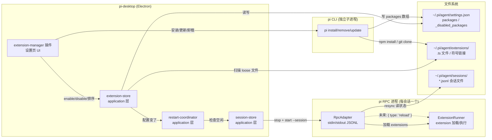

# Extension 动态管理与优雅重启

## 1 问题

pi 底座的 extension 在进程启动时一次性加载——pi 进程跑起来后，你往 `~/.pi/agent/extensions/` 丢一个新 `.ts` 文件，或者改了 `settings.json` 的 `packages` 数组，正在运行的 pi 完全不感知。用户要看到效果，只能重启 pi。这在交互式终端模式下不是大问题——用户本来就在终端前，Ctrl+C 再起一次就行。但在桌面端，pi 是被 spawn 管理的子进程，一个 session 对应一个进程，用户可能在多个 session 里同时工作，粗暴杀进程会丢正在跑的 tool execution 和流式输出。

桌面端需要一个能力：用户在 GUI 里增删改 extension 后，让受影响的 session 优雅地重载——不丢对话历史、不粗暴中断正在执行的操作、重载后新 extension 生效。这个能力不只是 extension 管理用得上，任何 `~/.pi/agent/` 下的配置变更（`settings.json`、`tools.json`、`models.json`）都面临同样的问题——配置变了，运行中的进程不感知。所以这套重启协调机制应该是一个通用能力，extension 管理只是它的第一个消费者。

### 1.1 核心矛盾：session 与进程的分离

pi-desktop 已经做了一件关键的事：把 session 和进程分离开了。session 是文件（JSONL，持久化在 `~/.pi/agent/sessions/`），进程是按需的临时工。看会话不用启 pi（直接读文件），发消息才按需 spawn pi 进程（`--session <path>` 续上下文）。一个 session 可以经历多个 pi 进程的生命周期——进程死了，session 文件还在；重启进程用同一个 `--session` 参数，对话上下文完整续上。

这个分离是优雅重启的前提。重启 pi 进程不等于丢失会话——对话历史在 JSONL 文件里，新进程启动后 resync 一次（发 `get_state` + `get_entries` + `get_messages` + `get_tree` + `get_commands` 五条 RPC 命令），整个状态就恢复了。用户视角的"会话"从未中断，只是底层换了个进程。

不可恢复的只有一种东西：**正在进行的 in-flight tool execution**。如果 pi 正在跑一个 bash 命令、正在流式输出一段代码，杀进程会丢这一段。这是进程级重启的固有代价，无法避免——除非 pi 底座自己支持不杀进程的热重载。

### 1.2 pi 底座已有的能力

在决定桌面端怎么做之前，得先搞清楚 pi 底座自己提供了什么。调研 pi SDK（`@earendil-works/pi-coding-agent`）的 `.d.ts` 类型定义，发现三个关键事实：

第一，pi 内部有 `ExtensionCommandContext.reload()` 方法（`core/extensions/types.d.ts:283`），注释写着 "Reload extensions, skills, prompts, themes, and context files"。它在 extension 的 slash command 上下文中可用，内部流程是：发 `session_shutdown(reason="reload")` 事件 → 清 extension cache（`clearExtensionCache()`）→ 重新 `discoverAndLoadExtensions` → 发 `session_start(reason="reload")` 事件。整个重载在同一个进程内完成，不杀进程、不丢对话上下文。这是最理想的 reload——零中断、零丢失。

第二，pi 有完整的 `PackageManager` 接口（`core/package-manager.d.ts`），提供 `installAndPersist`、`removeAndPersist`、`update`、`listConfiguredPackages`、`checkForAvailableUpdates` 等方法。这些方法内部做 npm install / git clone / 文件操作，同时维护 `settings.json` 的 `packages` 数组。pi CLI 的 `pi install`、`pi remove`、`pi update`、`pi list` 命令就是调这套 API。

第三，pi 有 `SettingsManager.reload()` 方法——重读 `settings.json`，不走 extension 重载。

### 1.3 RPC 协议的缺口

问题在于：这些能力都没暴露到 RPC 协议。桌面端通过 `pi --mode rpc` 启动 pi，用 JSONL 在 stdin/stdout 上收发 31 种 RPC 命令（`prompt`、`steer`、`abort`、`get_state`、`set_model` 等），但这 31 条里没有 `reload`，没有 `install_package`，没有 `list_packages`。桌面端没法通过 RPC 协议让运行中的 pi 重载 extension。

这意味着桌面端只能走两条路。第一条是进程级重启——杀掉旧 pi 进程，用同一个 `--session` 路径 spawn 新进程，新进程启动时自然加载最新的 extension 配置。第二条是等 pi 底座在 RPC 协议里加 `reload` 命令——到那时桌面端只需 `adapter.send({ type: "reload" })` 一行调用，不杀进程、不丢 in-flight。

本设计文档的方案是**两条路都走**：第一版做进程级重启（不依赖 pi 发版），同时把重启协调器的设计成"重启策略可切换"的——今天用进程重启，明天 pi 加了 reload RPC 命令，只换一个策略实现，协调器的 pending 追踪、空闲判定、批量重载逻辑一行不动。

## 2 pi extension 体系

要设计 extension 管理，得先彻底搞清楚 pi 底座的 extension 体系——extension 存在哪、怎么加载、怎么管理。这一节讲的是 pi 底座的现状，不是 pi-desktop 的设计。

### 2.1 两种存放机制

pi 的 extension 有两种存放方式，两者共存、互不排斥。

第一种是 `~/.pi/agent/extensions/` 目录下的 loose 文件。可以是单个 `.ts` 文件（如 `my-ext.ts`），直接放在这个目录里，pi 启动时用 jiti（即时 TypeScript 编译器）加载它。也可以是符号链接，指向别处的 package 目录（如 `my-pkg -> /Users/.../my-toolbox/packages/my-pkg`），pi 跟着链接找到 package 的 `package.json`，按 `pi.extensions` 字段定位 extension 入口。这个目录是"扔进来就能用"的快捷通道，不经过 settings.json。

第二种是 `~/.pi/agent/settings.json` 的 `packages` 数组。数组里放的是路径字符串或 npm/git source spec，如 `/Users/.../my-toolbox/packages/my-notify` 或 `@scope/some-package`。pi 启动时由 `DefaultPackageManager.resolve()` 解析这些 source——本地路径直接解析，npm spec 走 `npm install` 安装到受管目录，git spec 走 `git clone`——然后把每个 package 的 extension 入口路径收集起来，交给 `loadExtensions()` 加载。

enable/disable 的机制也是 settings.json 里两个数组：`packages`（启用）和 `_disabled_packages`（禁用）。一个 package 从 `packages` 移到 `_disabled_packages` 就被禁用了，反之启用。两个数组里都是同样的 source 字符串，区别只在放哪个数组。

### 2.2 三类 extension

从存放方式可以归纳出三类 extension，但它们在管理逻辑上是同一个抽象——都是一个 source 字符串，区别只在 source 的格式和 pi 底座的解析方式。

**一方 extension**：直接放在 `~/.pi/agent/extensions/` 目录下的 `.ts` 单文件。这是最轻量的形态——写一个 `.ts` 文件，`export default function (pi: ExtensionAPI) { ... }`，扔进 extensions 目录，下次启动 pi 就加载。不经过 settings.json 的 packages 数组，不经过 PackageManager 解析。这类 extension 的 enable/disable 不是移动 settings.json 数组，而是文件本身存在不存在——删掉文件就是 disable，放回来就是 enable。

**二方 extension**：本地路径形式的 package。可以是一个完整目录（含 `package.json` + `extension/index.ts`），通过符号链接或 `packages` 数组里的绝对路径引用。当前用户的 settings.json 里大部分是这种——指向开发中的 my-toolbox、my-multi-agent 等本地仓库。`packages` 数组里的 `/Users/user/self//Users/user/projects/my-toolbox/packages/my-pkg` 就是二方包。enable/disable 靠 `packages ↔ _disabled_packages` 移动。

**三方 extension**：npm 包或 git 仓库。`packages` 数组里放 `@scope/pkg-name` 或 `git+https://...`，pi 的 PackageManager 负责安装到 `~/.pi/agent/extensions/` 下的受管目录，然后从安装结果里收集 extension 入口。这类包可以被 `pi update` 更新、被 `pi remove` 卸载。enable/disable 同样靠 settings.json 的两个数组。

三者的统一抽象是：每个 extension 都有一个 source 字符串（文件路径、目录路径、npm spec 或 git URL），pi 的 PackageManager 能解析它、安装它、从它收集 extension 入口。桌面端管理的粒度就是 source——用户在 UI 里看到的是每个 extension 的名称、版本、描述、来源类型、启用状态，背后对应的是 source 字符串在 settings.json 里的位置（packages / _disabled_packages）或在 extensions 目录里的存在性。

### 2.3 pi CLI 包管理命令

pi 底座提供了完整的 CLI 包管理命令，这些命令内部调用 `DefaultPackageManager`：

| 命令 | 功能 | 对 settings.json 的影响 |
|------|------|------------------------|
| `pi install <source> [-l]` | 安装 extension source 并写入 settings | 添加到 `packages` 数组 |
| `pi remove <source> [-l]` | 从 settings 移除并卸载 | 从 `packages` 和 `_disabled_packages` 移除 |
| `pi update [source\|self\|pi]` | 更新单个或全部 extension | 不改 settings 结构 |
| `pi list` | 列出已配置的 packages | 只读 |
| `pi config [-l]` | TUI 界面管理 enable/disable | 移动 `packages ↔ _disabled_packages` |

`-l` 标志表示 project scope（写 project settings 而非 global settings），桌面端默认用 global scope。

这些命令是 pi 自己的实现，经过了完整测试——npm install 处理了 version pinning、scoped packages、private registry；git clone 处理了 SSH/HTTPS、branch/commit/tag、submodule；remove 处理了依赖清理、空目录回收。桌面端不需要重新实现这些逻辑，spawn `pi install/remove/update` 就行。这是"手写收敛到成熟包"原则的直接应用——pi 的 PackageManager 就是那个成熟包，桌面端是它的消费者。

### 2.4 pi 内部 API

除了 CLI 命令，pi SDK 的 `.d.ts` 还暴露了更细粒度的 API。这些 API 当前桌面端用不到（因为不直接 import pi SDK），但它们是理解 pi 能力边界的依据，也决定了未来 RPC 协议扩展的形状。

`ExtensionRunner`（`core/extensions/runner.d.ts`）是 extension 的运行时管理器。它持有一组已加载的 extension 实例，负责事件分发、工具注册、命令调度。它的 `bindCore()` 方法接收一个 `ReloadHandler`（`() => Promise<void>`），这个 handler 就是 `ExtensionCommandContext.reload()` 的底层实现。RPC 模式下 pi 进程内部会 bind 这个 handler，但 RPC 协议没有命令去触发它。

`AgentSessionRuntime`（`core/agent-session-runtime.d.ts`）是 session 级别的运行时。它管理当前 session 的 AgentSession 实例，提供 `switchSession`、`newSession`、`fork` 等方法。这些方法对应 RPC 的 `switch_session`、`new_session`、`fork` 命令。但 `reload()` 没有对应的 RPC 命令——它只在 slash command 上下文里可用，而 RPC 模式不走 slash command。

`DefaultPackageManager`（`core/package-manager.d.ts`）实现了 `PackageManager` 接口。它的 `resolve()` 方法扫描 settings.json 的 `packages` 数组，对每个 source 做安装/解析，返回 `ResolvedPaths`——包含 extensions、skills、prompts、themes 四类资源的路径列表。`listConfiguredPackages()` 返回 `ConfiguredPackage[]`，每项包含 source、scope、filtered 标记、安装路径。`checkForAvailableUpdates()` 返回可更新的 package 列表。这些 API 的形状就是未来 RPC 协议扩展的参考——如果 pi 要加 `list_packages` RPC 命令，返回结构大概率就是 `ConfiguredPackage[]`。

### 2.5 桌面端与 pi 的交互路径

桌面端和 pi 底座之间有三条交互路径，每条路径的适用场景不同：

**RPC 通道**（`gateway/rpc-adapter.ts`）：桌面端 spawn `pi --mode rpc` 子进程，通过 stdin/stdout 收发 JSONL 消息。这是 session 操作的主通道——发 prompt、收事件流、查询状态、切换模型全部走这里。31 种 RPC 命令覆盖了 session 生命周期的所有操作，但不含 extension 管理和 reload。

**CLI 通道**（`shell/electron-main/` spawn `pi install/remove/update`）：桌面端可以 spawn `pi` CLI 命令做包管理。这走的是另一个子进程，不是 session 的 RPC 进程。`pi install @scope/pkg` 内部跑 `npm install`、写 settings.json、返回。这个通道是同步的、阻塞的——安装完成后桌面端拿到退出码，知道成功还是失败。与 session 的 RPC 进程完全独立，不影响正在运行的会话。

**文件通道**（`application/pi-settings/pi-settings-store.ts`）：桌面端直接读写 `~/.pi/agent/settings.json`。pi-settings-store 已经有 `get()` 和 `set(patch)` 方法，用 `withDirLock` 串行化防并发写、用 `deepMergeJson` 做深合并。enable/disable（移动 packages ↔ _disabled_packages）和排序（调整 packages 数组顺序）走这条通道——不需要 spawn pi CLI，直接改文件更快，而且 settings.json 是 pi 的标准契约，桌面端写标准字段不算重复领域知识。

三条路径的分工：extension 的 enable/disable/排序走文件通道（快、不 spawn 进程）；安装/更新/卸载走 CLI 通道（复用 pi 的成熟包管理逻辑）；配置变更后通知 session 重载——通过 restart-coordinator 协调，当前走进程级重启，未来 pi 加了 reload RPC 命令后切到 RPC 通道。



**图 1 — 桌面端与 pi 底座的三条交互路径**。文件通道改配置、CLI 通道装包、RPC 通道管 session。restart-coordinator 监听配置变更，协调 session 进程的优雅重启。

## 3 通用重启协调器

### 3.1 为什么不是 extension 专用

表面上看，重启是因为 extension 变了。但如果退一步看——"配置变了，运行中的进程不感知"这个问题，extension 变更只是触发源之一。

`settings.json` 的任何字段都可能变：用户改了 `defaultProvider`，pi 进程启动时读的是旧值；改了 `compaction.enabled`，运行中的进程不知道；改了 `packages` 数组（extension 增删改），同样不感知。`tools.json` 变了，pi 进程启动时加载的工具配置是旧的。甚至 `models.json` 变了，虽然 `set_model` 是 RPC 命令可以热切，但 models 列表本身是启动时加载的。

如果为 extension 专门写一个"extension 变了 → 重启 session"的机制，明天 settings 变了又得写一个、tools 变了再写一个——三个入口各写一遍几乎相同的逻辑（检测变更 → 标记 pending → 等空闲 → 重启）。这正是 CLAUDE.md §1.1 判别气味三说的"同一逻辑在多个外部入口各写一遍"。

所以重启协调应该是一个通用能力：任何人改了 `~/.pi/agent/` 下的任何配置文件，都可以通知协调器"配置变了，受影响的 session 需要重载"。协调器不关心是什么变了——它的职责是追踪哪些 session 需要 pending restart、判断它们什么时候空闲、执行重启。extension-manager 只是第一个消费者，后续 pi-settings 插件改 settings.json、未来任何配置变更插件，都走同一个协调器。

### 3.2 RestartCoordinator 接口设计

```typescript
// domain/restart.ts — 圆心类型定义，零依赖

/** 一个 session 的重启状态。 */
export type RestartState =
  | { status: "idle" }                           // 不需要重启
  | { status: "pending"; reason: string; ts: number }  // 标记了待重启
  | { status: "restarting" }                     // 正在重启中
  | { status: "failed"; error: string };         // 上次重启失败

/** 重启协调器接口（application 拥有，shell 注入实现）。 */
export interface RestartCoordinator {
  /** 标记某 session 需要重载。reason 是人类可读的变更原因（如 "extension 配置变更"）。 */
  markPending(sessionKey: string, reason: string): void;

  /** 批量标记多个 session。 */
  markPendingAll(sessionKeys: string[], reason: string): void;

  /** 查某 session 的重启状态。 */
  getState(sessionKey: string): RestartState;

  /** 查某 session 是否安全重启（空闲 = 不在 streaming、不在 compacting）。 */
  isIdle(sessionKey: string): boolean;

  /** 执行重启。策略由实现决定：进程级重启 or RPC reload。 */
  restart(sessionKey: string): Promise<void>;

  /** 批量重启所有空闲的 pending session。流式中的等 agentSettled 后自动重载。 */
  restartIdlePending(): Promise<void>;

  /** 订阅重启状态变更（UI 用来更新待重载浮层）。 */
  onStateChange(cb: (sessionKey: string, state: RestartState) => void): () => void;
}
```

这个接口设计遵循几个原则。

**接口定义在圆心（`domain/`），实现在 application 层**。圆心只有类型定义，零依赖。`RestartCoordinator` 接口和 `RestartState` 类型在 `domain/restart.ts` 定义，实现在 `application/restart/restart-coordinator.ts`。session-store 持有这个接口的实例，不持有具体实现——依赖倒置，换实现不用改 session-store。

**`restart()` 的策略可切换**。接口只声明"执行重启"，不规定重启方式。第一版实现是进程级重启（`stop → start --session → sync`），未来 pi 加了 reload RPC 命令，换一个实现（`adapter.send({ type: "reload" })`），接口和协调逻辑一行不动。这是开闭原则——重启策略的变化通过扩展实现实现，不修改已有协调逻辑。

**`isIdle()` 的判定委托给 session-store**。协调器接口上有 `isIdle(sessionKey)`，但它的实现只是转发调用 `sessionStore.isBusy(sessionKey)` 取反——真正的 busy/idle 状态由 session-store 拥有和追踪。这样设计是因为 session-store 已经在 `dispatch()` 方法里处理事件流，它是每个 session 实时状态的唯一真相源，在两个地方分别追踪只会漂移。

session-store 的 `isBusy()` 返回 true 当且仅当以下任一条件成立：

- `isStreaming` 为 true——agent 正在生成回复（收到 `agentStart` 到收到 `agentSettled` 之间）
- `isCompacting` 为 true——正在压缩上下文（收到 `compactionStart` 到 `compactionEnd` 之间）

`isStreaming` 覆盖了 agent 循环的整个活跃期，包括 tool execution——pi 在执行 tool 时 `isStreaming` 仍然是 true（agent 循环没结束）。所以 `isStreaming=false` 隐含了"没有 in-flight tool execution"——tool 执行是 agent 循环的一部分，agent 循环没结束 `isStreaming` 就不会变 false。这就是为什么检查 `isStreaming` 和 `isCompacting` 就足以判断是否安全重启：两者都为 false 意味着 agent 循环完全结束、没有压缩在进行，此时杀进程不会丢任何 in-flight 操作。

session-store 内部用一个 `Map<sessionKey, boolean>` 追踪 busy 状态——在 `dispatch()` 里收到 `agentStart` 设 true、收到 `agentSettled` 设 false、收到 `compactionStart` 设 true、收到 `compactionEnd` 设 false。

### 3.3 空闲判定与事件驱动

空闲判定不能靠轮询。CLAUDE.md §3.6 说得很清楚——轮询是空转烧 CPU，固定 sleep 是对时序竞争的赌注。正确做法是事件驱动：session-store 已经在 `dispatch()` 方法里处理事件流，它知道每个 session 的实时状态。

具体方案是 session-store 暴露一个 `isBusy(sessionKey)` 方法（协调器的 `isIdle()` 转发调用它取反），基于它内部追踪的事件流状态：

- 收到 `agentStart` 事件 → 标记 busy（agent 循环开始，涵盖 streaming 和 tool execution）
- 收到 `agentSettled` 事件 → 标记 idle（agent 循环完全结束，包括自动重试和队列消息处理完毕）
- 收到 `compactionStart` → 标记 busy（压缩进行中）
- 收到 `compactionEnd` → 标记 idle（压缩完成）

这些事件都是 pi 底座在 agent 循环的关键节点推送的。`agentStart` 在每轮 agent 循环开始时触发，`agentSettled` 在 agent 循环完全结束、所有自动重试和队列消息处理完毕后触发。`agentSettled` 是比 `agentEnd` 更安全的"空闲"信号——`agentEnd` 可能在自动重试前触发，此时 agent 并没有真正空闲。

restart-coordinator 的事件驱动流程是这样的：

1. 有人调了 `markPending(sessionKey, reason)` → 协调器把这个 session 标记为 pending
2. 协调器检查 `sessionStore.isBusy(sessionKey)` → 如果空闲，立即执行 `restart(sessionKey)`
3. 如果 busy → 协调器通过 `sessionStore.onSessionEvent(sessionKey, cb)` 订阅这个 session 的事件流，过滤 `agentSettled` 事件
4. 收到 `agentSettled` → 取消订阅，执行 `restart(sessionKey)`
5. 重启完成后 → 广播 `onStateChange(sessionKey, { status: "idle" })`，UI 更新

这个流程不需要轮询，不需要 sleep。pending 的 session 要么立即重启（如果恰好空闲），要么等下一个 `agentSettled` 事件（如果正在忙）。最坏情况是 session 一直忙——但这种情况用户可以在 UI 里点"立即重载"强制重启，接受 in-flight 丢失。

### 3.4 进程级重启策略

第一版的 `restart()` 实现，调用 session-store 自己的 `restart()` 方法——它内部是 `stop + start + sync` 的组合：

```typescript
// application/restart/process-restart-strategy.ts

async restart(sessionKey: string): Promise<void> {
  // 委托给 session-store 自己的 restart 方法
  // session-store 最清楚自己的进程状态和怎么操作
  await this.sessionStore.restart(sessionKey);
}
```

session-store 的 `restart(sessionKey)` 内部做三件事：

1. **停旧进程**：`stop(sessionKey)` → 关 stdin → 等 1 秒 → SIGTERM → 等 2 秒 → SIGKILL（`PiSubprocessHandle.stop()` 的 kill 策略）。pi 的 session-manager 在收到 stdin EOF 时会持久化当前 session 状态到 JSONL 文件
2. **起新进程**：`start(cwd, boundSessionPath)` → `factory.create({ cwd, args: ["--session", path] })` → spawn `pi --mode rpc --session <path>` → `adapter.start()` → `waitReady()` → `sync()`。如果 `boundSessionPath` 为 null（新会话未落盘），不传 `--session` 参数——pi 进程作为全新会话启动，不续上下文。这种情况意味着新会话的"重启"实际上是"丢弃当前进程再建一个全新会话"，in-flight 内容丢失但这是新会话的预期行为（新会话还没落盘就没有需要恢复的历史）。
3. **拉全量状态**：`sync()` 并发发 5 条 RPC 命令（`get_state` + `get_entries` + `get_tree` + `get_commands` + `get_messages`），组装成 `SyncSnapshot`，广播给 renderer 的 session-store。renderer 的 store 用新基线重建视图

**renderer 事件流在重启期间的连续性**：renderer 订阅的 `session:event` 和 `session:snapshot` IPC 通道绑定的是 main 进程的 session-store，不是 pi 子进程。`stop()` 杀旧进程时，session-store 的事件监听自然停止（adapter 死了），但 IPC 通道不会断——session-store 还活着。`start()` 起新进程后，session-store 绑新 adapter 的事件监听，事件流自动恢复。中间 1-2 秒的 gap 里，renderer 收不到新事件，但已有的消息列表不会被清空——它在 renderer 的 zustand store 里保留着，直到 `sync()` 推送新基线时被整体替换。用户视角上看到的是：对话暂停 1-2 秒，然后刷新到最新状态，没有"空白闪烁"。

### 3.5 未来切换到 RPC reload

当 pi 底座在 RPC 协议里加了 `{ type: "reload" }` 命令后，切换极简。rpc-types.ts 的 `RpcCommand` 联合类型加一个分支：

```typescript
| { id?: string; type: "reload" }
```

rpc-adapter 的 `handleLine()` 不需要改——它已经把非 response、非 extension_ui 的行当 event 转发。pi 底座收到 `reload` 命令后，内部执行 `ExtensionRunner.reloadHandler`，完成后推一个 `session_start(reason: "reload")` 事件。

restart-coordinator 的 `restart()` 实现换成：

```typescript
async restart(sessionKey: string): Promise<void> {
  // 不杀进程，发 reload 命令给 session 的 RPC adapter
  const { adapter } = this.sessionStore.getProc(sessionKey);
  if (!adapter || !adapter.alive) return;

  await adapter.send({ type: "reload" });

  // pi 内部:session_shutdown(reason=reload) → clearExtensionCache
  //   → discoverAndLoadExtensions → session_start(reason=reload)
  // 桌面端收到 session_start 事件后自动 sync 拿新基线
}
```

两种策略的差异：

| 维度 | 进程级重启 | RPC reload |
|------|-----------|------------|
| 对话历史 | 不丢（session 文件保留） | 不丢（进程没死） |
| in-flight tool | **丢失**（杀进程） | **不丢**（内部 teardown+reload 同步） |
| 中断时间 | 1-2 秒（spawn + waitReady + sync） | <100ms（进程内重载） |
| 新 extension 生效 | 是（新进程加载新配置） | 是（内部重新 discover+load） |
| 依赖 pi 发版 | 否 | 是（需要 pi 加 RPC 命令） |

切换点只在 `restart()` 方法内部——协调器的 pending 追踪、空闲判定、事件驱动逻辑完全不变。这是策略模式的直接应用：同一个协调接口，两种重启策略，按可用能力选择。

## 4 Extension 管理

### 4.1 统一抽象

三类 extension（一方 loose .ts 文件、二方本地路径、三方 npm/git 包）在桌面端的管理逻辑高度一致：都有一个 source、一个启用状态、一个在列表里的位置。差异只在"怎么发现"和"怎么安装/卸载"——发现逻辑分三路，但发现之后它们在列表里的呈现和操作完全统一。

统一抽象是 `ExtensionInfo`：

```typescript
// domain/extensions.ts — 圆心类型，零依赖

/** extension 来源类型。 */
export type ExtensionSource = "file" | "local" | "npm" | "git";

/** extension 在列表中的呈现信息。 */
export interface ExtensionInfo {
  /** source 字符串（文件路径、目录路径、npm spec、git URL） */
  source: string;
  /** 从 package.json 解析出的名称，loose .ts 文件用文件名 */
  name: string;
  /** 版本号，loose .ts 文件无 */
  version?: string;
  /** 描述，从 package.json description 字段 */
  description?: string;
  /** 来源类型 */
  sourceType: ExtensionSource;
  /** 是否启用 */
  enabled: boolean;
  /** 来源目录：extensions/ 目录还是 settings.json packages */
  origin: "extensions-dir" | "settings-packages";
}
```

`origin` 字段区分了两种存放机制。`extensions-dir` 的是 loose .ts 文件（一方），`settings-packages` 的是 settings.json packages 数组里的（二方 + 三方）。这个字段决定了 enable/disable 的操作方式：extensions-dir 的靠文件存在性，settings-packages 的靠数组移动。

### 4.2 发现

发现要做两件事：扫描 `~/.pi/agent/extensions/` 目录拿 loose 文件，读 `settings.json` 的 `packages` 和 `_disabled_packages` 数组拿配置的包。两者合并成一个统一的 `ExtensionInfo[]` 列表。

**扫描 extensions 目录**（一方 extension）：

遍历 `~/.pi/agent/extensions/` 的一层子条目（不递归）。每个条目可能是：
- `.ts` 文件 → 直接是一个 extension，name 取文件名（去掉 `.ts`），sourceType 为 `"file"`，origin 为 `"extensions-dir"`
- 目录 → 看它是不是符号链接，如果是，读链接目标的 `package.json`；如果是普通目录，读自己的 `package.json`。从 `package.json` 的 `name`、`version`、`description` 拿元数据。`package.json` 里的 `pi.extensions` 字段确认它是个 pi extension package——这个字段是一个字符串数组，如 `["./extension"]`，每个元素指向一个 extension 入口目录（相对 package 根的路径）。pi 的 `PackageManager.resolve()` 读这个字段定位 extension 入口。sourceType 为 `"local"`，origin 为 `"extensions-dir"`

这类 extension 的 enabled 状态：文件/目录存在就是 enabled，不存在就是 disabled。enable 操作 = 放回文件，disable 操作 = 移到 `extensions/.disabled/` 子目录（不直接删——用户可能还要 enable 回来）。

**读 settings.json**（二方 + 三方 extension）：

读 `settings.json` 的 `packages` 数组（enabled）和 `_disabled_packages` 数组（disabled）。每个元素是一个 source 字符串。对每个 source 判断类型：
- 以 `/` 开头或包含路径分隔符且不是 npm scope → 本地路径（`sourceType: "local"`）
- 以 `@` 开头且包含 `/` → npm scoped package（`sourceType: "npm"`）
- 以 `git+` 开头或以 `.git` 结尾 → git 仓库（`sourceType: "git"`）
- 其他 → 当作 npm package（`sourceType: "npm"`）

对本地路径的 source，可以直接读那个路径下的 `package.json` 拿 name/version/description。对 npm/git source，解析 source spec 拿包名（`@scope/pkg` 的 `@scope/pkg`），version 和 description 要么从安装目录的 `package.json` 读（如果 PackageManager.install 过），要么暂时留空——安装信息在 `pi list` 命令的输出里更全，可以 spawn `pi list` 拿。

**合并与排序**：

两个来源的 ExtensionInfo 合并成一个列表。列表的顺序就是 `settings.json` 的 `packages` 数组顺序（extensions-dir 的 loose 文件排在最后，因为它们不参与 packages 数组的排序）。UI 拖拽排序改的是 `packages` 数组的顺序——extensions-dir 的 loose 文件不参与拖拽排序（它们不在数组里）。

### 4.3 enable/disable

根据 `origin` 不同走两条路径：

**settings-packages 的 enable/disable**：

在 `packages` 和 `_disabled_packages` 两个数组之间移动 source 字符串。enable = 从 `_disabled_packages` 移到 `packages`，disable = 从 `packages` 移到 `_disabled_packages`。

数组操作在 extension-store 的内存里完成——先读当前 settings.json 拿到两个数组的当前内容，在内存中做"从 A 删、往 B 加"的元素移动，然后把修改后的完整数组写回。写回时调 pi-settings-store 的 `set()` 方法，传入 `{ packages: [...完整的新数组], _disabled_packages: [...完整的新数组] }`。`set()` 内部走 `deepMergeJson`——它在**对象层级**做深合并（传入的 `packages` 和 `_disabled_packages` 字段替换 settings.json 里的同名字段，不碰其他配置字段），数组本身是整体替换不是按索引合并。这样 extension-store 在内存里做数组元素操作，`set()` 负责安全地写回文件（`withDirLock` 串行化防并发写撕裂 + 锁内重读防读-改-写竞态）。

**extensions-dir 的 enable/disable**：

一方 loose .ts 文件的 enable/disable 靠文件移动。disable = 把 `extensions/my-ext.ts` 移到 `extensions/.disabled/my-ext.ts`；enable = 移回来。用 `.disabled/` 子目录而不是删文件——因为用户可能要 enable 回来，删了就没了。pi 底座不会扫描 `.disabled/` 子目录（它只扫一层），所以移到那里的 extension 不会被加载。

符号链接指向的 package 目录的 enable/disable 同理——把符号链接本身移到 `.disabled/` 目录。符号链接的目标不动（那是用户自己的代码仓库）。

enable/disable 操作完成后，通知 restart-coordinator：这个 session 的 extension 配置变了，需要 pending restart。

### 4.4 排序

`settings.json` 的 `packages` 数组顺序就是 UI 列表里的拖拽顺序。用户在 UI 里拖拽一个 extension 从位置 3 到位置 1，桌面端在 `packages` 数组里把那个 source 字符串从索引 3 移到索引 0，写回 `settings.json`。

排序操作只影响 `packages` 数组（enabled 的），`_disabled_packages` 数组的顺序不重要（disabled 的不展示顺序）。extensions-dir 的 loose 文件不参与排序（它们不在 packages 数组里，固定排在列表末尾）。

排序完成后不需要触发 restart——数组顺序不影响 extension 的加载行为（pi 不关心 packages 数组里的顺序，它只关心哪些 source 在里面）。排序操作走的是 `reorderExtensions()` 方法，和 `enableExtension()`/`disableExtension()` 是不同的调用路径——extension-store 知道这次只改了顺序，不触发 `onConfigChanged` 回调，不通知 restart-coordinator。

### 4.5 安装

安装走 CLI 通道：spawn `pi install <source>`。pi 的 `DefaultPackageManager.installAndPersist()` 内部做三件事——解析 source spec（npm/git/本地路径）、执行安装操作（npm install / git clone / 直接用路径）、把 source 写入 settings.json 的 `packages` 数组。

桌面端的安装流程：

1. 用户在 UI 里选来源类型（npm 包 / git 仓库 / 本地路径）并输入 source
2. 桌面端 spawn `pi install <source>`，捕获 stdout/stderr
3. pi CLI 内部：npm install 或 git clone 到受管目录 → 写 settings.json
4. 进程退出后检查退出码：0 = 成功，非 0 = 失败（stderr 给出原因）
5. 成功后重新扫描列表（`scanExtensions()`），通知 restart-coordinator

安装是异步的——npm install 可能要几秒到几十秒（取决于包大小和网络），git clone 同理。UI 需要展示进度。pi CLI 的输出是行式的 npm/git 进度文本，桌面端直接转发给 UI 展示。安装完成后刷新列表。

三种 source 格式的处理由 pi CLI 统一——桌面端不判断 source 是 npm 还是 git，全交给 `pi install`。如果 source 格式不合法，pi CLI 会报错退出，桌面端展示错误信息。

### 4.6 更新与卸载

**更新**：spawn `pi update <source>` 更新单个 extension，或 `pi update --all` 更新全部。pi 的 `DefaultPackageManager.update()` 内部对 npm 包跑 `npm update`、对 git 仓库跑 `git pull`。更新完成后重新扫描列表拿新的 version，通知 restart-coordinator。

**卸载**：spawn `pi remove <source>`。pi 的 `DefaultPackageManager.removeAndPersist()` 内部做三件事——从 settings.json 的 `packages` 和 `_disabled_packages` 移除 source、删安装目录（npm 包删 node_modules 里的、git 仓库删 clone 目录）、清理空目录。卸载完成后重新扫描列表，通知 restart-coordinator。

对于 extensions-dir 的 loose .ts 文件，卸载 = 删文件。符号链接的卸载 = 删符号链接（不删目标目录）。卸载和 disable 的区别在于：disable 把文件移到 `.disabled/` 子目录保留着、可以再 enable 回来；卸载直接删文件、不可恢复。两个操作都不影响 `.disabled/` 里已有的文件——disable 移进去的文件不会被卸载删除，只能通过 enable 移回来再卸载。

### 4.7 变更触发重启链路

所有 extension 管理操作（enable/disable/安装/卸载/更新）完成后，都会通知 restart-coordinator。通知的内容是"extension 配置变了"，不是具体变了什么——协调器不需要知道哪个 extension 增删改了，它只需要知道"这个 session 的 pi 进程加载的 extension 可能过时了，需要重载"。

通知方式是调用 `restartCoordinator.markPending(sessionKey, "extension 配置变更")`。如果有多个 session 在运行（多会话多进程），全部标记 pending——因为所有 session 共享同一个 `~/.pi/agent/` 配置目录，extension 变更影响所有 session。

restart-coordinator 收到 markPending 后，按 §3.3 的流程：检查每个 session 是否空闲，空闲的立即重启，忙的等 `agentSettled`。UI 通过 `onStateChange` 订阅状态变更，更新"待重载"浮层。

## 5 UI 设计

### 5.1 统一列表

设置页的新 tab，标题 "Extensions"，贡献 `settings` 槽位，`order` 设在 Pi 管理（order: 0）和模型管理之间。

列表是唯一的交互容器——不分"已启用"和"已禁用"两块，所有 extension 在同一个列表里，通过 toggle 切换状态。这样用户不用在两个区域之间来回切，点一个 toggle 就完事。

每个列表项的布局：

```
┌──────────────────────────────────────────────────────────┐
│ ☰  read-claude-md            v0.1.0  [npm]       [ON]   │
│    自动加载 CLAUDE.md 进上下文                           │
└──────────────────────────────────────────────────────────┘
```

- `☰` 拖拽手柄：鼠标按住拖拽改顺序（改 packages 数组顺序）。只有 settings-packages 来源的 extension 可以拖拽，extensions-dir 的 loose 文件不参与排序，固定在末尾
- 名称：加粗，从 package.json 的 name 字段拿
- 版本号：灰色小字，从 package.json version 字段拿
- 来源标签：`[npm]` `[git]` `[local]` `[.ts]`，从 sourceType 映射
- 描述：灰色小字，从 package.json description 字段拿，没有就不显示
- `[ON]/[OFF]` toggle：点击切换 enable/disable 状态

### 5.2 搜索与翻页

列表顶部有搜索框和排序选择器。搜索过滤名称和描述（不区分大小写的子串匹配）。排序有三个选项：手动（拖拽顺序，默认）、名称（字母序）、来源类型（分组）。搜索和排序在客户端做——extension 列表通常几十个，不需要服务端搜索。

翻页每页 8 条。底部页码 `‹ 1 2 3 ›`，显示总数。翻页是纯前端状态——切换页面不发 IPC 请求，只是切片渲染。搜索时自动回到第一页。

### 5.3 待重载浮层

列表底部固定一个浮层（不随列表滚动），当有 pending restart 的 session 时显示：

```
┌─ 待重载 ──────────────────────────────────────────┐
│  ⚠ 2 个会话需要重载使配置生效                    │
│  ● 前端重构  [空闲]  [重载]                     │
│  ● api调试   [流式中] 等待空闲…                   │
│                          [全部重载] [关闭]      │
└──────────────────────────────────────────────────┘
```

每个 session 一行，显示会话名和状态。空闲的可以直接点"重载"按钮——调 `restartCoordinator.restart(sessionKey)`。流式中的显示"等待空闲…"——restart-coordinator 会在 `agentSettled` 后自动重载，不需要用户盯着。"全部重载"按钮对所有空闲的 session 批量执行 `restartIdlePending()`。"关闭"关掉浮层，但 pending 状态不丢——下次用户切回这个设置页，浮层还在。

### 5.4 安装入口

列表上方有一个"添加"区域：

```
┌─ 添加扩展 ──────────────────────────────────────┐
│  来源  [npm 包 ▾]   ┌──────────────────────────┐ │
│                     │ @scope/pkg 或 git-url     │ │
│                     └──────────────────────────┘ │
│                                           [安装] │
└──────────────────────────────────────────────────┘
```

来源下拉选 npm 包 / git 仓库 / 本地路径，默认 npm 包。输入框根据来源类型给 placeholder。点"安装"后，输入框下方展示安装进度（pi CLI 的 stdout 输出），安装完成后列表自动刷新，新 extension 出现在列表末尾。

安装过程中输入框和安装按钮禁用，防止重复提交。安装失败展示错误信息，输入框恢复可用。

### 5.5 更新与卸载操作

每个列表项在 hover 时展示操作按钮（除了 toggle 之外）：

- **[更新]**：spawn `pi update <source>`，展示进度。只对 npm/git 来源的 extension 显示（local 和 file 来源没有"更新"概念——它们的更新就是用户自己改代码）
- **[卸载]**：弹确认框"确定卸载 xxx？"，确认后 spawn `pi remove <source>`。卸载完成后从列表移除

这两个操作不在低保真图里画了——它们是列表项的 hover 行为，和 toggle 一样是行内操作。

## 6 分层落地

### 6.1 domain 层

**`domain/extensions.ts`**：`ExtensionInfo`、`ExtensionSource` 类型定义。零依赖纯类型。

**`domain/restart.ts`**：`RestartState` 联合类型、`RestartCoordinator` 接口。零依赖纯类型。

两个文件都是圆心契约——只有类型定义，没有实现，不 import 任何外部包。外层（application、shell、plugins）要引用就从 `packages/core` re-export import。

### 6.2 application 层

**`application/extensions/extension-store.ts`**：extension 发现和 CRUD。

发现逻辑：`scanExtensions(agentDir)` → 扫描 extensions 目录 + 读 settings.json 两个数组 → 返回 `ExtensionInfo[]`。enable/disable：`enableExtension(agentDir, source)` / `disableExtension(agentDir, source)` → 根据 origin 走文件移动或 settings.json 数组移动。排序：`reorderExtensions(agentDir, sources[])` → 重写 settings.json 的 packages 数组顺序。

这个模块依赖 `pi-settings-store`（读写 settings.json）、`config-file.ts`（文件锁和 JSON 读写原语）、`node:fs`（扫描目录）。不依赖 electron、不依赖 React。

**`application/restart/restart-coordinator.ts`**：`RestartCoordinator` 接口的实现。

持有 session-store 的引用（通过依赖倒置接口，不直接 import session-store 具体类）。这个接口在圆心定义：

```typescript
// domain/restart.ts — 追加到圆心

/** restart-coordinator 需要的 session-store 能力面（依赖倒置）。 */
export interface SessionStoreForRestart {
  /** 查某 session 是否忙碌（streaming 或 compacting）。 */
  isBusy(sessionKey: string): boolean;
  /** 订阅某 session 的事件流，返回取消订阅函数。 */
  onSessionEvent(sessionKey: string, cb: (event: SessionEvent) => void): () => void;
  /** 拿所有有活跃进程的 session key。 */
  getRunningSessionKeys(): string[];
  /** 执行进程级重启（stop + start + sync）。 */
  restart(sessionKey: string): Promise<void>;
  /** 拿 session 的 cwd 和 sessionPath（restart 用）。 */
  getCwdAndSessionPath(sessionKey: string): { cwd: string; sessionPath: string | null };
}
```

session-store 实现这个接口（已有方法补齐 `isBusy` / `onSessionEvent` / `getRunningSessionKeys` / `restart` 即可）。协调器构造时收 `SessionStoreForRestart`，shell 负责把 session-store 注入。维护一个 `Map<sessionKey, RestartState>` 追踪每个 session 的重启状态。`markPending()` 打标记，`isIdle()` 调 `!sessionStore.isBusy()`，`restart()` 调 `sessionStore.restart()`。

**`application/restart/process-restart-strategy.ts`**：进程级重启策略实现。

这是一个可替换的策略模块——`restart()` 的具体实现。未来加 RPC reload 策略时，新增一个 `rpc-reload-strategy.ts`，切换注入即可。

### 6.3 gateway 层

**`gateway/protocol/rpc-types.ts`**：预留 `reload` 命令。

在 `RpcCommand` 联合类型里加一个分支 `| { id?: string; type: "reload" }`。这个改动在 pi 底座加 RPC reload 命令之前不会有任何效果——pi 进程收到未识别的命令会返回 error response。加这个分支只是让协议类型定义前瞻性地包含 reload，未来 pi 支持后不需要改 gateway 类型。

当前不实现 reload 的发送逻辑——等 pi 底座支持后再在 restart-coordinator 里切换策略。

### 6.4 shell 层

**`shell/electron-main/index.ts`** 新增 IPC 通道：

```
extension:list          → scanExtensions(agentDir)
extension:enable         → enableExtension(agentDir, source)
extension:disable        → disableExtension(agentDir, source)
extension:reorder        → reorderExtensions(agentDir, sources[])
extension:install        → spawn pi install <source>（流式输出进度）
extension:update         → spawn pi update <source>
extension:remove         → spawn pi remove <source>
restart:pendingSessions  → 查 restartCoordinator 的 pending 列表
restart:restart          → restartCoordinator.restart(sessionKey)
restart:restartAllIdle   → restartCoordinator.restartIdlePending()
restart:subscribe        → 注册 restartCoordinator.onStateChange 监听
                           main 进程用 webContents.send("restart:state", key, state) 推给 renderer
```

**restart 状态推送到 renderer 的完整链路**：restart-coordinator 在 main 进程，它的 `onStateChange(cb)` 是 main 进程内的回调。main 进程的 IPC handler 注册一个 `onStateChange` 监听，每当状态变了就 `webContents.send("restart:state", sessionKey, state)` 推给所有窗口。renderer 端的 `window.pi.restart.onStateChange(callback)` 经 preload 暴露——内部用 `ipcRenderer.on("restart:state", ...)` 收到推送后调 callback。extension-manager 插件的 React 组件用 `useEffect` + `window.pi.restart.onStateChange` 订阅，状态变化时 `setState` 触发重渲染，更新待重载浮层。

**跨窗口状态同步**：extension 列表的变更也需要同步到其他窗口。`extension:list` IPC 每次调用都重新扫描，不做客户端缓存——窗口 A enable 了一个 extension 后刷新自己的列表，窗口 B 切回设置页时 `extension:list` 重扫拿到最新列表。更主动的同步可以用 `webContents.send("extension:changed")` 广播给所有窗口让它们刷新，第一版不做——靠用户切页时自然刷新就够了。

**`shell/electron-main/preload.ts`**：在 `window.pi` 上暴露 extension 和 restart API。

### 6.5 plugins 层

**`plugins/extension-manager/`**：设置页插件。

```
plugin.json:
{
  "id": "extension-manager",
  "version": "0.1.0",
  "displayName": "Extension 管理",
  "renderer": "./renderer/index.tsx",
  "contributes": {
    "settings": [{
      "id": "extensions",
      "title": "Extensions",
      "component": "ExtensionManagerPage",
      "saveMode": "manual",
      "order": 1
    }]
  }
}
```

`saveMode: "manual"` — extension 管理不需要框架的 save/dirty 机制（改了立即生效，不弹保存浮层）。

renderer/index.tsx 是一个 React 组件，从 `@pi-desktop/react` 拿 `usePiApi`、`registerSettingsComponent`、`SettingsSection`、`ListItem`。调 `window.pi.extension.*` 拿数据，调 `window.pi.restart.*` 管理重启。UI 交互逻辑全部在这个文件里——列表渲染、拖拽排序、搜索过滤、翻页、安装表单、待重载浮层。

插件只 import `@pi-desktop/react` 和 `@pi-desktop/core`，不 import 内层。删掉这个插件，内核照常运行，设置页少一个 tab。

### 6.6 session-store 的改动

session-store 需要暴露几个东西给 restart-coordinator：

**`getCwdAndSessionPath(sessionKey)`**：让 restart-coordinator 能拿到 session 的 cwd 和 boundSessionPath。不直接暴露 adapter（那是 gateway 层的东西），返回 `{ cwd: string; sessionPath: string | null }`。

**`isBusy(sessionKey)`**：基于事件流状态返回 true/false。session-store 的 `dispatch()` 方法已经在处理事件流，它知道当前 session 是在 streaming 还是 idle。加一个 `Map<sessionKey, boolean>` 追踪 busy 状态——`agentStart` 设 true、`agentSettled` 设 false、`compactionStart` 设 true、`compactionEnd` 设 false。协调器的 `isIdle(sessionKey)` 直接调 `!sessionStore.isBusy(sessionKey)`。

**`onSessionEvent(sessionKey, cb)`**：让协调器能订阅特定 session 的事件流，过滤 `agentSettled` 事件。session-store 已经在 `dispatch()` 里转发事件给 `this.listeners`——加一个按 sessionKey 过滤的订阅方法，协调器用它等 `agentSettled`。订阅的清理时机有三种：（1）收到 `agentSettled` 后协调器主动取消订阅——正常重启流程；（2）session 被用户关闭时 session-store 的 `stop()` 清理该 session 的所有订阅——`procs.delete(key)` 时连带清事件监听；（3）应用退出时 `stopAll()` 清所有 session——pending 状态不需要持久化（进程都死了，下次启动全是新 session）。

**`restart(sessionKey)`**：session-store 自己提供 restart 方法（`stop() + start(cwd, sessionPath) + sync()`），restart-coordinator 调它。重启逻辑收在 session-store 里——它最清楚自己的进程状态和怎么操作。§3.4 的 `restart()` 实现就是委托给这个方法。

**`getRunningSessionKeys()`**：返回当前 `procs` Map 的所有 key——即所有有活跃 pi 进程的 session。session-store 内部的 `procs` 是一个 `Map<string, SessionProc>`，key 是 sessionPath（历史会话，如 `/Users/.../sessions/xxx.jsonl`）或 `"new:${cwd}"`（新会话，未落盘）。这些 key 就是 restart-coordinator 使用的 sessionKey——协调器不自己定义 key 的格式，它从 `getRunningSessionKeys()` 拿到、原样传给 `markPending` / `isIdle` / `restart`。换 key 方案只影响 session-store，协调器不改。

### 6.7 配置变更检测

restart-coordinator 需要知道"配置变了"的信号。有两种方式：

**主动通知**：extension-store 在每次 enable/disable/install/remove 后，直接调 `restartCoordinator.markPendingAll(runningSessionKeys, reason)`。这是最简单的方式——操作完成后直接通知，不需要文件系统 watch。

**文件系统 watch**（演进）：用 `chokidar` 或 Node `fs.watch` 监听 `~/.pi/agent/` 目录变更——任何文件变了都通知 restart-coordinator。这种方式能捕获外部变更（用户手动改了 settings.json），但引入了文件系统 watch 的复杂度和跨平台兼容问题。第一版不做，用主动通知就够了。

主动通知的方式，extension-store 需要知道当前有哪些 session 在运行。这通过一个回调注入：

```typescript
// extension-store 构造时注入
new ExtensionStore({
  agentDir,
  onConfigChanged: (reason) => {
    const keys = sessionStore.getRunningSessionKeys();
    restartCoordinator.markPendingAll(keys, reason);
  },
});
```

## 7 QA

**Q：用户正在一个 session 里跑 tool execution（比如 bash 命令），这时在另一个 session 的设置页里 enable 了一个 extension，会发生什么？**

restart-coordinator 会标记忙碌的 session 为 pending，等 `agentSettled` 事件后再重启。tool execution 完成后，pi 推 `agentSettled`，coordinator 自动执行 restart。用户在 UI 里看到的状态是"等待空闲…"。如果用户不想等，可以点"立即重载"强制重启——这会中断当前 tool execution，丢掉正在跑的 bash 输出。强制重启前弹确认框。

**Q：进程级重启后，流式输出的状态怎么恢复？**

重启后 `start()` 内部调 `sync()`，发 5 条 RPC 命令拿全量状态。`get_messages` 返回所有已定稿的消息（用户消息 + assistant 消息 + tool result）。重启前的流式输出如果已经定稿（`message_end` 事件已发），在 session JSONL 文件里已有记录，sync 后恢复。如果流式输出还没定稿（pi 正在生成时被杀），这段丢失——session 文件里没有未定稿的内容。

**Q：一方 loose .ts 文件 disable 后再 enable，文件移来移去会不会丢？**

不会。disable 把文件从 `extensions/` 移到 `extensions/.disabled/`，enable 移回来。用 `fs.rename` 做原子操作，同文件系统内不丢数据。`.disabled/` 目录在第一次 disable 时自动创建。

**Q：多个窗口同时操作 extension（一个窗口 enable、另一个窗口 disable 同一个），怎么防冲突？**

settings.json 的写操作走 `withDirLock` 串行化——两个窗口的写请求排队执行，不会撕裂文件。但逻辑层面可能出现"先 enable 再 disable"被另一个窗口的"先 disable 再 enable"覆盖——这是读-改-写竞态。第一版不做乐观锁，靠 `withDirLock` 保证文件不撕裂 + 每次写前重读 settings.json（`pi-settings-store.set()` 已经这么做了——它在锁内重读当前 settings 再深合并）。极端情况下两个窗口可能看到短暂的列表不一致，刷新后恢复。

**Q：安装一个 npm extension 时网络超时了怎么办？**

`pi install` 子进程会等 npm 自己的超时（通常 30 秒），超时后 npm 报错退出，pi install 返回非零退出码。桌面端展示 stderr 里的错误信息，列表不更新（因为安装没成功，settings.json 没变）。用户可以重试。桌面端不自己做超时管理——交给 pi CLI 和 npm 的成熟超时机制。

**Q：排序操作（拖拽改 packages 数组顺序）需要触发 restart 吗？**

不需要。pi 底座不关心 packages 数组里的顺序——它对每个 source 独立解析和加载，顺序不影响行为。排序走的是 `reorderExtensions()` 方法，和 enable/disable 是不同的调用路径，不触发 `onConfigChanged` 回调，不通知 restart-coordinator。

**Q：pi 底座加了 reload RPC 命令后，切换策略需要改哪些代码？**

三处。第一，`gateway/protocol/rpc-types.ts` 的 `RpcCommand` 联合类型已经预留了 `reload` 分支（§6.3），不用改。第二，`application/restart/` 新增 `rpc-reload-strategy.ts`，实现 `restart()` 为 `adapter.send({ type: "reload" })`。第三，shell 层注入 restart-coordinator 时，把策略从 `ProcessRestartStrategy` 换成 `RpcReloadStrategy`。协调器本身的 pending 追踪、空闲判定、事件驱动逻辑一行不动。session-store 的 `stop() + start()` 方法保留——RPC reload 失败时可以回退到进程级重启。

**Q：extensions-dir 的 loose .ts 文件有"更新"操作吗？**

没有。loose .ts 文件是用户自己写的代码，不存在"更新"的概念——用户自己改文件内容就是更新。UI 不为 `.ts` 来源的 extension 显示"更新"按钮。如果用户想更新一个符号链接指向的 package 目录里的代码，那也是用户自己的事——桌面端不管。

**Q：如果用户在 extension 列表为空时打开设置页，会看到什么？**

一个空列表 + "还没有 extension"的空态提示 + "添加扩展"入口。空态用 `@pi-desktop/react` 的 `EmptyState` 组件。安装入口始终可用——即使列表为空，用户也可以安装第一个 extension。

**Q：restart-coordinator 是全局单例还是每窗口一个？**

全局单例。restart-coordinator 在 main 进程创建，session-store 持有它的引用。renderer 通过 IPC 调 `window.pi.restart.*`，IPC handler 在 main 进程转发给协调器。多个窗口共享同一个协调器——因为 session 是全局资源（所有窗口共享同一组 pi 进程），重启协调必须全局统管。

**Q：进程级重启时 `waitReady` 用 `get_state` 轮询，和"不轮询不 sleep"原则冲突吗？**

`waitReady` 是 session-store 已有的方法（`session-store.ts:189`），它在 spawn 新进程后用 `get_state` 命令轮询，150ms 间隔、4 秒预算，首个成功响应即返回。这里轮询是合理的——pi 进程刚 spawn 时 stdin/stdout 还没就绪，第一条 `get_state` 可能失败。这不是"已知状态但还在轮询确认"的空转，而是"进程确实需要时间初始化"的实证探测。事件驱动的前提是有事件源可订阅，但刚 spawn 的 pi 进程在就绪前不会推任何事件——没有事件源可订阅，只能探测。4 秒超时后即使没就绪也继续往下走，让后续 sync 的真实错误冒出来，不在此掩盖。

**Q：sync() 的 5 条 RPC 命令有失败怎么办？**

`sync()` 内部用 `Promise.all` 并发发 5 条命令。如果其中一条失败（pi 进程死了、RPC 超时），`Promise.all` reject，sync 抛错。restart-coordinator 的 `restart()` catch 这个错误，把 session 状态标为 `{ status: "failed", error: msg }`，UI 待重载浮层展示"重载失败"和错误信息。用户可以手动重试。`start()` 里 `waitReady` 已经确认进程活着，sync 失败通常是 pi 内部异常（extension 加载崩溃等），不是进程没起来。单条命令的 RPC 超时是 30 秒（`RequestCorrelator` 的 `defaultTimeoutMs`），5 条并发最坏情况等 30 秒。
