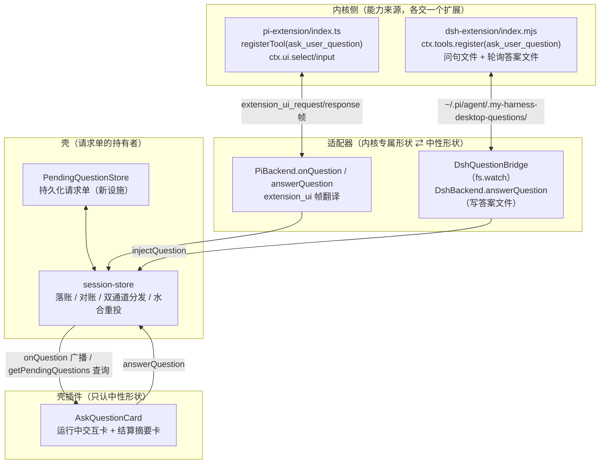
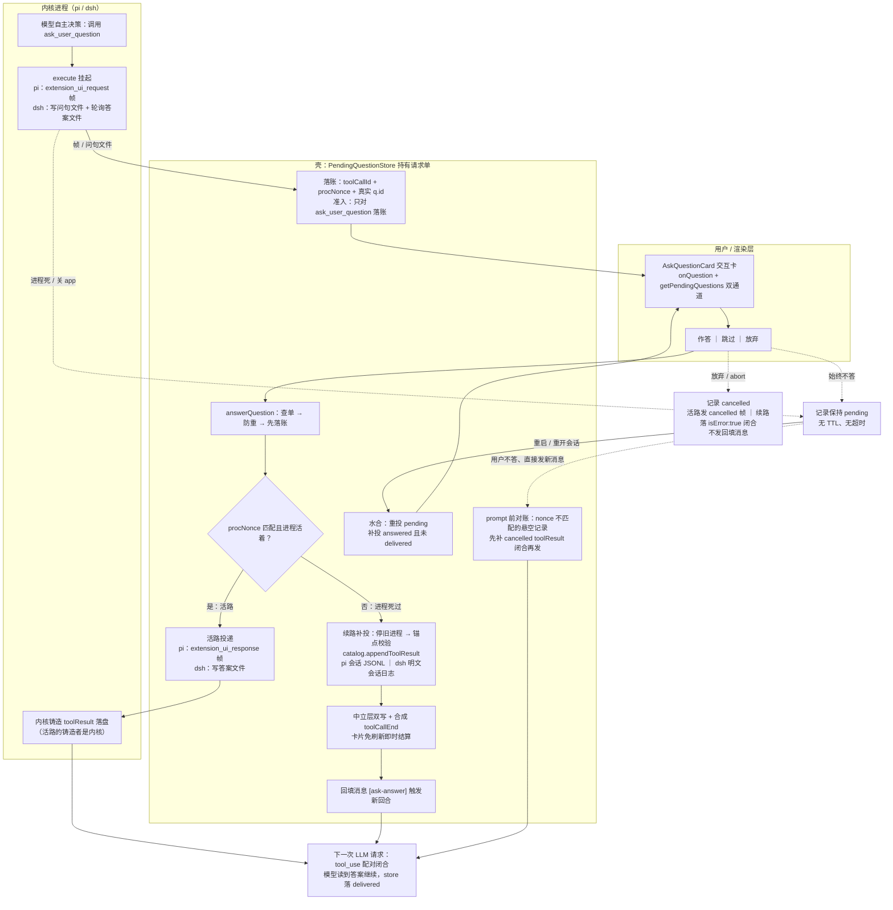

# ask 提问完整设计

> **2026-09-02 首版**。本文是 ask（`ask_user_question` 提问往返）的完整设计。**全部设计服从一个协议本质（§1.1）：agent 循环是一串 step，`tool_use` 与下一次 LLM 请求之间唯一缺的是一个 `tool_result`——ask 就是把这个 tool_result 填进去，隔 5 秒、5 天、7 年再填，协议看起来一模一样。** 在此本质之上覆盖三个工程：**续问持久化**（提问 = 壳持有的持久请求单，重启/杀进程可续）、**pi 多选拉平**（约定式翻译，零内核改动）、**结算卡补全**（问句/选项/答案可见）。
>
> 与前序文档的关系：`ask-transfer-layer.md`（2026-08-19，翻译归位，已交付）定义了三层对称与中性契约，本文在其之上把"提问"从**进程内挂起的一次性调用**升级为**壳持有的持久实体**；`goal-ask-pi-port.md` §5 是工具移植蓝本（工具名/入参/出参对齐 DSH 的纪律不变）。插件现状文档 `docs/plugins/sessions/ask.md` 的过期章节（60s 超时、AskHost 模态框、multi_select 不渲染）随阶段三回写。

## 1. 核心心智模型

### 1.1 协议本质：两个 step 之间填一个 tool_result

剥离全部机制细节，ask 的本质只有一句话：

> **agent 循环是一串 step。模型在 step N 发出 `tool_use`，协议要求 step N+1 的请求里带上配对的 `tool_result`。ask 的全部工作，就是把这一个 `tool_result` 填进去——隔 5 秒、5 天、还是 7 年再填，协议看起来一模一样。**

Anthropic / OpenAI 的消息协议里**没有"提问"这个概念**，只有 `tool_use` → `tool_result` 的配对不变量。用户作答用了多久、作答时 app 开没开、内核进程还是不是原来那个、中间换没换机器——对协议全部不可见；`tool_result` 里甚至没有一个字段能表达"这答案等了多久"。转录（transcript）是唯一真相：**一个合法的 tool_result 落在两个 step 之间，下一次 LLM 请求照常发出。** 这就是"续问"的全部语义，也是本设计一切机制的存在理由——帧、文件侧车、卡片、持久化 store，全是为同一个产物（那个 tool_result）服务的投递机制，区别只在投递的快慢与存亡。

### 1.2 现状的病：把"等一个 tool_result"实现成了"进程内挂起的 Promise"

现在的实现把等待建模为**内核进程内挂起的 continuation**：pi 的 `pendingExtensionRequests`（内核 `rpc-mode.ts` 的内存 Map）、dsh 的 `waitForAnswer` 轮询循环，都住在内核进程里。进程一死，挂起点蒸发——还没走到"填 tool_result"那一步，路先没了。这是实现的偶然形态，不是协议要求的形态。

### 1.3 设计翻转：壳持有请求单，tool_result 是唯一产物

> **内核只是提问的发起方，壳是请求单的持有者。** 发起即落账，答案任何时候都能回；内核进程只是投递通道——通道断了换一条，单子还在。无 TTL、无超时、无"过期"状态。

由此导出用户可见语义三条铁律：

1. **答案永不丢**：`answerQuestion` 先把答案落壳的持久存储，再分发。分发失败答案也在。
2. **重启必续上**：app 关闭、内核被杀、机器重启之后，重开会话，问题卡片原地复活、可作答、答案送达模型。
3. **不伪造状态**：只有 `pending / answered / cancelled` 三态。没有"expired"。死问句只有一种：壳的存储里查无此单。

**推论（§5 的判据）**：既然产物只有一个 tool_result，那么"把真 toolResult 写进转录"就是续路的**标准形态**而非变通手段；活路（帧/文件实时回灌）只是同一产物的**低延迟快递线**。**两个内核的续路都走真 toolResult 落盘**（pi 写会话 JSONL；dsh 直接编辑会话日志，§5.2）——用户消息通道只留给"连存储写面都没有"的未来内核（缺面降级）。

## 2. 全景架构



纪律边界（沿用 `ask-transfer-layer.md` §1）：翻译只发生在适配器；壳与壳插件只见中性形状；渲染层零内核身份分支。本文新增两条：**提问的状态只住在壳的持久存储，不住内核进程内存**；**一切通道的最终产物只有一个——两个 step 之间的一个合法 tool_result**（§1.1）。

### 2.1 全生命周期图

一条提问从模型决策到模型读到答案的完整生命（实线 = 主路径，虚线 = 边界/异常路径）：



读法：**spine 只有一条**——模型问 → 壳落账 → 用户答 → 同一个 tool_result 进转录 → 下一次请求。虚线全部是"时间被拉长"的情形（死亡、重启、不答、放弃），它们改变的是投递路径，不改变产物。

## 3. 中立契约

### 3.1 现有（不动）

`packages/shared/src/domain/events/kernel-event.ts`：`Question`（`{id, question, header?, options?, multi_select?}`）、`QuestionAnswer`（`{id, selected[], custom?}`）、`QuestionRequestEvent`（`{kind:"question", requestId, sessionKey, questions}`）。`BaseBackend.answerQuestion?(questionId, answers)` 可缺面意图，`AbstractBackend` 缺面默认抛错。

### 3.2 新增：挂起提问记录（圆心类型）

```ts
/** 挂起提问记录（壳持久化的请求单；进程生死不影响其存续）。 */
export interface PendingQuestionRecord {
  /** 内核铸造的提问 id（pi=extension_ui 帧 id；dsh=扩展 randomUUID）。 */
  requestId: string;
  /** 发起内核。 */
  kernel: KernelId;
  /** 归属会话中立主键（水合/级联删除的 join 键）。 */
  neutralSessionId: string;
  /** 发起时的 proc key（pi=会话文件路径；dsh=投影地址）。诊断 + pi 续路定位用。 */
  sessionKey: string;
  /** 发起进程的出生证（SessionProc 每次创建生成 uuid）。answer 时比对，判定活路/续路。 */
  procNonce: string;
  /** 发起提问的 ask_user_question 工具调用 id（壳从 toolCallStart 对账捕获；卡片精确锚定）。 */
  toolCallId: string | null;
  questions: Question[];
  status: "pending" | "answered" | "cancelled";
  answers?: QuestionAnswer[];
  createdAt: string;
  answeredAt?: string;
  /** 答案是否已成功送达内核（落账与送达分离：落账先，送达后补标）。 */
  delivered?: boolean;
}
```

`SessionsApi`（`packages/shared/src/domain/sessions.ts`）新增一条查询：

```ts
/** 读激活会话的挂起提问（重启水合后卡片据此恢复交互态）。 */
getPendingQuestions(): Promise<PendingQuestionRecord[]>;
```

线通道按既有约定增 `session:pendingQuestions`（invoke）。`onQuestion` / `answerQuestion` 签名不变。

## 4. 上行链路：提问的产生与落账

### 4.1 pi 路径（帧）

1. `pi-extension/index.ts` 的 `execute` 逐题调 `ctx.ui.select/input`（内核 RPC 安全原语，一帧一题，sequential）。
2. 内核写 `extension_ui_request` 帧到 stdout，promise 挂进内核内存 Map。**无超时**（桌面侧 60s 超时已按用户要求移除；内核侧帧本身可带 `timeout` 字段，本扩展不传）。
3. `rpc-adapter.handleLine` 截获帧投 `extUiListeners`。
4. `PiBackend.onQuestion` 只认 `select`/`input`，翻译成单元素 `Question[]`。
5. `session-store.bindProcEvents` 的 `pi.onQuestion` 包装：**先落账**（§4.3）再投 `questionListeners`。

### 4.2 dsh 路径（文件侧车）

1. `dsh-extension/index.mjs` 的 `execute` 把问句数组**原样**（含完整 `multi_select`/`description`，这是 dsh 多选天然全通的原因）写入 `~/.pi/agent/.my-harness-desktop-questions/<requestId>.json`，200ms 轮询答案文件。
2. `DshQuestionBridge` 全局单例 `fs.watch` + 启动全量 scan，按 requestId 去重投递（事件驱动，renderer 零轮询）。
3. `bootstrap` 经 `sessionStore.injectQuestion` 汇入。**"无可答进程直接丢弃"改为"照存不投"**——归属不明/无活进程不再丢单，只是不投当前视图。

### 4.3 落账与 toolCallId 对账

- `SessionProc` 新增 `nonce: string`，每次创建/换绑生成（start、restart、`materializeActiveLineage` 重绑、`switchKernel` 重绑——四处一处不漏）。
- **准入条件（防误持久化）**：`session-store.dispatch` 处理 `toolCallStart` 且 `toolName === "ask_user_question"` 时记 `proc.lastAskToolCallId` 及其 `args.questions`（两内核的 toolCallStart 都带 args：pi 的 `tool_execution_start` 带 `event.args`，dsh 翻译器 `parseArgs(d.arguments)`）。**只有能对账到 ask toolCallStart 的提问才落账**——`PiBackend.onQuestion` 翻译的是一切 select/input 帧，今天 ask 是唯一消费方（已验证），但未来别的扩展用 `ctx.ui.select` 时，其帧绝不该被持久化、更不该在续路被铸造成 `toolName: "ask_user_question"` 的 toolResult。对不上账的帧维持现状：只投监听器，不落账。
- **真实 question id 对账（pi 关键）**：pi 帧里问题的 id 是合成的（`${req.id}-0`），模型出题时的真实 `q.id` 只在 `args.questions` 里。落账时按问句文本（帧 title === `q.question`，扩展原样传递）匹配出真实 `q.id` 写进记录的 `questions`——否则续路铸造的 toolResult 里 `answers` 的 id 与模型出的题对不上（活路无此问题：扩展自己持有 params）。
- 提问落账时写入 `toolCallId` + `procNonce` + `neutralSessionId` + `sessionKey`。
- 落账实现：`PendingQuestionStore`（新文件 `src/server/application/sessions/pending-question-store.ts`），持久化到 `~/.my-harness-desktop/pending-questions/<requestId>.json`，写入走 `config-file.ts` 的 `writeJsonFile`/`withDirLock` 原语（与既有 store 同纪律）。bootstrap 装配为单例注入 session-store。

## 5. 下行链路：同一 tool_result 的快/慢两条投递线

由 §1.1 的协议本质，活路与续路**不是两种语义，是同一个 tool_result 的两条投递线**——活路是"进程还活着"时的低延迟快递（帧/文件实时回灌，内核自己把它变成 toolResult），续路是"进程死过"时的持久补投（两个内核都是壳直接写真 toolResult 落盘：pi 追加会话 JSONL、dsh 编辑会话日志）。对用户和模型，两者的产物等价。

`session-store.answerQuestion` 重构为四步：

1. **查单**：按 `requestId` 查 store。查无此单 → 抛"未知提问"（唯一的死问句）。
2. **防重**：`status !== "pending"` → 抛"该提问已作答"。
3. **落账**：`status="answered"`（全空 selected 记 `"cancelled"`）+ `answers` + `answeredAt` **先写盘**——答案接收从此与内核死活无关。
4. **分发**（按 `record.kernel` 找激活会话的对应内核槽位——不读全局 `activeKernel` 偶然态——再按 procNonce + alive 判定）：

| 通道 | 条件 | 动作 |
|---|---|---|
| **活路** | 记录内核槽位的 `procNonce` 匹配且 `backend.alive` | 现状不变：`backend.answerQuestion`（pi=写 `extension_ui_response` 帧；dsh=写答案文件） |
| **续路·pi** | nonce 不匹配 / 进程不在 | **同槽位进程活着但 nonce 不匹配时先 stop**（运行中的 pi 不会重读会话文件，追加对它不可见）→ `catalog.appendToolResult` 把**真 toolResult** 追加进会话 JSONL（§5.1）→ 中立层同步 → 经 prompt 通道发结构化回填消息触发新回合 |
| **续路·dsh** | 同上 | `catalog.appendToolResult` 直接编辑 dsh 会话日志追加 `tool/result` 事件（§5.2：进程死亡窗口内编辑，时序反转，repair 不再抢先）→ 中立层同步 → 同样发回填消息触发新回合 |

**cancelled 的续路落盘形状**：记录为 cancelled 时不发回填消息（用户放弃 = 不推模型继续），但仍须闭合悬空的 `tool_use`，否则下一个请求照样 400——pi 追加 `isError: true`、`content` 为 `"User cancelled the question"` 的 toolResult（与扩展活路取消时的返回逐字对齐）；dsh 同一手法追加 `isError: true` 的 `tool/result` 行（不再依赖 repair）。

分发成功补标 `delivered: true`；分发失败记录保持已落账、显式告警，**由水合补投**（§8.1）——答案永不丢是闭环，不是单次尝试。

### 5.1 pi 续路：真 toolResult 落盘（续问的标准形态）

pi 续路就是 §1.1 协议本质的直接落地：**不发明任何新语义，只是把那个迟到的 tool_result 填进转录**，然后让下一次 LLM 请求照常发生。附带收益是它同时排掉一颗雷：pi 内核**没有任何悬空工具调用修复**（全链验证：`session-manager.ts` 的 `sessionEntryToContextMessages` 原样透传，`ai/api/anthropic-messages.ts` 转换层原样转换 `tool_use`），进程死于工具中途后重开续聊，dangling `tool_use` 会被 Anthropic 类 API 400 拒掉——补上 toolResult，雷与续问一起解决：

- `SessionCatalog` 契约加可选方法 `appendToolResult?(sessionId, toolCallId, answers)`（pi 实现、dsh 缺面不写；调用方能力探测，不写内核身份分支）。
- pi 实现（`pi-catalog.ts`，与 rename 的 `appendJsonlLine` 同一手法）：读文件找叶子 `parentId`，追加

  ```json
  { "type": "message", "id": "<8位>", "parentId": "<叶子id>", "timestamp": "<ISO>",
    "message": { "role": "toolResult", "toolCallId": "<记录值>", "toolName": "ask_user_question",
      "content": [{ "type": "text", "text": "{\"answers\":[...]}" }],
      "details": { "answers": [...] }, "isError": false, "timestamp": <ms> } }
  ```

  形状对齐 pi 的 `ToolResultMessage`（`ai/src/types.ts:403`）。pi 重开会话时经 `sdk.ts` 的 `agent.state.messages = existingSession.messages` 原样载入，工具闭环。
- 中立层同步追加同一条（壳自己的存储，刷新/冷开一致），卡片随既有 toolCall↔toolResult 配对机制自然结算。
- 之后壳经 prompt 通道发一条结构化回填消息（中立标记 + 答案 JSON，零自然语言文案，CLAUDE.md §1.2）触发新回合；模型读到真工具结果 + 尾部答案提示，继续生成。

### 5.2 dsh 续路：直接编辑会话日志（与 pi 对称）

**裁决修正**（2026-09-02 复审）：此前论证"dsh 被 repair 时序封死"只对**进程内 append**成立（插件经 `session/created` 见到会话时，repair 已 durable 提交）。**直接编辑文件发生在加载路径之前，时序整个反转**：日志载入时已平衡，`interruptedTurnClosers` 对平衡的调用链不合成任何错误结果。机制四层，全部有 dsh 仓库代码实证：

1. **文件与配置面都在壳手里**：桌面托管的 dsh 部署用 `@deepseek-ai/dsh-session-persistence-jsonl` 后端（`dsh-config-source.ts:34`），物理文件 `<sessionRoot>/<cwd 桶>/<lineageId>/session.jsonl[.zstd]`（`dsh-catalog.ts:86` 已认知此布局）；cordis.yml 本来就是壳在写（`DshConfigSource`）——把该后端的部署配置改为一等支持的诊断模式 `compression: 'none'` + `packChunks: false`（"keeps one SessionEvent per line"），会话日志即变为明文 JSONL，**追加一行即完成写入**。
2. **revision 免维护**：持久化 revision 是文件元数据派生的不透明令牌（`dev:ino:size:mtimeNs:ctimeNs` 拼接），不嵌在文件内容里——追加天然产生新 revision，无嵌入计数器要同步。
3. **事件形状照抄 repair 的合法闭合件**（`core/session/src/repair.ts` 合成的 `tool/result`，即"合法的悬空闭合"长什么样的权威样本）：

   ```json
   { "type": "tool/result", "seq": "<末条seq+1>", "time": "<ms>",
     "data": { "message": { "id": "<id>", "role": "user",
       "source": { "kind": "tool", "callId": "<toolCallId>" },
       "content": [{ "type": "tool-result", "toolCallId": "<toolCallId>", "isError": false,
         "content": [{ "type": "text", "text": "{\"answers\":[...]}" }] }] } } }
   ```

   与桌面 `dsh-event-translator` 已消费的 `tool/result` 形状一致；`isError: false` + 真答案。
4. **resume 时 repair 只剩边界**：加载路径（`prepareCore`）看到调用已闭合，`interruptedTurnClosers` 只补 `step/end` + interrupted `turn/end`（turn 确实被打断过——诚实的边界标记），不再合成错误结果。模型见到的是**真答案的 tool_result**。

**机械过程**：前提 = 进程死亡窗口（nonce 不匹配/不在；活着但 nonce 不匹配的先 stop，与 pi 同规则）→ 定位 `<sessionRoot>/<cwd 桶>/<lineageId>/session.jsonl` → 撕裂尾部截断（截到最后一个完整换行）→ 锚点校验（`toolCallId` 必须在该 lineage 日志内；dsh 按 lineageId 分文件，追加目标即提问所在 lineage——若该 lineage 已非活跃，模型在当前分支看不到，记录诚实标注，与 pi 的 fork 边界同规则）→ 追加 `tool/result` 行 → 中立层同步 + 合成 `toolCallEnd`（与 §6.3 Step 3 同一手法）→ 回填消息触发新回合。

**降级红线**：读到的日志 header 版本/形状不认识（dsh 升级改了格式）→ 不写，显式降级到用户消息通道并告警（能力探测，不静默、不伪造）。

**代价记录**：明文诊断模式日志体积约 +60%（dsh 作者实测数字）、无压缩——桌面托管部署的自愿取舍（磁盘换续问真形态）。若未来要回压缩：dsh 适配器改用 dsh 自己的 `session-persistence-jsonl` 包做 codec（不重手写格式，CLAUDE.md §3.5），壳编排不变。

dsh 另两条出路保留为演进注记：**B（非阻塞 ask）**——`execute` 写完问句立即返回，不留悬空调用，repair 永不触发（语义变"纯异步消息"，每期多一回合）；**C（终态）**——dsh 核心加 `session/answer` RPC（`dsh-sdk-server-supplement.md`，另一仓库）。

### 5.3 对账：store 不撒谎

- `toolCallEnd`（toolCallId 命中 pending 记录）→ 自动结算记录（正常返回 → answered，"User cancelled" → cancelled）。覆盖"用户按了回合 abort"这类不经卡片的收尾。
- 会话删除（`deleteSessions`）级联删该 `neutralSessionId` 的全部记录。

## 6. 回填与再次发送：tool_result 落位与下一次请求的完整机械过程

本节是全篇的心脏（§1.1 的工程展开）：**答案落账之后，它到底以什么字节、落在哪个位置、经哪条路径进入下一次 LLM 请求**。三条通道（活路·pi / 续路·pi / 续路·dsh）逐一拆到消息级。

### 6.1 三条通道的同一张终态图

无论走哪条通道，下一次 LLM 请求的 messages 都必须满足同一个不变量：`tool_use` 有配对的 `tool_result`（或被内核修复为合法的错误结果），且答案在其中。对照：

```text
活路·pi（进程活着）:
  [..., user(原始诉求), assistant(toolCall ask_user_question),
   toolResult(内核铸造, answers),            ← 内核把扩展返回值写成工具结果
   assistant(继续生成 ...)]

续路·pi（进程死过, 壳落盘）:
  [..., user(原始诉求), assistant(toolCall ask_user_question),
   toolResult(壳落盘, answers),              ← 与活路产物逐字段同构
   user("[ask-answer] {...}"),               ← 触发器：拉起新回合
   assistant(继续生成 ...)]

续路·dsh（进程死过, 壳编辑日志）:
  [..., user(原始诉求), assistant(tool_call ask_user_question),
   tool/result(壳追加, answers),              ← 与活路产物同形（repair 形状 + 真答案）
   step/end + turn/end(interrupted),         ← repair 只补边界：turn 确实被打断过
   user("[ask-answer] {...}"),               ← 触发器：拉起新回合
   assistant(继续生成 ...)]
```

**模型在三张图里都不需要知道"重启""续问"这些概念——转录自明。** 隔了多久答的、谁写的 tool_result、中间死过几个进程，协议层无字段可表达、也无需表达。

### 6.2 活路（对照基线）：内核如何把答案变成 toolResult

pi 活路的每一步（答案离开卡片之后）：

1. 卡片 → `ctx.sessions.answerQuestion(requestId, answers)` → WS → `session-store.answerQuestion` → `PiBackend.answerQuestion`：取 `answers[0]`，译成 `extension_ui_response` 帧（`{id, value}` 或 `{id, cancelled:true}`），fire-and-forget 写进内核 stdin。
2. 内核 `rpc-mode.ts` 按 `id` 查 `pendingExtensionRequests`，resolve 那个挂起的 promise——`ctx.ui.select/input` 在内核进程里返回值。
3. 扩展 `execute` 继续跑完逐题循环，`return ok(answers)`——工具返回值 `{ content: [{type:"text", text: JSON.stringify({answers})}], details: { answers } }`。
4. **内核**把这个返回值铸造成 toolResult 消息，追加进会话 JSONL（`message_end` 落盘，`agent-session.ts:759`），并经 `toolCallEnd` 事件链推给桌面。
5. agent loop 进入下一个 step：组装请求时 `state.messages` 里已有这条 toolResult，LLM 请求自然带上。模型读到答案，继续。

关键认知：**活路里 toolResult 的铸造者是内核，壳只递了一个字符串**。续路要做的事情，就是在内核无法再铸造时，由壳把这个产物按逐字段同构的形状补上。

### 6.3 续路·pi：壳手写 toolResult 的全机械过程

**前置状态**：进程死过（nonce 不匹配 / 不在）。会话 JSONL 尾部是 assistant 消息（含 `ask_user_question` 的 toolCall 块，message_end 时已落盘），其后**没有** toolResult——悬空。以下六步：

**Step 1 · 定位与幂等校验**（`pi-catalog.appendToolResult(sessionPath, toolCallId, answers)`）：

- `withDirLock` 持目录锁，读文件全文；`lastEntryId(content)` 取叶子条目 id 作 `parentId`（与 rename 的 append 同一手法，parentId 链不断）。
- **锚点校验**（`toolCallId` 必须在**活跃 lineage** 上，不是"在文件里"——pi JSONL 含全部分支的条目，全文倒查会命中旧分支里的同名 toolCall）：
  - 从叶子条目沿 `parentId` 链上溯收集活跃路径 id 集（或等价地查中立层 `lineageContent(session, activeLineageId)` 的内容块）；`toolCallId` 在集合内且无配对 toolResult → 可追加；
  - 已配对（重复回填/竞态）→ **跳过追加**，直接走 Step 4 的回填消息；
  - 不在活跃路径上（用户在提问后 fork 到问题之前的分支并物化）→ 追加会造出孤儿 toolResult（无配对 tool_use，同样是 provider 400 的雷）→ **降级：不写文件，只走用户消息通道**，并在记录里诚实标注。

**Step 2 · 铸造条目**（形状逐字段对齐 pi 的 `ToolResultMessage`，`ai/src/types.ts:403`）：

```json
{
  "type": "message",
  "id": "<8位id>",
  "parentId": "<叶子条目id>",
  "timestamp": "<ISO 时间>",
  "message": {
    "role": "toolResult",
    "toolCallId": "<pending 记录里的 toolCallId>",
    "toolName": "ask_user_question",
    "content": [{ "type": "text", "text": "{\"answers\":[{\"id\":\"q1\",\"selected\":[\"A 方案\"]}]}" }],
    "details": { "answers": [{ "id": "q1", "selected": ["A 方案"] }] },
    "isError": false,
    "timestamp": 1756800000000
  }
}
```

- `content[0].text` = `JSON.stringify({ answers })`——**与扩展 `ok()` 的输出逐字节同构**：模型看到的工具返回与活路返回在形状上无任何差别，这是"工具就是正常返回了"的物理保证。
- `answers` 里的 `id` 必须是模型出题时的真实 `q.id`（§4.3 落账时已从 `toolCallStart.args.questions` 对账写入记录）——不是 pi 帧上的合成 id，否则模型拿到的答案和它出的题对不上号。
- `details.answers` = 结构化答案——时间线卡片结算时读 `toolCall.result.answers` 的数据源。
- `isError: false`——这是一次正常结算，不是错误（cancelled 的落盘形状见 §5 分发表后段）。

**Step 3 · 中立层双写 + 视图流即时结算**：

- `appendNeutral` 把同一条 toolResult 写进中立层（中立层是壳的读真相源，刷新/冷开一致；后续若 `snapshotNeutralSession` 从内核文件全量重建，同一条目被读回覆盖，同一来源不撞双份）。
- `dispatch` 一条合成 `toolCallEnd` 事件（`{ type:"toolCallEnd", toolCallId, result: { answers } }`）到视图流——renderer 的 `applyEvent` 按 toolCallId 把 result 回填进 assistant 内容块（`src/web/stores/session-store.ts` 的既有机制），**卡片无需刷新，即时从交互态翻转为结算态**。

**Step 4 · 起进程 + 触发新回合**：

- 经 `prompt` 通道发结构化回填消息（`[ask-answer]` 中立标记 + 答案 JSON，零自然语言文案，CLAUDE.md §1.2）。`prompt` 内部的 `ensureForSend` 懒起新 pi 进程（`--session <path>`）。
- pi 加载会话：`session-manager.buildSessionContext` → `sessionEntryToContextMessages` 把 Step 2 的条目**原样**变成 `ToolResultMessage` 进 `agent.state.messages`（`sdk.ts:373`）——壳写的字节与内核自己写的字节走同一条加载路径，无任何特殊通道。

**Step 5 · 下一次 LLM 请求的实际内容**：

```text
messages = [
  ...,
  user(原始诉求),
  assistant(..., toolCall{ id: "call_X", name: "ask_user_question", args: { questions: [...] } }),
  toolResult{ toolCallId: "call_X", content: [{ text: "{\"answers\":[...]}" }] },   ← Step 2 壳补的
  user("[ask-answer] {\"answers\":[...]}"),                                          ← Step 4 触发器
]
```

`tool_use` 配对闭合（provider 400 的雷同步排除），尾部有答案。模型视角：**它问了问题、工具返回了答案、用户又确认了一遍——接着做。**

**Step 6 · 回合推进**：agent loop 正常进入下一 step，assistant 继续生成；内核发出的 `toolCallEnd`/message 事件链照常到达；store 记录落 `delivered: true`。

### 6.4 续路·dsh：壳编辑会话日志的全机械过程

前提与机制证据见 §5.2（配置面/明文 JSONL/revision 免维护/事件形状）。机械步骤：

**Step 1 · 时机**：进程死亡窗口（nonce 不匹配/不在；活着但 nonce 不匹配的先 stop，与 pi 同规则）——编辑发生在下一次 resume 的加载路径**之前**，这是时序反转的关键：repair 不再抢先。

**Step 2 · 定位与截断**：`<sessionRoot>/<cwd 桶>/<lineageId>/session.jsonl`（`sessionKey` 投影地址反查 lineageId）；若上次死亡留下撕裂尾部（不完整末行），先截到最后一个完整换行。

**Step 3 · 锚点校验**：`toolCallId` 必须存在于该日志内——dsh 按 lineageId 分文件，追加目标即提问所在 lineage；若该 lineage 已非活跃（fork 走远），模型在当前分支看不到此答案，记录诚实标注（与 pi 的锚点校验同规则）。

**Step 4 · 追加**：写入 §5.2 第 3 层的 `tool/result` 行（`seq = 末条 + 1`，`isError: false`，真答案 JSON）。下一次 resume：`prepareCore` 载入 → 调用已闭合 → repair 只补 `step/end` + interrupted `turn/end`——transcript provider-legal 且工具结果是真的。

**Step 5 · 中立层同步 + 合成 `toolCallEnd` + 回填消息触发新回合**：与 §6.3 Step 3-6 逐字同手法，两内核共享。

下一次请求的 messages 即 §6.1 第三张图：**真 tool/result（壳追加）** + repair 补的边界 + 尾部触发器。模型视角与 pi 续路完全一致：工具正常返回了答案。

### 6.5 并发与不变量

- **写文件只在续路发生**，且续路执行前先停掉同槽位的存活旧进程（§5 分发表）——不存在"壳追加与内核 append 并发写同一文件"的窗口；壳自身的其他 append（rename 等）由 `withDirLock` 串行化。
- **续路不制造第二份语义**：toolResult 只追加一次（幂等校验），回填消息只是触发器；store 的 `status`/`delivered` 是唯一记账。
- **跨内核切换中的提问**：`switchKernel` 当前入口暂缓开启；提问单的 `kernel` 字段即答案的归宿内核，切换放开后按记录路由，不按当下激活态猜。

### 6.6 发送前对账：任何新请求发出前，配对必须闭合（盲审补入，H 级）

§1.1 的不变量反过来约束壳自己：**只要一个会话的转录尾部悬着未闭合的 ask tool_use，任何新 LLM 请求都会被 provider 400 拒掉**——这与用户答不答卡片无关。场景：提问 → 进程死 → 重开会话 → 用户不答卡片、直接在输入框敲了新消息。pi 新进程载入含悬空 tool_use 的历史，`prompt` 照常发出 → 400。这是现状就存在的地雷（store 引入前就有），本设计接管之：

- `prompt()` 发送前（`ensureForSend` 之后、`sendMessage` 之前），查该会话 `status === "pending"` 且与当前进程 nonce 不匹配的记录；
- 命中且内核有 `appendToolResult` 面（pi、dsh 都有）→ 先追加 `isError: true` 的 cancelled toolResult 闭合悬空（对齐 §5 的 cancelled 落盘形状），记录转 cancelled，再正常发送；
- 命中且内核无此面（未来内核缺面）→ 显式降级：拒绝发送并提示先处理挂起的提问，不静默带雷发送；
- 这条对账同时覆盖"水合后用户始终不答、直接继续聊"的路径——卡片仍在、记录转为 cancelled，语义诚实。

## 7. 工程一：pi 多选拉平（约定式翻译，零内核改动）

**根因**：pi 的 `ctx.ui.select` 返回 `Promise<string|undefined>`，响应帧联合类型 `value: string` 单值（内核 `rpc-types.ts:273-275`）。但内核对 value **不做任何校验**（`rpc-mode.ts` 的 `parseResponse` 原样透传），且管子的两头（我们的扩展 + 我们的适配器）都是自己的代码——单值字符串里可以带 JSON。

**三处改动**：

1. **适配器编码**（`PiBackend.answerQuestion`）：
   - `custom` 非空且 `selected` 非空 → `value = JSON.stringify({ selected, custom })`
   - `selected.length > 1` → `value = JSON.stringify({ selected })`
   - 仅 `custom` → `value = custom`；仅一项 → `value = selected[0]`；全空 → `{ cancelled: true }`（现状）
2. **扩展解码**（`pi-extension/index.ts`，仅 `multi_select === true` 的题）：对 select 返回值尝试 `JSON.parse`——对象含 `selected` 用之（含共存 `custom`）；parse 失败 → `[picked]` 单选 fallback。`CUSTOM_SENTINEL` 保留（TUI 下"选其他"路径）。
3. **卡片补全**（`AskQuestionCard`）：`RunningQuestion` 接收 `toolCall` prop，按问句文本精确匹配 `toolCall.args.questions`（扩展把 `q.question` 原样作帧 title，匹配可靠），补回帧装不下的 `multi_select` 与 `description`。匹配不到按单选渲染（现状兜底）。

**TUI 兼容**：终端用户用同一扩展跑 pi CLI，select 返回纯 label → parse 失败 → 单选 fallback，行为与今天一致。这是"字段进契约、能力按内核降级"的反向升级：契约不动，pi 运行时能力补齐。

## 8. 工程二：重启续问（水合 + 卡片复活）

### 8.1 水合时机与双保险

- **重投**：会话激活（`setContext`/openSession/启动后激活会话确定）时，扫 store 里该 `neutralSessionId` 的 `pending` 记录，逐条重投 `questionListeners`（重放 `onQuestion`）。
- **补投**：同一时机扫到 `answered && !delivered` 的记录（落账成功但分发失败/中断）→ 直接走续路补投递——"答案永不丢"是闭环，投递不是一次性尝试。
- **查询**：卡片 mount 时 `getPendingQuestions()` 查一次——覆盖"重放早于卡片挂载"的时序。订阅 + 查询双通道，无间隙。
- **查重**：dsh 桥重启后全量 scan 会重投旧问句文件（含 abort 后未清理的孤儿文件——dsh 扩展的 `waitForAnswer` 在 `signal.aborted` 分支不删问句文件）；`injectQuestion` 落账前查 store，已 answered/cancelled 的记录跳过不投（可选顺手删孤儿文件）。

### 8.2 卡片激活条件放宽

现状：`toolCall.state ∈ {pending, running}` 才渲染交互卡——重启后该 state 已不在（pi 侧 assistant 消息在 `message_end` 落盘、含 toolCall 块，锚点还在；块无 result）。改为：

> **isStreaming，或（块是 ask_user_question 且无 result 且有命中 pending 记录）→ 交互卡。**

匹配：`record.toolCallId === toolCall.id`；fallback：会话唯一 pending + 块无 result（sequential 执行保证至多一个 pending）。交互卡渲染 `record.questions`（持久化的完整数据），不依赖易失的内存事件。

### 8.3 复活后的完整闭环（验收场景）

1. pi 会话中模型提问 → 用户未答，关掉 app（`stopAll` 杀内核）。
2. 重启 app、重开会话：水合重投 + 卡片查询命中 → 卡片原地复活为交互态。
3. 用户作答 → `answerQuestion` 落账 → nonce 不匹配 → pi 续路：真 toolResult 落盘 + 回填消息触发新回合 → 模型读到工具结果继续。
4. 卡片结算为真实答案；store 记录 `delivered: true`。

## 9. 工程三：结算卡补全

`SettledSummary` 展开体改造：按 `id` 连接 `toolCall.args.questions`（或 store 记录）与答案，逐题渲染**问句正文 + 选项列表（选中项高亮）+ 自定义答案/(skipped) 标记**。

数据源优先序：`toolCall.result.answers` → store 记录 `answers`（命中时加"重启后回填"标记）→ 退化为现有 `N/M answered` 摘要行。

## 10. 边界语义（逐条钉死）

| 场景 | 语义 |
|---|---|
| 用户长时间不答 | 无限等待。无 TTL、无超时（用户明确要求；两内核现状已如此，store 引入后不改变） |
| 卡片"放弃整组" | `selected: []` 全空 → 记录 cancelled；活路下 pi 发 `cancelled` 帧，扩展返回 "User cancelled" |
| 用户按回合 abort | 内核 signal 中断工具 → `toolCallEnd` 对账 → 记录 cancelled，不问用户 |
| 内核进程死/崩溃 | 记录保持 pending。等待水合，什么都不做 |
| app 重启 | 水合重投 + 卡片查询，交互态恢复（§8） |
| 重复作答 | 第二次拒绝："该提问已作答"（幂等防线，防多窗口/重投竞态） |
| 未知 requestId | "未知提问"——唯一的死问句 |
| 活路投递中进程恰死 | 落账已完成；分发抛错 → 记录保持 answered、`delivered` 缺省 false，告警可读，不吞不伪造 |
| 同会话多题/多次提问 | sequential 执行保证至多一个活跃 pending；store 结构上允许 N 条，水合按 createdAt 序重投 |
|  renderer 刷新/远程重连 | 内核进程未死：nonce 匹配活路照常；卡片经查询通道恢复（store 顺带修掉 renderer 刷新丢提问的隐性缺口） |
| 提问后用户不答、直接发新消息 | prompt 发送前对账（§6.6）：pi 先补 cancelled toolResult 闭合悬空再发，不 400；卡片转 cancelled |
| 答案落账了但分发失败 | 记录保持 answered + `delivered` 缺省 false；下次会话激活时水合补投（§8.1），答案必达 |
| 提问后 fork 到问题之前的分支 | 锚点校验判定 toolCallId 不在活跃 lineage → 不写文件，降级用户消息通道（§6.3 Step 1；pi/dsh 同规则） |
| 别的扩展发 select/input 帧 | 不落账（准入条件 §4.3）：只投监听器，维持今天的瞬态语义，不会被持久化/复活/铸造 toolResult |

## 11. 分阶段交付

每阶段独立通过运行时验证再进下一阶段（§5.5）：

- **阶段一（续问，核心诉求）**：`PendingQuestionStore` + `procNonce` + 落账/对账 + `answerQuestion` 双通道 + `getPendingQuestions` 全链（契约/通道/控制器/PluginContext）+ 水合 + `SessionCatalog.appendToolResult` 两内核实现（pi 追加会话 JSONL；dsh 编辑会话日志——含 cordis.yml 部署配置改为明文诊断模式）+ 卡片激活条件放宽。
- **阶段二（pi 多选）**：扩展解码 + 适配器编码 + 卡片 args 补全。
- **阶段三（结算卡 + 文档）**：`SettledSummary` 补全 + `docs/plugins/sessions/ask.md` 过期章节回写（60s 超时已移除、AskHost 已退场、multi_select 渲染态）。

## 12. 测试与验收（三级）

- **unittest**：`pending-question-store` 读写/三态机/级联删除；`answerQuestion` 分流（活路/pi 续路/dsh 续路/未知单/重复作答）；toolCallId 与真实 question id 对账捕获；锚点校验三分支（在活跃路径/已配对/不在活跃路径）；prompt 前对账（nonce 不匹配的 pending 记录先闭合再发送）；落账准入（非 ask 工具的 select/input 不落账）；pi 适配器多选编码 ↔ 扩展解码往返（含 TUI fallback）。
- **DOM 交互**：无 result 块 + 命中 pending 记录 → 卡片恢复交互态；多选题 checkbox 提交数组；结算卡展开见问句/选项/答案。
- **e2e（核心验收，`scripts/demo/ask-question.e2e.mjs` 扩展）**：
  1. pi：提问 → **杀内核进程** → 重启 app → 重开会话 → 卡片可答 → 作答 → 模型继续（会话文件含真 toolResult，答案 id 与模型出题 id 一致）。
  2. pi：提问 → 杀内核 → 重启 → **不答直接发新消息** → 不 400（对账先行闭合），模型正常回。
  3. dsh：同场景 1，会话日志含**真 `tool/result`**（repair 只补 step/turn 边界，不合成错误结果），模型继续。
  4. 回归：活路提问→作答→回灌不受影响。

## 13. 决策表

| # | 决策点 | 取值 | 依据 |
|---|---|---|---|
| 1 | pending 状态住哪 | 壳的持久存储（`PendingQuestionStore`），不住内核进程 | 核心心智模型（§1.1）：协议只要一个 tool_result，等待期间的状态与内核进程无关 |
| 2 | 活路/续路判定 | `procNonce` + `alive` | 不读全局 `activeKernel` 偶然态（历史根因：dsh 问句撞 pi 内核误报） |
| 3 | pi 续路形态 | 真 toolResult 追加进会话 JSONL + 结构化回填消息 | §1.1：tool_result 是唯一产物，续路 = 把迟到的 tool_result 填进转录，不是变通；顺带排掉 pi 无悬空修复导致 provider 400 的雷；catalog 已有 append 先例 |
| 4 | dsh 续路形态 | 直接编辑会话日志追加真 `tool/result`（与 pi 对称） | 时序反转（复审修正）：文件编辑发生在 resume 加载路径之前，日志载入时已平衡，repair 不合成错误结果（"repair 抢先"只对进程内 append 成立）。机制实证：部署用 persistence-jsonl 后端且 cordis.yml 是壳的写面、诊断模式明文凭配置开启、revision 由文件元数据派生免维护、事件形状照抄 repair 的合法闭合件 |
| 5 | pi 多选实现 | JSON-in-value 约定 | 内核不校验 value（`rpc-mode.ts` 实证）；两头都是自己的代码；不动外部内核仓库；TUI fallback 兼容 |
| 6 | 提问 TTL | 无 | 用户明确要求："不要做成兜底、关闭、临时状态" |
| 7 | 回填消息内容 | 中立标记 + 答案 JSON，零自然语言 | CLAUDE.md §1.2 壳不内嵌文案；模型可读 JSON；卡片可后续美化 |
| 8 | toolCallId 来源 | 壳从 `toolCallStart` 对账捕获 | 帧/文件都不带 toolCallId；时序天然成立；卡片精确锚定 |
| 9 | 记录状态机 | pending/answered/cancelled，无 expired | 不伪造过期；死问句只有"查无此单" |
| 10 | `appendToolResult` 归属 | `SessionCatalog` 可选方法，**pi 与 dsh 都实现** | 能力探测，不写 `if (kernel === "pi")`；缺面内核才退化用户消息通道 |
| 11 | 落账准入 | 只对能对账到 `ask_user_question` toolCallStart 的提问落账 | 铸造 toolResult 是写会话文件的强动作，不能波及未来其他扩展的 select/input 帧 |
| 12 | 发送前对账 | prompt 前闭合 nonce 不匹配的悬空记录 | §1.1 不变量反向约束壳自己：悬空 tool_use + 新请求 = provider 400；用户不答直接说话也是合法路径 |
| 13 | dsh 日志部署形态 | cordis.yml 配置 persistence-jsonl 为 `compression:'none'` + `packChunks:false` | 明文 JSONL 才能一行追加；代价是日志约 +60% 无压缩（磁盘换续问真形态）；回压缩走 dsh 官方 codec 依赖，壳编排不变 |

## 14. QA

**Q：app 重启但内核进程没死（如浏览器刷新、远程断连）？**
procNonce 匹配且 alive → 活路照常，等价于今天的行为。store 顺带修复了"renderer 刷新后 onQuestion 不重发、卡片干等"的隐性缺口（查询通道兜底）。

**Q：pi 续路追加 toolResult 时，原进程其实还活着（假死/卡顿）？**
续路的进入条件是 nonce 不匹配或 `!alive`。nonce 不匹配意味着当前 proc 是另起的进程，旧进程就算活着也已脱离壳的管理（`stopAll`/崩溃重建）；其内存 Map 里的旧 promise 永不会被 resolve，不影响新通路。活进程 + 活提问必然 nonce 匹配，走活路。

**Q：答案 JSON 里 `selected` 恰好是合法 JSON 字符串的单选题？**
单选题不解码（扩展只对 `multi_select` 题 parse），verbatim 透传，无误判面。

**Q：dsh 续路也是真 toolResult 吗？怎么做到的？**
是。直接编辑会话日志文件（§5.2）：桌面托管部署把 persistence-jsonl 配成明文诊断模式后，dsh 会话日志就是一行一个 SessionEvent 的明文 JSONL；在进程死亡窗口内追加一行 `tool/result`（形状照抄 repair 的合法闭合件，`isError: false` + 真答案），下一次 resume 时日志已平衡——`interruptedTurnClosers` 只补 step/turn 边界，不合成错误结果。此前"repair 抢先封死"的论证只对进程内 append 成立（插件见到会话时 repair 已提交）；文件编辑发生在加载路径之前，时序反转。

**Q：为什么进程内 append（`session.append`）不行，文件编辑就行？**
两个原因叠加：进程内 append 要求进程活着（崩溃后没有进程），且 resume 时 repair 在 `session/created` 之前就 durable 提交了闭合件，插件永远迟到。文件编辑不需要任何 dsh 代码在跑，且发生在 resume 之前——同一份日志，我们比 repair 先到。

**Q：续路里 toolResult 都落盘了，为什么还要再发一条 `[ask-answer]` 用户消息？**
toolResult 只填平了转录，**不会自己触发新回合**——LLM 请求只在 agent loop 跑起来时发出，而 loop 的入口是一次 prompt。那条用户消息是触发器，顺带把答案放到模型注意力最强的尾部位置。它不是第二份语义：答案的唯一权威载体是 toolResult，消息只是"请继续"的物理形态。

**Q：隔了七年八年再答，模型不记得问过这个问题怎么办？**
模型从不"记得"，它读的是转录。转录里 toolCall 的 args 带着完整的问题与选项、壳补的 toolResult 带着答案——两个 step 之间该有的一样不少。时间间隔在协议里没有字段，七年和五秒是同一次请求。

**Q：store 会膨胀吗？**
一次提问一条记录，量级与提问次数同阶（低频）。answered 记录保留作审计；如需清理按 `answeredAt` 惰性回收，不影响正确性。
