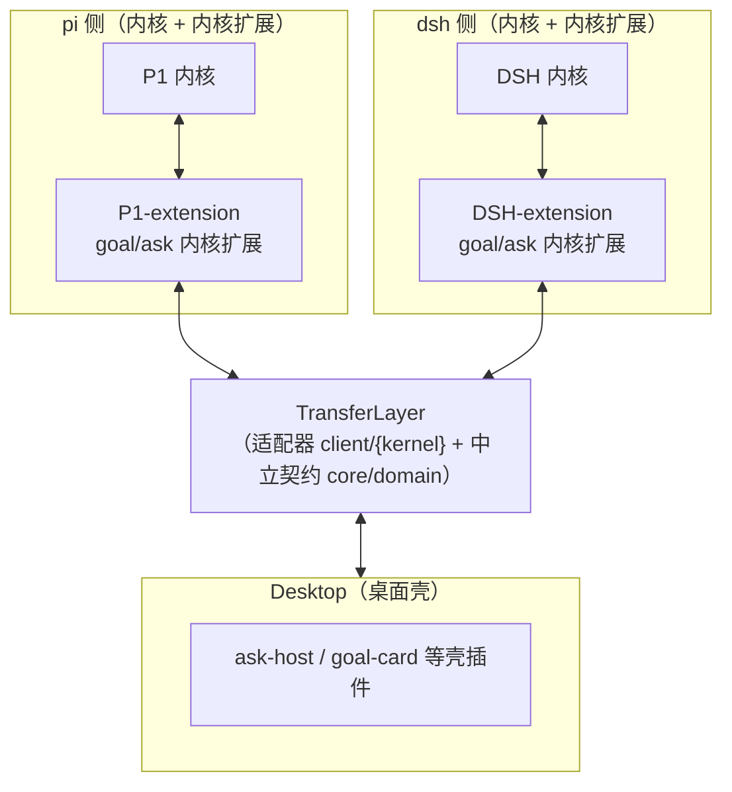
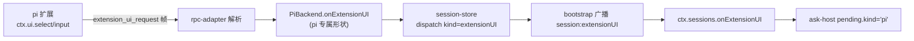
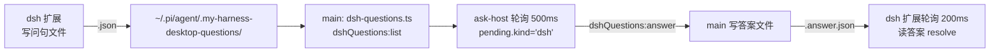
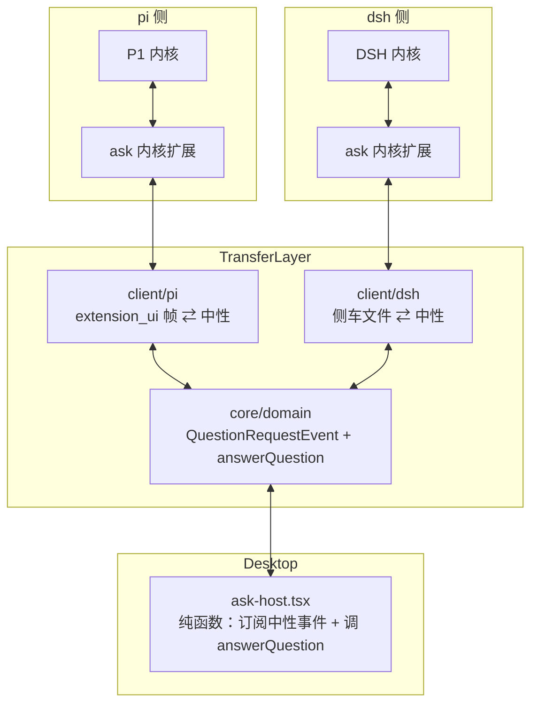

# ask 提问往返的 TransferLayer 收敛设计

> **2026-08-19 首版**：把 `ask_user_question` 的"提问往返"（内核挂起 → 用户作答 → 答案回填）收敛到一层 TransferLayer，让内核专属形状不穿透到桌面。

## 1. 目标架构（第一原则）

本设计的全部改动服从下面这张三层对称结构图——它既是目标、也是唯一的检验标尺：



三条不可违反的纪律：

1. **成对绑定**：内核扩展装进内核进程，与内核双向交互（pi 的 `registerTool`/`on("input")`，dsh 的 `ctx.tools.register`）。扩展是"能力来源"，不是桌面的一部分。
2. **TransferLayer 是唯一分界**：线上（内核侧）允许 `extension_ui_request` 帧、问句文件这些内核专属形状；线下（桌面侧）只允许中性形状。**翻译只发生在 TransferLayer，内核专属形状一律不许穿透到桌面。**
3. **桌面零内核身份**：壳插件不认识 "pi"/"dsh"，只订阅中性事件、只调中性契约。

TransferLayer 的物理落位（CLAUDE.md §6.1）：

| 组成 | 物理位置 | 职责 |
|---|---|---|
| 中立契约 + 中性事件 | `core/domain` | 中性形状的单源定义（`answerQuestion`、`QuestionRequestEvent`） |
| pi 适配器 | `client/pi` | `extension_ui_request/response` 帧 ⇄ 中性形状 |
| dsh 适配器 | `client/dsh` | 问句文件（阶段一）/ `question/requested`（阶段二）⇄ 中性形状 |

## 2. 现状数据流与穿透点

### 2.1 pi 侧



### 2.2 dsh 侧



### 2.3 穿透点（问题主线）

现状的翻译动作散落在 TransferLayer **之外**，内核专属形状一路穿透到了桌面：

| # | 穿透物 | 现状位置 | 违反 |
|---|---|---|---|
| P1 | `ExtensionUIRequestEvent`（`source:"pi"` + pi 专属 `method` 枚举）从 session-store 一路透传到 `ctx.sessions.onExtensionUI` | 翻译没在 `client/pi` 完成，而是应用层直接 dispatch pi 专属形状 | 纪律 2 |
| P2 | `ctx.dshQuestions.list/answer`（名字带 "dsh" 的内核专属 API）直挂 PluginContext，renderer 直接调 + 轮询 | 翻译没在 `client/dsh` 完成，而是 `api/ipc/dsh-questions.ts` 硬编码文件侧车 | 纪律 2 + §3.6 轮询 |
| P3 | `ask-host.tsx` 的 `pending.kind === "pi" \| "dsh"` 分支 | 渲染层认识内核身份 | 纪律 3 |

## 3. 终态数据流

翻译全部收进 TransferLayer（`client/{kernel}` 适配器），桌面只见中性：



`ask-host.tsx` 不再有 `kind === "pi" | "dsh"`，只订阅一个中性 `QuestionRequestEvent`、只调一个 `answerQuestion`。两侧的"提问事件源"差异（帧 vs 文件）由 `client/pi` / `client/dsh` 适配器在事件层抹平。

## 4. 中性形状（core/domain 单源）

对齐 DSH 的 question 语义（`goal-ask-pi-port.md` §5 蓝本）：

```ts
/** 中性提问请求：内核挂起、向用户要输入。pi 与 dsh 都投成这一形状。 */
export interface QuestionRequestEvent {
  kind: "question";
  /** 内核铸造的提问 id，answerQuestion 回填时原样带回。 */
  requestId: string;
  /** 归属会话（procs Map 的 key）。 */
  sessionKey: string;
  /** 中性问题数组。 */
  questions: Question[];
}

export interface Question {
  id: string;
  question: string;
  header?: string;
  options?: { label: string; description?: string }[];
  multi_select?: boolean;
}

export interface QuestionAnswer {
  id: string;
  selected: string[];
  custom?: string;
}
```

`BaseBackend.answerQuestion`（`backend.ts:116`）签名改为中性答案数组：

```ts
answerQuestion?(questionId: string, answers: QuestionAnswer[]): Promise<void>;
```

## 5. 分层落位（翻译归位）

| 层 | 文件 | 改动 |
|---|---|---|
| 圆心 | `core/domain/events/kernel-event.ts` | `ExtensionUIRequestEvent` → 中性 `QuestionRequestEvent` + `Question`/`QuestionAnswer` 类型 |
| 圆心 | `core/domain/backend.ts` | `answerQuestion` 签名改中性答案数组 |
| 骨架 | `client/backend/abstract-backend.ts` | `answerQuestion` 缺面默认保持抛错，签名同步 |
| **pi 适配器** | `client/pi/pi-backend.ts` + `rpc-adapter.ts` | **翻译归位**：`extension_ui_request`（method=select 时）→ 中性 `QuestionRequestEvent`，经统一事件通道投出；override `answerQuestion` = `sendExtensionUIResponse` 翻译 |
| **dsh 适配器** | `client/dsh/dsh-backend.ts` | **翻译归位**：override `answerQuestion` = 写答案文件（阶段一）；提问事件源在 `client/dsh` 内监听问句目录（fs.watch）→ 投中性事件 |
| 应用 | `core/application/sessions/session-store.ts` | 删掉 `bindProcEvents` 里 dispatch pi 专属 `extensionUI` 的分支，改为统一订阅 backend 的中性提问事件；暴露统一 `answerQuestion` 分发到当前内核 backend |
| 流入 | `api/ipc/dsh-questions.ts` | **删除**（翻译逻辑收进 `client/dsh`，本文件不再持有内核专属侧车） |
| 流入 | `api/ipc/sessions.ts` + `preload.ts` | `session:extensionUI`/`replyExtensionUI` 通道改为中性 `session:question`/`answerQuestion` |
| 内容 | `plugins/sessions/ask/renderer/ask-host.tsx` | 删 `pending.kind` 分支，订阅中性事件 + 调 `answerQuestion` |
| 内容 | `core/domain/context.ts` | 移除 `ctx.dshQuestions` 内核专属 API |

## 6. 两阶段迁移

### 6.1 阶段一：翻译归位 + 渲染纯函数化（不改 dsh 内核，本期可交付）

1. 圆心定义中性 `QuestionRequestEvent` + `Question`/`QuestionAnswer`，`answerQuestion` 改中性签名。
2. pi 适配器：`extension_ui_request` → 中性提问事件（翻译收进 `client/pi`）；`answerQuestion` = `extension_ui_response` 帧。
3. dsh 适配器：`client/dsh` 内 fs.watch 监听问句目录 → 投中性提问事件（事件驱动，废 renderer 500ms 轮询）；`answerQuestion` = 写答案文件（文件侧车桥被封装进适配器，桌面无感）。
4. 应用层 `session-store` 与 `api/ipc/dsh-questions.ts` 的专属翻译逻辑全部移除，`ctx.dshQuestions` 下线。
5. 渲染层 `ask-host.tsx` 纯函数化，删内核分支。

**阶段一产出**：翻译全部收进 `client/{kernel}`，内核专属形状不再穿透到桌面，渲染层零内核身份。dsh 底层仍是文件侧车，但被适配器封装，替换时不碰壳。

### 6.2 阶段二：dsh 内核补面（可选，改 deepseek-harness）

补 SDK server `session/answer`（+ `session/listTools`），dsh 走 DSH 原生 `ctx.userQuestions.ask` 机制，废文件侧车桥：

- `dsh-backend.answerQuestion` = JSON-RPC `session/answer`。
- 提问事件源 = `dsh-event-translator` 译 `question/requested` → 中性 `QuestionRequestEvent`（不再译丢）。
- `dsh-extension` 的 `ask_user_question` 改调 `ctx.userQuestions.ask`（或启用 DSH 自带 `dsh-tool-ask-user`）。

**阶段二产出**：dsh 侧也走内核协议，文件侧车桥彻底删除，TransferLayer 两侧都落到内核协议上。

## 7. 验收标准

1. **纪律 2（专属形状不穿透）**：`core/application`、`api/`、`plugins/` 下零 `extension_ui_request`/`extension_ui_response`/`.my-harness-desktop-questions` 字面量；翻译只出现在 `client/pi`、`client/dsh`。
2. **纪律 3（桌面零内核身份）**：`ask-host.tsx` 源码零 `"pi"`/`"dsh"` 分支（grep 校验）。
3. **契约兑现**：`pi-backend` 与 `dsh-backend` 都 override `answerQuestion`（ask 场景无缺面抛错）。
4. **事件驱动**：dsh 侧无 `setInterval` 轮询 list（阶段一）；dsh 侧无问句/答案文件（阶段二）。
5. **端到端不回归**：pi 与 dsh 的 `ask_user_question` 往返（提问 → 作答 → 回灌）都可用。
6. **契约单源**：`Question`/`QuestionAnswer` 只在 `core/domain` 定义一次，外层 re-export。

## 8. 决策点 / 待确认

| # | 决策点 | 建议 | 依据 |
|---|---|---|---|
| 1 | pi 的 `onExtensionUI` 是 method 枚举超集（select/confirm/input/editor/notify/...），本期只收敛 question 子集 | 只覆盖 select/input，其余 method 显式降级、后续泛化 | ask 是当前唯一消费方；不预支超集 |
| 2 | dsh 侧车桥用 fs.watch 还是 main 轮询 | fs.watch（有事件就用事件，无事件再退轮询） | §3.6 事件驱动优先 |
| 3 | 阶段二（改 dsh SDK server）是否本期做 | 不纳入，独立排期 | 需改 deepseek-harness（另一仓库），本仓库改不动 |
| 4 | 答案形状 | 对齐 DSH `{id, selected[], custom?}` | 契约单源，语义对齐蓝本 |
| 5 | 中性事件是否保留 `multi_select` 字段 | 保留，pi 侧不渲染复选框（dsh 侧可渲染） | 契约形状对齐 DSH，能力按内核显式降级 |
