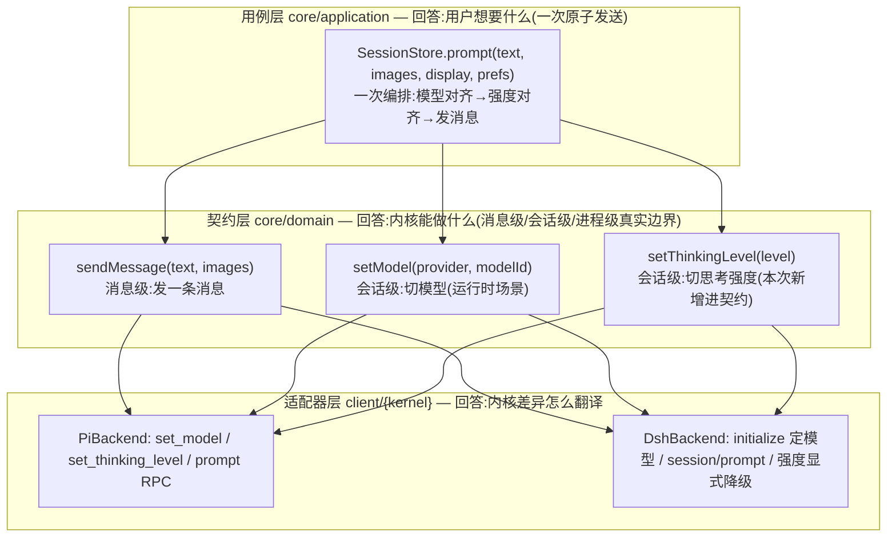

# 原子发送意图：模型/思考强度与消息的发送原子化

> Version: v1 | Date: 2026-03-27 | Author: claude
> 前置设计：本文在 `session-model-config.md`（会话是状态、头行 model 域三字段）、
> `composer-apply-timing.md`（点选=内存 pending、发送=落盘）、`base-interface-lineage.md`（BaseBackend 契约）、
> `abstract-backend.md`（三段式骨架）之上收敛，不推翻任何一条既有归属结论。

## 0. 摘要

现状里用户「发起一次 LLM」在 renderer 被拆成 **setModel + setThinkingLevel + sync + prompt 四条 RPC**，其中 `setThinkingLevel` 还是 pi 专属扩展面（`PiCapabilities`），dsh 下静默 no-op。本文把它收敛为一个原子意图：renderer 只调一个入口，main 侧 `SessionStore.prompt()` 一次编排「模型对齐 → 思考强度对齐 → 发消息」；契约保持**消息级 / 会话级分离**，把 `setThinkingLevel` 从 `PiCapabilities` 提升进 `BaseBackend`（dsh 显式降级，不再静默吞）。

一句话判断：**「发送是原子的」这个诉求，落点是用例层的编排原子化，不是契约层把模型塞进 `sendMessage`。** 理由见 §2.2。

---

## 1. 问题

### 1.1 一次发送被拆成四条 RPC

renderer 统一写口 `src/api/renderer/stores/session-store.ts` 的 `sendMessage()` 发送前干了四件事：

```ts
// pending 回灌 / 头对齐 / fallback 三段,每段都是:
await window.pi.sessions.setModel(...);          // RPC 1
await window.pi.sessions.setThinkingLevel(...);  // RPC 2
await window.pi.sessions.sync();                 // RPC 3
// ...
await window.pi.sessions.prompt(...);            // RPC 4(这才是真发送)
```

这三段（pending 回灌 / 头对齐 / fallback）在 renderer 侧各自手写一遍「读来源 → setModel → setThinkingLevel → sync」，编排逻辑散在 UI 层，而非收在用例层。

### 1.2 根因一：回灌编排泄漏到 renderer

`session-model-config.md` §4.3 已把「send 前回灌」定为用例层语义（pending 优先、否则读头、再否则 fallback），但执行仍落在 renderer 的 `sendMessage()` 里。回灌的三级来源（pending / 头 / fallback）和「差异执行 + 双写头」的编排，本该是 `SessionStore` 的内部职责，现在被 renderer 拆成三条 RPC 各自表达。

### 1.3 根因二：thinkingLevel 是 pi 专属扩展面，dsh 静默缺面

`setThinkingLevel` 不在 `BaseBackend`，在 `PiCapabilities`（`core/domain/backend.ts`）。main 侧 `SessionStore.setThinkingLevel()` 对 dsh 的处理是：

```ts
if (!proc.backend.capabilities.pi) return;   // dsh 静默吞掉
```

这是 §1.5「多内核默认」明令禁止的**静默缺面**——dsh 下用户设置思考强度，既不翻译、不补面、不降级，而是静默吞掉。而 dsh 侧确有对应语义 `reasoningEffort`（`client/dsh/dsh-config-source.ts`，`agent-default-model` 命名空间），形状不同（配置而非运行时 RPC）。

### 1.4 用户诉求：发送是原子意图

用户心智模型里「发起一次 LLM」= 内容 + 模型 + 思考强度，一次给全。现状把一次意图拆成四条 RPC，其中两条还是「发送前的准备动作」，是壳的编排细节泄漏到契约和调用方。

---

## 2. 终态

### 2.1 三层职责



- **契约层**：`sendMessage`（消息级）、`setModel`（会话级）、`setThinkingLevel`（会话级，新增）各归其位，表达内核真实的能力边界。
- **用例层**：`SessionStore.prompt()` 把「一次发送」编排成一个原子方法，回灌三级来源（pending / 头 / fallback）和差异执行都收进这里。
- **适配器层**：pi/dsh 各自翻译「切模型 / 切强度 / 发消息」，内核差异（dsh 模型进程级、强度无运行时 RPC）在这里消化。

### 2.2 为什么不把 provider/model 塞进 sendMessage 契约（关键论证）

用户「一次发送带模型」的直觉，落在**用例层**而非**契约层**，三条硬理由：

1. **模型是会话级状态，不是消息级参数。** `session-model-config.md` §2.1 已拍板「默认是配置、会话是状态」：模型/深度持久化在会话头 model 域，语义是「这个会话用什么」，不是「这条消息用什么」。把 provider/model 塞进 `sendMessage` 参数，等于把会话级状态伪装成消息级参数，与已定的归属翻转直接冲突。

2. **dsh 的模型是进程级参数（initialize 时定）。** dsh 换模型只能「停旧进程、带新 provider/model 重启 initialize」，`sendMessage` 在 dsh 下无法兑现「带模型」——要么适配器自己重启自己（违反「进程生命周期归 SessionStore」的既有边界，`abstract-backend.md` 与 `base-interface-lineage.md` 都写明 start/stop/多进程调度归壳），要么壳在 sendMessage 前先把模型变更编排掉（那塞进 sendMessage 就纯属冗余）。

3. **`setModel` 还服务「运行时切模型但不发送」的独立场景。** composer `immediate` 模式、`cycleModel`、`cycleThinkingLevel` 是「切换」动作，不是「发送」动作，需要 `setModel` 作为独立意图存在。把模型并进 sendMessage 会让这两个场景失去落点。

正解：**原子性放用例层（`prompt`），能力边界留契约层（`sendMessage` / `setModel` / `setThinkingLevel`）。** 用户「一次给全」的体验由 `prompt()` 兑现，内核的「模型是进程级/会话级」由适配器兑现，两者不在同一层，不互相污染。

### 2.3 为什么 setThinkingLevel 提进契约，getThinkingLevels 留 pi 扩展面

- **setThinkingLevel 提进契约**：它是「发送参数之一」（用户一次发送带思考强度），且 dsh 有 `reasoningEffort` 对应语义（形状不同 = 适配器翻译/降级），符合 §1.5「壳必须向每个内核索要它」——pi 兑现为 `set_thinking_level` RPC，dsh 显式降级（无运行时切换 RPC，`reasoningEffort` 只在 settings.yaml 启动时定）。这同时根治 §1.3 的静默缺面。
- **getThinkingLevels 留 pi 扩展面**：它是「可用档位清单」的**显示**数据源，不在发送路径上。dsh 侧无对应物（`reasoningEffort` 无清单 RPC），属独立的「档位发现」缺口。本文不扩大范围，标注演进——composer 对 dsh 显示空档位即可。

---

## 3. 契约变化

### 3.1 `BaseBackend` 新增 `setThinkingLevel`

`core/domain/backend.ts` 的 `BaseBackend` 新增（与 `setModel` 并列的会话级意图）：

```ts
/** 设置思考强度档位(会话级状态,与 setModel 同级)。可缺面:pi=set_thinking_level RPC;
 *  dsh 无运行时切换( reasoningEffort 只在 initialize/settings.yaml 定)→ 显式降级抛错。 */
setThinkingLevel(level: string): Promise<void>;
```

### 3.2 `AbstractBackend` 给缺面默认

`client/backend/abstract-backend.ts` 加一条缺面默认（不新增 abstract，因为它可缺面）：

```ts
/** 缺面默认:内核不支持思考强度运行时切换 → 显式抛错,不静默吞(§7.6)。子类可 override。 */
setThinkingLevel(_level: string): Promise<void> {
  return Promise.reject(new Error("当前内核不支持思考强度切换"));
}
```

基类形态变为 **15 abstract + 4 缺面默认**（新增 `setThinkingLevel`）。

### 3.3 `PiCapabilities` 删除 `setThinkingLevel`

`core/domain/backend.ts` 的 `PiCapabilities.setThinkingLevel`（`:180`）删除——进契约后，壳不再经 `asPi().setThinkingLevel()` 调它。`PiBackend` 的 `setThinkingLevel` 从「实现 PiCapabilities」改为「override AbstractBackend 的契约方法」，签名对齐 `Promise<void>`。

### 3.4 契约形状前后对照

| 项 | 现状 | 终态 |
|---|---|---|
| `sendMessage` | 消息级（不变） | 消息级（不变） |
| `setModel` | 会话级（不变） | 会话级（不变） |
| `setThinkingLevel` | pi 专属（`PiCapabilities`），dsh 静默 no-op | 契约级（`BaseBackend`），dsh 显式降级抛错 |
| `getThinkingLevels` | pi 专属（`PiCapabilities`） | pi 专属（不动，留演进） |

---

## 4. 用例层：SessionStore.prompt

### 4.1 编排序列

`src/core/application/sessions/session-store.ts` 扩展 `prompt` 签名（承载现有收尾 + 把 renderer 的回灌编排收进来）：

```ts
async prompt(text: string, images?: ImageInput[], display?: DisplayMeta, prefs?: SessionModelPrefs): Promise<void> {
  // 1. 会话保证:无活跃会话则按 prefs.kernel/provider/model 起(ensureForSend 已在 setModel 内,这里先起会话)
  // 2. 模型对齐(差异执行):prefs.provider/modelId 有 → ensureForSend(kernel, provider, model) + setModel(差异)
  // 3. 强度对齐(差异执行):prefs.thinkingLevel 有 → setThinkingLevel(经契约,dsh 下抛错显形)
  // 4. 双写头(模型三字段,复用 writeModelPrefsToHeader)
  // 5. 发消息:backend.sendMessage(text, images)
  // 6. 收尾:中立层 user entry、synthetic sessionStart、自动命名(prompt 现有一切收尾不动)
}
```

关键点：回灌的**三级来源判定（pending / 头 / fallback）仍留在 renderer**（那里有 ui-store 的 pending、list 的 headerPrefs），但判定结果收敛成**一个 `SessionModelPrefs` 对象**传下来；**差异执行 + 双写 + 发消息**在 `prompt()` 内部一次完成，renderer 不再逐条 RPC。

### 4.2 差异执行与双写不变

`setModel` / `setThinkingLevel` 的「差量执行（进程已持目标值则跳过）」和「RPC 成功后双写头」逻辑**一行不动**（`session-model-config.md` §4.1/§4.3 已定）。`prompt()` 只是把它们编排进一个原子序列，不改变单条意图的语义。

### 4.3 dsh 显式降级路径

`prefs.thinkingLevel` 非空且当前内核是 dsh 时，`setThinkingLevel` 抛「当前内核不支持思考强度切换」。该错误沿 `prompt()` 的现有错误通道显形（renderer 的 `modelApplyFailed`/`thinkingApplyFailed` toast），不再静默。composer 对 dsh 的强度下拉已置灰（`capabilities` 降级），正常路径不会触达；触达即显形，不伪造成功。

---

## 5. 各层实现影响

### 5.1 renderer store（`src/api/renderer/stores/session-store.ts`）

`sendMessage()` 的三段回灌收敛为：拼出一个 `prefs: SessionModelPrefs`（pending 优先 → `readHeaderPrefs` → `getFallbackModel`），然后**一次** `window.pi.sessions.prompt(text, images, display, prefs)`。删除 `setModel`/`setThinkingLevel`/`sync` 的逐条调用与 `needSync` 逻辑。

### 5.2 IPC / preload

- `src/api/ipc/sessions.ts`：`session.prompt` 处理器扩展为接受 `prefs`（或新增 `session.send` 通道，二选一，推荐扩展 `prompt` 签名，避免双通道漂移）。
- `src/api/preload/ipc-channels.ts` / `preload.ts`：`window.pi.sessions.prompt` 桥签名加 `prefs`。
- `packages/react/src/plugin-context.ts`：`messaging.prompt` 透传 `prefs`（若有插件直调）。

### 5.3 timeline（`src/plugins/sessions/timeline/renderer/index.tsx`）

`pickModel`/`pickLevel` 的 `onSend` 分支**不动**（仍写内存 pending）；`immediate` 分支**不动**（仍走 `ctx.models.setModel`/`setThinkingLevel`，运行时切换场景保留）。`doSend` 经 renderer store 的 `sendMessage` 走新 `prompt()`，自身零改动。

### 5.4 适配器（`client/pi/pi-backend.ts` / `client/dsh/dsh-backend.ts`）

- `PiBackend.setThinkingLevel`：从「实现 `PiCapabilities`」改为「override `AbstractBackend.setThinkingLevel`」，签名 `Promise<void>`，内部仍发 `set_thinking_level` RPC（实现体不动）。
- `DshBackend`：不 override，继承基类缺面默认（抛错）。删掉 `session-store` 里 dsh 的静默 `return` 路径（由基类抛错接管）。

---

## 6. 边界与差错

1. **pending 失败保留**：`setModel`/`setThinkingLevel` RPC 拒绝时，`prompt()` 抛错，renderer 的 pending **不消费**（`session-model-config.md` §4.1 已定「只有执行成功才能消费意图」），toast 显形。
2. **dsh 强度降级不阻断发送**：`prefs.thinkingLevel` 在 dsh 下抛错会阻断整个 `prompt()`。需在 §4.1 判定里先按内核分流——dsh 且 prefs 带强度时，**强度降级为「忽略 + 不抛」还是「显形抛错」**，取决于是否要 dsh 用户在 composer 看到明确反馈。终态取「composer 已置灰强度入口 → 正常不触达；触达即抛错显形」。
3. **模型变更的进程级编排仍在 SessionStore**：`ensureForSend` 的「模型变了 → 停旧起新」不动，`prompt()` 的模型对齐经它完成，适配器不自己重启。
4. **旧会话无 model 域**：`prefs` 为 null 时 `prompt()` 只发消息，不做任何对齐——`session-model-config.md` §2.2 已定「从没自定义过的不钉死」。

## 7. 验证矩阵

| 场景 | 预期 |
|---|---|
| pi 新会话首发（无 pending 无头） | `prompt()` 一次编排 fallback 模型 + 发消息，首条跑在正确模型上 |
| pi 活会话 onSend 点选后发送 | pending 回灌 + 发消息一次完成，分隔线贴着问题 |
| pi 连续多轮不改 | 差量执行跳过 setModel/setThinkingLevel，零多余 RPC |
| dsh 发消息 | 强度入口置灰，`prompt()` 无强度路径，模型经 initialize 定 |
| dsh 且 prefs 带强度（异常触达） | `setThinkingLevel` 抛错显形，不静默 |
| fork/rewind 后发送 | 回灌来源读头，`prompt()` 统一编排，无 renderer 独立 flush 拷贝 |

## 8. 被否决方案

1. **把 provider/model/thinkingLevel 全塞进 `sendMessage` 契约**：违反「会话是状态」（§2.2 理由 1），且 dsh 模型是进程级参数、适配器无法在 sendMessage 内兑现（理由 2），`setModel` 的运行时切换场景失去落点（理由 3）。
2. **只删 renderer 的回灌、不动契约**：dsh 的 `setThinkingLevel` 静默 no-op 仍在，静默缺面不除，属「打补丁不治根因」。
3. **把 getThinkingLevels 一并提进契约**：范围外（显示而非发送），dsh 无清单对应物，留演进不预支。
