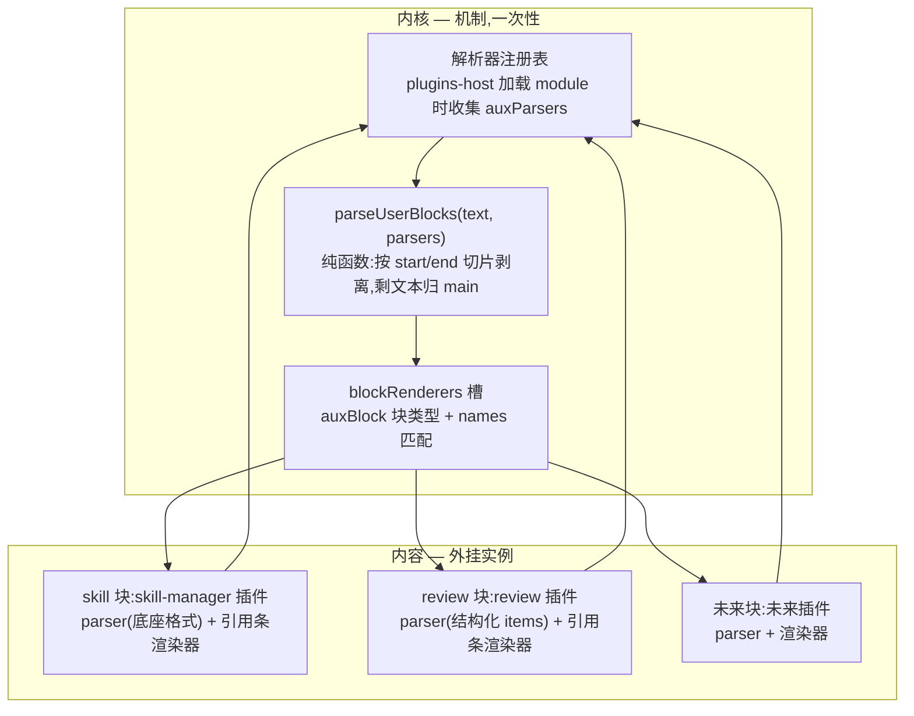
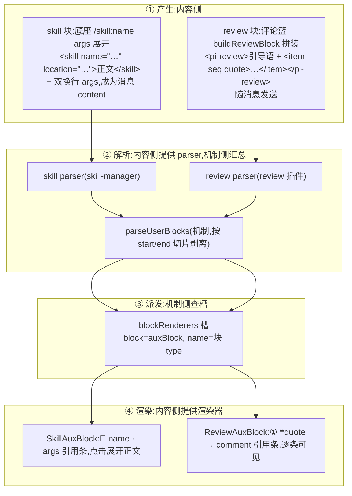
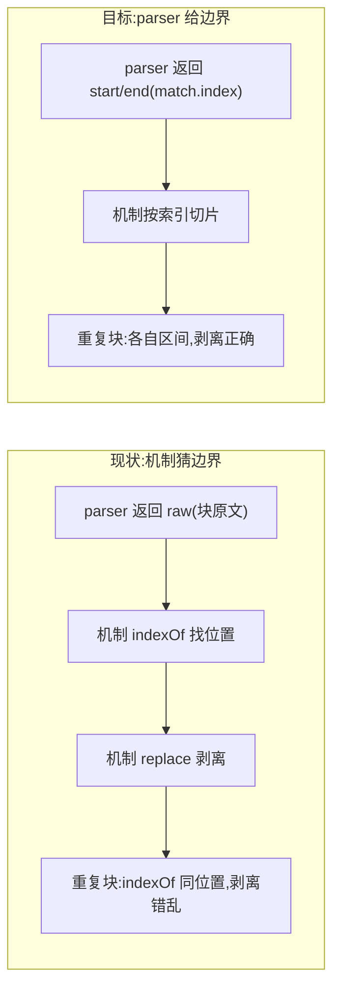
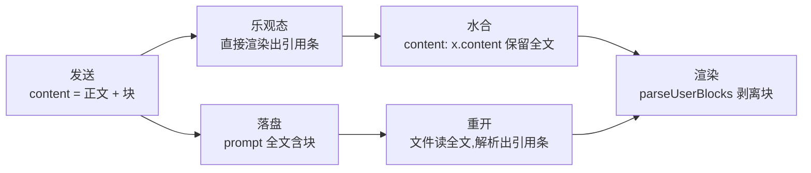

# auxBlock 机制：结构化块的识别、派发与展示

> **本文是 auxBlock 的唯一真相源**，合并自：`aux-block-mechanism.md` 原版（机制骨架，`1b6a027` 落地）、`aux-block-refine.md`（机制落地后的四处偏差修正 + 一处独立追加）、更早的 `skill-block-hosting.md` 与 `review-fix.md`（已并入 refine 后删除）。后三者的内容全部并入本文，原文件作废删除。
>
> 本文同时描述**已落地骨架**与**待实施修正**，落点清单（§10）逐项标注状态；修正全部落地前，以本文 §10 为准判断哪些行为还是旧形态。

判断基准，全文所有决策都从它推出：**会话流（timeline）是机制提供方，review 和 skill 是内容提供方**。机制提供"能挂东西"的能力——块解析汇总、槽位派发、渲染分发；内容提供"挂上去的东西"——某一种块的解析器和渲染器。机制不该认识任何具体块类型，内容不该碰机制的内部。

## 1 问题与核心决策

### 1.1 问题：结构化辅助块被当纯文本渲染

用户消息的 content 里会混入两类"机器可识别、但对用户是噪声"的结构化块：

- **skill 展开块**：输入 `/skill:arch-to-code` 后，pi 底座 `_expandSkillCommand` 把它展开成 `<skill name="…" location="…">\nReferences are relative to …\n\n<SKILL.md 正文>\n</skill>`，整块成为用户消息 content（落盘 + 回放）。气泡里显示一大坨 SKILL.md 正文。
- **review 评论块**：review 插件把评论篮拼成结构化块（§6.1），随消息发送。识别不出来就裸显一坨"① quote → comment"。

两类块形态不同但本质相同：结构化的、冗长的、用户发送时自己知道内容的东西被无差别地当正文渲染。

### 1.2 核心决策：机制与内容分离

块解析和渲染不能硬编码在内核里——加第三种块又要改内核：

- **内核只提供机制**（一次性建好，之后冻结）：怎么发现"文本里有结构化块"（解析器注册表）、怎么把块派发给渲染器（复用既有 blockRenderers 槽）；
- **具体块类型全是内容**：skill 块是 skill-manager 插件实例（底座协议），review 块是 review 插件实例，未来任意块是任意插件实例——新插件贡献"解析器 + 渲染器"两样东西，内核零改动。



**图 1 — 内核提供识别与派发，块类型全在内容层**

### 1.3 骨架落地后的四件偏差与一件追加

`1b6a027` 落地了机制骨架，骨架是对的，但留下四件不干净的事（全部待实施，见 §10）：

1. **评论发送当轮在 UI 上消失**（§5）：块进了 `__sendText` 却进不了 `content`——发送丢、重开回、resync 回的三态分裂。
2. **解析契约让机制用 `indexOf` 猜块的边界**（§3.1）：parser 精确知道边界（`match.index`），契约却只给 `raw` 字符串让机制去猜，重复块剥离错乱。
3. **skill 块的内容焊死在机制插件 timeline 里**（§4.2）：提供槽位的插件同时贡献了槽上内容，机制与内容分离的破口。
4. **块展示形态从用户喜欢的引用条退化成折叠卡**（§8）：评论是要扫的，不是要点的。

另有一件独立追加：**模型侧引导语缺失**（§6.2，与四件事无依赖，纯内容）。

## 2 auxBlock 块的生命周期

一个 auxBlock 从产生到显示走四步，每一步都有明确的归属。全文围绕这张图展开：



- **① 产生**：块诞生在两个地方——skill 块是底座展开用户输入 `/skill:name args` 的产物，review 块是评论篮拼装后随下一条消息发送的附件。块都是**用户消息 content 的一部分**（落盘 + 回放都带着），`message.content` 是唯一数据真相源（§5），渲染层只做识别、剥离、按形态展示，不做存储。
- **② 解析**：每个块类型贡献一个 parser（纯函数，扫文本提取本类型完整块，并精确给出块在原文中的 `start/end`）。机制侧 `parseUserBlocks`（`src/core/domain/aux-blocks.ts`）汇总所有 parser 的结果，按 `start` 排序，按区间切片剥离得正文 `main`；timeline 的 `decomposeMessage` 调用它，把消息 content 变成块序列。parser 是内容的，汇总剥离是机制的。
- **③ 派发**：剥离出的块经既有 `blockRenderers` 槽分发——`block: "auxBlock"` 匹配词汇，`names` 匹配块 `type`（skill / review / 未来任意）。查槽、order、覆盖语义全部复用既有机制，机制侧零新增。
- **④ 渲染**：渲染器是内容的最后一环，也是形态调整的落点。review 和 skill 是**同一渲染抽象的两种数据形态**：共享同一套引用条视觉（muted 小字、右对齐），只是载荷密度不同——review 条逐条摊开（每条 `① ❝quote → comment`，纯展示），skill 条是一行摘要（`🧠 name · args`，正文点击展开）。

## 3 内核机制（一次性，之后冻结）

### 3.1 `core/domain/aux-blocks.ts`（圆心，零依赖）

```ts
/** 解析出的结构化块:内核只认 type + 泛型 data,不感知任何具体块的形状。 */
export interface AuxBlock {
  /** 块类型("skill" | "review" | 未来任意)。 */
  type: string;
  /** 块载荷,形状由贡献方定义。 */
  data: unknown;
  /** 块在原文中的起止位置(start inclusive, end exclusive)——由 parser 精确给出。 */
  start: number;
  end: number;
}

/** 块解析器契约:基于原文扫描,提取所有本类型完整块;无匹配返回 null。
 *  解析器互不干扰(各扫各的类型),由 parseUserBlocks 汇总排序。 */
export interface AuxBlockParser {
  /** 解析器 id(注册去重/覆盖用)。 */
  id: string;
  parse(text: string): { blocks: AuxBlock[] } | null;
}

/** 汇总所有解析器结果:按块 start 排序(文本顺序保真),
 *  按 [start, end) 区间切片剥离全部块得 main(压缩连续空行再 trim)。
 *  组合场景(skill 块 + review 块共存)天然正确,与解析器注册顺序无关。 */
export function parseUserBlocks(text: string, parsers: AuxBlockParser[]): { main: string; blocks: AuxBlock[] } {
  if (!text || parsers.length === 0) return { main: text, blocks: [] };
  const found: { block: AuxBlock; pos: number }[] = [];
  for (const p of parsers) {
    const r = p.parse(text);
    if (!r) continue;
    for (const b of r.blocks) found.push({ block: b, pos: b.start });
  }
  found.sort((a, b) => a.pos - b.pos);
  const blocks = found.map((f) => f.block);
  if (blocks.length === 0) return { main: text, blocks: [] };
  // 按 [start, end) 区间切掉块,区间不重叠(同一文本位置只被一个 parser 认领)
  let cursor = 0;
  let main = "";
  for (const b of blocks) {
    main += text.slice(cursor, b.start);
    cursor = b.end;
  }
  main += text.slice(cursor);
  return { main: main.replace(/\n{3,}/g, "\n\n").trim(), blocks };
}
```

契约要点（相对 `1b6a027` 骨架的变化）：



**图 2 — 契约硬化：边界由机制猜 → parser 给**

- **`raw` 字段删除，`start/end` 由 parser 给**。渲染层不消费原始文本字段(渲染用的是 `data`),剥离靠切片不靠文本替换。parser 的 `parse` 签名不变(`(text) => { blocks } | null`),只要求构造 `AuxBlock` 时填上 `start/end`--正则 `matchAll` 循环里 `m.index` 和 `m.index + m[0].length` 直接就是。
- **排序、剥离全走数值索引，重复块天然正确**——两条内容完全相同的块（用户对同一段文字评两次同样的话，是正当场景）各有唯一的 `[start, end)` 区间，切片互不干扰。`1b6a027` 骨架的 `indexOf(raw)` 在重复块上永远指向第一个，剥离错乱。
- **区间不重叠由 parser 自扫自的类型保证**（skill parser 只认 `<skill>` 标签、review parser 只认 `<pi-review>` 标签，同一文本位置不会被两个 parser 同时认领）。若真有 parser 写坏导致重叠，属 parser 缺陷（bug），不是契约兜底——机制按 parser 给的区间切片，重叠时后切的内容可能漏回正文，由 parser 的测试拦住，机制不猜。

### 3.2 `packages/react/src/aux-block-parsers.ts`（renderer 注册表）

模块级注册表（与 plugin-modules 同模式）：

```ts
const parsers: AuxBlockParser[] = [];
export function registerAuxParsers(ps: AuxBlockParser[]): void;
export function getAuxParsers(): AuxBlockParser[];
```

### 3.3 `api/renderer/plugins-host.ts`

`loadBuiltin` / `loadThirdParty` 里与 `mod.channels` 同批收集 `mod.auxParsers` → `registerAuxParsers`。卸载时不需要摘除（解析器是纯函数，多跑一次无害；插件卸载后其块类型不再产生，注册表残留一个不匹配任何文本的 parser 无副作用）。

### 3.4 blockRenderers 槽

`BlockRendererContribution.block` 词汇含 `"auxBlock"`（开放字符串，纯类型扩展）。解析规则（names 匹配块 type）、order、覆盖语义**全部复用既有机制**，registry/block-renderers.ts 零改动。渲染器 props 契约 `{ aux: AuxBlock }`。

## 4 skill 块：skill-manager 内容插件（底座协议）

> **归位说明**：`1b6a027` 骨架把 skill parser 和渲染器放在了 timeline 插件内部（`timeline/renderer/skill-aux.tsx`），timeline 的 plugin.json 自己贡献 `auxBlock/skill`——提供槽位的插件同时贡献了槽上内容，机制与内容分离的破口。本节是归位后的目标形态：skill 块是 skill 域的功能，归 skill-manager（skill 域的内容插件，有 renderer、有四语言 locales、管技能开关），同域内聚。与 review 对照：review 的 parser、渲染器、交互全在自己插件里——那才是内容插件的正确形态，skill 归位后与 review 同形。

### 4.1 解析器：去锚定，扫描式提取

骨架版正则 `^<skill …>…</skill>(?:\n\n([\s\S]+))?$` 用 `^`/`$` 锚定整条消息，且 args 捕获贪婪。底座只对"整条消息以 `/skill:` 开头"展开，锚定在当下能跑通，但有两个隐藏破口：

1. **组合场景**——发 skill 时评论篮有货，review 块被并进 args 尾部，贪婪 args 会把 review 块原文吞进去，skill 条的 args 摘要被污染；
2. **契约脆弱**——块一旦不独占消息开头（底座行为变化、消息经重试/编辑后结构变动），正则整体失配、整块裸显。

目标正则去锚定、扫描式提取：

```typescript
const SKILL_BLOCK_RE = /<skill name="([^"]+)" location="([^"]+)">\n([\s\S]*?)\n<\/skill>(?:\n\n([\s\S]+?))?(?=\n<|$)/g;

export const auxParsers: AuxBlockParser[] = [{
  id: "skill",
  parse(text: string) {
    const blocks: AuxBlock[] = [];
    for (const m of text.matchAll(SKILL_BLOCK_RE)) {
      const [, name, location, content, args] = m;
      blocks.push({
        type: "skill",
        data: { name, location, content, args: args?.trim() || undefined },
        start: m.index,
        end: m.index + m[0].length,
      });
    }
    return blocks.length > 0 ? { blocks } : null;
  },
}];
```

- 去 `^`/`$`，`g` 标志 + `matchAll` 扫全文，每个匹配的 `m.index` 直接填 `start/end`——正文在前的组合场景天然识别。
- args 捕获改非贪婪 `([\s\S]+?)` + 前瞻 `(?=\n<|$)`：args 从双换行后开始、非贪婪增长，停在**第一个满足 `\n<` 的位置之前**——单 skill 消息时 args 一路收到串尾（普通正文不以 `<` 开头，不触发前瞻），组合场景时 args 在 `<pi-review>` 前停住，review 块留给 review parser 独立提取，skill 条的 args 摘要不被污染。
- **前瞻保持宽匹配 `\n<`，不收紧成"只认已知块标签"**：收紧意味着 skill parser 的正则要引用 review 的标签名——内容插件之间互相感知格式，横向耦合。args 里出现以 `<` 开头的行导致截断是已知边界，见 QA。
- `data = { name, location, content, args }`；location 是 data 字段但不渲染（Windows 反斜杠路径是噪声）。

### 4.2 物理迁移

`src/plugins/sessions/timeline/renderer/skill-aux.tsx` 整体迁到 `src/plugins/manager/skill-manager/renderer/skill-aux.tsx`。配套改动四件：

- `timeline/renderer/index.tsx` 删 `export { auxParsers, SkillAuxBlock } from "./skill-aux"`；`skill-manager/renderer/index.tsx` 加同名 export——`auxParsers` 走代码级声明（plugins-host 加载 module 时收集注册），`SkillAuxBlock` 走 manifest 组件自动匹配，两条注册路径跟 review 完全一致。
- `timeline/plugin.json` 删 `contributes.blockRenderers` 的 `auxBlock/skill` 项；`skill-manager/plugin.json` 加同形状项（`{id: "skill-aux", block: "auxBlock", names: ["skill"], component: "SkillAuxBlock", order: 100}`）。
- **i18n 随迁**：`timeline.skillRef`（四语言 `timeline.json`）迁为 `skill-blocks.skillRef`（四语言 `skill-manager/locales/*/settings.json`）。文案跟内容走：skill 内容在 skill-manager，文案就不该横跨到 timeline 的包里。
- **无特权差异**：迁入后 skill 块渲染跟 review 一样是普通内容贡献——第三方可用同 contribution id 整规则替换覆盖；删掉 skill-manager，skill 块按正文裸显，机制不受影响，天然降级路径。

## 5 数据真相源：content 是唯一真相源

### 5.1 三条路径，发送路径丢块（待修）

数据真相源始终在消息文本里——底座把用户消息的完整 content 落盘进会话文件，重开与 resync 都从这个落盘全文读回。但块在会话里走三条路，只有发送路径丢：

- **发送路径**（丢）：`sendMessage` → `appendOptimisticUser(text, sendText)`，content 只有正文 → 水合保留乐观 content → 块永远进不了渲染层。
- **重开路径**（不丢）：`openSession` 直接读会话文件，content 就是落盘全文（含块），`parseUserBlocks` 正常解析。
- **resync 路径**（不丢）：快照替换时 `onSnapshot` 用文件重扫的 messages 覆盖内存，content 同样是落盘全文（含块），行为与重开一致。

从用户视角是两种命运（发送丢、重开回），从数据视角是三态分裂（发送时拼、水合时丢、重开时回）——发送当轮恰是"丢"的那一种，而用户发送后看到的第一眼就是发送当轮。`1b6a027` 骨架接受过"乐观回显阶段评论块不显示，落盘回放后出现——秒级延迟"的取舍，本节推翻它：这不是取舍，是没看到发送路径的数据形态。

### 5.2 决策：乐观 content 直接放全文

修复方向不是给乐观消息单独挂块、也不是渲染层二次拼接，而是让 `message.content` 直接含块——乐观态、水合态、落盘态、重开态用同一条数据，渲染层只有 `parseUserBlocks` 一条解析路径。content 就是唯一真相源，块从哪来、往哪去，只有一个答案。



`session-store.ts` 的 `sendMessage` 一处改动。拼装现状不动：评论块由 timeline 的 `doSend` 在发送时经 `sendSuffix: src?.promptFragment` 拼入实发全文（`src` 来自 `timeline:composerAttachments` 通道的 `promptFragment`，由 review 的 `buildReviewBlock` 产出）——只改乐观回显的 content：

```ts
// 改动前
const sendText = [finalText, opts?.sendSuffix].filter(Boolean).join("\n");
get().appendOptimisticUser(text, sendText);   // content = text(正文),块只在 sendText 里

// 改动后
const sendText = [finalText, opts?.sendSuffix].filter(Boolean).join("\n");
get().appendOptimisticUser(sendText, sendText); // content = 全文(含 sendSuffix 拼装块)
```

`appendOptimisticUser` 的第一个形参写进 `content`、第二个写进 `__sendText`——两个都传 `sendText`，content 自此就是全文。`__sendText` 保持全文不变，`applyEvent` 的双轨匹配键（`textOf(m.content) === text || m.__sendText === text`）第一轨（content 对回放全文）现在恒命中，第二轨成为冗余——本次不删（双轨匹配涉及三处水合分支，避免扩大批次），标为演进（§10）。

**为什么水合契约一行都不用改**：`applyEvent` 的三处水合分支（messageStart / messageEnd / entryAppended）写的是 `content: x.content`——保留乐观消息的 content。以前这会丢块，现在乐观 content 本身就是全文，保留全文正是我们要的。水合逻辑不感知块的存在，它只是忠实地保留乐观内容，这个语义从第一天起就是对的，错的只是发送时没把块放进乐观 content。

### 5.3 连带收益

- **纯评论发送**（正文为空、只有评论）时 `sendText` 就是块文本，content 只有块——渲染层 `main` 为空不出 userText 气泡、只出引用条，没有空气泡。
- **工具限制前缀**照常：`finalText` 带 `[System]` 前缀时它也进 content，渲染层 `stripToolLimitNote` 剥除，行为不变。
- **重发/重试**：同文重发时 content 含块，块解析显示，与首次发送一致。

## 6 review 块：review 插件实例（结构化条目）

review 比 skill 复杂一步：块带**结构化数据**，渲染不是"显示一坨文本"而是**渲染条目列表**。

### 6.1 块格式（构造与解析同源，在 review 插件内）

```
<pi-review>
以下是用户对之前回复的评论,请据此修改:
<item seq="①" quote="被评论的代码原文摘录">评审意见一</item>
<item seq="②" quote="另一段原文">评审意见二</item>
</pi-review>
```

- `seq`/`quote` 是 `item` 属性，评论文本是 `item` 内容；
- 文本与属性转义对称（构造 escape、解析 unescape）：`&` `<` `>` 文本转义，`"` 属性转义；
- `data = { count, items: [{ seq, quote, comment }] }`。

### 6.2 模型侧引导语（待实施）

评论块是发给模型的内容，但裸 `<pi-review>` 块里模型只看到一串 `seq`/`quote` 属性，没有一句话告诉它"这是用户对之前回复的评论"。旧机制里 `promptHeader`（设置页可配的提示语）就是干这个的，`1b6a027` 删设置页时把它一起删了。

方案：`buildReviewBlock` 在 items 之前输出一行引导语，文案走 i18n（新增 key `shell.reviewPromptHeader`，补 zh-CN / zh-TW / en / de 四语言）：

- 引导语在块内但不在 `<item>` 里，解析器的 itemRe（匹配 `<item …>…</item>` 条目的正则）只匹配条目，引导语对渲染层透明、只对模型可见——既补上语义提示，又不干扰引用条展示。构造/解析仍同源，不引入第二个格式源。
- **为什么不恢复模板设置页**：`promptHeader` / `itemTemplate` 模板的自由度与解析器强耦合——用户把模板改成任意格式，解析器就认不出来，评论块直接消失，这正是"剥离失败即裸显"的老问题，恢复模板等于把 bug 请回来。引导语固定、条目结构固定，单源、可解析、模型可读，三者兼得。

### 6.3 构造

`composePromptFragment` 为 `buildReviewBlock(comments)`：引导语 + 条目由评论篮数据拼成 item 结构。`promptHeader` / `itemTemplate` 模板配置**已退役**（条目形状由块结构固定，不再允许用户拼装格式；设置页模板编辑与 format store 一并删除）。

### 6.4 解析器（待实施）

review 的 parser（`src/plugins/sessions/review/renderer/index.tsx`）从 `exec` + `while` 循环改为 `matchAll`，在循环里取 `m.index` / `m.index + m[0].length` 填 `start/end`。顺带放宽块边界正则的换行硬依赖（`/<pi-review>\n…\n<\/pi-review>/g` → `/<pi-review>\s*…\s*<\/pi-review>/g`），拼接格式微调不再裸显。构造侧 `buildReviewBlock` 和转义逻辑（`escapeText`/`escapeAttr`/`unescape`）不动——构造产出的文本格式是 parser 的输入契约，两者同源同步演进。

## 7 timeline 消费

### 7.1 `blocks.ts`

用户分支从 `stripToolLimitNote` 改为：

`decomposeMessage(message, auxParsers = [])` 签名注入解析器（注册表在模块加载期填充，调用方传 `getAuxParsers()`，保持本函数纯），user 分支：

```ts
const text = stripToolLimitNote(messageContentText(message.content));
const { main, blocks } = parseUserBlocks(text, auxParsers);
const out: TimelineBlock[] = [];
if (main) out.push({ type: "userText", text: main });
for (const b of blocks) out.push({ type: "auxBlock", aux: b });
return out;
```

`TimelineBlock` 含 `{ type: "auxBlock"; aux: AuxBlock }`。`decomposeMessage` 消费 `parseUserBlocks` 的返回值 `{main, blocks}` 并透传 `aux` 到渲染层，不读 `raw` 字段——`AuxBlock` 契约从 `raw` 换成 `start/end` 对它是透明的，**无逻辑改动**（若类型报错仅同步 import）。

### 7.2 `block-renderer.tsx`

`BlockRenderer` switch 的 `auxBlock` 分支：`<Comp aux={block.aux} />`。`PlainBlockFallback` 对 auxBlock 不渲（无短文本可显示）。

## 8 展示形态：引用条

### 8.1 形态决策：折叠卡 → 引用条

两个形态渲染同一份数据（`AuxBlock.data`），差别只在渲染器的布局和交互：

```text
折叠卡(1b6a027 形态,用户判定很丑)      引用条(回归,v0.5.0-beta 视觉)
┌─────────────────────┐         ┌─────────────────────┐
│ 💬 评论 N 条      ▸  │         │ ① ❝被评原文 → 意见一 │
│   ▸ ① ❝… 意见一     │    →    │ ② ❝另一段 → 意见二   │
│   ▸ ② ❝… 意见二     │         └─────────────────────┘
└─────────────────────┘
```

- **折叠卡**把信息藏起来，要点击才知道有多少条、是什么——评论是要扫的，扫描被点开打断。
- **引用条**逐条可见，muted 小字、quote 斜体截断、行内 `→` 连接，一眼扫完所有评论。
- composer 附件条（发送前的评论篮）两个版本一直一样（chip 式 `① ❝quote → comment ✕`），变的只有消息里的展示形态——这正说明展示形态是渲染器（内容）的事，不是机制（解析/派发）的事：改形态只动渲染器，机制一行不改。

### 8.2 review 引用条：逐条可见、无展开、无跳转

`ReviewAuxBlock` 逐条渲染 `data.items`（每条 = `seq` + `quote` + `comment`），视觉对齐 v0.5.0-beta 的引用条（当时叫 echo 徽章，`1b6a027` 退役 echo 机制后视觉随之消失，本次以块数据重做）：`seq` accent 色、`quote` 斜体截断、`→` 分隔、`comment` 截断。条与条之间 `gap-1` 竖排，右侧对齐——跟用户气泡同一侧。

- **不保留展开态**：v0.5.0-beta 的引用条就是纯展示、不可点、不可展开；quote 和 comment 超长时行内截断，完整内容在消息原文里本来就有（quote 是被评原文、comment 是用户自己写的），无需展开态。
- **不做点击交互**（quote 不可点、无跳转）：composer 附件条有 `scrollToMessageId` 跳原文，那是发送前的编辑态、用户需要回看被评位置；消息里的引用条是发送后的静态呈现，quote 原文就在正上方的气泡流里，无需再跳。

```tsx
/** review 块渲染(blockRenderers 槽 auxBlock/review,props 契约 {aux})。
 *  引用条形态:无边框、每条评论一行横排、seq(accent) + ❝quote(斜体截断) +
 *  → + comment,靠右对齐,默认逐条可见。 */
export function ReviewAuxBlock({ aux }: { aux: AuxBlock }): React.ReactNode {
  const data = aux.data as ReviewAuxData;
  if (!data.items?.length) return null;
  return (
    <div className="flex justify-end mt-1">
      <div className="flex flex-col gap-1 items-end max-w-full">
        {data.items.map((it, i) => (
          <div key={i} className="flex items-center gap-1.5 text-[length:var(--font-size-xs)] text-[var(--color-muted)] max-w-full">
            <span className="text-[var(--color-accent)] font-medium flex-none">{it.seq}</span>
            {it.quote && <span className="italic truncate min-w-0">❝{it.quote}</span>}
            <span className="flex-none">→</span>
            <span className="truncate min-w-0">{it.comment}</span>
          </div>
        ))}
      </div>
    </div>
  );
}
```

### 8.3 skill 引用条：一行摘要 + 正文点开

`SkillAuxBlock` 保持一行 `🧠 skill-name · args首行`，点击展开 SKILL.md 正文（`data.content`，max-h 限高滚动）。skill 的正文是几十行 SKILL.md，逐条摊开没有意义，摘要 + 展开是正确形态——**这与 review 的"逐条可见"不矛盾**：skill 条本身是一条（一个块 = 一个技能），展开看的是正文；review 条摊开的是多条评论，正文本来就在消息里无需展开。同一引用条抽象（muted 小字、右对齐），载荷密度由数据形状决定。skill 条同理无点击跳转（skill 引用的是技能不是消息片段）。

### 8.4 位置：气泡下方，v0.5.0-beta 原样

引用条渲染在**用户气泡正文之后**（`MessageRow` user 分支的 `renderBlocks()` 之后、`MessageActions` 之前），右侧对齐（`flex justify-end mt-1`）。用户习惯的阅读顺序：正文在先、评论在后——先看用户说了什么，再看他对模型哪里留了意见。skill 条同位置，先正文后技能引用。

## 9 已退役：echo 头行镜像

review 标签化后，评论数据（seq/quote/comment）就在消息文本的块里，渲染层直接解析。以下全链路**已删除**（`1b6a027` 落地）：

- `echoMirrorBySession` / `pendingEchoByCwd` / `ECHO_HEADER_DOMAIN` / `ECHO_MAX_PERSISTED` / `ECHO_SERIALIZE_BUDGET` / `REVIEW_FRAGMENT_SEP`
- `hashSendText` / `sanitizeEchoAttachments` / `trimEchoMirror` / `applyEchoMirror` / `stripReviewFragment` / `persistEchoMirror` / `flushPendingEcho` / `mergeEchoMirror`
- `sendMessage` 的 `echoAttachments` 参数与持久化调用
- timeline `echoBadges` 渲染、`blocks.ts` 的 stripReviewFragment 调用

**保留**：`composerAttachments` 通道的 `items`（输入框评论篮，输入态展示）与 `promptFragment`（承载 review 块文本）。

**不恢复**：echo 的本质是"content 之外的第二数据源"——评论展示数据除了随消息走，还写一份进会话文件头行 custom 域，重开/重扫时从头行镜像回贴到消息上。那正是三态分裂的旧形态（发送时拼、水合时丢、重开时从头行补）。§5 的修法让 content 成为唯一真相源，比镜像更简单、更一致，也顺带消除了头行 8KB 热读预算的占用。

**不兼容不兜底**：旧会话文件里 `\n\n---\n` 格式的 review 数据渲染层不认识，按正文显示。新格式是唯一格式。

## 10 落点清单

### 10.1 已落地（`1b6a027` 骨架）

| 层 | 文件 | 状态 |
|---|---|---|
| 圆心 | `src/core/domain/aux-blocks.ts` | AuxBlock / AuxBlockParser / parseUserBlocks 初版（`raw` 契约，待 §3.1 硬化） |
| 发布面 | `packages/react/src/aux-block-parsers.ts` | 解析器注册表（类型随契约更新） |
| 发布面 | `packages/react/src/index.ts` | re-export 注册表 + AuxBlock 类型 |
| 流入适配 | `plugins-host.ts` | 收集 `module.auxParsers` |
| 内容 | timeline `blocks.ts` / `block-renderer.tsx` | `parseUserBlocks` 消费 + `auxBlock` 分支 |
| 内容 | review plugin | `buildReviewBlock`、review parser、`ReviewAuxBlock` 折叠卡初版、模板配置退役 |
| 应用 | `session-store.ts` | echo 镜像全链路退役 |

### 10.2 待实施（本文修正）

| 层 | 文件 | 改动 |
|---|---|---|
| 圆心 | `src/core/domain/aux-blocks.ts` | `AuxBlock` 加 `start/end` 删 `raw`；`parseUserBlocks` 改切片剥离 |
| 圆心 | `src/core/domain/aux-blocks.test.ts` | 适配新契约；补重复块用例 |
| 应用 | `src/api/renderer/stores/session-store.ts` | 乐观 content 放全文（§5.2 一行）；**演进**：`__sendText` 双轨匹配第二轨冗余，待后续批次删除 |
| 应用 | `src/api/renderer/stores/session-store.test.ts` | 补"乐观 content 含块 / 水合保留全文"断言 |
| 内容 | `timeline/renderer/skill-aux.tsx` | **迁出**（→ skill-manager） |
| 内容 | `timeline/renderer/index.tsx` | 删 skill-aux re-export |
| 内容 | `timeline/renderer/blocks.ts` | 契约变化对它透明，**无逻辑改动**；若类型报错仅同步 import |
| 内容 | `timeline/renderer/blocks.test.ts` | skillParser fixture 适配新契约 |
| 内容 | `timeline/plugin.json` | 删 `auxBlock/skill` blockRenderers 贡献 |
| 内容 | `timeline/locales/*/timeline.json` | 删 `timeline.skillRef` |
| 内容 | `skill-manager/renderer/skill-aux.tsx` | **迁入**：parser 去锚定 + start/end，`SkillAuxBlock` 引用条形态 |
| 内容 | `skill-manager/renderer/index.tsx` | 加 skill-aux re-export |
| 内容 | `skill-manager/plugin.json` | 加 `auxBlock/skill` blockRenderers 贡献 |
| 内容 | `skill-manager/locales/*/settings.json` | 加 `skill-blocks.skillRef` |
| 内容 | `review/renderer/index.tsx` | review parser 改 `matchAll` + start/end + 正则放宽；`ReviewAuxBlock` 引用条形态（逐条可见、无展开、无跳转）；`buildReviewBlock` 加引导语 |
| 内容 | `review/locales/*/shell.json` | 加 `shell.reviewPromptHeader` |
| 发布面 | `packages/react/src/aux-block-parsers.ts` | 注册表类型随 `AuxBlock` 契约更新 |
| 发布面 | `packages/contract/src/index.ts` | `AuxBlock` 类型 re-export 同步 |
| 注释 | 三处"依据 docs/design/aux-block-mechanism.md"代码注释 | 内容指向本文，注释无需改动；涉及契约描述的行（aux-blocks.ts 顶部、skill-aux.tsx 顶部）随代码同步 |

### 10.3 实施顺序

§5（content 真相源）和 §3.1（契约硬化）必须一起改——content 直接含块之后，剥离逻辑的重复块缺陷从"潜伏"变"必踩"，start/end 契约是同一批改动的两面。§8（引用条展示）与 §4（skill 归位）可随后独立落地。§6.2（引导语）是纯内容追加，任何时候可做。

### 10.4 验证

- `tsc --noEmit` 全量通过；`vitest` 全量通过（aux-blocks 契约更新 + session-store 乐观断言 + blocks.test 适配 + 新增重复块用例）；eslint 零告警。
- 手工场景五连：
  - 发一条带评论的消息（划词 → 写评论 → Enter 确认 → composer Enter 发送）→ 消息下方立即出现引用条 `① ❝… → …`，逐条可见，纯展示；
  - 发 `/skill:arch-to-code 帮我改` → skill 引用条 `🧠 arch-to-code · 帮我改`，点击展开 SKILL.md 正文；
  - 先打正文再发 skill → skill 块仍识别（去锚定生效），引用条在正文气泡下方；
  - 组合场景（skill + review 同一条消息）→ 两块都渲染，skill 条 args 摘要不吞 review 内容；
  - 纯评论发送（不填正文）→ 只有引用条，无空气泡。
- 无特权差异：把 skill-manager 复制到用户目录覆盖内置版，skill 块渲染走用户版。

## 11 QA

**Q：评论发送当轮为什么以前不显示？改完什么时候可见？**
发送当轮 content 只有正文，块在 `__sendText` 里，水合又保留乐观 content，块到不了渲染层。改的是 `session-store.ts` 的 `sendMessage`：`appendOptimisticUser(text, sendText)` → `appendOptimisticUser(sendText, sendText)`，content 直接放全文。改完发送当轮、水合后、重开会话、resync 后四处形态一致。

**Q：改契约后第三方已写的 auxBlock parser 会破坏吗？**
会——`AuxBlock` 从 `raw` 换成 `start/end`，旧 parser 编译不过。但 auxBlock 机制刚落地（`1b6a027` 引入，仓库内只有 skill/review 两处实现），此刻改契约成本最低，没有存量第三方依赖。

**Q：两条内容完全相同的评论，start/end 各自唯一吗？**
唯一——`matchAll` 对全局正则逐次前进，每次匹配的 `m.index` 递增，两条相同内容的块有各自独立的区间，切片剥离互不干扰。这正是契约硬化要解决的场景。

**Q：组合场景（skill + review 同一条消息）块顺序怎么保证？args 会不会吞掉 review？**
两个层面。解析层：skill 的 args 捕获是非贪婪 + 前瞻 `(?=\n<|$)`，在 `<pi-review>` 前停住，review 块留给 review parser 独立提取（§4.1）；渲染序：`parseUserBlocks` 按 `start` 排序，与文本出现顺序一致，与解析器注册顺序无关——skill 块在开头（pos 0），review 块在尾部，渲染序 skill 条在前。

**Q：skill 块去锚定后，args 捕获在“args 后面不是块开头”的文本上怎么表现？**
非贪婪 `([\s\S]+?)` + 前瞻 `(?=\n<|$)`：args 从双换行后开始、逐字符增长，停在第一个满足 `\n<` 的位置之前。如果 args 之后是普通正文（不以 `<` 开头的行），前瞻不满足，捕获继续增长直到串尾，普通正文被完整收进 args。"停在下一个块开头"只在 args 后面真的跟了另一个块（组合场景）时触发。

**Q：args 里出现以 `<` 开头的行（比如手输 `<div>`）会怎样？**
args 在那一行截断，剩余部分掉回 main 正文显示——不丢数据，是展示瑕疵。这是宽前瞻的已知边界：收紧成"只认已知块标签"会让 skill parser 的正则引用 review 的标签名，造成内容插件之间互相感知格式的横向耦合，不做。

**Q：评论内容里含 `<`、`>`、`&` 这些字符，会破坏块结构吗？**
不会。构造侧 `buildReviewBlock` 用 `escapeText` / `escapeAttr` 把评论和引用里的 `<`、`>`、`&`、`"` 转义成实体，解析侧 `unescape` 还原。评论里恰好出现 `<item` 字样也被转义成 `&lt;item`，不会被条目正则误匹配。

**Q：模型会看到转义后的实体（`&lt;` 等）吗？**
会。发送给模型的是原始块文本，评论里的 `<` 以 `&lt;` 形式在块里。这是 XML 结构化的代价，换取解析的确定性；引导语补足了"这段是什么"的语义，实体对模型的干扰在可接受范围。若未来模型侧对实体敏感，可改为只转义结构必要字符，属演进。

**Q：streaming 中发评论，流式重渲染会不会把块弄丢？**
不会。块在 `message.content` 里，发送即落盘，流式重渲染只替换 DOM 不碰消息数据——评论块不是流式产物，它随用户消息一次成型，后续任何重渲染都从同一份 content 解析。review 的划词浮钮在流式期有 400ms 宽限 + 缓存选区（review 插件内部机制，与块展示无关），不在此方案范围。

**Q：正文恰好含 `<pi-review>` 或 `<skill` 字样怎么办？**
解析器要求完整标签形态（`<pi-review>` 必须配 `</pi-review>` 闭合，`<skill` 必须匹配完整块正则），残缺的按正文处理。用户手输完整标签块的概率趋近于零；真撞上了，引用条也是合理展示。

**Q：skill 块的 location 是 Windows 反斜杠路径，展开显示时怎么办？**
引用条摘要只显示技能名 + args 首行；展开显示正文（SKILL.md body，底座已剥 frontmatter）。location 是 data 字段，不渲染。

**Q：解析器注册表在模块加载期填充，decomposeMessage 渲染时会不会拿不到？**
模块加载（bootstrap）先于组件挂载，timeline 渲染时 `getAuxParsers()` 已就绪。卸载插件后注册表残留的解析器是无害纯函数（不匹配任何新文本），且插件卸载后其块类型不再产生。

**Q：迁到 skill-manager 后，skill 块解析依赖 skill-manager 插件在线，它被停用/卸载呢？**
skill 块按正文裸显——skill-manager 的 parser 不在注册表里，`parseUserBlocks` 不识别，`main` 原样返回。这是无特权差异的天然降级，与 review 插件被卸载时 review 块裸显同理，不额外处理。

**Q：模板配置（promptHeader/itemTemplate）退役后，设置页怎么办？**
`ReviewConfigPage` 删模板编辑区（format store 删除）；`settingsGroups` 的 `reviewBasket`（评论篮显示条数）保留。不恢复模板的原因见 §6.2——模板自由度与解析器强耦合，用户改模板即触发"剥离失败即裸显"的老 bug。

**Q：引用条逐条可见会不会太长？评论很多条时撑爆消息区？**
评论条受制于 content 里块的规模——`buildReviewBlock` 产出多少 item 就显示多少条。条数失控属于用户输入问题，不是展示问题；真要限高，复用 composer 附件条的 `reviewBasketVisibleCount` 通用配置，不引入新配置。

**Q：`__sendText` 第二轨什么时候删？**
content 放全文后，双轨匹配第一轨恒命中，第二轨冗余。本次不删（双轨匹配涉及 messageStart / messageEnd / entryAppended 三处水合分支，避免扩大批次），§10.2 已标演进。

**Q：`AuxBlock` 删掉 `raw` 后，渲染层需要原文的场景怎么办？**
`data` 里自带渲染所需字段（review 的 items、skill 的 content/name/args），不需要原文。剥离靠 `start/end` 切片，原文没有其他消费者——删 `raw` 前全仓库 grep 确认过引用点只有 `parseUserBlocks` 内部和测试 fixture，`decomposeMessage` / `BlockRenderer` 只透传 `AuxBlock` 对象、不读 raw。

**Q：v0.5.0-beta 的 echo 头行镜像为什么不恢复？**
不恢复。echo 的本质是"content 之外的第二数据源"，正是三态分裂的旧形态。本文修法让 content 成为唯一真相源，比镜像更简单、更一致，也顺带消除了头行预算的占用。见 §9。
