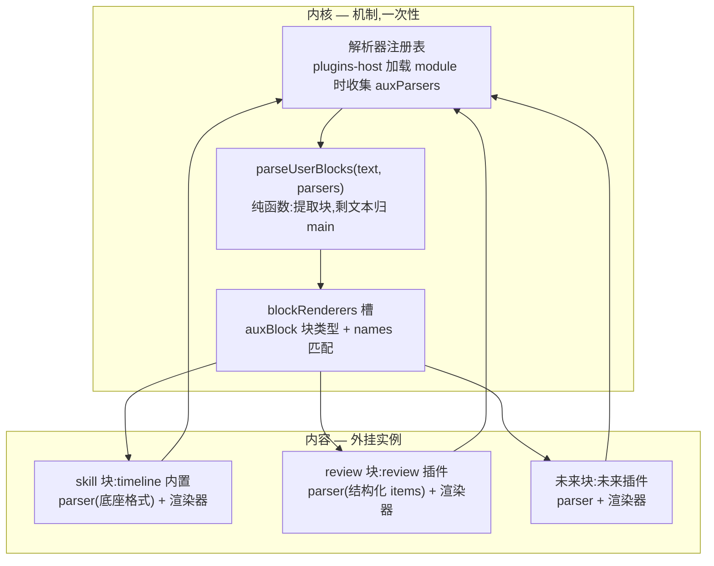

# 结构化块机制：用户消息里的辅助块折叠展示

## 问题：结构化辅助块被当纯文本渲染

用户消息的 content 里会混入两类"机器可识别、但对用户是噪声"的结构化块：

- **skill 展开块**：输入 `/skill:arch-to-code` 后，pi 底座 `_expandSkillCommand` 把它展开成 `<skill name="…" location="…">\nReferences are relative to …\n\n<SKILL.md 正文>\n</skill>`，整块成为用户消息 content（落盘 + 回放）。气泡里显示一大坨 SKILL.md 正文。
- **review 评论块**：review 插件把评论篮拼成 `\n\n---\n${header}\n①…` 纯文本，经 `sendSuffix` 附加到消息尾部。渲染层靠硬编码分隔符对比剥离，剥离失败就裸显一坨"① quote → comment"。

两类块形态不同但本质相同：结构化的、冗长的、用户发送时自己知道内容的东西被无差别地当正文渲染。优雅展示的方式只有一个——**识别块边界，折叠成一行摘要，点开再看**。

## 核心决策：机制与内容分离

块解析和渲染不能硬编码在内核里——加第三种块又要改内核。调整后：

- **内核只提供机制**（一次性建好，之后冻结）：怎么发现"文本里有结构化块"（解析器注册表）、怎么把块派发给渲染器（复用既有 blockRenderers 槽）；
- **具体块类型全是内容**：skill 块是内置实例（底座协议），review 块是 review 插件实例，未来任意块是任意插件实例——新插件贡献"解析器 + 渲染器"两样东西，内核零改动。



**图 1 — 内核提供识别与派发，块类型全在内容层**

## 内核机制（一次性，之后冻结）

### `core/domain/aux-blocks.ts`（圆心，零依赖）

```ts
/** 解析出的结构化块:内核只认 type + 泛型 data,不感知任何具体块的形状。 */
export interface AuxBlock {
  type: string;      // "skill" | "review" | 未来任意
  data: unknown;     // 块载荷,形状由贡献方定义
  raw: string;       // 块原始文本(用于从 main 剥离)
}

/** 块解析器契约:基于原文扫描,提取所有本类型完整块;无匹配返回 null。 */
export interface AuxBlockParser {
  id: string;
  parse(text: string): { blocks: AuxBlock[] } | null;
}

/** 汇总所有解析器结果:按块在原文中的位置排序,从原文剥离全部块得 main。
 *  解析器互不干扰(各扫各的类型),块顺序由文本位置决定——组合场景天然正确。 */
export function parseUserBlocks(text: string, parsers: AuxBlockParser[]): { main: string; blocks: AuxBlock[] };
```

`main` 的清理：剥掉全部块 raw 后压缩连续空行再 trim（`replace(/\n{3,}/g, "\n\n")`）。

### `packages/react/src/aux-block-parsers.ts`（renderer 注册表）

模块级注册表（与 plugin-modules 同模式）：

```ts
const parsers: AuxBlockParser[] = [];
export function registerAuxParsers(ps: AuxBlockParser[]): void;
export function getAuxParsers(): AuxBlockParser[];
```

### `api/renderer/plugins-host.ts`

`loadBuiltin` / `loadThirdParty` 里与 `mod.channels` 同批收集 `mod.auxParsers` → `registerAuxParsers`。卸载时不需要摘除（解析器是纯函数，多跑一次无害；插件卸载后其块类型不再产生，注册表残留一个不匹配任何文本的 parser 无副作用）。`unload` 时可一并清（同一模式）。

### blockRenderers 槽

`BlockRendererContribution.block` 类型加 `"auxBlock"` 词汇（开放字符串本来就有，纯类型扩展）。解析规则（names 匹配块 type）、order、覆盖语义**全部复用既有机制**，registry/block-renderers.ts 零改动。渲染器 props 契约 `{ aux: AuxBlock }`。

## skill 块：timeline 内置实例（底座协议）

### 解析器

底座 `_expandSkillCommand` 只对**整条消息以 `/skill:` 开头**时展开，所以 skill 块必然在消息开头。用底座官方 `parseSkillBlock` 同款格式：

```
^<skill name="([^"]+)" location="([^"]+)">\n([\s\S]*?)\n<\/skill>(?:\n\n([\s\S]+))?$
```

- `data = { name, location, content, args }`（args 即底座正则的 `userMessage`）；
- `raw` = 块 + args（整段从 main 剥离，因为渲染卡要显示 args，正文区不重复）；
- 组合场景（发 skill 时评论篮有货）：review 块被底座并进 args 尾部——review parser 从原文独立提取自己的块，skill 卡显示的 args 摘要**只取第一行**（用户真正输入的参数），review 块混在 args 尾部的残留随 args 折叠，不裸显。

### 渲染器（blockRenderers 槽 `auxBlock/skill`）

- 折叠态一行：「🧠 已引用技能 `arch-to-code`」+ args 首行摘要（有 args 时）；
- 点击展开显示 SKILL.md 正文（`content`）；
- location 路径不渲染（Windows 反斜杠路径是噪声）。

## review 块：review 插件实例（结构化条目）

review 比 skill 复杂一步：块带**结构化数据**，展开不是"显示一坨文本"而是**渲染条目列表**。

### 块格式（构造与解析同源，在 review 插件内）

```
<pi-review>
<item seq="①" quote="被评论的代码原文摘录">评审意见一</item>
<item seq="②" quote="另一段原文">评审意见二</item>
</pi-review>
```

- `seq`/`quote` 是 `item` 属性，评论文本是 `item` 内容；
- 文本与属性转义对称（构造 escape、解析 unescape）：`&` `<` `>` 文本转义，`"` 属性转义；
- `data = { count, items: [{ seq, quote, comment }] }`，`count` 渲染折叠摘要。

### 构造

`composePromptFragment` 改为 `buildReviewBlock(comments)`：条目由评论篮数据拼成 item 结构。`promptHeader` / `itemTemplate` 模板配置**退役**（条目形状由块结构固定，不再允许用户拼装格式；设置页模板编辑与 format store 一并删除）。

### 渲染器（blockRenderers 槽 `auxBlock/review`）

- 折叠态一行：「💬 评论 N 条」；
- 展开态条目列表：每条 = seq 徽章 + quote（引用样式：斜体/边框/截断）+ comment（正文）。

## timeline 消费

### `blocks.ts`

用户分支从 `stripToolLimitNote` + stripReviewFragment 改为：

```ts
const text = stripToolLimitNote(messageContentText(message.content));
const { main, blocks } = parseUserBlocks(text, auxParsers);
const out: TimelineBlock[] = [];
if (main) out.push({ type: "userText", text: main });
for (const b of blocks) out.push({ type: "auxBlock", aux: b });
return out;
```

`TimelineBlock` 加 `{ type: "auxBlock"; aux: AuxBlock }`。`decomposeMessage` 签名加 `auxParsers` 参数（保持纯函数可测，调用方传 `getAuxParsers()`）。

### `block-renderer.tsx`

`BlockRenderer` switch 加 `auxBlock` 分支：`<Comp aux={block.aux} />`。`PlainBlockFallback` 对 auxBlock 不渲（无短文本可显示）。

## 退役：echo 头行镜像

review 标签化后，评论数据（seq/quote/comment）就在消息文本的块里，渲染层直接解析。以下全链路**删除**（已确认 `composerAttachments` 通道只有 review 一个生产者，notes 只走裸 `sendMessage`）：

- `echoMirrorBySession` / `pendingEchoByCwd` / `ECHO_HEADER_DOMAIN` / `ECHO_MAX_PERSISTED` / `ECHO_SERIALIZE_BUDGET` / `REVIEW_FRAGMENT_SEP`
- `hashSendText` / `sanitizeEchoAttachments` / `trimEchoMirror` / `applyEchoMirror` / `stripReviewFragment` / `persistEchoMirror` / `flushPendingEcho` / `mergeEchoMirror`
- `sendMessage` 的 `echoAttachments` 参数与持久化调用
- timeline `echoBadges` 渲染、`blocks.ts` 的 stripReviewFragment 调用

**保留**：`composerAttachments` 通道的 `items`（输入框评论篮，输入态展示）与 `promptFragment`（现在承载 review 块文本）。乐观回显阶段评论块不显示（乐观消息 content 只有正文），落盘回放后折叠卡出现——秒级延迟，接受。

**不兼容不兜底**（已确认）：旧会话文件里 `\n\n---\n` 格式的 review 数据渲染层不认识，按正文显示。新格式是唯一格式。

## 落点清单

| 层 | 文件 | 改动 |
|---|---|---|
| 圆心 | `src/core/domain/aux-blocks.ts`（新） | AuxBlock / AuxBlockParser / parseUserBlocks |
| 发布面 | `packages/react/src/aux-block-parsers.ts`（新） | 解析器注册表 |
| 发布面 | `packages/react/src/index.ts` | re-export 注册表 + AuxBlock 类型 |
| 流入适配 | `src/api/renderer/plugins-host.ts` | 收集 module.auxParsers |
| 内容 | `timeline/renderer/skill-aux.tsx`（新） | skill parser + SkillAuxBlock 渲染器 |
| 内容 | `timeline/renderer/blocks.ts` | 用户分支 parseUserBlocks + auxBlock 块 |
| 内容 | `timeline/renderer/block-renderer.tsx` | auxBlock 分支 |
| 内容 | `timeline/renderer/index.tsx` | 删 echoBadges、doSend 去 echoAttachments、传解析器 |
| 内容 | `timeline/plugin.json` | blockRenderers 贡献 auxBlock/skill |
| 内容 | `review/renderer/index.tsx` | buildReviewBlock、review parser、ReviewAuxBlock、退役模板 |
| 内容 | `review/plugin.json` | blockRenderers 贡献 auxBlock/review |
| 流入适配 | `src/api/renderer/stores/session-store.ts` | 退役 echo 镜像全链路 |
| 测试 | `blocks.test.ts` / `session-store.test.ts` | 适配新签名、删 echo 用例 |

## QA

**Q：正文恰好含 `<pi-review>` 或 `<skill` 字样怎么办？**
解析器要求完整标签形态（`<pi-review>` 必须配 `</pi-review>` 闭合，`<skill` 必须匹配底座全文正则），残缺的按正文处理。用户手输完整标签块的概率趋近于零；真撞上了，折叠卡也是合理展示。

**Q：skill 块的 location 是 Windows 反斜杠路径，展开显示时怎么办？**
折叠卡摘要只显示技能名 + args 首行；展开显示正文（SKILL.md body，底座已剥 frontmatter）。location 是 data 字段，不渲染。

**Q：组合场景（skill + review 同时）块顺序怎么保证？**
parseUserBlocks 按块 raw 在原文的 index 排序，与文本出现顺序一致，与解析器注册顺序无关。skill 块在开头（pos 0），review 块在尾部，渲染序 skill 卡在前。

**Q：解析器注册表在模块加载期填充，decomposeMessage 渲染时会不会拿不到？**
模块加载（bootstrap）先于组件挂载，timeline 渲染时 `getAuxParsers()` 已就绪。卸载插件后注册表残留的解析器是无害纯函数（不匹配任何新文本），且插件卸载后其块类型不再产生。

**Q：review 的模板配置（promptHeader/itemTemplate）退役后，设置页怎么办？**
`ReviewConfigPage` 删模板编辑区（format store 删除）；`settingsGroups` 的 `reviewBasket`（评论篮显示条数）保留。i18n 的模板相关文案可留可删，不参与机制。
