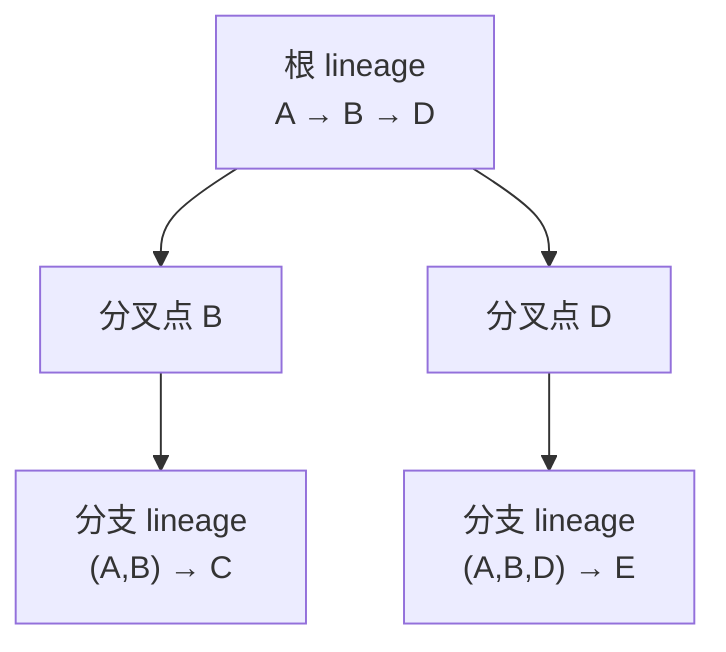

# 底座接口化与 lineage 树：让 dsh 成为 my-harness-desktop 的第二个底座

- my-harness-desktop 现在只有 pi 一个底座。想接 dsh 当第二个底座、把 DeepSeek 那套模型栈拿进来，却发现接不进去——不是「差一个适配器」的量级，而是底座这一层从协议到会话语义都长成了 pi 的样子。本文把底座抽成一个中性接口，让 pi 和 dsh 各自成为接口下一个实现（后端），并把会话分支语义统一成 lineage 树。

- 本文反复使用的名词，先一次性交代：**底座**指 my-harness-desktop 经 JSONL RPC 管理的独立 agent 子进程；**后端**（backend）指底座接口的一个具体实现，pi 和 dsh 各是一个——「provider」在本仓库已指 LLM 供应商（Anthropic/OpenAI），为免撞词本文不用它指底座实现；**lineage** 是一条有序事件流加一个分叉点，精确定义在 §2.2；**分叉点 / boundary** 是 lineage 从父 lineage 切出去的位置。

- 文中出现的 dsh 内部名词，也一并交代：`ctx.llm` 是 dsh 的 LLM 能力接缝（`llm-deepseek` 就挂在这上面），`ctx.sessions` 是 dsh 的会话存储与 fork 入口，`ctx.subagents` 是 dsh 的子代理编排接缝。`SessionEventMap` 是 dsh 用 TypeScript 声明合并拼出来的会话事件联合——桌面不用懂它的机制，只需知道「dsh 侧有一串事件，翻译器把它们投成中性事件」。

## 1. 为什么接 dsh，以及为什么现在接不动

### 1.1 动机：dsh 的 DeepSeek 专武

- dsh 是 DeepSeek 自己的 agent harness，`llm-deepseek` 适配器挂在 `ctx.llm` 上，默认模型就是 V4 Flash / V4 Pro，思考模式、`reasoningEffort`、SSE 流式都是原生调好的。这套模型栈不是一个能拷进 my-harness-desktop 的库，而是一整个 harness 的能力层——要拿它，最省力的路是让 dsh 当底座，而不是把适配器移植进 pi。这是本文的出发点，但只占这一节；主体是「怎么让第二个底座能进来」。

- 一个必须当面说清的前提：pi 自己也能配 DeepSeek——底座支持哪些 provider 由它决定，Anthropic / OpenAI 等主流都在，DeepSeek 未必不在。如果 pi 的 DeepSeek 已经够用，本文整篇是多余的。本文的成立建立在「dsh 的 DeepSeek 适配比 pi 直接连 DeepSeek 更完整」这个判断上：思考模式、`reasoningEffort`、重试策略是 dsh 原生调好的，pi 未必到这份深度。这个判断是启动本文的第一道门，写在这里而不是藏在结论里——它若不成立，直接让 pi 连 DeepSeek，别往下读。

### 1.2 底座协议是 pi 的

- 底座 RPC 协议镜像在 `src/core/protocol/rpc-types.ts`：`RpcCommand` 是 31 个命令的闭联合（`prompt`/`steer`/`follow_up`/`abort`/`fork`/`clone`/`bash`/`get_entries`/`get_tree`/`set_model`/`cycle_model`/`compact` 等），外加 `$bus` 帧、`extension_ui_request` 这些 pi 特有通道。`SessionStore` 按它和底座对话：`get_state` 探活、`get_entries(since)` 增量拉、`sync`/`resync` 拼五命令基线。

- 这套协议不是「桌面需要底座提供什么」的中性表达，而是「pi 恰好提供了什么」的照搬。命令名、字段名、事件名都带 pi 的取舍：`steer`/`follow_up` 是 pi 对多路并发的叫法，`get_tree` 是 pi 对会话分支的叫法。换一个不是 pi 的底座，31 个命令里有一半对不上——所以「把底座换成 dsh」不能靠再写一个适配器硬翻译，得先把「底座该提供什么」重新定义一遍。

### 1.3 会话存储是 pi 的

- pi 的会话是一个 `.jsonl` 文件，条目靠 `parentId` 连成一棵树，`fork` 在文件内开分支。「文件 + 树」这个形状穿透底座协议漏到了桌面：`get_tree` 返回 `{ entry, children }` 的树节点，`get_entries(since)` 按追加序增量拉取。

- 更要命的是 pi 的 `fork` 语义：它不拷贝，开的分支跟着原会话走——原会话删了，分支就没了。这是 pi 对「分支」的定义，不是缺陷。但这个定义直接决定了桌面上一连串功能怎么写，见 1.4。

### 1.4 四个功能把 pi 的存储当成了契约

- 底座的「文件 + 树」不是被关在协议里的实现细节，它漏到了四个功能。每个功能都把取数逻辑焊在了 pi 的存储上——它们才是接 dsh 时真正要改的东西。

- **bookmarks 是「全量 JSONL 拷贝」**：因为 pi 的 fork 不拷贝、跟随原会话，「存一个节点以后重启」只能靠把整个会话文件复制一份。这份拷贝跟原会话完全隔离，代价是 bookmark 的实现被绑死在「文件快照」上——它存的是一个文件副本，而不是一个与存储无关、可重放的语义锚点。这正是接口化要解开的第一个结（§2.4.4 把它重定义成可重放锚点）。

- **session-tree 按 `parentId` 画分支**：lane 渲染、SVG 概览、四种过滤（all / no tools / user only / tags only），都建立在「条目有 parentId、树在文件内」这个事实上。换一个不在文件内分叉的底座，这棵树画不出来。

- **retry 从历史锚点 fork 重跑**：重试按钮在 assistant 消息行上，内部走底座的 fork 从历史某点分叉、换绑新会话文件。它依赖的「某点」和「fork」都是 pi 的树语义。

- **session-groupings 与「打开 raw JSONL」**：父子嵌套靠 session 头里的 custom 域 key；sessions-list 右键菜单里的「打开 raw JSONL 文件」更是把存储格式直接当用户功能暴露了出去。

### 1.5 两条错路

- 第一条是让 dsh 伪装成 pi：把 dsh 的会话流硬翻译成 pi 的 31 命令 + JSONL/`parentId` 树。工程上这就是造一个翻译层，正是 my-harness-desktop 自己「消费而非翻译」要禁止的东西。dsh 的会话是扁平 append-only 事件流，没有文件内分支，硬翻译成树等于让 dsh 在一条线上假造一棵树。

- 第二条是双轨：`client/pi` 和 `client/dsh` 各养一套适配器、一套事件翻译、一套会话模型。短期能跑，长期是两份底座逻辑并行维护，而且违背「底座是和 git/fs 同一层的被管理资源」这条原则——git/fs 已经接口化了，底座没理由不是。

- 第三条更隐蔽，是直接拿现成的 agent 协议当底座接口，最典型的是 dsh 自带的 ACP（Agent Client Protocol）。ACP 是 automation-only：它明确不暴露 transcript 回放、流式 chunk、工具呈现——正好是桌面 timeline 需要的三样。拿它当底座接口，等于为了省接口设计、放弃桌面 UI 的核心原料，还得在它外面再包一层。所以结论是「传输层有现成的、语义层没有现成的」：传输复用 dsh 的 JSON-RPC（§4.2），语义必须自己定义五个操作（§2.4）。

### 1.6 目标

- 目标不是「给 pi 包一层接口」，而是「把桌面需要底座提供的操作抽成一个中性接口，pi 降级成其中一个后端」。接口由五个操作构成（§2.4），会话分支语义统一成 lineage 树（§2.3）。pi 的 31 命令、JSONL 文件、`parentId` 树，全部退成 pi 后端内部的实现细节，不再出现在桌面契约里。

## 2. 抽象：底座接口 + lineage 树

### 2.1 先分清两个 JSONL：传输线不是问题，语义才是

- 「JSONL」在 my-harness-desktop 里出现两次，指两件完全不同的事，只有一件挡路。底座和桌面的对话走 JSONL——stdin/stdout 上每行一个 JSON，命令带 `id`、响应回 `id`、事件不带。会话文件也是 JSONL——每个会话一个 `.jsonl` 文件，第一行是头行，其后每行一条条目。同名，两物。

- 传输那条不是问题。dsh 的 SDK transport（`JsonRpcLineTransport`）同样是 newline-delimited JSON，一行一个帧。换底座时「每行一个 JSON」这个心智模型原样保留，只是帧里装的东西从 pi 的 31 命令换成了 dsh 的方法调用。传输层从来不在本文的设计范围里——它应该留在各后端内部，接口不碰它。

- 语义那条才是问题。pi 的会话文件不是「一堆行的集合」，它有结构：条目靠 `parentId` 连成树，`fork` 在文件内开分支。dsh 的会话没有这个结构——它是扁平的 append-only 事件流，`fork` 是新建一个子会话，不是在文件内分叉。1.3 说的「文件 + 树」就是这条语义线的形状。

- 这一节把分界立成全文的锚点：**要抽象的是语义层——桌面到底需要底座提供哪些操作；不是传输层——消息怎么一行行传过去**。后面 lineage、五个操作、两个后端，全部落在语义层这一侧；传输层的 JSONL 从头到尾不进入接口。想清楚这个，后面每一步都不会滑回「再写一个适配器硬翻译」的错路。

### 2.2 lineage：一条有序事件流加一个分叉点

- 抽象的核心单元不是「会话」，不是「树」，是 **lineage**。定义：一条 lineage 是一条有序事件流，外加一个分叉点（boundary）——它从父 lineage 的哪个位置切出来。根 lineage 没有父、没有分叉点，就是一条从会话开始到现在的完整事件流。

- 为什么是 lineage 而不是直接保留「树」：pi 的树和 dsh 的 fork 树，剥到最底是同一个东西——若干条共享前缀的线性历史。pi 的「一个文件里的 parentId 树」只是这些 lineage 的一种紧凑存储：分支共享前缀，靠 parentId 复用前缀里的条目。dsh 的「fork 出子会话」是另一种存储：每次 fork 把前缀拷成一个新会话，各存各的。存储不同，语义都是「从某点分叉出一条新历史」。

- 一个例子把三种说法钉到同一件事上。用户在会话里依次发了 A、B 两条消息，然后在 B 之后 fork：pi 在文件里给新分支挂一条 parentId 指向 B；dsh 调 `ctx.sessions.fork(source, boundary = B 的 seq)` 拷出「A、B」前缀、开一个新子会话。两边产出的都是「前缀 A、B + 自己的新后缀」这条 lineage，只是 pi 记成「同一文件里的一支」，dsh 记成「一个新会话」。

- 于是接口里的「会话」退化成「一组 lineage + 一个默认根 lineage」——一组 lineage 就是一次会话里 fork 出来的全部分支，根 lineage 是最早那条，其余都从它（或从别的分支）fork 出来。桌面不再关心会话是一个文件还是一组子会话，只关心三件事：给我一棵 lineage 树，让我 fork、让我读某条 lineage、让我从某点重启。

### 2.3 树没消失，节点从「条目」换成「分叉点」

- 之前觉得「dsh 得在自己的扁平 log 上硬造一棵树」，根子在于把树的节点当成了「条目」——pi 的 parentId 树里每个条目都是潜在分叉点，树密密麻麻长在条目上。这个「条目级」的树 dsh 确实造不出来，因为 dsh 没有「文件内条目互相挂 parentId」这回事。

- 换成 lineage 后树还在，只是节点从「条目」换成「分叉点」。pi 的分叉点是一个条目（user 锚点）；dsh 的分叉点是一个 boundary seq（也对应一个事件、一条消息）。树的边就是「这条 lineage 从哪条 lineage 的哪个分叉点切出来」。这棵树两边都能原生表达，而且正是 session-tree 要画、session-groupings 要嵌套的那棵。



- 这张图就是 lineage 树：节点是分叉点，边是 fork 关系。pi 画这棵树靠 parentId，dsh 靠 parent session + boundary，画出来是同一棵。树形图、lane、嵌套的画法全部保留，变的是取数：不再读 parentId，改调 `getTree`。

### 2.4 五个中性操作

- 接口里最硬、也最需要重新设计的一块，是五个「会话分支」操作。它们不是「pi 命令的子集」，是「桌面分支功能真正依赖的那几个语义动作」的最小集合——1.4 的四个功能，拆到底就这五个。发消息、切模型、中断、列工具是另一块更简单、两边现成的接口面，不在本章展开（见本小节末尾的说明）。每个操作下面给签名、语义、以及它替掉了 pi 的哪个命令。

#### 2.4.1 fork(parent, boundary?) → lineageId

- 从某条 lineage 的某个分叉点切出一条新 lineage。`boundary` 省略表示从当前末尾切。返回新 lineage 的 id。

- fork 不改动原 lineage：原 lineage 继续按自己的方向追加，新 lineage 带着共享前缀独立前行。两者共享前缀是同一段历史，分叉点之后各自发展、互不影响。

- 这个操作替掉 pi 的 `fork`/`clone` 命令，并且把 bookmarks 的「拷贝」和 retry 的「分叉重跑」统一成同一个动作——区别只在 bookmark 要持久化（2.4.4）、retry 切完要接着发消息。pi 后端在文件内挂 parentId 实现；dsh 后端调 `ctx.sessions.fork` 实现（它自带前缀拷贝）。

#### 2.4.2 getTree(session) → LineageTree

- 拿一个会话的全部 lineage 及父子/分叉点关系。桌面用它渲染 session-tree、做 session-groupings。

- 替掉 pi 的 `get_tree`。返回的不再是 `{ entry, children }` 的条目树，而是「lineage + 分叉点」的关系图——pi 后端把 parentId 树投影成它，dsh 后端把 session forest 投影成它。

#### 2.4.3 getEntries(lineage) → Event[]

- 拿一条 lineage 的线性事件序列。timeline、git-review、token-stats 这些「看一条历史」的功能都消费它。

- 替掉 pi 的 `get_entries(since)`。注意丢掉了 `since`：增量拉取是 pi「文件追加」带来的传输优化，不是语义。语义层要「这条 lineage 的全部事件」，传输层要不要增量、怎么增量，由各后端自己决定——它属于传输层，不配进接口。

#### 2.4.4 bookmark(lineage, boundary) → anchor

- 把一个分叉点持久化成可重启的锚点。语义是「存这个节点，以后从这里重启」，这正是 bookmarks 功能的真实需求。

- pi 后端实现成「全量 JSONL 拷贝」（因为 pi 的 fork 不拷贝、跟随原会话，要隔离就得复制）；dsh 后端实现成「记 boundary + 稳定 childSessionId」（dsh 的 fork 自带拷贝，锚点就是 fork 出来的那个子会话）。同一条语义，两种存储。

#### 2.4.5 resume(anchor) → lineageId

- 从一个锚点重启一条 lineage。点击 bookmark、或从 session-tree 的某个节点继续，都走它。

- 替掉「bookmark 点击 → forkFromSession」这条现状链路。锚点是后端自留的持久化线索，桌面不解析它，只把它当不透明 token 传回 `resume`——这样 bookmark 的存储格式彻底退进后端。

- 这五个操作只覆盖「会话分支」这一块，不是底座接口的全部。发消息、切模型、中断、列工具、设工具白名单是另一个更简单、两边都现成的接口面，本文不展开：发消息 / 切模型 / 中断已经中性（§4.2 把它们列进 dsh 方法表），工具白名单走各自的 policy（pi 是 toolgate 的 `setActiveTools`，dsh 是 scoped 工具注册 + approval policy，见 §4.6.3）。compaction 同理：它是底座自管上下文的内部事务，桌面不驱动它，只通过中性域的 `compactionStart/End` 事件观察。本文聚焦分支语义，因为只有它是 pi 形状漏到桌面的地方，其余要么中性、要么本就是 policy。

### 2.5 类型草案

- 下面是接口和类型的骨架，落在中性域（`src/core/domain`），不 import pi 也不 import dsh。事件用中性 `NeutralEvent`（`session-state.ts` 已有的事件联合，成员见 §4.1.3），不用 pi 的 `SessionEntry` 或 dsh 的 `SessionEvent`。

```ts
interface NeutralEvent { seq: number; type: string; /* 中性域既有事件联合 */ }

interface ForkPoint { parentLineageId: string; boundarySeq: number }

interface Lineage { id: string; forkPoint: ForkPoint | null /* null = 根 lineage */ }

interface LineageTree { root: Lineage; lineages: Lineage[] /* 含 root 的全部 lineage；父子由各自 forkPoint 导出 */ }

interface Anchor {
  lineageId: string; boundarySeq: number  // 桌面可读，用于显示「哪个分支的哪个点」
  opaque: string                           // 后端自留的持久化线索，桌面不解析
}

interface BaseBackend {
  fork(parentLineageId: string, boundarySeq?: number): Promise<string>
  getTree(sessionId: string): Promise<LineageTree>
  getEntries(lineageId: string): Promise<NeutralEvent[]>
  bookmark(lineageId: string, boundarySeq: number): Promise<Anchor>
  resume(anchor: Anchor): Promise<string>
}
```

- `Anchor` 的两个层次值得单说：`lineageId` / `boundarySeq` 是桌面可读的，用来显示「这是哪个分支的哪个点」；`opaque` 是后端自留的持久化线索（pi 存 JSONL 拷贝路径，dsh 存 childSessionId），桌面一律不解析、只当 token 回传给 `resume`——于是 bookmark 的存储格式彻底退进后端。`getEntries` 去掉 `since` 同理：把「增量」这个传输概念从语义层挤出去，接口只留语义动作。

### 2.6 不变量

- 抽象落地后，几条硬约束贯穿全文，写下来当评审口径——盲测也拿它们当靶子，看哪段违反了：

- **存储退进后端**：桌面不读任何一方的存储格式。pi 的 JSONL 文件、dsh 的 session log，都不出现在桌面契约里；桌面只认 `NeutralEvent` 和 `LineageTree`。

- **中性域是唯一契约**：两边的事件都往中性域投，翻译器是喂线、不是第二套语义。哪个底座引入了中性域没有的概念，先在中性域加类型，再让翻译器投，不许绕过。

- **传输不进接口**：增量拉取、行帧、id 配对都是后端私有，接口只有五个语义动作 + 消息 / 模型 / 中断。谁想把传输优化塞进接口，先问它是语义还是优化。

- **fork 锚点必须是回合边界**：pi 的「只接受 user 锚点」和 dsh 的「boundary 不落在 open turn 中间」是同一约束的两种表达，接口把它归一为「boundary 必须是一个完整回合之后」。这个约束进接口契约，不是后端各自的怪癖。

## 3. 两个后端是同一抽象的参数化

- 接口定下来后，pi 和 dsh 是它的两个参数化，不是两套并行代码。本章逐操作讲两边怎么投影，讲完会看到：难点不在「谁多做了」，而在「pi 的树语义要瘦身成 lineage」。

### 3.1 pi 后端：parentId 树投影

- pi 后端是现有 `client/pi` + `session-store` 逻辑的收编，不是重写。它把 pi 的 JSONL/parentId 世界投影到接口上——绝大多数逻辑原样搬进一个 provider 的实现，改的是「对外暴露的形状」。

#### 3.1.1 fork：文件内 parentId 开分支

- pi 的 `fork` 在文件内给新条目挂 parentId，开的分支共享前缀、跟随原会话（不拷贝）。投影到接口：`fork(parent, boundary)` 发 pi 的 fork 命令，把 boundary 映射成 pi 的 user 锚点条目，返回新分支的 lineageId。

- 这里暴露了一个 pi 特有的约束：底座 fork 只接受 user 锚点（assistant/tool 锚点会被拒）。这个约束和 dsh 的「boundary 不落 open turn」是同一件事（§2.6），已归一进接口契约——pi 后端只负责把接口的「回合边界」映射成它的 user 锚点，不留后端私有的第二套规则。

#### 3.1.2 bookmark：全量 JSONL 拷贝

- pi 的 fork 不拷贝，所以要「隔离重启点」只能整文件复制。投影到接口：`bookmark` = 复制 JSONL 文件 + 存元数据（cwd 桶、索引），`anchor` = 那份拷贝的路径 + 锚点条目。现状 bookmarks 的「全量拷贝 + 自愈校验」整套逻辑，就是 pi 后端的 `bookmark` 实现，一行不用丢，只是从「桌面功能」降格成「pi 后端私有」。

#### 3.1.3 getTree / getEntries：parentId 树投影

- `getTree` = 把 pi `get_tree` 返回的 `{ entry, children }` 树投影成 LineageTree：每条分支 = 一条 lineage，分叉点 = 分支锚点条目。`getEntries` = `get_entries` 拉取后映射成 `NeutralEvent`。这两处是纯投影，逻辑是现有 `context-binding.ts` 的延伸。

### 3.2 dsh 后端：session forest + boundary seq

- dsh 后端是新增的一块，但它不用「造树」——dsh 的 fork 语义比 pi 更贴接口：它自带前缀拷贝，bookmark 几乎免费。

#### 3.2.1 fork：ctx.sessions.fork 自带前缀拷贝

- dsh 的 `fork` 签名是 `fork(source, boundary?, childSessionId?)`，`boundary` 是含端点的源 seq，内部 `events.slice(0, boundary + 1)` 把前缀拷成一个自洽子会话。投影到接口：`fork` = 调 dsh 的 fork，boundary seq 直接对上，子会话 id 即新 lineage id。

- dsh 的 fork 有两个校验值得记：boundary 必须是连续 seq，且不能落在 open turn 中间。前者保证切片干净，后者保证分叉点总是在一个完整回合之后。这个约束和 pi 的「只接受 user 锚点」是同一件事的两种表达，归并进接口契约（§2.6）。

#### 3.2.2 bookmark：boundary + 稳定 childSessionId

- dsh 的 fork 自带拷贝，所以 bookmark 不需要再拷一份——它就是一个「持久化到 header 的 fork」。投影：`bookmark` = 调 fork 拿子会话 + 把 anchor 记下来；`anchor` = childSessionId + boundary。比 pi 后端少一整个「文件复制 + 索引自愈」的复杂度。

#### 3.2.3 getTree / getEntries：session forest + boundary seq

- dsh 的「树」是 session forest：父会话 + 若干 fork 出的子会话（subagent 也是子会话，lineage 记在 header）。投影：`getTree` = 沿 header 的 lineage 字段串出父子，每个 fork 点 = 一个 boundary；`getEntries` = 该会话的 session log 投影成 `NeutralEvent`。

### 3.3 顺带合并两棵树

- 现状桌面有两棵树：session-tree 的分支树（一个会话内的 fork）+ session-groupings 的父子嵌套（subagent）。接口化之后它们是一棵树的两个视图——subagent 子会话、retry 分支、bookmark 重启点，全是 lineage。session-groupings 退化成对同一棵 lineage 树的一种分组策略，不再有第二套数据结构。这省掉的不只是代码，是一个概念：桌面只认「lineage 树」这一种会话关系。

### 3.4 节点粒度：选 lineage 级

- 唯一要拍板的取舍是树的节点粒度：「条目」（复刻 pi 现状）还是「分叉点」（lineage 级）。选 lineage 级，理由两条：pi/dsh 两边都原生；session-tree 和 session-groupings 能合体。代价是 pi 侧的树会比今天「粗」——一个分支只显示一个节点，而不是每个条目一个节点。

- 想要 entry 级明细不丢：pi 后端仍能靠 parentId 在一条 lineage 内部投影出条目列表，这是 pi 后端内部的事、不进接口。桌面若真想看某条 lineage 的逐条明细，走 `getEntries` 自己渲染，不需要接口为此再立一个「条目树」。

## 4. 落地：落点、影响面、分阶段

### 4.1 依赖倒置落点

- 把底座抬成接口，不是新开一块地基，是在三处已有的依赖倒置点上再往上一格。这三处现在都是「pi 形状的接口 + 换实现」，本文要把「pi 形状」去掉，只留「换实现」。

#### 4.1.1 RpcAdapterFactory

- `src/bootstrap/index.ts:109-113` 现在是 `const rpcAdapterFactory: RpcAdapterFactory = ...`，把「spawn pi 子进程 → 绑 RpcAdapter」这一整段从 client 注入给 `SessionStore`。`SessionStore` 不直接 `new RpcAdapter()`，这个方向已经是对的。

- 要改的是 `RpcAdapterFactory` 的产出物：现在它产出「会说 pi 31 命令的 adapter」，将来要产出「实现 `BaseBackend` 五操作的后端」。`RpcAdapterFactory` 升级成 `BaseBackendFactory`，pi 的 RpcAdapter 缩进 pi 后端内部，成为它传输层的一部分。

#### 4.1.2 SubprocessHandle

- `client/pi/subprocess-handle.ts` 的 `SubprocessHandle` 接口（`stdin/stdout/alive/stop/onceExit/onceError/onStderr`）已经是进程生命周期的最小契约，pi 用 `spawn` 实现。dsh 后端同样用 `spawn` 起一个 dsh 子进程。这一处几乎不用动——它恰好抽在「进程」这一层，比「pi 协议」低，天然属于传输层，直接复用。

#### 4.1.3 中性域 + 事件翻译

- 中性域 `src/core/domain/events/session-state.ts` 已经有一套中性事件联合（`messageStart/messageUpdate/messageEnd`、`toolCallStart/Update/End`、`agentStart/End`、`turnStart/End` 等），桌面插件全消费它。它现在由 `event-translator.ts`（pi 事件 → 中性）喂进来。

- 要加的是第二条喂入线：`dsh 事件 → 中性事件` 的翻译器。中性域本身不变——这正是它叫「中性」的意义。`context-binding.ts` 同理：它现在把 pi wire 类型投影成中性类型，dsh 后端要写一个平行的「dsh → 中性」投影，但投影的目标是同一套中性类型。

### 4.2 协议层：dsh 后端要补哪些方法

- dsh 已经有一个 stdio JSON-RPC server（`sdk-jsonrpc-server`），现有三个请求 + 四个通知：

| 方向 | 方法 | 用途 |
|---|---|---|
| 请求 | `initialize` | 握手：cwd / provider / model / maxTokens |
| 请求 | `session/prompt` | 发一条用户消息 |
| 请求 | `shutdown` | 退出 |
| 通知 | `session.event` | 全量 `SessionEvent` 信封流式推送 |
| 通知 | `session.status` | idle / running |
| 通知 | `subagent.started` | 子会话创建 |
| 通知 | `subagent.finished` | 子会话结束 |

- `session.event` 是现成最值钱的一块：它把整条 session log 的每个事件随录随推，timeline 要的「流式消息 / 思考块 / 工具卡」原料全在这。缺的是五个操作对应的请求方法，要补：

| 方法 | 对应操作 | 备注 |
|---|---|---|
| `session/fork` | `fork` | 参数 parent session + boundary seq |
| `session/getTree` | `getTree` | 返回 lineage 树 |
| `session/getEntries` | `getEntries` | 返回某 lineage 的线性事件 |
| `session/bookmark` | `bookmark` | 返回 anchor（childSessionId） |
| `session/resume` | `resume` | 从 anchor 重启 |
| `session/setModel` | 模型控制 | 切 provider / model |
| `session/abort` | 中断 | 取消当前回合 |

- 这七个方法不必新起一个 server，扩 `sdk-jsonrpc-server` 的方法集即可，复用 `JsonRpcLineTransport` 的行帧、`RequestCorrelator` 的 id 配对心智。pi 后端那边，31 命令里用不上的（`steer`/`follow_up`/`cycle_thinking_level` 等）不进接口，留在 pi 后端内部——接口只承诺五个操作 + 消息 / 模型 / 中断。

- payload 里只有三个方法需要点一句，其余照 JSON-RPC 惯例。`session/fork` 请求带 `{ parentSessionId, boundarySeq? }`、响应回 `{ lineageId }`；`session/getTree` 请求带 `{ sessionId }`、响应回 `{ root: Lineage, edges: [{ child, parent, boundarySeq }] }`；`session/bookmark` 请求带 `{ lineageId, boundarySeq }`、响应回 `{ anchor }`（anchor 是不透明字符串）。错误统一走 JSON-RPC 的 error 对象，按 §4.8 的三类失败（boundary 无效 / 锚点失效 / 锚点不属于此后端）各给一个错误码，桌面据码做降级或提示。

### 4.3 事件翻译：dsh 事件 → 中性事件

- dsh 的事件是 `SessionEventMap`（声明合并出来的联合），my-harness-desktop 的中性事件是另一套联合。翻译器做的是映射，不是转写——两边语义同构但名字和粒度不同。代表性子集：

| dsh 事件 | 中性事件 | 说明 |
|---|---|---|
| `turn/start` / `turn/end` | `turnStart` / `turnEnd` | 一一对应 |
| `user/message` | `messageStart/Update/End`（user） | 一条拆三段 |
| `assistant/message` | `messageStart/Update/End`（assistant） | 同上 |
| `assistant/chunk` | 不映射，喂流式 Update | dsh 的原始增量，中性域用 Update 承载 |
| `tool/call` / `tool/result` | `toolCallStart/Update/End` | 工具卡 |
| `todo/write`、`plan/mode` | 无对应 | dsh 特有，桌面暂不消费则丢弃 |

- 这张表不是全部，只表明翻译的方向：以中性事件为靶，两边往它身上投。dsh 有而中性域没有的事件（`todo/write`、`plan/mode`），桌面不消费就丢；哪天想消费，先在中性域加类型、再让翻译器投——这正是「中性域是契约、翻译器是喂线」的含义。

### 4.4 影响面：三个插件只重写取数层

- session-tree、session-groupings、bookmarks 三个插件，渲染逻辑不动，改的是取数：把「读 parentId」「拷 JSONL 文件」换成「调 `getTree`」「调 `bookmark`」。sessions-list 右键的「打开 raw JSONL 文件」改成 provider 中立的「导出会话」（pi 后端导出 JSONL 文件，dsh 后端导出 session log）。

- 这是 C 的既定成本，接口化没让它变大。反过来，因为两棵树合成一棵（3.3），session-groupings 的第二套数据结构会消失，净变小。

### 4.5 迁移与兼容：过渡期怎么跑

- 后端注册表和现有 `resolveCustomCli`（现状里解析自定义底座 `dist/cli.js` 路径的入口）是一套心智：一个后端 = 一个「怎么 spawn、怎么翻译」的实现，注册进 `BaseBackendFactory`，由配置选当前会话用哪个。pi 后端是默认，dsh 后端是新增。

- 迁移顺序必须「pi 先搬进接口，dsh 后进」：先把 pi 收编成第一个后端、验证五个操作在 pi 上语义等价（这是回归安全的来源），再写 dsh 后端。这样每一步都有一条已知正确的参照线，不会出现「新接口 + 新底座一起炸、分不清是谁的错」。

- 双后端并存期间，session 数据边界是后端私有的：pi 会话是 JSONL 文件，dsh 会话是 session log，两者不互相读。桌面层只认中性域，不认任何一方的存储——这正是「存储退进后端」这条不变量在迁移期的体现。

- 会话列表是合并的一张表，不按后端分栏：每条会话按头里的后端归属渲染一个后端标记（pi / dsh），筛选时可按后端过滤。归属缺失的旧会话默认 pi，所以迁移后列表不出现「无归属」的空档。切后端不是「迁移数据」，是「换一个新会话的目标」——数据边界后端私有，同一会话永远只在一个后端下打开，不跨后端搬运，因此不存在「切换丢数据」这条路径。

### 4.6 分阶段

#### 4.6.1 PoC：通流

- 起一个 dsh 的 `sdk-jsonrpc-server` 子进程，桌面加 `client/dsh` 做 spawn + 读行 + `session.event → 中性事件` 翻译，只让 timeline 流式渲染消息 / 思考块 / 工具卡跑起来。验收标准：发一条消息，timeline 能流式出 assistant 文本 + 思考块 + 工具卡，DeepSeek V4 Pro 端到端可见。

#### 4.6.2 P1：扩协议

- 给 dsh server 补满 §4.2 的七个方法——`session/fork`、`session/getTree`、`session/getEntries`、`session/bookmark`、`session/resume`、`session/setModel`、`session/abort`，接上 sessions-list / session-tree / bookmarks / retry。验收标准：dsh 底座下能 fork、能渲染 lineage 树、能 bookmark + resume、能切模型、能中断。

#### 4.6.3 P2：删冗余

- 删掉四个 pi 扩展，各自去处说清：`bus-extension`（Session Bus 工具面）和 `subagent-extension`（子 agent 五个工具）在 dsh 底座下被 `ctx.subagents` + `subagent` 工具取代，整包删；`toolgate`（会话级工具白名单 + 工具清单广播）被 dsh 的 scoped 工具注册 + approval policy 取代，tool-manager 的「列工具」改走接口、「设白名单」改走工具策略；`context-probe`（上下文探测）被 dsh 原生暴露的 context usage 取代。验收标准：四扩展删除后，sub-agent 编排、工具白名单、上下文探测三条能力在 dsh 底座下不降级。

### 4.7 配置与模型：DeepSeek 专武怎么进桌面

- 这是接 dsh 的原动机，落点要交代清楚。pi 后端继续走 `models.json` + pi-model-manager，一行不动。dsh 后端走 `ctx.llm` 的 DeepSeek adapter：`apiKeyEnv`（默认 `DEEPSEEK_API_KEY`）、`baseURL`、`thinking`、`reasoningEffort`、`maxTokens`、`models`（默认 V4 Flash / V4 Pro）。

- 桌面上，模型管理页现在是「pi 的 models.json 渲染器」；接口化后它是「当前后端的模型能力渲染器」——pi 后端渲染 models.json，dsh 后端渲染 DeepSeek adapter 的模型清单。这和 `getTree` 一个道理：渲染的是接口返回的中性模型列表，不是哪个底座的配置文件。

### 4.8 失败路径与边界

- 接口化要交代的不只是「正常怎么走」，还有「坏了怎么办」。下面几条是真实会踩的，不是凑数：

- fork 的 boundary 无效（非连续 seq、或落在 open turn 中间）：后端拒绝并返回错误码，桌面把入口降级成「从末尾 fork」，不弹错、也不静默吞掉。

- bookmark 的 anchor 失效（pi 的拷贝文件被删、dsh 的 childSessionId 已被清理）：`resume` 返回「锚点已失效」，桌面给「删除」或「重建」两个选择，不把失效锚点当会话直接打开。

- 锚点天然按后端划界：它是后端私有 token，pi 建的锚点只能 pi 后端 resume，dsh 建的只能 dsh 后端 resume。`resume` 收到不是自己后端的锚点，报「锚点不属于此后端」，桌面提示用户换到对应后端打开，不静默也不误路由。

- 同一会话在两个后端下打开：明确禁止。会话的后端归属记在会话头，打开时按归属选后端；归属缺失的旧会话默认 pi 后端。跨后端读同一个会话在迁移期只可能来自手改配置，接口不为此兜底。

- subagent 树的清理：父会话结束 / 删除时子会话跟着清。pi 走现有 subagent-extension 的生命周期，dsh 走 `ctx.subagents` 的父死子清。接口不新增「清理」操作——清理是后端自己的事，桌面只发「删父」，后端负责级联。

### 4.9 端到端示例

- 一个完整的故事，把散在前面的操作串起来。用户在 dsh 底座下开了一个会话，发了「A」和「B」，现在想试另一个方向、又不想丢当前进度：

- 点 session-tree 里 B 节点上的 fork → 桌面调 `fork(parent, boundary = B 的 seq)` → dsh 后端 fork 出一个子会话、返回 lineageId。

- 在新分支里聊了几句，觉得这方向值得留 → 点 bookmark → 桌面调 `bookmark(lineageId, 当前末尾)` → dsh 后端 fork 出一个带稳定 childSessionId 的子会话记进 anchor，桌面存下 anchor。

- 回到主线继续聊。某天想回到那个分支 → 打开 bookmarks 面板点那个书签 → 桌面调 `resume(anchor)` → dsh 后端用 childSessionId 找回子会话、把它当活跃会话打开。

- 同一个故事在 pi 底座下，第 2 步的 bookmark 变成「复制一份 JSONL 文件」，第 3 步的 resume 变成「forkFromSession 拷出中间文件再 fork」——动作不同，桌面调的是同一个 `bookmark` / `resume`。这就是接口化的全部意义：桌面只认五个操作，其余是后端的事。

## 5. QA

- 这一节把会卡住读者或实现者的场景列成问答。每条答给明确处置，不留「这是一个已知限制」的尾巴。

- **Q：pi 自己就能配 DeepSeek，为什么还要接 dsh？**
  答：取决于「dsh 的 DeepSeek 适配是否比 pi 直接连更完整」这个前提（§1.1）。成立，dsh 当底座才能拿到思考模式 / `reasoningEffort` / 重试这些 pi 未必有深度的东西；不成立，本文整体作废，直接让 pi 连 DeepSeek。这条是启动本文的第一道门，不藏在结论里。

- **Q：书签能跨后端 resume 吗？**
  答：不能。anchor 是后端私有 token（pi 存 JSONL 拷贝路径，dsh 存 childSessionId），天然按后端划界。`resume` 收到别家后端的锚点报「锚点不属于此后端」，桌面提示换对应后端打开（§4.8）。

- **Q：fork 锚点为什么必须是回合边界？是巧合还是本质？**
  答：本质。分叉点若落在一个未完成回合中间，前缀里就有一个「没结束」的回合，重放语义不定。pi 的「只接受 user 锚点」和 dsh 的「boundary 不落 open turn」是同一约束的两种表达，接口归一成「boundary 必须在一个完整回合之后」（§2.6）。

- **Q：五个操作之外的功能（steer / follow_up / compaction / 工具调度）去哪了？**
  答：分三类。steer / follow_up 是 pi 的多路并发叫法，留在 pi 后端内部，不进接口；compaction 是底座自管上下文的事务，桌面只通过 `compactionStart/End` 观察、不驱动；工具调度走各自 policy（pi = toolgate 的 `setActiveTools`，dsh = scoped 工具注册 + approval policy）。五个操作只覆盖「会话分支」，其余要么中性、要么 policy（§2.4）。

- **Q：dsh 有而中性域没有的事件（todo / plan）怎么办？**
  答：桌面不消费就丢；哪天想消费，先在中性域加类型、再让翻译器投。翻译器是喂线、不是第二套语义——不许绕过中性域直接读 dsh 事件（§4.3）。

- **Q：为什么 getEntries 去掉了 since 增量参数？**
  答：增量拉取是 pi「文件追加」带来的传输优化，不是语义。接口要「这条 lineage 的全部事件」，增量与否、怎么增量由后端自己决定（§2.4.3）。把增量塞进接口，就是把传输优化混进了语义层。

- **Q：迁移期旧会话的模型和工具配置怎么办？**
  答：旧会话归属缺失默认 pi 后端，继续走 models.json + toolgate，行为不变。只有显式切到 dsh 后端的新会话，才走 `ctx.llm` 的 DeepSeek 配置 + scoped 工具策略。两套配置并存、互不读（§4.5、§4.7）。

- **Q：这个接口会不会过度设计？五个操作是不是太多？**
  答：不会。1.4 的四个功能（bookmarks / session-tree / retry / session-groupings）加上「启动与消息」的语义，拆到底就是 fork / getTree / getEntries / bookmark / resume 五个。再多一个，就是替某个具体底座背书；再少一个，就有一个桌面功能没有语义动作可调。
