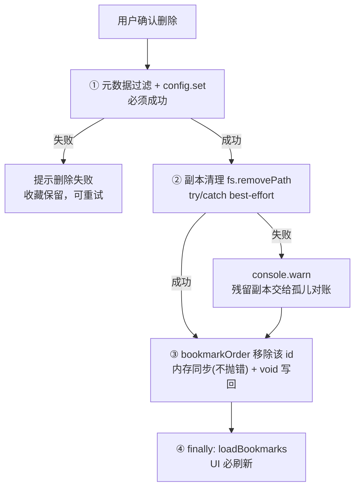

# 收藏副本生命周期：定位基准统一与删除解耦

> ⚠ **已被取代**：bookmark 现为坐标书签（NeutralAnchor = { lineageId, entryId }，无副本、无 opaque），见 session-neutral-layer.md §6/§12。本文保留作历史参考。

会话收藏“删不掉”的现象，根因不在文件系统，而在收藏的副本文件用了错误的路径基准去定位。把副本的定位基准统一到当前项目根、把“取消收藏”和“删副本文件”从同一根 await 链上解耦，顺手把历史 bug 残留的孤儿副本对账清掉。改动全部落在 session-bookmarks 插件一个文件里，内核不切刀。

先交代收藏的形态，后文全靠它：一条收藏 = 一条元数据（id、标签、预览、锚点消息 id 等，存 project 级 config）+ 一份会话快照副本（`<cwd>/.my-harness-desktop/session-bookmarks/<id>.jsonl`，fork 的素材）。元数据让收藏出现在列表里，副本让收藏能被 fork。

## 1 问题与根因

### 1.1 现象：项目目录搬动后收藏删不掉

用户视角的“删不掉”长这样：右侧收藏列表里点垃圾桶、点确认，收藏纹丝不动——没有报错、没有消失，再点一次还是这样。复现它只需要一类操作：**项目目录的绝对路径发生变化**——整体搬移（`D:/a` 挪到 `D:/b`）、重命名（`D:/a` 改名 `D:/b`）、或复制出副本（`cp -r`）后在新路径打开项目。三类操作的共同点是：目录内容原样，路径变了。

为什么搬动会触发：收藏的元数据存在 `<cwd>/.my-harness-desktop/config/session-bookmarks.json`（project 级配置，路径由框架按 pluginId 推导），它跟着目录走、换位置还在；但每条收藏的 `cwd` 字段记录的是**创建那一刻**的项目路径（`src/plugins/sessions/session-bookmarks/renderer/index.tsx`，`createBookmark` 里 `cwd: currentCwd`）。目录搬走后这个字段就成了过期的路径快照：

- 删除副本文件时用的正是这个快照（`deleteBookmark` 里 `bookmarkSessionFile(bm.cwd, bm.id)`），而 `fs:removePath` 的 IPC 把路径圈禁在**当前激活项目根**内（`src/api/ipc/fs-git.ts` 的 `assertProjectPath`，越界直接 throw）。快照路径指向旧位置，和当前根不是一回事，删除第一步就死在 IPC 边界上。
- git clone 是否触发取决于 `.my-harness-desktop` 的 git 状态，两条路修复后都覆盖：插件注释的设计意图是元数据“git 可追踪、跟随项目”（`<cwd>/.my-harness-desktop/config/session-bookmarks.json`），用户若提交了 `.my-harness-desktop`，clone 会把带过期 `bm.cwd` 的元数据连同副本一起带进新项目，bug 照样触发；用户若 ignore 了 `.my-harness-desktop`，clone 里没有收藏元数据，不涉及。统一 currentCwd 后，clone 带来的副本就在当前根下，删除、fork 照常。

这里有个反直觉的点要先戳破：**"session 文件不存在"不是删不掉的原因**。副本删除的最终实现是 `rmSync(path, { recursive: true, force: true })`（`src/core/application/sessions/session-scanner.ts` 的 `removePath`，fs-git.ts 的 IPC handler 引用的就是它），而 Node 的 `fs.rmSync` 在 `force: true` 时对不存在的路径静默成功、不抛 ENOENT——这是 Node API 文档明说的语义。所以副本被外部删掉（git clean、手动清）的场景，删除其实是成功的。真正让删除断掉的，是 `bm.cwd` 与当前激活项目根不一致——文件存在也好、不存在也好，路径一越界就抛错。

### 1.2 根因一：两条通道的圈禁基准不对称

收藏副本的读写走了两条不同的 IPC 通道，圈禁规则不一样，这是不对称的根源：

- **创建**走 session 通道（`ctx.sessions.copySession`），圈禁只要求路径落在会话相关位置——`~/.pi/agent` 前缀、`~/.my-harness-desktop` 前缀、或含 `.my-harness-desktop` 段（`src/api/ipc/sessions.ts` 的 `assertSessionPathAllowed`）——宽松，任何项目的项目级数据目录都能写。
- **删除**走 fs 通道（`ctx.fs.removePath`），圈禁要求路径落在当前激活项目根内（`assertProjectPath`）——严格，只认当前项目。

创建时写进元数据的 `bm.cwd` 是"当时那个项目"，删除时却被"现在这个项目"重新校验。项目路径不变时两边一致、相安无事；目录一搬动，创建能写、删除不能删，收藏就成了只能进不能出的死数据。

### 1.3 根因二：删除把两件事焊在了一根 await 链上

`deleteBookmark` 现在的结构是顺序的四步：

```typescript
await ctx.config.set("bookmarks", index.filter((b) => b.id !== bm.id));  // ① 删元数据
await ctx.fs?.removePath(bookmarkSessionFile(bm.cwd, bm.id));             // ② 删副本
const nextOrder = orderRef.current.filter((id) => id !== bm.id);          // ③ bookmarkOrder
if (nextOrder.length !== orderRef.current.length) {                       //    内存同步,
  orderRef.current = nextOrder;                                           //    写回是 void
  setOrder(nextOrder);
  void ctx.config.set("bookmarkOrder", nextOrder);
}
await loadBookmarks();                                                    // ④ 刷新 UI
```

① ② ④ 是 `await` 串起来的链，③ 的内存更新（`orderRef`/`setOrder`）同步执行、config 写回是 fire-and-forget 的 `void`、不阻塞。于是 ② 越界抛错时，③ ④ 都不执行——元数据已经删了、UI 却没刷新，列表里留下一条“幽灵收藏”；再点删除时 ① 幂等无事可做、② 照样抛错，永远无法从 UI 上消失，直到手动刷新或重开。调用处又是 fire-and-forget 的 `void deleteBookmark(bm)` 不接 catch——抛错变成 unhandled rejection，控制台有一行警告，用户界面却什么都看不到。

这里要分清两个语义：**"取消收藏"是元数据操作，删副本文件是资源回收**。前者是用户明确表达的意图，必须成功；后者只是顺手打扫，失败不该绑架前者。现在它们共担成败，一损俱损。

### 1.4 连带受害者：fork 也用同一个过期快照

收藏的副本不是摆设——它是 fork 的素材。收藏复制的是会话某个时刻的快照（`createBookmark` 里 `copySession` 到项目数据目录），fork 的语义是“从这条收藏的锚点消息继续开新会话”（锚点消息就是元数据里的 `entryId`，收藏时记下当条消息 id），读的就是这份快照。`forkFromBookmark` 和删除踩同一个坑（同一文件里，`bookmarkSessionFile(bm.cwd, bm.id)` 读副本、`ctx.tree.forkFromSession(bm.cwd, bmSessionPath, bm.entryId, "at")` 把 cwd 传给底座）：

- 目录搬走后副本其实跟着搬到了新位置（副本在 `<cwd>/.my-harness-desktop/session-bookmarks/`，是项目目录的一部分），但 fork 拿旧 `bm.cwd` 去读——`openSession` 找不到文件，报"会话不存在"。副本明明在，用户却 fork 不了。
- 复制场景（`cp -r` 出副本、原目录还留着）更糟：旧路径的文件还在，fork 会带着旧 `bm.cwd` 把新会话 fork 进旧项目——用户在 B 项目点收藏，新会话却落在 A 项目里。

删除和 fork 是同一根因的两处受害者，只修删除会留下 fork 这个次生 bug。

## 2 方案：基准统一 + 操作解耦

本次改动分两类：**路径修复**（§2.1–2.3，把删除和 fork 从过期快照上救回来）和**新增机制**（§2.4，孤儿副本对账，让历史残留自愈）。前者修 bug，后者是常驻兜底，读的时候别把两者混成一体。

### 2.1 副本定位统一到当前项目根

副本的物理位置本来就在 `<cwd>/.my-harness-desktop/session-bookmarks/`（`bookmarkDataDir` 的定义），是项目的一部分。那么副本的定位基准就该是"当前激活项目根"——加载、创建、删除、fork 全部用同一个基准，没有第二个。

具体到代码：删除和 fork 里的 `bookmarkSessionFile(bm.cwd, bm.id)` 改成 `bookmarkSessionFile(currentCwd, bm.id)`，`ctx.tree.forkFromSession(bm.cwd, ...)` 改成 `ctx.tree.forkFromSession(currentCwd, ...)`。`currentCwd` 是 `BookmarksTab` 已经持有的 `useUiStore` 状态（当前激活项目根），不用新取。加载侧的 `exists` 判定（`fs.listDir(bookmarkDataDir(currentCwd))`，`exists` 是加载时为每条收藏算的“副本文件是否还在”运行时标记，UI 据此显示可否 fork）和创建侧（`copySession(..., bookmarkSessionFile(currentCwd, id))`）本来就用当前根，改完后五个操作基准全部对齐：

| 操作 | 修复前基准 | 修复后基准 |
|:---|:---|:---|
| 创建副本 | currentCwd ✓ | currentCwd |
| exists 判定 | currentCwd ✓ | currentCwd |
| 删除副本 | bm.cwd ✗ | currentCwd |
| fork 读副本 | bm.cwd ✗ | currentCwd |
| fork 落点 cwd | bm.cwd ✗ | currentCwd |

注意这里修的不是通道本身——创建仍走宽松的 session 通道、删除仍走严格的 fs 通道，两条通道的圈禁规则一条没动。修的是参数基准：副本路径永远用 currentCwd 构造，而 currentCwd 是 fs 通道圈禁根（main 进程 `sessionStore.getActiveCwd()`）的 renderer 镜像，框架经 `cwdChanged` 系统事件保证同步，面板显示的收藏本就是 currentCwd 对应项目的——所以删除几乎总是落在根内、被放行；极端窗口内若镜像陈旧导致越界，② 的 try/catch 兜住、由对账兜底，不构成危害。通道不对称没有消除，只是被参数基准绕过了——这也是为什么改动只落在插件一个文件、内核一行不改。

`bm.cwd` 字段不再承担任何路径定位职责——它保留在元数据里（历史数据不迁移、不重写），但没有任何代码再读它做路径拼接，纯属无害的历史存档。统一后目录搬移、重命名都不再影响副本操作：副本跟着项目在，就是 currentCwd 下的那个；副本不在，删除就是一次对不存在路径的幂等清扫。

### 2.2 删除解耦：取消收藏必然成功，副本尽力清理

改后的 `deleteBookmark` 把各步的成败分开：

1. **元数据删除**——必须成功。`config.set` 过滤掉目标收藏后写回，这是“取消收藏”本体；万一这一步失败（配置目录不可写、磁盘故障），收藏保留、列表不变，函数内弹一条失败提示（复用面板已有的 toast）让用户知道没删成、可以重试，然后直接返回——这是全流程唯一对用户可见的失败。
2. **副本清理**——best-effort。`try/catch` 包住 `fs.removePath`，失败只 `console.warn`，不阻塞流程。副本是 fork 素材不是收藏本质，删不掉顶多留个孤儿，孤儿由 §2.4 的对账兜底。
3. **bookmarkOrder 清理**——收藏列表支持拖拽排序，顺序存 config 的 `bookmarkOrder` key；删除时把该 id 从内存序 `orderRef` 里过滤掉、`setOrder` 同步 UI、`config.set` 写回。保持现状的 fire-and-forget 写回，失败只丢一条排序记录，不影响删除本身。
4. **UI 刷新**——必须执行。`loadBookmarks` 挪进 `finally`，② ③ 成败都不影响它执行，杜绝幽灵条目（唯一例外见 §3.3 的 `ctx.fs` 为 null 边界；① 失败在步骤 1 直接返回，列表本就不变，不需要刷新）。

外加一个配套小修：`deleteBookmark` 的调用处（确认按钮 onClick）从 `void deleteBookmark(bm)` 改为带 catch 的调用——① 的失败已在函数内提示并返回，这里接的是任何未预期异常，catch 里留一条日志、不再静默吞掉。



**图 1 — 删除流程：元数据与 UI 是主链路，副本清理是旁路**

这个结构下，之前所有"删不掉"的场景都收敛成一种：`config.set` 本身失败。那是真的该让用户知道、该让用户重试的错误——除此之外，删除必然成功，副本清理失败不留观感后患。

### 2.3 fork 同修，堵住次生 bug

`forkFromBookmark` 两处基准一并改到 currentCwd：读副本用 `bookmarkSessionFile(currentCwd, bm.id)`，fork 落点用 `ctx.tree.forkFromSession(currentCwd, bmSessionPath, bm.entryId, "at")`。改完后 fork 的副本读取和 exists 判定用同一基准——exists 显示副本在的，fork 一定能读到那份副本；fork 产物永远落在当前项目。注意这里有两层，别混：前一层是“能读到文件”（文件存在层），后一层才是“能 fork 成功”（锚点校验层）——exists 只是“文件在”的标记，不等于“能 fork”：fork 还要过锚点存在、锚点是 assistant 消息这两道既有校验——存量 user 锚点收藏 exists 显示可点、fork 却会被挡下，这是收藏创建时的既有规则（fork 语义要求从 assistant 回答后继续），与本次修复无关。目录搬走后副本跟着走，fork 正常；副本确实不在，前置的 `openSession` 校验返回“会话不存在”，用户看到的是明确提示而不是 fork 进旧项目的怪事。

### 2.4 孤儿对账：历史残留自愈（新增机制）

`loadBookmarks` 加载时已经在 `listDir` 枚举 data dir 了，顺手做一次对账：文件集合减去元数据 id 集合，剩下的就是孤儿——历史上"元数据已删但副本残留"的产物（包括本 bug 修复前那些删到一半的收藏），也可能是用户手改 config 留下的。对孤儿静默 `removePath`，同样 try/catch 兜底。对账每轮加载跑一次，成本是一个 listDir 加至多几次 removePath，和现有的 exists 判定共享同一枚举，不增加额外扫描。

误删风险有两层防护。第一层是写路径清单：副本目录的写代码只有插件自己——`createBookmark` 的 `copySession`（id 用 `crypto.randomUUID()` 生成，文件名 `uuid.jsonl` 形态）和一次性旧桶迁移 `migrateLegacyBucket` 的 `copySession`（把旧全局桶 `~/.my-harness-desktop/plugins-data/session-bookmarks/<cwd-hash>/` 迁回项目级），全仓库没有第三处。但光有清单不够——两条写路径都是**先落文件、后落元数据**（`copySession` 先执行、`config.set` 后写），在途窗口内对账读到的元数据还没有这个 id，文件恰好落在差集里。所以第二层防护是**豁免在途创建的文件**：`createBookmark` 开始时把 id 登记进插件内的 `pendingCreateRef`（一个内存 Set），对账跳过其中任何 id，创建完成（元数据落盘）后撤销登记。创建窗口内的文件天然豁免，历史残留的孤儿都是跨加载周期的旧文件，照删不误。

为什么不用 mtime 阈值豁免“刚写入的文件”？因为 `fs:listDir` 通道只返回 `{name, isDir}`、不携带 mtime——为对账给内核加字段违背“改动只落插件一个文件”的单文件原则；在途豁免语义等价（只豁免创建窗口内的文件）且不依赖时钟。迁移路径不需要豁免：迁移发生在 `loadBookmarks` 内部、对账之前，迁移写入的文件 id 全在刚 set 的元数据里，天然不在差集。两层合起来：对账删的只可能是“盘上躺着、元数据里没有、且不是刚写入”的孤儿，误删面不存在。这个“写路径只有插件自己”是现状事实，不是机制保证；如果将来真有第三方要往这个目录写东西，那是新的契约问题，届时对账规则再扩展，当前不做防御。

### 2.5 方案为什么不选"只删元数据、完全不碰副本"

有更省事的选项：删除时干脆不删副本，让对账兜一切。不选它，理由有两条：

- **磁盘残留违背删除意图**。用户删收藏的心智是"这条不要了"，副本里装着会话快照（可能含敏感内容），不删的话它会一直躺在项目目录里直到下次加载对账才被清。删除时顺手清掉，绝大多数场景就是一次成功的 rm，几乎不产生孤儿。
- **对账的清理窗口太长**。对账只在加载时跑，不删除的话孤儿会残留整个应用运行周期，用户下次打开项目前它一直占着磁盘。best-effort 删除把清理从“下次加载”提前到“删除当下”。

对账是兜底不是主力，主力还是删除时顺手清掉——和"副本删除失败不该阻塞收藏删除"不矛盾，尽力而为 + 兜底对账，两层各管一段。

## 3 兼容与边界

### 3.1 历史数据：`bm.cwd` 只停用不迁移

存量收藏的 `bm.cwd` 字段保持原样，不重写 config、不删除字段。统一基准后这个字段对任何代码路径都没有副作用——它只是不再被读取用于定位，也没有展示代码读它，纯属休眠存档。

### 3.2 目录搬走 vs git clone：两种去向都自洽

- **目录搬移/重命名/复制**（绝对路径变了，`.my-harness-desktop/` 跟着走）：元数据在、副本也在 currentCwd 下，删除、fork 全部正常。修复前这里是“删除越界 + fork 找不到文件（或 fork 进旧项目）”的重灾区。
- **git clone 新位置**：视 `.my-harness-desktop` 的 git 状态而定——用户 ignore 了它，新 clone 没有收藏元数据，收藏列表为空，本 bug 不涉及；用户提交了它（插件注释的设计意图就是元数据 git 可追踪），clone 会把带过期 `bm.cwd` 的元数据连副本一起带过来，等于 §1.1 的“复制出副本”触发方式，bug 照样触发——但修复后的方案同样覆盖，统一 currentCwd 后 clone 带来的副本就在当前根下。无论哪种，用户在新 clone 里新建的收藏都是全新的，cwd 字段就是新位置，一切正常。

### 3.3 极端失败路径

- **`config.set` 失败**：元数据删不掉，删除整体失败，收藏保留、列表不变，弹失败提示让用户重试——这是唯一对用户可见的失败。失败结果与现状一致（收藏保留、列表不变），仅新增用户可见提示——现状是 unhandled rejection，用户什么都看不到。
- **副本删除失败且文件确实在**（被占用、只读盘）：收藏照删（关系解除），残留副本在下次加载被对账清掉。对账那次 `removePath` 如果也失败（文件持续被占用），文件会长期残留——这是可接受的已知限制：无 UI 打扰、无数据危害，用户手动清或盘恢复后对账再试都行，不值得为它加重试退避机制。
- **`ctx.fs` 为 null**（权限被撤之类的极端情况）：可选链静默跳过副本清理，元数据删除照常。副作用是 `loadBookmarks` 开头有 `if (!ctx.fs) return` 的早退、UI 这次不刷新——收藏从 config 里删掉了，列表在下一次 fs 可用时的加载中消失。这个场景现实中几乎不可能（权限没了插件本身也该停了），列为已知边界，不做额外处理。

## 4 QA

**Q：修复前已经删到一半的"幽灵收藏"怎么处理？**

它的元数据其实已经不在 config 里（① 早已执行），只是 UI 没刷新。修复后任何一次 `loadBookmarks`——切换项目、重新打开面板、新建收藏——都会让列表按 config 重算，幽灵条目自然消失；残留的副本文件由孤儿对账清掉。存量垃圾自愈，不需要迁移脚本。

**Q：`bm.cwd` 字段还在元数据里，会不会有一天又被哪个新代码捡起来当路径用？**

这是文档纪律问题。方案里明确把它降级为不参与定位的休眠存档，代码注释标注"不再用于路径定位"。评审口径是：任何新的路径操作，基准必须是 currentCwd 或传入参数，出现 `bm.cwd` 参与路径拼接即视为违规。

**Q：统一到 currentCwd 后，会不会误删"另一个项目放进来"的副本？**

不会。副本目录是 `<cwd>/.my-harness-desktop/session-bookmarks/`，按项目物理隔离——A 项目的副本在 A 的目录里，B 项目在 currentCwd 下枚举到的只可能是 B 自己的文件。跨项目路径本来就够不着（fs 通道圈禁当前根），不存在误删面。反过来，在 B 项目里也看不到 A 项目的收藏：元数据按项目存，B 读的是 B 自己的 config。

**Q：为什么删除不先删副本再删元数据？顺序反过来的话，文件删失败时收藏还在，用户至少能重试。**

因为"文件删失败"在越界场景下是必然失败——先删文件会让收藏永远删不掉，这正是本 bug。反过来先删元数据，越界场景收藏也删得掉，副本残留交给对账。顺序的取舍点是：哪一步失败可以接受。元数据失败不可接受（收藏必须能取消），副本失败可接受（有对账兜底）——所以元数据在前、副本在后。

**Q：fork 修复后，exists 判定和 fork 的读路径完全一致吗？**

副本读取一致：exists 按 `currentCwd` 的 data dir 枚举判定，fork 按 `bookmarkSessionFile(currentCwd, bm.id)` 读——同一个目录、同一个文件名规则。文件在枚举和读之间被外部删掉（竞态）时 `openSession` 返回空、提示“会话不存在”，是正常失败路径。但 exists 只是“文件在”的标记，不等于“能 fork”：fork 还要过锚点存在、锚点是 assistant 消息两道既有校验——存量 user 锚点收藏 exists=true 却 fork 不了，这是收藏创建时的既有规则（fork 语义要求从 assistant 回答后继续），与本次修复无关。

**Q：孤儿对账会不会把“用户手动放进目录的合法 jsonl”或刚创建的副本删掉？**

前者：该目录的写路径只有插件自己（§2.4 已列出），文件名约定是 `uuid.jsonl`，没有其他合法来源；手改文件名的属于数据损坏，清掉不心疼。后者：对账带在途创建豁免（§2.4，`pendingCreateRef` 登记创建中的 id），创建/迁移的在途副本被豁免，不会误删。如果将来第三方要往这个目录写东西，那是新的契约问题，届时对账规则再扩展——当前没有这个契约，不做防御。

**Q：git clone 一个项目，收藏会不会像搬目录一样删不掉？**

取决于 `.my-harness-desktop` 的 git 状态（§3.2）：用户提交了它，clone 会把带过期 `bm.cwd` 的元数据连副本一起带过来，和“复制出副本”一样触发；ignore 了则不触发。两种情形修复后都覆盖——统一 currentCwd 后副本定位永远在当前根，删除、fork 照常。

**Q：best-effort 删副本 + 对账兜底，为什么不干脆删除时完全不删副本、只靠对账？**

见 §2.5：对账只在加载时跑，不删的话孤儿会躺在项目目录里直到下次打开项目。best-effort 删除在绝大多数场景就是一次成功的 rm，几乎不产生孤儿；对账是兜底不是主力。两层各管一段，不重复。

**Q：副本删除失败后对账也一直失败，会不会永远残留？**

可能。文件被持续占用（Windows 上某进程持有句柄）、盘一直只读，对账的 `removePath` 也会失败，文件就长期残留。这是 §3.3 明说的已知限制：不打扰用户、不危害数据，不值得为这种极端情形加重试退避。用户手动清掉、或盘恢复后对账再试，都是出路。
