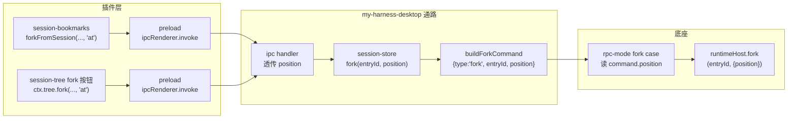

# 收藏 fork 点位修正:从 user 前 fork 到 assistant 后继续

> ⚠ **已被取代**：bookmark 现为坐标书签（无副本），resume 现场 fork；见 session-neutral-layer.md。本文保留作历史参考。

收藏是 fork 的锦上添花——在一条 assistant 回答处打一个标记，之后点这个收藏就开一条新分支会话，从那条回答接着往下走，和原会话物理割裂。底座 fork 早就支持这件事了，但 position 参数从 my-harness-desktop 到底座 RPC 的通路上断了一截，UI 层也把收藏按钮挂错了节点。这次改动不开发任何新能力，只把断的通路接上、挂错的按钮挪对。

## 1 问题与目标

### 1.1 收藏该是什么语义

收藏的本质是"从这条 assistant 回答后继续"。用户在对话里看到一条好的 assistant 回答，标一个收藏；之后点这个收藏，应用开一条全新的分支会话——新会话文件、新会话路径，保留了原会话到那条 assistant 回答为止的全部内容，然后用户在分支里接着输入。原会话不受影响，分支和原会话之间是物理割裂的——各自独立的 JSONL 文件，各自独立的 pi 进程上下文。

这个语义和 fork 的 `"at"` position 完全对应。底座 `agent-session-runtime.js:174` 的 `fork(entryId, options)` 函数里，`position: "at"` 的含义是"在选中的那条消息处分叉"——`targetLeafId = selectedEntry.id`，保留到这条消息为止，然后新会话从这条消息后开始接收新输入。不需要任何新机制，底座已经做完了。

### 1.2 三层错配

收藏该走 `"at"`，但现在从头到尾走的是 `"before"`，而且只让 user 消息能收藏。断点不在一层，是三层叠在一起：

- **底座 RPC 入口漏传 position**。`rpc-mode.js:480` 的 fork case 调 `runtimeHost.fork(command.entryId)` 时没传 options，底座 `fork()` 的 `position` 参数缺省走 `"before"`——`"before"` 会校验 `selectedEntry.message.role !== "user"` 就抛错（`agent-session-runtime.js:190`），所以只有 user 消息能 fork。底座 `fork()` 本身不限定 role——`"at"` 分支里 `targetLeafId = selectedEntry.id`，不管 role 是什么都能分叉。是 RPC 入口这一层把 position 吞了，导致整条链路被钉死在 `"before"`。

- **my-harness-desktop 协议没有 position 字段**。`core/protocol/rpc-types.ts:95` 的 fork 命令类型是 `{ type: "fork"; entryId: string }`，没有 position 字段。`core/protocol/commands.ts:83` 的 `buildForkCommand(entryId)` 只收一个参数。就算底座 RPC 修了透传，my-harness-desktop 这侧也发不出去 position——协议命令构造就没这个口子。

- **UI 把收藏按钮挂在了 user 消息上**。`timeline/renderer/index.tsx:670` 的 `canBookmark` 判断是 `message.role === "user"`，`session-tree/renderer/index.tsx:164` 的收藏和 fork 按钮都挂在 `entryType === "user"` 的节点上。因为底座 RPC 只走 `"before"`、`"before"` 只接受 user 消息，UI 层只能把按钮挂到 user 节点上——这是被底层限制逼出来的 UI，不是设计意图。

三层叠在一起的结果：用户只能收藏自己发出的消息，收藏后 fork 走 `"before"`——分叉到那条 user 消息之前，丢掉那轮对话重新输入。这和"从这条回答后继续"的语义完全相反。

### 1.3 目标

底层把 position 参数从 my-harness-desktop 协议层一路透传到底座 RPC 入口——fork 能力本身一个字不碰，只补参数通路。UI 层把收藏按钮从 user 消息挪到 assistant 消息，fork 调用传 `"at"`。session-tree 里的 fork 按钮同理——也挪到 assistant 节点、走 `"at"`，和收藏按钮语义一致。

## 2 position 透传

fork 是底座既有能力，这次不碰它。改的是把 `position` 这个参数从 my-harness-desktop 一路传到底座 RPC 入口——四层透传，每层加一个参数口子，不新增任何逻辑。

### 2.1 底座 RPC mode 透传 position

`rpc-mode.js:480` 的 fork case 现在调 `runtimeHost.fork(command.entryId)` 不传 options。改成读 `command.position`，有就传 `{ position }`，没有就不传——底座 `fork()` 自己会缺省 `"before"`，向后兼容。

```js
case "fork": {
    const opts = command.position ? { position: command.position } : undefined;
    const result = await runtimeHost.fork(command.entryId, opts);
    ...
}
```

这是底座包 `~/.my-harness-desktop/pi/node_modules/@earendil-works/pi-coding-agent/` 里的代码，不在 my-harness-desktop 仓库。落地方式：提 PR 给上游 `@earendil-works/pi-coding-agent`，合并发版后 my-harness-desktop 升版本即可。PR 等待期间不阻断 my-harness-desktop 侧的开发和验证——my-harness-desktop 的协议和 UI 改完后，本地用 patch 兜底（postinstall 脚本打一行补丁，和已有的 `patch-electron.cjs` 同套路），底座发版后删 patch 留 PR 的天然支持。

### 2.2 协议层加 position 字段

`core/protocol/rpc-types.ts:95` 的 fork 命令类型加可选 position：

```typescript
| { id?: string; type: "fork"; entryId: string; position?: "before" | "at" }
```

`core/protocol/commands.ts:83` 的 `buildForkCommand` 加第二个可选参数：

```typescript
export function buildForkCommand(entryId: string, position?: "before" | "at"): RpcCommand {
  return position ? { type: "fork", entryId, position } : { type: "fork", entryId };
}
```

position 可选——不传时构造出的命令不带这个字段，底座行为和改之前完全一致。这保证旧调用方不传 position 时不会破。

### 2.3 domain 接口加 position 参数

`core/domain/sessions.ts:201` 的 `SessionTreeApi.fork` 加可选 position：

```typescript
fork(entryId: string, position?: "before" | "at"): Promise<void>;
```

`forkFromSession` 同理（`sessions.ts:208`）——它是 session-bookmarks 的收藏 fork 走的路径，收藏要传 `"at"`，这个口子必须在 domain 接口上开出来：

```typescript
forkFromSession(cwd: string, srcPath: string, entryId: string, position?: "before" | "at"): Promise<void>;
```

`core/domain/context.ts:81` 的 `PluginContext` 接口里 `tree: SessionTreeApi` 这行不用改——`SessionTreeApi` 接口加了可选参数，`PluginContext` 的形状自动跟着变，不需要动 `context.ts` 本身。`context.ts:50` 的注释里列了 `tree:会话树操作(fork/clone/getForkMessages)`，注释里没列参数签名，不用改。

### 2.4 application + api 透传

`src/core/application/sessions/session-store.ts:663` 的 `fork()` 透传 position 给 `buildForkCommand`：

```typescript
async fork(entryId: string, position?: "before" | "at"): Promise<void> {
  await this.send(buildForkCommand(entryId, position));
  await this.reconcileAfterSessionReplacement();
}
```

`src/core/application/sessions/session-store.ts:679` 的 `forkFromSession()` 透传 position 给 `this.fork()`：

```typescript
async forkFromSession(cwd: string, srcPath: string, entryId: string, position?: "before" | "at"): Promise<void> {
  ...
  await this.fork(entryId, position);
  ...
}
```

`api/ipc/sessions.ts:99` 的 fork IPC handler 透传第二参：

```typescript
ipcMain.handle(IPC.session.fork, (_e, entryId: string, position?: "before" | "at") => sessionStore.fork(entryId, position));
```

`forkFromSession` 的 handler（`sessions.ts:100`）透传第四参：

```typescript
ipcMain.handle(IPC.session.forkFromSession, (_e, cwd, srcPath, entryId, position?) => {
  ...
  return sessionStore.forkFromSession(cwd, src, entryId, position);
});
```

`api/preload/preload.ts:241` 的 preload 桥接面透传：

```typescript
fork: (entryId: string, position?: "before" | "at"): Promise<void> =>
  ipcRenderer.invoke(IPC.session.fork, entryId, position),
forkFromSession: (cwd: string, srcPath: string, entryId: string, position?: "before" | "at"): Promise<void> =>
  ipcRenderer.invoke(IPC.session.forkFromSession, cwd, srcPath, entryId, position),
```

四层透传，每层只加一个可选参数，零逻辑分支——参数从 preload 进来，经 IPC、application、protocol 一路到底座 RPC 入口，沿途不做任何判断和转换。position 是 `"before"` 还是 `"at"` 由调用方决定，通路只负责传到位。


**图 1 — position 四层透传通路，每层只加参数口子，零逻辑分支**

## 3 UI 层调入口

收藏和 fork 是两条独立的调用路径——收藏走 `bookmarkRequested` 事件 → session-bookmarks 插件 → `forkFromSession`，fork 按钮走 `ctx.tree.fork` 直接调。它们不合并成一条路径，只是各自把挂的节点和传的参数改对。

### 3.1 timeline 收藏按钮改挂 assistant

`src/plugins/sessions/timeline/renderer/index.tsx:670` 的 `canBookmark` 条件从 user 改为 assistant：

```typescript
const canBookmark = message.role === "assistant" && !!message.id && !!currentSessionPath;
```

`MessageActions` 组件里，收藏按钮在 `canBookmark` 为真时渲染，和"复制"按钮并排，hover 消息气泡时浮现。改完后只有 assistant 消息下方出现收藏按钮，user 消息不再有。emit 的事件 payload 不变——`{ sessionPath, entryId, preview }` 三个字段，session-bookmarks 接收端不用改。

### 3.2 session-tree fork 和收藏按钮统一

`src/plugins/sessions/session-tree/renderer/index.tsx:164` 的条件从 `entryType === "user"` 改为 `entryType === "assistant"`，fork 按钮和收藏按钮一起挪到 assistant 节点上：

```tsx
{n.entryType === "assistant" && (
  <>
    <button onClick={(e) => { e.stopPropagation(); fork(n); }} ... >
      <GitFork className="size-3" />
    </button>
    <button onClick={(e) => { e.stopPropagation(); bookmark(n); }} ... >
      <Bookmark className="size-3" />
    </button>
  </>
)}
```

fork 函数（`src/plugins/sessions/session-tree/renderer/index.tsx:68`）的调用加传 `"at"`：

```typescript
const fork = (node: TreeNode): void => {
  if (!window.confirm(t("system.forkConfirm"))) return;
  void ctx.tree.fork(node.entryId, "at").catch(() => {});
};
```

改完后 user 节点不再有 fork 和收藏按钮——"回退重走"的语义不再暴露给用户。fork 和收藏都走 `"at"`，语义统一为"从这条回答后继续"。注释也要同步改——现在的注释 `fork/收藏只挂 user 节点:底座 RPC fork 只接受 user 消息(position:"before"校验 role)` 写的是旧约束的原因，改完后约束不存在了，注释删掉换成新语义的说明。

### 3.3 session-bookmarks 校验与 fork 调用同步

session-bookmarks 的 `forkFromBookmark`（`src/plugins/sessions/session-bookmarks/renderer/index.tsx:172`）有三处要改：

前置校验（`index.tsx:184`）从 `anchor.role !== "user"` 改为 `!== "assistant"`——收藏的锚点必须是 assistant 消息，非 assistant 挡在原地给可读错误：

```typescript
if (anchor.role !== "assistant") {
  setForkError({ bm, message: t("bookmarks.errorNotForkable") });
  return;
}
```

fork 调用（`index.tsx:187`）加传 `"at"`：

```typescript
await ctx.tree.forkFromSession(bm.cwd, bmSessionPath, bm.entryId, "at");
```

AddForm 的 `onResolve`（`index.tsx:404`）同理——校验 `msg.role !== "assistant"` 返回错误，preview 截取不变。

错误文案要跟着改。四个语言文件都在 `src/plugins/sessions/session-bookmarks/locales/` 下，`bookmarks.errorNotForkable` 这条 key 从"不是用户消息"改为"不是助手消息"：

| 文件 | 改前 | 改后 |
|:---|:---|:---|
| `src/plugins/sessions/session-bookmarks/locales/zh-CN/bookmarks.json` | 收藏的锚点不是用户消息,无法 fork | 收藏的锚点不是助手消息,无法 fork |
| `src/plugins/sessions/session-bookmarks/locales/en/bookmarks.json` | The bookmark anchor is not a user message; cannot fork | The bookmark anchor is not an assistant message; cannot fork |
| `src/plugins/sessions/session-bookmarks/locales/zh-TW/bookmarks.json` | 收藏的錨點不是使用者訊息,無法 fork | 收藏的錨點不是助手訊息,無法 fork |
| `src/plugins/sessions/session-bookmarks/locales/de/bookmarks.json` | Die Lesezeichen-Markierung ist keine Benutzernachricht; Fork nicht möglich | Die Lesezeichen-Markierung ist keine Assistentennachricht; Fork nicht möglich |

注释里写的"旧版 timeline 右键不挑 role，存量收藏可能是 assistant 锚点"这段——改完后 assistant 锚点成了合法锚点，存量 assistant 收藏不再需要挡，注释删掉。

## 4 错误路径与边界

### 4.1 position 不传时的向后兼容

`position` 是可选参数，四层透传全部用 `?` 标注。不传时 `buildForkCommand` 构造出的命令不带 position 字段，底座 `fork()` 缺省走 `"before"`，行为和改之前完全一致。这保证任何不传 position 的旧调用方——包括未来可能新增的其他调用方——不会因为这次改动而破。

### 4.2 旧收藏数据（user 锚点）的处理

改之前，收藏按钮只挂 user 消息，所以存量收藏的 `entryId` 全部指向 user 消息。改完后收藏走 `"at"`，`"at"` 不校验 role（`agent-session-runtime.js:186` 的 `"at"` 分支里 `targetLeafId = selectedEntry.id`，不管 role），所以存量 user 锚点收藏在底层 fork 时不会报错。

但 UI 层的前置校验从 `role !== "user"` 改成了 `!== "assistant"`——存量 user 锚点收藏在校验阶段就会被挡住，给出"收藏的锚点不是助手消息"的错误提示。这是预期行为：旧的 user 锚点收藏在语义上已经是错的（收藏语义从"回退重走"变成了"从回答后继续"），挡住比让用户误以为能 fork 更好。用户看到错误提示后可以删掉旧收藏，重新从 assistant 消息收藏。

不自动迁移存量收藏——迁移要做"找到该 user 消息对应的上一条 assistant 消息"这种推测，推测错了用户更困惑。显式报错让用户自己删了重收藏，干净利落。

### 4.3 底座未升级时的行为

底座 RPC 没透传 position 之前（PR 未合并或未发版），my-harness-desktop 发了 `position: "at"` 底座不读，仍然走 `"before"`。`"before"` 会校验 role——如果传的是 assistant 消息的 entryId，底座会抛 `"Invalid entry ID for forking"`。

这个窗口期用 patch 兜底，两个触发点同一份匹配串：

- **仓库 postinstall**：`assets/scripts/patch-pi-rpc.cjs` 在 `npm install` 后打补丁，覆盖稳定版与 dev 版两个数据根（`~/.my-harness-desktop/pi` + `~/.my-harness-desktop-dev/pi`，分流见 client/paths.ts）。
- **应用内装/升底座**：`kernel:install` 成功后经 `client/pi/patch-rpc-mode.ts` 重打——应用内 npm install 出的新底座不带补丁，不补则收藏 fork 静默退化。

补丁逻辑：读 `<数据根>/pi/node_modules/@earendil-works/pi-coding-agent/dist/modes/rpc/rpc-mode.js`，用精确字符串匹配找 `runtimeHost.fork(command.entryId)`，替换成带 position 透传的版本。找不到就静默跳过——底座可能已升级到天然支持的版本，目标行已经不存在了。

已删的旧假设：「patch 只在 postinstall 跑、只覆盖稳定版根」——dev 根与应用内重装曾长期裸奔（实证：dev 根 17:54 重装后 fork 立刻退化）。

```javascript
#!/usr/bin/env node
// Patch pi RPC mode: fork case 透传 position.
// Called by postinstall — safe to re-run, no-ops if target not found.
const { existsSync, readFileSync, writeFileSync } = require("node:fs");
const { join } = require("node:path");
const home = require("node:os").homedir();
const file = join(home, ".my-harness-desktop/pi/node_modules/@earendil-works/pi-coding-agent/dist/modes/rpc/rpc-mode.js");
if (!existsSync(file)) { console.log("[patch:pi-rpc] rpc-mode.js not found, skipping"); process.exit(0); }
const old = 'const result = await runtimeHost.fork(command.entryId);';
const rep = 'const opts = command.position ? { position: command.position } : undefined;\n                    const result = await runtimeHost.fork(command.entryId, opts);';
let src = readFileSync(file, "utf8");
if (!src.includes(old)) { console.log("[patch:pi-rpc] fork pattern not found (already patched or base upgraded), skipping"); process.exit(0); }
src = src.replace(old, rep);
writeFileSync(file, src, "utf8");
console.log("[patch:pi-rpc] Patched rpc-mode.js fork case to pass position");
```

`package.json:24` 的 postinstall 脚本加一行调用：

```json
"postinstall": "node assets/scripts/patch-electron.cjs && node assets/scripts/patch-pi-rpc.cjs"
```

底座发版后删掉 `patch-pi-rpc.cjs`、从 postinstall 里去掉调用即可——my-harness-desktop 协议层已经支持 position，底座天然支持，patch 只是个临时桥。patch 用精确匹配——如果底座已升级到含透传逻辑的版本，`runtimeHost.fork(command.entryId)` 这行已经不存在了，patch 找不到就静默跳过，不会损坏文件。所以"删 patch"和"升级底座"的顺序无所谓，patch 脚本晚删几天也不会出事。

## 5 QA

**Q：为什么不让 user 消息也能收藏、走 "before" 保留"回退重走"的语义？**

因为"回退重走"和"从回答后继续"是两种完全不同的操作意图，挂在同一个按钮上会让用户困惑。收藏的语义是"这里好，我想从这接着走"——是向前延伸，不是向后回退。如果未来确实需要"回退重走"，应该在 UI 上给它一个独立的入口（比如叫"回退到此处"），而不是和收藏混在一个按钮上。底层 fork 的 `"before"` position 仍然可用，只是 UI 层不暴露这个入口。

**Q：session-tree 里的 fork 按钮和收藏按钮都挂 assistant 节点，两个按钮功能重复了吗？**

不重复。fork 按钮是即时操作——点了立刻 confirm 后 fork 当前会话；收藏按钮是延迟操作——点了只是存一个标记，之后随时可以从收藏列表里点开 fork。两条路径底层都走 fork，但交互意图不同：一个"现在就分叉"，一个"先记着，以后再分叉"。UI 上保留两个入口是合理的。

**Q：position 字段用 `"before" | "at"` 两个字面量联合类型，底座以后加了新 position 值怎么办？**

底座 `fork()` 的 `position` 参数目前只有 `"before"` 和 `"at"` 两个值。如果底座以后加了第三个值，my-harness-desktop 协议层的联合类型跟着加一个字面量即可——这是开放扩展，不是修改已有代码。`buildForkCommand` 的 `position` 参数类型是 `"before" | "at"`，加新值只是往联合里加一个成员，已有调用方不受影响。

**Q：存量 user 锚点收藏为什么不自动迁移到对应的 assistant 锚点？**

因为"对应的 assistant 锚点"不是确定的。一条 user 消息后面可能跟了多条 assistant 消息（多轮对话、steer 中间插入），也可能后面没有 assistant 消息（用户发了消息但 pi 还没回复）。自动迁移要猜"选哪条 assistant"，猜错了用户拿到的是从错误位置 fork 出的会话，比报错更难排查。显式报错让用户自己判断要不要删了重收藏，控制权在用户手里。

**Q：底座 patch 脚本和已有的 patch-electron.cjs 是同一套路吗？安全吗？**

同一套路。`patch-electron.cjs` 改的是 `node_modules/electron/` 里的 app metadata，`patch-pi-rpc.cjs` 改的是 `~/.my-harness-desktop/pi/node_modules/@earendil-works/pi-coding-agent/dist/modes/rpc/rpc-mode.js` 里的一行。两者都只动本地 `node_modules`，都可重复执行。patch-pi-rpc 改的是底座 RPC 入口的一行透传逻辑——用精确字符串匹配找 `runtimeHost.fork(command.entryId)`，替换成带 position 透传的版本。功能等价于上游 PR 合并后的那行代码。如果底座已升级到含透传逻辑的版本，那行代码已经不存在了，patch 找不到匹配就静默跳过——所以"删 patch 脚本"和"升级底座版本"的先后顺序无所谓，晚删几天不会损坏文件。底座发版后删掉 patch 脚本、从 `package.json` postinstall 里去掉调用、升版本，天然支持。

**Q：fork 走 "at" 时，如果选中的 assistant 消息是会话最后一条消息，fork 出的分支会是什么样？**

分支会保留原会话到那条 assistant 消息为止的全部内容，然后等待用户输入新消息。这和 `clone` 的语义接近——`clone` 也是"在当前 leaf 处开新会话"（`rpc-mode.js:491` 调 `fork(leafId, { position: "at" })`）。区别是 clone 从当前会话的 leaf 分叉，收藏 fork 从一个标记过的任意 assistant 消息分叉。从最后一条 assistant 消息 fork 和 clone 的结果一致——都是"接着上次的回答继续"。
