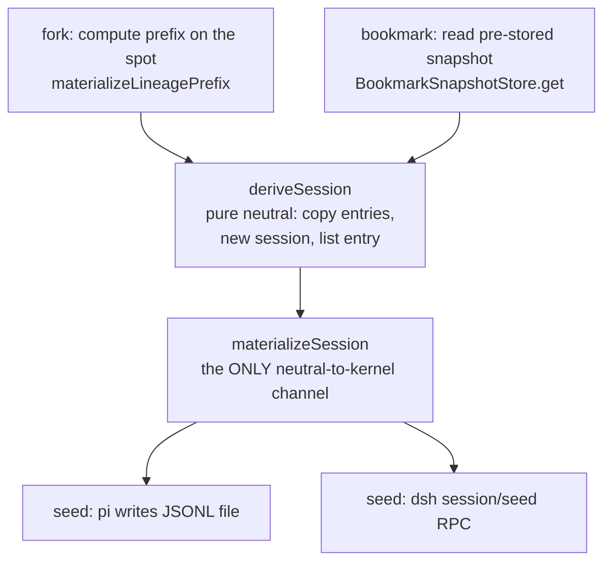
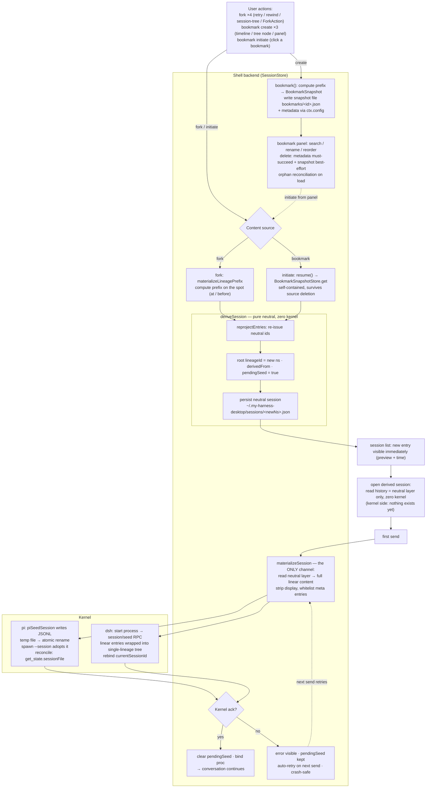
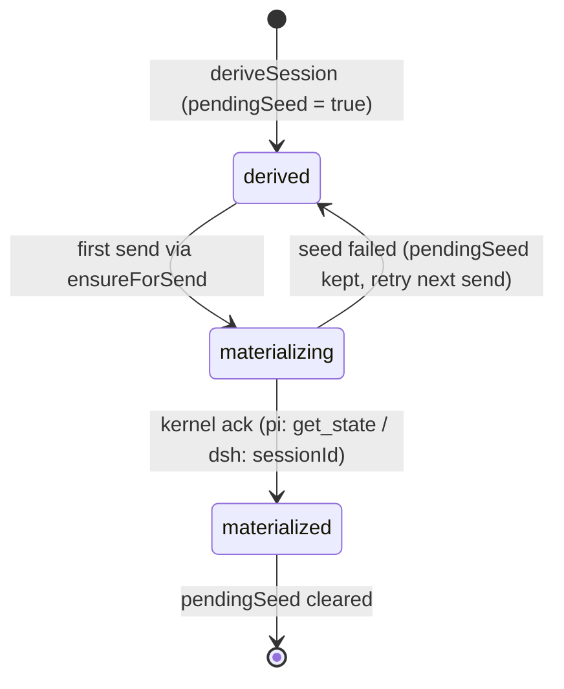

# 分叉与收藏：派生会话模型设计

> 📌 **现状已核,无需标记**：本文的"现状"用作**合法语义**——§2.2「收藏存储**保持现状**」意为"此域不动"；
> 其余（"与现状 `session-store.ts` 的 prompt 次序一致"等）是**仍成立**的对照表述。

分叉和收藏是 my-harness-desktop 会话域的两个功能：fork 从某个节点派生一个自带内容的新会话，收藏把某个节点冻成可反复发起的自包含快照。本文给出这两个功能的完整设计：功能定义、统一抽象、数据模型、物化通道（中立内容同步进内核）、全生命周期、边界与验证。文中文件路径均为仓库根相对路径。

> 本文用到的高频术语，先一次性交代清楚（更全的口径见 `docs/glossary.md` 与 CLAUDE.md）：
>
> - **壳 / 内核 / 适配器**：壳是 my-harness-desktop 桌面壳，分两端——**壳后端**（`src/server/`，会话编排、内核进程管理）与**渲染层**（`src/web/` + 插件，React UI）。内核是被壳托管的 agent 运行时，当前有 **pi** 和 **dsh** 两个，同级；壳不读任何内核的存储格式。**适配器**是每个内核一个的翻译层，把内核专属形状翻成中立契约，反之亦然。
> - **中立契约**：壳需要内核提供的最小意图集合（`BaseBackend` 接口与 `BackendFactory` 工厂，定义在 `packages/shared/src/domain/backend.ts`），发消息/中断/seed 等意图都在其上。
> - **中立会话 / 中立层 / 中立树**：壳自有的会话表示。一个中立会话 = 一个 `neutralSessionId`（下文常缩写 `ns`）+ 一个 header + 若干 lineage；一个会话的全部 lineage 合称这棵**中立树**（分叉结构所在；分支 lineage 的 `fork` 指针把它挂到父 lineage 的分叉点上，形成可回溯的链）。中立层落盘在壳的全局应用数据目录 `~/.my-harness-desktop/sessions/<ns>.json`，列表按 `header.cwd` 分桶过滤——存储位置与 cwd 无关。收藏快照则存项目级 `<cwd>/.my-harness-desktop/bookmarks/`，跟随项目：两者不同根，一个是壳的全局会话库，一个是项目资产。pi 的会话文件另存在 `<bucket>/<文件名>.jsonl`，`<bucket>` 是由项目目录（cwd）派生的 pi 侧桶目录。壳 UI 是三栏布局：左侧会话列表、**中区**消息流（timeline）、右侧面板；**激活会话** = 中区消息流当前所在的那个会话。
> - **lineage / lineageId / NeutralEntry**：一条 lineage 是一段线性历史。每条 entry（`NeutralEntry`）的形状是 `{ neutralEntryId, kernelEntryId?, message, display? }`：`message` 是消息本体（带 id/role/content），`neutralEntryId` 是壳的中立坐标（格式 `{lineageId}:{seq}`，seq 是该条目在 lineage 内的序号），`kernelEntryId` 是内核私有 id（pi 的会话文件是 JSONL、每行一个带 id 的条目，kernelEntryId 就是这个行级 id），`display` 是展示元数据（永不在 AI 投影里出现）——同一条目的两套 id，跨内核只认中立坐标。
> - **物化 / seed / 投影**：本文「物化」只有一个意思——把中立会话的内容转化成内核侧的会话，执行动作叫 **seed**，结果叫**投影**。pi 的 seed 是写 JSONL 文件，dsh 的 seed 是 `session/seed` RPC；`BackendFactory.seed` 与 `BaseBackend.seed` 是同一个动作的两种形态——前者不依赖活进程（pi 纯文件写），后者经进程 RPC（dsh）。「沿中立树的 fork 链算出某条 lineage 的线性内容」叫**截前缀**，是计算，不叫物化——它涵盖两个纯函数的分工：`lineageContent` 沿 fork 链算出一条 lineage 的全量线性内容，`materializeLineagePrefix` 在其结果上按锚点再截一刀。（既有函数 `materializeLineagePrefix` 名里的 materialize 是历史命名，以本文的职责定义为准。）另外：`KernelId = "pi" | "dsh"`（内核身份的类型，`packages/shared/src/domain/kernel.ts` 单源）；**激活 cwd** = 当前打开项目的根目录。
> - **proc**：壳后端里一个活会话的运行时对象，持有后端进程句柄、活跃 lineage 指针（`activeLineageId`）、已物化标记（`materializedLineageId`）等。
> - **圆心**：`packages/shared/src/domain/`，只有类型定义和纯函数、零依赖的最内层。
> - **`ctx.*`**：壳插件在渲染层拿到的受控 API 对象（PluginContext）。`ctx.sessions` 是会话操作面（含 `bookmark`/`resume`/`deleteBookmark` 等），`ctx.tree` 是会话树操作面（`SessionTreeApi`，`packages/shared/src/domain/sessions.ts`），`ctx.pi` 是 pi 内核独有的扩展能力面（dsh 无此面），`ctx.config` 是插件配置通道。

## 1. 功能定义

### 1.1 fork：从某个节点派生新会话

- 用户在对话中途想「从这里换一种走法」时，从当前会话的某个**节点**（= 用户选中的那条 entry，后文统一叫**锚点**）派生出一个**新会话**：新会话自带到该节点为止的全部内容，出现在会话列表里，是一个独立的平级条目。原会话不受任何影响。

- fork 的产物就是新会话——不是原会话内部的一条分支。这是本设计的第一块基石：派生结果必须在列表里看得见、点得开、自带历史。

### 1.2 收藏：把某个节点冻成自包含快照

- 用户遇到一个有价值的节点（通常是一条回答），把它连同之前的完整上下文**冻成一份快照**，存进项目级的收藏目录。快照自包含：源会话之后改了、删了、被压缩了，收藏都不受影响。

- 收藏的语义是「对话模板」：日后随时从这份快照发起一个新会话，带着当时的上下文继续聊。同一份收藏可以反复发起。

### 1.3 两者的关系：同一个操作的两种来源

- fork 和收藏发起是**同一个操作**：取一份内容 → 派生新会话 → 物化给内核 → 继续对话。唯一差别在内容来源——fork 现场沿中立树截前缀（现算），收藏发起读预存快照（预存）。来源之后的每一步都相同，代码必须长成这句话的形状：两个入口、一条通道，不允许两套产物逻辑。

- 差别只在「时机」上体现为两个功能的各自存在理由：fork 是**当下**就要分叉（立即派生），收藏是**以后**可能要分叉（先冻起来，发起时再派生）。

## 2. 设计约束

四条裁定是本设计的边界条件，由项目决策者（本仓库维护者）拍板、本文即记录，不可协商；后续每一节都是它们的展开。

### 2.1 fork 必产新会话

复制内容、不调用内核 fork、会话列表立即新增条目。派生结果就是新会话，不是原会话的一条分支。

### 2.2 收藏存储保持现状

快照存项目级 `<cwd>/.my-harness-desktop/bookmarks/<id>.json`，文件内容是 `BookmarkSnapshot`：中立 `NeutralEntry[]` 前缀（`lineage.entries`）+ 溯源字段（`sourceNeutralSessionId`、`boundaryEntryId`、`sourceKernel`，创建时从源会话读出并写入——`sourceKernel` 抄自源会话 `header.kernel`）。`sourceKernel` 只作溯源与缺省回落（8.3），不参与投影形态的选择——seed 走文件还是 RPC 由目标内核决定，不由来源内核决定。`BookmarkSnapshotStore` 纯文件 CRUD（`src/server/application/sessions/bookmark-snapshot-store.ts`）。收藏的元数据（label/preview/排序）走 `ctx.config`（项目级 `config/session-bookmarks.json`）。

### 2.3 中立到内核有且仅有一个物化函数

任意中立会话转化为内核会话，必须经过同一个函数。`BaseBackend.seed` / `BackendFactory.seed` 不允许出现第二个调用点。这是硬性规定，执行方式见 6.7。

### 2.4 fork 与收藏发起是同一个操作

不是「类似」，是「同一个」：同一通道、同一物化时机、同一产物形态。代码里若出现两处各自实现「取内容 → 新会话 → 物化」，就是违规。

## 3. 统一抽象：派生会话

### 3.1 两个内容来源，一条通道



**Figure 3.1 — One operation, two content sources**

fork 与收藏发起在「来源」之后汇合。seed 的两个内核形态由适配器承担，壳不出现内核身份分支。

### 3.2 deriveSession：纯中立派生

- 「复制文件」落在中立层：`deriveSession` 把前缀 entries 写进中立存储（`NeutralSessionStore.put`，`~/.my-harness-desktop/sessions/<newNs>.json`）。复制的是壳自己的内容格式，与 pi 的 JSONL、dsh 的日志都无关——内核侧的投影在物化时才由 seed 产生（第 6 章）。

- 列表立即可见不需要任何新机制：会话列表本就只读中立层（`NeutralSessionStore.listByCwd`），写完即出条目。

- 零内核交互：不碰任何 proc、不起进程、不查存活。派生是瞬时的纯中立写，这是约束 2.1「不调用内核」的直接含义。

- `deriveSession` 的完整契约（签名、不变量、内容重投影、调用形态）见第 5 章。

### 3.3 materializeSession：唯一物化通道

- 职责集合：读中立层该会话、取目标 lineage 的完整线性内容、seed 投影、把该会话的 proc 绑定到新投影、清 `pendingSeed` 标记（4.3）。约束 2.3 的落地形态就是这个函数。

- 它是本文的重心——「壳有全量内容、内核为零」的缺口怎么补、什么叫内核「认同」、失败怎么办，全部在第 6 章展开。

### 3.4 一图总览



**Figure 3.2 — Full lifecycle of fork & bookmark (derive-session model)**

图上有三个值得停下来看一眼的点：收藏创建是一条**死端**（只产快照与管理态，不碰内核，图左侧经 `MGMT` 节点回流到发起）；fork 与收藏发起在 `deriveSession` 汇合后**共享整条后半生**；「内核侧什么都没有」的缺口态（`VIEW` 节点）与「内核认同」判定菱形（`ACK`）是显式画出来的两个阶段，不是隐含过程。

## 4. 数据模型

### 4.1 中立会话与中立树

- 一个中立会话的磁盘形态是 `~/.my-harness-desktop/sessions/<ns>.json`：`{ neutralSessionId, header, lineages[] }`。header 携带 `kernel`（内核归属）、`cwd`（列表分桶依据）、`createdAt`、`name?`、`custom?`（插件私有数据袋）。lineage 是 `{ lineageId, fork: { parentLineageId, boundaryEntryId } | null, entries: NeutralEntry[] }`——`fork` 为 null 的是根 lineage。

- 中立层只增不改：内核产出条目后经事件上行同步（`entryAppended` → 壳 append 进中立层），没有原地改写。中立会话文件不自动清除，删除只经 `deleteSessions`（级联清中立层与内核文件）。

- 派生会话的中立树只有一条根 lineage：派生携带的是一条线性前缀，不携带源会话的分支拓扑。

### 4.2 收藏快照格式

- 快照文件 `<cwd>/.my-harness-desktop/bookmarks/<id>.json` 的完整形状（`BookmarkSnapshot`，`packages/shared/src/domain/bookmark-snapshot.ts`）：

| 字段 | 含义 |
|:---|:---|
| `version` | 快照格式版本（当前 1）。向后不兼容的变更递增它，读旧版本显式报错，不静默降级 |
| `id` | 快照 id（`crypto.randomUUID()`），即文件名 `<id>.json` |
| `label` / `preview` / `createdAt` | 创建时刻的存档记录，写入后不再回读——列表展示与改名以 `ctx.config` 里的元数据为权威（8.2） |
| `sourceKernel` | 来源内核，仅溯源与缺省回落（8.3），不参与投影形态选择 |
| `sourceNeutralSessionId` | 来源中立会话 id，仅溯源——发起时从快照本身取内容，不读源会话 |
| `boundaryEntryId` | 锚点的中立坐标（`{lineageId}:{seq}`），快照内容含此 entry |
| `lineage.entries` | 物化的完整前缀 `NeutralEntry[]`——自包含，与内核存储格式无关 |

### 4.3 派生会话的 header 字段

- 壳的机制/业务字段进 `NeutralSessionHeader` 顶层，`custom` 只留给插件私有数据——本文立这条规则，并按它给派生会话新增两个顶层可选字段。

- `derivedFrom?: { kind: "fork" | "bookmark", sourceNeutralSessionId, boundaryEntryId }`：「这个会话从哪来」的永久溯源。它支撑未来的跨会话派生图（10.3），也让「派生自 X」这类列表徽标有数据源。

- `pendingSeed?: boolean`：「中立层有内容、内核侧未物化」的瞬态标记。生命周期见 6.5。

### 4.4 锚点与 position

- 锚点同时接受 `kernelEntryId`（内核私有 id）与 `neutralEntryId`（中立坐标）两种输入，落盘恒为归一后的中立坐标——跨内核稳定。归一是 `materializeLineagePrefix` 的现有行为，不改。

- `position: "at" | "before"` 是截断语义：`"at"` 前缀含锚点（收藏、ForkAction、session-tree 分叉按钮），`"before"` 不含锚点（retry、timeline rewind——锚点是待重发/待改写的那条 user 消息，排除它再重发，避免同一条 user 消息在新会话里出现两次）。实现是切片差一刀（`slice(0, idx+1)` 与 `slice(0, idx)`），默认 `"at"`。

## 5. deriveSession 契约

### 5.1 签名与职责边界

```ts
deriveSession(opts: {
  entries: NeutralEntry[];          // 调用方按 3.1 二选一备好的前缀内容
  kernel?: KernelId;                // 省略时由本函数内部解析：当前激活内核 ?? 来源内核
  derivedFrom: {
    kind: "fork" | "bookmark";
    sourceNeutralSessionId: string;
    boundaryEntryId: string;        // 中立坐标 {lineageId}:{seq}
  };
  name?: string;
}): Promise<string>                 // 返回新 neutralSessionId
```

`entries` 由调用方备好，`deriveSession` 不关心内容来自现算还是快照——构造与执行分开：算内容是调用方的事，派生是它的事。目标内核的缺省解析收在本函数内部（`kernel` 省略时 = 当前激活内核 ?? 来源内核兜底：fork 的源是源会话 `header.kernel`，收藏的源是快照 `sourceKernel`），调用方一律不传；参数保留给「显式指定目标内核」的编排场景（跨内核切换这类壳内部用例）。新会话的 `header.cwd` 取当前激活 cwd——fork 与收藏都在当前项目语境发起，派生永远落在当前项目，列表分桶因此自然成立。失败语义显式：源数据缺失、中立层写失败一律抛错，不静默产出半个会话。返回值是新会话的中立 id，渲染层拿到后自行导航（渲染层经会话打开/切换 API 切过去，最终落到壳后端的打开用例）。

### 5.2 不变量：根 lineageId ≡ neutralSessionId

- 派生会话只有一条根 lineage（4.1），其 `lineageId` 取 `newNs`。

- 为什么必须相等：两个内核的会话标识都是 `lineageId` 的确定性派生——pi 侧文件名 = lineageId（`docs/session-mapping.md` §0 的派生规则），dsh 侧 SessionId 直接取 lineageId。若根 lineageId 与 `neutralSessionId` 脱钩，「从内核会话标识反查中立会话 id」（pi 用文件名、dsh 用 SessionId 的同一条反查规则）立刻失效，重开、回切、列表对账全部断链——等于把「中立 id ↔ 内核私有 id 映射表」这张已被确定性派生取代的旧表请回来。

### 5.3 内容重投影 reprojectEntries

派生内容要换身份：`neutralEntryId` 按新 lineageId 和条目序号重算（`{newNs}:{seq}`，seq 从 0 递增），`kernelEntryId` 与 `message.id` 清空，留给目标内核重分配——中立坐标跟壳走，内核坐标由内核重建，这是两套 id 各自归属的体现。实现是圆心纯函数 `reprojectEntries(entries, newNs)`（`session-neutral.ts`，零依赖），**由 `deriveSession` 内部调用**——调用方传原始前缀，重投影不是调用方的义务。

### 5.4 列表行回填

派生会话写中立层时，用 `derivedHeaderFromSession`（`session-neutral.ts:195`，现有纯函数）从 entries 派生 `lastMessage/lastEntryId/updatedAt` 进 header——派生条目一出现在列表就带预览和时间，不是裸 id。

## 6. 物化通道：同步内容进内核

这一章是本设计的重心。派生完成之后存在一个必须直面的缺口：**壳侧有全量内容，内核侧为零**。怎么把这个缺口快速、可靠、可恢复地补上，就是物化通道的全部职责。

### 6.1 缺口状态：内核连 session 对象都没有

- 派生刚完成时的精确账目：壳侧，中立会话 JSON 已落盘、列表条目可见、内容完整可读；内核侧，**什么都没有**——没有这个 session 对象、没有任何一条历史、没有进程，内核根本不知道这个会话存在。

- 这决定了物化的性质：它不是「打开」一个内核已有的会话，也不是「恢复」一个内核见过的会话，而是**从无到有构建一个内核认同的 session 对象**。对 pi，会话文件不是它自己创建的，是壳写好让它认领；对 dsh，这个 SessionId 它从没见过，是壳经 seed RPC 让它建立。两个内核都是同一个语义：**构造 session 对象 + 灌入历史**。

- 这个缺口是设计选择（派生纯中立，约束 2.1），不是缺陷——但它的存在意味着「构建」必须被显式设计，包括触发时机、构建过程、认同判定、失败恢复，任何一环缺失都会变成「首发时才发现内核里没有这个会话」的事故。

### 6.2 触发时机：首发才物化

- 物化时机是惰性：**首次发送时才物化**。派生时不碰内核；打开派生会话只读中立层（查看历史全程零内核交互，不起进程）；首次发送经 `prompt → ensureForSend → materializeSession` 自动驱动（`ensureForSend` 是现状「发送前确保进程与物化就绪」的用例），用户无感。

- 代价要说实话：构建延迟落在首发上。发送链路的次序是**先物化、再乐观写、后发送**（`materializeSession` → 用户消息乐观写进中立层 → `sendMessage`，与现状 `session-store.ts` 的 prompt 次序一致）——物化失败时发送尚未开始，那条用户消息根本没进中立层、留在输入框，重发就是再点一次发送。由此「物化失败 + 重试」不存在重复风险：seed 的内容是派生前缀，不含待发的新消息；等物化成功后，乐观写与发送才发生。界面侧，错误以发送失败的现状 UI 形态呈现（错误进消息流），不会出现「发出去了但其实没进内核」的假成功。

- 收藏发起（`resume`）走同一条惰性通道，不再像现状那样「立即起进程 + 强制 seed」——fork 与收藏发起连物化时机都无差别（约束 2.4）。

### 6.3 同步的内容是什么

- 物化的是**一条 lineage 的完整线性中立内容**：`lineageContent`（`session-neutral.ts:310`）沿 fork 链算出——派生会话只有根 lineage，就是它的全量条目；存量多分支会话传活跃 lineageId，沿链现算（10.3）。

- 内容在派生时已过 `reprojectEntries`（5.3）：中立坐标已重算、内核私有 id 已清空。物化时剥离 `display`（展示元数据永不进内核投影）。divider 等壳私有元条目（模型切换分隔线等）按**白名单**处理：适配器只投目标内核认识的条目类型，不认识的剥离并记 warn——不投给内核赌运气。这是本期就落的过滤，不是远期设想；内容类问题因此不再是 seed 的失败源（6.7）。

### 6.4 构建过程：两个内核的各自形态

- 两个内核吃**同一份输入**：`lineage: NeutralEntry[]`（一条 lineage 的完整线性内容）+ `SeedOptions { neutralSessionId, lineageId, header }`。差别全在形态和时序。

- **pi（文件先行：壳写好文件，内核认领）**——`piSeedSession`（`src/server/kernel/pi/backend/pi-backend.ts:71-99`）逐步：

  1. **身份确定**：`sessionId = lineageId`（壳指定，不是内核现生成）；路径 = `piDerivedSessionPath(agentDir, cwd, lineageId)` → `<bucket>/<lineageId>.jsonl`。
  2. **写头行**：`{type:"session", id, timestamp, cwd, custom-my-harness-desktop:{kernel}}`——内核归属烙在文件头。
  3. **逐条写 entry**，三条规则：白名单过滤（只有 `user`/`assistant`/`toolResult` 三种 role 进文件，divider、custom、展示元数据全部不投）；保真边界（语义字段 `usage`/`stopReason`/`error`/`startedAt`/`timestamp` 原样搬，身份字段换新——`id = kernelEntryId ?? randomUUID()`）；`parentId` 挂前一条的 id（分叉归壳后，单条 lineage 的 parentId 链退化为一条直线）。
  4. **落盘**：先写临时文件、原子 rename 成目标路径——部分写入不留残文件。
  5. **认领**：spawn pi 进程并以 `--session <path>` 指向该文件；`start()` 内做就绪探测（`get_state` 轮询探测，有上限），对账确认 `sessionFile` 指向刚写的文件——这就是「内核认同」的凭据（6.5）。

  写出来的文件长这样：

  ```jsonl
  {"type":"session","id":"<newNs>","timestamp":"…","cwd":"…","custom-my-harness-desktop":{"kernel":"pi"}}
  {"type":"message","id":"<id1>","timestamp":"…","message":{"role":"user","content":"…"}}
  {"type":"message","id":"<id2>","parentId":"<id1>","timestamp":"…","message":{"role":"assistant","content":"…","usage":{…},"stopReason":"stop"}}
  ```

- **dsh（进程先行：先起进程，RPC 灌入）**——`buildDshSeedSession` + `DshBackend.seed`（`src/server/kernel/dsh/backend/dsh-backend.ts:61-75`、`:305-312`）逐步：

  1. **起进程**：`start()`（`initialize` 握手带 provider/model）。dsh 的 seed 依赖活进程，顺序只能是先 start 后 seed——这就是 `BackendFactory.seed` 对 dsh 返回 `null`（「不能预 seed」）的原因。
  2. **转录回树**：dsh 运行时的 `session/seed` 要的是 `NeutralSessionWire` **树**（`{neutralSessionId, header, lineages}`，dsh 的会话存储是树/forest 结构），不是线性数组——`buildDshSeedSession` 把线性 entries 包回单根 lineage（`fork: null`）的树，剥 `display`，`kernelEntryId` 有则透传。
  3. **发 RPC**：`session/seed`，`sessionId = lineageId`（dsh 的 SessionId 是值对象，壳显式指定）。dsh 服务端把树转成自己的事件流，落它自己的存储。
  4. **重绑（关键一步）**：`this.currentSessionId = res.sessionId`——id 值虽仍是 lineageId，但这一步拿的是**服务端权威回传**作防呆；不重绑的话，后续 `sendMessage`/`abort`/`setModel` 全读构造时的桶名会话，消息发错地方（现状 `resume` 踩过的真坑）。

- **同与不同一句话**：同——同一份中立输入、同一个语义（构造 session 对象 + 灌历史）、id 都由壳指定、幂等（pi 覆写同路径、dsh 同 id 重 seed）；不同——**时序相反**（pi 必须先有文件才能 spawn，dsh 必须先有进程才能发 RPC）。这个「生命周期不对称」是 `factory.seed` 返回 null 与否分流的原因，不是设计犹豫。

- 两个已点名的边界：dsh 服务端 `session/seed` 当前只取 `lineages[0]`（根 lineage，分支静默丢弃——对派生会话无影响，派生会话本来就只有根）；图片内容的跨内核投影显式降级（dsh 图片输入未接线）。

### 6.5 「内核认同」的判定与 pendingSeed 生命周期

- 物化不是「文件写了/RPC 发了」就算完，必须拿到内核认同的凭据：pi 是 spawn 成功且对账确认（pi 的状态查询 RPC `get_state` 返回的 `sessionFile` 指向刚写的文件）；dsh 是 seed RPC 返回 `sessionId` 且重绑成功。拿到凭据才做三件事：`proc.materializedLineageId = 根 lineageId`、清 `pendingSeed`、绑定 proc 到新投影。没拿到凭据，什么都不记——`pendingSeed` 保持，下一次首发重试。

- `pendingSeed`（4.3）是这个生命周期的持久载体：`deriveSession` 置 `true`；壳后端的进程创建与打开用例（`createProc`/`openSession`）据此初始化 `proc.materializedLineageId`——物化判定是 `materializedLineageId` 与活跃 lineageId 的比较（现状机制），有标记时初始化为空串（必不相等 → 首发强制物化），无标记时初始化为根 lineageId（相等 → 跳过物化这一步；进程启动与绑定不受此门控，由 `ensureForSend` 照常保证）。

- 崩溃恢复靠持久标记天然成立：应用重启后 `pendingSeed` 仍在盘上，打开时按标记初始化物化判定、首发时重新物化；构建幂等（6.6），重建无害。



**Figure 6.1 — pendingSeed lifecycle**

### 6.6 幂等与并发

- 同一 ns 重复物化是幂等的：pi 覆写同一路径文件，dsh 按同一 SessionId 重 seed。物化通道允许多次进入，不产生第二个内核会话。

- 物化进行中的并发发送：第二个发送请求等待同一个进行中的物化（同一会话的物化 Promise 只有一个），不并发双物化。物化中切走会话无害：proc 按会话 key 隔离，物化完成后绑定的是该会话自己的 proc，不污染当前激活会话。

### 6.7 失败路径与守卫

- 失败两类：进程起不来、seed 被内核拒绝。处置统一：错误原文沿发送链路上抛（用户可见），`pendingSeed` 保持（下次首发自动重试），pi 的临时文件在 rename 前清理（不留残）。内容层的「内核不认识的条目类型」不构成失败源——它在 6.3 的白名单过滤处已被前置拦截。

- 守卫：约束 2.3 的「唯一物化函数」靠物理执行——静态守卫（grep 级脚本）保证 `\.seed\(` 在 `src/server/` 下只允许出现在 materialize-session 所在模块，模块内聚即调用点唯一，违例 CI 报警。这与 CLAUDE.md §3.7「修复必须留守卫」的纪律同源。

## 7. fork 全生命周期

### 7.1 入口与交互

| 入口 | 交互 | position |
|:---|:---|:---|
| retry（assistant 消息「回退重跑」按钮，`src/plugins/sessions/retry/renderer/index.tsx:40`） | 找到之前最近一条 user 消息 → 派生 → 导航到新会话 → `prompt` 重发那条消息 | `"before"` |
| timeline rewind（user 消息「回退改写」，`src/plugins/sessions/timeline/renderer/index.tsx:674`） | 派生 → 导航 → 预填输入框，可改可发 | `"before"` |
| session-tree 分叉按钮（右面板分支地图节点动作，`src/plugins/sessions/session-tree/renderer/index.tsx:144`） | 派生 → toast + 跳转新会话 | `"at"` |
| ForkAction（assistant 消息「从此开新分支」按钮，`src/plugins/sessions/session-bookmarks/renderer/message-actions.tsx:72`） | 派生 → 跳转 | `"at"` |

流式中（模型正在生成）各入口在 UI 层统一拦截（按钮不响应 + toast 提示）——拦的是**发起动作**；中立层的**读取**不拦也不需要拦（只增不改，读取安全），只是锚点可能滞后于最后一条在飞消息，派生内容少那一截，属已知取舍（10.1）。

### 7.2 派生流程

壳后端两个入口（都在 `SessionStore` 内执行——`neutralStore` 是它既有的注入成员，`get` 返回 `NeutralSession | null`；`fork` 入口的源 ns 取当前激活会话）：

| 入口 | 语义 |
|:---|:---|
| `fork(parentLineageId, boundary)` | 源 = 当前激活会话，`lineageId` 取 `parentLineageId` 实参（历史沿用的参数名，含义是「源 lineage」，可指向任意分支） |
| `forkFromSession(cwd, srcNs, entryId, position?)` | 同一个 `deriveSession`，来源是任意会话；`lineageId` 取源会话根 lineage（fork:null 者）——中立坐标形态的 entryId 内嵌 lineageId，跨分支锚点定位留演进 |

fork 支路的调用形态（可直接照抄，与 5.1 签名同形）：

```ts
const session = neutralStore.get(srcNs);
if (!session) throw new Error("源会话中立树不存在"); // 源缺失与锚点缺失是两种错误，不混报
const prefix = materializeLineagePrefix(session, lineageId, boundary, position);
if (!prefix) throw new Error("分叉锚点不在会话内容里（可能已被压缩移除）"); // 会话压缩（compaction）会移除旧条目，锚点随之失效
await deriveSession({
  entries: prefix.entries,
  derivedFrom: { kind: "fork", sourceNeutralSessionId: srcNs, boundaryEntryId: prefix.boundaryEntryId },
  // kernel 不传：缺省解析在 deriveSession 内部（5.1）
});
```

注意 `derivedFrom.boundaryEntryId` 用的是 `materializeLineagePrefix` 返回的归一值（中立坐标），不是入参 `boundary`（它可能是内核私有 id）——4.4 的归一规则靠这一步落地。

### 7.3 失败路径

- 源会话中立树不存在 / 锚点不在内容里：派生前显式抛错，列表不出现半个会话。

- 中立层写失败：`deriveSession` 抛错（5.1），不留孤儿条目。

- 首发物化失败：按 6.7——错误可见、`pendingSeed` 保持、下次首发自动重试。

## 8. 收藏全生命周期

### 8.1 创建

- 三个入口：timeline 消息行的收藏按钮（默认 label 取会话名、创建后原位改标题）、会话树节点按钮（原位输入 label、静默创建）、收藏面板的手动添加表单（先校验会话与锚点存在再创建）。

- 创建动作（壳后端 `SessionStore.bookmark()`，与 fork 入口同层）：用 `materializeLineagePrefix` 截出到锚点为止的完整前缀（锚点缺失显式报错，不静默把整条 lineage 当快照），组装 `BookmarkSnapshot`（4.2），`BookmarkSnapshotStore.put` 写项目级快照文件；元数据由渲染层走 `ctx.config` 写入。创建全程不同步内核。

### 8.2 存储与管理

- 收藏跟项目走：快照在项目级 `bookmarks/` 目录，元数据在项目级 `config/session-bookmarks.json`。面板提供搜索、改名（内联编辑）、拖拽排序（`bookmarkOrder`）、删除。

- 一致性兜底：加载时做孤儿对账——盘上有、元数据里没有的快照文件静默回收，在途创建（文件先落盘、元数据后写的窗口）经 `pendingCreateRef` 豁免；旧全局收藏目录（`~/.my-harness-desktop/plugins-data/session-bookmarks/`，历史安全评估产物）经一次性懒迁移搬回项目级，哨兵 `legacyMigrated` 防重复迁移。

### 8.3 发起

- 发起 = 从快照派生新会话。`resume(snapshotId)`（历史沿用的函数名，语义 = 从收藏快照发起新会话）内部改道统一通道，外部签名不变（`Promise<string>`）：

```ts
const snap = bookmarkStore.get(snapshotId);   // BookmarkSnapshot | null
if (!snap) throw new Error("快照不存在或已损坏"); // 显式报错，不静默
await deriveSession({
  entries: snap.lineage.entries,
  derivedFrom: { kind: "bookmark", sourceNeutralSessionId: snap.sourceNeutralSessionId, boundaryEntryId: snap.boundaryEntryId },
});
```

- 快照自包含：`sourceNeutralSessionId`/`boundaryEntryId` 都取自快照文件本身，源会话删了也能发起。目标内核缺省取当前激活内核，没有激活内核（未打开会话或未选定内核）才回落快照 `sourceKernel`——解析在 `deriveSession` 内部（5.1）。发起后物化走惰性通道（6.2）。

### 8.4 删除

- 分层失败语义：元数据删除（`ctx.config`）必须成功，失败是唯一对用户可见的失败；快照文件回收（`ctx.sessions.deleteBookmark`）best-effort，失败的残留由孤儿对账兜底；排序数组同步清账。取消收藏是元数据操作，不是资源回收操作。

### 8.5 失败路径

- 快照不存在/损坏/版本不符：`parseBookmarkSnapshot` 对版本不符显式抛错（旧版本需显式迁移，不按新形状静默解析）；`get` 对损坏返回 null、发起时显式报「快照不存在或已损坏」。

- 锚点失效：创建时锚点不在内容里（压缩移除）显式报错、不创建；已创建的快照自包含，不存在「锚点后来失效」的问题——快照内容就是内容本身。

## 9. 与内核的关系

### 9.1 分叉归壳

- 内核不 fork。分叉是壳在中立层的纯操作，内核是单线执行器：只物化当前活跃的那条 lineage（`docs/design/kernel-forkless-branch.md` 确立，本文继承）。pi 的 `fork` 命令与 dsh 的 `session/fork` 对壳成为死代码；pi 侧扩展面上的 `forkCommand`/`getForkMessages` 连同 RPC 层的 fork position 补丁（`assets/scripts/patch-pi-rpc.cjs`——pi 内核 RPC 层的 fork 命令不读 position 参数，壳在装/升内核后重打这个运行时补丁来弥补）在壳内调用方归零，标注演进出清——内核的 fork 能力本身不动（pi 的命令行形态仍可用它），只是壳不再消费。

### 9.2 seed 形态差

- pi 文件先行、dsh 进程先行（6.4）。形态差由适配器与工厂承担，壳不出现内核身份分支。

### 9.3 跨内核发起

- 收藏可以从 pi 会话创建、在 dsh 下发起，反之亦然：快照是自包含中立格式，目标内核缺省取当前激活内核（回落规则见 8.3），seed 形态由目标内核的适配器决定。`sourceKernel` 只是溯源与缺省回落，不参与形态选择。

## 10. 边界与已知取舍

### 10.1 流式中 fork

发起动作在 UI 层拦截（7.1）；读取不拦。中立层只增不改，读取安全，但锚点可能滞后于最后一条在飞消息——派生内容少那一截，已知取舍。

### 10.2 列表膨胀

每次 retry/rewind/fork 都产生一个列表条目，这是约束 2.1 的语义本身，不是副作用。配套已有删除流（`deleteSessions` 级联清理）；`derivedFrom` 字段支持未来做派生折叠分组（演进）。

### 10.3 存量分支会话

fork 改产新会话后，会话内分支停止增长——不再产生新的 `fork != null` lineage。存量不迁移、不破坏：`lineageContent` 沿 fork 链现算、`getTree` 读取、会话树渲染全部保留，旧分支数据原样可读、可继续对话（物化传活跃 lineageId，内容沿 fork 链现算）、可作为 `deriveSession` 的源。演进形态是**跨会话派生图**——靠 `derivedFrom` 链画「哪个会话从哪个会话的哪个节点长出来」，不在本期实施。

## 11. 从现状到本方案的迁移

### 11.1 推翻与保留

| 处置 | 内容 |
|:---|:---|
| 推翻 | fork 的产物形态：「会话内空分支 lineage」（共享 `neutralSessionId`，fork 后列表无条目、消息流零反馈） |
| 推翻 | 「fork 不新增列表条目」的裁定（`docs/design/kernel-forkless-branch.md` §32） |
| 推翻 | `fork()` 的 `proc.backend.alive` 校验（`session-store.ts:1656`——「fork 曾是内核 RPC」时代的残留；同文件 `forkFromSession` 早已是纯中立形状，两者对齐） |
| 推翻 | `forkFromSession` 的 `position` 死参数，激活为真实截断语义（4.4） |
| 保留 | 分叉归壳主体：内核不 fork、seed 幂等投影、内核 id 由壳派生（9.1） |
| 保留 | 收藏快照全链：创建、存储、删除、孤儿对账、懒迁移（8.1/8.2/8.4） |
| 保留 | 前缀计算纯函数：`lineageContent` 与 `materializeLineagePrefix`，正好是统一抽象里「现算」那一支 |

### 11.2 API 与行为变更

- `SessionTreeApi.fork` 返回值语义：新 lineageId → 新 neutralSessionId。

- 中性面 `forkFromSession`（`ctx.tree` 上的那个，非 `ctx.pi` 扩展面）返回值：`Promise<void>` → 新 neutralSessionId。

- `position` 参数从「被忽略」变为真实截断语义：旧实现忽略 position、恒按含锚点处理（等价恒 `"at"`），现状唯一显式传参的调用方 ForkAction 传的就是 `"at"`，无行为回归。

- `resume` 从「立即起进程 + 强制 seed」改为惰性物化（6.2）：外部签名不变，但进程与内核侧投影的出现时机从「点击发起时」移到「新会话首发时」——可观察的行为变化，列表条目与内容展示不受影响。

- 现状 `resume` 给根 lineageId 另开 UUID 的偏离（`session-store.ts:850`，违反 5.2 不变量）随收编归位。

### 11.3 文档连带

实施期同批同步（CLAUDE.md §5.5 纪律）：`docs/design/kernel-forkless-branch.md` §32 标注「已被本文修订」；`docs/plugins/sessions/retry.md`、`docs/plugins/sessions/session-tree.md`、`docs/plugins/sessions/session-bookmarks.md`、`docs/thin-shell.md`、`docs/session-mapping.md`、`docs/desktop-understanding.md`、`docs/session-flow.md` 的 fork/resume 链路描述同批更新。本文同路径替换前版设计文档（全仓 12 处 `§bookmark-snapshot-fork-unify` 引用在文件级保持有效，节号漂移随实施清理）。

## 12. 验证

- unittest（vitest，node 环境）：`deriveSession` 的根 lineageId ≡ newNs 不变量、`reprojectEntries` 幂等、at/before 截断、`derivedFrom`/`pendingSeed` 落 header、写后 `listByCwd` 立即可见；`materializeSession` 的 `pendingSeed` 生命周期（派生置位 → 物化清除 → 失败保持）与幂等（同 ns 重复调用不重复 seed）；外加 6.7 的 seed 调用点静态守卫。

- DOM 交互 test（jsdom）：retry 全链路（点重试 → 新列表条目出现 → 新会话自动发送）；session-tree fork 后跳转；ForkAction 不再依赖 `ctx.pi`。

- e2e（真实构建产物）：fork → 列表新增条目 → 首发 → pi 侧 `<bucket>/<newNs>.jsonl` 存在且内容 = 前缀 + 新消息；收藏发起走同一通道，且删掉源会话后发起仍成功（快照自包含）；物化失败注入（seed 拒）→ 错误可见 + `pendingSeed` 保持 + 重试成功。

## 13. QA

**Q：fork 后原会话受影响吗？**
零影响。派生全程只读源会话的中立树（读取发生在支路入口，7.2），不写它；原会话的进程、活跃指针、内核文件全部不动。新会话是列表里的平级新条目。

**Q：派生会话能再派生吗？**
能，`derivedFrom` 自然成链。注意派生是拷贝不是引用：源会话在派生之后新增的消息不会进已派生的会话——派生定格的是派生那一刻的内容。

**Q：fork 的「现算」和收藏的「预存」是两个东西吗？**
不是。收藏的快照在创建那一刻就是用现算函数算出来的——`bookmark()` 调的正是 fork 用的同一个 `materializeLineagePrefix`。预存 = 现算 + 落盘 + 以后读回：两者的差别全在计算时机（点击时算 vs 创建时冻结）和对源数据的依赖（活依赖：源树和锚点要在 vs 自包含：源会话删了也能发起），语义上是同一件事。等价表述：fork = 临时快照 + 立即发起。`deriveSession` 只收 `entries`、不关心来源，靠的就是这个同一性。

**Q：打开派生会话但一直不发消息，内核侧有什么？**
什么都没有——没有进程、没有 session 对象、没有历史。查看全程读中立层，内核侧的存在从首发那一刻才开始构建（6.2）。

**Q：首发时物化失败了会怎样？**
发送中止，错误原文用户可见；`pendingSeed` 保持，下次首发自动重试；pi 侧不留残文件（6.7）。不会出现「消息发出去了但没进内核」的假成功。

**Q：收藏发起时，快照来源内核与当前激活内核不一致怎么办？**
目标内核缺省取当前激活内核，没有激活内核才回落快照的 `sourceKernel`（8.3）；seed 形态由目标内核的适配器决定，不出现内核身份分支。快照是自包含中立格式，投到哪个内核都行。

**Q：`deriveSession` 需要内核进程活着吗？**
不需要。它是纯中立写——复制内容、写新会话文件、出列表条目，全程不碰内核。只有 `materializeSession` 需要内核，且由首发自动驱动。

**Q：dsh 内核下点 ForkAction 会怎样？**
正常分叉。现状 ForkAction 走 `ctx.pi.forkFromSession`（pi 扩展面），dsh 下会显式降级抛错；本设计把它改走中性通道（7.1），分叉对两个内核平等可用。

**Q：能否不打开旧会话、直接从它的某个节点分叉？**
API 层可以：`forkFromSession` 的源是任意 `neutralSessionId`，`deriveSession` 只读中立层，与「当前激活哪条会话」无关。UI 层本期不提供这个入口（现有入口都在当前会话或收藏面板上），跨会话直接分叉的界面形态随派生图（10.3）一并演进。

**Q：为什么不给 fork 保留「会话内分支」作为一个选项？**
同一语义两套产物正是约束 2.4 禁止的；且分支形态的可见性问题（fork 后列表无条目、消息流零反馈）无解——那不是实现缺陷，是「分支藏在会话内」这个产物定义的必然结果。

**Q：retry/rewind 排除锚点（`"before"`）靠什么保证调用方不忘传？**
本期靠两处钉死：入口表（7.1）把 position 逐入口写明，at/before 截断有 unittest 覆盖（12）。更硬的约束（比如按消息 role 自动推 position）留演进——锚点 role 与 position 的对应规则一旦固化，可以再收进 `deriveSession` 内部。
