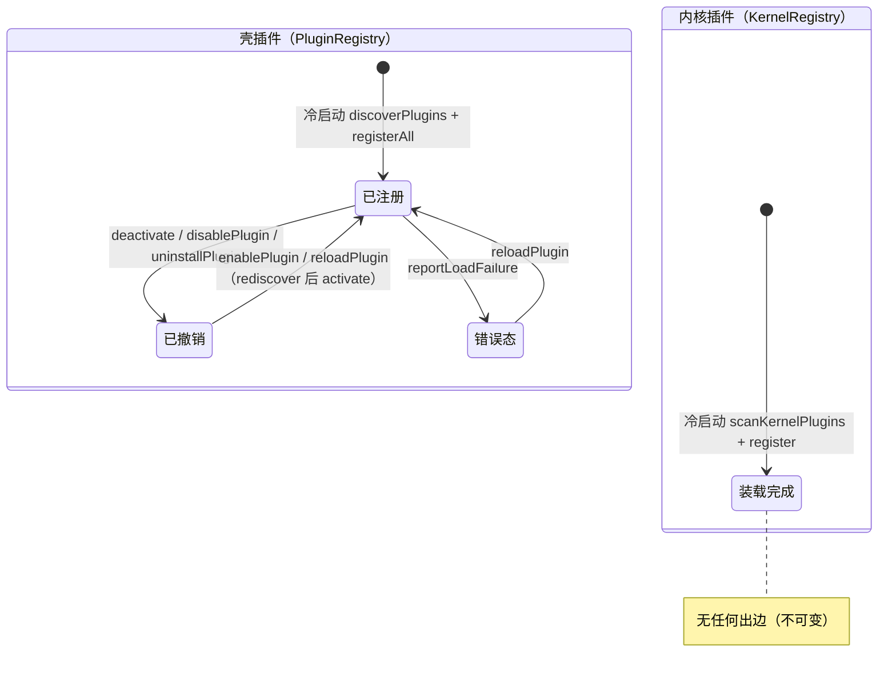
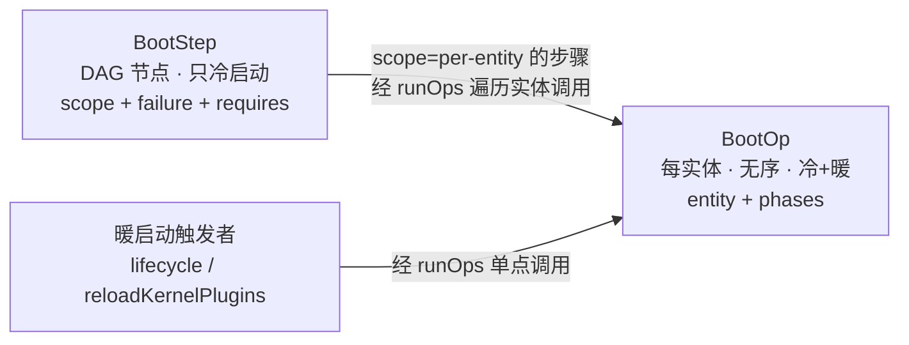
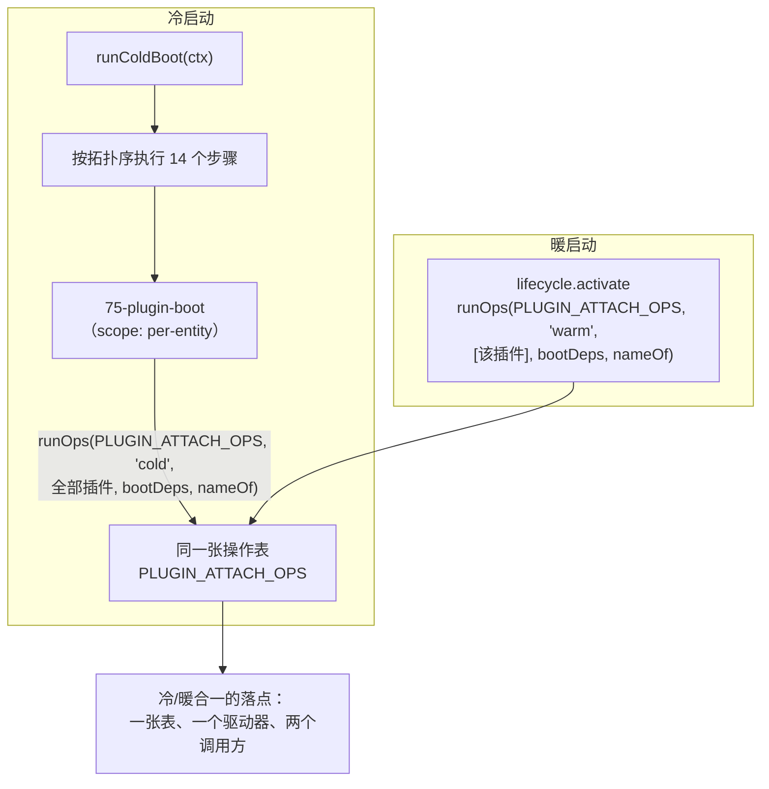
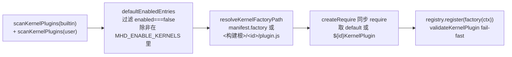
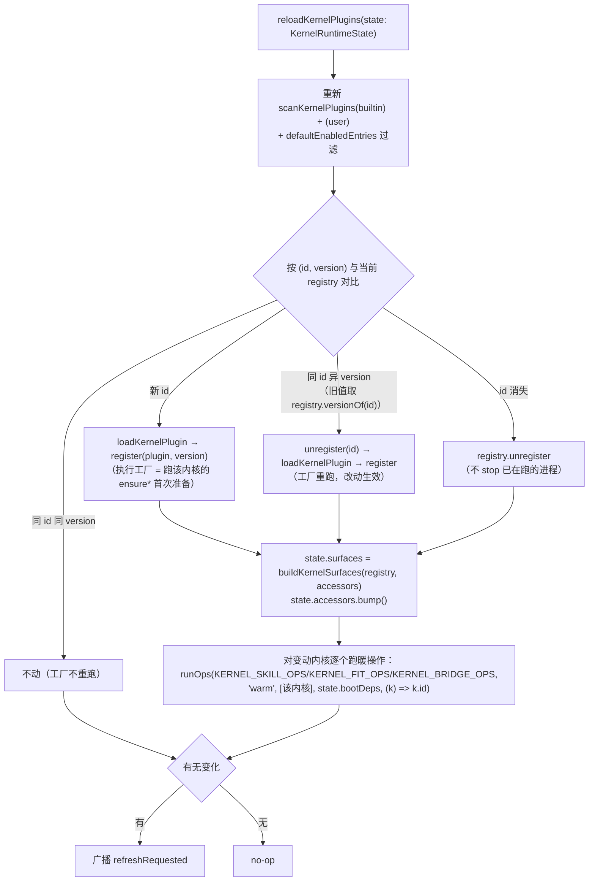
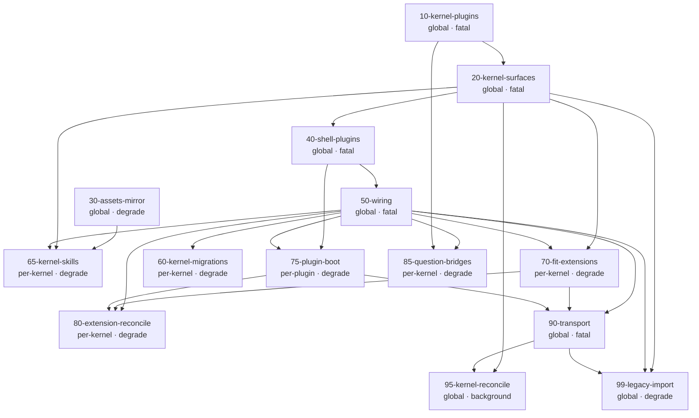
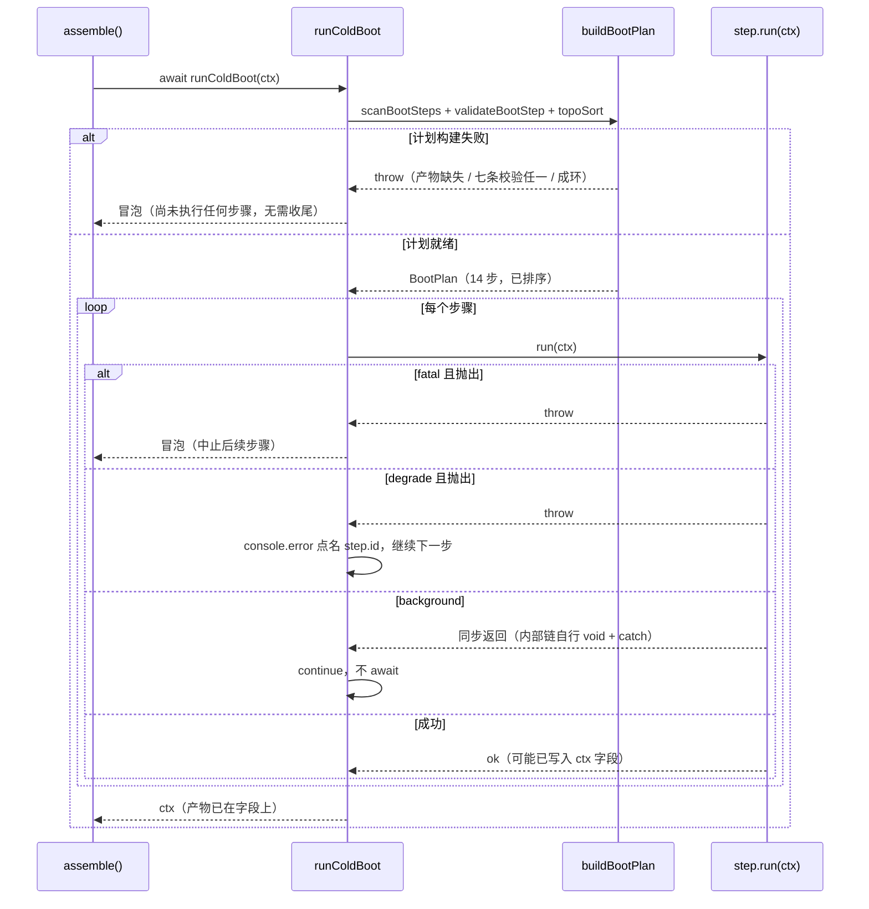
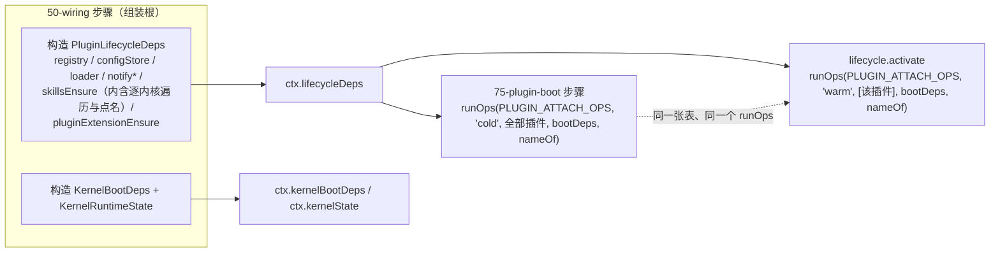
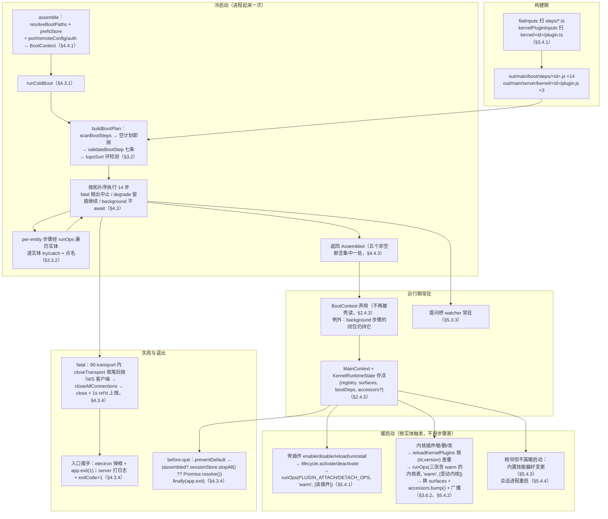

# 启动面：冷启动与暖启动的统一编排

my-harness-desktop 的启动逻辑今天住在一个函数体里：`src/server/bootstrap/assemble.ts` 全文 608 行，`assemble()` 从 L81 起到文件末尾，约 527 行。它不是被设计过的编排单元，而是一段按历史顺序长出来的行序——谁先被需要就写在前面，谁后来发现问题就在原地补一条注释说明"必须先于某某"。这套行序能跑，但它把三件本该显式的东西藏进了隐式：动作之间的**顺序约束**藏在 4 条注释里，动作的**失败策略**藏在 `try/catch` 的写法里，动作的**可重入性**根本没被表达过。

更要紧的是，启动这件事在仓库里已经有两套实现。冷启动（进程起来时跑一遍）写在 `assemble.ts`，暖启动（插件启停时跑一遍）写在 `src/server/application/lifecycle/index.ts`，两边做的是同一件事——给插件挂技能、挂内核扩展、注册槽位贡献——但各自遍历、各自捕获异常、各自决定失败后怎么办。`CLAUDE.md` §1.1「判别气味三」说的正是这个形状：

> 同一逻辑在多个外部入口各写一遍。这说明这个逻辑应该收进内层统一承担，而不是每个调用方各自实现。

本文的解法是把"启动"提成一个有名字的一等概念——**启动面**（boot surface）：一切"在某个时机、以某种失败策略、对某个作用域执行一次"的启动动作，都是启动面的一个实例。它有两种形态：**步骤**（`BootStep`，DAG 的节点，只在冷启动跑；它的 `scope` 字段标注 `run` 内部是"对整个壳做一次"还是"遍历注册表对每个实体做一次"）与**操作**（`BootOp`，每实体作用域，冷启动遍历全部实体调用、暖启动对单个实体调用）。冷启动与暖启动不是两种启动，是同一个操作在两个时机上被调用；时机是 `BootOp` 的字段，不是目录、也不是 `BootStep` 的字段——§2.2.1 解释为什么把时机放在步骤上会产生一个"声明了却没人读"的死字段。

装配机制复用仓库已有的"扫描目录 → 校验 → 排序 → 驱动"形状（壳插件的 `discoverPlugins` + `PluginRegistry`、内核插件的 `scanKernelPlugins` + `KernelRegistry`），但在三处刻意不同，§3.1.3 逐条给理由：**平铺扫描而非递归下降**（步骤目录没有按域分组的需要）、**产出不可变计划而非注册表**（步骤集在进程存活期内不会变，没有运行期增删）、**无 `default` 导出即抛错而非跳过**（步骤目录里不允许有非步骤文件，§3.2.1）。

本文只覆盖 main 进程侧。renderer 侧有它自己的冷启动（`src/web/bootstrap.ts` 构建 `window.kernel` → `src/web/app-main.tsx` 的 `restoreForCwd` → `plugins-host` 用 `import.meta.glob` 加载插件 renderer），驱动机制与 main 侧并不同构（编译期 glob vs 运行期扫描），强行归一会牺牲清晰度，因此显式列为范围外——但 §3.6.4 会指出一个**必须一起处理的 renderer 侧例外**（`window.kernel.kernelIds` 是 boot 时取回的快照数组，内核插件重载后它不会自己更新）。两侧的接缝是四条 main → renderer 广播：`plugins:changed`、`plugin:unloaded`、`IPC.refresh.requested`、`settings:changed`，逐条契约见 §5.1.3。

## 0 术语锚点

本文用到的项目词汇绝大多数定义在别处。这张表只给锚点，不重复定义。

| 术语 | 一句话 | 定义在哪 |
|---|---|---|
| 壳 / 内核 | 壳是 my-harness-desktop 的薄壳（机制）；内核是被壳托管的 AI agent 运行时，同级、可替换 | `CLAUDE.md` 开篇术语表 |
| 当前装载的内核 | 生产扫描根 `src/plugins/kernels/` 下只有 `pi` 与 `dsh` 两个。`minimal` 的实现在 `src/server/kernel/minimal/`（构建产物照出），但它的 manifest 在 `test-plugins/kernels/minimal/`——不在任何生产扫描根，只有测试把它种进隔离 HOME 才装载（commit `0cc0647c1`「minimal 降级为测试专用插件」） | `CLAUDE.md` §6.1、`electron.vite.config.ts:26` |
| `KernelId` | **不透明 string**，不是字面量联合。内核 id 由内核插件在 `plugin.json` 里声明，核心不硬编码任何内核名 | `packages/shared/src/domain/kernel.ts:13` |
| 壳插件 / 内核插件 | 壳插件挂壳的 UI 槽位；内核插件给内核补能力。一个目录可以同时是两者（manifest 带 `kernel` 块） | `CLAUDE.md` 开篇、`docs/design/kernel-plugin.md` |
| 对接面 | 内核插件里"面向 desktop 的那一半"：同目录的 `renderer/` + `locales/` + manifest 的 `contributes`（设置页 TAB 等）。与"内核面"（`kernel` 块 + 工厂实现）相对 | `CLAUDE.md` §6.1、`src/plugins/kernels/pi/plugin.json` |
| 四根 | 壳插件的四个扫描根：builtin / installed / user / project，按优先级从低到高注册 | §3.1.1 |
| `MHD_ENABLE_KERNELS` | 环境变量，逗号分隔的内核 id 列表，运行时强制启用被 manifest 声明为 `enabled: false` 的内核（测试/演示用） | `assemble.ts:165-167` |
| `defaultEnabledEntries` | 纯函数：过滤掉 `kernel.enabled === false` 的内核，除非其 id 在 `MHD_ENABLE_KERNELS` 里 | `kernel-plugin-loader.ts:89-94` |
| 圆心 | `packages/shared/src/domain/`，只有类型与纯函数，零依赖 | `CLAUDE.md` §4.2 |
| 组装根 | `src/server/bootstrap/`，唯一被允许 import 所有具体实现的层 | `CLAUDE.md` §6.2 |
| `MainContext` | 壳后端的依赖容器，由组装根构造、注入给全部 controller。含 stores、注册表派生面、路径、广播闭包 | `src/server/application/context/main-context.ts` |
| `KernelPluginContext` | 内核插件工厂的入参，含 `isPackaged` / `homedir` / `dataRoot` / `prefs` / `markSessionsPendingRestart` / `broadcastRefresh` / `getCwd` 等。与 `BootContext`、`MainContext` 是三个不同的 ctx | `packages/shared/src/domain/kernel-plugin.ts`、构造处 `assemble.ts:115-132` |
| 槽位 / 槽位宿主 | 壳预定的挂载点（sidebar / settings / themes…）；宿主是按 `contributes` 渲染它们的框架代码 | `CLAUDE.md` §7.3、§7.4 |
| 中立契约 / `BaseBackend` | 壳向内核索要的最小意图集合；`alive` 是其中的"子进程是否存活"只读面，`ensureForSend` 是壳侧"发送前保证进程在跑"的用例 | `docs/design/kernel-design-spec.md` §9.1、`session-store.ts:755-807` |
| 缺面 / 补面 / 显式降级 | 内核没有某能力 / 给它补一个实现 / 壳把入口隐藏置灰 | `CLAUDE.md` §1.5、§7.6 |
| `KernelSurfaces` | 把 `KernelRegistry` 展开成壳需要的全部中性面（模型清单、版本面、扩展源、技能源、生命周期钩子…），共十一个字段 + 四个派生集合 | `src/server/bootstrap/kernel-surfaces.ts:39-77` |
| 挂/摘技能 | 往内核的技能清单文件里增删一条目录引用。pi 是 `~/.pi/agent/settings.json` 的 `skills[]` | `src/server/kernel/pi/extension/pi-bundled-skills.ts` |
| 内核扩展 / 适配扩展 / `syncFit` | 内核扩展是装进内核进程的插件；适配扩展是随壳分发的那一份（pi 侧 `my-harness-fit-pi-extension`，dsh 侧合并的 cordis 插件块）。`syncFit` 是把它同步进内核扩展目录、并返回它注册的 id | `CLAUDE.md` §1.6、`my-harness-fit-pi-extension-installer.ts` |
| marker / 孤儿目录 | marker 是 `.my-harness-desktop-plugin` 标记文件，圈定"这个目录归壳管"；孤儿是带 marker 但已无插件认领的目录 | `CLAUDE.md` §1.6 |
| 提问桥 | 壳侧的目录监听器：dsh 的 ask 扩展把问句写成文件，桥监听该目录并投成中性提问事件 | `src/server/kernel/dsh/manager/dsh-question-bridge.ts:1-10` |
| 冷启动对账 | 启动后异步扫已装内核，缺失则按 dist-tag 最新版自动 `npm install` | `src/server/kernel/core/kernel-reconcile.ts` |
| 遗留导入 | 把 pi 自己的旧 JSONL 会话读出来，落进壳的中立会话层 | `src/server/application/sessions/legacy-import.ts` |
| `general.json` | 数据根 `config/` 下的通用配置文件；缺失时启动写种子（`defaultThinkingLevel` / `sidebarDefaultOpen`） | `assemble.ts:457-471` |
| `agentSettled` | 会话事件，表示一轮生成收尾。`restart-coordinator` 用它判断"空闲可重启" | `restart-coordinator.ts:89-101` |
| 真扫描 | 运行时 `readdirSync` + `createRequire` 读目录装载，对立面是"在装配点显式列出" | §3.2.1 |
| 数据根 / 构建根 | 数据根 = `~/.my-harness-desktop`（打包）或 `~/.my-harness-desktop-dev`（dev）；构建根 = 内核工厂产物所在的 `out/main/server/kernel/` | `application/config/paths.ts`、`assemble.ts:145-147` |

## 1 问题

### 1.1 启动动作今天的物理形态

#### 1.1.1 `assemble.ts` 是一个没有名字的编排单元

`assemble()` 同时承担六件事：解析路径与环境、装载两类插件、构造十余个 store 与协调器、注册 14 个 handler 域、做一次性迁移与资源镜像、起 HTTP+WS 服务并做冷启动对账。按 `CLAUDE.md` §6.2 对组装根的定义——"组装代码是'怎么拼'，不是'怎么干'"——这六件里，"构造与接线"（第三、第四件）属本职，"解析路径与环境"（第一件）是本文保留在组装根的唯一职责（§4.4.1），其余三件（装载插件、迁移与镜像、起服务与对账）都是**有副作用的启动动作**，它们待在组装根只是因为没别的地方可去。

后果是这个文件无法被单独理解，也无法被单独测试。想回答"启动时到底做了什么、按什么顺序、哪一步失败会怎样"，唯一办法是把 527 行函数体从头读到尾，并在脑子里维护一张"哪一行依赖哪一行"的图。这张图没有任何外部表达——不在类型里，不在测试里，不在文档里。

本文的改造会把"构造与接线"也移出去（成为 `50-wiring` 步骤，§4.1），于是组装根最终只剩三件事：解析环境、构造 `BootContext`、调 `runColdBoot`（§4.4）。

#### 1.1.2 15 个启动动作、13 个遍历循环

逐行清点 `assemble.ts`，带副作用或顺序敏感的启动动作有 15 个（stores / ctx / handler 的纯构造接线不计入，它们归 `50-wiring`）。同时，启动路径上共有 **13 个 `for` 循环**，分布在三个文件：`assemble.ts` 9 个（L173、324、355、488、489、510、517、520、526，其中 L488/489 与 L517/520 是两对嵌套）、`kernel-surfaces.ts` 3 个（L121、147、160）、`kernel-reconcile.ts` 1 个（L41）。计数规则：只数冷启动路径**直接执行**的循环；被调函数内部的实现细节（如 `discoverPlugins` 的递归下降、`mergeLanguageContributions` 的遍历）不计入。另有 `assemble.ts:305`、`311` 两个循环属**暖路径**（它们在 `pluginSkillsEnsure` 闭包内，该闭包只在冷启动期被**构造**、由 `lifecycle.activate` 在运行期调用），不计入 13。

| # | 启动动作 | 位置 | 循环所在 |
|---|---|---|---|
| 1 | 注入 `KernelRuntime`（spawn npm / fetch registry 的外层实现） | `assemble.ts:104` | — |
| 2 | 扫描并装载内核插件（同步 require 工厂） | `assemble.ts:165-178` | `assemble.ts:173` |
| 3 | 内核历史遗留状态迁移 | `assemble.ts:187` | `kernel-surfaces.ts:121` |
| 4 | 内核面投影 | `assemble.ts:188`（唯一调用点） | `kernel-surfaces.ts:86-110` 内的多处 `map`/`filter`（非 `for`，不计入 13） |
| 5 | 壳插件发现与注册（四根）+ 撤禁用插件 | `assemble.ts:204-211`、`354-355` | `assemble.ts:355`（撤禁用；四根注册是四次调用，非循环） |
| 6 | i18n 语言包合并 | `assemble.ts:215-216` | 在 `application/i18n/merge.ts` 内（被调函数内部，不计入） |
| 7 | 提问桥常驻监听启动 | `assemble.ts:324-336` | `assemble.ts:324` |
| 8 | `general.json` 种子写入与一次性迁移 | `assemble.ts:457-471` | — |
| 9 | 内置资源镜像（skills 目录 + stickers 表情包） | `assemble.ts:475`、`481` | — |
| 10 | 内置技能挂摘 + 旧命名迁移 | `assemble.ts:477-484` | `kernel-surfaces.ts:147`、`160` |
| 11 | 插件携带技能的挂摘 | `assemble.ts:486-500` | `assemble.ts:488` × `489`（嵌套） |
| 12 | 随壳分发的适配扩展同步（syncFit） | `assemble.ts:510-513` | `assemble.ts:510` |
| 13 | 插件携带内核扩展的同步 + 孤儿对账 | `assemble.ts:517-526` | `assemble.ts:517` × `520`（嵌套）、`526` |
| 14 | HTTP + WS 服务监听 | `assemble.ts:535-542` | — |
| 15 | 冷启动对账 + 遗留会话导入 | `assemble.ts:578-589`、`594-605` | `kernel-reconcile.ts:41` |

这 15 个动作之间没有共同的驱动者，而且**调用形态有四种**：#11 与 #12/#13 是两段独立的 `void (async () => {...})()` 立即执行块（`assemble.ts:486` 与 `505`——后者一个 IIFE 同时包住 #12 与 #13）；#10 是 `.then().catch()` 链（L477、L482）；#15 是 `void promise.catch()`（L578）；#3、#4、#9 是同步直调。读代码的人必须逐处判断"这个失败会不会阻断启动"。

#### 1.1.3 三种失败策略混写在同一个函数体

| 策略 | 语义 | 今天的表达方式 | 实例（编号见 §1.1.2） |
|---|---|---|---|
| fatal | 抛错，整个壳起不来 | 不包 `try/catch`，异常直接冒泡 | #2（`src/server/kernel/core/kernel-plugin-loader.ts:111-121` 两处显式 throw）、#4 |
| degrade | 留痕 + 继续，缺面降级 | `.catch((e) => console.error(...))` 或 `try/catch` + `console.warn` | #9、#10、#11、#12/#13、#15 的遗留导入 |
| background | fire-and-forget，不阻塞 listen | `void promise.catch(...)`，回调里再广播 | #15 的冷启动对账（`assemble.ts:578`） |

三种策略本身都合理——内核插件装载失败确实应该让壳起不来，资源镜像失败确实不该拖垮启动。**问题在于它们不可见**：review 时无法从声明看出"这一步失败了会怎样"，只能读 `try/catch` 的嵌套层次和 `console` 的级别去反推。反推会出错——`assemble.ts:470` 那句 `catch { /* 种子迁移失败不阻塞启动 */ }` 需要靠注释才能知道它是 degrade 而非疏漏。

degrade 还有一条已有的好纪律：失败留痕必须点名到具体实体，不许是匿名数组下标。这条纪律在两处独立建立：`kernel-surfaces.ts:66-67` 给 `lifecycles` 数组加了 `kernel` 字段，注释写"否则多个内核都交了钩子时，出问题只能报一个匿名失败，点不到内核"；`assemble.ts:494-495` 在冷启动的插件技能循环里 `console.error` 时带上 `l.kernel` 与 `plugin.manifest.id`。`kernel-surfaces.ts:141` 也重申"单个内核抛错**点名留痕**"。

这条纪律今天靠人记住，没有机制保证。§6.2.2 把它变成守卫。

#### 1.1.4 顺序约束只活在 4 条注释里

| 位置 | 约束原文 | 真实原因 |
|---|---|---|
| `assemble.ts:110` | "提前到 modelCatalog 之前(modelSource 从 registry 遍历)" | 内核面投影（#4）遍历注册表产出 `modelCatalog`，注册表必须先由 #2 填好。`modelSource` 指 `KernelModelSource`（各内核交一份，`ModelCatalog` 合流它们） |
| `assemble.ts:161` | "必须先于 modelCatalog(modelSource 从 registry 遍历),也先于下面的壳插件注册" | 同一条约束的另一半：#5 要用 #2 产出的"未装载内核"名单（`assemble.ts:180-184` 的 `unloadedKernelPluginIds`）过滤掉那些内核的**对接面**，否则设置页会列出一个没有内核的 TAB |
| `assemble.ts:220` | "内核插件经 KernelRegistry 注册(见 modelCatalog 之前的 registerKernelPlugins)" | 回指前两条，本身不新增约束 |
| `assemble.ts:503` | "放在任何内核 spawn 之前（内核的 loader 只在 spawn 时扫一次扩展目录；dsh 启动时读 cordis.yml 组合）" | #12/#13 扩展同步必须早于任何内核子进程 spawn |

第 4 条尤其危险：它约束的不是 `assemble` 内部的行序，而是**启动动作与运行期动作之间的先后**。"任何内核 spawn"发生在运行期（`session-store.ts:475-520` 的 `start()`），而扩展同步发生在启动期——两者之间没有任何机制保证先后，只有这条注释，加上"扩展同步段在 `assemble.ts:542` 的 `httpServer.listen()` 之前"这个偶然事实。

如果哪天有人把扩展同步挪到 listen 之后（比如为了让它不阻塞首帧渲染），这条约束就静默失效，症状是"扩展装了、内核就是看不见"——`kernel-surfaces.ts:173` 已经把这个症状称为"最难查的一类"。§6.1.1 把它变成一条断言拓扑序的守卫测试。

### 1.2 冷启动与暖启动是两份实现

#### 1.2.1 五组逐行对照

插件的启动面在冷启动和暖启动两侧各有一份实现。五组对照（冷侧行号指 `src/server/bootstrap/assemble.ts`，暖侧行号指 `src/server/application/lifecycle/index.ts`）：

| 启动面 | 冷启动 | 暖启动 | 判定 |
|---|---|---|---|
| 槽位贡献注册 | L208-211 `registerAll(discoverPlugins(root, source))` × 四根 | L99 `deps.registry.registerOne({ manifest, path, source })` | **同一件事**：`registerAll` 内部就是逐个 `registerOne`（`application/loader/registry.ts:132`） |
| 插件携带技能挂摘 | L488-497 遍历插件 × 遍历 `lifecycles`，调 `l.hook.skillsEnsure?.onActivate(id, plugin.path, plugin.source)`，catch 里点名内核与插件 | L101 `deps.skillsEnsure.onActivate(manifest.id, pluginPath, source)` | **同一件事但实现分叉**：暖侧经 `pluginSkillsEnsure` 闭包（`assemble.ts:303-316`）内部遍历 `lifecycles`（L305），但该闭包只做 `if (changed) broadcastSettingsChanged(...)`，**没有 try/catch、不点名内核** |
| 插件携带内核扩展挂摘 | L517-524 遍历插件 × 遍历 `manifest.extensions`，先查 `disabled` 名单（L519）再调 `pluginExtensionEnsure.onActivate(kernel, id, plugin.path, rel)` | L103-105 遍历 `manifest.extensions` 调同一个 `pluginExtensionEnsure.onActivate` | **同一件事**，共用同一个闭包（`assemble.ts:320`）；差别只在冷侧多一道 `disabled` 过滤 |
| 适配扩展同步（syncFit） | L510-513 遍历 `surfaces.extensionSyncs` 调 `e.sync.syncFit?.()`，收集返回的 id 进 `active` 集合 | 无对应路径 | **不对称**：暖启动不重跑 syncFit |
| 孤儿扩展对账（reconcile） | L526 遍历 `surfaces.extensionSyncs` 调 `e.sync.reconcile?.(active)` | 无对应路径；靠 L124-126 逐个 `onDeactivate(kernel, pluginId)` 摘除 | **不对称**：冷侧是全量对账摘孤儿，暖侧是逐个摘 |

第 4、5 行的不对称要不要修，两者答案不同：

- **reconcile 保持冷启动专属是正确的**（§5.1.1 给理由）：全量对账需要完整的 `active` 集合，暖启动每次只动一个实体，拿不到全集。
- **syncFit 不应该是冷启动专属**，本文把它改成冷暖都跑：运行期新增一个内核插件时，那个内核的适配扩展必须装上，否则它的进程起来就缺面。今天之所以"暖侧无对应路径"，是因为内核插件根本不可重入（§1.3）——不对称是缺失能力的症状，不是设计意图。

真正的问题在第 2 行：技能挂摘两侧走**不同的代码路径**，冷侧点名内核、暖侧连异常都不捕获——`pluginSkillsEnsure.onActivate`（`assemble.ts:304-309`）里 `await l.hook.skillsEnsure?.onActivate(...)` 一抛就冒泡到 `lifecycle.activate` 的 catch（`lifecycle/index.ts:109-113`），被记成"插件激活失败"并撤注册，而不是"某个内核的技能挂摘失败、插件其余部分照常"。这不是有意设计，是两份实现各自演化的结果——正是 `CLAUDE.md` §1.1 判别气味三预言的漂移。

#### 1.2.2 驱动依赖还在两个层各建一份

比"两份遍历"更糟的是**驱动依赖也在两个层各构造一次**：

- 冷启动侧：`surfaces.lifecycles`（内核生命周期钩子数组）由 `buildKernelSurfaces` 在 `assemble.ts:188` 产出、在 L302 被取出别名 `lifecycles`；`pluginSkillsEnsure` 与 `pluginExtensionEnsure` 两个闭包在 `assemble.ts:303-320` 构造。
- 暖启动侧：`PluginLifecycleDeps`（含 `registry` / `configStore` / `loader` / `notifyPluginsChanged` / `notifyPluginUnloaded` / `skillsEnsure` / `pluginExtensionEnsure`）在 `src/server/controllers/plugins.ts:34-42` 构造。

两侧共用的只有 `pluginExtensionEnsure` 这一个闭包**实例**（冷侧 `assemble.ts:521`、暖侧 `lifecycle/index.ts:104` 都调它）。`pluginSkillsEnsure`（`assemble.ts:303-316`）**只被暖侧用**——冷侧的 L488-489 把同样的"遍历插件 × 遍历内核钩子"循环**又抄了一遍**，连异常处理都不同（冷侧 catch 里点名内核，闭包里没有 catch）。所以技能这一面是循环体本身的两份实现，比"共用闭包、外层两份"更严重。改一处行为必须记得改另一处，而"记得"没有任何机制保障。`assemble.ts:514-516` 记录的正是一次忘记的后果：

> 传**原始插件目录 + 相对路径**（插件侧 onActivate 自会 join）——历史上误传 resolve(plugin.path, rel) 再 join(rel) 造成路径双重拼接，扩展永远同步不上（勿回退）。

这个 bug 在冷侧修好了。暖侧走 `lifecycle/index.ts:104`，传参形状恰好一致所以没踩同一个坑——但一致性靠的是两处代码碰巧写对，不是靠单一实现。

#### 1.2.3 这命中判别气味三

`CLAUDE.md` §1.1 的第三条判别气味是"同一逻辑在多个外部入口各写一遍"，并点名了多内核场景下的典型形态（pi 和 dsh 各写一份"缺面抛错"）。插件启动面的冷/暖双份是同一气味的另一个实例，只是分叉的轴不同：不是按内核分叉，是按时机分叉。

按 `CLAUDE.md` §1.1 给的处方——"该收进内层统一承担，而不是每个调用方各自实现"——落到这里就是：启动面操作只有一份实现，冷启动传"全部插件"、暖启动传"单个插件"，作用域是参数不是分支。这正是 §2 要设计的抽象。

### 1.3 可重入性不对称且无人声明

#### 1.3.1 壳插件可热启停，内核插件不可



**图 1 — 两类注册表的可变性：壳插件有完整的状态迁移，内核插件只有一个终态**

壳插件侧四条迁移路径都有实现（图 1 里另有 `[*] → 已注册` 的初始边，它由冷启动的 `registerAll` 承担，不属运行期迁移）：`PluginRegistry.unregister`（`application/loader/registry.ts:166`）、`rediscoverPlugin`（`controllers/plugins.ts:44-59`，复用 `discoverPlugins` 单源逻辑）、`reloadPlugin` / `enablePlugin` / `disablePlugin` / `uninstallPlugin`（`application/lifecycle/index.ts:132-207`）、`reportLoadFailure`（同文件 L179-183，renderer 上报加载失败时撤注册 + 记 error 态）。

内核插件侧一条都没有。

#### 1.3.2 `KernelRegistry` 连 `unregister` 都没有

`src/server/kernel/core/kernel-registry.ts` 全文 64 行，公开方法只有 `register` / `get` / `has` / `all` / `ids` 五个——没有 `unregister`，没有 `clear`，没有 `reload`。而 `loadKernelPlugin` 在全仓只有一个调用点：`assemble.ts:174`。

这不是疏忽，是当初设计选择的一部分。`docs/design/kernel-plugin.md:138` 明确写了这个取舍：

> 丢编译期强制力：`KernelId = string` 后，`Record<KernelId,X>` 的漏补报错消失。用「启动期完整性校验 + 运行时注册表查 + 显式降级」兜底。这是插件化架构（VSCode 扩展同理）的固有代价：**运行时注册换运行时校验**。

它选择了"运行时注册"，但只实现了注册的半个生命周期——注册进表，从不撤出。于是内核清单在进程存活期内是一个常量。

#### 1.3.3 用户可见后果

| 操作 | 壳插件 | 内核插件 |
|---|---|---|
| 往插件目录投递一个新插件 | 管理页 reload 即生效 | **必须重启应用** |
| 经管理页 uninstall 一个插件 | 即生效（走 `deactivate`，摘扩展、撤贡献） | **无此入口**（没有 unregister） |
| 直接从磁盘删掉插件目录 | 暖启动不知道；下次冷启动扫描时消失，孤儿扩展由 reconcile 摘除 | 当前进程仍"已注册"，`kernelRegistry.get(id)` 照样返回插件；下次冷启动才消失 |
| 改 `plugin.json` 的 `kernel.enabled` 或 `MHD_ENABLE_KERNELS` | —（无对应字段/机制） | **必须重启应用**（`defaultEnabledEntries` 只在 `assemble.ts:169` 调一次，环境变量在 L165 读一次） |

第三行是一个磁盘态与内存态脱节的窗口。`lifecycle/index.ts:162-163` 记录过同类问题在壳插件侧的严重性：

> 先 rediscover 成功再清禁用标记:旧序先清标记后 rediscover,失败时标记已清但插件未激活——磁盘态与内存态脱节(重启后"复活"半个卸载)。

壳插件侧修好了，内核插件侧连修的地方都没有。注意第三行两侧的差异是**合理**的：内核插件被删后，已构造的 backend 实例仍可服务已开的会话——§3.6.2 论证这是正确行为而非 bug。

### 1.4 为什么"冷启动/暖启动"不该是圆心抽象

一个自然的想法是：既然冷启动和暖启动是两个稳定的概念，就把它们做成圆心的领域抽象（`packages/shared/src/domain/` 里的接口），由外层实现、由壳调用它们去驱动各领域。这个想法过不了三条检验，而三条检验都是 `CLAUDE.md` 自己给的。

#### 1.4.1 空接口检验

如果圆心这样定义：

```ts
interface ColdStart { run(): Promise<void>; }
interface WarmStart { run(): Promise<void>; }
```

它携带的信息量是零：无参数、无返回语义、无义务、无失败约定。全部信息都在实现里。这正是 `CLAUDE.md` §3.4 明禁的那一类：

> 外层已经有一个 `DshConfigSource` 类，你给它包一层 Wrapper 然后让内层 import 这个 Wrapper——这是多余的间接层。

`CLAUDE.md` §3.4 同时给了区分标准："这个接口是内层业务本质的抽象（要），还是为包一个已有实现而加的 wrapper（不要）"。对照 `BaseBackend`——它声明"我需要一个能发消息/中断/切模型/分叉/读 lineage 的后端"，这是业务本质；而"我需要一个能启动的东西"不是，它没有说明启动要产出什么、失败意味着什么、调用方拿到结果后能做什么。`ColdStart` 就是 `assemble()` 的改名。

#### 1.4.2 god interface 检验

让圆心接口去"驱动各领域"，意味着它必须知道各领域是什么。启动要驱动的业务包括：内核装载、内核面投影、壳插件发现、i18n 合并、资源镜像、技能挂摘、扩展同步、传输监听、冷启动对账、遗留导入——全部十个领域。

而圆心一旦知道所有领域，它就不再是圆心，是第二个 application 层。更致命的是依赖方向：圆心要驱动它们，`packages/shared/src/domain/` 就得 import 各领域的类型，箭头从圆心指向外层。这是 `CLAUDE.md` §1.1 那条"不解释、不通融、没有例外"的红线：

> 任何一条依赖如果从内层指向外层，不管它看起来多么"合理"、"只是用了一下"、"临时方便"，都是违规。

#### 1.4.3 冷/暖在会话进程层是被消解掉的维度

`CLAUDE.md` §4.2 的换壳测试（"换掉 Electron/React/内核，这个东西还在不在"）对"冷启动"成立——换什么技术栈，进程都得初始化。但换壳测试是必要条件不是充分条件：按同一条逻辑，"日志""错误处理""配置读取"也都在，它们显然不是圆心内容。

`CLAUDE.md` §2.3 给了更强的判据：**"这个拿掉系统就不能启动，而且不会换"→ 留在壳里**。拿掉"冷启动"这个概念，系统照常启动，只是没给这个阶段起名字。对比 `BaseBackend`：拿掉它，一条消息都发不出去。

而在会话进程这一层，冷/暖的区分已经被架构主动消解了。这里的"冷"指内核子进程不在、"暖"指它在（与本文主线的"冷启动/暖启动"是**不同的一对词**：前者说内核进程状态，后者说壳的启动时机）。系统对内核进程冷/暖的回答是不问状态、只问 `backend.alive`，然后按需起（`session-store.ts:755-807` 的 `ensureForSend`）。一旦"按需"成立，系统就不需要知道自己处在哪个阶段——**边界由"要不要用"决定，不由"现在是什么时刻"决定**。

#### 1.4.4 warmup 退役的历史证据

这个仓库试过"把冷暖边界建模出来"，然后拆掉了。`docs/legacy/desktop/007-cold-warm-start.md` §4 记录了一套完整实现过的 pi 进程预热机制（warmup）：

> warmup 在 `src/core/application/sessions/session-store.ts:191-208`：fire-and-forget 发起，fire-and-remember 发送。warmup 不阻塞 setContext（它 `void` 调用 start 但不 await），但把 start 返回的 Promise 存入 `warmups` Map。发送时 `ensureForSend` 先 check 这个 Map。

（引文里的 `src/core/...` 是前后端分离重构前的旧路径，该文件现在是 `src/server/application/sessions/session-store.ts`；`docs/legacy/` 整个目录是重构前的历史稿。）

它的唯一目的就是管理内核进程的冷暖边界——提前把"冷"变"暖"，让发送那一刻边界不存在。它被拆除的理由不是实现得不好，是前提失效。`src/server/controllers/sessions.ts:45-49` 记着根因：

> 只设上下文,不抢跑起内核进程(内核=模型的派生量):进程在「选模型 → 发送」时按需起,会话归属由用户选的模型决定。此前此处 warmup 抢跑双内核,会话被绑进预热时随机定的中立会话 + 首注册内核——选 dsh 却路由到 pi、幽灵会话、列表混乱的根因。

warmup 要成立，必须"总能猜对用户要用哪个内核"。多内核之后这个前提没了。今天方法、`warmups` Map、`warmupKernel` 全部不存在，`src/` 非测试代码里只剩四处注释残留提到这个词：`src/server/application/sessions/session-store.ts:401`、`502`、`686` 与 `src/server/controllers/sessions.ts:47`（另有 `src/web/stores/session-store.ts:691` 与两个测试文件）。

这段历史的直接启示是：**给冷暖建抽象，等于把"系统需要知道自己处在哪个阶段"重新引进来**，而每一次这种自省都会在调用点产生一个 `if (phase === "cold")` 分支——和 `CLAUDE.md` §1.5 明禁的 `if (kernel === "pi")` 是同一种气味，只是换了轴。所以本文的做法相反：冷/暖不是两个类型，是 `BootOp` 的一个字段取值（§2.4.2）；系统从不 introspect 自己处在哪个阶段，它只是被要求在某个阶段执行某组操作。

## 2 启动面：统一抽象

### 2.1 什么是启动面

#### 2.1.1 一个概念，两种形态

启动面是"在某个时机、以某种失败策略、对某个作用域执行一次的启动动作"。它有两种形态，因为作用域有两种**形状不同**的取值：

| 形态 | 作用域 | 执行形状 | 时机 | 谁驱动 |
|---|---|---|---|---|
| **步骤** `BootStep` | 全局或每实体（由 `scope` 字段标注） | 有向无环图，按依赖拓扑排序 | 只在冷启动 | `runColdBoot` |
| **操作** `BootOp` | 每实体（每个插件 / 每个内核各一次） | 无序集合，实体之间互不依赖 | 冷启动遍历全部实体；暖启动对单个实体 | 冷：per-entity 步骤经 `runOps` 遍历调用；暖：`lifecycle` / `reloadKernelPlugins` 经 `runOps` 单点调用 |

`BootStep.scope` 需要说清，因为它是全文最容易误读的字段：**步骤始终是 DAG 的一个节点、始终只在冷启动跑**，`scope` 标注的是它的 `run` 内部形状——`global` 表示"对整个壳做一次"，`per-entity` 表示"内部经 `runOps` 遍历注册表、对每个实体调用同一个 `BootOp`"。14 个步骤里有 6 个是 `per-entity`（§4.1）。`scope` 不参与调度，但它决定失败留痕的粒度（§4.3.2）与守卫的检查方式（§6.2.2）。

两种形态各自携带的声明维度：

| 维度 | `BootStep` | `BootOp` | 今天藏在哪 |
|---|---|---|---|
| 作用域 | `scope` 字段 | `entity` 字段（作用在哪类实体） | 藏在"有没有外层 for 循环" |
| 时机 | **无此字段**（步骤只在冷启动跑） | `phases`：`["cold"]` / `["cold","warm"]` / `["warm"]` | 藏在"写在 `assemble.ts` 还是 `lifecycle/index.ts`" |
| 失败策略 | `fatal` / `degrade` / `background` | 恒为 `degrade`（§2.4.2） | 藏在 `try/catch` 的写法与 `console` 级别 |
| 依赖 | `requires`：step id 列表 | 无（实体间无依赖） | 藏在 4 条注释与行序 |



**图 2 — 启动面的两种形态：步骤是 DAG 的节点，操作被步骤遍历调用、也被暖启动单点调用**

这四个维度今天全部是隐式的，而且**隐式的方式各不相同**：作用域靠循环 nesting 表达、时机靠文件归属表达、失败策略靠异常处理写法表达、依赖靠注释表达。四种不同的隐式表达方式意味着四处不同的误读风险。把它们收进两个显式声明，是本文最主要的收益。

#### 2.1.2 冷启动与暖启动是操作的时机字段

冷启动与暖启动不是两个类型、两个接口、两个目录，是 `BootOp.phases` 的取值组合。依据是 §1.2.1 的实测：两侧做的是同一件事（挂技能、挂内核扩展、注册贡献），差别只在"对全部实体做一次"还是"对单个实体做一次"——那是**调用方**的差别，不是操作本身的差别。

| | 步骤（`BootStep`，DAG 节点） | 操作（`BootOp`，每实体） |
|---|---|---|
| **冷启动** | 跑完整步骤表（14 步，§4.1；其中 6 步的 `scope` 是 `per-entity`） | 由那 6 个 `per-entity` 步骤经 `runOps` 遍历全部实体调用 |
| **暖启动** | **不跑步骤表**（§2.2.2） | 由触发者对单个实体调用 |

右上角与右下角调的是**同一份操作实现**，参数不同。左下角为空是一个关键事实：**暖启动没有全局步骤**。

暖启动的触发者只有两个（§5.4.1、§5.4.2）：壳插件启停/重载、内核插件增删。另有两个**相邻但不是暖启动**的情形，§5.4.3 与 §5.4.4 分别划界：内置技能偏好变更（是设置操作，不经操作表）、会话进程重启（重启的是内核子进程，不是启动动作）。

"暖启动没有全局步骤"这个"空"需要一句限定，否则会被 §3.6.2 反驳——`reloadKernelPlugins` 做的事看起来相当全局：重扫两个插件根目录、与注册表做差量比对、对新增内核执行工厂（即跑它的 `ensure*` 首次准备）、对消失的内核 `unregister`、对新增内核跑暖操作、重建整个 `KernelSurfaces`、清访问器缓存、条件广播 `refreshRequested`。它们之所以不算全局步骤，是因为**不构成 DAG**：没有需要被声明和守卫的依赖排序、没有需要分派的失败策略、不与其它启动动作竞争顺序。区分标准在 §2.2.2。

#### 2.1.3 步骤与操作的桥

操作不会自己执行，它需要被调用。两条调用路径：



**图 3 — 冷启动经步骤遍历调用操作，暖启动直接调用同一个操作。两侧的 `bootDeps` 是同一个 `PluginBootDeps` 形状（§5.1.1），由各自的调用方构造**

- **冷启动**：`scope: per-entity` 的步骤在 `run` 内部经 `runOps` 遍历注册表。§4.1 的 14 个步骤里有 6 个是这种形状。
- **暖启动**：触发者对单个实体经同一个 `runOps` 调用，不经过步骤。

这个结构是 §1.2 那两份实现能够合一的根据：合一之后操作只有一份实现，冷启动通过步骤遍历调用它，暖启动通过 `lifecycle` 单点调用它。

### 2.2 为什么是两种形态而不是一种

#### 2.2.1 把两者塞进一个类型会产生死字段

一个更"统一"的设计是只有一种类型 `BootStep`，用 `scope` 区分、用 `phases: ("cold"|"warm")[]` 声明时机。本文的第一版草稿就是这么设计的，它产生了一个可验证的缺陷：**`phases` 里的 `"warm"` 值在执行期没有任何读者**。

推理链：

- 步骤只在冷启动跑（因为暖启动不跑步骤表），所以驱动器只会用 `"cold"` 过滤 `phases`；
- 暖启动由 `lifecycle` 直接调用操作，它不查任何步骤的 `phases`；
- 于是一个标了 `phases: ["cold","warm"]` 的步骤，它的 `"warm"` 既不驱动执行、也不被任何暖路径读取；
- 唯一读到 `"warm"` 的地方是启动期校验（"含 warm 时 scope 必须是 per-entity"），而这条规则校验的是一个不影响任何行为的组合；
- 更糟的是粒度错位：那个步骤的 `run` 体内往往有多段动作（如草稿里 `plugin-boot` 的四段），其中只有某些段在暖启动被执行，步骤级的 `phases` 无法表达这种粒度。

结论是 `phases` 放错了层：时机是**操作**的属性，不是**步骤**的属性。修正后 `BootStep` 没有 `phases` 字段，`runColdBoot` 没有 `phase` 参数，`BootOp` 持有 `phases` 且**每个取值都有真实读者**——冷启动步骤按 `includes("cold")` 过滤，暖启动触发者按 `includes("warm")` 过滤（§3.3.2）。声明第一次成为 load-bearing，§6.1.3 再补一条守卫确保它不退回死字段。

#### 2.2.2 暖启动为什么不需要 DAG

DAG 表达的是"全局动作之间的先后"。暖启动只动一个实体，它要回答的问题不是"我先做什么后做什么"，而是"这个实体的启动面是什么"——那是集合查询，不是排序问题。

`reloadKernelPlugins`（§3.6.2）看起来是反例：它做八件事且有先后。但这些先后是**函数体内的语句顺序**，不是需要被声明、被校验、被守卫的依赖关系——没有别的暖启动动作会与它们竞争顺序。它确实含会失败的动作（对新内核执行工厂），但失败处置是"点名该内核、跳过它、继续其余"，不需要 `fatal`/`degrade`/`background` 三选一。

判据一句话：**是否需要与其它启动动作排序、是否需要三态失败策略分派**。两者都需要 → 步骤；都不需要 → 操作或原子函数内部的语句。

`restart-coordinator`（配置变更后重启会话内核进程）也按这条判据落在范围外：它重启的是**内核子进程**，不是启动动作，且它有自己的一套事件驱动机制（等 `agentSettled` 空闲，`src/server/application/restart/restart-coordinator.ts:89-101`）。§5.4.4 划清这条边界。

#### 2.2.3 反面：按温度分文件夹会把今天的重复制度化

既然冷/暖是两个时机，一个直觉的做法是按温度分目录：

```
boot/
├── cold/
│   ├── skills.ts
│   └── extensions.ts
└── warm/
    ├── skills.ts        ← 与 cold/skills.ts 是同一件事
    └── extensions.ts    ← 与 cold/extensions.ts 是同一件事
```

这个形状把 §1.2 的病灶固化成了目录结构。`CLAUDE.md` §1.3 的契约单源纪律说得很直接：

> 一个概念只有一份定义。这不是"最好一份"，是必须一份——两份定义必然从第一天就开始漂移。

按温度分目录等于宣布"技能挂摘在冷启动时是一个概念、在暖启动时是另一个概念"，而 §1.2.1 的对照表证明它们是同一个概念。所以时机是操作的一个**字段**（`phases: ["cold","warm"]`），不是一个目录。

那什么该分目录？§2.1.1 给出的界线是**形状不同**：步骤是 DAG（有序、一次性、需要拓扑排序与环检测），操作是无序集合（可重入、需要按 `phases` 查询）。这两种形状的数据结构与执行语义都不同，所以分属三个位置：

| 内容 | 位置 | 理由 |
|---|---|---|
| 步骤（14 个文件） | `src/server/bootstrap/boot/steps/` | 需要 import 各层实现（内核装载器、传输、控制器），只有组装根被允许（§2.3.1） |
| 内核侧操作 + `KernelBootDeps` | `src/server/bootstrap/boot/ops.ts` | 需要 `KernelSurfaces` 与 `KernelRegistry`，属组装根 |
| 插件侧操作 + `BootOp`/`BootPhase`/`runOps` 类型与驱动器 | `src/server/application/lifecycle/boot-ops.ts` | 只依赖注册表与两个 ensure 接口，属用例编排层。**类型也必须住这里**：若放在 `bootstrap/boot/types.ts`，本文件就要 import 外层，§2.4.2 的分层论证会在它自己的文件布局下不闭合 |

所以"启动面"这个概念**跨两层**：编排在组装根，插件侧操作在内层。§2.3.3 的分工表按此填写。

### 2.3 启动面在洋葱里的位置

#### 2.3.1 步骤必须在组装根

启动步骤要调用 `loadKernelPlugin`、`createHttpServer`、`registerSessions`、`createElectronHost`——这些是**值导入**，不是类型导入。而 `application/` 层今天对整个 `kernel/` 目录只有两处 import，且都是 type-only：

```
src/server/application/context/main-context.ts:7      import type { KernelManager } from "../../kernel/core/kernel-manager"
src/server/application/sessions/session-store.ts:17   import type { BackendExtensions } from "../../kernel/pi/backend/pi-backend-extensions"
```

（两处都是 type-only，因此**不在** `CLAUDE.md` §6.3 检验②的禁令内——该检验禁的是"非 type-only import"，且其豁免表现已清空。第二处指向具体内核 `kernel/pi` 而非机制层 `kernel/core`，是一处值得顺手清理的残留，但不是违规。）

把启动步骤放进 `application/boot/` 会立刻产生四条新依赖：`application → kernel/core`（值导入）、`application → transport`、`application → controllers`、`application → host`。按 `CLAUDE.md` §6.1 的分区，后三者是外层；`kernel/core` 虽是机制层而非具体内核，但它是 application 的**同层或更外**（`CLAUDE.md` §6.1 把 `kernel/` 与 `application/` 并列为壳后端的两个分区），application 值导入它会与 §6.3 检验②的立法意图（application 不认识内核实现细节）冲突。四条合起来违反 §1.1「依赖只向内」。`CLAUDE.md` §6.3 的检验②字面上只列了 electron / react / `kernel/{pi,dsh}` 三类，但它背后的判据（§6.1 的分区图 + §1.1 的箭头方向）覆盖全部外层——本文按判据而非字面清单论证。

反过来看组装根：它今天已经同时 import 了 `kernel/core`、`kernel/factories`、`transport`、`controllers`、`host`、`routing`、`remote`（`assemble.ts` 的 import 清单共 18 处指向 `../application`，另有上述各层）。这不是偶然，是组装根的定义——**唯一被允许知道所有具体实现的层**。启动步骤属于它。

#### 2.3.2 不进圆心

启动面不向任何内核索要任何东西。它问内核的话全部通过既有契约：`KernelPlugin`（`packages/shared/src/domain/kernel-plugin.ts`）、`KernelVersionApi`、`SessionCatalog`、`KernelModelSource`。启动编排只是**调用这些既有契约的时序**，不新增契约面。

所以 `packages/shared/src/domain/` 一行不改。这是 §1.4 论证的正面结论：启动面是壳的机制，不是领域抽象。

按 `CLAUDE.md` §1.5 的那一问检验——"壳是不是必须向每一个内核索要它？"——答案是否：壳不向内核索要"启动"，壳自己启动，然后按既有契约使用内核。所以它不进中立契约。

#### 2.3.3 与 `lifecycle` 的分工

启动面与 `application/lifecycle/` 不是替代关系，是编排与驱动的关系：

| | 启动面·编排（`bootstrap/boot/`） | 启动面·插件侧操作（`application/lifecycle/boot-ops.ts`） | 生命周期（`application/lifecycle/index.ts`） |
|---|---|---|---|
| 管什么 | 何时、何序、何失败策略 | 单个插件的启动面动作是什么 | 单个插件的启停流程（注册/撤注册/状态/通知 + 调操作） |
| 依赖方向 | import 内层的 `runOps` 与操作表 | 不 import 任何外层 | import 同层 `boot-ops.ts` |
| 变动频率 | 加一个启动动作时改 | 加一种插件启动面时改 | 加一种启停流程时改 |
| 层 | 组装根（机制） | application（用例编排） | application（用例编排） |

`lifecycle/index.ts` 今天已经正确地只管"单个插件的启停做什么"（`activate` / `deactivate` / `reloadPlugin` / `enablePlugin` / `disablePlugin` / `uninstallPlugin` / `reportLoadFailure`），它缺的不是能力，是**被冷启动复用**。§5.1 做的就是把冷启动接到它上面。

### 2.4 四个契约的形状

#### 2.4.1 `BootStep`

```ts
// src/server/bootstrap/boot/types.ts
/** 一个启动步骤：DAG 的节点。真扫描装载，故必须自包含（不 import 其他 step，§3.4.2）。 */
export interface BootStep {
  /** 唯一 id = 构建产物文件名去掉 .js（含数字前缀），同时是 requires 的引用键。
   *  例：文件 75-plugin-boot.ts → 产物 75-plugin-boot.js → id "75-plugin-boot"。
   *  前缀参与字典序，字典序是拓扑排序的 tie-break（§3.2.3），故 id 必须含前缀。 */
  id: string;
  /** global = 整个壳执行一次；per-entity = 内部经 runOps 遍历注册表、对每个实体调用同一个 BootOp。
   *  不参与调度，但决定失败留痕的粒度（§4.3.2）与守卫的检查方式（§6.2.2）。 */
  scope: "global" | "per-entity";
  /** 硬前置：这些 step 必须先成功。未知 id → §3.2.2 校验抛错；成环 → §3.2.3 排序抛错。 */
  requires?: string[];
  /** 步骤级失败策略（§4.3）。管的是"run 整体抛出"；实体级失败一律在 runOps 内部 degrade（§4.3.2）。 */
  failure: FailurePolicy;
  run(ctx: BootContext): Promise<void> | void;
}

export type FailurePolicy = "fatal" | "degrade" | "background";
```

`id` 含数字前缀，因为前缀同时承担三个职责：目录列表的可读顺序、拓扑排序的 tie-break、构建产物文件名。三者用同一个字符串，就不会出现"文件名说一个顺序、id 说另一个顺序"的漂移。

`failure` 只管步骤级。这是第一版草稿的一个缺陷来源：曾把 background 的冷启动对账与 degrade 的遗留导入合成一步 `post-boot`，导致单值字段无法表达两种策略。修正后两者拆成独立步骤（`95-kernel-reconcile` / `99-legacy-import`，§4.1）。

#### 2.4.2 `BootOp`

```ts
// src/server/application/lifecycle/boot-ops.ts（内层）
/** 一个每实体启动面操作。冷启动由 per-entity 步骤遍历调用，暖启动由触发者单点调用。
 *  D 是该操作需要的依赖形状，刻意泛型化而不是直接吃 BootContext——理由见本节末尾。 */
export interface BootOp<E, D> {
  /** 全表范围内唯一：内核侧用 kernel- 前缀，插件挂侧用 attach-、摘侧用 detach-。
   *  §6.1.3 的守卫按 (表, id) 二元组对账，裸 id 重名会造成守卫盲区。
   *  只用于留痕与守卫，运行期没有"按 id 查询操作"这条路径。 */
  id: string;
  /** 作用的实体种类。决定冷启动由哪个步骤遍历、暖启动由哪个触发者调用。 */
  entity: "plugin" | "kernel";
  /** 时机声明。每个取值都有真实读者：冷启动按 includes("cold") 过滤，暖启动按 includes("warm") 过滤。
   *  声明 warm 却无暖路径调用 → 守卫报错（§6.1.3）。 */
  phases: BootPhase[];
  run(entity: E, deps: D): Promise<void> | void;
}

export type BootPhase = "cold" | "warm";
```

**`BootOp` 没有 `failure` 字段**——这是实现期对本文第一版的一处修正，依据是本文自己的 §2.2.1。

草稿给它一个单值字段 `failure: "degrade"`，理由是"保留字段而不写死在实现里，是为了让留痕格式可被守卫检查（§6.2.2）"。这个理由不成立：§6.2.2 那条守卫扫的是**步骤源码文本**（`steps/` 目录里有没有 `runOps(`、有没有自写实体遍历），它不读这个字段。于是该字段是**单值 + 零读者**，正是 §2.2.1 定义的死字段；而"为将来可能需要 fatal 而保留"是 `contributions.ts:536-541` 警告的假泛化。

语义上的根据更硬：实体级失败一律降级是 `runOps` 的**不变量**，不是每个操作可选的策略——单个实体的启动面失败（比如某个插件的技能目录不可读）不应该让壳起不来，也不应该阻断其余实体（`kernel-surfaces.ts:141` 已确立的纪律）。**选择权在步骤级**：`BootStep.failure` 有 fatal/degrade/background 三个取值且被 `runColdBoot` 真读。两级各有其位，操作级没有可选项，故无字段。

`phases` 允许 `["warm"]` 单独出现。一个纯暖启动操作是合法形状——`detach-plugin-skills` 与 `detach-plugin-extensions` 就是（冷启动时禁用插件根本不注册，§5.1.2，所以摘除只在暖启动发生）。

**为什么 `run` 吃泛型 `deps` 而不是 `BootContext`，以及类型住哪一层**：`BootContext` 是组装根的类型（`bootstrap/boot/types.ts`）。如果 `BootOp` 也住在那里，那么住在 `application/lifecycle/boot-ops.ts` 的插件操作表就要 import `bootstrap`——那是外层，反向依赖，§2.2.3 的分层论证会在它自己的文件布局下不闭合。

所以类型归属按"谁需要它"划分：

| 类型 | 住处 | 谁 import 它 |
|---|---|---|
| `BootOp<E,D>` / `BootPhase` / `runOps` / `PluginEntity` / `PluginBootDeps` / `SkillsEnsure` / `PluginExtensionEnsure` / `PLUGIN_ATTACH_OPS` / `PLUGIN_DETACH_OPS` | `application/lifecycle/boot-ops.ts` | `application/lifecycle/index.ts`（同层）、`bootstrap/boot/steps/*.ts`、`bootstrap/boot/ops.ts` |
| `BootStep` / `FailurePolicy` / `BootContext` / `BootPaths` / `BootPlan` | `bootstrap/boot/types.ts` | 只有 `bootstrap/` 内部（含步骤文件） |
| `KernelBootDeps` / 五张 `KERNEL_*_OPS` | `bootstrap/boot/ops.ts`（只 import `BootOp` **类型**）；`bootstrap/boot/steps/*.ts`（值 import `runOps` 与操作表） | 只有 `bootstrap/` 内部 |

依赖方向因此是单向的：`bootstrap → application`（向内，允许），`application` 不认识 `bootstrap`。这条不变量今天已经成立——实测 `src/server/application/` 对 `bootstrap/` 的 import 命中数为 0，且 `application/lifecycle/index.ts` 现有的 4 条 import 全是 type-only（来自 `@my-harness-desktop/shared` 与三个同层模块）。`npm run audit:deps` 会守住它（§6.3.1）。

注意"`bootstrap/boot/types.ts` 不需要 `BootOp`"指的是**类型文件本身**：步骤契约 `BootStep` 的字段里没有 `BootOp`。而**步骤文件**（如 `75-plugin-boot.ts`）确实要 import `boot-ops.ts` 拿 `runOps` 与操作表——那是 `bootstrap → application` 的向内依赖，合法。

同层环的消除：`boot-ops.ts` 需要 `skillsEnsure` / `pluginExtensionEnsure` 的类型，而它们今天是内联声明在 `index.ts:74-89` 的 `PluginLifecycleDeps` 里。若 `boot-ops.ts` 用索引访问（`PluginLifecycleDeps["skillsEnsure"]`）取它们，就要 import `./index`，而 `index.ts` 又要值导入 `boot-ops.ts` 的 `runOps`——同层循环。本文的做法是**反转定义方向**：把 `SkillsEnsure` 与 `PluginExtensionEnsure` 两个接口**定义在 `boot-ops.ts`**，`index.ts` 反过来 import 它们来组合 `PluginLifecycleDeps`：

```ts
// application/lifecycle/boot-ops.ts
export type PluginSource = DiscoveredPlugin["source"];   // 来自 ../loader/discover，同层，无环

export interface SkillsEnsure {
  onActivate(pluginId: string, pluginPath: string, source: PluginSource): Promise<void>;
  onDeactivate(pluginId: string, pluginPath: string, source: PluginSource): Promise<void>;
}
export interface PluginExtensionEnsure {
  onActivate(kernel: KernelId, pluginId: string, pluginPath: string, extensionDir: string): void;
  onDeactivate(kernel: KernelId, pluginId: string): void;
}
/** 插件启动面操作需要的依赖：只有两个 ensure 面。 */
export interface PluginBootDeps {
  skillsEnsure?: SkillsEnsure;
  pluginExtensionEnsure?: PluginExtensionEnsure;
}

// application/lifecycle/index.ts
import { runOps, PLUGIN_ATTACH_OPS, PLUGIN_DETACH_OPS,
         type PluginEntity, type PluginBootDeps,
         type SkillsEnsure, type PluginExtensionEnsure } from "./boot-ops";

export interface PluginLifecycleDeps {
  registry: PluginRegistry;
  configStore: ConfigStore;
  loader: { load(m: PluginManifest, p: string): Promise<void>; unload(id: string): void };
  notifyPluginsChanged: () => void;
  notifyPluginUnloaded: (pluginId: string, components: string[]) => void;
  skillsEnsure?: SkillsEnsure;                    // ← 引用，不再内联重述
  pluginExtensionEnsure?: PluginExtensionEnsure;  // ← 同上
}
```

依赖变成单向 `index.ts → boot-ops.ts`，环消失。这比"索引访问投影"更好：两个 ensure 接口的形状从此只有一份定义（今天内联在 `index.ts:74-89`），`PluginLifecycleDeps` 引用而非重述——正是 `CLAUDE.md` §1.3 的契约单源。

#### 2.4.3 `BootContext`

真扫描意味着 step 文件之间不能互相 import（它们各自是独立的 rollup 产物，运行时才被发现，§3.4.1）。跨步骤传数据只有一条通道：`BootContext`。

**`BootContext` 的生命周期 = 冷启动期间，跑完即弃。** 这条必须显式声明，因为它是 §3.6.2 暖重载"改哪个对象"的答案：运行期需要可变的状态（内核注册表的投影面、访问器缓存）归 `MainContext`，不归 `BootContext`。第一版草稿让 `reloadKernelPlugins(ctx)` 二次写 `ctx.surfaces`，同时违反了"每字段只写一次"契约和这条生命周期界定。

```ts
// src/server/bootstrap/boot/types.ts
/** 步骤间传数据的唯一通道。组装根构造只读段，步骤逐步填充其余字段。
 *  生命周期 = 冷启动期间（runColdBoot 返回后即可丢弃）。
 *  ⚠ 命名纪律：本文的裸 ctx 一律指 BootContext。MainContext 与 KernelPluginContext
 *  是另外两个不同的 ctx（§0 术语锚点），引用时写全名。 */
export interface BootContext {
  // ---- 只读输入（组装根构造时即有；组装根是 main 唯一读环境的点，§4.4.1）----
  readonly host: Host;
  readonly isPackaged: boolean;
  readonly rendererDir: string;
  readonly paths: BootPaths;                    // §2.4.4
  readonly prefsStore: JsonPrefsStore<Prefs>;
  readonly port: number;                        // MHD_PORT 或 8420（90-transport 用）
  readonly remoteConfig: RemoteConfigStore;     // 远程访问配置（90-transport 的绑定策略用）
  readonly auth: RemoteAuth;                    // 本地 token + HMAC 校验（90-transport 用）

  // ---- 逐步填充（前序步骤写，后续步骤读；每字段赋值点唯一）----
  kernelRegistry?: KernelRegistry;              // 10-kernel-plugins 写
  surfaces?: KernelSurfaces;                    // 20-kernel-surfaces 写
  registry?: PluginRegistry;                    // 40-shell-plugins 写
  configStore?: ConfigStore;                    // 40-shell-plugins 写
  i18nResources?: I18nResources;                // 40-shell-plugins 写
  sessionStore?: SessionStore;                  // 50-wiring 写
  gateway?: Gateway;                            // 50-wiring 写
  sessionBus?: SessionBus;                      // 50-wiring 写
  restartCoordinator?: RestartCoordinatorImpl;  // 50-wiring 写
  lifecycleDeps?: PluginLifecycleDeps;          // 50-wiring 写（§5.1.3 从 controllers 上提）
  kernelBootDeps?: KernelBootDeps;              // 50-wiring 写（内核侧操作的依赖，§3.3.1）
  kernelState?: KernelRuntimeState;             // 50-wiring 写（运行期可变状态的持有者，§3.6.2）
  extensionActiveIds?: Set<string>;             // 50-wiring 写（创建空 Set；此后只经 kernelBootDeps mutate，§4.1）
  mainContext?: MainContext;                    // 50-wiring 写（§4.4.3 的返回来源）

  // ---- 输出（90-transport 写；httpServer/wsHandle 供 §4.3.4 收尾）----
  httpServer?: http.Server;
  wsHandle?: WsServerHandle;
  localToken?: string;
}

/** 运行期可变状态的持有者。由 50-wiring 创建、挂到 MainContext 上，冷启动结束后继续存活。
 *  reloadKernelPlugins 改的是它，不是 BootContext（§2.4.3 的生命周期界定、§3.6.2）。 */
export interface KernelRuntimeState {
  readonly registry: KernelRegistry;
  /** 当前投影面。重载时整体替换（原子赋值），消费者经 getter 读，不持快照。 */
  surfaces: KernelSurfaces;
  /** 注册表派生面的活访问器（§3.6.3）；重载后调 bump() 清缓存。
   *  ⚠ 阶段三才加：阶段一的 MainContext 派生字段仍是今天的快照形状（§6.4.1），
   *  没有访问器可持。字段本身声明为可选以免阶段一的实现被迫造假对象。 */
  readonly accessors?: KernelAccessors;
  /** 内核侧操作的依赖。挂在这里而不是只放 BootContext，因为暖重载也要用它跑 KERNEL_*_OPS
   *  （§3.6.2 图 5）。它的 surfaces 是 getter，所以重载后自动指向新投影面。 */
  readonly bootDeps: KernelBootDeps;
}
```

> ⚠ 上面这份清单是本文第一版的一处**自身冲突**，实现时才暴露：`port` 在"只读输入"段
> （`readonly port: number`，来自 `MHD_PORT`）与"输出"段（`port?: number`，listen 后写回）
> **各出现一次**。同名重复声明在 TS 接口里是 Duplicate identifier，编译不过；语义上输出那份
> 也是冗余的——`listen(port, bind)` 用的就是配置端口，绑定端口即配置端口（`Assembled.port`
> 直接取 `ctx.port`）。故只保留只读输入那一份。这类"两段各自正确、合起来矛盾"的缺陷
> 只有落到编译器面前才会暴露，记在此处以免再犯。

写入侧的形状（第一版草稿只给了读取侧示例）：

```ts
// bootstrap/boot/steps/20-kernel-surfaces.ts
import { buildKernelSurfaces } from "../../kernel-surfaces";
import type { BootContext, BootStep } from "../types";

export default {
  id: "20-kernel-surfaces",
  scope: "global",
  requires: ["10-kernel-plugins"],
  failure: "fatal",
  run(ctx: BootContext): void {
    ctx.surfaces = buildKernelSurfaces(ctx.kernelRegistry!);   // 本步骤唯一的副作用
  },
} satisfies BootStep;
```

`50-wiring` 是写入字段最多的步骤（九个：`sessionStore` / `gateway` / `sessionBus` / `restartCoordinator` / `lifecycleDeps` / `kernelBootDeps` / `kernelState` / `extensionActiveIds` / `mainContext`），它的 `run` 末尾一次性写完：

```ts
// bootstrap/boot/steps/50-wiring.ts（节选）
run(ctx: BootContext): void {
  const sessionStore = new SessionStore(baseBackendFactory, sessionCatalogFactory, /* … */);
  const gateway = createGateway(auth.createTokenVerifier());
  // ……其余 store / 协调器 / 14 个 handler 域注册……
  ctx.extensionActiveIds = new Set();                          // 只创建，不填充
  ctx.kernelBootDeps = {
    surfaces: () => ctx.kernelState!.surfaces,                 // getter：重载后自动新鲜（§3.6.2）
    bundledSkillsEnabled: () => ctx.prefsStore.get("bundledSkillsEnabled"),   // 现读，§3.5.3
    extensionActiveIds: ctx.extensionActiveIds,
    reconcileActive: () => reconcileActiveSet(ctx.extensionActiveIds!, ctx.registry!),  // §4.1
    notifySettingsChanged: () => broadcastSettingsChanged(gateway),
    injectQuestion: (req) => sessionStore.injectQuestion(req),
  };
  // 阶段一：state 只含 registry / surfaces / bootDeps；accessors 到阶段三才加（§6.4.3）
  ctx.kernelState = { registry: ctx.kernelRegistry!, surfaces: ctx.surfaces!, bootDeps: ctx.kernelBootDeps };
  ctx.lifecycleDeps = { registry: ctx.registry!, configStore: ctx.configStore!, loader, /* … */, skillsEnsure, pluginExtensionEnsure };
  ctx.mainContext = { /* …MainContext 全部字段，注册表派生面取自 ctx.kernelState.accessors… */ };
  ctx.sessionStore = sessionStore; ctx.gateway = gateway; /* … */
}
```

**每个可选字段的赋值点唯一**，这是必须声明的契约：如果两个步骤都写 `ctx.surfaces`，后写的会静默覆盖前写的，而拓扑排序不会报错（两者之间没有依赖边）。守卫做法是静态扫描 `steps/` 目录，断言每个 `ctx.<字段>` 的赋值点唯一（§6.1.2）。

`extensionActiveIds` 是这条契约最容易被误判的地方：它的**赋值点确实唯一**（`50-wiring` 创建空 Set 那一次），但它的**内容会被后续操作修改**——修改经 `kernelBootDeps.extensionActiveIds` 这个引用发生，是对 Set 的 mutate，不是对 `ctx` 字段的赋值，所以守卫按字面就成立、不需要豁免。第一版草稿把它设计成"由 `70` 初始化、`75` 累加"，那才真的需要豁免，而且豁免也实现不了（§4.1 说明为什么累加没有合法通道）。

这个形状有一个必须正视的代价：**可选字段意味着运行期才知有无**。`surfaces` 在 `20-kernel-surfaces` 之前是 `undefined`，读它的步骤若排错序就会拿到 `undefined` 而非编译错误。这是真扫描换掉编译期校验的直接后果（§3.4.3）。缓解办法是 `requires` + 启动期环检测把顺序钉死，再加守卫断言"读 `ctx.<字段>` 的步骤必须 requires 该字段的产出步骤"（§6.1.2）。

#### 2.4.4 `BootPaths`

`BootPaths` 是 §4.4.1 的 `resolveBootPaths` 产物，把今天散在 `assemble.ts` 三处的路径解析收成一处纯函数（可裸单测）：

| 字段 | dev 态 | 打包态 | 今天的解析位置 |
|---|---|---|---|
| `dataRoot` | `~/.my-harness-desktop-dev` | `~/.my-harness-desktop` | `assemble.ts:86` |
| `configDir` | `<dataRoot>/config` | 同 | `assemble.ts:87` |
| `builtinPluginsDir` | `<repo>/src/plugins` | `resources/my-harness-desktop-builtin` | `assemble.ts:154-156` |
| `userPluginsDir` | `<dataRoot>/plugins` | 同 | `assemble.ts:157` |
| `installedPluginsDir` | `<dataRoot>/installed` | 同 | `assemble.ts:203` |
| `projectPluginsDir` | `<cwd>/.my-harness-desktop/plugins` | 同。打包态 `cwd` 通常是家目录，于是它解析到 `~/.my-harness-desktop/plugins`——与 `userPluginsDir` 是**同一个物理目录**，等效于同一根被扫两次（`registerAll` 的覆盖去重吸收重复）。`assemble.ts:200-201` 称此为"降级为另一个用户级"，本文不改这一行为 | `assemble.ts:202` |
| `kernelBuildRoot` | `<cwd>/out/main/server/kernel` | `resources/app.asar/out/main/server/kernel` | `assemble.ts:145-147` |
| `bootStepsRoot` | `<cwd>/out/main/boot/steps` | `resources/app.asar/out/main/boot/steps` | 新增（§3.2.1、§3.4.1） |
| `bundledSkillsSource` | `<repo>/.claude/skills` | `resources/my-harness-desktop-skills` | `assemble.ts:190-192` |
| `bundledStickersSource` | `<repo>/assets/stickers` | `resources/my-harness-desktop-stickers` | `assemble.ts:197-199` |

适配扩展的源路径（pi 侧 `packages/my-harness-fit-pi-extension`、dsh 侧 `src/server/kernel/dsh/extension/dsh-extension`）**不在** `BootPaths` 里——它们由各内核插件自己解析（`src/server/kernel/pi/plugin.ts:127-130` 的 `syncFit` 内部按 `isPackaged` 分流、`src/server/kernel/dsh/plugin.ts:146-152` 同理）。这是 `CLAUDE.md` §1.6 的要求：内核专属资产路径是内核的私有知识，壳不持有。

## 3 注册与扫描机制

### 3.1 仓库已有的两个先例

#### 3.1.1 壳插件：四根扫描 + `PluginRegistry` + `contributes` 槽位

扫描器是 `src/server/application/loader/discover.ts` 的 `discoverPlugins(rootDir, source)`：递归下降（深度上限 3），目录含 `plugin.json` 且 `id` 非空即为插件、不再深入；`source` 由调用方按目录归属标注。四根按优先级从低到高注册（`assemble.ts:208-211`）：

| 根 | source | dev 态物理路径 | 打包态物理路径 |
|---|---|---|---|
| builtin | `builtin` | `<repo>/src/plugins` | `resources/my-harness-desktop-builtin` |
| installed | `installed` | `<数据根>/installed` | 同 |
| user | `user` | `<数据根>/plugins` | 同 |
| project | `project` | `<cwd>/.my-harness-desktop/plugins` | 同（打包态等效于多扫一次 user 根，§2.4.4） |

驱动者是槽位宿主：`registry.languageContributions()`、`registry.systemPromptPaths()`、renderer 侧按 `contributes.*[].component` 自动匹配模块导出（`CLAUDE.md` §7.4）。插件只声明"有什么"，壳决定"何时用"。

#### 3.1.2 内核插件：两根扫描 + `KernelRegistry` + `kernel` 块

扫描器是 `src/server/kernel/core/kernel-plugin-loader.ts` 的 `scanKernelPlugins(pluginRootDir)`（L44-81），递归形状与 `discoverPlugins` 一致，但只收 `manifest.kernel` 块存在的插件，且**内核 id 单源 = 壳插件 manifest 的 `id`**（L73：`{ ...parsed.kernel, id: parsed.id }`）。只扫两根：builtin 与 user（`assemble.ts:169-172`）——比壳插件少 installed 与 project。

装载分五步，每步都是纯函数或显式 throw：



**图 4 — 内核插件装载的五步，全部在 `kernel-plugin-loader.ts` 里**

`validateKernelPlugin`（`kernel-registry.ts:44-64`）检查的"7 个必需 `create*`"是：`createBackend`、`createCatalog`、`createModelSource`、`createModelsApi`、`createConfigApi`、`createExtensionSource`、`createVersionApi`（外加 `id` 与 `logo` 两个非函数面）。缺任一即 throw。

驱动者是 `buildKernelSurfaces(registry)`（`src/server/bootstrap/kernel-surfaces.ts:85-112`），它把注册表投影成壳需要的十一个中性面（`plugins` / `ids` / `modelCatalog` / `modelsApis` / `configApis` / `versionApis` / `oneshots` / `extensionSources` / `skillProviders` / `skillsPlugins` / `lifecycles`）加四个派生集合（`extensionSyncs` / `sessionRoots` / `configRoots` / `skillWatchPaths`），接口定义见该文件 L39-77。

这个文件单独存在的理由写在它的文件头：让"加第四个内核零改动"这句话可被测试直接证明，而不是靠人把 700 行读一遍。那条测试是 `src/server/bootstrap/kernel-surfaces.test.ts`（`describe("第四个内核：不碰核心代码，能被每一面自动接上")`，L90-171），它造一个临时内核 `kimi` 走完注册→投影全链路，并在 L216-222 用**源码扫描**断言 `kernel-surfaces.ts` 里 pi/dsh/minimal 字面量 0 处（`describe` 在 L216、`it` 在 L217、`expect(hits, …).toEqual([])` 在 L222）。

注意 `kernel-surfaces.ts` 的文件头注释把这条测试称作 `fourth-kernel.test.ts`——**该文件名不存在**，真实文件是 `kernel-surfaces.test.ts`。这是一处 stale 引用，本文按真实文件名引；该注释本身应按 `CLAUDE.md` §5.3 的"stale 标注立即更"处理（不属本文范围，落地时顺手修）。

#### 3.1.3 共同形状与三处刻意不同

| 维度 | 壳插件 | 内核插件 | 启动步骤（本文） |
|---|---|---|---|
| 扫描 | `discoverPlugins` 递归四根 | `scanKernelPlugins` 递归两根 | `scanBootSteps` **平铺**扫一根 |
| 声明位置 | `plugin.json` 的 `contributes` | `plugin.json` 的 `kernel` 块 | 步骤模块的 `default` 导出 |
| 实现定位 | `manifest.renderer` 或缺省 `./renderer/index.js` | 按约定拼路径：`resolveKernelFactoryPath` 用 `manifest.factory` 或 `<构建根>/<id>/plugin.js`（`kernel-plugin-loader.ts:97-101`） | **反向**：枚举目录 → require → 读 `id` → 校验 `id` 与文件名一致（规则在 §3.2.2 第 3 条，`scanBootSteps` 为此保留文件名，见 §3.2.1）。不存在"按 id 定位步骤产物"的函数 |
| 装载结果 | 进 `PluginRegistry`（可变） | 进 `KernelRegistry`（今天不可变） | 进 `BootPlan`（**不可变**） |
| 完整性校验 | `registry` 内做覆盖去重，以及主题插件的 `tokenSchemaVersion` 兼容判定（`contributions.ts:519`：声明的主题 token 清单语义版本与圆心 `THEME_TOKEN_SCHEMA_VERSION` 不兼容，则跳过该插件的 themes 注册并告警） | `validateKernelPlugin` fail-fast | `validateBootStep` fail-fast（§3.2.2） |
| 缺 `default` 导出 | —（manifest 驱动，无 default 概念） | throw（`kernel-plugin-loader.ts:119-121`） | **throw**（§3.2.1，与内核侧一致） |
| 驱动者 | 槽位宿主 + `lifecycle` | `buildKernelSurfaces` | `runColdBoot` |

三处刻意不同，即引言所说的那三处：

- **平铺而非递归**。步骤目录是应用自己的构建树，没有"按域分组"的需要；递归会允许嵌套子目录，而嵌套子目录里的步骤该不该跑、按什么顺序跑，是额外的问题。平铺把这个可能性直接消掉。
- **产出不可变计划而非注册表**。壳插件与内核插件需要运行期增删（前者已支持，后者是本文要补的），所以要有注册表对象。步骤集在进程存活期内不会变——没有任何机制能在运行期新增一个启动步骤——所以扫描的产物是一份排好序的只读数组 `BootPlan`。少一个抽象就少一处可能漂移的定义（`CLAUDE.md` §1.3）。
- **缺 `default` 导出即抛错，不跳过**。第一版草稿在这里选了"跳过"，理由是"步骤目录里允许存在共享工具模块"。这个理由被否掉了：允许 helper 会引出一连串无法回答的问题（helper 被打包成产物吗？它带 `default` 导出怎么办？静态守卫扫目录时怎么区分它？rollup 会把它抽成共享 chunk 还是复制进每个步骤？）。**规定 `steps/` 里只放步骤文件**，helper 放父目录 `bootstrap/boot/`，这四个问题一次消失，代价只是"步骤不能与 helper 同住一个目录"。

### 3.2 步骤侧：真扫描得到一份计划

#### 3.2.1 `scanBootSteps`

```ts
// src/server/bootstrap/boot/scan.ts
/** 一条扫描结果：文件名 + 步骤。文件名要留着——validateBootStep 的第三条规则需要它（§3.2.2）。 */
export interface ScannedStep { file: string; step: BootStep; }

/** 扫描启动步骤目录。与 scanKernelPlugins 同构：readdirSync + createRequire。
 *  目录里只允许有步骤文件（§3.1.3 第三条），所以缺 default 导出即抛错。 */
export function scanBootSteps(stepsDir: string): ScannedStep[] {
  if (!existsSync(stepsDir)) return [];
  const require_ = createRequire(import.meta.url);
  const out: ScannedStep[] = [];
  for (const name of readdirSync(stepsDir).sort()) {
    if (!name.endsWith(".js")) continue;              // 只收构建产物，跳过 .map
    const mod = require_(join(stepsDir, name)) as { default?: BootStep };
    if (!mod.default) {
      throw new Error(`启动步骤产物 ${name} 缺 default 导出（steps/ 目录只允许放步骤文件，` +
        `共享 helper 请放父目录 bootstrap/boot/，见设计文档 §3.1.3）`);
    }
    out.push({ file: name, step: mod.default });
  }
  return out;
}

/** 扫描 → 校验 → 排序的产物。不可变：没有任何机制能在运行期往里加步骤。 */
export interface BootPlan { readonly steps: readonly BootStep[]; }   // 已按拓扑序排好

export function buildBootPlan(stepsDir: string): BootPlan {
  const scanned = scanBootSteps(stepsDir);
  // 空计划即抛：否则 rollup input 漏配（§3.4.1）或打包态 asar 内 readdirSync 不可用时，
  // scanBootSteps 静默返回 []，runColdBoot 什么都不做——症状是"壳起来了但什么都没装"，
  // 要等到 assemble 返回 ctx.mainContext! 才在别处炸开，极难定位。
  if (scanned.length === 0) {
    throw new Error(`启动步骤目录为空或不可读: ${stepsDir}` +
      `（构建未产出步骤产物？检查 electron.vite.config.ts 的 flatInputs；` +
      `打包态还需确认 asar 内 readdirSync 可用，见 §6.4.1 验收）`);
  }
  for (const s of scanned) validateBootStep(s, scanned);
  return { steps: topoSort(scanned.map((s) => s.step)) };
}
```

三个实现要点：

- **`readdirSync().sort()` 给出稳定的默认序**，文件名前缀（`10-`、`20-`…）因此成为可读的默认顺序，与 `scanKernelPlugins` 用 `manifest.order` 排序（`kernel-plugin-loader.ts:79`）是同一个思路。但默认序**不是**权威序——权威序由 `requires` 拓扑排序决定，前缀只在拓扑排序打平时充当 tie-break（§3.2.3）。
- **只收 `.js`**。dev 态扫描的是 `out/main/boot/steps/`（构建产物），不是 `src/`——与内核插件工厂扫 `out/main/server/kernel/<id>/plugin.js` 一致。源码态的 `.ts` 不进扫描结果。
- **`ScannedStep` 保留文件名**。这是第一版草稿的缺陷：草稿的 `scanBootSteps` 直接 `push(mod.default)`，把局部变量 `name` 丢弃了，于是 §3.2.2 的第三条规则（`id` 等于产物文件名）拿不到判据、无法实现——而那条规则在草稿里被声明了三次。保留 `{ file, step }` 二元组是让它可实现的唯一办法。

**但 id 序与文件名序并不严格等价**，这条边界要说清：当某个 id 是另一个 id 的前缀时两者会分岔。例如文件 `70-fit.js` 与 `70-fit-extensions.js`——按文件名比较时 `-`（0x2D）< `.`（0x2E），所以 `70-fit-extensions.js` 排在 `70-fit.js` **前面**；按 id 比较则 `"70-fit"` < `"70-fit-extensions"`，顺序相反。本文的 `topoSort` 一律按 **id** 排序、不读文件名（§3.2.3），所以这个分岔不影响执行序，只影响目录列表的观感；§6.1.2 那条"前缀序 == 拓扑序"的守卫也因此按 id 比较。本文的命名约定（两位数字前缀 + 互不为前缀的名字）让分岔不会出现——14 个步骤 id 里没有任何一个是另一个的前缀。

#### 3.2.2 `validateBootStep`

真扫描换掉编译期校验，就必须用启动期校验兜底——这是 `docs/design/kernel-plugin.md:138` 已经付过一次的代价。七条规则：

| # | 规则 | 违反时 | 理由 |
|---|---|---|---|
| 1 | `id` 非空字符串 | throw | `requires` 靠 id 引用，空 id 无法被依赖 |
| 2 | `id` 在扫描结果内唯一 | throw | 与 `KernelRegistry.register`（`kernel-registry.ts:15-17`）同规则 |
| 3 | `id` 等于 `file` 去掉 `.js` | throw | 让"目录列表的可读顺序"与"tie-break 用的 id 序"是同一个东西（§3.2.1 第一条与它的前缀反例）。判据来自 `ScannedStep.file` |
| 4 | `scope` 取值合法 | throw | 守卫据此判断该断言哪种留痕形状（§6.2.2） |
| 5 | `failure` 取值合法 | throw | 缺省值会让"未声明"与"声明 degrade"不可区分 |
| 6 | `run` 是函数 | throw | 与 `validateKernelPlugin` 检查 7 个 `create*` 同理 |
| 7 | `requires` 里的每个 id 都在扫描结果内 | throw | 未知依赖必须在执行前暴露，不能等拓扑排序时静默忽略 |

第 7 条尤其重要：如果未知 `requires` 被静默忽略，步骤会以错误的顺序执行，症状是"某个 `ctx` 字段是 `undefined`"——比直接抛错难查一个量级。

规则 1–7 全部在 `buildBootPlan` 内执行，而 `buildBootPlan` 在 `runColdBoot` 的 per-step `try/catch` **之外**（§4.3.1），所以任何一条违反都是 fatal：壳起不来，异常冒泡到入口。§4.3.4 的收尾表为此单列一行。

#### 3.2.3 环检测与拓扑排序

`requires` 构成有向图，排序用 Kahn 算法（入度表 + 队列），检测环的标准做法是"排序完成后已输出节点数 ≠ 总节点数即有环"。环必须在**执行前**抛出，且错误信息要列出环上的节点：

```ts
export function topoSort(steps: readonly BootStep[]): BootStep[] {
  // Kahn：入度 0 的先出；同入度按 id 字典序（按 id 而非文件名比较，见 §3.2.1 第三条）。
  // 排序后 emitted.length !== steps.length → 抛错。剩余节点 = 环上的成员 **加上环的下游**
  // （下游入度永远减不到 0），错误信息要这么说，不能只说"环上的成员"。
}
```

"同入度按 id 字典序"这一句不是装饰，但它的理由要写准（第一版草稿写错了）：草稿说"否则同一份步骤表在不同 `Map` 迭代顺序下可能产出不同执行序"——**这个论据不成立**，JS 的 `Map` 迭代顺序由规范固定为插入序，不会因 Node 版本而变。真正的理由是：没有 tie-break 时，拓扑序取决于邻接表的构建顺序与队列实现细节，**换一种等价算法实现就会得到不同的序**。tie-break 把"序"从算法实现细节变成 id 的函数，于是重排算法、换数据结构都不会改变执行序——这对 §6.1.1 的守卫（断言相对位置）是必要的稳定性。

tie-break 还有一条**它不能承担的职责**：语义约束不能只靠它成立。例如 `70-fit-extensions` < `75-plugin-boot` < `90-transport` 的字典序恰好让扩展同步排在传输之前，但那是巧合——把 `90-transport` 改名成 `68-transport` 就翻转了。所以约束必须写成 `requires` 边，守卫也必须断言**边存在**而不只是断言顺序（§6.1.1）。

有一个必须说清的边界：**tie-break 不是依赖声明的替代品**。所有语义约束都必须写成 `requires` 边，字典序只负责在**没有约束关系**的步骤之间给出稳定次序。第一版草稿曾让"扩展同步早于传输监听"只靠字典序成立（`90-transport` 的 `requires` 里没有扩展同步），那是一个缺陷：改一个文件名前缀就能静默翻转它。§6.1.1 的守卫断言的是 `requires` 导出的拓扑序，因此重命名文件不会让它假红，而删掉那条边会立刻让它红。

`topoSort` 与 `validateBootStep` 都是纯函数，按 `CLAUDE.md` §5.6 属于第一级测试（unittest，node 环境，不需要 mock），必须与实现同批落地——它们在阶段一就要交付，因为 `runColdBoot` 依赖它们（§6.4.1）。

### 3.3 操作侧：显式声明的表

#### 3.3.1 为什么操作不真扫描，以及表怎么分

步骤真扫描、操作不真扫描，这个不对称需要理由。

真扫描的价值来自"第三方可投递"：壳插件与内核插件要支持用户往目录里丢东西，所以必须扫盘。操作不是这个形状——**操作是壳自己的机制**，它描述的是"壳如何把一个插件的资源装进内核"，第三方插件不应该能新增一种装载方式（那等于让内容层改机制层，违反 `CLAUDE.md` §1.2）。

所以操作走显式表。**分表原则：一张表 = 一个驱动点要跑的操作集合**。这条原则是被第一版草稿的缺陷逼出来的：草稿只有一张 `KERNEL_OPS`，却在读者表里把 6 个 cold 操作一一指派给 6 个不同步骤——而 `runOps` 只按 `phases` 过滤，整表传入会让一次性迁移与提问桥在每个 per-entity 步骤里**各跑一遍**（6 个内核步骤 × 6 个操作）。按驱动点分表之后，每个步骤传入的表恰好是它该跑的那些操作，`phases` 只负责在同一张表内区分冷/暖子集。

七张表：

| 表 | 含哪些操作（`phases`） | 冷启动驱动点 | 暖启动驱动点 |
|---|---|---|---|
| `KERNEL_MIGRATE_OPS` | `kernel-legacy-migration`（cold） | `60-kernel-migrations` | 无 |
| `KERNEL_SKILL_OPS` | `kernel-skills-migrate`（cold）、`kernel-bundled-skills`（cold+warm） | `65-kernel-skills` | `reloadKernelPlugins`（只跑 bundled，§3.5.3） |
| `KERNEL_FIT_OPS` | `kernel-fit-extension`（cold+warm） | `70-fit-extensions` | `reloadKernelPlugins` |
| `KERNEL_RECONCILE_OPS` | `kernel-extension-reconcile`（cold） | `80-extension-reconcile` | 无 |
| `KERNEL_BRIDGE_OPS` | `kernel-question-bridge`（cold+warm） | `85-question-bridges` | `reloadKernelPlugins`（仅变动内核） |
| `PLUGIN_ATTACH_OPS` | `attach-plugin-skills`、`attach-plugin-extensions`（均 cold+warm） | `75-plugin-boot` | `lifecycle.activate` |
| `PLUGIN_DETACH_OPS` | `detach-plugin-skills`、`detach-plugin-extensions`（均 warm） | 无（§5.1.2） | `lifecycle.deactivate` |

**没有 `KERNEL_DETACH_OPS`**——内核被移除时不跑任何摘除操作，三条理由：

- 适配扩展住在内核自己的目录（`~/.pi/agent/extensions/`、`~/.dsh/.my-harness-desktop-plugins/`），删掉插件目录后它仍应留在磁盘上：一来已跑的进程还在用它（§3.6.2 第二条语义），二来下次装载同一个内核还要用。
- 真正的孤儿由冷启动的 `kernel-extension-reconcile` 处理，它有完整 `active` 集合，判据可靠。
- 内核注册表的撤销（`unregister`）本身就是"摘除"——它让 `kernelRegistry.get(id)` 返回 `undefined`，从而 `baseBackendFactory.create`（`assemble.ts:222-233`，壳注入给 `SessionStore` 的后端工厂）拒绝起新进程并抛出可行动的错误。这是显式降级，不需要额外的操作。

`readLegacySessions` 也**不是操作**：它的冷启动驱动点 `99-legacy-import` 是 `global` 步骤，经 `importLegacySessions(surfaces.plugins, store)` 调用，而那个函数内部自己遍历插件（`application/sessions/legacy-import.ts:28`）。按 §3.3.2 的读者判据（"以该相位调 `runOps` 并传入该表"），它不构成操作读者，所以不进表。

内核侧的表与依赖形状住在组装根（需要 `KernelSurfaces`）：

```ts
// src/server/bootstrap/boot/ops.ts
import { type BootOp } from "../../application/lifecycle/boot-ops";   // 向内 import，只取类型

/** 内核侧操作的依赖形状。由 50-wiring 构造、挂在 KernelRuntimeState 上（§3.6.2），
 *  因此运行期重载也能拿到它——它不属于冷启动即弃的 BootContext。 */
export interface KernelBootDeps {
  /** getter 而非值：重载会整体替换 surfaces（§3.6.2），持值会 stale。 */
  surfaces: () => KernelSurfaces;
  /** 现读偏好，不持值：用户可能先关偏好再装内核（§3.5.3）。
   *  返回 boolean 而非 boolean|undefined——DEFAULT_PREFS.bundledSkillsEnabled = true
   *  （main-context.ts:72）保证 prefsStore.get 必有值。 */
  bundledSkillsEnabled: () => boolean;
  /** 收集器：kernel-fit-extension 把 syncFit() 返回的适配扩展 id 投进来。
   *  Set 由 50-wiring 创建并写入 ctx.extensionActiveIds（赋值点唯一），此后只经本引用 mutate。 */
  extensionActiveIds: Set<string>;
  /** 现算 reconcile 所需的完整 active 集合（实现见下）。 */
  reconcileActive: () => Set<string>;
  /** 技能挂摘真的改了配置时广播 settings:changed（保留 assemble.ts:478/483 的既有行为）。 */
  notifySettingsChanged: () => void;
}

/** 按内核 id 找它的扩展同步面。surfaces.extensionSyncs 是 { kernel, sync }[]（kernel-surfaces.ts:105-107）。 */
function syncOf(k: KernelPlugin, d: KernelBootDeps) {
  return d.surfaces().extensionSyncs.find((e) => e.kernel === k.id)?.sync;
}

/** reconcile 的完整 active 集合 = 适配扩展 id（收集器）∪ 声明了内核扩展的插件 id（现算）。 */
export function reconcileActiveSet(fitIds: ReadonlySet<string>, registry: PluginRegistry): Set<string> {
  const active = new Set(fitIds);
  for (const [id, p] of registry.allPlugins()) {
    if (Object.keys(p.manifest.extensions ?? {}).length > 0) active.add(id);
  }
  return active;
}

/** 起提问桥并接上中性提问通道。§5.3.3 的两条硬约束不由本函数保证：
 *  "只对变动内核跑"由 reloadKernelPlugins 的差量逻辑保证（§3.6.2），
 *  "先扫后听"由 DshQuestionBridge.start() 内部保证（dsh-question-bridge.ts:45-52）。 */
function startBridge(k: KernelPlugin, inject: SessionStore["injectQuestion"]): void {
  const bridge = k.createQuestionBridge?.();
  if (!bridge) return;
  bridge.start();
  bridge.onQuestion((req) => inject({
    kind: "question", requestId: req.requestId, sessionKey: req.sessionId, questions: req.questions,
  }));
}

export const KERNEL_MIGRATE_OPS: BootOp<KernelPlugin, KernelBootDeps>[] = [
  { id: "kernel-legacy-migration", entity: "kernel", phases: ["cold"],
    run: (k) => { k.migrateLegacyState?.(); } },
];

export const KERNEL_SKILL_OPS: BootOp<KernelPlugin, KernelBootDeps>[] = [
  { id: "kernel-skills-migrate", entity: "kernel", phases: ["cold"],
    run: async (k) => { if (await k.migrateSkills?.()) { /* changed 由 notifySettingsChanged 汇总 */ } } },
  { id: "kernel-bundled-skills", entity: "kernel", phases: ["cold", "warm"],
    run: async (k, d) => { if (await k.ensureSkills?.(d.bundledSkillsEnabled())) d.notifySettingsChanged(); } },
];

export const KERNEL_FIT_OPS: BootOp<KernelPlugin, KernelBootDeps>[] = [
  { id: "kernel-fit-extension", entity: "kernel", phases: ["cold", "warm"],
    run: (k, d) => { const fitId = syncOf(k, d)?.syncFit?.(); if (fitId) d.extensionActiveIds.add(fitId); } },
];

export const KERNEL_RECONCILE_OPS: BootOp<KernelPlugin, KernelBootDeps>[] = [
  { id: "kernel-extension-reconcile", entity: "kernel", phases: ["cold"],
    run: (k, d) => syncOf(k, d)?.reconcile?.(d.reconcileActive()) },
];

export const KERNEL_BRIDGE_OPS: BootOp<KernelPlugin, KernelBootDeps>[] = [
  { id: "kernel-question-bridge", entity: "kernel", phases: ["cold", "warm"],
    run: (k, d) => startBridge(k, d.injectQuestion) },
];
```

（`startBridge` 需要 `sessionStore.injectQuestion`，所以 `KernelBootDeps` 还要一个 `injectQuestion` 字段；上面为省篇幅把它折进了 `startBridge` 的第二参，实现时按同一形状加进接口即可。第一版草稿把 `kernelRegistry` 与 `gateway` 放进 `KernelBootDeps` 却无任何读者——那是死字段，抵触 §2.2.1 的纪律，已删；`gateway` 的真实用途收敛成 `notifySettingsChanged` 一个回调。）

`id` 在**全表范围内唯一**：内核侧用 `kernel-` 前缀，插件侧用 `attach-` / `detach-` 前缀。第一版草稿让 attach 与 detach 复用同名 id（都叫 `plugin-skills`），结果 §6.1.3 的守卫按裸 id 对账时，detach 侧即使从不调用也会被 attach 侧的同名 id 掩盖——守卫假绿。前缀化才堵得住。

插件侧的两张表与 `BootOp` / `runOps` 住在内层，完整代码见 §5.1.1。

#### 3.3.2 单一驱动器

七张表共用一个驱动器，它承担三件事：按 `phases` 过滤、逐实体 try/catch、留痕点名。

```ts
// src/server/application/lifecycle/boot-ops.ts
/** 唯一的操作驱动器。冷启动步骤与暖启动触发者都经它，故留痕格式与失败语义只有一份。
 *  D 泛型化：本函数住在 application 层，不能认识 BootContext（§2.4.2 的分层论证）。 */
export async function runOps<E, D>(
  ops: readonly BootOp<E, D>[],
  phase: BootPhase,
  entities: Iterable<E>,
  deps: D,
  nameOf: (e: E) => string,          // 留痕点名用：插件 id 或内核 id
): Promise<void> {
  for (const op of ops) {
    if (!op.phases.includes(phase)) continue;
    for (const e of entities) {
      try {
        await op.run(e, deps);
      } catch (err) {
        // 点名到操作 + 实体，不是匿名下标（§1.1.3 的既有纪律，此处由机制保证）
        console.error(`[boot-op:${op.id}] ${nameOf(e)} 失败（已降级，不阻断其余实体）:`,
          err instanceof Error ? err.message : err);
      }
    }
  }
}
```

`phases` 在这里成为 load-bearing。两个例子：

- `runOps(KERNEL_SKILL_OPS, "warm", [newKernel], deps, (k) => k.id)` 只跑 `kernel-bundled-skills`，**跳过** `kernel-skills-migrate`（cold-only）——同一张表内按相位过滤出子集。
- `runOps(PLUGIN_ATTACH_OPS, "warm", [entity], bootDeps, (e) => e.id)` 跑两个 attach 操作；`runOps(PLUGIN_DETACH_OPS, "cold", …)` 则一个都不跑（两者都是 warm-only）。

`runOps`、`BootOp`、`BootPhase`、`PluginEntity`、`PluginBootDeps`、`SkillsEnsure`、`PluginExtensionEnsure` 与两张插件表都住在 `application/lifecycle/boot-ops.ts`；五张内核表与 `KernelBootDeps` 住在 `bootstrap/boot/ops.ts`，它只 import 前者的 `BootOp` **类型**（`bootstrap → application` 向内，允许）。步骤文件（`bootstrap/boot/steps/*.ts`）则值 import `runOps` 与对应的表。

"读者"的判据是**以该相位调 `runOps` 并传入该表**——§6.1.3 的守卫正是按这个判据静态对账，所以不经 `runOps` 的路径不算读者。§5.4.3 会解释为什么内置技能偏好变更这条路径（直调 `ensureBundledSkillsOnAll`）不算暖读者，以及为什么这不再是一个问题（`kernel-bundled-skills` 有真实的暖读者 `reloadKernelPlugins`）。


### 3.4 真扫描的三笔代价

#### 3.4.1 每个 step 一行 rollup input

`src/server/kernel/{pi,dsh,minimal}/plugin.ts` 之所以能在运行时被 `require` 到，是因为 `electron.vite.config.ts:24-26` 为它们各列了一行 rollup input。不列就会被 bundle 进 `assemble` 所在的 chunk，运行时那个目录根本不存在。两侧的失败形态不同：**内核侧响亮失败**（`loadKernelPlugin` 在 `kernel-plugin-loader.ts:111-115` 显式抛"工厂产物不存在"）；**步骤侧静默失败**（`scanBootSteps` 走 `!existsSync` 分支返回空数组，`runColdBoot` 于是什么都不做）。后者是 §3.2.1 给 `buildBootPlan` 加"扫到 0 个步骤即 throw"这条断言的原因。14 个步骤（§4.1）就要 14 行 input。

必须用构建期 `readdirSync` 生成 input 表，否则"加一步 = 加一个文件"只成立一半。但两侧的目录形状不同，需要两个生成器：

```ts
// electron.vite.config.ts（构建期在 Node 里跑，可以直接读源码树）

/** 平铺形状：目录下每个 .ts（除测试）就是一个产物。用于启动步骤。 */
const flatInputs = (srcDir: string, outPrefix: string): Record<string, string> =>
  Object.fromEntries(
    readdirSync(resolve(__dirname, srcDir))
      .filter((f) => f.endsWith(".ts") && !f.endsWith(".test.ts"))
      .map((f) => [`${outPrefix}/${f.replace(/\.ts$/, "")}`, resolve(__dirname, srcDir, f)]),
  );

/** 一级子目录形状：**子目录里含 plugin.ts 的才是内核**。用于内核工厂。
 *  这条判据是运行期 resolveKernelFactoryPath（kernel-plugin-loader.ts:97-101，
 *  按 <构建根>/<id>/plugin.js 定位）的构建期镜像——两侧同源，不会漂。 */
const kernelPluginInputs = (srcDir: string, outPrefix: string): Record<string, string> => {
  const root = resolve(__dirname, srcDir);
  return Object.fromEntries(
    readdirSync(root, { withFileTypes: true })
      .filter((d) => d.isDirectory() && existsSync(join(root, d.name, "plugin.ts")))
      .map((d) => [`${outPrefix}/${d.name}/plugin`, join(root, d.name, "plugin.ts")]),
  );
};

input: {
  index: resolve(__dirname, "src/server/bootstrap/electron.ts"),
  server: resolve(__dirname, "src/server/bootstrap/server.ts"),
  preload: resolve(__dirname, "src/server/preload.ts"),
  ...kernelPluginInputs("src/server/kernel", "server/kernel"),          // 收编现有三行
  ...flatInputs("src/server/bootstrap/boot/steps", "boot/steps"),       // 新增 14 行
},
```

**为什么内核侧不能用平铺生成器**：`src/server/kernel/` 顶层是五个目录（`core` / `dsh` / `factories` / `minimal` / `pi`）加一个 `seed-transcription.test.ts`。平铺生成器过滤 `endsWith(".ts")` 后只剩那个测试文件，又被 `.test.ts` 排除——**返回空对象**，三个内核工厂产物全部消失，运行时 `loadKernelPlugin` 抛"工厂产物不存在"。

**为什么也不能把递归做成参数**：`src/server/kernel/` 下有 72 个非测试 `.ts` 文件（`core/` 的机制、`factories/` 的绑定、`pi/backend/`、`pi/protocol/` 等），它们今天经 import 打进主 chunk。全量递归会把这 72 个都变成独立 input，产物目录膨胀二十多倍，且大部分产物永远不会被 require。

按内容判据（"子目录里有 `plugin.ts`"）选取，恰好命中 `dsh` / `minimal` / `pi` 三个，自动排除 `core` 与 `factories`（它们没有 `plugin.ts`）。判据与运行期的定位规则同源，所以加第四个内核仍然只需要加一个目录。

**helper 的 rollup 归属**（§3.1.3 第三条规定 helper 放父目录，这里说明它为什么安全）：多个步骤 import 同一个 `bootstrap/boot/` 下的 helper 时，rollup 的多入口构建会把它抽成共享 chunk。共享 chunk 的输出位置由 `output.chunkFileNames` 决定，本仓未覆写该选项，实测落在 `out/main/chunks/`（该目录今天就有 `assemble-BXWpmmyx.js`、`kernel-manager-BY6-nn4J.js` 等 8 个）——**不在 `out/main/boot/steps/` 里**，所以 `scanBootSteps` 不会误收它。这也回答了"步骤自包含"的边界：步骤不能 import 另一个**步骤**（那会造成两个入口互相依赖），但可以 import 父目录的 helper（那会被抽成共享 chunk，只有一份副本）。

#### 3.4.2 step 文件必须自包含

- **不能 import 其他 step**。理由不是 rollup 会产生副本（多入口构建下被共享的模块会抽成 `out/main/chunks/` 里的共享 chunk，只有一份，§3.4.1）——理由是**依赖必须只经 `requires` 声明**。import 另一个步骤会开出一条未声明的依赖通道：类型系统看不出顺序、§6.1.2 的 `ctx` 读写对账也扫不到它，于是"所有依赖都在 `requires` 里"这条不变量破了。可以 import 父目录 `bootstrap/boot/` 的纯 helper（那不是步骤，不参与排序）
- **不能持有模块级可变状态**（步骤在冷启动只跑一次，模块级变量的生命周期与进程等长，会与"每实体一次"的操作语义混淆）
- **跨步骤数据只走 `BootContext`**（§2.4.3）；可以 import 父目录 `bootstrap/boot/` 的纯 helper（§3.4.1）

第三条是硬约束，也是 `BootContext` 字段全部可选的原因——它必须能表达"前序步骤还没跑"这个状态。

#### 3.4.3 失去编译期顺序校验

显式注册（`const STEPS = [a, b, c]`）时，数组顺序就是执行顺序，改顺序是一个 diff 里看得见的事。真扫描时顺序由 `requires` 加字典序 tie-break 决定，改顺序可能是"改一个 `requires` 数组"或"重命名一个文件"——git 看得清，但类型系统看不出任何变化。

补偿手段有三层，缺一不可：

| 层 | 手段 | 守住什么 |
|---|---|---|
| 启动期 | `validateBootStep` 七条 + 环检测 | 结构性错误（缺字段、成环、引用不存在的步骤、id 与文件名不符） |
| 单测 | `topoSort` 的纯函数测试 | 排序算法正确、结果确定、环能检出并列出成员 |
| 守卫测试 | 断言图属性（§6.1） | 语义性约束（扩展同步早于传输监听）、`ctx` 字段读写与 `requires` 对账、字段赋值点唯一 |

### 3.5 插件侧的启动面声明不新增字段

#### 3.5.1 插件声明"有什么"，壳声明"什么时候装"

一个自然的想法是在 `plugin.json` 里加一个 `boot` 块，让插件自己声明"我在冷启动做什么、暖启动做什么"。这个想法要否掉，理由是它把时机知识推给了内容层。

按 `CLAUDE.md` §1.2 的机制与内容分离：时机是机制（壳知道），插件携带什么资源是内容（插件知道）。插件今天声明的三样东西都是资源，不是时机：

| 插件声明 | 类型 | 位置 |
|---|---|---|
| `contributes.*` | 槽位贡献（settings / themes / languages / sidebar / …） | `plugin.json` |
| `extensions: { 内核 id: 相对路径 }` | 内核扩展资源目录 | `packages/shared/src/domain/contributions.ts:543` |
| `skills/` 目录存在 | 技能资源目录 | 目录约定（`src/server/kernel/pi/plugin.ts:93` 用 `existsSync` + `readdirSync().length` 判定） |

三者冷启动要装、暖启动也要装，**没有一个是"只在某个时机装"**。所以插件侧不存在需要声明的时机差异，加 `boot` 块只会是同一件事的第二份声明（`CLAUDE.md` §1.3 契约单源违规）。

`extensions` 字段的形态本身就是一次同类教训的成果，`contributions.ts:536-541` 记着：

> **为什么是按内核 id 的映射，而不是 `piExtension`/`dshExtension` 两个命名字段**（根因，勿改回）：后者是「按内核分字段」的假泛化——接第四个内核就要在**圆心**加一个 `kimiExtension?: string`。

同理，`boot: { cold: [...], warm: [...] }` 是"按时机分字段"的假泛化——加第三个时机就要在圆心加一个字段。

#### 3.5.2 时机知识归调用方，能力实现归内核侧

`KernelPlugin` 上的启动面（工厂 + 六个可选方法，其中 `createPluginExtensionSync` 提供 `syncFit` 与 `reconcile` 两个动作，故下表八行）本身就带着时机差异，但这个差异**不由插件声明**，而由 §3.3.1 的操作表声明：

| `KernelPlugin` 面 | 声明位置 | 对应操作 id | `phases` |
|---|---|---|---|
| 工厂执行（`KernelPluginFactory(ctx)`） | 工厂本身 | 不是操作，是 `10-kernel-plugins` 步骤的一部分 | — |
| `migrateLegacyState()` | `kernel-plugin.ts:223` | `kernel-legacy-migration` | `["cold"]` |
| `migrateSkills()` | `kernel-plugin.ts:229` | `kernel-skills-migrate` | `["cold"]` |
| `ensureSkills(enabled)` | `kernel-plugin.ts:226` | `kernel-bundled-skills` | `["cold","warm"]` |
| `createPluginExtensionSync().syncFit()` | `kernel-plugin.ts:159` | `kernel-fit-extension` | `["cold","warm"]` |
| `createPluginExtensionSync().reconcile()` | `kernel-plugin.ts:159` | `kernel-extension-reconcile` | `["cold"]` |
| `createQuestionBridge()` | `kernel-plugin.ts:175` | `kernel-question-bridge` | `["cold","warm"]` |
| `readLegacySessions()` | `kernel-plugin.ts:219` | `kernel-legacy-sessions` | `["cold"]` |

这个归属方式的收益要说准，不能说成"不需要改圆心"——加一个新启动面**必然**要在 `packages/shared/src/domain/kernel-plugin.ts` 上加一个可选方法，圆心确实会变。真正的差别是**变的方式**：

| | 时机归调用方（本文） | 时机由插件声明 |
|---|---|---|
| 圆心的改动 | 加一个**可选**方法。既有内核不实现即缺面降级，向后兼容，无内核被迫改动 | 加一个 `phases` 字段。要么每个内核都得声明它（新义务），要么它可选而语义靠默认值猜 |
| 装配点的改动 | `ops.ts` 里加一行操作声明（数据） | 装配点要按 `phases` 分支决定何时调它（代码分支） |
| 加第三个时机 | 改 `BootPhase` 联合 + `runOps` 的过滤，圆心不动 | 圆心的字段语义要重新定义 |

所以判据不是"改不改圆心"，是"给圆心加的是**可选能力**还是**新义务**"，以及"分支逻辑落在数据表里还是装配点代码里"。前者是 `contributions.ts:536-541` 那条纪律（`extensions` 用映射而非按内核分字段）的同一形状。

#### 3.5.3 为什么迁移是 cold-only，而偏好挂载不是

`migrateLegacyState` 与 `migrateSkills` 的"绝不重跑"由两层保证：

- **机制层**：它们所在的操作（`kernel-legacy-migration`、`kernel-skills-migrate`）`phases` 是 `["cold"]`，`runOps` 在暖启动会跳过（§3.3.2）。
- **实现层**：实现方必须幂等。`kernel-surfaces.ts:116-117` 的契约注释写"实现方必须幂等（每次启动都会调）"——这句原文没有"冷"字，本文把它精确为"每次**冷**启动都会调"，因为暖启动路径不调它。dsh 的实现确实幂等：`migrateLegacyState`（`src/server/kernel/dsh/plugin.ts:128-136`）迁完就 `prefs.remove("dshApiKeys")` 清掉旧 map（这里的 `prefs` 是 `KernelPluginContext.prefs`，不是 `BootContext.prefsStore`），第二次调用时 `?? {}` 拿到空对象，循环零次。

cold-only 的理由是**语义的**，不是"重跑有害"：迁移是一次性数据修复（`migrateLegacyState` 把 prefs 里的明文 key 搬进凭证库、`migrateSkills` 把旧数据根 `~/.pi-desktop*` 的技能条目路径重写到新数据根），它只在"从旧版本升级后的第一次启动"有事可做，之后每次调用都是零次循环。给一个永远无事可做的动作声明暖启动时机，就是 §2.2.1 警告的死字段。

> ⚠ 本文第一版草稿在这里给过一个**错误**的论据，值得记录，因为它一度支撑了两个小节和一个 UI 提示要求：草稿称"运行期改写内核配置文件会触发 `onConfigChanged` → `markSessionsPendingRestart` → `markPendingAll` 标记所有会话待重启，所以暖挂载有害"。实测否掉了它——`notifyConfigChanged` 全仓只有 4 个调用点，全在 `application/extensions/kernel-extension-manager.ts` 的 L44（拓展启用）、L50（禁用）、L55（安装）、L62（卸载），即它只由**扩展管理器自己的操作**触发；仓库里没有任何文件 watcher 监视 `settings.json` 或 `.credentials.yaml`（三个 watcher 分别是提问桥监听问句目录、`skill-aggregator.ts:107` 与两个 skill provider 的 `watch`，后者服务于 `controllers/skills.ts` 的 chokidar → renderer 通知，都不接 `onConfigChanged`）。所以 `ensureSkills` 直写 `settings.json` **不会**触发会话重启标记。

因此 `ensureSkills` 所在的 `kernel-bundled-skills` 是 `["cold","warm"]`：它是**收敛操作**（`pi-bundled-skills.ts:55-58`：已在目标态则返回 `false`，否则 `enabled ? [...all, target] : all.filter((e) => !isOurs(e))`，且 `isOurs` 只认"解析后等于受管目录"的条目，不碰用户手加的条目与 override 模式），运行期新增一个内核时按当前偏好挂上它的内置技能，正是用户想要的行为——新增内核因此与既有内核行为一致，不需要任何"要等下次冷启动"的 UI 提示。

`KernelBootDeps.bundledSkillsEnabled` 是 **getter 而非持值**，为的正是这个次序：用户可能先关掉偏好、再装一个内核插件，暖路径必须读到**当时**的偏好值，而不是 `50-wiring` 时读到的那个。

需要保留的一条准确边界（§5.4.4 会用到）：`onConfigChanged` → `markSessionsPendingRestart` → `restartCoordinator.markPendingAll` 这条链**确实存在**，但它的触发者是扩展管理器的 install/uninstall/enable/disable，不是"任何对内核配置文件的写入"。所以"内核扩展变更 → 已跑进程看不到新扩展 → 需要重启"这条因果链成立，而"技能挂摘 → 全部会话待重启"不成立。

### 3.6 内核插件的可重入

#### 3.6.1 `KernelRegistry` 加 `unregister`

`src/server/kernel/core/kernel-registry.ts` 今天 64 行，公开面是 `register` / `get` / `has` / `all` / `ids`。补一个 `unregister`，与 `PluginRegistry.unregister`（`application/loader/registry.ts:166`）对称：

```ts
/** 撤销一个内核插件。不存在时 no-op（幂等，与 PluginRegistry.unregister 同语义）。 */
unregister(id: KernelId): void {
  this.plugins.delete(id);
}
```

`Map.delete` 天然幂等。但撤销不是删一行就完事，有两处配套改动：

**注册表要记住 version**。§3.6.2 的差量判据是 `(id, version)`，而 `version` 今天只存在于扫描侧的 `KernelPluginEntry`（§3.6.2 给它新增该字段）；`KernelPlugin` 与 `KernelRegistry` 都没有 version 面，所以"与当前 registry 对比"取不到旧值。改法是让注册表存条目而非裸插件：

```ts
export class KernelRegistry {
  private readonly entries = new Map<KernelId, { plugin: KernelPlugin; version: string }>();
  register(plugin: KernelPlugin, version: string): void { /* validateKernelPlugin 后存入 */ }
  get(id: KernelId): KernelPlugin | undefined { return this.entries.get(id)?.plugin; }
  versionOf(id: KernelId): string | undefined { return this.entries.get(id)?.version; }
  unregister(id: KernelId): void { this.entries.delete(id); }
  all(): KernelPlugin[] { return [...this.entries.values()].map((e) => e.plugin); }
  ids(): KernelId[] { return [...this.entries.keys()]; }
}
```

`register` 多一个参数，唯一调用点 `loadKernelPlugin`（`kernel-plugin-loader.ts:122`）手上正好有 `entry.version`。`get`/`all`/`ids` 的签名不变，所以既有消费者零改动。

**投影面被多个消费者以快照形式持有**，见 §3.6.3。

#### 3.6.2 `reloadKernelPlugins`：按 (id, version) 差量重载

**差量判据是 `(id, version)`，不是 `id`。** 第一版草稿只比 id 集合，后果是：用户改了一个内核插件的代码或 manifest 后点重载，它落在"两边都有 → 不动"分支，工厂不重跑，**改动完全不生效**——这与壳插件侧的 `reloadPlugin`（deactivate → rediscover → activate，会重读 manifest）不对称，也让 §3.6.3 的 `bump()` 失去真实触发场景。

`version` 来自 `plugin.json` 顶层（pi 是 `0.9.0`、dsh 是 `0.1.0`）。两侧都要补：

- **扫描侧**：今天 `scanKernelPlugins` 返回的 `KernelPluginEntry.manifest` 是 `{ ...parsed.kernel, id: parsed.id }`（`kernel-plugin-loader.ts:73`），不带顶层 version，需要多带一个字段。
- **注册表侧**：`KernelPlugin` 与 `KernelRegistry` 今天都没有 version 面，"与当前 registry 对比"取不到旧值。§3.6.1 的改法让注册表存 `{ plugin, version }` 条目并提供 `versionOf(id)`。

```ts
export interface KernelPluginEntry {
  dir: string;
  manifest: KernelPluginManifest;
  version: string;        // 新增：plugin.json 顶层 version，差量重载的判据之一
}
```



**图 5 — 内核插件差量重载。注意入参是 `KernelRuntimeState` 而不是 `BootContext`——后者冷启动结束即弃（§2.4.3）**

> ⚠ **本图的顺序在 r17 落地时被修正过**（原图是「跑暖操作(G) → 重建 surfaces(H)」）。
> 原顺序对**新增内核**是错的：`KERNEL_FIT_OPS` 经 `syncOf(k, d)` 读 `d.surfaces().extensionSyncs`，
> 而 surfaces 还是旧的、没有新内核的条目 → `syncOf` 返回 `undefined` → `syncFit()` 永不执行，
> 且 `if (fitId)` 让它**静默**跳过（新内核的适配扩展装不上、没有任何报错）。
> 改为「重建 surfaces + bump → 跑暖操作」后才是对的。安全性依据：`buildKernelSurfaces`
> 是纯函数（重跑无副作用），且三张暖表里只有 `KERNEL_FIT_OPS` 读 surfaces，
> 另两张（`KERNEL_SKILL_OPS` 用 `k.ensureSkills`、`KERNEL_BRIDGE_OPS` 用 `startBridge(k, …)`）
> 都只用插件自身与注入的回调，提前重建对它们没有影响。
> 回归锚点：`boot/kernel-reload.test.ts` 的「★ 新增内核的适配扩展真的同步上了」——
> 已反向注入验证（把实现改回原顺序，该条与「③ 暖操作只对变动内核跑」两条同时变红）。

四个必须钉死的语义：

- **同 id 同 version 的内核不重跑工厂**。dsh 的工厂带七个副作用（`src/server/kernel/dsh/plugin.ts:33-57`，清单见 §5.3.1）。这些操作幂等，但重复执行会重写 `cordis.yml`、重跑迁移扫描——无收益且有踩到用户手改配置的风险。
- **消失的内核不 stop 已在跑的进程**。如果一个 dsh 会话正在跑，而用户删掉了 dsh 插件目录，此时 `unregister("dsh")` 会让 `kernelRegistry.get("dsh")` 返回 `undefined`，但**已构造的 `DshBackend` 实例仍然活着**（它不查注册表）。正确处置是让它跑完、不主动杀：会话进程的生命周期归 `SessionStore`，注册表只管"能不能起新的"。新请求会走 `baseBackendFactory.create`（`assemble.ts:222-233`，壳注入给 `SessionStore` 的后端工厂）的查不到分支，抛出可行动的错误——这正是想要的显式降级。
- **暖操作只对变动的内核跑**（新增的 + version 变了的，两者在图 5 里都汇入 G）。三张含 warm 操作的表逐个调：`KERNEL_SKILL_OPS`（只跑 `kernel-bundled-skills`，`kernel-skills-migrate` 被相位过滤掉）、`KERNEL_FIT_OPS`（该内核需要它的适配扩展）、`KERNEL_BRIDGE_OPS`（该内核需要监听）。两张 cold-only 表（`KERNEL_MIGRATE_OPS`、`KERNEL_RECONCILE_OPS`）根本不调。**未变动内核的提问桥绝不动**：`createQuestionBridge()` 每次返回新实例（`src/server/kernel/dsh/plugin.ts:158`），而 `DshQuestionBridge` 用实例内的 `emitted: Set<string>` 去重（`dsh-question-bridge.ts:41`）——新实例的去重集合是空的，会把目录里既存的问句**全部重新投递一遍**，用户会看到已回答过的提问卡片复活。这是"暖启动不能重启未变动内核的桥"的硬理由。
- **重建 surfaces 后必须原子替换、清缓存、广播**。`buildKernelSurfaces` 是纯函数（`kernel-surfaces.ts:85`），重跑无副作用；但它的产物被多个消费者持有（§3.6.3），所以替换 `state.surfaces` 之后必须调 `state.accessors.bump()` 清空 per-id 缓存。**`bump()` 的真实触发场景就是上图的"同 id 异 version"分支**：`unregister(id)` 后立刻 `register` 一个新的 plugin 实例，若不清缓存，函数形状的访问器会返回由**旧** plugin 实例构造的旧对象（`memo` 先查 `registry.get(id)` 命中、再查缓存命中，于是返回旧值）。纯新增走 cache miss、纯删除被 `registry.get` 短路，两者都不产生 stale——这是第一版草稿没说清的地方，它笼统声称"差量重载会产生该场景"，而按互斥分支推演单次重载并不会。广播 `refreshRequested`（无 payload，`broadcast.ts:15-17`）是因为内核清单变化影响 renderer 状态，清单见 §5.4.2。

#### 3.6.3 前置改动：让派生面变成活的

注册表的投影面今天以**快照**形式被四类消费者持有：

| 持有者 | 持有的东西 | 形态 | 重载后是否 stale |
|---|---|---|---|
| `ModelCatalog` | `private readonly sources: KernelModelSource[]` | 构造期快照数组（`application/models/model-catalog.ts:24`） | **stale**：新内核的模型不进清单 |
| `SkillAggregator` | `private readonly providers: SkillProvider[]` | 构造期快照数组（`application/skills/skill-aggregator.ts:42`） | **stale**：新内核的技能不进聚合 |
| `SessionStore` | `kernelFacts: { sessionRoots, ids }` | 构造期快照对象（`session-store.ts:247`），落成两个私有字段：`kernelSessionRoots`（声明 L212、赋值 L261）与 `knownKernelIds`（赋值 L267、声明 L274）；合计四个读取点（L288、L546、L1200、L3303） | **stale**：新内核的会话根不进路径圈禁，`ids` 不含新内核 |
| `MainContext` | 注册表派生字段（散布在 `main-context.ts:94-121` 区间内，该区间也含 `paths` / `prefsStore` 等非派生字段） | 构造期快照 | **stale** |

第四类要逐字段列清，因为它们的现状并不一致（第一版草稿笼统说"八个字段"，与 `kernelSkillWatchPaths` 已是函数形状这一事实冲突）：

| `MainContext` 字段 | 行 | 今天形态 | 需要改吗 |
|---|---|---|---|
| `kernelConfigRoots: string[]` | 94 | 快照数组 | 改函数 |
| `kernelSkillWatchPaths: (cwd) => string[]` | 97 | **已是函数** | 不改（本文的先例） |
| `modelCatalog: ModelCatalog` | 101 | 实例，内部持快照数组 | 改 `ModelCatalog` 构造签名 |
| `kernelModels: KernelModelsRegistry` | 103 | 快照 Record | 改函数 |
| `kernelConfig: Record<KernelId, KernelConfigApi>` | 105 | 快照 Record | 改函数 |
| `kernelVersionApis: Record<KernelId, KernelVersionApi>` | 107 | 快照 Record | 改函数 |
| `kernelIds: KernelId[]` | 109 | 快照数组 | 改函数 |
| `skillAggregator: SkillAggregator` | 112 | 实例，内部持快照数组 | 改 `SkillAggregator` 构造签名 |
| `kernelExtensions: Record<KernelId, KernelExtensionSource>` | 117 | 快照 Record | 改函数 |
| `kernelOneshots: Record<KernelId, … \| undefined>` | 121 | 快照 Record（**partial**） | 改函数 |

另有 `kernelLogos`（`main-context.ts:119`，落在上表引用的区间内，但它的来源不是注册表而是 `kernel/factories/kernel-logos.ts` 的静态导入）——它是**另一类**问题，单独讨论见本节末尾。

这类消费者最容易被低估，因为**14 个 controller 文件里有 10 个在注册时解构 `ctx`**，解构出的局部常量在重载后不会更新。其中 4 个解构了注册表派生字段：

```
controllers/kernel.ts:13      const { kernelVersionApis, kernelIds, kernelOneshots, kernelLogos, kernelModels, kernelConfig } = ctx;
controllers/config.ts:13      const { configStore, prefsStore, paths, kernelConfigRoots } = ctx;
controllers/extensions.ts:10  const { kernelExtensions, sessionStore, restartCoordinator } = ctx;
controllers/skills.ts:14      const { prefsStore, paths, skillAggregator, ensureBundledSkills, kernelSkillWatchPaths } = ctx;
```

而 `controllers/kernel.ts` 同一个文件里**两种模式并存**：L16、L20-29、L33、L58、L92-93 用解构出的局部量，L63、L75-76、L80-81 又直接读 `ctx.kernelLogos` / `ctx.kernelIds` / `ctx.kernelModels`。这意味着即使把 `MainContext` 的字段整体替换掉，也只有一半的 handler 会看到新值——另一半静默用旧的。这种"一半生效一半不生效"正是 `kernel-surfaces.ts:173` 描述的那类最难查的缺陷形状。

**处置方案：把注册表派生面改成函数形状，而不是用 Proxy 做活视图。**

本文第一版草稿提出用 `Proxy`（带 `get` / `has` / `ownKeys` 三个 trap）实现活视图。实测否掉了它，三个缺陷：

- 缺 `getOwnPropertyDescriptor` trap 时，`Object.keys` / `for...in` / 对象展开 / `JSON.stringify` **全部静默返回空集合**（`ownKeys` 报告键存在、`getOwnProperty` 报告键不存在，枚举协议据此过滤掉全部键）。这比它要消灭的 stale 更隐蔽——消费者拿到的不是陈旧值而是空集。
- 补 trap 可以修好枚举（返回 `{ value, enumerable: true, configurable: true }`，`configurable` 必须为 true，否则对可扩充 target 报告"不存在的不可配置属性"会抛 TypeError），但缓存失效仍需额外机制：`unregister` 后重新 `register` 同 id，若无失效钩子会返回由旧 plugin 实例构造的旧对象——正是 §3.6.2 的"同 id 异 version"分支会产生的场景。第一版草稿的注释宣称"卸载时失效"，代码里却没有任何失效逻辑。
- 三个缺陷叠在 15 行草图里，说明方案太聪明。

改用函数形状，仓库里已有先例——`MainContext.kernelSkillWatchPaths`（`main-context.ts:97`）本来就是函数：

```ts
// MainContext 的注册表派生面改为函数形状（六个 per-id + 两个枚举）
kernelModels(kernel: KernelId): KernelModelsApi | undefined;
kernelConfig(kernel: KernelId): KernelConfigApi | undefined;
kernelVersionApi(kernel: KernelId): KernelVersionApi | undefined;
kernelOneshot(kernel: KernelId): ((prompt: string, cwd?: string) => Promise<string>) | undefined;
kernelExtensionSource(kernel: KernelId): KernelExtensionSource | undefined;
kernelLogo(kernel: KernelId): KernelLogo | undefined;
kernelIds(): KernelId[];
kernelConfigRoots(): string[];
```

函数形状解决 stale 的机制是：**函数引用在解构下是安全的**。`const { kernelModels } = ctx` 拿到的是函数本身，调用它时才读注册表，因此永远新鲜。不需要 Proxy，不需要枚举契约，不需要担心 trap 不变量。

内部实现带一层缓存，失效是**整体清空**而非逐 id 失效：

```ts
// src/server/bootstrap/boot/kernel-accessors.ts
export interface KernelAccessors { /* 上面八个函数 + bump */ }

export function liveKernelAccessors(registry: KernelRegistry): KernelAccessors {
  let cache = new Map<string, unknown>();
  const bump = () => { cache = new Map(); };       // reloadKernelPlugins 替换 surfaces 后调一次
  const memo = <T>(kind: string, id: KernelId, make: (p: KernelPlugin) => T): T | undefined => {
    const plugin = registry.get(id);
    if (!plugin) return undefined;                  // 显式缺面，不伪造
    const key = `${kind}:${id}`;
    if (!cache.has(key)) cache.set(key, make(plugin));
    return cache.get(key) as T;
  };
  return {
    bump,
    kernelModels: (id) => memo("models", id, (p) => p.createModelsApi()),
    kernelConfig: (id) => memo("config", id, (p) => p.createConfigApi()),
    kernelVersionApi: (id) => memo("version", id, (p) => p.createVersionApi()),
    kernelOneshot: (id) => memo("oneshot", id, (p) => p.createOneshot?.()),
    kernelExtensionSource: (id) => memo("ext", id, (p) => p.createExtensionSource()),
    kernelLogo: (id) => logoOf(registry, id),       // 不进 cache，见下
    kernelIds: () => registry.ids(),                // 不过缓存：构造数组比查缓存更便宜
    kernelConfigRoots: () => registry.all().map((p) => p.configRoot?.()).filter((r): r is string => !!r),
  };
}
```

三点说明：

- **缓存是为了保持"实例稳定"这个既有性质，不是为了性能**（第一版草稿在这里给过错误论据，声称 dsh 的 `createExtensionSource()` 每次 `new DshExtensionManager`——实测不然，`src/server/kernel/dsh/plugin.ts:111` 是 `createExtensionSource: () => extensionManager`，实例在工厂执行时构造一次（L79-84），重复调用返回同一对象）。真实的理由是：`createModelsApi` / `createConfigApi` / `createVersionApi` / `createSkillProvider` **确实每次返回新实例**（如 `pi/plugin.ts:60-63`、`74-79`），而今天的 `buildKernelSurfaces` 只在冷启动算一次，所以这些实例在整个进程存活期内是稳定的。改成函数形状后若不缓存，每次调用都会新建，会改变这个既有性质——`SkillAggregator` 的 owner 记账（`skill-aggregator.ts` 文件头详述它按"技能行的稳定标识 → 产出它的 provider"记账）与任何持引用的消费者都依赖实例稳定。
- **整体清空（`bump`）比逐 id 失效简单且不会漏**：重载本来就是一次性事件，而它正是**应当**打破实例稳定性的时刻（同 id 异 version 的插件换了工厂，旧实例必须作废）。第一版草稿宣称"逐 id 失效"却没实现失效逻辑。
- **`kernelIds()` 与 `kernelConfigRoots()` 不过缓存**：它们构造一个数组，比查缓存更便宜，且缓存它们会让 `bump` 的语义复杂化（要区分"哪些 key 是数组"）。

**枚举语义的变化必须显式声明**：今天的 `Record<KernelId, X>` 由 `kernel-surfaces.ts:88-89` 的 `byId` 对**全部**注册插件建条目，所以 `modelsApis` / `configApis` / `versionApis` / `extensionSources` 四个是 total（每个已注册内核都有值），只有 `oneshots` 用 `createOneshot?.()` 是 partial。改成函数形状后六个 per-id 访问器**一律返回 `T | undefined`**（两个枚举访问器返回数组，不返回 undefined），于是枚举消费方的义务变了：

```ts
// 旧：for (const kernel of kernelIds) { const api = kernelModels[kernel]; … }   // api 必非空
// 新：for (const kernel of ctx.kernelIds()) { const api = ctx.kernelModels(kernel); if (!api) continue; … }
```

这不是新增负担——`oneshots` 那条路径今天就已经这么写了（`controllers/kernel.ts:92-95`：`const oneshot = kernelOneshots[kernel]; if (oneshot) return oneshot(...)`，循环结束再 `throw new Error("无内核提供 llm:oneshot 能力")`）。改造只是把这个既有形状推广到其余五个 per-id 访问器。

**两套去 stale 机制的分工**（第一版草稿没论证，读者会问"既然替换了 surfaces，为什么还要 getter 化"）：

| 机制 | 解决哪一类 stale |
|---|---|
| `state.surfaces` 原子替换 + `state.accessors.bump()` | 经 `MainContext` 的函数形状访问器读的消费者——它们每次调用都现读，替换后立即新鲜 |
| `ModelCatalog` / `SkillAggregator` / `SessionStore.kernelFacts` 改持 getter | **构造期注入快照**的消费者——它们在构造时拿到数组/对象，替换 `surfaces` 不会追溯更新它们，必须让它们每次现读 |

两者管不同的持有方式，缺一不可：只做前者，`ModelCatalog` 里的旧 `sources` 数组永远不含新内核；只做后者，`MainContext` 的 Record 字段仍是启动时的快照。

调用点改动清单（计数规则：一处 = 一个需要改写的表达式；helper 行按 1 计，即使它覆盖多个 handler）：

| 文件与行 | 今天的写法 | 改成 | 处数 |
|---|---|---|---|
| `controllers/kernel.ts:33` | `const modelsApi = (kernel) => kernelModels[kernel]` | `ctx.kernelModels(kernel)` | 1（覆盖 L35-53 的 9 个 handler） |
| `controllers/kernel.ts:58` | `const configApi = (kernel) => kernelConfig[kernel]` | `ctx.kernelConfig(kernel)` | 1（覆盖 L59-61 的 3 个 handler） |
| `controllers/kernel.ts:20-29` | `kernelVersionApis[kernel]`（L20、21、22、23、24、29） | `ctx.kernelVersionApi(kernel)` | 6 |
| `controllers/kernel.ts:16` | `kernelIds.map((id) => ({ id, logo: kernelLogos[id] }))` | `ctx.kernelIds().map((id) => ({ id, logo: ctx.kernelLogo(id) }))` | 2 |
| `controllers/kernel.ts:63` | `ctx.kernelLogos[kernel]` | `ctx.kernelLogo(kernel)` | 1 |
| `controllers/kernel.ts:75-76`、`80-81` | `ctx.kernelIds` + `ctx.kernelModels[kernel]` | `ctx.kernelIds()` + `ctx.kernelModels(kernel)` | 4 |
| `controllers/kernel.ts:92-93` | `kernelIds` 遍历 + `kernelOneshots[kernel]` | `ctx.kernelIds()` + `ctx.kernelOneshot(kernel)` | 2 |
| `controllers/extensions.ts:10`、`13` | 解构 `kernelExtensions` + `kernelExtensions[kernel]` | `ctx.kernelExtensionSource(kernel)` | 2 |
| `controllers/config.ts:13`、`49` | 解构 `kernelConfigRoots` + `[dir, ...kernelConfigRoots]` | `[dir, ...ctx.kernelConfigRoots()]` | 2 |
| `controllers/skills.ts:14` | 解构 `skillAggregator` | 保持不变（改的是 `SkillAggregator` 内部） | 0 |
| **controller 小计** | | | **21** |
| `application/models/model-catalog.ts:24` | `constructor(sources: KernelModelSource[])` | `constructor(getSources: () => KernelModelSource[])` + `listModels` 内改 `this.getSources()` | 2 |
| `application/skills/skill-aggregator.ts:42` | `constructor(providers: SkillProvider[])` | 同上形状 | 2 |
| `application/sessions/session-store.ts:247` | `kernelFacts: { sessionRoots, ids }` | `kernelFacts: () => { sessionRoots, ids }` + 四个读取点（L288、L546、L1200、L3303） | 5 |
| **内层小计** | | | **9** |
| **合计** | | | **30** |

`kernelLogos` 需要单独说明：它今天来自 `src/server/kernel/factories/kernel-logos.ts` 的**静态硬编码映射**（`{ pi: PI_LOGO, dsh: DSH_LOGO, minimal: MINIMAL_LOGO }`），不是注册表派生。但 `KernelPlugin.logo` 是必填面（`kernel-registry.ts:48-50` 缺 logo 即 throw），所以静态表是插件 logo 的**冗余副本**——运行期新增的内核在静态表里没有条目，`ctx.kernelLogos["kimi"]` 会返回 `undefined`，而它的插件明明交了 logo。改成 `ctx.kernelLogo(kernel)` 从注册表读之后这个冗余消失。注意 `kernel-surfaces.test.ts` **今天没有 logo 断言**——它 L108 断言的是 oneshot 面（"第四个内核也交 oneshot 面 → 壳要认得，不能只有 pi 有"），logo 只出现在 fixture（L42）与文件头注释里。所以本项需要**新增**一条断言，而不是"让既有断言真的覆盖到"。改完后 `kernel-logos.ts` 可以整个删掉。

（`kernel-logos.ts` 里的 pi/dsh/minimal 字面量不违反 `CLAUDE.md` §6.3 检验⑤：该检验约束的是 application + bootstrap + kernel/core 三层，`kernel/factories/` 正是"把内核名绑到实现"的指定装配点。）

**访问器返回 `undefined` 时 controller 必须抛可行动错误**，这是函数形状带来的一个新义务：今天 `Record<KernelId, X>` 是 total（除 `oneshots`），所以 `controllers/kernel.ts:33` 的 `modelsApi(kernel).list()` 可以裸调；改成 `ctx.kernelModels(kernel)` 后返回 `T | undefined`，裸调会在 `undefined` 上炸成 `TypeError`。处置与 `baseBackendFactory.create`（`assemble.ts:228-231`）同形状——查不到就抛一句用户能行动的错（"内核 X 当前未装载，可能已被卸载或禁用"），而不是让 TypeError 冒到 renderer。这条要求适用于全部六个 per-id 访问器的调用点。

**卸载后 logo 的渲染约定**（`kernelLogo` 从注册表读会引出一个新状态，必须规定）：内核被 `unregister` 后，它的会话进程可能仍在跑（§3.6.2 第二条），此时 `registry.get(id)` 返回 `undefined`。但 logo 是**不可变数据**——同一个内核 id 的 logo 永远相同——所以 `logoOf` 走一份**不随 `bump()` 清空**的 last-known 表：

```ts
const knownLogos = new Map<KernelId, KernelLogo>();     // 模块级，只增不减
function logoOf(registry: KernelRegistry, id: KernelId): KernelLogo | undefined {
  const live = registry.get(id)?.logo;
  if (live) { knownLogos.set(id, live); return live; }
  return knownLogos.get(id);                            // 本进程内曾注册过 → 仍能渲染
}
```

于是三种情形分别是：内核在册 → 返回它的 logo；内核已卸载但本进程内曾在册 → 返回 last-known logo（正在跑的会话图标不消失，这是**更正确**的行为，因为那个会话确实跑在该内核上）；从未在册的 id → `undefined`，renderer 侧回落占位。renderer 的 `KernelLogo` 组件今天已经有占位回落（`src/web/stores/kernel-logos.ts:31` 的注释"保持 null,KernelLogo 组件回退占位"），但要注意 `initKernelLogos` 用 `setState({ logos })` **整体替换**键集合（同文件 L23），被卸载内核的键会整体消失（读到 `undefined` 而非 `null`）——组件的回落必须同时覆盖 `null` 与 `undefined`。这一条属 renderer 侧，本文范围外，但阶段三/四落地时必须核对。

#### 3.6.4 一个必须一起处理的 renderer 侧例外

本文把 renderer 列为范围外，但有一处例外必须一起处理，否则阶段三的验收根本不会通过。

`window.kernel.kernelIds` 是 renderer 在 boot 时从 `kernel.list` IPC 取回的**快照数组**：`src/web/kernel/build-kernel.ts:15` 把 `kernelIds: KernelId[]` 作为参数接收，L82 直接暴露为属性，并用它在 L177、L179、L188 构造 `kernels` / `kernelModels` / `kernelConfig` 三张 `Object.fromEntries` 映射；`src/web/stores/kernel-logos.ts:22`、`24` 遍历它建 logo 键集合。

`buildKernel` 只在 renderer 启动时调一次。所以内核插件重载后：

- main 侧的 `ctx.kernelIds()` 已经新鲜（§3.6.3）
- renderer 侧的 `window.kernel.kernelIds` **仍是旧数组**，三张映射也仍是旧的
- `refreshRequested` 广播修不好它——那条广播的语义是"重探挂载时探测的外部状态"（`broadcast.ts:11-14`），消费方重探的是自己挂载时读的东西，而 `kernelIds` 不是挂载时读的，是 boot 时读的

处置：阶段三必须让 renderer 侧的内核清单**可重新拉取**。最小改动是把 `build-kernel.ts` 的三张映射从"boot 时 `Object.fromEntries` 一次"改成"按 id 惰性构造 + 一个 `reloadKernelIds()` 入口"，并在收到 `refreshRequested` 时调它。这属 renderer 侧改动，本文只声明它是阶段三的前置条件与验收项（§6.4.3），不展开设计——展开就需要把 renderer 的启动面也纳入，那是另一篇文档的量。

## 4 冷启动步骤表

### 4.1 十四个步骤的划分

§1.1.2 清点出的 15 个启动动作，按两条判据归并进 13 个步骤；第 14 个步骤（`50-wiring`）来自 §1.1.2 明确排除在 15 个之外的"构造与接线"工作。两条判据都是硬的：

- **同生共死**：两个动作如果一个失败另一个也没有意义，它们是一个步骤。
- **同 `scope` 同 `failure`**：两者都是单值字段，一个步骤不能同时是 global 和 per-entity，也不能同时是 degrade 和 background。

第二条是第一版草稿踩过的坑：曾把 background 的冷启动对账与 degrade 的遗留导入合成一步 `post-boot`，导致 `failure` 无法表达两种策略；也曾把 syncFit（per-entity over kernels）、插件启动面（per-entity over plugins）、reconcile、提问桥合成一步 `plugin-boot`，导致一个标 `per-entity` 的步骤体内是严格有序的四段、跨两个注册表——与"实体之间无顺序依赖"的定义直接冲突。

下表 `requires` 一律写完整 id（§3.2.2 规则 7 要求 id 在扫描结果内，裸 `"10"` 不是合法 id）：

| # | step id | scope | failure | requires | 收编的动作（§1.1.2 编号） |
|---|---|---|---|---|---|
| 1 | `10-kernel-plugins` | global | fatal | — | #1 注入 `KernelRuntime`、#2 扫描装载内核插件 |
| 2 | `20-kernel-surfaces` | global | fatal | `10-kernel-plugins` | #4 内核面投影 |
| 3 | `30-assets-mirror` | global | degrade | — | #9 内置 skills 与 stickers 镜像 |
| 4 | `40-shell-plugins` | global | fatal | `20-kernel-surfaces` | #5 四根发现注册（**不含**撤禁用，见下）、#6 i18n 合并、#8 `general.json` 种子 |
| 5 | `50-wiring` | global | fatal | `40-shell-plugins` | stores / `MainContext` / gateway / handler 域注册 / `SessionBus` / `restartCoordinator` / `PluginLifecycleDeps` / `KernelBootDeps` / `KernelRuntimeState` 的构造与接线（不映射任何动作编号）。handler 域共 14 个，即 `assemble.ts:429-455` 的 14 个 `registerXxx(gateway, …)`，与 `src/server/controllers/` 下 14 个非测试文件一一对应（`config` / `appearance` / `sessions` / `bus` / `fs-git` / `slots-dialog` / `kernel` / `plugins` / `skills` / `extensions` / `window` / `app-info` / `notification` / `remote`）。注意"14 个 handler 域"与"14 个步骤"是两个不相干的计数，数字相同纯属巧合 |
| 6 | `60-kernel-migrations` | per-entity(kernel) | degrade | `50-wiring` | #3 内核历史状态迁移 |
| 7 | `65-kernel-skills` | per-entity(kernel) | degrade | `20-kernel-surfaces`、`30-assets-mirror`、`50-wiring` | #10 内置技能挂摘 + 旧命名迁移 |
| 8 | `70-fit-extensions` | per-entity(kernel) | degrade | `20-kernel-surfaces`、`50-wiring` | #12 适配扩展同步（syncFit），把返回的 id 投进收集器 |
| 9 | `75-plugin-boot` | per-entity(plugin) | degrade | `40-shell-plugins`、`50-wiring` | #11 插件技能、#13 前半（插件内核扩展同步） |
| 10 | `80-extension-reconcile` | per-entity(kernel) | degrade | `50-wiring`、`70-fit-extensions`、`75-plugin-boot` | #13 后半（孤儿对账，需要完整 `active`） |
| 11 | `85-question-bridges` | per-entity(kernel) | degrade | `10-kernel-plugins`、`50-wiring` | #7 提问桥常驻监听 |
| 12 | `90-transport` | global | fatal | `50-wiring`、`70-fit-extensions`、`75-plugin-boot` | #14 HTTP + WS listen，**以及**远程绑定策略与热重绑闭包（`assemble.ts:538-573`；"热重绑"指用户开关远程访问或改 bind 时不重启就重新 `listen`，实现是 `assemble.ts:551-573` 的 `rebindRemote` 闭包）。后者不在 §1.1.2 的 15 个动作里——它是 #14 的一部分实现而非独立动作，本文显式归入本步骤，以免"15 个动作"被误读为穷尽了 `assemble.ts` 的每一行 |
| 13 | `95-kernel-reconcile` | global | background | `20-kernel-surfaces`、`90-transport` | #15 前半：冷启动对账（缺内核自动补装） |
| 14 | `99-legacy-import` | global | degrade | `20-kernel-surfaces`、`50-wiring`、`90-transport` | #15 后半：遗留会话导入 |

`scope` 列里的 `per-entity(kernel)` / `per-entity(plugin)` 是本文的记法缩写，声明处的合法取值只有 `"global" | "per-entity"`（§2.4.1）；括号标注的是该步骤经 `runOps` 遍历哪一类实体，它决定 `nameOf` 与传入的操作表，不是字段值的一部分。

四处归并/拆分需要说明理由：

- **#1 与 #2 合并成 `10-kernel-plugins`**：`initKernelRuntime` 注入的是 `KernelManager` 基类要用的运行时（spawn npm / fetch registry），而内核插件工厂在构造 `PiKernelManager` / `createDshKernelManager` 时就会用到它。分开的话 `10-kernel-plugins` 必须 requires 一个只有一行的步骤，没有收益。
- **#8（`general.json` 种子）并入 `40-shell-plugins`**：它与 `ConfigStore` 的构造同属"壳插件与配置就位"这一件事（`assemble.ts:340-355`、`457-471`）。注意种子本身**不经 `ConfigStore`**——L457-471 用 `existsSync` / `readFileSync` / `writeFileSync` 直读写 `GENERAL_CONFIG_PATH`（`<数据根>/config/general.json`），与 `ConfigStore`（管 `plugin-manager` 等命名空间）是两个通道；归进本步骤的理由是"同一批配置文件在同一个步骤里就位"，不是"它读 ConfigStore"。
- **#9 与 #10 拆成两步**：资源镜像（`30-assets-mirror`）只依赖路径，技能挂摘（`65-kernel-skills`）依赖投影面（要知道哪些内核有 `ensureSkills` 面）**和**镜像结果（挂的是镜像后的目录）。今天它们交织在 `assemble.ts:475-484`，拆开后依赖变成显式的 `requires`。
- **"撤禁用插件"从 #5 里去掉**：现行代码在 `assemble.ts:354-355` 先 `registerAll` 再对 `disabledPlugins` 逐个 `unregister`。本文改成 `40-shell-plugins` **根本不注册**禁用插件（§5.1.2 论证安全性），于是"撤禁用"这个动作消失，不是被搬到别处。

**所有 per-entity 内核步骤都排在 `50-wiring` 之后**，这不是偶然而是硬约束：它们都要经 `runOps` 传入 `KernelBootDeps`（§3.3.1），而 `KernelBootDeps` 由 `50-wiring` 构造（它需要 `sessionStore` / `gateway` / `registry`）。第一版草稿把 `70-fit-extensions` 的 `requires` 只写 `20-kernel-surfaces`，于是"`50` 创建收集器先于 `70` 往里 add"只靠字典序 tie-break 成立——那正是 §3.2.3 明令禁止的（"tie-break 不是依赖声明的替代品"）。

`active` 集合的传递方式经过一次修正，值得记录，因为第一版草稿在这里设计错了。草稿的做法是加一个 `ctx.extensionActiveIds?: Set<string>`，由 `70` 初始化、`75` 累加、`80` 消费，并声明它是"每字段只写一次"契约的例外。这个设计不成立：`70` 与 `75` 都是 per-entity 步骤，§6.2.2 的守卫禁止它们自写实体遍历、要求经 `runOps` 驱动；而 `BootOp.run` 返回 `void`、`runOps` 也返回 `Promise<void>`，**没有任何通道把 id 从操作回传到步骤**。若改由步骤体自己遍历累加，又正好撞上那条守卫。

修正后取消"累加"，改成"收集器 + 现算"：

| 数据 | 谁产生 | 怎么流动 |
|---|---|---|
| 适配扩展 id | `kernel-fit-extension` 操作调 `syncFit()` 得到返回值 | 操作把它 `add` 进 `deps.extensionActiveIds`——一个由 `50-wiring` 创建、经 `KernelBootDeps` 传入的 Set（§3.3.1）。变更经 deps 引用发生，**不是对 `ctx` 字段赋值** |
| 插件 id | 无需产生 | `80` 经 `deps.reconcileActive()` **现算**：`reconcileActiveSet`（§3.3.1 有完整实现）遍历 `registry.allPlugins()`，取 `manifest.extensions` 非空者的 id |

于是 `ctx.extensionActiveIds` 的赋值点仍然唯一（`50-wiring` 创建空 Set 那一次），"每字段只写一次"契约**不需要例外**，§6.2.2 的守卫一个字不用改，`70` 与 `75` 也都保持 per-entity + 经 `runOps`。

现算的代价可以忽略，且与 §3.6.3 给访问器做缓存的理由形成对照：`reconcileActiveSet` 是**纯内存遍历**（`PluginRegistry.allPlugins()` 直接 `return this.byId`，`registry.ts:181-183`，零 IO），复杂度是 O(插件数)，被 per-kernel 调用 N 次即 N×O(插件数)——N≤3、插件数约 50，总计约 150 次 Map 迭代，且整个冷启动只跑一遍。不缓存。反过来，§3.6.3 的访问器**必须**缓存，因为 `createExtensionSource()` 会构造对象（`new DshExtensionManager(...)`），不缓存会丢实例身份。判据是"每次调用的代价是不是构造性的"，不是"调用次数多不多"。

现算插件 id 与今天的行为等价：`assemble.ts:517-523` 对**任何**声明了 `manifest.extensions` 的插件都 `active.add(id)`，不区分是哪个内核；而各内核的 `reconcile` 只扫自己的目录，所以集合里含额外 id 无害。

### 4.2 依赖图与今天行序的对照

#### 4.2.1 四条"必须先于"注释如何变成 `requires` 数据

| 注释位置 | 约束原文摘要 | 映射为 |
|---|---|---|
| `assemble.ts:110` | "提前到 modelCatalog 之前(modelSource 从 registry 遍历)" | `20-kernel-surfaces.requires = ["10-kernel-plugins"]` |
| `assemble.ts:161` | "必须先于 modelCatalog，也先于下面的壳插件注册" | 上一条 + `40-shell-plugins.requires = ["20-kernel-surfaces"]` |
| `assemble.ts:220` | "内核插件经 KernelRegistry 注册(见 modelCatalog 之前)" | 回指前两条，不产生新边 |
| `assemble.ts:503` | "放在任何内核 spawn 之前" | `90-transport.requires = ["50-wiring", "70-fit-extensions", "75-plugin-boot"]` |

第 4 条映射后仍然**不是**一个纯启动期约束——"任何内核 spawn"发生在运行期（`session-store.ts:475-520`）。`requires` 能保证的是：`70` 与 `75` 早于 `90`，而 `90` 是 renderer 能连上、能发送、进而能触发 spawn 的前提。所以这条边把"扩展同步早于任何 spawn"从偶然事实变成了可断言的图属性（§6.1.1）。

这也解释了为什么 `70`/`75` 的 `failure` 必须是 `degrade` 而不是 `background`：`background` 不 await，会让 `90` 先于扩展同步完成，把 §1.1.4 描述的窗口重新打开。`degrade` 保证"同步动作已完成（可能部分失败并留痕）"之后才轮到 `90`。

#### 4.2.2 拓扑排序结果与现行行序的对照



**图 6 — 十四个步骤的依赖图，24 条边，与 §4.1 表的 `requires` 逐项一致（含 `40-shell-plugins → 75-plugin-boot`：`75` 同时读 `ctx.registry`（40 写）与 `ctx.lifecycleDeps`（50 写），两条边都显式声明，尽管后者已由 `40 → 50 → 75` 传递蕴含）。`10-kernel-plugins` 与 `30-assets-mirror` 是两个入度为 0 的根**

拓扑排序（同入度按 id 字典序）产出的序列，与现行 `assemble.ts` 行序逐位对照：

| 位次 | 新序列（拓扑序） | 现行行序 | 一致？ |
|---|---|---|---|
| 1 | `10-kernel-plugins` | L104 + L165-178 | ✅ |
| 2 | `20-kernel-surfaces` | L188 | ✅ |
| 3 | `30-assets-mirror` | L475（skills 镜像）、L481（stickers 镜像） | ⚠ 两处镜像**合并前移**（今天被 L477-479 的 `migrateSkills` 隔开） |
| 4 | `40-shell-plugins` | L204-216、L340-346、L354-355、L457-471 | ⚠ `ConfigStore` 构造与 `general.json` 种子**前移**；撤禁用**删除** |
| 5 | `50-wiring` | L222-323、L337-427、L429-455（**不含** L324-336，那是 #7 提问桥，归位次 11） | ⚠ **后移** |
| 6 | `60-kernel-migrations` | L187 | ⚠ **后移最多**（从今天的第 3 个动作降到第 6 位） |
| 7 | `65-kernel-skills` | L477-479（`migrateSkills`）、L482-484（`ensureBundledSkills`） | ⚠ **后移**到镜像之后 |
| 8 | `70-fit-extensions` | L510-513 | ⚠ **后移**到 wiring 之后 |
| 9 | `75-plugin-boot` | L486-500、L517-524 | ⚠ **后移** |
| 10 | `80-extension-reconcile` | L526 | ⚠ **后移** |
| 11 | `85-question-bridges` | L324-336 | ⚠ **后移**（从 wiring 之前到之后） |
| 12 | `90-transport` | L535-542 | ✅ 相对顺序不变 |
| 13 | `95-kernel-reconcile` | L578-589 | ✅ |
| 14 | `99-legacy-import` | L594-605 | ✅ |

数字前缀与拓扑序**完全一致**（位次 1–14 对应前缀 10–99 的升序）。这不是巧合而是设计意图：前缀按拓扑序编号，于是"看目录列表"等于"看执行顺序"，读者不需要跑一遍排序就知道先后。这个性质本身可被断言（§6.1.2）。

#### 4.2.3 九处不一致的逐个判定

九个 ⚠ 分三类。

**前移类（位次 3、4）——安全**：

- 两处镜像合并前移：`mirrorBundledSkills` 与 `mirrorManagedDir`（stickers）都只依赖路径与资源源（`assemble.ts:475`、`481`），与 stores 无关。今天它们被技能挂摘隔开纯属行序偶然。
- `ConfigStore` 构造与 `general.json` 种子前移：`ConfigStore` 的**构造**只依赖路径（`assemble.ts:340-346`），不依赖 surfaces。⚠ 本文此处曾断言"`ConfigStore` 只依赖路径"——**不准确**：它的 `getProjectDir` 回调读 `sessionStore.getActiveCwd()`，而 `configStore.get()` 会真的调用它（`config-store.ts:60→67→136`）。前移仍然安全，但理由不是"不依赖"，而是"启动期该依赖的值恒为 null"，详见 §6.5 第 3 条。

**后移类（位次 5、7、8、9、10）——行为等价**：

- `50-wiring` 后移：构造与接线不依赖扩展同步或提问桥，只依赖 `registry` 与 `configStore`。（⚠ 反向的那条依赖本文曾说错，见 §6.5 第 3 条：`configStore` 的 `getProjectDir` 回调要读 SessionStore。）
- `65-kernel-skills` 后移到镜像之后：技能挂摘挂的是**镜像后的**目录（`ensureBundledSkillsEntry` 的 `targetDir` 参数取 `KernelPluginContext.builtinSkillsDir`，即 `<数据根>/skills`；注意这里的 ctx 是内核插件工厂的那个，不是 `BootContext`），所以它本来就必须在 `mirrorBundledSkills` 之后。今天的行序（L475 mirror → L477 migrateSkills → L482 ensureBundledSkills）已满足，新序列只是把 stickers 镜像（与技能无关）也挪进同一批。**约束从行序变成 `requires: ["30-assets-mirror"]`。**
- `70` / `75` / `80` 后移到 wiring 之后：syncFit 只依赖 `surfaces`；插件扩展同步只依赖 `registry` 与 `surfaces.extensionSyncs`；reconcile 依赖前两者的 `active` 集合。三者都必须早于 `90-transport`（§4.2.1），而 wiring 也早于 transport，所以后移不改变任何约束的成立。

**后移最多类（位次 6、11）——需要论证或实证**：

- `60-kernel-migrations` 从今天的第 3 个动作降到第 6 位。后移的**必要性**来自上一条：它要经 `runOps` 传入 `KernelBootDeps`。后移的**安全性**论证：`migrateLegacyState` 写 `~/.dsh/.credentials.yaml`；而位次 3–5 的三步（`30-assets-mirror` 镜像资源、`40-shell-plugins` 读插件 manifest 与 `disabledPlugins`、`50-wiring` 构造 stores 并读 `~/.dsh/settings.yaml` 与 `~/.pi/agent/models.json`）**都不读凭证库**。唯一可能的消费者是内核子进程里读凭证库的 cordis 插件（由 dsh 工厂的 `ensureCredentialsPlugin` 注册），而启动期不 spawn 任何内核进程，所以它不会被触发。（`migrateSkills` 写 `~/.pi/agent/settings.json` 的 `skills[]`，但它属 `65-kernel-skills` 而非本步骤——§4.1 第 7 行；那个步骤本来就排在镜像之后，与今天一致。）
- `85-question-bridges` 从 `assemble.ts:324`（wiring 之前，靠 `let sessionStore!: SessionStore` 的延迟闭包引用后赋值的字段）移到 wiring 之后。后移的**必要性**来自 §2.4.3：`BootContext` 的字段是显式的、可选的、由前序步骤写入的，不允许延迟绑定，所以提问桥只能在 `ctx.sessionStore` 已写入之后跑。后移的**风险**是监听启动时刻变晚，理论上会漏掉窗口内落盘的问句文件。这个风险已实证排除：`src/server/kernel/dsh/manager/dsh-question-bridge.ts:45-52` 的 `start()` 是 `mkdirSync` → `this.scan()`（全量扫描既存文件）→ `if (this.watcher) return` → `watch(...)`，**先扫后听**且幂等。§6.3.2 为这个性质补一条测试，防止将来重写 `start()` 时丢掉先扫那一步。

结论：14 个步骤的重排**不产生成功路径上的行为变化**。这与第一版草稿的判断不同——草稿曾把提问桥后移列为"唯一一处行为变化，需核对补投"，核对结果是现状已满足。阶段一的行为变化清单见 §6.4.1：成功路径无变化，**失败路径有三处有意的改善**，另有一处语义变化（禁用插件处置）。

### 4.3 驱动器的执行语义

#### 4.3.1 `runColdBoot`

全文只有一个驱动器入口，命名统一为 `runColdBoot`（第一版草稿曾同时出现 `runner.run("cold")`、`runBoot(phase, ctx)`、`runColdBoot` 三个名字，此处收敛）：

```ts
// src/server/bootstrap/boot/runner.ts
/** 冷启动：建计划 → 按拓扑序执行 → 按 failure 分派异常。返回 ctx 供组装根读回产物。 */
export async function runColdBoot(ctx: BootContext): Promise<BootContext> {
  const plan = buildBootPlan(ctx.paths.bootStepsRoot);   // scan + validate + topoSort（§3.2）
  // ↑ 在 per-step try/catch 之外：计划构建失败（产物缺失/校验不过/成环）一律 fatal（§4.3.4）
  for (const step of plan.steps) {
    try {
      const r = step.run(ctx);
      if (step.failure === "background") continue;       // 不 await（§4.3.3）
      if (r instanceof Promise) await r;
    } catch (e) {
      if (step.failure === "fatal") throw e;             // 冒泡，中止后续（§4.3.4）
      console.error(`[boot:${step.id}] 启动步骤失败（已降级，不阻断启动）:`,
        e instanceof Error ? e.message : e);
    }
  }
  return ctx;
}
```

`background` 步骤的 `run` 必须自己 `void` 掉内部异步链并各带 `.catch`（§4.3.3），所以 `continue` 之前不需要 await；但 `run` 本身的**同步**抛出仍要被 catch 住，否则 background 语义被破坏。上面的写法已覆盖：`step.run(ctx)` 的同步抛出会落进同一个 catch。



**图 7 — `runColdBoot` 的执行序列：计划构建失败与步骤失败是两条不同的路径**

#### 4.3.2 两级失败：步骤级与实体级

`failure` 字段只管**步骤级**失败（`run` 整体抛出）。实体级失败由 `runOps` 处理，规则统一：

| 级别 | 谁捕获 | 留痕格式 | 后续 |
|---|---|---|---|
| 计划级（扫描/校验/排序抛出） | 无（在 `runColdBoot` 的 try 之外） | 异常消息本身已点名（`validateBootStep` 的规则、`scanBootSteps` 的文件名） | 冒泡，壳起不来 |
| 步骤级（`run` 抛出） | `runColdBoot` | `[boot:<step.id>] 启动步骤失败（已降级，不阻断启动）: <msg>` | 按 `failure` 分派 |
| 实体级（单个插件/内核失败） | `runOps` 的逐实体 try/catch（§3.3.2） | `[boot-op:<op.id>] <实体 id> 失败（已降级，不阻断其余实体）: <msg>` | 继续下一个实体 |

这个分级解决第一版草稿的一个缺陷：草稿里 `plugin-boot` 的 `run` 循环体没有 try/catch，一个插件抛错会中断整个循环并冒泡到步骤级，被记成"步骤失败"而非"某个插件失败"，其余插件的启动面就静默不装了。修正后 per-entity 步骤的 `run` **必须**经 `runOps` 驱动（§6.2.2 有守卫断言这一点），实体级异常永远到不了步骤级。

技能挂摘还有**第三级**留痕：`skillsEnsure` 的实现内部遍历各内核钩子，逐内核 try/catch 并点名到内核（§5.1.1）。所以一次技能挂摘失败可能同时留下 `[plugin-skills] 内核 pi 的 ensure 失败 (<pluginId>)` 与（若整个操作仍抛出）`[boot-op:attach-plugin-skills] <pluginId> 失败`。两层各管一个粒度，都不吞异常。

`40-shell-plugins` 是"步骤级 fatal 但内部有跳过"的例子，两者不冲突：`discoverPlugins` 对单个插件的 `plugin.json` 解析失败是**跳过**而非抛出（`application/loader/discover.ts:48-56`，`catch {}` 在 L53），所以单个坏插件不会让步骤抛出；`failure: "fatal"` 覆盖的是结构性失败——扫描根不可读、`PluginRegistry` 真冲突。两者是不同层级，不是同一步骤内的两种矛盾处置。

#### 4.3.3 background：不 await，双重兜底

`95-kernel-reconcile` 是唯一的 background 步骤。它的语义是：`runColdBoot` 在它这里**不等待**，直接进下一步。但它在拓扑序里排第 13 位（`90-transport` 之后），所以"不阻塞"的实际含义是"不阻塞 `99-legacy-import` 与 `runColdBoot` 返回"，而 listen 早已在第 12 步完成。

background 步骤的失败必须**双重兜底**：

- **内部每条链自己 `.catch()`**：否则是未捕获拒绝，会杀主进程。`assemble.ts:547-548` 记着这个教训——"重绑路径上任何未捕获异常都会杀掉主进程(应用整体暴毙的根因排查结论)"。
- **`run` 的同步部分被步骤级 catch 兜住**：`runColdBoot` 的 try 覆盖 `step.run(ctx)` 的同步抛出（§4.3.1）。

步骤内部形状（与今天 `assemble.ts:578-589` 一致，只是搬了位置）：

```ts
run(ctx) {
  void reconcileMissingKernels(
    ctx.kernelState!.surfaces.plugins.map((p) => ({ kernel: p.id, versionApi: p.createVersionApi() })),
    () => { /* 后台静默，进度仅日志 */ },
    (result) => {
      if (result.outcome === "installed") broadcastRefreshRequested(ctx.gateway!);
      else if (result.outcome === "failed") console.warn(`[kernel-reconcile] ${result.kernel} 自动补装失败: ${result.error}`);
    },
  ).catch((e) => console.error("[kernel-reconcile] 启动对账失败:", e));
}
```

`degrade` 与 `background` 的区别必须钉死，两者都不阻断启动但语义不同：`degrade` **await 完成**（失败已知、留痕已写、后续步骤可以依赖它的产物），`background` **不 await**（结果稍后到达，靠回调广播，后续步骤不能依赖它）。冷启动对账是 background 因为 npm install 可能几十秒；扩展同步是 degrade 因为它必须在下一次内核 spawn 之前完成（§4.2.1）。

#### 4.3.4 fatal 失败时的收尾

三个失败场景，收尾动作各不相同：

| 失败点 | 已发生的副作用 | 收尾动作 |
|---|---|---|
| `buildBootPlan`（扫描/校验/排序） | 无（还没执行任何步骤） | 无需收尾，异常直接冒泡到入口 |
| `10-kernel-plugins` / `20-kernel-surfaces` | dsh 工厂的 `ensure*` 磁盘写入（`cordis.yml`、凭证插件块等，§5.3.1） | 无需回滚——都是幂等的准备工作，下次启动重跑无副作用。异常冒泡到入口 |
| `30-assets-mirror` / `40-shell-plugins` | 前者再加资源镜像；后者再加 `general.json` 种子。**注意此时后面的步骤都还没跑**，所以副作用集合取决于失败点的位置，不是一律"全都发生了" | 同上 |
| `50-wiring` | 再加各 store 的构造（多在内存，`NeutralSessionStore` / `PendingQuestionStore` 会 `mkdirSync` 自己的目录） | 同上；store 未持有句柄，无需显式释放 |
| `90-transport` | 端口已 listen、WS 可能已有客户端 | 步骤内部收尾后再抛（见下） |

`90-transport` 之后的步骤是 `95`（background）与 `99`（degrade），两者失败都不触发收尾。

`90-transport` 的内部收尾要覆盖**整个 `run` 体**，不只是 `listen` 调用——该步骤在 listen 之后还要构造远程绑定策略与热重绑闭包（今天对应 `assemble.ts:538-573`），那部分失败同样需要收尾：

```ts
async run(ctx) {
  const httpServer = createHttpServer({ staticDir: ctx.rendererDir, gateway: ctx.gateway!, auth });
  const wsHandle = attachWsServer(httpServer, ctx.gateway!, ctx.host, auth.createTokenVerifier());
  ctx.httpServer = httpServer;         // 先写入 ctx，收尾时能拿到
  ctx.wsHandle = wsHandle;
  try {
    await new Promise<void>((res, rej) => {
      httpServer.once("error", rej);
      httpServer.listen(port, bind, () => { httpServer.removeListener("error", rej); res(); });
    });
    // listen 成功之后的动作也在 try 内：远程绑定策略、热重绑闭包、常驻 error 监听
    ctx.port = port;
    ctx.localToken = auth.localToken;
  } catch (e) {
    await closeTransport(ctx);         // ← await，理由见下
    throw e;
  }
}
```

`closeTransport` 的语义要写准。本文前几版草稿在这里累计犯过四处技术错误，逐条更正（更正依据是在 Node v25 上对 `http.Server` 的实测）：

```ts
async function closeTransport(ctx: BootContext): Promise<void> {
  try { ctx.wsHandle?.closeAllClients(); } catch (e) { console.error("[boot:90-transport] closeAllClients 失败:", e); }
  try { ctx.httpServer?.closeAllConnections?.(); } catch { /* Node < 18.2 无此方法 */ }
  await new Promise<void>((res) => {
    if (!ctx.httpServer) return res();
    const t = setTimeout(res, 1000);            // ref'd：等待期间吊住事件循环
    ctx.httpServer.close(() => { clearTimeout(t); res(); });
  });
}
```

- **端口不是靠这个函数释放的**。`httpServer.close()` 同步关闭监听 handle，端口在调用那一刻就释放；回调等的是**既有连接排空**，不是端口释放。所以"必须 await 否则端口悬挂"是错的因果（草稿曾这么写）。
- **await 真正保护的是两件事**：连接排空完成（于是 `bootstrap/server.ts` 的软退出——`process.exitCode = 1` 后靠事件循环自然排空——能真的退出，而不是被未排空的 keep-alive 连接吊住）；以及收尾确认先于异常冒泡（入口拿到的异常是"已收尾后的异常"，不会与收尾动作竞争）。
- **1 秒上限的语义**是"给等待加上限"，不是"给关闭加上限"：超时触发是放弃等待，`close()` 与连接排空在后台继续。它保证错误路径的活性（收尾永不无限挂起、异常约 1 秒内必冒泡）。
- **升级后的 WS 连接确实计入 `close()` 的等待集合**（Node v25 实测：升级连接仍计数，且不终止则 close 回调不触发）。所以必须先 `wsHandle.closeAllClients()` 显式终止——结论对，但草稿给的理由（照抄 `assemble.ts:543-544` 的注释"升级后的 WS socket 不计入 server.close 等待集合"）**是反的**：不计入就不会拖住回调，也就无需先终止。那条源码注释本身自相矛盾，落地时应顺手修正。
- **另一个真实的延迟来源**是关不掉的 keep-alive 连接：Node < 18.2 没有 `closeAllConnections`（代码里的 `?.()` 防的正是这个），此时老客户端攥着的长连接会让回调久等不来——这才是 1 秒上限要兜的场景。反过来，**零连接时回调立即触发**（`_emitCloseIfDrained`），所以草稿写的"无连接时回调可能不触发"也是反的。
- **计时器用 ref'd + `clearTimeout`，不用 `unref`**，但理由不是草稿说的那个。草稿称 unref'd timer 有一个窄缺口："若 await 期间循环里恰好没有其它 ref'd handle（例如 listen 因 `EADDRINUSE` 失败），进程可能在 1 秒内以退出码 0 直接退出，异常没被 catch"。**实测否掉了它**：`EADDRINUSE` 场景下零连接、close 回调经 nextTick 即触发，入口的 `.catch` 照常执行、退出码为 1。改用 ref'd + clear 的真实理由是**不依赖"事件循环里恰好还有别的 ref'd handle"这个前提**——等待期间吊住循环（此时进程本该活着），等待一结束计时器即被 clear、不会延迟正常退出。它是更稳的惯用形，不是在修一个已证实的 bug。

**冒泡之后谁接手**：异常从 `runColdBoot` 冒泡到 `assemble()`，再到入口。两个入口分别处理：

| 入口 | 接手方式 |
|---|---|
| `bootstrap/electron.ts` | `app.whenReady().then(async () => { ... })` 必须挂 `.catch`：先 `dialog.showErrorBox("启动失败", msg)` 给用户可见错误，再 `app.exit(1)`。今天 `electron.ts:86-101` 的 `whenReady().then()` **没有 catch**，未捕获拒绝会让进程停在无窗口状态且不报错。配套的 `before-quit` 容忍写法见本节末尾 |
| `bootstrap/server.ts` | `runColdBoot(...).catch((e) => { console.error(e); process.exitCode = 1; })`。服务器宿主无 GUI，日志 + 非零退出码是正确呈现 |

Electron 侧还有一条：`before-quit` 处理器今天直接读 `assembled.sessionStore`（`electron.ts:110-113`）。`assemble` 改成 async 后 `assembled` 在 ready 之前是 `undefined`，该处理器必须容忍——但**不能写成 `assembled?.sessionStore.stopAll()`**。现有 handler 的形状是：

```ts
app.on("before-quit", (event) => {
  event.preventDefault();
  void assembled.sessionStore.stopAll().finally(() => app.exit());
});
```

`?.` 短路后整个表达式是 `undefined`，`.finally` 不会执行，`app.exit()` 永不调用——而 `preventDefault()` 已经阻断了本次退出，于是**应用再也退不出去**。正确写法是让 Promise 链在 `assembled` 缺席时依然存在：

```ts
void (assembled?.sessionStore.stopAll() ?? Promise.resolve()).finally(() => app.exit());
```

### 4.4 `assemble.ts` 退化成什么

#### 4.4.1 建 `BootContext`

组装根保留的是"环境解析"——它是 main 进程唯一读环境的点（`assemble.ts:83` 的注释如此声明），不可外移：

```ts
export async function assemble(host: Host, opts: { isPackaged: boolean; rendererDir: string }): Promise<Assembled> {
  // 组装根是 main 进程唯一读环境的点（assemble.ts:83 的既有声明），所以这三样都在这里构造：
  const paths = resolveBootPaths(opts.isPackaged);          // §2.4.4 的纯函数
  const prefsStore = new JsonPrefsStore<Prefs>(join(paths.configDir, "config.json"), DEFAULT_PREFS);
  const port = Number(process.env["MHD_PORT"]) > 0 ? Number(process.env["MHD_PORT"]) : 8420;   // 今 assemble.ts:92
  const remoteConfig = new RemoteConfigStore(join(paths.configDir, "remote.json"));             // 今 assemble.ts:93
  const auth = new RemoteAuth(remoteConfig);                                                    // 今 assemble.ts:94

  const ctx: BootContext = { host, isPackaged: opts.isPackaged, rendererDir: opts.rendererDir,
                             paths, prefsStore, port, remoteConfig, auth };

  await runColdBoot(ctx);

  return {
    ctx: ctx.mainContext!, sessionStore: ctx.sessionStore!, gateway: ctx.gateway!,
    localToken: ctx.localToken!, port: ctx.port!,
  };
}
```

`resolveBootPaths` 是从现行 `assemble.ts` 的 L85-102、L145-157、L190-203 抽出的纯函数——它把 §2.4.4 那张"十个路径的 dev/打包态对照表"变成一处实现，可裸单测（`CLAUDE.md` §5.6 第一级）。

`prefsStore` 的构造留在组装根而不是步骤里：它是 `BootContext` 的只读输入段（§2.4.3），多个步骤都要读偏好（`65-kernel-skills` 读 `bundledSkillsEnabled`、`10-kernel-plugins` 经 `KernelPluginContext.prefs` 读 `customCliDir`），放进任何单个步骤都会造成别的步骤依赖它。

#### 4.4.2 一个必须正视的代价：入口改 async

`runColdBoot` 要 await，`assemble` 就必须是 `async`；而 `assemble()` 今天是**同步**函数，`electron.ts:20` 在模块顶层直接调用它并同步使用返回值。

| 入口 | 今天的形状 | 改后 |
|---|---|---|
| `bootstrap/electron.ts:20` | `const assembled = assemble(host, {...})`，模块顶层同步 | 移进 `app.whenReady().then(async () => { const assembled = await assemble(...); createWindow(); })`，并挂 `.catch`（§4.3.4） |
| `bootstrap/server.ts`（16 行） | 同步调 assemble 后 listen | 同样改 async |

不能反过来"让启动步骤全部同步"来避免这个代价，因为三个步骤本质异步：`65-kernel-skills`（`migrateSkills` 与 `ensureSkills` 都返回 `Promise<boolean>`，`kernel-plugin.ts:226/229`）、`75-plugin-boot`（`SkillsEnsure.onActivate` 返回 `Promise<void>`，§2.4.2）、`95-kernel-reconcile`（npm install）。所以入口改 async 是必然代价，写进阶段一。

（`60-kernel-migrations` **不是**异步证据——`migrateLegacyState` 的契约是 `(): void`（`kernel-plugin.ts:223`），同步；而 dsh 工厂里那段 `void (async () => ...)` 的悬空默认清理（`dsh/plugin.ts:46-51`）属步骤 10、且本来就 fire-and-forget 不 await。本文前几版把这两处当成了 `60` 的异步依据，是错置。）

`electron.ts` 的这一改动有一个副作用：今天 `assemble` 在模块加载时就跑完（早于 `app.whenReady()`），所以 `before-quit` 的 `assembled.sessionStore.stopAll()`（L110-113）在 ready 之前就已可用。移进 `whenReady` 后 `assembled` 在 ready 之前是 `undefined`，`before-quit` 处理器必须容忍 `undefined`，但写法有坑——见 §4.3.4 末尾（裸 `?.` 会让 `app.exit()` 永不执行、应用退不出去）。

#### 4.4.3 返回 `Assembled`

返回形状不变（`assemble.ts:68-74` 的 `Assembled` 接口一字不改），所以入口代码零改动；变的是来源——从"函数体内的局部变量"变成"`BootContext` 的字段"，因此要非空断言：

```ts
export interface Assembled {
  ctx: MainContext;
  sessionStore: SessionStore;
  gateway: Gateway;
  localToken: string;
  port: number;
}
```

五个非空断言集中在 `assemble` 的 return 一处，不散在每个消费方。**它们的安全性由 `requires` 保证**：`50-wiring` 写 `mainContext` / `sessionStore` / `gateway`，`90-transport` 写 `localToken`（`port` 是只读输入段，§2.4.3），两者都是 `fatal`——如果任一步骤失败，`runColdBoot` 会抛出，根本走不到这个 return。

这条推理**不由 §6.1.2 的守卫覆盖**：那条守卫只静态扫描 `steps/` 目录（对账 `ctx` 读写与 `requires`），扫不到 `assemble.ts`。它由 §6.2.1 的失败注入测试覆盖——注入一个 fatal 步骤失败，断言 `runColdBoot` 抛出、`assemble` 不返回。

## 5 插件启动面的冷/暖合一

### 5.1 两份实现如何合一

#### 5.1.1 单一实现落在操作表，不是落在一个函数

合一的做法不是让冷启动去调 `lifecycle.activate`——`activate` 里混着三件冷启动不需要的事（`registerOne` 冷启动已由 `registerAll` 批量做、`loader.load` 在 main 侧是 no-op（`controllers/plugins.ts:27-32`）、`notifyPluginsChanged` 冷启动时还没有客户端）。做法是把 `activate` 里**真正属于启动面的那一段抽成操作**，放进 §3.3.1 的 `PLUGIN_ATTACH_OPS` 表，两个调用方共用：

```ts
// src/server/application/lifecycle/boot-ops.ts（内层；SkillsEnsure / PluginExtensionEnsure /
// PluginBootDeps / PluginSource 的定义见 §2.4.2，BootOp / BootPhase / runOps 也住这里）

/** 一个插件实体。由 manifest + 路径 + 来源直接构造，不需反查注册表。 */
export interface PluginEntity {
  id: string; manifest: PluginManifest; path: string; source: PluginSource;
}

export const PLUGIN_ATTACH_OPS: BootOp<PluginEntity, PluginBootDeps>[] = [
  {
    id: "attach-plugin-skills", entity: "plugin", phases: ["cold", "warm"],
    async run(p, deps) {
      if (!deps.skillsEnsure) return;
      await deps.skillsEnsure.onActivate(p.id, p.path, p.source);
    },
  },
  {
    id: "attach-plugin-extensions", entity: "plugin", phases: ["cold", "warm"],
    async run(p, deps) {
      for (const [kernel, dir] of Object.entries(p.manifest.extensions ?? {})) {
        deps.pluginExtensionEnsure?.onActivate(kernel, p.id, p.path, dir);
      }
    },
  },
];

export const PLUGIN_DETACH_OPS: BootOp<PluginEntity, PluginBootDeps>[] = [
  { id: "detach-plugin-skills", entity: "plugin", phases: ["warm"],
    async run(p, deps) { await deps.skillsEnsure?.onDeactivate(p.id, p.path, p.source); } },
  { id: "detach-plugin-extensions", entity: "plugin", phases: ["warm"],
    async run(p, deps) { for (const k of Object.keys(p.manifest.extensions ?? {})) deps.pluginExtensionEnsure?.onDeactivate(k as KernelId, p.id); } },
];
```

id 带 `attach-` / `detach-` 前缀是为了跨表唯一——§6.1.3 的守卫按 `(表, id)` 对账，裸 id 重名会造成盲区（第一版草稿两侧同名，守卫会假绿）。

**内核维度没有丢**。这是第一版草稿的一个缺陷：草稿把技能挂摘写成 `deps.skillsEnsure.onActivate(...)` 一次调用，看起来比今天冷启动的"遍历插件 × 遍历 `lifecycles`"少了一层，于是"点名到内核"的能力也丢了。修正的落点不在操作里，而在 `skillsEnsure` 这个依赖的**实现**里——它由 `50-wiring` 构造，内部遍历各内核的生命周期钩子，并逐内核捕获与点名：

```ts
// bootstrap/boot/steps/50-wiring.ts 里构造 PluginLifecycleDeps.skillsEnsure
const skillsEnsure: SkillsEnsure = {
  async onActivate(pluginId, pluginPath, source) {
    let changed = false;
    for (const l of ctx.surfaces!.lifecycles) {
      try {
        if (await l.hook.skillsEnsure?.onActivate(pluginId, pluginPath, source)) changed = true;
      } catch (e) {
        // 点名到内核 + 插件：沿用 assemble.ts:494-495 已建立的纪律（§1.1.3）
        console.error(`[plugin-skills] 内核 ${l.kernel} 的 ensure 失败 (${pluginId}):`, e);
      }
    }
    if (changed) broadcastSettingsChanged(ctx.gateway!);
  },
  // onDeactivate 同形状
};
```

这同时修掉了 §1.2.1 第 2 行指出的真实漂移：今天暖启动走的 `pluginSkillsEnsure`（`assemble.ts:303-316`）**没有 try/catch、不点名内核**，一个内核的技能挂摘抛错会冒泡到 `lifecycle.activate` 的 catch（`lifecycle/index.ts:109-113`），被记成"插件激活失败"并撤注册。合一之后冷暖两侧走同一份带点名与隔离的实现。

三层 try/catch 各管一个粒度，都不吞异常：`skillsEnsure` 逐**内核**、`runOps` 逐**实体**（§3.3.2）、`runColdBoot` 逐**步骤**（§4.3.2）。

`syncFit` 冷暖都跑（新内核需要它的适配扩展，§1.2.1）；`reconcile` 保持冷启动专属，理由是全量对账需要完整的 `active` 集合，暖启动每次只动一个实体，拿不到全集。孤儿目录因此要等到下次冷启动才被清掉——这是可接受的，因为孤儿只可能来自"直接从磁盘删掉插件目录、没走 uninstall API"（§1.3.3 第三行），而那本来就是一个只有重新扫描才能发现的状态。

#### 5.1.2 删掉手抄循环，禁用插件根本不注册

合一之后被删除或被取代的代码：

| 位置 | 行数 | 去向 |
|---|---|---|
| `assemble.ts:486-500`（插件技能循环，含 L489 的逐内核内层循环与 L494-495 的点名 catch） | 15 | `attach-plugin-skills` 操作 + `runOps`；逐内核遍历与点名移进 `skillsEnsure` 实现 |
| `assemble.ts:505-530`（内核扩展同步 IIFE，含 syncFit / manifest.extensions / reconcile 三段） | 26 | 拆成 `70-fit-extensions`、`75-plugin-boot`、`80-extension-reconcile` 三个步骤 |
| `assemble.ts:324-336`（提问桥循环） | 13 | `85-question-bridges` 步骤（`KERNEL_BRIDGE_OPS` + `startBridge` helper，§3.3.1） |
| `assemble.ts:477-479`（`migrateSkills`）+ `482-484`（`ensureBundledSkills`）；**L481 的 stickers 镜像不在此列**，它归 `30-assets-mirror` | 8 | `65-kernel-skills` 步骤（`kernel-skills-migrate` + `kernel-bundled-skills` 两个操作） |
| `assemble.ts:303-320`（`pluginSkillsEnsure` / `pluginExtensionEnsure` 两个闭包） | 18 | 保留实现，但从 `assemble` 函数体移进 `50-wiring`，写入 `ctx.lifecycleDeps`；`skillsEnsure` 补逐内核 try/catch 与点名 |
| `assemble.ts:354-355`（撤禁用插件） | 2 | **删除**（禁用插件根本不注册，见下） |

净减少约 80 行函数体，换来 14 个有名字、有声明、可被守卫断言的步骤。

**禁用插件从"先注册再撤销"变成"根本不注册"**。现行代码在 `assemble.ts:208-211` 用 `registerAll` 注册全部发现的插件，再在 L354-355 读 `disabledPlugins` 并逐个 `registry.unregister(id)`（这两行只做读取与撤销，注册在 L208-211）；`assemble.ts:349-353` 的注释解释了为什么要这样绕：

> disabledPlugins 由 demo/用户直接写 config(不经 disablePlugin/deactivate 的撤注册),故启动时在此统一撤——plugins:list 仍经 rediscover 兜底列出它们供管理页展示(state 为 inactive)。

改成"根本不注册"是安全的，判据是 `plugins:list` 的数据来源本来就不只是注册表：`src/server/controllers/plugins.ts:104-127` 有第二段循环，专门对 `disabled` 与 `erroredPlugins()` 里**不在注册表中**的 id 调 `rediscoverPlugin(id)` 从磁盘重扫，并按 `getPluginState(id, disabled)` 标注状态（error 优先于 inactive）。这段兜底今天是为了 `reportLoadFailure`（renderer 上报加载失败后撤注册）而写的，恰好也覆盖"启动时就没注册"的情形。

因此：**列出**由 `plugins:list` 的第二段循环负责，state 显示 `inactive`；**重新启用**走 `enablePlugin` 的 `rediscover` → 清禁用标记 → `activate`（`lifecycle/index.ts:157-173`），不要求插件先在注册表里。其中"先 rediscover 成功再清标记"的顺序是 `lifecycle/index.ts:162-163` 记录的根因修复，本文不改。

连带的一个简化：`75-plugin-boot` 步骤**不需要** `disabled` 过滤（今天 `assemble.ts:519` 有一道）。禁用插件不在注册表里，遍历自然遇不到它。第一版草稿在步骤代码里保留了这道过滤，那是把旧实现的形状抄了过来——按新语义它是死代码。

#### 5.1.3 `PluginLifecycleDeps` 上提到组装根，四条广播的契约

`PluginLifecycleDeps`（接口声明在 `application/lifecycle/index.ts:65-90`）今天在 `controllers/plugins.ts:34-42` 构造，这是 §1.2.2 指出的"驱动依赖在两个层各建一份"的根源。上提到 `50-wiring` 步骤后：



**图 8 — 依赖在组装根构造，冷/暖两侧在各自所在层直接调 `runOps`，共用同一张操作表**

**不需要注入驱动器**。这是第一版草稿的一处矛盾：草稿给 `PluginLifecycleDeps` 加了 `runAttachOps` / `runDetachOps` 两个字段，理由是"`application` 不能 import `bootstrap`，所以由组装根注入"——但 `runOps` 与两张插件操作表本来就住在 `application/lifecycle/boot-ops.ts`（§2.4.2 的类型归属表），`lifecycle.activate` 直接 import 同层模块即可，无从需要注入。删掉这两个字段之后，`PluginLifecycleDeps` 的接口形状不变（仍是既有七个字段，其中两个 ensure 字段的类型改为引用 `boot-ops.ts` 的 `SkillsEnsure` / `PluginExtensionEnsure`，§2.4.2），只是构造位置从 controller 移到 `50-wiring`。

`lifecycle.activate` 的改造因此只有三行：

```ts
// application/lifecycle/index.ts —— activate 内，取代 L101-105
const entity: PluginEntity = { id: manifest.id, manifest, path: pluginPath, source };
const bootDeps: PluginBootDeps = { skillsEnsure: deps.skillsEnsure, pluginExtensionEnsure: deps.pluginExtensionEnsure };
await runOps(PLUGIN_ATTACH_OPS, "warm", [entity], bootDeps, (e) => e.id);
```

`deactivate` 同形状，换成 `PLUGIN_DETACH_OPS`（取代 L121-126）。`bootDeps` 是从 `deps` 现取的窄视图，冷启动侧由 `75-plugin-boot` 步骤用同样两行构造——两侧的 `bootDeps` 是同一个形状、内容来自同一个 `ctx.lifecycleDeps`。

`controllers/plugins.ts:19` 的解构随之改成从 `MainContext.lifecycleDeps` 取——**这需要在 `MainContext` 上新增一个 `lifecycleDeps` 字段**（今天它没有：controller 拿的是 `pluginSkillsEnsure` 与 `pluginExtensionEnsure` 两个散字段，`main-context.ts` 里各占一行）。新增字段是本文对 `MainContext` 的唯一改动，属阶段一。

注意这里的 `ctx` 是 **`MainContext`**（controller 在运行期持有它），不是冷启动即弃的 `BootContext`——§2.4.3 的命名纪律要求区分，本文其余各处提到 controller 读 `ctx.X` 时同理。解构 stale 的问题在此不适用：`lifecycleDeps` 引用恒定，不是注册表派生面；它内部的 `registry` 是活对象，因此 `deps.registry.allPlugins()` 永远新鲜。

**与 renderer 侧的接缝是四条广播**（第一版草稿只列了三条，漏了 `settings:changed`）。契约如下，实现全在 `src/server/routing/broadcast.ts`：

| 广播函数 | channel | payload | 谁发 | renderer 侧消费 |
|---|---|---|---|---|
| `notifyPluginsChanged` | `plugins:changed` | 递增整数 nonce（`broadcast.ts:19-24`） | 插件启停/重载后 | 重拉 `plugins:list`；nonce 用于丢弃乱序到达的旧响应 |
| `notifyPluginUnloaded` | `plugin:unloaded` | `{ pluginId, components: string[] }`（`broadcast.ts:26-28`） | `deactivate` / `reportLoadFailure` | 卸载该插件注册的组件，避免"组件未注册"孤儿 Tab |
| `broadcastRefreshRequested` | `IPC.refresh.requested` | 无 payload（`broadcast.ts:15-17`） | 内核装/升/降级完成、内核插件重载完成、遗留导入有结果 | 重探**挂载时**探测的外部状态（如 timeline 的"未安装"只读条）。⚠ 它修不好 boot 时取回的快照，见 §3.6.4 |
| `broadcastSettingsChanged` | `settings:changed` | 无 payload（`broadcast.ts:7-9`） | 技能挂摘真的改了配置文件时（`65-kernel-skills`、偏好变更） | 重拉设置页与技能清单 |

冷启动时前三条广播给零个客户端（`90-transport` 在 `75-plugin-boot` 之后 listen，由 §4.2.2 的拓扑序保证），是无害的空转；第四条同理。不需要为它们加"transport 未就绪则跳过"的判断——`gateway.broadcast` 对零客户端就是空循环。

### 5.2 壳插件的启动面矩阵

#### 5.2.1 `contributes.*` 槽位贡献

| | 冷启动 | 暖启动 |
|---|---|---|
| 注册 | `registry.registerAll(discoverPlugins(root, source))` × 四根，低到高优先级（`40-shell-plugins` 步骤） | `registry.registerOne({ manifest, path, source })`（`lifecycle.activate:99`） |
| 撤销 | 不注册禁用插件（§5.1.2） | `registry.unregister(pluginId)`（`lifecycle.deactivate:120`） |
| 失败策略 | 步骤级 fatal，但**单个坏插件被跳过**：`discoverPlugins` 对 `plugin.json` 解析失败是 `catch {}` 跳过（`application/loader/discover.ts:48-56`，catch 在 L53），所以 fatal 只覆盖"扫描根不可读""注册表真冲突"这类结构性失败 | 单插件失败 → `activate` 的 catch 撤注册 + `setPluginError` + 返回 `{ ok: false, error }` |

这一面**今天已经合一**了：`registerAll` 内部就是逐个 `registerOne`（`application/loader/registry.ts:132`），所以单一实现在 `PluginRegistry` 里，冷暖两侧只是调用粒度不同。它不需要改造，列在这里是为了让矩阵完整——读者据此可以判断"哪些面本来就合一、哪些是本文要合的"。

#### 5.2.2 `skills/` 目录

| | 冷启动 | 暖启动 |
|---|---|---|
| 判定 | `existsSync(skillsDir) && readdirSync(skillsDir).length > 0`（`src/server/kernel/pi/plugin.ts:93`） | 同（同一份实现） |
| 挂载 | `ensurePluginSkillsEntry({ settingsPath, skillsDir, active: true, homeDir })` | 同 |
| 摘除 | 不发生（禁用插件根本不注册） | `active: false`（`detach-plugin-skills` 操作） |
| 目标文件 | `source === "project"` → `<cwd>/.pi/settings.json`；否则 `~/.pi/agent/settings.json`（`pi/plugin.ts:94-96`） | 同 |
| 驱动 | `75-plugin-boot` 步骤 → `runOps(PLUGIN_ATTACH_OPS, "cold", 全部插件, bootDeps, nameOf)` | `lifecycle.activate` → `runOps(PLUGIN_ATTACH_OPS, "warm", [该插件], bootDeps, nameOf)` |
| 内核维度 | 由 `skillsEnsure` 实现内部遍历 `surfaces.lifecycles`（§5.1.1） | 同 |

技能挂摘的**实现**住在内核插件里（`src/server/kernel/pi/plugin.ts:89-108` 的 `createLifecycle().skillsEnsure`），壳只经 `SkillsEnsure` 接口调用。dsh 与 minimal 不提供这个面，`surfaces.lifecycles` 过滤后它们不在数组里（`kernel-surfaces.ts:102-104`），遍历自然跳过。

#### 5.2.3 `extensions` 内核扩展

| | 冷启动 | 暖启动 |
|---|---|---|
| 声明 | `manifest.extensions: { 内核 id: 相对路径 }`（`contributions.ts:543`） | 同 |
| 派发 | `pluginExtensionEnsure.onActivate(kernel, id, plugin.path, rel)`，按内核 id 在 `surfaces.extensionSyncs` 里找对应实现 | 同一函数 |
| 找不到对应内核 | 显式降级 + 留痕：`kernel-surfaces.ts:182-184` 的 `console.warn` 点名插件与内核 | 同 |
| 摘除 | 全量 `reconcile(active)` 摘带 marker 的孤儿（`80-extension-reconcile`） | 逐个 `onDeactivate(kernel, pluginId)`（`detach-plugin-extensions`） |
| marker 纪律 | 只碰自己带 `.my-harness-desktop-plugin` 标记文件的目录，不覆盖用户手装的同名目录 | 同 |
| 传参形状 | **原始插件目录 + 相对路径**（插件侧自己 join） | 同 |

最后一行是 `assemble.ts:514-516` 记录的历史 bug（路径双重拼接导致扩展永远同步不上）。合一之后这条形状只有一处实现，因此只可能错一次、也只可能修一次——这是合一最直接的收益。

### 5.3 内核插件的启动面由哪个操作驱动

§3.5.2 已给出八个内核插件启动面与操作 id 的映射及 `phases`。这里补三件在映射表里放不下的事。

#### 5.3.1 工厂执行：七个副作用集中在装载时刻

内核插件的工厂不是纯构造函数。dsh 的工厂（`src/server/kernel/dsh/plugin.ts:25-84`）带七个副作用：

| # | 副作用 | 位置 | 写什么 |
|---|---|---|---|
| 1 | `ensureDefaultCordis()` | `dsh/plugin.ts:33` | `~/.dsh/cordis.yml`（缺则写默认插件树） |
| 2 | `ensureAgentCoreSkillForkBase()` | L34 | skill fork 的 base 配置 |
| 3 | `ensureCredentialsPlugin()` | L35 | `cordis.yml` 里挂一个读凭证库（`~/.dsh/.credentials.yaml`）的插件块 |
| 4 | `ensurePlainSessionLog()` | L36 | 会话日志改明文（关掉 zstd 压缩） |
| 5 | `migrateZstdSessionArtifacts(sessionRoot)` | L38-44 | 只在明文部署下跑，迁移 `<数据根>/dsh/sessions/` 的历史 zstd 工件 |
| 6 | 清悬空默认模型 | L46-51 | `agent-default-model` 指向已删路由时清指针（`void (async …)`，不阻塞） |
| 7 | `addPlugin("@deepseek-ai/dsh-tool-skill")` | L53-57 | `cordis.yml` 里启用技能消费方插件 |

pi 的工厂（`src/server/kernel/pi/plugin.ts:31-51`）只构造 `ModelsStore` / `PiSettingsStore` / `PiKernelManager` / `PiExtensionManager`，**无磁盘写入**——pi 的准备工作由 `syncFit` 与技能挂摘承担。

这个不对称是合理的，但它意味着 **`10-kernel-plugins` 步骤的 fatal 策略会连带 dsh 的磁盘准备失败**。处置：dsh 工厂内部已对可失败的副作用单独兜底（L41-43 的 `try/catch` + `console.warn`、L53-57 同理），所以工厂整体抛出只可能是结构性失败（路径不可写、`DshConfigSource` 构造失败）——那种情况下让壳起不来是正确的。

#### 5.3.2 一次性迁移为什么是 cold-only，以及一个被推翻过的论据

`migrateLegacyState` 与 `migrateSkills` 所在操作的 `phases` 是 `["cold"]`，两层保证见 §3.5.3。理由是**语义的**：迁移是一次性数据修复，只在"从旧版本升级后的第一次启动"有事可做，之后每次调用都是零次循环（dsh 的实现迁完就 `prefs.remove("dshApiKeys")`）。给一个永远无事可做的动作声明暖时机，就是 §2.2.1 警告的死字段。

本文前几版在这里给过一个**错误**论据，因为它一度支撑了"内置技能挂载也必须 cold-only"的结论与一条 UI 提示要求，值得留档：草稿称"运行期改写内核配置文件会触发 `onConfigChanged` → `markSessionsPendingRestart` → `markPendingAll` 标记所有会话待重启，所以暖挂载有害"。实测否掉了它——`notifyConfigChanged` 全仓只有 4 个调用点，全在 `application/extensions/kernel-extension-manager.ts` 的 L44 / L50 / L55 / L62（拓展启用 / 禁用 / 安装 / 卸载），即它只由**扩展管理器自己的操作**触发；仓库里没有任何 watcher 监视 `settings.json` 或 `.credentials.yaml`。所以 `ensureSkills` 直写 `settings.json` 不会触发会话重启标记，`kernel-bundled-skills` 因此是 `["cold","warm"]`（§3.5.3）。

要保留的准确边界是：那条链**确实存在**，只是触发者不同——内核**扩展**的 install/uninstall/enable/disable 会触发它，这正是 §5.4.4 那条"扩展同步 → 已跑进程看不到新扩展 → 需要重启"因果链的机制。把它与"任何写内核配置文件都会触发"混为一谈，是草稿出错的根源。

最后区分三个写凭证/配置的动作，它们分属不同步骤：dsh 工厂的 `ensureCredentialsPlugin()`（装一个**读**凭证库的 cordis 插件，写 `cordis.yml`，属 `10-kernel-plugins`）、`migrateLegacyState()`（把明文 key **写进**凭证库，属 `60-kernel-migrations`）、`ensureSkills()`（写 `settings.json` 的 `skills[]`，属 `65-kernel-skills`）。

#### 5.3.3 提问桥的常驻性与两个硬约束

提问桥是启动期唯一"跑起来并持续运行"的内核侧组件（`85-question-bridges` 步骤经 `startBridge` 调 `bridge.start()`，§3.3.1）。要先澄清一组容易混淆的措辞：它**是**内核插件交出的一个面（`createQuestionBridge()`，`kernel-plugin.ts:175`），但它**不是**内核子进程——它是壳侧的目录监听器。

它服务的是 dsh 的**交互式提问**能力：dsh 内核里的 ask 扩展（属随壳分发的那份适配扩展，即 `syncFit` 同步进 `~/.dsh/.my-harness-desktop-plugins/` 的合并 cordis 插件块，§0 术语锚点）在模型要提问时把问句写成一个文件，然后轮询对应的答案文件。桥监听问句目录、把问句翻译成中性提问事件经 `sessionStore.injectQuestion` 汇入统一通道，答案则写回文件（`writeDshAnswer`，`dsh-question-bridge.ts:31-33`）。这套"文件侧车"的依据是 `docs/design/ask-transfer-layer.md` §5/§6.1。

**问句目录在 `~/.pi/agent/.my-harness-desktop-questions/`**（`dsh-question-bridge.ts:18` 的 `DSH_QUESTIONS_DIR`）——注意这是 **pi 的家目录**，不是 dsh 的。这不是笔误而是历史遗留：该侧车桥最早为 pi 扩展设计，dsh 复用同一路径以免两侧各一套。读代码时容易误判，故在此显式说明。

它的常驻性带来两个硬约束：

- **不能对未变动的内核重启桥**。`createQuestionBridge()` 每次返回新实例（`src/server/kernel/dsh/plugin.ts:158`），而 `DshQuestionBridge` 用**实例内**的 `emitted: Set<string>` 去重（`dsh-question-bridge.ts:41`）。新实例的去重集合是空的，会把目录里既存的问句全部重投一遍。所以 §3.6.2 规定暖启动只对**变动的**内核跑 `kernel-question-bridge` 操作。

  ⚠ 这条的危害本文第一版**说过头了**，实现期核对后修正：草稿写"用户会看到已经回答过的提问卡片复活"，而实测已结算的重复投递会被 `SessionStore.injectQuestion` 的账本查重吸收（`session-store.ts:2001-2002`：`if (existing && existing.status !== "pending") return;`，其注释本就写着"dsh 桥重启全量重扫会重投旧问句文件,含 abort 孤儿"）。所以**卡片不会复活**；真实代价是①仍**待答**的提问会被重复广播一次，②无谓的 watcher 重建。约束依然成立，但理由要按实际的说——把"会复活"当依据，将来有人补了账本查重就会误以为约束可以撤。

  顺带钉住一条**职责划分**（`dsh-question-bridge.scan-first.test.ts` 有守卫）：桥**不按答案文件过滤**，去重只在 `SessionStore` 的账本里。账本（哪些提问已结算）是壳的持久状态，桥只是文件侧车的搬运工；让桥也读账本就要把壳状态漏进内核目录，是反向依赖。若将来有人"顺手"在桥里加答案文件过滤，去重就变成两份（桥一份、账本一份），两者不一致时症状是"提问偶发丢失"，极难归因。
- **`start()` 必须先扫后听**。`85-question-bridges` 相对现行代码后移了（§4.2.3 位次 11），监听启动时刻变晚。已实证 `dsh-question-bridge.ts:45-52` 的 `start()` 是 `mkdirSync` → `this.scan()` → `watch(...)`，先全量扫描既存文件再挂 watcher，且 `if (this.watcher) return` 使其幂等。所以后移不漏投。§6.3.2 为这个性质补一条测试。

### 5.4 暖启动的两个触发者与两个相邻情形

#### 5.4.1 触发者一：壳插件启停与重载

四个入口，全部已在 `application/lifecycle/index.ts` 实现，本文只把它们内部的启动面调用换成 `runOps`：

| 入口 | 动作 | 启动面影响 |
|---|---|---|
| `enablePlugin`（L157-173） | 先 `rediscover` 成功再清禁用标记，然后 `activate` | `runOps(PLUGIN_ATTACH_OPS, "warm", …)`：挂技能 + 挂内核扩展；另 `registerOne` 注册贡献 |
| `disablePlugin`（L145-155） | 写禁用标记 + `deactivate` | `runOps(PLUGIN_DETACH_OPS, "warm", …)`：摘技能 + 摘内核扩展；另 `unregister` 撤贡献 |
| `reloadPlugin`（L132-143） | `deactivate` → `rediscover` → `activate` | 先摘后挂，等价于一次完整的暖启动 |
| `uninstallPlugin`（L190-207） | 校验 `protected` 与依赖方，然后同 `disablePlugin` | 同 `disablePlugin` |

另有 `reportLoadFailure`（L179-183）：renderer 上报插件 renderer 模块加载失败时撤注册 + 记 error 态。它**不跑** detach 操作——该插件的启动面可能根本没装成功，摘一个不存在的东西没有意义，而 `plugins:list` 会经 `erroredPlugins()` 把它列出来（`controllers/plugins.ts:104-127`）。

#### 5.4.2 触发者二：内核插件增删改

新增入口 `reloadKernelPlugins`（§3.6.2 的按 `(id, version)` 差量重载）。标题里的"增删改"是准确的：差量判据含 version，所以**改**（同 id 异 version）也会触发工厂重跑——这正是 `bump()` 的真实触发场景（§3.6.2）。触发方式取哪种需要明确，因为有三种可能：

| 触发方式 | 可行性 | 处置 |
|---|---|---|
| 管理页显式按钮 | 可行 | **采纳**：`IPC.kernel.reload` → `reloadKernelPlugins(state)` → 广播 `refreshRequested` |
| 文件系统监视插件目录 | 可行但成本高 | 不做。监视两个根目录的增删要处理编辑器写临时文件、git 切分支等抖动，收益不抵复杂度 |
| `MHD_ENABLE_KERNELS` 变更 | 不可行 | 环境变量在进程启动时读一次（`assemble.ts:165`），运行期无法变更 |

采纳显式按钮的理由是它与壳插件侧的体验对称：壳插件的启用/禁用也是管理页操作，不是文件监视。

重载成功后必须广播 `refreshRequested`（无 payload，`broadcast.ts:15-17`），因为内核清单变化影响 renderer 状态。**受影响的清单要列全**（第一版草稿漏了 logo 与整个 renderer 快照问题）：

| renderer 状态 | 数据来源 | 重载后怎么更新 |
|---|---|---|
| 模型下拉 | `modelCatalog.listModels()` | main 侧 getter 化后自动新鲜（§3.6.3）；renderer 收到广播重拉 |
| 设置页的内核 TAB 列表 | `plugins:list` + 内核清单 | 同上 |
| 会话列表行的 `kernelLoaded` 角标 | `sessions.list` 逐行下发（`session-store.ts:824`） | 同上 |
| 内核 logo | `window.kernel.kernelLogos.get(id)` → `ctx.kernelLogo(id)` | main 侧走 last-known 表（§3.6.3），卸载后仍能渲染；renderer 侧的键集合问题见下一行 |
| **`window.kernel.kernelIds` 及由它构造的三张映射** | **boot 时从 `kernel.list` IPC 取回的快照数组**（`build-kernel.ts:15`、`82`、`177`、`179`、`188`） | ⚠ **广播修不好它**，必须让 renderer 侧可重新拉取（§3.6.4，阶段三前置条件） |

重载入口**不需要**任何"要等下次冷启动"的提示。本文前几版要求过一条（"新增内核的内置技能需重启才挂上"），它随 §3.5.3 那条错误论据一起被推翻：`kernel-bundled-skills` 是 `["cold","warm"]`，暖重载会按当前偏好给新内核挂上内置技能，新内核与既有内核行为一致。

`refreshRequested` 广播之外，重载还要**清空访问器缓存**（`state.accessors.bump()`，§3.6.3），否则函数形状的访问器会对"同 id 异 version"的内核返回旧 plugin 实例构造的旧对象。这两步的先后是：替换 `state.surfaces` → `bump()` → 广播。

#### 5.4.3 相邻情形一：内置技能偏好变更（不是暖启动）

运行期切换"启用内置技能"偏好会调到与 `kernel-bundled-skills` 操作同一个内核面（`ensureSkills`），链路是 `controllers/skills.ts:42` 的 `await ensureBundledSkills(enabled)` → `ensureBundledSkillsOnAll(surfaces, enabled)`（`kernel-surfaces.ts:145-155`）→ 逐内核 `p.ensureSkills?.(enabled)`。

**它不是暖启动，本文也不把它改造成暖启动**，三条理由：

- 它是**设置操作**，不是启动动作：触发者是用户改偏好，不是实体状态变化（插件启停、内核增删）。按 §2.2.2 的判据，它既不与其它启动动作排序，也不需要三态失败策略分派。
- 它需要 `changed` 布尔返回值来决定是否广播 `settings:changed`（`assemble.ts:483`、`controllers/skills.ts:42`），而 `runOps` 返回 `Promise<void>`、不返回 per-op 结果（§3.3.2）。为一个消费方扭曲通用驱动器签名不划算。
- 它与 `kernel-bundled-skills` 操作共用的是**内核面**（`KernelPlugin.ensureSkills`），不是操作。共用内核面已经满足契约单源——两份调用点调的是同一个方法。

所以偏好变更**不是**暖启动触发者，§6.1.3 的守卫只认 `runOps` 调用点，因此不会把这条路径误算成读者。

它与暖重载的关系要说清，否则看起来像割裂：两条路径调的是**同一个内核面** `KernelPlugin.ensureSkills`，都读**当时的**偏好值（`bundledSkillsEnabled()` 是 getter，§3.5.3），差别只在驱动器——偏好路径经 `ensureBundledSkillsOnAll`（它要 `changed` 返回值来决定是否广播 `settings:changed`），暖重载经 `runOps(KERNEL_SKILL_OPS, "warm", …)`（它不需要返回值）。共用内核面已经满足契约单源；两份调用点调的是同一个方法，不是两份实现。

（本文第一版草稿把偏好变更列为暖启动触发者，并因此给整个 `kernel-skills` 标了 `["cold","warm"]`——连带产生 §3.5.3 那条错误论据。拆成 `kernel-skills-migrate`（cold）与 `kernel-bundled-skills`（cold+warm）之后，暖读者是 `reloadKernelPlugins`，与偏好路径无关，两者都成立。）

#### 5.4.4 相邻情形二：会话进程重启（边界外）

`restart-coordinator` 容易被误认为暖启动的一部分，必须划清：

| | 暖启动（本文范围） | 会话进程重启（边界外） |
|---|---|---|
| 重启的是什么 | 壳的启动面（插件贡献、技能、内核扩展、内核注册表） | 一个会话的内核**子进程** |
| 触发者 | 插件启停、内核插件增删 | 内核配置/扩展变更（`onConfigChanged` → `markSessionsPendingRestart` → `markPendingAll`）、模型失配（`ensureForSend` 的 `needsRestart`） |
| 时机语义 | 与"启动"同类：让新声明生效 | 与"启动"无关：让运行中的会话换上新配置 |
| 实现 | `lifecycle` + `reloadKernelPlugins` + `runOps(…, "warm", …)` | `RestartCoordinatorImpl`（`application/restart/restart-coordinator.ts`），事件驱动等 `agentSettled` 空闲再重启（L89-101） |

两者唯一的交集是因果链：内核扩展同步改变了磁盘上的扩展，而内核的 loader 只在 spawn 时扫一次扩展目录，所以已跑着的进程看不到新扩展、需要重启。这条链今天由 `PiExtensionManager` / `DshExtensionManager` 的 `onConfigChanged` 回调承担（`src/server/kernel/pi/plugin.ts:50`、`src/server/kernel/dsh/plugin.ts:83` 都把它接到 `KernelPluginContext.markSessionsPendingRestart`）。步骤化之后这条链不变。

## 6 守卫与验证

### 6.1 顺序守卫

#### 6.1.1 断言图属性而非行序

顺序守卫的核心是把 §1.1.4 那条"放在任何内核 spawn 之前"的注释变成可执行断言。难点在于"任何内核 spawn"发生在运行期，不在步骤表里。解法是找到启动期与运行期的**分界步骤**：`90-transport`。它 listen 之后 renderer 才能连上、才能发送、才会触发 `ensureForSend` → `start()` → spawn（`session-store.ts:755-807`、`475-520`）。所以约束等价于一条拓扑序断言：

守卫要断言的是**边存在**，不是顺序——这是本文前几版的一个实质缺陷：草稿只断言 `order.indexOf("70-fit-extensions") < order.indexOf("90-transport")`，但按 §3.2.3 的 id 字典序 tie-break，`70-` < `75-` < `90-` 已经保证了这个相对位置，**删掉那两条 `requires` 边断言照样绿**。而且它被 §6.1.2 的"前缀序 == 拓扑序"断言蕴含，等于没测。所以拆成三条：

```ts
// src/server/bootstrap/boot/order.test.ts
const plan = () => buildBootPlan(STEPS_DIR);

it("transport 显式 requires 扩展同步（约束是边，不是字典序巧合）", () => {
  const t = plan().steps.find((s) => s.id === "90-transport");
  expect(t, "90-transport 不存在").toBeTruthy();
  expect(t!.requires).toContain("70-fit-extensions");
  expect(t!.requires).toContain("75-plugin-boot");
});

it("去掉数字前缀后重排，扩展同步仍先于 transport（证明约束来自边而非命名）", () => {
  // 把 id 的 NN- 前缀剥掉再拓扑排序：tie-break 失效，顺序完全由 requires 决定
  const stripped = plan().steps.map((s) => ({ ...s, id: s.id.replace(/^\d+-/, "") }));
  const order = topoSort(stripped).map((s) => s.id);
  expect(order.indexOf("fit-extensions")).toBeLessThan(order.indexOf("transport"));
  expect(order.indexOf("plugin-boot")).toBeLessThan(order.indexOf("transport"));
});

it("所有被断言的步骤都存在（防 indexOf 返回 -1 造成假绿）", () => {
  const ids = new Set(plan().steps.map((s) => s.id));
  for (const id of ["70-fit-extensions", "75-plugin-boot", "90-transport"]) expect(ids.has(id), id).toBe(true);
});
```

第二条是这组守卫的核心：它把 id 前缀剥掉，让 tie-break 无从生效，于是顺序**只能**来自 `requires`。如果约束真的只靠命名巧合，这条会红。

这组断言的性质与 §1.1.4 的注释完全不同：注释可以被无视（挪动代码不会失败），断言会在 CI 里红；而它断言的是边与"边导出的顺序"，不是行号、不是文件名前缀——所以重命名文件不会让它假红。

仓库里已有同形状的守卫可作范本：`src/server/bootstrap/kernel-surfaces.test.ts:216-220` 用**源码扫描**断言 `kernel-surfaces.ts` 里 pi/dsh/minimal 字面量 0 处（`describe("「零改动」的对象本身")`）。那条守卫断言的也是"结构性质"而非"某一行的内容"。

#### 6.1.2 断言链条、前缀序与 `ctx` 读写对账

三条断言：

```ts
it("主链顺序：kernel-plugins → kernel-surfaces → shell-plugins → wiring → plugin-boot", () => {
  const order = buildBootPlan(STEPS_DIR).steps.map((s) => s.id);
  const chain = ["10-kernel-plugins", "20-kernel-surfaces", "40-shell-plugins", "50-wiring", "75-plugin-boot"];
  const idx = chain.map((id) => order.indexOf(id));
  expect(idx.every((i) => i >= 0)).toBe(true);
  expect([...idx].sort((a, b) => a - b)).toEqual(idx);   // 严格递增
});

it("文件名前缀升序 == 拓扑序（§4.2.2 声称的性质）", () => {
  const order = buildBootPlan(STEPS_DIR).steps.map((s) => s.id);
  expect(order).toEqual([...order].sort());
});
```

第三条是 `ctx` 读写对账——它是"真扫描换掉编译期校验"（§3.4.3）的第三层补偿：

| 读 `ctx` 字段 | 必须 requires（传递闭包内） |
|---|---|
| `ctx.kernelRegistry` | `10-kernel-plugins` |
| `ctx.surfaces` | `20-kernel-surfaces` |
| `ctx.registry` / `ctx.configStore` / `ctx.i18nResources` | `40-shell-plugins` |
| `ctx.sessionStore` / `ctx.gateway` / `ctx.sessionBus` / `ctx.restartCoordinator` / `ctx.lifecycleDeps` / `ctx.kernelBootDeps` / `ctx.kernelState` / `ctx.extensionActiveIds` / `ctx.mainContext` | `50-wiring` |
| `ctx.port` / `ctx.localToken` / `ctx.httpServer` / `ctx.wsHandle` | `90-transport` |

实现是静态扫描 `steps/` 目录的源码文本（该目录只有步骤文件，§3.1.3，所以"扫目录"与"扫全部步骤"等价），抽出每个文件里 `ctx.<字段>` 的**读取**与**赋值**，与该步骤 `requires` 的传递闭包对账。同一份扫描顺带断言 §2.4.3 的"每字段赋值点唯一"：每个 `ctx.<字段>` 的赋值语句在所有步骤里只出现一次。

`ctx.extensionActiveIds` 不需要豁免（第一版草稿在这一点上自相矛盾，§6.1.2 曾写"显式豁免的累加字段"而 §2.4.3/§4.1 说不需要）：它的赋值语句只有 `50-wiring` 里的 `ctx.extensionActiveIds = new Set()` 一处，后续的 `.add()` 发生在 `bootstrap/boot/ops.ts` 的操作里、经 `KernelBootDeps` 的引用进行，既不在 `steps/` 目录内、也不是赋值语句，扫描按字面就不会命中。

#### 6.1.3 断言 `phases` 声明有真实读者

§2.2.1 的教训是"声明了没人读"的字段会静默腐烂。守卫做法是把 §3.3.2 那张"操作 × phases × 读者"表变成断言。

**对账单位是表**，不是裸 op id、也不是 `(表, id)` 二元组（本文前几版在这点上说过两种话）。原因：`runOps` 的调用点传入的是整张表，静态扫描能可靠抽取的是"哪个文件以哪个相位传入了哪张表"；表内哪些 op 会被跑到由 `phases` 过滤在运行期决定，而 `phases` 是数据、由 §6.2.1 那类测试覆盖。op id 的前缀化（§3.3.1）解决的是**另一个**问题——留痕可区分（`[boot-op:attach-plugin-skills]` vs `[boot-op:detach-plugin-skills]`），不是守卫对账。第一版草稿让 attach 与 detach 复用同名 id，真正的危害在留痕混淆，不在守卫盲区。

```ts
/** 从源码静态抽出的"以某相位调 runOps 时传入的表"清单。扫描范围含尚不存在的文件（返回空）。 */
const CALL_SITES: { file: string; table: string; phase: BootPhase }[] = scanRunOpsCallSites([
  "src/server/application/lifecycle/index.ts",        // activate / deactivate（阶段一即有）
  "src/server/bootstrap/boot/steps/",                 // 全部 per-entity 步骤（阶段一即有）
  "src/server/bootstrap/boot/kernel-reload.ts",       // reloadKernelPlugins（阶段三才存在）
]);

/** 七张表（§3.3.1）。其中五张含 warm 操作。 */
const TABLES = [
  ["KERNEL_MIGRATE_OPS", KERNEL_MIGRATE_OPS],
  ["KERNEL_SKILL_OPS", KERNEL_SKILL_OPS],
  ["KERNEL_FIT_OPS", KERNEL_FIT_OPS],
  ["KERNEL_RECONCILE_OPS", KERNEL_RECONCILE_OPS],
  ["KERNEL_BRIDGE_OPS", KERNEL_BRIDGE_OPS],
  ["PLUGIN_ATTACH_OPS", PLUGIN_ATTACH_OPS],
  ["PLUGIN_DETACH_OPS", PLUGIN_DETACH_OPS],
] as const;

/** 含 warm 操作、但其暖调用点所在文件尚未落地的表。阶段三必须清空。 */
const PENDING_WARM_TABLES: string[] =
  existsSync("src/server/bootstrap/boot/kernel-reload.ts")
    ? []                                                  // 文件已落地 → 名单必须为空
    : ["KERNEL_SKILL_OPS", "KERNEL_FIT_OPS", "KERNEL_BRIDGE_OPS"];

it("每张含 warm 操作的表都有以 warm 传入它的调用点（PENDING 名单内的除外）", () => {
  const warmTables = new Set(CALL_SITES.filter((c) => c.phase === "warm").map((c) => c.table));
  for (const [name, ops] of TABLES) {
    if (!ops.some((o) => o.phases.includes("warm"))) continue;   // 全 cold 的表无需暖调用点
    if (PENDING_WARM_TABLES.includes(name)) continue;            // 显式豁免，到期日由下一条盯着
    expect(warmTables, `${name} 内有操作声明 warm，但没有以 "warm" 传入本表的调用点`).toContain(name);
  }
});

it("kernel-reload.ts 一旦存在，三张内核表的暖调用点必须真的在里面（防名单变永久豁免）", () => {
  if (PENDING_WARM_TABLES.length > 0) return;                    // 阶段三之前跳过
  const warmTables = new Set(CALL_SITES.filter((c) => c.phase === "warm").map((c) => c.table));
  for (const name of ["KERNEL_SKILL_OPS", "KERNEL_FIT_OPS", "KERNEL_BRIDGE_OPS"]) {
    expect(warmTables, `${name} 的暖调用点缺失（kernel-reload.ts 已存在却没调它）`).toContain(name);
  }
});
```

反向同理：声明 `cold` 的操作，其所属表必须有以 `"cold"` 传入的调用点——这一侧阶段一就全部就位（六个 per-entity 步骤各调一张表），无需 PENDING 名单。

**`PENDING_WARM_TABLES` 的语义要钉死**（本文前几版给过两种互斥说法：一处说"名单非空即失败"，一处说"名单非空时只对名单外的表断言"）。采用后者，并用第二条测试防止名单变成永久豁免：名单内的表**跳过**暖调用点断言，但名单本身由"`kernel-reload.ts` 是否存在"推导——文件一落地名单自动变空，第二条测试立刻开始要求三张内核表真有暖调用点。这就是阶段三的交付物之一（§6.4.3）。

为什么阶段二需要这个名单：`reloadKernelPlugins` 在阶段三才创建（§6.4.1 明确阶段一**不**建 `kernel-reload.ts`），而守卫是源码级静态抽取，文件不存在就抽不到调用点。三张内核表里的 warm 操作（`kernel-bundled-skills`、`kernel-fit-extension`、`kernel-question-bridge`）因此在阶段一、二处于"声明了 warm 但无读者"的状态——这正是 §2.2.1 警告的死字段形态，只不过它有明确的到期日，且被第二条测试盯着。

**这条守卫的局限必须声明**：它是源码级静态抽取，只能证明"源码里存在以该相位传入该表的调用点"，**不能证明该调用点运行期可达**（例如它可能在一个永不成立的分支里）。运行期可达性由 §6.3.2 的行为对照测试覆盖——那条测试真的跑一遍冷装与暖装并比对磁盘产物，是动态证据。静态守卫防"声明腐烂"，动态测试防"路径不通"，两者不可互相替代。

### 6.2 失败策略守卫

#### 6.2.1 声明与写法一致

`failure` 字段是声明，`run` 内部的 `try/catch` 是写法。两者不一致时声明是假的——例如声明 `fatal` 但内部把所有异常都 `catch` 掉，壳会在缺面的状态下"成功"启动。

守卫做法：对每个步骤，用受控的 `BootContext`（前序字段齐备）跑一次 `run`，并让被调用的依赖抛错，断言异常是否冒泡到驱动器：

断言必须在 **runner 级**做，不能在步骤级做——本文前几版写错过：草稿要求"degrade 步骤的 `run` 不抛出、且自己 `console.error`"，而 §4.3.1/§4.3.2 规定的恰恰相反（degrade 步骤**可以**抛出，由 `runColdBoot` 捕获并打 `[boot:<step.id>]`）。按草稿写的守卫会把符合正文的步骤判红。正确形状：

| 步骤声明 | 注入依赖抛错后，对 `runColdBoot` 的可观察行为 |
|---|---|
| `fatal` | `runColdBoot` 抛出；后续步骤**未执行**（用一个记录执行顺序的假步骤表验证） |
| `degrade` | `runColdBoot` 不抛出；`console.error` 被调用且消息含 `[boot:<step.id>]`；后续步骤**照常执行** |
| `background` | `runColdBoot` 不抛出且不等待；内部链的失败被步骤自己的 `.catch` 兜住，无未捕获拒绝 |

三行都断言"后续步骤是否执行"，因为那才是三种策略的真实差别（§4.3.1 的 `continue` / `throw` / 不 await）。

这类测试需要 mock 外层依赖（内核装载器、文件系统、transport），按 `CLAUDE.md` §4.5 的判据它们碰了外层——所以被 mock 的部分必须推到 `BootContext` 的接口后面，测试注入假实现。这也是 `BootContext` 必须是接口而非具体对象的原因之一。

#### 6.2.2 per-entity 步骤必须经 `runOps`

§4.3.2 的分级需要一条守卫，否则"实体级失败中断整个循环"这个第一版草稿的缺陷会回潮：

```ts
it("per-entity 步骤的源码必须经 runOps 驱动（保证逐实体 try/catch 与点名留痕）", () => {
  for (const f of readdirSync(STEPS_SRC_DIR).filter((n) => n.endsWith(".ts") && !n.endsWith(".test.ts"))) {
    const src = readFileSync(join(STEPS_SRC_DIR, f), "utf-8");
    if (!/scope:\s*"per-entity"/.test(src)) continue;
    expect(src, `${f} 标了 per-entity 却不经 runOps`).toMatch(/runOps\(/);
    expect(src, `${f} 不该自己写实体遍历`).not.toMatch(/for\s*\(.*of.*(allPlugins|kernelRegistry\.all|extensionSyncs|lifecycles|surfaces\(\))/);
  }
});
```

第二条断言（禁止自己写实体遍历）是这条守卫的重点：它把"遍历 + try/catch + 点名"这三件事锁在 `runOps` 一处。`steps/` 目录里只有步骤文件（§3.1.3），所以这个 `readdirSync` 不需要额外的"是否步骤"过滤。

**一个必须说清的豁免**：`50-wiring.ts` 里构造的 `skillsEnsure` 闭包**确实**含 `for (const l of ctx.surfaces!.lifecycles)`（§5.1.1），它会命中上面那条正则——但 `50-wiring` 的 `scope` 是 `"global"`，守卫的第一行 `if (!/scope:\s*"per-entity"/.test(src)) continue;` 就把它跳过了。所以"内核级遍历住在步骤文件里"与"per-entity 步骤不得自己遍历"两条并不冲突：前者是 global 步骤在构造一个**依赖对象**，后者约束的是 per-entity 步骤的**驱动方式**。本文前几版说内核级点名"不在步骤文件内、静态扫描够不着"，那句话是错的——它在 `steps/50-wiring.ts` 内，只是被 scope 过滤豁免。

**这条守卫的正则局限也要声明**（对照 §6.1.3 已显式声明局限，此处不能例外）：`/for\s*\(.*of.*(allPlugins|…)/` 抓不到先赋中间变量再遍历（`const all = registry.allPlugins(); for (const p of all)`）、`forEach`、以及跨行的 `for` 头。它是"防手滑"级别的守卫，不是"防刻意绕过"级别的。真正的兜底是 §6.3.2 的对照测试：若某个 per-entity 步骤绕开 `runOps` 自己遍历，它就丢掉了逐实体 try/catch，一个实体失败会中断其余实体，对照测试的"冷装与暖装产物一致"会因此红。

留痕格式的断言只检查**包含实体 id**，不检查具体文案——文案属内容层会随 i18n 变，实体 id 属机制必须稳定出现。内核级点名（§5.1.1 的 `[plugin-skills] 内核 <id> …`）由 §6.3.2 的行为测试覆盖，因为它的实现在 `50-wiring` 构造的闭包里，而那个步骤是 global、不受本守卫约束。

### 6.3 行为不变的验证

#### 6.3.1 既有守卫

| 守卫 | 命令 | 覆盖什么 |
|---|---|---|
| 依赖方向十检验 | `npm run audit:deps` | 步骤搬进 `bootstrap/boot/`、操作搬进 `application/lifecycle/boot-ops.ts` 后没有产生新的反向依赖（特别是 `application` 对 `bootstrap` 仍为 0） |
| 测试静默审计 | `npm run audit:quiet` | e2e 脚本仍走 `quiet-env`，不抢用户窗口 |
| 打包路径守卫 | `src/packaging-paths.test.ts` | `electron-builder.yml` 的每个 `from:` 指向真实路径 |
| 第四个内核守卫 | `src/server/bootstrap/kernel-surfaces.test.ts` | "加第四个内核零改动"仍成立——这条尤其关键，因为步骤化改的正是装配点 |
| 全量 e2e | `npm run build && node scripts/demo/*.e2e.mjs` | 真实构建产物 + 隔离 HOME 下的启动、发送、多窗口链路 |

#### 6.3.2 新增的对照与失败路径测试

阶段一改变了实现路径（手抄循环 → `runOps` + 操作表；`skillsEnsure` 补逐内核隔离），必须证明产物一致、且失败路径按新语义走。五条：

```ts
it("同一插件冷装与暖装的产物逐项一致", async () => {
  // 准备：隔离 HOME + 一个带 skills/ 与 extensions:{pi,dsh} 的测试插件
  // 路径 A：跑完整冷启动 → 采集产物
  // 路径 B：跑冷启动（该插件在 disabledPlugins 里，故不注册）→ enablePlugin 暖装入 → 采集产物
  // 断言逐项相等：
  //   ~/.pi/agent/settings.json 的 skills[] 条目
  //   ~/.pi/agent/extensions/<pluginId>/ 的文件清单与内容
  //   ~/.dsh/.my-harness-desktop-plugins/<pluginId>/ 的文件清单与 marker
  //   ~/.dsh/cordis.yml 里该插件的块
  //   registry 里该插件的贡献清单
  // 排除项：syncFit 与 reconcile 的产物（reconcile 是冷启动专属，§5.1.1；syncFit 暖侧只对新内核跑）
});

it("技能挂摘失败点名到内核，且不阻断同插件的其余内核", async () => {
  // 注入两个都交 skillsEnsure 面的假内核，让第二个抛错
  // 断言：console.error 的消息含第二个内核的 id 与插件 id；第一个内核的挂摘产物存在
});

it("提问桥 start 后能补投既存问句文件（监听启动晚于文件落盘不漏投）", async () => {
  // 先往 ~/.pi/agent/.my-harness-desktop-questions/ 写一个问句文件，再 start 桥，
  // 断言 onQuestion 收到它 —— 守住 dsh-question-bridge.ts:45-52 的"先扫后听"
});

it("对未变动内核重跑 question-bridge 会重复投递既存问句（故暖重载只对变动内核跑）", async () => {
  // 这条守的是 §3.6.2 的理由：新建桥实例的 emitted 集合为空 → 既存问句全部重投
  // （已结算的由 injectQuestion 账本吸收，仍待答的会被重复广播一次）
});

it("90-transport 在 listen 之后失败时收尾：WS 客户端被终止、server.close 被调用、异常仍冒泡", async () => {
  // 注入一个在热重绑闭包构造处抛错的假 host；断言 closeAllClients 与 close 都被调、异常冒出 run
});

it("技能挂摘失败发生在暖侧时，插件不被撤注册（旧行为消失）", async () => {
  // 走 enablePlugin 路径（暖侧），注入一个抛错的 skillsEnsure
  // 断言：registry.manifestOf(pluginId) 仍存在、getPluginState 不是 "error"
  // —— 这是 §1.2.1 第 2 行那个漂移的正面回归测试：今天暖侧抛错会被记成"插件激活失败"并撤注册
});

it("从未注册过的禁用插件仍被 plugins:list 列出且 state=inactive", async () => {
  // 准备：直接把插件 id 写进 config 的 disabledPlugins（不经 disablePlugin），再冷启动
  // 断言：registry.allPlugins() 不含它（§5.1.2 的语义变化）；plugins:list 的结果含它且 state==="inactive"
  // —— 这条守的是 §5.1.2 的核心承诺"管理页可见面不变"，前几版只在正文论证、无测试
});
```

阶段一另有一项**只能在打包产物上验证**的验收（§6.4.1）：`scanBootSteps` 要 `readdirSync` 一个 asar 内的目录（`resources/app.asar/out/main/boot/steps`）。`createRequire` 读 asar 内产物已被生产代码证明（内核工厂就是这么加载的，`assemble.ts:145-147`），但 **asar 内 `readdirSync` 在本仓尚无先例**——现有的 `scanKernelPlugins` 扫的是 `extraResources` 目录，在 asar 外。若它不工作，`buildBootPlan` 的空计划断言（§3.2.1）会把症状变成响亮失败，而不是静默空启动。

第一条是**对称性测试**：它不关心产物具体是什么，只关心两条路径产出相同。排除 syncFit 与 reconcile 是必要的，否则测试会要求暖启动做它设计上不该做的事。

### 6.4 落地顺序

按 `CLAUDE.md` §5.5「分阶段重构：逐阶段验证，不先合后灭火」，三个阶段各自独立通过运行时验证再进下一个。该条纪律给出的对照组是 8/26 前后端分离（先合五步、灭火两天）与 8/01 大分区重构（文档同批同步、当日平稳）。

**为什么是三个阶段而不是四个**：本文第一版草稿把"步骤化"与"冷暖合一"拆成两个阶段，想让第一个阶段"行为零变化"。这个拆法不成立，因为两者的接缝不干净——`75-plugin-boot` 步骤要经 `runOps` 驱动（§6.2.2 的守卫要求），而 `runOps` 与操作表就是合一的载体；同时 `skillsEnsure` 的逐内核隔离实现被冷侧步骤与暖侧 `activate` 共用，无法"只给冷侧换新实现"。硬拆会产生一个"三份实现并存"的窗口（今天的冷、今天的暖、步骤内联），并让 §6.1.3 的守卫在中间阶段假红。所以阶段一直接做到目的地形状，用行为变化清单 + 对照测试来控制风险，而不是用更小的 diff。

#### 6.4.1 阶段一：启动编排化 + 冷暖合一

| 项 | 内容 |
|---|---|
| 交付物（外层） | `bootstrap/boot/`：`types.ts`（`BootStep` / `FailurePolicy` / `BootContext` / `BootPaths` / `BootPlan` / `KernelRuntimeState`）、`scan.ts`（`ScannedStep` / `scanBootSteps` / `buildBootPlan` 含空计划断言）、`order.ts`（`validateBootStep` 七条 + `topoSort`）、`runner.ts`（`runColdBoot`）、`context.ts`（`resolveBootPaths` + `createBootContext`）、`ops.ts`（`KernelBootDeps` + 五张 `KERNEL_*_OPS` + `reconcileActiveSet` / `syncOf` / `startBridge`）、`steps/` 14 个文件。**不含** `kernel-accessors.ts` 与 `kernel-reload.ts`（阶段三，见下） |
| 交付物（内层） | `application/lifecycle/boot-ops.ts`：`SkillsEnsure` / `PluginExtensionEnsure` / `PluginBootDeps` / `PluginSource` / `BootOp` / `BootPhase` / `runOps` / `PluginEntity` / `PLUGIN_ATTACH_OPS` / `PLUGIN_DETACH_OPS`；`index.ts` 的 `PluginLifecycleDeps` 改为引用这两个 ensure 类型，`activate`/`deactivate` 改调 `runOps`；`MainContext` 新增 `lifecycleDeps` 字段（§5.1.3） |
| 构建配置 | `electron.vite.config.ts` 的 `flatInputs`（步骤，平铺）与 `kernelPluginInputs`（内核工厂，按"子目录含 `plugin.ts`"选取）（§3.4.1） |
| 同批测试 | `topoSort` 与 `validateBootStep` 的纯函数单测（§3.2.3）；§6.1.1 的三条边断言与 §6.1.2 的三条对账断言（它们只依赖 `buildBootPlan`，阶段一就能跑，**不留到阶段二**——否则阶段一的 `requires` 边写错没有任何机械保护，而 §6.3.2 的对称性测试抓不到"冷暖同错"）；§6.3.2 的八条对照与失败路径测试 |
| 入口改动 | `electron.ts` 与 `server.ts` 改 async；`whenReady().then()` 补 `.catch`（§4.3.4）；`before-quit` 容忍 `assembled` 未就绪 |
| 附带必要改动 | `PluginLifecycleDeps` 上提到 `50-wiring`；`90-transport` 的内部 `closeTransport` 收尾。`MainContext` 的派生字段**保持今天的快照形状**（`buildKernelSurfaces` 产出），`KernelRuntimeState` 本阶段只含 `registry` / `surfaces` / `bootDeps` 三个字段 |
| 行为变化 | **成功路径：无**。§4.2.3 逐个判定了九处重排均等价。**失败路径：三处有意的改善**，全部显式列出——① 启动致命失败从"进程停在无窗口状态且不报错"改为弹 `dialog.showErrorBox` 再 `app.exit(1)`；② 技能挂摘失败从"记成插件激活失败并撤注册"改为"点名到内核、继续其余内核"（冷暖两侧同时变）；③ `90-transport` 在 listen 之后失败时会收尾（今天直接冒泡，端口由进程退出兜底） |
| 语义变化 | 一处：禁用插件从"先注册再撤销"变成"根本不注册"（§5.1.2）。管理页可见面不变（`plugins:list` 的 rediscover 兜底，由 §6.3.2 新增的那条测试断言），但 `registry.allPlugins()` 在冷启动后不含禁用插件——任何依赖"禁用插件也在注册表里"的代码会受影响。**验收含一项全仓 grep**：`allPlugins()` 的全部调用点逐个核对是否假设禁用插件在内 |
| 验收 | ① §6.3.1 全部既有守卫绿；② §6.3.2 八条新测试绿；③ §6.1.1/§6.1.2 六条断言绿；④ `assemble.ts` 从 608 行降到约 80 行；⑤ 故意让 `10-kernel-plugins` 抛错 → **Electron 入口**弹框且退出码非 0，**`server.ts` 入口**打日志且 `process.exitCode === 1`（两个入口都要验，§4.3.4）；⑥ 启动失败后退出：`before-quit` 不二次抛错、应用能真的退出（§4.3.4 的 `?? Promise.resolve()` 写法）；⑦ 管理页禁用/启用/重载一个带 `skills/` 与 `extensions` 的插件走通（**行使暖路径**）；⑧ **在 electron-builder 产物里跑一次冷启动**，验证 asar 内 `readdirSync` 可用（§6.3.2 末段） |

#### 6.4.2 阶段二：守卫扩面

| 项 | 内容 |
|---|---|
| 交付物 | §6.1.3 的 `phases` 读者守卫（含 `PENDING_WARM_TABLES`）、§6.2.1 的失败注入测试、§6.2.2 的 per-entity 必经 `runOps` 守卫。（§6.1.1 与 §6.1.2 的六条已在阶段一交付，§6.4.1） |
| 行为变化 | 无（约束本来就存在，只是从注释与写法变成断言） |
| `PENDING_WARM_TABLES` | 本阶段名单含三张内核表（`KERNEL_SKILL_OPS` / `KERNEL_FIT_OPS` / `KERNEL_BRIDGE_OPS`），因为它们的暖调用点在 `kernel-reload.ts`、该文件阶段三才创建。名单由"该文件是否存在"推导，所以阶段三文件一落地名单自动变空、第二条测试立刻开始要求暖调用点真的存在（§6.1.3） |
| 验收（反向注入，逐条必须红） | ① 删掉 `90-transport.requires` 里的 `75-plugin-boot` → §6.1.1 第一条红；② 把 `90-transport` 改名成 `68-transport`（保留 requires）→ §6.1.1 第二条红（证明约束来自边而非命名）；③ 让一个 per-entity 步骤自己写实体遍历 → §6.2.2 红；④ 把 `deactivate` 里的 `runOps(PLUGIN_DETACH_OPS, …)` 调用删掉 → §6.1.3 红；⑤ 让两个步骤都赋值 `ctx.surfaces` → §6.1.2 红；⑥ 把某个步骤文件的 `id` 改成与文件名不符 → `validateBootStep` 规则 3 红；⑦ 注入一个 degrade 步骤失败 → §6.2.1 断言"后续步骤照常执行"红 |
| 不做 | 不动 `KernelRegistry`、不建 `kernel-reload.ts`、不改 `MainContext` 派生字段形状 |

#### 6.4.3 阶段三：内核插件可重入

| 项 | 内容 |
|---|---|
| 前置改动（main 侧） | 新建 `kernel-accessors.ts`（`liveKernelAccessors`，含 `bump()` 与 last-known logo 表）并加进 `KernelRuntimeState.accessors`；`MainContext` 九个注册表派生字段按 §3.6.3 的表改函数形状（`kernelSkillWatchPaths` 已是函数、不改）；六个 per-id 访问器的调用点在返回 `undefined` 时抛可行动错误（§3.6.3）；`ModelCatalog`（`model-catalog.ts:24`）与 `SkillAggregator`（`skill-aggregator.ts:42`）改持 getter；`SessionStore.kernelFacts` 改持 getter；4 个 controller 共 21 处调用点改写（§3.6.3 清单）；删掉 `kernel/factories/kernel-logos.ts` |
| 前置改动（renderer 侧，§3.6.4） | `build-kernel.ts` 的 `kernelIds` 及由它构造的三张映射改为可重新拉取；收到 `refreshRequested` 时重拉。这是本阶段验收能成立的前提 |
| 交付物 | `KernelRegistry` 改存 `{ plugin, version }` 条目 + `versionOf(id)` + `unregister(id)`（§3.6.1）；`KernelPluginEntry` 增 `version` 字段；新建 `kernel-reload.ts`（`reloadKernelPlugins` 按 `(id, version)` 差量重载 + `state.accessors.bump()` + 广播）；`IPC.kernel.reload` + 管理页按钮（**无需**任何"要等重启"的提示，§5.4.2）；`PENDING_WARM_TABLES` 随 `kernel-reload.ts` 落地自动变空 |
| 行为变化 | 装 / 删 / **改**内核插件不再需要重启应用；第四个内核的 logo 不再依赖静态表；被卸载内核的已开会话图标保持 last-known logo 而非消失 |
| 验收 | 新增 e2e 三方向：① **增**——投递一个新内核插件 → 点重载 → 模型下拉出现它的模型、设置页出现它的 TAB、logo 正确、内置技能按当前偏好已挂上 → 用它发一条消息跑通；② **删**——删掉目录 → 重载 → 该内核的会话行显示 `kernelLoaded=false` 角标、输入框只读条出现、**已开的该内核会话仍能继续**、其图标仍是 last-known logo；点击残留的模型/TAB 条目得到可行动错误而非 TypeError（§3.6.3）；③ **改**——改 `plugin.json` 的 `version` → 重载 → 断言工厂重跑（例如让工厂写一个可观测的标记文件）。第 ③ 条专门覆盖 `bump()` 的真实触发场景（§3.6.2 的"同 id 异 version"分支），也是 `PENDING_WARM_TABLES` 变空后 §6.1.3 第二条测试的验收 |
| 落地进度（r14） | **已落地三件**：① `KernelRegistry` 改存 `{ plugin, version }` 条目 + `versionOf(id)` + `unregister(id)`（`kernel/core/kernel-registry.ts`；`get`/`all`/`ids` 签名不变，既有消费者零改动），`KernelPluginEntry` 增 `version`（取宿主 manifest **顶层** version，缺省退化 `"0.0.0"`——退化方向是有意的：宁可让差量判定偏保守，也不要因为读不到版本就把重载做成"全部重装"）；② 新建 `boot/kernel-accessors.ts`（`liveKernelAccessors`，含 `bump()` 与**不随 bump 清空**的 last-known logo 表），`KernelRuntimeState.accessors` 从阶段一的 `accessors?: unknown` 占位改为**必填真类型**（占位类型会让消费侧写 `as` 断言，把类型安全换成一句注释）；③ `50-wiring` 装配它（绑 registry 本身，不绑 surfaces 快照）。守卫 22 条（注册表 6 + 扫描侧 version 4 + 访问器 12），其中访问器那组**正向证明了"不 bump 就会 stale"**——否则将来有人把 bump 当冗余优化掉，测试仍全绿。**r15 又落地两件**：④ `MainContext` 八个注册表派生字段改函数形状（`kernelConfigRoots()` / `kernelModels(k)` / `kernelConfig(k)` / `kernelVersionApi(k)` / `kernelIds()` / `kernelExtensionSource(k)` / `kernelLogo(k)` / `kernelOneshot(k)`；`kernelSkillWatchPaths` 本来就是函数、不改），`50-wiring` 全部委托给 accessors（惰性读 `ctx.kernelState!`，与 `ensureBundledSkills` 同款写法），controller 侧 21 处调用点改写完毕——`controllers/kernel.ts` 不再解构派生面（此前同一文件两种模式并存，只改一半的 handler 会 stale），并落实函数形状带来的新义务：per-id 面缺面时经 `need()` 抛**可行动**错误（点名内核 + 面名 + "重载内核插件后重试"），遍历语义下（`models.getFallbackModel` / `llm.oneshot`）缺面**跳过**而不是抛，logo 面缺面返回 `undefined`（合法状态，抛错会让 renderer 的占位回落走不到）；⑤ 顺带删除 `KernelSurfaces` 的七个 per-id 投影字段（`modelsApis`/`configApis`/`versionApis`/`oneshots`/`extensionSources`/`logos`/`configRoots`，生产代码零引用）——它们与访问器是**同一份投影的两个来源**（§1.3 契约单源），且是**急切实例化**（boot 时对每个内核调每个工厂，而访问器惰性 + memo），logo 的 last-known 语义也只能在访问器里实现。守卫 +7（`controllers/kernel-live-accessors.test.ts`：controller 注册**之后**才加的内核立刻出现在 `kernel.list`、缺面错误可行动且不是 TypeError、遍历跳过、logo last-known；已反向注入验证——把 handler 改回构造期快照则红）。**r16 又落地一件**：⑥ 三个**构造期快照**消费者全部改持 getter——`ModelCatalog(getSources)`、`SkillAggregator(getProviders)`、`SessionStore(kernelFacts: () => {sessionRoots, ids})`（后者的四个读取点一行未改：把两个私有字段换成**私有 getter**，读 `this.kernelFacts()`）。装配侧的活性来源各不相同，这也是它们不能共用一套改法的原因：`ModelCatalog` 的 getter 读**活访问器**（`buildKernelSurfaces(registry, accessors)` 新增第二参数；为此 accessors 的创建从 `50-wiring` 提前到 `10-kernel-plugins`，与注册表同批诞生，挂在 `BootContext.kernelAccessors`——**memo 缓存只能有一份**，若 surfaces 内部自建一份，`bump()` 只清得到 `kernelState` 那份，另一份会一直返回旧插件实例造出来的对象）；`SkillAggregator` 与 `kernelFacts` 的 getter 读**当前的** `ctx.kernelState!.surfaces`。⚠ 这里有个必须点名的陷阱：把 `new ModelCatalog(plugins.map(...))` 机械地包成 `new ModelCatalog(() => plugins.map(...))`，签名对了、类型过了、既有测试全绿，但 `plugins` 是构造期的局部数组——**延迟求值 ≠ 活**。已写成一条"反例"测试钉住它（`application/live-snapshot-consumers.test.ts`）。守卫 +5，判据统一为"**先构造消费者、再改数据源、然后断言消费者看到新数据**"（顺序反了就退化成静态夹具，什么也证明不了）；已反向注入验证（把 getter 改成"调一次就存下结果"则红）。**r17 又落地两件**：⑦ 新建 `boot/kernel-reload.ts`（`reloadKernelPlugins(state): Promise<KernelReloadReport>`）——按 `(id, version)` 三分支（新增 / 同 id 异 version 先 unregister 再 load / id 消失只 unregister），同 id 同 version 工厂不重跑，装载失败进 `errors` 而**不抛**（暖路径上"用户刚投递了一个坏插件"不该把在跑的应用打回不可用），然后重建 surfaces + `bump()` + 对变动内核跑三张暖表 + 广播。**落地时修正了图 5 的顺序**（见该图下的 ⚠ 段）。⑧ 抽出 `boot/kernel-plugin-loading.ts`（`createKernelPluginLoader`）：冷启动与暖重载**共用同一份"怎么找、怎么装"**，避免两处规则漂移；它必须存进 `KernelRuntimeState.loader`，因为 `loadKernelPlugin` 需要的 `KernelPluginContext` 由 `paths`/`prefsStore`/`lateRefs`/`isPackaged` 闭包捕获，而 `BootContext` 冷启动结束即弃（§2.4.3）。为让重载**可触发**，另加：圆心 `KernelReloadReport`（跨进程载荷，两侧共用一份定义；⚠ 字段必须是普通数据，首版把 `changed` 写成 getter，单测读对象是对的、一过 IPC 就消失）、频道 `kernel:reload`、`MainContext.reloadKernelPlugins()`（**窄接口**，不把整个 `KernelRuntimeState` 交给 controller）、`KernelBootDeps.notifyKernelsChanged()`、renderer 面 `window.kernel.reloadKernels()`。⑨ 顺带查出并修掉一处**潜在静默缺陷**：此前没有任何守卫钉住 `manifest.id === factory(ctx).id`（注册表按后者存键、差量重载/设置页/renderer TAB 按前者查），不一致时冷启动表现为"内核看起来没装载"、暖重载表现为"每次判为新增→撞重复 id→进 errors"，**重载永远修不好自己**；已在 `loadKernelPlugin`（两个 id 同时可见的唯一位置）fail-fast。守卫 +11（差量重载 9 + id 单源 2），其中「★ 新增内核的适配扩展真的同步上了」已反向注入验证（把实现改回图 5 原顺序则该条与「③ 暖操作只对变动内核跑」同时变红）；`PENDING_WARM_TABLES` 随 `kernel-reload.ts` 落地**自动变空**，静态守卫已开始要求三张表的真实暖调用点（因此暖操作写成三条**显式** `runOps(表名, …)` 调用，不用 `for (const table of […])` 循环——静态判据按字面表名扫，且三张表语义不同，显式更可读）。**真机 e2e** `scripts/demo/kernel-reload.e2e.mjs` 20/20：「改」（只改 manifest 顶层 version → `replaced:[{from:"0.1.0",to:"9.9.9"}]`、工厂重跑；再重载一次 → `changed:false` 什么都不动）与「删」（删插件目录 → `removed:["minimal"]`、其余内核不受影响、last-known logo 仍返回、应用健康零报错），全部用**真实 minimal 产物**（种在隔离 HOME 的用户插件目录 = 第三方内核插件的真实装载路径）。**r18 收尾（阶段三主体已落地）**：⑩ §3.6.4 renderer 侧——`build-kernel.ts` 的 `kernelIds` 改成 **getter**（返回"最近一次拉取"的清单），三张 per-id 映射（`kernels`/`kernelModels`/`kernelConfig`）改成**引用恒定、内容原地重建**的可变对象（`rebuildKernelMaps`），新增 `reloadKernelIds()` 显式入口，并**自订阅** `refresh.requested`（让 `window.kernel` 自己保证自己的新鲜度，而不是把这份责任挂在某个装配点上——换一个入口装配就会漏）；`reloadKernels()` 在 `changed` 时自拉一次（触发者不必等广播绕回来）。选"稳定引用 + 原地重建"而不是像服务端那样改函数形状，是因为 renderer 契约是 `Record<KernelId, X>`（插件里写 `ctx.kernels.pi`），改函数会波及所有插件。⚠ 改造中差点漏掉**boot 时的初始填充**：三张映射改成可变对象后，若不在构造时 `rebuildKernelMaps(currentKernelIds)` 填一次，它们就是空对象——**类型上完全合法、tsc 拦不住**，所有 `ctx.kernels.pi` 都会拿到 undefined。⑪ e2e 三方向齐了（`scripts/demo/kernel-reload.e2e.mjs`，41 项断言，全部用**真实 minimal 产物**）：「增」用"把删掉的插件目录还原回去"实现——语义等价（"一个此前不在注册表里的内核插件出现了"），且比手写第四内核桩更强：能一路验到用户可见面（下拉 TAB 出现 → 切过去 → 选到它的模型 → **发一条消息拿到 `[minimal echo]` 回复**，零 token）。r17 那条"故意断言 renderer 快照仍 stale"已按注释约定**反过来改**（现在断言已删内核从清单与三张映射里消失）。
**r19 补上验收②（删方向的用户可见证据）**：新增 `scripts/demo/kernel-unload-session.e2e.mjs`（15 项断言，零 token）——先在 minimal 上发一条造出会话，再删插件目录 + 重载，然后断言：会话行出现 `data-session-kernel-unloaded` 角标、composer 被只读条替换且 `data-composer-readonly="kernel-not-loaded"`、**历史 5 张卡与删除前完全一致**（内容在中立层，与内核是否在册无关）、last-known logo 仍取得到而从未在册的 id 返回空、零页面报错。「已开的会话仍能继续」按代码原话理解而非凭印象：`sessions/timeline/renderer/index.tsx:492` 写的是「这一行仍**可读**（内容在中立层），但发不出去」，所以断言的是"仍可打开、历史仍在"，而**不是**"还能发新消息"（内核都没了，发不出去是正确行为）。
  这条链上查出并修掉一个**真实缺口**：会话行的 `kernelLoaded` 是 main 侧按当时注册表算好下发的，重载后 main 侧立刻算对了（r16 起 `knownKernelIds` 是活 getter），但 renderer 的 `sessionInfos` 还是旧旗标 → 角标与只读条**都不出现**，用户点发送要到服务端才被处置（而 `application/sessions/session-store.ts:498-505` 明写"正常 UI 路径走不到这里"，即它假定 UI 已拦住）。修法在**框架层**（§3.3）：`web/stores/session-store.ts` 的 `initSessionStore` 增订阅中性 `refresh.requested` → `loadForCwd()`；不订阅任何内核插件的私有频道（§8.3），也不放进 sessions-list 插件（"sessionInfos 何时该重拉"本来就由框架统一维护，插件只读 store）。守卫 +2（信号到达必须重拉 / 无 cwd 时不拉），已反向注入验证（摘掉订阅则两条红）。顺带给只读条补了 `data-composer-readonly="<reason>"` 锚点——它有四种成因（会话策略只读 / 内核未装载 / 内核未安装 / 未打开文件夹），文案全经 i18n，按译文定位等于把 e2e 绑死在某一种语言上（§17.3）。
**r20 补上验收①，并因此查出阶段三缺了一整块**：验收①要求"设置页出现新内核的 TAB"，而设置页 TAB 来自**壳插件**的 `contributes.settings`（`data-settings-id` 由贡献渲染），不是 `kernelIds`——`reloadKernelPlugins` 只动内核注册表，**碰不到它**。于是「一个内核 = 一个插件」在暖路径上只做了一半：投递新内核插件 → 内核装载了、模型能选了，但设置页没有它的 TAB（用户无从配置）；删掉内核插件 → 内核注销了，但 TAB **还在**，点进去只能拿到"内核 X 没有原生配置面"的可行动错误——而 `40-shell-plugins` 冷启动本来就有一条过滤专门防这个（「内核面未装载的内核插件不注册，没有内核却显示它的设置页只会得到一堆报错」），暖路径不做同样的过滤就是两条路径行为不一致。另查出一处**既有能力覆盖不到**的缺口：`reloadPlugin(deps, id, rediscover)` 要求插件**已在注册表里**（`if (!plugin) return notLoaded`），而 `rediscoverPlugin(id)` 也是**按 id** 找——所以"目录里出现了一个此前不认识的插件"在不重启的情况下**没有任何入口能拾起它**（内核插件与壳插件都一样）。
  补的是 `application/lifecycle/shell-reload.ts`（`reloadShellPlugins(deps, roots, isKernelLoadable)`）：差量重扫四根目录，把注册表收敛到"当前应当装载的集合"，与冷启动**共用同一套语义**（四根顺序 = 优先级低→高、后者覆盖前者；两条过滤逐字对应；**先 deactivate 再 activate**，因为 `registerOne` 对数组槽是覆盖语义、但对 `languages` 槽**没有去重**，重复注册会让语言贡献翻倍）。`MainContext.reloadKernelPlugins` 因此改成**两侧都收敛**并返回组合报告 `KernelPluginReloadReport { kernels, shell, changed }`（三个类型都在圆心，跨进程载荷共用一份定义），**顺序不能反**：壳侧的 `isKernelLoadable` 要查内核注册表，先扫壳侧就会按旧内核清单过滤。
  验收①的三项断言（`kernel-reload.e2e.mjs` 46 项）：设置页入口清单在「删」后不含 minimal、「增」后含它（实测 16 个入口）；壳侧报告 `deactivated:["minimal"]` / `activated:["minimal"]`；logo **不是"有值就算"**——按 `MINIMAL_LOGO` 的实际声明逐项验（`label==="minimal"`、`viewBox==="0 0 24 24"`、单 path、`fillRule==="evenodd"`）。第三项「内置技能按当前偏好已挂上」对 minimal **不适用**（它没有 `ensureSkills` 面），该行为由 `kernel-reload.test.ts` 的「暖操作只对变动内核跑」与 pi 侧既有技能测试覆盖。
  守卫 +10（`shell-reload.test.ts`，**真目录 + 真 PluginRegistry**——本函数的判据全在"目录里有什么"与"注册表里有什么"的差上，伪造 `discoverPlugins` 返回值等于把要验的东西假设掉）：新目录被拾起 / 目录消失被摘掉 / 内核面未装载不注册 / 内核卸载后壳面也摘掉 / 禁用不注册 / 解禁后拾起 / 运行中被禁用则摘掉 / 两边都有则**不重跑 activate**（语言贡献不翻倍）/ 高优先级根覆盖 / 单插件失败进 errors 不阻断其余 + 重扫开头就失败则错误冒泡且不留半装状态。
  另按 §17.3 给设置页的「返回对话」补了 `data-settings-back="chat"` 锚点（此前只能按译文定位，而它在四种语言下是四个不同字符串）。
**阶段三的三方向验收至此齐了**（`kernel-reload.e2e.mjs` 46 项 + `kernel-unload-session.e2e.mjs` 15 项，全部零 token、全部用真实产物） |
| 风险 | 最高。§3.6.3 列出的 stale 引用面较广（30 处），renderer 侧快照问题是跨进程的，且 `bump()` 的触发场景只有"同 id 异 version"一条窄路径——若只测增/删两个方向，`bump()` 整个忘掉也不会红（第 ③ 条验收就是为此存在的） |

### 6.5 实现期对本文的修正（阶段一落地时发现，逐条有据）

本文前四节的设计是经四轮盲审收敛的，但**落到编译器与真实运行面前**仍暴露出 8 处需要修正的地方。全部记录在此，每条给出"本文原来说什么 / 实测是什么 / 怎么修"，以免后来者照旧文重犯。

| # | 本文原来的说法 | 实现期实测 | 修正 |
|---|---|---|---|
| 1 | §2.4.3「`BootContext` 的字段是显式的、可选的、由前序步骤写入的，**不允许延迟绑定**」 | 存在一个**消不掉的循环**：装载内核插件（10）时工厂要拿三个回调 → 回调要调 `SessionStore`（50 才建）→ `SessionStore` 要 `surfaces`（20）→ `surfaces` 要注册表（10）。调步骤顺序解不开 | 新增 `boot/late-refs.ts`：一个**窄接口**（只暴露内核插件回调真正需要的三个行为，不漏出整个 SessionStore），`createBootContext` 创建、`50-wiring` 绑定恰好一次（重复绑定抛）、未绑定时 `markSessionsPendingRestart`/`testModel` **抛错**而非静默 no-op。这是本设计唯一合法的延迟绑定，理由即上述循环 |
| 2 | §2.4.3 把 `gateway` 列在「`50-wiring` 写」的九个字段里 | `10-kernel-plugins` 构造的内核插件上下文里 `broadcastRefresh` 回调就要用 gateway；而 `createGateway(auth.createTokenVerifier())` **只依赖 auth**，没有任何后置依赖 | `gateway` 移入 `BootContext` 的**只读输入段**，由 `createBootContext` 构造。`50-wiring` 做的是往它上面**注册 handler**，不是创建它。写入字段因此是八个不是九个 |
| 3 | §4.2.3「`ConfigStore` 只依赖路径，不依赖 surfaces」 | `ConfigStore` 的 `getProjectDir` 回调读 `sessionStore.getActiveCwd()`，而 `configStore.get()` 会真的调用它（`config-store.ts:60→67→136`）。所以 `40-shell-plugins` 里读 `disabledPlugins` 就会走到 SessionStore | 前移仍然安全，但理由要换：`SessionStore.activeCwd` 初值就是 `null`（`session-store.ts:186`），要到 `setContext`/`start` 才赋值，而那两个都由 renderer 连上后触发——**冷启动期间 `getActiveCwd()` 本来返回 null**。故 `lateRefs.getActiveCwd()` 未绑定时返回 `null`（不抛）与今天逐字等价。这条"未绑定返 null 而不抛"是 `lateRefs` 三个方法里唯一的例外，理由即此 |
| 4 | §4.1 把 `registerRemote` 归入 `50-wiring` 的 handler 域注册 | 它的 `rebind` 与 `deviceManager` 要等 transport 起来才有实现（今天靠两个 `let` 变量在 L444/L446 声明、L538/L552 回填）——又是一处跨步骤可变引用 | `registerRemote` **移到 `90-transport`**。§4.1 第 12 行本来就把"远程绑定与热重绑闭包"划给该步骤，这样划更内聚，且跨步骤可变引用彻底消失 |
| 5 | §3.2.1「缺 `default` 导出即抛」（只认 default） | rollup 的 CJS 输出有**两种**形态：只有 `export default` → `module.exports = step`（default-only 优化，产物本体即步骤）；default + 具名导出 → `exports.default = step`。步骤文件属前者，于是 `mod.default` 恒为 `undefined`，14 个步骤全部被判非法 | `scanBootSteps` 两种形态都认（`mod.default ?? mod`），与 `loadKernelPlugin` 的 `module.default ?? module[…]` 同一处置；**但必须配形状校验**（`asBootStep` 检查 `id` 是字符串、`run` 是函数），否则"认两种形态"会退化成"任何模块都当步骤"。这条是被 §3.2.1 的空计划断言**当场抓到**的——它没有静默启动一台空壳，而是抛出了指向具体文件的错误 |
| 6 | §4.1 步骤表把「未装载内核插件 id 集合」当作 `10` 产出、`40` 消费的跨步骤状态 | 那份状态可以从注册表**现算**：`manifest.kernel` 有而 `kernelRegistry.has(id)` 无 | `40-shell-plugins` 现算，不再新增 `BootContext` 字段。注册表是单源，重算比传状态更不容易漂（与 §4.1 里 `reconcileActiveSet` 现算插件 id 同一理由） |
| 7 | §2.4.4 的 `BootPaths` 十字段表 | 实现时还差两个：`homeDir`（`KernelPluginContext.homedir` 与 `MainContext.paths.homeDir` 都要）与 `generalConfigPath`（`40` 写它、`MainContext.paths` 读它，两处各自 `join` 就会漂） | `BootPaths` 补这两个字段，共十二个。两者都符合"路径表"的语义，不是新增概念 |
| 8 | §4.4.1 的 `createBootContext` 只建 `paths` + `prefsStore` | `10-kernel-plugins` 需要 `MHD_ENABLE_KERNELS`（强制启用被 manifest 关掉的内核）。若让步骤自己读 `process.env`，就破坏了「组装根是 main 进程唯一读环境的点」 | `BootContext` 只读输入段补 `forceEnableKernels: ReadonlySet<string>`，由 `createBootContext` 解析（配套纯函数 `parseForceEnableKernels` 可裸单测） |

第 1、3、5 三条尤其值得留意：它们都不是"文档写得不够细"，而是**只有落到编译器/运行时才会暴露的事实**——第 1 条是类型系统无法表达的循环依赖，第 3 条是一个回调链的真实调用时机，第 5 条是打包器的输出形态。这与 §6.5 之前那条 `BootContext.port` 重复声明（Duplicate identifier）同类：**设计文档的正确性上限是"能被盲审读出来"，而实现的下限是"能被编译器与运行时证伪"**，两者之间总有一段只能靠落地走完。


## 7 全生命周期总览

一张图看完启动面从构建到退出的完整一生。图上每个节点都能在正文找到对应小节（括号内标注）。



**图 9 — 启动面的全生命周期：构建期产出步骤产物 → 冷启动扫描成计划并按序执行 → 运行期由 `MainContext`/`KernelRuntimeState` 承载可变状态 → 暖启动按实体触发 → 失败与退出各有收尾**

三条读图要点：

- **冷启动与暖启动不共享驱动器入口**。冷启动的唯一入口是 `runColdBoot`（跑步骤表），暖启动没有"跑一遍步骤表"这回事——它直接调 `runOps`。两者共享的是**操作表**与 `runOps`（图中 C5 与 W1/W2 汇到同一处）。
- **`BootContext` 与 `KernelRuntimeState` 的寿命不同**。前者随冷启动结束而弃用，后者常驻。分界点在图中 L1→L2，它是 §3.6.2"暖重载改哪个对象"的答案。
- **失败路径有三条**，各自收尾方式不同：计划构建失败（尚未执行任何步骤，直接冒泡）、fatal 步骤失败（`90-transport` 需内部收尾，其余无需）、正常退出（`before-quit`）。

## 8 QA

**Q1：`95-kernel-reconcile` 是 background，`runColdBoot` 不 await 它就返回了，而 §2.4.3 说 `BootContext` 冷启动结束即弃——那它回调里读的 `ctx.gateway` 会不会已经失效？**

不会，但"弃用"这个词需要精确。弃用指的是**壳不再读它**（`assemble` 只从 `ctx` 取五个字段构造 `Assembled`，之后不再访问），不是对象被回收。background 步骤的闭包持有 `ctx` 引用，所以对象存活；`ctx.gateway` 指向的 `Gateway` 与 `ctx.sessionStore` 指向的 `SessionStore` 都是常驻对象（它们同时被 `MainContext` 持有），因此回调里广播 `refreshRequested` 完全有效。真正的约束是：**background 步骤不能在回调里读那些"只在冷启动期间有意义"的字段**——本设计里它只读 `gateway` 与 `kernelState.surfaces`，两者都常驻。

**Q2：`steps/` 目录里能放测试文件吗？`flatInputs` 排除了 `.test.ts`，但万一构建产物里出现 `foo.test.js` 会怎样？**

源码侧 `.test.ts` 被 `flatInputs` 排除，所以不会产出 `.test.js`。但 `scanBootSteps` 只按 `.endsWith(".js")` 过滤，若产物目录里因为别的原因混进了非步骤 `.js`（例如手工放置、或将来有人给 `flatInputs` 加了别的输入），它会走 `require_` 然后因缺 `default` 导出而**抛错**（§3.2.1），错误消息直接指向"steps/ 目录只允许放步骤文件"。这是有意的响亮失败：静默跳过会让"少了一个步骤"变成无法察觉的缺面。测试文件应放在 `steps/` 之外（如 `bootstrap/boot/order.test.ts`），本文的守卫测试就是这么放的。

**Q3：内核插件被卸载后，已开的会话还能继续跑。那用户怎么知道"这个会话现在处于降级态"、以及什么时候该重启应用？**

三条既有信号，本文不新增机制：会话列表行带 `kernelLoaded=false` 角标 + tooltip（`session-store.ts:824` 逐行下发，renderer 据此渲染）；输入框换成只读条说明原因与恢复方式（commit `0cc0647c1` 的"渲染层显式降级"）； attempting 起新进程时 `baseBackendFactory.create` 抛可行动错误（`assemble.ts:228-231`，文案含 `MHD_ENABLE_KERNELS` 提示）。会话图标保持 last-known logo 而非消失（§3.6.3），因为那个会话确实跑在该内核上。**不需要重启应用**——这正是本设计要消除的怪事之一（§1.3.3）；重新投递插件目录后点重载即可恢复。

**Q4：改内核插件的源码但不改 `plugin.json` 的 `version`，然后点重载，会怎样？**

工厂不重跑，改动不生效——差量判据是 `(id, version)`（§3.6.2）。这是有意的取舍：判据必须是**声明式**的，否则要么每次都重跑工厂（会重写 `cordis.yml`、重跑 dsh 的七个副作用，踩到用户手改的配置），要么去比文件哈希/mtime（git 切分支会改 mtime，不可靠）。dev 态改内核插件源码的正确做法是改 `version`（或直接重启应用）；这与壳插件侧的 `reloadPlugin` 语义有差异（后者重读 manifest 但不重跑"工厂"，因为壳插件没有工厂），本文不试图拉平这个差异。

**Q5：阶段一同时做步骤化和冷暖合一，diff 很大。如果它出问题，怎么回滚？**

按文件回滚，不按 hunk。阶段一的产出边界很清晰：新增 `bootstrap/boot/` 与 `application/lifecycle/boot-ops.ts` 两个目录/文件、修改 `assemble.ts`（608→约 80 行）、`lifecycle/index.ts`（两个函数各改三行）、`main-context.ts`（加一个字段）、两个入口文件、`electron.vite.config.ts`。回滚 = revert 这批文件，`assemble.ts` 恢复原状即可独立运行（它不依赖任何新文件的残留状态）。这也是 §6.4 那段"为什么是三个阶段而不是四个"的另一面：阶段一大，但它的边界干净、可整体 revert；拆成两个小阶段反而会留下一个"三份实现并存"的中间态，那个状态更难回滚。

**Q6：为什么不给 renderer 侧也做一套启动面？它明明也有冷启动。**

因为两侧的驱动机制不同构，强行归一会造出一个假抽象。main 侧是**运行期扫描 + 注册**（`discoverPlugins` / `scanKernelPlugins` / `scanBootSteps`），renderer 侧的插件加载是**编译期 glob**（`plugins-host` 用 `import.meta.glob`，内置插件在构建时就进了 chunk）加运行期动态 import（第三方插件）。前者能"扫到就装"，后者的内置部分在构建期就已固定。把两者塞进同一个 `BootStep` 形状，得到的会是一个只在 main 侧成立的抽象，却要 renderer 侧假装遵守——这正是 `CLAUDE.md` §1.5 说的"静默缺面"。所以本文只在一处越界：§3.6.4 的 `window.kernel.kernelIds` 快照，因为不处理它，main 侧的内核重载在用户眼里等于没发生。

**Q7：`reconcile` 只在冷启动跑，那运行期卸掉一个壳插件、它的扩展目录变孤儿，要等到下次启动才被清掉。这个窗口有多长、有没有危害？**

窗口是"到下次冷启动为止"，危害接近零。孤儿的定义是"带 `.my-harness-desktop-plugin` marker 但已无插件认领的目录"（§0），它在内核的扩展目录里。pi 的 loader 在 spawn 时扫该目录，所以孤儿扩展**会被装进新起的内核进程**——这是唯一的实际影响：一个已卸载插件的扩展还在生效。但它带 marker，所以不会与用户手装的扩展冲突；而正常的卸载路径（`disablePlugin` / `uninstallPlugin`）走 `detach-plugin-extensions` 逐个摘除（§5.4.1），根本不产生孤儿。孤儿只来自"直接从磁盘删掉插件目录、没走 uninstall API"（§1.3.3 第三行），那是一个绕过所有接口的操作，用冷启动对账兜底是合理的成本收益。

**Q8：本文把 `KernelId` 当不透明 string 用，但 `liveKernelAccessors` 的 last-known logo 表是模块级 `Map`、只增不减。长期运行的进程会不会因此积累垃圾？**

会有积累，但上界是"本进程存活期内出现过的内核 id 数量"，实际是个位数（生产环境两个，测试环境加 minimal 与临时的第四内核）。而且它**必须**只增不减：logo 表的存在理由就是让"已卸载但仍有会话在跑"的内核能继续渲染图标（§3.6.3、Q3），一旦随 `unregister` 清理就失去了作用。相比之下 `accessors` 的 per-id 缓存是**整体清空**的（`bump()`），因为它缓存的是有状态对象（`createExtensionSource` 等），重载后必须作废。两个 Map 的失效策略不同，理由也不同：logo 是不可变数据，访问器产物是有状态实例。
