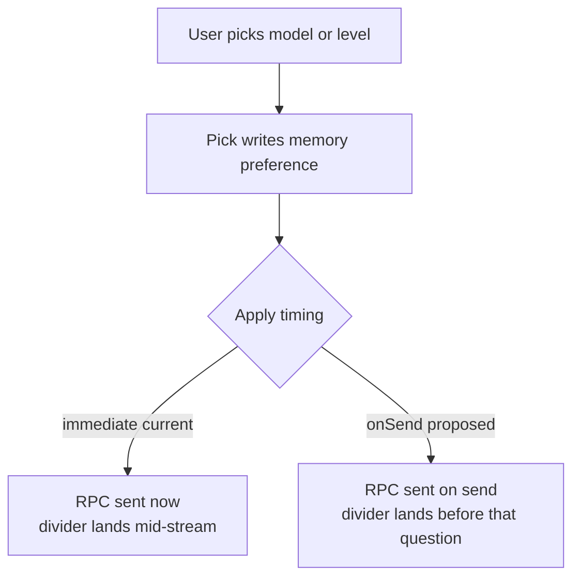
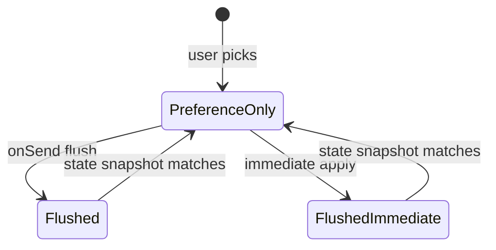
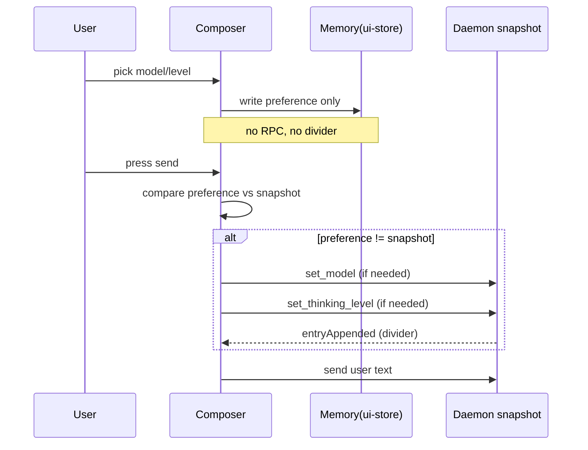
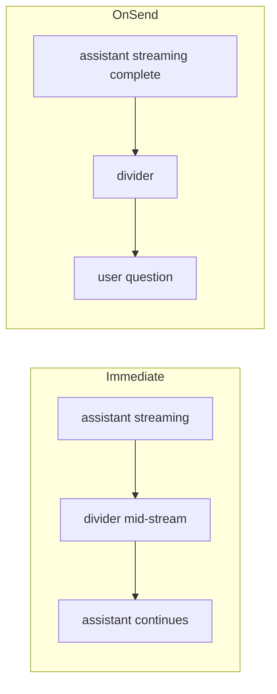
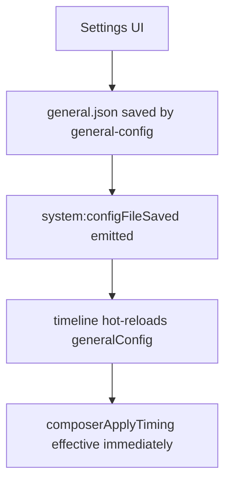
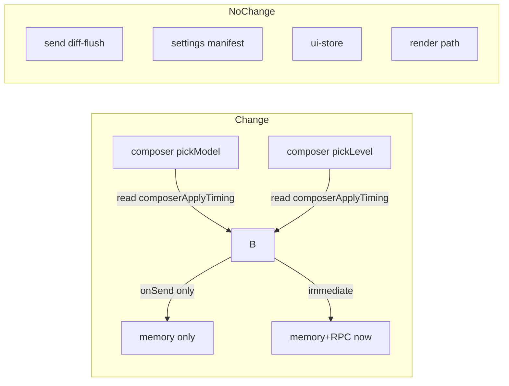
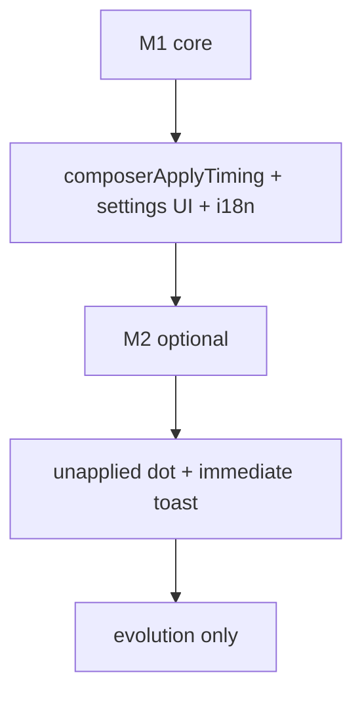

# composerApplyTiming 设计文档：模型/思考强度的应用时机
> Version: v1 | Date: 2026-03-26 | Author: claude

## 1. 问题与背景

### 1.1 现状触发时机

composer 左下角的模型选择器与思考强度选择器，点选那一瞬间就经 `ctx.models.setModel` / `ctx.models.setThinkingLevel` 发 RPC 到 pi 底座。底座立即写入 JSONL 的 `model_change` / `thinking_level_change` 条目并推 `entryAppended`，时间线在点选瞬间落分隔线。

### 1.2 语义混乱的来源

点选动作同时承担两件不同语义的事：一是"记一下下一条想用这个"（偏好），二是"立刻影响目前在用的这轮"（落盘）。两件事被一个动作绑死，产生三类错位：

- 正在流式生成时点选，分隔线插在生成的中途——"半路换将"
- 点选后隔几分钟才发送，分隔线和问题隔了一段输入期——悬空
- 用户只想改下一条，当前轮的生成被立即打断

### 1.3 用户设计诉求

- 点选=纯内存的偏好修改，不发 RPC 不打断 current generation
- 落盘=按下发送那一刻才 flush
- 保留一个通用开关倒回立即生效，默认发送时生效

### 1.4 现状链路证据

composer `pickModel` → `ctx.models.setModel` → preload `session:setModel` → main `sessionStore.setModel` → RPC `set_model` 发 pi 底座 → 底座写 JSONL `{"type":"model_change"}` → `entryAppended` → `sessionEntryToNeutral` 映射 `role:"divider"` → 时间线渲染分隔线。该链路同构于 `thinking_level_change`。

### 1.5 send() 既有 diff-flush

`send()` 已经在发送前比较偏好与快照：`prefModel !== snapModel → setModel`、`prefLevel !== snapLevel → setThinkingLevel`，随后再发正文。也就是说 onSend 模式的执行点早已存在，新方案不需要新增 flush 逻辑。

### 1.6 分隔线契约现状

`sessionEntryToNeutral` 把底座 `model_change` 映射成 `{role:"divider", kind:"model", i18nKey:"timeline.modelChange", i18nArgs:{provider, modelId}}`；`thinking_level_change` 同构。分隔线文案由语言插件贡献：zh-CN 为「模型 → provider/modelId」「思考强度 → level」。

### 1.7 状态投影现状

`patchStateFromEvent` 收到 `modelSelect` → `state.model`；`thinkingLevelChanged` / `thinkingLevelSelect` → `state.thinkingLevel`。这是顶栏"当前模型/强度"的数据源，与流内分隔线是两条独立通道。

### 1.8 矛盾焦点

用户预期的是"点选=偏好、发送=落盘"，而现状把两者压成了一个动作。设计的本质不是换新数据结构，而是把已经在 send() 存在的 diff-flush 升为唯一的 flush 入口，把点选降为纯偏好。

### 1.9 设计目标

- 点选为零 RPC 的纯内存偏好修改
- flush 只发生在 send()，对齐收敛不重复发 RPC
- 保留 `immediate` 作为可倒回的选择，默认 `onSend`
- 分隔线永远贴着"为它而切的那条问题"

### 1.10 设计非目标

- 不改底座协议：底座何时写 `model_change`/`thinking_level_change` 条目不变
- 不改 ui-store/schema：偏好存放位置不变
- 不改状态投影通道：顶栏数据源不动
- 不做 cancel 偏好：本期不存在撤销操作



**Figure 1.1 — Current immediate flow vs proposed onSend flow**

## 2. 设计语义

### 2.1 两态分层

整套方案只建立在一次语义拆分上：把"模型/思考强度"明确分成 **偏好（preference）** 与 **落盘（snapshot）**。

- 偏好：存放在 ui-store 的 `currentModelId` / `currentThinkingLevel`，语义是"下一条想用这个"
- 落盘：存放在底座的 `snapshot.state.model` / `snapshot.state.thinkingLevel`，语义是"这轮实际在用这个"

### 2.2 偏好与落盘的边界

- 点选、切会话、composer 初始化：只动偏好
- send()：偏好 flush 到落盘后再发正文
- 其他一律不动：状态投影、底座 RPC、JSONL 文件、条目类型

### 2.3 开关契约

- key：`composerApplyTiming`
- value：`"onSend"` 或 `"immediate"`
- 存放位置：`general.json`，与 `timelineCollapseDefault` 同文件
- key 是稳定查询契约、value 是内容——符合 token key 允许、token value 强推出去的纪律

### 2.4 默认值取向

`onSend` 为默认。理由见 2.10。

### 2.5 对齐收敛原则

- 偏好 === 落盘时不发 RPC——不重复、不刷屏
- flush 只发生在"不等"时——只做必要动作
- flush 与正文是顺序两条 RPC：`set_model`（如需）→ `set_thinking_level`（如需）→ 正文

### 2.6 与 send() diff-flush 的关系

`send()` 现有的 diff-flush 就是 onSend 的执行点本身。设计方案不动它、不加新逻辑，只把 pickModel / pickLevel 的立即 RPC 删掉。

### 2.7 与状态投影的关系

状态投影（`state.model` / `state.thinkingLevel`）由底座事件驱动，与 flush 时机无关——onSend 落盘后底座自然推 `modelSelect` / `thinkingLevelChanged`，顶栏与分隔线仍两路一致。

### 2.8 与分隔线的关系

底座只在收到 `set_model` / `set_thinking_level` 时写 `model_change` / `thinking_level_change` 条目。故分隔线位置=flush 时机，onSend 的自然结果就是"贴着为它而切的那条问题"。

### 2.9 immediate 的保留意义

- 有人在习惯点选即生效的工作流
- 有人不需要 onSend 的历史保护
- 保留是一个价值，删了会强迫所有人改习惯

### 2.10 onSend 作为默认的必然性

- 分隔线永远贴着问题而不是动作——历史自解释
- 流式中点选不打断当前 generation
- 多轮不改时不重复发 RPC
- 与用户预期的"点选=偏好、发送=落盘"心智模型一致



**Figure 2.1 — Preference vs snapshot lifecycle**

## 3. 行为规约

### 3.1 pickModel 行为矩阵

| 模式 | 内存 | RPC | 分隔线 |
|---|---|---|---|
| immediate | setCurrentModelId | 立即 `set_model` | 点选瞬间 |
| onSend | setCurrentModelId | 不发 | send 时 |

### 3.2 pickLevel 行为矩阵

| 模式 | 内存 | RPC | 分隔线 |
|---|---|---|---|
| immediate | setCurrentThinkingLevel | 立即 `set_thinking_level` | 点选瞬间 |
| onSend | setCurrentThinkingLevel | 不发 | send 时 |

### 3.3 send() flush 集成

`send()` 保持原状，现成的 diff-flush 自然就是 onSend 的执行点。flush 顺序固定：`set_model`（如需）→ `set_thinking_level`（如需）→ 正文——分隔线永远落在正文之前。

### 3.4 对齐收敛语义

偏好 === 落盘时不发 RPC。这既省 RPC 又避免分隔线刷屏——连续多轮不改时消息流零新增。

### 3.5 新会话首开（无 snapshot）

`snapModel === null` 时 snapModel 是 null、偏好非 null，send() 必 flush。新会话首条即生效，不会出现"新会话首发用错模型"。

### 3.6 未发送换会话

偏好是 ui-store 全局状态、跨会话保留。切到新会话后 send 时与新快照比对再 flush——A 会话的偏好不会误伤 B 会话的当前轮。

### 3.7 流式中点选

onSend 模式下不 flush 不打断当前 generation。当前轮完整收尾、向后衔接下一条用新模型的问题——这是 onSend 作为默认的直接受益场景。

### 3.8 immediate 打断代价

immediate 模式下流式中点选，RPC 立即到底座——当前轮被打断或强制收尾，分隔线也插在生成的中途。这是保留 immediate 必须接受的代价，见 6.5。

### 3.9 cancel 语义（不存在）

本期不存在撤销偏好。点错了再点一次改回来即可——偏好纯内存、改回来零成本。

### 3.10 多轮对齐的零动作

偏好 === 落盘时不发 RPC。连续多轮用同一个模型，send() 零新增、零过程变化——对齐即收敛。



**Figure 3.1 — onSend flush inside send()**

## 4. 时间线呈现

### 4.1 分隔线契约

- kind：`model` 或 `thinking`
- i18nKey：`timeline.modelChange` / `timeline.thinkingLevel`
- i18nArgs：`{provider, modelId}` 或 `{level}`
- id / timestamp：来自底座 JSONL 条目

### 4.2 分隔线文案契约

zh-CN：`模型 → provider/modelId`、`思考强度 → level`。其他语言同构。文案由语言插件贡献，内核零文案。

### 4.3 分隔线位置语义

分隔线永远代表"此处切换到了此后用的模型/强度"——它必须贴着使变更生效的那条问题，而不是加到变更动作的那一刻。

### 4.4 onSend 的分隔线落点

分隔线恰好落在"为它而切的那条新用户消息"之前——和前一条 assistant 收尾紧挨着。向后时间线一眼看清"这个问题用了这个模型"。

### 4.5 immediate 的分隔线落点

immediate 下分隔线落在点选瞬间。若 assistant 正在流式生成，分隔线插在生成的中途；若点选后隔输入期才发送，分隔线和问题隔了一段输入期。

### 4.6 状态投影与分隔线

状态投影（`state.model` / `state.thinkingLevel`）由底座事件驱动，与 flush 时机无关。两路独立、同源更新：底座落条目时同时推 `entryAppended` 与 `modelSelect` / `thinkingLevelChanged`。

### 4.7 历史会话离线呈现

`openSession` 走文件读基线，底座 JSONL 里已有的 `model_change`/`thinking_level_change` 条目在文件读时原位映射成时间线上的分隔线。

### 4.8 分隔线与 scroll 联动

分隔线的虚拟滚动渲染与其他消息一致，不占额外 DOM——稀疏文本流中权重低、默认 async-render。

### 4.9 空会话首发分隔线落点

新会话首开时无 assistant 收尾，分隔线直接落在首条用户消息之前——语义同样是"这个问题用了这个模型"。

### 4.10 不打断生成中幕

onSend 保证流式中点选不打断当前 generation——这是最难替的价值：历史里永远不存在"话说一半换将"的记录。



**Figure 4.1 — Divider placement: immediate vs onSend**

## 5. 设置接入

### 5.1 general.json key 契约

key：`composerApplyTiming`。写入 `general.json` 顶层字段，与 `timelineCollapseDefault` 同级。

### 5.2 key 名字空间

`composer*` 前缀语义为 composer 行为控制，不与 `timeline*`/`show*`/defaultThinkingLevel 冲突。

### 5.3 设置页接入点

设置页加一项：select/toggle（"发送时生效" / "立即生效"）。general-config 插件已托管 general.json——在该插件设置页加即可。

### 5.4 general-config manifest 声明

general-config 的 manifest 已声明 configFile 托管 general.json——新增 key 不需要新增 manifest。

### 5.5 设置页渲染层次

设置项放 composer 行为段（如"时间线行为"/"Composer 行为"子段），与模型默认/时间线默认分组并列。

### 5.6 i18n key 契约

- `general.composerApplyTiming`：设置项标题（"模型/思考强度应用时机"）
- `general.applyOnSend`：选项（"发送时生效"）
- `general.applyImmediate`：选项（"立即生效"）

### 5.7 热刷语义

保存由 general-config 插件托管 dirty/save/拦截；保存后框架 emit `system:configFileSaved`，timeline 插件已订阅该事件并热刷 generalConfig——保存即生效、不用 reload。

### 5.8 与 timelineCollapseDefault 共存

两者同文件、互不相干。`timelineCollapseDefault` 控制时间线默认折叠、`composerApplyTiming` 控制应用时机。

### 5.9 与 defaultThinkingLevel 共存

`defaultThinkingLevel` 决定偏好初始值（没有偏好时的兜底），`composerApplyTiming` 决定偏好何时落盘——层次清晰、相互不动。

### 5.10 设置项分层语言

设置项文案由 i18n 插件按通用模式贡献（"发送时生效/立即生效"），内核零文案。



**Figure 5.1 — Settings write to composer hot reload**

## 6. 边界与差错

### 6.1 流式中点选

- onSend：不打断当前 generation
- immediate：打断——记录会在生成中途落分隔线

### 6.2 未发送换会话

偏好跨会话保留（ui-store 全局）。切到新会话后 send 时与新快照比对再 flush，不污染当前轮。

### 6.3 无 snapshot

snapModel === null → send() 必 flush——新会话首条即生效。

### 6.4 对齐收敛

偏好 === 落盘时零动作：零 RPC、零分隔线新增。

### 6.5 immediate 打断代价

immediate 模式的固有不便：会打断当前 generation，并中断历史自解释性。这是保留 immediate 必须接受的代价。

### 6.6 immediate 打断提示

可在 immediate 模式下点选时提示"已应用到当前会话"——toast 归 i18n 插件，可留演进。

### 6.7 偏好与落盘不一致的视觉差

onSend 点选后左下角显示的是偏好名称，当前轮使用的还是落盘模型——用户知道"下一条会用显示的这个"。cursor 不标记"未应用"也成立。

### 6.8 偏差后重同步

onSend flush 后落盘===偏好，下一轮的 diff-flush 变零动作——自同步、不重复。

### 6.9 send() 中断后果

flush 失败（RPC reject）时先不发送正文——不送错的正文状态，不弄脏历史。已有现有 send() 的 catch 语义。

### 6.10 连续对的零动作

连续多轮用同一个模型：每次 send() 的 diff-flush 比对都是零动作——偏好与落盘一致的天生收敛。

```mermaid
flowchart TD
    A[send() pressed] --> B{preference vs snapshot?}
    B -->|equal| Z[no RPC, send text]
    B -->|prefModel differs| C[set_model]
    B -->|prefLevel differs| D[set_thinking_level]
    C --> Z
    D --> Z
```

**Figure 6.1 — send() flush decision tree**

## 7. 实现影响面

### 7.1 composer pickModel 改动点

读开关：`immediate` 保持现状，`onSend` 只调 `setCurrentModelId`，不发 RPC。

### 7.2 composer pickLevel 改动点

读开关：`immediate` 保持现状，`onSend` 只调 `setCurrentThinkingLevel`，不发 RPC。

### 7.3 send() 保持不动

现有 diff-flush 自然就是 onSend 执行点——零改动。

### 7.4 general-config 设置项

在 general-config 插件设置页加一项 select/toggle。manifest/托管文件不动。

### 7.5 i18n key 清单

- `general.composerApplyTiming`
- `general.applyOnSend`
- `general.applyImmediate`

### 7.6 general.json schema

新增顶层字段 `composerApplyTiming: "onSend" | "immediate"`，与 `timelineCollapseDefault` 同级。

### 7.7 ui-store 保持不动

`currentModelId` / `currentThinkingLevel` 存放位置、写入路径不动。

### 7.8 渲染路径保持不动

分隔线渲染（MessageRow → EntryDivider）、composer 显示（currentModel/currentLevel）路径不动。

### 7.9 偏好与落盘一致性检查

设计自洽的检查点：onSend flush 后 diff-flush 变零动作——不重复、不重入。

### 7.10 不动清单

- ui-store schema / 写入路径
- 状态投影通道
- 分隔线渲染层
- 底座协议（set_model / set_thinking_level / model_change / thinking_level_change）
- general.json 其他 key



**Figure 7.1 — Impact map: change vs no-change**

## 8. 可选增强

### 8.1 未送态轻提示

onSend 点选后，composer 左下角模型名仍是偏好渲染。可加一个小点标记偏好未落盘——纯视觉，可留演进。

### 8.2 immediate 打断提示

immediate 模式下点选时提示"已应用到当前会话"——toast 归 i18n 插件。

### 8.3 scroll 联动增强

分隔线会自动进虚拟滚动层级，与现有稀疏渲染一致。

### 8.4 cancel 偏好（演进）

点错后再点一次改回来即零成本——不需要本期做撤销操作。

### 8.5 toast 联动

flush 成功后可提示"模型已应用到这条问题"——可留演进。

### 8.6 测试指引

- immediate 点选：RPC 立即到、分隔线点选瞬间落
- onSend 点选后发送：send() 先 flush、分隔线贴着问题
- 流式中点选+onSend：不打断、分隔线贴在问题前

### 8.7 设置项说明文分成

设置项下方可加一行说明文本，解释两种模式的差异——可留演进。

### 8.8 演进安全

新增 key 不破坏现有 general.json：读取时 missing key 作 `onSend` 兜底——旧文件升级无缝。

### 8.9 里程碑切分

- M1：pickModel/pickLevel 读开关 + general-config 设置项 + i18n key
- M2：未送态轻提示 + immediate 打断提示
- 其余靠演进，不立项

### 8.10 测试矩阵

| 场景 | immediate | onSend |
|---|---|---|
| 空闲点选后发送 | 分隔线点选瞬间 | 分隔线贴在问题前 |
| 流式中点选 | 分隔线插流中、可能打断 | 不打断、分隔线贴在问题前 |
| 未发送换会话 | 即时毛用当前轮 | 下轮 flush，不动当前轮 |
| 连续多轮不改 | 每轮可能重复 RPC | 零动作 |



**Figure 8.1 — Milestones: core vs optional vs evolution**
