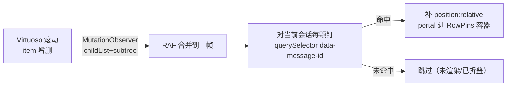
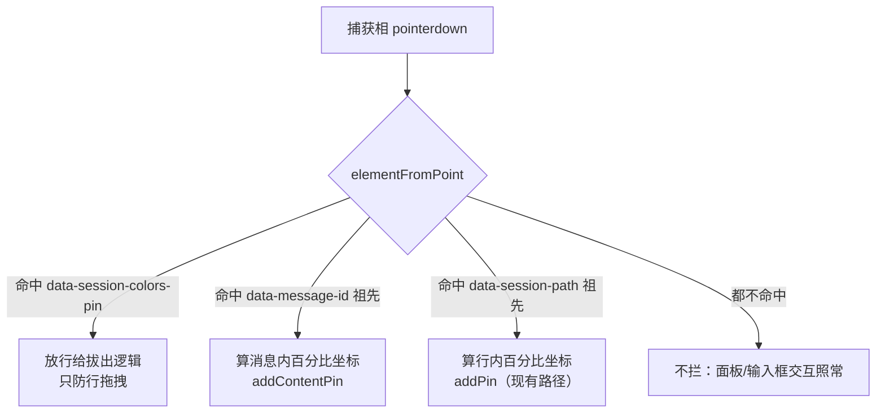

# 内容图钉：把图钉钉进会话流

session-colors 的图钉目前只能钉会话列表的行。本文把它扩展到第二个挂载面：会话流里的消息。选色后在会话流里点哪钉哪，图钉锚定在消息上跟随滚动，右侧面板点击跳回原文。timeline 零改动——所有能力经既有槽位、既有 DOM 锚点、既有事件通道完成。

本文是扩展设计不是独立系统：钉入模态、portal 机制、钉入/拔出动画、同色替换、store 的 config 投影写盘等既有机制的完整定义见 session-colors 插件的 DESIGN.md（`src/plugins/sessions/session-colors/DESIGN.md`），本文只讲增量，引用时不再展开。文中 timeline 指会话流渲染插件（`src/plugins/sessions/timeline/`，mainView 槽的贡献者）。

## 1 问题与目标

### 1.1 场景

长会话里找内容靠滚动和扫视。"那段代码方案我记得可行""那个工具调用的输出有问题待会要查""这条回答待会要抄走"——这些位置的共同点是需要回来，但不需要做任何事：不 fork、不评论、不发给模型，只是标记一下，待会一眼找到。

会话流比会话列表更需要这种标记。列表再长也就一屏几十个标题，标题本身还是为辨识设计的；会话流是几千行混排的气泡、代码块、工具卡，同质度极高，滚动十屏之后"刚才那条在哪"完全是体力活。

### 1.2 现有机制各自差在哪

- **会话图钉**（session-colors 现状）：标"哪个会话重要"，粒度到会话为止。它回答不了"会话里哪条内容重要"——钉了红色图钉的会话打开之后，里面几百条消息还是得自己扫。

- **书签**（session-bookmarks）：完整 JSONL 拷贝加 fork 语义，为"保存这个节点、以后从这里重启对话"设计。拿它当位置标记用，每标一处就复制一份会话文件，重量和语义都不对——我不要重启对话，我只要滚回去。

- **review**：划选片段、写评论、随下一条消息发给模型。那是给模型的输入通道，不是给自己的视觉标记——我不想告诉模型什么，也不想写评论。

- **pinned**：会话头行的二值布尔，管"这个会话要不要顶到列表最上"，与内容无关。

差的那块是：会话内的、内容级的、纯视觉的轻标记。这是会话图钉的同一族需求，只是挂载面从列表行换成了消息。

### 1.3 设计目标

- 钉整条消息。图钉锚定在消息上，消息内点哪钉哪——保留"点哪钉哪"的空间记忆（红色钉在这条消息的右上，蓝色钉在那条的中部），与会话图钉同一套心智。

- 图钉跟随消息。滚动、折叠、流式增长、窗口缩放时图钉始终在消息的同一相对位置，零坐标重算。

- 右侧面板按会话聚合列出**全项目**的内容钉（含其他会话的），点击平滑跳回那条消息——当前会话直接滚，其他会话先打开再滚。

- **timeline 零改动**。所有能力经既有机制完成：`data-message-id` DOM 锚点（timeline MessageRow 三个分支已带）、`timeline:scrollTo` 事件通道（session-tree 的 locate 已在用）、`messageActions` 槽（Copy/Bookmark/Rewind 已在挂）。这是硬指标，与会话图钉当年对 sessions-list 零改动同级——那次还加了一行 `data-session-path`，这次连一行都不用加。

## 2 归属与边界

### 2.1 一个抽象，两个挂载面

图钉的抽象是**用户私有的空间化视觉标注**：选一个颜色，钉在一个视觉目标上，位置本身就是意义。会话行是这个抽象的第一个挂载面，消息是第二个。它们不是两个功能——色板是同一组颜色，钉入是同一个模态，动画是同一组弹簧参数，连"同色替换"的规则都逐字通用。差异只在落点：落点的 DOM 结构不同（静态列表 vs 虚拟滚动流），锚点 key 不同（sessionPath vs messageId）。

### 2.2 收进 session-colors，不开新插件

内容图钉作为 session-colors 插件的能力扩展实现，不新建插件。理由：

- 机制复用率接近全部。色板组件、钉入模态的捕获相拦截、portal 钉入元素、钉入/拔出动画、`attachedOnce` 登记簿、store 的 config 投影写盘——拆开新插件意味着这些各抄一份，或者抽成共享包让两个插件依赖。前者违反收敛纪律，后者为一个功能造共享层是过度设计。

- 用户心智里"图钉"是一个功能。色板在两个插件各出一排、钉入模式有两个入口，是功能割裂不是解耦。

- 数据通道现成。插件 config 加一个并列 key `"contentPins"`，与现有 `"pins"` 平级，读写路径一条不改。

插件 id 保持 `session-colors` 不动（数据兼容），displayName 维持"会话图钉"——"会话里的图钉"本就涵盖会话内。

### 2.3 与书签、review 的职责分层

扩展后四个相近功能的职责边界：

- **会话图钉**：哪个会话值得回——跨会话标记。
- **内容图钉**：会话里哪条内容值得回——会话内标记。
- **书签**：从哪里重新开始——fork 语义，带完整拷贝。
- **review**：我要告诉模型什么——输入通道，落进下一条消息。

四者互补，互不替代。内容图钉不做 fork（那是书签），不带文字（那是 review）。内容钉可以跨会话**列出**（§6 的聚合索引），但锚点仍是会话内的——跨会话只是导航索引，不改变"这个会话里这个位置"的标记语义，与"哪个会话值得回"的会话图钉层仍然分工清晰。

## 3 数据模型

### 3.1 锚点：messageId

内容钉的锚点是 `NeutralMessage.id`。这个 id 是 JSONL 行级条目 id——`sessionEntryToNeutral`（`src/core/domain/events/session-state.ts`）把条目 id 提升为消息 id，注释里写明它就是"patch/书签/滚动的稳定锚点"。稳定性与书签的 fork 锚点同级：重扫会话文件、重开窗口、切走再切回，id 不变。书签拿它 fork、review 拿它锚评论、timeline 拿它 `scrollToIndex`，内容图钉拿它定位，是同一个锚点的第四种消费。

不钉块（block）级。块级锚点不全——toolCall 块有 `toolCall.id`，thinking、text 块没有稳定 id；块也没有 DOM 锚点，`data-message-id` 在 MessageRow 根元素上，块级定位要给 BlockRenderer 加属性，破坏"timeline 零改动"。消息粒度对"标记位置回来看"够用。

### 3.2 存储结构

插件 config 新增 key `"contentPins"`，按 sessionPath 分桶：

```json
{
  "/Users/.../sessions/abc-123.jsonl": [
    { "id": "7f3e...", "messageId": "msg-entry-id", "color": "#f38ba8", "x": 92, "y": 8, "preview": "那段代码方案我验证过了,可行" },
    { "id": "a1b2...", "messageId": "msg-entry-id-2", "color": "#89b4fa", "x": 40, "y": 55, "preview": "这个工具调用的输出有问题" }
  ]
}
```

字段语义：

- `id`：图钉自身 id，`crypto.randomUUID()`，用于 React key、删除、`attachedOnce` 动画登记。
- `messageId`：锚点，JSONL 行 id。
- `color`：同一副七色色板（`core/pin.ts` 的 `PALETTE`）。
- `x`、`y`：相对消息元素（`[data-message-id]` div）渲染框的百分比，0–100。用百分比不用像素的原因与会话图钉相同（窗口缩放、侧栏拖宽、字号调整时不错位）；多一条会话流特有的理由：流式增长和折叠展开会改变消息高度，百分比让图钉始终停在消息的同一相对位置，零 JS 参与。
- `preview`：钉入时刻的消息文本快照（`messagePreview` 前 30 字），面板跨会话列出时的显示文本——跨会话列出零读取通道（§6.2）。可选字段：升级前的旧数据没有它，回该会话时惰性补填（`backfillPreviews`），补不上的（孤儿）保持缺失、面板显示"无预览"。快照只是导航标签，rewind 后可能过时，不影响导航正确性（锚点是 messageId）。

读写走插件 config 既有通道（`ctx.config.get/set`），与会话钉的 `"pins"` 平级：框架按 pluginId 推导落盘，项目级 `<cwd>/.my-harness-desktop/config/session-colors.json` 覆盖全局 `~/.my-harness-desktop/config/session-colors.json`，插件不碰路径。

按 sessionPath 分桶带来天然过滤：只有当前打开会话的钉参与**渲染**（会话流同一时刻只有一个）。面板**列出**是跨会话的（§6.1），按桶聚合即可，同样不需要清数据。

### 3.3 同色替换与孤儿处置

同色替换规则逐字平移：**同一条消息上同一颜色只保留一个钉**，后钉的顶掉先钉的（旧钉弹飞、新钉落下，350ms 动画重叠期）。不同消息、不同颜色随意共存。

孤儿钉：messageId 在当前 messages 里不存在——rewind 截断了后续消息、连续重试失败被 `collapseRetryFailures` 折进 divider、手动编辑过 JSONL——扫描时 `querySelector` 找不到元素，钉不渲染。数据留在 config 里不主动清：折叠类消失是临时的（开"显示隐藏消息"即回来），截断类消失是永久的。面板处置按可判定性分两种（§6.1）：当前会话的孤儿钉可判定，不列；其他会话的孤儿钉不可判定（不读文件无从知道），保留列出、导航静默不跳。这与会话图钉对"行不在 DOM 就不显示"的处理同源。

## 4 渲染机制：虚拟滚动下的挂载追踪

### 4.1 与会话列表的结构性差异

会话图钉的 portal 方案建立在"行永远在 DOM"上：sessions-list 不分页不虚拟化，行从渲染起就在，图钉钉进去一劳永逸。会话流是 Virtuoso（react-virtuoso）虚拟滚动——只有可见窗口加 overscan 的消息在 DOM 里，滚出去的消息元素被卸载，滚回来重建。

这意味着**消息元素的卸载和重建是常态而非异常**。图钉 portal 进消息元素后：滚出视口，元素卸载，图钉随之消失——这是正确行为，看不见的消息不需要钉；滚回来，元素重建，MutationObserver 触发重扫，图钉重新挂进新元素。机制与会话图钉处理"切项目行消失/出现"完全同构，只是触发频率从"切项目"变成"每次滚动"。

### 4.2 扫描与重锚

挂载追踪维持会话图钉的既有模式，JS 只维护 `messageId → 消息元素` 的映射，坐标一概不算。扫描有两个触发源：**数据触发**——store 的钉数据变化（钉入/拔出/清空）时立即重扫一轮，钉的瞬间反馈走这条路，不等 DOM 事件；**DOM 触发**——MutationObserver 捕获消息元素的增删（滚动重建、折叠展开、切会话），RAF 合并后重扫：



- **观察目标**：Virtuoso 滚动容器（`[data-virtuoso-scroller]`），定位方式是 `document.querySelector("[data-message-id]")?.closest("[data-virtuoso-scroller]")`——拿现有消息元素反查容器，不假设容器 class（`scrollbar-hidden` 是业务 class，不作契约）。容器晚出现或整体迁移时按会话图钉的容器重锚模式处理：每轮扫描后比对容器身份，变了就断开旧 observer 重建，兜底 `document.body`。

- **行内挂载**：消息元素是 `position: static` 时补 `relative`（assistant 分支已带 `relative`，user 和 divider 分支不带），然后 portal 一个 `absolute; inset: 0` 的钉层进去，钉按 `left: x%; top: y%` 定位。钉进元素之后，滚动、重排、补间动画、流式撑高全部由浏览器原生跟随。

- **动画登记簿平移**：`attachedOnce` 按 pin id 登记播过钉入动画的钉。虚拟滚动下同一颗钉随消息反复卸载重挂，登记簿保证只有用户钉入那一瞬播弹簧动画，滚动重挂直接静息出现——没有它，每次滚过钉位都会看到图钉弹跳一次。

### 4.3 性能边界

滚动时 observer 触发频率远高于会话列表场景，成本控制靠三条既有手段：

- RAF 合并：observer 回调不直接扫描，`requestAnimationFrame` 合并到一帧一次，滚动一帧内多次 childList 变化只扫一回。

- 只查有钉的：每轮扫描对当前会话的每颗钉做一次属性选择器 `querySelector`，不遍历消息。一个会话钉十几颗是重度使用，每帧十几次 `querySelector` 成本可忽略。

- 命中比对防重渲染：扫描结果与现存映射逐键比对元素身份，没变就不 setState——虚拟滚动下大多数扫描的结果与上轮相同。

钉数量不做硬限制，理由同会话图钉：单钉是一个 SVG 加两层 div，且只在消息可见时存在 DOM。

## 5 交互流程

### 5.1 统一钉入模式：落点决定类型

不引入"会话钉模式"和"内容钉模式"的分别。面板选色进入钉入模式后，点击的落点自己说话。拦截监听器就是会话钉模式现有的那一组 window 捕获相监听（pointerdown/click/contextmenu），挂在 window 上而非任何 timeline 的 DOM 节点——这是"timeline 零改动"在交互侧的落点，钉入模态对会话流和会话列表是同一组事件、同一层拦截：



`[data-message-id]`（中区会话流）和 `[data-session-path]`（左栏列表）在 DOM 上分属不同子树，不会互为祖先，两个分支天然互斥——这不是运气，是槽位架构保证的：会话流由 mainView 槽壳渲染、会话列表由 sidebar 槽壳渲染，两个槽壳是 App 组件树里的并列分支，一个槽壳里的元素永远成不了另一个槽壳里元素的祖先或后代。用户不需要先声明"我要钉什么"——点会话行就是会话钉，点消息就是内容钉。

### 5.2 模态在会话流上的代价与边界

会话图钉的模态拦截在列表上是低代价的：行上唯一的交互是点击切换会话，拦住即可。会话流不一样，消息区承载着桌面端最密的指针交互——文本划选复制、链接点击、代码块复制按钮、messageActions 按钮、review 的划选评论。钉入模式的捕获相 `pointerdown` 拦截会把这些整体截停（`preventDefault` 连带阻止文本选择的开始）。

这是模态的固有代价，处置与列表模式同性质：模式是短暂的，选色→钉→Esc/右键退出，模式外一切交互恢复。wheel 滚动不拦截，钉入模式下翻找消息正常。review 的划选评论与钉入模式互斥——要划选就退出模式，这与"钉入模式下不能点链接"是同一个取舍，不单独处理。

### 5.3 快捷入口：messageActions 槽的钉按钮

主入口（色板→钉入模式→点位置）价值在位置自由，代价是三拍操作。为"看到这条重要，随手一标"补一个一拍入口：经 `messageActions` 槽往消息行贡献钉按钮——manifest 的 `contributes.messageActions` 声明 `{component, when: {role: ["user", "assistant"]}}`（divider 类消息无标记意义），框架从 renderer module 的 exports 自动匹配同名组件挂上消息行（组件自动匹配机制，DESIGN.md §7.4），hover 消息时与 Copy/Bookmark/Rewind 同排出现。

点击行为是显式 toggle，直接从数据判断，不经替换规则伪装：

- 该消息上尚无 `lastUsedColor` 颜色的钉 → 钉入默认位置（右上角，`x=97, y=6` 的固定常量），走钉入动画。
- 已有该颜色的钉（无论是否正在默认位置）→ 拔出，走弹飞动画。

`lastUsedColor` 是插件既有 zustand store（`renderer/pin-store.ts`）新增的内存态字段：色板每次选色时更新，不持久化——它只是快捷入口的便利性记忆，不值得为它加一个 config key；冷启动回色板首色（`PALETTE[0]`）。

快捷入口钉固定位置，不是进入钉入模式——它的全部价值在"快"，要位置精确的用户走主入口。两个入口产出同一种数据，面板和渲染不感知来源。

### 5.4 拔出与退出

全部沿用会话图钉语义，无新增：

- 拔出：点击已钉的钉，350ms 弹飞动画后移除。钉元素自身的 `data-session-colors-pin` 标记在钉入模式的拦截层里本来就有放行分支，两种钉共用。

- 退出模式：Esc、右键、再点选中色、切出 chat 视图，四条路径不变。

- 全局可见性开关（眼睛按钮）：对两种钉同时生效——它们是同一层视觉标注，没有分开隐藏的理由。

## 6 面板与导航

### 6.1 跨会话聚合

现有面板骨架不动：标题行、提示行、色板行。列表区分成两段：

- **会话钉段**：现有列表，原样（行在侧栏 DOM 中的会话钉）。
- **内容钉段**：**全项目**的内容钉按会话聚合成组——不是只列当前会话。钉是"要回来的位置"，钉完切走就失去可发现性等于没钉；行钉切会话后照样列在面板，内容钉同权。

组内与组间口径：

- **当前会话组恒在最前**，组内按消息在会话流中的先后排序（按 messageId 在 messages 里的 index，不按钉入时间——回看的认知顺序是内容顺序）。列出口径 = 渲染口径：messageId 在当前 messages 里且该消息实际渲染（未被折叠/过滤）的钉才进列表——孤儿钉（§3.3）可判定，不列。当前会话上下文自明，不显示组头。
- **其他会话组**按项目的会话列表顺序排，组头显示会话名（`deriveSessionTitle`）。这些会话的 messages 不在内存，孤儿钉**不可判定**——判定要读别的会话文件，不做；一律保留列出，导航命中不了时静默不跳（§6.3），与行钉"文件已删打开失败回滚"的降级同级。会话文件已删的（不在会话列表里）整组不列——与行钉"行不在侧栏 DOM 不列"同口径。
- 色板 filter tab 对会话钉段和内容钉段同时生效；过滤后条目为空的组不列。内容钉段无任何条目时整段不渲染，不留空标题。

聚合逻辑是纯函数，收在 `core/pin.ts` 的 `groupContentPins`（可裸单测）：输入 contentPins、当前会话路径、当前 messages、项目会话路径序列、颜色过滤，输出分组。renderer 只渲染，不掺判定。

### 6.2 预览快照：跨会话零读取通道

跨会话列出需要每条钉的显示文本。最初的版本设计以"预览代价"否掉跨会话——列别的会话的钉就要读别的会话的消息，得加一条会话读取通道。这个论证不成立：**钉入的那一刻消息就在手边**——主入口（Overlay 捕获相）持有 `useSessionStore` 的 messages，快捷入口（`ContentPinAction`）的 props 里就有 message 对象。钉入时刻把 `messagePreview`（与 messageActions 的 rowText 同语义，`messageContentText` 单源，前 30 字）快照进 `ContentPin.preview`，跨会话列出从此零读取通道。

- 两个钉入口产出同构快照，面板不感知来源。
- 快照可能过时（rewind 截断消息、手动编辑 JSONL）——预览只是导航标签，锚点是 messageId，标签过时不影响导航正确性。
- **旧数据迁移**：升级前的 contentPins 没有 preview 字段。惰性补填（`backfillPreviews`）：重开某个有缺 preview 钉的会话时，从当前 messages 解析写回 store（Overlay 投影落盘），下次跨会话列出即有预览；补填前该钉面板显示"无预览"（斜体弱化），导航照常；孤儿钉补不上，永久"无预览"，不触发写盘。不做启动期全量迁移——那要读全部会话文件，与"零读取通道"自相矛盾。

### 6.3 点击定位：两段式导航

- **当前会话条目**：`ctx.events.invoke("timeline:scrollTo", { messageId })`。通道现成：timeline 侧按 messageId 找 index、`scrollToIndex` 平滑滚动，找不到时登记 `pendingScrollRef` 等下轮 messages 变化兜底——session-tree 的 locate 走的就是这条路。
- **其他会话条目**：两段式——先 `openSession`（文件已删/不可读时回滚选中态、返回失败即止），成功后再 invoke `timeline:scrollTo`。时序竞态由 timeline 既有兜底接住：openSession 结束时 messages 已进 store，但 timeline 的 scrollTo 回调可能还持有旧 messages——未命中登记 pending，messages 变更 effect 随即命中投递，恰好一次。

降级情况：

- 消息被 `collapseRetryFailures` 折进 divider，或被显示开关过滤：当前会话的这类钉面板不列（§6.1），用户点不到；其他会话的这类钉不可判定，点了静默不跳。
- 钉入后从未渲染过的消息（长会话顶部）：Virtuoso 的 `scrollToIndex` 按数据 index 跳，不依赖 DOM 已渲染，正常到达。

## 7 QA

**Q：钉在正在流式增长的消息上，图钉会跟着长吗？**

会，且零 JS 参与。图钉定位是相对消息元素渲染框的 CSS 百分比，消息被流式内容撑高时浏览器自动重算钉的绝对位置。钉在 y=8% 的钉始终在消息的"顶部附近"——这正是百分比坐标在会话流上比像素坐标正确的理由。

---

**Q：虚拟滚动下快速滚过一颗钉，会看到它反复弹跳吗？**

不会。钉入动画只播一次：`attachedOnce` 登记簿按 pin id 记播过的钉，消息元素随滚动卸载重建时图钉重挂但 `initial: false`，静息出现。

---

**Q：rewind 或 fork 之后，内容钉怎么办？**

rewind 是 fork 加发送：fork 出的新会话换了文件路径，按 sessionPath 分桶的钉自然不带过去，原会话里被截断的消息其 messageId 从 messages 里消失，对应的钉成为孤儿——不渲染、不列面板，数据留在 config 里。这与书签不同是刻意的：书签就是为"带着内容去新分支"设计的，图钉是"这个会话里这个位置"的标记，会话分支走了，标记留在原处。

---

**Q：钉入模式下想复制消息文本怎么办？**

退出模式再复制。钉入模式的捕获相拦截整体截停消息区的指针交互（含文本选择），这是模态的固有代价。模式是短暂的——Esc、右键、再点选中色随时退出，退出后一切恢复。

---

**Q：连续重试失败被折叠的消息，上面的钉会丢吗？**

不丢，只是不可见。`collapseRetryFailures` 把连续失败的消息折成一条 divider，原消息不进 `visibleMessages`，钉扫描不到 DOM 不渲染。开"显示隐藏消息"（通用设置的 showHiddenMessages）后消息回来，钉跟着回来。

---

**Q：快捷入口为什么钉在固定位置，而不是点击后进入钉入模式让我选位置？**

快捷入口的价值在一拍完成。点了按钮再进入模态选位置，比走色板主入口还长一拍，两个入口就没有分工了。固定钉在消息右上角，要位置精调用主入口。两个入口产出同构数据，渲染和面板不感知来源差异。

---

**Q：手动编辑会话 JSONL 改了条目 id，钉会怎样？**

成为孤儿钉，不渲染不列出，与会话图钉"文件重命名后钉丢失"是同一类已知限制。messageId 锚点的稳定性建立在底座和桌面端自己写文件的约定上，绕过这层约定直接改文件，锚点断联是预期行为。

---

**Q：为什么不做"钉选中文本片段"这种更细的粒度？**

选区锚点在会话流上不稳定：rewind 截断、retry 折叠、流式续写都会让字符偏移失准，而 messageId 是 JSONL 行级 id，与书签同级稳定。交互上划选已经是 review 评论的入口，两种功能抢同一个手势必然互相干扰。消息粒度对"标记位置回来看"够用——真需要指给模型看具体内容，那本来就是 review 的职责。

---

**Q：同一条消息的同一个位置能钉两颗不同颜色的钉吗？**

能。替换只按颜色发生（同消息同色一个），位置不做防重叠检查。两颗钉坐标相同时后钉的在 DOM 序上盖过先钉的，视觉上叠在一起——这是用户在同一位置点两次自己造成的，看到重叠自然会挪走。为这种自造成的边缘情况加最小间距约束，是把简单规则复杂化。

---

**Q：timeline 插件被禁用或卸载时，内容钉会怎样？**

静默降级，不报错。内容钉依赖的三样都由 timeline 提供：`data-message-id` 锚点没了，扫描 `querySelector` 全部落空，钉不渲染；`timeline:scrollTo` 无订阅者，invoke 入队不投递，面板点击不跳转；messageActions 槽无人消费，快捷按钮不出现。不在 manifest 声明 `dependsOn: ["timeline"]`——dependsOn 的语义是"依赖方在线时被依赖方不可停用"，而 timeline 被停用时中区会话流本身就是空壳，钉不钉已无所谓，把两个插件的生命周期绑死换来的只是"钉还在但没地方显示"，没有意义。会话钉（挂会话列表）不受 timeline 缺席影响，继续工作。

---

**Q：面板为什么列其他会话的孤儿钉，当前会话的孤儿钉却不列？**

可判定性不对称。当前会话的孤儿拿内存里的 messages 就能判定，列出来是纯噪音（点了永远不跳）；其他会话的孤儿判定要读文件，与"零读取通道"冲突，不判。不判时宁列不藏：藏了会让真实有效的钉从索引里消失（漏报），列了最坏只是点一颗失效钉静默不跳（误报）——回航索引宁可多列不可漏列。

---

**Q：面板口径为什么是现在这个形态？之前不是按会话聚合过吗？**

走过三轮。初版两段式（内容钉只列当前会话）→ 0.5.1 按会话聚合（行钉∪消息钉并集列会话、条目并排两种色点）→ 回退两段式 → 本版跨会话索引。0.5.1 的聚合解决了"只钉消息的会话不进列表"，但砍掉了消息级预览和跳转——面板只剩色点，回看还得打开会话自己扫，回航价值被掏空，回退。回退版保住了预览和跳转，但"钉完切走就找不到"又回来了。本版把两者合起来：跨会话列出（0.5.1 的目标）+ 预览与导航（回退版的目标）。关键使能是预览从"列出时读"改成"钉入时快照"（§6.2）——最初否掉跨会话的"读取通道代价"随之消失。
