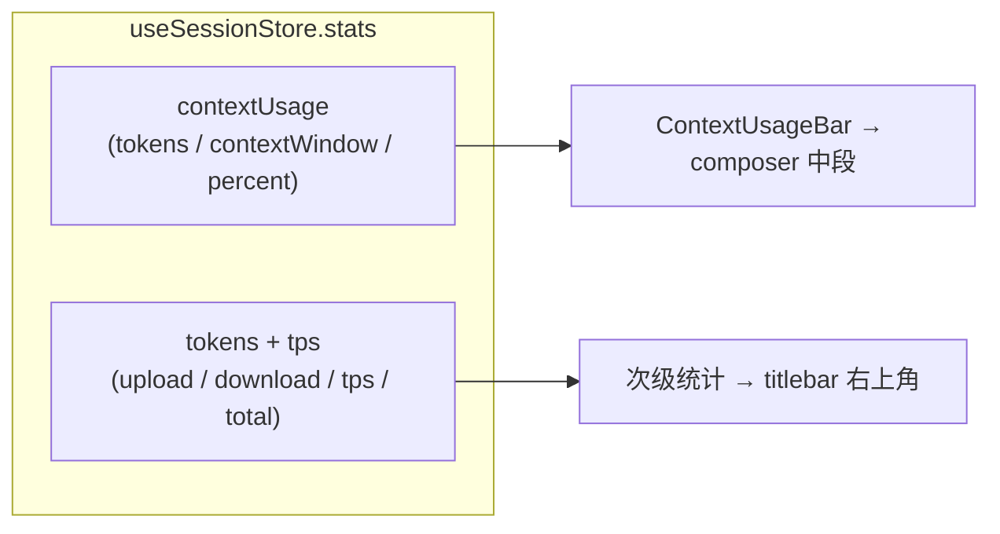
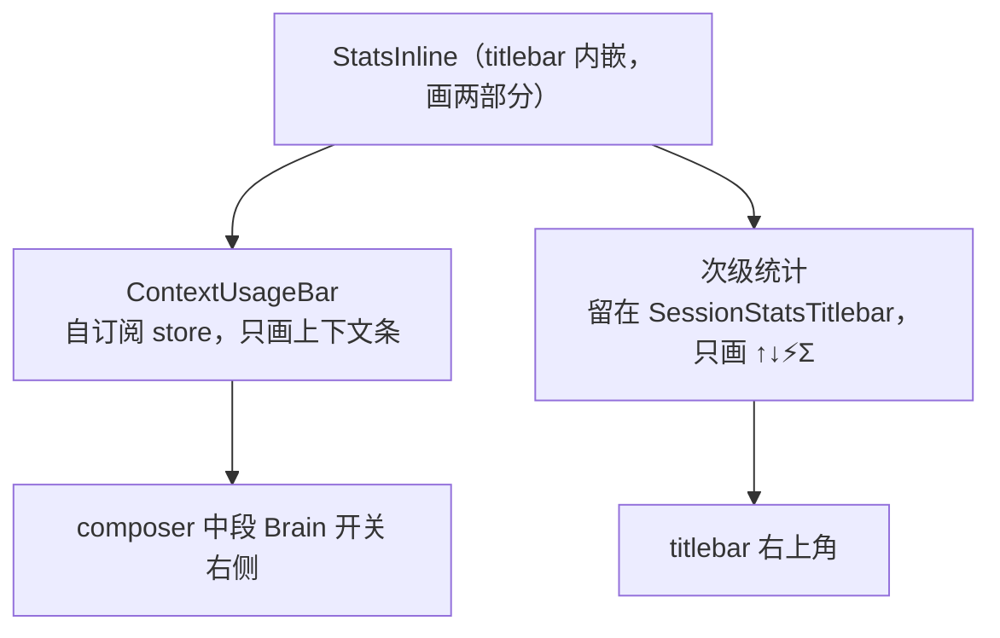

# 上下文统计条迁入 composer

## 1. 问题与背景

### 1.1 现状：统计行整体挂在窗口右上角

titlebar 槽贡献组件 `SessionStatsTitlebar`（`src/plugins/sessions/timeline/renderer/stats-titlebar.tsx`）在窗口右上角渲染一行统计：**上下文比例条**（主视觉，`▬▬▬░░ 72%`）+ **次级统计**（↑上传 / ↓下载 / ⚡TPS / Σ总消耗）。数据经 `useSessionStore` 订阅——main 进程 session-store 的 renderer 侧缓存，双源（文件聚合基线 + 活会话 RPC 真值），store 更新即重渲，组件零拉取、零刷新时机。

### 1.2 诉求：只搬上下文条这一个元素

把上下文比例条这一个元素移到 composer 中段"思考控件"（思考强度 dropdown + Brain 开关）右侧；次级统计留在 titlebar，不删不动。

为什么是输入框而不是别处：上下文占用是典型的"发之前看一眼"的反馈。用户盯着输入框组织下一条 prompt 时，最关心的是"这条还能塞多少上下文"；而 titlebar 在窗口最顶上，视线要跨越整个消息流才能扫到。移到输入框，这个数字出现在动作发生的地方。

### 1.3 目标与非目标

目标：

- 上下文条出现在 composer 中段思考控件右侧，呈现逻辑与迁移前逐条一致（三级诚实态、`>80%` 警告色、窗口 fallback）
- 次级统计留在 titlebar，行为不变
- 组件拆分让"统计组件"与"挂载位置"解耦

非目标：

- 不改数据来源（`useSessionStore.stats` 双源不动）
- 不改统计计算（`resolveContextUsage` 信任序、`estimateContextUsageFromSeq` 文件估算、`toSessionStats` 协议转换，全不动）
- 不动事件总线、不动 `plugin.json`、不新增 i18n key

**Figure 1.1 — 同一份 store 状态，两个组件各自消费**

## 2. 组件拆分

### 2.1 一个组件拆成两个

`StatsInline` 现在同时画两部分，中间用 `·` 分隔。拆分点是**渲染边界**，不是数据边界：拆成 `ContextUsageBar`（自订阅 store，只画上下文条）和次级统计（留在 `SessionStatsTitlebar`，只画 ↑↓⚡Σ）。两个组件订阅同一份 store 状态，各自消费自己关心的字段，互不知道对方存在。

### 2.2 数据通道：store 订阅，不是事件、不是 props

这里要回答一个容易绕弯路的问题：为什么不走事件总线？

事件总线（`packages/react/src/event-bus.ts`）解决的是**插件与插件之间的横向通信**：channel 有声明权属、emit 只能发自己声明过的 channel、`dependsOn` 管生命周期护栏。而 `ContextUsageBar` 和 titlebar 次级统计是**同一个插件（timeline）内部的两个组件**，数据源又是框架共享状态——为"同一个插件内部读共享状态"上事件，等于把 store 里已有的状态再绕一圈事件总线，多一条传播路径、多一处对账点，纯绕路。事件的适用场景是"A 插件发、B 插件收"的跨插件协作，不是"两个组件读同一份框架状态"。

props 传递同样不合适：composer 的既有契约是"纯 UI，数据由调用方传入"（文件头注释：*模型由调用方拉数据传入,composer 是纯 UI,不依赖 session*），但 stats 不是 composer 的业务输入，它是框架状态。组件直接订阅框架状态本就是被允许的通道（CLAUDE.md §8.2「共享 store 只读」：插件可读 `useUiStore` / `useSessionStore` 的框架状态，只读、不调 setter）。硬塞 props 反而让调用方 `timeline/index.tsx` 多传两个与自身无关的参数，还把"位置变更"扩散成"调用方变更"。

结论：`ContextUsageBar` 组件内部 `useSessionStore` 订阅，零 props、零事件。

### 2.3 UI 是 UI、位置是位置

组件不感知自己挂在哪个槽位。`ContextUsageBar` 只声明"我要 `stats.contextUsage` + 模型 contextWindow"，挂 titlebar 还是 composer 由使用处决定——现在 composer 用它，将来别的入口想展示同一数据，import 同一个组件即可，组件代码一行不改。这次拆分的长期价值就在这里：位置变化不再需要改统计组件本身。

**Figure 2.1 — 拆分与落点**

## 3. 上下文条行为规约（迁移零改动）

### 3.1 数据来源

两个订阅：`useSessionStore((s) => s.stats)` 拿统计对象，`useSessionStore((s) => s.snapshot?.state.model?.contextWindow ?? 0)` 拿模型配置窗口做兜底。

窗口取值两级：`contextUsage.contextWindow` 优先（RPC 真值自带窗口）；为 0/缺失时兜底到模型配置窗口——文件基线扫描时文件里没有窗口字段、scanner 恒给 0，必须 fallback，否则历史会话的百分比算不出来。已用 token 取 `contextUsage.tokens`，`null` 即未知。

### 3.2 三级诚实态

迁移前后逐条一致：

- **pi 未起**（`stats` 为 null）→ 整行弱化 `opacity: 0.4`，值显示 `—`
- **tokens 或窗口任一未知**（压缩后待测、窗口未至）→ 比例条空显 + 百分比 `—`，不冒充 0%——与底座 TUI 显示 `?` 而非 `0%` 同一纪律
- **都已知** → 正常渲染条 + 百分比

### 3.3 渲染细节

条宽 48px、高 1、圆角，轨道 `--color-border`；填充色 `pct > 80` 用警告色 `--color-accent-warning`，否则主色 `--color-primary`——上下文快满时颜色先于数字给出预警。百分比 `Math.round` 取整、`min-w-[28px]` 固定位防跳。percent 优先用 `contextUsage.percent`（RPC 真值），缺则 `Math.min(100, used / limit * 100)` 现算并 clamp——超 100 不爆表。

### 3.4 悬停提示

Radix Tooltip，`delayDuration=1000`（原生 title 在 Electron/Chromium 里时延不可控且经常不弹，走成熟包），文案 `shell.contextUsed`（"上下文: {used} / {limit}"）。key 已存在于 timeline 的 shell.json，i18n 零新增。

## 4. composer 集成

### 4.1 插入位置

composer 底部工具栏中段（`flex-1` 弹性区）现行顺序：`[模型▾] [思考强度▾] [🧠 Brain]`。上下文条插在 Brain 开关右侧、`ml-auto` 推右贴向语音/发送按钮——思考控件组靠左、统计靠右，中间由 `ml-auto` 产生的空隙自然隔开，与右段（语音/发送）之间保持既有 gap。

### 4.2 窄窗口

上下文条全长约 76px（48 条 + 28 文字），远小于迁移前 titlebar 整行的宽度；中段模型名已有 `max-w-[160px]` 截断。窄窗口无新增溢出压力，不需要降级逻辑。

### 4.3 零改动面

`plugin.json` 的 titlebar 贡献不动（`SessionStatsTitlebar` 仍在，只是内容缩成次级统计）；i18n 零新增；数据链路（`getStats` / `enrichContextUsage` / `resolveContextUsage` / `readContextProbeTokens`）一行不动。

## 5. 实现影响面

### 5.1 文件改动

- `src/plugins/sessions/timeline/renderer/stats-titlebar.tsx`：`StatsInline` 删掉上下文条部分；`SessionStatsTitlebar` 只渲染次级统计，弱化态保留
- 新建 `src/plugins/sessions/timeline/renderer/hover-tip.tsx`：`HoverTip` + `tipStyle` 从 stats-titlebar 提出共享（上下文条与次级统计都用，避免两份复制）
- 新建 `src/plugins/sessions/timeline/renderer/context-usage-bar.tsx`：`ContextUsageBar` 自订阅 store，上下文条逻辑从 `StatsInline` 原样搬入
- `src/plugins/sessions/timeline/renderer/composer.tsx`：中段 Brain 开关后渲染 `<ContextUsageBar />`
- 零改动：`timeline/renderer/index.tsx`（titlebar re-export 不动）、`plugin.json`、语言资源

### 5.2 验证路径

- 活会话：titlebar 只显示次级统计；composer 思考控件右侧出现上下文条，数值与 RPC 真值一致
- 压缩后（tokens 未知）：composer 上下文条空显 + `—`，不冒充 0%
- pi 未起：上下文条弱化
- 上下文 >80%：条变警告色
- 悬停 1s：tooltip 显示 "上下文: used / limit"

## 6. QA

**Q1：次级统计为什么不一起搬进 composer？**

用户明确保留在 titlebar。两处订阅同一份 store，互不影响；本次只动上下文条这一个元素，次级统计的呈现与位置都不变。

**Q2：为什么不用事件把数字从 titlebar 传到 composer？**

事件总线是插件间横向通信通道（channel 权属、dependsOn 护栏都是为此设计）。这里两个组件在同一插件（timeline）内部、数据源是共享框架状态，事件等于把 store 已有状态绕道事件总线再传一遍——多一条路径、多一处对账，纯绕路。store 订阅（CLAUDE.md §8.2 共享 store 只读）是既有的、被允许的通道。

**Q3：composer 不再"纯 UI"了吗？**

composer 的 props 面不变，业务输入仍由调用方传入；它只是渲染内容里多了一个自订阅 store 的子组件。composer 自身不读 store、不调 ctx，纯 UI 契约未破。

**Q4：上下文条在 composer 里 tooltip 还能用吗？**

能。`ContextUsageBar` 自带 Radix Tooltip（`Tooltip.Provider` 在组件内部或由父级提供，迁移时确认包裹关系即可），与 titlebar 里行为一致。

**Q5：将来想放回 titlebar，或再加一个入口？**

组件不动，使用处改一行。这正是 2.3 的拆分价值——位置变化不再动统计组件。

**Q6：titlebar 空出的位置怎么办？**

titlebar 槽是开放的，`SessionStatsTitlebar` 缩小后右侧空出约 76px，其他插件贡献的 titlebar 按钮不受影响，无需占位。
