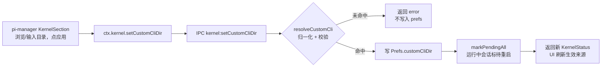
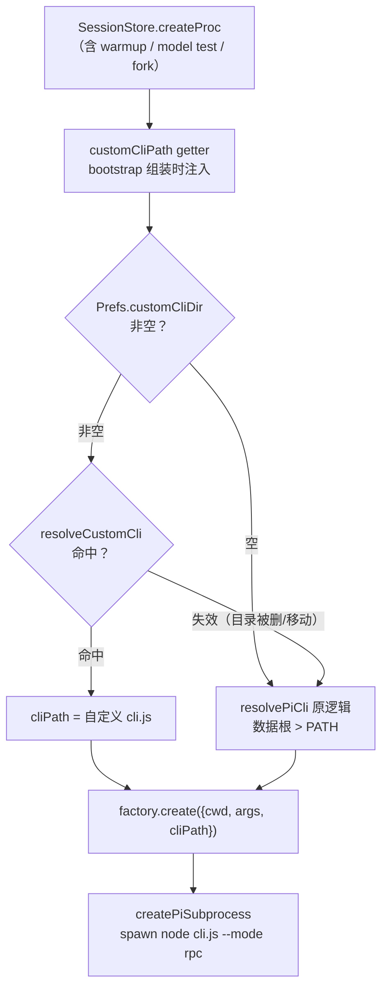

# 自定义 pi 底座路径

pi-desktop 管理的 pi 底座装在数据根（打包态 `~/.pi-desktop/pi`，dev 态 `~/.pi-desktop-dev/pi`），由 pi-manager 插件从 npm registry 拉版本安装。这条路径对"用 pi"的人够用，对"开发 pi"的人不够：手里有一份自己 build 或魔改的 pi-coding-agent，想让桌面壳的会话跑在它上面，现在做不到——底座地址是焊死的常量，不换掉数据根那份就没得选。本文把这个地址从常量变成配置项：定位链从"数据根 > PATH"两级扩成"自定义 > 数据根 > PATH"三级，配置机制进内核，配置 UI 挂在 pi-manager 插件的设置页，oneshot 通道同步切换，运行中的会话标记待重启而不是当场切换。

## 1. 问题

### 1.1 场景：手里有另一份底座，想让桌面壳 spawn 它

三个典型场景，结构是同一个：

- **pi 本体开发者**。改完底座代码，想在桌面壳里实测会话效果——消息流、工具调用、扩展行为，而不是在终端里跑 CLI。现在的选择只有两条：把开发版塞进数据根（污染桌面端管的安装，下次 pi-manager 装版本就覆盖掉），或者放弃桌面壳。

- **底座定制者**。fork 了一份魔改版（换了工具集、改了系统提示、打了私有补丁），想日常用它而不是上游版。这和第一条的区别只是动机，机制需求一样：让壳 spawn 指定位置的底座。

- **测试对照**。想让 blind-review 的几个蓝队跑不同底座版本做 A/B，或者挂一个 mock 底座跑桌面端集成测试。这类场景不要求 UI 多好看，但要求"底座地址"在机制上是可替换的——这是本设计的副产品，不是直接交付物，但机制一旦贯通，它们自然可行。

三个场景的共同答案只有一句："底座在哪"不该只有一个答案。

### 1.2 通用抽象：被管理资源的地址指针可配置

本项目里 pi 底座的定位是被管理的资源，和 git、文件系统同一层抽象（README QA："把它当插件会模糊边界——插件是被内核加载的代码，底座是被内核管理的进程"）。资源有一个共同问题：**它的地址是指针还是常量**。数据根安装把指针焊成了常量——`resolvePiCli()` 只认 `~/.pi-desktop/pi` 这一个地址，装好就是它，没装好回落 PATH。本设计做的事，就是把这个指针从常量变成配置项。

同一抽象在别的系统里有成熟先例：VSCode 的 `typescript.tsdk`（tsserver 在哪）、`python.defaultInterpreterPath`（解释器在哪）。模式一致——平台管资源的 spawn 和生命周期，所以"用哪份资源"的指针必须由平台提供配置机制，扩展只管配置 UI。pi-desktop 同理：内核管底座 spawn，指针机制进内核，UI 进插件。这不是薄壳的失败（"薄壳"是这个项目的设计哲学：内核只含机制——加载器、配置、spawn——不含任何内容，一切 UI 和功能是外挂插件），是"资源管理权在哪，指针机制就在哪"的必然；内核里动的每一行都是机制贯通，没有一个文案、一个颜色值、一条业务分支。

### 1.3 现有机制不够在哪：定位链两级写死，预留口子断在类型层

具体不够的位置可以指到行号，不是笼统的"不够灵活"：

- 底座定位的唯一事实源是 `resolvePiCli()`（`src/client/pi/subprocess-lifecycle.ts:29`）：数据根 `pi/node_modules/@earendil-works/pi-coding-agent/dist/cli.js` 存在就用 `node` 跑它，否则回落 PATH 上的全局 `pi`。两级，写死，纯函数，无配置入口。

- client 层其实预留了替换口子：`PiSubprocessSpawnOptions.cliPath`（`subprocess-lifecycle.ts:17`），且 `PiSubprocessHandle` 构造器已经处理了它的分支（`subprocess-lifecycle.ts:56`——传了就走 `node <cliPath> --mode rpc`）。口子在底层是通的。

- 断点断在类型层：application 层的 `RpcAdapterFactory.create` 的 opts 类型只有 `{ cwd, args, env }`（`src/core/application/sessions/session-store.ts:53`），没有 `cliPath` 字段——`createProc` 想传都没处传。会话进程这条链，从插件到 spawn，配置无立锥之地。

- 第二条 spawn 通道同样焊死：oneshot（`runPiOneshot`，`src/client/pi/pi-oneshot.ts:27`）无参调用 `resolvePiCli()`。这条通道服务 `llm:oneshot` 声明能力（git-review 的 AI commit message、blind-review 的裁判汇总都在用），只修会话链不修它，会话跑自定义底座、oneshot 跑旧底座，行为分裂。

一句话：能力在 client 层已经存在，机制面没有把它暴露出来。本设计主要是贯通，不是新建。

### 1.4 和现有机制的关系：扩展定位链一级，原语义不动

关系是扩展，不是替代，也不是新旧并存各管一摊：

- 定位链从"数据根 > PATH"扩成"自定义 > 数据根 > PATH"。原有两级的语义一字不改——没配自定义时，行为和今天完全一致，这是回退保证。

- 数据根安装机制原样保留。pi-manager 的版本安装照常写数据根，自定义路径只是**在生效顺序上压过它**，不删除、不篡改、不锁定数据根。清掉自定义，一切回到今天。

- 不引入新的资源类型。自定义底座和数据根底座是同一种资源（一份 pi-coding-agent 安装）的两种来源，统一抽象是"底座地址"，自定义是地址的一个新取值，不是并列的第二类东西——同一抽象的不同形态是参数化差异，不该起两个名字并列枚举。

## 2. 机制设计

### 2.1 链路总览

两条流：配置流负责"把指针写进偏好"，spawn 流负责"每次起进程时读指针"。


**图 1 — 配置流：校验不过不写入，写入即标待重启**


**图 2 — spawn 流：每次 createProc 现读指针，新进程天然用新值**

两条流共用一个归一化函数 `resolveCustomCli`（§2.3）——配置流拿它做写入校验，spawn 流拿它做运行时解析，状态展示拿它判有效性。形态判断只有一处，不存在"写入时认的形态"和"运行时认的形态"漂移的可能。

### 2.2 配置存取：Prefs.customCliDir，桌面级，分流白得

配置值是一个目录路径字符串，存进桌面偏好：

- `Prefs` 加字段 `customCliDir: string`（`src/api/ipc/main-context.ts:16`），`DEFAULT_PREFS` 默认 `""`（空串 = 未设置）。electron-store 的 defaults 机制保证老用户的存量 store 读到默认值，无迁移。

- 存储落点是现成的：`prefsStore` 的 cwd 已显式纳入数据根 config 树（`src/bootstrap/index.ts:60`），数据根经 `resolvePiDesktopDir()` 分流——打包态写 `~/.pi-desktop/config/`，dev 态写 `~/.pi-desktop-dev/config/`。于是得到一个白得的好处：**dev 版可以指向自己 build 的底座，稳定版照常走数据根，两份偏好互不污染**。这正是当初做数据根分流想服务的场景之一。

- 语义归属：这是"这台桌面用哪份底座"的偏好，和主题、字号同类——天然桌面级，天然该进 prefs，不进任何项目级配置，也不进底座自己的 settings.json（那是底座的配置，不是壳怎么找底座的配置，两个层次）。

- 为什么不走环境变量（比如 `PI_CLI_PATH`）：环境变量是进程启动时的快照——改一次要重启应用才生效，设置页没法写它（UI 附着点不存在），而且两个版本共享同一套环境，恰恰丢掉分流这个卖点。prefs 持久化、改即生效（新会话）、天然分流，是这个指针唯一对得上的现有机制。

### 2.3 目录归一化：resolveCustomCli 认两种形态

用户指的目录有两种合理形态，归一化函数都认，返回结构一次给全：

- **形态一：包源码根**。`dir/dist/cli.js` 存在——对应自己 clone/build 的 pi-coding-agent 仓库（或任何包含编译产物的包目录）。版本号读 `dir/package.json` 的 `version` 字段。

- **形态二：npm 安装目录**。`dir/node_modules/@earendil-works/pi-coding-agent/dist/cli.js` 存在——对应一份独立的 `npm install @earendil-works/pi-coding-agent` 落点（结构和数据根 `~/.pi-desktop/pi` 相同，意味着把数据根目录本身指给它也成立）。版本号读同目录下包的 `package.json`。

- 两种形态同时命中时取形态一：`dist/cli.js` 紧贴包根的目录更可能是开发 checkout，用户的开发意图优先于目录里嵌套的安装副本。

函数签名与归属：

- `resolveCustomCli(dir): { cliJs: string; version: string | null } | null`，放在 `src/core/application/kernel/kernel-manager.ts`——application 层纯函数，不 spawn、不读环境，只做存在性检查和 JSON 读取，可裸单测。两种形态的判断只此一处，配置流、spawn 流、状态流三方共用（§2.1 末尾的单源约定）。

- 版本读取是宽松的：`cliJs` 命中即算有效，`version` 读不到给 `null`（UI 显示 unknown），不因此判无效。理由：自己 build 的底座可能动过 `package.json`，而"能不能 spawn"的判据是 cli.js 在不在，不是版本号读不读得到。kernel-manager 的既有纪律是读 package.json 不 spawn 探测（`kernel-manager.ts:57` 注释），本设计沿用——不为了拿版本号去跑 `node cli.js --version`，那是把不可信代码请进 main 进程执行。

### 2.4 spawn 贯通：getter 注入 SessionStore，factory opts 扩 cliPath

会话进程这条链的贯通分四步，每步都是类型或组装，没有逻辑分支：

- **接口扩字段**。`RpcAdapterFactory.create` 的 opts 类型加 `cliPath?: string`（`session-store.ts:53`）。bootstrap 里的工厂实现是 `create: (opts) => new RpcAdapter(createPiSubprocess(opts))`（`src/bootstrap/index.ts:100`）——opts 整体透传，类型扩了它自然带上，**bootstrap 这处实现零改动**。

- **SessionStore 构造加 getter**。第四个构造参数 `getCustomCliPath: () => string | undefined`（和第三参 `() => registry.systemPromptPaths()` 同一注入手法），`createProc`（`session-store.ts:231`）里 `this.factory.create({ cwd, args, cliPath: this.getCustomCliPath() })`。每次起进程现读一次——指针的"当前值"永远在 prefs 里，SessionStore 不缓存、不订阅、不感知变更事件，这是图 2 里"新进程天然用新值"的机制来源。`cliPath` 为 `undefined` 时走 `resolvePiSpawn()` 原逻辑，`PiSubprocessHandle` 构造器已有的三元分支（`subprocess-lifecycle.ts:56`）保证这一点。

- **MainContext 加现成 getter**。`MainContext` 加 `customCliPath: () => string | undefined`，bootstrap 组装一次——读 prefs、空串短路、调 `resolveCustomCli` 归一化，命中返回 `cliJs`，未命中返回 `undefined`。SessionStore 的第四参和 kernel IPC（§2.5、§2.6）都消费这一个 getter。"读 prefs + 归一化"的逻辑只有一处，不在 bootstrap 和 IPC handler 各写一遍——同一逻辑多入口各写一遍，正是该收进框架统一承担的判别气味。

- **client 层小收敛**。`PiSubprocessHandle` 的 cliPath 分支和 `runPiOneshot` 即将出现的 cliPath 分支，共享同一份知识（`node` 跑、无 shell、cli.js 作首参）。在 `subprocess-lifecycle.ts` 加一个薄 helper `cliInvocationFromPath(cliPath): { cmd, baseArgs, shell }`，两处调用各自拼模式参数（`--mode rpc` / `--print --no-session --no-tools`），公共部分不留两份。

client 层除此 helper 外零改动——§1.3 说过，`cliPath` 的处理分支早就预留在 `PiSubprocessHandle` 里，这次贯通是让它第一次被真正用到。

### 2.5 oneshot 同步：同一份底座，两条 spawn 通道

oneshot 是插件"一次性问底座"的声明能力（`llm:oneshot`，权限门控在 `src/api/ipc/kernel.ts:60`），落点是 `runPiOneshot`（`pi-oneshot.ts:23`）——技术形态是 spawn 一个一次性进程 `pi --print --no-session --no-tools <prompt>`，拿 stdout 文本即销毁，不落会话文件、不带工具。它必须和会话进程用同一份底座，否则出现分裂：会话里聊的是自定义底座的行为，git-review 生成 commit message、blind-review 裁判汇总时跑的却是数据根底座——同一个桌面里两种底座行为，排查问题时会怀疑人生。

改动两处：

- `PiOneshotOptions` 加 `cliPath?: string`；`runPiOneshot` 内部把无参 `resolvePiCli()` 换成"有 cliPath 用 `cliInvocationFromPath`，没有走 `resolvePiCli()`"——和 §2.4 会话链同一个 helper，同一个分支形状。

- `llm.oneshot` 的 IPC handler 传参从 `{ cwd }` 变成 `{ cwd, cliPath: ctx.customCliPath() }`——MainContext 上那个现成 getter（§2.4），handler 自己不读 prefs、不做归一化。

### 2.6 状态展示：KernelStatus 扩 source 字段，失效回落的标注

设置页要回答两个问题："数据根装了什么"和"当前在跑什么"。这两个答案在自定义生效时是不同的一份，状态模型得分开承载：

- `KernelStatus`（`kernel-manager.ts:31`）扩展为：`currentVersion`（语义微调：**生效**底座的版本）、`installedVersion`（新增：数据根安装版本）、`available`、`source: "custom" | "installed"`（新增：生效来源）、`customCliDir`（新增：当前配置值，空串 = 未设置）、`error`。`source` 是给消费者（UI）读的语义字段——UI 拿它决定"生效来源"行显示什么，不是引擎拿它 switch 行为的分支戳；spawn 行为由配置字段的有无和有效性直接决定（图 2），不看 `source`。

- 新函数 `kernelStatus(installDir, customCliDir)` 替代 `currentVersion(installDir)` 成为 `kernel:status` handler 的实现（`src/api/ipc/kernel.ts:20`）：

  - `customCliDir` 为空：返回数据根状态，`source: "installed"`，`currentVersion === installedVersion`。

  - `customCliDir` 非空且 `resolveCustomCli` 命中：`source: "custom"`，`currentVersion` 取自定义版本（读不到为 `null`，UI 显示 unknown），`installedVersion` 照常给数据根版本——左列"已安装版本"和"生效来源"两行各自有数。

  - `customCliDir` 非空但归一化未命中（写后目录被删/移动，这是运行时失效的唯一来路——写入时校验已经把"明知无效"挡在库外）：`source: "custom"` 保留配置意图，`available` 跟随数据根状态，`error` 标注"自定义底座目录无效，已回落数据根安装"。spawn 侧此时也回落（图 2 的 E 分支走 D），状态和行为说的是同一回事——两边用同一个 `resolveCustomCli`，天然一致。

- 类型贯通到 renderer：preload 的 `kernel.status` 返回类型（`src/api/preload/preload.ts:82`）和 `packages/react` 的 PluginContext kernel 面（`packages/react/src/index.ts:38`）同步扩展。`plugin-context.ts` 里 `kernel: window.pi.kernel` 是直透，类型对了即通，无代码改动。

- 状态的拉取时机：`kernel:status` 由设置页打开和点刷新时拉取（KernelSection 既有模式），所以运行时回落的标注是"打开设置页即见"；不做底座目录的变更监听和主动推送——为一个低频失效场景常驻 fs watcher，不值。

### 2.7 生效语义：新会话生效，运行中会话标 restart pending

指针变更的生效语义一句话：**新 spawn 的进程用新值，已跑的进程不动**。

- 新会话生效是机制的自然产物（§2.4：每次 `createProc` 现读 getter），不需要任何"切换"动作——没有热替换、没有进程迁移这些复杂概念。

- 运行中的会话继续跑在旧底座上，但不能假装没事：用户刚换了底座，会话里跑的却是旧的，这是状态不一致。处理是复用既有机制——`restartCoordinator.markPendingAll`（扩展配置变更时已在用，`src/bootstrap/index.ts:153` 的 `onConfigChanged` 同款），把所有运行中会话标记为"待重启"，由既有的 restart pending UI 呈现，用户自己决定什么时候重启会话。

- `kernel:setCustomCliDir` handler 的完整职责因此是四步原子：校验（`resolveCustomCli`，空串为清除、直接合法）→ 写 prefs → `markPendingAll(sessionStore.getRunningSessionKeys(), reason)` → 返回新 `KernelStatus`。校验不过不写入，返回 error 由 UI 显示。一条 IPC 完成，无中间态。

## 3. 插件侧：pi-manager KernelSection

### 3.1 归宿：挂 KernelSection 不新开插件的理由

功能归宿在 pi-manager 插件设置页的上半区（KernelSection），不新开插件，理由三条：

- 内聚。pi-manager 的职责就是"管 pi 底座所有事"——设置页分上下两区，上区管版本安装，下区管底座配置（`src/plugins/manager/pi-manager/renderer/index.tsx`）。"用哪份底座"和"装哪个版本"是同一件事的两个侧面，分开放反而割裂。

- 交互范式一致。KernelSection 的既有交互就是立即操作型（点安装就执行，不进 configFile 的 dirty/save 框架流），自定义底座的"点应用即生效"是同款（为什么是立即操作型，见 §4.3）。

- 无特权差异不受影响。挂进内置插件不代表这是内置件的特权——机制面（IPC、prefs 字段、spawn 贯通）对任何插件平等开放，第三方插件想做自己的底座管理页，调同一个 `ctx.kernel.setCustomCliDir` 即可。

### 3.2 UI 区块与交互流

在 KernelSection 现有两列 grid（左：版本信息；右：安装/切换版本）之下，加一个全宽区块。低保真线框：

```
┌─────────────────────────────┬───────────────────────────────────┐
│ 已安装版本   0.80.7          │ 安装/切换版本                      │
│ 最新版本     0.81.0 [检查更新]│ ⓘ 自定义底座生效中，安装仅写入数据根 │
│ 状态         有新版本可用     │ [0.81.0 (latest)              ▾]  │
│ 生效来源     自定义           │ [安装此版本]                       │
│              0.81.0          │                                   │
└─────────────────────────────┴───────────────────────────────────┘

┌─ 自定义底座 ────────────────────────────────────────────────────┐
│ 使用指定目录下的 pi 底座（自己 build 或魔改的版本）。              │
│ 识别两种目录：包源码根（含 dist/cli.js）/ npm 安装目录。           │
│ 新会话生效；运行中的会话将标记待重启。                              │
│                                                                 │
│ [ /Users/user/dev/pi-coding-agent           ] [浏览…] [应用] [清除]│
│ ✓ 生效中 — 版本 0.81.0 · 2 个运行中会话已标记待重启               │
└─────────────────────────────────────────────────────────────────┘
```

交互细则：

- **左列新增"生效来源"行**。未设自定义显示"数据根安装"；生效中显示"自定义 + 版本号"（版本读不到显示 unknown）。"已安装版本"行语义不动（数据根版本），两行并存——"装了什么"和"在跑什么"随时对照。

- **覆盖提示**。`source` 为 custom 时，右列顶部显示一行 muted 提示"自定义底座生效中，安装仅写入数据根"——安装功能照常可用（写数据根的语义不变），但这行提示防止"装了版本发现没变化"的困惑。

- **输入行**。输入框初值取 `status.customCliDir`；[浏览…] 调 `ctx.dialog.openDirectory()` 回填；[应用] 仅在输入值不同于生效值时可用；[清除] 仅在已设置时可用，点击直接调 `setCustomCliDir("")` 一步完成（不是"清空输入框再等应用"）。

- **校验与反馈**。前端无 fs 能力，不预检；[应用] 一次 IPC 往返，失败显示原因（"目录无效：未找到 dist/cli.js，也不是 npm 安装目录"），成功刷新状态行并显示"✓ 生效中 — 版本 X · N 个运行中会话已标记待重启"。运行时失效（目录被删）的状态由 `kernelStatus` 的 error 字段透到"生效来源"行显示。

- **i18n**。新增文案进 pi-manager 的 `locales/*/kernel.json`，zh-CN / zh-TW / en / de 四语言同步；插件代码零硬编码字符串（lint 强制）。

### 3.3 选目录不选文件：复用 dialog.openDirectory 的取舍

交互对象是"目录"而不是"cli.js 文件"，理由：

- 能力面现成。插件的 dialog 能力只有 `openDirectory` 和 `openImages`（`packages/react/src/plugin-context.ts:145`），没有选单文件的面。选目录零新机制；选文件要给 dialog 面加一个 `openFile`——那是为这一个需求新开一条内核机制，不值。

- 用户心智是目录。"我的 pi 在哪个目录"是用户能回答的问题；"cli.js 在包内第几层"是内部结构，不该要求用户知道。两种形态的归一化（§2.3）把"指到哪层都算数"的宽容留给机制，把简单留给用户。

代价是放弃了"指一个任意 cli.js 文件"的极端自由（比如单文件拷贝出来的 cli.js）——那种形态没有 package.json、没有依赖树，本来就不是一份能跑的安装，放弃不可惜。

## 4. 关键取舍

### 4.1 桌面级，不做项目级

配置存 prefs（桌面级），不做"每个项目用不同底座"的项目级：

- 场景密度不支持复杂度。项目级的典型画像是"项目 A 用底座 X、项目 B 用底座 Y"——真实用户里只有 pi 本体开发者沾边，而他们已经被数据根分流服务（dev 版指开发底座，稳定版指正式底座，§2.2）。为一个稀薄场景引入"指针也要分层"的语义（项目级覆盖全局级、生效来源要在 UI 上再分一层），复杂度上一档，收益不成比例。

- 机制上并非关门。统一项目级配置通道（`docs/design/unified-project-config.md`）是现成机制，哪天项目级需求真来了，把指针迁到那条通道即可，spawn 贯通（§2.4）不用动——getter 换个数据源的事。

### 4.2 写入从严，运行从宽

失效处理分两段，姿态不同：

- **写入时严**。`setCustomCliDir` 校验不过就不写——prefs 里永远不会躺着一条"明知无效"的值。能进库的只有两类：当时有效的目录，和后来才失效的目录（被删、被移动）。

- **运行时宽**。后一类的处理是自动回落数据根（图 2 的 E→D 分支），可用性优先——底座目录没了不该让桌面端开不了会话。同时 `kernelStatus` 的 error 字段把"已回落"标注出来（§2.6），可见性不缺位。回落不是静默降级，是带标注的保可用。

### 4.3 立即生效型交互，不走 configFile 框架驱动

自定义区块学 KernelSection 的立即操作型，不用框架的 configFile dirty/save 流，理由是操作形状不同：

- configFile 框架驱动适合"字段集合编辑"——下区 ConfigSection 的二十多项底座配置，用户一批改完点一次保存，dirty 追踪、拦截、刷新都是为这种形状造的。

- 自定义底座是"单值 + 校验 + 副作用"：一个目录值，写入前要机制校验，写入后要触发 markPendingAll。dirty/save 流没有校验钩子（保存即写文件，拦不住无效值），也没有副作用钩子（保存后还要干一件事）。塞进框架流要么往框架加特化钩子（污染通用机制），要么把校验和副作用挪到别处（链路断裂）。立即操作型一条 IPC 原子完成四步（§2.7），是对这个形状的正确拟合。

### 4.4 底座扩展不受影响

tool-gate 和 bus-extension 两个壳侧底座扩展，与自定义底座天然兼容。先交代它们是什么：tool-gate 是底座的工具权限过滤扩展（tool-manager 插件的工具过滤靠它生效）；bus-extension 是会话总线扩展（subagent 调度的上行帧经它进出底座进程）。两者都是 TypeScript 文件，由壳在启动时安装到底座的扩展目录：

- 它们的落点是 `~/.pi/agent/extensions/`（`src/client/pi/toolgate-installer.ts:16`、`src/client/pi/bus-extension-installer.ts:13`）——底座标准扩展目录，锚定 homedir，不随数据根分流，更不在任何一份底座安装目录里。

- 底座的 loader 在 spawn 时扫这个标准目录——无论从哪个路径的 cli.js 启动，扫的是同一个 `~/.pi/agent/extensions/`。所以换自定义底座，tool-gate 的权限过滤、bus-extension 的会话总线都照常就位，安装时机（启动序列里先于任何 pi spawn，`src/bootstrap/index.ts:286`）也与底座来源无关。

- 真正的风险在别处：壳与底座之间的 JSONL RPC 契约、`--append-system-prompt` 等 argv 契约，是壳对底座的协议假设，自定义底座如果太旧或魔改掉了这些契约，问题不归"扩展兼容性"管——见 QA。

## 5. 验证计划

机制侧（自动化）：

- `npm run typecheck`：Prefs、KernelStatus、factory opts、PluginContext kernel 面的类型扩展全链路过编译——这次的改动大部分是类型贯通，编译器是第一道也是最有效的一道验证。

- `npm run lint`：插件侧零 warning 门槛（含零硬编码字符串纪律）。

- `resolveCustomCli` 的两种形态、失效、版本缺失各造 fixture 裸单测（application 层纯函数，不需要 mock 环境）。

端到端（`npm run dev` 实测矩阵）：

| 操作 | 预期 |
| --- | --- |
| 未设置时新会话 | 走数据根（进程 argv 的 cli.js 在 `~/.pi-desktop-dev/pi/...`） |
| 设有效自定义目录后新会话 | 走自定义（argv 指向自定义路径）；旧会话进程不受影响 |
| 设置时运行中有会话 | 这些会话被标 restart pending |
| 点清除后新会话 | 回落数据根 |
| 应用一个无效目录 | IPC 拒绝写入，prefs 不变，UI 显示原因 |
| 写入后删掉自定义目录 | 新会话回落数据根；设置页"生效来源"行显示回落标注 |
| 触发一次 oneshot（如 git-review 生成 commit message） | 进程同样走自定义底座 |

## 6. QA

**Q：自定义底座和壳的协议契约（JSONL RPC、`--append-system-prompt` 等 argv）不匹配时会怎样？**

壳对底座有一组协议假设：`--mode rpc` 的 JSONL 消息格式、`--session` / `--append-system-prompt` 等 argv、stdout 上的事件流。自定义底座太旧、或魔改掉了这些契约，失败表现沿既有错误路径呈现——spawn 后 RPC 消息解析失败、或进程直接退出，会话报错，和普通底座崩溃走的是同一条错误路径，不是新错误类。壳不做版本门控（写入时探测"这个底座够不够新"），两个原因：版本号不等于契约兼容（魔改版可以版本号照旧、契约已变）；探测就要执行不可信代码——`node cli.js --version` 意味着在 main 进程跑用户指定的任意 JS，比契约漂移本身更危险。用户对自己指的底座负责；排障第一动作是清掉自定义路径回落数据根，对照确认问题在底座还是在壳。

**Q：目录校验失败的错误消息，为什么不区分"缺 dist/cli.js"和"缺 npm 包结构"两条检查各自的失败原因？**

归一化是"任一命中即有效"，对用户来说这次检查是原子的——他要的答案是一句"这个目录认不认"，不是机制内部两条分支的体检单。拆成两条失败原因（"dist/cli.js 不存在；node_modules/... 下也不存在"）是把实现结构罗列给用户。现在的一条合并消息（"目录无效：未找到 dist/cli.js，也不是 npm 安装目录"）已经把两种合法形态都写进去了，本身就是自助排障指引：用户对照一下就知道自己的目录缺了什么。

**Q：指一个 npm install 写到一半的目录会怎样？**

校验是时点快照，两种坏法各有各的去路。应用那一刻 cli.js 还没落盘：校验拒绝、不写入，无状态残留，装完再来一次即可。更微妙的是 cli.js 恰好落了、依赖树还不全：校验通过、写入，之后 spawn 时 node 报模块缺失、进程退出，沿会话的既有错误路径呈现。这类"写时有效、跑时坏"的窗口机制上不防——防就要深度校验整个依赖树，成本和误判都上不封顶——靠错误可见性兜底，排障姿势同上一条：回落对照。

**Q：自定义生效时，PATH 回退还参与吗？**

不参与。定位链"自定义 > 数据根 > PATH"严格短路：自定义命中就用自定义，后两级不看；只有自定义为空（未设置）或失效（目录被删）时才退回原有两级链。也就是说"装了自定义底座、偶尔还想用 PATH 上的全局 pi"这种混合诉求当前模型表达不了——先清除自定义，PATH 回退才复活。这是刻意的：三级链每级语义单一，"会话用自定义、oneshot 用 PATH"这类混合策略是另一类诉求，真出现时该做成独立配置，而不是污染指针的语义。

**Q：自定义底座太旧，加载不了 tool-gate / bus-extension 扩展怎么办？**

两个扩展是 TypeScript 文件，由底座自己的 loader 在 spawn 时加载（§4.4）。底座太旧、扩展 API 不兼容，失败表现是底座启动日志（stderr）报扩展加载错——壳不替底座的 loader 做兼容判断。分项影响：tool-gate 加载失败，tool-manager 有既有的"过滤不生效"降级提示（`kernel.toolgateAvailable` 探测的就是这个）；bus-extension 加载失败，subagent 调度能力缺失，表现同"扩展未安装"。处置与协议契约失配同：自定义底座的兼容性由用户负责，排障先回落对照。

**Q：dev 版和稳定版指同一个自定义底座目录，会打架吗？**

不会。两份 prefs 各自独立（数据根分流，§2.2），指同一个目录只是两个配置值恰好相同。底座是被只读消费的——壳 spawn 它、经 RPC 驱动它，从不写底座目录；两个版本同时跑、各 spawn 各的进程也互不干扰，底座进程本身就是多实例设计（每个会话一个进程）。

**Q：为什么不做"每个会话单独选底座"？**

贯通链上 cliPath 已经是 per-createProc 现读的参数（§2.4），机制并不反对 per-session；不做的是 UI 和状态模型。指针从"一个全局值"变成"全局默认 + 每会话覆盖"后，`KernelStatus` 要按会话分叉，restart pending 语义也要分叉（换全局值该标哪些会话？），是一档复杂度跃迁。而诉求画像（对照测试，§1.1 场景三）在当前阶段是副产品不是交付物。真到要做时，getter 从读全局 prefs 换成读"会话覆盖 + 全局兜底"，spawn 链不动。
