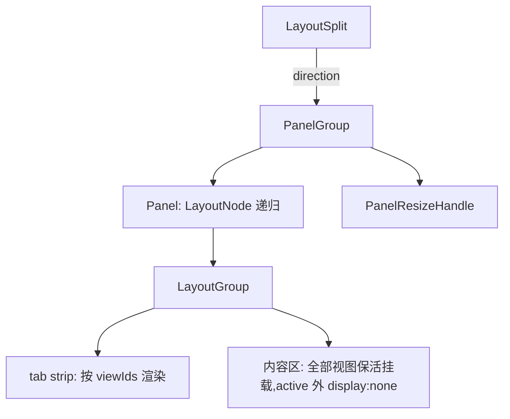
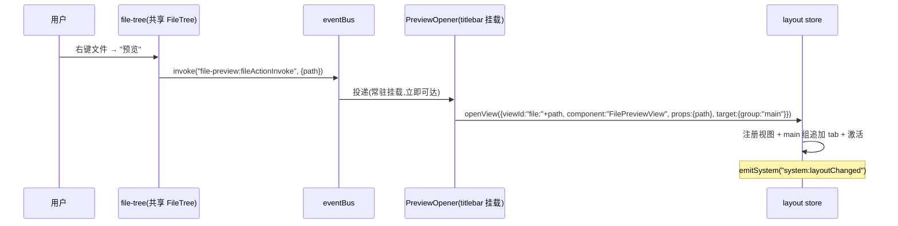

# 动态布局引擎：主页面从硬编码三栏到数据驱动布局树

> 读者前提：本文是 pi-desktop 的单特性设计文档，面向本项目贡献者。槽位契约、PluginContext、事件总线、pluginsNonce 等体系概念见 docs/DESIGN.md；文中引用的文件路径均以仓库根为基准（`src/`、`packages/` 下）。首次出现的体系概念随文给一句话锚点，不展开复述。

## 0 解决什么问题

### 0.1 现在焊死了什么

主页面（`src/api/renderer/index.tsx` 的 `ChatView`）的三栏结构是一段硬编码 JSX：左 `Sidebar`、中 `MainViewHost`、右 `RightPanelContent`，三个 `Panel` 的次序、折叠动画、宽度约束全部写死在壳的入口文件里。槽位契约让**栏里的内容**是插件贡献的，但**栏本身**——有几个区域、怎么排布、能不能多一个——是壳的私有意见，插件碰不到。

- 中区更彻底：`MainViewHost` 查 `mainView` 槽后取 `items[0]` 渲染（`main-view-host.tsx`），赢家通吃。timeline 占着这个位置，任何"另一个主视图"连存在的资格都没有——文件预览、diff 视图这类想和会话流并行的内容形态，在机制上没有落点。
- 面板状态散落在 ui-store 的平铺字段里（`leftPanelOpen` / `rightPanelOpen` / `sidebarWidth`），每个字段都被标题栏、快捷键、设置页多处读写。布局是"一堆互相引用的布尔和数字"，不是"一棵可以整体读写的结构"。

### 0.2 目标形态

文件展示流和会话流并行独立——这是 VSCode/Cursor 这一代工具的主流模型：编辑器区是多 tab、可分屏的视图容器，会话只是其中一个视图，不是整个中区。落到 pi-desktop：

- **视图层动态**：插件可以在运行时往主页面打开一个视图（文件预览是第一个真实消费者），视图是 tab、可关闭、可多开、可和会话流同屏分屏。
- **布局层动态**：区域的排布本身是数据，可被插件改写——布局树可以整体读出、整体替换，用户拖出来的布局可持久化。

### 0.3 通用抽象：布局树 + 视图实例

不造"主区 tab 化""右栏增强""分屏支持"三个并列特性——它们是同一个抽象的三个参数：**页面是一棵布局树，树叶是视图组，组里是视图栈**。现有三栏只是默认布局树的参数化形态，不是特殊结构；sidebar/sidePanel/mainView 三个位置语义槽，是"视图归属的默认 group 映射"，槽位契约本身一字不改。

这个抽象的关系是扩展而非替代：28 个内置插件的 manifest 零改动，它们贡献的槽内容被框架映射进默认树；新能力全部长在树机制上（动态视图、分屏、布局改写），不反向修改任何槽的定义。

## 1 布局模型

### 1.1 LayoutNode：递归 split/group 中性类型

布局树类型进 `core/domain/layout.ts`——纯类型零依赖，换掉 React 它还在：

```ts
type LayoutNode = LayoutSplit | LayoutGroup;

interface LayoutSplit {
  kind: "split";
  id: string;
  direction: "horizontal" | "vertical";
  sizes: number[];        // 百分比,与 children 等长
  children: LayoutNode[]; // 递归:split 里可以再有 split
}

interface LayoutGroup {
  kind: "group";
  id: string;
  viewIds: string[];          // tab 顺序
  activeViewId: string | null;
  hidden?: boolean;           // ⌘B/⌘J 那类显隐,折叠为 0 宽/高
}
```

- 类型递归、不设嵌套深度上限。split 里套 split 是"右半再上下分"这类布局的自然表达，渲染引擎（§2）递归渲染即可；复杂度集中在折叠/拖拽的 imperative 处理（§2.3），不为省那点复杂度把模型砍扁。
- `kind` 字段是判别联合的标签，不是行为开关——引擎对两种节点的渲染本来就不同构，这不是 §1.4 反对的"声明 kind 让引擎 switch 业务行为"。

### 1.2 ViewInstance 与视图注册表

视图是树的叶内容，实例记录同样进 `core/domain/layout.ts`：

```ts
interface ViewInstance {
  viewId: string;    // 打开方给的幂等键,如 "file:/abs/path"
  pluginId: string;  // 组件来源;"shell" 是框架保留前缀(同 system: channel 惯例)
  component: string; // plugin 组件 = module export 名;shell 组件 = 壳内部组件表键
  title: string;     // tab 标题——文案是内容,由打开方给,内核不生成
  icon?: string;
  props?: unknown;   // 可序列化参数,原样传给组件(文件预览就是 {path})
  closable: boolean;
  themeScope?: string; // 主题作用域名;引擎按名查壳的作用域组件表(§2.1),仅槽映射视图携带
}
```

- 视图记录存在布局 store 的注册表（`views: Record<string, ViewInstance>`），树里只放 viewId——树是结构，注册表是内容，改 tab 顺序不动注册表，改视图内容不动树。
- 组件解析按 `pluginId` 分派：`"shell"` 查壳内部组件表（Sidebar、RightPanelContent 这类机制组件），其余查插件模块注册表——plugins-host（`src/api/renderer/plugins-host.ts`）加载插件 module 后按 `(pluginId, exportName)` 从模块 exports 取组件。动态视图**不需要 manifest 声明**——manifest 的 `component` 匹配是静态贡献的校验便利，运行时打开视图直接以模块 export 为准，两层各管各的。实现上 plugins-host 今天只做"按 manifest 匹配注册"，本设计给它加一个职责：加载后留存 module 引用，暴露 `getPluginComponent(pluginId, name)` 同步访问器——插件加载先于任何组件挂载（pluginsReady 渲染闸门），调用时模块必然已在。

### 1.3 默认布局树：现有三栏的映射

默认树就是今天的三栏，一个像素都不变：

```
split "root" horizontal
├─ group "left"   → view "shell:sidebar"   (Sidebar 组件)
├─ group "main"   → view "slot:mainView"   (mainView 槽赢家,即 timeline)
└─ group "right"  → view "shell:sidePanel" (RightPanelContent 组件)
```

- 三个默认组 id（`"left"` / `"main"` / `"right"`）和根 split id（`"root"`）是框架保留常量，定义在 `core/domain/layout.ts`，插件可读不可伪造；`setLayout` 校验、快捷键映射都引用这组常量。shell 视图的 viewId 用 `shell:<名>` 惯例（对应 ViewInstance.pluginId = `"shell"`），槽映射视图用 `slot:<槽名>`——viewId 只是字符串键，这两个前缀惯例是框架自留命名空间，与插件的 viewId 不撞。
- `shell:sidebar` / `shell:sidePanel` 是框架在启动时注册的内建视图，`closable: false`。它们的内容是**现有的槽宿主组件原样包进来**——Sidebar 内部的分组、RightPanelContent 内部的纵向堆叠和尺寸模型 v2（id 键控权重替代 autoSaveId 位置键控，commit 875c0a9；实现在 `right-panel.tsx`）全部原样保留，引擎不管组内的事。
- mainView 槽的映射特殊一点：框架查槽（沿用 `slots.mainView()`——preload 暴露的槽查询 IPC，返回贡献项 `{id, component, pluginId}`），把赢家贡献注册成 main 组的 home 视图（`viewId: "slot:mainView"`,`closable: false`,`themeScope: "timeline"`）。注意这类视图的 `pluginId` 是**贡献插件自己的 id**（timeline），不是 `"shell"`——视图组件经 `PluginIdContext` 拿它调 ctx，解析组件时也按它查模块。pluginsNonce（ui-store 里的插件注册世代号，插件加载/停用/卸载完成时 +1，槽壳靠它重查贡献）变化时重查重注册——语义和今天 MainViewHost 的重查完全一致，只是渲染位置从"唯一视图"变成"main 组的首个 tab"。

### 1.4 视图归属解析：静态贡献与动态视图

两类视图进树的途径不同，但进树之后共享同一 ViewInstance 类型和同一套 tab/保活/关闭语义——机制不认识"这是静态还是动态视图"，只认 ViewInstance。字段取值随来源有别（静态视图 `closable: false`、槽映射视图带 `themeScope`，动态视图默认 `closable: true`），但那是同一张表上的数据差异，不是两种视图种类：

- **静态**：框架启动和 pluginsNonce 变化时，把 shell 内建视图和 mainView 槽赢家放进默认组。这是框架的自举行为，不响应任何插件请求。
- **动态**：插件调 `ctx.layout.openView()`（§3.1），带着 target 指定进哪个组（默认 main）。进树后与静态视图共享 tab 条、保活、关闭语义——机制不认识"这是静态还是动态视图"，只认 ViewInstance。

## 2 布局引擎

### 2.1 递归渲染与组内 tab

引擎组件（`api/renderer/components/layout-engine.tsx`）把树翻译成 `react-resizable-panels`——项目现有依赖，不引新包：



- split 节点：Panel 用**非受控模式**——`sizes` 映射为各 Panel 的 `defaultSize`（初始分配，库内部接管拖拽），`onLayout` 把拖拽结果回写 store（持久化的真相源在 store，Panel 不反向受控）；`setLayout`/split 等结构性变化用 `key` 重挂对应 PanelGroup，新的 `defaultSize` 生效——与今天 ChatView 的 defaultSize + imperative ref 模式同源。`sizes` 是父 split 内的百分比，库会归一化；校验只要求与 children 等长且各项 ≥0。
- hidden 的处理在**父 split 的渲染处**：split 知道 direction，把 hidden 子节点包成 `collapsible` + `collapsedSize={0}` 的 Panel，hidden 变化时 imperative collapse/expand（§2.3）。组自己不知道方向、也不需要知道——它只渲染 tab strip 和内容区。库对折叠 Panel 只做尺寸归零、不条件卸载子树（今天 ChatView 收起左栏 Sidebar 不重挂、右面板内部状态跨收起保留，都是生产实证），保活因此成立；若未来库版本改成折叠即卸载，引擎回退到 `minSize` 趋零 + `visibility:hidden` 的纯 CSS 方案，ViewInstance 层无感。
- group 节点：tab strip 的显示条件是一个确定的布尔表达式——`viewIds.length > 1 || (viewIds.length === 1 && views[viewIds[0]].closable)`。默认三栏各组只有内建视图（不可关闭），条件为假，不显示 tab 条，和今天的界面一致；文件预览开进 main 组后 viewIds 变 2，strip 浮现。条件写在引擎的 group 渲染处，viewIds 变化时随 store 订阅自动重判，没有第二种开关。
- 内容区渲染所有视图、非 active 的 `display:none`（§2.2）。视图组件经 `PluginIdContext.Provider` 注入各自 pluginId。带 `themeScope` 的视图外包一层主题作用域组件：引擎持有一张壳注册的作用域表（`{"timeline": TimelineThemeScope}`——`theme-context.tsx` 里按 timelineThemeId 偏好解析 token 的包装组件，今天 MainViewHost 对 mainView 槽的既有语义），按视图记录上的名字查表包裹。动态视图不带这个字段，不受影响；以后出现第二个作用域，壳往表里加一行，视图记录不用改。

### 2.2 视图保活

切 tab 不卸载组件，只切 `display:none`。原因和今天 `App` 对 chat/settings 用 `visibility` 而非条件渲染相同（`index.tsx` 有实测注释：条件渲染会让 virtuoso 丢滚动位置、流式时间线重挂载代价大）。timeline 有流式消息和滚动位置，文件预览有滚动位置——保活是默认语义，不是某个视图的特权。

保活语义和组的 hidden（§2.3）是两层独立的隐藏，互不抵消：组 hidden 时整个组的 Panel 折叠为 0（组内视图**保持挂载**，流式会话在收起的右面板里照样跑）；组内非 active 视图只是 tab 切换意义上的不可见。右面板收起再展开，里面的 Git review 不用重挂载——今天的 imperative collapse 也是这个语义，迁移后不变。

保活的成本是常驻内存：每个开过的视图都在树上。视图关闭（`closeView`）才真正卸载——关闭语义因此必须便宜，引擎不缓存已关视图的任何状态。

### 2.3 现有三栏行为的迁移

`ChatView` 现有的四组行为逐一映射进新机制，用户习惯零变化：

- **开关与快捷键**：`leftPanelOpen`/`rightPanelOpen` 变成 left/right 组的 `hidden`。标题栏按钮和 ⌘B/⌘J 改调 layout store 的 `setGroupHidden`——ui-store 的两个布尔字段删除，真相源唯一化（这是 §0.1 说的散落状态的收敛）。
- **宽度**：`sidebarWidth`（ui-store + prefs）**保留为跨页共享的左栏宽偏好**——设置页有自己的左栏（settings-page.tsx 读同一字段做宽度），两页宽度同步是既有产品行为，本次不动。桥接策略：树是 chat 页左组宽度的真相源，引擎在 `onLayout` 和折叠恢复时把左组宽度回写 `setSidebarWidth`（等值守卫：值相同不写，防 zustand 同值通知回环）；同时订阅 ui-store 的 sidebarWidth，设置页拖它自己的左栏时引擎同步树的 sizes[0]。右组没有共享宽度偏好，初始 26%（今天的 defaultSize），之后走树的持久化。`leftPanelOpen`/`rightPanelOpen` 只在 chat 页有意义：字段从 ui-store 删除，prefs 键留作死键（不物理删，零迁移代码），首次启动无 `layout` 存档时读一次推导默认树。
- **折叠动画**：现有的 `panel-collapse-anim` 过渡只在点开关时挂、拖拽时不挂（1:1 跟手），引擎按组保留这个策略——`hidden` 变化时挂 transition，`onLayout` 拖拽路径不挂。动画标志从 ChatView 的全局单例变成**按组 id 键控的独立标志**——两组可以同时折叠动画互不干扰，拖拽任一 handle 不受兄弟组动画影响。
- **右面板内部**：RightPanelContent 是自包含组件（纵向 PanelGroup、尺寸模型 v2、关闭动画全套），作为 `shell:sidePanel` 视图的内容原样渲染，引擎不碰它的内部状态。SidePanelStrip 见 §2.4。

### 2.4 SidePanelStrip 的位置

右侧图标条（sidePanel tab 的开关列）**留在布局树外**，位置不变。它是"重新展开右组"的入口——右组 hidden 时它必须可见，放进树里会随组一起折叠掉。今天的结构（PanelGroup 外、窗口最右）就是这个语义的表达，不动。

它和 §2.1 的 group tab strip 是两种东西：SidePanelStrip 开关的是 **sidePanel 槽内部的页签**（文件树/Git review/盲审这些 sidePanel 贡献，在 RightPanelContent 内部纵向堆叠，激活态存 ui-store 的 `activeSidePanelTabs`）；group tab strip 切的是**布局组里的视图**（timeline、文件预览这层）。两套 tab 各管一层，长期看可以统一进组 chrome，但那是第二个消费者出现时再做的收敛——v1 显式不做。

## 3 ctx.layout API

### 3.1 视图管理

插件经 `usePluginContext().layout` 拿 API,pluginId 由框架注入（同 `ctx.fs` 的惯例）。视图管理三件套：

```ts
openView: (req: OpenViewRequest) => void;
closeView: (viewId: string) => void;
activateView: (viewId: string) => void;

interface OpenViewRequest {
  viewId: string;
  component: string;
  title: string;
  icon?: string;
  props?: unknown;
  closable?: boolean;  // 动态视图默认 true
  target?: { group: string } | { split: { of: string; direction: "horizontal" | "vertical"; ratio?: number } };
}
```

- **viewId 幂等**：`openView` 的 viewId 已存在时不新建，激活已有视图（可选更新 title/props）。文件预览用 `file:{path}` 作 viewId，重复预览同一文件等于激活——VSCode 的单例 tab 语义，不需要插件自己查重。
- **组件只能来自调用方自己的模块**：`component` 经 §1.2 的 `(pluginId, exportName)` 解析时，pluginId 就是框架注入的调用方 id——插件开不了别的插件的组件做视图。跨插件视图（A 插件开 B 插件的渲染）v1 不支持，也没有消费者；真有需求时走事件让 B 自己 openView。
- 实现路径一句话：`ctx.layout` 的方法体直接 import 并调用 layout store 的 actions——renderer 同进程，与 `useUiStore` 的可达性相同，不经过 IPC、不经过事件总线。布局是窗口的本地状态，main 进程不需要知道。
- **target 缺省进 main 组**；`split` 形态的树变换是确定的：`of` 指向的组**保留自己的 id 和全部内容**，新组拿到框架生成的新 id，视图进新组。若 `of` 组的父 split 与请求的 direction 相同，新组直接插进父 split、紧跟 `of` 组之后，`of` 的尺寸份额按 `ratio` 拆分（默认 0.5 对半）——连续"向右分"自然摊平成一排，不产生退化嵌套；方向不同（或 `of` 是根直子）则把 `of` 组原位替换成一个新 split 节点（框架生成 id），children 为 `[原组, 新组]`。分屏因此不是独立 API，是 openView 的一个 target 参数；方向交替的连续 split 生成 §1.1 的嵌套树。

### 3.2 布局编辑

布局层动态的三个原语：

- `moveView(viewId, targetGroupId, index?)`——视图跨组移动，拖 tab 到另一组的程序化表达。
- `setLayout(tree)`——整体替换布局树。这是布局插件的入口：一个"布局管理"插件可以读出当前树、改、写回。store 接收前做形态校验（split 的 sizes 与 children 等长且数量 ≥2、group 的 viewIds 都有注册、树根是 id 为 `"root"` 的 split——保留常量见 §1.3），不合法的树直接抛错，不做静默修复——坏布局宁可报错也不猜。替换生效后，注册表里不再被新树引用的视图按 `closeView` 语义卸载——注册表不攒孤儿。
- `getLayout(): LayoutNode`——读当前树。配合 `system:layoutChanged` 订阅（§3.3），布局插件可以做出实时反映布局的面板。

### 3.3 事件

树或视图注册表任何变化后，store 经 `eventBus.emitSystem("system:layoutChanged", {})` 发通知——空 payload 纯信号（同 `system:settingsChanged` 的语义），消费者自己 `getLayout()` 重读。插件订阅系统事件免 dependsOn，框架保留 emit 权，走 `emitSystem` 现有通道。

## 4 状态与持久化

### 4.1 layout store

新 store（`api/renderer/stores/layout-store.ts`,zustand，与 ui-store 同级）：

- 状态：`tree: LayoutNode`、`views: Record<string, ViewInstance>`。
- actions：`openView/closeView/activateView/moveView/setGroupHidden/updateSizes/setLayout`，以及内部用的 `registerShellViews/syncMainViewSlot`。
- 插件侧只读：经 `packages/react` re-export 的 `useLayoutStore`——与 `useUiStore` 同一形态：导出的就是原 store，"只读"是契约纪律不是技术强制（插件能调 setter 但不该调，写能力正式入口只有 `ctx.layout`）。

### 4.2 持久化边界

持久化什么、不持久化什么，按"重启后什么东西还有意义"划：

- **持久化**：树的结构（split/group 骨架）、sizes、hidden、各组内 shell 视图与槽映射视图的次序（持久化的 viewIds 只含框架种子视图——动态视图根本不进存档，这就是 ③ 的判定依据）。写到 `general-config.json` 的 `layout` 键（`config-file.ts` 的通用 JSON 读写 + `withDirLock` 锁；`sidePanelOrder` 是同一文件里的另一个键——两个写方各写各的 key、`configFile.set` 走 deep merge、锁串行化，互不覆盖）。
- **不持久化**：动态视图实例。重启后所有动态视图消失，只剩默认树。原因：视图记录引用插件组件，重启后插件加载是异步的，恢复视图意味着处理"组件还没注册"的悬挂窗口；更糟的是插件已被卸载，恢复出一个永远的"未注册"占位。VSCode 做的是恢复（它连编辑器内容模型都有），我们没有内容模型层，v1 不背这个复杂度。
- rehydrate 的处理管线是固定五步，顺序有意义：① JSON 解析失败 → 整个回退默认树；② 形态校验（与 `setLayout` 同一个校验器）失败 → 整个回退默认树；③ **修剪空组**——`viewIds` 为空的组直接删除（动态视图不持久化，纯动态组重启后必然命中；判定就是列表为空，不猜视图类型），其尺寸份额并入前一个兄弟（没有前者则并入后一个）；④ **拍扁单子 split**——修剪后只剩一个孩子的 split 节点被其孩子取代，递归到树稳定；⑤ 根 split 孩子数 <2 → 整个回退默认树（`setLayout` 换过自定义树的存档经 ③④ 后可能只剩空根，此处兜底）。只含 shell/槽映射视图的用户分屏（比如把 sidePanel 挪到 main 右边单独一组）在 ③ 中不命中删除条件，照常存活。
- 推论：默认三组（`"left"` / `"main"` / `"right"`）的骨架是地板，修剪和拍扁都不动它们。

### 4.3 插件生命周期的视图清理

pluginsNonce 变化（插件停用/卸载/安装）时，store 做一次清扫：

- 动态视图里 `pluginId` 已不在已加载插件集合的，全部 `closeView`——组件没了的视图不许残留。清扫有个竞态护栏：引擎跟踪拖拽手势（`PanelResizeHandle` 的 `onDragging`），拖拽进行中不清扫——正在拖的 Panel 子树被卸载会让库的拖拽状态悬空；清扫延迟到手势结束的下一帧执行。
- mainView 槽映射视图重查重注册（§1.3）；槽赢家消失（timeline 被删）时 main 组剩空壳，渲染现有的"mainView 槽无贡献"回退文案——这个 key 已在壳的 i18n 里，行为与今天删 timeline 一致。

## 5 file-preview：第一个消费者

### 5.1 打开链路



- **入口**：`contributes.fileActions` 声明 `{id: "previewFile", icon: "eye", when: {target: "file"}}`——文件树右键菜单的第二项（盲审是第一项）。路由是框架既有机制：消费方（file-tree 插件渲染的共享 `FileTree` 组件，`packages/react` 的 widgets/file-tree）查 fileActions 槽渲染菜单，触发时按 `<pluginId>:fileActionInvoke` 约定频道 invoke（`packages/react/src/file-actions.ts`）——file-preview 因此不需要 file-tree 做任何配合，file-tree 零改动。
- **常驻挂载点**：invoke 需要已挂载的订阅者，`FilePreviewView` 未打开时不存在——所以插件贡献一个 titlebar 项 `PreviewOpener`（形状 `{id, component, order}`，同 debug-bar），渲染 `null`，职责只有订阅 invoke 并转发 `openView`。这是插件需要常驻生命周期宿主的 pragmatic 形态；"后台宿主"要不要成为正式的贡献形态，等第二个有同样需求的插件出现时再收敛，v1 不预设。
- **视图组件**：`FilePreviewView({ path })` 由引擎挂载、经 `PluginIdContext` 拿 pluginId，`ctx.fs.readFile(path)` 读内容渲染。它不需要在 manifest 声明——openView 直接以 module export 名为准（§1.2）。

### 5.2 能力边界

- `ctx.fs.readFile` 是 utf8 文本、1MB 上限、路径圈禁项目根（`client/fs/fs-ops.ts` 的 `readTextFile`）——文本/代码/markdown 直接渲染，超限时显示大小信息 + "用系统应用打开"（`ctx.openFile`）。
- 二进制（图片等）没有读取通道，v1 同样走"系统应用打开"兜底。内核加 `fs.readFileDataUrl` 是后续独立的机制增强，不属于本文范围。
- 权限：`fs:project` 声明进 manifest；组件挂载在 main 组，与 file-tree 的权限模型一致，无新增安全面。

## 6 兼容与迁移

### 6.1 插件零改动

28 个内置插件的 manifest、组件、ctx 用法全部不动。sidebar/sidePanel/mainView/settings/themes/languages/fileActions/titlebar/messageRenderers 九个槽的契约和查询通道原样保留——布局引擎改变的是**槽宿主在页面里的排布方式**，不是槽本身。第三方插件按同一契约工作，且从今天起多一个能力：openView。

### 6.2 settings 覆盖层不进树

`activeView` 的 chat/settings 二态保留在布局树之外：settings 是整页覆盖层，挂在 `App` 里与 ChatView 同级（visibility 切换），盖在整个布局引擎上方——引擎替换的只是 ChatView 的正文区（§6.3），`App` 的覆盖层结构不动。设置页不是"一个视图"——它是框架级的模态层，这个区分和今天一致。

### 6.3 旧代码的去处

- `MainViewHost` 被引擎取代，其"查槽 + 无贡献回退 + TimelineThemeScope"三段逻辑分别迁到 layout-init（注册）、引擎回退渲染、视图记录 themeScope。
- `ChatView` 的三栏 JSX 删除，替换为 `<LayoutEngine />`；面板 refs、折叠动画、宽度同步命令式代码迁移进引擎组件。
- ui-store 删 `leftPanelOpen`/`rightPanelOpen` 字段及 setter（`sidebarWidth` 保留为迁移初值来源，树接管后停写）。标题栏和快捷键改调 layout store。

## 7 QA

**Q：`setLayout` 整体换树，视图组件的本地状态（滚动位置、输入到一半的表单）会怎么样？**

随旧树卸载丢失——`setLayout` 的语义就是"按新树重建"，不被新树引用的视图按 `closeView` 卸载（§3.2）。插件有跨布局保留状态的需求时，正解是把关键状态放进 `props` 并经 `openView` 的幂等更新回传（viewId 不变、props 更新），而不是指望组件实例永生。这是视图模型的固有边界，不是 bug。

**Q：split 无限嵌套，用户或插件搞出一棵十层深的树把界面切碎怎么办？**

机制不设深度上限（§1.1），但引擎给每个组设一个最小尺寸常量（react-resizable-panels 的 Panel `minSize`，引擎实现时定为 10% 量级，不进 domain 类型），切碎到不可用的程度物理上分不下去。`setLayout` 的校验保证树合法；合法的树哪怕丑，也是用户/插件自己拖出来的，`setLayout` 回默认树一键复原。布局管理插件出现后，"重置布局"是它的第一个按钮。

**Q：动态视图不持久化，那重开 app 后主区剩一个空 split 算什么？**

不算问题，是 §4.2 rehydrate 管线的职责：修剪空组 + 拍扁单子 split，用户看到的永远是干净的默认三栏或只含 shell/槽映射视图的存活布局。

**Q：插件在视图还开着的时候被卸载，画面会怎样？**

不会走到那一步。pluginsNonce 变化触发 §4.3 清扫，该插件的动态视图先被 closeView 卸载，再轮到插件模块摘除。顺序由框架保证——清扫发生在同一渲染周期内，用户看到的是 tab 消失，不是报错。

**Q：`setLayout` 把 left/right 组删了，⌘B/⌘J 和标题栏按钮去操作一个不存在的组怎么办？**

`setGroupHidden` 对不存在的组是 no-op（查表找不到就返回）。布局编辑是显式能力，删掉默认组的布局是操作者的意图；快捷键失效但不出错。默认组 id（"left"/"main"/"right"）是框架保留常量，插件可读不可伪造——openView 的 target 引用不存在的组时抛错。

**Q：两个插件同时 openView 同一个 viewId，谁赢？**

先注册者赢，后到者的 openView 退化为 activate（§3.1 幂等语义）。viewId 的命名责任在插件——惯例是带自己 pluginId 前缀（`file-preview` 用 `file:` 前缀的路径天然唯一）。框架不做 viewId 命名空间强制，和 channel 命名的 `{pluginId}:` 惯例同级处理。

**Q：timeline 被 closeView 关了怎么办？会话还能用吗？**

关不掉。mainView 槽映射视图的 `closable: false`，tab strip 不给它渲染关闭钮，`closeView` 对不可关闭视图抛错。会话流是 home，这是产品语义不是技术限制。

**Q：文件预览打开的文件被外部修改了，视图会刷新吗？**

不会。`FilePreviewView` 是快照语义，打开时读一次。tab 上提供刷新按钮重读。文件监听（chokidar 那类）是会话扫描已有能力，但给每个预览视图挂 watcher 的收益不抵复杂度——需要新鲜内容时点刷新，这是 v1 的显式边界。

**Q：引擎递归渲染嵌套 PanelGroup，react-resizable-panels 撑得住吗？**

库本身支持嵌套（官方文档的嵌套示例就是 PanelGroup 里套 PanelGroup），right-panel.tsx 的纵向组套在 index.tsx 的横向组里已是生产中的嵌套实例。真正的风险在 resize 的 imperative 处理（§2.3 折叠动画与拖拽不挂 transition 的策略）在多层嵌套下的组合——实现时以三层为限做手测，超过三层的嵌套布局属于布局插件时代的场景，届时再补验证。
