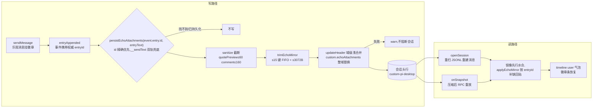

# echo 徽章持久化设计

review 插件让用户选中会话流里的片段写评论，评论在用户下一次发送时随正文一次性发出；发出后那条用户气泡下方挂一排只读徽章：编号 + ❝引文快照 + 意见（机制详见 `docs/design/review-plugin.md` §2.4 的 echo/send 双形态——发给模型的是拼装全文，气泡下方显示的是结构化附件徽章）。这个徽章切一次会话就丢，本文解决它的持久化。

先说结论：徽章元数据随会话头行走——头行 `custom-pi-desktop` 开一个 `echoAttachments` 域，键是消息落盘后的权威 entryId，值是徽章数组；基线替换（打开会话重扫文件、压缩后 resync）时按 entryId 回贴。头行命名空间的写读链路（`docs/design/session-header-custom.md`）原样复用、零改动，本文改动收敛在 renderer 侧会话投影 store 一个文件。

## 1. 问题：评论徽章切会话即丢

### 1.1 现象：渲染对的，丢得也干脆

发送一条带评论的消息后，气泡下方立刻出现徽章条——`① ❝bus pong（re → emmm`——渲染、编号、跳原文全部正常。切到别的会话，再切回来：徽章没了。气泡里只剩一大段裸文本，`❝bus pong（re 我的意见: emmm…` 混在正文里，就是"降级为完整发送文本"的实际长相。

用户体感是"这个功能垃圾"：评论发出去时明明收到了漂亮的结构化展示，回头看就剩一坨。会话内的三道水合（`messageStart`/`messageEnd`/`entryAppended`，机制见 §1.2）都保住了徽章，偏偏最常用的动作——切会话——一条保险都没搭上。

### 1.2 根因：徽章是从未落盘的内存态

三层原因叠在一起，缺一不可。先交代两个本文件的既有概念，后文直接用：**乐观消息**是发送瞬间 renderer 本地插入的消息（id 是临时 uuid，等底座回执）；**水合**是底座回放/落盘回执到达后，`applyEvent` 用双键匹配认亲——拿事件里回放/落盘的消息全文，与乐观消息的正文 content 或实发全文 `__sendText` 之一精确相等即命中——再把权威字段（含权威 entryId）贴回乐观消息。

- **echoAttachments 是发送方挂在乐观消息上的纯渲染态**。`sendMessage(cwd, text, { sendSuffix, echoAttachments })` 里，`appendOptimisticUser` 把它挂进 renderer 内存的消息对象——正文是用户敲的，徽章是结构化附件，两者分开渲染。这个字段不进底座、不进 JSONL。

- **三道水合只保同会话的事件增量**。`applyEvent` 里 `messageStart` 回放合并、`messageEnd` 终态合并、`entryAppended` 落盘水合，三处都显式保留 `echoAttachments`——这是"双形态去重"根因修复的既有成果（同会话内底座回放/落盘回执不把乐观消息的徽章冲掉）。它们保的是**同一份内存数组上的消息**，保不了**数组本身被换掉**。

- **切会话走的是基线替换**。`openSession` 让 main 进程重扫 JSONL、`set({ messages: detail.messages })` 整表替换；压缩后的 `sync` 同理（`onSnapshot` 里 `messages: snapshot.messages`，RPC 重放重建）。两条路重建出来的 `NeutralMessage` 来自文件条目/RPC 重放，里头只有拼装后的全文。徽章元数据从未落过盘，整表替换即永久丢失。

一句话：**有保鲜机制，但保鲜范围只在同一份内存数组内；基线替换换的是数组本身。** 这不是渲染 bug，是"渲染态与持久态分层"的经典缺口——发送时只把徽章存在了内存层。

### 1.3 为什么不是从拼装文本反解

最直接的免持久化候选：重扫后拿到全文（正文 + 评论拼装片段），把徽章从文本里解析回来。否掉两个理由：

- **拼装格式是用户可配的**。review 设置页允许自定义 `promptHeader`/`itemTemplate`，占位符 `{seq}/{quote}/{comment}` 顺序任意——解析器要逆着用户配置的模板做正则，配置一改解析即碎。格式是内容，内容不该被机制依赖。
- **就算格式固定，反解也是"翻译层"**——把结构化数据压成文本再解析回来，多走一步就多一个漂移源（消费而非翻译：该存结构化数据的地方就存结构化数据）。文件里已经有正文，徽章是它的展示元数据，不是正文的推导结果。

### 1.4 为什么不是内存缓存

评审时最先被提的方案：renderer 内存里挂一个 `Map<sessionPath, badges>`，切会话回来时从缓存回贴。被需求方明确否决，否决理由记在这里防回退：

- **需求基准是"切会话、重启、压缩 resync 都不丢"**。内存缓存只覆盖同一次运行内的切会话——重启、崩溃、强退全丢。用户报告的痛点场景（切回来没了）只是最容易复现的那个，不是需求的全部。
- **内存版并不比落盘版省**。写读两端的装配结构（按 sessionPath 的镜像 Map）两种方案完全相同；落盘版只多一次 fire-and-forget 的头行域写。代价几乎相等，持久性严格更优——选弱的那个没有理由。

### 1.5 为什么不是全局配置

另一个候选：进 `~/.pi-desktop/` 下的插件配置。否掉的理由是数据归属判据（`docs/design/session-header-custom.md` §1.1 原话）：会话级数据与会话同生共死——会话在，徽章在；会话删了，徽章跟着没；会话文件被 fork/复制走，徽章跟着走。进全局配置就全反了：删会话留孤儿数据、fork 副本丢徽章、换项目目录丢徽章。徽章是"这条消息上发生过什么"的元数据，该跟着会话文件走。

## 2. 设计：头行 echoAttachments 域

### 2.1 存哪：现成的头行开放命名空间

会话 JSONL 头行的 `custom-pi-desktop` 是桌面侧私有命名空间，底座不感知（`docs/design/session-header-custom.md` §2.1）。合并语义是**域级浅合并**：`updateHeader(path, { custom: { echoAttachments: {...} } })` 只动 `custom` 里 `echoAttachments` 这一个 key（兄弟域 model/subagent 等原样保留），而这个 key 的值是**整域替换**——调用方持全量镜像写入，锁内读-改-写天然原子（同文 §2.2/§2.3，锁是 config-file 的 `withDirLock` 目录锁原语）。读取侧 `readSession` 已透传到 `SessionInfo.custom`——打开会话时随基线一把拿到，零额外 IPC。

为什么不是往 JSONL body 追加一条自定义条目——这是头行机制设计文档已经回答过的问题（`session-header-custom.md` §4 的三个 custom 分工）：头行是"这个会话的属性"元数据锚点，body 的 `type:"custom"` 条目是扩展运行时快照的隐藏通道（圆心映射为 null、永不进时间线），`type:"custom_message"` 是要显示的内容。徽章是"这条消息的属性"——元数据归头行。body 条目还多两个工程问题：读取要全文扫描才能凑齐所有徽章（头行 `split("\n")[0]` 一行定位），compaction 重写 body 时自定义条目的存活没有保证。

这套机制完全现成：写入分支、目录锁、透传、活跃会话分流都在，本文是它的第二个租户（第一个是 model 域）。**链路零改动**——`updateHeader` 的 IPC → main 锁内读-改-写 → 落盘是既有机制，本文只动 renderer 侧的写读两端装配，全部代码改动收敛在 `src/api/renderer/stores/session-store.ts` 一个文件。

域名归属按头行设计文档 §2.1 的规则走 desktop 功能域命名：`echoAttachments`——写入方是 renderer 会话投影 store（desktop 模块），不是某个插件。review 插件只是徽章数据的生产者之一，将来任何插件走 `sendMessage` 的 `echoAttachments` 参数发徽章，持久化自动生效——机制在框架层，不绑 review。

### 2.2 键：权威 entryId，且恒等于落盘事件的那个

值形 `{ [entryId]: EchoAttachment[] }`。键必须是**消息落盘后的权威 entryId**（JSONL 行级 id，水合后赋给消息），而不是别的候选：

- **否掉消息全文**：同一段文本发两次会撞键（重试、复制重发是真实场景）；而且全文作键意味着头行要存整段发送文本，8KB 预算直接爆。
- **否掉发送序/行号**：JSONL 是 append-only，行号在 compaction 后会漂移；entryId 是行自带的稳定 id，重扫逐字复现。
- **乐观期的临时 uuid 永不成键**。持久化的键不从消息对象上取，而是取触发事件本身的 entry id（`entryAppended` 事件的 `entry.id`，即刚落盘那行的权威 id）——临时 uuid 与任何落盘 entry id 都不相等，物理上不可能被写进头行。消息定位用两段制（与水合同一套对齐键）：先按 id 精确找，找不到再按 `__sendText`/正文双轨兜底（§2.4）。

按 id 回贴精确零歧义：打开会话重扫出的每条消息都带 entryId（圆心 `sessionEntryToNeutral` 从 JSONL 行提升），查表即得。

### 2.3 值形与预算：echo 正文 + 徽章 + 双闸

持久化的值形是 `{ echo, items }`——除了徽章数组，**发送时的显示态正文也必须落盘**：

- **为什么连正文也存**：重扫后消息的 `content` 是发给模型的合并全文（正文 + 评论拼装片段），气泡直接渲会把 `--- > 评论 > ① : …` 这坨拼装原文裸露给用户（首发版就栽在这——徽章回来了，拼装文本也回来了）。拼装格式用户可配、不可反解析（§1.3），所以从合并全文里"剥掉"片段没有可靠做法——显示态正文（echo）只能随徽章一起存，回贴时整体换回来。至此展示完全文件驱动：正文来自 `echo`，徽章来自 `items`，与内存无关。
- **items 只留最小字段**：`{ seq, quotePreview, comment }`——`messageId`（引文锚点）不落盘，因为恢复出来的徽章没有交互场景（篮子已清，编辑/跳原文都是发送前的动作；§4.5）。截断规则：`quotePreview ≤ 60`、`comment ≤ 160`——徽章本就是预览，生产侧本来就有截断（`truncate(quote, 60)`）。echo 不截断——它是正文，截了就是数据损坏；长度压力交给下面的双闸。

头行有 8KB 共享热读预算（`session-header-custom.md` §2.4：`readSessionToolConfig` 和 tool-gate 底座扩展都按 8KB 窗口读头行，撑爆会让两条 toolConfig 读取链静默失效）。徽章域是头行里最"敢长"的域（每条带徽章的消息一个键），必须自带闸。注意计数单位是**键数**（一条消息一个 entryId 键，值里可以有多枚徽章），不是徽章枚数：

- **条数闸**：最多保留最近 15 个键（FIFO 淘汰最旧）。15 键 × 每键约 150B 实测（真实条目 `b7cd9ad8`、两条评论，payload 257B）≈ 2KB 量级，给 model/subagent 等域留足余量。
- **序列化闸**：`JSON.stringify` 结果 ≤ 3072B，超了继续淘汰最旧直到达标（至少保留一个键）。评论文本长度不受用户控制，条数闸防不住极端长评论，序列化闸兜底。

实测对照：拿现有会话（`~/.pi/agent/sessions/` 下底座按 cwd 编码的桶目录 `--Users-user-self-pi-desktop--/2026-08-06T06-58-16…jsonl`）的第 8 条 entry（`b7cd9ad8`，两条评论）构造持久化 payload，257 字节——预算完全够。

### 2.4 写入时机：entryAppended 水合后，只写刚水合的那条

持久化只有一个触发点：`entryAppended` 事件——某条条目落盘、权威 entryId 到达的那一刻。消息定位是**两段制**（与 `applyEvent` 水合同一套对齐键）：

- **① id 精确**：消息 `id === event.entry.id` 即命中——水合已完成的路径。
- **② 内容兜底**：倒序取最近一条 `__sendText`（或正文）与 entry 全文相等的 user 消息。为什么必须有②：底座的真实事件序是 `message_end` 先于 `entry_appended`（底座源码里 `appendMessage` 就在 `message_end` 的处理分支内，落盘后紧接着才 emit `entry_appended`）——`messageEnd(user)` 会把乐观消息转正（`__optimistic: false`）但保留乐观期临时 uuid，消息从此不再 anchorable，`applyEvent` 的 id 水合**必然失败**（锚不上，走既有 console.warn）。所以①在 user 消息上永不命中，②才是真实主路径。②的对齐键与水合相同（`__sendText` 双轨），同文重发的归属特性也与水合一致（倒序取最近）。
- **调用点必须在水合之后**。事件处理器里 `persistEchoAttachments` 放在 `setState`（其内 `applyEvent`）之后执行——放反了读到的是水合前状态，反查永不命中，徽章永远不落盘。这个顺序错误真实发生过（首版上线即"切回来徽章没了"），回归测试按真实事件序钉死：`messageEnd(user)` → `entryAppended(完整 entry)` → 内容兜底持久化以权威 id 成键。
- 为什么不是发送时：发送时乐观消息的 id 是临时 uuid，落盘后的权威 entryId 要等底座回执。等回执再等写——就是等 `entryAppended`。
- 为什么是事件驱动不是轮询：`entryAppended` 本身就是现成的"条目落盘"信号，事件驱动不空转。
- 幂等保证：模块级 `persistedEchoIds` 记录已持久化的 id，同一 entryId 只写一次；打开会话时把文件里已有的 id seed 进集合，旧徽章不重复写。集合只收**水合成功的权威 id**（短字符串，一条几十字节），生灭随 renderer 进程——运行一万条带徽章消息也只有几百 KB 以下量级，不是泄漏面。

并发语义：两个 `entryAppended` 连发（user entry + assistant entry 紧邻）时，装配在 renderer 单线程同步完成，两次 `updateHeader` 由 main 侧 `withDirLock` 串行；且每次写入携带的是**全量镜像**（域内整域替换语义要求持全量写）——后写的内容包含先写的增量，不存在丢更新。

写入是 fire-and-forget：徽章持久化失败（目录锁竞争、IO 错误）打 warn 不阻断会话——徽章是展示层资产，它的丢失不该让发送链路报错。

### 2.5 回贴时机：两个基线替换点，镜像先行

回贴打在所有整表替换 `messages` 的地方，共两处：

- **`openSession`**（切会话重扫 JSONL）：先从头行 `detail.info.custom` 水合镜像进内存，再按 entryId 把镜像回贴到 `detail.messages`，最后 set 进 store——**镜像先行，回贴随后**，顺序不能反。
- **`onSnapshot`**（压缩后 resync，RPC 重放重建消息）：同一份镜像按 id 回贴到 `snapshot.messages`。

回贴语义是**补缺不覆盖**（`!cur?.length` 判空才贴）。按 §1.2 的根因，基线重建出来的消息不可能自带徽章，这个判空在当前流程里永不命中——它是防御性判空：万一将来徽章进了 JSONL 条目本身（底座原生支持 echo 附件），持久化回来的旧数据不会覆盖文件里的新真相。不是处理现存路径。

内存镜像（`Map<sessionPath, Record<entryId, badges>>`）不是持久层，是写读两端的装配场：写入端在它上面增量合并再整域写回，读取端在 openSession 时从头行水合它。它随进程生灭，重启后 openSession 重新水合——真相源永远在文件头行。

## 3. 实现落点：一个文件

全部代码改动收敛在 renderer 侧会话投影 store（`src/api/renderer/stores/session-store.ts`）——它是 echoAttachments 的既有挂载点（`appendOptimisticUser`）、三道水合的既有保留点（`applyEvent`），持久化是它的自然延伸。头行写读链路（`updateHeader` IPC → main 锁内读-改-写）是既有机制零改动；底座、JSONL 格式、timeline、review 插件零改动。

测试侧配套：`sanitizeEchoAttachments`/`trimEchoMirror`/`applyEchoMirror` 三个纯函数导出（对齐 `applyEvent` 的"纯函数便于测试"先例），`session-store.test.ts` 加回归——截断规则、双闸淘汰、按 id 补缺回贴、openSession 端到端、entryAppended 写通道幂等、临时 uuid 不成键的垃圾键防御。

## 4. 边界与已知限制

### 4.1 撕裂窗（继承，同级）

`updateHeader`（main 侧 session-store 的分流方法）在非 name 字段上落到 `updateSessionHeader`（session-scanner 的既有落盘函数）——后者是整文件重写，desktop 读完后写回前的几 ms 里 pi 进程 append 的行会被覆盖。头行机制的既有已知边界（`session-header-custom.md` §3.4/§6.2），toolConfig/subagent 同级。本文继承不修，将来根因修复时（写回前 reconcile 尾部新增行）一起受益。

### 4.2 8KB 预算是软信号

双闸（≤15 键 + ≤3072B）把徽章域压在预算内，但头行总量是"约定不是机制"——第三个租户塞大 payload 时只有写入分支的一条 warn 日志拦它（`session-header-custom.md` §6.1）。本文的闸是徽章域自己的自律，不是对预算机制的补强。

### 4.3 FIFO 挤掉旧徽章

超过 15 个键，最旧的从头行淘汰——那条老消息切回来看不到徽章，正文（拼装全文）仍在，语义是"评论区随时间风化"。这是预算约束下的显式取舍：徽章是展示层资产，老的可以丢；正文是内容，一个字不能丢。

### 4.4 崩溃与水合失败

发送后底座崩溃、entry 没落盘 → 没有 entryId → 徽章不持久。条目落盘但锚不上消息（水合失败）→ 既有机制 `console.warn` 显形（锚点丢失影响书签/回退，是既有边界），但**徽章持久化不受其影响**——§2.4 的内容双轨兜底不依赖水合成功，键恒等于事件 entry id，照样落盘、照样不写垃圾键。崩溃场景下本会话内徽章还在内存，重启或切会话后丢——异常恢复流程的尾部损耗，不为它加恢复链路。

### 4.5 恢复出来的回显无交互

持久化只留 `{ echo, items }`——正文换回 echo 形态（拼装片段不裸露），徽章是纯展示（不落 `messageId` 引文锚点）。跳原文、编辑评论都是发送前的动作，发送后篮子清空、交互路径已经不存在；为恢复态加锚点跳转是扩范围，不做。

## QA

**Q：为什么键用 entryId 不用消息全文？**
全文匹配有两个歧义源：同一段文本重发会撞键（重试、复制重发都是常态）；且拼装格式用户可配（review 设置页的 `promptHeader`/`itemTemplate`），格式一改全文作键即碎。entryId 是 JSONL 行级稳定 id，重扫逐字复现。更进一步，键不从消息对象取、而取触发事件的 `entry.id`（§2.2）——乐观期的临时 uuid 物理上不可能进头行。

**Q：为什么不是往 JSONL body 追加一条自定义条目存徽章？**
三个 custom 的分工（`session-header-custom.md` §4）：头行是"会话的属性"元数据锚点，body 的 `type:"custom"` 是运行时快照隐藏通道（永不进时间线），`custom_message` 是要显示的内容。徽章是"这条消息的属性"——元数据归头行。body 条目还要全文扫描才能凑齐徽章（头行一行定位），且 compaction 重写 body 时自定义条目存活无保证。

**Q：两个 entryAppended 连发，两次 fire-and-forget 写会不会互相覆盖丢更新？**
不会。装配在 renderer 单线程同步完成；两次 `updateHeader` 由 main 侧 `withDirLock` 目录锁串行；且每次写入携带全量镜像（域内整域替换）——后写的内容包含先写的增量。丢更新的前提是"各写各的 diff"，这里不存在 diff 写入。

**Q：水合失败（entry 落盘了但锚不上消息）会怎样？**
两个互不影响的答案：锚点侧——既有机制 `console.warn` 显形，书签/回退锚点缺失是既有边界；徽章侧——**照样持久化**。真实事件序里 user 消息的 id 水合本来就必然失败（`messageEnd` 先转正、临时 uuid 不再 anchorable），所以 persist 从设计上就不依赖水合：按 `__sendText`/正文双轨兜底定位消息，键恒等于事件 entry id（§2.4）——不落盘的问题不存在，写垃圾键的问题也不存在。

**Q：同一会话发超过 15 条带评论的消息，会怎样？**
FIFO 淘汰最旧的键——第 16 条进来时第 1 条从头行删掉，那条老消息切回来看不到徽章，正文还在（正文是会话内容，徽章是展示元数据，两个层级的丢失后果不同）。序列化闸兜底极端长评论：15 键之内若序列化超 3072B，继续淘汰最旧直到达标。

**Q：会话文件被 fork/复制走，徽章跟着走吗？**
跟。徽章在头行，头行是文件的一部分——这正是选头行不选全局配置的判据（§1.5）：fork 副本带着徽章，删会话徽章一起没。进全局配置就是孤儿数据和漂移源。

**Q：打开会话时文件里的徽章和内存镜像冲突怎么办？**
不冲突。openSession 先从头行水合镜像、再回贴消息（镜像先行，§2.5）；此后再来的 entryAppended 只对"刚水合且未持久化"的消息定点写入；已持久化的 id 进了 `persistedEchoIds`，不会重写。镜像只是写读两端的装配场，真相源永远在文件。

**Q：第三方插件也想发徽章，能蹭上持久化吗？**
能，不用任何改动。机制在框架层（session-store 的 `sendMessage` opts.echoAttachments → persistEchoAttachments），review 插件只是第一个使用者。任何插件走同一条受管写口发徽章，持久化和回贴自动生效——这就是域名按 desktop 功能域（`echoAttachments`）而不是按插件 id（`review`）命名的原因（§2.1）。
