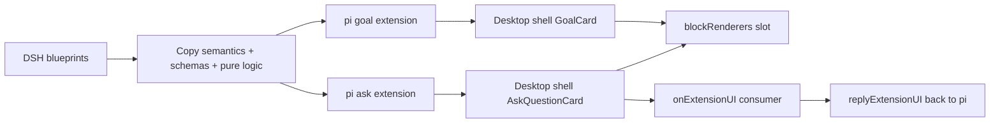
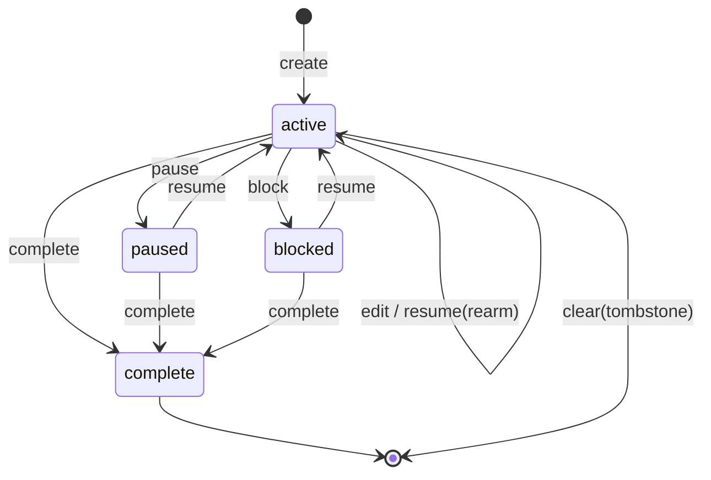
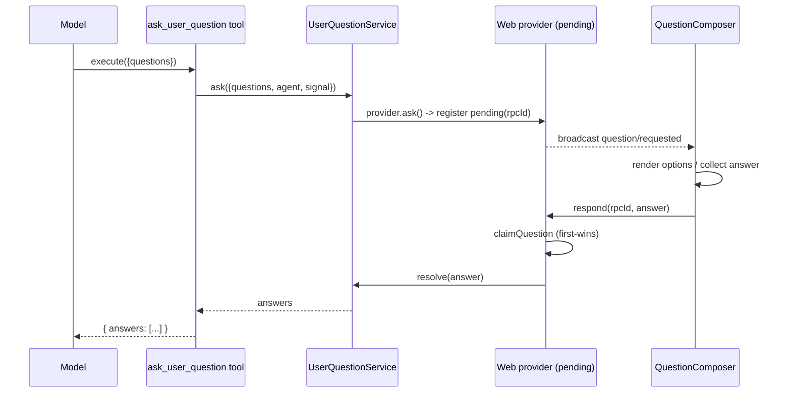
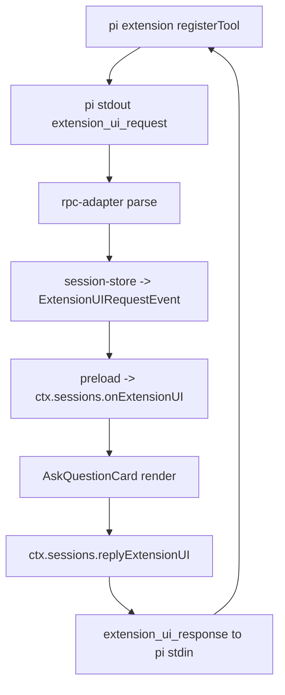
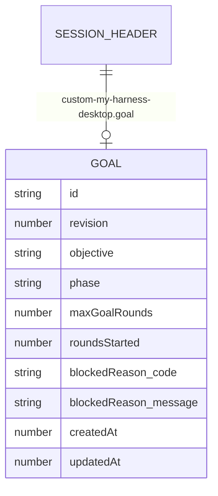
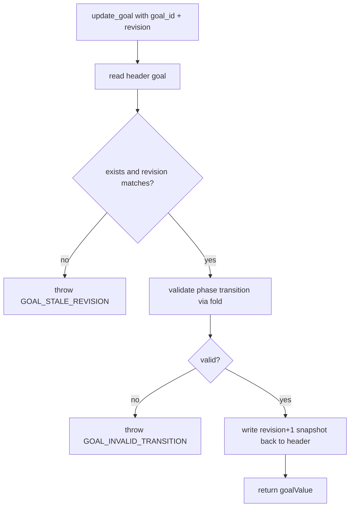
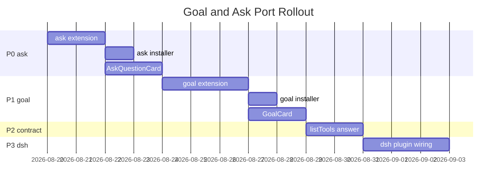

# pi 内核 goal 与 ask 能力移植设计（DSH 蓝本 → pi 扩展 + 桌面 UI 接入）

> **修订记录**：
>
> **2026-08-19 首版**：确立"DSH 是蓝本、pi 侧抄成扩展、桌面侧只做 UI 接入"的总纲。本文把 DSH 的 goal（`tool-goal` + `goal` + `goal-round-driver` + `command-goal`）与 ask（`tool-ask-user` + `user-questions`）两套能力逐模块拆解，落成 pi 扩展的抄写映射表与桌面壳的接入点清单。决策口径：ask 的 `multi_select`/`custom` 先降级（1A）、goal 持久化走会话头行快照（2A）、goal 不含 auto 续跑（3A）——三处均为"不动 pi 内核"的完整可交付形态，未拍板处已在本文明文标出待确认。
>
> **2026-08-19 实现修订（以本条为准）**：落地时 §6.3 的"会话头行快照（2A）"改为 **tool result `details.goal` + `getBranch()` 重放重建**（`session-orchestrator` 的 `task`/`scratchpad` 同款手法）。原因：pi 扩展无写会话头行的先例——`tool-gate`/`subagent-extension` 只读头行（8KB 窗口），头行写入是桌面侧 `updateHeader` 的职责，pi 扩展写会话 JSONL 既无先例又有损坏风险；而 `details` + `getBranch()` 重放是 pi 侧唯一有先例、分叉安全、跨会话重启可恢复（`activation` 位进程本地，重启即 disarmed）的持久化手法。相应 §6.4 的 fold 退化为"单快照 + revision 连续 + phase 转移"校验器（`applyGoalOperation`），§8.1/§8.2 的落点与 CAS 读改写流程以本修订为准。其余结论不变。

## 1. 定位与目标

### 1.1 问题陈述

pi 和 dsh 是两个同级内核，能力本应拉平。DSH 已经长出了两块成熟的会话能力，pi 侧目前是空白或半成品：

- **goal 能力**：同会话持久目标（`get_goal`/`create_goal`/`update_goal`）+ 阶段生命周期 + 自动续跑。DSH 有完整实现且用户满意；pi 生态 grep `create_goal/get_goal/update_goal` 零命中，完全没有。
- **ask/选择能力**：模型暂停、向用户提问（带选项/多选/自定义答案）、答案回灌模型。DSH 有 `ask_user_question` 完整实现；pi 有内建原语 `ctx.ui.select/confirm/input`，但没有任何已安装的 ask 工具。

两者对齐的正确形态，不是把能力塞进桌面壳（壳是机制层、功能含量趋近零），而是：

- pi 侧新增内核插件（TS 扩展），把 DSH 语义抄过来。
- 桌面壳只做 UI 接入（渲染卡片、消费提问事件、回填答案、统一工具清单）。

### 1.2 目标

本设计的交付物是三样完整闭环的东西：

- pi 侧一个 `ask_user_question` 内核扩展：模型可调、走 `ctx.ui` 原语、桌面壳能渲染提问并回填答案。
- pi 侧一个 goal 内核扩展：`get_goal`/`create_goal`/`update_goal` 三工具 + 会话内持久化 + CAS + 阶段生命周期（不含 auto 续跑）。
- 桌面壳两个渲染件 + 一个消费方：`GoalCard`、`AskQuestionCard`（`blockRenderers` 槽），以及 `ctx.sessions.onExtensionUI` 的首个消费组件。

### 1.3 非目标

本文明确不做，防止范围漂移：

- 不给 pi 内核补 `agent/pre-step` 准入闸门、`Agent.followup`、`turn/end` 结算——auto 续跑（DSH `goal-round-driver`）因此**不在本期**。
- 不改 pi 内核的 `ExtensionUIContext` 增补 RPC-safe `multiselect`——ask 的 `multi_select` 本期降级为单选 + 自定义输入。
- 不动 dsh 内核与 deepseek-harness 的 SDK server（`session/listTools`/`session/answer` 缺口）——dsh 侧对齐列为后续阶段，本文只给出接入点，不落地。
- 不实现 DSH 的人类 `/goal` 斜杠命令（`command-goal`）——本期 goal 只经模型工具驱动，命令层后续评估。

### 1.4 术语约定

本文沿用 `CLAUDE.md` 术语，另加三个本域专属词：

- **goal**：同会话持久目标。快照字段 `{id, revision, objective, phase, maxGoalRounds, roundsStarted, blockedReason?}`，`phase ∈ {active, paused, blocked, complete}`。
- **ask / 选择能力**：`ask_user_question` 工具触发的"模型暂停 → 用户作答 → 答案回灌"交互。
- **CAS（compare-and-set）**：以 `{id, revision}` 为比较键的乐观并发；`update_goal` 必须携带精确 `goal_id` + `revision`，不匹配即拒，杜绝陈旧写。

### 1.5 决策摘要

| 编号 | 决策点 | 本期取值 | 依据 |
|:---|:---|:---|:---|
| 1A | ask 的 `multi_select`/`custom` | 降级：单选走 `ctx.ui.select`、自定义走 `ctx.ui.input` | 不动 pi 内核，`ctx.ui.custom` 是 TUI-only、RPC 出不去 |
| 2A | goal 持久化 | 会话头行快照 `custom-my-harness-desktop.goal` | 贴 pi 现有范式（toolConfig/subagent 同款），`fold` 状态机照跑 |
| 3A | goal 是否含 auto 续跑 | 不含，人工 `resume` 推进 | pi loop 缺 `pre-step` 闸门，含则需改内核 |
| 4A | 壳插件归属 | 新建 `sessions/ask` 与 `sessions/goal` 两个独立壳插件 | 内容外挂、单点覆盖，不污染 `message-blocks` |
| 5A | 契约增补 | `BaseBackend` 增 `listTools?`/`answerQuestion?` 可缺面能力 | 多内核默认，工具发现与答案回填是壳必索要能力 |

### 1.6 总览图



**Figure 1.1 — Overall porting pipeline from DSH blueprints to pi extensions and shell UI**

## 2. 现状盘点

### 2.1 DSH 的 goal 能力现状

DSH 的 goal 由 `packages/goal/` 下四个插件构成，全部是插件、无内核特权：

| 包 | 逻辑 id | 职责 |
|:---|:---|:---|
| `@deepseek-ai/dsh-goal` | `goal` | 持久化域 + `GoalService` + `goal/change` 事件 + `fold` 折叠 |
| `@deepseek-ai/dsh-tool-goal` | `tool-goal` | 模型工具 `get_goal`/`create_goal`/`update_goal` + `tool:goal` prompt 段 + `authority` |
| `@deepseek-ai/dsh-goal-round-driver` | `goal-round-driver` | 自动续跑驱动器（`goal/changed` → followup → 准入闸门 → 结算） |
| `@deepseek-ai/dsh-command-goal` | `command-goal` | 人类 `/goal` 斜杠命令 |

goal 域的核心设计是**事件溯源 + 严格重放折叠**：每次变更追加一条版本化 `goal/change` 会话事件（完整快照或 clear 墓碑），`foldGoal(events)` 严格重放并校验 revision 连续、phase 转移合法、计数器/时间戳保持。激活态 `activation ∈ {armed, disarmed}` 是进程本地位，**不持久化**——这是"恢复会话后 active goal 不自动开跑、需人工 resume"的机制根因。



**Figure 2.1 — DSH goal phase state machine**

### 2.2 DSH 的 ask 能力现状

ask 由 `packages/interaction/` 两个插件 + 客户端呈现插件构成：

| 包 | 逻辑 id | 职责 |
|:---|:---|:---|
| `@deepseek-ai/dsh-user-questions` | `user-questions` | `UserQuestionService` + delegated-caller guard + pending 表 |
| `@deepseek-ai/dsh-tool-ask-user` | `tool-ask-user` | 模型工具 `ask_user_question` |
| `@deepseek-ai/dsh-ui-user-questions` | `ui-user-questions` | `QuestionComposer` composer takeover + toolview 行 |

ask 的往返机制是：工具 `execute` 调 `ctx.userQuestions.ask({questions, agent, signal})` 挂起 → provider 把请求存入进程内 pending 表（key=rpcId）并广播 `question/requested` → 浏览器 composer takeover 收答案 → `respond(rpcId, answer)` first-wins 认领 → resolve → 答案作为普通 tool result 回灌模型。用户取消 = `ASK_CANCELLED`、turn 中断 = `ASK_ABORTED`，都是结构化错误码。



**Figure 2.2 — DSH ask_user_question answer round-trip**

### 2.3 pi 现状

pi 的扩展机制与 ask 原语现状：

- **扩展加载**：`discoverAndLoadExtensions`（`packages/coding-agent/src/core/extensions/loader.ts:614-699`）扫描 `<cwd>/.pi/extensions/` → `~/.pi/agent/extensions/` → `--extension`；目录内 `*.ts`/`*.js`、子目录 `index.ts`、或 `package.json` 带 `pi.extensions` 字段。扩展可 import 虚拟模块 `typebox`/`@earendil-works/pi-coding-agent`/`@earendil-works/pi-agent-core`/`@earendil-works/pi-tui`/`@earendil-works/pi-ai`。
- **工具注册**：`default export (pi: ExtensionAPI) => void`，`pi.registerTool(ToolDefinition)`。`ToolDefinition` 权威类型在 `packages/coding-agent/src/core/extensions/types.ts:437-499`，返回 `AgentToolResult` 在 `packages/agent/src/types.ts:350-362`。可选字段含 `promptSnippet`/`promptGuidelines`/`executionMode`/`renderCall`/`renderResult`。
- **ask 原语**：`ExtensionUIContext`（`types.ts:122-277`）提供 `ctx.ui.select(title, options, opts?)`/`confirm`/`input`/`editor`/`notify`/`custom`。工具 `execute` 内 `await ctx.ui.select(...)` 即暂停 agent 循环。`ctx.hasUI` 在 `tui` 与 `rpc` 两种 mode 为 true；RPC 下这些原语走 stdin 帧 `extension_ui_request`/`extension_ui_response`（`packages/coding-agent/src/modes/rpc/rpc-types.ts:229-275`）。
- **goal 现状**：无。最接近的是 `session-orchestrator` 的 `task`（plan/add/update/list）+ `scratchpad`，状态存 tool result `details`、靠 `getBranch()` 重放，无跨轮持久、无 CAS、无阶段生命周期。

已安装运行时扩展（`~/.pi/agent/extensions/`）共 8 个：`subagent-extension`、`tool-gate`、`bus-extension`、`context-probe`、`llm-recorder`、`read-claude-md`、`better-exit-quit`、`model-stats`。**无 ask、无 goal**。

### 2.4 桌面壳现状

桌面壳（my-harness-desktop）是多内核架构，pi 与 dsh 经 `BaseBackend` 中立契约接入。与本设计相关的现状：

- **pi 的 extensionUI 链路已铺到 renderer**：`client/pi/rpc-adapter.ts:224-247` 解析 `extension_ui_request`（带 60s 自动取消）→ `pi-backend.onExtensionUI` → `session-store.ts:306-318` 映射成中性 `ExtensionUIRequestEvent` → `bootstrap/index.ts:190` 广播 `session:extensionUI` → `preload` → `PluginContext: ctx.sessions.onExtensionUI/replyExtensionUI`。**但全仓无任何组件消费 `onExtensionUI`**——这是 ask 能力"没接入"的直接原因。
- **工具发现管道（pi）**：`packages/toolgate/index.ts` 在 `turn_start` 播报 `pi.getAllTools()` → `~/.pi/agent/desktop-known-tools.json` → `client/pi/known-tools.ts` 读 → `IPC.kernel.knownTools` → `tool-manager` 插件消费。新增的 goal/ask 工具会被自动播报，无需额外改。
- **渲染槽**：`blockRenderers` 槽按 `(block="toolCall", name=工具名)` 二键解析（`timeline/renderer/block-renderer.tsx` + `packages/react/block-renderers.ts`），`message-blocks` 已贡献 bash/edit/read/default 卡，未知工具落 `DefaultCard`。
- **dsh 侧缺口**：`dsh-config-source.ts` 的 `PLUGIN_ID_MAP` 无 goal/ask 包；`dsh-backend.ts` 无 `listTools`/`answer`/`seed`；`dsh-event-translator.ts` 译 `tool/call`+`tool/result` 但丢弃 `ask_user_question` 的提问事件。dsh 侧对齐列为后续阶段。

## 3. 总体方案

### 3.1 抄写原则

"抄"的三条纪律，决定每段代码怎么处理：

- **抄语义 + schema + description + 纯函数逻辑，转写进 pi 惯用法**。DSH 是 Cordis + schemastery（`defineTool` + `z.object`），pi 是 TypeBox + `pi.registerTool`，不是复制粘贴源码。
- **纯函数 1:1 搬，副作用服务替换**。DSH 的 `fold.ts`（状态机校验）是零副作用纯 TS，直接搬；`ctx.goals.*`/`ctx.userQuestions.*`/`ctx.systemPrompt.section`/`exec.deferContext` 这类副作用依赖，逐处替换成 pi 对应物。
- **工具名与 JSON 形状绝对对齐**。模型契约（工具名、入参 schema、出参 schema）必须与 DSH 一字不差，否则"抄"就失去意义——同一份 system prompt 在两个内核里应驱动出相同的工具调用。

### 3.2 分层落位

按 `CLAUDE.md` §7.6 能力拉平三分法，goal/ask 的落位是：

| 层 | 改动 | 性质 |
|:---|:---|:---|
| 内核插件补面 | pi 新增 `goal-extension`/`ask-extension` | 能力来源（抄 DSH 语义） |
| 适配器翻译 | pi 复用 `extension_ui_request` → 中性事件（已存在） | 零改动 |
| 壳插件渲染 | 新建 `sessions/goal`/`sessions/ask` 贡献 `blockRenderers` + 消费 `onExtensionUI` | UI 接入 |
| 契约 | `BaseBackend` 增 `listTools?`/`answerQuestion?` 可缺面能力 | 多内核统一，后续 dsh 复用 |



**Figure 3.1 — ask round-trip across pi extension and shell**

### 3.3 范围与顺序

分四个阶段，每阶段是可用的完整态：

- **P0**：pi `ask-extension` + 壳 `AskQuestionCard` + `onExtensionUI` 消费方。打通"壳收内核提问 → 渲染 → 回填"这条此前从未被消费过的链路。
- **P1**：pi `goal-extension`（三工具 + 头行持久化 + fold）+ 壳 `GoalCard`。
- **P2**：契约增补 `listTools?`/`answerQuestion?`，统一 tool-manager 清单（为 dsh 铺路）。
- **P3**（后续）：dsh 侧补面——启用 harness goal/ask 插件 + SDK server 补 `session/listTools`/`session/answer` + translator。

## 4. 蓝本剖析

### 4.1 tool-ask-user 源码结构

`packages/interaction/tool-ask-user/src/index.ts`（101 行）结构：

- `inject = ['tools', 'userQuestions']`。
- 注册单工具 `ask_user_question`，description 为"Ask the user a concise question when you need confirmation, a choice, or missing information before proceeding"。
- `parameters`：`questions` 数组，元素 `{id, question, header?, options:[{label, description}], multi_select?}`。
- `output.schema`：`{answers:[{id, selected:[string], custom?}]}`，`selected` 恒为数组，`custom` 覆盖 `selected`。
- `execute`：把 `args.questions` 映射成 `userQuestions.ask({questions, agent?, signal})`，结果再映射回 `{answers}`。

可抄比例约 80%：工具名、description、parameters、output schema、execute 的映射逻辑全部照搬；仅 `ctx.userQuestions.ask` 一个调用点替换为 pi 的 `ctx.ui` 序列。

### 4.2 tool-goal 源码结构

`packages/goal/tool-goal/src/index.ts`（338 行）结构：

- `inject = ['agents', 'goals', 'tools', 'systemPrompt']`。
- `Config`：`blockedAfterConsecutiveRounds` 默认 3。
- `guidance(blockedAfter)`：注入 `tool:goal` prompt 段，约 8 句英文策略文案。
- 三工具：`get_goal`（无参）、`create_goal(objective, max_goal_rounds?)`、`update_goal(goal_id, revision, action, objective?, max_goal_rounds?, blocked_reason?)`，`action ∈ {edit, pause, resume, complete, blocked}`。
- `GOAL_OUTPUT`：`{goal: null} | {goal:{id, revision, objective, phase, roundsStarted, maxGoalRounds, blockedReason?}, activation}`。
- `execute` 内部：`goalToolExecution`（live 校验）→ 各动作的 `requireDirectHuman`/`completionAuthority` → `ctx.goals.*` → `goalValue` 序列化；`complete`/`blocked` 在 goal-round authority 下 `exec.deferContext` 注入 wrapup。
- `presentCall`：`present(title, kind, rawInput)` 生成 generic card 视图。

可抄比例约 80%：三工具 schema、description、`guidance` 全文、`UPDATE_ACTIONS`/phase 枚举、`goalValue`/`GOAL_OUTPUT`/`goalRef` 校验、`blocked` 阈值逻辑全部照搬；4 处 DSH 依赖替换（见 §6.1）。

### 4.3 goal 域与 fold

`packages/goal/goal/src/domain.ts` 定义：

- `GoalOperation = 'create'|'edit'|'pause'|'resume'|'complete'|'block'|'clear'`。
- `GoalSnapshotChangeMeta`（全量快照）+ `GoalClearChangeMeta`（clear 墓碑），统一 `kind:'goal/change'`、`version:1`。
- `FoldedGoal {goal?, roundsStarted, createdAt?, updatedAt?, lastRef?}`。
- 错误码 `GOAL_AGENT_NOT_LIVE`/`GOAL_NOT_FOUND`/`GOAL_ALREADY_EXISTS`/`GOAL_STALE_REVISION`/`GOAL_INVALID_OBJECTIVE`/`GOAL_INVALID_MAX_ROUNDS`/`GOAL_INVALID_BLOCK_REASON`/`GOAL_INVALID_EDIT`/`GOAL_INVALID_TRANSITION`。

`packages/goal/goal/src/fold.ts`（349 行）是**纯 TS 零副作用**，价值最高的一段：

- `decodeGoalChange`：严格解码快照/墓碑，字段集合精确匹配、revision 正整数、blocked_reason 形状校验。
- `applyGoalChange`：revision 必须 `current+1`、create 必须 revision=1+active+roundsStarted=0、各 phase 转移合法性、计数器/时间戳保持。
- `applyGoalEvent`：`goal/change` 折叠 + `user/message` 的 goal source 推进 `roundsStarted`。
- `foldGoal(events)`：从会话事件日志折叠出 `FoldedGoal`。

### 4.4 goal-round-driver

`packages/goal/goal-round-driver/src/index.ts` + `prompt.ts`，DSH 自动续跑的机制核心：

- `goal/changed` 触发 → `needsCheckpoint` + `requestDrive()` 串行化。
- `drive()`：flush → 复检 `readyToDrive`（fiber ACTIVE、agent idle、无竞争）→ active+armed 且 `roundsStarted < maxGoalRounds` 时渲染 `<goal_round>` prompt、挂 `GoalMessageSource {kind:'goal', goalId, revision, round}`、`agent.followup(message)`。
- `agent/pre-step` 准入闸门：校验身份/内容/goal revision/armed/round 前后各一次，不匹配 reject 不扣轮次。
- `turn/end` 结算：completed→续、aborted→pause、`RATE_LIMIT|QUOTA`→block `usage-limited`、error→block `turn-error`、max-tokens→block `max-tokens`、持久化失败→disarm、未知→block 待查。

**本期不抄**：依赖 `agent/pre-step` + `Agent.followup` + `turn/end` 三个 hook，pi loop 均不暴露，抄则需改 pi 内核（超出"加扩展"）。

### 4.5 authority

`packages/goal/tool-goal/src/authority.ts` 三条运行时校验，prompt 注入绕不过：

- `goalToolExecution(ctx, exec)`：调用者必须是注册表里精确的 live agent、`status==='running'`、当前 driver initiator、开放 turn。
- `requireDirectHuman(ctx, exec)`：create/edit/pause/resume 须 runtime-root agent + 当前 turn 内有 `source.kind==='user'` 的 `user/message`。
- `completionAuthority(ctx, exec)`：complete/blocked 接受直接人类 turn 或恰好匹配的 goal round。

### 4.6 照搬/改写总表

| DSH 源 | 照搬 | 改写 | 不抄 |
|:---|:---|:---|:---|
| `tool-ask-user/index.ts` | 工具名/description/parameters/output | `execute` 的 `ctx.userQuestions.ask` → `ctx.ui` | 无 |
| `tool-goal/index.ts` | 三工具 schema/description/`guidance`/`UPDATE_ACTIONS`/`goalValue`/`goalRef`/阈值 | `register`、`ctx.goals.*`、`systemPrompt.section`、`deferContext` | 无 |
| `goal/src/domain.ts` | 类型、操作枚举、错误码 | 类型包换成 pi 窄类型 | 无 |
| `goal/src/fold.ts` | 全部纯函数 | 类型 import 换成 pi 窄类型 | 无 |
| `goal/src/index.ts`（GoalService） | 生命周期语义 | 事件追加换成头行快照 | 无 |
| `tool-goal/src/authority.ts` | 校验语义 | live/root 判定降级、来源映射 | 无 |
| `goal-round-driver/*` | 无 | 无 | 整块（本期） |
| `command-goal/*` | 无 | 无 | 整块（本期） |

## 5. ask_user_question 移植设计

### 5.1 工具契约（照抄）

工具名、description、入参、出参与 DSH 一字不差：

```ts
// packages/ask-extension/index.ts
const description =
  'Ask the user a concise question when you need confirmation, a choice, or missing information before proceeding. '
  + 'Send one or more questions, each with a stable id that will be echoed in the answer.';
```

入参 schema（TypeBox 等价，`additionalProperties: true` 语义在 pi 侧用 `Type.Object` 默认关闭，需逐字段列出）：

```ts
const QuestionOption = Type.Object({
  label: Type.String({ description: 'Short user-facing option label.' }),
  description: Type.Optional(Type.String({ description: 'One sentence explaining the tradeoff or impact.' })),
});
const Question = Type.Object({
  id: Type.String({ description: 'Stable id for this question; echoed in the answer.' }),
  question: Type.String({ description: 'The specific question to ask the user.' }),
  header: Type.Optional(Type.String({ description: 'Optional short heading, such as "Confirm" or "Choose Mode".' })),
  options: Type.Optional(Type.Array(QuestionOption)),
  multi_select: Type.Optional(Type.Boolean({ description: 'Whether the user may select more than one option. Defaults to false.' })),
});
const AskParams = Type.Object({ questions: Type.Array(Question) });
```

出参（放 tool result `details`，形状对齐 DSH `output.schema`）：

```ts
interface AskAnswer { id: string; selected: string[]; custom?: string }
interface AskResult { answers: AskAnswer[] }
```

### 5.2 execute 改写（核心分歧）

DSH 的 `execute` 调 `ctx.userQuestions.ask`；pi 版改为逐题 `ctx.ui` 序列。逐题循环，单选走 `ctx.ui.select`、自定义答案走 `ctx.ui.input`：

```ts
async execute(_id, params, _signal, _onUpdate, ctx) {
  if (ctx.mode !== 'tui' && ctx.mode !== 'rpc') {
    return { content: [{ type: 'text', text: 'Error: UI not available (non-interactive mode)' }], details: { answers: [] } };
  }
  const answers: AskAnswer[] = [];
  for (const q of params.questions) {
    const selected: string[] = [];
    if (q.options && q.options.length > 0) {
      const labels = q.options.map((o) => o.label);
      const picked = await ctx.ui.select(q.question, labels);
      if (picked === undefined) {
        return { content: [{ type: 'text', text: 'User cancelled the question' }], details: { answers } };
      }
      selected.push(picked);
    }
    const custom = await ctx.ui.input(q.question + (selected.length ? ' (chosen: ' + selected.join(', ') + ') or type a custom answer' : ''));
    if (custom) {
      answers.push({ id: q.id, selected, custom });
    } else {
      answers.push({ id: q.id, selected });
    }
  }
  return { content: [{ type: 'text', text: JSON.stringify({ answers }) }], details: { answers } };
}
```

### 5.3 multi_select 决策（1A）

DSH 的 `multi_select` 是结构化元数据，UI 用复选框呈现；pi 的 `ctx.ui.select` 是单选原语。本期取值：

- `multi_select: true` 的题，**降级为多次单选**：模型仍传 `multi_select: true`，但 pi 侧渲染为"每选一次追加一个已选项，用户结束本轮"的交互由壳侧卡片承担（见 §7.2），pi 扩展本身每次只 `await` 一次 `ctx.ui.select`，把多选拆成循环直到用户发出结束信号。
- 为不破坏"一次 `extension_ui_request` 一次回填"的简单契约，本期的壳侧 AskQuestionCard 支持把整道题（含多选 + 自定义）作为**单次 select 请求**承载，答案用约定分隔符回传——**这是壳插件层的降级方案，pi 内核零改动**。

### 5.4 错误与取消语义

对齐 DSH 的结构化错误码：

| 场景 | pi 版行为 | 对齐 DSH |
|:---|:---|:---|
| 用户取消（`ctx.ui.select` 返回 `undefined`） | tool result 文本"User cancelled the question"，`details.answers` 保留已答项 | `ASK_CANCELLED` 语义 |
| 非交互 mode | tool result 文本报错，`isError: true` | 无 UI 降级 |
| 空 questions | 立即返回 `{answers: []}` | `EMPTY_QUESTIONS` |
| 无 options 且用户留空自定义 | `selected: []`、无 `custom`，视为跳过 | 跳过项语义 |

### 5.5 pi 扩展文件结构

```
packages/ask-extension/
  index.ts        # default export，注册 ask_user_question 工具
```

同步器 `client/pi/ask-extension-installer.ts` 抄 `toolgate-installer.ts` 模板，把 `index.ts` 同步到 `~/.pi/agent/extensions/ask-extension/index.ts`，内容 diff 跳过。

## 6. goal 移植设计

### 6.1 三工具 schema（照抄）

`get_goal`/`create_goal`/`update_goal` 三工具名、description、入参与 DSH 一致，转 TypeBox：

```ts
const GoalParams = {
  objective: Type.String({ description: 'The concrete completion objective inferred from the direct human request.' }),
  max_goal_rounds: Type.Optional(Type.Number({ description: 'Optional positive safe-integer limit on automatic continuation rounds.' })),
};
const UpdateParams = Type.Object({
  goal_id: Type.String({ description: 'Exact id returned by get_goal.' }),
  revision: Type.Number({ description: 'Exact positive revision returned by get_goal.' }),
  action: StringEnum(['edit', 'pause', 'resume', 'complete', 'blocked'] as const),
  objective: Type.Optional(Type.String()),
  max_goal_rounds: Type.Optional(Type.Number()),
  blocked_reason: Type.Optional(Type.String()),
});
```

出参 `GOAL_OUTPUT`（照抄 `goalValue`）：

```ts
type GoalToolValue =
  | { goal: null }
  | { goal: { id: string; revision: number; objective: string; phase: 'active'|'paused'|'blocked'|'complete';
      roundsStarted: number; maxGoalRounds: number; blockedReason?: { code: string; message: string } };
      activation: 'armed'|'disarmed' };
```

### 6.2 prompt 策略段（照抄，换注入方式）

DSH 的 `guidance(blockedAfter)` 全文照抄，注入点从 `ctx.systemPrompt.section('tool:goal')` 换成 pi `ToolDefinition` 的 `promptGuidelines` 字段（挂在三个工具上或扩展入口一次性注入）：

```text
Use goal tools for one long-running completion objective in the current session.
create_goal may infer goal intent from a direct human request in any language; do not
create a goal for routine single-turn work. Call get_goal before update_goal and copy its
exact goal_id and revision. After session resume or fork, an active goal is disarmed: when
a human asks to continue or resume in any wording or language, use update_goal action
resume to rearm it. Mark complete only when the objective is actually achieved. Mark
blocked only after the same blocking condition persists for at least 3 consecutive goal
rounds, and report that concrete condition in blocked_reason; difficulty, uncertainty, or
useful remaining work is not blocked.
```

### 6.3 持久化层（2A：头行快照）

DSH 事件溯源 + fold 折叠，pi 版落成会话头行快照 + CAS：

- 快照落点：会话 JSONL 头行 `custom-my-harness-desktop.goal`（`tool-gate`/`subagent-extension` 同款 read-modify-write，8KB 头行窗口）。
- 快照结构（`GoalSnapshot` 去掉 `activation`，激活位进程本地）：

```ts
interface GoalSnapshot {
  id: string;
  revision: number;
  objective: string;
  phase: 'active' | 'paused' | 'blocked' | 'complete';
  maxGoalRounds: number;
  roundsStarted: number;
  blockedReason?: { code: string; message: string };
  createdAt: number;
  updatedAt: number;
}
```

- CAS：`update_goal` 携带 `{goal_id, revision}`，写回前校验头行当前 revision 等于入参 revision，否则抛 `GOAL_STALE_REVISION`。
- 读路径：`get_goal` 读头行快照 + 进程本地 `activation` 位，合成 `{goal, activation}`。

### 6.4 fold 状态机（照搬，纯函数）

`fold.ts` 的校验逻辑照搬为 pi 扩展内的纯 TS 模块 `goal-fold.ts`，只换类型 import。核心是 `validateSnapshotTransition` 的 phase 转移表：

| 操作 | 前置 phase | 后置 phase | 额外约束 |
|:---|:---|:---|:---|
| `edit` | 任意（非 complete） | 不变 | 不动 phase/blockedReason |
| `pause` | active | paused | objective/maxGoalRounds 不变 |
| `resume` | active/paused/blocked | active | `roundsStarted < maxGoalRounds` |
| `complete` | active/paused/blocked | complete | objective/maxGoalRounds 不变 |
| `block` | active | blocked | 带 blockedReason |
| `clear` | 任意 | 无（墓碑） | revision 连续 |

头行快照模式下，"事件流"退化为"头行快照 + revision 连续校验"，fold 状态机退化为**单快照校验器**：读头行 → 校验入参 ref 与快照一致 → 校验 phase 转移合法 → 写回 revision+1 的新快照。

### 6.5 权限层（authority 映射）

DSH 三条校验在 pi 侧的映射：

| DSH 校验 | pi 对应 | 结论 |
|:---|:---|:---|
| `goalToolExecution`（live agent + driver initiator + open turn） | `ctx.isIdle()`/`ctx.signal` | 降级为"工具在活跃 turn 内执行"；pi 单会话无 subagent root 概念，live/root 判定天然简化 |
| `requireDirectHuman`（当前 turn 含 `source.kind==='user'`） | `pi.on('input')` 的 `event.source` | 映射：`'rpc'`/`'interactive'` = 人、`'extension'` = 非人；扩展记"本 turn 是否见过 human input" |
| `completionAuthority`（complete/blocked） | 人类 turn 或 goal round | goal round 本期不抄（3A），故 complete/blocked 仅接受人类 turn |

### 6.6 auto 续跑（3A：不含）

本期不抄 `goal-round-driver`。goal 创建后 `activation` 置 `armed` 但无驱动器推进；会话重启后 `activation` 复位 `disarmed`，靠人类"继续"指令驱动模型 `update_goal(action: resume)` rearm。完整 auto 续跑列为后续（需 pi 内核补 `pre-step` 闸门 + `followup`）。

### 6.7 wrapup 处理

DSH 的 `complete`/`blocked` 在 goal-round authority 下 `exec.deferContext` 注入 wrapup 用户消息。pi 无 `deferContext`，改为把 wrapup 话术写进 tool result `content` 文本（模型下一轮读到）：

```text
Goal marked complete. The objective has been achieved. Please give the user a final summary of what was accomplished.
```

### 6.8 pi 扩展文件结构

```
packages/goal-extension/
  index.ts         # default export，注册三工具 + 装配存储
  goal-fold.ts     # 抄自 DSH fold.ts 的纯校验函数
  goal-store.ts    # 头行快照 read-modify-write + CAS
```

同步器 `client/pi/goal-extension-installer.ts` 同 §5.5 模板。

## 7. 桌面 UI 接入设计

### 7.1 壳插件归属（4A）

新建两个独立壳插件，不动 `message-blocks`：

```
src/plugins/sessions/ask/
  plugin.json                 # blockRenderers: ask_user_question -> AskQuestionCard
  renderer/ask-question-card.tsx
src/plugins/sessions/goal/
  plugin.json                 # blockRenderers: get_goal/create_goal/update_goal -> GoalCard
  renderer/goal-card.tsx
```

`plugin.json` 声明（ask 示例）：

```json
{
  "id": "ask",
  "version": "0.1.0",
  "tier": "official",
  "renderer": "./renderer/index.tsx",
  "contributes": {
    "blockRenderers": [
      { "id": "ask", "block": "toolCall", "names": ["ask_user_question"], "component": "AskQuestionCard" }
    ]
  }
}
```

### 7.2 AskQuestionCard（onExtensionUI 首个消费方）

`AskQuestionCard` 是 `ctx.sessions.onExtensionUI` 的全仓首个消费方，职责：

- 订阅 `ctx.sessions.onExtensionUI((req) => ...)`，过滤 `req.method === 'select'` 的提问请求。
- 渲染题目 + 选项（单选用编号、`multi_select` 降级为"多次选择 + 完成"按钮、自定义用输入框）。
- 用户作答后调 `ctx.sessions.replyExtensionUI(req.requestId, { value })`；取消则 `{ cancelled: true }`。
- 订阅通道经 `usePluginContext()` 拿 `ctx.sessions`，不手写 pluginId。

```ts
useEffect(() => {
  const off = ctx.sessions.onExtensionUI((req) => {
    if (req.method !== 'select') return;
    setPending(req);
  });
  return off;
}, [ctx]);
```

### 7.3 GoalCard

`GoalCard` 消费中性 `toolCall` 块的 `args`/`result`，非交互：

- `get_goal`：渲染 `{goal: {...}, activation}` 的紧凑卡（objective 一行 + phase/rounds/revision 元信息）。
- `create_goal`/`update_goal`：渲染 mutation 卡，优先展示有意义动作值（objective/blocked_reason），对齐 DSH `presentCall` 的"选有意义值"策略。
- 无交互回填，纯结果渲染，与现有 `DefaultCard` 同机制但更专门。

### 7.4 工具清单统一

pi 侧新工具会被 `tool-gate` 在 `turn_start` 自动播报进 `desktop-known-tools.json`，`tool-manager` 的 `useDiscoveredTools()` 无需改即可看到 `ask_user_question`/`get_goal`/`create_goal`/`update_goal`。要做的仅是给 `BUILTIN_TOOLS` 之外的扩展工具正确标注 `source: "extension"`（tool-gate 已做）。

### 7.5 契约增补（5A，P2）

为多内核统一与后续 dsh 铺路，`core/domain/backend.ts` 增两个可缺面能力：

```ts
interface BaseBackend {
  // ... 既有六意图
  listTools?(): Promise<KnownToolInfo[] | null>;   // null = 内核不支持，降级
  answerQuestion?(questionId: string, answers: unknown): Promise<void>;
}
```

`core/domain/events/kernel-event.ts` 复用既有 `ExtensionUIRequestEvent`（`kind:"extensionUI"`），**不新增** `QuestionRequestedEvent`——pi 的 `extensionUI` 已是该语义，契约单源。`core/domain/sessions.ts` 的 `KnownToolInfo.source` 扩为 `"builtin" | "extension" | "cordis"`（P3 装 dsh 用）。

## 8. 数据与持久化设计

### 8.1 落点与隔离

goal 快照落 pi 会话 JSONL 头行 `custom-my-harness-desktop.goal`，理由：

- 与既有 `toolConfig`/`subagent` 域同处头行，读窗口 8KB 内，read-modify-write 模式已被 tool-gate 验证。
- 会话级隔离：不同会话各自头行，天然按会话划界。
- `activation` 位进程本地（内存 Map），重启即 `disarmed`——对齐 DSH"恢复后不自动开跑"。



**Figure 8.1 — goal snapshot persisted in session header**

### 8.2 CAS 写流程



**Figure 8.2 — CAS read-modify-write flow for goal mutation**

### 8.3 并发与锁

头行写用 `config-file.ts` 的 `withDirLock` 原语（既有），避免 read-modify-write 竞态。pi 扩展内若直接写会话文件，复用 tool-gate 的"读 8KB 头行 → 改 → 回写"手法，写失败静默降级为"本轮维持现状、下一轮重试"。

## 9. 事件与契约设计

### 9.1 中性事件复用

pi 的 ask 提问走既有 `ExtensionUIRequestEvent`，不新增事件类型：

```ts
interface ExtensionUIRequestEvent {
  source: 'pi';
  kind: 'extensionUI';
  requestId: string;
  sessionKey: string;
  method: 'select' | 'confirm' | 'input' | 'editor' | 'notify'
         | 'setStatus' | 'setWidget' | 'setTitle' | 'set_editor_text';
  [key: string]: unknown;
}
```

### 9.2 工具调用中性块

goal/ask 的工具调用经既有 `event-translator` 译成中性 `ToolCallBlock`，渲染层与内核无关：

```ts
interface ToolCallBlock {
  type: 'toolCall';
  name: string;      // 'ask_user_question' | 'get_goal' | ...
  args?: unknown;
  state?: string;
  result?: unknown;
}
```

### 9.3 契约单源

- 工具名、goal 快照结构、`phase`/`action` 枚举，在 pi 扩展内定义一次（抄自 DSH），壳侧仅 `blockRenderers` 的 `names` 字符串对齐，不重复定义类型。
- `KnownToolInfo.source` 三值只在 `core/domain/sessions.ts` 定义一次。
- 内核身份 `"pi"|"dsh"` 只出现在 `core/domain/kernel.ts`，壳插件代码零内核分支。

## 10. 安全与权限设计

### 10.1 人类来源判定

`requireDirectHuman` 映射到 pi 的 `input` 钩子 `event.source`：

| pi source | 判定 |
|:---|:---|
| `rpc` | 人（经桌面壳发起的真实用户输入） |
| `interactive` | 人（TUI 交互输入） |
| `extension` | 非人（扩展注入，不得通过 `requireDirectHuman`） |

扩展维护 per-turn 标记：`turn_start` 清零，`input` 事件里 source 为 `rpc`/`interactive` 时置位。`create_goal`/`edit`/`pause`/`resume` 执行时校验该标记，未置位抛 `GOAL_AGENT_NOT_LIVE` 语义的拒绝。

### 10.2 blocked 阈值

`blockedAfterConsecutiveRounds` 默认 3，配置透传 pi 扩展（环境变量或扩展配置）。本期无 auto 续跑，`blocked` 仅接受人类 turn，阈值校验保留（`roundsStarted < 3` 时拒 `blocked`），与 DSH 语义一致。

### 10.3 静默缺面禁令

`ctx.ui.select` 在非 `tui`/`rpc` mode 下必须显式返回错误文本（`isError: true`），不得静默吞掉。桌面壳 `rpc-adapter` 已对 `extension_ui_request` 设 60s 超时自动取消，未消费提问不得静默丢包——`AskQuestionCard` 挂载后即成为消费方，消除"零消费方"缺口。

## 11. 分阶段落地计划

### 11.1 P0：pi ask 闭环

- 新建 `packages/ask-extension/index.ts`（§5）。
- 新建 `src/client/pi/ask-extension-installer.ts`（抄 toolgate 模板）。
- 新建 `src/plugins/sessions/ask/`（`AskQuestionCard` + plugin.json）。
- 验收：模型调 `ask_user_question` → 壳弹出选项 → 用户选 → 答案回填 → 模型续写。

### 11.2 P1：pi goal 闭环

- 新建 `packages/goal-extension/`（`index.ts` + `goal-fold.ts` + `goal-store.ts`）。
- 新建 `src/client/pi/goal-extension-installer.ts`。
- 新建 `src/plugins/sessions/goal/`（`GoalCard` + plugin.json）。
- 验收：模型 `create_goal` → 头行落快照 → `get_goal` 读到 → `update_goal(complete)` CAS 通过；陈旧 revision 被拒。

### 11.3 P2：契约增补与清单统一

- `backend.ts` 增 `listTools?`/`answerQuestion?`。
- `sessions.ts` 的 `KnownToolInfo.source` 扩三值。
- `pi-backend.ts` 实现 `listTools()`（= `readKnownTools`）、`answerQuestion()`（= `replyExtensionUI`）。

### 11.4 P3（后续）：dsh 补面

- `dsh-config-source.ts` 增 goal/ask 包进 `PLUGIN_ID_MAP`/`DEFAULT_CORDIS_YAML`/`DSH_SPEC.extraPackages`。
- deepseek-harness SDK server 补 `session/listTools`/`session/answer`。
- `dsh-event-translator.ts` 补 `question/requested` → 中性事件。
- `dsh-backend.ts` 实现 `listTools()`/`answerQuestion()`。

### 11.5 阶段时序



**Figure 11.1 — phased rollout timeline**

## 12. 测试策略

### 12.1 纯函数单测（fold 状态机）

`goal-fold.ts` 照搬 DSH fold 后，逐条验证：

- revision 连续：`edit` 必须 `current.revision + 1`，跳号拒。
- phase 转移合法性：`pause` 只从 active、`block` 只从 active、`resume` 从 active/paused/blocked 且未超 `maxGoalRounds`。
- `blocked_reason` 形状：`{code, message}` 精确字段、code 小写 kebab、message 非空且 trim。
- `create` 必须 revision=1 + active + roundsStarted=0。
- 计数器/时间戳保持：非 create 快照不得改 `createdAt`/`roundsStarted`。

### 12.2 扩展单测

- ask：非交互 mode 报错、空 questions、取消、单选、自定义答案。
- goal：CAS 陈旧拒、`blocked` 阈值、人类来源判定（rpc/extension 分路径）。

### 12.3 壳插件测试

- `AskQuestionCard`：`select` 请求渲染、`replyExtensionUI` 回填、取消、非 select 请求过滤。
- `GoalCard`：三工具 args/result 渲染、`{goal:null}` 渲染。

### 12.4 端到端

- 桌面壳起 pi（`--mode rpc`），模型调 `ask_user_question`，断言 `extension_ui_request` 从 stdout 流出、`extension_ui_response` 写回、模型读到答案。
- 模型 `create_goal` → 头行落快照 → 重启会话 → `get_goal` 读回（activation 复位 disarmed）→ `update_goal(resume)` rearm。

## 13. 风险与决策

### 13.1 已拍板决策

| 编号 | 决策 | 状态 |
|:---|:---|:---|
| DSH 为蓝本、pi 抄成扩展、桌面只做 UI | 总纲 | 已定 |
| 1A ask 的 multi_select 降级 | §5.3 | 已定 |
| 2A goal 头行快照持久化 | §6.3 | 已定 |
| 3A goal 不含 auto 续跑 | §6.6 | 已定 |
| 4A 新建独立 ask/goal 壳插件 | §7.1 | 已定 |
| 5A 契约增 listTools/answerQuestion | §7.5 | 已定（P2 落地） |

### 13.2 待拍板

- **ask 的 `multi_select` 是否要完整对齐 DSH**：本期降级为单选 + 自定义；若要 DSH 级多选，需给 pi 内核补 RPC-safe `multiselect`（后续）。
- **goal 是否要 auto 续跑**：本期不含；若要，需给 pi 内核补 `pre-step` 闸门 + `followup`（后续）。
- **是否本期就做 P2 契约增补**：P0/P1 不依赖它，可延后到 dsh 铺路时再做。

### 13.3 风险登记

| 风险 | 影响 | 缓解 |
|:---|:---|:---|
| pi 头行 8KB 窗口溢出（goal 快照过大） | goal 写失败 | goal 快照极小（<1KB），且写失败静默降级重试 |
| `ctx.ui.select` 的 RPC 帧字段未对齐桌面 rpc-adapter | 提问丢包 | 双方均以 `extension_ui_request` 方法枚举为准，P0 先验帧形状 |
| 人类来源判定误判（extension 注入绕过） | 越权 create_goal | `event.source` 显式白名单，非 `rpc`/`interactive` 一律拒 |
| fold 状态机抄写遗漏分支 | 状态错乱 | 单测逐条覆盖 DSH fold 的校验矩阵 |

## 14. 附录

### 14.1 ask_user_question 完整 schema

见 §5.1，与 DSH `packages/interaction/tool-ask-user/src/index.ts` 一致。

### 14.2 goal 三工具完整 schema

见 §6.1，与 DSH `packages/goal/tool-goal/src/index.ts` 一致。

### 14.3 goal 快照类型

见 §6.3，对齐 DSH `packages/goal/goal/src/types.ts` 的 `GoalSnapshot`（去 `activation`）。

### 14.4 参考文件清单

- DSH：`packages/interaction/tool-ask-user/src/index.ts`、`packages/interaction/user-questions/src/index.ts`、`packages/goal/tool-goal/src/index.ts`、`packages/goal/tool-goal/src/authority.ts`、`packages/goal/tool-goal/src/wrapup.ts`、`packages/goal/goal/src/domain.ts`、`packages/goal/goal/src/fold.ts`、`packages/goal/goal/src/index.ts`、`packages/goal/goal-round-driver/src/index.ts`、`packages/goal/command-goal/src/index.ts`。
- pi：`packages/coding-agent/src/core/extensions/types.ts`、`packages/coding-agent/src/core/extensions/loader.ts`、`packages/coding-agent/src/modes/rpc/rpc-types.ts`、`packages/coding-agent/examples/extensions/question.ts`、`questionnaire.ts`、`todo.ts`、`packages/coding-agent/examples/rpc-extension-ui.ts`。
- 桌面壳：`src/client/pi/rpc-adapter.ts`、`src/client/pi/toolgate-installer.ts`、`src/client/pi/known-tools.ts`、`src/core/domain/backend.ts`、`src/core/domain/events/kernel-event.ts`、`src/core/domain/sessions.ts`、`src/plugins/sessions/timeline/renderer/block-renderer.tsx`、`src/plugins/sessions/message-blocks/plugin.json`、`src/client/dsh/dsh-config-source.ts`、`src/client/dsh/dsh-event-translator.ts`、`src/client/dsh/dsh-backend.ts`。
