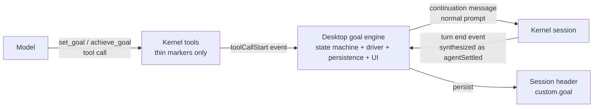
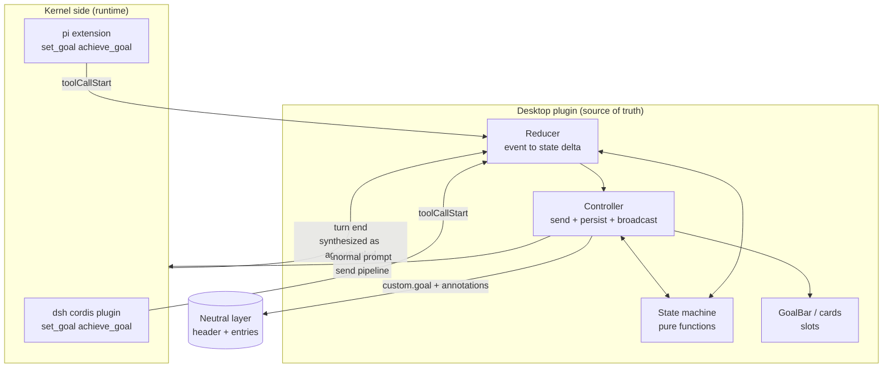
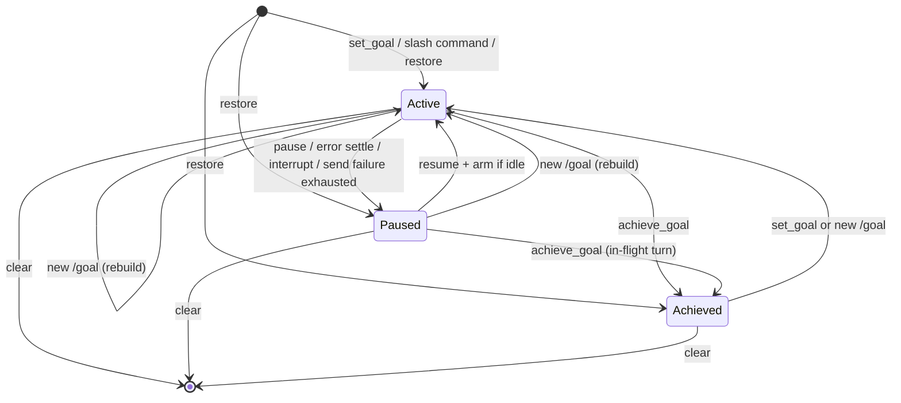

# goal 能力设计

## 1. goal 是什么

### 1.1 定义

- goal 是**纯 desktop 的编排功能**：一个同会话的持久目标，加上壳层的自驱动续跑——模型没达成，desktop 就在回合收敛后再发一条消息让它继续，直到达成、撞到轮数上限、或被人删除。
- "纯 desktop"是这条定义的骨头。状态机、续跑驱动、持久化、界面全部住在 desktop 侧；理论上把 pi 换成 dsh、或换成任何一个满足中立契约的内核，goal 的语义一行不变。内核唯一参与的环节是"让模型能表达意图"——模型只能调用内核注册的工具，desktop 注入不了，所以 `set_goal` / `achieve_goal` 两个薄工具是整套能力里唯一落在内核侧的部分（为什么是薄工具，见 4.3）。
- 反方向同样成立：desktop 不要求内核理解 goal。内核从头到尾不知道"目标"这个概念存在，它看到的只是普通的工具调用和普通的消息。编排的全部判断——什么时候续、续什么、什么时候停——都长在 desktop 里。

**图 1 — goal 的边界：编排全在 desktop，内核侧只有两个薄工具（适配器的事件/命令翻译省略未画，见 10.2）**

### 1.2 解决什么问题

- 长任务的真实形态是跨很多个回合的：跑完一整套验证、迁移几十处调用点、把测试改到全绿。没有 goal 时，每个回合结束都要人回来敲一句"继续"——人成了循环里的人肉条件分支。
- goal 把"继续"从人肉动作变成编排动作：人设一次目标，之后每个回合收敛时由 desktop 判断"还没完"并注入下一轮。人的角色从驱动者变成监督者，随时能停、能改、能删（控制面见 5.4 与第 7 节）。
- 这也划清了 goal 的语义边界：续跑不是"内核在跑一个后台任务"，会话没有任何特殊执行模式——每一轮都是一次普通回合，只是发起者从人换成了 desktop。

### 1.3 非目标

- 不替代内核原生的同类能力。dsh 内核自带一套 goal（服务端自驱动的轮次推进），与本文的 desktop goal 是两套独立系统，互不感知、互不依赖；desktop goal 刻意不复用它——复用了，pi 侧就得凭空造一个对应物，"内核无关"当场破产。功能层同样说不通：dsh 原生 goal 的轮次推进跑在内核服务端，桌面既拿不到它的事件，也画不出目标条、给不了停改删——"看得见、管得着的目标"会退化成内核黑盒里的一个隐形循环。
- 不做多目标。一个会话同一时刻只有一个目标；模型在目标未完结时再设，语义归并为"改"；人重设则是新建——两者的差异是有意的，见 9.3。
- 不做跨会话目标。目标的生命周期严格绑定单个会话，切换即换档（隔离语义见 9.1），后台会话的目标不会自走。

## 2. 术语

- **内核**：自洽的 AI agent 运行时，desktop 同时托管两个同级内核——pi 与 dsh。内核是被壳管理的资源：desktop 启动它、持有它、杀掉它，但它不知道、也不需要知道自己被托管。
- **desktop / 壳**：本文同义，指这个桌面应用本身——管理内核、提供槽位与消息面的宿主。代码上分壳后端（服务端进程）与前端渲染两端，文中"服务端"指壳后端。
- **壳插件 / 内核插件**：壳插件是挂壳槽位的 UI 插件（desktop 侧）；内核插件是装进内核进程的能力扩展（pi 的 TS 扩展、dsh 的 cordis 插件——cordis 是 dsh 的插件机制）。goal 一个功能两件都有：源码收在同一个壳插件目录，内核插件部分随壳插件启停被同步进内核目录。
- **中立契约 / 中性事件 / 中立层**：壳与内核之间的最小意图接口（发消息、中断、事件流……），每个内核交一个适配器把自己的专属形状翻进来；中性事件是去掉内核细节后的统一事件形状；中立层是壳自有的每会话持久层（头行 + 条目），两个内核共享同一格式。"中立"与"中性"同义，都指"不绑任何内核"。
- **回合与收敛**：一次"发消息 → 模型干活 → 停下"是一个回合。壳监听内核的回合事件，在回合彻底结束（不是流式中途）时合成并发出中性 `agentSettled`——这就是收敛；正常结束、模型报错、用户中断都算收敛（异常收敛的续跑语义见 5.2）。goal 的续跑循环以收敛为扳机。
- **模型 / 工具调用**：模型指内核驱动的 LLM；工具调用是模型在回合内发起的具名操作（如 `set_goal`），由内核执行并回结果。
- **notify（系统通知）**：desktop 的应用内通知浮层，用来给命令反馈与错误显形，不进会话流。
- **会话头行**：每个会话在中立层有一条头信息（名称、归属、模型偏好、插件自定义域），goal 的目标状态就持久化在头行的 `custom.goal` 键。
- **物化 / `new:` 壳**：新会话在首次落盘前只有一个临时路径（`new:` 前缀），落盘出真实路径的那一刻叫物化。
- **槽位**：壳预定的挂载点，壳插件往上挂内容。本文出现四个：`composerTop`（输入框上方横幅区）、`blockRenderers`（会话流块级卡片）、`settingsGroups`（通用设置页的声明式字段框）、`composerCommands`（输入框斜杠命令）。
- **timeline**：渲染会话消息流与输入框的那个壳插件。`auxParser` 是它的解析面：把消息文本里的结构化包装剥出来渲成卡片。
- **药丸 / chip**：药丸指输入框的圆角容器；chip 指容器上的小标记块（如命令名徽标）。
- **装弹（arming）**：在没有回合在飞时主动发出一轮续跑（规则见 5.2）。
- **GoalBar（目标条）**：goal 在输入框上方的状态横幅（见 7.3）；正文里"目标条"是它的口语说法。
- **toolCallStart**：模型发起工具调用时壳发出的中性事件，携带工具名与入参——goal 引擎捕获 `set_goal` / `achieve_goal` 就靠它。
- **会话压缩**：长会话的通用机制——把较早历史压成摘要释放上下文。goal 的回合是普通回合，压缩对它同样生效。
- **事件广播**：壳插件间的发布/订阅通道；goal 用它广播 `goal:state` 状态快照，订阅方（如 timeline）据此着色。
- **激活会话 vs active**：两个不相干的词——"激活会话"是当前显示在屏幕上的那个会话；"active"是目标的阶段（phase）之一。
- **幂等**：重复执行与执行一次效果相同——不报错、不重复推进。

## 3. 核心抽象：无特权通道

实现 goal 的每一步都诱惑人给它开一条特殊通道：一个特殊的发送入口、一种特殊的存储、一套特殊的展示。本设计的第一原则是拒绝所有这些——**goal 的一切都是内容，复用通用机制，没有特权通道**。这条原则有三个推论，后面每一节都是它们的展开。

### 3.1 状态机在内核外

- goal 的状态是纯数据 `{ objective, phase, round, maxRounds }`，全部迁移是纯函数（见 4.1）。它不住在内核的会话对象里，也不需要内核提供存取——这是"换内核不影响 goal"的物理基础：状态根本不在被替换的那一层。
- 推论：goal 不需要内核提供任何 goal 专属 API。内核要会的只有两件它本来就会的事——注册工具、收发消息。

### 3.2 续跑就是发消息

- 续跑没有独立的发送意图。回合收敛后，desktop 做的就是把续跑提示作为一条普通消息发出去，语义上与用户亲手敲一条"继续"完全等价；内核的忙态由发消息面自己吸收（见 6.2）。
- 这条推论是直接删掉一类 bug 的：旧设计（本仓库 `docs/design/kernel-agnostic-goal.md` 时代）把续跑做成契约里独立的 `continue` 意图；它的实际形态是——pi 侧先探测忙闲再分流、撞忙走排队，dsh 侧带文本时干脆直接转发消息——两个内核上的实现都塌缩成了发消息，却多扛了一份探测竞态和一套平行复制的链路。本设计里没有这个意图——发送只有一个入口（见 6.1）。

### 3.3 一切皆内容

- goal 产生的、用户需要看到的一切，都落在通用内容面上：续跑提示是会话流里一张固定形态的续跑卡（见 8.2），每次控制动作是会话流里的留痕卡（见 8.3），命令在输入框里被识别的那一刻就该看得出是命令（见 7.2）。
- 反过来说也成立：goal 不把任何用户可见的东西藏在机制背后——没有静默的状态变更，没有看不见的机器消息。凡是影响会话的，必须在会话里有固定、可辨认的形态。

## 4. 架构分层

- goal 的源码收在一个壳插件目录（`src/plugins/sessions/goal/`，renderer / core / pi-extension / dsh-extension 四件套）；运行时逻辑分四层：纯函数状态机、续跑引擎、内核薄工具、头行持久化——其中持久化是"引擎职责（控制器执行写）+ 中立层原语（头行落盘）"的组合，单列一层是因为它是恢复语义的锚。注意第三层的一个特例：内核薄工具的**源码**随插件目录分发，**运行**在内核进程里（见 4.3）——它是唯一不住在 desktop 运行时的部分。分层的意义是让每一层可独立替换、独立测试：状态机不碰 IO 所以能裸单测，引擎不碰内核所以换内核不动它，薄工具不碰状态所以两个内核各交一份互不漂移。

**图 2 — 状态机与引擎（归约器 + 控制器）在壳插件，内核侧只有薄工具；续跑扳机 agentSettled 与工具调用 toolCallStart 同入归约器（适配器层省略未画，见 10.2）**

### 4.1 状态机（纯函数）

- 状态是纯数据 `{ objective, phase, round, maxRounds }`，phase 三态：active（续跑中；轮次到顶只停续跑、不改阶段，见 5.3）、paused（用户暂停）、achieved（已达成）。全部迁移是纯函数，且**每个函数只动一个字段**：`createGoal`（校验 + 创建，round=0）、`achieveGoal` / `pauseGoal` / `resumeGoal`（阶段迁移；非法迁移幂等返回原状态，不抛错）、`editGoal`（只换 objective）、`setGoalMaxRounds`（只换上限，正整数校验）、`shouldContinue`（`active && round < maxRounds`）。合法迁移的完整清单就是图 3 的边；特别钉一条：`achieveGoal` 对任何非 achieved 阶段都生效——暂停不中断在飞回合，那一轮里模型把活干完了就是干完了，达成是事实陈述，不设阶段门槛。
- 复合语义不在状态机里，在归约器里组合：模型的 `set_goal` 归并为"改"= `editGoal` +（仅当显式传了 `max_rounds`）`setGoalMaxRounds`（见 9.3）。状态机保持原子，组合规则只有一处。
- 另有一组防御式解析：`parseSetGoalArgs`（模型工具入参宽松解析）、`parseGoal`（头行读回校验——持久化数据可能被手改或旧版本污染，读回不信任）、`parseGoalCommand`（人类命令解析，见 7.1）。
- 纯函数的意义不止是可测试：它是引擎和内核薄工具的**共同语义源**。薄工具只知道"有个目标被设了"，状态是什么、还该不该续，唯一定义在这一层（契约单源）。

### 4.2 续跑引擎

- 引擎拆成两半：归约器（纯函数，把一条中性会话事件归约成"新状态 + 可选续跑提示"）和控制器（只做订阅、发消息、持久化三件事的装配层）。归约逻辑零副作用，所以"某个事件该让状态怎么变"可以脱离界面、脱离内核裸测。
- 控制器守三条纪律：
  - **单一写入口**：所有状态变更收口到一个 `setGoal`，广播（`goal:state` 事件）与持久化（写头行）在这里收口，任何路径的变更不漏发、不落盘遗漏。
  - **模块级单例抗重挂载**：GoalBar 在会话物化、空态/常态分支切换时会重挂载，组件内 state 会被清，目标态因此上移到模块级单例，重挂载后读回。
  - **推进与发送成对**：回合收敛时若上一次续跑发送还没完成，这一轮不推进轮次、只记一个待发标志；发送完成后按**当时最新状态**重算——已暂停/已达成就丢弃不发，仍应续跑才补发，轮次取补发时刻的 round+1（期间发生的编辑同样生效）。要防的事故是"轮数空转"——轮次加了、提示没发。轮次语义因此钉死为"发起了第 N 轮"：发送失败不回滚，失败路径见 6.4。

### 4.3 内核薄工具

- 为什么内核侧有东西：模型只能调用**内核注册**的工具，desktop 注入不了。所以"让模型能表达'设个目标'/'目标达成了'"这两个工具，是整套能力里唯一必须落在内核侧的部分——除此之外内核什么都不用会。
- 薄工具的"薄"是硬约束：只注册工具面（名称、参数、说明）+ 返回一段确认文本。**不落盘、不维护状态、不知道续跑的存在**。工具被调用后，调用事实经中性 `toolCallStart` 事件流回 desktop，由引擎按来源会话捕获进状态机（含后台会话，见 9.1）——状态的唯一真相源始终在壳层。
- 两个内核各交一份形态不同的薄工具：pi 侧是装进进程的 TypeScript 扩展，dsh 侧是 cordis 插件。两者随壳插件的启停由各自的内核扩展安装器同步进内核目录——壳插件被禁用，内核里的薄工具同步摘除，不会出现"工具还在、引擎没了"的悬空态。
- 禁用/卸载的完整语义：能力整个关闭——薄工具摘除（模型调不到）、引擎停（不再续跑）、槽位贡献摘除（GoalBar 与卡片不渲染，历史里的 `<goal_round>` 包装退化为消息原文显示）。头行的 `custom.goal` **保留不动**（中立层数据不随插件生命周期清理）；重新启用即读回恢复，active 目标照常装弹续跑。

### 4.4 持久化（会话头行）

- 目标状态随每次变更写进会话头行的 `custom.goal`（中立层，插件域 key 归属制——`custom` 下的 `goal` 键归本插件独占，别的插件不动）。挂载、切会话、窗口刷新时从头行读回，经 `parseGoal` 防御式校验后恢复。
- 未物化会话的补写：目标诞生于 `new:` 壳（会话还没落盘）时，头行写不进去；会话物化出真实路径的那一刻，内存态补写到真身头行。诞生路径用来区分"物化"与"真切换"，前者补写保留，后者换档（见 9.1）。

## 5. 生命周期

**图 3 — 目标生命周期：三态 + 删除；上限到顶只停续跑不改阶段；达成后再设是新目标**

### 5.1 三条诞生路径

- **模型调用 `set_goal`**：引擎从 `toolCallStart` 捕获入参进状态机（激活会话直接捕获，后台会话按来源归账，见 9.1）。此时必有回合在飞（模型正在跑），不装弹——本回合的收敛自然接第一轮续跑（装弹 = 立即发一轮续跑，定义见 5.2）。已有未完结目标时归并为"改"（见 9.3）。
- **人敲 `/goal <目标>`**：创建目标（round=0，不装弹），同时把目标正文作为真实用户消息发出去——所见即所得，输入框敲什么会话里就是什么。这条消息本身就是首轮（kickoff）回合，它的收敛接第一轮续跑。
- **头行恢复**：挂载/切会话/窗口刷新时从头行读回。恢复出 active 目标且当前空闲，立即装弹——"active=续跑中"不因窗口刷新停摆。

### 5.2 续跑循环

- 稳态循环只有一步：回合收敛（`agentSettled`）时，若 `shouldContinue` 成立，轮次 +1、发一条续跑消息、开启新回合，新回合的收敛再触发下一轮。直到达成、到顶、或被打断。
- **即时装弹（arming）**：用户恢复（resume）、或从头行恢复出 active 目标这类"状态是 active 但没有回合在飞"的时刻，若空闲立即发一轮——否则没有任何收敛事件可触发，active 目标会静默停摆。装弹先过 `shouldContinue`：轮次已到顶的目标不会被白发一轮。装弹就是正常的一轮（round+1、发提示），与收敛触发的轮次同规则、同消耗。人敲 `/goal` 设置不装弹：首轮消息的收敛就是天然的第一个触发源。
- **用户输入让路**：回合收敛时若有排队中的用户待发消息，本次收敛不续跑也不进轮次——让用户消息先走，等用户回合收敛（队列已清）再续。goal 是编排，不能跟人抢输入。判据只认**已入队的待发消息**：输入框里还在敲、还没发送的草稿不是发送意图，不挡续跑；草稿若随后发出，它自己的回合收敛时队列已清，续跑自然接在之后。
- **异常收敛不续跑**：回合因模型报错结束、或被人为中断时，不续跑——两者都转入 paused：报错收敛附带显形（与 6.4 的失败显形同源：持续性故障不拿轮次硬烧），人为中断是人在场的信号（目标不跟人抢）。resume 即恢复驱动。

### 5.3 终止

- 让续跑停下来的有三条路：**模型宣告**（`achieve_goal` → achieved）、**人删除**（clear，目标整个消失）、**轮数上限**（安全阀，防失控）。三者对"目标对象"的后果不同：achieved 是终态留存、clear 是删除、到顶只是停顿（见下）。
- 轮数上限走**通用配置**：插件经 settingsGroups 槽纯声明式挂一个配置框，读写、保存、拦截全由框架承担，插件代码里没有配置读写逻辑。默认值暂定 **1000**；单次目标仍可用 `max_rounds`（模型工具参数）或 `/goal limit`（人的命令）覆盖——配置管"没指定时的默认"，参数管"这一个目标的特例"。
- 到顶的语义：到顶终止的是**续跑**，不是目标——阶段保持 active、`shouldContinue` 不再成立、轮次定格。目标条还在（看得见"到顶停了"），人可以 `/goal limit` 提高上限（装弹续跑）、或删除。

### 5.4 暂停、修改与恢复

- **暂停**（pause）：active → paused，停止续跑。不中断在飞回合——已发出的那一轮跑完，收敛时因阶段非 active 不再续。
- **修改**（edit / limit）：edit 只换 objective，limit 只换轮数上限（正整数），其余字段一律不动；active 和 paused 都可改（achieved 不可，见下）。objective 的生效时机固定为**下一次续跑提示**——续跑文案每次发送时现算，编辑不会被任何缓存的旧提示带出去；连待发补发的那一轮都按当时最新状态重算。limit 提高后若目标正因到顶停摆且当前空闲，立即装弹续跑。
- **恢复**（resume）：paused → active，且空闲时立即用当前目标装一轮，不等下一次收敛。所以"暂停 → 改目标 → 恢复"是完整成立的操控序列：停住、改掉、立即以新目标续跑。
- **达成态是终态**：achieved 不可恢复、不可编辑（恢复语义属于暂停，编辑已完成的目标没有意义），只剩删除入口。

## 6. 续跑的发送设计

### 6.1 一个发送入口

- 续跑走**通用发消息面**（`prompt`），与用户发消息同一个入口。注意"同一个入口"与下文"不经过输入框管线"不矛盾，是两层：契约面同一个（`prompt` 意图），来源通道两个（人走输入框管线——待发队列、回显；goal 走插件消息面直达服务端）。发送面统一承担整条编排链：模型偏好解析（界面上点了还没发送的选择 > 会话头行记住的上次模型 > 全局默认兜底，收进框架一处）→ 切换会话到选中模型（进程不在则懒起）→ 中立层先写 user 条目 → 内核发消息。goal 只传文本，不碰偏好、不碰进程。
- 没有第二个发送意图。契约里没有 `continue`：它在两个内核上的实现都已塌缩成发消息，留着只是多一份平行链路（偏好解析、懒起进程兜底各抄一遍）和一类竞态（见 6.2）。dsh"重开历史会话先把日志载进进程"这类真差异，是发送面内部的适配细节（prompt 路径已内建），不构成一个意图。
- 续跑不经过输入框的发送管线（待发队列、输入框回显）。那条管线是"人敲字"的通道；goal 经插件消息面直达服务端——否则"有排队用户消息就让路"的判据会把续跑自己堵死。

### 6.2 忙态归内核

- 续跑的发起时机是回合收敛后，正常路径就是空闲直发。撞上忙（竞态、并发注入）由发消息面自己吸收：pi 的发送内建"already processing → followUp（排队到当前回合末的消息通道）"兜底；dsh 的发送即受理，并发回合由内核服务端串行化——这层语义归内核，壳不假设。
- 壳侧**不做忙态探测**。"先探测再分流"有一个本质缺陷：探测结果和它要指导的动作之间隔着时间窗，窗内状态随时翻转——窗口里走错分支的消息会挂死（探测说忙 → 排队 → 但内核已经停了，队列永不被消费）。让失败发生、由发送面兜底，比抢在发生前猜测更可靠。

### 6.3 续跑提示的内容

- 续跑提示是一段 `<goal_round>` 包装：目标原文（JSON 编码）+ 第 N/M 轮 + 指令（以项目目录里的实际文件与工具结果为权威、取得实质进展并验证、整体达成则调用 `achieve_goal`）。
- 要包装而不是裸文案，理由有二：它是**语义标记**——展示层据此把这段机器消息从用户消息里剥出来换成固定卡片（见 8.2），模型也据此明确"这是编排注入、不是人新敲的话"；它让每轮提示自包含——模型无需回读任何 goal 状态，提示里就有目标和轮次（这也是不设 `get_goal` 只读工具的原因）。
- 代价认领：每条续跑提示都进内核会话历史，跑多少轮就累积多少条。单条很短（目标 + 轮次 + 指令），相对模型每轮的工作输出占比很小；上下文增长的兜底是**会话压缩**这个通用机制（长会话本就要压缩，goal 不特殊），不为续跑单开特殊面。这条取舍的完整讨论见第 11 节 QA。

### 6.4 可靠性

- **失败显形**：续跑发送失败（如会话进程未起、内核异常）必须让用户看得见——系统通知报错，GoalBar 同步进入失败态（见 7.3），绝不允许"目标条还亮着 active、实际上已经停摆"。
- **有界重驱动**：发送失败后不等"下一个 `agentSettled`"——发送失败意味着没起新回合，那个事件不会来。正确姿态是有界重试（小次数退避）；仍失败则转入 paused 并显形，把处置权交还给人（resume 即重新驱动）。
- 这两条与 4.2 的"推进与发送成对"合起来，构成循环级可靠性：任何一步失败，要么补上，要么显形停摆，不存在第三种静默结局。

## 7. 用户入口

### 7.1 `/goal` 命令族

- 命令经壳的 composerCommands 机制在发送前拦截（命令契约 + 注册表 + 插件加载时收集 + timeline 消费），与内核自带的斜杠命令同一张弹窗清单。全部子命令：

| 命令 | 语义 | 发送结果 |
|:---|:---|:---|
| `/goal <目标>` | 设置目标（已有目标是新建，见 9.3）；目标正文消息的收敛接第一轮续跑 | 改写发送：目标正文作为真实用户消息发出 |
| `/goal stop`（pause） | 暂停续跑 | 吞掉，不进会话 |
| `/goal resume`（start/continue） | 恢复并空闲装弹 | 吞掉 |
| `/goal edit <新目标>` | 改目标（保轮次/阶段/上限） | 吞掉 |
| `/goal limit <n>` | 改轮数上限（正整数；到顶停摆后提高即装弹续跑） | 吞掉 |
| `/goal clear`（rm/delete） | 删除目标 | 吞掉 |
| 裸 `/goal` | 查看状态（系统通知） | 吞掉 |

- 解析规则：裸敲=查状态；单词精确命中子命令（大小写不敏感）；`edit` 后跟全文为新目标，`limit` 后必须跟正整数——裸 `edit`、裸 `limit`、`limit` 后跟非数字都降级为状态提示，不给歧义；其余全部文本（含多行）= 新目标。畸形输入不静默——只要以 `/goal` 开头就一定被吞并给出反馈。注意表里"吞掉"与 8.3 的"留痕"是两回事：吞掉的是命令文本（不作为消息进会话），留痕的是操作本身（中立层注解卡）。

### 7.2 命令生效高亮

- 问题形状：斜杠弹窗在敲下参数的瞬间消失（弹窗按命令名子串匹配，参数一进查询串就不命中），之后到回车之间，"这条输入会被拦截"没有任何视觉表达——有效命令与纯文本看起来一模一样。
- 设计：输入框在输入变化时用**同一个** `matchComposerCommand` 做实时判定，命中即给药丸加态——边框着色 + 命令 chip（命令名 + 徽标标注命令来自哪个插件或内核），丢失命中即复原。判定与发送前的拦截用同一个纯函数，"看着生效"和"实际生效"永不脱节。
- 这是通用机制，不是 goal 专属：所有注册的斜杠命令（内核命令、各插件命令）同享这套高亮，goal 插件零感知、零适配。机制与内容各归各位。

### 7.3 GoalBar（目标条）

- GoalBar 挂在 composerTop 槽（输入框上方），有目标才渲染。形态：阶段色左边框 + 阶段色底纹 + 目标文本 + `轮次/上限` + 控制按钮。
- 阶段着色即状态语言（阶段 = 状态字段 `phase`）：active 绿、paused 黄、achieved 用主题主强调色；控制按钮按阶段精确显隐——仅 active 可暂停、仅 paused 可恢复、achieved 只剩删除，编辑入口对 achieved 隐藏。另有失败显形态（见 6.4）：续跑发送失败时目标条在阶段色之外叠加错误图标与错误摘要；重试耗尽转入 paused 后阶段色转黄、错误摘要保留到人处置（resume 重驱动或 clear）——任何时刻都不让"看着 active 实际停摆"发生。
- 同色双通道：目标 active 时输入框药丸挂绿晕。着色判定由 timeline 订阅 `goal:state` 事件完成——payload 是目标状态全量快照（即 4.1 的 `{ objective, phase, round, maxRounds }`），当前消费方只用其中的 `phase === "active"` 布尔；注意 active 同时覆盖"续跑中"与"到顶停摆"（见 5.3），要细分可用 `round`/`maxRounds` 自算。新订阅者立即收到最近一次快照。timeline 不直读 goal 插件内部状态——插件间只走事件，表现机制（CSS 类）与内容（何时挂）分离。

## 8. 会话流展示

### 8.1 工具卡（设置与达成）

- 模型的 `set_goal` / `achieve_goal` 调用经 blockRenderers 槽渲成 GoalCard：set 展示目标与轮数上限（可展开参数），achieve 展示达成态。模型对目标的每次操作，会话流里都有一张可辨认的卡。

### 8.2 续跑卡（每轮一张）

- 每条续跑提示渲成一张 GoalRoundCard：**固定、独立**的 custom 展示——`<goal_round>` 机器包装被 auxParser 从用户消息里整块剥出，独立成片、不依附也不冒充用户气泡，卡片自己就是完整呈现。形态固定：居中窄卡 + 🎯 + 第 N/M 轮 + 目标摘要，点击展开看包装原文（用户有权看到模型实际收到了什么，但默认不占视觉）。
- 因为包装落在内核会话消息里，刷新、重开会话后重读消息，auxParser 再剥一次——续跑卡随会话历史自然持久，不需要任何额外存储。

### 8.3 控制动作卡（留痕）

- 需求与约束：人对目标的每次操作（暂停/恢复/修改/删除）都是会话状态变更，按"一切皆内容"必须在会话流留痕；但模型不需要知道这些操作——留痕**不能进模型上下文**。
- 落法：**中立层会话注解**。控制动作经引擎的单一写入口收口时（见 4.2），按状态迁移向中立层追加一条注解条目（中立层的一族条目追加原语 `appendNeutralEntry*` 已有），广播中性事件，timeline 渲成固定小卡（与续跑卡同族形态）。注解只写中立层、不写内核会话文件，所以模型上下文零污染，且 pi/dsh 两内核同一形态。
- 出卡范围：人发起的迁移（暂停/恢复/修改/删除/提限）出卡；引擎的自动迁移（报错收敛、中断转 paused）也出卡并标注原因——它是"目标为什么停了"的可见证据。模型发起的迁移（set/achieve）已有工具卡（8.1）在前，不再重复出卡。会话注解是通用机制面，goal 是首个消费方——后来的插件（如自动重试、压缩标记）复用同一面。

## 9. 多会话语义

### 9.1 按会话隔离

- 隔离由三层保障，缺一层都有漏：
  - **持久化按会话**：`custom.goal` 写在每个会话自己的头行，互不可见。
  - **捕获按来源会话归账**：中性事件本就带来源会话标识，引擎的捕获面按这个标识把 `set_goal` / `achieve_goal` 归账到**那个会话自己的**头行——后台会话里模型设了目标不丢、不串台，只是不续跑（续跑驱动只服务激活会话）。归账不持内存态：后台捕获按"读该会话头行 → 套状态机迁移 → 写回头行"落账，头行是跨会话唯一真相源；模块级内存单例只装激活会话的目标。这要求壳把"按会话 key 的事件订阅"开放给插件面（事件在壳内本就分 key 派发），goal 是首个消费方。
  - **驱动与展示只认激活会话**：续跑发送、目标条、输入框绿晕只服务当前激活会话；切会话时读新会话头行换档，若内存目标诞生于别的会话（且非未物化壳），切走即清——A 会话的目标绝不会出现在 B 会话的目标条上。
- 推论：goal 是"单目标 + 单激活会话驱动"模型。切走的目标只是休眠（头行还在，事件仍归账），切回即恢复并装弹续跑。

### 9.2 刷新与物化

- 窗口刷新不丢目标：挂载时从头行读回，active 目标立即装弹——刷新前后续跑无缝接续。应用整个退出再启动也走同一条路：头行落在磁盘上，重开会话就是一次挂载，读回、装弹，没有第二种路径。
- `new:` 壳物化：目标可能诞生于会话落盘之前，此时头行写不进去；物化出真实路径时补写，并把诞生路径更新为真身——下一次刷新即可正常恢复。

### 9.3 单目标模型

- 一个会话同一时刻只有一个目标。模型在目标未完结时再调 `set_goal`，语义归并为**改**：`editGoal` 换 objective，仅当显式传了 `max_rounds` 才叠加 `setGoalMaxRounds`——防止模型一句 set_goal 把上限 1000 的进行中目标静默改写成 3 轮。
- 人敲 `/goal <目标>` 在已有目标时是**新建**（round 归零、上限回到配置默认）——这个不对称是有意的：人是权威，明示"设一个新目标"就是重新开始；模型的 set_goal 可能是长任务里的游离调用，归并为"改"更安全。想保留轮次地改目标，人有专用的 `/goal edit` / `/goal limit`。
- achieved 之后再设（人或模型）都是新目标；人已 clear 后再设同理。

## 10. 内核无关性证明

### 10.1 引擎依赖面枚举

- 引擎的全部外部依赖只有四类中性面：中性事件流（`toolCallStart` 捕获、`agentSettled` 驱动，捕获按来源会话归账）、通用发消息面（`prompt`）、中立层存取（头行读写 + 注解追加）、插件间事件广播（`goal:state`）。四个面都是壳的通用机制，引擎代码里没有任何内核身份分支。

### 10.2 差异由适配器吸收

- pi 与 dsh 的真实差异全部落在各自适配器内，引擎无感：事件形状（pi 透传、dsh 翻译层把工具调用事件映射为 `toolCallStart`）、忙态吸收（pi 内建 followUp 兜底、dsh 发送 RPC 直发）、会话存储（两内核各自的会话格式，头行由中立层拉平）。

### 10.3 缺面与降级

- 若某内核不能注册工具，goal 对该内核不可用——显式降级：命令提示不可用、工具不出现，不静默假装成功。
- 工具入参的形状差异由 `parseSetGoalArgs` 宽松吸收：宽松是**字段级**的——能解析的字段保留、坏字段丢弃，整个 objective 都解析不出来才忽略这次调用（不炸引擎、不伪造状态）。这是形状层容错，不是能力缺面。注意这与人类命令"畸形输入必须给反馈"（7.1）是刻意的相反：人敲错了要看见，模型传畸形参数不值得打断会话——与 9.3 的人/模型不对称同源。

## 11. QA

- **Q：续跑提示每轮都进会话历史，跑几百轮会不会把上下文塞爆？**
  A：会累积，但量级可控。单条提示只有"目标 + 轮次 + 指令"几句话，相对模型每轮的思考与工具输出占比很小；真正的兜底是会话压缩这个长会话通用机制——goal 的回合就是普通回合，压缩对它同样生效，不为续跑单开特殊面。轮数上限封死了最坏情况。

- **Q：目标到顶后，`/goal resume` 能让它继续吗？**
  A：不能。到顶的目标阶段仍是 active（不是 paused），resume 对它无意义。对口的操作是 `/goal limit <n>` 提高上限——提高后 `shouldContinue` 重新成立，空闲时立即装弹续跑；或者 `/goal clear` 删除。

- **Q：为什么人敲 `/goal <新目标>` 是清零新建，模型调 `set_goal` 却是保留轮次的"改"？**
  A：有意的不对称（见 9.3）。人是权威：明示"设一个新目标"就是重新开始。模型的 set_goal 可能是长任务中的游离调用，若按新建处理，一句游离调用就把跑了几百轮的目标清零——归并为"改"（保轮次、仅显式传 `max_rounds` 才动上限）防的就是这个事故。人要保轮次地改，有 `/goal edit` 和 `/goal limit`。

- **Q：切走期间，后台会话的模型调了 `achieve_goal`，我切回去会看到什么？**
  A：调用按来源会话归账写进那个会话自己的头行（见 9.1），不丢不串台。切回时读头行换档：目标条呈 achieved 态（只剩删除按钮），会话流里有那次调用的达成工具卡，不会再续跑。

- **Q：我在通用设置里改了轮数上限默认值，进行中的目标会变吗？**
  A：不会。配置值只在创建目标时读取（作为缺省上限）；进行中目标的上限已固化在它的状态里，要改用 `/goal limit <n>`。

- **Q：两个窗口（或远程多端）同时开同一个会话，goal 会怎样？**
  A：已知边界。引擎的内存态是每个客户端一份，头行是唯一真相源——后写覆盖先写，两端可能各自驱动续跑、重复发轮。单客户端是本期设计前提；多端并发同一 goal 的精细语义留待演进，不作为本期承诺。
