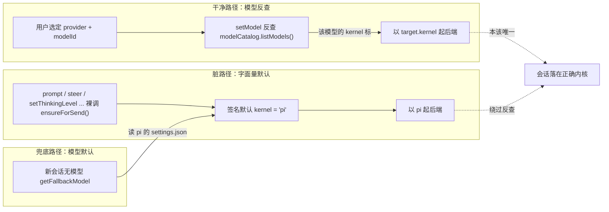
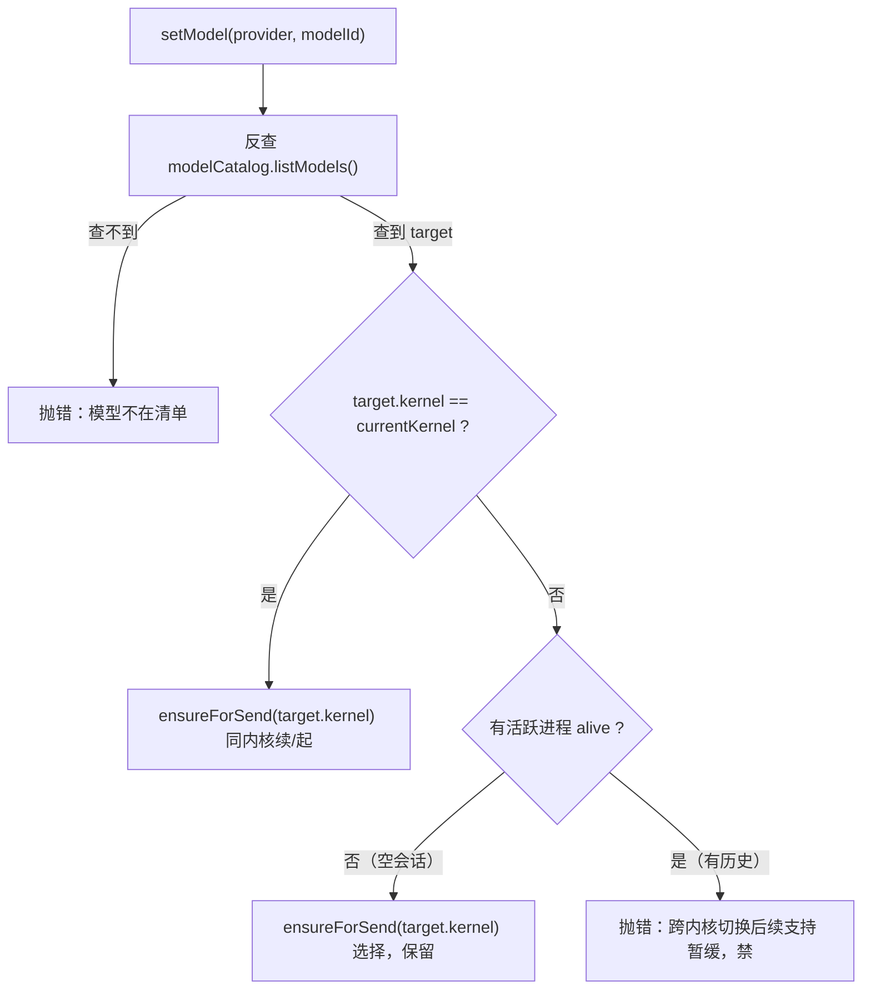

# 内核身份跟随模型：清理"默认 pi"残留，暂缓跨内核切换

这篇文档要解决的是一个方向问题，不是一个 bug 列表。桌面壳托管两个同级内核（pi 和 dsh），一个会话该由哪个内核来跑，这件事今天被两股力量拉扯着：一股是"选哪个模型"——模型清单里每条都带着内核归属，选一个 dsh 模型，会话就该交给 dsh；另一股是"默认 pi"——一堆写死在代码里的字面量，把没有模型信息的地方统统兜底成 pi。前者是对的，后者是 pi-only 时代留下的包袱。这篇文档做的只有两件事：把后者清理干净，让"内核 = 模型的派生量"成为唯一的事实；以及在这种清晰之后，把"跨内核切换"这件事显式地、有意识地暂缓掉，同时保证未来放开时不用重写任何东西。

先把一个容易混淆的边界说死，后面所有论证都建立在它上面：**"选择内核"和"切换内核"是两回事**。一个新会话还没有历史，用户选了 dsh 模型，会话从第一条消息起就交给 dsh——这是选择，它只依赖"模型属于哪个内核"这一个反查，不搬任何历史。一个有历史的会话，已经用 pi 跑了几轮，用户这时又点了一个 dsh 模型——这是切换，它要中止在飞回合、快照整棵 lineage 树、把历史灌进另一个内核、再找回原会话身份。前者今天已经通了，且应该保留；后者正是要暂缓的东西。把它们搅在一起，是现状里"切换"这个动作暧昧不清的根源。

## 1 问题：内核身份被"默认 pi"污染

### 1.1 内核的正确语义是模型的派生量

内核身份不该有独立的值。一个会话用哪个内核，只由一件事决定：用户实际选定的那个模型，在模型清单里标注的内核归属是什么。`ModelCatalog` 合流了 pi 和 dsh 两路模型源，`listModels()` 吐出来的每条 `ModelInfo` 都带着 `kernel` 字段（`src/core/application/models/model-catalog.ts` 的 `ModelCatalog`，构造时注入 `PiModelSource` 和 `DshConfigSource` 两个 `KernelModelSource` 实现）。这条 `kernel` 标注就是内核身份的唯一权威来源——它从哪来，内核就往哪走，中间不该有第二个判断。

这个语义落在代码里，就是 `SessionStore.setModel`（`src/core/application/sessions/session-store.ts`）里那一段"反查模型归属内核"的逻辑：拿到 `provider` 和 `modelId`，在 `modelCatalog.listModels()` 里找到这条模型，读出它的 `kernel`，再据此起对应内核的后端。这段逻辑的方向是对的，它把内核当成了模型的因变量。问题不在这段逻辑，而在于它之外还有别的路径可以决定内核，而且那些路径都不经过模型反查，直接拍一个 `"pi"` 出来。

换句话说，今天的系统里，内核身份有两条来源：一条是干净的（模型反查），一条是脏的（字面量默认值）。两条都能起进程，脏的那条在模型信息缺失或进程恰好不在的时候接管，于是"新会话永远是 pi 起步"——不是因为设计上让新会话默认 pi，而是因为脏路径恰好在那个时刻是唯一走得通的路。

把这两条来源画出来，问题一目了然：内核身份本应只从左边那条干净路径流出，但右边那条脏路径绕过了模型反查，直接拍一个 pi。



**图 1 — 现状内核身份有两条来源：干净路径（模型反查）之外，还有一条绕过反查、直接拍 pi 的脏路径，兜底路径又给它喂 pi 模型**

这里顺带回答一个方向性的问题，因为它在设计讨论里出现过、也被否决过，值得把它为什么被否决写清楚：为什么不走"会话固定内核"这条路？那条路的意思是，给每个会话持久化一个独立的 `kernel` 属性，创建时确定、打开时读回、模型选择约束在本内核内。它听起来更严谨，但它引入了一个**独立于模型的内核身份**，于是系统里有了两个需要分别维护、还要保证彼此一致的东西——用户选了 pi 的模型，却把会话内核设成 dsh，这种打架的状态就成了一种必须专门处理的新错误。"内核跟模型走"把这个一致性问题整个消解掉了：内核永远是模型的函数，不存在"内核和模型不一致"这个状态。会话看起来仍然是"固定内核"的——一个会话的模型偏好一旦确定，内核就跟着定了——但这个"固定"是涌现出来的结果，不是额外维护的属性。维护两个会漂移的字段，不如只维护模型一个、让内核作为派生值。这正是"先想统一抽象，再分类"和"内容驱动、别 switch"两条纪律的具体化：内核不是一个并列于模型的抽象，它是模型在某一个维度上的投影。

### 1.2 五处"默认 pi"残留及根因

要理解这些残留为什么存在，得回到历史。pi 曾经是唯一的底座，`SessionProc.kernel` 这个字段是 dsh 进来之后才补上去的，补的时候为了不动原来的调用链，给它塞了一个 `"pi"` 默认值，于是所有"没传内核"的老代码继续按 pi 跑。dsh 的能力是旁路接入的——走 `setModel` 反查模型、走 `ensureForSend("dsh")` 直接起后端——但 pi 的那条默认链没人动。这就是"默认 pi"的根：它不是某个决策，而是历史迁移的惯性。

具体到今天，这五处残留是：

- `ensureForSend` 的签名默认值（`session-store.ts` 的 `private async ensureForSend(kernel: "pi" | "dsh" = "pi")`）。这是源头——函数级默认参数，意味着任何一处裸调 `ensureForSend()` 都静默落到 pi。
- 六处裸调 `ensureForSend()`：`prompt`、`setThinkingLevel`、`steer`、`followUp`、`cycleModel`、`cycleThinkingLevel`。这六个方法没有一个拿到模型信息，却都敢"按需起进程"，起的当然是 pi。
- `setModel` 内部的 `ensureForSend(currentKernel ?? "pi")`。当反查不到模型（`target` 为 `undefined`）或当前内核未知时，`?? "pi"` 兜底。
- `start` 的签名默认值 `kernel: "pi" | "dsh" = "pi"`，以及 `restart` 里写死的 `"pi"`。打开一个历史会话、重启一个进程，内核都不读回，直接 pi。
- `getFallbackModel`（`src/api/ipc/kernel.ts`）读的是 `kernelModels.pi.readConfig()`，写死了 pi 侧配置，注释里那句"新会话默认内核是 pi"把"默认模型恰好是 pi 的"偷换成了"默认内核是 pi"。

其中前四处是真正的"内核默认"——它们不经过模型反查，直接决定用哪个内核，是必须清理的对象。第五处性质不同：它是"模型默认"，不是"内核默认"。新会话用户不选模型时，得有一个模型可用，这个模型今天恰好来自 pi 的 settings.json。要改的只是它被表述成"默认内核"这个错误说法，以及（如果将来想让 dsh 模型也能当默认）它的真相源从 pi 专属改成合流口径。这两件事不能混——把"默认模型"误当"默认内核"来删，会把"新会话没模型可发"这个真实需求一并删掉。

这五处合起来的效果，就是前面反复观察到的现象：开一个全新会话，不点模型直接打字，`sendMessage` 走 `getFallbackModel()` 拿到 pi 的默认模型，`setModel` 反查出 pi，会话落在 pi 上；而即便不通过这条路径，`prompt` 里那声裸调 `ensureForSend()` 也会在进程不在时补一个 pi。pi 就这样被两条脏路径反复确认成"默认"，而它本不该有任何默认。

把每处残留对应到具体的用户操作，可以看清楚它们各自在什么时刻接管，而不是笼统地说"默认 pi"：

- `ensureForSend` 的签名默认值，配着六处裸调，触发于"绕过 setModel 直接对会话操作"：一个插件直接调 `ctx.messaging.prompt(text)`（不经过 renderer 侧 `sendMessage` 的模型对齐），或调 `ctx.models.setThinkingLevel(level)` 而进程恰好没在跑。这些操作手里没有模型信息，今天却敢按 pi 起一个后端。
- `setModel` 的 `?? "pi"`，触发于"选了一个不在清单里的模型"：模型被从配置里删了、两份配置漂移了、或调用方传了个拼错的 modelId。反查落空，本应报错，今天却默默起 pi 然后让 pi 底座去报 "Model not found"——报错的地方和报错的原因隔着两层，诊断价值极低。
- `start` 和 `restart` 的写死 pi，触发于"重开一个曾经用 dsh 跑的会话"：dsh 会话没有文件头，`start` 读不到 pi 头，就按默认 pi 起。用户看到的是，昨天还在 dsh 里聊的会话，今天重开变成 pi，模型也换回了 pi 的默认——静默的内核漂移。
- `getFallbackModel` 读 pi 配置，触发于"新会话直接打字、没点模型"：这是最主流的路径，所以"新会话默认 pi"这个印象最牢，也最误导——它不是设计，是兜底模型恰好是 pi 的。

这四组场景有一个共同点：没有一个场景是"用户明确要求用 pi"。pi 之所以反复出现，都是因为在"信息缺失"的缝隙里，脏路径用字面量默认值把缝隙填上了。清理要做的，就是把这些缝隙改成显式的报错或显式的读回，让"缝隙"不再被静默填成 pi。

## 2 清理：删掉内核默认，把"起进程"收敛到 setModel

清理的总原则只有一条：**只有 `setModel` 有权决定内核并起进程，因为它手里有模型信息**。其余任何方法——`prompt`、`steer`、`setThinkingLevel`、`cycleModel`——都没有模型信息，它们唯一该做的是确认进程已经在跑，不在就报错，而不是自己起一个 pi。这一条原则同时删掉了前四处残留，因为它把"起进程"从六个散落的方法里收回到唯一一个有资格做这件事的地方。

### 2.1 ensureForSend 去掉默认参数

改动最小的一处，也是牵一发动全身的一处。把签名从 `kernel: "pi" | "dsh" = "pi"` 改成 `kernel: "pi" | "dsh"`（必传），编译器立刻逼出所有裸调点——这是 `KernelId` 字面量联合的红利：默认值一删，`ensureForSend()` 这种无参调用直接编译不过，逼着每一处显式交代"我这个内核从哪来"。这一步的价值不在于它本身多复杂，而在于它把"内核必须显式给定"这件事从约定变成了编译期约束，堵死了未来再有人顺手裸调、静默落 pi 的口子。

这里有一个细节要同时处理：`ensureForSend` 内部还有一段 pi 专属的逻辑，新会话且 `kernel === "pi"` 时才生成会话文件路径，dsh 则让后端自定桶名。这段逻辑本身是对的——它区分的是"pi 要文件路径、dsh 不要"这一层契约差异，不是默认值，所以保留不动。去默认参数不影响它，只是让调用方必须先把内核定下来，这段逻辑才能按正确的内核走。

为什么用"去掉默认参数"而不是"在函数内部加一个运行时断言 `if (kernel === undefined) throw`"？因为两者的失败时机不一样。去掉默认参数，`ensureForSend()` 这种裸调会在编译期就失败——`KernelId` 是 `"pi" | "dsh"` 的字面量联合，少传参数直接类型不匹配，哪个调用点漏改，编译立刻指出它。运行时断言则要等到那条路径真的被执行、而且是"进程恰好不在"那个罕见时刻才炸，炸在用户面前，且要覆盖全部分支才敢放心。这是"漏改就编译不过"和"漏改到运行时才现形"的区别，前者把缺陷拦截在提交之前，后者把它交给用户。清理默认值这件事的价值，一半在删掉那个 `"pi"`，一半在把它从"运行期靠自觉"提升成"编译期靠类型"。

### 2.2 六个无参调用点改为"断言在跑"

六处裸调改法一致，语义从"按需起（默认 pi）"收窄为"确认在跑，不在报错"。以 `prompt` 为例，现在的开头是 `await this.ensureForSend()`，改后变成：

```ts
const proc = this.activeProc();
if (!proc || !proc.backend.alive) throw new Error("会话未启动，请先选择模型");
```

这六个方法（`prompt`、`setThinkingLevel`、`steer`、`followUp`、`cycleModel`、`cycleThinkingLevel`）有一个共同特征：它们在正常调用链里，前面必然已经有 `setModel` 把进程起好了。发消息时，renderer 的 `sendMessage`（`src/api/renderer/stores/session-store.ts`）总是先 `setModel`（pending 或 fallback 或 header 偏好）再 `prompt`；pref flush 是 `setModel` 之后再 `setThinkingLevel`。所以断言只在一个异常路径触发——有人绕过 setModel 直接调这些方法——而那个路径今天的行为是"默默起一个 pi"，改后变成"明确报错"，从无声的错变成有声的错，是纯收敛。

这个改动有一个值得说透的连带效果：它把"起进程"这个动作的语义从"六个方法各自负责"变成了"setModel 独有"。今天读 `prompt` 的注释还写着"唯一会起进程的入口"，但实际上起进程的入口散在七处，注释和现实已经脱节。清理之后，注释终于可以回到字面意思：起进程真的只有 setModel 一个入口，其余方法只消费一个已在跑的进程。

这六个方法可以粗分成两类，但结论是报错语义统一，不需要为分类引入差异。一类是发送类——`prompt`、`steer`、`followUp`——它们的前提是"会话流已经建立"，进程不在就意味着没有可以续的上下文；另一类是配置类——`setThinkingLevel`、`cycleModel`、`cycleThinkingLevel`——它们操作的是"一个已在跑的进程的状态"，进程不在则操作无对象。两类失败时该给用户的提示其实是一句话："会话还没启动，先选个模型发一条消息"。刻意去区分"发送类的错误"和"配置类的错误"，除了多两条文案、多一份测试，没有换来任何可操作的差异——这正是"先统一抽象，再分类"的反面教材：六处的行为差异是参数级的（差在方法名），不是行为级的，该收敛成一个断言，而不是六份各带说辞的检查。

### 2.3 setModel 重构：一处完成三件事

`setModel` 是这次清理的核心，也是"暂缓切换"的落点（§3 会展开）。它今天的逻辑把三件本该分开的事搅在一个 if-else 里：反查模型、决定内核、跨内核时切还是起。重构把它理成三步：

```ts
const target = /* 在 modelCatalog.listModels() 里找 provider+modelId 匹配，同内核优先 */;
if (!target) throw new Error(`模型不在清单: ${provider}/${modelId}`);   // ① 删 ?? "pi" 回落

if (target.kernel !== currentKernel) {
  if (proc0 && proc0.backend.alive) {
    throw new Error("当前会话已固定内核，跨内核切换后续支持");          // ② 暂缓切换落点
  }
  await this.ensureForSend(target.kernel);                             // ③ 空会话：以模型归属内核起
} else {
  await this.ensureForSend(target.kernel);                             // 同内核
}
```

三处改动的理由分别说。

**① 删掉 `?? "pi"` 回落。** 今天 `setModel` 末尾那条 `ensureForSend(currentKernel ?? "pi")` 里，`?? "pi"` 只在两种情况下命中：模型反查不到（`target` 为 `undefined`），或当前内核未知（`currentKernel` 为 `undefined`，即新会话还没进程）。第一种情况，"查不到模型"本就是个该报错的输入——用户选了一个不在清单里的模型，正确的反应是告诉他"没有这个模型"，而不是默默起个 pi 然后让 pi 底座自己去报 "Model not found"。第二种情况，`currentKernel` 未知时，内核本应由 `target.kernel` 决定，而 `target` 若存在，`target.kernel !== currentKernel`（因为 `currentKernel` 是 undefined）必然成立，会走上面的跨内核分支——所以 `?? "pi"` 这条 else 分支在第二种情况下根本走不到，它纯粹是第一种情况（查不到模型）的兜底。删掉它，让"查不到模型"显式报错，逻辑闭环。

**② 暂缓切换的落点。** `proc0.backend.alive` 为真且目标内核不同于当前内核，意味着"有历史的会话要换内核"——这正是要暂缓的动作。今天这里是 `switchKernel(target.kernel)`，改成抛错就是"暂缓"。这一行是整篇文档里"禁用切换"的全部落点之一，另一个在 §3.2 的 switchKernel 入口 gate。为什么偏偏落在这里、而不是在 switchKernel 内部去判断，§3 会讲。

**③ 空会话以模型归属内核起。** 这是"选择"而非"切换"，保留。`proc0` 不存在或 `proc0.backend.alive` 为假，意味着会话还没有活进程（新会话，或历史会话尚未起），此时以 `target.kernel` 直接起后端，没有任何历史要搬，是干净的选择。

重构后的 `setModel` 有且只有一个职责：把"用户选定的模型"翻译成"哪个内核、起还是续"，翻译不了就报错。它不再承担"默认 pi"的兜底，也不再承担"切换"的编排（那件事暂时降级成一行 throw）。

用四个输入场景对照重构前后的净变化，能看清这次改动到底改变了什么、没改变什么：

- 选一个清单里的 pi 模型、空会话——前后都是起 pi，行为不变。这是"选择"的主路径，重构只是把它从"藏在 if-else 里的巧合"变成"显式的同内核分支"。
- 选一个清单里的 dsh 模型、空会话——前后都是起 dsh（走 `ensureForSend(target.kernel)`），行为不变。这是"选择"的另一半，也是"纯 dsh 会话"今天唯一正确的诞生方式，重构必须原样保留，不能误伤。
- 选一个清单里的 dsh 模型、已有活跃的 pi 进程——前：`switchKernel` 把会话切到 dsh；后：报"跨内核切换后续支持"。这是本次唯一一个有意的行为改变，即"暂缓切换"。
- 选一个不在清单里的模型——前：`ensureForSend(pi)` 起 pi，然后 pi 底座报 "Model not found"；后：`setModel` 直接报"模型不在清单"。报错从"隔着两层、发生在别处"变成"就地、明确"。

四个场景里，只有第三个是行为改变，第四个是报错质量提升，前两个完全不动。这说明重构的净效果很克制：它没有改变"跟模型走"的主语义，只是把"暂缓切换"和"删默认 pi"这两件早已想清楚的事，落到了它们各自应该待的那一行上。

把"存量用户不受影响"这件事正面说一遍，免得读者要绕到 §2.2 和 §2.4 两处去间接推断。一个只用 pi 的用户，他的三条日常路径在这次改动后都不变：新会话发消息（§2.2 里发送链先 setModel 再 prompt 的顺序没动）、在 pi 模型里选一个模型（§2.3 前两个场景明确"行为不变"）、重开一个历史 pi 会话（§2.4 读回 pi 头、无 dsh 证据落回 pi，结果还是 pi）。真正变的是四条异常或边界路径，而且它们统一从"静默的错"变成"显式的报错或显式的读回"：绕过 setModel 直接操作会报"会话未启动"（不再是静默起 pi）；有历史会话选别家内核模型会被挡（暂缓切换）；选一个不在清单里的模型会就地报错（不再隔着 pi 底座报 Model not found）；重开一个 dsh 会话不再漂移成 pi（读回归属）。正常路径全保，异常路径全部显式化——这是这次改动对存量用户最诚实的承诺，也是一句能直接写进变更说明的话。

### 2.4 start/restart 打开历史会话读回内核

前两节处理的是"新会话/发送路径"上的默认 pi，这一节处理"重开历史会话"这条路径。今天的 `start`（签名默认 `kernel = "pi"`）和 `restart`（写死 `"pi"`）在打开或重启一个会话时，内核都不读回，直接 pi。这在 pi-only 时代无所谓，现在会让一个曾经用 dsh 跑的会话，重开之后莫名其妙变回 pi。

`restart` 的改法最简单：它本来就有 `proc` 在手，`proc.kernel` 就是重启前这个会话的内核，把写死的 `"pi"` 换成 `proc.kernel` 即可——重启不换内核，这个不变式顺手就守住了。

`start` 的改法要绕一点，因为打开历史会话时进程还没建，得先知道"这个会话上次是哪个内核"。这个信息的落点今天已经存在，只是没人读：

- pi 会话有文件头，`writeKernelToHeader`（`session-store.ts`）已经把 `custom-my-harness-desktop.kernel` 写进了 pi 会话的头行，`start` 打开 pi 会话时读这个字段即可。
- dsh 会话没有文件头，它的内核归属记在 `SessionBindingStore` 里（`src/core/application/sessions/session-binding-store.ts`），按 `(neutralSessionId, kernel)` 存了每个内核的私有会话 id。`start` 先经 `resolveNeutralSessionId` 拿到中立 id，再查 bindingStore 就能知道这个会话有没有 dsh 绑定。

这里要说清一个边界，避免把它做成过度设计：`start` 读回内核的目标，只是"打开一个 dsh 会话时不要起成 pi"，而不是"实现一套完整的历史会话内核恢复系统"。pi 读头、dsh 读 binding，两条路都只做"读一个已经写好的字段"这一件事，不新增存储、不新增协议。真正的内核归属真相源，短期就是"会话头（pi）+ bindingStore（dsh）"这两个现成的记录，长期等切换能力放开后再统一到中立层（`NeutralSessionStore` 的 `header.kernel` 字段也已经存在，届时是更干净的单一落点）。

读回的失败路径要一并定清楚，否则"读不到就报错"和"读不到就落 pi"会被混淆——本次清理的结论是**读不到即报错，不落 pi**（内核 = 模型的派生量，没有模型/没有记录就没有内核，静默落 pi 正是 §1 批判的脏路径）：

- pi 会话头里没有 `custom-my-harness-desktop.kernel`、也没有 model 域 kernel——发生在极老会话（在 `writeKernelToHeader` 落地之前创建的会话）上。此时查过了、确实没有内核记录，报"无法确定会话内核"，不静默落 pi。
- bindingStore 里没有这个中立 id 的 dsh 绑定——发生在这个会话从来没切到过 dsh、也从没以 dsh 起步过。同样是"查了没查到"，报错。
- 两个来源若冲突（pi 头说 pi、binding 说 dsh）——需要定一个优先级。bindingStore 是"切换动作显式写下的、带时间戳的绑定记录"，比 pi 头里那句"顺手写下的 kernel 归属"更接近真相，且它记录的是"这个中立会话确实在 dsh 侧有私有 id"这个更强的事实。所以冲突时以 bindingStore 为准：有 dsh 绑定就按 dsh 起，没有才读 pi 头（model 域 kernel → 会话头 kernel），再没有就报错。

这条优先级不是凭空定的，它顺承了 `switchKernel` 里已有的收口逻辑——`writeKernelToHeader` 的注释写着"真相源 = bindingStore（switchKernel 已 put），pi 头行顺手写"（`session-store.ts` 的 `writeKernelToHeader`）。读回侧沿用同一个真相源判断，写读两侧才不自相矛盾。

### 2.5 getFallbackModel 的定性：模型默认，不是内核默认

这一处要单独拎出来说，因为它最容易被误伤。`getFallbackModel`（`src/api/ipc/kernel.ts`）的职责是：新会话用户没显式选模型时，返回一个"需要显式 set 的兜底模型"（含 kernel——因为内核必须由模型归属决定，不能靠 `setModel` 反查 provider+id 猜）。它读的是 pi 的 `settings.json`（或 dsh 的 agent-default-model），兜底模型恒带一个明确的 kernel 标。

关键判断：这是**模型默认**，不是**内核默认**。内核默认是说"不管模型是什么，内核拍死 pi"；而 `getFallbackModel` 返回的 kernel 是"这条兜底模型的归属"，不是写死的"默认 pi"。把 `getFallbackModel` 的写死 pi 当成"内核默认"来删，会错删掉"新会话没选模型也能发"这个真实能力。

这一处实际改动：返回值加 `kernel` 字段（dsh 默认 → `kernel:"dsh"`，pi 默认/首项 → `kernel:"pi"`）；并把原来"pi 有默认模型时回 `null`（让底座自读默认）"改成"返回该默认模型 + kernel"——否则 `null` 会让 renderer 跳过 `setModel`、内核无从确定（与"内核必须显式给定"矛盾）。至于要不要让兜底模型"可能来自 dsh"（比如全局默认模型可以设成 dsh 模型），那是"全局默认模型"这个独立话题，和本次清理无关，不做。把这两件事分开，清理就不会把范围扩大到不该碰的地方。

## 3 暂缓切换：只禁"有历史的切换"，接口全留

清理掉默认 pi 之后，"内核跟模型走"就干净了。但还有一个问题悬着：有历史的会话，用户点了别家内核的模型，怎么办？今天的行为是 `switchKernel` 直接切过去，做中止、快照、seed、重绑这一整套。这套逻辑本身是完整且正确的，但它的成本不低——七步编排、pi/dsh 两侧生命周期不对称、映射表回切、失效回退——而且它和这次要做的"清理默认 pi"没有关系。所以结论是：切换这套东西不是要改，是要**暂缓**——把它的入口暂时关掉，让它不被误触发，同时把整套实现原样留着，未来要放开时只拨开关。

### 3.1 "选择"与"切换"的边界

前面 §1.1 已经把这个边界立起来了，这里把它落到可执行的判据上。判断一个动作是"选择"还是"切换"，只看一条：**目标内核之外，是否还牵涉到"已有历史"的迁移**。

- 空会话（没有活跃进程，或会话还没有任何消息），以某个模型归属的内核起后端——不搬历史，是选择。它在 `setModel` 重构后的跨内核分支里对应 `proc0.backend.alive` 为假的那条路（`ensureForSend(target.kernel)`）。
- 有历史的会话（活跃进程在跑，或会话已落盘了消息），要把内核从 A 换成 B——要中止在飞回合、快照 lineage 树、seed 进新内核、找回原会话身份，是切换。它对应 `proc0.backend.alive` 为真的那条路。

为什么这条边界重要？因为"暂缓切换"如果定义不清，很容易误伤"选择"。一个最常见的误伤就是：把"禁止切换"实现成"禁止跨内核起任何后端"，结果连"新会话直接选 dsh 模型"这个本该保留的能力一起禁掉了，退回到"永远只有 pi"的老路。这条边界的作用，就是把"暂缓切换"精确限制在"有历史、要迁移"这一半，不碰"空会话、纯选择"那一半。

下图把这条边界画成流程：从 `setModel` 反查出目标内核之后，只有两条岔路，岔路的判据就是"有没有活跃进程"。



**图 2 — setModel 重构后的内核路由：判据只有"模型归属"和"是否有活跃进程"两件事，切换被显式停在 H 这一支**

这条边界的判据"有没有活跃进程"，在一个场景上会显得有点粗，值得把它讲清楚：一个会话已经落盘了历史消息，但当前没有活跃进程（比如用户重启了应用、或这个会话的进程被回收了），这时用户点一个 dsh 模型，算选择还是切换？按"有没有活跃进程"这条判据，它会落到"空会话"那一支，直接以 dsh 起后端——但这会丢掉已落盘的历史（dsh 侧不会自动读回 pi 的 JSONL 历史）。这个场景的真实语义是"切换"（有历史、要迁移），只是进程恰好不在。

这个边界在当前阶段不构成实际问题，因为 `switchKernel` 入口 gate 和 `setModel` 的 alive 分支都只拦"活跃进程在跑"的情况；"有落盘历史但进程不在"这个场景，在暂缓期间会退化成"以 dsh 起一个空会话、历史留在 pi 文件里不再继续"——这是暂缓的一个已知边界，不是 bug，但它必须被诚实地记下来（§5 QA 会单列），否则未来放开切换时，实现者会漏掉"有历史但进程不在"这条分支，误以为"没进程就是空会话"。正确的长期判据不是"有没有活跃进程"，而是"有没有可迁移的历史"——前者是后者的一个近似，只在暂缓期间够用。

### 3.2 两个禁用点

"暂缓切换"落在两个地方，一个管隐式触发，一个管显式调用。

**隐式触发点**在 `setModel` 重构后的那段 `if (proc0 && proc0.backend.alive) throw ...`（§2.3 的 ②）。这是"选了个别家内核的模型"这条隐式路径的入口，把它从"调 switchKernel"改成"抛错"，隐式切换就关掉了。选在这里而不是在 `switchKernel` 内部判断，理由是职责：`setModel` 是"模型 → 内核"的翻译层，它最清楚"现在有没有活跃进程、目标内核是否不同于当前"，由它来决定"这个动作是选择还是切换"，比让 `switchKernel` 自己去猜"我是被选择调来的还是被切换调来的"要干净得多。`switchKernel` 的语义从此纯粹化：它只做"有历史会话的跨内核迁移"，不再承担"空会话起后端"这种它本就不该管的事（那个职责还给 `ensureForSend`）。

**显式调用点**在 `SessionStore.switchKernel` 入口加一个 gate，开头一行 `throw new Error("跨内核切换暂未启用")`。这是给那些绕过模型选择、直接调 `switchKernel` 的入口（IPC channel `session:switchKernel`，`src/api/ipc/sessions.ts`）上的保险。加了 gate 之后，`switchKernel` 这个方法和它的七步编排全部原样保留，只是任何调用都会在第一步被挡回。

两个禁用点的关系是：隐式点挡住了"选模型触发的切换"这条主路径，显式点挡住了"直接调 API 触发的切换"这条旁路。缺任何一个都有漏——只挡隐式，有人直接 `ctx.sessions.switchKernel("dsh")` 还是能切；只挡显式，用户点一个 dsh 模型照样触发 switchKernel。两个都挡，才真正"暂缓"。

### 3.3 未来放开 = 拨两个开关，零重写

这条是整篇文档里最要紧的一条，因为它回答了"现在暂缓会不会把未来堵死"这个最初的担心。答案是：不会，因为放开不是"把之前删掉的东西重新写一遍"，而是"把两处拒绝换回调用"。

- 隐式点：把 `setModel` 里那行 `throw new Error("当前会话已固定内核，跨内核切换后续支持")` 换回 `await this.switchKernel(target.kernel)`。
- 显式点：把 `switchKernel` 入口那行 `throw new Error("跨内核切换暂未启用")` 删掉。

就这两行。`switchKernel` 的七步编排（abort → 落定 → 快照 → stop → 查绑定 → 分内核 seed/start → 重绑）、`piSeedSession` 的纯函数 seed 与 `DshBackend.seed` 的 RPC seed 这两个生命周期不对称、`SessionBindingStore` 的映射表回切、`isBindingValid` 的失效回退、`capabilities.pi/.dsh` 的能力探测降级——这些全部已经实现且有测试覆盖（`session-store.test.ts` 里的 `switchKernel 五步切换` 和 `switchKernel 失效回退 + 预 seed` 两个用例）。暂缓期间它们一行都不删，只是没入口。放开的那天，拨两个开关，测试照跑，行为回来。

这里要顺带澄清一个可能的误读：暂缓不等于"这套代码可以锈掉"。`switchKernel` 依赖的 `seed`、映射表、能力探测这些，在暂缓期间依然被别的路径使用——`createProc` 会写 bindingStore（打开历史会话时），`ensureForSend` 会走 `factory.create`（起后端时），`bindProcEvents` 会绑 `capabilities`（每个后端启动时）。所以这套机制不是被冻结在冰里，而是"入口关了、机制照转"，等放开时它和外围是同步演化过的，不会出现"放了半年、接口对不上"的烂摊子。

把"未来放开"说成"拨两个开关"是准确的，但它不是全部。放开时还有三件连带的事要一并做，否则切换恢复了也会留下毛边。这里把它们列全，既是给未来实现者的一份备忘，也是给"暂缓会不会埋雷"这个担心一个诚实的答案：

- 恢复两个入口之后，要补上 §3.1 末尾点出的那个边界——"有历史但进程不在"的切换。今天的 `switchKernel` 开头是 `if (!proc || !proc.backend.alive) throw new Error("底座未启动")`，它只接受"活跃进程在跑"的切换。放开时，要么显式声明"切换仍只支持活跃进程、有历史但进程不在的场景先起旧内核再切"（需要一个前置编排），要么接受这个限制并写进文档。这不是暂缓造成的，是 `switchKernel` 现有实现本来的边界，放开时必须当面处理，不能假装它会自动变好。
- UI 层的置灰（如果第二批做了）要取消——模型 TAB 条恢复可点别家内核，`kernelChanged` 事件的触发源也随之恢复，renderer 侧那段监听（`src/api/renderer/stores/session-store.ts` 里 `evt.kind === "kernelChanged"`）自动重新生效，不需要额外接线。
- 测试要回到绿：`switchKernel 五步切换` 和 `失效回退 + 预 seed` 两个用例在暂缓期间被 gate 挡在入口外，放开时把它们重新纳入，并补一条"有历史但进程不在"的用例（对应上面第一点）。

这三件加上两个开关，才是"放开切换"的完整动作。所以更准确的说法是：放开的主体是拨两个开关，尾巴是处理一个既有边界、恢复一段 UI、补一条测试——主体零重写，尾巴是诚实的收尾。

### 3.4 不删什么（防焊死清单）

暂缓切换最容易犯的错，是顺手把"看起来没用了"的切换机制删掉，因为删了当下也不影响运行。这里把绝对不能动的四样东西点死，每样都给一句"为什么动了就是焊死"：

- `switchKernel` 的实现（`session-store.ts` 里七步编排）。这是未来放开要直接调用的完整逻辑，删掉等于未来重写一遍最难的部分——中止落定、拓扑快照、边界归一、分内核 seed、失效回退，任何一段重写都是新的 bug 温床。
- `seed` 契约与两个实现（`BackendFactory.seed`、`piSeedSession`、`DshBackend.seed`）。seed 是"把中立会话树灌进另一个内核"的能力，是切换的硬依赖；同时它也是"空会话以目标内核起后端"这条选择路径在 dsh 侧的首切入口（dsh 首切要走 seed），不是切换专属。
- `KernelId` 字面量联合与 `KERNEL_IDS`（`src/core/domain/kernel.ts`）。这是内核身份的单源，`"pi" | "dsh"` 的字面量联合让编译器在"加第三个内核"时逼补全所有 switch 分支。把它退化成 `string`，就丢掉了这道编译期防线，未来放开切换乃至加内核时，漏改会静默发生。
- `capabilities.pi/.dsh` 能力探测面（`BaseBackend.capabilities`，`src/core/domain/backend.ts`）。它是"有则用、无则降级"的机制，切不切换都靠它区分 pi/dsh 的能力差异。删了它，代码就会退回到"按内核身份硬分支"的泄漏。

这四样的共同点：它们都是"多内核架构"的骨架，不是"切换功能"的零件。暂缓切换只关骨架上的一个入口，不动骨架本身——这是"暂缓"和"拆除"的分界线。

把"焊死"说得再具体一点，每样删掉后的第一个可见后果是这样的：删 `switchKernel` 实现，未来放开时七步编排要重写，而中止落定、拓扑快照、边界归一这些每一步都是踩过坑的深水区（在飞回合不等落定就快照会丢半截消息，回切命中绑定不校验会静默开空会话），重写等于把坑再踩一遍；删 `seed` 契约，dsh 空会话首切这条选择路径跟着断——因为 dsh 起后端要 seed 出子会话 id 才能重绑 `this.sessionId`，seed 不是切换专属，是 dsh 后端的硬依赖；删 `KernelId` 联合退化成 `string`，加第三个内核时所有 `switch (kernel)` 分支静默漏掉，编译不再兜底，漏改从"提交前报错"变成"运行后现形"；删 `capabilities` 探测面，代码退回 `if (kernel === "pi")` 的硬分支，pi/dsh 的差异重新漏进编排层，"有则用、无则降级"的能力探测机制整个失效。这四样每一样被删，都不是"少了切换"，而是"多内核架构塌了一角"。

## 4 落点清单与影响面

这一节把前面散在各处的改动收拢成一份可执行的清单。不是把源码逐条盘一遍，而是按"改哪个文件、改什么、为什么"的顺序，让实现者不用回头翻前文就能动手。所有锚点都落到具体的函数名和文件。

### 4.1 session-store.ts 逐处落点

改动共七处，主体在 `src/core/application/sessions/session-store.ts`（六处），外加 `api/ipc/kernel.ts` 一句注释：

- `ensureForSend` 签名：去掉 `= "pi"` 默认值，改为必传 `kernel: "pi" | "dsh"`。删完这一处，编译会逼出下面所有裸调点。
- `prompt`、`setThinkingLevel`、`steer`、`followUp`、`cycleModel`、`cycleThinkingLevel` 六个方法：把 `await this.ensureForSend()` 换成"取 `activeProc()`，不在或没 alive 就抛 `会话未启动，请先选择模型`"。
- `setModel`：按 §2.3 重构——反查不到模型抛错；跨内核且 alive 抛"切换后续支持"；跨内核且空会话走 `ensureForSend(target.kernel)`；同内核走 `ensureForSend(target.kernel)`。
- `start` 签名：去掉 `kernel = "pi"` 默认值，改成打开历史会话时读回内核（pi 读 `custom-my-harness-desktop.kernel`，dsh 读 `SessionBindingStore`），新会话则由调用方显式传内核。
- `restart`：把 `createProc(..., "pi", ...)` 里写死的 `"pi"` 换成 `proc.kernel`。
- `switchKernel` 入口：加一行 gate，`throw new Error("跨内核切换暂未启用")`。
- `getFallbackModel` 的注释（这个在 `api/ipc/kernel.ts`，不在本文件）：删掉"新会话默认内核是 pi"的错误表述。

七处里，前五处是"清理默认 pi"，后两处是"暂缓切换 + 表述修正"。改动都落在 `session-store.ts` 一个文件里（外加 `api/ipc/kernel.ts` 一句注释），没有跨层的结构性变化——这正是"内核跟模型走"这件事足够内聚的体现。

### 4.2 api/ipc/kernel.ts 与契约层

契约层（`src/core/domain/`）这次一行不动。`SessionsApi.switchKernel`、`BaseBackend.seed`、`BackendFactory.create/seed`、`KernelId`、`capabilities` 全部保留原样——暂缓切换不删接口，只关入口，接口和实现都留着等放开。

`api/ipc/kernel.ts` 只有一处：`getFallbackModel` 上方注释的错误表述（§2.5）。`api/ipc/sessions.ts` 里 `session:switchKernel` 这个 IPC handler 保留不动，因为它转调 `sessionStore.switchKernel`，而那个方法入口的 gate 已经挡死了——handler 层不需要重复判断，gate 放在编排层更内聚，避免"每加一个入口都要记得再 gate 一次"。

### 4.3 UI 层（可选，第二批）

UI 层这次可以不动，但有一个可选的改进值得记下来，留给第二批：模型下拉的内核 TAB 条（`src/plugins/sessions/timeline/renderer/composer.tsx`）现在总是列出所有有模型的内核，用户有历史会话时点别家内核的 TAB、选一个模型，会在 `setModel` 处收到"切换后续支持"的报错——能选但选不生效。更顺的体验是：有历史会话时，别家内核的 TAB 置灰加 tooltip，让用户在选择之前就知道不能切。这属于 timeline 插件的内容层，renderer 已经有 `currentModel?.kernel` 可用，不缺口子，但它是纯 UI 打磨，不阻塞本次清理和暂缓，所以单独列第二批。

还有一个连带点要提一句：`switchKernel` gate 生效后，renderer 侧 `kernelChanged` 事件（`src/api/renderer/stores/session-store.ts` 里监听 `evt.kind === "kernelChanged"` 的那段）暂时不会有触发源了，因为它只在 `switchKernel` 成功收尾时 `dispatchKernel` 广播。这段监听代码留着无害（未来放开切换后它重新生效），不需要现在删，删了反而是把未来的口子顺手堵了一小块。

这七处落点各自的测试点，随改动一并列在这里，实现者改完按这个清单补用例，避免"改了对的、漏了验证"：

- `ensureForSend` 去默认参数：这一处不需要新测试，类型系统就是测试——去掉默认值后无参调用编译不过，任何漏改的裸调都会被编译器揪出来。要验证的是"全仓编译过"，而不是某条运行时行为。
- 六个方法的断言：补一个参数化的用例，进程不在时调这六个方法中的任一个，都抛"会话未启动"；进程在时，六个方法正常走原逻辑（不误伤）。
- `setModel` 重构：按 §2.3 的四个场景各补一条——pi 模型空会话起 pi、dsh 模型空会话起 dsh、dsh 模型有活跃 pi 进程抛"切换后续支持"、不在清单的模型抛"模型不在清单"。这四条把重构的净效果钉死，未来放开切换时只需把第三条的期望值从"抛错"改成"switchKernel 被调用"。
- `start`/`restart` 读回：补三条——bindingStore 命中 dsh 绑定的会话重开以 dsh 起、pi 会话头有 kernel 字段的重开以 pi 起、两者都没有的老会话回落 pi（且不报错）。`restart` 用一条"重启不换内核"的用例即可，因为它只是把写死 pi 换成 proc.kernel。
- `switchKernel` gate：补一条，直接调 `switchKernel("dsh")` 抛"跨内核切换暂未启用"，且进程状态不变（gate 在第一行就挡回，不产生副作用）。
- `getFallbackModel`：只改注释，无行为变化，无需新测试；若未来动它的真相源（合流默认模型），再补对应用例。

这些测试点里，最要紧的是 `setModel` 四个场景和 `start` 读回三条——它们覆盖的正是"选择保留、切换暂缓、默认删除、历史读回"这四条本文的核心结论。改完代码，这七条用例先红后绿，就说明本文的方案落在了它声称落的地方。

## 5 QA

**Q：一个有历史但进程不在的会话（比如重启了应用），用户选一个 dsh 模型，算"选择"还是"切换"？**

算"切换"，但暂缓期间它会被误当成"选择"。本文的判据是"有没有活跃进程"，所以"进程不在"会落到"选择"分支，以 dsh 起一个空会话，原来的历史留在 pi 文件里不再继续。这是暂缓的一个已知边界，不是 bug，但它必须被记下来：长期正确的判据是"有没有可迁移的历史"，不是"有没有活跃进程"。未来放开切换时，`switchKernel` 要能处理"先起旧内核、再快照、再切"这种进程不在但有历史的场景，否则这条分支会永远漏掉。

**Q：读回内核失败时怎么办？报错还是回落 pi？**

报错。本次清理把读回失败也收进"显式化"：查了 model 域 kernel、会话头 `custom-my-harness-desktop.kernel`、bindingStore 三处，确实都没有内核记录时抛"无法确定会话内核"，不静默落 pi。这是对 §2.4 的收紧——早期版本曾主张"查无实据落 pi 合理"，但那仍是字面量兜底的口子，与"内核 = 模型的派生量"矛盾，故一并删掉。

**Q：`getFallbackModel` 读 pi 配置，这次为什么只给它加 kernel、不改成合流默认？**

因为它是"模型默认"，不是"内核默认"。它返回的兜底模型来自 pi 的 settings.json（或 dsh 的 agent-default-model），但必须带上这条模型的 kernel 归属，内核由这个 kernel 决定——中间没有第二个拍内核的地方。删掉它会连带删掉"新会话没选模型也能发"这个真实能力。这次的实际改动是：返回值加 `kernel`、并把"pi 有默认时回 null"改成"返回默认 + kernel"（否则 null 会让 renderer 跳过 setModel、内核无从确定）。让兜底模型"也可能来自 dsh"是独立的"全局默认模型"话题，不在本次范围。

**Q：清理后，一个插件直接调 `ctx.messaging.prompt(text)` 而不先 `setModel`，会怎样？**

抛"会话未启动，请先选择模型"。这是本次的一个行为变化：以前是静默起一个 pi，现在是显式报错。插件要发消息，必须先 `setModel`（或走 renderer 的 `sendMessage`，它内部会先 `setModel` 再 `prompt`）。这条路径的变化对存量插件是可感知的，所以要写进变更说明。

**Q：暂缓期间，`switchKernel` 已有的两个测试（五步切换、失效回退）会被 gate 挡成失败吗？**

会，gate 在第一行就挡回。暂缓期间这两个用例要改期望值（断言 gate 抛错），或标记为"放开时重新启用"。放开切换时把它们改回原期望，并补一条"有历史但进程不在"的用例——三条一起，才把切换的入口、回退、边界都覆盖住。

**Q：未来加第三个内核，这套方案要改什么？**

改四处，且编译器会逼你补全：`KernelId` 字面量联合加一个字面量、`KERNEL_IDS` 加一项、`ModelCatalog` 注入一个新 `KernelModelSource`、`BackendFactory.create` 加一个内核分支。清理默认 pi 和暂缓切换的逻辑本身一行不动——它们不依赖内核个数，只依赖"内核 = 模型归属"这一条不变量。加第三个内核不会重新引入"默认 pi"，因为默认值已经删掉了。

**Q：pi 和 dsh 有同名的 provider + modelId，选它时算哪个内核？**

内核不再由 provider + modelId 反查，而是**显式随模型项透传**（`ModelInfo.kernel`）。选择场景 renderer 已知 `m.kernel`，直接传给 `setModel(provider, modelId, kernel)`；读回场景从会话头 model 域的 `kernel` 字段读回。所以同名模型不再有歧义——pi 和 dsh 各有一条 `deepseek/deepseek-chat` 是合法的，内核由"你点的是哪条"决定，不靠"同内核优先"这种隐式兜底。这是本次清理相对早期方案（"同内核优先"反查）的收紧：反查即歧义，宁可显式透传也不猜。

**Q：dsh 会话重开后读回内核，依赖的 bindingStore 数据从哪来？一个从没用过切换的 dsh 会话会有绑定吗？**

有。bindingStore 的写入口有两个：`createProc`（打开历史会话、或以某内核起后端时写绑定）和 `switchKernel`（切换时写绑定）。一个会话只要曾经以 dsh 起过后端——空会话选 dsh 模型走 `ensureForSend("dsh")`，就会进 `createProc` 写绑定——就有 dsh 绑定记录，重开时读得到。所以"读回归属"不依赖"用过切换"，它依赖"曾经以 dsh 起过"，后者是"选择"路径的产物。

