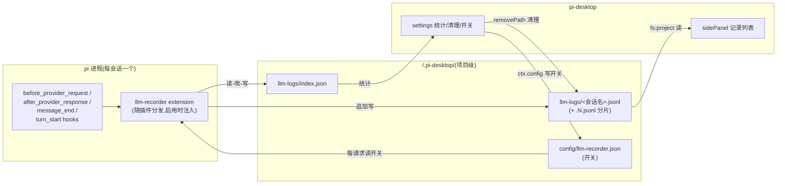

# llm-recorder 设计：LLM 请求记录插件

llm-recorder 是一个桌面插件：把每次 LLM 调用的完整请求体和响应消息落盘成文件，右侧面板按会话查看全部记录，设置页提供统计和清理。数据通道是「底座 extension 写文件、桌面插件读文件」，两半只共享文件契约，互不知晓对方存在。配套的机制增补是一个通用能力——任何桌面插件都能在 manifest 里声明携带一个 pi 底座 extension，随插件启停装摘。

## 1 解决什么问题

### 1.1 诉求

用 pi 干活的时候，经常想知道「这次请求到底发了什么」——完整的消息列表、工具定义、system prompt 拼出来的样子，以及模型完整答了什么。调试 prompt、审查上下文膨胀、复盘一次跑偏的会话，都要看这个。诉求三条：每次 LLM 请求的请求/响应全量可见；按会话组织，右侧面板点开就能看；数据跟项目走，能在设置页统计体量、一键清理。

### 1.2 现有机制具体不够在哪

桌面端能拿到的底座数据只有一条通道：RPC 事件流。`core/protocol/event-translator.ts` 的 TYPE_MAP 把底座事件翻成中性事件——`message_start/update/end`、`tool_execution_*`、`turn_start/end` 等——但这条流里**没有 LLM 请求的 payload**。底座把请求体发给 provider 的过程对桌面完全不可见：message 事件携带的是组装后的消息（一条一条吐），不是「这次调用实际发出的完整请求体」（含完整历史、工具定义、系统提示的整体）。想看请求体，数据根本不出底座进程，RPC 通道给不了。

另一条假想路径是桌面侧自己拼：把 session 文件里的消息重放一遍模拟请求构造。这条路走不通——请求的构造在底座内部（compaction 截断、system prompt 拼装、工具 schema 注入都是底座干的），桌面拼出来的只是「我以为发了什么」，不是「实际发了什么」。记录的价值恰恰在「实际」，所以必须在底座进程内动手。

### 1.3 通用抽象

这个诉求的通用形态是：**桌面插件需要一份只有底座进程内才有的数据**。解法不是给 RPC 协议加事件（那是改底座，且 payload 上事件流是性能炸弹），而是让插件自带一个底座 extension，在底座进程内挂 hook 拿数据，写侧车文件；桌面插件读文件。这个模式在本仓库已有先例：toolgate 扩展把 `pi.getAllTools()` 的全量清单播报进侧车文件 `~/.pi/agent/desktop-known-tools.json`，桌面经 `kernel:knownTools` 读取（`packages/toolgate/index.ts` + `client/pi/known-tools.ts`），替代了「从事件流被动收集」的过渡形态。

本设计做两件事：一是按这个模式实现 llm-recorder 本身；二是把「插件携带底座 extension」从 toolgate 的内核私货（bootstrap 无条件同步）升格为**任何插件可用的声明式机制**——manifest 加一个字段，框架管装管摘。前者是内容，后者是机制，分开讲。

## 2 数据从哪来：底座 hook 的能力边界

底座 extension 体系（`@earendil-works/pi-coding-agent` 的 `core/extensions/types.d.ts`）提供的 hook 里，与本设计相关的四个：

- `before_provider_request`：每次 LLM 请求发出前触发，`payload: unknown` 是**完整请求体**（消息列表、工具定义、模型参数都在里面），handler 甚至可以替换它——我们只读不改。

- `after_provider_response`：收到响应后、响应流被消费前触发，只有 `status` 和 `headers`，**没有 body**。

- `message_end`：一条消息组装完成时触发，携带完整 `AgentMessage`。assistant 角色的这条消息就是这次 LLM 调用的完整产出（content、toolCalls、usage）。

- `turn_start` / `turn_end`：轮次边界，带 `turnIndex`，做记录的轮次标注。

事件 hook 之外，handler 的第二参 `ctx` 还暴露底座的运行时句柄——本设计用到 `ctx.sessionManager.getSessionFile()`（取当前会话文件路径，toolgate 已在用同一个 API 读会话头行）。它不是事件，是常驻查询接口，所以不在上面的事件清单里。

### 2.1 请求侧：全量可拿

`before_provider_request` 的 payload 就是发给 provider 的请求体本身，原样落盘即为「实际发了什么」的权威记录。它是 provider 原生形状（Anthropic/OpenAI 各有不同），extension 不做归一化，整对象存——记录工具的价值在保真，不在好看。

### 2.2 响应侧：只有组装态，拿不到 raw 流

响应的真实形态是 SSE 流，`after_provider_response` 触发时流还没被消费，所以 hook 只给 status 和 headers。拿 raw 流需要底座在消费前 tee 一份——那是改底座，不做。

可拿的是 `message_end` 的组装后 assistant 消息：流被底座逐 token 拼完、工具调用解析完之后的完整产物。对「看模型答了什么」的展示场景，组装态不但够用，而且比 raw SSE 更可读——没人想在调试面板里拼 event-stream。这是底座的架构上限，如实接受：**本插件记录的是请求全量 + 响应组装态，不是 wire-level 抓包**。要抓包的人应该去配 HTTP 代理，不是装这个插件。

### 2.3 配对：进程内顺序队列

一次 LLM 调用的事件序是 `before_provider_request` → `after_provider_response`（可能缺席，见失败路径）→ `message_end(role=assistant)`。一个 turn 一次调用；compaction、summarization 触发的调用走同样的事件序，但它们发生在 turn 外，request 行不出现 `turnIndex` 字段（JSON 里无此 key，面板按字段缺失判断，不是判 null）——「无 turnIndex = 非用户轮次的内部调用」。

底座进程内事件严格有序，extension 只需一个 pending 栈，栈条目记 `{seq, startTs, status?}`：`before` 时分配 seq、记 startTs、压栈并写 request 行；`after_provider_response` 把 status 挂到栈顶条目；`message_end`（role=assistant）出栈，凑齐 seq/status/durationMs（出栈时刻减 startTs）写 response 行。底座没有给跨 hook 的关联 id——进程内配对靠这个顺序栈就够了。至于落盘之后桌面侧怎么把两行配成对，那是 extension 自己分配 `seq` 字段解决的（§3.2），与「底座没给 id」不冲突：一个说的是进程内不需要，一个说的是文件里必须有。

失败路径也要落盘，分两种：

- **provider 返回了响应但调用失败**（4xx/5xx、流中途断）：`after_provider_response` 照常触发，response 行有 status；`message_end` 的失败消息带 error 信息（底座对失败消息的归一化，桌面 event-translator 的 `withErrorState` 认同一约定）。status 非 200 或消息带 error 即失败记录。

- **连接级失败**（超时、DNS、网络断）：响应根本没回来，`after_provider_response` 不触发。底座的 auto-retry 链走完后若产出带 error 的 assistant 消息，`message_end` 照常触发出栈——response 行有 error 无 status；若底座连 error 消息都没产出，此调用保持孤儿。所以 response 行的 status 是可空字段、response 行本身也不是必然存在，面板两种形态都要容忍。

请求在 `before` 之后进程崩了，request 行已落盘、response 行永远缺失——面板按「无响应的孤儿 request」展示，这本身就是「那次调用没回来」的忠实记录。

### 2.4 安全红线：headers 不记

`before_provider_headers` 能拿到完整请求头——**含 Authorization，即 API Key 明文**。这条 hook 整个不碰：request 行只存 `before_provider_request` 的 payload（payload 里不含凭证，凭证在传输层 header），response 行只存 status 和组装消息，`after_provider_response` 的 headers 丢弃。日志文件落盘在项目目录下，记了 Key 就是事故，这个口子从设计上焊死，不留「可选开启」。

## 3 落盘：pi extension 的设计

extension 是插件目录里的 `pi-extension/index.ts`，随插件分发，运行在每个 pi 进程内（每会话一进程）。它和 toolgate 遵守同一纪律：不 import 底座类型包（类型在底座 node_modules 里，仓库 tsconfig 够不到），手写用到的窄接口，任何 hook 内异常静默吞掉——记录扩展炸了不该带走会话。

### 3.1 写哪里：`<cwd>/.pi-desktop/llm-logs/`

落盘位置是项目级目录，理由三条。其一，需求就是「跟项目走」——记录是项目调试资产，跟 cwd 绑定天经地义。其二，`fs:project` 权限（插件在 manifest 声明后才能用的文件能力，所有路径被圈禁校验在项目根内）意味着日志放 `<cwd>/` 下，桌面插件用**现有** FsApi 就能读能删，不需要为读日志新开任何 IPC。其三，项目级 `<cwd>/.pi-desktop/` 在稳定版/dev 版之间不分流（`client/paths.ts` 的分流只管 `~/.pi-desktop*` 数据根），extension 用 `process.cwd()` 拼出来的路径在两个壳里恒一致——toolgate 每个 turn 开头读会话文件头行（`readSessionToolConfig`）用的就是同一个 `process.cwd()` 语义。

文件按会话拆分：`llm-logs/<会话文件名>`——日志文件名**就是**会话 JSONL 的 basename（形如 `2026-07-28T05-21-56-699Z_019fa72c-....jsonl`，时间戳 + uuid，天然唯一；basename 已含 `.jsonl` 后缀，不再追加）。会话文件路径由 extension 经 `ctx.sessionManager.getSessionFile()` 拿到。多会话多 pi 进程并发写不同文件，无交叉；同一会话只有一个进程，追加写无竞争。

一个时序事实交代清楚：底座的 SessionManager 在会话创建时（`newSession()`，随进程 spawn 或换会话发生）就生成 sessionFile 路径，早于任何一次 LLM 调用。所以「全新会话第一条消息」这种边缘时刻，`before_provider_request` 触发时 `getSessionFile()` 必然已返回有效路径——不存在「要记录了但文件名还没有」的窗口。该结论实证自底座 `session-manager.js` 的 `newSession()`（`this.sessionFile = join(...)` 在 header 构造的同一函数内同步赋值）。

### 3.2 行格式契约

日志是 JSONL，一行一条记录，两类行用 `kind` 区分——这不是引擎分支用的类型戳，是消费方读的语义字段（面板按 kind 配对渲染）：

```json
{"seq":1,"ts":1749000000000,"kind":"request","turnIndex":0,"payload":{...}}
{"seq":1,"ts":1749000001800,"kind":"response","status":200,"durationMs":1800,"message":{...}}
```

- `seq` 是会话内单调序号，`before` 时分配，request/response 两行同 seq 即一对。seq 不是纯进程状态：进程内首次接触某会话时，extension 扫该会话已有分片取最大 seq 把计数器抬到该值——底座进程重启（应用重启/模型配置变更/restart 协调）后同一会话续写，序号从磁盘续接而不是归零。若不续号，重启后新行 seq 与旧行碰撞，读侧按 seq 配对会把旧记录顶掉（见 §3.2 的配对约定）。

- `durationMs` 由 extension 自己算（`before` 与 `message_end` 的时间差），`status` 来自 `after_provider_response`——两个字段成本各一行代码，定位「失败请求」「慢请求」时是第一筛选维度。两者都可空：连接级失败没有 status，崩进程的调用没有 response 行。

- 另有一个 `llm-logs/index.json` 统计文件：`{ version, sessions: { <会话文件名>: { bytes, requests, updatedAt } } }`。extension 每次写行后顺手更新自己会话的桶（读-改-写，单进程无并发）。它是设置页统计的数据源——没有这个文件，「统计多少数据」就得扫读全部日志（可能几百 MB），有了它统计是一次小文件读。

### 3.3 开关怎么传

记录开关在桌面插件的设置页，经 `ctx.config` 写——框架统一配置通道的项目级落点是 `<cwd>/.pi-desktop/config/llm-recorder.json`，路径由框架按 pluginId 推导，稳定可预期。extension 在每次 `before_provider_request` 时读这个小文件决定记不记（toolgate 每 turn 读 8KB 会话头行已验证此模式的开销可忽略；此处更进一步按 mtime 缓存，没变不解析）。文件缺失默认记——装了这个插件就是来记录的，开关默认开。

### 3.4 rotate 与自愈

桌面 `FsApi.readFile` 限 1MB，而长会话的请求 payload 累积起来必然超——每次请求的 payload 含完整历史，体积随会话长度平方增长。extension 侧单文件超阈值（512KB）就 rotate：首个分片是 `<名>.jsonl`（无编号即第一片——大多数会话永远只有一片，文件名保持最简形），写满后开 `<名>.2.jsonl`，此后 `.3`、`.4` 递增；**没有 `.1`**，编号分片从 2 起是有意的，磁盘上看不到 `.1.jsonl` 不是 bug。512KB 的取法：payload 单行可达几十 KB（长上下文），阈值要大于单行的最坏情况、小于 1MB 读取上限——这个窗口有几十倍宽，512KB 取在中段；调成 256KB 或 768KB 同样成立，只是分片粒度的取舍，不影响正确性。

index.json 损坏或半截（进程崩溃在写途中）：extension 写入前先 parse，失败就当空文件重建。重建恢复的只是文件本身——桶按会话增量累积，重建后历史会话的统计永久偏低（直到整目录清理归零重来），这是与下文手动删文件同源的漂移，有意接受。日志行本身只追加不改写，崩溃最多损失最后半行，面板解析时跳过坏行。

index.json 的另一个边界也说死：extension 只在自己写行时增量更新自己会话的桶，**不做全量对账**。如果用户在文件管理器里手动删了某个日志文件，index.json 里那个会话的统计会残留——统计值从此偏大，直到整目录被清理后重建。这是有意接受的漂移：统计本来就是量级参考（「这个项目攒了多少数据」），不是账本；为它对账要做全目录扫读，恰恰违背了设 index.json 的初衷（避免扫读大文件）。正确的清理路径只有一条：设置页整目录清（§4.3），手动删单文件属于绕过契约，后果自负。

## 4 读盘：desktop 插件的设计

桌面插件 `src/plugins/insight/llm-recorder/`（归 insight 域，与 token-stats 同属观测类），`permissions: ["fs:project"]`，贡献 sidePanel 和 settings 两个槽。两侧都只读文件，不碰底座。

### 4.1 sidePanel：当前会话的记录列表

关联键是会话文件名：renderer 侧 `useUiStore.currentSessionPath` 给出当前会话文件绝对路径，取 basename，读 `llm-logs/<basename>`（含 rotate 分片 `<basename>.2.jsonl` 等）。面板把同 seq 的 request/response 配成对，按 seq 倒序列出——每条显示序号、时间、turnIndex、status、耗时、payload 大小；点开展开完整 JSON（payload 与 message 两栏）。孤儿 request（无 response 配对）正常显示，response 栏标「未返回」。

### 4.2 刷新：事件驱动，不轮询

面板的数据触发点天然存在：一次新 LLM 调用必然伴随新消息流式进 session store。面板订阅 `useSessionStore` 的 messages 变化（React 订阅，不是定时器），变化即重读当前会话日志文件增量；面板激活（isActive）和 `system:sessionChanged` 时全量重读。流式期间每条 message_update 都触发重读会不会太频？日志按行增量解析——记住每片读到的字节偏移，每次刷新先 `listDir` 拿分片清单：出现更高编号分片时先补读旧片尾部再切新片，无新分片则只读当前片增量。文件读走 IPC 异步不阻塞渲染；先按直接重读实现，真出性能问题再加防抖，不预先优化。

### 4.3 settings：统计 + 清理 + 开关

设置页读 `index.json` 出统计：当前项目多少会话有记录、共多少次请求、总字节数。index.json 读不到（从未记录过、或刚被整目录清理）就是全零——「暂无记录数据」，不报错。清理按钮经 `ctx.fs.removePath` 删整个 `llm-logs/` 目录——plugin 配置通道不管日志（那是数据不是配置），删除走 fs 声明能力，圈禁校验天然放行（在项目根内）。清理后统计自然归零（index.json 随目录同灭），extension 下次写入时重建，链路自闭合。

页面上有两条时间线，粒度不同，别混成一句提示：

- **记录开关**（`ctx.config` 写 `recordEnabled`）是运行时行为：extension 已加载的进程里，下一次 LLM 请求前读配置即生效。停记不用等新会话。

- **插件启停**（plugin-manager 里的 enable/disable）是进程生命周期行为：它改变的是「底座进程里有没有这个 extension」，新 spawn 的会话才按新状态加载（原因见 §5.3）。页面上对这条如实提示：插件启用后，已在跑的会话不记录，新会话才开始。

### 4.4 读的约束与 rotate 的配套

`readFile` 的 1MB 上限是 §3.4 rotate 阈值的直接依据：单分片恒在限内，面板永远不需要 readFileBase64 的 25MB 通道。这是两半设计的咬合点——写侧按读侧的能力上限切分文件，读侧按写侧的分片约定合并，契约只有一句话：单分片 < 1MB；首片无编号，编号分片从 `.2.jsonl` 起递增。

## 5 分发机制：piExtension 声明式字段

extension 写好了，怎么进底座进程？这是本设计唯一的内核改动，也是把先例升格为机制的地方。

### 5.1 为什么不能 bootstrap 无条件同步

现有三个底座 extension（tool-gate、session-bus、subagent）都在 `bootstrap/index.ts` 启动时无条件同步进 `~/.pi/agent/extensions/`——它们是内核基础设施：tool-gate 是会话工具过滤的执行件，desktop 缺了它 tool-manager 就是哑的。基础设施常驻合理。llm-recorder 是内容插件的私货：用户没装这个插件，底座进程里就不该跑记录代码，磁盘上就不该长日志文件。按内容外挂纪律（内核功能含量趋近于零、卸载即停止），它必须随插件启停，不能蹭内核的常驻通道。

### 5.2 manifest 声明 + 生命周期挂摘

机制照搬 skills 的既有模式：`api/ipc/plugins.ts` 的 lifecycleDeps 里已有一段 `skillsEnsure`——插件 activate 时若插件目录有 `skills/`，就把 skills 条目挂进底座 settings.json，deactivate 时摘掉。本次加一个对称的 `piExtensionEnsure`：

- `PluginManifest` 加可选字段 `piExtension?: string`（插件目录内的相对路径，如 `"./pi-extension"`）。

- activate：若声明了该字段，把 `<插件路径>/<piExtension>/` 同步到 `~/.pi/agent/extensions/<pluginId>/`（按内容 diff 跳过，toolgate-installer 同款拷贝策略）。

- deactivate/uninstall：摘除 `~/.pi/agent/extensions/<pluginId>/` 目录。卸载即停止注入，底座侧不留痕。**注意摘的只是 extension 代码，不碰数据**：`<cwd>/.pi-desktop/llm-logs/` 下已写好的日志原样保留——日志是用户的项目资产，框架不替用户做「卸载即焚」的决定，清理入口在设置页（§4.3），由用户显式触发。

- 实现在 `client/pi/`（写底座目录是流出适配），lifecycle 只持有接口——依赖倒置，与 skillsEnsure 同一形状。

通用性是这个改动的全部理由：它不是「为 llm-recorder 开一个后门」，是「任何桌面插件都能携带底座扩展」的声明式通道。subagent 现在的 bootstrap 硬编码同步，日后也可以迁到这条通道上（那是另一次重构，不在本文范围）。

### 5.3 时序约束：启用后新会话生效

pi 的 extension loader 只在 spawn 时扫一次 `~/.pi/agent/extensions/`——已在跑的 pi 进程不会热更（toolgate-installer 的注释里写明了同一约束）。推论：**插件启用后，新会话立即开始记录，已在跑的会话要重启（新开或 fork）才记录**。这是底座架构决定的，桌面侧无法补齐，也不该补（为此给底座加热加载是拿复杂度换小众体验）。设置页如实提示，不算 bug 算已知边界。

停用/卸载方向是同一约束的对称面，一并说死：摘除 extension 目录后，**新 spawn 的进程不再加载它，即停记；但已在跑的进程内存里仍持有 extension 代码，会继续记录到进程自然退出**。方向不对称的体验（启用要等新会话、停用也是新会话才干净）来自同一条底座约束，不是设计疏漏。想立刻停记正在跑的会话，用记录开关（§4.3 的运行时行为，下个请求生效），不用等进程退出。

### 5.4 整体数据流


**图 1 — 落盘与读盘两半只共享文件契约，互不知晓对方存在**

## 6 取舍记录

### 6.1 分发三选项比较

- **A（选中）manifest 声明 + 生命周期挂摘**：内核加约 40 行通用机制，任何插件可携带底座扩展。代价是动了内核，但动的是机制层不是内容层，且把 subagent 的硬编码同步未来的迁移路也铺了。

- **B 挂 settings.json extensions 本地路径条目**：复用 skills 挂摘的完全同款（底座支持从 settings.json 加载本地路径扩展）。被否的原因：插件目录移动或删除会留死路径；打包态下内置插件在 resources 里，底座进程能否读到那条路径没有验证过——A 的「拷贝到底座扩展目录」是 toolgate 已验证的通路。

- **C bootstrap 无条件同步**：零内核改动，toolgate 同款。被否的原因直接违反内容外挂纪律：卸载插件后记录不停止，日志继续长——这是把内容焊进内核，正是本设计要升格掉的先例形态。

### 6.2 为什么存项目级而不是全局

全局（`~/.pi-desktop/`）存日志的诱惑是「跨项目汇总」，但三条理由否决：需求明确「跟项目走」；`fs:project` 圈禁让项目级读写零新 IPC，全局读反而要开新通道；敏感数据（请求 payload 含完整对话内容）随项目目录存续，清理边界清晰——删项目级数据不会误伤别的项目的记录。

### 6.3 为什么响应不追 raw 流

raw SSE 唯一的增量价值是 wire-level 排障（流截断、chunk 边界），那是 HTTP 代理工具的场景，不是会话调试面板的场景。为它改底座做流 tee，是用底座复杂度换小众能力——组装态消息对「模型答了什么」是完备答案，对 wire 问题本插件坦诚无能。

## 7 QA

**Q：卸载或停用 llm-recorder 插件后，磁盘上已写好的日志会被删掉吗？**

不会，这是设计决策不是遗漏。生命周期挂摘只摘除 `~/.pi/agent/extensions/llm-recorder/` 里的 extension 代码，`<cwd>/.pi-desktop/llm-logs/` 下的日志原样保留——日志是用户的项目调试资产，框架不替用户做「卸载即焚」的决定。想删，去插件设置页点清理按钮，显式删整个目录。

**Q：停用插件后，正在进行的会话为什么还在记录？怎么立刻停？**

底座的 extension loader 只在进程 spawn 时扫一次扩展目录，已在跑的进程不会热卸载——停用插件后，新开的会话不加载 extension（停记），但正在跑的会话内存里还有它，会记到进程退出。这是底座架构约束，与「启用后要新会话才生效」是同一条约束的两面。想立刻停记当前会话，用设置页的记录开关（`recordEnabled`）：extension 每次请求前重读配置，下个请求即停，不用等进程退出。

**Q：记录开关和插件启停有什么区别？**

两条不同粒度的时间线。开关是**运行时**行为：extension 已加载的进程里，下个 LLM 请求前读一次配置文件即生效，毫秒级。启停是**进程生命周期**行为：它决定底座进程里有没有这个 extension，只对新 spawn 的会话生效。日常「暂停记录」用开关，「彻底不用这个功能」用停用。

**Q：全新会话发第一条消息时，会话文件还没创建吧？extension 拿什么当日志文件名？**

拿得到。底座的 SessionManager 在会话创建时（`newSession()`，随进程 spawn 或换会话发生）就生成 sessionFile 路径，早于任何一次 LLM 调用——`before_provider_request` 首次触发时，`ctx.sessionManager.getSessionFile()` 必然已返回有效路径。实证自底座 `session-manager.js`：`this.sessionFile` 与 header 在同一个函数内同步赋值。

**Q：我在文件管理器里手动删了某个会话的日志文件，为什么设置页的总字节数没变小？**

`index.json` 是增量统计：extension 只在自己写行时更新对应会话的桶，不做全量对账。手动删单文件会留下残留统计，直到整目录清理后重建。这是有意接受的漂移——统计是量级参考不是账本，为它对账要扫读全部日志，恰恰违背设 index.json 的初衷。正确清理路径只有设置页整目录清；手动删单文件属于绕过契约。

**Q：日志里会不会有 API Key？**

不会，且是结构性不会。能拿到 Authorization header 的 hook（`before_provider_headers`）整条不碰；记录的请求侧只取 `before_provider_request` 的 payload（请求体不含凭证，凭证在传输层 header），响应侧只取 status 和组装消息。设计明确焊死，不留「可选开启」。但注意：payload 含完整对话内容和工具定义，仍是敏感数据——见下一条。

**Q：日志在项目目录里，会不会被 git 提交上去？**

会，如果你没 ignore 的话。`<cwd>/.pi-desktop/` 是项目级目录、跟着项目走，里面既有可入库共享的配置（如 notes 项目层），也有 llm-recorder 攒下的请求日志（含完整对话内容，敏感）。要用这个插件，往 `.gitignore` 加一行 `.pi-desktop/llm-logs/`；插件的 README 级提示里应写明这条，但插件不该替用户改 .gitignore。

**Q：记录的响应是模型返回的原始数据吗？**

不是原始 SSE 流，是底座把流逐 token 拼完、工具调用解析完之后的组装态 assistant 消息（content + toolCalls + usage）。底座在响应流被消费前只暴露 status 和 headers，拿不到 body——wire-level 抓包请用 HTTP 代理，本插件的定位是会话调试面板，组装态对「模型答了什么」是完备答案。
