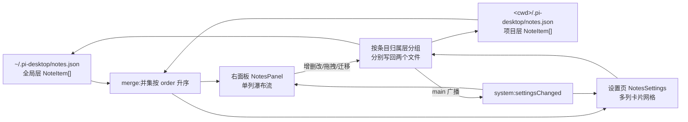
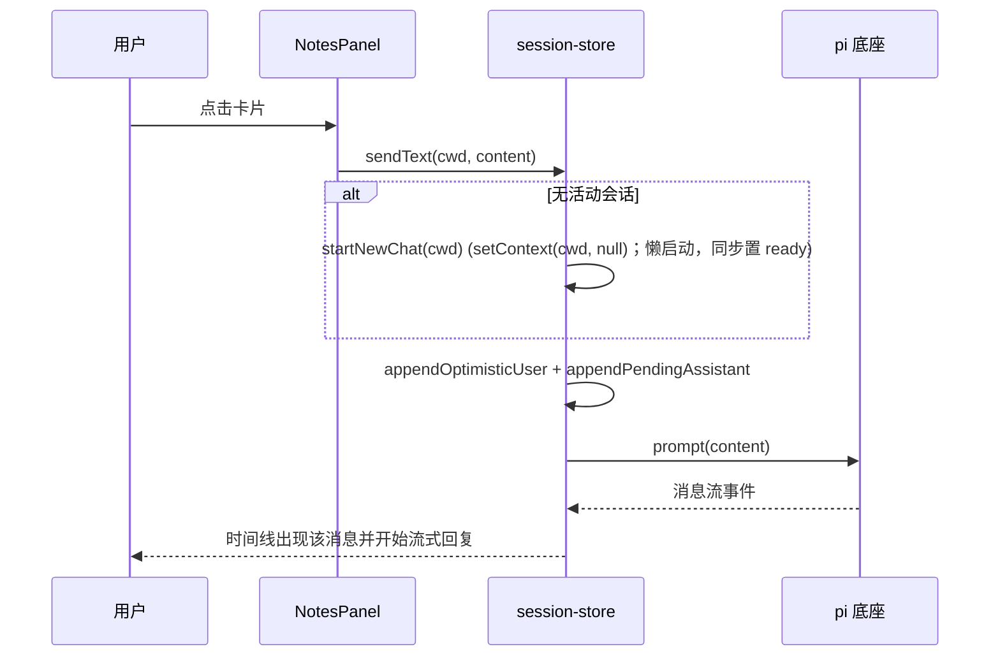

# Note 插件设计：一键发送的常用语卡片

一个纯内容插件：右面板里一列可点击的卡片，点一下就把卡片内容当作一条用户消息发进当前会话；设置页里一个多列卡片网格做批量管理。数据分全局、项目两层，支持拖拽排序和层间迁移。除一个对称补齐的读口子外，内核零改动。

## 1 问题与定位

### 1.1 痛点：重复输入相同的指令

- 用户反复给 agent 打同样的话——"帮我整理成日报""接下来都用中文回复""commit 按规范四要素写"。这类文本有三个共同点：内容跨会话甚至跨项目复用、输入一次的成本低但**重复一百次成本高**、且在"打开项目"与"开始干活"的语境里天然和会话绑定。

- 系统剪贴板或输入法的常用语能存文本，但存不住语境：它们不知道 pi-desktop 的"当前会话"是什么，用户得复制 → 切窗口 → 粘贴 → 回车，四步。这个插件把它压成一步：**点卡片 = 输入 + 发送**，而且发送直接走会话通道（复用 timeline composer 的同一序列，见 3.2），不是把文本塞进输入框等用户再按一次回车。

### 1.2 抽象：标题可选的文本片段

- 数据实体只有"笔记"一种，形状为 `{ id, title?, content, order, createdAt, updatedAt }`。`title` 可选：有标题的卡片显示标题 + 内容预览，没标题的拿内容前几行当摘要。这是同一抽象的参数化，不是两种类型——**不存在"便签 vs 快捷指令"的 kind 字段**，发送、编辑、排序的行为对两者完全同构（呼应 CLAUDE.md §1.4 内容驱动，不 switch）。

- "发送到会话"不是这个插件的本质，只是它的主要消费方式。今天点击发送，明天要"复制到剪贴板"，行为上只是卡片上多一个动作，数据模型一行不动。

### 1.3 与现有机制的关系：几乎全是复用

- **槽位**：`sidePanel`（使用场景）+ `settings`（管理场景），都是现成槽位，契约在 `domain/contributions.ts` 已定义，不加新槽。

- **发送**：`ctx.messaging.prompt(text)` 就是"等效于输入框输入并发送"的通道（timeline/index.tsx:281-284 的 composer 发送序列 = appendOptimisticUser + appendPendingAssistant + prompt）。**新会话场景**复用 sessions-list 已在用的 `startNewChat(cwd)`（session-store.ts:189-192）。

- **拖拽**：`@dnd-kit/core` + `@dnd-kit/sortable` 已是依赖（package.json:20-22），不手写拖拽。

- **面板样式**：`PanelToolbar` / `PanelIconButton` 直接复用；卡片容器用插件自己的 `StickerCard`（贴纸身份是内容，不进共享组件库）。

- **同步**：`config-file:set`/`setProject` 写完后 main 广播 `settings:changed`，renderer 侧 plugins-host 转发为 `system:settingsChanged` 事件。两侧视图订阅它重读即可，**插件不需要声明自有 channel**。

插件 manifest 的两个槽位贡献（`configFile: null` + `saveMode: "manual"` 的理由见 2.4；组件名为 exports 自动匹配，无 register 调用）：

```json
{
  "id": "notes",
  "renderer": "./renderer/index.tsx",
  "contributes": {
    "sidePanel": [{ "id": "notes", "label": "笔记", "icon": "sticky-note", "component": "NotesPanel", "order": 60 }],
    "settings": [{ "id": "notes", "title": "笔记", "icon": "sticky-note", "component": "NotesSettings", "configFile": null, "saveMode": "manual" }]
  }
}
```

- **唯一的内核新增**：`config-file:getProject(cwd, relPath)` IPC——现状是项目层配置能写（`setProject`，index.ts:297）能清（`clearProject`）但没有对称的读（`getLayered` 是"项目存在返项目、否则返全局"的二选一，index.ts:291-296，无法表达"两层各自内容"）。这个缺口不补，双文件存储就读不回来，见 2.4。

## 2 数据模型与存储

### 2.1 条目形状

```typescript
// 插件内类型（内容层定义，不进 domain——它不是槽位契约）
interface NoteItem {
  id: string;          // crypto.randomUUID()，全局唯一，跨越两层不撞
  title?: string;      // 可选；缺省时 UI 回退显示 content 摘要
  content: string;     // 发送时原样作为 prompt 文本
  order: number;       // 排序键，跟随条目迁移（见 2.3）
  createdAt: number;
  updatedAt: number;
}
interface NotesFile { notes: NoteItem[]; }
```

- **摘要回退规则**：`title` 为空时取 `content` 前 120 字符、至多 3 行。规则只写在卡片组件里一处，两个视图共用（同一插件内的共享子组件，见 3.3）。

### 2.2 两层文件：合并是并集 + 排序，不是覆盖

- **全局层** `~/.pi-desktop/notes.json`：跨项目通用（"中文回复""日报收尾"）。
- **项目层** `<cwd>/.pi-desktop/notes.json`：`config-file:setProject` 的天然落点，可随项目入库共享。

- 展示时两层**简单并集**，按 `order` 升序；`order` 相等（手工编辑文件可能造成）按 `updatedAt` 倒序兜底。**没有同 id 遮蔽**：id 由 UUID 生成，一条笔记只存在于一个文件里，不存在"项目层藏掉全局层"的语义。

- 合并是排序不是覆盖——这是本方案与配置分层（`configFile.getLayered` 那类项目盖全局）的本质区别。配置是"同名 key 谁赢"，笔记是"两份清单拼一起排队"。


**图 1 — 两层各存各的，读取时并集排序；写回按条目归属拆回；广播驱动两侧刷新**

### 2.3 层间迁移：移动条目，order 跟走

- "设为全局"= 把条目从项目文件的 `notes` 数组摘除，追加/按 order 插入全局文件，**条目本身（含 `order`、时间戳）原样搬运**。反向"设为项目专属"同构。不是复制，是移动——如果保留两份，编辑哪份、发送哪份就成了新的歧义源。

- 引申出条目展示上的一个必要信息：用户在合并列表里拖拽时，需要知道拖动的是哪一层的条目（动了全局条目影响所有项目）。卡片角标标"全局/项目"，拖拽时也保留角标，见 4.2。

### 2.4 读写通道：manual 保存模式 + 对称读口子的补齐

- **保存模式选 `saveMode: "manual"`**（先例：theme-manager）。框架托管 save（settings-page.tsx:96-97）的前提是"一个 settings 页对应一个 configFile"——读一份、onChange 攒 dirty、写回一份。笔记有两个文件，且右面板也要即时增删改（不存在先点进设置页才能改的道理），所以每次操作**即时落盘**，没有未保存浮层、没有拦截。这也符合直觉：改一条笔记不该弹"确定改动"这种重量级确认。

- **读**：全局层走 `ctx.configFile.get("~/.pi-desktop/notes.json")`（白名单内，`~` 展开在 main 侧，index.ts:247）。项目层走**新增的** `ctx.configFile.getProject(cwd, relPath)`——与现有 `setProject`/`clearProject` 对称，main 侧 `resolveRelPath` 拼路径 + `readJsonFile`，文件不存在返回 `null`。触点是四处的机械镜像：main 加 handler（复制 setProject 去掉写/广播）、preload 加一行桥接、`domain/context.ts` 的 `configFile` 接口加一个方法签名、packages/react 的 plugin-context 绑定加一行转发——没有任何新抽象。备选（不动内核）见 QA-1。

- **cwd 从哪来**：插件按只读纪律从 `useUiStore().currentCwd` 取当前目录（CLAUDE.md §8.2：共享 store 只读）；切换目录后经 `system:cwdChanged` 事件触发重 `load()`——项目层笔记天然跟随当前项目。

- **写**：全局层 `ctx.configFile.set(path, doc, "replace")`；项目层 `ctx.configFile.setProject(cwd, ".pi-desktop/notes.json", doc, "replace")`。都走 `writeJsonFile`，目录不存在时递归创建（config-file.ts:48-49，已核实），首次写项目层不需要额外处理；锁由 `withDirLock` 同一处承担。

- **广播覆盖**：`config-file:set`/`setProject` 写后都广播 `settings:changed`（index.ts:269-275, 297-302），新增的 `getProject` 是只读、不需要广播。写方写完 → main 广播 → 两侧视图重读，事件驱动循环，无轮询。

- **插件内部读写收敛**：两个组件不调 IPC，统一经插件内的 `notes-store.ts`（`load()` / `create()` / `update()` / `remove()` / `reorder()` / `moveLayer()`），它负责两层读写、合并排序、order 重平衡（拖拽后把合并列表重编号为 0..n 并按层拆回）。组件只渲染 + 调 store 函数，报告改动这件事在 manual 模式下也退化为"store 写完发广播"。

## 3 使用场景：右面板（单列瀑布流）

### 3.1 卡片与布局

- `contributes.sidePanel` 一项：Tab 名"笔记"，组件 `NotesPanel`。单列，卡片自上而下按合并顺序排。窄面板里"瀑布流"就是竖排卡片流，不需要 masonry 算法。

- 工具栏：`PanelToolbar` 左标题"笔记"、右 `PanelIconButton` ＋ 新建。卡片：`StickerCard` 承载（插件内贴纸基座 `renderer/sticker.tsx`：笔记 id 哈希定 -1.6°~1.6° 稳定倾角、胶带/图钉各半、hover 回正放大、软投影；颜色全吃主题 token，不引入纸色数据字段），标题行（或摘要）+ 内容预览（clamp 3 行），hover 浮出 ✎/🗑。层归属用角标小字（全局/项目）。编辑器同为 StickerCard 但不歪不装饰——输入中的卡面要稳。

### 3.2 点击发送：有会话直发，无会话先建


**图 2 — 点击卡片 = "输入 + 回车"的等价序列；整条序列收在 sendText 一个动作里**

- 发送一步到位的**受管写口** `session-store.sendText(cwd, send, echo?)`（含无会话 startNewChat 内包 + 乐观回显 + 占位 + prompt），**内容不经过输入框**。这句话值得强调：不把 content 填进 composer 再模拟回车——那是 UI 自动化思路，脆弱且打断用户正在草拟的内容；sendText 是一条独立的、语义明确的路径。

- **占位职责的收敛（实施后更新）**：初稿曾决定"composer/notes 两处复制同一序列，留待第三入口再收敛"。复审发现这违反 CLAUDE.md §8.2：共享 store 对插件应只读，插件不能调 setter——而乐观回显/占位/startNewChat 全是 setter、且 sessions-list/composer 已在直调。按 §3.3 立即收敛为框架动作 sendText，同时迁移了 composer 处调用（echo=用户原文、send=拼工具限制前缀后的实际发送文本）。

- 发送对象是**点击瞬间的 content 副本**，发送后再编辑/删除卡片不影响在途消息。

### 3.3 就地增删改

- ＋ 与 ✎ 打开同一个**就地编辑卡**（`NoteEditor` 子组件，面板与设置页共用）：标题输入框（可选）+ 多行内容 textarea + 保存/取消。保存即落盘（manual 语义），取消还原。

- 🗑 删除走**就地二次确认**（点第一次变"确认删除？"，再点执行）而非系统对话框——`ctx.dialog` 是文件选择类系统对话框的封装，为一条笔记弹系统窗过重；且删除的是 JSON 数组里一项，误删可由用户重新添加，代价低。

- 新条目默认落**项目层**（用户的诉求是"这个项目的常用语"；想全局面板使用再"设为全局"），`order` 取当前合并列表末尾 max+1。

## 4 管理场景：设置页（多列卡片网格）

### 4.1 布局：贴纸网格，不写瀑布流算法

- 设置页用 **CSS Grid `repeat(auto-fill, minmax(140px, 160px))` + `items-start`**——贴纸高度各异，行内自然错落。列轨上限 160px 是硬约束：`1fr` 会把单张贴纸撑成整行横幅，200px+ 对短内容也太宽（便利贴要接近方形）；~150px 一张，默认宽度每行约 4 张。**不**用 `column-count` 瀑布流：列优先的文档序会让"手动顺序"在视觉上呈蛇形，且 dnd-kit 在 CSS 多列里的拖拽命中是出名的坑区。真错落 masonry 若日后强烈想要，届时再引入成熟库，不影响数据模型。

- 网格里排的就是面板同款的 NoteCard 贴纸（`rectSortingStrategy`），点贴纸原位展开（单展开，`expandedId` 控制）。hover 浮钮在网格里不渲染——格子窄、浮钮会盖住卡面，一切操作收进展开态操作行。

### 4.2 拖拽排序：重编号 + 按层拆写

- `@dnd-kit/sortable` 的 `SortableContext`（`rectSortingStrategy`）包住合并列表。`onDragEnd` 后：重排数组 → 按新位置重编号 `order = 0..n-1` → 按 `layer` 分组 → 两次写（全局、项目各一）→ main 广播 → 重读。

- 拖拽与编辑互斥：编辑卡打开期间禁用拖拽（dnd 套一层 `disabled`），避免 DOM 重排把正在输入的 textarea 挪走。

- 重编号是 O(n) 次写的一并提交，n 是笔记总数（量级几十），两次 JSON 写可忽略。顺序是**全局单一序列**，不分"先项目后全局"两段——视觉上靠角标分层，排序上不分桶。分桶展示是内容策略，日后想要可仅在渲染层分组，数据模型不变。

### 4.3 点击展开：全文 + 操作行（编辑/复制/迁移/删除）

- 点击卡片原位**展开**：内容不再 3 行截断，下方出操作行：发送（进当前会话）/ 编辑（换 NoteEditor 原地改）/ **复制（content 进剪贴板，1.5s "已复制"反馈）** / 迁移（"设为全局"或"移到项目"）/ 删除（就地二次确认）。再点卡片或点其他卡片收起——单展开，可预期。
- 编辑器（新建/编辑）在网格里**独占整行**（`col-span-full`）——不在 180px 格子里挤着输入。
- 点一次即完成迁移（manual 即时落盘，无二次确认——这是可逆操作，与删除的危险等级不同）。

- 迁移动效不做，重读后卡片出现在新位置（order 保留，视觉上通常原地不动）。

## 5 同步与一致性

- **双侧刷新只靠 `system:settingsChanged`**：任何一侧写盘 → main 广播 → 另一侧（若挂载）重读两层文件。面板窄、设置页大部分时间是隐藏的；"激活时重读"（`isActive` 变 true 时 `load()`）兜底外部手改 JSON 的场景（外部改动不触发广播，这是框架级已知边界，所有 configFile 插件同样如此，不在本插件内特判）。

- **并发**：单 renderer 进程内所有写都经 notes-store 串行（每个操作 await IPC 完成再下一个），无锁竞争；跨窗口/跨进程并发写 notes.json 与所有 configFile 插件同样不在做，QA-6 标注为已知边界。

- **发送与编辑并发**：发送拿到的是副本（3.2），无交集；拖拽与编辑互斥（4.2）。

## 6 QA

**Q1：真的需要给内核加 `config-file:getProject` 吗？能不能完全不动内核？**

可以不动，备选是**单文件 + scope 字段**：所有条目存 `~/.pi-desktop/notes.json`，条目带 `scope: "global" | { project: string }`，"设全局"改字段、"两层合并"退化为按 scope 过滤。机制零新增，框架托管 save 甚至都能用。被否的原因：项目层笔记落不进项目目录，无法随仓库共享/备份，"项目级"名不副实；且 scope 字段是把归属塞进条目数据（内容），而 `config-file:setProject` 的基础设施已经表达了"项目层文件"这个概念——补一个 15 行的对称读口子比发明新的数据归属语义更诚实。

**Q2：agent 正在流式回复时连点卡片，会怎样？**

与 composer 行为对齐：流式中（`session-store` 的 `streaming`）卡片点击禁用并 tooltip 提示。不做自动 followUp 入队——卡片点击是"显式手势"，静默排队会在回复结束后突然发出一条用户已忘记的文本，比"点不了"更困惑。想要排队交互的用户会自己等流式结束。

**Q3：卡片点一次发一条，手抖双击会发两条吗？**

会，和 composer 连续点两次发送等价——这是"等效于输入并发送"语义的忠实部分。不需要去抖的额外特例；流式禁用（Q2）天然挡住绝大多数误双击。

**Q4：note 内容很长或含换行/代码块？**

原样发送，语义与把整段文本粘贴进输入框再回车一致。卡片显示永远 clamp 摘要，长度不硬限。

**Q5：第一次在某个项目里建笔记，目录不存在怎么办？**

不需要处理：`config-file:setProject` 底层 `writeJsonFile` 写前递归建目录（config-file.ts:48-49，已核实），读侧 `getProject` 对不存在文件返回 `null`，空列表渲染。

**Q6：多开窗口同时改笔记？**

配置文件的并发写在整个项目里是依赖单窗口假设的（`withDirLock` 只防文件级撕裂，不防两窗互相覆盖）。本插件不加额外保护，与现状一致。

**Q7：想清空某个项目的全部项目层笔记？**

逐条删，或在文件管理器删 `<cwd>/.pi-desktop/notes.json`。不提供"清空"按钮——不可逆批操作对几十条数据的规模没有收益。

**Q8：条目没有 id 的旧文件？**

不存在旧文件——这是全新插件，文件格式从第一天起带 id。手工编辑丢了 id 的条目在 `load()` 时补发 UUID 并视为脏写回，不留迁移代码。
