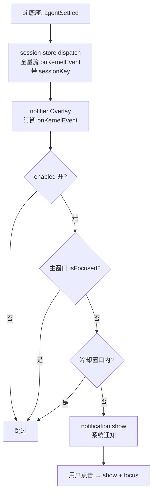

# notifier 插件设计：会话在后台完成时发系统通知

> 术语先对齐：本文里"会话"指 pi 底座跑的一个 agent 会话（一个 JSONL 文件）；"回合"指从用户发消息到 agent 收敛（LLM 回答 + 工具调用 + 再回答……全部结束）的一整轮；"agentSettled"是桌面端把底座"回合收敛"信号翻译成的一条中性事件，形状就是 `{ type: "agentSettled" }`（底座原发的是各自内核的协议事件——pi 的 `agent_settled`、dsh 的 `turn/end`——翻译后进 renderer 的都是这个中性事件）；"前台"指主窗口是当前聚焦且可见的窗口，"后台"是它的反面（被别的应用盖住、最小化）；"通知"一律指操作系统级通知（macOS 通知中心 / Windows toast / Linux libnotify），不是应用内横幅；"内核"指 core + api + client + bootstrap 的机制部分，"槽"是内核预定的挂载点；"main 进程"是管窗口与系统能力的 Node 主进程，"renderer 进程"是渲染插件的 Chromium 进程；"sessionKey"是 session-store 内部给每个会话进程起的 key，不是会话显示名、也不是会话文件路径；"ctx"即插件经 `usePluginContext()` 拿到的 PluginContext。

## 1 问题

### 1.1 场景

用户在桌面端开一个长会话，点发送，然后切到浏览器或 IDE 干别的。会话在后台跑十几分钟，完成那一刻用户毫无感知，直到他自己想起切回来，才发现答案早就在那了。要补的就是这一下：会话回合完成、而主窗口不在前台时，发一条系统通知，让用户在别的应用里也知道"它答完了"。

这条需求有个前置约束先说破：插件跑在 renderer 进程里，窗口一关 renderer 进程就销毁、插件就死，所以"通知"只能覆盖"窗口还在、只是不在前台（被盖住/最小化）"这一种状态。窗口关闭（哪怕 main 进程还在后台跑会话）和 app 进程完全退出，都要另做 main 进程常驻触发或守护进程，不在本文范围。

### 1.2 为什么是一个插件

通知这件事拆开是两半：一半是"能发系统通知""能查窗口是否前台"这类能力，是机制；另一半是"什么事件算完成""发什么文案""多久发一次不烦人"这类策略，是内容。按本项目"内核只有机制、内容全部外挂"的纪律（CLAUDE.md §1.2），能力进内核、策略进插件。所以通知是插件，不是内核写死的一串 if-else。

另一个更实际的理由是触发条件和文案都会变。今天"会话完成"要通知，明天可能"子 agent 完成""工具失败"也要通知，后天用户想关掉某一类。这些变化若焊在内核，每次都要改内核发版；做成插件，改的是插件自己的 manifest 和 renderer，内核一行不动。

### 1.3 现有机制缺哪两块

把触发、判定、弹出三件事对着现有代码盘一遍，结论是：**触发信号现成，判定和弹出缺两块**。

- 触发：底座已在会话收敛时发 `agentSettled`，桌面端也已把它翻成中性事件并转发给 renderer（含后台会话、带 `sessionKey`）。这条链路今天就能用，零改动（§2 详述）。
- 判定：renderer 现在没法问"主窗口是不是前台"——`src/api/ipc/window.ts` 只做了最小化/最大化/关闭，没有焦点查询。缺第一块。
- 弹出：整个代码库没有操作系统级通知能力，Electron 的 `Notification` 从未被用过。缺第二块。

所以这个插件的新增量很小：内核补两个能力（发通知、查焦点），内容层写一个纯订阅的插件。

## 2 触发：什么时候算"完成"

### 2.1 agentSettled 是回合收敛的唯一可靠信号

底座在一次回合里推一串事件：`agentStart` → `messageStart`/`messageUpdate`/`messageEnd`（可能多轮，因为有工具调用）→ `agentEnd`/`agentSettled`。要回答"这一轮到底什么时候结束"，候选信号有四个，但只有 `agentSettled` 对得上。

`agentSettled` 的语义就是"agent 收敛了"——LLM 不再产生动作、工具不再执行，这一回合彻底结束。它的中性类型在 `src/core/domain/events/session-state.ts`，就一个字段。桌面端拿它把会话的 busy 态翻成 false（`session-store.ts` 的 `dispatch()`），说明桌面端自己也这么理解这个信号。

这个信号是跨内核的：pi 后端把 `agent_settled` 翻成它（`core/protocol/event-translator.ts`），dsh 后端把 `turn/end` 翻成它（`client/dsh/dsh-event-translator.ts`）——dsh 的「turn」就是 pi 的「agent loop」，同指「一整轮执行收敛」。两边产出同一中性事件，插件订阅 `agentSettled` 就内核无关；内核差异消在翻译层，壳子不感知 pi/dsh。

### 2.2 只有全量流 onKernelEvent 看得到后台会话

renderer 侧有两条会话事件流，名字容易混，分工很清楚：

- 视图流 `ctx.sessions.onEvent`：只转**激活会话**（当前打开在看的那一个）的事件，不给 `sessionKey`。它给时间线渲染用——别的会话的事件绝不能污染当前视图（`session-store.ts` 的 `dispatch()` 末尾 `if (key !== this.activeProcKey) return`）。
- 全量流 `ctx.sessions.onKernelEvent`：转**所有会话**的事件，`KernelEvent` 联合里 `kind: "session"` 那支带 `sessionKey` 归属（`src/core/domain/events/kernel-event.ts` 的 `SessionMessageEvent`）。后台会话的 `agentSettled` 就在这条流的转发白名单里（`session-store.ts` 的 `dispatch()` 里 `isBackgroundEvent` 含 `agentSettled`）。

通知要盯全量流，不是视图流。理由：用户切去别的应用后，激活会话照常跑、它的 `agentSettled` 视图流也照常到——这个案例视图流够用；但只要同时有第二个会话在后台跑（并行会话、restart 会话、未来子 agent 落成的独立会话），视图流就漏了。用全量流一次覆盖"任何一个会话完成"，成本为零（内核已现成），符合"选最完整的那一个"。

### 2.3 为什么不选 messageEnd / agentEnd / turnEnd

- `messageEnd` 是单条 assistant 消息结束。一个回合里 LLM 可能先答一段、调工具、再答一段，`messageEnd` 会响好几次，用它触发会一条回合连弹几条通知。
- `agentEnd` 与 `agentSettled` 同帧双发（`session-store.ts` 注释点明），语义几乎重叠，但 `agentSettled` 是明确的"收敛"信号，且会话总线把它列进 lifecycle 边界事件（`session-bus.ts` 的 `LIFECYCLE_EVENT_TYPES`），选用它和既有判定一致。
- `turnEnd` 是桌面端自产、用于轮次统计的标记，覆盖面不如 `agentSettled` 稳。

## 3 机制：内核补的两块

### 3.1 notification:show 与 Electron Notification 的三端落点

#### 3.1.1 代码层不分平台

系统通知不自己写三套：Electron 的 `Notification` 一个 API 内部映射到三端原生机制——macOS 走通知中心（UNUserNotificationCenter）、Windows 走 toast（WinRT ToastNotificationManager）、Linux 走 libnotify（D-Bus `org.freedesktop.Notifications`）。内核的 `notification:show` handler 一份代码覆盖三端，不写 `if (darwin/win32/linux)` 分支：

```ts
ipcMain.handle(IPC.notification.show, (e, { title, body, silent }) => {
  if (!Notification.isSupported()) return;
  const win = BrowserWindow.fromWebContents(e.sender);
  const n = new Notification({ title, body, silent });
  n.on("click", () => { win?.show(); win?.focus(); });
  n.show();
});
```

"怎么区分平台"的诚实回答是：代码层不区分，让 `Notification.isSupported()` 如实报告当前环境支不支持，不支持就静默降级。差异不在代码分支，在三端各自的运行环境要求（下一节）。

还有个前置问题值得说明：为什么通知必须走 main 进程的 IPC，而不是在 renderer 里直接发。插件的 renderer 是沙箱（`bootstrap/index.ts` 里 `contextIsolation: true, nodeIntegration: false`），插件只能 import `@my-harness-desktop/contract` 和 `@my-harness-desktop/react`，够不到 `electron` 模块；renderer 里那个 HTML5 的 `Notification` 是 Chromium 的壳，Electron 对它的原生 toast 支持不完整（尤其 Windows AUMID 和 Linux libnotify）。所以系统通知只能做成内核能力，经 `window.pi` IPC 交给 main 进程的 Electron `Notification`——这也正落在本项目"流出适配器在 client/api、插件只走受控桥"的分层上。通道名 `notification:show`、桥接方法 `window.pi.notify.show`、插件上下文字段 `ctx.notify.show` 是同一能力在 IPC 通道层 / 桥接层 / 插件层的三个名字，各层各叫各的，本质一件。

#### 3.1.2 三端各自的运行环境要求

- **macOS**：要用户授权（系统设置 → 通知，首次 `show()` 弹授权），授权之外还有系统的专注模式/勿扰会静默吞通知，应用同样无感知。本项目 `mac.identity: null`（`electron-builder.yml`）是未签名自分发，能弹，但通知里应用名可能显示成"Electron"、授权在重装/升级后容易失效；签名/公证是另一摊事。`Notification` 的 `icon` 参数在 macOS 被忽略，永远用 app bundle 的 icns。
- **Windows**：toast 显示的硬门槛是 AppUserModelId（AUMID）。打包版由 electron-builder 按 `appId: works.earendil.my-harness-desktop` 在 NSIS 安装时写好，所以打包版 OK；**dev 态必须手动补** `app.setAppUserModelId("works.earendil.my-harness-desktop")`，否则 toast 不显示或显示成"Electron"。便携 zip 包（无安装器、无开始菜单快捷方式）toast 能弹但不进操作中心历史。此外 Windows"专注助手"和系统通知开关都能静默拦掉通知，应用无感知。
- **Linux**：依赖系统有通知守护进程（GNOME/KDE 自带，i3/sway 要另装 dunst/mako），没有时 `Notification.isSupported()` 返回 false，通知静默失败。本项目打 AppImage/deb，跑在哪种桌面无法预知。Linux 没有 mac/win 那种统一授权开关，能显示与否由桌面环境的守护进程和它的勿扰设置决定。

真正要写进代码的平台相关动作只有一个，且是启动期一次性设置、不是运行时分支：`bootstrap/index.ts` 里无条件调一次 `app.setAppUserModelId("works.earendil.my-harness-desktop")`——它在 mac/linux 是 no-op，在 Windows 补齐 dev 态的 AUMID 门槛，与打包版对齐。三端其余差异都是运行环境要求，不是代码分支。

#### 3.1.3 isSupported 降级与 click→focus 的三端差异

- `Notification.isSupported()` 是降级开关：Linux 无守护进程时返回 false，handler 直接 return，不抛错、不留半截状态。但它只探测"守护进程在不在"，探测不到"勿扰/专注模式会不会吞"——守护进程在、勿扰开着时 `isSupported()` 仍为 true，通知照发但被静默吞，和 macOS 被拒授权同一类黑盒。
- 图标与静音：`icon` 只在 Windows/Linux 有意义（macOS 恒用 app 图标）；`silent` 是"不响铃"的请求，三端最终表现由各自系统通知设置决定，不是保证。
- 点击通知聚焦窗口：macOS 和 Windows（AUMID 正确时）都可靠；Linux 的 Wayland 合成器限制应用抢焦点，点击可能只唤起不聚焦，取决于桌面环境。这是已知边界，收进 QA。

### 3.2 window:isFocused 对"前台"的定义

"要不要通知"的判定条件是主窗口不在前台。要覆盖的后台态只有两个——被别的应用盖住、最小化——用 `BrowserWindow.isFocused()` 一个查询就全覆盖，都返回 false。判定就一条：`isFocused() === false` 才发，最小化天然为 false，不需要再判 `isMinimized()`。

窗口关闭不在覆盖范围。关闭销毁 renderer 进程，插件跟着死，连订阅都不存在，判定链根本不会执行——这不是"查焦点查不到"，是"执行通知的人没了"。要覆盖这个场景得把触发逻辑搬到 main 进程（main 侧经 `onAnySessionEvent` 也能拿到 agentSettled 全量流），那时"内容和机制谁负责"要重新划，超出本文范围。

实现上加一个 `window:isFocused` 查询 handler 到 `src/api/ipc/window.ts`，renderer 侧经 `window.pi.window.isFocused()` 走。为什么是"发之前查一下"而不是"订阅焦点变化事件"：通知是一次性动作，只在回合完成那一刻需要知道焦点状态，查询比维护一个焦点订阅状态机便宜，也不引入竞态。

### 3.3 通知算"核心默认能力"还是"需声明权限"

结论：`notify` 和 `isFocused` 都算**核心默认能力**，插件不用在 `permissions` 里声明。

权限模型的分界是"要不要读写用户数据、跑外部命令"：`fs`/`git:read`/`git:write`/`llm:oneshot` 要声明，因为它们读写文件、跑 git、问底座；`config`/`prefs`/`themes` 这类桌面壳自有能力是所有插件默认可用的。发通知和查焦点属于后者——两者只调桌面壳自有的窗口/通知 API，不读不写用户数据、不跑外部命令，跟 prefs 同级。也因此 notifier 的 `permissions` 为空。这里的"只读"指它不申请任何文件/git 写权限；发通知是它的唯一职责，是外发动作，不是"零副作用"。

## 4 插件：判定链与形态

### 4.1 Overlay 零可见槽作为常驻订阅点

notifier 没有任何可见 UI——它不挂 sidebar、不挂 sidePanel、没有设置页组件（设置项走纯 JSON 声明，见 4.3）。那一个"什么都不显示"的插件怎么被加载、怎么执行订阅逻辑？

答案是既有机制 Overlay。插件在 renderer 入口 export 一个叫 `Overlay` 的组件，框架的 `PluginOverlays` 宿主（`packages/react/src/plugin-overlays.tsx`，挂在 `src/api/renderer/index.tsx` 根树里）把每个已加载插件的 Overlay 渲染进主树，外面套 `PluginIdContext.Provider` 注入 pluginId，所以 Overlay 里能直接 `usePluginContext()`。`Overlay` 是固定 export 名，不在 manifest 里声明，框架按名字自动匹配（`plugin-modules.ts` 的 `getPluginOverlay` 直接读 `module["Overlay"]`），与组件自动匹配同一规则。keybindings、key-hints、session-colors、review 几个零可见/后台插件都走这个挂载点，notifier 照抄这条，不新开槽。

Overlay 组件本身 `return null`，只跑 `useEffect` 订阅、卸载时退订。下面这条链就写在它的 effect 里。

### 4.2 从事件到通知的判定链



判定链四道闸，前三个都是"拦住就不发"：

- **开关**：`ctx.config.get("enabled")` 为 false 直接跳过。开关是用户能一键关掉通知的总闸。
- **焦点**：`ctx.window.isFocused()` 为 true 跳过——用户正看着，通知是打扰。
- **冷却**：距上次通知不足 `cooldownSec` 秒跳过。多个会话几乎同时收敛、或一个会话被 steer/followUp 连续触发时，冷却窗口内只弹第一条、后续直接丢弃，防轰炸。
- **弹出**：`ctx.notify.show({ title, body })`，文案走 i18n。点击通知框架已把窗口 show + focus。

冷却状态放哪？内存 ref（`useRef`）就够——冷却的意义是"这几秒内别连弹"，进程重启后清空没有副作用；写 config 反而多一次落盘。用 `useRef` 记 `lastNotifyAt`，只在真正 `show()` 成功时更新、判定被拦时不更新——这是节流（throttle，固定窗口），不是去抖（debounce，重新计时），否则每次被拦都刷新时间戳会把冷却窗口无限拉长。首次通知 `lastNotifyAt` 为空，无条件放行。

### 4.3 配置与文案

配置走 `settingsGroups` 槽，纯 JSON 声明，插件零渲染代码——通用设置页（general-config 插件）的通用渲染器查槽后渲成开关和下拉，值落 `general.json`，save/dirty/分层走既有框架管线：

- `notifier.enabled`（boolean，默认 true）：总开关。
- `notifier.cooldownSec`（int，默认 3，可选项 1/3/5/10）：冷却时长。

文案走 `languages` 槽：`notify.title`、`notify.body` 各一份 zh-CN/zh-TW/en/de。v1 用通用文案"会话已完成回答"，不解析会话名——`sessionKey` 是进程 key，映射到显示名需要再查会话清单，属可选增强，先不做（QA 说明）。

## 5 QA

**Q：Linux 桌面没装通知守护进程，通知发不出去，用户怎么知道？**
A：`Notification.isSupported()` 返回 false，handler 直接 return，通知静默不发。这是已知边界，不是 bug——桌面环境缺 libnotify 守护进程，应用层无法补。不弹错误，因为这不是用户操作失败，是环境能力缺失；机制层留一行 `console.warn` 便于排查。

**Q：Windows 上 `pnpm dev` 跑起来，为什么通知不显示？**
A：dev 态没有 AUMID。解法是在 `bootstrap/index.ts` 无条件调 `app.setAppUserModelId("works.earendil.my-harness-desktop")`，dev 和打包对齐；打包版由 electron-builder 在 NSIS 安装时写好，无需额外处理。zip 便携包没有开始菜单快捷方式，toast 能弹但不进操作中心历史。

**Q：用户在 macOS 上拒绝了通知授权，应用能探测到吗？**
A：不能。`new Notification()` 不报错、`show()` 也正常返回，但系统静默不显示。机制层照发，没有可靠手段探测授权状态；这是平台限制，收进文档让用户知情，不做"检测是否被拒"的假能力。

**Q：macOS 开了专注模式/勿扰，通知会怎样？**
A：被系统静默吞掉，应用无感知、也无法探测，和拒绝授权同类。Windows 的专注助手、Linux 桌面环境的勿扰同理。所有"系统级勿扰"都是黑盒，机制层照发，不做探测。

**Q：第一次发通知时才弹 macOS 授权框，但通知只在窗口后台才发，授权框会不会被漏掉？**
A：会漏，这是真实的体验坑：用户第一次触发通知时人通常不在前台，系统授权框弹在背后，可能根本没看到、也就没点"允许"，后续通知就一直发不出来。v1 不做前台预热（那种"在设置页放一个发送测试通知按钮、让用户在前台主动触发一次授权"的做法是可选增强，先不做）；文档至少把这个坑点明，避免排查时误以为是插件坏了。

**Q：Linux 装了通知守护进程，`isSupported()` 返回 true，通知还是没显示？**
A：守护进程在、但勿扰/策略拦截时 `isSupported()` 仍为 true——它只探测守护进程存在，不探测"会不会被吞"。此时通知照发但被静默吞，与 macOS 拒绝授权同一类黑盒，机制层无解。

**Q：窗口没被别的应用盖住、只是被最小化了，会发通知吗？**
A：会。最小化时 `isFocused()` 为 false，判定为后台——最小化等于不可见，用户同样看不到答案，该发。

**Q：用户在前台看会话 A，后台会话 B 完成了，发通知吗？**
A：不发。判定用的是"整个主窗口是否前台"（`isFocused()`），不是"这个会话是否可见"。窗口前台时任何会话完成都不打扰。这是有意的粗粒度：需求定的是"窗口后台才通知"。若未来要"窗口前台但提醒后台会话"，需要引入"当前激活会话 vs 事件会话"的对比，属演进，不在 v1。

**Q：用户在 macOS 上点红点关窗后，会话还在后台跑，完成时会通知吗？**
A：不会。关窗销毁 renderer 进程，notifier 的 Overlay 订阅跟着没了，没人监听 `agentSettled`，判定链根本不会执行——尽管 main 进程和会话都还活着。这个边界只在 macOS（darwin 下 `window-all-closed` 不退出应用）出现，Windows/Linux 关窗即退出。要覆盖它，触发逻辑得从 renderer 搬到 main 进程，属于另一套设计，本文不展开。

**Q：为什么通知文案不带会话名？**
A：`sessionKey` 是 session-store 的 procs key，不是会话显示名；映射到名字要再查会话清单（`sessionInfos`），且多内核/新会话的 key 形态不稳定。v1 用通用文案，避免为了一个名字引入脆映射；带名是后续增强。

**Q：多个会话几乎同时完成，会弹几条？**
A：冷却内只弹第一条，后续直接丢弃。`cooldownSec`（默认 3 秒）是节流窗口；用户可调 1/3/5/10。

**Q：切换内核（pi ↔ dsh）会影响这个插件吗？**
A：不影响，前提是内核层履行"同一中性事件契约"。触发信号 `agentSettled` 是中性契约里的"回合收敛"：pi 由 `agent_settled` 翻译、dsh 由 `turn/end` 翻译（`client/dsh/dsh-event-translator.ts`），两边产出同一事件。壳子和插件只消费中性契约，不感知 pi/dsh；内核差异消在翻译层，正是 `kernel-layer.md` 在收口的职责。新增第三个内核时，只要它的后端把"回合收敛"翻译成 `agentSettled`，本插件依旧无感。
