# pi 进程预热：把就绪从发送路径提前到上下文设定

> **术语约定**：本文档涉及几个核心概念，先一次性交代：
>
> - **pi 进程**（本文简称 pi）：一个独立子进程，`spawn("node", [cli.js, "--mode", "rpc"])` 起来，经 stdin/stdout 收发 JSONL 消息。它是 pi 底座（`@earendil-works/pi-coding-agent`，一个开源 AI coding agent）的运行实例——pi-desktop 不直接跑 AI 模型，而是驱动 pi 底座子进程。会话是文件，进程是按需的临时工——每会话一进程，多会话多进程并存。
> - **Electron 进程模型**：pi-desktop 是 Electron 应用，有两个进程：main（Node.js 主进程，`SessionStore` 在这里跑）和 renderer（Chromium 渲染进程，React UI 和插件在这里跑）。两者之间靠 IPC 通信——renderer 经 `window.pi.*` API（preload 脚本暴露的受控对象）调 main 的 `ipcMain.handle` handler。本文中"IPC handler"即指 main 侧接收 renderer 请求的入口。
> - **cwd**：current working directory，用户当前打开的项目目录。既是文件系统路径，也是会话的分组键——会话按 cwd 分桶存储。切换项目 = 切 cwd。
> - **SessionProc**：`SessionStore` 内部维护的会话进程条目，存在 `procs` 这个 `Map<key, SessionProc>` 里。每个条目持有一个 `RpcAdapter`（JSONL 读写）、绑定的 cwd/sessionPath、TPS 跟踪和 `touched` 标记。key 是会话文件路径或 `new:${cwd}`（新会话未落盘时）。
> - **setContext**：`SessionStore.setContext(cwd, sessionPath)`，用户选项目、打开会话、新建对话时被调，设定"接下来要往哪个会话发"的上下文。它是同步函数，只设激活态字段（`activeCwd`/`activeSessionPath`/`activeProcKey`），不启动 pi 进程——预热在 IPC handler 层追加（见 §3.4）。
> - **ensureForSend**：`SessionStore.ensureForSend()`，`prompt()`/`steer()`/`followUp()` 等发送类方法的共同入口，保证激活会话的 pi 在跑。没起就 `start()`，起了就直接返回。`this.alive` 指 SessionStore 的 getter（`session-store.ts:111-113`），它查激活会话的 adapter 是否存活。
> - **waitReady**：`SessionStore.waitReady(adapter)`，pi spawn 后的就绪探测——等底座推 `session_start` 事件（事件驱动首选），150ms 轮询 `get_state` 命令兜底，超时 4s。
> - **sync（resync）**：`SessionStore.sync()`，spawn 完成后并行发 4 条 RPC（`get_state`/`get_entries`/`get_tree`/`get_commands`）拉取 pi 内存状态的完整快照，作为 renderer 增量应用的基线。
> - **touched**：`SessionProc` 上的 boolean 标记。`false` = 这个进程是没发过消息的空壳（pref flush 起的、预热起的），切走时可回收；`true` = 已发过会话内容消息（prompt/steer/followUp），多会话并存保护，不被回收。
> - **pref flush**：用户在发送消息前改模型或思考强度（`setModel`/`setThinkingLevel`），这两个方法走 `ensureForSend`——它们在发设置命令前先保证 pi 在跑。如果 pi 没活，pref flush 自己会起一个。这是双 spawn bug 的历史来源（见 §4 竞态 4）。
> - **correlator**：`RequestCorrelator`，`RpcAdapter` 内部的 id 配对器。每条发出的 RPC 命令带一个唯一 id，pi 的 response 带同一个 id 回来，correlator 按 id 把 response resolve 到对应的 Promise。每个 `RpcAdapter` 实例有自己独立的 correlator，进程间不共享。

## 1. 问题：发送路径上的启动延迟

### 1.1 现状：懒启动把就绪成本压在首消息

pi-desktop 的进程模型是"会话是文件，进程是按需的临时工"。用户打开会话看的是文件（`session-scanner.readSession`），不启动 pi——打开历史会话是秒开的消息列表。pi 进程只在用户真正要发消息时才起：`prompt()` → `ensureForSend()` → `start()` → `waitReady()` → `sync()` → 才发真正的 prompt 命令。

这条链路的全部成本都在用户的发送路径上。用户打完字按回车，到时间线上出现第一个 token，中间要等三件事跑完：spawn 一个 node 子进程并加载 pi 模块、等 pi 推 `session_start` 信号、并行发 4 条 RPC 拉基线快照。三件事跑完才开始生成。代码注释自己写了这笔账："tsx dev pi 1~2s"（`session-store.ts:199` 的 await 窗口注释）。

这不是偶发场景。每次打开一个新会话、每次切到一个没活进程的旧会话，首条消息都要走这条全链路。用户每发第一条消息就等一次 1-2 秒——这个延迟不是网络的，不是模型的，是本地进程启动的。

### 1.2 延迟归因：三段成本各落在哪

发送路径上的启动延迟由三段串行成本构成，每段的耗时和不可压缩程度不同：

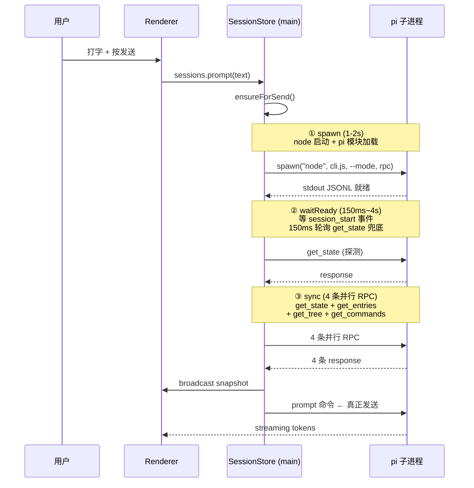

**图 1 — 当前发送路径的延迟分布：三段串行成本全在用户按发送之后**

- **spawn（1-2s）**。`createPiSubprocess` 调 Node 的 `spawn`，拉起一个 node 进程执行 `cli.js`。成本来自两个部分：node 进程自身的启动开销，以及 pi 模块（`@earendil-works/pi-coding-agent` 的 dist）的加载和初始化。这段是三段里最重的，也是最不可压缩的——它取决于 pi 底座自身的启动速度，pi-desktop 管不到底座内部怎么初始化。

- **waitReady（150ms~4s）**。spawn 完了不代表 pi 就绪了——pi 进程起来后还要跑自己的初始化（加载配置、连接 provider 等），跑完才会推 `session_start` 事件。`waitReady` 用"事件驱动首选 + 实证探测兜底"的策略：先等 `session_start` 事件（到了立即返回），每 150ms 轮询一次 `get_state` 命令做兜底探测，超时 4s。实际表现通常在几百毫秒到 1 秒——取决于 pi 的初始化速度。

- **sync（4 条并行 RPC）**。pi 就绪后，`sync()` 并行发 4 条 RPC 拉取 pi 内存状态的完整快照（`resync.ts:18-42`）。这 4 条已经并行了，压缩空间有限——它们的耗时取决于 pi 处理 4 条命令的速度和 IPC 往返延迟。实测通常在几十到一两百毫秒。

三段加起来，从用户按发送到第一个 token 出现，中间有 1-3 秒的"什么都不发生"的等待窗口。

### 1.3 为什么不能靠优化每段解决

三段串行成本，逐段看，每段都有压缩空间，但每段的根因都不在 pi-desktop 能动的范围内。

spawn 是最重的一段，但 pi 进程怎么启动是底座的事——pi-desktop 只能 `spawn("node", [cli.js, "--mode", "rpc"])`，底座自身的模块加载、初始化流程是 `@earendil-works/pi-coding-agent` 的代码。node 启动可以用 snapshot 加速、pi 模块可以延迟加载，但这些都是底座侧的优化，不在 pi-desktop 的改动范围内。

waitReady 的 150ms 轮询间隔可以缩短，但缩短间隔只是在"赌就绪"——赌 50ms 后 pi 一定就绪了，慢机不够快机白等。根因不是轮询间隔，是"到发送时才开始等就绪"。sync 已经并行了 4 条 RPC，没有更多可压缩的——它已经是最优的并行拉取。

三段各自的优化空间都有限，而且根因是同一个：**它们都在发送路径上**。用户按发送的那一刻才触发 spawn，那一刻才开始等就绪，那一刻才开始拉基线。如果这三件事能在用户打字期间就跑完——用户打字要花好几秒——那按发送时 pi 早就就绪了，发送路径上零等待。

这就是预热的核心思路：不是优化每段的速度，而是改变每段的触发时机——把就绪从"发送时同步等待"提前到"设定上下文时异步执行"。

## 2. 诊断：预热窗口已存在，只是没被利用

### 2.1 setContext 是天然的预热触发点

用户从选项目到按发送之间，有一个数秒长的自然窗口。看这个窗口的时间线：

```mermaid
gantt
    title 用户操作时间线：setContext 到 prompt 的预热窗口
    dateFormat X
    axisFormat %s

    section 用户操作
    点项目/开新会话           :a1, 0, 1s
    打字                     :a2, 1s, 5s
    按发送                   :a3, 5s, 1s

    section setContext 触发
    setContext(cwd, null)     :crit, b1, 0, 1s

    section 预热窗口（未被利用）
    可预热 spawn+waitReady   :c1, 0, 2s
    可预热 sync             :c2, after c1, 1s
    pi 已就绪，待命          :c3, after c2, 3s

    section 发送路径（当前）
    prompt → spawn+wait+sync :crit, d1, 5s, 3s
    prompt 命令              :d2, after d1, 1s
```

**图 2 — 预热窗口：用户从 setContext 到按发送之间有数秒，当前全浪费了，预热能把这个窗口用起来**

`setContext` 在两个场景被调：

- **选项目/新建对话**：`projects` 插件的 `switchCwd` 调 `useSessionStore.startNewChat(dir)`，后者调 `window.pi.sessions.setContext(cwd, null)`（`session-store.ts:241`）。用户点了项目，setContext 立刻被调。
- **打开历史会话**：`sessions-list` 插件点会话项调 `useSessionStore.openSession(path)`，后者先 `openSession` 读文件，再调 `setContext(detail.info.cwd, sessionPath)`（`session-store.ts:223`）。

两种场景里，从 `setContext` 被调到用户打完字按发送，中间至少有几秒——用户要读历史消息、要打字、要思考。这几秒足够跑完 spawn + waitReady + sync（实测 1-3 秒）。窗口就在那里，当前完全没被利用。

### 2.2 现有基础设施已就位

预热不是从零造一个新机制。它需要的三样基础设施，代码里已经有了：

- **ensureForSend 的快路径**。`ensureForSend` 的第一行是 `if (this.alive) return`（`session-store.ts:272`）。pi 已活就直接返回，零等待。预热只要保证用户按发送时 `this.alive` 为 true，快路径自动生效——不用改 ensureForSend 的任何逻辑。

- **setContext 的未发消息回收**。`setContext` 切走旧会话时，如果旧会话的进程 `touched=false`（没发过消息），会 `stop()` + `delete()` 回收（`session-store.ts:155-159`）。这意味着预热的进程如果用户切走了没发消息，自动被清理，不留垃圾。预热的 `touched` 天然是 false——没发过消息就是空壳。

- **start 的并发护栏**。`start()` 的 await 窗口内可能插入并发 `setContext` 把 `activeProcKey` 切走，代码已经处理了：切走则跳过后续 `sync()`（`session-store.ts:203`），进程保留给多会话并存。预热是 fire-and-forget，用户在预热期间切走，护栏已经在那。

三样基础设施覆盖了预热的三个关键面：发送快路径（已活就秒发）、回收（切走就清）、并发安全（切走不崩）。

### 2.3 缺的只是一步

当前 `setContext` 的注释写着"不动进程，只设激活"（`session-store.ts:137`）。它的全部工作是：设 `activeCwd`/`activeSessionPath`/`activeProcKey`，如果激活会话 pi 活着就 resync 推基线，没活就清基线。

"没活就清基线"这一步——恰恰是浪费的源头。pi 没活，setContext 清了基线就走了，等用户发送时 ensureForSend 才从零起 pi。缺的就是这一步：pi 没活时，fire-and-forget 起一个。

但 fire-and-forget 不够——用户在预热完成前按发送怎么办？`ensureForSend` 的快路径看的是 `this.alive`，而 `alive` 在 spawn 完成后就 true，不代表 adapter 已接好线。发命令往一个 stdout reader 没绑好的 adapter 上写，response 丢失。问题的根因和解决方案在下一节展开——核心差异在发送侧：fire-and-forget 在发送时不等预热，fire-and-remember 在发送前 await 预热 Promise。

## 3. 方案：fire-and-remember 预热

### 3.1 为什么不能 fire-and-forget

最直觉的做法：在 `setContext` 里，pi 没活就 `void this.start(cwd, sessionPath)`，不 await，不等。spawn 跑在后台，用户打完字按发送时大概率 pi 已经就绪。

问题出在 spawn 的异步性上。`start()` 不是一步完成的——它内部是 `adapter.start()`（绑 stdout reader、绑 exit/error 事件）+ `waitReady()`（等 session_start 事件）+ `sync()`（4 条 RPC），全 await 完才返回。而 `adapter.alive` 在 spawn 完成后就是 true——它只看子进程的 `exitCode === null && !killed`（`subprocess-lifecycle.ts:73-75`），不看 adapter 是否绑好了 stdout reader、不看 waitReady 是否完成。

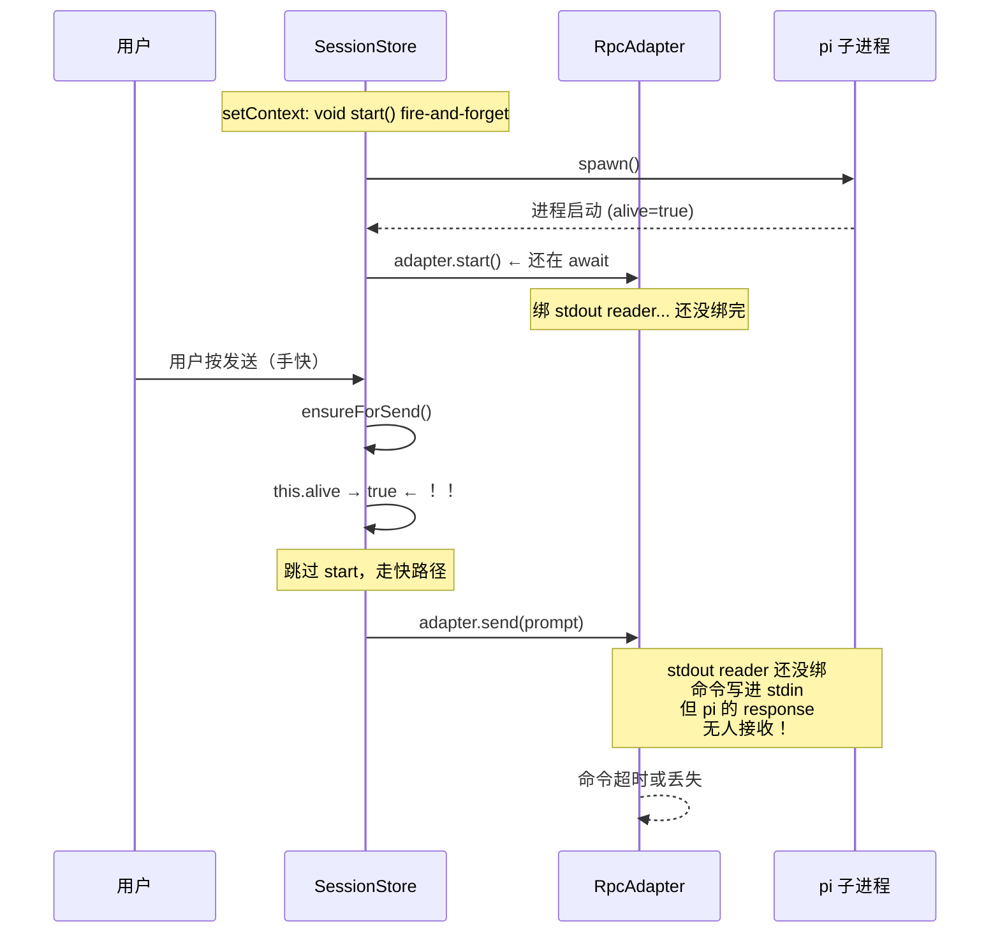

**图 3 — fire-and-forget 的竞态：alive=true 不代表就绪，stdout reader 没绑好就发命令，response 丢失**

这个竞态不是理论推演——`adapter.start()` 里绑 stdout JSONL reader（`rpc-adapter.ts:120`）和绑 exit/error 事件（`rpc-adapter.ts:92-117`）都是同步代码，但它们在 `start()` 的 await 链中，`void this.start()` 不等它们完成。`ensureForSend` 看到 `alive=true` 就跳过，直接调 `activeProc().adapter.send(buildPromptCommand(...))`——adapter 的 stdin 写得进去（子进程活着），但 stdout 上的 response 无人接收（reader 没绑好），命令超时或丢失。

根因是 `alive` 的语义和就绪的语义不对齐：`alive` 只表示"子进程没退出"，不表示"adapter 已接好线、pi 已就绪"。fire-and-forget 把这两者混淆了。

### 3.2 startPromise：记住预热 Promise，发送前 await

解法是 fire-and-remember：不 await 预热（不阻塞 setContext），但记住预热的 Promise，发送前先 await 它。

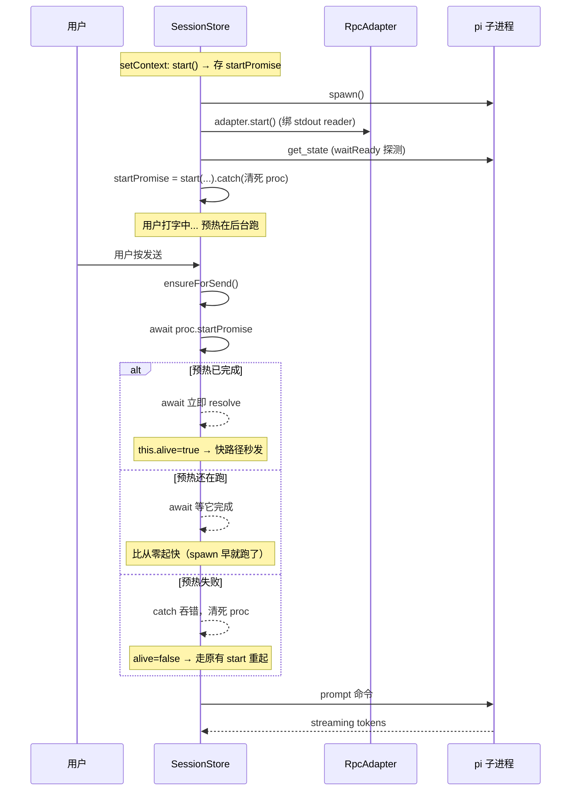

**图 4 — fire-and-remember：startPromise 保证发送时 adapter 已接线、pi 已就绪**

`SessionProc` 新增一个字段：

```typescript
interface SessionProc {
  adapter: RpcAdapter;
  cwd: string;
  boundSessionPath: string | null;
  genStartMs: number | null;
  lastTps: number | null;
  touched: boolean;
  startPromise: Promise<void> | null;  // 新增：预热 Promise，发送前 await
}
```

`setContext` 里，pi 没活时：

```typescript
if (!this.isAlive(key)) {
  // 新会话：预生成路径，水合 renderer
  let warmPath = sessionPath;
  if (!warmPath) {
    warmPath = this.generateNewSessionPath(cwd);
    this.activeSessionPath = warmPath;
    this.dispatch(key, { type: "sessionStart", sessionFile: warmPath });
  }
  // fire-and-remember：不阻塞 setContext，但记住 Promise
  const proc = this.createProc(key, cwd, warmPath);
  this.procs.set(key, proc);
  proc.startPromise = this.start(cwd, warmPath).catch((e) => {
    this.procs.delete(key);  // 预热失败清掉死 proc
    throw e;
  });
}
```

`ensureForSend` 里，加一步 await：

```typescript
private async ensureForSend(): Promise<void> {
  if (!this.activeCwd) throw new Error("未选择工作目录");
  const proc = this.activeProc();
  if (proc?.startPromise) {
    try { await proc.startPromise; }     // 预热已完成→零开销；还在跑→等它
    catch { /* 预热失败，proceed 走 start 重起 */ }
  }
  if (this.alive) return;               // 预热成功→快路径
  // 预热失败/没预热→原有 start 逻辑
  ...
}
```

`startPromise` 的生命周期和 `SessionProc` 绑定——只要 proc 在 Map 里，startPromise 就在。三种终态：

- **预热成功**：Promise resolved，startPromise 保留在 proc 上。后续 `ensureForSend` 每次 `await proc.startPromise` 都是 no-op（resolved Promise 再 await 立即返回），不会重复起 pi。proc 留在 Map 里直到被回收（切走 `touched=false` 回收，或会话关闭）。

- **预热失败**：catch 块 `this.procs.delete(key)` 把整个 proc 从 Map 移除——startPromise 随 proc 一起消失。`ensureForSend` 的 catch 吞掉 reject 错误后，`this.alive` 为 false，走原有 `start()` 逻辑重新起。重起走的是 `ensureForSend` 底部的原有路径，不经 startPromise——所以不存在"await 一个已经 rejected 的 Promise"的问题。如果用户切走又切回（触发新的 setContext），新的 setContext 会再次创建 proc + 新的 startPromise——这是一次全新的预热，和上次失败的无关。

- **预热完成后进程退出**（pi 崩溃）：startPromise 已 resolved，但 `adapter.alive` 变 false。`ensureForSend` await startPromise（no-op），判 `this.alive` 为 false，走原有 `start()` 重起。已 resolved 的 startPromise 不阻碍重起——它只是说"预热那一次成功了"，不代表进程现在活着。

### 3.3 三种发送路径

用户按发送时，预热有三种可能状态，每种都有明确路径：

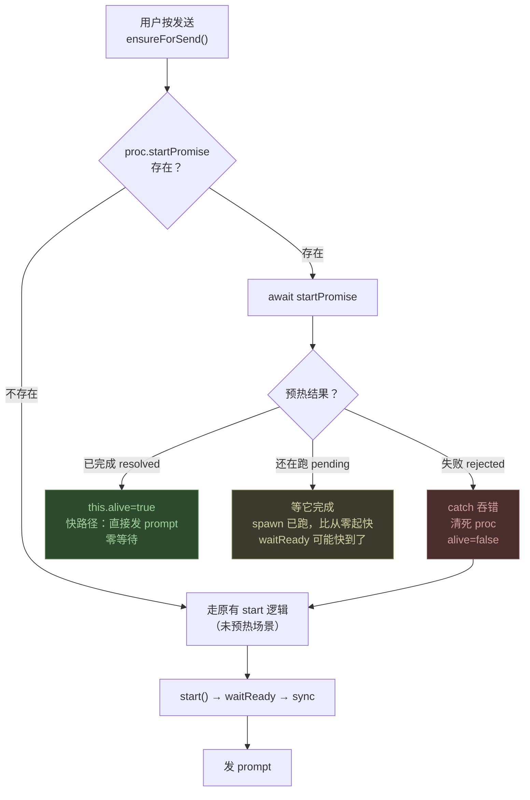

**图 5 — 三种发送路径：已完成（秒发）/ 还在跑（等预热）/ 失败（重起）**

- **已完成**是最常见的路径——用户打字花了几秒，预热早就跑完了。`await startPromise` 立即 resolve（Promise 已 settled，await 是 no-op），`this.alive` 为 true，`ensureForSend` 直接返回，prompt 立即发出。用户感受：和 pi 一直在跑一样，零启动等待。

- **还在跑**发生在用户极快按发送时——比如粘贴一句话立刻回车。`await startPromise` 会等到预热完成。这时 spawn 早就跑了（用户打字时 spawn 就开始了），等的只是 waitReady 或 sync 的尾巴——比从零起快，因为 spawn 那最重的 1-2 秒已经省了。

- **失败**是 pi 进程起不来——比如底座版本损坏、cli.js 找不到。`startPromise` reject，catch 块清掉死 proc（`this.procs.delete(key)`），`this.alive` 为 false，`ensureForSend` 走原有 `start()` 逻辑重新起。用户会看到原有的错误信息，不会因为预热失败而丢失功能。失败路径是安全的——预热是优化，不是依赖。

### 3.4 预热触发边界：哪些 setContext 预热，哪些不预热

不是所有 `setContext` 都该预热。区分标准是"这个上下文切换之后，用户大概率会发消息吗？"

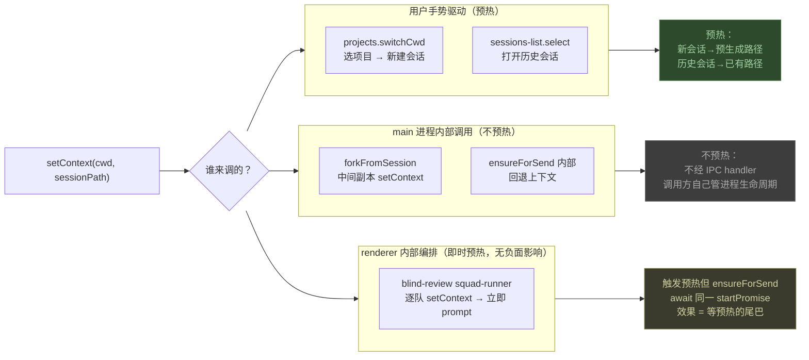

**图 6 — 预热触发边界：用户手势驱动预热，内部编排不预热**

- **用户选项目/新建对话**：`projects` 插件的 `switchCwd` → `setContext(cwd, null)`。这是最典型的预热场景——用户选了项目就是要发消息，新会话预生成路径（`generateNewSessionPath`）+ 水合 renderer（dispatch synthetic `sessionStart`），然后 fire-and-remember 起 pi。

- **用户打开历史会话**：`sessions-list` 插件点会话 → `setContext(cwd, sessionPath)`。已有路径，直接预热续接。打开会话时文件已读（`openSession`），renderer 已有消息列表，预热让 pi 在后台就绪，用户看完历史消息按发送时 pi 已经活着。

- **blind-review 的逐队 setContext**：`squad-runner.ts` 逐队调 `setContext(cwd, null)` 开全新会话（信息屏障），然后 `prompt` → 等生成完成 → 下一队。它在 renderer 进程里调 `ctx.sessions.setContext`，走 IPC 到 main，main 的 handler 会触发预热。但这不是问题——blind-review 逐队 `setContext` 后紧接着调 `prompt`，`prompt` 的 `ensureForSend` 会 `await startPromise`，复用预热的进程而非另起一个。效果是"即时预热"：setContext 和 prompt 之间几乎没有间隔，预热还没跑完 prompt 就来了，`ensureForSend` await 预热的尾巴。这和没预热时的行为几乎一样（都是等 start），只是 spawn 可能早了几毫秒。

- **forkFromSession 的中间副本**：`forkFromSession` 调 `setContext(cwd, intermediate)` 指向中间副本，然后 `start` → `fork` → 删副本。同样是内部编排，调用方显式管 start/stop，不预热。

区分方式不在 `setContext` 里加参数——那又是声明式类型标签（§1.4 的反模式）。区分靠的是调用路径的物理分叉：pi-desktop 是 Electron 应用，插件在 renderer 进程跑，`SessionStore` 在 main 进程跑，两者之间只有 IPC 通道。`ctx.sessions.setContext`（插件经 `usePluginContext()` 拿到的 API）底层是 `window.pi.sessions.setContext` → IPC → main 进程的 `ipcMain.handle` handler。预热逻辑加在这个 IPC handler 里——handler 调完 `SessionStore.setContext`（同步，设激活态）后，多走一步 fire-and-remember 预热。

`setContext(cwd, null)` 传 null sessionPath 时，`SessionStore.setContext` 用 `new:${cwd}` 作为 SessionProc 的 key（session-store.ts:153），`ensureForSend` 里 `generateNewSessionPath` 预生成新会话文件路径。blind-review 逐队 `setContext(cwd, null)` 每次都走这条路径——生成新的 `new:${cwd}` key、预生成新的会话文件路径、预热。因为每一队是全新会话（信息屏障），上一队的进程 `touched=true`（发过 prompt）不会被回收，但它的 key 和这一队不同（不同 cwd 或不同会话路径），互不干扰。

真正不该预热的是 `forkFromSession`——它在 main 进程内直接调 `SessionStore.setContext`（不经 IPC），然后显式调 `start`。这里的 `setContext` 不走 IPC handler，不触发预热。`SessionStore.setContext` 本身不改，不加预热逻辑——预热只在 IPC handler 层追加。这就是"两套入口"的物理含义：IPC handler 是 renderer → main 的唯一通道，预热挂在这里；main 进程内部的直接方法调用不经 IPC，不触发预热。

### 3.5 回收策略：没发消息的预热进程不留垃圾

预热会起 pi 进程，如果用户切走了没发消息，这些进程得被清理。回收机制已经在 `setContext` 里有了——切走旧会话时，如果旧进程 `touched=false`，`stop()` + `delete()` 回收（`session-store.ts:155-159`）。这里的"切走"指用户调了另一个 `setContext`（选了别的项目、开了别的会话、新建了对话）——新的 setContext 把 `activeProcKey` 切到新会话，同时检查旧 key 对应的 proc：如果 `touched=false` 就 stop+delete。预热的进程 `touched` 天然是 false（没发过消息就是空壳），切走时自动被回收。

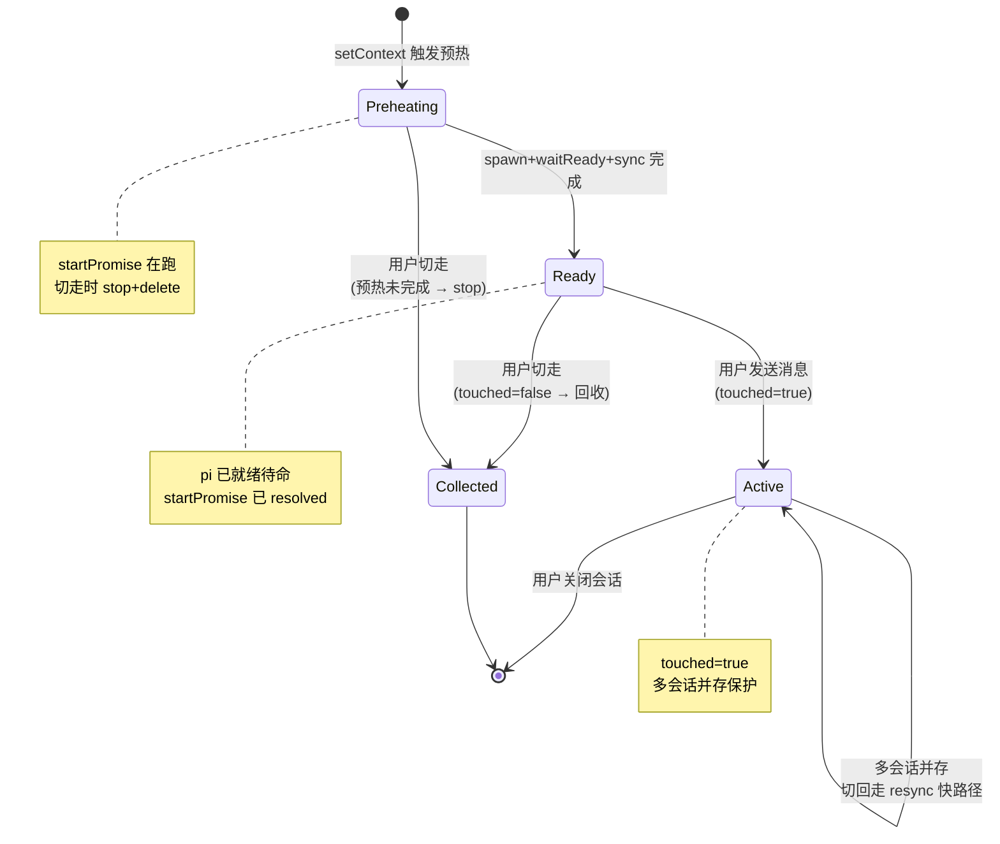

**图 7 — 预热进程的生命周期：预热 → 就绪 → 发送（活）或切走（回收）**

预热失败的回收在 `startPromise` 的 catch 块里——`this.procs.delete(key)` 清掉死 proc。如果 pi 进程在预热期间退出（比如底座崩溃），`adapter.onProcessExit` 会被调，`startPromise` 会 reject，catch 块清理。

有一种边界情况值得注意：预热完成后、用户切走前，进程已经就绪但 `touched=false`。如果用户切走，回收逻辑 `stop()` 它——一个已经就绪的 pi 进程被停掉，白预热了。这为什么可接受？因为切走是用户的主动决策——用户用行动表示"我暂时不用这个会话了"。系统不该为一个用户不打算用的进程保留 50-100MB 内存。代价是一次预热的 CPU 时间（1-3 秒），但这是一次性成本，不是持续开销——进程停了就不耗资源了。如果用户切回来，再次预热走同样的流程。相比之下，"不回收已就绪的 idle 进程"意味着用户开了十个会话、只看一个，九个 pi 在后台各占 50-100MB——这才是不可接受的。回收策略宁可多预热一次，也不让 idle 进程堆积。

### 3.6 跨会话隔离：为什么不是锁的问题

预热引入多会话并存场景，一个自然的问题是：多个会话的预热会不会互相干扰？答案是不会——隔离靠的是进程边界，不是锁。

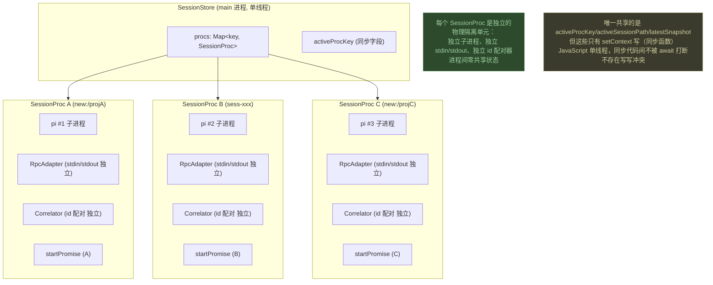

**图 8 — 跨会话隔离：每个 SessionProc 是独立的物理隔离单元，进程间零共享**

每个 pi 是独立子进程，有独立的 stdin/stdout pipe、独立的 `RpcAdapter` 实例、独立的 `RequestCorrelator`（id 配对器）。进程 A 的 `adapter.send()` 写 A 的 stdin，A 的 response 从 A 的 stdout 回来，由 A 的 correlator 配对——和进程 B 毫无关系。预热时 A 的 `start()` 和 B 的 `start()` 各 spawn 各的进程、各绑各的 stdout reader、各等各的 `session_start`——没有任何共享可争。

唯一的共享是 `SessionStore` 上的三个"激活态"字段：`activeProcKey`（当前激活会话在 `procs` Map 里的 key）、`activeSessionPath`（当前激活会话的文件路径）、`latestSnapshot`（最近一次 sync 的基线快照）。这三个字段告诉 SessionStore"接下来要往哪个会话发"——发送类方法（`prompt`/`steer`/`ensureForSend`）都从这三个字段取目标。它们的写入者只有 `setContext`（同步函数）和 `start`/`sync` 等 async 方法的 resolve 回调。但关键是：`setContext` 是**同步函数**——JavaScript 单线程事件循环里，同步代码块之间不会被 `await` 打断。两个 `setContext` 不可能"同时"写 `activeProcKey`——它们在事件循环里是串行的，一个跑完另一个才开始。竞态只发生在 async 方法的 `await` 窗口内，而这些窗口已经被 `start()` 的并发护栏（`session-store.ts:203`）和 `ensureForSend` 的上下文校验（`session-store.ts:289`）覆盖。

所以多会话不冲突的保证不是"加了锁"——是物理隔离 + 单线程同步语义。进程间零共享，不需要锁；激活态字段只有同步函数写，不需要锁。锁是共享资源的竞争协调机制，这里没有共享就没有竞争，没有竞争就不需要锁。

## 4. 竞态全景：预热引入的竞态及其处置

预热改变了 `setContext` 的语义——从"只设上下文"变成"设上下文 + 异步起 pi"。这个改变引入了几种竞态，每种都有已存在的保护机制或需要新增的保护。

```mermaid
flowchart TD
    subgraph Race1["竞态 1：预热未完成时发送"]
        R1T["触发：用户极快按发送<br/>startPromise 还 pending"] --> R1P["保护：ensureForSend<br/>await startPromise"]
        R1P --> R1R["结果：等预热完成再发<br/>比从零起快（spawn 已跑）"]
    end
    subgraph Race2["竞态 2：预热进行中切走"]
        R2T["触发：预热未完成<br/>用户切到另一会话"] --> R2P["保护：start() 并发护栏<br/>activeProcKey 切走则跳过 sync"]
        R2P --> R2R["结果：预热进程保留或回收<br/>不干扰新激活会话"]
    end
    subgraph Race3["竞态 3：预热完成但上下文已变"]
        R3T["触发：预热完成<br/>但用户已切到别的会话"] --> R3P["保护：ensureForSend 上下文校验<br/>activeSessionPath !== 预热路径 → 抛错"]
        R3P --> R3R["结果：抛"发送期间会话上下文已切换"<br/>用户重试"]
    end
    subgraph Race4["竞态 4：pref flush 在预热窗口内触发"]
        R4T["触发：setModel/setThinkingLevel<br/>在预热未完成时被调"] --> R4P["保护：ensureForSend<br/>await 同一个 startPromise"]
        R4P --> R4R["结果：复用预热的进程<br/>不会 spawn 第二个"]
    end

    style R1R fill:#2d4a2d,stroke:#4a7c4a,color:#a0d0a0
    style R2R fill:#2d4a2d,stroke:#4a7c4a,color:#a0d0a0
    style R3R fill:#3a3a2d,stroke:#7c7c4a,color:#d0d0a0
    style R4R fill:#2d4a2d,stroke:#4a7c4a,color:#a0d0a0
```

**图 9 — 竞态矩阵：四种竞态 × 触发条件 × 保护机制 × 结果**

### 4.1 预热未完成时发送

这是 §3.1 详细分析过的核心竞态。用户在预热完成前按发送，`ensureForSend` 看到 `proc.startPromise` 存在，先 await 它。await 期间：

- 如果预热在跑（spawn 已启动、adapter 正在接线、waitReady 正在等），await 等它完成。完成后 `this.alive` 为 true，走快路径发 prompt。用户等的只是预热的尾巴——spawn 那最重的 1-2 秒已经省了。
- 如果预热已经完成（startPromise 已 resolved），await 立即返回，零开销。这是最常见的路径。

保护机制是 `startPromise` 的 await——不是新加的锁，是 Promise 的天然语义。Promise resolve 后再 await 是 no-op，不阻塞；pending 时 await 等它 settle。这条路径不需要新增任何代码，`ensureForSend` 加一行 `await proc.startPromise` 就够了。

### 4.2 预热进行中切走

用户在预热还没完成时切到另一个会话。`setContext` 是同步函数，立即把 `activeProcKey` 切到新会话。旧的预热的 `start()` 还在 await 中——它的 spawn 已经跑了，但 `waitReady` 或 `sync` 可能还没完。

`start()` 内部已有并发护栏（`session-store.ts:203`）：await 完成后检查 `activeProcKey !== key`，如果切走了就跳过 `sync()`。进程不被杀（多会话并存），但 sync 不跑——因为 sync 广播的是基线，基线是给激活会话的 renderer 用的，切走了就不该推基线。

预热进程的去留取决于新 `setContext` 的回收逻辑：如果切到的目标会话已有活进程，旧预热进程 `touched=false` 会被回收（`stop()` + `delete()`）；如果用户切回，进程还在则走 resync 快路径。两种结果都是安全的。

### 4.3 预热完成但上下文已变

用户在预热完成后、发送前切到了另一个会话，然后切回来按发送。或者更微妙的情况：预热完成时 `activeSessionPath` 已经被另一个 `setContext` 改了。

`ensureForSend` 已有上下文校验（`session-store.ts:289`）：`start` 的 await 窗口内如果 `activeSessionPath` 被改，抛 `"发送期间会话上下文已切换，请重试"`。预热场景下，如果 `startPromise` await 完成后发现 `activeSessionPath` 已变，同一条校验生效。

这个竞态的本质是"预热的目标路径和当前激活路径不一致"。预热的路径是 `setContext` 时传入的 `sessionPath`（或预生成的路径），如果用户切走了，`activeSessionPath` 变了，发送时 `ensureForSend` 的校验会拦住。结果是用户看到"请重试"，再发一次走新会话的路径——不会往错误的会话发消息。

### 4.4 pref flush 在预热窗口内触发

`setModel` 和 `setThinkingLevel` 都走 `ensureForSend`（`session-store.ts:515`、`session-store.ts:601`）——它们在发设置命令前先保证 pi 在跑。如果没有预热，pref flush 自己会 `ensureForSend` → `start()` 起一个 pi；有了预热，pref flush 的 `ensureForSend` 会先 `await startPromise`——复用预热的进程，不会 spawn 第二个。

这是预热的一个额外收益：在此前的代码里，用户选项目后先改了模型再发消息，pref flush 起一个 pi、prompt 又起一个 pi——双 spawn（`session-store.ts:148-158` 的注释详细描述了这个 bug 的根因和修复历史）。有了预热，pref flush 的 `ensureForSend` await 的是同一个 `startPromise`，spawn 只发生一次。预热顺便修复了双 spawn 的竞态窗口——不是因为特意去修，是因为 `startPromise` 的 await 语义自然覆盖了这个场景。

## 5. 会话切换全景矩阵：从 A 切到 B 的所有情况

前四节分析了单会话内预热引入的竞态。这一节换一个视角：**用户正停在会话 A，点击切换到会话 B——所有可能的情况是什么，每种会不会混乱？**

会话 A（切走前）有四种状态，会话 B（切到）有三种状态，组合出 12 种情况。核心判别是两个字段：A 的 `touched`（决定 A 被不被回收）和 B 的 `isAlive`（决定 B 走 resync 还是预热）。

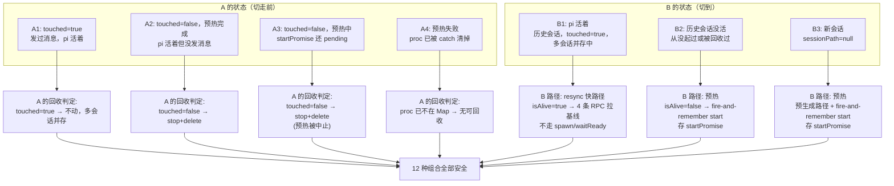

**图 10 — 会话切换矩阵：A 的 4 种状态 × B 的 3 种状态，回收判定和 B 的路径各自独立**

关键观察：**A 的回收和 B 的路径是独立的**。setContext 先处理 A（回收旧 proc），再处理 B（resync 或预热）。两条逻辑不交叉——A 的回收只看 `touched`，B 的路径只看 `isAlive`。这意味着 12 种组合的结果是可组合的：A 的回收行为 × B 的路径行为，不会因为组合不同而产生意外。

### 5.1 矩阵全展开：12 种组合逐一分析

下表把 12 种组合逐一列出。每种组合的"结果"列是"A 的处置 + B 的处置"的拼接——因为两条逻辑独立，拼接不会产生新的竞态。

| # | A 状态 | B 状态 | A 的处置 | B 的处置 | 会混乱吗 | 分析 |
|---|--------|--------|----------|----------|----------|------|
| 1 | A1 发过消息活着 | B1 活着 | 不动（多会话并存） | resync 快路径 | **不会** | 最常见的多会话并存场景。A 的 pi 继续跑，B 的 pi resync 拿实时状态。两个进程独立，互不干扰。 |
| 2 | A1 发过消息活着 | B2 历史没活 | 不动 | 预热（fire-and-remember） | **不会** | A 留着，B 后台预热。B 的 renderer 已从文件读到消息列表（openSession 时），立刻显示。用户发消息时 ensureForSend await startPromise。 |
| 3 | A1 发过消息活着 | B3 新会话 | 不动 | 预生成路径 + 预热 | **不会** | 同 #2，B 是新会话所以预生成路径。A 留着不影响 B。 |
| 4 | A2 预热完成没发 | B1 活着 | **stop+delete** | resync 快路径 | **不会** | A 没发消息，预热白做了，被回收。B 已活着走 resync。代价是 A 的一次预热 CPU 时间。 |
| 5 | A2 预热完成没发 | B2 历史没活 | **stop+delete** | 预热 | **不会** | A 回收，B 预热。最典型的"预热→切走→预热"场景。A 的 pi 被 stop，B 的 pi 被 spawn。 |
| 6 | A2 预热完成没发 | B3 新会话 | **stop+delete** | 预生成路径 + 预热 | **不会** | 同 #5，B 是新会话。 |
| 7 | A3 预热中 | B1 活着 | **stop+delete**（中止预热） | resync 快路径 | **不会** | A 的 start() 还在 await，setContext 同步把 activeProcKey 切走。start 的并发护栏跳过 sync。proc 被 stop（kill 子进程），从 Map 删除。B 走 resync。 |
| 8 | A3 预热中 | B2 历史没活 | **stop+delete** | 预热 | **不会** | A 的预热被中止（kill 子进程），B 开始新预热。A 的 startPromise 会 reject（进程被 kill），但 setContext 不 await startPromise，不感知 reject。ensureForSend 后续也不 await（A 的 proc 已不在 Map）。 |
| 9 | A3 预热中 | B3 新会话 | **stop+delete** | 预生成路径 + 预热 | **不会** | 同 #8。 |
| 10 | A4 预热失败 | B1 活着 | 无可回收（proc 已不在） | resync 快路径 | **不会** | A 的 proc 已被 catch 块 delete。setContext 检查 prevKey 找不到 proc，no-op。B 正常 resync。 |
| 11 | A4 预热失败 | B2 历史没活 | 无可回收 | 预热 | **不会** | 同 #10，A 无残留。B 开始全新预热。 |
| 12 | A4 预热失败 | B3 新会话 | 无可回收 | 预生成路径 + 预热 | **不会** | 同 #11。 |

**结论：12 种组合全部安全，不会混乱。** 原因是两条独立逻辑的可组合性：A 的回收只依赖 `touched`（A 自己的状态），B 的路径只依赖 `isAlive`（B 自己的状态），两者不存在跨会话的共享状态争用。

### 5.2 关键时序：4 种代表性场景

12 种组合里挑 4 个最有代表性的画时序——覆盖"A 活着→B 活着"（秒切）、"A 活着→B 没活"（预热切）、"A 预热中→B 活着"（中止预热）、"A 预热中→B 没活"（中止+重启）。

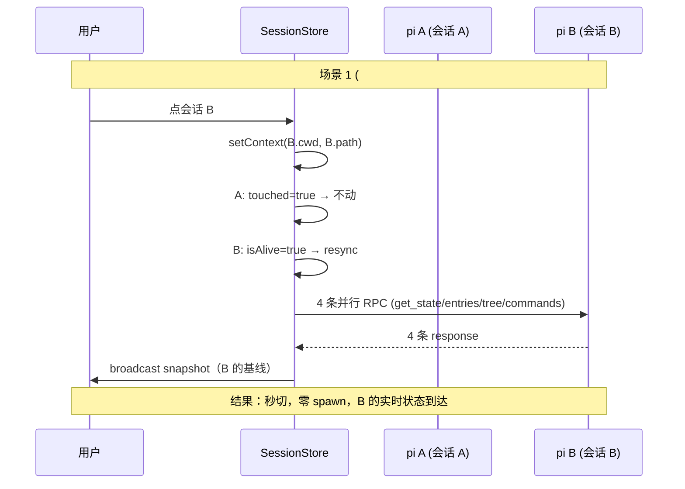

**图 11 — 场景 1（#1）：A 活着 → B 活着，resync 快路径秒切**

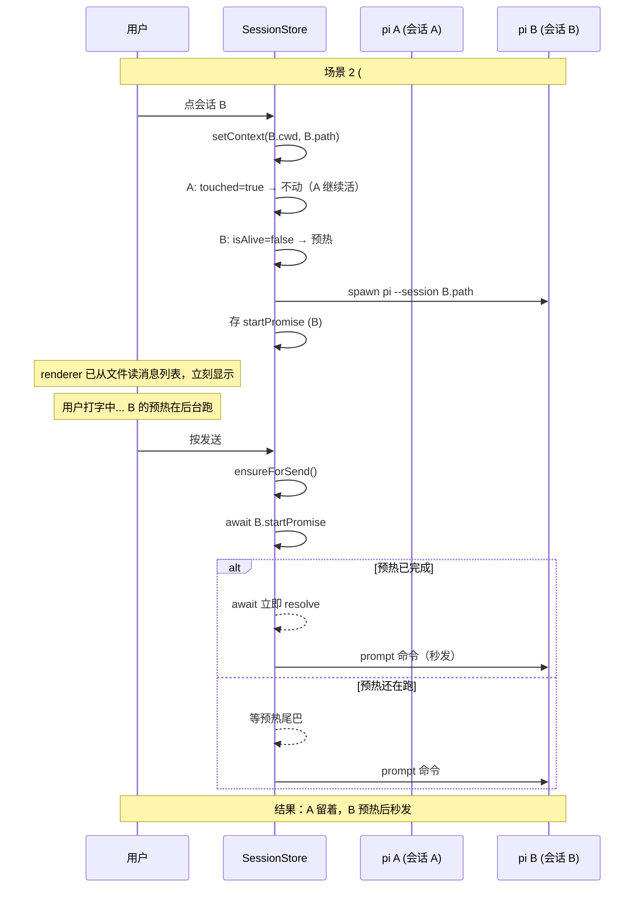

**图 12 — 场景 2（#2）：A 活着 → B 没活，预热切，A 不受影响**

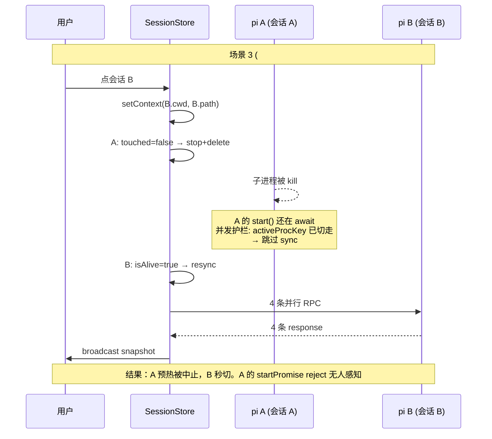

**图 13 — 场景 3（#7）：A 预热中 → B 活着，中止 A 的预热，B 秒切**

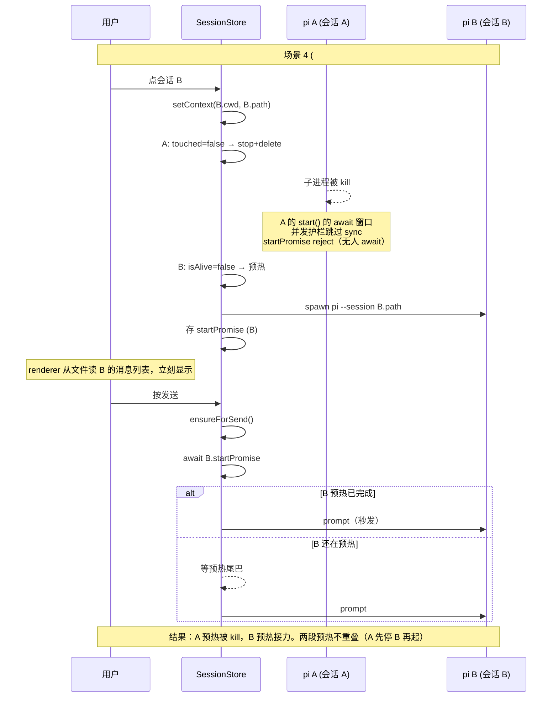

**图 14 — 场景 4（#8）：A 预热中 → B 没活，中止 A 启动 B，两段预热不重叠**

### 5.3 为什么不会混乱：三条不变式

12 种组合全部安全，不是巧合——是三条不变式在守护：

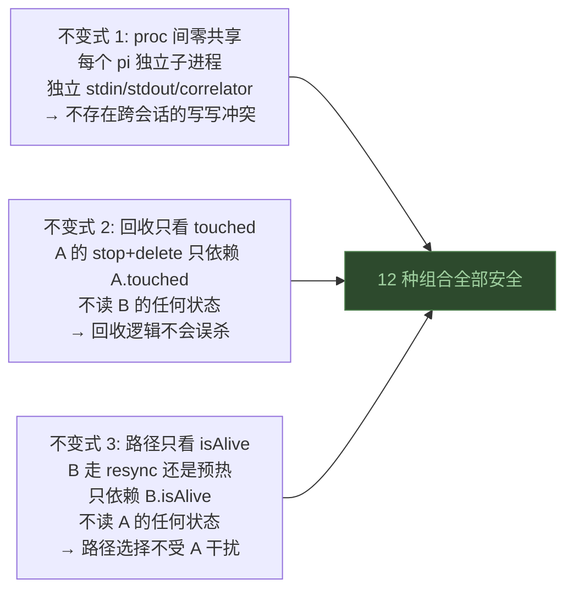

**图 15 — 三条不变式守护 12 种组合的安全性**

- **不变式 1（proc 间零共享）**保证 A 的操作和 B 的操作在物理上不可能冲突——独立子进程、独立 stdin/stdout、独立 correlator。A 被 kill 不影响 B 的 RPC，B 被 spawn 不影响 A 的事件流。

- **不变式 2（回收只看 touched）**保证 A 的回收判定不依赖 B——不管 B 是什么状态，A 的 `touched` 是 true 就不动、是 false 就 stop。回收不会因为 B 的状态变化而误杀或漏杀。

- **不变式 3（路径只看 isAlive）**保证 B 的路径选择不依赖 A——不管 A 是活着、预热中、还是已死，B 的 `isAlive` 为 true 就走 resync、为 false 就预热。路径选择不受 A 的任何状态影响。

三条不变式合在一起，意味着"A 的回收 × B 的路径"是两个独立函数的笛卡尔积——每种组合的结果都是两个独立行为的拼接，不会产生新的竞态。这就是 §3.6 说的"隔离靠进程边界不是锁"的具体含义：不需要锁，因为不存在共享；不需要协调，因为两条逻辑读的是各自的状态。

## 6. QA

**Q：预热失败后用户发送会怎样？**

`startPromise` reject，catch 块 `this.procs.delete(key)` 清掉死 proc，`this.alive` 为 false。`ensureForSend` 的 catch 吞掉错误，走到原有 `start()` 逻辑重新起 pi。如果 pi 真的起不来（比如底座没装），用户看到的是原有 `start()` 的错误——和没预热时一模一样。预热是优化路径，失败自动降级到非预热路径，不丢失任何功能。

**Q：预热的 pi 占多少内存？空闲多久该回收？**

一个 idle 的 pi 子进程（node + pi 模块）大约占 50-100MB RSS。当前回收策略是"切走时 `touched=false` 就 stop"——用户切到别的会话，预热进程立即被回收，不会空闲占着。没有"空闲超时自动杀"的机制——如果用户停在一个会话页面上不切走、也不发消息，预热进程一直活着。这是可接受的：用户停在一个会话上，大概率是要用它的，保留进程让首条消息秒发比节省 50-100MB 更值。如果将来发现用户经常开很多会话但只看不用，可以加一个空闲超时（比如 5 分钟未发送就 stop），但这是优化，不是当前需要解决的。

**Q：多会话并存时，后台会话的预热进程会不会堆积？**

不会。回收逻辑在 `setContext` 切走时触发——每次切到新会话，旧会话的 `touched=false` 进程被 stop+delete。用户同时"持有"的活进程数 = 发过消息的会话数（`touched=true`，多会话并存保护）+ 当前正在看的会话的预热进程（0 或 1 个）。发过消息的会话堆积是多会话并存模型的已有取舍，不是预热引入的——预热只增加"当前正在看但没发消息"的会话的进程，而且切走就回收。

**Q：blind-review 的内部 setContext 会不会误触发预热？**

会触发预热，但不影响功能。blind-review 的 `squad-runner.ts` 在 renderer 进程里调 `ctx.sessions.setContext`，走 IPC 到 main，main 的 handler 会触发预热。`setContext(cwd, null)` 传 null sessionPath，SessionStore 用 `new:${cwd}` 作为 SessionProc 的 key，预生成新会话文件路径。但 blind-review 紧接着调 `prompt`，`prompt` 的 `ensureForSend` 会 `await startPromise`——复用预热的进程而非另起一个。效果是"即时预热"：setContext 和 prompt 之间几乎没有间隔，预热还没跑完 prompt 就来了，`ensureForSend` await 预热的尾巴。这和没预热时的行为几乎一样（都是等 start），只是 spawn 可能早了几毫秒。真正不预热的是 `forkFromSession`——它在 main 进程内直接调 `SessionStore.setContext`（不经 IPC），不触发预热，它自己显式调 `start`。

**Q：打开历史会话预热 vs 新建会话预热，sessionPath 语义有何不同？**

新建会话时 `sessionPath` 为 null，预热需要预生成路径（`generateNewSessionPath`）传给 pi 的 `--session` 参数，并 dispatch synthetic `sessionStart` 水合 renderer 的 `currentSessionPath`。打开历史会话时 `sessionPath` 已有，预热直接用这个路径 spawn `pi --session <path>` 续接。两者的预热流程一样（spawn → waitReady → sync），区别只在路径来源：预生成的 vs 已有的。预生成路径在预热失败时不会被清理（pi 没落盘就不存在文件），在用户切走时会被回收逻辑 stop 进程——但不删文件（文件本就不存在）。已有路径在预热失败时进程被清，文件还在，下次再打开可重试。

**Q：预热改了 setContext 的语义，会不会破坏"不动进程只设激活"的现有契约？**

"不动进程只设激活"是当前 `setContext` 的实现描述（代码注释里的措辞），不是架构契约。`setContext` 的真正契约是"设定发送上下文"——保证调用后 `activeCwd`、`activeSessionPath`、`activeProcKey` 这三个字段正确指向调用方传入的 cwd 和 sessionPath。这个契约不被预热破坏：预热逻辑在 IPC handler 层追加，调完 `SessionStore.setContext`（同步，设这三个字段）后才 fire-and-remember 起 pi，三个字段的设定先于预热。`ensureForSend` 的快路径（`if (this.alive) return`）、`setContext` 的回收逻辑（`touched=false` 则 stop+delete）、`start` 的并发护栏——这些都不受影响。`SessionStore.setContext` 本身不改——仍然是同步函数，仍然是纯状态设定。变化全在 IPC handler 层：handler 调完 setContext 后多走一步预热。这个变化对 `SessionStore.setContext` 的所有调用方是透明的——函数签名不变、同步语义不变、返回值不变。

**Q：预热把新会话的 PI 图标占位提前顶掉了，怎么办？**

初版 warmup 的 sync 广播会导致这个病：pi 新会话启动时底座会写入两条初始化 entry（`model_change` + `thinking_level_change`），`resync`（sync 基线）与 `readSession`（文件读）共用 `sessionEntryToNeutral` 把它们映射成两条 `role="divider"` 的消息。warmup 的 `start()` 完成后 sync 广播 snapshot，renderer 的 `messages` 从空数组变成 2 条 divider——timeline 的占位判定 `visibleMessages.length === 0` 立即失败，用户没发消息就离开"PI 大图标 + 问候语"去会话流。

这个病的归属不在 warmup，也不在 sync 广播——两条 init entry 是底座的固有初始化噪音，任何拉全量的路径都会带上它。归属在占位条件本身：它拿"有没有任何可见 entry"当"有没有对话内容"，把 meta 噪音误当会话流。修复是内容驱动：占位条件改为"无 `role === "user"` 的消息"（`src/plugins/sessions/timeline/renderer/index.tsx:510`）。init divider、compaction、branch_summary 等所有 meta 条目天然不计入——新会话显示图标直到用户发出首条消息（乐观消息 `role: "user"` 立即转场）；分叉点取在首个 user 消息之前的会话同样按"无对话内容"显示图标，语义一致。历史会话全含用户消息，sync 替换成同构消息，视觉无变化。
