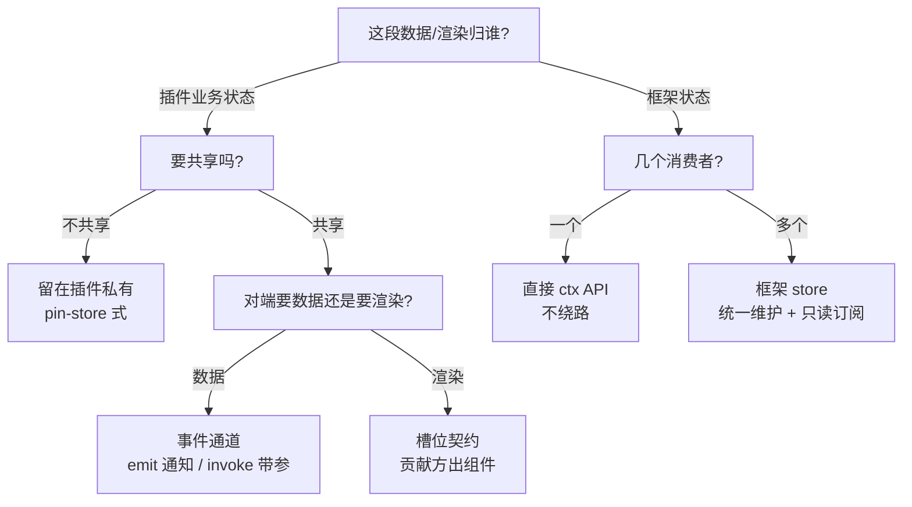
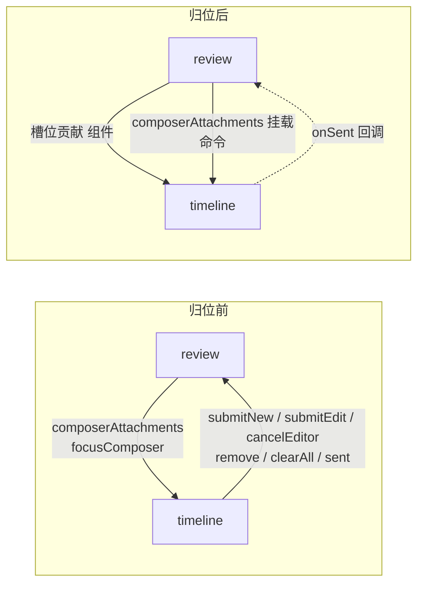

# 插件间解耦的三手段：store 订阅 / 事件通道 / 槽位契约

插件之间有三件事要做：共享数据、通知变更、互相渲染。pi-desktop 给了三条路——框架 store 订阅、事件总线、槽位契约——但一直没有一套判据说清楚"什么场景走哪条路"。结果是同一种需求在不同插件里走了不同的路：该进 store 的数据在各处拉取，该归槽的渲染焊进宿主插件，该走事件的通知用 debounce 猜时序。这篇文章把三条路的分工写成可执行的判据，然后用四个判据违规点、一个契约缺口和一批演进标注证明判据不是空谈。读完你可以拿第 3 节的扫描法去查自己的插件代码。

读者假定已知 CLAUDE.md 的核心概念：圆心、槽位、PluginContext（本文简称 ctx）、事件总线（channel / emit / invoke）、JSONL。涉及这些词不再展开，只讲本文要新增的判据。

## 1 问题：插件间耦合的三种形态

### 1.1 判据违规点与契约缺口：现象与本该走的路

先摆现象，每处给"现在是什么样、本该是哪条路"，细节留到第 4–7 节展开。

**llm-recorder 记录面板：写侧事件驱动、读侧全量拉取。** 底座扩展（运行在 pi 底座进程内的扩展，桌面端经 piExtensionEnsure 随插件启停同步到 `~/.pi/agent/extensions/`；本插件的扩展在 `src/plugins/insight/llm-recorder/pi-extension/index.ts`）在 `before_provider_request` / `message_end`（底座事件名，桌面侧叫 `messageEnd`）事件里落盘 JSONL——写侧是事件驱动的。桌面侧 `RecordsTab`（`renderer/index.tsx`）却是另一套逻辑：`messages` 变化（流式期间每个 token 都变）→ 400ms 尾沿防抖（trailing-edge，只在变化停止后触发一次）→ 全量 `listDir` + 读所有分片 + `parseLogText` 逐行解析 + `pairRecords` 按 seq（会话级续号）配对——request 行和 response 行合成一条记录。写侧按事件写、读侧按全量拉，两边不对称；重读成本随会话历史线性增长。本该走事件手段：用 `messageEnd` 事件触发增量读。

**review 评论篮子：渲染焊进宿主插件。** timeline 的 `ComposerDock`（composer 下方的停靠区，composer 是 timeline 的输入框）里 `matched.items.map` 画的是 review 插件的评论篮子——"篮子"是用户在选中的文本上打的一批待发送评论（每条含序号、引用预览、正文），发送时拼进 prompt。`ReviewInlineEditor`（`timeline/renderer/index.tsx:1059`）是 timeline 自己写的编辑组件，`generalConfig["reviewBasketVisibleCount"]`（同文件 407 行）是 timeline 在读 review 的业务配置——generalConfig 是通用设置页配置文件 general.json 的 renderer 侧合并视图，ui-store 持有。数据经 `timeline:composerAttachments` 通道流入（数据层解耦了），渲染却由消费方 timeline 代劳——review 的内容焊在宿主插件里。本该走槽位手段：谁的数据谁画，review 贡献渲染组件，timeline 只挂槽。

**sessions.list 四处拉取：同一数据四次复制。** `ctx.sessions.list(currentCwd)` 被四个消费方各写一遍：sessions-list（`renderer/index.tsx:133/157` 两处调用同一 reload 函数）、session-colors（`renderer/index.tsx:91`）、timeline（`renderer/index.tsx:379`，取 custom 字段）、sub-agent（`client/ports.ts:22`）。每个消费方自己拉取、自己写事件订阅刷新——session-colors 只在 `currentCwd` 变化时拉一次，会话改名后钉子（session-colors 给会话行和消息钉的彩色图钉）上的名字不更新，要切走再切回才恢复。会话元数据是框架状态（内核 session-store——main 侧会话管理器——持有、经 IPC 暴露），多消费方，本该走 store 手段：收进框架 store，框架统一维护，插件只读订阅。

**切会话直改框架 setter：store 边界违规。** session-colors（`renderer/index.tsx:134-140`）和 sessions-list（`renderer/index.tsx:122`）直调 `useUiStore.getState().setCurrentSessionPath/setSessionTitle`。CLAUDE.md §8.2 说共享 store 只读、改框架状态走 ctx API，但 `ctx.sessions.setContext(cwd, sessionPath)` 的语义是"cwd 和 path 一起设"，切会话场景 cwd 不变、对不上，插件只能绕去改 store。本该走 ctx API：补一个"仅切会话"的导航入口。

**dependsOn 缺口：订阅了却没声明护栏（这是契约缺口，不是判据违规——判据只管 store/事件/槽位三选一，dependsOn 是 CLAUDE.md §8.2 的独立契约）。** timeline 订阅 `notes:fillComposer`（notes 插件把笔记内容填入输入框让用户改后发送，`renderer/index.tsx:255`），`plugin.json` 的 `dependsOn` 里只有 `["pi-model-manager", "message-blocks"]`，没有 notes。CLAUDE.md §8.2 说"凡消费别人的 channel（on 或 invoke）都应声明 dependsOn"——on 订阅失败会抛错，`try/catch` 兜住了运行时错误，但生命周期护栏缺失：停用 notes 时没有任何拦截。

另有四个演进项（project-stats 会话目录重扫、review 的 DOM 定位、refreshRequested 触发点扩容、git-review/file-tree 工作区 watcher）在 §7.2 列出——有的是无事件源场景、有的是 API 缺位或信号缺触发点，都不进判据主流程。

### 1.2 现有契约的覆盖与空白

三条路在 CLAUDE.md 里都有定义：§8.2 写了事件总线（emit/invoke 分工、dependsOn、共享 store 只读），§7.3 列了一长串槽位（sidebar、settings、blockRenderers、composerPolicies……）。缺的不是通道本身，是**判据**——什么场景走哪条路，没有可执行的规则。同一需求在不同插件里选了不同实现，就是判据缺失的直接证据。

三个具体空白：

**空白一：同一数据多消费方，没有"收进框架 store"的路径。** CLAUDE.md §8.2 的"事件唯一通道"（见 `docs/design/plugin-isolation-principles.md` §1.2）是针对"插件间共享 store 互写"说的——那个要禁止。但它没有区分"插件共享 store 互写"和"框架 store 只读"是两种东西：前者是插件 A 写、插件 B 读的隐式握手，要禁；后者是框架持有、多插件只读订阅，该鼓励。判据缺失后，同一数据多消费方的插件要么各自拉取（sessions.list 四处复制），要么硬造一条"列表变了"事件让各插件收到后再各自拉——都是绕路。

**空白二：消费方渲染区没有渲染槽，贡献方只能交数据让消费方画。** 消息流有 blockRenderers 槽，评论篮子没有对应的 composer 渲染槽——review 只能把篮子数据经事件递给 timeline，timeline 画。渲染归属没有契约可走，内容就焊进宿主插件。

**空白三：导航类动作没有 ctx API。** `setContext` 语义太宽，插件就直改 store setter。这是 API 形状缺位导致的边界违规，不是插件乱来。

三个空白对应三个手段各自的缺位。还有一种越界不属于缺位而是误用：llm-recorder 的通道都在（事件流、store 都有），它错在把高频触发挂到全量重读上——该走事件增量却用了防抖拉取。这类误用是判据缺失的另一种后果：通道在，但不知道该怎么选。

### 1.3 目标与边界

这篇文档交付三样东西：一套判据（第 2 节，三个问题定去路）、一个扫描法（第 3 节，拿判据查代码）、三个落地实例加快修演进（第 4–7 节，判据在真实越界点上的证明）。不另起炉灶——三条路都在，补的是判据和缺位。

有三件事明确不做。不把插件私有业务状态塞进框架 store——store 只装框架状态，插件状态留在插件（review 的篮子、session-colors 的钉子，都不该进 ui-store/session-store）。不事件化一切——事件源覆盖不了全部变化来源时，惰性校验是更优解（`docs/design/models-config-reload.md` 的 mtime 懒校验 vs 保存事件杀进程，那篇文档的作者明确选前者）。不新建与 CLAUDE.md §8.2 冲突的通道——store 手段是对"框架 store 只读"的落实，不是对"事件唯一通道"的否定，两者的关系在 QA 的 Q8 讲清。

## 2 统一抽象：三手段与判据

三件事、三条路，但背后是同一个问题：**一段数据或一段渲染，它的"所有者"是谁？** 回答了这个，去路就定了。

### 2.1 手段一：框架 store 订阅——数据归框架、多消费方

状态存在 ui-store / session-store（`src/api/renderer/stores/`，renderer 侧），插件用 `useUiStore((s) => s.currentCwd)` 订阅，框架统一维护更新。两个 store 的分工：ui-store 装界面态（currentCwd、currentSessionPath、布局、通用配置），session-store 装会话投影（messages、stats、快照——每次 resync 后广播的会话全量状态、streaming 等原始流状态）。React 的 store 订阅本身就是事件驱动的一种形态：数据源变了就推给所有订阅者，没变不打扰——这正是 CLAUDE.md §3.6 要的"基线 + 事件增量"。

适用条件：状态**归框架所有**（会话列表、当前 cwd、消息流），且**多个消费方**要读。正例是 ContextUsageBar：零 props、自订阅 useSessionStore（commit `3d8b36b` 的"组件与位置解耦"——它把上下文用量条从 titlebar 迁进 composer，组件零 props、自订阅 store，位置变化不动组件）。反例边界：插件私有业务状态（session-colors 的 pin-store）不进框架 store——那不是框架状态，物理隔离下别的插件也 import 不到，天然私有。

把插件状态硬塞进框架 store 的后果也要说清：插件失去对自己状态的写权（setter 只由框架调），形状变化要动框架，框架被非框架状态污染——store 装的是"换壳测试"下仍在的东西，插件状态不在其中。误判方向 A（该进 store 的留在插件）的后果是四处复制 + 数据 stale（sessions.list 就是现场）；方向 B（该留插件的塞进 store）的后果就是这一条。

### 2.2 手段二：事件通道——跨插件单向的命令与状态广播

renderer 事件总线（`packages/react/src/event-bus.ts`），channel 由代码级 `export const channels` 声明，框架加载时自动注册。两种原语分工不同：`emit` 是发布/订阅，只能发自己声明的 channel，payload 缓存供 `replayLast` 回放，适合**状态变更通知**——payload 是"什么变了"的轻量信号，消费者收到后自己决定怎么取数据（`docs/design/plugin-event-flow.md` §1 的核心论断，本文沿用）；`invoke` 是定向分派，调别人的 channel 不需要权属，无订阅者时入队、首个订阅者挂载时恰好一次投递，适合**携带参数的命令**——如 `timeline:scrollTo` 带 messageId，被 session-bookmarks / session-colors / session-tree 三个插件调用。

界限要说清：emit 事件不携带数据主体（消费者自取），invoke 命令携带参数（数据随命令走）。`timeline:composerAttachments` 是 invoke 语义——review 发"把篮子挂上 composer"的命令，参数就是挂载数据——它不是数据广播，不违反"事件是通知"的界限。本文措辞上把 invoke 通道也叫"事件"（沿用代码里 `events.invoke` 的叫法），读到按 invoke 语义理解。命名上：`message_end`（底座扩展侧，下划线）与 `messageEnd`（桌面事件流侧，驼峰）是同一逻辑事件在两个层的名字，本文一律用 `messageEnd`，提到底座扩展时括注原事件名。

还有一个容易混的边界："channel 已注册但无订阅者"（invoke 入队、恰好一次投递）和"channel 未注册"（插件未加载/已卸载，on 抛错、invoke 抛错）是两回事。前者是正常时序，后者才是 try/catch 要兜的异常。

### 2.3 手段三：槽位契约——渲染归属，谁的数据谁画

manifest 声明贡献（`contributes.blockRenderers: [{id, block, component}]`），消费方查槽渲染（`window.pi.slots.blockRenderers()` → 按 (block, name) 二键解析）。贡献方提供渲染组件，消费方只认槽位契约不认具体插件——commit `3b48848` 把 skill 块从 timeline 归位到 skill-manager，走的就是这条槽。

适用条件：**A 的业务 UI 要出现在 B 的渲染区**。消息流里的工具卡（message-blocks 贡献）、围栏代码块（mermaid/puml 贡献）、输入框只读策略（composerPolicies 贡献）都是正例。反例边界：贡献方交给消费方的数据形状（payload 类型）该由贡献方定义、圆心声明，消费方不自己发明一份"本地版"（CLAUDE.md §1.3 契约单源）。

### 2.4 判据：三个问题定去路

选路时依次问三个问题，问完按分支落：

**问题一：这段数据/渲染归谁所有？** 归框架（内核已持有并维护、经 IPC 暴露的状态，如会话/cwd/消息流）→ 进框架 store 或走 ctx API；归插件（插件自己产生并持有的业务状态）→ 留在插件，需要共享时经事件或槽位传出去。判定测试：这个状态是不是内核在维护？是 → 框架状态；不是 → 插件状态。

**问题二：有几个消费者？** 框架状态 + 一个消费者 → 直接调 ctx API（如 `ctx.sessions.openSession`，导航动作），不绕路；框架状态 + 多个消费者 → 收进框架 store，统一维护 + 只读订阅；插件状态 + 不共享 → 留在私有，什么都不做。注意：判据说"单消费者走 ctx API"，具体 API 形状要合适——`setContext(cwd, sessionPath)` 语义太宽是 API 形状问题，判据结论（走 ctx 不绕路）不受影响，第 4.3 节补形状合适的 API。

**问题三：插件状态要共享时，对端要的是数据还是渲染？** 要数据 → 事件通道（emit 通知 / invoke 带参数）；要渲染 → 槽位契约，贡献方出组件。

**图 1 — 三个问题定去路**

### 2.5 边界与反例：什么时候不按判据走

判据的适用面之外有几条硬边界，都是项目里已经踩过、定过性的：

**同插件内部 + 框架状态，走 store 直读，事件等于绕道。** commit `3d8b36b` 的 ContextUsageBar 在 timeline 插件内部、读的是框架消息状态，设计时明确否了事件方案："两组件在同一插件内部、数据源是框架状态，事件等于绕道"。

**判据之外再问一句：数据源会推吗？** 推不了（事件源覆盖不了全部变化来源）就保持惰性校验 + 增量缓存。commit `685ca73` 给底座进程的配置依赖做了 mtime 懒校验（复用前 stat 对比，过期重建），明确不做"保存事件驱动杀进程"——事件只覆盖桌面端一条保存路径，懒校验覆盖编辑器、外部工具一切来源。

**能直写不走事件链。** commit `ed11783` 把 echo 徽章（用户消息落盘后输入框上方"已发送"的回显标识）从"entryAppended 事件链"改成 hash 键发送时直写——发送方自己感知写入完成，事件链是多余的中间层。事件是跨插件的通道，不是插件内部自说自话的仪式。

**操作完成必须变成通知。** commit `b331cb5`（`docs/design/refresh-signal.md`）的根因就是"装完底座没变成任何通知，而消费方只在挂载时探测一次"。它给出一个通用形态：main 侧操作完成 → 广播不绑资源的 `system:refreshRequested`（不绑资源 = 信号不带 payload、不指定是哪个资源变了，任何影响展示的操作完成都发同一个）→ 消费方重探。这条补在判据之外：即使按判据走了 store/事件，**任何影响他人挂载态的操作完成，都要记得发信号**。

## 3 怎么用判据扫描代码

第 2 节的判据是静态的，扫描法把它变成动作。对着插件代码过四关，每一关对应一个越界形态：

### 3.1 四步扫描

**第一关：找拉取式 useEffect。** 组件挂载时调 `ctx.sessions.list` / `ctx.fs.listDir` / `ctx.kernel.status` 拉数据，之后只有切参数才重拉，或靠 debounce 全量重读。命中后问：这个数据是框架状态吗？是 → 该读框架 store 而不是自己拉（sessions.list 四处复制就是这么来的）；数据源有事件吗？有 → 该订阅事件做增量而不是 debounce 全量（llm-recorder 就是这么来的）。

**第二关：找焊进别的插件的 JSX。** A 插件的 renderer 里渲染 B 插件的业务 UI——评论篮子画在 timeline、skill 卡片画在 timeline（已归位）。命中后问：这段 JSX 是"宿主外壳"（挂载、布局、滚动）还是"内容呈现"（B 的具体业务）？后者该由 B 经槽位贡献，消费方只留挂载点。

**第三关：找直改框架 store setter。** `useUiStore.getState().set...` / `useSessionStore.getState().set...` 出现在插件里。命中后问：这是改框架状态吗？是 → 该走 ctx API，框架处理后更新 store 并 emit 系统事件（CLAUDE.md §8.2）。缺 API 是"API 形状缺位"，要补 API 而不是放任插件直改。

**第四关：找消费了 channel 但没声明 dependsOn。** 订阅/调用了别的插件的 channel，`plugin.json` 的 `dependsOn` 里却没有对方。命中后补声明——on 订阅失败会抛错，护栏缺失是契约漂移（文档描述和代码行为不一致，CLAUDE.md §5.3 要求立即更）。

### 3.2 决策树

扫描命中的每处，走第 2.4 的图 1：数据归谁 → 几个消费者 → 要数据还是要渲染。三个问题以内定去路，定完对照 §2.5 的边界复查四件事：是不是同插件内部（store 直读）；数据源能不能推（不能推就惰性校验）；能不能直写（能就不造事件）；操作完成会不会影响别人的挂载态（会就发刷新信号）。

## 4 落地一：会话元数据收进框架 store（store 手段）

### 4.1 现状与根因

`sessions.list` 四个消费方各有各的拉取和刷新逻辑。sessions-list 最完整——它订阅 kernel 事件流（`onKernelEvent`，sessionStart/messageEnd/agentSettled 触发 reload），还顺手维护 phase（会话工作阶段，`eced5b8` 的产物）和未读增量（entryAppended 到达即推进的已读位标）。session-colors 最弱——只在 `currentCwd` 变化时拉一次存进本地 `sessionInfos` map（`renderer/index.tsx:89-95`），会话改名、新建后钉子的名字不更新，切走再切回才恢复。timeline 为取 custom 字段拉一整份 list。sub-agent 的 ports 封装里也有一份。

根因是一句话：**会话元数据是框架状态（内核 session-store 持有、经 IPC 暴露），多消费方，却没进框架 store——每个插件各写一遍"拉取 + 刷新"**。这违反 CLAUDE.md §3.3"框架管通用"：同一逻辑在四个入口各写一遍，差异只在参数，该收进框架一个实现。

### 4.2 方案：sessionInfos 框架 store

在 renderer 侧 session-store（`src/api/renderer/stores/session-store.ts`，区别于第 4.1 节的"内核 session-store"——后者是 main 侧的会话管理器）加 `sessionInfos: Record<string, SessionInfo> | null`，由框架统一维护：切 cwd 时拉一次基线，之后从 kernel 事件流增量更新（sessionStart 新增、messageEnd 更新 lastMessage/标题、entryAppended 更新该会话的 lastEntry 字段）。消费方改读 store：

- sessions-list 读 `sessionInfos` 渲染列表，删掉自己的 `reload`/`applyList` 和"列表变更 → 重拉"的订阅——phase（会话工作阶段，从事件流推导的派生状态）和未读增量（entryAppended 到达即推进的已读位标）这两件事它保留自己的 onKernelEvent 订阅自己维护，那是它自己的派生状态，不是会话元数据；
- session-colors 直接读 `sessionInfos[path]` 取 name/icon——挂载拉一次即 stale 的老问题自动消失，零订阅逻辑；
- timeline 从 `sessionInfos[currentSessionPath]` 取 custom，删掉第 379 行那份 list 调用。

不新增事件通道——store 即订阅面，数据源（内核事件流）已经被框架占着，消费方不再需要各自订阅。

**手动刷新语义保留。** 收编后用户主动刷新按钮还在：框架在 store 上保留一个 re-pull 入口（切 cwd 的基线拉取同一函数），点刷新 = 重拉基线并整体替换 `sessionInfos`。基线与增量的合并规则不需要额外设计：事件驱动模型里增量永远应用在最新状态上（先有基线、后有增量事件），re-pull 拿到新基线后，之后到达的增量事件继续在新基线上应用——先后顺序由事件到达序天然保证，不存在"旧快照覆盖新增量"的路径，因为增量从不触发全量替换。re-pull 飞行途中到达的增量会先应用在旧状态上、随后被新基线整体替换——因为新基线反映更晚的内核状态，覆盖无害；增量从不回放，下一次事件到达时已在新基线上。

### 4.3 连带：切会话导航收敛为 ctx API

session-colors 和 sessions-list 直改 `setCurrentSessionPath`/`setSessionTitle` 的根因是 `ctx.sessions.setContext(cwd, sessionPath)` 语义太宽。补一个 `ctx.sessions.openSession(sessionPath)`：仅切会话、cwd 不动，内部走 renderer 侧 `sessionStore.setContext(currentCwd, path)`（renderer store 的导航方法，不是被批判的 ctx API），并顺带设派生标题（标题是从会话元数据 derive 出来的，导航时一起设，正好消掉 `setSessionTitle` 那处直改）。框架处理后更新 ui-store 并广播 `system:sessionChanged`——这个系统事件在 CLAUDE.md §8.2 里列了（cwdChanged、sessionChanged、settingsChanged 是系统事件的示例），代码里还没有，这次落地补齐。两个插件改走 ctx，删掉全部直改 setter。

### 4.4 边界

**sub-agent 的 orchestrator 不碰 store。** sub-agent 的 `core/orchestrator.ts` 是纯逻辑（设计上不 import react、不碰 ctx），它的 list 需求经 `ports.sessions.list` 注入（`client/ports.ts:22`）。sessionInfos 收进框架 store 后，调用方（renderer 侧）从 store 读、经 ports 传入，orchestrator 一行不改——依赖倒置的既有形态，不因为 store 收编而破坏。

**custom 字段随 info 带出。** timeline 取 custom 依赖 `SessionInfo.custom` 存在。若当前 list 接口的返回不带 custom，sessionInfos 需要带——这是内核 session-scanner 的字段契约问题，落地时确认，不动消费方。

**大目录性能。** 现状就是全量 list，收进框架不改语义——只改"谁拉"：四次各自拉变成一次框架拉 + 订阅。事件流增量更新让"活跃会话文件每轮都变"的会话目录不再触发全量重拉（与 project-stats 的增量缓存同思路）。

## 5 落地二：review ↔ timeline 解耦（槽位手段）

### 5.1 现状与根因

review 和 timeline 的耦合是目前最重的一处，具体形态：

- **渲染焊在 timeline**：`ComposerDock` 里 `matched.items.map` 画评论篮子（`timeline/renderer/index.tsx:837-880`），`ReviewInlineEditor` 是 timeline 自己写的（1059 行）；
- **timeline 读 review 的配置**：`generalConfig["reviewBasketVisibleCount"]`（407 行）；
- **双向通道**：review → timeline 的 `timeline:composerAttachments`（挂篮子）和 `timeline:focusComposer`（聚焦输入框），timeline → review 的六个 `review:*` 通道（`submitNew` 新评论入篮 / `submitEdit` 编辑 / `cancelEditor` 取消编辑 / `remove` 删一条 / `clearAll` 清空 / `sent` 发送回执）；
- **全是 try/catch 兜底**："review unloaded"、"timeline not loaded yet"——双方都知道对方可能不在场，靠异常吞掉硬撑。

根因：**composer 的 attachments 有事件数据通道（数据解耦了），没有渲染槽（渲染没解耦）**。数据送到 timeline 后由 timeline 画——和 `3b48848` 归位 skill 之前一模一样：skill 块当年也是数据到 timeline、timeline 画。blockRenderers 槽解决了消息流里的块，composer 上方的篮子没人给它开槽。

### 5.2 方案：composer attachments 渲染槽

仿 composerPolicies 的既有模式（manifest 声明 + `window.pi.slots.composerPolicies()` 查槽）加一个 `composerAttachments` 槽。注意这里有**同名两个机制**：既有通道 `timeline:composerAttachments`（review → timeline 的挂载命令，保留）和新加的槽 `contributes.composerAttachments`（渲染器契约，新增）。一个管数据送达，一个管谁来画。

- **契约**：manifest `contributes.composerAttachments: [{id, component, order?}]`（每个贡献项一个 component；review 贡献两个项——一个篮子组件、一个内联编辑器组件，或者编辑器作为篮子组件内部状态，落地时二选一），类型定义在圆心（`packages/contract`），`packages/react` 加查槽 hook（复用 useComposerPolicies 的 nonce 缓存 + 失效重拉结构——nonce 是插件加载/卸载时递增的版本号，缓存按 nonce 失效重拉，避免每次渲染都查槽）；
- **改动范围是确定的机械增量，不动加载器逻辑**：内核的槽位注册表是通用 ArraySlot 容器（`src/core/application/loader/registry.ts` 注释明说"加新数组类槽只需加字段 + SlotName + 查询方法"），加这个槽 = 圆心 `SlotName` 联合加一名 + registry 加一个 ArraySlot 字段 + arraySlots 映射一行 + 一个查询方法 + `api/preload/ipc-channels.ts` 加一条通道名 + `api/ipc/slots-dialog.ts` 加一个 handler + preload 加一个暴露方法——**七处各一行，没有新代码路径**。这是机制层扩展（圆心 + 内核 + IPC 都碰），但每一处都是既有模式的一行复制，风险集中在"漏了一处"而不是"改错逻辑"；
- **review 贡献**：`ReviewBasket` 和 `ReviewInlineEditor` 从 timeline 迁回 review 插件。篮子限高配置 `reviewBasketVisibleCount` 目前存在 generalConfig（历史遗留：通用配置页托管了它）——归位时迁到 review 自己的 configFile 由 review 自读，或保留在 generalConfig 由 review 经 ctx.config 读（二选一，倾向迁回，配置随功能走）；
- **timeline 删**：篮子 JSX、ReviewInlineEditor、`reviewBasketVisibleCount` 依赖。六个 `review:*` 通道的去向：submitNew/submitEdit/cancelEditor/remove/clearAll 全部消失——归位后这些动作发生在 review 自己的组件里，owner 直接调自己的状态，不需要通道；`sent` 改为槽 props 回调 `onSent(sessionKey)`（timeline 的 composer 发送成功后调一下，篮子组件自己收尾清空）。`timeline:focusComposer`（review 浮层编辑器确认入篮后聚焦输入框）是跨插件命令，保留不动。

数据流不变——`timeline:composerAttachments` 通道保留（review 把篮子数据发给 timeline 挂载），变的只是"谁画"：timeline 只认"composer 有 attachments 渲染器"，不认 review。

### 5.3 连带：环断开、dependsOn 单向化

归位前依赖是行为上的环：review 依赖 timeline 的 composer 挂载，timeline 依赖 review 的篮子数据。归位后 review 单边 dependsOn timeline（它的组件挂在 timeline 的槽上），timeline 不 declares review——依赖图单向、清晰，`try/catch` 兜底全部删除（timeline 不再 invoke review 的任何通道，不存在"对方可能不在场"）。

**图 2 — 依赖环断开：归位前双向 invoke（消息环），归位后依赖单向（review 依赖 timeline，timeline 不依赖 review）；消息流仍是双向的（槽贡献 + 挂载命令 + 回调），"单向"指依赖方向不是消息方向**

## 6 落地三：llm-recorder 增量读（事件手段）

### 6.1 现状与根因

llm-recorder 是"写侧事件驱动、读侧重读"的不对称样本。写侧：底座扩展在 `before_provider_request`（request 行）、`message_end`（response 行）事件里同步落盘，JSONL 单文件超 512KB 轮转（首片无编号、续片从 `<名>.2.jsonl` 起递增——从 2 起是既有格式，.1 不存在的历史约定），seq 是会话级续号（commit `8a09f6f` 修过进程重启后 seq 归零与旧行碰撞的问题）。读侧：`RecordsTab` 订阅 `messages` 变化——流式期间每个 token 更新都触发——400ms 尾沿防抖后全量 `listDir` + 读所有分片 + `parseLogText` + `pairRecords`。

两个问题。触发粒度远大于数据粒度：messages 是流式的高频对象，记录是低频的 LLM 调用。重读成本随历史线性增长：分片越多、每片越大，全量重读越慢。400ms debounce 是"不知道记录何时写完"的赌时序——正是 CLAUDE.md §3.6 点名要消灭的模式（固定延迟是对时序竞争的赌注：赌 400ms 后数据一定写完了，赌赢了功能正常，赌输了读到半行或数据延迟可见）。

### 6.2 方案：messageEnd 触发 + 分片游标增量

- **触发**：`ctx.sessions.onEvent`（激活会话的视图流；区分 `onKernelEvent`——全量 kernel 事件流、带 sessionKey、含后台会话，sessions-list 用后者）订阅 `messageEnd`——LLM 调用完成时刻 = 扩展写盘完成时刻，一个事件同时是"这条记录已落盘"的通知。记录面板只显示激活会话，用 onEvent 足够。messages 的流式更新不再参与触发；
- **读取**：`cursorRef: Map<shardName, 行数>` 记每个分片已读行数（分片级游标，不是会话级）。事件到后 listDir 一次（廉价），新分片（游标里查不到的分片名）从 0 读、旧分片从游标续读，`parseLogText` 加 fromLine 参数只解析新增行。首次加载走全量，**全量读完成后把各分片当前行数回填进 cursorRef，作为后续增量的起点**——这一步是增量不退化回全量的关键。切会话/切项目/挂载时游标重置、走全量（全量后再回填）；
- **复杂度**：O(全部历史) → O(增量)，删 debounce。

### 6.3 时序验证

`messageEnd` 事件到达 renderer 的时刻一定晚于扩展写盘：扩展的 `message_end` handler 同步写 response 行（写盘在 handler 内完成），底座随后才把事件沿 RPC 事件流发到 renderer 的 `onEvent`——这个顺序由"写盘是 handler 的同步步骤、事件发出在 handler 返回之后"保证。写盘先于事件到达，增量读不会读到"未写完的半行"。轮转边界：新分片出现时该分片无游标，从 0 读即可——轮转是追加写，不会破坏既有分片的游标。

## 7 快修、演进与实施顺序

### 7.1 快修：timeline 补 dependsOn notes

timeline 订阅 `notes:fillComposer`（`renderer/index.tsx:255`），`plugin.json` 的 dependsOn 补 `"notes"`。loader 不校验依赖存在（`src/core/application/lifecycle/index.ts` 的 `checkDependents` 只做护栏），notes 未安装时声明了也无害；声明后停用 notes 会被 `canDeactivate` 拦截——这是 CLAUDE.md §8.2"on 必须声明"的契约本意。

### 7.2 演进标注（不做，显式记账）

**project-stats 桶目录 fs.watch。** "桶目录"指 `~/.pi/agent/sessions/<cwd桶>/`——按 cwd 哈希分桶的会话目录。当前 agentSettled 触发重扫 + mtime 增量缓存（`src/core/application/sessions/project-stats.ts` 注释自标），成本已被缓存兜住。fs.watch 是"事件源"补全，等桶目录规模成为实际瓶颈再做。

**review 的 DOM 定位改选区上下文 API。** review 浮动按钮用 `document.addEventListener("selectionchange")` 在 timeline 的 DOM 里找 `[data-message-id]`（`review/renderer/index.tsx`）。第 5 节归位后 review 的 DOM 依赖面已缩小，这条隐式契约（VSCode 扩展同款）等"选区上下文 API"（计划中的：timeline 经 ctx 暴露当前选区命中的消息上下文，review 不再摸 DOM）补上再换。

**refreshRequested 触发点扩容。** 目前 `broadcastRefreshRequested` 只在 kernel.ts 两处（install 成功 / setCustomCliDir 生效——后者是用户自定义底座路径的偏好设置）。按 refresh-signal 的设计意图，将来 tool-gate（工具过滤网关，底座扩展）安装、插件携带底座扩展同步（piExtensionEnsure，桌面端把插件声明的底座扩展同步到 `~/.pi/agent/extensions/`）、restart 协调完成都应触发——每加一个 main 侧操作完成点，问一句"有没有消费方挂载时探测的状态变了"。

**git-review / file-tree 工作区 watcher。** 文件系统变化无感知，事件化前置是引入 watcher——VSCode SCM 级别的重量级机制，不是插件间解耦的问题，是"无事件源"场景，等有实际诉求再做。

### 7.3 实施顺序

四个改造的依赖关系：**快修（§7.1）无前置，随时可先落地**——单文件改动，不碰任何其他改造的落点。**落地一（§4）和落地二（§5）都动 timeline 同一文件**（落地一删 379 行的 list 调用、落地二删 ComposerDock 里的篮子 JSX），落点不重叠但同文件，要么合并成一次提交、要么分两次避免冲突。落地一还动 session-colors/sessions-list 的读侧、落地二还动 review 插件的全部——两者的波及面不重叠，可并行开发。**落地三（§6）只动 llm-recorder 一家，完全独立，任何时候可做**。落地二和快修有先后关系：dependsOn 的准确声明依赖归位后依赖图单向化（QA 的 Q5 展开），所以快修只补 notes（与 review 无关的那条），review 相关声明等归位后再动。

## 8 QA

**Q1：sessions.list 为什么不发一条"列表变了"事件让各插件自己拉，而要收进框架 store？**

事件是"什么变了"的通知，不是数据通道（`plugin-event-flow.md` §1 的论断）。发事件后各插件收到通知再各自 list 一次——一次变更 N 次拉取，正是 CLAUDE.md §3.6 要消灭的拉取式架构。框架 store 是反过来的：一次拉取、N 个订阅者各自读。判据问"数据归谁"：会话元数据归框架，多消费方，走 store；事件留给"跨插件的单向动作"（如 fillComposer）。

**Q2：composerAttachments 槽会不会被第三方滥用，谁都能往 composer 挂东西？**

与 blockRenderers 同规则：manifest 声明 + order 排序 + 优先级覆盖（builtin < user < project，CLAUDE.md §10 的既有规则）。消费方 timeline 查槽渲染，不认具体插件；贡献方组件是纯呈现，交互走自己的状态。恶意或劣质第三方能挂的只是"一个渲染组件"，不能触达 timeline 内部——槽位边界本身就是沙箱。

**Q3：归位后"发完清篮子"怎么通知？**

发送按钮在 timeline 的 composer 里（发送是 timeline 的机制），用户点发送后 timeline 调槽 props 回调 `onSent(sessionKey)`，篮子组件（挂在槽上、由 review 贡献）收到后自己清空收尾。篮子数据本身由 review 持有（经 `timeline:composerAttachments` 挂给 timeline），清空是 review 自己的状态操作，不需要跨插件通道——`onSent` 只是"发送成功"的时机通知。

**Q4：llm-recorder 增量读的游标，遇到外部工具改分片文件会漏吗？**

游标按行数记，正常追加写增量正确。异常降级的判据要精确：**行数只增不减**——检测到某分片当前行数小于游标（被覆盖/删行）才降级全量重读；分片集变化（轮转产生新分片）走增量（新分片无游标、从 0 读），不降级。现状就是全量，降级不劣于现状；追加写是扩展自身的行为（它只 append），外部改写不是支持面。

**Q5：dependsOn 补齐后，会不会阻止用户停用可选插件（如 notes）？**

会，且这是契约本意：timeline 在用 notes 的 channel，停用 notes 会让订阅失效，护栏拦下这个操作。CLAUDE.md §8.2 的语义就是"依赖方在线时，被依赖插件不能被停用"。想停用 notes 就得先停 timeline——依赖关系的显式表达，不是 bug。注意 review ↔ timeline 在归位前是行为上的环，无法用 dependsOn 表达（只能 try/catch）；归位后单向化，dependsOn 才能准确声明——这也是第 5 节必须做渲染归位的原因之一。

**Q6：sessions.list 收进框架 store 后，sub-agent 的 orchestrator（core 纯逻辑）怎么拿数据？**

依赖倒置的既有形态不变：`ports.sessions.list` 接口由调用方注入（`sub-agent/client/ports.ts:22`）。store 收编后，注入方（renderer 侧）从 sessionInfos 读、经 ports 传入，orchestrator 一行不改——它不 import store、不感知数据从哪来，接口契约是它和外界唯一的接触面。

**Q7：这套判据只适用于 pi-desktop 吗？**

三个问题（数据归谁 / 几个消费者 / 要数据还是要渲染）是通用的，任何插件化系统都能用。落地形态是本项目的：框架 store = ui-store/session-store，事件 = renderer 事件总线，槽位 = manifest 贡献 + 查槽。换一个系统，三条路的载体不同，判据本身不动。

**Q8：本文的"store 手段"和 plugin-isolation-principles 的"事件唯一通道"矛盾吗？**

不矛盾，说的是两种东西。隔离原则禁的是**插件间共享 store 互写**（历史上 timeline 写 `bookmarkRequest` store 字段、session-bookmarks 读——隐式握手，无契约，payload 两份类型漂移；后来已改成 `timeline:bookmarkRequested` 事件通道）。本文的 store 手段是**框架 store 只读**（框架持有、插件只读订阅、setter 只由框架调）——所有权在框架，插件没有写权，也就没有"隐式握手"的土壤。判据的问题一（数据归谁）正是为了把这两种形态分开：归插件的别进 store，归框架的别自己拉。

**Q9：判据问"数据归谁"，但归谁由谁判定？判断错了怎么办？**

判定者是插件作者自己——判据和扫描法是给写插件的人用的工具（引言段的定位）。判断标准是问题一的测试："这个状态是不是内核在维护"——是就是框架状态，不是就是插件状态；边界数据（如会话 custom 字段）按 §4.4 落地时现场确认。判错的两个方向都有后果对照：方向 A（该进 store 的留在插件）→ 四处复制 + 数据 stale（sessions.list 是现场）；方向 B（该留插件的塞进 store）→ 插件失去写权、框架被非框架状态污染（§2.1）。纠错机制就是本文自己：五个违规点（四判据 + 一契约）逐个修，§3 的扫描法可以在未来重复使用——它是一次体检，不是一次性任务。
