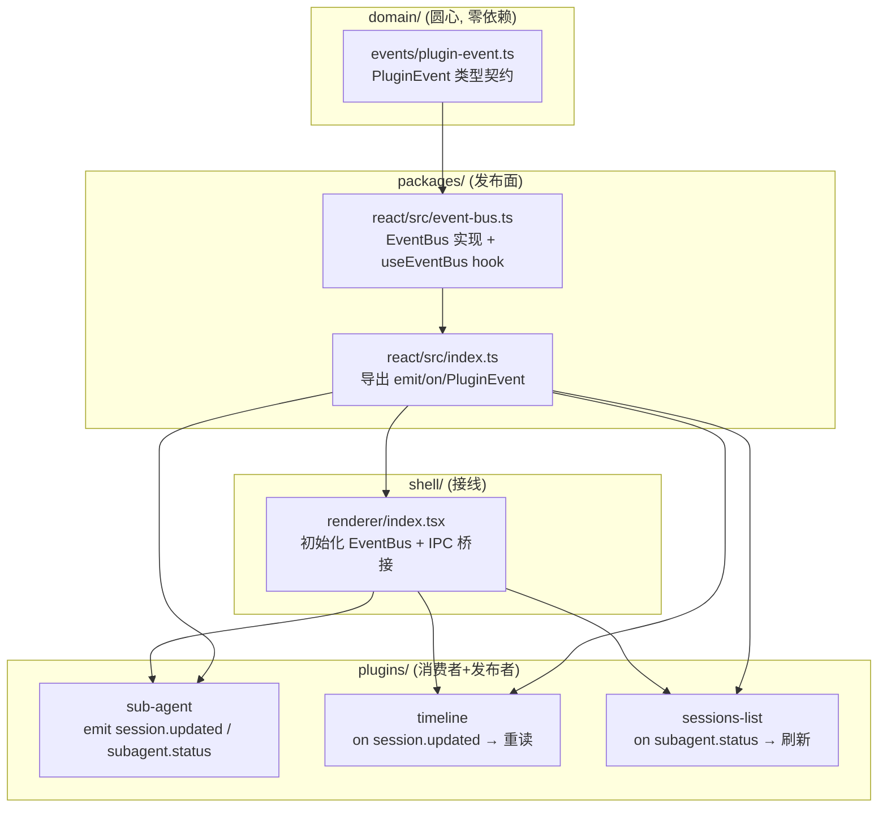

# 插件间事件流设计

子agent 设计文档（`docs/design/subagent-scheduling.md` §7）暴露了一个结构性缺口：插件之间没有协作机制。子agent spawn 了一条 entry 到 session 文件后，timeline 不知道"有新 entry 了，该重读"；子agent 状态从 running 变成 done 后，sessions-list 不知道"该刷新列表了"。当前框架只有两种让插件"配合"的方式——槽位并列和共享状态——都不解决"插件 A 产生状态变更后通知插件 B 更新渲染"这个需求。

本文设计一个插件间事件流机制：插件可以发布事件（不关心谁消费），插件可以订阅事件（不关心谁发布），发布者和消费者之间不直接耦合。这不是一个通用消息队列——事件本身是"什么变了"的通知，消费者收到后自己决定拉不拉数据。数据本身在 session 文件、zustand store、IPC 里已有，事件流解决的是"怎么让消费者知道数据变了、不用轮询"。

## 1. 问题：为什么现有机制不够

### 1.1 现有的三种"通知"机制和各自的局限

pi-desktop 当前有三条让"状态变更"传到消费者手里的路，但每条都只解决了一部分问题：

**zustand store 的订阅。** `useUiStore` 和 `useSessionStore` 是 renderer 侧的共享状态。组件调 `useUiStore((s) => s.pluginsNonce)` 订阅状态变更，store 的 setter 调 `set({...})` 时所有订阅者被通知。这是"数据共享"——状态存在 store 里，消费者读 store、store 变了消费者自动收到更新。但它是**同进程内的状态同步**，不是"跨插件的事件通知"。问题在于：store 只管"我自己持有的状态变了"，不管"session 文件变了"或"另一个插件做了某件事"。子agent 往 session 文件追加了一条 entry，store 不知道——store 里没有"session 文件内容变了"这个状态。而且 store 的订阅者是 React 组件（经 `useSyncExternalStore`），不是"插件"——一个插件的非渲染逻辑（如初始化、数据预处理）没法订阅 store 变更。

**IPC 事件（main → renderer 推送）。** main 进程通过 `webContents.send` 推事件到 renderer——已有 `session:event`、`session:kernelEvent`、`session:extensionUI`、`session:snapshot`、`settings:changed`、`skills:changed`、`plugins:changed` 等。这些是 main 进程产生的事件推给 renderer，方向单一（main → renderer），且每个事件类型是硬编码的 IPC channel——加一个新事件类型就要在 main 进程加 `ipcMain.handle`、在 preload 加方法、在 renderer 加监听。插件不能自定义事件类型——`window.pi` 上没有"发布事件"的 API。

**`settings:changed` 广播。** 这是当前最接近"事件流"的机制——skill-toggle 写了 `settings.json` 后，main 进程广播 `settings:changed`，所有订阅的设置页自动重读当前 configFile。但它是一个**硬编码的专用广播**，只解决"settings.json 被外部写入"这一个场景。不能扩展到"session 文件被追加 entry"或"子agent 状态变更"等其他场景。

### 1.2 子agent 场景暴露的具体缺口

子agent 运行期间，至少三个场景需要事件流：

**场景一：spawn entry 写入后通知 timeline。** sub-agent 插件往父 session 文件追加了一条 `type: "custom"` 的 spawn entry。timeline 当前不知道 session 文件变了——它只在用户切会话或手动刷新时重读。子agent spawn 后，timeline 不会自动出现 spawn 卡片，用户得手动刷新。需要一个事件："session 文件 `{path}` 被追加了 entry"。

**场景二：子agent 状态变更后通知 sessions-list。** 子agent 从 running 变成 done，sessions-list 需要更新会话列表的 mtime 和 lastMessage 预览（子agent 会话文件在持续追加）。当前 sessions-list 在用户切会话时重拉列表，不主动监听文件变更。需要一个事件："session `{path}` 状态变了"。

**场景三：子agent 完成后通知父会话的 timeline 更新 spawn 卡片状态。** spawn entry 从"● 运行中"变成"✅ 完成"。这条信息在 done entry 里（子agent 完成时追加），但 timeline 不知道它来了。需要一个事件："session 文件 `{path}` 被追加了 done entry"。

三个场景的共同点：**状态变更发生在 session 文件层面（磁盘），消费者在 renderer 层面（内存），中间缺一条"文件变了，通知大家"的通道。** 这条通道不能是"定时轮询"（§3.6 事件驱动不轮询），不能是"每个消费者自己监听文件"（多个插件重复监听同一个文件），必须是"一个发布者通知多个订阅者"。

## 2. 设计：事件总线

### 2.1 基本形状

一个进程内的事件总线，renderer 侧。插件通过 `@pi-desktop/react` 拿到发布和订阅的 API：

```typescript
// @pi-desktop/react 导出
function useEventBus(): EventBus;

interface EventBus {
  // 发布事件（不关心谁消费）
  emit(event: PluginEvent): void;
  // 订阅事件（不关心谁发布），返回取消函数
  on(pattern: EventPattern, handler: (event: PluginEvent) => void): () => void;
}

// 事件信封（domain 层定义，零依赖）
interface PluginEvent {
  /** 事件来源：发布事件的插件 id */
  source: string;
  /** 事件类型：如 "session.updated"、"subagent.spawned"、"subagent.done" */
  type: string;
  /** 事件载荷：具体内容由 type 决定 */
  payload: Record<string, unknown>;
  /** 时间戳 */
  timestamp: number;
}

// 订阅模式：精确匹配 type，或前缀匹配
type EventPattern = string;  // "session.updated" 精确匹配，"session.*" 前缀匹配
```

发布者是插件（或框架本身），消费者也是插件（或框架本身）。发布者调 `emit` 发事件，事件总线遍历所有匹配的订阅者调 handler。消费者调 `on` 注册 handler 和匹配模式，拿到取消函数。

事件总线是一个轻量的同步分发器——不是消息队列，不保证顺序，不持久化，不做重试。发出去就分发，没有消费者就丢弃（fire-and-forget）。这和 Node.js 的 `EventEmitter` 是同一套模式，不引入新概念。

### 2.2 为什么不用 zustand store 替代

zustand store 已经是 renderer 侧的共享状态——为什么不把"session 文件变了"也放进 store，让消费者订阅 store？

两个原因：

**store 的粒度是"状态值"，不是"事件"。** store 存的是当前状态快照——`currentSessionPath` 是什么、`pluginsNonce` 是几。消费者订阅的是"这个值变了"。但"session 文件被追加了 entry"不是一个状态值——它是一个瞬时事件，消费者关心的是"发生了追加这件事"，不是"文件内容当前是什么"。如果把"文件内容"放进 store，就要在 store 里存整个 session 文件的解析结果——这是 timeline 的职责，不是 store 的职责。store 管导航态和 UI 态，不管业务数据。

**store 的订阅者是 React 组件，事件总线的订阅者可以是任意逻辑。** `useUiStore((s) => s.x)` 是 React hook，只能在组件 render 体内调。但有些消费者不是组件——比如一个插件在初始化时要监听"是否有新的子agent 事件"来决定加载哪些数据。这种非渲染逻辑用 store 的 hook 不方便，用事件总线的 `on` 可以在任何地方调。

store 和事件总线不互斥——store 管"当前状态是什么"，事件总线管"发生了什么事件"。子agent spawn 后，事件总线发 `session.updated` 事件；timeline 收到后重读 session 文件、更新自己的内部 state（不进 store）；如果 session 切换了（状态变更），store 的 `currentSessionPath` 才变。

### 2.3 插件生命周期事件

插件不是静态的——它会被加载、卸载、启用、禁用、重载。这些生命周期变更本身就是事件，其他插件需要知道并响应。比如 sub-agent 插件被卸载了，timeline 需要知道"spawn 卡片的渲染器没了，该回退到默认渲染"；sessions-list 需要知道"子agent 状态来源没了，停止等子agent 事件"。插件被重新启用时，消费者需要恢复之前暂停的逻辑。

生命周期事件是框架自己发的（不是插件发的），因为框架管加载和卸载：

```typescript
/** 插件被加载（renderer chunk 执行完毕，组件已注册） */
export interface PluginLoadedEvent extends PluginEvent {
  type: "plugin.loaded";
  payload: {
    pluginId: string;
    /** 该插件注册了哪些组件（settings/sidePanel/sidebar/mainView） */
    components: string[];
  };
}

/** 插件被卸载（组件已注销，即将销毁 renderer chunk） */
export interface PluginUnloadedEvent extends PluginEvent {
  type: "plugin.unloaded";
  payload: {
    pluginId: string;
    /** 该插件注销了哪些组件 */
    components: string[];
  };
}

/** 插件被禁用（仍在注册表但不可用） */
export interface PluginDisabledEvent extends PluginEvent {
  type: "plugin.disabled";
  payload: { pluginId: string };
}

/** 插件被重新启用（从 disabled 恢复） */
export interface PluginEnabledEvent extends PluginEvent {
  type: "plugin.enabled";
  payload: { pluginId: string };
}
```

这些事件由 `plugins-host.ts` 在加载/卸载流程中调 `eventBus.emit()` 发布。当前已有的 `plugins:changed` IPC（nonce +1 触发壳重渲染）是粗粒度的——"插件列表变了，大家重来一遍"。生命周期事件是细粒度的——"具体哪个插件加载了/卸载了，它注册了什么"。

两种粒度并存：消费者可以订阅粗粒度的 `plugins.changed`（简单粗暴——重读全部），也可以订阅细粒度的 `plugin.loaded` / `plugin.unloaded`（精准——只更新和那个插件相关的部分）。timeline 订阅 `plugin.unloaded`——如果被卸载的插件注册过 entry renderer，timeline 回退到默认渲染。sessions-list 订阅 `plugin.loaded`——新插件可能贡献了 session filter，该重新过滤列表。

### 2.4 增量事件与整体刷新

有些场景消费者需要的是"整体刷新"而不是"处理单条增量事件"。比如：

- 插件刚加载完成——它错过了之前所有事件，需要"重刷一遍当前状态"而不是"等下一条事件"
- 插件被重新加载——它的状态全丢了，需要"重新初始化"
- 用户手动点了刷新——框架的 refreshSignal +1，消费者要"重读全部"

事件总线对此提供两种事件类型：

**增量事件**（如 `session.updated`、`subagent.status`）——"发生了什么"。消费者收到后做增量更新（追加一条 entry、更新一个状态）。

**刷新事件**（`app.refresh`）——"该全部重读了"。消费者收到后丢弃所有缓存状态、重新拉全部数据。这不是某一条具体变更的通知，是"你不知道发生了什么变化，重来一遍"的信号。

```typescript
/** 框架级刷新信号（用户点刷新 / 插件重载 / settings:changed 等） */
export interface AppRefreshEvent extends PluginEvent {
  type: "app.refresh";
  payload: {
    /** 刷新原因："user" | "settings_changed" | "plugin_loaded" | "plugin_reloaded" */
    reason: string;
  };
}
```

消费者不需要同时处理增量和刷新——可以只订阅 `app.refresh` 做全量重读（简单但慢），也可以同时订阅增量事件做增量更新（快但复杂）。增量是优化，全量是兜底。如果消费者只实现了 `app.refresh`，功能是对的，只是不够快——这是可接受的退化。

### 2.5 事件类型契约（圆心定义）

事件类型定义在 `domain/events/plugin-event.ts`——圆心，零依赖。不是枚举（枚举是声明式类型标签，加了新类型要改枚举），是 `type` 字段 + 语义字段的组合。发布者按约定拼 `type` 和 `payload`，消费者按 `type` 或 `type` 前缀订阅。

第一批定义的事件类型（随子agent 落地），后续插件可以定义自己的：

```typescript
// domain/events/plugin-event.ts

/** 事件信封：所有插件间事件的基本形状 */
export interface PluginEvent {
  source: string;
  type: string;
  payload: Record<string, unknown>;
  timestamp: number;
}

/** session 文件被修改（追加 entry / 改 header） */
export interface SessionUpdatedEvent extends PluginEvent {
  type: "session.updated";
  payload: {
    sessionPath: string;
    /** "entry_appended" | "header_updated" */
    change: string;
    /** 追加的 entry 的 type（如 "custom"），header 更新时为 null */
    entryType?: string | null;
  };
}

/** 子agent 被创建 */
export interface SubagentSpawnedEvent extends PluginEvent {
  type: "subagent.spawned";
  payload: {
    subagentId: string;
    parentSessionPath: string;
    subagentSessionPath: string;
    task: string;
  };
}

/** 子agent 状态变更 */
export interface SubagentStatusEvent extends PluginEvent {
  type: "subagent.status";
  payload: {
    subagentId: string;
    /** "running" | "done" | "error" | "aborted" */
    status: string;
    result?: string;
  };
}

/** 插件加载（renderer chunk 执行完毕，组件已注册） */
export interface PluginLoadedEvent extends PluginEvent {
  type: "plugin.loaded";
  payload: { pluginId: string; components: string[] };
}

/** 插件卸载（组件已注销） */
export interface PluginUnloadedEvent extends PluginEvent {
  type: "plugin.unloaded";
  payload: { pluginId: string; components: string[] };
}

/** 插件禁用 */
export interface PluginDisabledEvent extends PluginEvent {
  type: "plugin.disabled";
  payload: { pluginId: string };
}

/** 插件被重新启用（从 disabled 恢复） */
export interface PluginEnabledEvent extends PluginEvent {
  type: "plugin.enabled";
  payload: { pluginId: string };
}

/** 框架级刷新信号 */
export interface AppRefreshEvent extends PluginEvent {
  type: "app.refresh";
  payload: {
    /** 刷新原因："user" | "settings_changed" | "plugin_loaded" | "plugin_reloaded" */
    reason: string;
  };
}
```

`type` 用点号分隔的命名空间（`session.updated`、`subagent.spawned`），消费者可以用 `session.*` 订阅所有 session 相关事件。`payload` 的具体内容由 `type` 决定——这是语义字段驱动，不是 `kind` 枚举 switch。新事件类型不需要改圆心定义（已有的 `PluginEvent` 接口足够通用），新类型只是新的 `type` 字符串 + 对应的 payload 约定。

### 2.6 事件来源：谁在发

事件总线的发布者分两类：

**框架自身。** main 进程产生的事件经 IPC 推到 renderer 后，框架内部转发到事件总线。当前已有的 `session:event`（pi 底座事件）、`settings:changed`（settings.json 被外部写入）、`plugins:changed`（插件列表变动，粗粒度 nonce）都可以转发为事件总线上的 `PluginEvent`。这样消费者只需要订阅事件总线，不需要同时监听多个 IPC channel——事件总线是统一的事件入口。

**插件。** 插件在 renderer 侧可以直接调 `eventBus.emit()` 发布事件。sub-agent 插件往 session 文件追加 entry 后，调 `emit({ source: "sub-agent", type: "session.updated", payload: { sessionPath, change: "entry_appended", entryType: "custom" } })`。其他插件不需要知道是 sub-agent 发的——它们只关心 `type: "session.updated"`。

main 进程侧的事件（如 pi 进程退出、子agent 进程状态变更）需要经 IPC 桥到 renderer 的事件总线。框架在 main→renderer 的 IPC 事件转发处加一步：收到 `session:event` 等 IPC 时，同时 `emit` 到事件总线。插件不需要自己处理 main→renderer 的 IPC 桥接。

### 2.7 订阅模式

消费者用 `type` 字符串或前缀模式订阅：

- `"session.updated"`——精确匹配，只收 session.updated 事件
- `"subagent.*"`——前缀匹配，收 subagent.spawned 和 subagent.status
- `"plugin.*"`——前缀匹配，收 plugin.loaded、plugin.unloaded、plugin.disabled、plugin.enabled
- `"plugins.changed"`——粗粒度插件列表变更（注意是复数 `plugins`，和单数 `plugin.*` 不同命名空间，前缀匹配不互通）
- `"app.refresh"`——框架级刷新信号
- `"*"`——收所有事件（调试用，不建议生产用）

事件总线内部维护 `Map<EventPattern, Set<handler>>`。`emit` 时遍历所有 pattern，匹配的调 handler。同步分发——handler 在 `emit` 调用栈里执行，不排异步队列。如果 handler 抛异常，事件总线 catch 住、打 console.error、继续分发下一个 handler（一个 handler 挂了不影响其他 handler）。

### 2.8 插件的事件处理能力组合（多继承 mixin）

你提到的"基类多继承"——不同的插件需要同时处理多种事件：sub-agent 既要发 `session.updated`（spawn entry 写入了）、又要发 `subagent.status`（子agent 状态变了）、又要监听 `plugin.unloaded`（自己被卸载了要清理）、又要监听 `app.refresh`（收到刷新信号要重置）。timeline 既要监听 `session.updated`（重读 entry）、又要监听 `plugin.unloaded`（回退渲染器）、又要监听 `plugin.loaded`（注册新渲染器）。

这些"事件处理能力"不应该全写在一个大函数里。每种事件类型是一个独立的能力——插件按需组合，不是继承一个大基类。

设计方式：**mixin 函数组合**，不是 class 继承。每个事件处理能力是一个独立的函数，接收 `EventBus` 和插件自己的 context，返回一个清理函数：

```typescript
// @pi-desktop/react 导出的 mixin 模式

/** "监听 session.updated 并重读 entry" 的能力 */
function withSessionUpdate(
  bus: EventBus,
  ctx: { currentSessionPath: () => string; onUpdated: () => void },
): () => void {
  return bus.on("session.updated", (event) => {
    const { sessionPath, change } = event.payload;
    if (sessionPath === ctx.currentSessionPath() && change === "entry_appended") {
      ctx.onUpdated();
    }
  });
}

/** "监听 plugin.unloaded 并清理渲染器" 的能力 */
function withPluginLifecycle(
  bus: EventBus,
  ctx: { onUnloaded: (id: string, components: string[]) => void },
): () => void {
  const off1 = bus.on("plugin.unloaded", (event) => {
    const { pluginId, components } = event.payload;
    ctx.onUnloaded(pluginId as string, components as string[]);
  });
  return off1;
}

/** "监听 app.refresh 并全量重读" 的能力 */
function withRefresh(
  bus: EventBus,
  ctx: { onRefresh: (reason: string) => void },
): () => void {
  return bus.on("app.refresh", (event) => {
    ctx.onRefresh(event.payload.reason as string);
  });
}
```

插件在初始化时按需组合这些能力：

```typescript
// sub-agent 插件的 renderer 初始化
const bus = useEventBus();
const cleanups: (() => void)[] = [];

// 组合三种事件处理能力
cleanups.push(withSessionUpdate(bus, {
  currentSessionPath: () => currentParentSession,
  onUpdated: () => void updateSpawnCardStatus(),
}));
cleanups.push(withPluginLifecycle(bus, {
  onUnloaded: (id, components) => { /* 清理与被卸载插件相关的渲染器 */ },
}));
cleanups.push(withRefresh(bus, {
  onRefresh: () => void fullReload(),
}));

// 插件卸载时统一清理
window.pi.plugins.onUnloaded(() => {
  cleanups.forEach(cleanup => cleanup());
});
```

这是组合不是继承——每个 `withXxx` 是一个独立的 mixin 函数，插件按需调用、收集清理函数。比 class 多继承干净：

- **没有继承链**——mixin 函数之间没有父子关系，谁先谁后无所谓
- **按需组合**——插件只调自己需要的那几个 `withXxx`，不继承一堆不需要的方法
- **类型安全**——每个 mixin 的 ctx 参数有精确的类型，不像基类继承那样父类改了所有子类受影响
- **生命周期明确**——每个 mixin 返回清理函数，卸载时统一调，不会漏

框架预置一批常用的 mixin（`withSessionUpdate`、`withPluginLifecycle`、`withRefresh`、`withSubagentStatus` 等），插件也可以写自己的 mixin——只要是"接收 EventBus + 返回清理函数"的形状就行。这不是新概念——React 的自定义 hook 是同一套组合模式。

### 2.9 与现有的 IPC 事件整合

当前已有的 IPC 事件不废弃、不重写。整合方式是**桥接**——在已有的 IPC 监听处加一步 `emit` 到事件总线：

| 现有 IPC channel | 转发为事件总线的 type | 说明 |
|---|---|---|
| `session:event` | `pi.session` | pi 底座事件（message_start、tool_call_start 等） |
| `session:snapshot` | `pi.snapshot` | 会话快照更新 |
| `session:kernelEvent` | `pi.kernel` | 内核事件（进程退出、extension UI 请求等） |
| `settings:changed` | `settings.changed` + `app.refresh` | settings.json 被外部写入，触发刷新 |
| `skills:changed` | `skills.changed` | skills 文件变更 |
| `plugins:changed` | `plugins.changed` | 插件列表变更（粗粒度 nonce） |
| `session:extensionUI` | `pi.extensionUI` | 底座 Extension UI 请求（需 renderer 回复） |

注意：`plugin.loaded`、`plugin.unloaded`、`plugin.disabled`、`plugin.enabled` 这四个细粒度生命周期事件**不走 IPC**——它们由 `plugins-host.ts` 在 renderer 侧直接 `eventBus.emit()`，因为插件的加载/卸载/启用/禁用流程本身就在 renderer 里发生。`plugins:changed` IPC（粗粒度 nonce +1）仍然走 IPC 桥接，作为"插件列表变了，壳该重渲染了"的信号。两种粒度并存：细粒度事件让消费者精准响应具体插件变更，粗粒度 nonce 让壳统一重渲染。

桥接代码在 `@pi-desktop/react` 的事件总线初始化处——监听已有的 `window.pi.*` IPC 事件，转发到事件总线。插件不需要改现有的 IPC 监听代码——它们可以继续直接用 `window.pi.sessions.onEvent()`，也可以改用事件总线的 `on("pi.session.*", handler)` 统一订阅。

## 3. 具体场景：子agent 怎么用事件流

### 3.1 spawn entry 写入后通知 timeline

sub-agent 插件往父 session 文件追加 spawn entry 后，调事件总线发布：

```typescript
eventBus.emit({
  source: "sub-agent",
  type: "session.updated",
  payload: {
    sessionPath: parentSessionPath,
    change: "entry_appended",
    entryType: "custom",
  },
  timestamp: Date.now(),
});
```

timeline 在初始化时订阅 `session.updated`：

```typescript
eventBus.on("session.updated", (event) => {
  const { sessionPath, change, entryType } = event.payload;
  if (sessionPath === currentSessionPath && change === "entry_appended") {
    // 重读 session 文件，追加新 entry 到渲染列表
    void reloadEntries();
  }
});
```

timeline 不需要知道是 sub-agent 发的事件——它只关心"我正在显示的 session 文件被追加了 entry"。如果是别的插件往同一个 session 文件追加了别的类型的 entry，timeline 也会收到通知、重读、渲染。这是解耦的——sub-agent 不知道 timeline 在听，timeline 不知道 sub-agent 在发。

### 3.2 子agent 状态变更后通知 sessions-list

子agent 从 running 变成 done 时，sub-agent 插件发事件：

```typescript
eventBus.emit({
  source: "sub-agent",
  type: "subagent.status",
  payload: {
    subagentId: "sub-1",
    status: "done",
    result: "拆成 auth-login.ts, auth-token.ts, auth-session.ts",
  },
  timestamp: Date.now(),
});
```

sessions-list 订阅 `subagent.status`：

```typescript
eventBus.on("subagent.status", (event) => {
  const { subagentId, status } = event.payload;
  // 子agent 状态变了，更新会话列表的排序和预览
  void reload();
});
```

sessions-list 也可以同时订阅 `session.updated`——子agent 的 session 文件被追加 entry 时也刷新。两条事件都触发 reload，但 reload 是幂等的（重拉列表、覆盖 state），不会出问题。

### 3.3 main 进程事件的桥接

main 进程感知到子agent pi 进程退出（`onProcessExit`），当前通过 `session:kernelEvent` IPC 推到 renderer。框架的 IPC 桥接代码把它转发到事件总线：

```typescript
// @pi-desktop/react 的事件总线初始化
window.pi.sessions.onKernelEvent((event) => {
  eventBus.emit({
    source: "pi-desktop",
    type: "pi.kernel",
    payload: event as unknown as Record<string, unknown>,
    timestamp: Date.now(),
  });
});
```

sub-agent 插件订阅 `pi.kernel`，按 `event.kind` 判断是不是子agent 进程退出，如果是就更新 spawn 卡片状态。

### 3.4 事件流不携带完整数据

注意上面的三个场景，事件 payload 只携带"什么变了"的元信息（sessionPath、change、entryType、subagentId、status），不携带完整数据（entry 的全部字段、session 文件的全部内容）。消费者收到事件后自己重拉数据。

这是有意的设计——事件流是"通知"不是"数据传输"。如果事件携带完整数据，发布者需要知道消费者需要哪些字段（耦合）；如果数据很大（一整个 session 文件的内容），事件载荷会膨胀。通知模式让发布者只说"变了"，消费者自己决定拉什么、拉多少。

## 4. 架构归属



依赖方向只向内：`domain/events/plugin-event.ts` 零依赖，只有类型定义。`packages/react` 依赖 domain 的类型，实现 EventBus 类。`shell/renderer` 初始化 EventBus 实例 + IPC 桥接。插件只 import `@pi-desktop/react` 的 `useEventBus` 和 `@pi-desktop/core` 的 `PluginEvent` 类型。

### 4.1 domain 层：事件类型契约

`domain/events/plugin-event.ts`——圆心，零依赖。只定义 `PluginEvent` 接口和第一批事件的 payload 形状。新事件类型不需要改这里——`PluginEvent` 的 `type` 是 `string` 不是枚举，`payload` 是 `Record<string, unknown>`。第一批定义的类型（`SessionUpdatedEvent` 等）是给消费者类型提示用的，不是运行时校验。

### 4.2 packages/react：EventBus 实现

`packages/react/src/event-bus.ts`——EventBus 类的实现。一个 `Map<EventPattern, Set<handler>>`，`emit` 遍历匹配的 handler 同步分发，`on` 注册 handler 返回取消函数。`useEventBus` hook 返回单例 EventBus 实例（renderer 侧全局唯一）。

IPC 桥接代码也在这里——`packages/react/src/event-bus.ts` 的初始化函数里监听已有的 `window.pi.*` IPC 事件，转发到 EventBus。这样插件不需要自己处理 IPC→EventBus 的桥接，框架统一做。

### 4.3 shell 层：初始化

`shell/renderer/index.tsx`——在 renderer 入口初始化 EventBus 实例，调 `initEventBus()`。这一步在插件加载之前，确保插件加载时 EventBus 已经就绪、IPC 桥接已建立。

### 4.4 插件：发布者和消费者

插件通过 `useEventBus()` 拿到 EventBus 实例，调 `emit` 发布事件、调 `on` 订阅事件。不需要 import 别的插件的代码——发布者不 import 消费者，消费者不 import 发布者。事件总线是唯一的中间人。

## 5. 与子agent 设计文档的关系

子agent 设计文档 §7.2 的缺口一（inter-plugin 扩展机制缺失）分两个层面：

- **渲染层**：host 插件暴露 hook，让 extension 插件注入渲染逻辑（`registerEntryRenderer`、`registerSessionFilter`）。这是"插件 A 改插件 B 怎么画"。
- **通知层**：插件 A 产生状态变更后通知插件 B 更新。这是"插件 A 告诉插件 B 该刷新了"。

本文解决的是通知层。渲染层（host hook）仍然需要单独补——事件流不替代 `registerEntryRenderer`，它只解决"什么时候该重读数据"的问题，不解决"重读后怎么渲染"的问题。

两者的协作方式：sub-agent 插件发 `session.updated` 事件 → timeline 收到事件、重读 session 文件、遇到 `type: "custom"` 的 entry → 用 `registerEntryRenderer` 注册的渲染器渲染 spawn 卡片。事件流是"触发"，host hook 是"渲染"，两层各管各的。

## QA

**Q1：事件总线是进程内的还是跨进程的？**

进程内的（renderer 进程）。事件在 renderer 的 JavaScript 运行时里同步分发，不跨进程。main 进程的事件经 IPC 桥接到 renderer 的事件总线——IPC 是跨进程的，EventBus 是进程内的。不设计跨进程事件总线——那会引入序列化、延迟、可靠性问题，当前没有这个需求。

**Q2：事件会丢失吗？**

会。如果 `emit` 时没有消费者订阅（或者消费者的 pattern 不匹配），事件被丢弃。事件总线不持久化、不排队、不重试。这是 fire-and-forget 语义——和 Node.js `EventEmitter` 一样。如果消费者需要可靠投递（如"子agent done 事件必须被 timeline 收到"），消费者应该在初始化时就订阅，确保不漏。或者发布者在发事件后也更新持久化状态（session 文件），消费者在下次读取时能看到结果——事件是"加速通知"，不是"唯一真相源"。

**Q3：多个 handler 的执行顺序有保证吗？**

不保证。`emit` 遍历 `Map<EventPattern, Set<handler>>`——`Map` 的迭代顺序是插入顺序，`Set` 的迭代顺序也是插入顺序，所以同一 pattern 下先注册的 handler 先执行。但不同 pattern 之间的顺序取决于 `Map` 的迭代顺序，不保证跨 pattern 的顺序。如果消费者依赖顺序（如"先 timeline 重读再 sessions-list 刷新"），消费者应该自己协调——事件总线不做编排。

**Q4：handler 里能调 `emit` 吗（事件链）？**

能，但要小心。`emit` 是同步的——如果 handler A 里 `emit` 了事件 B，事件 B 的 handler 在 handler A 返回前同步执行。如果形成环（A emit B、B emit A），会无限递归栈溢出。事件总线不做环检测——这是发布者的责任。建议：handler 里 `emit` 新事件时用 `setTimeout(0)` 异步发，打断同步链。

**Q5：事件总线和 `window.pi.sessions.onEvent()` 什么关系？**

`onEvent` 是 pi 底座事件的 IPC 监听——main 进程把 pi 的 stdout 事件经 IPC 推到 renderer。事件总线的 IPC 桥接会把这些 IPC 事件转发为 `pi.session` 类型的 PluginEvent。插件可以继续直接用 `onEvent`（向后兼容），也可以改用事件总线统一订阅。长期建议迁移到事件总线——统一入口、统一模式，不用每个插件自己监听一堆 IPC channel。

**Q6：插件卸载时要清理订阅吗？**

要。插件 `on` 时拿到的取消函数，在插件卸载时必须调——否则 handler 泄漏，EventBus 还持有着已卸载插件的 handler 引用。`plugins-host.ts` 在 `onUnloaded` 回调里应该调插件的清理函数（和现在 `unregisterSettingsComponent` 等一样的模式）。如果插件用 React hook 订阅（`useEffect(() => eventBus.on(...), [])`），React 的 cleanup 会自动调取消函数。

**Q7：事件 payload 的 `entryType` 字段是不是又变成了 type 标签 switch？**

不是。`entryType` 是语义字段——消费者读它判断"这条事件和我有关吗"，不是引擎拿它做 if-else 分支。timeline 收到 `session.updated` 事件后，不管 `entryType` 是什么都重读 session 文件——重读后按 entry 自己的 `type` 字段选渲染器。`entryType` 只是让消费者可以提前判断"值不值得重读"（如 `entryType: "custom"` 才触发重读，其他类型忽略），这是优化不是必须。消费者也可以不读 `entryType`、每次都重读——正确性不受影响。

**Q8：main 进程也需要事件总线吗？**

当前不需要。main 进程的"事件"（pi 进程退出、子agent 状态变更等）都通过 IPC 推到 renderer——renderer 的事件总线是唯一消费者。main 进程内部用 Node.js 的 `EventEmitter` 或直接调函数就行，不需要一个独立的事件总线实例。如果以后 main 进程也需要跨模块事件通知（如 session-store 通知 SubAgentStore），用 Node.js `EventEmitter` 足够，不需要引入"插件间事件总线"的语义。

**Q9：插件刚加载完成时错过了之前的事件怎么办？**

新加载的插件订阅事件时，之前已经发过的事件不会重放——事件总线不持久化历史。新插件用两种方式补初始状态：

- 订阅 `app.refresh`——框架在插件加载完成后发一次 `app.refresh`（reason: "plugin_loaded"），新插件收到后做全量重读，拿到当前最新状态。
- 直接拉数据——插件初始化时主动调 `sessions.list`、`sessions.openSession` 等 API 拉当前状态，然后用事件总线订阅后续增量变更。

两种方式可以组合：先拉初始数据渲染，再订阅增量事件保持新鲜。这和 React 的"首屏 SSR + 后续 hydration"是同一套思路。

**Q10：插件卸载时事件清理谁来负责？**

两道保险：

- 框架的 `plugins-host.ts` 在 `onUnloaded` 回调中发 `plugin.unloaded` 事件，同时遍历该插件注册的所有清理函数调一遍——如果插件用 mixin 模式（`withSessionUpdate` 等），框架自动收集了清理函数。
- 如果插件用 React hook 订阅（`useEffect(() => eventBus.on(...), [])`），React 组件卸载时 cleanup 自动执行。

但框架不保证插件一定能清理干净——如果插件直接调 `eventBus.on()` 但没收集返回的取消函数，卸载后 handler 泄漏。这是插件的 bug，不是框架的缺陷。框架可以在 dev 模式下检测泄漏（插件卸载后检查 EventBus 里还有没有以该插件 id 为 source 的 handler），生产模式不检测。

**Q11：`app.refresh` 会不会导致所有插件同时重读，性能爆炸？**

会有一波集中 I/O——所有订阅 `app.refresh` 的插件同时重读自己的数据源。但每个插件重读的是不同的数据（timeline 读 session 文件、sessions-list 读 session 列表、token-stats 读 stats），不争抢同一个资源。而且重读是异步的（`void reload()`），不阻塞主线程。实际影响是短暂的——一次 `app.refresh` 触发 N 个插件各自 async 拉数据，几百毫秒内完成。如果以后有性能问题，可以加 debounce（多次 `app.refresh` 合并为一次），但当前不需要预设计。

**Q12：mixin 模式和 React hook 有什么区别？为什么不用 hook 替代？**

React hook 只能在组件 render 体内调——`useEffect(() => bus.on(...), [])` 需要一个挂载点（组件）。但有些事件处理逻辑不属于任何组件——比如 sub-agent 插件在 renderer chunk 加载时（`registerSidePanelComponent` 调用前后）就需要订阅事件，此时还没有组件 render。mixin 函数在任何地方都能调——`withSessionUpdate(bus, ctx)` 在模块顶层调也行，返回的清理函数存进数组等卸载时统一调。

React hook 仍然可以用——组件内的事件订阅用 `useEffect + bus.on` 是最自然的。mixin 是给"非组件逻辑"用的。两者不互斥，是不同场景的不同工具。
