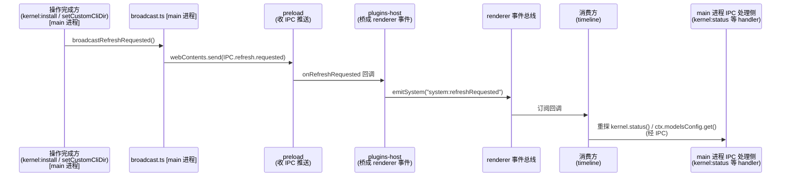

# 统一刷新信号：会话流外部状态刷新机制

## 1. 背景与根因

### 1.1 症状

在「设置 → Pi」页装完 pi 底座（安装/升级/降级都算），回到对话页（会话流，timeline 插件贡献的中区主视图），输入框还是那条「未安装 pi 底座，请先在「设置 → Pi」页安装」的只读条。只读条是**整个替换输入框**的——没有输入框就没有发送入口，这一态下会话流只能看不能发。重启应用（或让会话流组件重挂载）才恢复。改自定义底座路径（`kernel:setCustomCliDir`）也有同样的观感：自定义底座从无到有效会翻转 `kernelAvailable`（只读条同样不恢复）。

只读条本身不是问题——那是"未安装"提醒的既有形态（`plugins/sessions/timeline/renderer/index.tsx` 的 `kernelAvailable === false` 分支）。问题是：**装完底座，这条提醒不消失**。

### 1.2 根因链

这里说的"底座"就是 kernel——桌面端经 `api/ipc/kernel.ts` 管理的 pi 底座安装（装/升/降级、自定义路径）。会话流插件（timeline）对底座状态的探测只在**挂载时发生一次**：`refreshKernelStatus()` 调 `kernel.status()`，结果存 `kernelAvailable` state，之后不再主动重读。

main 侧的 `kernel:install`（`api/ipc/kernel.ts`）完成时，只给发起窗口发 `kernel:install-done`——那是给 pi-manager（设置 → Pi 页那个插件）刷新它自己页面的（装完立即显示新版本号）。这个通道保留不变；刷新信号是新增的全局通知，两个信号各管各的：install-done 服务发起窗口的安装 UI，刷新信号服务所有窗口的展示态。**没有任何"底座状态变了"的广播**，所以其他消费方——timeline——的 `kernelAvailable` 停在挂载时的旧值：装之前是 `false`，装完还是 `false`，只读条一直顶着，发送也一直不可达。

一句话根因：**"装完底座"这件事没有变成任何通知，而会话流对底座状态的探测只在挂载时发生一次。**

### 1.3 为什么不逐资源打补丁

最省事的修法是让 timeline 订阅一个 `system:kernelChanged` 专用事件，装完底座后重探。它管用，但解决的是"kernel 状态变化"这一种资源。将来 tool-gate（工具过滤网关，底座扩展）装好、底座设置变化、任何影响会话流展示的外部状态变了，都得再给 timeline 挂一条订阅——订阅列表随资源数膨胀，每加一个触发就动一次消费方。这就是补丁感。

这些场景的共性不是"kernel 变了"，而是**"某个操作完成了，消费方挂载时探测的外部状态可能变了"**。抓住这个共性，才能一次解决一类问题，而不是一个资源打一个补丁。

## 2. 既有先例：发事件接收事件

系统里已经有"操作完成 → 发事件 → 消费方刷新"的成熟模式。这次方案是它的同族扩展，不是另起炉灶。

### 2.1 configFileSaved：模型提交通知

设置页保存模型配置（settings-page 保存管线，所有声明 configFile 的设置页共用）后广播 `system:configFileSaved`，payload 是 `{ path }`。timeline 订阅后按 `path === MODELS_CONFIG_PATH` 匹配，重读模型清单——模型下拉框即时更新，不用重启。ui-store 按 `GENERAL_CONFIG_PATH` 匹配重读 general.json。两个路径常量契约单源在 packages/contract。这是"保存方发、消费方按需收"的先例：事件是通用的，消费方用 payload 做精确匹配。

### 2.2 settingsChanged：settings.json 外部写

`~/.pi/agent/settings.json` 被外部模块写（如 skill-toggle 改 skills 字段）后，main 广播 `settings:changed`，plugins-host 桥成 `system:settingsChanged`，设置页刷新当前 configFile。这条链已经展示了 main → renderer 事件总线的完整路径。

### 2.3 与进程 mtime 机制的边界

`sessions/session-store.ts` 有一套独立的配置依赖失效机制（docs/design/models-config-reload.md）：spawn 时记录 models.json/settings.json 的 mtime，复用进程前校验，过期即重建进程。它管的是**进程生命周期**——配置变了，底座进程要换一个新的才读到新配置；懒校验（下次发起会话时生效），当时明确不做"保存事件驱动杀进程"。

本机制管的是**呈现层状态**——操作完成立即刷 UI。两条线互补不冲突：装完 pi，刷新信号让只读条立刻消失；进程层本来每次 spawn 都是新底座（`client/pi/subprocess-lifecycle.ts` 的 `resolvePiCli` 实时检查 `<数据根>/pi/node_modules/@earendil-works/pi-coding-agent/dist/cli.js`，数据根是 `~/.my-harness-desktop`，dev 态为 `~/.my-harness-desktop-dev`），不需要额外通知。会话流上的"改配置立即生效"由这两条线各管一半：进程能不能用，归 mtime 机制；界面显示对不对，归刷新信号。

## 3. 方案：统一刷新信号 + 统一刷新入口

### 3.1 事件链

操作完成方只调一个广播函数，不知道也不关心谁在乎；消费方只订阅一个系统事件，不知道是谁发起的——准确说是**只新增订阅一个**（`system:refreshRequested`；既有的 `system:configFileSaved` 订阅原样保留，见 3.2）。**这个信号不带 payload**——它的语义是"外部状态可能变了，去刷新"，不是"kernel 状态变成了 X"。

### 3.2 消费方统一入口 refreshExternals

timeline 把"挂载时探测的一切"收敛进一个函数 `refreshExternals()`：底座可用性（`kernel.status()` → `kernelAvailable`）和模型清单（`ctx.modelsConfig.get()` → 模型下拉框，插件上下文里读 models.json 的通道）。三个触发点调它：挂载时一次、收到 `system:refreshRequested`、收到 `system:configFileSaved` 且 path 匹配 `MODELS_CONFIG_PATH`。

`refreshKernelStatus` 不是被删了，是作为子函数保留在 `refreshExternals` 内部——负责探测底座可用性并写回 `kernelAvailable` state（发送门[1]看的就是这个 state，见 5.2）。

[1] 发送门：发送前对底座可用性的拦截判断——`kernelAvailable === false` 时输入框被只读条替换，发送不可达。

models 的 configFileSaved 订阅是**并入**而不是新增——触发条件保留（path 精确匹配），重探动作统一走一个入口，不再有独立的 `load()`（原 models 重读那个 useEffect 内定义的函数，行为并入 `refreshExternals` 后删除）。这样新资源挂载探测加进 `refreshExternals` 即可，消费方不逐资源加订阅。

注意这里的"消费方"指 timeline 一家。ui-store 也订阅 configFileSaved（按 `GENERAL_CONFIG_PATH` 匹配重读 general.json），但那是它自己的精确匹配订阅，不在本方案的收敛范围内——刷新信号方案只统一会话流，不强制别的消费方搬家。

### 3.3 跨进程桥接为什么存在

renderer 事件总线（packages/react/event-bus.ts）是 renderer 侧的，不跨进程。main 侧操作完成要通知 renderer，必须走 `webContents.send` → preload 暴露的 `onRefreshRequested` → plugins-host 桥 → renderer 事件总线。这与 `settings:changed`（→ `system:settingsChanged`）、themes `systemChanged` 同一模式——是 Electron 进程边界的事实约束，不是补丁。`onRefreshRequested` 放 preload 顶层（与 `onSettingsChanged` 同级）而不是 kernel 组，因为它不是 kernel 的私有推送，是系统级信号。

### 3.4 命名与契约

信号名 `system:refreshRequested` 是祈使句（请求刷新），`system:requestNavigateToChat` 有先例。通道名契约单源在 `IPC.refresh.requested`（api/preload/ipc-channels.ts），broadcast 与 preload 共用，没有字符串字面量漂移。语义不绑具体资源——将来 tool-gate 安装、底座设置变化，任何"影响会话流展示的外部状态变化"的操作完成后都发同一个。

## 4. 改动落点

各文件承担的角色（不是源码盘点，是机制落地的地图）：

| 层 | 文件 | 承担 |
|---|---|---|
| 通道契约 | api/preload/ipc-channels.ts | `IPC.refresh.requested` 通道名单源 |
| 广播 | api/ipc/broadcast.ts | `broadcastRefreshRequested()`，推所有窗口 |
| 触发 | api/ipc/kernel.ts | install 成功、setCustomCliDir 生效时调用 |
| 桥接 | api/preload/preload.ts + api/renderer/plugins-host.ts | main 推送 → `system:refreshRequested` |
| 消费方 | plugins/sessions/timeline/renderer/index.tsx | `refreshExternals` 统一入口，三触发 |
| 类型面 | packages/react/src/index.ts | `onRefreshRequested` 进 window.pi 契约 |

## 5. 边界与行为

### 5.1 唯一通道：刷新信号

只读条状态下 Composer 根本不渲染（§1.1），发送不可达——所以"装完自动恢复"靠的就是刷新信号这一条通道：信号到达 → `refreshExternals` 重探 → `kernelAvailable` 翻 true → 输入框回来。`send` 里那个 `kernelAvailable === false` 的复查分支是防御性代码：当前渲染结构下它不可达（false 态没有 Composer），保留它是防未来渲染路径变化（比如第三方给只读态加了发送入口），不是当前生效的通道。

### 5.2 读取失败按可用放行

`refreshKernelStatus` 探测失败时置 `kernelAvailable(null)` 并放行发送——状态通道故障（`kernel.status()` 这个 IPC 调用失败）不该误伤发送；若底座真的不可用，失败会在发送后的会话层呈现（spawn/RPC 的既有错误链，不在本机制范围）。`null` 态下只读条也不显示（只读条条件就是 `kernelAvailable === false`），界面按"可用"正常展示。`null` 和 `false` 的分工：`false` 是"探测过、确实未安装"（只读条 + 输入框消失），`null` 是"不知道"（一切照常，输入框在、发送可走）——`send` 里那个 `kernelAvailable === false` 的复查分支在 `null` 态不会触发（条件不满足），在 `false` 态又因没有 Composer 而不可达（见 5.1），纯防御。这条是既有行为，刷新信号只是增加了触发频率，不改变语义。

### 5.3 只刷呈现，不打断会话

`refreshExternals` 只重读状态（两次 IPC 读），不碰运行中的 pi 进程。正在进行的生成不受影响——装完底座，运行中的会话还是旧进程：每个 pi 进程是 spawn 那一刻的 cli.js 版本，装新底座只改磁盘文件，不替换已在跑的进程，新会话才用新底座。这属于进程层行为，不是刷新信号该管的（见 2.3 边界）。

### 5.4 多窗口

广播推所有窗口（`BrowserWindow.getAllWindows()`）。多窗口场景下任何窗口的会话流都恢复，不要求用户在发起操作的窗口里看效果。

### 5.5 挂载前就装好了的时序

刷新信号只服务"timeline 挂载之后"的状态变化。如果装底座发生在会话流组件挂载之前（比如启动应用后先去了设置页），挂载时那次探测读到的就是已安装的真实状态，`kernelAvailable` 直接为 true，只读条根本不出现——广播有没有订阅者都无所谓。这条时序不需要刷新信号，也不需要兜底。

## 6. 扩展：新触发接入

### 6.1 接入三步

1. 操作完成后调 `broadcastRefreshRequested()`——一行，无参数。
2. 分两种情况说：若该操作只触发**已有资源**的重探——消费方零改动（不加新订阅，`system:refreshRequested` 已订阅）；若该操作还带来**新资源展示**（消费方挂载时要探测的新东西）——把那段挂载探测写进 `refreshExternals`（这是加资源，不是加事件，改动局限在消费方一个函数）。
3. 验证：操作完成 → 只读条/下拉框/其他挂载态立即更新，无需重启。

候选需满足一个前提：**消费方挂载时真的探测了它**。tool-gate 安装如果只是 tool-manager 设置页自己的提示，那不该发；只有把"工具过滤可用性"纳入 `refreshExternals` 挂载探测后，tool-gate 安装才成为合格触发。底座设置变化同理——影响会话流展示的那部分才发。

### 6.2 约束

只发"影响会话流展示的外部状态"的操作；纯局部表单状态、与展示无关的后台动作不该发。目前没有实测的误触发反例——担心的是乱发，先以这句约束标注，遇到实际场景再补（已知限制，不展开）。

## 7. QA

**Q：为什么不用 `system:kernelChanged` 这种专用事件，非要用通用刷新信号？**

专用事件是"每资源一条订阅"：tool-gate 装好、底座设置变化、任何新资源出现，都要给消费方再挂一条。统一信号让消费方只订阅一个 channel，新资源只加一个广播调用点，消费方零改动。本次修复的教训正是——第一版方案就是 `system:kernelChanged`，审查时发现订阅列表会随资源数膨胀，才收敛成统一信号。

**Q：装完 pi，正在跑的会话会立即用上新底座吗？**

不会，也不需要。运行中的会话是 spawn 时固化的旧进程，刷新信号只动呈现层。新会话 spawn 时 `resolvePiCli` 实时定位 `<数据根>/pi/node_modules/@earendil-works/pi-coding-agent/dist/cli.js`（数据根是 `~/.my-harness-desktop`，dev 态为 `~/.my-harness-desktop-dev`），本来就指向新底座。想让运行中的会话换底座，那是进程生命周期的事，不在本机制范围内（见 2.3）。

**Q：`system:refreshRequested` 会不会被滥用，导致频繁全量重探？**

重探成本低——`refreshExternals` 就是两次 IPC 读（kernel.status + modelsConfig.get），没有渲染层重载、没有轮询。广播只在操作完成时发一次，不是周期性信号。滥用风险靠 6.2 的约束标注控制，消费方侧的代价上限就是两次 IPC。

**Q：第三方插件能发 `system:refreshRequested` 吗？**

不能直接发。`emitSystem` 是框架侧调用（plugins-host 桥），插件对 `system:*` 频道的 emit 会被事件总线拒绝（`event-bus.ts`：插件无权 emit 系统事件）。订阅侧不受限——`system:*` 事件任何插件都能订阅（无需 dependsOn），这是事件总线既有语义。第三方插件的操作要触发刷新，得让 main 侧在操作完成时广播，或者按插件间通信走 `ctx.events.emit` 自己声明的 channel。

**Q：models 的 configFileSaved 订阅为什么并入 refreshExternals，而不是保留独立的 load()？**

独立 load 是两套重读逻辑、两个维护点；并入后触发条件保留（path 精确匹配），重探动作一处。将来加新资源挂载探测（比如 tool-gate 可用性），只改 refreshExternals 一个函数。

**Q：为什么 main 到 renderer 要经过 broadcast → preload → plugins-host 三层，不直接一点？**

Electron 进程边界：main 不能碰 renderer 内存里的 event-bus 实例。`webContents.send`（IPC 推送）+ preload 受控暴露 + plugins-host 桥成 renderer 事件，是既有推送通道的标准路径（settings:changed、themes systemChanged 都这么走）。三层是进程隔离的代价，不是多余间接层。
