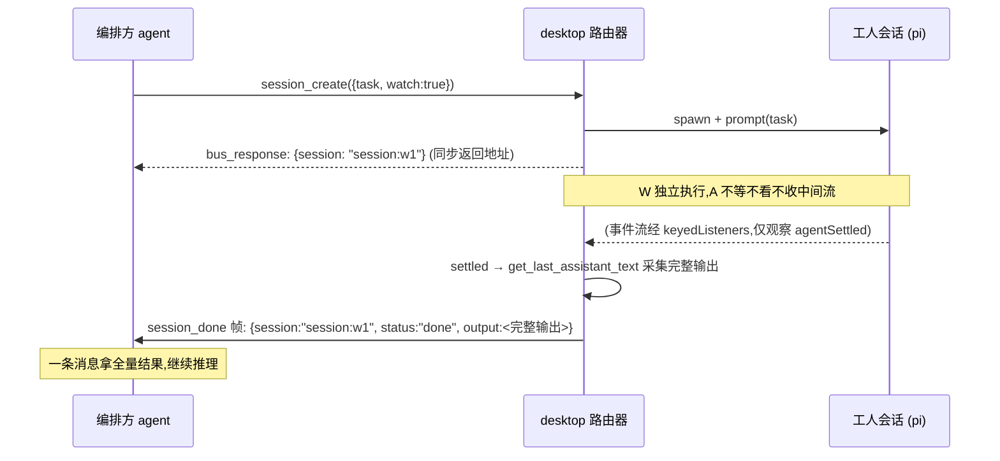
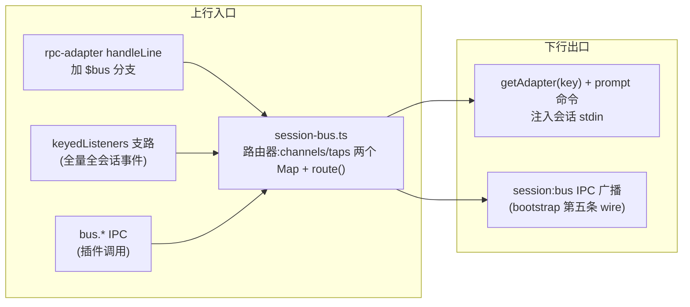

# Session Bus：会话即用户——多会话 IM 与自主编排设计

> 前置阅读：本文与 `subagent-scheduling.md` 同域——展示层设计（spawn 卡片、左侧栏分组、灰色输入框）在彼，本文只管通信底座与编排工具。文中"extension"指 pi 的 TypeScript 扩展（运行在 pi 进程内，经 `~/.pi/agent/extensions/` 加载），"plugin"指 pi-desktop 的桌面插件（运行在 renderer），两者是不同层的扩展机制，全文严格分用。
>
> **修订记录**：
> - **2026-08-04 IM 范式转向（本次）**：消息范式从"tool 调用"改为"IM 说话"——成员关系是设置，说话即传输，`bus_send` 从 agent 侧退役（7→6 个 tool）。§3 重写（IM 映射/自动路由/乒乓熔断），§5 收缩为 6 个设置层 tool，§7 剧本不再出现 send 调用。
> - 2026-08-03 同类合并：14→7 个 tool，查询收敛进 `bus_status`，`session_create` 加 `channels` 参数，确立"一轮闭环"底线。
> - 2026-08-02 按代码复核：传输选型实证（prompt+streamingBehavior 下行、stdout `$bus` 上行、input 钩子响应回路）。

pi 核心只把单个会话管好——这是它刻意的边界，不是缺陷。pi-desktop 作为壳（下文"壳"均指 pi-desktop 的 main 进程侧：它 spawn 并持有全部 pi 子进程），手里同时跑着多个 pi 进程，天然是做多会话规划的那一层。但今天的壳只是把多个会话**平级并列**地管起来：每个进程独立、平等、互不可见。一个 agent 遇到复杂任务，不能说自己把哪块活外包出去，不能问另一个 agent 进展如何，不能拉几个同伴围炉议事。

本文设计的就是壳层补上的这块机制：**一套会话间的 IM 系统**（Session Bus）——每个会话是一个用户，房间是渠道，成员关系设好之后**说话即传输**。另有全套编排工具供 agent 自主规划拓扑。subagent 是它的第一个租户，不是它的全部。

## 1. 职责分层：单 session 归内核，多 session 归壳

### 1.1 pi 的边界是对的

pi 的哲学写在它自己的 README 里：核心只给四个工具（`read`、`write`、`edit`、`bash`），没有 sub-agents，没有 MCP，没有 plan mode——每一个"不做"的答案都是"要就自己去扩展"。这不是功能缺口，是设计美德：核心小到可以被完全理解，工作流的选择权还给用户。

所以多会话能力**不该进 pi 核心**——给一个会话里的 agent 装上"和别的会话说话"的能力，这件事的正确落点不在那个会话内部，在看得见所有会话的那一层。pi 把单个会话做到极致，壳做多会话的规划，各归其位。

### 1.2 壳已经是调度器，只差"可寻址可路由"

pi-desktop 的 session-store 今天就是多进程调度器：它持有 `procs = Map<string, SessionProc>`，每个 SessionProc 绑一条 pi 子进程的 stdin/stdout，多个会话同时活着互不干扰。它看得见每一个进程、能 spawn 新的、能停掉旧的——多会话规划的物理基础全在。

缺的是逻辑层：这些进程彼此**不可寻址**。会话 A 没有办法指名会话 B 说一句话，因为它们之间没有地址、没有路由、没有消息的概念。总线补的就是这三个词：给会话地址，给消息信封，给壳一个路由器的角色。这是调度器职责的自然延伸——从"把进程管起来"到"让进程连起来"，不是给 pi 加功能。

### 1.3 通用抽象：地址 + 路由，场景全是租户

设计的通用抽象必须一次想对：不是"subagent 调度"，而是**会话间消息路由**。subagent 的父子协作、两个会话互相对话、N 个会话围一个聊天室、一个监督者盯着一群工人——这些看起来像几类功能，其实是同一个抽象的不同拓扑：都是"某地址向某地址投递消息"，拓扑是参数，不是并列概念。

所以本文不出现 subagent 专用管道。总线只提供地址、信封、路由原语；subagent 是第一个租户，它的全部需求（§7.4）都映射为总线原语的一种用法。谁是新租户由内容层决定，总线一行不改。

### 1.4 与现有机制的关系：扩展，不重构

总线挂在既有事件流的**旁边**，不动它一根手指。`dispatch()` 的四路分流（状态追踪、kernel 流、keyedListeners、view 流）保持原样；总线的进线从 keyedListeners 这个全量未过滤流引一条支路，出线复用每条 adapter 的 stdin。pi 核心一行不改，desktop 现有路由一行不改——所有新增都是新文件、新分支、新方法。

和 renderer 侧的插件事件总线（`ctx.events.emit/on`）也不是一回事，两者按进程边界分层、各司其职：

- **插件事件总线**管 renderer 进程内部的插件↔插件消息，消费者是 React 组件，不出 renderer。
- **Session Bus** 管 main 进程的会话进程↔会话进程、会话↔插件消息，消费者是 pi 进程里的 agent 和 renderer 里的插件。`plugin:<id>` 地址（§3.2）是两个世界的唯一桥点——投递到插件的消息经 `session:bus` IPC 跨过进程边界，进了 renderer 之后不转挂插件事件总线，各走各路。

## 2. 传输层：两条不对称的现存通道

总线的通信底座不能发明新协议——pi 的 RPC 协议是封闭的。`RpcCommand` 是 31 个字面量的封闭联合，没有 custom 类型；未知命令类型直接 parse error。这意味着设计文档们（如 subagent-scheduling §2）曾经设想的"desktop 往 pi stdin 写自定义 JSON"这条路**根本不存在**。

有人会问：pi 不是已经有一条 `extension_ui_request` / `extension_ui_response` 的请求-响应通道吗，为什么不复用它？三个理由把它排除了：它的 method 是封闭的 9 种 UI 交互（select/confirm/input/editor/notify/setStatus/setWidget/setTitle/set_editor_text），语义是"底座需要**用户**在界面上做选择"，不是"agent 请求 desktop 执行能力"；它的路由要经 renderer 转发等用户操作，而总线的信令是机器对机器、该在 main 进程内闭环；往它的封闭 method 联合里塞私货，是把信令伪装成 UI 请求，比没有通道更糟。所以总线不用它——但盘点 pi 的实际能力面后，两个方向各有一条现存通道，不对称，但够用。

### 2.1 下行 desktop→pi：prompt 命令 + streamingBehavior

下行唯一可用的官方通道是 **`prompt` RPC 命令带 `streamingBehavior: "steer" | "followUp"`**。消息以对轮输入形态注入会话，agent 天然会读、会回应，且自动持久化进 session 文件、自动出现在 timeline。

有一个实现要点必须钉死：**不能用 `steer` / `follow_up` RPC 命令投递**。这两条命令进 pi 后走 `session.steer()` 直插消息队列，绕过了 `emitInput`（extension 的 input 事件分发）；而 `prompt` 命令在 rpc-mode 里以 `session.prompt(message, { streamingBehavior, source: "rpc" })` 调用，`prompt()` 是所有输入必经 `emitInput` 的唯一入口。只有走后一条路，接收方 extension 的 `input` 钩子才有机会拦截消息——这是 §2.3 整条响应回路的前提。

`streamingBehavior` 取 steer 还是 followUp，是路由器的固定策略，发送方和接收方都不操心：**响应帧用 steer**（挂起的 tool 调用在等结果，即使接收方正在跑别的也要插队尽快 resolve）；**事件帧用 followUp**（chat、tap_event、session_done 这类通知排进队列，不打断接收方当前的 run）。两类帧的紧迫度天然不同，策略按帧型分派，不需要内容层声明优先级。

### 2.2 上行 pi→desktop：stdout custom 行

pi 的 extension 运行在 pi 进程内部，可以 `process.stdout.write` 写一行自定义 JSON——pi 的 loader 不拦 stdout。desktop 的 rpc-adapter 对未知 `type` 本来就兜底当 event 转发，只差在 `handleLine` 里加一个正式分支：识别 `{"$bus": true, ...}` 信封，转交给总线路由器，不再落进普通事件流。

上行还有一条备选：`pi.appendEntry(type, data)` 是官方 API，写 session 文件并触发 `entry_appended` 事件流回 desktop——自带持久化。需要落盘的消息（如协作的最终结论）走它，纯信令走 stdout custom 行。

### 2.3 响应回路：input 钩子的 handled/transform 分流

上行的单条消息是 fire-and-forget（发送即忘，协议层无应答），但 tool 调用要拿结果——agent 调 `session_create`，必须把新会话的地址作为 tool 返回值拿回来。请求-响应语义不是协议给的，是应用层用两条单向消息拼出来的：request 走上行 stdout，response 走下行 prompt 注入。在没有 stdin 反向通道的前提下，响应回路靠 extension 的 `input` 钩子拼装：

```mermaid
sequenceDiagram
    participant Ext as bus-extension (pi 进程内)
    participant Bus as desktop 路由器
    participant Agent as 接收方 agent

    Ext->>Bus: stdout: {"$bus":true,"id":"req-1","to":"desktop","kind":"session_create","payload":{...}}
    Note over Ext: 挂起 Promise,登记 pending: Map&lt;reqId, resolve&gt;
    Bus->>Bus: 处理(spawn 新 pi 进程)
    Bus->>Ext: stdin: prompt 命令(streamingBehavior,source:"rpc")<br/>message={"$bus":true,"to":"session:req方","kind":"bus_response","replyTo":"req-1","payload":{...}}
    Note over Ext: input 钩子识别 $bus 信封:<br/>响应帧 → return "handled"<br/>(agent 看不到,不入上下文)
    Ext->>Ext: pending 取出 resolve,tool 返回结果
    Note over Agent: 看到一次普通的 tool 调用/返回对
```

钩子的两种返回值把消息分成两路：

- **`handled`**——帧被整个吞掉，不进 agent 上下文、不落 session 文件。响应帧（`replyTo` 配对 pending 里的挂起 Promise）走这条路：agent 只看到 tool 调用正常返回，对传输细节一无所知。这同时意味着**隐藏控制帧今天就有**——不需要等上游支持。

- **`transform`**——帧被改写成可读文本后进 agent 上下文。通知帧（chat 消息、tap 事件、session_done）走这条路：extension 把 JSON 信封展开成"【来自 session:w1 的消息】……"这样的人话，agent 收到的是自然语言，可以读可以回。

**信封识别规则与防伪造**（钩子的判定逻辑，按序执行）：

1. 对输入文本尝试 `JSON.parse`，顶层 `$bus === true` 才认作总线信封；辅助信号是 `source`——input 钩子的回调能拿到本次输入的来源（desktop 注入是 `"rpc"`，人类在 TUI 里敲字是 `"interactive"`），来源不符直接放行当普通输入。
2. **吞帧（handled）有且仅有一个条件**：`kind === "bus_response"` 且 `replyTo` 命中本进程 pending Map 里一个活着的 reqId。reqId 是 extension 发请求时用 `randomUUID()` 生成的 id，外部无法预知——所以伪造帧最坏的结果是被 transform 成一条丑消息，**永远吞不掉任何东西**。
3. 不匹配上述两条的 `$bus` 帧（比如人类手敲了一段 `$bus` JSON）按普通输入透传给 agent，不吞不改写。防伪造的全部要点就是一句话：吞帧权只授给"自己发出的请求的应答"，其余帧最差只是难看。

注意信封从头到尾只有一个形状：上行请求、下行响应、事件通知全是 §3.2 的 `SessionBusMessage`（`kind` 鉴别用途，`replyTo` 配对请求），不存在"传输层一套字段、应用层一套字段"的两张皮——路由器和 extension 处理的都是同一个类型。

同步 tool 语义由此恢复，且不依赖任何上游 pi 改动。整条回路的代价只有一个约束：响应必须经 prompt 命令投递（§2.1 的实现要点），不能图省事走 steer 命令。

### 2.4 演进路径：上游 custom 协议是纯优化

如果将来给 pi 提上游改动（`RpcCommand` 加 custom 类型、extension 加 stdin 分发 hook、官方 `pi.emit` stdout API），传输层可以升级：控制帧改走 stdin 直投不再借 prompt 通道，上行 custom 行换成官方 API。但地址、信封、tool 面**一个字段不动**——那是传输升级，不是协议变迁。本文的其余部分不依赖这个演进，它发生与否只影响 §2 的实现细节。

## 3. 总线模型：IM 范式——设置归设置，说话归说话

### 3.1 IM 映射：会话即用户，房间即渠道

把总线当一个 IM 系统看，全部概念一次对齐：**每个 session 是一个用户，channel 是群，成员关系是设置项，说话是传输**。用户在群里从不"调用发送 API"——他进了一个群，然后他说话，路由是机械的。总线的 agent 同理：编排动作（拉人、建房、围观、踢人）是显式 tool 调用；但"发消息"不是动作，agent 在房间里说话，路由器按成员关系自动 fan-out。

| IM 概念 | 总线映射 |
|---|---|
| 群聊 | `channel:<name>`，成员 = session / plugin |
| 冒泡发言 | 在房间里说话——turn 最终 assistant 消息自动 fan-out（§3.3） |
| 潜水 | tap（只收不说的只读观察，§3.6） |
| 私聊 | 两人 channel——不是特殊机制，就是普通小房间 |
| 退群 = 闭麦 | `channel_member({action: "leave"})` |
| 消息气泡 | turn 的**最终** assistant 消息（中间工具流、碎碎念一概不 fan） |
| 系统提示音 | 总线自产帧：`peer_joined` / `peer_left` / `session_done` / `bus_throttled` |

这个映射消解了首版的"四原语"：send/publish 不复存在（说话就是发消息），join/leave 和 tap 降格为**设置层**操作（§5）。"传给谁、传不传"在设置时决定，说话时零决策。

### 3.2 地址与信封

地址的**类型是开放字符串**——这样将来新增地址形态不需要改信封的类型定义；路由器的**路由表当前覆盖四个前缀**，收到未知前缀的地址回发送方一个 undeliverable 错误，不静默丢弃。两层别混淆："四种形态"是当前路由表的内容，不是架构不变量。四种形态按前缀分派投递方式，路由器不为任何具体地址写分支：

- **`session:<key>`**——一个活着的 pi 进程（session-store procs Map 的 key）。投递 = prompt 命令注入其 stdin。
- **`channel:<name>`**——命名房间的全部成员。投递 = 逐个成员 fan-out。
- **`plugin:<id>`**——一个 renderer 插件。投递 = `session:bus` IPC 广播。
- **`desktop`**——路由器内部 handler。投递 = 进程内直调（如 spawn 请求的处理）。

地址是数据不是类型戳。新增一种地址形态（比如将来的 `group:<project>`）只需要路由器多一个前缀分支，信封和 tool 面不感知。

**信封**：圆心的中性类型，零依赖——

```typescript
interface SessionBusMessage {
  $bus: true;            // 协议标记,识别锚点(§2.3 判定第一步);恒为 true
  id: string;            // randomUUID,追踪与接收方去重(同一 id 重复到达只处理一次)
  from: string;          // 发送方地址——传输层认证,不自报
  to: string;            // §3.2 任一地址形态
  kind: string;          // 开放字符串。"chat" 是说话(唯一需要 agent 语义的 kind),其余是总线自产
                         // 系统帧(§5.8);结构化 payload 概念退役——IM 模式下内容就是文本
  payload: unknown;      // 各 kind 的内容层自定义
  timestamp: number;
  replyTo?: string;      // 请求-响应配对(可选)
}
```

安全模型只有一条硬约束：**from 由传输层认证，不由发送方自报**。执行点在路由器的上行入口：pi 侧帧到达时，路由器用"它从哪条 adapter 来"绑定的 sessionKey **覆写** from 字段——帧里自报的 from 值直接丢弃，伪造就此失效；插件侧的 from = `plugin:<id>`（PluginIdContext 框架注入，同样不采信自报）。除此之外没有任何角色校验——谁都能向谁说话、谁都能替别人牵线（§5.1），但每个动作可溯源。开放，但不匿名。

### 3.3 自动路由：说话即传输

这是 IM 范式的心脏。路由器在全会话事件流（keyedListeners 支路）上监听 `messageEnd`——一个会话的 turn 落出**最终 assistant 消息**时：

1. 查这个会话（以 from 地址计）是哪些 channel 的成员；
2. 对每个成员房间，把这条消息打成一个 `kind: "chat"` 帧（`from` = 发言会话，`to` = 房间地址，`payload` = 消息文本）；
3. 向房间其他成员 fan-out（除发言者自己）——session 成员经 prompt 命令注入（事件帧用 followUp 排队，§2.1），plugin 成员经 `session:bus` 广播。

agent 全程不知道总线的存在：它在房间里，它说话，别人收到——和微信群的心智模型一字不差。人（用户的激活会话）在房间里时，**人打的字同样自动 fan**——session 是 IM 用户，人和它的 agent 是同一个用户的两口气泡。

**防回声铁律：bus 投递进会话的消息，永远不再外 fan。** 判定是纯机械的：fan-out 前检查这条 `messageEnd` 的文本，若以 `{` 开头且 JSON.parse 后 `$bus === true`，说明它是总线注入帧（chat 转发、tap_event、bus_response 等），不是这个会话自己的发言——跳过。没有这条，A 收到房间消息 → 消息落进 A 的时间线成为 user 消息 → 又被当 A 的发言 fan 回房间 → 无限回声。agent 看了房间消息后的**回复**不是注入帧的转发，是 A 自己的新发言，正常 fan——回声断在"转发不再转"，对话不断。

### 3.4 乒乓熔断：双保险

自动路由把"说话"变机械的同时，也把"互抛"变机械了：A 说 X → fan 给 B → B 的 run 产出回复 Y → Y 自动 fan 回 A → A 又回……两个 LLM 可以永远互抛，烧 token 无底洞。人类在群里会停下来，LLM 不一定会。熔断上双保险，一软一硬：

- **软约定（内容层）**：extension 的 transform 把 chat 帧人话化时，包装文本里写明"这是来自房间的转发——有新内容才回复，**不回复是合法选项**"。把"可以闭嘴"写进消息本身，让 agent 把沉默当成正常行为而不是未尽义务。这是主防线：绝大多数乒乓在推理层就被消化掉。

- **硬上限（路由器层）**：每个 channel 一个 fan-out 预算（令牌桶：每分钟 20 条，常量可调）。预算耗尽后该房间的 fan-out 丢弃，并向房间发一条 `bus_throttled` 系统帧（from=desktop）说明熔断中——成员看到系统提示音，知道对话被强制冷却。这是兜底：即使两个 agent 都没学会闭嘴，路由器也会在 20 条后物理掐断。预算按房间独立计，一个房间的失控波及其他房间。

硬上限拦的是"烧 token 的失控"，软约定保的是"对话的自然结束"——两者管的不是同一件事，缺一个都不完整。

### 3.5 房间：运行时成员，死会话自动清理

房间成员关系是**运行时状态，不持久化**。理由：持久化会引出"房间里有死会话"的清理问题——重启后哪些成员还活着要逐个核实，比重新 join 一遍贵得多。重启后 rejoin 由各成员自己负责（插件重新声明、extension 重新加入）。

死会话的清理由路由器自动完成：session-store 的 `processExit` 内核事件已经存在，路由器订阅它——会话死亡时，把它移出所有房间（并向房间广播 `peer_left`）、停掉以它为源的 tap、停掉以它为 deliverTo 的 tap。desktop 自身退出时走既有的 `before-quit → stopAll()` 把全部 pi 进程停掉，所以不存在"desktop 重启后还有无主活会话"的场景——重启即全量清零，运行时状态（房间、tap、pending）随进程消失，与成员不持久化的语义自洽。成员不持久化加上死亡自动清理，房间的生命周期闭环，没有孤儿状态。

### 3.6 tap 与流量闸门

tap 的订阅分级，默认只给最稀疏的一档：

- **`done`（默认）**——只给完成信号（§4 的 session_done）。这是"盯一个任务到结束"的标准用法。
- **`lifecycle`**——加给边界事件：会话与 run 的起止和消息的完成态，即 `sessionStart`、`agentStart`、`agentEnd`、`agentSettled`、`messageEnd` 这五个，不给任何增量。这五个是**起止标记不是执行细节**——它们回答"开始了没有、结束了没有"，不回答"正在干什么"，所以即便进入 agent 上下文也符合 §4 的模型："只吃完成态"吃的是不含执行细节的边界信号，§4 要挡的是 stream 级别的增量，不是这五帧。
- **`stream`**——全量事件流 = lifecycle 五个边界事件 + 全部增量（`messageStart`、`messageUpdate`、`toolCallStart/Update/End`、`turnStart/End` 等）。**正当消费者是 plugin 地址**（监控面板：消费者是人，没有上下文成本）；deliverTo 是 session 时路由器把 stream 降级为 lifecycle，并回给订阅方一条 `kind: "tap_degraded"` 的系统事件帧说明降级原因——agent 上下文是稀缺资源，stream 灌进 agent 等于让接收方为发送方的执行细节付 token 账，这是 §4 论证要防的事，路由器替粗心的编排方兜底。

闸门的适用域：三级过滤对 plugin 目标全部原样放行（消费者是人，无上下文成本）；降级只发生在 deliverTo 是 session 时（stream→lifecycle）。channel 目标的 tap 不吃这套闸门——房间流量只有 chat 帧和 `peer_joined`/`peer_left` 帧，天然稀疏，filter 参数对 channel 目标无效，订阅即得全部房间流量；房间没有"完成"概念，不产生 session_done。

闸门的目的不是省带宽，是**保护接收方 agent 的上下文**：每一条转发进 agent 上下文的消息都是 token 成本，N 个被观察方的流式增量就是 N 倍上下文膨胀。默认 done，需要再加，是通信层的节俭纪律（§4 展开）。

## 4. 完成通知模型：一次性交付完整输出

观察一个正在跑的任务，总线的交付方式是：**等它全部执行完，把最终的完整输出一整份送过去**。不转中间的工具调用流，不给流式增量，没有"跑到 60% 了"这种中间态。

这个模型管的是**deliverTo 为 session 地址的观察**——agent 看 agent。deliverTo 为 plugin 地址的观察（监控面板，消费者是人）不受此限，§3.6 的 lifecycle/stream 级别就是为它留的；但路由器会把 session 目标的 stream 请求降级（§3.6），agent 上下文永远只吃完成态。

### 4.1 为什么不转中间流

中间流对观察者是三种浪费，一种错觉。

浪费在三个地方：工具流是**执行细节**不是进度——接收方 agent 拿到另一个 agent 的 `read_file` / `bash` 调用记录，没有行动价值；流式增量是**上下文传染**——发送方每吐一个 token，接收方的上下文就长一截，几个被观察方同时跑就是几倍膨胀；中间态是**重复决策源**——接收方看到半成品输出，除了提前焦虑什么决定都做不了，因为结果还没定。

错觉是"实时进度有用"。进度的本质是二元信号：**完了没有，结果是什么**。中间过程想不想看是人的需求，不是 agent 的需求——人要看，打开那个会话的 timeline 看完整消息流，那是展示层的事（spawn 卡片点进去就是完整会话视图），不该让通信层把执行细节灌进另一个 agent 的上下文。一次性交付恰好只回答那两个本质问题：session_done 事件=完了，完整 payload=结果是什么。一个字节不多。

### 4.2 完成判定与输出采集

完成的权威信号是 **`agentSettled`**——pi 的扩展事件里语义最干净的一个："没有更多 auto retry / compaction / continuation"，即这轮工作真正落定。`agentEnd` 是单次 run 的结束，后面可能还跟着自动重试；`processExit` 作为兜底（进程非正常退出也算一种"完"，status 标记为 error）。settled 永不触发的情形（进程挂死、模型侧死循环）由 watch/tap 的可选超时参数兜底——**默认无超时**：完成通知模型语义上不设 deadline（任务爱跑多久跑多久，结果是唯一关注点），超时是编排方显式声明的自治策略；超时后路由器停掉该会话并照常交付 `session_done`（status: timeout），编排方收到的信号形状不变，只是状态不同。

输出采集在 settled 时刻由 desktop 执行：经该会话的 adapter 发 `get_last_assistant_text` RPC（pi 协议既有命令，session-store 的同名 IPC 已在用）拿最后一条 assistant 文本——这是完整输出的主源；取不到（进程已退出）时回退读 session 文件尾部的最后一条 assistant 消息（会话地址即 procs Map 的 key，SessionProc 持有的 sessionPath 给出文件路径）。采集的是**最终态的完整文本**，不是增量的拼接——中间改过什么、重试过几次，全部折进最终结果里，不单独呈现。

### 4.3 一次性送达



`session_done` 帧的 payload 三块：会话地址、完成状态（done / error / aborted / timeout）、完整输出文本。编排方 agent 收到后自己决定怎么用——汇总、继续派活、向用户汇报，都是它的推理决策，总线不预设。

完整输出默认全量交付，只有一条例外：输出过长时路由器截断——按字符数估算 token（4 字符≈1 token），超过 8000 token 时保留头部 1/4（任务上下文）与尾部 3/4（结论密集区），中段以省略标记折叠，并附上会话文件的绝对路径——接收方真要全文，自己用 `read` 工具按路径取。截断保语义（头尾在，结论在），路径保完整（全文可达），两者缺一才会真的丢信息。

## 5. 设置层 Tools：6 个动作

### 5.1 原则：谁都可以

tools 由 **bus-extension** 提供——一个 pi extension，源码随壳分发（`packages/bus-extension/index.ts`），照 tool-gate 先例由 installer 在 app 启动时同步到 `~/.pi/agent/extensions/bus-extension/`。它每个 pi 进程加载一次、每进程一个实例，职责四件：经 pi 的 `registerTool` 把本节全部 tool 注册进 tool 系统（agent 看到的 `session_create`、`channel_member` 和 `bash`、`read` 是普通同事关系，推理时自然可调用）；挂上 `input` 事件钩子做信封识别（§2.3）；持有 pending Map 配对请求-响应；启动时 ping 探测 desktop 决定注册与否（§8 Q3）。

返回与拒绝的两个惯例：所有 tool 的同步返回都是小 JSON 对象（字段即各节所述——地址、tapId、清单项），不返回大 payload；plugin 侧调总线走 manifest 声明权限（`sessions:bus`），未声明而调，IPC 边界直接抛错（沿用 fs/git 既有门控的拒绝形态）。

总线不设特权方。任何会话可以调任何 tool，没有"父 agent""房主""管理员"的角色字段——拓扑是数据，不是权限。三种"谁都可以"各自有明确的参数形态：

- **谁都可以为自己申请**——所有 tool 的 target 参数缺省都是自己。
- **谁都可以替别人申请**——`channel_member({channel, action: "join", member: "session:B"})`：A 把 B 拉进房间；`session_create` 后 A 在与 B 同处的房间里说一声新地址即可（说话即传输，不需要专门的通知动作）。
- **谁都可以替别人牵线搭桥**——`tap_start({session: "session:W", deliverTo: "session:S"})`：A 让监督者 S 监听工人 W，A 自己不在回路里。

配合 from 传输认证（§3.2），开放但不匿名：每个动作都知道是谁发起的。plugin 侧调总线走 manifest 声明权限（`sessions:bus`），IPC 边界检查，沿用 fs/git 的既有门控；pi 侧不需要权限概念——传输认证已经限定了它只能以自己的身份发言。

每个 tool 的返回都走 §2.3 的响应回路同步返回给 agent；产生的后续事件以异步事件帧回流（§5.8）。

**一轮闭环**是本节的效率底线（2026-08-03 立，08-04 沿用）：查询可以花一轮（`bus_status` 拿全景），但执行、发布、订阅每个动作必须一轮整明白——不许"先建会话再拉房再挂监听"这种三连才能开干的编排；fan-out 三个工人 = 一轮里并行三个 `session_create`。tool 数量随之收敛：首版 14 个，同类合并到 7（whoami 等五个查询合进 `bus_status`、send/publish/reply 合一、join/leave 合一），IM 范式转向后再到 6（`bus_send` 退役，§5.8 附注）。以下逐 tool 展开。

### 5.2 bus_status

一轮查全景的唯一查询入口，一次调用拿四块：调用方身份（地址/房间/活跃 tap）、运行中会话清单（地址/会话名/cwd/busy=isStreaming）、全部房间及成员、相关 tap。编排前的侦察全在这一轮——没有它，agent 不知道场上都有谁；有了它，后面每个动作都可以直接引用地址开干。

### 5.3 session_create

```
session_create({ task?, cwd?, name?, model?, toolConfig?, watch?, channels? })
```

派活的完整一轮。`task` 首条注入、落地即开工；`watch: true` 完成时回 `session_done`（含完整输出，§4）；`channels: string[]`——起完即把新会话拉进这些房间（不存在即创建），"起工人 + 进作战室"一轮闭环。`toolConfig` 经头行写入 + tool-gate 硬过滤执行受限委托（有 read 没 write 的只读分析型、无 spawn 的到底层）。

同步返回 `{ session, key, sessionPath }`。

### 5.4 session_abort

```
session_abort({ session })
```

停掉一个会话进程（自杀/他杀皆合法，from 记录谁动的手）。走既有 stdin→SIGTERM→SIGKILL 停止链；死亡触发清理：移出全部房间并广播 `peer_left`、停相关 tap、watcher 收到 `session_done{status:"aborted"}`。

### 5.5 channel_member

```
channel_member({ channel, action: "join" | "leave", member? })
```

房间成员管理的唯一动作——这是 IM 范式下最重要的设置项：**进房 = 开始收发，退房 = 闭麦**。`member` 缺省是自己，显式声明可以是任何会话地址——替别人拉房/退房（§5.1）。房间是成员的涌现：首个成员加入即创建，最后一个离开即消散，没有空房间需要管理。成员变动向房间广播 `peer_joined`/`peer_left`。

### 5.6 tap_start

```
tap_start({ session? | channel?, filter?, deliverTo? })
```

监听动作的一轮——IM 里的"潜水"：只收不说。`session` 盯一个会话的事件（`filter` 三级闸门：`done` 默认只给完成信号 / `lifecycle` 加五个边界事件 / `stream` 全量仅 plugin 目标，session 目标自动降级并回 `tap_degraded`）；`channel` 盯一个房间的消息流（流量天然稀疏，filter 不适用）。`deliverTo` 缺省是自己，可填第三方地址——A 让 S 监听 W，A 不在回路里（§5.1 的牵线搭桥）。

同步返回 `{ tapId, filter }`；被观察方完成时无论哪级闸门都补发 `session_done`。

### 5.7 tap_stop

```
tap_stop({ tapId })
```

取消一个进行中的 tap，事件流停止回流；被观察方不受任何影响（tap 只读）。

### 5.8 异步事件帧与展示分流

agent 经总线收到的异步消息统一是这个形状：

```json
{"$bus": true, "kind": "chat|task|result|tap_event|session_done|peer_joined|peer_left|bus_throttled|tap_degraded",
 "from": "session:w1", "to": "channel:review", "payload": {...}, "id": "msg-42", "timestamp": 1754131200}
```

`to` 保留逻辑目的地：经房间 fan-out 的消息，接收方看到的 `to` 是 `channel:<房名>`——一眼知道"这条从哪个房间来"；直发的消息 `to` 就是接收方自己。

kind 分两类：**`chat` 是唯一需要 agent 语义的 kind**（某人在某房间说了话，payload 是文本）；其余全是总线自产系统帧（完成/进出/熔断/降级/观察），payload 形状各异。extension 的 input 钩子对事件帧做 transform：展开为可读文本（来源、房间、正文）再进 agent 上下文——chat 帧的包装文本额外写明"有新内容才回复，不回复是合法选项"（§3.4 软约定）。人这一侧想看得更漂亮，渲染层可以再拆 JSON 字段做卡片化展示——那是展示层的自由，通信层只保证信封的完整和一致。

**接收方没有装 bus-extension 时会怎样**：消息不会丢——prompt 注入不依赖接收方有任何扩展，裸 JSON 信封作为一条普通用户输入落进 agent 上下文。agent 读 JSON 没有问题，只是没有人话化的 transform，体验降级但功能完整。所以向一个"裸会话"投递是合法用法（比如临时起个没装扩展的会话当苦力），只是正式协作成员都该装上 bus-extension。

上例 kind 字段列出的是总线自产；kind 是开放字符串，内容层（插件、其他 extension）可以发明自己的 kind，总线原样路由不解释。

**附注：`bus_send` 为何退役（2026-08-04）**。首版它有独立 tool 的位置，因为那时"发消息"被建模为一个动作。IM 范式下它不是：agent 有天然嗓子——在房间里说话就是发消息（§3.3），再发一个 send tool 是让 agent 用 API 复述自己刚说过的话。plugin 侧**保留** send——插件没有 `message_end`、没有自然嗓子，`bus.send` 是它唯一的发声通道，这不是范式冗余是刚需。

## 6. desktop 侧挂点

### 6.1 三个附着点，不动现有路由

总线在 desktop main 进程的接入是三个新增点，全部在既有结构旁边，不修改 `dispatch()` 的既有分流：



- **入口一**：rpc-adapter 的 `handleLine` 加 `$bus` 信封分支，extension 的上行请求转给路由器（§2.2）。
- **入口二**：session-store 的 keyedListeners——全量、全会话、未过滤的事件流（粒度 = pi 底座经 rpc-adapter 转发的全部 SessionEvent，含流式增量，逐事件带 sessionKey；现在只有 restart-coordinator 和 model-test 两个消费者）。总线引一条支路喂三件事：**自动 fan**（§3.3：member 会话的 `messageEnd` → 按成员关系 fan-out）、tap 分发、完成判定（§4.2）。暴露方式是 session-store 加一个 `onAnySessionEvent((event: SessionEvent, sessionKey: string) => void)` 公开方法。
- **入口三**：`bus.*` IPC——插件调 send/join/tap 的通道，走 manifest 声明权限门控。
- **出口一**：session-store 加 `getAdapter(key)` 公开方法，路由器拿到目标会话的 adapter 后发 prompt 命令注入（§2.1）。
- **出口二**：bootstrap 加第五条 `webContents.send("session:bus", ...)` wire，与既有四条推送 wire 并列，插件经 preload 的 `bus.onMessage` 订阅。

### 6.2 路由器与 DeliveryPort

`core/application/sessions/session-bus.ts` 是纯用例编排：两个 Map（channels、taps）加 route()，不 import Electron、不摸 adapter。它持有 `DeliveryPort` 接口——`sendToSession(key: string, message: SessionBusMessage): void` 与 `broadcastRenderer(message: SessionBusMessage): void` 两个方法，接口定义在 application 层、实现在 bootstrap 接线（依赖倒置：换运行时只换 port 实现，router 一行不改）。

### 6.3 死会话清理

路由器订阅 session-store 的 `processExit`（内核事件流已有）：会话死亡 → 移出全部房间 + 房间广播 `peer_left` → 停以它为源的 tap + 通知 deliverTo → 停以它为 deliverTo 的 tap + 通知 tap 主。配合房间成员不持久化（§3.5），生命周期闭环，无孤儿状态。

## 7. 场景回放

### 7.1 并行 fan-out：重构 + 补测试

用户说"把 auth 模块重构了并补齐测试"，agent 自主编排：

1. `session_create({task: "拆 auth.ts", watch: true, channels: ["auth-squad"]})` → 得 `session:w1`
2. `session_create({task: "写测试", watch: true, channels: ["auth-squad"]})` → 得 `session:w2`——两个工人落地即同房：w1 改了接口签名，w2 立刻知道
3. 自己不看不等，继续陪用户聊；两个 `session_done` 帧先后到达，各带完整输出
4. 汇总两边结果，向用户汇报；会话文件留在盘上，用户点 spawn 卡片看完整过程

拓扑（并行还是串行、要不要聊天室、几个工人）全是 agent 的推理决策——总线给能力，AI 给拓扑。

### 7.2 监督者：替别人牵线

复杂重构，agent 想要一个"审查员"盯着"工人"但不亲自下场：

1. `session_create({task: "重构 storage 层", watch: true, channels: ["storage-review"]})` → 工人 `session:w`
2. `session_create({task: "待命,审查 supervision 转给你的进展", name: "reviewer", channels: ["storage-review"]})` → 监督者 `session:s`——A 与 w、s 同处一室，说话互相听得见
3. `tap_start({session: "session:w", filter: "done", deliverTo: "session:s"})`——A 牵线，s 听 w，A 不在回路里
4. w 完成时，s 收到完整输出并开始审查；审查结论 s 在房间里说出来，自动到达 A

### 7.3 聊天室：人也在房间里

三个 agent 加一个真人在同一个 `channel:war-room`：agent 们在房间里**说话**——进展、分歧、结论，说完自动 fan-out，没有任何发送动作；用户在 desktop 上（插件 join 同一房间）围观全部消息，随时可以插话——插件没有自然嗓子，人的发言经保留的 `bus.send` 进房间，agent 们收到和人发言同构的 chat 帧。人和 agent 在同一个房间里用同一种方式被听见，不需要任何特殊机制。

### 7.4 subagent 退化为纯用法

subagent-scheduling.md 里的三条专用消息，全部映射为总线原语，无一需要专用管道：

- `desktop_request/spawn_subagent` → `session_create({task, toolConfig, watch: true})`
- `desktop_event/subagent_progress` → 取消（§4：不转中间流）；人在要看进度就打开子会话 timeline
- `desktop_event/subagent_done` → `session_done` 帧（含完整输出）

展示层的设计原样保留：spawn 卡片（custom_message + messageRenderers 槽）、头行 `custom-pi-desktop.subagent.parent_id`（缺口五已落地，设计见 `docs/design/session-header-custom.md`）、左侧栏缩进分组、灰色输入框。原设计的框架缺口审查（§7）依然有效——缺口五已补、缺口一/三仍在；变的只是通信底座从"custom 信封专用协议"换成了"总线的第一个租户"。

## 8. QA

**Q1：响应帧会被 input 钩子 handled 吞掉，那给它配 streamingBehavior 还有意义吗？**

有，是兜底不是主路径。`prompt()` 在接收方正忙（isStreaming）时，不带 streamingBehavior 会直接抛错——所以响应帧必须带，否则忙时投递失败。带 steer 的深层理由是降级路径：万一信封识别失败（比如接收方是没装 bus-extension 的裸会话），帧不会被吞，而是按 steering 队列尽快进入 agent 视野——识别失败时的 steer 比 followUp 更快被看到。主路径（识别成功）里帧在 emitInput 阶段就被吞掉，根本到不了队列选择，steer 和 followUp 此时无差别。

**Q2：replyTo 引用的消息在 desktop 重启后还有效吗？**

无效，这是显式的运行时边界。消息 id、pending Map、房间成员、tap 清单全部是会话级运行时状态，重启即清空——和房间成员不持久化（§3.5）是同一条纪律。重启后引用一个旧消息 id 回复（plugin 侧 `bus.send` 带 `replyTo`），路由器按未知地址回 undeliverable 错误给发送方，不静默丢弃。跨重启的引用需求应该落 session 文件（appendEntry），不该依赖总线内存。

**Q3：用户不经 desktop、直接命令行跑 pi 时，bus tools 会怎样？**

优雅退化。bus-extension 加载时先发一个 ping 上行帧探测 desktop 的总线路由器：有应答则注册全部 tools；超时无应答说明跑在裸 pi 里，extension 一个不注册——agent 的 tool 清单里根本看不到这些 tool，不会尝试调用。不存在"调了但失败"的路径，和 spawn_subagent 设计里"没 desktop 就静默退化"是同一手法。

**Q4：开放模型下一个会话被垃圾消息轰炸怎么办？**

三道防线，按从轻到重排：from 传输认证让轰炸者无法匿名（§3.2），被炸方的 agent 自己可以选择不回、可以 `channel_member({action: "leave"})` 退出房间；编排方或用户可以 `session_abort` 直接杀掉轰炸源——他杀是合法操作（§5.6）。已知边界：总线没有频率限制和配额，这是刻意的——限流策略是内容层的治理决策，不是通信层的职责；真出现失控会话，处置权在用户手里。

**Q5：两个不相干的编排方用了同一个房间名，会互相听见吗？**

会，而且这是特性不是 bug。房间名是开放字符串，同名即同房——它是"广场"不是"包间"。`bus_status`（§5.3）就是发现机制：agent 起名前先查一轮全景看既有房间，想进就 join，想隔离就起个带前缀的私有名（如 `auth-squad-x7f`）。命名冲突的化解靠约定（项目名 + 随机后缀），不靠总线的命名空间隔离。

**Q6：互指监听、互相对话，消息互灌会不会死循环？**

分两层答。tap 互指（A 听 B、B 听 A）：默认只给 done 级事件（§3.6），完成信号是终止态不是新话题，互灌止于各自完成，风险有限。

真正要防的是 IM 范式下的**对话乒乓**（A 说→B 自动回→又 fan 回 A→……）——这正是 §3.4 双保险管的：软约定（包装文本写明"不回复是合法选项"）让 agent 在推理层学会收尾，硬上限（每房间每分钟 20 条 fan-out 预算）在推理层失守时物理掐断。极端情况下用户 `session_abort` 任一环节即断链。总线不做"环检测"去堵拓扑——环是数据不是协议错误，断路靠预算和语义，不靠交警。

**Q7：plugin 地址的消息，插件正好没挂载（tab 未打开）时会丢吗？**

会丢，语义和渲染层事件总线一致：`session:bus` 是广播不是队列，没有订阅者即弃。需要可靠送达的场景不该用 plugin 地址，应该用 session 地址（prompt 注入会持久化进 session 文件，天然可靠）；plugin 地址的定位就是"在线面板的实时推送"，不在线就不推。

**Q8：乒乓熔断的硬上限具体怎么算？**

每个 channel 一个独立的令牌桶：容量 20、每分钟补满。一次 fan-out（一条 chat 帧向一个房间的投递动作）花一个令牌；桶空则该房间的 fan-out 整批丢弃（不是排队），同时向房间发一条 `bus_throttled` 系统帧（from=desktop，同一冷却窗口内只发一条，不二次刷屏）。20/分钟是经验起点——正常两人对话每秒一条都嫌快，真协作到这个速率已经失控；常量收在路由器一处，实测后按数据调。预算按房间隔离，一个房间熔断不影响其他房间的正常往来。

**Q9：bus 注入的消息凭什么不再外 fan？判定会不会误判？**

判定是纯机械的字符串检查：fan-out 前看这条 `messageEnd` 的文本，以 `{` 开头且 `JSON.parse` 后 `$bus === true` 即是注入帧，跳过。误判两个方向都分析过：agent 自己说的话恰好以 `{"$bus": true, ...}` 开头——它得先原样复述一帧合法总线信封，这在自然发言里几乎不发生，发生了也只是这一条没转发（降级不致命）；注入帧被判成正常发言——不可能，注入帧的文本就是信封 JSON 本身，标记恒在。防回声要断的只是"转发不再转"，agent 看了消息后的回复是新发言，正常 fan，对话不受影响（§3.3）。

**Q10：`bus_send` 退役后，想给某个没房间关系的 session 说一句话怎么办？**

建一个两人房间：`channel_member` 把双方 join 进一个私有名的 channel（如 `dm-a-x7f`），然后说话——它就是个普通小房间，没有特殊机制，说完留着，下次还能用。这是 IM 的标准答案：没有"离线小纸条"，私聊也是房间。一次性、结构化的任务分派不该走对话，走 `session_create({task})`——那是派活，不是聊天。
