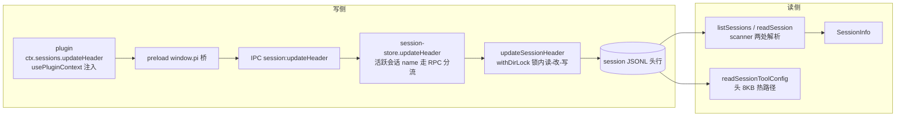

# 会话头行 custom-pi-desktop 开放命名空间设计

> **修订记录(2026-08-06 二次修订:私有字段全量统一)**:2026-08-03 版落地了 custom-pi-desktop 开放命名空间,但当时 pinned/archived/toolConfig 仍留在头行顶层枚举字段(§1.4「消费者该枚举」决策),toolConfig 更被 §5.2 明确"不迁移"。本次修订把三个字段全部迁入 custom-pi-desktop(平铺顶层保留键),头行物理格局收敛为"底座字段 + 一个 desktop 命名空间"两类。推翻两条旧决策,新理由:
>
> 1. **存储统一,契约不动**。§1.4 当年的判据是"desktop 生态认语义的字段该枚举"——混淆了存储层和契约层。枚举消费发生在契约层(`HeaderPatch` 枚举键、`SessionInfo.pinned/archived` 透传,插件零改动);存储层该统一——desktop 私有数据只有一个家,顶层枚举键和命名空间并存是双源格局,每加一个私有字段都要重新回答"放哪边"。迁入后 `updateSessionHeader` 的枚举分支变成命名空间内的保留键写入,契约层形状不变。
> 2. **toolConfig 跨进程消费者不构成不迁理由**。§5.2 的理由是"迁移要动 tool-gate 扩展的读路径,不值当"——未发布阶段没有"正在跑的回路"要保护,desktop 写读两侧与 packages/toolgate 同 commit 原子改完,bootstrap 常驻同步下次启动即生效,无版本撕裂。
> 3. **name 不迁入,直接单轨**。名字在底座侧有正式轨道(session_info 条目),挪进 custom 是造第三条轨;正解是删掉冗余的头行 name 轨——见 session-name-tracks.md §7。
>
> 存量不兼容:未发布,旧文件顶层 pinned/archived/toolConfig/name 直接失效,不迁移不兜底。
>
> **修订记录(2026-08-03 重写)**:首版(2026-07-29)设计了同目标机制但从未落地——`custom-pi-desktop` / `setCustomData` 在当前代码零痕迹,`HeaderPatch` 无 custom 字段,subagent-scheduling.md §7.5 复核确认缺口原样。subagent 调度(该文 §6.1 要往头行写子会话归属标记)作为新驱动力要求重启此机制。本次重写沿用首版的字段名与问题分析框架,变更三个决策:
>
> 1. **写入语义:双通道 → 单通道浅合并**。首版是"updateHeader 整体替换 + setCustomData 专门 API 做 key 级合并"双通道,其 QA Q1 自认插件可绕过专门 API 直调整体替换、抹掉他域,处置只是"文档约定 + review"。本次把顶层 key 浅合并收进 `updateHeader` 本身——同一字段一条写入路径、一种合并语义,坑在机制上消除(§2.3)。
> 2. **SessionInfo:不透传 → 透传**。首版的场景全是"只有属主插件自己读"的私有设置(折叠状态、过滤规则),按需 IPC 单读、不进 SessionInfo 合理。新场景 subagent.parent_id 是 sessions-list(分组)和 timeline(灰色输入框)每次渲染都要读的跨插件展示元数据,逐会话 IPC 不可行——它恰好落在首版 §3.1 自己立的边界判据("所有展示层插件共用的会话元数据")一侧,只是当时没有这个需求(§5.1)。
> 3. **写入方:插件专用 → desktop 与插件同路**。subagent 域的主写入方是 desktop(session-bus,desktop 的会话间路由器,spawn 时写),首版 pluginId 绑定的专门 API 对"desktop 写、插件只读"的主场景不适用;统一走 `updateHeader`,desktop 与插件同一条通道(§2.2)。
>
> 另:首版 §4.3 的 toolConfig 渐进迁移建议在 2026-08-03 版被作废、又在 2026-08-06 版重新落地(见顶部修订 2)。首版引用 `shell/electron-main/...` 的代码路径是分区重构前的旧结构,本文全部按当前分区(domain / application / api / client / bootstrap)重写。

session 文件(JSONL)第一行是 header,pi 底座(pi-desktop 经 JSONL RPC 管理的独立 agent 子进程;架构全景见 docs/DESIGN.md)写 type/id/timestamp/cwd,pi-desktop 的全部私有数据统一存头行的 `custom-pi-desktop` 命名空间——desktop 核心属主的保留键(pinned/archived/toolConfig,平铺顶层)加各功能域(model、subagent、插件域)。插件要往头行写自己的东西——折叠状态、过滤规则、subagent 的父子归属——都进这个命名空间:顶层 key 即域名,任何写入方往自己的域里写数据,链路一次加三处、此后零改动。subagent 是第一个域租户(subagent-scheduling.md §7.5 缺口五的补法)。

## 1. 问题:插件往哪存会话级数据

### 1.1 两类场景,两种性质

插件的会话级数据和会话同生共死:会话在,数据在;会话删了,数据跟着没;会话文件被复制走,数据跟着走。这类数据不该进 `~/.pi-desktop/` 下的全局配置(那是跨会话的),该跟着会话文件走。场景分两类,性质不同——这个分野是后文"SessionInfo 透传"决策的根:

- **插件私有设置**(首版场景):只有属主插件自己读。timeline 想记住"这个会话里用户折叠了哪些工具执行条",git-review 想记住"这个会话评审时过滤了哪些文件类型"——别的插件不关心,展示层也不关心,属主打开会话时自己读出来恢复状态就行。

- **跨插件展示元数据**(subagent 带来的新场景):多个展示层插件每次渲染都要读。子会话头行的 `parent_id`,sessions-list 要读它做缩进分组,timeline 要读它把输入框变灰(subagent-scheduling.md §6.3/§6.5)——它不是任何单一插件的私有物,是"这个会话是什么"的公共描述,只是语义不由内核消费。

两类都该放头行,读取方却不同:私有设置只有属主自己读、频次低、体积小;展示元数据是多个插件每次渲染都要的公共输入,必须随列表一把拿到——逐会话 IPC 单读不可行。首版只有前一类场景,选了不透传;本文两类都要,统一透传、用大小约定约束(§2.4)。

### 1.2 现状:一条写读链路,四个枚举字段各占一个分支

> 本节描述的是 2026-08-03 引入命名空间**之前**的历史格局(当时 name/pinned/archived/toolConfig 四个私有字段平铺头行顶层),是命名空间机制的问题来源。2026-08-06 起这些字段已迁入 custom-pi-desktop(顶部修订记录),本节作为决策背景保留。

pi-desktop 管的头行写读链路当时长这样:



- 写侧一个函数四个分支:`updateSessionHeader`(session-scanner.ts:237)在 `withDirLock`(目录锁原语,config-file.ts)锁内读-改-写头行,name/pinned/archived/toolConfig 各占一个 if 分支。它上面 `session-store.updateHeader`(session-store.ts:320)还有一层分流:活跃会话(有 pi 进程在跑的会话)的 name 改走 RPC(底座自己写 session_info 条目,名字真相源在条目轨道,双轨机制见 session-name-tracks.md),其余字段照走文件。

- 读侧两处解析一个热路径:`listSessions`(session-scanner.ts:77)扫 cwd 桶目录、头行 parse 提取已知字段构造 `SessionInfo`;`readSession`(session-scanner.ts:326)单会话全文读、同样构造 SessionInfo;`readSessionToolConfig`(:374)是热路径——只读头 8KB 找换行符、单提 toolConfig,timeline 每次发消息都调。

- 通道侧三层穿透:plugin 调 `ctx.sessions.updateHeader(sessionPath, patch)`(`usePluginContext()` 拿受控 API,`SessionsApi` 契约在 domain/sessions.ts:260,默认注入、不需 permissions 声明),经 preload 的 `window.pi.sessions.updateHeader`(preload.ts:186)桥接,IPC handler(api/ipc/sessions.ts:61)转 sessionStore;patch 的类型是 `HeaderPatch`——一个封闭联合,四个字面量(name/pinned/archived/toolConfig)。

这条链路对四个枚举字段是完备的:每个字段有写入分支、读出透传、类型定义。但它封闭——第五个字段来了,每一环都不认。

### 1.3 缺口的三处断点

subagent 调度要往子会话头行写归属标记,撞上三处断点:

- **写不进**。`HeaderPatch`(domain/sessions.ts:116)是封闭枚举——调用方传 custom,TypeScript 先拦死;就算绕过类型,`updateSessionHeader` 的分支链也不认这个键,写进去的逻辑根本不存在。

- **读了丢**。就算头行里有自定义数据(比如手工塞进文件),`listSessions` 和 `readSession` 的头行 parse 类型注解只列已知字段——多出来的字段解析了也被类型丢弃,`SessionInfo`(domain/sessions.ts:26-43)上没有,消费方拿不到。

- **语义没钉**。前四个字段是"枚举的已知私有字段":每个语义明确、形状固定、desktop 自己消费。开放字段是第一次开——谁能写、写什么形状、写多大、多写入者怎么共处、和底座字段怎么隔离,一条约定都没有。语义不钉死就加字段,加的就是下一个漂移源。

### 1.4 为什么不是加第五个枚举字段

最省事的补法摆在明面上:`HeaderPatch` 加 `parentId?: string`,`updateSessionHeader` 加一个分支,scanner 透传,`SessionInfo` 加字段——四处改动,收工。这是切香肠,理由是三笔账:

- subagent 要写的不是一个字段,是一组:parent_id、parent_session、subagent_id、spawn_task、spawn_entry_id(subagent-scheduling.md §6.1 列了五个)。五个枚举字段?还是打包成一个 `subagent` 枚举字段?后者已经是"命名空间"的雏形了——只不过是一个只许 subagent 用的特权命名空间。

- 下一个租户马上会来。会话标签、工作区标记、折叠状态、过滤规则——"写入方要往头行写自己的东西"是一类需求,不是一个需求。每来一个租户,HeaderPatch、updateSessionHeader 分支、scanner 两处透传、SessionInfo,这条链路五处全动一遍(展开成代码落点即这五处;按功能归并就是 §1.3 的三处断点:前两个落点是"写不进",后三个落点是"读了丢")。开放命名空间把这类需求一次做完:链路加三处(§3),此后任何租户的域扩展,机制零改动。

- 头行字段的两种性质该分开了。pinned/archived/toolConfig 是 desktop 生态自己认语义的字段——desktop 拿 pinned 做置顶排序,tool-gate 拿 toolConfig 做工具硬过滤,枚举合理,因为 desktop 生态是消费者。subagent.* 不同:内核不认它的语义,只是替 subagent 域保管——内核是容器不是消费者。容器该开放,消费者该枚举。

  > **2026-08-06 修订:本条决策作废。**"消费者该枚举"混淆了存储层与契约层——枚举消费发生在契约层(`HeaderPatch` 枚举键、`SessionInfo.pinned/archived` 透传),存储层该统一。pinned/archived/toolConfig 已迁入 custom-pi-desktop 平铺顶层保留键,契约形状不变、插件零改动;头行物理格局收敛为"底座字段 + 一个 desktop 命名空间"。详见顶部修订记录。

### 1.5 为什么是头行第一行

JSONL 文件的结构是:第一行 session header,后续每行是会话条目(消息、模型变更、压缩记录等)。第一行是整个文件位置最稳定的锚点——`content.split("\n")[0]` 一行代码拿到,不用扫全文;不随新消息追加而移动。body 里的条目语义是"会话过程中发生了什么"(事件流),不是"这个会话的属性是什么"(元数据)——元数据该在 header,和 name/pinned/archived 同层。三个挂着 custom 名字的条目形态容易混淆,§4 专门分清。

写读链路的既有机制是现成的:`updateSessionHeader` 已实现锁内读-改-写,IPC 通道 `session:updateHeader` 已注册——不需要新的文件操作、新的锁、新的 IPC。

## 2. 设计:custom-pi-desktop 开放命名空间

### 2.1 字段名与形状:域 key 即归属,value 是域私有对象

字段名 `custom-pi-desktop`——带 desktop 前缀,不是光秃秃的 `custom`。头行是 desktop 和底座的**共享空间**:底座写 type/id/timestamp/cwd,desktop 塞私有字段。底座将来升级若自己加个叫 `custom` 的头行字段(body 里已有 `type:"custom"` 条目,头行加同名并非空想),秃名就撞了——desktop 的域数据和底座语义混在一起,要迁移。带前缀从机制上杜绝撞名:底座不知道也不碰这个字段,desktop 也不改底座字段,命名空间物理隔离。代价是名字丑长,但落盘名只出现一次(头行),API 面用短名 `custom`(§3.1 的映射),日常写代码碰不到长名。

写入后的头行长这样(以 subagent 域为例):

```json
{
  "type": "session", "id": "sub-1", "timestamp": "...", "cwd": "...",
  "custom-pi-desktop": {
    "subagent": {
      "parent_id": "agent-main",
      "parent_session": "~/.pi/agent/sessions/xxx/parent.jsonl",
      "subagent_id": "sub-1",
      "spawn_task": "把 auth.ts 拆成 3 个文件",
      "spawn_entry_id": "entry-42"
    }
  }
}
```

形状的两个决策,每个都否掉了一个候选:

- **嵌套域对象,否掉扁平点号 key**。另一个候选是把 key 拍平——`"subagent.parent_id"` 作顶层 key、值是原语。点号 key 的隔离粒度细到字段级(分次写同一域的两个字段互不覆盖),但代价是消费方读出后要按前缀过滤才能凑齐自己域,且 JSON 里点号 key 非常规。嵌套域对象让消费方一把取走自己域,形状自然;隔离粒度从字段级退到域级,由 §2.2 的"域内整体替换"补上——那个语义下,字段级隔离本来就用不上。

- **域 key 即归属**。`custom-pi-desktop` 内的第一级 key 是域名;一个域一个属主。归属按写入方分两种形态:**插件的域名即插件 id**(timeline 插件写 timeline 域);**desktop 内核模块写入时按功能域命名**(session-bus 为 subagent 功能写 subagent 域)。归属约束的是跨写——任何写入方不碰别人的域。框架不校验域名格式、不感知域内形状——容器中性,内容是域主的事。

### 2.2 合并语义:域级浅合并

`patch.custom` 的写入语义四句话讲完:

- **写域**:`{subagent: {...}}` 只动 `custom-pi-desktop.subagent`,其他域原样保留。

- **域内整体替换**:域的 value 整体覆盖,不递归深合并——写方对自己域的全量负责,一次写全。

- **删域**:`{subagent: null}` 删 subagent 这一个域,其他域不动。

- **删整个字段**:`custom: null` 删头行的整个 `custom-pi-desktop`——对齐 toolConfig 的 null 语义(session-scanner.ts:274-277 同款)。

域内为什么不深合并?deepmerge 包就在仓库里(core/application/config/json-merge.ts),拿过来合就是了——但深合并的每种策略都有反例:数组是拼接还是替换?null 是"删除这个键"还是"值就是 null"?subagent 域将来长出一个数组字段,拼接语义就把两次写入叠成双倍。框架替域主做深合并,是把这些语义分歧揽到自己身上。域内整体替换把责任边界画干净:框架管域级隔离,域主管域内形状——sub-agent 插件写 subagent 域时,它对域内全部字段负责,因为它本来就有全量(spawn 时一次成形)。

还有一个收敛动作:**空壳不留**。删光域之后,`custom-pi-desktop` 字段本身从头行删掉,不留空对象——读侧拿到 `undefined` 和"没有任何域"保持一个语义,消费方不用判两种空。

### 2.3 为什么不是整体替换

首版踩过的坑先摆出来:它是双通道设计——`updateHeader` 对 custom 做整体替换,另开 `setCustomData` 专门 API 做 key 级合并。其 QA Q1 自认:插件绕过专门 API 直调 `updateHeader`,整体替换就把别的域整个抹掉,处置只是"文档约定 + review"。**同一个字段两条写入路径、两种合并语义,坑是结构性的**——只要有便宜的那条路,就一定会被踩。本版把浅合并收进 `updateHeader` 本身,一条路径一种语义,坑在机制上消除。

如果反过来,让 `updateHeader` 也做整体替换(对齐 toolConfig 语义、分支写成一行赋值),否决它用三个理由:

- **多写入者互相抹除**。一个写入方写了 `{subagent: {...}}`,另一个写 `{timeline: {...}}`——整体替换下,后写把先写整个抹掉。custom-pi-desktop 是开放命名空间,写入者天然不止一个;整体替换等于宣布"这个开放字段同一时刻只容一个租户",自相矛盾。

- **补救路径不原子**。防抹除的唯一办法是调用方读-改-写:先读、合并自己的域、再整体写回。但 plugin 侧的读是经 IPC 拿到的快照(main 进程某次扫描的结果),两个写入方并发时快照都是旧的,读-改-写跨进程不原子,写者赢。竞态没有消失,只是从 main 进程内挪到了进程间。

- **浅合并把原子性收进既有的锁**。`updateSessionHeader` 本就是 `withDirLock` 锁内读-改-写(session-scanner.ts:244)——浅合并在锁内完成,main 进程内原子,调用方零负担。整体替换是把合并责任推给每个调用方,浅合并是框架统一承担——"框架管通用,特化归插件"的又一次应用。

整体替换唯一能拿出的理由是"和 toolConfig 语义一致"——但 toolConfig 是单写入者字段(tool-manager 管理页),custom-pi-desktop 是多写入者字段,语义该按写入者数量选,不按字面像不像选。

### 2.4 三条语义约定(钉死在 domain 注释)

字段加上去之前,三条约定先钉在 `SessionInfo.custom` 的注释里——头行从"枚举私有字段"到"开放扩展字段"的第一次,语义不明写,半年后没人记得哪份是真的:

- **desktop 私有,底座不感知**。custom-pi-desktop 是 pi-desktop 的头行扩展,pi 底座不读不写(字段名前缀就是这条约定的物理表达,见 §2.1)。底座升级认不认这个字段无所谓,desktop 生态自己消费、自己保管。

- **域 key 归属制 + desktop 保留键**。命名空间内第一级 key 分两类:**保留键** `pinned`/`archived`/`toolConfig` 属 desktop 核心(平铺顶层,经 `HeaderPatch` 枚举键写入,插件域不得占用);**域**一个属主,插件的域名即插件 id,desktop 模块写入时按功能域命名(session-bus 为 subagent 功能写 subagent 域、session-store 写 model 域——desktop 写、插件只读,归属天然成立)。任何写入方不读写别人的域/保留键——插件间要共享数据走插件事件总线(renderer 侧插件间通道 `ctx.events.emit/on`),不往别人域里塞。框架不做运行时校验(轻量优先),约定靠注释和 review 守;真出现跨域写,按 bug 处理。

- **8KB 预算,只放小元数据**。头行超过 8KB 会打哑 custom-pi-desktop 的读者:desktop 的 `readSessionHeader` 用 8KB 窗口读头行找换行符,超限返回 null,timeline 的工具限制软注入(发消息时把工具限制提示拼进输入文本的既有机制)与 model 域回写静默丢失;tool-gate 底座 extension 同样是 8KB 窗口,超限返回 null = 恢复全量工具——硬过滤静默失效,子 agent 的 tool 限制随之解除。custom-pi-desktop 是头行唯一无界增长的字段:id、路径、短字符串随便放,消息全文、base64、大数组禁止。落地时写入分支加一条软信号:序列化后超阈值打 warning 日志,**不拒绝写入**——拒绝会让插件功能不可用,warning 在开发期就能暴露问题(首版 §5.1 的合理遗产)。

## 3. 实现落点:一条链路加三处

改动收敛到两个文件:`domain/sessions.ts` 加类型,`session-scanner.ts` 加一个写入分支和两处透传。其余全链路(contract 发布面、preload、IPC、session-store)零改动——类型穿透。

### 3.1 类型:两个可选字段,一层名字映射

API 面短名、落盘长名,是有意的分层:desktop 生态内部(API、类型、插件代码)没有第二个 custom,短名无歧义;头行是 desktop 和底座的共享空间,长名防撞(§2.1)。

- `HeaderPatch`(domain/sessions.ts:116)加 `custom?: Record<string, unknown> | null`,注释写 §2.2 的四句合并语义;落盘映射 `patch.custom` → `header["custom-pi-desktop"]`。

- `SessionInfo`(domain/sessions.ts:26-43)加 `custom?: Record<string, unknown>`,注释钉 §2.4 的三条约定;读出映射 `header["custom-pi-desktop"]` → `info.custom`。

零改动的链路值得点名,因为它是契约单源的红利清单:`packages/contract/src/index.ts:19` 是 type re-export,domain 类型一变发布面自动跟随;preload.ts:186 的 `updateHeader(patch: HeaderPatch)`、api/ipc/sessions.ts:61 的 handler、session-store.ts:320 的分流,全是 `HeaderPatch` 类型穿透——字段加上去,plugin → IPC → main 三层自动随行,plugin 侧调 updateHeader 传 custom 即刻编译通过。

### 3.2 写入:updateSessionHeader 加一个分支

toolConfig 分支(session-scanner.ts:274-277)旁边,同一个模子:

```typescript
if ("custom" in patch) {
  if (patch.custom === null) {
    delete header["custom-pi-desktop"];            // custom: null = 删整个字段
  } else {
    const cur = (header["custom-pi-desktop"] ?? {}) as Record<string, unknown>;
    for (const [k, v] of Object.entries(patch.custom)) {
      if (v === null) delete cur[k];               // {k: null} = 删域
      else cur[k] = v;                             // 域内整体替换
    }
    if (Object.keys(cur).length === 0) delete header["custom-pi-desktop"];  // 空壳不留
    else header["custom-pi-desktop"] = cur;
  }
}
```

两个既有机制自动成立,不用新写:

- **原子性**:合并在 `withDirLock` 锁内(读-改-写一体),main 进程内原子完成——§2.3 的论证落在这里。

- **活跃会话分流**:`session-store.updateHeader`(session-store.ts:320-330)对"活跃会话 + patch 带 name"把 name 拆走 RPC、其余字段落文件分支——custom 跟着 rest 走文件,新字段天然继承这条分流,不需要新的"活跃会话 custom 怎么办"的判断。

desktop 侧(main 进程内)的调用路径同样现成:session-bus 等 main 模块直接 import 调 scanner 的 `updateSessionHeader`——session-bus.ts:297 写 toolConfig 就是这条路径,写 custom 时同形:`updateSessionHeader(sessionPath, { custom: { subagent: {...} } })`。插件经 ctx → preload → IPC 抵达,desktop 直调抵达——两端进同一个函数、同一把锁,§2.3 的原子性对两种写入方同等成立。

### 3.3 读取:scanner 两处透传,旧文件零迁移

- `listSessions`(session-scanner.ts:93-101):头行 parse 的类型注解加 `"custom-pi-desktop"?: Record<string, unknown>`;构造 SessionInfo(:105-118)时透传 `custom: header["custom-pi-desktop"]`。

- `readSession`(:328 和 :357-367):同样两处——header 类型加字段、info 构造透传。

每处都是"类型加一行、构造加一行"。自定义数据此前被类型注解丢弃,现在流到 SessionInfo 上,消费方拿得到。没有 `custom-pi-desktop` 字段的旧 session 文件,两处透传的结果都是 `info.custom === undefined`——和普通会话无别,零迁移;写入侧分支里 `?? {}` 自动初始化,第一次写入时字段自动出现。JSON 的无 schema 特性在这里是优势:加字段不需要迁移,旧文件不认新字段就忽略。

### 3.4 继承的既有风险,不发明新机制

`updateSessionHeader` 是整文件重写:readFileSync 全文、改头行、writeFile 写回。活会话的 pi 进程在文件尾 append(JSONL 追加),不进 `withDirLock`——锁是 desktop 内部原语,pi 不知道它存在。于是 desktop 读完后、写回前的几 ms 里,pi append 的行会被旧 content 覆盖丢失。

这个撕裂窗不是 custom-pi-desktop 引入的:toolConfig 写入同款,session-bus(desktop 的会话间路由器)的 session_create 在 spawn 后立刻写 toolConfig(session-bus.ts:297)就是这条路径,已在线验证。且 subagent 的写入时机(spawn 后立刻)天然避开窗口——pi 刚启动,还没产出几行。本文不发明新机制(比如行级合并重写):真撞上了,那是 toolConfig 同款 bug,根因修复(比如写回前 reconcile 尾部新增行)时两个字段一起受益,不在本文范围。如实标注,见 §6.2。

## 4. 三个 custom 的分工:别混淆

session 文件生态里现在有三个挂着 custom 名字的东西,各管各的,用错地方是这一类设计最容易踩的坑:

- **头行 `custom-pi-desktop`**(本文):**会话级元数据锚点**——"这个会话的属性是什么"。位置固定第一行,只有一个,desktop 生态私有,底座不感知。典型内容:subagent 归属、插件私有设置。

- **body 的 `type:"custom"` 条目**:**扩展私有状态的隐藏通道**——"会话过程中某刻的运行时状态"。位置不固定,可有多条;圆心 `sessionEntryToNeutral`(core/domain/events/session-state.ts)对 `type:"custom"` 条目直接返回 null,永不进时间线(底座 plan mode 扩展的状态条目动辄上百条,显示即刷屏)。

- **body 的 `type:"custom_message"` 条目**:**扩展要显示的内容的公开通道**——"希望用户看到的扩展产出"。被提升为 `role = customType` 的 NeutralMessage 进时间线,`display: true`(custom_message 条目的显示标记字段)时文件读与 RPC 事件流两路放行;配 `messageRenderers` 槽按 role 查渲染器(subagent 的 spawn 卡片就走这里,subagent-scheduling.md §5.4/Q18)。

一句话分工:设置和归属进**头行**,要显示的内容进 **custom_message**,运行时快照进 **custom**。subagent 三个全用:头行记父子归属,custom_message 记 spawn 卡片,运行状态若要落盘用 custom。

## 5. 数据到消费点:本机制只通数据,不做消费

### 5.1 两类场景的读法各就各位

- **跨插件展示元数据(subagent)**:透传到 SessionInfo。`listSessions` 结果里每个 info 带 custom,sessions-list 读 `custom?.subagent?.parent_id` 做缩进分组;`readSession` 返回的 `SessionDetail.info` 带 custom,timeline 读同一字段把 composer(timeline 的输入框组件)换只读提示条。活会话期间 header 被改写的感知走既有事件链,不做专门的 header 变更事件。两种写方各有触发源:desktop spawn 写子会话头行发生在子进程产出事件之前,pi 起来后的 sessionStart 经 onKernelEvent 运维流(SessionsApi 的全量会话内核事件订阅)驱动 sessions-list 重扫(sessions-list/renderer/index.tsx:147-160),reload 时头行已就位;写方是插件自己时(如 sessions-list 改 pinned),写完自己 reload。分组贡献点和 composer 策略贡献点是缺口一/三各自的设计(subagent-scheduling.md §7 的框架缺口编号:缺口一是 sessions-list 分组机制,缺口三是 composer 条件渲染机制),本文不越界。

- **插件私有设置(首版场景)**:同样透传,但属主自律——SessionInfo 上有就能读,不需要首版设想的 `getCustomData/setCustomData` 专门 API;`updateHeader` 浅合并就是写入通道。完整调用长这样(timeline 插件记折叠状态):

  ```typescript
  const ctx = usePluginContext();
  await ctx.sessions.updateHeader(sessionPath, {
    custom: { timeline: { collapsedToolIds: ["call_001", "call_003"] } },
  });
  ```

  读取走同一份 SessionInfo:`list` 或 `openSession` 返回的 `info.custom?.timeline`。私有设置域(折叠状态等)通常比 subagent 域更小,透传不增加实质负担;8KB 预算(§2.4)管总量。

### 5.2 toolConfig 迁移:2026-08-03 不迁决策作废,2026-08-06 已迁入

首版 §4.3 建议 toolConfig 渐进迁移进 custom 通道;2026-08-03 版以"消费者跨进程边界、迁移无收益有成本"为由明确**不迁移**;2026-08-06 版**推翻并迁入** `custom-pi-desktop.toolConfig` 保留键。推翻的理由:

- **"跨进程消费者"不构成不迁理由**。tool-gate extension(packages/toolgate/index.ts)读头行的代码和 desktop 写侧同在一个仓库、同一次改动里改完,bootstrap 常驻同步(toolgate-installer)下次启动即生效——没有"正在跑的回路"要保护,因为未发布。2026-08-03 的成本论成立的前提是"已上线、动回路有风险",该前提不存在。

- **存储统一是本次修订的主目标**。desktop 私有数据只有一个家;pinned/archived 迁了、toolConfig 留在顶层,头行还是双源格局,每加一个私有字段仍要重新回答"放哪边"。迁入后 `readSessionToolConfig` 变成 `readSessionCustom` 之上的窄化读(同一 8KB 热路径),timeline 软注入与 tool-gate 硬过滤的读语义不变。

### 5.3 热路径读收敛为通用头行读

`readSessionHeader`(原 `readSessionHeaderLine`,2026-08-06 提升为导出的通用头行读取入口)是"头 8KB 只读头行 JSON"的热路径。desktop 私有数据都在 custom-pi-desktop 里,读头行拿这个 map 即可:`readSessionCustom` 直接取 `custom-pi-desktop` 字段,`readSessionToolConfig` 在其上窄化取 `toolConfig` 保留键。timeline 每次发消息、session-store 每次 sync 都走这条链,不再各开一个单字段读函数。

## 6. 边界与已知限制

### 6.1 8KB 预算只有软信号

头行超 8KB 的精确后果(§2.4 已列受害读者):desktop 的 `readSessionHeader` 读窗口内找不到换行符返回 null,timeline 的工具限制软注入与 model 域回写静默丢失;tool-gate extension 同样返回 null 恢复全量工具,硬过滤静默失效——都不报错,只是功能降级。subagent 域五个字段实测约 300 字节,安全余量大;但"只放小元数据"是约定不是机制,租户塞大 payload 时,除了写入分支的一条 warning 日志(§2.4)没有任何东西拦它。已知边界,处置:约定钉注释、warning 留信号、review 守。

### 6.2 撕裂窗

§3.4 已展开:desktop 整文件重写 vs pi 进程 append 的几 ms 窗口,已知边界。2026-08-06 起 name-only 补丁走纯 append 快路径(不重写头行)已消掉名字场景的撕裂窗;pinned/archived/toolConfig/custom 的头行重写场景仍在,同一份根因,修一起修;本文不修。

### 6.3 无运行期变更通知

活会话 header 被改写,列表侧消费方要等底座事件流驱动的重扫(onKernelEvent 运维流,秒级),不保证实时。subagent 场景的写入(spawn 瞬间)和消费(用户点开子会话)时间差远超重扫延迟,够用。真有"运行中立刻变灰"的需求,是缺口三设计策略贡献点时的选项,不是本文的债。

### 6.4 多机并发不防

同一个会话文件被两个 pi-desktop 实例同时打开(比如两台机器挂载同一个网络盘),`withDirLock` 是本地文件锁,不跨机器——后写覆盖先写。这不是 custom-pi-desktop 独有的问题:name/pinned/archived/toolConfig 同样。会话文件模型是单机单会话,多机协作是文件模型层的变更,不是本机制的债(首版 QA Q5 转正)。

## QA

**Q1:pi 底座将来升级,恰好自己也用 `custom-pi-desktop` 这个字段名,怎么办?**

概率被压到接近零——这个名字本身就是为防撞设计的(§2.1):底座不认识 "pi-desktop" 这个前缀,也没有理由用它。真发生了(比如底座作者恰好想到同一个名字),处置是迁移不是共存:desktop 读出侧(`listSessions`/`readSession` 透传)改读新字段名,写入侧分支同步改,存量文件在首次写入时把旧字段数据搬到新字段后删旧字段——一次性的字段重命名,语义不变。底座字段和 desktop 字段的优先级仲裁不存在:底座写它的,desktop 读写 desktop 的,撞名时才需要切割。

**Q2:插件误写(或恶意写)了不属于自己的域,比如覆盖 subagent 域,会怎样?**

覆盖无声发生:域内整体替换(§2.2),后写赢,框架不报错、不拦截——这是 §2.4 明示的取舍("框架不做运行时校验,约定靠注释和 review 守")。不加校验的理由:校验要做就得回答"谁是合法写入方",引入注册表或 pluginId 绑定 API——首版的 pluginId 绑定专门 API 就是这条路,它对"desktop 写、插件只读"的 subagent 主场景不适用,还多出一条可被绕过的写入路径(修订记录决策 1)。约定失守的真实风险有两个兜底:跨域写在 review 期可见(updateHeader 调用点 grep 得到);运行期真被覆盖,受害方可检测(subagent 域读出的形状不合预期即知)。若将来归属冲突实际发生,演进方向是写入分支加 domain-owner 注册校验,机制位置就在锁内合并处,不推翻本文。

**Q3:两个写入方并发写同一个域,谁赢?**

后写赢(last write wins)。`withDirLock` 把两次写入串行化,锁内各自读-改-写;域内是整体替换不做深合并,后到的一次读到的"当前值"里已有先写者的域,然后它把自己域整体覆盖上去。归属制(§2.4)下同一域本不该有两个写入方——这条问答钉的是"万一发生了"的语义,不是正常路径。不同域并发写不受影响:域级浅合并,互不覆盖(§2.3)。

**Q4:`updateHeader(path, { custom: {} })`(空对象)是什么语义?**

无操作(no-op)。遍历零个 key,`cur` 保持头行现状,不写回也不删字段——和"不传 custom 键"的区别只在多了一次锁内读-改-写。要避免歧义,调用方删整个字段应该用 `custom: null`,删单个域用 `{域: null}`,空对象不传。语义在 §3.2 的写入分支里天然成立,文档不单独立法。

**Q5:头行被撑过 8KB 后,除了 desktop 的软注入失效,还有谁受害?**

tool-gate 底座 extension 同样受害,且后果更重:它也用 8KB 窗口读头行(packages/toolgate/index.ts:51),超限返回 null 的语义是"恢复全量工具"——硬过滤静默解除,受限子 agent(只读分析型、无 bash 型,subagent-scheduling.md §4.2 的 tool 配置角色)瞬间拿到全量工具集,而 desktop 和父 agent 都感知不到。软注入失效是体验降级,硬过滤失效是管控失守——8KB 约定(§2.4)的分量主要在这条。修复路径:肇事插件删掉或缩小自己的域(`{域: null}` 或重写小值),头行缩回 8KB 内,两条读取链自动恢复;警告日志(§2.4)是开发期的第一信号。

**Q6:塞大 payload 除了撑爆 8KB,还有别的代价吗?**

扩大撕裂窗(§3.4/§6.2):`updateSessionHeader` 是整文件重写,写回 50KB 的头行比写回 300 字节的耗时更长,desktop 读完后、写回前 pi 进程 append 行被覆盖的窗口随之变大。这是"只放小元数据"的第二重理由——8KB 管的是读取链,撕裂窗管的是写入链。

**Q7:插件私有设置也透传到 SessionInfo,会话列表会不会膨胀?**

会多带数据,但有总量闸:私有设置域通常比 subagent 域(约 300 字节)更小,一个桶几百个会话、每个会话几个小域,增量在 KB 级;8KB 预算(§2.4)同时约束头行和透传体——超了先在 `readSessionHeader` 热路径上暴露,开发期就会被 warning 和功能降级双重提示。真出现"某插件要存 KB 级以上私有数据"的场景,正确做法不是改透传策略,是该插件自建文件、头行只存引用路径(首版 §5.1 的判据沿用)。
