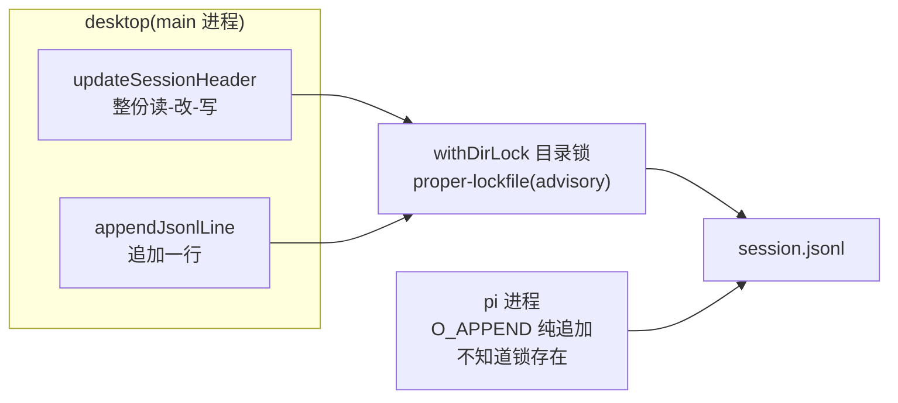
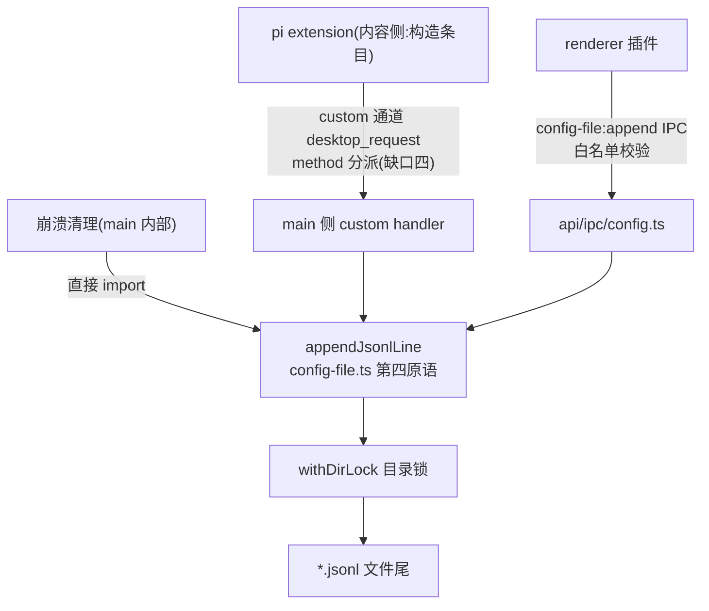

# JSONL 追加原语：appendJsonlLine 设计

子 agent 调度设计（subagent-scheduling.md）§7 审查出五个框架缺口，本文是缺口六的落地设计：给配置读写层加第四个原语 `appendJsonlLine`，让"往 JSONL 文件末尾追加一行"成为框架能力。它和 session-header-custom.md（缺口五，头行 custom 字段）是姊妹篇——一个管头行，一个管行尾。

## 1. 问题：session 文件要追加，框架只会整写

### 1.1 两个追加场景

- **spawn/done 记录写父 session 文件**。子 agent 调度里，父 agent 调 spawn_subagent tool 后，要往父 session 文件末尾追加一条 `custom_message` 条目（`customType: "subagent_spawned"`，子 agent 完成时再追加 `subagent_done`），timeline 读文件后把它渲染成 spawn 卡片（subagent-scheduling.md §5.4、§6.2）。条目由 pi extension 构造（跑在 pi 进程内的底座扩展，区别于桌面插件），desktop 负责落盘；条目类型本身是内容概念，本文的原语不认识它们（§2.1）。

- **崩溃清理写子 session 文件**。父 agent 进程崩溃时，desktop 把仍活着的子 agent 逐个 kill（哪些活着，sub-agent 功能的 main 侧组件 SubAgentStore 的账上有——它持有全部子 agent 进程与各自的 session 路径），并往每个子 session 文件追加一条 `subagent_aborted` 记录标明死因（subagent-scheduling.md §3.4、Q12）。此时子进程已死，写文件的只能是 desktop。

- 两个场景的共同点：**往一个 JSONL 文件末尾追加一行，而这个文件的另一个写者（pi 进程）整个会话期间都在写**。这是本文要解决的问题的精确形状。

### 1.2 现有三原语全是整份 JSON 语义

- `core/application/config/config-file.ts` 现有三个原语：`withDirLock`（锁目录）、`readJsonFile`（整读）、`writeJsonFile`（整写，deep/replace 两种模式）。它们服务 settings.json、models.json 这类"整份读改写"的 JSON 配置文件，全文 54 行，没有第四个原语。

- 用 `writeJsonFile` 写 session 文件在两个维度上都是错的。语义上，session 文件是 append-only 的 JSONL，整份覆盖违背它的格式契约；并发上，"读-改-写"在 pi 进程持续追加的背景下必然丢行——desktop 读完旧内容、pi 追加一行、desktop 把旧内容写回去，pi 那行被吞。

- JSON 整写和 JSONL 追加是两种不同的并发模型。整写需要"读-改-写整体进锁"才安全；追加只有"写一行"这一个动作——追加对追加的安全性不靠锁（O_APPEND 原子性，§4.2），只有撞上整写时才需要同一把锁排队（§4.1）。原语库里缺的正是后者。

### 1.3 两个写入者模型

- session 文件的写者不止 desktop。pi 进程从会话开始到结束一直在往文件追加：消息、工具调用、状态条目。pi 不知道、也不该知道 desktop 的锁存在——proper-lockfile（npm 包，`withDirLock` 的底层实现）是 advisory lock，只约束愿意配合的写者。

- 所以这个原语的设计问题不是"怎么加锁"——锁只管得住 desktop 自己。真正的问题是：**在锁管不到另一个写者的前提下，怎么保证两边都写不坏**。§4 全部在回答这一个问题。

## 2. 抽象：追加是机制，条目是内容

### 2.1 原语中性

- 签名：`appendJsonlLine(absPath: string, entry: Record<string, unknown>): Promise<void>`。entry 是开放形状——原语不认识 `custom_message`、`subagent_spawned`、`subagent_aborted`，那些是内容层（sub-agent 插件、pi extension）的概念。

- 这是机制/内容分离在文件写入上的落点：desktop 提供"追加一行"的机制，条目里装什么由内容侧决定。原语和它的 IPC 通道都不校验条目形状、不枚举 customType——一旦校验，内容就渗进了内核。

### 2.2 第四个原语，扩展不是替代

- `appendJsonlLine` 与既有三原语并列，不改动其中任何一个。特别地，`updateSessionHeader`（session-scanner.ts:236-284）保持整份读-改-写不动：它改头行 + 追加 session_info 条目（底座记录会话名的条目类型），是锁内**一次** writeFile 完成的（:282），原子性正好；拆成"整写 + append 两次写"反而引入中间态。不为了复用而复用。

### 2.3 落 config-file.ts，不落 session-scanner

- 三个理由：`withDirLock` 在 config-file.ts，新原语要用它；唯一的 IPC 消费方 `api/ipc/config.ts:6` 已经从 config-file.ts import，handler 加一行转调即可；原语是通用 JSONL 能力，不专属于 session——今天服务 session 文件，明天服务任何 JSONL。

- 代价是头注释要从"通用 JSON 配置文件读写"扩一句。这个文件的职责早已超出 config（session-scanner、skill-toggle 都 import withDirLock），边界模糊是既有事实，本原语不扩大它。

## 3. 原语设计

### 3.1 签名与逐参数决策

```typescript
/** 追加一行 JSONL。与 writeJsonFile/updateSessionHeader 同一把目录锁串行;
 *  文件尾无换行先补换行(修复崩溃残留的撕裂尾);文件不存在则创建。
 *  entry 开放形状——原语中性,条目形状(custom_message 等)是内容层的事。 */
export async function appendJsonlLine(
  absPath: string,
  entry: Record<string, unknown>,
): Promise<void>
```

- **entry 不收泛型**。给原语加 `<T extends SessionEntry>` 之类的约束是把内容概念钉进机制层，和 §2.1 的立场直接冲突。

- **返回 void**。对照 `config-file:set` 的 handler 写完后回读整份返回（api/ipc/config.ts:51）——那对几 KB 的设置文件成立，对可能几 MB 的 session 文件不成立。追加的内容调用方自己知道，不需要回读确认。

- **async**。`withDirLock` 是 async 的，原语自然 async。内部写用 `fs/promises` 的 `appendFile`（全框架写路径统一异步）；换行边界检查用同步 syscall 读 1 个字节——先例是 `readSessionToolConfig`（session-scanner.ts:370-389）：发送消息前每次都要读 toolConfig，它用 openSync/readSync 只读文件头 8KB 拿头行，不整读大文件。读尾 1 字节是同一套手法的镜像。

### 3.2 序列化：单行是格式语义

- `JSON.stringify(entry)` 不带第三参数。`writeJsonFile` 用 `JSON.stringify(data, null, 2)` 输出带缩进的多行 JSON——那对整份 JSON 是对的，对 JSONL 是格式错误：一行一条是这个格式的定义。不带缩进的序列化结果必然单行（字符串值内的换行被转义，输出除结构外没有裸换行）。

- 这个差异要写进原语注释。两个原语同处一个文件，一个缩进一个不缩进，不写清理由，后来者会当不一致"修"掉。

### 3.3 换行边界三形态

- 追加前读文件尾部 1 个字节（`openSync` + `readSync(fd, buf, 0, 1, size - 1)`），三种形态三种处置：文件为空（size 0）直接写；尾字节是 `\n` 直接写；尾字节不是 `\n`，先补一个 `\n` 再写。

- 第三种形态是修复不是常规：正常写者（pi、desktop）每条 entry 都是带 `\n` 的完整行，撕裂尾只可能来自写到一半被杀掉的进程。补 `\n` 之后，那半行变成一行非法 JSON，读取侧跳过它（§4.4），追加的新行干净独立。

- `updateSessionHeader:279` 有一句同构处理（`if (!rest.endsWith("\n")) rest += "\n"`），但那是"内存里拼整份内容"的语境，这里是"文件尾部"的语境——手法同构、语境不同，两处各自保留，不合并且不互相调用。

### 3.4 文件不存在：创建语义

- 原语跟随 `fs.appendFile` 的默认行为：文件不存在就创建。对齐同文件 `writeJsonFile:49` 的创建语义（`mkdirSync` + `writeFile`，对不存在的文件直接创建）。

- "session 文件必须已存在"是两个 session 场景的**调用方前提**，不是原语要保证的性质。知情人是调用方：SubAgentStore 握着自己 spawn 出来的路径，崩溃清理从进程池的账上拿路径。它们要校验，自己一行 `existsSync`，报错信息也比原语的通用报错准确（"子 agent sub-1 的 session 文件丢失"比"文件不存在"有用得多）。原语保持中性，场景前提留给场景层。

- 注释写明"不存在则创建"，免得被当疏漏修掉。

### 3.5 错误语义：抛错，呈现归接入路径

- 锁超时（`withDirLock` 重试 3 次后放弃）、磁盘满、权限不足、entry 无法序列化（循环引用、BigInt）——原语一律抛错，不吞、不转 boolean。

- 三条接入路径各自决定怎么呈现：renderer IPC 路径是 rejected promise；custom 通道路径回一条带 error 的响应消息（`desktop_response`，通道见 §5.2），extension 据此把它挂起的 spawn_subagent tool 调用 reject 掉；main 内部路径（崩溃清理）记 log 继续清理下一个。原语不替调用方决策。

## 4. 锁与并发



### 4.1 锁域：append-vs-rewrite 才是真问题

- desktop 侧对 session 文件的写有两种：rewrite（`updateSessionHeader` 整份读-改-写）和 append。真正危险的一对是它们俩：append 落在 rewrite 的读-写窗口里，追加的行会被整份覆盖吞掉，无任何报错。所以 append 必须和 rewrite 共用同一把锁——`withDirLock(dirname(absPath))`，原样复用，一行锁逻辑不用新写。

- append-vs-append 不依赖锁也安全（O_APPEND 语义，§4.2），锁在这里的额外收益是**顺序确定性**——同一调用方 await 串行发起的"先 spawn 后 done"，锁按到达顺序落盘，不会交错（跨调用方并发不保证业务语义顺序，见 Q4；两个业务场景实际都不存在跨调用方写同一文件）。成本是毫秒级排队，没理由省。

- 锁的粒度是目录不是文件，比需要的粗：同目录不同文件的写也互斥。这是既有惯例——`deleteSessionFiles`（session-scanner.ts:302-318）就是按目录分组加锁；session 文件按 cwd 分目录，同目录高频并发写在真实负载下不存在。对齐惯例，不造新粒度。

- `withDirLock` 的消费者已有五家（config-store、models-store、pi-settings-store、skill-toggle、session-scanner），`appendJsonlLine` 是第六家。锁的实现仍在一处，换锁库只改一处。

### 4.2 pi 不在锁内：双侧纯追加 + O_APPEND

- pi 进程写 session 文件不经过这把锁。desktop-vs-pi 的安全性靠另一个性质兜住：**双方都是纯追加写者，每次写都带 O_APPEND 标志**（open 的追加模式：write 前先把偏移定位到文件尾，"定位 + 写入"是一个原子动作）。两个进程同时追加，行与行可能交错出现，但任何一行内部不会撕裂。

- 分场景看。extension 往父 session 文件追加 spawn/done 条目时，父 pi 活着且正在写——双写者纯追加，安全。崩溃清理往子 session 文件追加时，子 pi 已经过 desktop 的停止链（先 SIGTERM 后 SIGKILL）杀净，desktop 是唯一写者——零竞态（subagent-scheduling.md Q12 已论证这条路径）。

### 4.3 换行检查与并发写的竞态为什么无害

- 检查与使用之间确实存在一个竞态窗口（TOCTOU）：desktop 读尾字节 → pi 恰好追加一行 → desktop 按过时的尾字节决策。关键不是这个窗口存不存在，是它的最坏后果是什么。

- 决策要出错，desktop 必须读到"半行"——pi 那条 entry 的单次 write 只可见了一半。对 KB 级 entry 的单次 write 系统调用，内核对读者的可见性以整个 syscall 为界：要么没拷完（读到旧尾，是上一个完整行的 `\n`），要么拷完（读到新尾，也是 `\n`）。两种结局的决策都是"直接写"，都正确。

- 就算这个论证在某个文件系统上不成立，后果也有界：desktop 误判补一个 `\n`，文件里多一个空行，`readSession` 读取时空行跳过（§4.4）。竞态的最坏形态是一个无害的空行，不是撕裂。

- 唯一真正能看到非 `\n` 尾字节的情形，是上一个写者写到一半崩溃——而此时补 `\n` 本来就是修复语义（§3.3）。

### 4.4 读取侧容忍是最后兜底

- `readSession`（session-scanner.ts:325-366）解析 JSONL 时，空行直接跳过（:336），单行 JSON 损坏跳过（:345 的 catch），都不拖垮整体读取。

- 这是并发论证的最后一层：前三层（同锁串行 desktop 写者、O_APPEND 兜住 pi 写者、换行检查竞态无害）保证事故几乎不发生；这一层保证即使发生了，最终形态最多是一行坏 JSON 被静默跳过，会话照常打开。

## 5. 接入：一个原语三条路径

### 5.1 总览



- 原语只有一处实现，接入路径有三条，彼此独立、可各自先行。三条路径在两个维度上分开：调用方能不能直接 import（main 进程内外），和条目内容由谁构造（机制侧还是内容侧）。

### 5.2 pi extension → custom 通道 method 分派

- pi extension 跑在 pi 进程里，够不着 `window.pi`、发不了 Electron IPC——它唯一的通道是 stdout 上的 custom 消息（desktop↔pi 的能力调用通道，desktop 侧带 method 分派表；属缺口四，协议细节见 subagent-scheduling.md §2）。所以 spawn/done 条目的真实链路是：extension 构造好条目 → 经 custom 通道发 `desktop_request`（method 取名如 `append_session_entry`，最终名随缺口四落地时定）→ desktop main 侧的 method 分派表 → 调 `appendJsonlLine` 落盘；结果经配对的 `desktop_response`（同 id 回写）返回，失败时其中带 error（§3.5）。

- 这个 method→handler 分派表是本设计周围**唯一的注册点**：能力按名字登记，调用方报名字、不认识实现。它在缺口四落地时成形；subagent-scheduling.md §8.4 的 capability-registry 是它的第三阶段推广，开放给第三方插件注册 desktop 能力。

- 为什么条目必须由 extension 构造、desktop 不能代写：desktop 若直接写 spawn 条目，就得认识 `subagent_spawned` 这个内容概念——机制污染。extension 是内容侧，条目形状归它；desktop 是机制侧，追加动作归它。这也是 subagent-scheduling.md §5.4"extension 经 IPC 请求 desktop 追加"的精确含义——那个"IPC"指 custom 通道，不是 Electron IPC。

- 依赖关系要说清：这条路径要等缺口四（custom 通道）落地接通才可用；原语本身不依赖缺口四——原语和 §5.3、§5.4 两条路径可以先行落地、先行验收（§6 的验收用例不经过 custom 通道）。

### 5.3 renderer 插件 → config-file:append IPC

- 通道常量 `configFile.append` / `"config-file:append"`，对齐 configFile 组既有命名（get/set/getLayered/...，ipc-channels.ts:17-24）。handler 落在 api/ipc/config.ts，复用 `resolveConfigFilePath` 白名单（:37-43）——`~/.pi/agent/` 已在 `paths.piAgentDir` 前缀内，白名单零改动。preload 暴露 `configFile.append`：`append: (path: string, entry: Record<string, unknown>) => Promise<void>`。

- handler 里不调 `broadcastSettingsChanged()`。那个广播是"settings.json 变了、设置页刷新"的语义（对照 `config-file:set`，api/ipc/config.ts:50），session 文件追加不是设置变更，广播只会误触发设置页刷新。

- 感知问题诚实标注：session 域**没有文件 watcher**——sessions-list 的列表刷新由内核事件驱动（main 进程广播的会话生命周期事件；sessions-list/renderer/index.tsx:90-99 里 sessionStart/messageEnd 触发 reload），不是 chokidar。所以文件变化本身不产生任何 UI 通知：append 落盘，开着的 timeline 不会因为"文件变了"而出现新行。主链路里用户能看到 spawn 卡片，靠的是消费链路自己的事件流（缺口四的 desktop_event、插件间事件），不是文件感知。renderer IPC 路径同理：调用方自己知道 append 成功，自己刷新。原语只写，不通知。

- 当前 sub-agent 链路里这条路径没有消费者（spawn/done 走 §5.2，清理走 §5.4）。仍然暴露它，依据是 subagent-scheduling.md §7.6/Q9 已把 `configFile.append` 定为框架契约的一部分；成本是三行（通道常量 + handler 转调 + preload 暴露），通用 JSONL 追加是桌面插件的合理能力。

### 5.4 main 内部 → 直接 import

- 崩溃清理（kill 孤儿子 agent 后写 `subagent_aborted`）跑在 main 进程内，直接 import `appendJsonlLine`，不经任何 IPC。这是三条路径里唯一"调用方和实现同进程"的，也是唯一写时不存在 pi 竞争者的（§4.2）。

- 注意这里的调用方不是内核，是 sub-agent 功能的 main 侧组件（SubAgentStore）——条目形状的知识仍在内容侧（功能代码）手里，`appendJsonlLine` 和它的 IPC 通道自始至终不认识 `subagent_aborted`。§5.2 说"desktop 代写 spawn 条目是机制污染"，禁止的是**内核机制**认识内容；崩溃清理时 pi 侧的内容构造者（extension）已随进程死亡，只能由同功能的 main 侧内容代码接手。边界没破——破的只是"内容代码一定在 pi 进程里"这个巧合。

### 5.5 什么不该注册

- **原语不包接口、不进注册表**。追加一行 JSONL 的实现只有一种，没有第二个实现要替换、没有开放集合要登记。给它包"接口 + 注入 + 注册表"是把一次函数调用变成三层间接。`withDirLock` 五家直接用、没人给它造注册表，就是内核里的先例。这和 §5.3 说的"框架契约"不冲突：契约的是通道名与参数形状（wire contract），不是实现形式。

- **条目形状不进内核**。不为 `custom_message` 建 schema 校验或类型注册表——那是内容，内核不认识它。条目形状的契约由内容两侧（sub-agent 插件和 extension）自己共享，内核只保证"一行合法 JSON 落进文件末尾"。

## 6. 验收

### 6.1 原语级

- 连续追加三次：文件多三行，逐行 `JSON.parse` 成功且字段一致。
- 对无尾换行的文件追加：新行不粘连；被补 `\n` 的撕裂半行成为一行坏 JSON，`readSession` 读取时跳过（:336/:345 既有行为），不拖垮整体。
- 对空文件追加：恰好一行。
- 对不存在的文件追加：创建并写入一行（§3.4 已拍板）。

### 6.2 并发级

- append 与 `updateSessionHeader` 对同一文件并发：对同一文件交错发起 20 次 append 与 20 次 updateHeader（交替改 pinned/archived，`Promise.all` 并发），最终文件须含全部 20 条追加行（逐行可解析）且头行保留修改——目录锁串行，互不吞行。

### 6.3 IPC 级

- 白名单外路径调 `config-file:append`：抛"configFile 路径越界"（`resolveConfigFilePath` 既有行为）。
- append 不触发 `settingsChanged` 广播（§5.3）。

## 7. QA

**Q1：append 和 `deleteSessionFiles` 删同一个目录下的文件，撞上会怎么样？**

同一把目录锁串行，不撕裂。删先 append 后：文件按创建语义重建、只含新行——这和"pi 进程 append 复活已删文件"是同一类既有边界（sessions-list 的 deleteAll 剔除活跃会话正是防这个，sessions-list/renderer/index.tsx:150-152），不新增处置。append 先删后：追加的行随文件删除，符合删除语义。

**Q2：Windows 上这套并发论证还成立吗？**

写者间论证成立：Node 的 `appendFile` 在 Windows 同样以追加模式打开，行级不撕裂。§4.3 的读者可见性论证是按 Linux/macOS 的页缓存行为给的；Windows 上若可见性边界更弱，最坏后果已被兜住（多一个空行或一行坏 JSON，读取侧跳过，§4.3/§4.4）。macOS 是目前唯一验证过的开发平台（README §2.1），Windows/Linux 未实测——这是全项目同一风险基线，不是本原语新增的风险。

**Q3：entry 里有循环引用或 BigInt，序列化失败会怎样？**

`JSON.stringify` 当场抛错，原语不 catch——按 §3.5 由各接入路径呈现。传可序列化形状是 entry 构造方（extension、插件）的责任；原语不替内容侧做防御性序列化。

**Q4：对同一个文件连续 append 多次，顺序有保证吗？**

分两层。同一调用方 await 串行调用：顺序就是调用顺序，锁排队保证。跨调用方对同一文件并发：顺序是锁的到达顺序，不保证业务语义顺序——需要严格先后（如先 spawn 后 done）的场景由调用方自己 await 串行。实际两个业务场景都不存在跨调用方写同一文件：父 session 文件只有 extension 链路写，子 session 文件只有崩溃清理链路写。

**Q5：为什么 IPC 通道挂在 configFile 组，不新起一个 sessionFile 组？**

通道按机制归组，不按内容归组。configFile 组是"路径白名单内的文件读写"这个机制面，append 共享同一把白名单和同一套越界报错；写进的是 session 文件这件事是调用方的事，不进通道命名。新起 sessionFile 组只会把白名单逻辑复制一份，还把"通用 JSONL 能力"误标成"session 专用"。

**Q6：符号链接能绕过白名单吗？**

`resolveConfigFilePath` 只做前缀字符串匹配，不解 realpath——白名单目录内若存在指向外部的 symlink，追加会落到真实目标上。这是既有白名单的既有边界（`config-file:get/set` 同样受影响），不是本原语引入的；要不要加 realpath 校验是独立议题，不随本设计走。

**Q7：这个原语会被用来写 session 文件以外的 JSONL 吗？**

会，这是设计意图（§2.3）——原语通用，落点范围由白名单限定（`~/.pi-desktop/`、`~/.pi/agent/`）。范围内任何 JSONL 文件都可追加；条目形状永远不归内核管。
