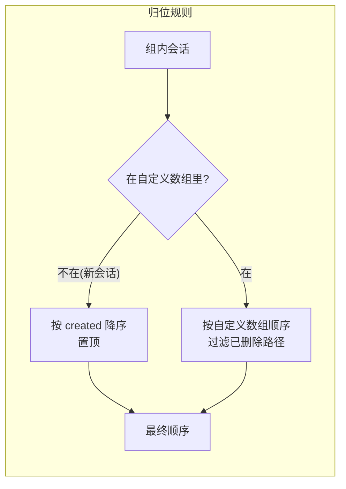

# 会话列表排序稳定化与收藏 fork 闭环

会话列表在并行跑几个会话时顺序乱跳，收藏 fork 完一个新会话后用户看不到任何反馈。三件事一起修：列表按创建时间保底排序、组内允许拖拽自定义顺序、收藏 fork 完成后自动切过去并提醒。改动全部落在 sessions-list 和 session-bookmarks 两个插件里，内核不切刀。

## 1 问题与目标

### 1.1 并行会话顺序为什么会乱跳

列表现在的排序键是 `modified`——最后一条 entry 的时间（`src/core/application/sessions/session-scanner.ts`，`lastEntryTime(content) ?? stat.mtime`，然后 scanner 里 `sessions.sort((a, b) => b.modified.localeCompare(a.modified))`）。这个键对单会话是稳的，对并行会话是灾难：

- 四五个会话同时跑时，每个 `messageEnd` 都会改写该会话的 `modified`。
- sessions-list 的 `onKernelEvent` 订阅在 `messageEnd`／`agentSettled` 到达时触发 `reload()` 全量重拉。
- 重拉回来按 `modified` 重新排——谁最后说完话谁跳到组首，刚说一半的又掉回去。

用户看到的是列表在自己动，想点的那一行在鼠标底下跑了。排序键本身不该依赖"谁最近说过话"这种持续刷新的值。

### 1.2 收藏 fork 后用户体验断在哪

`forkFromBookmark` 现在做完 `ctx.tree.forkFromSession` 就完了。框架内部其实已经把会话切过去了（`forkFromSession` 里 `setContext` 和对账后各 dispatch 一次 `sessionStart`，renderer 的 `onEvent` 钩子自动 `setCurrentSessionPath`），但用户感知不到：

- 没有人知道切过去了——没有提醒。
- 切过去后 timeline 顶部从头渲染，用户不知道自己 fork 到哪条消息为止——没有定位。
- 新会话出现在列表什么位置不可预期——按 `modified` 排它应该在组首，但列表照样在跳（见 1.1）。

### 1.3 目标态

- 组内排序默认按 `created` 降序——创建时间是文件落盘后就恒定的值，列表不再自己动。
- 用户可以在组内拖拽排自己的顺序，拖出的顺序持久化，reload 后原样恢复。
- 新会话（含 fork 产物）永远顶到所在组的最前面。
- 点收藏 fork 完，自动切到新会话、timeline 滚动到锚点消息、toast 提醒"已从收藏创建新会话"。

## 2 会话列表：created 保底 + 组内拖拽

### 2.1 排序分两层，scanner 不动

scanner 层（`session-scanner.ts`）维持按 `modified` 降序输出——这是它给下游的原始数据，sessions-list 是它唯一的列表消费方，但 scanner 不只服务排序，`modified` 字段本身还有别的用途（分组桶判定、副标题显示）。排序修正全部放在 sessions-list 的 renderer：拿到列表后在 `buildGroups` 之前按 `created` 降序重排进组，组内再应用自定义序。内核不切刀，符合开闭原则。

具体到代码：`src/plugins/sessions/sessions-list/renderer/index.tsx` 的 `applyList` 之后、进 `buildGroups` 之前，对 `topLevel` 做一次稳定的 `created` 降序排。然后每组内部按 §2.2 的归位规则重建最终顺序。

### 2.2 自定义序的归位规则

自定义序按组存，每组一个 path 数组，记录用户拖出的完整顺序。重建一组的顺序时走三步：

1. 先把组里**不在**自定义数组里的会话按 `created` 降序排好，放在最前——新会话（包括 fork 产物、刚创建的会话、从别组漂移过来的会话）天然在这里，永远顶到组首。
2. 再把自定义数组按记录顺序摊开，过滤掉已经不在组里的路径（被删的、被移走的、漂移了的），接在后面。
3. 两步的结果拼起来就是最终渲染顺序。

这个规则的好处是不需要"插在实际位置"这种要维护相对位置的复杂归位——新会话置顶、老顺序不动，两者各占一段，互不干扰。代价是用户没法把一个新会话拖到老会话中间后指望下一个新会话插到它上面——但下一个新会话置顶本来就是可预期的行为，用户看一眼就懂。



### 2.3 持久化：插件自己的 config，不碰会话文件

自定义序存 sessions-list 插件的 project 级配置：`ctx.config` 的 `customOrder` key，落点是 `<cwd>/.pi-desktop/config/sessions-list.json`，形状：

```json
{
  "customOrder": {
    "pinned": ["/path/a.jsonl", "/path/b.jsonl"],
    "today": ["/path/c.jsonl"],
    "yesterday": [],
    "last7days": [],
    "earlier": [],
    "archived": []
  }
}
```

不写入会话 JSONL 头行（`custom.order` 之类的方案）：拖拽一次会产生几十个头行改写，本身就会刷新 `mtime`、可能干扰别的读方；而且顺序是"这个项目里我怎么看"的偏好，跟着项目配置走语义正确，跟着会话文件走反而把视图状态混进数据。`ctx.config` 统一通道已经管读／写／缓存，插件不用自己碰路径。

### 2.4 拖拽交互：每组一个 DndContext

组内拖拽的范围约束用"每组一个独立 `DndContext`"实现——dnd-kit 的 SortableContext 只接收本组的 path 数组，物理上不存在跨组拖拽，不需要"拖过去再弹回"的边界处理。dnd-kit 已在依赖里（`@dnd-kit/core`/`sortable`/`utilities`），notes 插件（`src/plugins/project/notes/renderer/index.tsx`）有现成的 `useSortable` + `DndContext` + 拖动手柄套法，直接照着写。

- **手柄只在 hover 行尾出现**，只把手柄元素绑 `listeners`，整行不绑——点击选中、右键菜单、hover 的置顶/归档/删除按钮都不受影响。
- **搜索平铺模式下禁用拖拽**——搜索结果是非全量子集，拖出的顺序写回去没有意义。
- **拖动结束时**把该组当前的完整可见顺序写成 `customOrder[groupId]`，一次 `ctx.config.set` 落盘。
- **archived 组也支持**——默认折叠不代表不能排序，展开后同样可拖。

### 2.5 时间漂移的边界

时间四档是按 `created` 划桶的：今天创建的会话三天后会出现在"更早"组。漂移发生时：

- 它在原组的自定义序留在原组数组里（该路径已从原组消失，§2.2 第 2 步的过滤会清掉它）。
- 它进入新组时不在新组的自定义数组里，按规则顶到新组组首。

这是可接受的边界——漂移一天最多发生一次，组首位置不算打扰。

## 3 收藏 fork：打开、定位、提醒

### 3.1 打开：已经自动，零代码

`session-store.ts` 的 `forkFromSession` 内部完成两次 `sessionStart` dispatch：一次在 `setContext(cwd, intermediate)`，一次在 fork 对账成功后删中间副本时补播。renderer 侧 `src/api/renderer/stores/session-store.ts` 的 `onEvent` 钩子收到 `sessionStart` 就 `useUiStore.getState().setCurrentSessionPath(sf)`——fork 产物路径最终落在 `currentSessionPath` 上，timeline 重 resync，sessions-list 的 `useEffect`（依赖 `currentSessionPath`）重拉列表、自动高亮到新会话。这一段不需要任何新代码，调研已确认生效。

### 3.2 定位：invoke scrollTo

`forkFromBookmark`（`src/plugins/sessions/session-bookmarks/renderer/index.tsx`）在 `await ctx.tree.forkFromSession(...)` resolve 后加一行：

```typescript
ctx.events.invoke("timeline:scrollTo", { messageId: bm.entryId });
```

**目标 channel 是现成的，不用写 handler**。三处既有机制各自锚定（锚点用可 grep 的符号，行号会随编辑漂移）：

- **channel 声明**：`src/plugins/sessions/timeline/renderer/index.tsx` 的 `export const channels = ["timeline:bookmarkRequested", "timeline:scrollTo"]`（文件顶部），框架加载时自动注册。
- **消费 handler**：同文件里 `ctx.events.on("timeline:scrollTo", ...)` 的订阅 effect，payload 形状 `{ messageId?: string; position?: "top" | "bottom" }`，按 `messages.findIndex(m => m.id === p.messageId)` 找行并 `virtuosoRef.scrollToIndex({ index: idx, behavior: "smooth" })`。
- **时序兜底**：同文件 `pendingScrollRef`——handler 里 messageId 当前不在列表时写入 `pendingScrollRef.current = { messageId: p.messageId }`，旁边一个 `useEffect([messages])` 在每次消息数组更新后重放 `findIndex`，找到即滚并清空。fork resolve 后 timeline 的 resync 可能还没完成（新会话基线还在路上），invoke 先到——payload 暂存进 pendingScrollRef，resync 完成那一帧自动定位，最多差一帧，用户无感知。

**entryId 和 message.id 是同一命名空间，且过 fork 不变**。证据链四步，每步有原文：

1. **收藏落 entryId**（`timeline/renderer/index.tsx`，bookmark 按钮 onClick 原文）——payload 里的 entryId 就是当条 `NeutralMessage.id`：

   ```typescript
   ctx.events.emit("timeline:bookmarkRequested", { sessionPath: currentSessionPath!, entryId: message.id!, preview });
   ```

2. **message.id 的来源**（`src/core/domain/events/session-state.ts` 的 `sessionEntryToNeutral`，domain 侧 entry→NeutralMessage 的唯一投影函数，注释原文）：

   ```typescript
   // 条目 id(JSONL 行级 / entryAppended.entry.id)提升为 NeutralMessage.id——patch/书签/滚动的稳定锚点。
   const entryId = typeof e.id === "string" ? e.id : undefined;
   // ...
   const id = entryId ?? (typeof m.id === "string" ? m.id : undefined);
   ```

   条目级 `id` 提升为 `NeutralMessage.id`——timeline 滚动查找用的 `m.id` 和 JSONL 条目 `id` 是同一个值。

3. **fork 保 id**（底座分发包 `@earendil-works/pi-coding-agent`，装于 `~/.pi-desktop/pi/`；`dist/core/session-manager.js` 的 `createBranchedSession(leafId)` 处理分支路径的原文）：

   ```javascript
   const pathWithoutLabels = [];
   let pathParentId = null;
   for (const entry of path) {
       if (entry.type === "label")
           continue;
       pathWithoutLabels.push({ ...entry, parentId: pathParentId });
       pathParentId = entry.id;
   }
   // ...
   this.fileEntries = [header, ...pathWithoutLabels, ...labelEntries];
   ```

   `{...entry, parentId: pathParentId}` 是展开赋值：`entry` 的全部字段（含 `id`）原样保留，只有 `parentId` 被重链成新分支的上一条；`pathParentId = entry.id` 也证明它读的就是原 `id`。header 是新写的（新 session id、当前 timestamp），但那只是会话头，branch 里每条 entry 的 id 不动。

4. **fork 产物回流走同一投影**（`src/core/application/orchestrations/resync.ts`：新会话基线到达时 `.map(sessionEntryToNeutral)`；`session-scanner.ts` 注释直写"全部条型走 domain 的 sessionEntryToNeutral 映射"）——fork 产物里那条 entry 重新投影出的 `NeutralMessage.id` 仍是同一个 entryId，`findIndex` 必命中。

锚点消息一定在 fork 产物里——fork `"at"` 的语义就是"保留到锚点这条消息为止"，锚点是 fork 产物里唯一需要定位的目标。session-bookmarks 的 `plugin.json` 已声明 `dependsOn: ["timeline", ...]`，invoke 别人的 channel 合规（`timeline:scrollTo` 是 invoke 语义，调用方不需权属——session-tree 的 `locate`（`session-tree/renderer/index.tsx:66`）就是这么用的）。

### 3.3 提醒：toast

`BookmarksTab` 挂一个共享 `Toast` 组件（`packages/react` 已导出，portal 到 `document.body`，2.5 秒自动消失），fork 成功后弹：

```tsx
{toast && <Toast message={toast} onClose={() => setToast(null)} variant="success" />}
```

文案走 i18n，四语言各加一条 `bookmarks.forkCreated`：

| 文件 | 文案 |
|:---|:---|
| `src/plugins/sessions/session-bookmarks/locales/zh-CN/bookmarks.json` | 已从收藏「{{label}}」创建新会话 |
| `src/plugins/sessions/session-bookmarks/locales/en/bookmarks.json` | New session created from bookmark "{{label}}" |
| `src/plugins/sessions/session-bookmarks/locales/zh-TW/bookmarks.json` | 已從收藏「{{label}}」建立新會話 |
| `src/plugins/sessions/session-bookmarks/locales/de/bookmarks.json` | Neue Sitzung aus Lesezeichen „{{label}}" erstellt |

skill-manager 已有完全相同的用法（`src/plugins/manager/skill-manager/renderer/index.tsx`），照抄即可。

## 4 QA

**Q：scanner 的 `modified` 排序还留着，会不会有别的地方依赖它拿到"最新消息在前"的列表？**

`sessions.list(cwd)` 的消费方除了 sessions-list，还有 timeline（`timeline/renderer/index.tsx:269`）和 session-colors（`session-colors/renderer/index.tsx:106`）。但这两处都是拿到列表后按 path 查单个会话——找出当前会话的 SessionInfo 取字段用，不吃数组顺序。真正消费"列表顺序"的只有 sessions-list 自己，renderer 重排不影响任何其他消费方。

**Q：会话被置顶／归档后，自定义序数组里的路径残留怎么办？**

置顶或归档会换组，路径从原组消失。§2.2 第 2 步的"过滤掉不在组里的路径"在每次重建顺序时执行，残留路径静默清掉，不写回 config——下次拖拽覆盖写时自然消失。

**Q：拖拽手柄和整行的点击选中、右键菜单、hover 按钮冲突吗？**

不冲突。`listeners` 只绑在手柄元素上（一个 24×24 的图标按钮，hover 行尾才出现），整行的 `onClick`、Radix ContextMenu 的 `Trigger`、hover 出的置顶/归档/删除按钮区域都不在手柄上。dnd-kit 的 PointerSensor 本身要求按下并移动才激活拖拽，单击手柄不会误触发。

**Q：并行会话持续触发 reload 时，拖拽状态会丢吗？**

拖拽状态在 `ctx.config` 里持久化，reload 拉回的是带顺序数组的列表 + config 里的 `customOrder`，§2.2 的规则对两者是纯函数重建——reload 中断拖拽的最坏结果是这次 dragEnd 没写完，用户重新拖一次，已写的顺序不受影响。

**Q：定位的时机——fork resolve 后 timeline 一定 resync 完了吗？**

不一定。`forkFromSession` resolve 时序是：对账 dispatch → resolve，renderer 收到 sessionStart 后还有个 openSession/重 resync 的间隙。timeline 的 `pendingScrollRef` 就是为这个设计的：invoke 到达时 messageId 不在列表里就暂存，`useEffect([messages])` 在每次消息数组更新后重放查找。定位最多延迟到 resync 完成的那帧，用户无感知。

**Q：toast 会不会挡到正在输入的 composer？**

`Toast` portal 到 `document.body` 顶部居中，距顶 `var(--spacing-md)`，带 max-width 480px。composer 在底部，timeline 顶部是面包屑标题栏——toast 出现在标题栏和消息列表之间 2.5 秒，不遮输入区，不遮列表主体。

**Q：`customOrder` 换项目后会带着走吗？**

落点是 `<cwd>/.pi-desktop/config/sessions-list.json`，project 级配置，跟着项目目录走。换 cwd 后新项目的 sessions-list 插件读到的是新项目自己的 config，`customOrder` 天然隔离。

**Q：为什么拖拽不做跨组（拖到 pinned 自动置顶）？**

跨组拖拽需要把"落点在哪组"翻译成"置顶/归档状态变化"——两种语义叠在一个手势上，松手那一刻用户要同时理解顺序变了和状态变了。置顶/归档已有明确的 hover 按钮和右键菜单入口，拖拽只管线内顺序，职责单一。如果以后确实有"拖到 pinned 区"的诉求，再加 cross-group 的 DndContext 是扩展不是修改——组内序的存储结构（每组一个数组）不用变。
