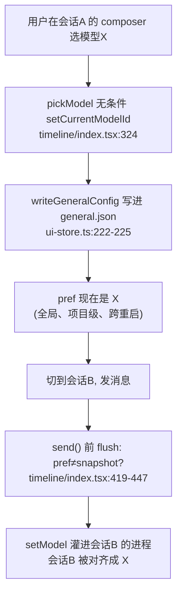
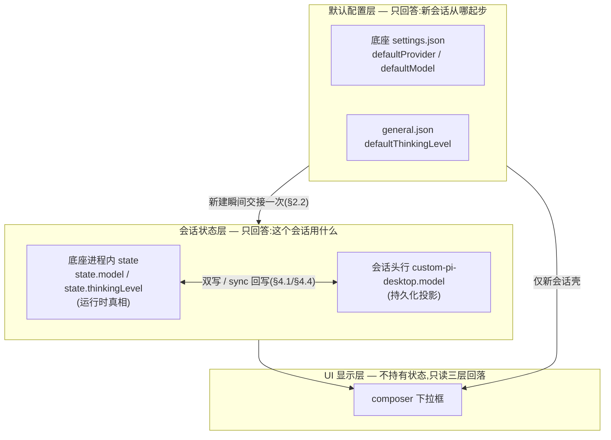
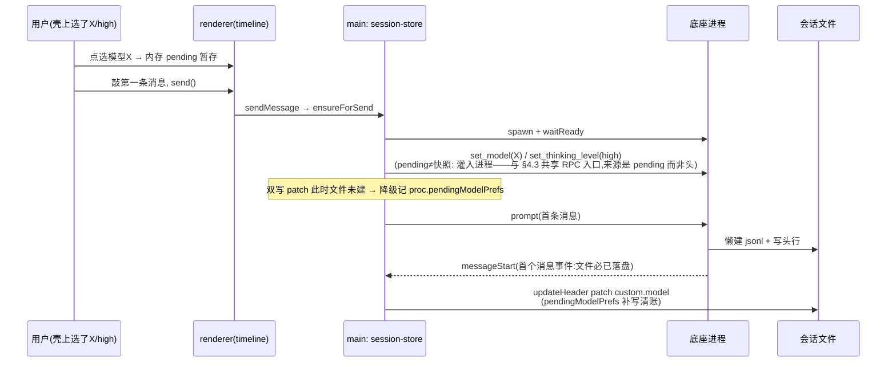

# 会话级模型与思考深度：配置归属翻转

- 在会话A 里把模型切成 X，再切到会话B 发一条消息——会话B 悄悄变成了模型 X。这不是用户误操作，是现状机制的必然结果：会话内切换模型会写进全局配置文件，而每次发消息前，全局配置又被灌回当前会话进程。模型和思考深度的归属关系整个是倒的：全局配置是主，会话是跟随者。

- 本文把归属翻转过来：**默认是配置，会话是状态**。全局只存"新会话从哪起步"的默认值，每个会话自己持有"我用哪个模型、什么思考深度"，持久化在会话文件头行的 `custom-pi-desktop` 开放命名空间里（机制见 session-header-custom.md，本文是它的第二个租户）。pref 机制与 recentSettings 全链退役。

- 本文反复使用的名词，先一次性交代（架构全景见 docs/DESIGN.md，会话头机制见 session-header-custom.md）：

  - **底座**：pi-desktop 经 JSONL RPC（stdin/stdout 上每行一个 JSON 消息）管理的独立 agent 子进程——桌面壳 spawn 它、持有它、kill 它，会话的实际对话在它里面跑。**provider** 指 LLM 供应商（Anthropic、OpenAI 等），**模型**指某 provider 下的具体模型，`provider + modelId` 二元组唯一确定一个对话目标。

  - **思考深度 / thinkingLevel**：底座的推理强度档位（off / low / medium / high 等，可用档位由底座按模型给出，desktop 不自定义档位集）。文中"档位"与它是同一物的口语说法。

  - **会话文件与头行**：每个会话一个 `.jsonl` 文件，第一行是 `{type:"session", id, timestamp, cwd, ...}` 头行，其后每行一条会话条目。`custom-pi-desktop` 是头行里 desktop 私有的开放 map 字段（一个 JSON 对象），顶层 key 分域，写读走目录锁内的域级浅合并——`{k:v}` 只动 k 域、域内整体替换（session-header-custom.md §2）。

  - **pref**：现状要拆除的全局"当前模型/深度"偏好层——renderer 侧 ui-store 的 `currentModelId` / `currentThinkingLevel` 两个字段，前者还持久化进 general.json。它不代表任何会话，却驱动所有会话的对齐，是本文的病根。**recentSettings** 是现状的另一辅助机制：扫该项目最近会话文件取其模型/深度，给新会话做"继承最近使用"的兜底——本文一并退役（§5）。

  - **壳**：已新建、尚未发出首条消息的会话状态——UI 上输入框已可见，但底座懒建文件，jsonl 还不存在，头行无处可写。

  - **timeline / composer**：timeline 是中区消息流插件；composer 是它的输入区组件，模型与思考深度的下拉框都在这里。文中 `timeline/index.tsx` 指 `src/plugins/sessions/timeline/renderer/index.tsx`。

  - **main / renderer**：Electron 的双进程模型——main 是 Node.js 主进程（持有底座子进程、文件读写、session-store）；renderer 是 Chromium 渲染进程（跑 React UI、ui-store 在这侧）。两侧经 preload 暴露的 `window.pi` IPC 桥通信，renderer 的一切文件/进程能力都经 IPC 到 main 执行。

  - **ui-store / session-store**：renderer 侧的 UI 运行时状态中心（zustand store，pref、pending、currentCwd 等在这）与 main 侧的会话编排中心（管底座进程生命周期、RPC、会话文件读写）——前者管"界面现在显示什么"，后者管"会话实际是什么"。

  - **sync / snapshot**：main 侧向底座重拉会话状态（get_state / get_entries）并广播 renderer 的动作；产物快照即 snapshot，`snapshot.state.model` / `state.thinkingLevel` 是进程内实时真相。sync 的触发时机（起进程后、切回活会话、flush 后等）属会话流机制，本文只消费"每次 sync 拿到一份新鲜快照"这个事实。

  - **sessionStart**：底座会话文件就绪的信号事件——底座懒建 jsonl 完成后由 main 侧派发，waitReady 等它判定进程就绪；§4.5 的首发时序也以它为"文件已存在、可以写头"的锚点。本文涉及的底座 RPC 命令只有四个：`set_model` / `set_thinking_level`（同步请求-响应，切模型/深度）、`get_state` / `get_entries`（拉快照）。

  - **rewind**：从某条历史消息分叉重跑的用户操作，内部走 fork 换绑新会话文件。

  - **general.json 分层配置**：`~/.pi-desktop/` 全局层与 `<cwd>/.pi-desktop/` 项目层两层、按顶层 key 合并的配置文件；`defaultThinkingLevel`、`composerApplyTiming` 都是它的键。**composerApplyTiming** 是模型/深度点选的生效时机开关：`"onSend"`（默认）点选先记意图、发消息时生效；`"immediate"` 点选即作用于进程（§4.1）。

  - **cwd**：当前项目根目录（current working directory），会话按它分桶存放，也是配置项目层的锚点。

## 1. 问题：改一个会话的模型，为什么动了全局默认

### 1.1 污染链路：两条管道合流

- 现状的模型/思考深度状态由一个叫 pref 的全局层持有——`currentModelId` / `currentThinkingLevel` 活在 renderer 的 ui-store，其中 `currentModelId` 还持久化到 general.json（项目级分层配置，跨重启存活）。从这个层出发，有两条管道把一次会话内的选择扩散到全局：

- **管道一：切换即写全局配置。** `pickModel`（timeline/index.tsx:323）第一步是无条件 `setCurrentModelId`，后者立刻 `writeGeneralConfig({ currentModelId: id })`（ui-store.ts:222-225）。注意时序：默认 `composerApplyTiming: "onSend"` 模式下 RPC 根本还没发——会话进程对这次选择一无所知，全局配置文件已经改了。用户点的是会话里的下拉框，落盘的是项目级配置，这是"改默认"体感的直接来源。

- **管道二：send 前 flush 把全局值灌回任何会话。** `send()` 开头有一段对齐逻辑（timeline/index.tsx:419-447）：`prefModel !== snapModel` 就 `setModel` 灌进当前会话进程，思考深度同构。也就是说 pref 一旦被会话A 改掉，任何其他会话下一次发消息时都会被"对齐"到它——会话B 自己从未做过选择，选择是从全局管道流进来的。同一份 flush 逻辑在 rewind 路径还有一份独立拷贝（handleRewindSend，index.tsx:363-379），同一逻辑两处复制，改一处忘一处的标准温床。

- **隐蔽支路：思考深度的 flush 源混着全局默认。** send() 里 prefLevel 的取值是 `currentThinkingLevel ?? defaultThinkingLevel ?? "high"`（index.tsx:437）——即使用户从没碰过深度下拉（pref 为空），flush 也会拿全局默认 `defaultThinkingLevel` 去比对快照，不一致就灌。后果：一个刻意调成 low 的会话，下次发消息时被拉回全局默认 high。用户连"我改过什么"都找不到——他什么都没改，是默认值顺着 flush 管道流进了他的会话。

### 1.2 根因：pref 为主、会话跟随

- 两条管道只是症状，病根是归属关系：**会话自身不持有任何模型/深度配置**。真相被拆成两半——全局 pref 持有"当前值"（还持久化），会话进程持有"临时快照"（每次 send 被 pref 覆盖）。会话在这个体系里不是配置的属主，是全局配置的渲染目标。

- pref 机制自身就是一笔糊涂账，两个同性质的东西是两种持久化语义：`currentModelId` 写 general.json，跨重启存活（ui-store.ts:222-225）；`currentThinkingLevel` 只 `set()` 在内存里，重启即丢（ui-store.ts:230-232）。为什么模型选择要跨重启记住、深度选择不用？没有答案——这不是设计出来的差异，是两段代码各自长出来的。归属层糊成这样，上层行为不可能清爽。

- 补救逻辑的存在本身就是结构病的确诊。`revertModelPref` / `revertLevelPref`（index.tsx:313-321）干的事是"flush 失败后把 pref 回退到 snapshot 真值"——pref 和进程状态会经常性不一致，不一致到需要专门的回退函数和 toast 文案来兜底。一个需要常备补救机制的状态层，说明它的权威性和实际状态天然脱节。补丁叠补丁，不如把层抽掉。

## 2. 终态：默认是配置，会话是状态

### 2.1 三层归属各归其位

- 翻转后的状态拓扑只有三层，每层只回答一个问题：

- **默认配置层**保持现状的两个已有字段：底座 settings.json 的 `defaultProvider/defaultModel`（pi-model-manager 插件在管，语义本来就正）和 general.json 的 `defaultThinkingLevel`。它们的消费时机被严格收窄到一个瞬间：新会话起步。已活会话的任何路径都不再读它们。

- **会话状态层**是本文的新增：运行时真相在底座进程（`state.model` / `state.thinkingLevel`，底座本来就有），持久化投影在会话头行的 `custom-pi-desktop.model` 域（§3）。进程与头之间的同步由 §4 的四条路径保证，头随会话文件走——fork、复制、分享、删除，配置的语义自动和文件一致。

- **UI 显示层**不持有任何状态，只是一条优先级读链（§4.2）：pending 优先，其后活会话读进程快照、历史会话读头、新会话读默认。pref 这个层整个消失——不是换个地方存，是这个概念不再存在。

### 2.2 新建瞬间：默认流向会话的唯一交接点

- 新会话的生命周期里，默认配置只被消费一次：壳状态下（还没发过消息）composer 显示默认值；用户若不改，首条消息发出时会话就建在默认模型上。

- "改默认会影响谁"是语义决策不是实现细节，说准：**明确表过态的会话钉死**——头行 model 域有值，冷起时回灌（§4.3）把会话自己记的值灌回进程，改默认与它无关；**从没自定义过的会话不钉死**——头无值，desktop 不做任何对齐，冷起续会话时底座按当时的默认恢复（通常即新默认）。这是系统默认的通行语义：没表态的跟随默认，表过态的保留——也是"头是已生效配置的投影"（§4.4）的自然推论，头只记生效过的值，没记的就是没生效过。注意"底座按默认恢复"是底座自己的行为（读它 settings.json 的默认），不是 desktop 在读默认配置层——desktop 侧对这类会话零参与，默认配置层在 desktop 侧的消费时机仍然只有新会话起步一个瞬间。反方向（改会话）则物理封死：会话内的任何变更不写任何全局文件。

- recentSettings 机制随之退役。它现在的职责是"新会话继承该项目最近一个会话的模型/深度"（session-scanner.ts:167 扫会话文件取最新值，timeline/index.tsx:246-250 消费做显示兜底）——本质是在新建路径上顶替了"默认"的生态位：默认概念不存在，"最近用过"成了事实上的默认。翻转后新建路径的初始值唯一来源是默认配置层，"最近用过"不再参与，整条链（UI 消费、IPC 通道、scanner 函数）逐层删净（§5）。

### 2.3 被否决的补丁选项

- **pref 按 sessionPath 隔离存进 general.json。** 隔离确实能止住会话互相污染，但归属依然是全局配置文件：会话文件被复制/分享/移动后配置留在原项目的 general.json 里，人和配置分家；且每个会话一对键，general.json 变成无限增长的会话登记表，删会话还要回头清理它。隔离的是键，没隔离的是归属。

- **flush 前弹确认框。** "会话B 的模型将被改为 X，是否继续？"——把架构缺陷转嫁给用户每次发消息时消化。管道存在一天，确认框就要弹一天；用户点"总是"之后污染照旧。交互补丁不治归属的病。

- **pref 保留、只在新建时消费。** 听起来是"最小改动"，但 pref 的写入时机一点没变：会话内切模型仍然先写它（onSend 模式下甚至是唯一动作）。只要这个层还在响应会话内切换，它就还是全局污染源，读它的时候少几个入口只是降低了暴露概率，没有拆除管道。归属翻转不接收"层还在、只是少读"的方案。

## 3. 载体：会话头 custom 域

### 3.1 复用 custom-pi-desktop 的三个理由

- **机制零新增。** 会话头行的 `custom-pi-desktop` 开放命名空间（session-header-custom.md §2）就是为一类事生的：写入方往头行写自己的会话级数据。写入走 `HeaderPatch.custom` 域级浅合并（domain/sessions.ts:132-135，`{k:v}` 只动 k 域、域内整体替换），原子性由 `updateSessionHeader` 在目录锁内读-改-写保证，头行超 8KB 有告警兜底。模型配置作为新租户入住，链路一处不动。

- **随文件走，语义自动正确。** 头行是会话文件的第一行：fork 新会话带着它，复制文件带着它，分享 jsonl 给对方也带着它，删会话删文件零残留。这是任何全局文件方案（general.json 子键）和 sidecar 方案都给不了的性质——配置和会话同生共死，不需要任何清理逻辑。

- **底座天然免疫。** 字段名带 desktop 前缀就是防撞底座字段的设计（session-header-custom.md §2.1），底座读会话文件时忽略未知头字段——toolConfig 私有头字段已在生产链路上跑（tool-gate 是底座的工具硬过滤扩展，每次发消息都经一条只读头 8KB 的热路径读 toolConfig），先例充分。

- 这笔账在 session-header-custom.md §1.4 里已经预付过了："下一个租户马上会来……开放命名空间把这类需求一次做完，此后任何租户的域扩展，机制零改动。"模型域是这个预言的第一次兑现——它验证的是命名空间决策本身，本文也因此刻意不加任何机制改动，只加契约。

### 3.2 model 域契约

- 域形状定为单域三字段：`custom-pi-desktop.model = { "provider": "...", "modelId": "...", "thinkingLevel": "..." }`。落盘是 JSON 头行里的一个嵌套对象，代码里的类型是 domain/sessions.ts 新增的 `SessionModelPrefs`（圆心中性类型，契约单源，UI 与 main 两侧都从这里引用）。

- 为什么是单域而不是 model / thinkingLevel 两个域：三个字段回答的是同一个问题——"这轮对话找哪个 LLM、以什么推理强度"。切换场景里它们高频联动（换模型时往往要重选深度，不同模型支持的深度档位不同），拆成两域会让"换模型"这个动作变成两次独立的域替换，中间态（新模型+旧深度）有了落盘机会。单域整体替换正好利用浅合并语义：一次 patch 原子落定，要么全新要么全旧，没有混合态。

- 读取必须窄化。custom 的类型是 `Record<string, unknown>`（domain/sessions.ts:48，开放命名空间的代价），读 model 域走专门的窄化 helper：三字段齐备且为字符串才认，否则当不存在（回落到下一级）。手改文件塞了畸形数据不会炸流程，只是该会话按"无自定义配置"处理——和会话头其他私有字段的容错姿势一致。

### 3.3 被否决的载体选项

- **general.json 加会话子键**（`sessionModels: { [sessionPath]: {...} }`）：§2.3 已否——归属错、无限增长、随文件走全丢，不重复展开。

- **sidecar 文件**（会话路径旁存 `xxx.model.json`）：引入了第二份需要同步的真相源——复制会话要记着复制 sidecar，删会话要记着删 sidecar，重命名会话要跟着改 sidecar 名。每一条都是新的 bug 面，换来的只是"不动会话文件"这个本身就不需要的好处（custom 机制就是为名正言顺动它而设计的）。

- **底座自有的 model_change / thinking_level_change 条目为什么不直接当载体**：会话 body 里确实有这些条目（底座切换时写入 JSONL），但它们是事件流不是元数据——读"当前生效值"要扫全文找最后一条，O(n) 且随会话变长而变慢；头行是 `split("\n")[0]` 一行拿到的 O(1) 锚点（session-header-custom.md §1.5 已论证"元数据在头、事件在体"的分野）。两者分工明确：底座条目服务底座自己的进程内恢复，头行 custom 服务 desktop 侧的显示与冷起回灌（§4.3），不是重复建设。

## 4. 同步：四条路径一个入口

### 4.1 写：双写执行，意图暂存

- desktop 侧所有主动改变会话模型/深度的代码途径收进单一入口：session-store 的 `setModel` / `setThinkingLevel`（底座侧的旁路变更不经过这里，由 §4.4 收口）。翻转后它们内部完成双写——活会话先发 RPC（`set_model` / `set_thinking_level`，进程内立即生效，现有逻辑 session-store.ts:536-547/623-629 不动），**RPC 成功后**再 `updateHeader` 把新值 patch 进头行 model 域——顺序说死：RPC 拒绝即抛错，patch 不发生，头绝不会记下一个从未在进程里生效的值。思考深度进头时与模型同域整体替换：写 `{provider, modelId, thinkingLevel}` 全量三字段，缺的字段从当前快照/头值补齐，保证域内永远完整（§3.2 的原子性约定）。

- patch 头自身失败（锁超时、磁盘错误）的处置：不阻塞、不重试、不报警。RPC 已生效，活会话显示读快照（§4.2）不受影响；头短暂落后属于投影落后的合法态（§4.4 的方向纪律允许落后），下一次 sync 回写自动以进程为真相补平。持久化瞬态故障不该打断用户刚完成的切换动作——收敛路径已存在，不需要第二条。

- renderer 侧的 `pickModel` / `pickLevel` 从此不碰任何全局状态。两种时机模式的差别只在意图的暂存位置与执行时刻：`composerApplyTiming: "immediate"` 是点选即调入口（RPC + 写头一次完成，打断进行中的生成是用户自选）；默认的 "onSend" 是点选只记**内存 pending**——ui-store 按会话 key 暂存，与新会话壳的 override 同一机制（§4.5：壳的 key 是 `new:${cwd}`，活会话的 key 是 sessionPath），send 时才灌入进程并写头。开关保留，语义收窄为"何时作用于进程"，不再承担"写不写全局"的隐含职责。

- pending 走内存而不是头，是用一处取舍换掉一整类竞态：若意图先写头，sync 回写（§4.4，方向是进程→头）会在"已记头、未执行"的窗口里把意图当陈旧投影擦掉——切一次会话就触发 sync，意图必死。意图放内存后，头回归单一性质：**已生效配置的持久化投影**，写头只发生在两个执行时刻（immediate 双写、send 回灌），§4.4 的方向纪律因此无条件成立，不需要"判别这次写头是不是意图驱动"的例外条款。代价是 onSend 意图不跨重启：没 send 就关 app，选择丢失——与壳 override 同一取舍（§4.5），语义自洽：onSend 的本义就是"没 send 就没生效"，没生效的选择不留任何持久痕迹。

- 读取优先级随之明确：**pending > 快照/头 > 默认**（活会话读快照、历史会话读头，分支细则在 §4.2）。send 前的回灌（§4.3）先看 pending，有则灌入 + 写头 + 清 pending（意图执行闭环）；无则比对头与快照做冷起对齐。

- rewind 路径的独立 flush 拷贝（index.tsx:363-379）整段删除——fork 之后走的也是 send，统一从 §4.3 的回灌点过。同一逻辑两处复制的温床就此拆除。

- 失败路径在这里一次说清，因为它横跨双写与回灌两条路径：换模型后旧深度档位可能不被新模型支持（§3.2 的联动场景）。desktop 不做预校验——档位兼容性由底座裁决，`set_model` / `set_thinking_level` 是同步 RPC，拒绝在响应里显形（现有 model 连通性测试即依赖此性质）。处置与底座行为解耦：RPC 显式拒绝 → 沿用现有 toast 链显形（`modelApplyFailed` / `thinkingApplyFailed`），sync 取真值后显示回落到快照；底座静默降级（接受设置但落到别的档）→ 不打扰用户，下一次 sync 回写（§4.4）把头收敛到底座实际生效的值。不赌底座是"拒绝"还是"降级"——和 §4.3 的幂等论证同一姿势，两种行为下终态一致：头与显示最终都等于进程里的真实值。onSend 场景补一条 pending 的处置：RPC 拒绝时 pending **保留**——意图未被执行就不该被吞，显示继续读 pending（用户看到的还是自己选的值），toast 显形告知拒绝原因；用户改值再发即重试（再次走回灌），或切走放弃（pending 随关 app 消亡，§4.5）。这条与"sync 不擦意图"同源：只有执行成功才能消费意图。

### 4.2 读：pending 优先，形态回落

- composer 的显示值按优先级取：**内存 pending**（onSend 意图或壳选择，§4.1/§4.5）优先；其后按会话形态回落——活会话（进程在跑）读 `snapshot.state`（sync 推来的基线，实时真相）；历史会话（进程没起）读会话头 model 域（`SessionInfo.custom`——头行 custom 字段在会话清单类型上的透出——随 listSessions 批量带回，session-scanner.ts:113；timeline 已在消费这个通道做输入区策略匹配，无新增 IPC）；新会话壳读默认配置层。

- 现在的 `revertModelPref` / `revertLevelPref` 补救函数随 pref 一起删除。它们存在的理由是"pref 照显、进程不动"的不一致；回落链里每一级读的都是真值（进程快照或头），显示异常时重新读一遍真值即可，不再需要"pref 回退"这个专门动作——补救逻辑消失的原因不是问题被掩盖，是产生问题的层没了。（RPC 失败时的 toast 显形是另一条链，保留，见 §4.1 失败路径。）

### 4.3 恢复：flush 来源置换

- send 前的对齐点**保留在原位**，因为它对齐的时序缺口依然真实存在：底座懒建会话文件（prompt 前文件不存在）、进程冷起续会话（`--session` 重启后进程内状态由底座自行恢复，恢复到什么不以 desktop 的意志为转移）、fork/rewind 后进程换绑新文件。这三种场景下，进程里的实际模型可能不等于会话头记录的值，发送前必须有一个对齐点。

- 变的是来源：flush 的输入从全局 pref 换成**本会话自己的记录**，两级按优先级取：内存 pending（onSend 点选待执行，§4.1）优先；无 pending 则读头行 model 域。pending 命中 → 灌入 + 写头 + 清 pending（意图执行闭环）；无 pending 时头有值且与快照不符 → 灌入（冷起对齐）；头无值（从没自定义过）→ 不动，会话保持底座恢复的或默认的模型。管道还在，但管道里流的从"全局当前值"变成"这个会话自己的意图与历史"——机制复用，归属翻转，这是全篇改动量最小而语义变化最大的一处。

- 与底座自行恢复的关系是幂等，不赌底座行为：底座续会话时若自己重放了 model_change 条目、进程内已是头里记的值，回灌是一次无害的冗余 set_model（同值）；底座若不恢复（开成默认模型），回灌是唯一的纠正点。两种行为下结果一致，desktop 不需要探测底座属于哪种。

### 4.4 收敛：sync 回写

- 双写覆盖不了全部变更途径：用户在底座 CLI 里对同一会话 `/model`、底座扩展自行切换、其他工具直接驱动底座——这些旁路绕过了 §4.1 的唯一入口，头行不会知道。收口放在 sync：每次 resync 拿到快照后比对 `state.model/state.thinkingLevel` 与头行 model 域，不一致就以进程为真相回写头。任何途径的变更，最晚在下一次 sync 落盘到头。

- 回写方向是进程→头，无条件：运行时真相永远在进程，头是它的持久化投影，投影可以落后、不能抢先。这条纪律不需要例外条款——onSend 意图存在内存 pending（§4.1）而非头上，sync 回写物理上碰不到未执行的意图，"sync 擦除未执行意图"的竞态由此在机制上消解，不靠时序避让。写头只发生在两个执行时刻：immediate 双写与 send 回灌（§4.3），两者都是"进程即将或已经持有这个值"的时刻，不违反抢先禁令。旁路变更场景下头若反向覆盖进程，等于 desktop 凭一份可能陈旧的投影去否决正在运行的真相——所以除执行时刻外，写头永远跟着进程走。

### 4.5 新会话壳：文件未建时的暂存与首发灌入

- 全篇唯一的时序难点：新会话壳状态下底座懒建文件（prompt 前 jsonl 不存在），头行无处可写，但用户完全可能在壳上先选好模型再敲第一条消息。这个选择的暂存处与活会话 onSend 意图是**同一个机制**（§4.1 的内存 pending）：ui-store 按会话 key 暂存，壳的 key 是 `new:${cwd}`，不持久化——壳还没成为会话，它的选择不该有任何持久痕迹。

- composer 在壳状态的显示值 = pending ?? 默认配置层；壳被切走回收时（setContext 对未 touched——即从未发出过消息——空壳的回收逻辑），pending 随之丢弃：用户没发任何消息，重选一次的代价可忽略，换来的是零残留。活会话的 pending 生命周期同理：send 执行后清空，关 app 自然消亡。

- 首发时序把三个已有机制串起来，无新增原语：

- 关键顺序是 RPC 在 prompt 之前、patch 在文件存在之后：灌模型必须赶在首条消息前，否则第一条跑在默认模型上；写头必须等到底座懒建文件完成，否则没有头可 patch。**时序锚点（实现修正）**：底座的 session_start 只给出会话路径、文件此刻尚未落盘（懒建），真正的"文件已存在"信号是该进程的首个 messageStart——底座处理了消息即文件已写。双写 patch 因文件未建失败时降级记 `proc.pendingModelPrefs`，dispatch 的 messageStart 分支补写清账；全程事件驱动，不 sleep 不轮询。

## 5. 退役：pref 与 recentSettings 全链下线

- 翻转的另一半是把旧层拆净，半留着就是下一个漂移源。逐层清单：

  - **ui-store**：`setCurrentModelId` 停止写 general.json（ui-store.ts:222-225 的 `writeGeneralConfig` 调用删除），`currentModelId` / `currentThinkingLevel` 两个字段连同 setter 整体删除，原地新增按会话 key 暂存的内存 pending（活会话用 sessionPath、壳用 `new:${cwd}`，§4.1/§4.5）。存量 general.json 里的 `currentModelId` 键**读到即忽略**——分层合并是键级语义，旧键不会被后续写入自然冲掉，会作为无效键长期留在文件里；它不影响任何行为（没有任何代码再读它），是否顺手做一次启动清洗属于实现细节，不追求文件层面的"删干净"。

  - **timeline 插件**：`send()` 与 `handleRewindSend` 里的 pref flush 两段（index.tsx:419-447、363-379）替换为 §4.3 的回灌（pending 优先，否则读头）；`pickModel/pickLevel` 删 pref 写入、改写内存 pending；显示链（index.tsx:292-305）从"pref ?? snapshot ?? recent ?? models[0]"换成 §4.2 的优先级链（pending > 快照/头 > 默认）；recentSettings 消费（index.tsx:246-250）删除；`defaultChanged` 广播的订阅语义收窄为刷新壳显示与 pending 种子，不再写任何持久状态。

  - **IPC / preload / domain 契约**：`sessions:recentSettings` 通道（ipc-channels.ts:170）、preload 桥（preload.ts:197）、IPC handler（api/ipc/sessions.ts:83）、`SessionsApi.recentSettings` 契约（domain/sessions.ts:289）、session-store 的 recentSettings 方法（session-store.ts:390-392）、scanner 的 `recentSessionSettings`（session-scanner.ts:167）——一条链六环，逐环删净，不留"以防万一"的死代码。

  - **pi-model-manager**：「设为默认」行为不变（写底座 settings.json 的 `defaultProvider/defaultModel` + 广播 `defaultChanged`），它本来就是语义正确的默认配置入口；只需确认广播接收侧（timeline）不再把它写进 pref（上一条已覆盖）。

- general.json 保留 `defaultThinkingLevel` 与 `composerApplyTiming`：前者是默认配置层的正当成员（§2.1），后者语义收窄后继续承担时机开关（§4.1）。这次翻转不动它们——默认配置层的问题从来不是存在，而是越界消费。

## 6. QA

**Q：fork / clone 会话时，模型配置怎么继承？**
clone（复制会话文件）整体拷贝头行，custom 域随文件走，复件自带原会话的模型/深度。fork（rewind 分叉）的新文件头由底座新写、不含 custom 域，但 fork 出的进程继承父会话的运行时状态——下一次 sync 回写（§4.4）把进程里的模型/深度补进新头，配置在新文件上落盘。两条路径殊途同归，都不需要专门的继承逻辑。

**Q：翻转前创建的旧会话（头里没有 model 域）会被怎样对待？**
按"从未自定义"处理：读侧落到快照/底座恢复值（§4.2），写侧头无值不动（§4.3），语义等同于一个从没表过态的会话——跟随底座恢复或当时默认（§2.2）。用户首次在 desktop 里对它切换模型，双写落头，此后钉死。不做迁移脚本：旧会话没有"丢失的配置"，pref 里的全局值本来就不是任何会话的归属，迁移它反而是把污染固化。

**Q：手工编辑会话文件、把 model 域改成畸形数据（缺字段、类型不对）会怎样？**
窄化读取（§3.2）：三字段齐备且均为字符串才认，否则当无值——该会话按"从未自定义"处理，不报错、不崩流程。手改文件本就是不受支持的旁路，宽容落空是这类场景的正确姿态。

**Q：model 域会不会把头行撑超 8KB 预算？**
model 域是三个短字符串，典型值几十到一百字节出头。头行 8KB 预算的告警机制（session-header-custom.md §2.2）兜底所有域的总量，model 域的增量对预算无实质压力。

**Q：onSend 模式下正在生成时切了模型，当前这条回复会换模型吗？**
不会。点选只记内存 pending（§4.1），当前生成跑完不受影响，意图在下一次 send 时执行。想要"立刻换"用 `composerApplyTiming: "immediate"`——点选即 RPC，打断生成是用户在该模式下的自选。

**Q：onSend 意图不跨重启，用户关了 app 选择就丢了，这是偷懒吗？**
是有意的语义决策，和壳 override 同一取舍（§4.5）：onSend 的本义是"没 send 就没生效"，没生效的选择不留任何持久痕迹——这正是归属翻转要守的边界，任何"没生效却落盘"的设计都是 pref 的还魂。想要选择立即持久生效，immediate 模式就是为此存在的。

**Q：底座续会话时自己重放 model_change 条目，和 desktop 的回灌（§4.3）会不会打架？**
不会，幂等（§4.3）：底座若已恢复成头里记的值，回灌是一次同值的冗余 set_model；底座若没恢复（开成默认），回灌是唯一纠正点。desktop 不探测底座属于哪种行为，两种行为下终态一致。

**Q：sync 到底什么时候触发？patch 失败后头最长落后多久？**
sync 的触发时机属会话流机制，不在本文范围——已知的触发点包括起进程后、切回活会话、flush 完成后。patch 失败（§4.1）的落后窗口以这些触发点为界：只要用户还在与会话交互，收敛就会在下一个交互节点发生；用户不再交互时头落后无害，因为没有读者。
