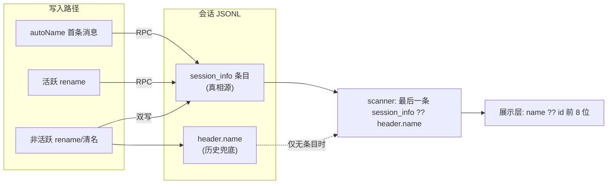

# 会话显示名:双轨存储诊断与收敛方案
> Version: v6 | Date: 2026-08-06 | 状态:v5 全部落地;v6 单轨化——头行 name 轨道整体删除(§7),名字只存 session_info
> v5 | 2026-07-31 | v4 全部落地;v5 逆转 §5.1「存量不补救」拍板——派生名回退 + 打开即补命名已落地

## 1. 症状与根因

### 1.1 症状
会话列表与标题栏长期显示 `id.slice(0, 8)`(如 `019fb0fc`),从未出现"首句截断"自动名;手动改名在刷新/重启后也会丢失。

### 1.2 两条存储轨道
会话名在磁盘上有两个互不连通的存放位置:
- **轨道 A — 头行 `header.name`**:my-harness-desktop 在 JSONL 头行自加的扩展字段。写入口只有"非活跃会话 rename"(`renameSession`/`updateHeader` 的 else 分支)。
- **轨道 B — 底座 `session_info` 条目**:底座 `SessionManager.appendSessionInfo()` 追加的 body 条目。写入口是 RPC `set_session_name`(autoName、活跃 rename)和 TUI `/name`。底座重启恢复只认这一条轨道。

### 1.3 根因一:写 B 读 A(已修复)
修复前 `listSessions`/`readSession` 只读头行 `header.name`,从不解析 body 的 `session_info`;而 autoName、活跃 rename 全部只写 B 轨。写入对显示不可见。历史链:`2ffdcfa`(07-28)autoName 直写头行 → `372ee89`(07-30)为消"绕过 pi 写文件"的竞态改走 RPC,读取端没跟随,断链。

### 1.4 根因二:autoName 触发条件错配(已修,见 §3)
`prompt()` 里自动命名的守卫是 `wasNewSession = (activeSessionPath === null)`——只有"在 my-harness-desktop 里从零新建会话"才为真。而真实使用模式是 **CLI/TUI 建会话、desktop 打开续聊**(`setContext(cwd, path)`,path 非 null),`wasNewSession` 恒 false → autoName **从未被触发过**。这不是 RPC 失败,是条件与使用模式错配。

### 1.5 写入路径审计(现状)
| 写入口 | 代码位置 | 落点 |
|:---|:---|:---|
| 首条消息自动命名 | session-store.ts prompt() | 仅 B(RPC),且旧条件几乎恒 false |
| 活跃会话 rename | session-store.ts rename/updateHeader 活跃分支 | 仅 B(RPC) |
| 非活跃会话 rename/清名 | updateSessionHeader | A+B 双写(v2 起) |
| 底座 TUI `/name` | 底座 interactive-mode | 仅 B |

### 1.6 存量实测(决定性证据)
对 `~/.pi/agent/sessions/` 全量抽查:约 200 个会话文件中,含 `session_info` 的仅 3 个(全是 TUI `/name` 手起的名字,如 tmp/harness)、头行带 name 的为 0。本项目桶 26 个文件中 25 个文件名为 UUIDv7(底座 `createSessionId()` 产物),仅 1 个为 v4(my-harness-desktop `generateNewSessionPath` 产物)——证明 desktop"新会话"路径几乎没被走过,与 §1.4 互证。

## 2. 已落地的修复

### 2.1 读端合并(scanner)
`listSessions`/`readSession` 的名字来源改为:文件里存在 `session_info` 条目则以最后一条为准(trim 空 = 显式清除,回退 undefined),否则回退头行 `header.name`。scanner 本就持有全文(`lastMessagePreview` 同款),零额外 IO;带 `"session_info"` 快速预过滤,不逐行 parse。

### 2.2 写端对齐(非活跃 rename 双写)
非活跃 rename/清名同时写头行(历史/外部消费者兜底)并追加一条 `session_info` 条目(entry 格式逐字段对齐底座 `appendSessionInfo`:8 位 hex id、parentId 取末条 entry、sanitize 去换行)。空名也追加 entry,作为"显式清除"标记,防止 scanner 把更早的名字复活。**活跃路径维持纯 RPC 不动文件**——底座流式追加期间对文件做 read-modify-write 会丢 entry,这是 `372ee89` 的既有结论,继续守住。

### 2.3 截断规则单源化
domain `truncateSessionName(text)`:折叠连续空白 → trim → 按 code point 截 20 → 超长补 `…`(emoji 不再被 UTF-16 腰斩);常量 `SESSION_NAME_DISPLAY_MAX = 20`,经 `@my-harness-desktop/core` re-export。autoName 已换用,替代原 `text.slice(0,20).trim()`。

### 2.4 标题栏缝隙收敛
框架在 `sessionInfoChanged` 事件处直接把名字同步进 `uiStore.sessionTitle`(此前只有 sessions-list 插件在 select/rename/重扫三个时机手动同步,底座 TUI `/name`、扩展 API 的改名到不了标题栏)。顺带修了 renderer reducer 空名事件不 patch 的残留 bug。

### 2.5 autoName 失败可观测化
prompt() 里 autoName 改走 `this.send()` 而非裸 `proc.adapter.send`,复用其 `rpcError` kernel event 上报(超时/进程退出/发送失败都会 dispatch);失败从"静默 console.error 到 main 终端"变为 renderer 可订阅的事件。


**Figure 2.1 — 修复后的名字数据流**

## 3. P0 方案:autoName 触发条件放宽(已实施)

### 3.1 改动
`prompt()` 中把"新会话才命名"改为"活跃会话还没有名字就命名":

```ts
// 改前:wasNewSession = activeSessionPath === null → 续聊会话恒 false,永不触发
// 改后:
if (this.activeSessionPath && !this.latestSnapshot?.state.sessionName) {
  const autoName = truncateSessionName(text);
  if (autoName) await this.send(buildSetSessionNameCommand(autoName));
}
```

效果:CLI 建的会话第一次在 desktop 里发消息即获首句名;desktop 新会话行为不变;已有名字的会话永不覆盖。`latestSnapshot` 在 `start()` 末尾必经 `sync()` 建立,判定依据可靠。

### 3.2 防覆盖配套(已实施)
`dispatch()` 对 `sessionInfoChanged` 做 main 侧基线增量 patch(`latestSnapshot.state.sessionName = name`),与 renderer 侧 reducer 同构。不做的话:用户手动 rename 只进了事件流、没进基线,下一条消息 autoName 判定仍见"无名"→覆盖用户手写的名字。

### 3.3 已知取舍
用户清空名字后再发消息会重新自动命名——"从未命名"与"显式清空"经 `get_state` 都表现为 `sessionName: undefined`,区分需加持久标记,过度设计,先接受。

### 3.4 契约漂移修正(顺帶发现)
`SessionInfoChangedEvent` 契约的字段声明是 `sessionName`,但 gateway 翻译器此前原样透传底座的 `name` 字段,导致 renderer reducer / 标题栏同步拿到的恒为 undefined(sessions-list 三处手动同步掩盖了此问题)。已在 `translateEvent` 补 `name → sessionName` 映射(trim 空名规约为 undefined)。

### 3.5 验证计划(实施后)
- 行为冒烟(mock adapter)四场景:desktop 新会话命名 / CLI 续聊无名会话首次发送命名 / 已有名会话不触发 / 手动 rename 后再发消息不覆盖。
- 运行时真人验证:dev 里打开一个 CLI 建的旧会话发一条消息,列表应出现首句截断名(超长带 `…`),重启后仍在。

## 4. 验证(已落地部分)
- `tsc --noEmit`、`electron-vite build` 通过(lint 的 40 个 error 为存量,stash 验证与本次改动无关)。
- scanner 行为冒烟 16 断言全过:无名/头行兜底/多条取最后/空名清除不复活/rename 双写+sanitize/parentId 链接/pinned 不追加 entry/损坏行容错。
- 底座互操作:底座 `SessionManager.open` 打开 my-harness-desktop 改写过的文件,`getSessionName()` 返回一致;底座续写后 scanner 读回一致。
- `truncateSessionName` 边界冒烟:emoji 不腰斩、恰好 20 不补 `…`、超长补 `…`、折叠空白、空串。

## 5. 拍板结论与遗留

### 5.1 存量会话:v4 拍板不补救,v5 已逆转(见 §6)
~~实测存量两轨皆空且几乎全是 CLI/TUI 产物;拍板不做派生名回退、不做批量迁移,裸会话维持 id 截断。~~
v4 假设"P0 落地后,这些会话在 desktop 里发第一条消息时会自动获得名字,自然修复在用的部分"。
v5 实测推翻前提:用户日常在多客户端间切换(my-harness-desktop、CLI/TUI、其他桌面端共享同一
`~/.pi/agent/sessions/`),大量活跃会话从未经 my-harness-desktop 的 prompt() 路径,名字轨道持续为空;
而标题栏 select 兜底是 `new Date(created).toLocaleString()`——用户看到"会话有内容却显示创建日期"。
逆转后方案见 §6:显示层派生名回退(不改文件)+ 打开即补命名(改文件,一次性自愈)。

### 5.2 已完成项
读端合并、非活跃双写、截断统一、标题栏事件同步、reducer 清名传播 bug、autoName 失败走 `rpcError` kernel event——均已落地并验证。

### 5.3 不处理项(记录在案)
- **活跃会话清名**:底座 RPC `set_session_name` 拒绝空名("Session name cannot be empty"),需底座放开或加 clear 命令——上游演进项。
- **活跃会话不写头行**:守住 372ee89 的竞态结论,活跃路径一律 RPC。
- **titlebar 双 store** 彻底 selector 化(`snapshot.state.sessionName` 与 `uiStore.sessionTitle` 并存):演进观察项,事件同步收敛后暂无实际危害。

### 5.4 结论
- P0(§3)已拍板并实施:触发条件"无名才命名"+基线增量 patch,冒烟 6 断言全过。
- 顺手项:`waitReady` 的 150ms 轮询与 §3.6"不轮询不 sleep"纪律相抵,建议换"进程 stdout 首行/就绪事件"驱动或加注释标注例外——不在本期,已记录,待后续单独立项。

## 6. v5:派生名回退 + 打开即补命名(本版落地)

### 6.1 症状
两轨皆空的会话(多客户端混用产生,见 §5.1)在标题栏显示创建日期;且同一会话在四处入口
显示不一致:列表行标题用 `id.slice(0,8)`、标题栏 select 用创建日期、重命名回退 id 前 8 位、
图钉打开回退 null(显示"新会话")——"派生显示名"同一逻辑四套写法(§1.1 判别气味三)。

### 6.2 显示层派生名单源(不改文件)
domain 新增 `deriveSessionTitle(session)`,展示层唯一来源:
`自定义名 → lastMessage(truncateSessionName 截断)→ id.slice(0, 8)`。
不再用创建日期兜底——日期是"什么时候建的",不是"这个会话是什么"。
四处入口全部换用:sessions-list `select()`、`syncTitleFromList`、重命名回退、session-colors 图钉打开。
配套收敛:`messageContentText`(从消息 content 提取纯文本)升入 domain,scanner 的
`textOfContent`、renderer 的 `textOf` 两份同形拷贝删除(契约单源 §1.3)。

### 6.3 打开即补命名(改文件,一次性自愈)
`SessionStore.openSession` 增加 `nameOnOpenIfMissing`:两轨皆空时取首条 user 消息
`truncateSessionName` 派生名字,经 `renameSessionFile` 双写头行 + `session_info`(与
prompt 时自动命名同轨)。守卫与边界:
- **仅无存活 pi 进程时写文件**(`isAlive(path)` 为假)——活着的会话由 prompt 时自动命名
  (RPC)覆盖,守住 §2.2「活跃路径不动文件」的竞态结论。
- 首条 user 消息无文本(纯图片等)→ 跳过,显示层回退 id 前 8 位。
- 写入失败 console.error 上报,不影响打开(显示层派生名已兜底)。
- 入口单一:renderer 所有"打开会话"路径(列表点选、图钉打开)都经 `openSession` IPC,
  补命名在 main 一处生效,插件零感知。

### 6.4 已知缺口(记录在案)
- **[System] 工具限制前缀**:timeline 注入的 prompt 前缀属插件内容,内核不识别(机制与内容
  分离 §1.2);首条 user 消息带此前缀时派生名会带上它——与 prompt 时自动命名同款既有取舍,
  根治需注入链路改造(如底座提供工具白名单 RPC 后移除注入),不在本期。
- **活跃无名会话不补**:打开一个正在流式的后台会话时不写文件(§6.3 守卫),等下一条
  prompt 自动命名;显示层派生名在此期间兜底。
- **`syncTitleFromList` 覆盖语义**:列表重扫(messageEnd 等内核事件驱动)会用派生名刷新
  标题栏——无名会话的标题随 lastMessage 演进,属预期行为,非回归。

## 7. v6:名字单轨化——头行 name 轨道删除(本版落地)

### 7.1 决策
头行 `header.name` 轨道整体删除,名字只存底座 `session_info` 条目一条轨道。未发布阶段,
不做存量兼容、不做兜底读——就当双轨从未存在过。驱动理由:desktop 私有数据统一收敛进
头行 `custom-my-harness-desktop` 命名空间(session-header-custom.md v2026-08-06 修订),而名字
本就有底座侧的正式轨道(session_info),挪进 custom 是造第三条轨;正解是删掉冗余头行轨,
让名字回归唯一真相源。

### 7.2 落地
- **读端**:`extractSessionInfoName` 返回 `string | undefined`(found 标志随兜底删除而失去
  意义,一并移除);`readSessionName`/`listSessions`/`readSession` 只认最后一条 session_info,
  无条目=无名,展示层经 `deriveSessionTitle` 回退(lastMessage → id 前 8 位)。
- **写端**:`updateSessionHeader` 的 name 分支不再写头行;name-only 补丁走纯 append 快路径
  (经 `appendJsonlLine` 追加 session_info 条目,不重写头行,撕裂窗归零);混合补丁(如
  name+pinned)随头行重写一并追加。`renameSession`/打开即补命名(§6.3)行为不变,落点单轨。
- **活跃路径不变**:活跃会话改名照走 RPC `set_session_name`(底座自己 append session_info),
  §2.2「活跃路径不动文件」继续守住。

### 7.3 存量影响(拍板接受)
仅有头行 name、无 session_info 的历史会话(实测为 0,见 §1.6)失去名字,回退派生名显示。
未发布,不迁移、不兼容。

### 7.4 文档状态
§1.2/§2.1/§2.2 的"双轨"描述是 v5 及以前的历史事实;v6 起以本节为准。§5.3「活跃会话
清名」(底座拒绝空名 RPC)仍是上游演进项——非活跃清名照常追加空名 session_info 条目。
