# 会话行指示的注册机制与提问交互下沉

本文所有 `文件:行号` 锚点指向本仓库当前 `main`（`f40fc821`）的实际位置；同一小节内后续出现的裸 `:行号` 沿用该小节最近一次点名的文件。引用项目纪律时写作 `CLAUDE.md §x`，引用提问既有设计时写作 `ask-design.md §x`，与本文自身的节号空间区分开。

## 1 问题

### 1.1 一次 UI 微调为什么会穿透五层十处

需求原本只有一句话：提问卡从会话流中间搬到底部，左栏会话行上给个提示。这两半的**机制接入成本**差出一个量级——底部那半往现成的 `composerTop` 槽里挂一个组件即可，左栏那半要从圆心开始一路新铺到插件。下表比的是这个差异，不是两个子需求各自的总工作量（ask 迁移的完整清单见 §4）。根因是系统在"往会话行上挂东西"这件事上没有注册点——每加一个指示，都得从圆心开始重新铺一遍。

#### 1.1.1 机制接入成本：挂现成槽 2 处 vs 新铺一条链 10 处

| 层 | 搬到 composer 上方（底部常驻） | 左栏会话行加提示 |
|---|---|---|
| 圆心契约 | — | `packages/shared/src/domain/events/kernel-event.ts` 加结算事件；`domain/sessions.ts` 加跨会话查询 |
| channel 契约 | — | `packages/shared/src/channel/channel-contract.ts` 加通道 |
| application | — | `application/sessions/pending-question-store.ts` 加 `listAll()`；`application/sessions/session-store.ts` 结算广播收口 |
| controllers / wire | — | `server/controllers/sessions.ts` 注册 handler；`web/kernel/build-kernel.ts` 接线；`packages/react/src/plugin-context.ts` 暴露 |
| 插件 | `plugins/sessions/ask/plugin.json` 加贡献；新增 `ask/renderer/ask-dock.tsx` | `plugins/sessions/sessions-list/renderer/index.tsx` 加订阅与状态；四语 locales 加文案 |
| 机制接入合计 | **2 处，全在 ask 目录内**（加贡献 + 写组件） | **10 处，跨 5 层** |

底部那一半只有 2 处，是因为 `composerTop` 槽已经存在并被验证过：契约在 `packages/shared/src/domain/contributions.ts:297`，查询 hook 在 `packages/react/src/composer-top.ts`，timeline 在 `src/plugins/sessions/timeline/renderer/index.tsx:1190` 与 `:1290` 两处 `ComposerDock` 无条件渲染贡献项。当前往 `composerTop` 这个槽里放东西的只有 goal（`GoalBar`，`plugins/sessions/goal/plugin.json:36`），ask 会是第二个。与它同族的另外三个 composer 槽各自也都有真实贡献方——token-stats 用 `composerStats`、stickers 用 `composerActions`（`plugin.json:32`）、voice-input 用 `composerVoice`（`plugin.json:13`）——四个槽同一套"manifest 声明 + 查槽 + 组件自持数据"范式都被验证过，ask 走的是既有装载链。左栏那一半没有对应的槽，所以每层都要新铺一段。

#### 1.1.2 差别的根源不是需求大小，是行级展示没有注册点

把两列的差异归到"左栏需求更复杂"是错的——左栏要的只是一个脉冲图标加一条 tooltip，渲染复杂度远低于底部那张多题分页交互卡。真正的差异在机制：`composerTop` 是一个已声明的贡献点，插件往 manifest 里写一行就挂上了；会话行不是，它的行内指示全部硬编码在 `src/plugins/sessions/sessions-list/renderer/index.tsx` 的 `SessionRow`（`:704`）里。

这个缺口有个可验证的判据：sessions-list 的 renderer 模块不 export `channels`，也没有任何机制能让别的插件往它的行上挂东西。它既是机制（行布局、点击、拖拽、hover 操作区）又是内容（三个状态指示的画法与数据），两种职责混在一个 1181 行的文件里，所以任何一方要变都得改这个文件。

### 1.2 会话行现状：三个硬编码指示与一条订阅

`SessionRow` 当前渲染三个状态指示：行首的阶段图标、行尾的内核未装载告警、行尾的未读圆点。它们的画法、位置、数据来源各不相同，唯一共同点是都写死在这个组件里。

#### 1.2.1 leading 区是一条互斥优先级链，不是并列渲染

行首那一格永远只有一个图标，由 `rowIcon`（`sessions-list/renderer/index.tsx:743`）按固定优先级选出。注意区分两件事：**指示有三个**（阶段、内核告警、未读），但行首这一个指示的**取值有四级**（置顶 / 阶段 / 活进程实心 / 空心回落）——置顶与活进程回落是阶段指示内部的分支，不是独立指示。

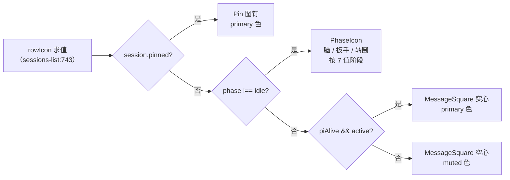

**图 1 — 行首阶段指示的四级取值链（一个指示，不是四个）**

这条链是硬编码的 `?:` 嵌套，任何新指示想进行首都得改它，而且改的时候必须想清楚自己插在第几级。ask 的"待回答"图标如果直接塞进去，就得回答"它比置顶优先还是比阶段优先"——这个问题本身说明缺的不是一个 if 分支，是一个能表达优先级的注册机制。

#### 1.2.2 trailing 区是未读圆点，带 hover 让位与持久化位标

行尾当前有两种指示并列：内核未装载的 `TriangleAlert`（`:860`，判据 `session.kernelLoaded === false`）与未读圆点（`:871`）。未读圆点的行为比看上去复杂，带三条耦合规则：hover 时让位给操作区（条件写作 `unread && !hovered && !childSessions?.length`）、已读位标持久化在插件自己的 config（`ctx.config.get("readState")`，`:115`）、当前激活会话自动视为已读（`:217` 的 `markRead`）。

#### 1.2.3 三个指示的数据来源三种形态

| 指示 | 数据来源 | 是否需要订阅 | 是否持久化 |
|---|---|---|---|
| 内核未装载告警 | `SessionInfo.kernelLoaded` 字段 | 否，纯字段读 | 否 |
| 阶段 | `onKernelEvent` 增量喂圆心纯函数 `advancePhase` | 是，一条订阅 | 否 |
| 未读 | `onKernelEvent` 记 `lastEntryId` + 与 config 里的已读位标比对 | 是，同一条订阅 | 是，插件 config |

三种形态差异很大，这一点直接决定了新机制的数据归属该怎么定（§2.4）：如果机制假设"所有行级指示都是纯字段派生"，未读就迁不进来；如果机制自己维护一张统一状态表，它就得懂什么叫"已读"——业务语义进壳。

### 1.3 缺失的抽象：这一类问题是什么

#### 1.3.1 通用抽象＝「往会话行上挂一个由自己数据驱动的指示」

眼前的例子是 ask 待回答，但同一类需求已经在仓库里出现过三次（阶段、未读、内核未装载），而且能预见还会再来：子 agent 会话待审、git review 待确认、goal 达到轮数上限待人工介入。它们的共同形状只有一句：**某个插件认为「这个会话有件与我有关的事」，想在会话行上留一个记号**。

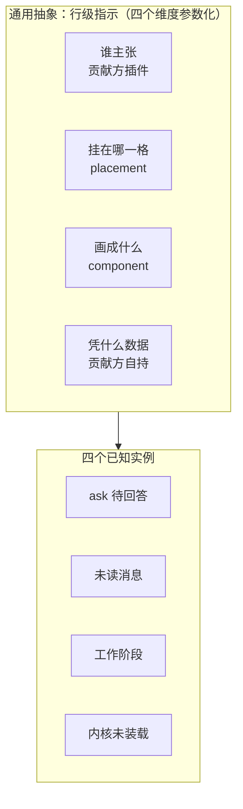

**图 2 — 通用抽象与它的四个实例：同一抽象的参数化，不是四套并列实现**

#### 1.3.2 现有 sidebar 槽粒度不够（section 级，非 row 级）

`SidebarContribution`（`contributions.ts:112`）的字段是 `title / component / order / group / defaultSize`——它描述的是左栏的一个**可折叠分组**，sub-agent 插件用它挂了整块"子 Agent"面板（`plugins/sessions/sub-agent/plugin.json:15`）。分组和行是两个粒度：分组是"左栏有哪几块"，行是"某一块里每个条目长什么样"。往 `SidebarContribution` 上加字段解决不了行级问题，因为拿到分组组件的是插件自己，行仍然在它内部硬编码。

#### 1.3.3 现有 composer* 槽的形状为什么不能照搬

`composerStats` / `composerTop` 的契约注释里明写"**组件 props 无，自订阅插件内状态**"（`contributions.ts:283`、`:297`）。这个形状对 composer 成立，因为 composer 全局只有一个、且只服务当前激活会话——组件自己从框架 store 读 `currentNeutralSessionId` 就够了。行级不成立：左栏同屏几十上百行，每行是一个不同会话，徽章组件必须知道"我是哪一行"，因此必须带 props。

仓库里已有带 props 的槽作为先例：`composerVoice`（`contributions.ts:312`）的组件 props 是 `{ onTranscribed, disabled? }`，由消费方注入回调，契约注释解释了为什么这个槽必须破例。行级徽章同理破例，但破的方向不同——它需要的是**行上下文**，不是回调。

### 1.4 与既有机制的关系：扩展还是替代

#### 1.4.1 对 sessions-list：替代（硬编码指示退役为贡献）

新槽落地后，`SessionRow` 里那三个硬编码指示全部退役，改成 sessions-list 自己在 manifest 里声明的三个徽章贡献（§5.1）。这不是并存双轨——行内指示只剩一条渲染路径，就是查槽。sessions-list 保留行的骨架职责，交出指示的画法与数据。

#### 1.4.2 对 sidebar 槽：并存（分组 vs 行内，正交）

两个槽管两个粒度，互不干涉：`sidebar` 决定左栏有哪几块，`sessionRowBadges` 决定块内每行的指示。sessions-list 同时是前者的贡献方和后者的消费方，这是正常的——它既是"一块面板"又是"面板里的行布局机制"。

#### 1.4.3 对 blockRenderers / messageActions：同范式复用

新槽不发明新范式，机械镜像仓库里已经跑通的两个：

| 环节 | blockRenderers | messageActions | sessionRowBadges（新） |
|---|---|---|---|
| 声明 | `contributes.blockRenderers` | `contributes.messageActions` | `contributes.sessionRowBadges` |
| 后端收集 | `registry.blockRendererItems()`（`loader/registry.ts:309`） | `registry.messageActionItems()` | `registry.sessionRowBadgeItems()` |
| 同 id 覆盖 | `removeById`（`registry.ts:66`），高优先级 source 胜 | 同 | 同 |
| 通道 | `slots:blockRenderers` | `slots:messageActions` | `slots:sessionRowBadges` |
| 前端查询 | `useBlockRenderers()`（`pluginsNonce` 失效重拉） | `useMessageActions()` | `useSessionRowBadges()` |
| 组件匹配 | `getPluginComponent` 自动注册（CLAUDE.md §7.4） | 同 | 同 |
| 解析规则 | 二键 `(block, name?)`，特化优先 | `placement` 分区 + `order` 排序 | `placement` 分区，两区规则不同（§2.3） |

唯一的原创部分是最后一行的解析规则，以及为它服务的主张机制（§2.3、§2.6）。

## 2 行级徽章槽机制

### 2.1 契约形状（圆心 contributions.ts）

#### 2.1.1 SessionRowBadgeContribution 字段与 placement 两区

```ts
/** 会话行徽章槽(sessionRowBadges)贡献项:插件往左栏会话行贡献状态指示
 *  (待回答/未读/工作阶段等)。声明静态走 manifest(与 messageActions 同构);
 *  消费方(sessions-list)查槽后按 placement 分区渲染,组件经框架自动匹配。
 *  数据归贡献方自持(模块级 store + 一条订阅,N 行共用),壳不知道任何指示的业务语义。
 *  两区解析规则不同(§2.3):leading 由主张集合单选,trailing 全部叠加。 */
export interface SessionRowBadgeContribution {
  /** 贡献 id(插件内唯一);同 id 被后注册插件整项替换(registry removeById 通用语义)。 */
  id: string;
  /** renderer 侧组件名,框架从插件 exports 自动匹配。 */
  component: string;
  /** 挂载区:leading = 行首图标位(单选,主张命中者按 order 取首个);
   *  trailing = 行尾指示位(叠加,按 order 全渲染)。缺省 trailing。 */
  placement?: "leading" | "trailing";
  /** 排序:leading 区决定谁先获得占位机会(小者先问),trailing 区决定视觉先后。缺省 100。 */
  order?: number;
}
```

四个字段全部来自既有范式的字段集：`id` / `component` / `order` 是多数贡献型槽共有的三件套（`blockRenderers` / `messageActions` / `composerTop` / `composerStats` / `composerActions` / `codeBlockRenderers` / `sidePanel` / `fileActions` 都是这个形状），`placement` 镜像 `MessageActionContribution:183` 的同名字段（那里是 `"left" | "right"`，这里是 `"leading" | "trailing"`，语义对应行首行尾而非按钮左右）。

#### 2.1.2 SlotName 增补与 PluginContributes 增补

`SlotName` 联合（`contributions.ts:397`）加一个成员，`PluginContributes`（`:427`）加一个可选字段。两处都是一行纯类型增补——已有插件的 manifest 不受影响，`contributes.sessionRowBadges` 缺省就是不贡献。

#### 2.1.3 组件 props 契约：四个字段，纯展示

```ts
/** 行级徽章组件的 props 契约(消费方 sessions-list 注入,贡献方只读)。
 *  纯展示:无回调——点击选中会话是行的职责(整行可点),徽章不抢事件。 */
export interface SessionRowBadgeProps {
  /** 本行会话的完整信息(含 neutralSessionId / kernel / kernelLoaded / custom 等)。 */
  session: SessionInfo;
  /** 本行当前是否被 hover(trailing 让位规则用:未读圆点 hover 时让给操作区)。 */
  hovered: boolean;
  /** 本行是否是当前激活会话(未读的"激活即已读"、阶段的 piAlive 判定都要用)。 */
  active: boolean;
  /** 本行是否有子会话展开区(未读圆点的第三个让位条件,现有 :871 的 childSessions?.length)。 */
  hasChildren: boolean;
}
```

四个 props 都是行上下文事实，没有一个是回调，也没有一个是"你是否胜出"——胜者判定在挂载之前完成（§2.3.1），组件不需要知道自己是不是唯一被挂载的那个。

`session` 给完整 `SessionInfo` 而不是几个散字段，理由是开闭：将来某个贡献方要按 `session.custom` 里的私有域判断，契约不用改。`hovered` / `hasChildren` 必须给，因为未读的让位规则（§1.2.2 那三个条件）迁移后不能丢，而这三个事实只有行自己知道。

### 2.2 三段式落地（镜像 composerStats）

#### 2.2.1 声明：manifest contributes.sessionRowBadges

```json
{
  "contributes": {
    "sessionRowBadges": [
      { "id": "awaiting", "component": "AwaitingBadge", "placement": "leading", "order": 50 }
    ]
  }
}
```

#### 2.2.2 查询：registry.sessionRowBadgeItems() + 通道

后端侧照 `composerTopItems()`（`registry.ts:354`）逐行镜像：取全部贡献、补 `pluginId`、按 `order` 升序（缺省 100）后返回。

这里要显式说明一处与既有实现的差别：`composerTopItems` 在排序后把 `order` 字段剥掉了（`.map(({ order: _order, ...rest }) => rest)`），因为 composerTop 的消费方只按数组序渲染。本槽**保留 `order`**——leading 区的解析要在"数组序"之外还能读到原值用于诊断与测试断言，且 §7.1.1 的纯函数 `resolveLeadingBadge(items, hasClaims)` 从 `items` 每项上读 `order` 字段。数组本身仍按 order 升序，两者一致，不存在双重真相。

通道加 `slots:sessionRowBadges` 一条（`channel-contract.ts:253` 的 `slots` 组内），controller 注册一行（`server/controllers/slots-dialog.ts:26` 同款），`build-kernel.ts:169` 与 `plugin-context.ts` 各接一行。

#### 2.2.3 渲染：useSessionRowBadges() hook + getPluginComponent 匹配

前端 hook 照 `packages/react/src/composer-stats.ts` 镜像：模块级 cache 按 `pluginsNonce`（`web/stores/ui-store.ts:131`）失效重拉，同 nonce 单发。消费方按 `placement` 分两组，逐组按 §2.3 的规则解析。

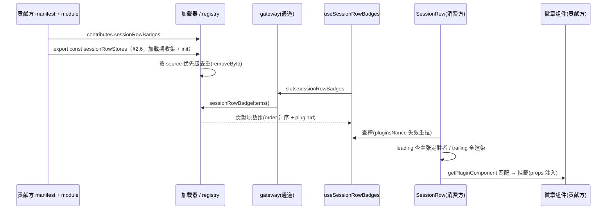

**图 3 — 装载链时序：从 manifest 声明到行内渲染的调用先后（谁先调谁）。与 §8.2 图 11 互补——图 11 画的是同一条链的职责归属分层（每段归谁），本图画的是它的时间顺序。**

#### 2.2.4 加载顺序：首次启动有渲染闸门，只有热装路径需要重拉

一个自然的担心是：sessions-list 与 ask 是两个独立插件，`plugins-host.ts` 用 `Promise.all` 并发加载（`:104-121`），谁先 resolve 不确定——如果左栏先渲染出来、ask 后加载完，行首图标会不会先显示阶段图标、再跳成待答图标？

首次启动不会，因为 UI 根本不在这期间渲染。`web/app-main.tsx:209-216` 有一道渲染闸门：`Promise.race([Promise.all([hydrateP, layoutHydrateP, initI18n(), pluginsReadyP]), timeoutP])`，`pluginsReady` resolve（即全部插件加载完、`bumpPlugins()` 已在 `plugins-host.ts:122` 调过）之后才 `render`。注释写明了这道闸门的理由——"插件组件注册完成才 render，否则槽宿主首渲染会闪『组件未注册』回退"。所以左栏首次渲染看到的就是完整的槽清单，不存在图标替换。闸门有 5s race 兜底（`timeoutP`），超时也渲染——那种情况下确实可能后到的贡献项缺席，但它是既有的降级路径，所有走 `pluginsNonce` 重拉的贡献型槽都一样，本设计不新增风险。

热装 / 热卸路径才需要重拉，而机制已存在：`plugins-host.ts` 的 `onPluginsChanged` 回调在加载完成后二次 `bumpPlugins()`（`:184`），`:180` 的注释解释了这个二次 bump 正是为"首次 bump 时槽清单已含新插件但模块未注册"而加。`useSessionRowBadges()` 的 cache 按 `pluginsNonce` 失效（§2.2.3），nonce 一变就重拉，新贡献项自动进入候选。所以运行期装上 ask 插件，行首图标会从阶段图标换成待答图标——这是热装的正常表现，且 leading 是固定尺寸图标格（`--sidebar-icon-size`，见 `sessions-list/renderer/phase-icon.tsx:21`），换一个图标不改变行宽与行高，不是布局跳动。

#### 2.2.5 init 时机的隐含前提：window.kernel 先于插件加载就绪

§2.4.4 把 `init(deps)` 放在插件模块加载期，这依赖一个前提：那时 `window.kernel` 已经存在，否则 `plugins-host` 构造不出 deps。前提成立，且是显式保证的——`web/bootstrap.ts:79` 构建 `window.kernel = buildKernel(transport, platform, ...)`，而 `web/index.tsx:16` 的注释写明顺序敏感："先建 `window.kernel`，再加载读它的应用主体"（`./app-main` 是动态 import 进来的）。`plugins-host.ts` 由 `app-main` 引入，因此它的加载时机必然晚于 `window.kernel` 就绪。

另一个前提要一并交代：`init()` 期间订阅 `onKernelEvent` 会不会丢事件？不会。`onKernelEvent` 的实现是 `transport.on("session:kernelEvent", ...)`（`build-kernel.ts:283-287`），挂的是 WS 监听器，与 renderer 侧的 `initSessionStore()` 无关；而 `initSessionStore()` 在渲染闸门之后才调（`app-main.tsx:219` 附近），此时后端还没起任何会话进程，事件流上本来就没有东西。订阅先就位、事件后到达，顺序是安全的。

这与 §2.4.5 补充判定三说的是两件事，比较点不同：本节比的是 `init` 与 `initSessionStore` 的先后（冷启动时事件流为空，加载期 init 与挂载期 init 在这一刻等价），判定三比的是加载期 init 与挂载期 init 在**热装路径**、**左栏长期不可见**两种情形下的差别——那时事件流早已在淌，若 init 绑在组件挂载上，挂载前到达的事件没有订阅者接、异步基线又只能读到拉取前的快照，两头都漏。加载期 init 在冷启动无害、在非冷启动是唯一安全选择。

### 2.3 两区的解析规则不同

#### 2.3.1 leading：主张集合单选，只挂载胜者

行首一格只能放一个图标（§2.3.4 的物理约束），所以 leading 区必须单选。单选的判据不能是"挂载后看谁返回了非 null"——那要求把候选都挂载一遍再测 DOM，既贵又不可测。正确的切法是把**主张**与**呈现**分开：贡献方在自己的模块级 store 里维护一个"我主张哪些会话"的集合，消费方在渲染前同步查表定胜者，只挂载胜者一个。

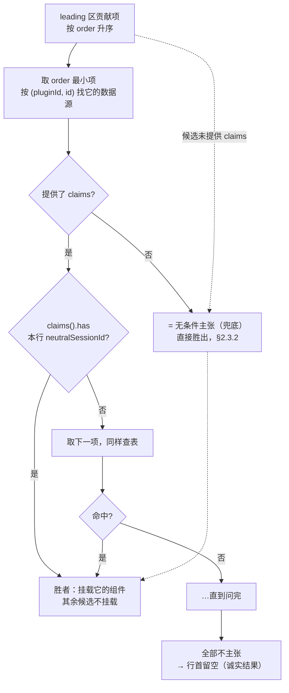

**图 4 — leading 区解析：渲染前同步查主张表，零双渲染、零 DOM 测量；未提供 claims 即兜底（§2.3.2）**

这个规则的要点是**优先级由内容表达，不由声明表达**。贡献方不需要在 manifest 里写"我比谁优先"，它只需要在"这一行没我的事"时不把该会话放进自己的主张集合；`order` 只决定谁先获得占位机会。ask 声明 `order: 50`、sessions-list 的阶段徽章声明 `order: 100`，效果是：有待答问题时 ask 的主张命中、占住行首；没有时查下去落到阶段徽章。原来那条四级 `?:` 链（图 1）被这条规则完整替代，且第三方插件能插进这条链而不改 sessions-list 一行。

壳在这一步只做一个动作：拿会话主键去问每个数据源"你主张它吗"。它不知道"主张"意味着待答、未读还是别的——`claims()` 返回的是一组不透明的会话主键，语义留在贡献方（§2.4.3）。

#### 2.3.2 兜底怎么表达：不提供 claims 就是无条件主张

leading 单选模型必须有一个兜底贡献方，否则所有候选都不主张时行首会空着（图 4 的 E 分支）。兜底的自然写法看起来是"让它的 `claims()` 返回全部会话主键"，这个写法不成立：兜底语义是常量 `true`，却要物化一个 N 元素集合——500 个会话就是 500 个主键的 Set，每行渲染前都要构建与查询，而它承载的信息量是零。更要命的是这个全集从哪来没有答案：兜底方要么去读 sessions-list 的会话列表 store（违 §6.2.1 不共享数据），要么自己再订阅一条列表事件（多一条订阅只为表达"我全都要"）。

正确做法是把缺省语义反过来：**判据是"这个贡献项有没有提供 `claims` 方法"，不是"有没有数据源"**。没有 `claims`（既包括完全没有数据源、也包括有数据源但只用于渲染不用于主张）就是无条件主张——任何会话都命中；提供了 `claims` 才是条件主张。这样兜底方零集合、零额外订阅，条件方按自己的数据主张，两种形态用一个方法在不在场来区分，不需要契约里再加 `fallback` / `claimScope` 之类的字段（CLAUDE.md §1.2「机制与内容分离」的推论，也是全局工程原则里的同一条：行为由实际内容与已有语义字段涌现，不靠新增一个让引擎 `switch` 的声明式类型标签）。

为什么判据不能落在"有没有数据源"上：leading 兜底方 PhaseBadge 恰恰**有**数据源——它要维护每行的 phase 供组件渲染，只是那份数据不用于主张判定（§5.1.1、§2.6.1 三组合表的第二行）。若判据是"有源即条件主张"，PhaseBadge 就被迫提供 `claims()`，又回到返回全集那个不成立的写法。

于是图 4 的解析规则精确表述为：按 order 升序逐个问，**该候选未提供 `claims` → 直接胜出**（它是兜底，永远主张）；提供了 `claims` → 查 `claims().has(ns)`，命中胜出、不命中问下一个。实践中兜底方声明最大的 order（阶段徽章是 100，§5.1.1），所以它只在所有条件方都不主张时才被问到——E 分支"该格空"在配了兜底方时不会发生，而机制层仍然允许它发生（第三方可以只提供条件方），这时行首留空是诚实的结果，不伪造图标。

§6.3 那条"想做条件主张却忘提供 `claims`"的风险因此要讲清症状：它不是"徽章不显示"，恰恰相反，是**退化成兜底、抢住行首所有行**（因为缺 `claims` 被解析成无条件主张）。消费方无法替贡献方区分"我就是要兜底"和"我忘了写条件"这两种意图，所以 warn 的措辞只能陈述事实、不猜意图——"leading 候选 X 未提供 claims，按无条件主张处理"。

#### 2.3.3 trailing：全部渲染，order 升序叠加

trailing 区没有互斥语义——未读圆点和内核告警可以同时出现，现状就是两个独立条件并列（`:860` 与 `:871`）。所以规则是全部渲染、按 `order` 排视觉先后。贡献方"没事就不占位"靠组件返回 `null`，React 天然跳过。

trailing 不需要主张机制：它不单选，所以不需要在挂载前判定；把判定留给组件自己返回 null，少一层机制。这个不对称是有意的——**主张机制是为单选服务的，不是为徽章服务的**。

trailing 组件被挂载后返回 null，并不产生 §6.1 里那种重复副作用。区别在于挂载次数：trailing 每个候选**只挂一次且全部保留**，没有影子挂载；被否掉的 leading 方案是"挂进测量容器 → 读出结果 → 丢弃 → 再正式挂一次"，同一个组件挂两遍才造成重复。另外要分清"挂载"与"建订阅"是两件事：跨会话的那条 `onKernelEvent` 订阅在模块加载期就建好了（§2.4.4），组件挂载时发生的只有 `useSyncExternalStore` 的每实例订阅——它随实例创建、随卸载清理，是 React 的正常成本。

#### 2.3.4 为什么不用「优先级链硬编码」也不「两区都叠加」

| 规则 | leading 后果 | trailing 后果 |
|---|---|---|
| 硬编码优先级链（现状） | 每加一个指示改 sessions-list，且要人工排序 | 同左 |
| 两区都叠加 | 行首同时出现阶段图标 + 待答图标 + 置顶图钉，行宽被吃光、标题被挤 | 正常 |
| 两区都单选 | 正常 | 未读与内核告警互斥，两个都该显示时丢一个 |
| **leading 主张单选 + trailing 叠加（本设计）** | 正常 | 正常 |

行宽是物理约束：左栏窄，行首一格、行尾两格已经是现状上限。leading 必须单选，因为这一格物理上只能放一个图标；trailing 可以叠加，因为这两个指示本来就该同时可见。规则的不对称来自约束的不对称。

### 2.4 数据归属：贡献方自持模块级单例

#### 2.4.1 为什么不能是「一行一订阅」

如果每个徽章组件自己订阅事件流，订阅数 = 行数 × 徽章数。左栏一个中型项目几十上百个会话，四个徽章就是几百条订阅，每条都是一个 IPC 监听器加一份状态副本。这不是"性能不好"，是结构性不成立——`onKernelEvent` 的每条订阅都会收到全量会话的事件，几百个订阅者各自过滤一遍，同一份事件被处理几百次。

| 方案 | 订阅数（100 行 × 4 徽章） | 每事件处理次数 |
|---|---|---|
| 每行每徽章各订阅 | 400 | 400 |
| 每徽章一个模块级单例 | ≤4 | ≤4 |
| 壳统一一张表 | 1 | 1 |

第二行是本设计选的。"≤4"而非"4"：只有**有自己数据**的徽章才建订阅，纯字段型（如 §5.1.3 的 KernelUnloadedBadge 只读 `session.kernelLoaded`）不建订阅、不进这张表。表格按"四个徽章都有数据"的最坏情形示意，实际订阅数只会更少。这与 §5.1.4 那句"sessions-list 的一条订阅拆成 phase + unread 两条"不冲突——那里数的是 sessions-list 这一个插件内部的订阅增减（1 → 2），这里数的是全局"每徽章最多一条"的上界，两个口径不同层面。第三行订阅数最少，但代价是壳要懂业务语义（§2.4.3）。

#### 2.4.2 模块级单例 + 单一 onKernelEvent 订阅（goal-controller 同款范式）

仓库里已有这个范式的成熟实现：`plugins/sessions/goal/renderer/goal-controller.ts` 把目标态放在模块级单例而不是组件 `useState`，注释里记着实测教训——"GoalBar 在会话物化瞬间会重挂载，组件内 useState 被清，实测「设 goal 后 1s 内目标条消失、续跑停摆」"（`:49`）。行级徽章面对同样的重挂载风险：左栏排序、分组折叠、拖拽都会重挂行组件。

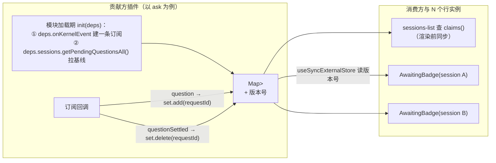

**图 5 — 数据流：一条订阅喂一个模块级 Map，主张查询与 N 个行实例都只读它**

用 `Map<ns, Set<requestId>>` 而不是 `Map<ns, number>` 计数，是为了让重复结算天然幂等：同一 `requestId` 被 add 两次仍是一个元素，delete 两次第二次是 no-op。计数方案在"用户作答与 abort 竞态"下会双减，而 `ask-design.md §3.4.3` 明确允许一个会话同时挂多张单，钳位到 0 会把另一张真实待答单吃掉。集合方案不需要钳位，也不需要消费方记"我见过哪些 requestId"。

`claims()` 的实现是从这个 Map 派生一个 `Set<neutralSessionId>`（过滤掉空集合的键），纯读、无副作用。

#### 2.4.3 壳不碰业务语义：不知道什么叫「待回答」

这是选"贡献方自持"而非"框架统一表"的决定性理由。框架统一表要求壳能回答"这个事件意味着这个会话多了一件待办吗"——`question` 事件意味着待答、`questionSettled` 意味着消除，这套映射是 ask 的领域知识。写进壳，壳就有了内容（违 CLAUDE.md §1.2 机制与内容分离）；写进圆心，圆心就得认识提问的生命周期（违 CLAUDE.md §4.5 归属判断）。

反过来看：贡献方自持时，壳只知道"这里有个组件、props 是这四个、它返回 null 就是不占位；这里有个行级数据源，它返回一组会话主键"。ask 插件被删掉，左栏少一个待答图标，其余照常——这正是 CLAUDE.md §1.4 无特权差异的可检验形态。

#### 2.4.4 订阅时机：模块加载期，不依赖左栏是否渲染

订阅与冷启动基线都绑在**模块加载期**，不绑在组件挂载上。理由是左栏可能折叠、分组可能收起、用户可能一直没滚动到那一块——如果订阅要等第一个徽章组件挂载才建立，那期间的 `question` 事件全丢，用户展开左栏时才拉基线，会出现"提问早就到了、徽章却直到点开左栏才亮"的观感。

落地靠既有的模块导出收集机制：`src/web/app/plugins-host.ts` 在加载每个插件 renderer 模块时，依次收集 `mod.channels`、`mod.auxParsers`、`mod.composerCommands`（`:47-59`）。本设计新增第四类收集物 `mod.sessionRowStores`（§2.6），收集时对**每一个**行级数据源调一次 `init(deps)`——不分它带不带 `claims`：PhaseBadge（leading 兜底，有数据源无 `claims`）与 UnreadBadge（trailing）同样需要 `init` 去建订阅、拉基线，注入路径与 ask 的完全一致。插件加载完成即订阅就位、基线拉齐，与任何组件是否挂载无关。

这条也顺带解决了模块级单例没有生命周期钩子的问题——不需要"第一个挂载的组件建订阅 + flag 守幂等"这种绕法，框架有明确的加载时点。卸载侧同理：`plugins-host.ts` 的 `onUnloaded` 回调里已经按 pluginId 摘除 channels / auxParsers / composerCommands，行级数据源在同一处摘除并调用其 `dispose()`（拆订阅）。

#### 2.4.5 init 的依赖从哪来：框架注入，不是插件自取 window.kernel

模块加载期调 `init()` 有一个必须正面解决的矛盾：`init` 里要建 `onKernelEvent` 订阅、要读插件自己的 config、ask 还要拉一次跨会话提问基线，而这些能力在插件代码里的正常入口是 `usePluginContext()`（`packages/react/src/plugin-context.ts:23`）——那是个 React hook，只能在组件里调，模块加载期根本没有 React 渲染上下文。

绕开的办法看起来有两个，都不行。一是插件直接 `window.kernel.sessions.onKernelEvent(...)`：发布面确实允许这么写（`plugin-context.ts` 内部就是这么转发的），但 CLAUDE.md §8.1 明写"壳插件不直接访问 `window.kernel`，统一经 `usePluginContext()` 拿受控 API"，破这个例等于给行级徽章开一条绕过权限与 pluginId 注入的旁路。二是让第一个挂载的组件把 ctx 传回模块级单例：那就退回了 §2.4.4 否决的"绑组件挂载"方案，左栏不渲染就丢事件。

正解是依赖倒置（CLAUDE.md §3.4）：`init` 的入参由框架注入，贡献方只声明它需要什么。注入包的形状见 §2.6.1 的 `SessionRowStoreDeps`——三项全是通用面：`onKernelEvent`、`config`、`sessions`，不是整个 `PluginContext`（给整个 ctx 等于把 fs / git / dialog 这些加载期用不到的能力也开放了）。`plugins-host.ts` 在收集行级数据源时构造这个包：它自己就在壳的 renderer 侧，持有 `window.kernel`，由它转发是合法的——**机制层代插件取能力并注入，插件不碰 `window.kernel`**，与 `bootstrap` 给 `session-store` 注入 `BackendFactory` 是同一个手法。

这带来一条实现纪律：行级数据源的模块代码里不许出现 `window.kernel`，也不许 import `usePluginContext`。这条可以做成静态守卫（§7.1.3），与既有的 `npm run audit:deps` 十检验同类。

三个补充判定，都是写实现时会撞上的：

一是**注入包为何要含 `config`**。不只 ask 需要依赖：UnreadBadge 的已读位标存在 sessions-list 自己的插件 config 里（§5.1.2），它的 store 在 `init()` 里就要把位标读回来，否则首帧会把所有会话当未读。`config.get` 在 `plugin-context.ts:28` 是按 `pluginId` 绑定构造的，框架注入时已知 pluginId（它正在加载这个插件），所以绑好再给，贡献方不传也不得传 pluginId（CLAUDE.md §8.3 零硬编码）。

二是**注入包为何给整个 `sessions` 面、而不单列 `getPendingQuestionsAll`**。ask 的冷启动基线确实要调 `getPendingQuestionsAll()`（§3.2），但把它作为一条具名方法写进 `SessionRowStoreDeps` 的类型定义，等于让通用机制层的契约里出现"提问请求单"这个 ask 领域概念——这恰恰是 §2.4.3 反对的"壳认识业务语义"。改给 `sessions`（`SessionsApi` 整体引用）后，机制层只是转发一个通用能力面，它不知道也不关心 ask 会调其中哪个方法，与 `bootstrap` 给 `session-store` 注入 `BackendFactory`（不知道后者会怎么用它）同理。这不扩大 ask 的权限：`SessionsApi` 是核心默认能力（CLAUDE.md §8.1），ask 在组件里经 `usePluginContext().sessions` 本来就能拿到完整这个面，加载期给引用只是把同一个面提前交到 store 手里。

三是**为何不干脆延迟到首次挂载再 init**。看起来可行：ask 的 `getPendingQuestionsAll()` 拉的是壳里的持久请求单，unread 的位标拉的是 config，两者都是"基线可重建"的，晚一点 init 不会丢数据。不选它的理由是它把正确性押在"基线一定盖得住增量"这个隐含前提上：如果 init 晚于前几条事件，而基线拉取又是异步的，两者交错期间到达的事件就会丢（基线读到的是拉取前的快照，事件又被尚未建立的订阅错过）。模块加载期 init 没有这个窗口，而且成本只是提前建一条订阅。

#### 2.4.6 抗重挂载与测试隔离

模块级单例天然抗重挂载，这正是它相对组件内 `useState` 的核心优势。要注意的反面：模块级状态在**测试之间会泄漏**，所以每个用这个范式的模块都要 export 一个测试专用清空函数——`goal-controller.ts:74` 的 `__resetGoalStoreForTests` 就是这个用途，本设计的每个行级数据源同样要带（命名沿用双下划线前缀约定）。

组件侧读模块级 Map 需要变更通知，否则 Map 变了组件不重渲——用 `useSyncExternalStore`（React 18 内置）订阅 store 的版本号，不引第三方包（CLAUDE.md §3.5）。

### 2.5 sessions-list 的职责收窄

#### 2.5.1 保留：行布局、点击选中、拖拽排序、hover 操作区

`SessionRow` 继续拥有：行的容器与内边距、整行点击选中（`onClick`）、拖拽排序（`SortableRow`）、hover 时浮出的操作区（重命名 / 删除 / 原始文件下拉）、子会话展开折叠、重命名编辑态。这些都是"行"这个 UI 单元自身的职责，与任何具体指示无关。

#### 2.5.2 交出：三个指示的渲染与数据维护

`phaseByPath` / `lastEntryByPath` / `readState` 三个状态与那条 `onKernelEvent` 订阅（`:202-227`）整体搬出。搬出去向有讲究：phase 与 unread 的数据维护逻辑归各自的徽章模块，`readState` 的持久化仍在 sessions-list 的插件 config 里（那是它的配置文件，别的插件不该写）——UnreadBadge 作为 sessions-list 自己声明的贡献方，读同一个 config 是合法的（同插件内）。

这条订阅搬走后，sessions-list 的 `onKernelEvent` 只剩列表刷新所需的部分，而列表刷新本身已经收编进框架（`web/stores/session-store.ts:727` 的 `initSessionStore`，见 `sessions-list/renderer/index.tsx:224` 注释）。

#### 2.5.3 hover 让位规则怎么表达

现状是 `unread && !hovered && !childSessions?.length`（`:871`）——三个条件里，`unread` 是贡献方自己的数据，`hovered` 与 `hasChildren` 是行上下文，都由 props 提供（§2.1.3）。让位规则完整地由贡献方表达，壳只提供事实，不做判断。

### 2.6 行级数据源的注册机制

#### 2.6.1 导出形状

行级数据源与 `auxParsers` / `composerCommands` 同款：插件 renderer 模块的静态导出，框架加载时收集。

```ts
/** init 的依赖注入包:框架在模块加载期调用 init 时传入(§2.4.5)。
 *  三项全是**通用面**,没有一项是某个功能的领域概念——机制层的类型定义里
 *  不出现"提问""未读"这类业务字样(§2.4.3)。也不给整个 PluginContext:
 *  fs / git / dialog 这些加载期用不到的能力不开放。 */
export interface SessionRowStoreDeps {
  /** 订阅全量内核事件(带 sessionKey 归属,跨会话)。 */
  onKernelEvent(cb: (event: KernelEvent) => void): () => void;
  /** 读本插件自己的配置(归属插件 id 由框架注入时绑定,贡献方不传也不得传)。
   *  UnreadBadge 的已读位标存在 sessions-list 的 config 里,init 时要读回基线(§5.1.2)。 */
  config: {
    get<T>(key: string): Promise<T | undefined>;
    set<T>(key: string, value: T): Promise<void>;
  };
  /** 壳的会话能力面(SessionsApi,domain/sessions.ts)。整体转发,机制层不挑方法——
   *  ask 从这里调 getPendingQuestionsAll()(§3.2),但那是 ask 的选择,不是 deps 的语义。
   *  SessionsApi 本就是核心默认能力(CLAUDE.md §8.1),给引用不扩大插件权限。 */
  sessions: SessionsApi;
}

/** 行级徽章的模块级 store(贡献方模块导出,plugins-host 加载期收集)。
 *  两个职责合在一个导出里,但可分开用:
 *   ① 生命周期(init/dispose/version/subscribe)——任何有自己数据的行级徽章都需要;
 *   ② 主张查询(claims)——**只有 leading 区的条件主张方需要**,兜底方与 trailing 徽章不导出它。
 *  壳只拿会话主键问「你主张它吗」,不知道主张的业务含义(§2.4.3)。 */
export interface SessionRowStore {
  /** 归属插件 id(收集时由框架填,与 auxParsers 同手法)。 */
  pluginId: string;
  /** 对应的徽章贡献 id(与 contributes.sessionRowBadges[].id 配对)。 */
  badgeId: string;
  /** 建立订阅 + 拉冷启动基线。框架在模块加载期调一次并注入依赖(§2.4.5),幂等由贡献方自守。 */
  init(deps: SessionRowStoreDeps): void;
  /** 拆除订阅。插件卸载时框架调用。 */
  dispose(): void;
  /** 当前主张的会话主键集合(纯读,渲染前同步调用)。
   *  **可选**:缺省 = 无条件主张(leading 兜底方、trailing 徽章都不需要它,§2.3.2)。 */
  claims?(): ReadonlySet<string>;
  /** 版本号(useSyncExternalStore 的快照标识,数据变更即自增)。 */
  version(): number;
  /** 订阅版本变更。返回取消函数。 */
  subscribe(fn: () => void): () => void;
}
```

把生命周期与主张查询合在一个导出、但 `claims` 可缺省，是为了避开一个真实的矛盾：leading 兜底方（PhaseBadge）确实不需要 `claims()`，但它**仍然需要 `init()`** 去建订阅、拉基线——它有自己的数据（每行的 phase），只是那份数据不用于主张判定。若把两者拆成两个导出（一个数据源、一个主张源），兜底方就要导出两个互相依赖的东西；若合为一个且 `claims` 必选，兜底方就得返回全集（§2.3.2 已论证不成立的写法）。可缺省是唯一同时满足两边的形状。

trailing 徽章（UnreadBadge）走的是同一条路径，理由不同但结论相同：它有数据（已读位标 + 事件订阅），所以要有 store 与 `init(deps)`（`deps.config` 正是为它准备的，§2.4.5 补充判定）；但 trailing 区不查主张（§2.3.3），所以它也不需要 `claims`。三组合表的第二行因此同时收两个实例——leading 兜底方与 trailing 徽章，它们对 `claims` 的"不需要"来自不同原因，对 `init` 的"需要"却完全一致。

`badgeId` 是 store 与徽章贡献的配对键：消费方拿到 leading 候选（含 `pluginId` 与 `id`）后，按 `(pluginId, id)` 找到对应 store，再看它有没有 `claims` 方法。**三种组合的语义**：

| 导出情况 | leading 区语义 | trailing 区语义 |
|---|---|---|
| 导出了 store 且带 `claims` | 条件主张：查集合 | 不查（组件自返回 null） |
| 导出了 store 但无 `claims` | 无条件主张（兜底），如 PhaseBadge | 不查，如 UnreadBadge |
| 什么都没导出 | 无条件主张（纯字段型 leading 贡献，本设计暂无实例） | 不查（纯字段型 trailing 贡献，如 KernelUnloadedBadge，§5.1.3） |

后两行在 leading 区等价，区别只在"有没有自己的数据要维护"：PhaseBadge 需要 store（它有 phase 数据），KernelUnloadedBadge 不需要（它只读 `session.kernelLoaded` 字段）。

#### 2.6.2 框架侧登记表

`packages/react` 里加一个行级数据源登记表，机械镜像 `registerAuxParsers` / `getAuxParsers` 那一对（`packages/react/src/aux-block-parsers.ts:10-26`）：`registerSessionRowStores(pluginId, stores)` / `unregisterSessionRowStores(pluginId)` / `getSessionRowStore(pluginId, badgeId)`。登记表是纯 Map 操作，不含任何业务判断。

`plugins-host.ts` 的三处改动：`loadBuiltin`（`:41`）与 `loadThirdParty`（`:67`）各加一段收集 + 构造 deps + `init(deps)`（与 `auxParsers` 那段同构），`onUnloaded`（`:130`）加一段 `dispose()` + 摘除。

## 3 提问的跨会话事实源

### 3.1 现状缺口：请求单存在壳里，但只有激活会话视图

#### 3.1.1 getPendingQuestions() 绑 activeSessionPath

`session-store.ts:1929` 的实现只查激活会话：先 `this.activeSessionPath`，为空直接返回空数组，再用 `neutralSessionIdFromPath` 反查主键、`listBySession(ns)` 过滤。这个形状对它的原始消费方（`ask-question-card.tsx:76` 的复活逻辑）是对的——卡片只关心自己所在会话。但左栏要的是"哪些会话有未答问题"，跨会话，现有 API 给不了。

底层存储本身没有这个限制：`PendingQuestionStore` 是一单一文件（`<dir>/<requestId>.json`），`listBySession` 的实现是读全目录再按 `neutralSessionId` 过滤（`pending-question-store.ts:47`）——去掉过滤就是 `listAll()`，存储层零障碍。缺的只是往上四层的通道。

#### 3.1.2 上行有广播，结算没有对称事件

提问的产生有中性广播：`QuestionRequestEvent`（`kernel-event.ts:53`）进 `KernelEvent` 联合（`:174`），经 `dispatchKernel` 投给所有 `onKernelEvent` 订阅者，带 `sessionKey`。结算没有对称物。

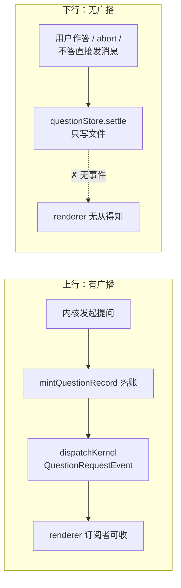

**图 6 — 上下行不对称：产生有中性事件，结算只落盘不广播**

后果具体到左栏：它能从 `question` 事件知道"这个会话多了一件待答"，但没有任何事件告诉它"那件事已经结束了"。唯一间接信号是 `toolCallEnd`，而 `ToolCallEnd` 的字段只有 `type / toolCallId / result / isError`（`session-state.ts:429`）——不带 `toolName`，renderer 无法判断这个 toolCallEnd 是不是 ask 的收尾。

#### 3.1.3 结算逻辑三处各写一遍

`questionStore.settle(...)` 在 `session-store.ts` 里有三个调用点，各自处理一种收尾路径：

| 调用点 | 触发场景 | 现有行为 |
|---|---|---|
| `answerQuestion`（定义 `:1823`，settle 在 `:1841`） | 用户经卡片作答 | settle + 分发（活路或续路） |
| `settleQuestionByToolCallEnd`（settle 在 `:1813`） | abort 等不经卡片的收尾 | settle，无广播 |
| `reconcilePendingQuestionsBeforeSend`（定义 `:1959`，settle 在 `:1980`） | 用户不答直接发新消息 | settle 为 cancelled + 合成 toolCallEnd（`:1981`） |

三处都是"把一张单子标记为终态"，但只有第三处附带了一个视图流事件，且那个事件是给流内卡片用的（`dispatch` 是视图流，只含激活会话），不是给跨会话消费方用的。这是 CLAUDE.md §1.1 判别气味三的典型形态——同一逻辑在多个入口各写一遍。补广播的正确做法不是在三处各加一行 `dispatchKernel`，而是把三处的 settle 收进一个私有方法，由它统一落账 + 广播。

### 3.2 补法一：跨会话查询

#### 3.2.1 PendingQuestionStore.listAll()

去掉 `listBySession` 的 `neutralSessionId` 过滤，其余逻辑（读目录、跳过坏文件、按 `createdAt` 升序）原样复用。返回全部记录，含三种状态——消费方自己按 `status` 过滤，因为"只要 pending"是消费方的判断，不是存储的职责。

#### 3.2.2 SessionsApi.getPendingQuestionsAll() + 四层 wire

命名与既有 `getPendingQuestions()` 并列，语义差别写在契约注释里：前者跨会话、含全部状态；后者激活会话、只含 pending。四层 wire 机械镜像现有 `pendingQuestions` 通道（`channel-contract.ts:206`）：加一个 key、controller 注册一行、`build-kernel.ts:295` 接一行、`plugin-context.ts:61`（现有 `getPendingQuestions` 那行的紧邻处）暴露一行。

#### 3.2.3 为什么这是通用能力而非为 ask 特供

判据是"壳是不是必须向每一个内核索要它"（CLAUDE.md §1.5）——不是，它压根不问内核，问的是壳自己的存储。所以它进的是 `SessionsApi`（壳的会话能力面），不是 `BaseBackend`（中立契约）。

它的消费方也不止 ask 徽章：系统通知插件（`plugins/system/notifier`，现在只在 `agentSettled` 且窗口不在前台时通知）可以据此在"有会话挂着未答问题"时提醒；titlebar 可以出一个全局待答计数。这也是它该做成 API 而不是让 ask 徽章自己去读文件的原因——插件读不到壳的私有目录，也不该读。

### 3.3 补法二：结算事件

#### 3.3.1 QuestionSettledEvent 形状

```ts
/** 中性提问结算事件:一张请求单进入终态(answered/cancelled)。
 *  与 QuestionRequestEvent 对称——上行有广播,下行也有,跨会话消费方
 *  (左栏待答徽章/通知/计数)据此消除标记,不必轮询 getPendingQuestionsAll。 */
export interface QuestionSettledEvent {
  kind: "questionSettled";
  /** 结算的单子 id。消费方以它做幂等键(集合删除天然幂等,§2.4.2)。 */
  requestId: string;
  /** 归属会话中立主键(消费方的 join 键,不必经 sessionKey 反查)。 */
  neutralSessionId: string;
  /** 请求来源会话(procs Map 的 key),与 QuestionRequestEvent 同字段同语义。 */
  sessionKey: string;
  status: "answered" | "cancelled";
}
```

它进 `KernelEvent` 联合（`kernel-event.ts:174`），因此天然经 `dispatchKernel` 投给所有 `onKernelEvent` 订阅者，与 `question` 事件走同一条通道——消费方一条订阅收齐上下行。

不带 `answers`：徽章只需要"这件事结束了"，答案内容是流内卡片和 dock 的事，它们从 `toolCallEnd` 或 store 拿。

#### 3.3.2 QuestionRequestEvent 补 neutralSessionId

现有 `QuestionRequestEvent`（`kernel-event.ts:53`）带 `sessionKey` 但不带 `neutralSessionId`。左栏的 join 键是 `neutralSessionId`（sessions-list 的 `phaseByPath` 等都按它索引，见 `sessions-list/renderer/index.tsx:526`），renderer 现在只能靠 `nsForSessionKey` 反查 `sessionInfos`（同文件 `:149`）——而提问常在会话尚未进列表时到达（新会话首次发送就可能提问），反查落空。

补一个字段，落账时从 `proc.neutralSessionId` 取（`session-store.ts` 的 `mintQuestionRecord` 已经在写这个字段进 store，`:1799`）。`injectQuestion` 路径（dsh 文件侧车桥）同样补——它的 `ownerProc` 查找逻辑已经在那里（`:2004`）。

#### 3.3.3 结算收口：三处 settle 统一走一个私有方法再广播

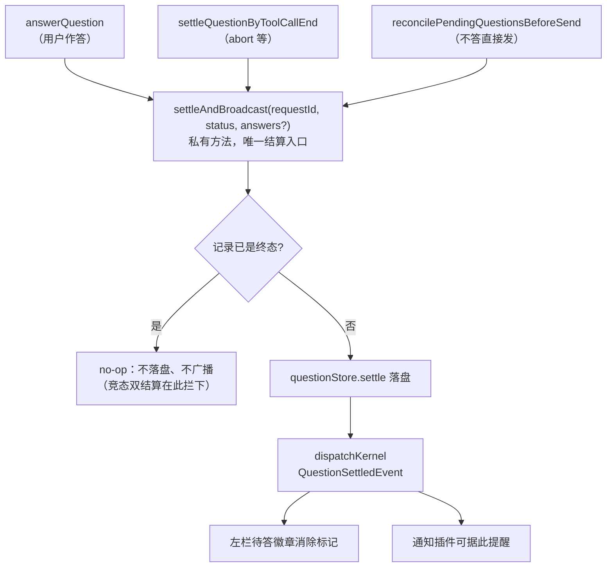

**图 7 — 结算收口：三条路径共用一个入口，服务端幂等 + 落盘 + 广播**

服务端幂等是这条链的第一道闸：`settleAndBroadcast` 先读记录，`status !== "pending"` 就直接 no-op。这样"用户作答的同时回合被 abort"只会广播一次，消费方即使不做幂等也拿不到重复事件。消费方侧用 `Set<requestId>`（§2.4.2）是第二道闸，两道都由结构保证幂等，与调用到达顺序无关。

这个收口是顺手清掉的一笔债，不是为徽章新增的机制——即使不做左栏提示，三处各写一遍 settle 也该收（CLAUDE.md §3.7 根因修复的"同一逻辑多入口"）。

### 3.4 为什么徽章不直接复用 WorkingPhase

一个看起来更省的方案：给 `WorkingPhase` 加第八个值 `"awaitingAnswer"`，左栏现有的 `PhaseIcon` 就自动能画待答态，一个新槽都不用加。这个方案不成立，三条理由。

#### 3.4.1 toolExecuting 与「待回答」是叠加态不是互斥阶段

ask 挂起期间，那个 `ask_user_question` 的 tool call 仍然是 running 状态——`advancePhase` 看到 `toolCallStart` 就返回 `toolExecuting`（`working-phase.ts:103`），而 ask 的 tool call 要到用户答完才有 `toolCallEnd`。所以"工具执行中"和"待回答"同时为真，是叠加态。`WorkingPhase` 是单值枚举，装不下叠加。

#### 3.4.2 扩 7 值联合会破坏 advancePhase 优先级语义

`advancePhase`（`working-phase.ts:89`）是一个按事件类型推进的状态机，每个 case 都假设"新事件覆盖旧阶段"。塞进 `awaitingAnswer` 就得回答：`toolCallStart` 之后来了 `question`，是覆盖成 awaitingAnswer 还是保持 toolExecuting？如果覆盖，ask 答完之后的 `toolCallEnd` 该回到什么阶段？`working-phase.test.ts` 里那套优先级断言全部要重写，而且新的优先级关系是 ask 的领域知识——又回到"业务语义进圆心"。

#### 3.4.3 计数比枚举诚实：一个会话可以同时挂多张未答单

`PendingQuestionStore` 允许同一会话有多张 pending 单（`listBySession` 返回数组，`ask-design.md` 的续问设计本来就支持"用户不答直接发新消息"，此时旧单悬着、新单又来）。枚举只能表达"在等"，表达不了"在等三件"。行级数据源用 `Set<requestId>` 能表达，将来 tooltip 想写"3 个问题待回答"也现成。

| | WorkingPhase 加值 | 独立徽章 + 主张集合 |
|---|---|---|
| 叠加态 | 装不下 | 天然支持 |
| 圆心改动 | 改 `working-phase.ts` + 重写测试 | 零（纯类型增补在 contributions） |
| 领域知识归属 | 进圆心 | 留 ask 插件 |
| 多张未答单 | 只能表达"有" | 能表达"有哪几张" |
| 第三方扩展 | 不可能（枚举闭合） | 加插件即可 |

## 4 ask 的内容迁移

### 4.1 交互主体搬到 composerTop（底部常驻）

#### 4.1.1 为什么 composerTop 是对位槽

三个条件全中：它渲染在输入框正上方（`ComposerDock` 内、输入药丸之前，`contributions.ts:297` 注释），符合"底部常驻"；它的组件 props 无、自订阅插件内状态，而 dock 是全局单例（只服务激活会话），正好不需要行上下文；它已被 `GoalBar` 验证过（`plugins/sessions/goal/plugin.json:36`，order 40）。

#### 4.1.2 AskDock 的状态来源：onQuestion 增量 + 挂载水合

dock 用的是既有的两条 API，都是本次改动之前就存在的：`ctx.sessions.onQuestion`（`plugin-context.ts:59`，实时增量）与 `ctx.sessions.getPendingQuestions()`（`:61`，激活会话基线）。它与 §2.4 的行级数据源是两套独立订阅——dock 服务激活会话的交互，行级数据源服务全部会话的行标记，前者可以随组件挂载建立（dock 只在 composer 里，composer 常驻），后者必须在模块加载期建立（§2.4.4）。

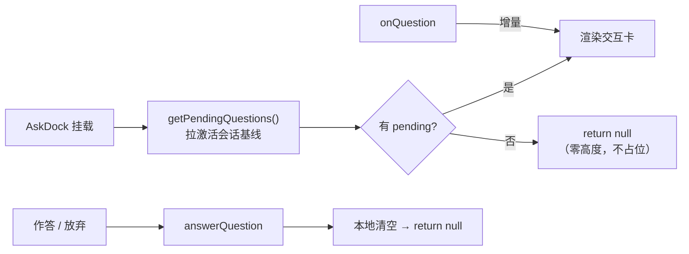

**图 8 — AskDock 的双通道状态来源，与流内卡片现有逻辑同构（`ask-question-card.tsx:76` 水合 + `:103` 订阅）**

这条逻辑从 `RunningQuestion`（`ask-question-card.tsx:93`）原样迁移，不是重写——迁移的好处是 `ask-question-card.test.tsx` 里那 238 行 DOM 交互断言大部分能跟着搬，只需把渲染入口从 `AskQuestionCard` 换成 `AskDock`。

#### 4.1.3 order 50：紧贴输入框、在 GoalBar（40）之下

`ComposerDock` 里 `composerTopNodes` 在输入框之前渲染（`timeline/renderer/index.tsx:1290`），order 小的在上。GoalBar 是 40，ask 用 50，视觉顺序是"目标条 → 提问卡 → 输入框"——提问卡紧贴输入框，符合"作答是当前最紧要的动作"。

#### 4.1.4 多题分页 / 多选 / 自定义 / 跳过 / 放弃的逻辑原样迁移

`RunningQuestion` 现有的全部交互语义保持不变：多题分页（`index` 状态）、单选点选即跳下一题、多选 checkbox 语义、自定义 textarea（Enter 提交 / Shift+Enter 换行）、跳过本题、放弃整组（发 `selected: []` 的空答案，由 `answerQuestion` 判为 cancelled，`session-store.ts:1840`）。`enrichQuestions`（`ask-question-card.tsx:40`）从工具入参补回 `multi_select` / `description` 的对账逻辑也一并搬——pi 的 `extension_ui` 帧装不下这两个字段，这个补偿是必需的。

### 4.2 流内卡片降级为只读

#### 4.2.1 pending：指引条（替代交互卡）

流内那张卡在 pending 时不再渲染交互控件，改成一条轻量指引（图标 + 一行文案"有问题待回答，请在下方输入框上方作答"）。它的作用是让读者在会话流里看到"这里模型问了一句"，并把注意力引向底部——上下文完整性由它保证，交互由 dock 保证。

#### 4.2.2 settled：SettledSummary 原样保留

`SettledSummary`（`ask-question-card.tsx:365`）一行不改：展开体仍渲染问句 + 选项（选中高亮）+ 答案，数据仍从 `toolCall.args.questions` 与 `toolCall.result.answers` 按 id 连接。回看历史时，答案就在它被问到的位置——这是转录的完整性，不能因为交互搬走就丢。

#### 4.2.3 复活态改由 dock 承担

现有卡片有一段复活逻辑（注释 `:71`，查询在 `:76`）：`toolCall.state` 不再是 running 时查 `getPendingQuestions()`，命中就恢复交互态（优先按 `toolCallId` 精确锚定，fallback 会话唯一 pending）。迁移后这段逻辑归 dock——dock 挂载时本来就拉基线，天然覆盖复活场景。流内卡片不再持有 `requestId`，也不再需要 `getPendingQuestions`，它的 props 收缩到只有 `toolCall` 与 `collapseDefault`。

| 卡片状态 | 判据 | 迁移前 | 迁移后 |
|---|---|---|---|
| 运行中 | `state ∈ {pending, running}` | 交互卡（订阅 + 提交） | 指引条（只读） |
| 复活 | 非 running 且 `result === undefined` 且查到 pending | 交互卡（复活态） | 指引条；交互在 dock |
| 已结算 | `result !== undefined` | `SettledSummary` | `SettledSummary`（不变） |

### 4.3 左栏待答徽章（填 §2 的槽）

#### 4.3.1 AwaitingBadge：order 50 抢 leading，不主张时回落

ask 声明 `{ id: "awaiting", component: "AwaitingBadge", placement: "leading", order: 50 }`，并导出配对 store（`badgeId: "awaiting"`，带 `claims`）。组件读模块级 store，本行有主张就渲染一个脉冲图标（`MessageCircleQuestion`，`animate-pulse`，颜色用 `--color-accent-warning`——警示语义，与未读圆点的 `--color-primary` 区分开），否则返回 `null`。实际上 leading 区解析（§2.3.1）已经保证只有主张命中时才挂载它，组件内的 null 分支是防御性冗余，不是主路径。

#### 4.3.2 数据：模块级 store 订阅 question/questionSettled，冷启动 getPendingQuestionsAll 拉基线

完全按 §2.4.2 的范式：`init(deps)` 里用 `deps.onKernelEvent` 建一条订阅，并调一次 `deps.sessions.getPendingQuestionsAll()` 拉冷启动基线（走通用 `sessions` 面，不经 deps 具名方法，§2.4.5 补充判定二）；订阅回调按 `kind === "question"` 往 `Map<ns, Set<requestId>>` 里加、按 `kind === "questionSettled"` 删；`claims()` 派生非空键集合；`version()` / `subscribe()` 供 `useSyncExternalStore` 用。冷启动基线按 `status === "pending"` 过滤。

#### 4.3.3 文案进 ask 自己的 locales

ask 插件目前**没有 locales 目录**，`ask-question-card.tsx` 里的中文全部硬编码（"请选择一个选项或填写自定义答案。"、"跳过本题"、"放弃整组问题"、"提交中…"等十余处）。这违 CLAUDE.md §1.2（内容该由语言插件贡献），是既存债。本次迁移顺手收：新建 `ask/locales/{zh-CN,zh-TW,en,de}/ask.json`，dock 与流内卡片的全部文案改走 `t()`，四语齐备。

dock 是新组件，文案本就必须进 i18n；而只让新组件进、旧组件留着硬编码，会让同一个插件并存两套文案机制，比现在更糟——所以一并收。

### 4.4 只读会话的语义冲突

#### 4.4.1 现状：matchedPolicy 命中时 composerTopNodes 照样渲染

timeline 有两处 `ComposerDock`：空会话态（`:1190`）与正常态（`:1290`），两处都是 `<ComposerDock>{composerTopNodes}{composer}</ComposerDock>` 形态——`composerTopNodes` 无条件渲染，而 `composer` 变量在只读态被换成 `readonlyBar`（`:1096`，判据是 `matchedPolicy`，定义在 `:478`：`sessionCustom` 命中某个 `composerPolicies` 贡献的 `customKey`）。

结果：子 agent 会话（`sub-agent/plugin.json:62` 声明了 `customKey: "subagent"` 的只读策略）里，输入框是"只读提示条"，但它上方的 GoalBar 照常渲染。AskDock 进来后同样会渲染——一个能回答问题却不能发消息的界面，语义矛盾。

#### 4.4.2 裁决：timeline 在只读态不渲染 composerTopNodes

改动是把两处的 `{composerTopNodes}` 换成 `{matchedPolicy ? null : composerTopNodes}`。语义一句话：**只读会话不接受任何输入型交互**。

#### 4.4.3 连带影响：GoalBar 在子 agent 会话不再可见

这个裁决会连带隐藏 GoalBar，是行为变更，需要显式记账：子 agent 会话上原本能看到目标条，改后看不到。

可接受的理由有两条。一是语义一致——目标条上带"停止 / 编辑 / 清除"按钮，在一个只读会话上显示可点的控制条，与"只读"本身就矛盾，现在能看到反而是漏的。二是子 agent 会话的目标由父会话驱动，在子会话上手工干预目标不是设计意图。

如果将来发现子 agent 会话确实需要只读展示目标，正确做法是给 `ComposerTopContribution`（`contributions.ts:297`）加一个布尔开关字段（如 `renderWhenReadonly?: boolean`），而不是回退这条裁决。这与 §2.3.2 反对的"新增声明式类型标签"是两类东西：那里反对的是加一个让引擎 `switch` 分支的 `kind`/`fallback` 枚举（把动态行为塞进静态声明），这里是加一个纯布尔行为开关（消费方读它做二值判断，不 switch）——类型戳与语义字段的区别。

## 5 迁移路径

### 5.1 三个现有指示的迁入

#### 5.1.1 PhaseBadge（leading，order 100）：rowIcon 四级取值链合一

现有 `rowIcon` 的四级取值链（图 1）整体搬进这一个组件：它读 `session.pinned`（props 里有）、`phase`（自己的模块级 store）、`active`（props 里有）。返回 Pin / PhaseIcon / 实心或空心 MessageSquare 之一。

它是 leading 区的兜底贡献方，而兜底的表达方式是**不提供 `claims`**（§2.3.2）——它仍然导出行级数据源（要维护每行的 phase 供组件渲染），只是那份数据不用于主张判定。它不需要维护一个含全部会话主键的集合，也不需要知道会话列表长什么样。order 取最大（100），保证它只在所有条件方都不主张时才被问到，行首永远有图标。

`phase` 的模块级 store 与 ask 的 store 同构：`init()` 里建一条 `onKernelEvent` 订阅喂 `advancePhase`，`processExit` / `rpcError` 归 idle（现有 `:204` 的逻辑原样搬），`Map<ns, WorkingPhase>` 供组件读。它**导出数据源但不带 `claims`**——落在 §2.6.1 三组合表的第二行（有数据、不参与主张判定）。

#### 5.1.2 UnreadBadge（trailing，order 100）：readState 持久化原样搬

三条耦合规则整体迁移：与已读位标比对（数据在 sessions-list 的插件 config，UnreadBadge 是 sessions-list 自己声明的贡献，读同一个 config 合法）、hover 让位（读 props 的 `hovered` 与 `hasChildren`）、激活会话自动已读（读 props 的 `active`，配合 store 里的位标推进）。

这是迁移里回归风险最高的一项（§6.3），因为它同时碰持久化、事件订阅、hover 交互三者。

#### 5.1.3 KernelUnloadedBadge（trailing，order 50）：纯字段，最简

读 `session.kernelLoaded === false` 就渲染 `TriangleAlert`，否则 null。零订阅、零持久化、零行级数据源（trailing 不查主张）——它是三个里最简的，适合作为**编码时的第一项**（先跑通查槽与渲染链路，再迁复杂的）。这是同一批 commit 内的编码次序，不是分批合入（§5.2.2）。

#### 5.1.4 拆订阅的等价性：为什么一条变两条不改变行为

commit 2 声称"左栏视觉与行为完全不变"，而迁移确实把一条 `onKernelEvent` 订阅拆成了 phase 与 unread 两条（订阅数 1 → 2）。这个变化是 §2.4.1 的显式取舍（每个徽章一条订阅，而不是每行每徽章一条），不是漏算。要成立的是"拆开不改变最终状态"，三条理由：

第一，两个 store 之间**没有数据依赖**。phase 读的是事件本身（`advancePhase(prev, event)`），unread 读的是事件里的 `entry.id` 与 config 里的位标，谁也不读对方的结果。现有那条订阅里两件事也是各写各的 state（`setPhase` 与 `recordEntry` 两个独立调用，`:210` 与 `:214`），本来就不是"unread 依赖 phase 已推进"的链式关系。

第二，React 18 的自动批处理保证两次 setState 仍落在同一批次。`dispatchKernel`（`session-store.ts:3118`）是同步循环投递给全部订阅者，两个 store 的更新在同一次同步调用栈内完成，渲染只发生一次——不会出现"phase 先渲染一帧、unread 后渲染一帧"的中间态。注意这条依赖投递是同步的，若将来 `dispatchKernel` 改成异步或分帧，本条论证失效，需要重新评估。

第三，订阅者投递顺序不影响结果。既然无数据依赖、且同批渲染，两个订阅者谁先收到事件都不改变最终状态——与 §3.3.3 的幂等闸是同一类保证：结果由结构决定，不由到达顺序决定。

对应的守卫写进 §7.2.3：断言同一 `entryAppended` 事件喂进去后，phase 与 unread 两个 store 的最终状态与迁移前单订阅时一致（用现有行为作基线对账，而不是各自断言自己想当然的值）。

#### 5.1.5 归属：三个都留在 sessions-list 自己声明

不为迁移制造新插件目录。三个指示的数据都是 sessions-list 的领域：phase 的 `advancePhase` 订阅本来就在它这里、readState 存在它的 config、kernelLoaded 是它已经在读的字段。拆成三个新插件只会增加目录数与 dependsOn 声明，不增加任何解耦——它们与 sessions-list 的变化方向完全一致（都是"会话行怎么显示"），变化方向一致的东西不该强行拆开。

对照 ask 徽章：它的数据是提问请求单，变化方向跟着 ask 走（提问语义变了它才变），所以它是独立插件的贡献。

### 5.2 顺序与不可分割性

#### 5.2.1 A → B → C 依赖链

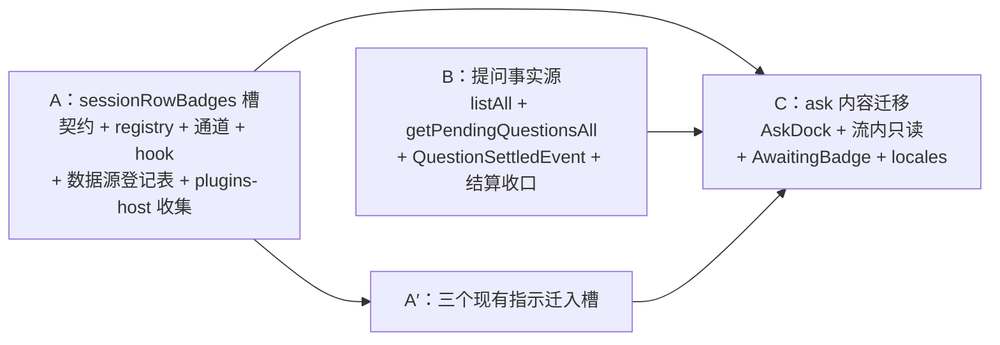

**图 9 — 四段依赖（A / B / A′ / C）：C 同时需要 A 的槽与 B 的事实源；A′ 是 A 的验收手段**

A′ 不是可选的收尾，是 A 的验收手段——如果现有三个指示迁不进新槽，说明槽的抽象不对，此时 C 还没写，返工成本最低。

#### 5.2.2 为什么不分阶段合入

先合 A 再合 C 会在中间态留下双轨渲染路径：sessions-list 里既有查槽渲染又有硬编码指示，两条路径并存期间任何行内显示问题都要先问"这是槽里的还是硬编码的"。CLAUDE.md §5.5 记的教训（8/26 前后端分离先合五步、灭火两天）就是这种中间态的代价。

A 与 A′ 必须同批：槽落地但没人用它，等于槽没被验证过，而 sessions-list 的硬编码还在——最坏的中间态。

#### 5.2.3 每个 commit 自身完整的切分点

| commit | 内容 | 自身完整性 |
|---|---|---|
| 1 | B：圆心两个事件类型改动 + `SessionsApi` 新方法 + store `listAll` + 结算收口（含幂等闸）+ 四层 wire + unittest | 契约与事实源就位；`questionSettled` 此批无消费方，但它是 `KernelEvent` 联合的合法成员，任何 `onKernelEvent` 订阅者都能收到，与 `capabilityDegraded` 等既有"先有事件后有消费方"的成员同性质，不是死代码 |
| 2 | A + A′：槽契约 + 数据源登记表 + registry + 通道 + hook + plugins-host 收集 + sessions-list 查槽 + 三个徽章迁入 + 测试 | 左栏视觉与行为完全不变（迁移等价），但机制已被三个真实贡献方验证 |
| 3 | C：AskDock + 流内只读 + AwaitingBadge + 行级数据源 + locales 四语 + 只读态裁决 + e2e 锚点更新 | 用户可见的新行为全部在这里 |

每个 commit 都能独立起 app 验证，不留半成品。

## 6 取舍与判据

### 6.1 五个已拍板分歧的取舍记录

| 分歧 | 选定 | 被否方案与理由 |
|---|---|---|
| 行级徽章的数据住哪 | 贡献方自持模块级单例，壳只管布局 | 框架统一状态表：订阅数最少（1 条），但"什么算待办"是业务判断，进壳违 CLAUDE.md §1.2、进圆心违 CLAUDE.md §4.5 |
| 提供几个位置区 | leading / trailing 两区 | 单区：ask 待答无处可放（trailing 已有未读）；三区（含 hover overlay）：overlay 当前无实例，属范围外预支 |
| 现有三个指示是否迁入 | 全量迁入 | 只加新机制：行内留两套渲染路径，硬编码数不减，下一个新指示还得改 sessions-list |
| leading 多命中怎么解析 | 主张集合单选，渲染前同步查表 | 挂载后测 DOM 取首个非空：双渲染开销 + 副作用重复触发 + 不可纯函数测试；叠加：行宽物理不够；硬编码优先级链：就是现状的病 |
| 徽章可否点击 | 纯展示，props 无回调 | 可点跳转：要与行点击、hover 操作区、拖拽排序三者理清事件优先级，收益（少点一下行）不抵复杂度 |

第四条另有一个看起来更省的替代方案需要记账：**"把候选都挂载进 `display: none` 容器、取第一个产出非空 DOM 的"**——不需要贡献方额外导出任何东西，纯靠渲染结果判定。它不成立的原因不是开销，是三条硬伤——`display: none` 下没有布局，"测量"无从下手；候选被挂载两次会重复触发 `init()` 之外的副作用（`useSyncExternalStore` 订阅、冷启动基线拉取）；胜者判定依赖 DOM 结果，无法写成纯函数测试。主张方案把"我有没有事"从 DOM 结果提前成数据查询，三条硬伤同时消失。

### 6.2 这个槽不解决什么

#### 6.2.1 不做跨插件数据共享

每个徽章自持数据，徽章之间不互读、不通信。如果 ask 徽章想读未读状态，正确做法是它自己订阅事件算一遍，不是去读 sessions-list 的 store——共享 store 互读写是 CLAUDE.md §8.2 明令禁止的插件间通信方式。

#### 6.2.2 不做徽章排序的用户自定义

`order` 是插件声明的静态值，用户不能拖拽调整。行内指示的顺序是设计决策（待答比未读重要），不是个人偏好。

#### 6.2.3 不做行内动作按钮

行尾的操作区（重命名 / 删除 / 原始文件）仍由 sessions-list 硬编码，不进这个槽。它们是**动作**不是**指示**，且带确认弹窗、下拉菜单、事件冒泡控制——是另一类抽象。真要做，那是一个独立的 `sessionRowActions` 槽，与徽章槽并列，不该塞进同一个契约。

### 6.3 风险登记

| 风险 | 概率 | 影响 | 缓解 |
|---|---|---|---|
| unread 迁移回归（持久化 + hover + 自动已读三耦合） | 中 | 高（未读是用户天天看的功能） | 迁移前先给现有行为补 DOM 测试基线，迁移后跑同一套断言；`readState` 的 config key 名不变，老数据直接可用 |
| 行级数据源在模块加载期建订阅，早于 i18n / 主题就绪 | 低 | 低（行级数据源只处理数据，不渲染文案） | `init()` 里只做订阅与基线拉取，不碰 `t()`；文案在组件渲染时才查 |
| 第三方插件用极小 order 抢占 leading | 低 | 中（行首被无关图标占据） | order 冲突是既有语义（各贡献型槽都这样），靠插件审查而非机制防护；文档写明 leading 是稀缺资源 |
| 想做条件主张却忘提供 `claims` 的 leading 贡献退化成兜底 | 中 | 中（本想条件主张，结果抢住行首所有行） | 消费方在 leading 候选未提供 `claims` 时 `console.warn` 一次，措辞陈述事实而不猜意图（"候选 X 未提供 claims，按无条件主张处理"，与 `block-renderer.tsx:27` 同手法），不静默；§2.3.2 已把"未提供 claims"定义为合法的兜底表达，所以这只能是提醒不是错误 |
| e2e 锚点位移 | 高（确定发生） | 中 | 见 §7.3.1 |
| 只读态隐藏 GoalBar 引起子 agent 会话体验变化 | 中 | 低 | §4.4.3 已记账；若需要只读展示，走 composerTop 的字段级扩展而非回退裁决 |
| 热装 ask 后行首图标从阶段换成待答 | 中（仅热装路径） | 低（图标替换，非布局跳动） | §2.2.4：首次启动有渲染闸门（`app-main.tsx:209`）不存在此情形；热装靠既有二次 bump 重拉；leading 是固定尺寸图标格，不改变行宽 |

## 7 测试策略

### 7.1 unittest

#### 7.1.1 resolveLeadingBadge：纯函数，输入是主张查询结果而非 DOM

主张方案的一个直接收益是解析可测。纯函数落在 `packages/react/src/session-row-badges.ts`，签名形如 `resolveLeadingBadge(items, hasClaims)`：`items` 是 order 升序的贡献项数组，`hasClaims` 是 `(pluginId, badgeId, ns) => boolean` 的查询函数（调用方注入，测试里给假实现）。断言五条，覆盖 §2.3.2 解析规则的两半：① 候选未提供 `claims` → 直接胜出（兜底路径，图 4 的 FB 分支）；② 有 `claims` 且不主张 → 落到下一个候选；③ 有 `claims` 且主张 → 胜出；④ 全部候选都提供 `claims` 且都不主张 → 返回 undefined；⑤ 同 order 取数组后者（与 `block-renderers.ts:50` 的 reduce 平手规则一致——`<=` 比较使后到者胜出，而数组序即注册序、注册序按 source 升序 builtin→installed→user→project，所以"数组后者"与"高优先级 source"是同一件事，`contributions.ts:483` 已写明这条等价）。

它不碰 React、不碰 DOM，是 CLAUDE.md §4.5 判据下的内层材料——不需要 mock 任何外部环境。

#### 7.1.2 PendingQuestionStore.listAll 与结算收口

`listAll` 断言：跨会话返回、坏文件跳过、按 `createdAt` 升序、含三种状态。结算收口扩 `session-store.ask-resume.test.ts`：三条路径（`answerQuestion` / `settleQuestionByToolCallEnd` / `reconcilePendingQuestionsBeforeSend`）各自断言收到一个 `questionSettled` 事件，且 `neutralSessionId` 非空、`status` 与路径语义一致（作答=answered、abort=按 result 判、prompt 前对账=cancelled）。

竞态专项：同一 `requestId` 连续结算两次，断言只广播一次（§3.3.3 的幂等闸）。这是本设计新增的守卫，对应 §6.1 第四条取舍里那个被否方案暴露出的真实边界。

#### 7.1.3 静态守卫：行级数据源模块不许碰 window.kernel

§2.4.5 那条实现纪律（行级数据源只从 `init(deps)` 拿能力）靠 code review 守不住，做成静态检查：扫 `src/plugins/**/renderer/**` 里导出 `sessionRowStores` 的文件，断言其中不出现 `window.kernel` 字样、不 import `usePluginContext`。与既有 `npm run audit:deps` 的十检验同类（都是 grep 式结构检查），挂进同一条命令。

### 7.2 DOM 交互 test

#### 7.2.1 ask-dock.test.tsx：水合 → 点选 → answerQuestion 入参对账

新增，逻辑从 `ask-question-card.test.tsx` 迁移大半。断言：挂载时 `getPendingQuestions` 被调且返回记录后渲染交互卡；点选 radio 后 `answerQuestion` 收到 `{ id, selected: [label] }`；多选勾两项收到 `selected` 两项；自定义输入收到 `custom`；跳过收到 `selected: []`；放弃整组收到全部题的空 selected。按角色查（`getByRole("radio")` / `getByRole("checkbox")`），不按 class。

#### 7.2.2 ask-question-card.test.tsx：断言不再渲染 radio/checkbox

现有 238 行断言大幅收缩：running 态断言出现指引文案（`getByText` 真文案，跑 i18n 字典）、断言 `queryByRole("radio")` 为 null；settled 态的 `SettledSummary` 断言原样保留（它没变）。

#### 7.2.3 sessions-list 行：徽章挂载顺序、hover 让位、拆订阅等价性

断言四组。单候选（commit 2 的真实形态）：leading 只有 PhaseBadge 一个候选、它不提供 `claims`，断言它走"直接胜出"路径渲染出阶段图标——这是 §2.3.2 兜底语义在最简配置下的落地，也是 §7.1.1 断言 ① 的 DOM 侧对应。多候选挂载顺序：leading 区在 ask 主张命中时渲染待答图标（`data-session-awaiting`）、不命中时渲染阶段图标；trailing 区未读与内核告警可同时存在。hover 让位：hover 时未读圆点消失、操作区出现。拆订阅等价性（§5.1.4 的守卫）：同一 `entryAppended` 事件分别喂给 phase store 与 unread store，断言两者最终状态与迁移前单订阅路径一致；再断言两个 store 无交叉读（phase 不读位标、unread 不读 phase）。

#### 7.2.4 行级数据源生命周期

断言 `init(deps)` 被调后订阅建立、`question` 事件让 `claims()` 多出一个主键、`questionSettled` 让它消失、同一 requestId 重复结算不产生异常状态（`Set` 幂等，§2.4.2）、`dispose()` 后不再响应事件、测试专用清空函数生效（§2.4.6）。

### 7.3 e2etest

#### 7.3.1 ask-question.e2e.mjs 锚点迁移到底部 dock

`data-ask-question` 这个锚点字符串不变，但它在 DOM 里的位置从 Virtuoso 列表内移到 `ComposerDock` 内，所以两个脚本里围绕它的**滚动与等待步骤**要改（`ask-question.e2e.mjs` 与 `ask-resume.e2e.mjs` 合计 9 处引用该锚点，其中涉及"滚到卡片再操作"的步骤全部删掉——它常驻可见，不需要滚）。常驻可见省掉了"滚到卡片"这一步，是这次改动的用户体验收益在测试侧的体现。

#### 7.3.2 ask-resume.e2e.mjs 新增：杀内核重启后 dock + 左栏徽章双双复活

现有 13 断言覆盖"杀内核 → 重启 → 卡片复活 → 续路作答 → 模型继续"。新增两条：重启后左栏对应会话行出现待答徽章（`[data-session-awaiting]`，验证模块加载期的冷启动基线生效）；作答后徽章消失（`questionSettled` 事件驱动，不是轮询）。

两个 e2e 脚本都已过 `scripts/demo/lib/quiet-env.mjs`（`MHD_WINDOW=hidden`，CLAUDE.md §5.6 的测试静默纪律），新增断言不改变这一点；跑完顺手 `npm run audit:quiet` 确认没引入弹窗路径。

覆盖矩阵：

| 改动 | unittest | DOM test | e2e |
|---|---|---|---|
| B 事实源 | ✓ `listAll` + 结算三路径 + 竞态幂等 | — | ✓ 复活后徽章消除 |
| A 槽机制 | ✓ `resolveLeadingBadge` 纯函数 + 静态守卫 | ✓ 挂载顺序 + hover 让位 + 数据源生命周期 + 拆订阅等价 | — |
| A′ 三指示迁移 | — | ✓ 视觉等价断言 | ✓ 现有 e2e 全绿即回归 |
| C ask 迁移 | — | ✓ dock 全交互 + 卡片只读 | ✓ 两脚本锚点与滚动步骤更新 |

## 8 全生命周期图

### 8.1 一条提问从模型发起到左栏徽章熄灭

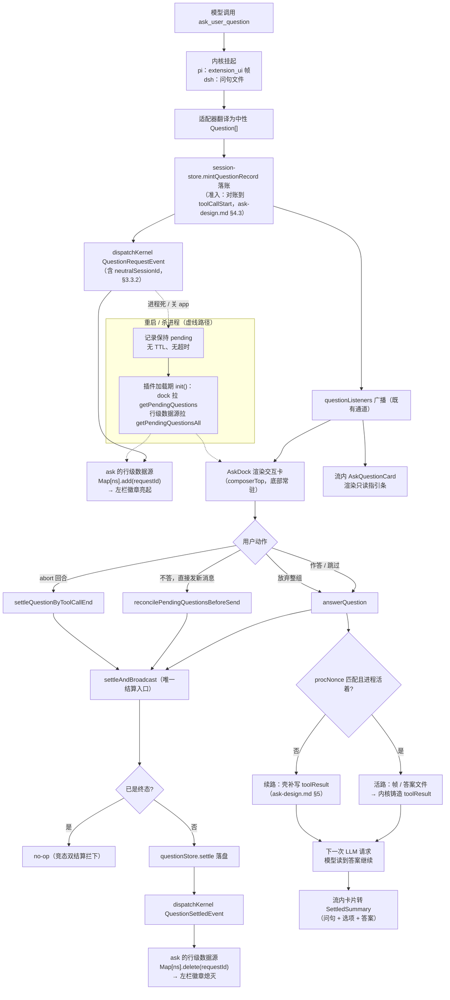

**图 10 — 一条提问的完整生命：上下行对称广播驱动左栏徽章亮灭，三条结算路径汇入同一入口并带幂等闸**

活路 / 续路的内部分岔不在本文范围，`ask-design.md §5` 是权威（本设计不改它一行）。

### 8.2 一个徽章贡献从声明到渲染的装载链

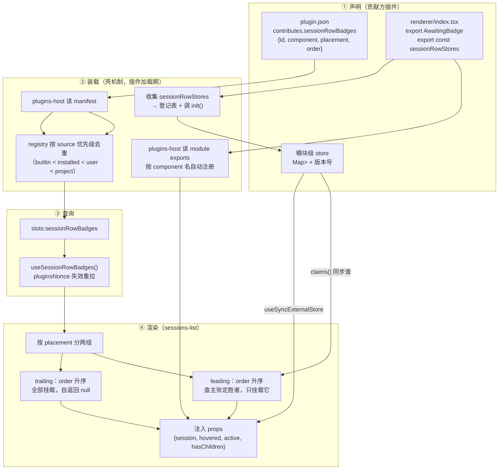

**图 11 — 装载链四段的归属切分（与图 3 互补：图 3 是"谁先调谁"的时序，本图是"每段归谁"的职责分层）：声明归贡献方、装载与查询归壳机制、布局归消费方、数据归贡献方**

## 9 QA

**Q：leading 区为什么不让贡献方在 manifest 里声明一个条件，而要额外搞一套行级数据源导出？**

manifest 是静态 JSON，表达不了"这个会话此刻有没有我的事"——那个判据是贡献方模块级 store 里的运行时数据（§2.4.2）。要让消费方在挂载前判定，只有两条路：把探测函数塞进契约（等于让壳认识"什么叫待回答"，违 §2.4.3），或者让贡献方导出一个数据查询接口。行级数据源是后者——它返回的是一组不透明会话主键，壳只做集合成员判断，语义仍在贡献方。额外的成本是一个模块导出与一张登记表，与 `auxParsers` / `composerCommands` 同构，不是新概念。

**Q：`init()` 在模块加载期被调，而插件拿能力的正常入口 `usePluginContext()` 是个 hook——这个矛盾怎么解？**

框架注入。`init(deps)` 的入参由 `plugins-host.ts` 在收集行级数据源时构造（§2.4.5），三项全是通用面——`onKernelEvent`（订阅）、`config`（读本插件配置）、`sessions`（`SessionsApi` 整体引用），都是壳的 renderer 侧从 `window.kernel` 转发而来。deps 里没有 `getPendingQuestionsAll` 这条具名方法——ask 经 `deps.sessions.getPendingQuestionsAll()` 调它，机制层的类型定义因此不认识"提问请求单"这个 ask 领域概念（§2.4.5 补充判定二）。插件代码里不出现 `window.kernel`（违 CLAUDE.md §8.1 的旁路）、不 import hook（加载期无渲染上下文）。注入包故意不给整个 `PluginContext`：fs / git / dialog 这些加载期用不到的能力不开放。同一手法在仓库里已有先例：`bootstrap` 给 `session-store` 注入 `BackendFactory`，给 `KernelManager` 注入 `KernelRuntime`（CLAUDE.md §9.3 的依赖倒置六形态）。

**Q：为什么不延迟到第一个徽章组件挂载时再 init，那就能直接用 hook 了？**

因为那把正确性押在"基线一定盖得住增量"上。ask 的基线（`getPendingQuestionsAll`）与 unread 的基线（config 位标）确实都可重建，但基线拉取是异步的：若 init 晚于前几条事件，异步基线读到的是拉取前的快照，而拉取期间到达的事件又被尚未建立的订阅错过——两边都接不住。模块加载期 init 没有这个窗口（§2.4.5）。额外好处是左栏折叠、分组收起、用户没滚到会话列表时数据照样在长，不会出现"提问早到了、徽章直到点开左栏才亮"。

**Q：一个会话同时有未答问题和未读消息，两个徽章会打架吗？**

不会，它们在不同区：待答在 leading（order 50，抢在阶段徽章之前），未读在 trailing。行首一个图标、行尾一个圆点，物理上不重叠。若将来有第二个插件也想在 leading 挂 order 50 的徽章，按 `resolveLeadingBadge` 的平手规则取注册序后者（高优先级 source 胜，与 `block-renderers.ts:50` 同规则），结果可预测、不随加载时序漂移。

**Q：`getPendingQuestionsAll()` 返回全部状态还是只返回 pending？为什么不在服务端过滤？**

返回全部，消费方自己过滤。理由是"只要 pending"是 ask 徽章的判断，通知插件可能想要"answered 但未 delivered"（补投失败的单子），计数视图可能想要三态各自的数量。服务端过滤会把某个消费方的判断固化进 API。存储层本来就读全目录（`pending-question-store.ts:47` 的实现是读目录后过滤），不过滤反而少一次遍历。

**Q：`QuestionSettledEvent` 会不会与 `toolCallEnd` 重复，让消费方收到两次结算信号？**

会有两个事件，但语义不同、通道不同、消费方不同。`toolCallEnd` 是会话流事件（`dispatch`，只含激活会话），流内卡片靠它把 `result` 回填进内容块；`questionSettled` 是运维流事件（`dispatchKernel`，全量会话带归属），跨会话消费方靠它。ask 徽章只订阅后者，压根不需要知道 toolCallId。两者都由同一个 `settleAndBroadcast` 触发（图 7），不会出现"一个发了另一个没发"。

**Q：用户作答的同时回合被 abort，同一张单子结算两次，左栏计数会错吗？**

不会，两道结构性防御。服务端：`settleAndBroadcast` 先读记录，`status !== "pending"` 即 no-op，第二次结算不落盘也不广播（§3.3.3）。消费方：行级数据源用 `Set<requestId>` 而非计数，同一 id 删两次第二次是 no-op（§2.4.2）。两道都不依赖调用顺序，且 §7.1.2 有专项 unittest 守着。（为何用集合不用计数见 §2.4.2：计数在竞态下双减、钳位到 0 又挡不住同会话多张单的情形。）

**Q：左栏折叠着、或者用户从没滚到会话列表，提问到达时徽章数据会不会丢？**

不会。行级数据源的订阅与冷启动基线都建立在**模块加载期**（§2.4.4），由 `plugins-host` 收集 `sessionRowStores` 时调 `init()` 触发，与任何组件是否挂载无关。插件加载完成即订阅就位，左栏后来才展开也照样是准的。这一点是刻意选择的：若把订阅绑在"第一个挂载的徽章组件"上，会出现"提问早到了、徽章直到点开左栏才亮"的观感缺口。

**Q：迁移未读徽章时，`readState` 的持久化数据会不会丢？**

不会。`readState` 存在 sessions-list 的插件 config 里（`ctx.config.get("readState")`，`sessions-list/renderer/index.tsx:115`），迁移后 UnreadBadge 仍是 sessions-list 自己声明的贡献（§5.1.5），读同一个 config、同一个 key。用户的已读位标跨版本连续。这条是 §6.3 里回归风险最高的一项，缓解措施是迁移前先给现有行为补 DOM 测试基线、迁移后跑同一套断言。

**Q：ask 插件被禁用或卸载，左栏会怎样？会话流里的问题还能答吗？**

左栏少一个待答图标，其余指示照常（阶段、未读、内核告警都不依赖 ask）——这是 CLAUDE.md §1.4 无特权差异的可检验形态。卸载时 `plugins-host` 的 `onUnloaded` 会调行级数据源的 `dispose()` 拆订阅（§2.4.4），不留悬挂监听器。会话流里的 `ask_user_question` 工具卡落回 timeline 的通用工具卡渲染（`blockRenderers` 无贡献时的兜底，`block-renderer.tsx:27` 会 warn），底部 dock 消失，问题无法作答。但请求单还在壳的 store 里（`PendingQuestionStore` 是壳的设施，不随插件卸载消失），重新启用 ask 后 `init()` 拉基线、dock 挂载即可答。这与 `ask-design.md §1.3` 的"提问 = 壳持有的持久请求单"一致：内核进程死过能续，插件卸载也能续。

**Q：只读会话（子 agent）里模型调了 ask_user_question 会怎样？**

dock 不渲染（§4.4.2 的裁决），流内指引条照常出现（它在会话流里，不受 composerTop 只读态影响），左栏徽章照常亮起。所以问题不会静默丢失——用户看得见"这个会话在等回答"，但当前界面上答不了。这是缺陷还是可接受？现状是可接受的已知边界：`reconcilePendingQuestionsBeforeSend`（定义 `session-store.ts:1959`）只在新消息发出前闭合悬空单，而只读会话发不出消息，单子会一直悬着，但悬着不产生错误状态（无 TTL，`ask-design.md §1.3`），且切回父会话仍能看见徽章。实际影响有限——子 agent 会话的 ask 由其父会话驱动，且 subagent 扩展通常不给工人会话装 ask 工具。若将来确实出现，正确修法是给只读态一个"仅作答"的窄入口，不是回退 §4.4.2。

**Q：`order` 字段在 `sessionRowBadgeItems()` 的返回里保留还是剥掉？既有槽是剥掉的。**

保留（§2.2.2 给了理由：leading 解析的纯函数 `resolveLeadingBadge(items, hasClaims)` 要从 `items` 每项读 `order` 字段，剥掉就只剩数组序这个隐式契约，测试无法直接断言"同 order 取后注册"）。
