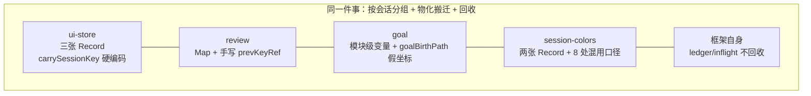
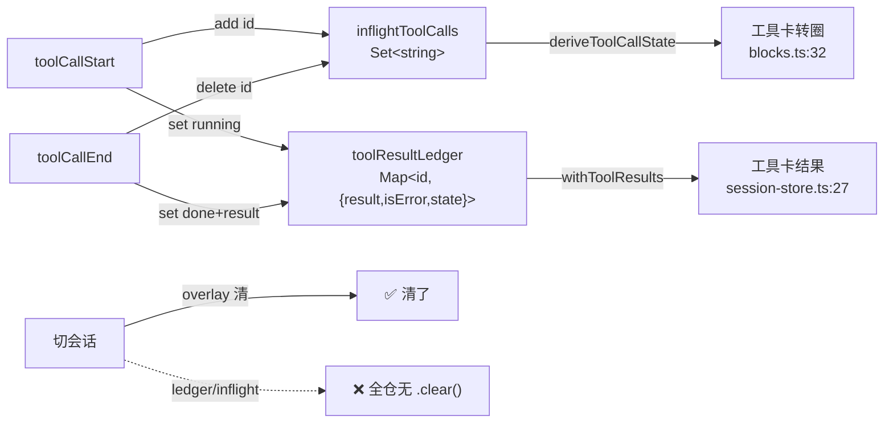
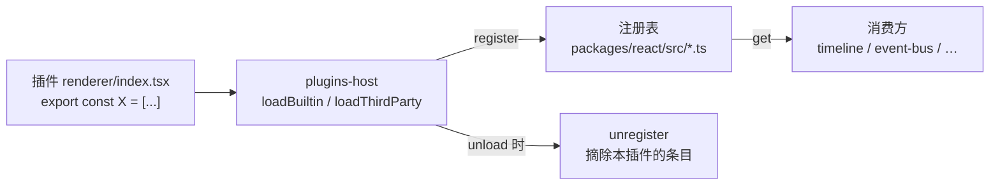
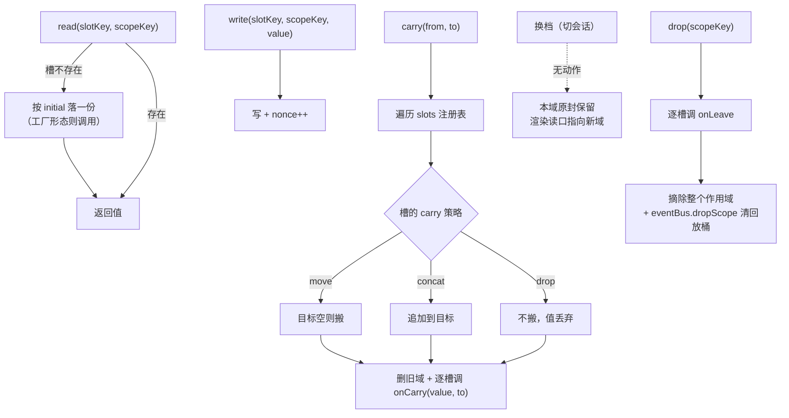
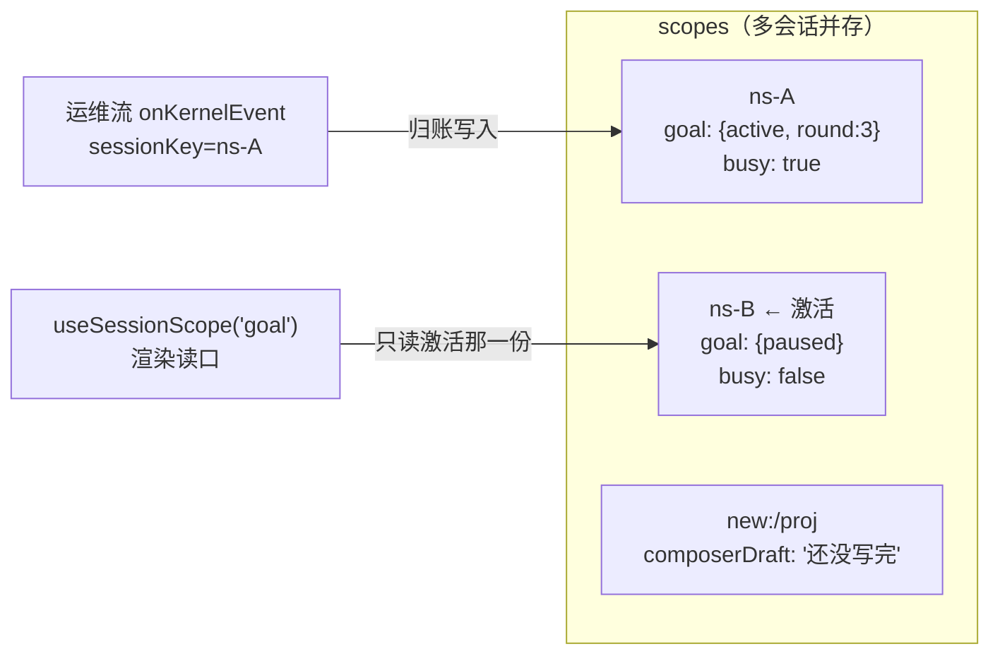
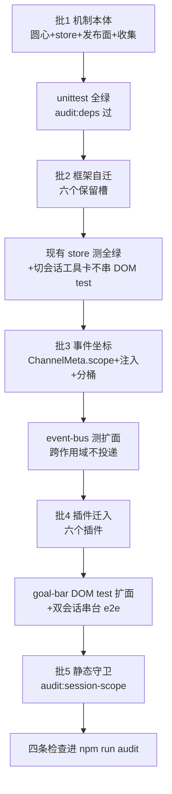
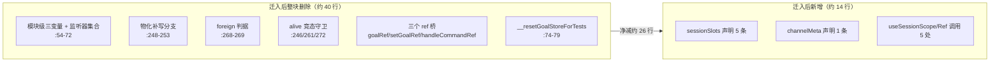
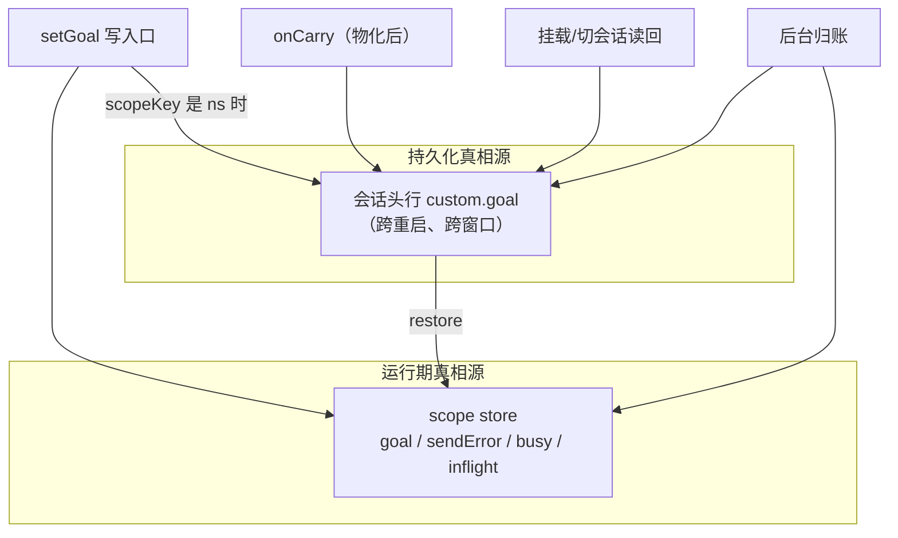
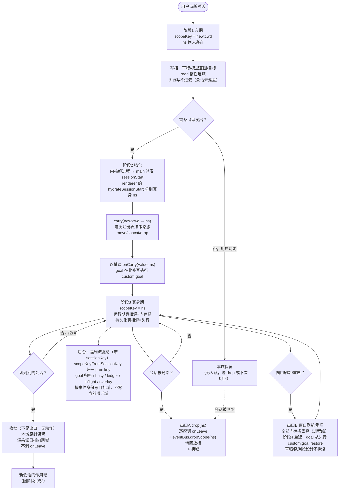

# 会话作用域：把「按 session 隔离」收成壳机制

my-harness-desktop 里有五处代码在做同一件事——把一份状态按会话分组、切会话时换档、物化那一刻把状态搬到新身份上。五处各写各的：`src/web/stores/ui-store.ts` 硬编码三张 map 加一个 `carrySessionKey`，`src/plugins/sessions/review/renderer/index.tsx:264-280` 手写第四张的迁移，`src/plugins/sessions/goal/renderer/goal-controller.ts:54-58` 自造第五张的假坐标，`src/plugins/sessions/session-colors/renderer/index.tsx` 八处混用两种 key 口径，而 `src/web/stores/session-store.ts:24` 与 `:345` 那两个框架自己的登记表压根不回收。五处五种做法，因为它们之间没有任何共享的抽象——「会话作用域」这个概念在壳里没有机制承载，于是每个需要它的地方就地发明一套。

本文把这件事收成一个机制：圆心出身份算法与槽契约，壳机制层出作用域容器，发布面出声明式 API，事件总线出作用域坐标。插件侧从「自己维护隔离」退化成「export 一个数组」，加第 N 张按会话的表，机制层零改动。

## 0 术语与进程边界

本文用到的项目术语，先一次性交代，后文不再解释。项目自身的架构纪律总纲是仓库根的 `CLAUDE.md`（下文引用一律写全「CLAUDE.md §x」，与本文自身的 §x 区分），设计文档在 `docs/design/` 下。

### 0.1 进程与目录

- **renderer 进程** —— React 前端，代码在 `src/web/`（stores / app / components）与 `src/plugins/**/renderer/`（壳插件的 UI 部分），发布面在 `packages/react/`。本文的作用域容器住在这一侧。
- **main 进程** —— 壳后端，代码在 `src/server/`（Electron main 或 Node 服务器双宿主）。内核子进程由它 spawn、持有、kill。两侧经 HTTP + WS 通信。
- **圆心** —— `packages/shared/src/domain/`，只有类型定义和纯函数，零外部依赖。换掉 Electron、React、任何内核，它都不动。
- **发布面** —— `packages/react/`，壳插件唯一能 import 的 API 层（另一个是 `packages/shared`）。

### 0.2 会话身份的三个坐标系

- **中立主键 ns** —— `neutralSessionId`，壳自己生成的会话主键，跨内核稳定（`docs/design/kernel-forkless-branch.md` §32 引入）。这是设计钦定的**身份**。
- **投影路径** —— `currentSessionPath` / `SessionInfo.path`，会话在某个内核里的地址。`packages/shared/src/domain/sessions.ts:37-39` 的契约注释写明「path 是当前内核的投影地址……投影地址是坐标系，不承诺磁盘上有文件」。它**不承担身份**。
- **壳键** —— `` `new:${cwd}` ``，还没落盘的新会话的临时身份。首条消息让内核起进程后，壳合成一个 `sessionStart` 事件，renderer 侧 `hydrateSessionStart`（`src/web/stores/session-store.ts:676`）拿到真身 ns——这一刻叫**物化**，壳键换成 ns 叫**换键**。

### 0.3 存储与事件

- **头行** —— 会话 JSONL 文件的第一行，是 header。desktop 的全部私有数据存在头行的 `custom-my-harness-desktop` 命名空间里（`docs/design/session-header-custom.md`），插件按域写入（`custom.goal`、`custom.subagent`）。它是**跨重启的持久化真相源**。
- **中立层** —— 壳自己的会话内容存储（`src/server/application/sessions/neutral-session-store.ts`），与内核存储格式无关。renderer 侧的内存投影是 `src/web/stores/neutral-mirror.ts`。
- **视图流 / 运维流** —— main 侧 `dispatch` 把内核事件分两路派发：视图流只投激活会话（`session-store.ts:3046` 的 `if (key !== this.activeProcKey) return`），运维流带 `sessionKey` 投全部会话含后台（`packages/shared/src/domain/events/kernel-event.ts` 的 9 个变体都带这个字段）。运维流有一份**事件类型白名单**（`session-store.ts:3026-3039`）：激活会话全量放行，后台会话只放行非 token 级的 13 种类型（含 `agentStart` / `agentSettled` / `toolCallStart` / `toolCallEnd` / `messageStart` / `messageEnd`），排除 `messageUpdate` / `toolCallUpdate` 两个刷屏源。§2.4.5 的设计依赖这份白名单，那里引了原文。
- **归账** —— goal 的术语：后台会话里模型调了 `set_goal`，按事件带来的 `sessionKey` 把状态写进**那个会话自己的**头行，不动当前会话。
- **装弹 / `armIfIdle`** —— goal 的术语：目标处于 active 且当前空闲（无回合在飞）时，立即发一轮续跑提示。`agentSettled` 是回合收敛事件，`busy` 由 `agentStart` / `agentSettled` 维护。
- **lineage** —— 会话里的一条线性历史（根 lineage 是最早那条，fork 出来的分支各是一条）。中立层条目 id 形如 `{lineageId}:{seq}`，所以条目 id 自带归属线索（§2.4.5 用到）。
- **overlay** —— `useSessionStore` 的一个字段，装执行态叠加层：乐观回显的 user 气泡 + 流式 pending assistant 占位。与中立层镜像合并成最终 `messages`（`mergeMirrorWithOverlay`），切会话时清空。
- **`sessionInfos`** —— renderer 侧当前项目的会话元数据表（`Record<path|ns, SessionInfo>`），由框架统一拉取与事件维护，是 `proc.key → ns` 归一的查表数据源。
- **`pluginsNonce` / `syncNonce` / `openNonce`** —— 三个「代际号」：某类事情发生一次就递增，消费方把它放进 useEffect deps 或组件 key 来触发重读/重挂载。本文的 `nonce` 是同一手法。
- **bus 地址** —— Session Bus（`docs/design/session-bus.md`）里一个会话的地址，形如 `session:<key>`。sub-agent 编排用它索引子会话，与会话身份是不同的坐标系（§4.5.3）。
- **两个内核** —— pi（`@earendil-works/pi-coding-agent`）与 dsh（deepseek-harness），同级、各交一个适配器。「dsh 会话」指记录的内核是 dsh 的会话；「迁移前旧 pi 会话」指中立层机制上线之前创建的 pi 会话，它们可能没有投影文件。
- **fork / clone** —— 从一条已有 lineage 派生新会话的两种动作：fork 在同会话内开新分支，clone 复制成一个新会话。两者都会让 main 侧 `proc.key` 经 `rekeyProc` 迁到新路径，这是 §0.3 那句「不再等于任何 renderer 侧的值」的成因。
- **图钉 / `ContentPin`** —— session-colors 插件（displayName「会话图钉」）的数据：用户手工钉在会话行或会话流消息上的带色标记，`{ id, color, x, y, messageId, preview }`，落插件 config。它是用户手工劳动的持久化产物，§3.3.2 因此对它的存量数据采取「必须迁移」而非「直接失效」。
- **`recomputeMessages`** —— `src/web/stores/session-store.ts` 里的函数，把中立层镜像内容与 `overlay` 叠加层合并成最终 `messages`（`mergeMirrorWithOverlay`）。工具结果就是在这一步从 `toolResultLedger` 补到内容块上的。
- **`proc.key`** —— main 侧进程账的键（`session-store.ts:104-107`）。初值等于投影路径或壳键，但 fork/clone 对账经 `rekeyProc` 迁到新路径后**不再等于任何 renderer 侧的值**。

## 1 问题

### 1.1 会话级上下文现在散在五处

本节数的是「自己发明了一套按会话隔离」的地方，共五处。迁移范围（§3）比这五处大：批 2 要动框架自己的态：ui-store 的四个字段（三张 `Record` + `pendingToolConfig`）与 session-store 的三个容器（`overlay` + 两个登记表），即表里第一行与第五行，批 4 一共动六个插件（goal / review / session-colors / sessions-list / llm-recorder / token-stats，见 §3.1.4），其中前三个正是本节表里「自造隔离」的那三处（goal / review / session-colors），后三个是另一类——没自造隔离、但用错或私藏了身份算法：`sessions-list` 的归一函数算法是对的、却是插件私有没上收（goal 因此拿不到同一转换，见 §3.4.1），`llm-recorder` 与 `token-stats` 则真的**用错坐标系**（拿投影路径当身份，见 §3.4.2）。两类问题同一个根：没有单源的身份算法。

#### 1.1.1 五处隔离五种做法

| 位置 | key 口径 | 状态容器 | 物化搬迁 | 回收 |
|---|---|---|---|---|
| `ui-store.ts:141/147/151` | `ns ?? new:${cwd}` | 三张 `Record` 字段 | `carrySessionKey` 硬编码三个字段名 | 无（切走只是没人读） |
| `review/renderer/index.tsx:134` | `ns ?? new:${cwd}` | `baskets: Map<key, ReviewComment[]>` | `:264-280` 手写 `prevKeyRef` 迁移 | 无 |
| `goal/renderer/goal-controller.ts:54-58` | 投影路径 | 三个模块级变量 + 四个 hook ref | `goalBirthPath` 假坐标 + 补写分支 | 仅 `foreign` 判据异步补清内存态，不释放资源 |
| `session-colors/renderer/index.tsx`（8 处）+ `pin-store.ts` | `ns ?? 投影路径` | 两张 `Record` | 无 | 无 |
| `session-store.ts:24/345` | 无（全局单例） | `toolResultLedger` / `inflightToolCalls` | 不适用 | **全仓无 `.clear()`** |

这张表要看的是列与列之间的不一致：同样是「按会话隔离」，五处用了三种 key 口径、四种容器形态（`Record` / `Map` / 模块级变量 + hook ref / 全局单例）。搬迁这一列只有两处有实现（且互不复用）；回收这一列只有 goal 有一处（只清内存态、不释放资源，也不覆盖框架自己的两个登记表）——等于没有机制。任何一处修对了，其余四处不会跟着对。


**图 1.1 — 五处实现互不知晓：没有任何一条边是「复用」，修好一处不会传导到其余四处**

#### 1.1.2 四种会话身份口径并存

§0.2 交代了三个坐标系，加上 main 侧的 `proc.key` 是四个，而且每个都在被当成身份直接拼装：

```ts
// ui-store 侧口径（timeline:118/470/838、review:134 跟这个）
currentNeutralSessionId ?? (currentCwd ? `new:${currentCwd}` : null)
// session-colors 侧口径（8 处）
currentNeutralSessionId ?? currentSessionPath
// goal 侧（goal-controller.ts:134/151/248）
currentSessionPath                                    // 直接用投影路径
// goal 后台归账（goal-controller.ts:330）
if (!key || key === useUiStore.getState().currentSessionPath) return;   // proc.key 比 投影路径
```

最后一条是坐标系错配的确证：左边是 main 侧 `proc.key`（fork 过就不等于投影路径），右边是 renderer 侧投影路径。fork 出来的会话会被误判成「后台会话」——视图流归一次账、后台再归一次账，`round` 双跳。

`f20248c1`（2026-09-04 的 commit，标题「重启/切会话后目标条不水合——openSession 误传投影路径而非中立 ns」）就是撞上口径分裂：goal 拿投影路径去调只认 ns 的 `openSession`，`neutralStore.get(path)` 查不到 → `custom.goal` 读不回 → 目标条消失。修法是**在 goal 里补一行 `?? sessionPath`**（`goal-controller.ts:262`），而不是把 key 口径收成单源。所以同类 bug 必然在下一个消费方复发——`session-colors` 那 8 处、`llm-recorder` 与 `token-stats` 那两处都还在用投影路径当身份。

#### 1.1.3 框架自己也有一份不回收的会话态

`toolResultLedger`（`session-store.ts:24`）和 `inflightToolCalls`（`:345`）是框架自己的会话态。注释（`:341-344`）写明存在理由：`toolCall` 块的 `state` 字段在内核消息里从不写入（生产恒 `undefined`），「工具正在执行、结果未回」这个量只能由事件序推导。


**图 1.2 — 切会话时 `overlay` 清了、两个登记表没清**

切会话时 `overlay`（流式占位与乐观回显）是清的——`openSession` 置 `overlay: []`、`startNewChat` 同样。但这两个容器全仓 grep 不到任何 `.clear()`。后果有两个，注意它们的解法不同：

- **跨会话撞 id（H）** —— `withToolResults`（`:27-46`）用 `ledger.get(block.id)` 补新会话镜像的内容块，`deriveToolCallState`（`timeline/renderer/blocks.ts:29-34`）查 `inflight.has(tc.id)`。若 A 会话的某个 toolCallId 与 B 会话的撞上，B 的工具卡会显示 A 的工具输出、或永远转圈。撞上的概率非零：pi 与 dsh 各自生成 id，`bashExecution` 还有合成块。**解法是隔离**——每个会话各一份登记表，撞 id 也不串，不需要「切走时清空」。
- **无界增长（M）** —— 每条工具调用一条记录，永不回收。goal 的默认轮数上限是 1000（`goal/plugin.json` 的 `settingsGroups.goal.maxRounds` default），一轮里模型调 3 到 5 个工具是常态，跑满一个 goal 会话就是数千条；跨会话累积更多。**解法是回收**——删除会话时释放，加上作用域数量的上界控制。

一个反直觉的点：切回 A 会话时 `recomputeMessages` 用旧 ledger 补 A 的镜像，工具结果居然还在，看起来「正确」。但这是靠不回收来实现正确性，属偶然正确——一旦撞 id，两边同时错。终态是「按会话隔离 + 删除时回收」，不是「永不清理，撞上算倒霉」。

### 1.2 通用抽象是「会话作用域」

#### 1.2.1 这一类问题的共同形状

把五处抽象一层，共同形状是三件事永远成对出现：

- **状态按会话分组** —— 每份状态有一个会话坐标，读的时候按当前会话取那一份。
- **物化瞬间要搬迁** —— 身份在换键那一刻切换（§0.2），切换瞬间旧键再没人读，挂在旧键上的状态全部变孤儿。这是 `ui-store.ts:191-204` 那段注释描述的根因，也是 `hydrateSessionStart` 要调 `carrySessionKey` 的唯一理由。
- **删除时要回收** —— 会话被删除时，它的作用域要释放（内存槽、事件回放桶）。

三件事的形状完全一致，差别只在参数：状态的类型是什么、搬迁时目标键已有值怎么办、回收时要不要落盘。参数级差异，按 CLAUDE.md §3.3 的判据（多个调用方逻辑大同小异、差别只在参数，就是一个逻辑的多次复制，该收敛到框架一个实现）该收敛。

| 三件事 | 参数化的那一维 | 落进契约的字段 |
|---|---|---|
| 状态按会话分组 | 状态的类型 `T` | `SessionSlot<T>` 的泛型 + `initial` |
| 物化瞬间搬迁 | 目标键已有值时怎么合并 | `carry: "move" \| "concat" \| "drop"` |
| 删除时回收 | 回收时做什么 | `onLeave(value)` |

**表 1.3 — 三类需求是同一抽象的三个参数，不是三套并列机制**

注意 §1.1.3 的教训已经内化在这里：**切会话换档不在三件事里**。换档只是「渲染读口指向另一个作用域」，本域原封不动保留（§2.3.3 的多会话并存）。把「切走」当成「离开作用域」去清账，会与「切回来还要读到真实瞬态」直接冲突——§4.5.5 用 goal 的 `busy` 槽给出了这个冲突的具体形态与判据。

#### 1.2.2 为什么「再加一张表」治不了

直觉的修法是：goal 缺会话坐标，那就给 goal 加一个 `Record<ns, GoalState>`；review 手写迁移，那就把它并进 `carrySessionKey`。这条路走不通，理由有三层，逐层加深：

- **每张表都要重写三件事** —— 加第 N 张表就要第 N 次实现分组、搬迁、回收。`ui-store.ts:191-204` 的注释已经预见到这一点：「按会话键暂存的 map 目前有三张（sessionModelPending / pendingQueue / composerDrafts），将来还会加第四张。逐张在切换点补一行 = 加一张忘一次（同一症状第二次修复）。收在这里后，新加的按会话态只需进本方法的搬迁清单，切换点永远只有一处。」
- **预言已经应验两次** —— 第四张（review baskets）进不来 `carrySessionKey`，只能自己手写 17 行迁移；第五张（goal）连迁移都没写，退化成自造 `goalBirthPath` 假坐标。注释里那句「加一张忘一次」已经应验两次。
- **机制层物理上看不见插件的态** —— `carrySessionKey` 住在 `ui-store`（renderer 的壳机制层），它能枚举的只有自己的字段。插件的按会话态住在插件模块里，机制层无法遍历。所以「把第四张加进 `carrySessionKey`」这条路对插件**本来就不通**：机制层枚举不到插件模块里的变量，加不了。

第三条是决定性的。缺的是一个**插件也能注册的容器**：注册表在机制层，遍历注册表就能搬迁所有槽，插件加槽不改机制。

`f20248c1` 的补丁路线已经验证过一次会复发：那次修的是 goal 读路径漏了 key 转换，修法是补一行 `?? sessionPath`。同一类口径错配在 `session-colors`（8 处）、`llm-recorder`、`token-stats` 上原样存在，因为修的是症状，不是坐标系分裂这个根。

### 1.3 现有机制具体不够在哪

#### 1.3.1 `carrySessionKey` 的预言与硬编码

实现（`ui-store.ts:415-437`）：

```ts
carrySessionKey: (from, to) =>
  set((s) => {
    if (!from || !to || from === to) return s;
    // 三张按会话暂存的 map 一起搬。目标键已有值时以已存在的目标值为准（不覆盖）
    const nextPending = { ...s.sessionModelPending };      // 硬编码 1
    const carriedPending = nextPending[from];
    delete nextPending[from];
    if (carriedPending && !nextPending[to]) nextPending[to] = carriedPending;

    const nextQueue = { ...s.pendingQueue };               // 硬编码 2
    const carriedQueue = nextQueue[from];
    delete nextQueue[from];
    if (carriedQueue?.length) nextQueue[to] = [...(nextQueue[to] ?? []), ...carriedQueue];

    const nextDrafts = { ...s.composerDrafts };            // 硬编码 3
    const carriedDraft = nextDrafts[from];
    delete nextDrafts[from];
    if (carriedDraft && !nextDrafts[to]) nextDrafts[to] = carriedDraft;

    return { sessionModelPending: nextPending, pendingQueue: nextQueue, composerDrafts: nextDrafts };
  }),
```

三段代码结构完全一样，只有字段名和「目标键已有值时怎么办」不同——`pending` 和 `drafts` 是不覆盖，`queue` 是追加。这两件事本该是**声明**（每个槽自己说我是 move 还是 concat），不是**实现**（在搬迁函数里给每张表写一个分支）。

上面引的注释想要的是「新加的按会话态只需进本方法的搬迁清单，切换点永远只有一处」。方向对，但「进搬迁清单」在硬编码实现下等于「改这个函数体」——切换点确实只有一处，**注册点却有 N 处**（每加一张表改一次同一个函数）。这是开闭原则的反面：对扩展不开放（加表要改代码），对修改不封闭（每次加表都动机制层）。

#### 1.3.2 review 手写第二遍迁移

`review/renderer/index.tsx:264-280`：

```ts
// 桶迁移只发生在"新会话首发落盘"一瞬：prevKey 是 new: 桶、当前拿到真实 sessionPath。
const prevKeyRef = useRef("");
useEffect(() => {
  const prevKey = prevKeyRef.current;
  prevKeyRef.current = sessionKey;
  if (!prevKey.startsWith("new:") || !currentNeutralSessionId) return;
  useReviewBasketStore.setState((s) => {
    const draft = s.baskets.get(prevKey);
    if (!draft?.length) return s;
    const next = new Map(s.baskets);
    next.delete(prevKey);
    next.set(currentNeutralSessionId, [...(next.get(currentNeutralSessionId) ?? []), ...draft]);
    return { baskets: next };
  });
}, [sessionKey, currentNeutralSessionId]);
```

这段和 `carrySessionKey` 的 queue 分支是同一逻辑：检测物化 → 从旧键取值 → 追加到新键 → 删旧键。差别只在容器形态（外层 `Map` vs `Record`）和触发方式（effect 侦测 key 变化 vs 被 `hydrateSessionStart` 显式调用）。

两处实现的语义还不完全一致，这是重复实现最典型的代价：`carrySessionKey` 由框架在换键那一刻**同步**调用，review 的 effect 是**渲染后异步**跑。两者之间有一个窗口：如果那个窗口里用户在真身会话加了评论，review 的追加会把它和搬过来的草稿混在一起；`carrySessionKey` 同步完成，没有这个窗口。两种触发时机的必然差。

#### 1.3.3 goal 的假坐标 `goalBirthPath`

`goal-controller.ts` 的模块级声明区（注释 `:48-53` + 三个变量 `:54-58`）里，`goalBirthPath` 的注释声明它的用途：

```ts
/** 模块级当前目标（可见会话单例）：GoalBar 在会话物化瞬间会重挂载，组件内 useState 被清，
 *  实测「设 goal 后 1s 内目标条消失、续跑停摆」。目标态上移到模块级，重挂载后读回；
 *  窗口刷新仍走会话头行持久化（下读 effect）。goalBirthPath 记目标诞生时的 sessionPath，
 *  用于区分「物化（同会话 new:→真身）」与「真切换（换了会话）」：前者保留内存态+补写真身，
 *  后者按新会话头行换档。 */
let currentGoal: GoalState | null = null;
let goalBirthPath: string | null = null;
```

声明是「记目标诞生时的 sessionPath」，实现是每次写状态都覆盖它（`:132`）：

```ts
const setGoal = useCallback((next: GoalState | null) => {
  goalRef.current = next;
  setGoalState(next);
  setCurrentGoal(next, sessionPath);   // ← 第二个参数就是 goalBirthPath
  …
}, [events, sessions, sessionPath]);
```

所以它实际记的是「最后一次写状态时所在的会话」。这个偏差直接决定 `foreign` 判据（`:268`）的正确性，而判据生效的前提是读头行成功：

```ts
void sessions.openSession(openKey)
  .then((detail) => {
    if (!alive) return;
    const restored = parseGoal(custom?.goal);
    if (restored) { setGoal(…); return; }
    const foreign = goalBirthPath !== null && goalBirthPath !== sessionPath && !goalBirthPath.startsWith("new:");
    if (foreign) setGoal(null); // 目标是别的会话的，切走即清
  })
  .catch(() => { /* 会话未就绪/读失败:保持无目标,下次切换再读 */ });   // :271
```

推演一条真实路径：在 A 设目标 → `goalBirthPath = A`；切到 B，B 的 `openSession` 失败（会话未就绪/读失败）→ 落进 `:271` 的 `.catch`。catch 里的注释写「保持无目标」，但代码路径是**什么也不做**，模块级 `currentGoal` 仍是 A 的目标——注释与实现相反。结果 B 的界面上挂着 A 的目标条，且 B 的 `agentSettled` 会驱动它续跑：A 的目标在 B 的会话里烧轮次。

物化补写分支（`:248-253`）更进一步，是带破坏性副作用的死代码：

```ts
const materialized = goalBirthPath !== null && goalBirthPath.startsWith("new:") && !sessionPath.startsWith("new:");
if (materialized && currentGoal) {
  void sessions.updateHeader(sessionPath, { custom: { goal: currentGoal } });
  goalBirthPath = sessionPath;
  return;
}
```

`new:` 前缀来自壳键形态，但 `sessionPath` 读的是 `useUiStore.currentSessionPath`——全仓 `setCurrentSessionPath` 的赋值点只有五处（`sessions-list:271`、`session-colors:127`、`session-store:473/493/685`），全是真实投影路径，新会话时是 `null`，没有一处写壳键。所以这个分支生产里**永不命中**。

它不是无害的死代码：一旦哪天有人真把壳键写进 `currentSessionPath`（`ui-store.ts:196` 的注释就在暗示读取侧一律用 `currentNeutralSessionId ?? new:${cwd}`，形态混用是趋势），这个分支会把 A 的目标写进 B 的头行并永久保留内存态——从展示串台升级成持久化串台，难查一个量级。

连带后果：`docs/design/goal.md` §9.2 承诺的「`new:` 壳物化：物化出真实路径时补写」**从未生效过**。未物化会话的目标只活在内存里，`setGoal` 的写盘条件 `if (sessionPath && !sessionPath.startsWith("new:"))`（`:134`）在 `sessionPath === null` 时跳过，物化后也没人补写（分支进不去）——新会话里设的目标，刷新即丢。

#### 1.3.4 事件 payload 没有坐标，`replayLast` 不分桶

goal 的状态广播（`goal-controller.ts:133`）：

```ts
events.emit("goal:state", { goal: next });   // 只有 goal，没有会话坐标
```

消费方 timeline 的输入框绿晕（`timeline/renderer/index.tsx:814-823`；绿晕 = active 目标时输入框药丸挂 `.pi-composer-goal` 的绿色光晕）：

```ts
const [goalActive, setGoalActive] = useState(false);
useEffect(() => {
  try {
    return ctx.events.on("goal:state", (payload) => {
      const goal = (payload as { goal?: { phase?: string } | null } | null)?.goal;
      setGoalActive(goal?.phase === "active");   // 无法校验这是谁的 goal
    }, { replayLast: true });
  } catch { return; }
}, [ctx.events, pluginsNonce]);
```

`replayLast` 的实现（`packages/react/src/event-bus.ts:180-182`）无条件回放最后一份 payload：

```ts
if (opts?.replayLast && state.hasLastPayload) handler(state.lastPayload);
```

而 `lastPayload` 是 `ChannelState` 的字段（`event-bus.ts:13-20`），每 channel 一份、不分桶。所以 timeline 任何一次重挂载——插件热装导致 `pluginsNonce` 变、上面那个 effect 的 deps 触发重订阅——都会拿到最后一个会话的目标态，绿晕挂错。

对照 `src/web/stores/neutral-mirror.ts:88`，这是全仓唯一的正面样板：

```ts
window.kernel.sessions.onNeutralChange?.((raw) => {
  const change = raw as NeutralChange;
  const cur = useNeutralMirror.getState();
  if (change.ns !== cur.ns) return;    // payload 自带坐标 + 消费方校验
  …
```

它做对是因为面对的是跨进程数据流（main 广播所有会话的变更），不校验就必错。机制面本来就有——`KernelEvent` 的 9 个变体都带 `sessionKey`。缺的只是内容层插件之间的 channel 没有这条纪律：`ChannelMeta`（`packages/shared/src/channel/channel-meta.ts:11-19`）有 `label` / `description` / `payloadExample` 三个可读性字段，没有作用域字段。

#### 1.3.5 机制层物理上看不见插件的态

这条是 1.2.2 第三层的展开，也是本设计与「把三张 map 挪个地方」这类修补的根本分界。

`plugins-host` 收集插件导出的机制已经存在四种：`channels`（`src/web/app/plugins-host.ts:46-51`）、`auxParsers`（`:52-56`）、`composerCommands`（`:57-61`）、`channelMeta`（`:48-49`）。四种都是同一个模式：


**图 1.4 — 插件声明收集已有四种同款机制，会话槽是第五种，不新开声明面**

`carrySessionKey` 不在这个模式里——它住在 ui-store，只能看见 ui-store 自己的字段。要让插件的态参与搬迁，必须让插件**注册**进来，机制层遍历注册表。这是本设计的核心结构决策，§2.3.2 落地。

## 2 机制

### 2.1 四条不变量

机制要保证什么，先说死。后面所有设计决策都是这四条的推论，四条各自对应 §1 的一个缺口：

| 不变量 | 内容 | 对应缺口 | 落地节 |
|---|---|---|---|
| **身份单源** | 「当前会话是谁」只有一种算法，出自圆心纯函数；投影路径不承担身份 | §1.1.2 四种口径 | §2.2.1 |
| **声明即隔离** | 插件 export 一个数组就拿到按会话隔离的状态，零样板 | §1.1.1 五处各写 | §2.4.1 |
| **搬迁自动化** | 物化瞬间所有槽一起搬，遍历注册表而非硬编码字段名 | §1.3.1 硬编码三张 | §2.3.2 |
| **回收有钩子** | 作用域终结（删除会话 / 插件卸载）时框架保证调用 `onLeave`，钩子实现由声明者提供；换档与物化丢弃都不调（四个时机的全表见 §4.5.5） | §1.1.3 无处回收 | §2.3.2 |

两条纪律藏在不变量背后，单独点明：

- **身份单源靠物理隔离而非约定** —— 配合 §3.5.1 的静态守卫，手写 key 拼装在 CI 里就报错。CLAUDE.md §1.1 的原话是「这条纪律的执行不靠自觉，靠物理隔离」。
- **钩子由声明者提供而非机制层猜测** —— 框架不知道 `toolResultLedger` 该 `clear()` 还是该落盘，声明它的代码知道。这是依赖倒置的标准形态：机制层拥有抽象（「回收时会被调用」），声明者提供实现（「调用时做什么」）。

### 2.2 圆心：身份算法与槽契约

新增 `packages/shared/src/domain/session-scope.ts`，零依赖纯函数 + 纯类型（符合 CLAUDE.md §6.2 对圆心「装什么/不装什么」的规定）。

#### 2.2.1 `sessionScopeKey` 的四形态收敛

```ts
/** 会话作用域 key 的唯一算法（契约单源，CLAUDE.md §1.3）。
 *  已物化会话 = 中立主键 ns（跨内核稳定，docs/design/kernel-forkless-branch.md §32）；
 *  未物化壳 = `new:${cwd}`（与草稿/队列/模型 pending 同一口径）；
 *  两者皆无 = null（没有激活会话，调用方不该读写任何槽）。
 *
 *  投影路径不参与：它是内核坐标系（SessionInfo.path 契约明写「不承诺磁盘上有文件」），
 *  承担身份会让 dsh 会话与迁移前旧 pi 会话落到错误的桶上。 */
export function sessionScopeKey(ns: string | null, cwd: string | null): string | null {
  if (ns) return ns;
  return cwd ? `new:${cwd}` : null;
}
```

四个口径的去留：

| 口径 | 处置 | 理由 |
|---|---|---|
| `currentNeutralSessionId` | **成为身份**（经 `sessionScopeKey`） | 跨内核稳定，设计钦定 |
| `` `new:${cwd}` `` | **成为未物化态的身份**（经 `sessionScopeKey`） | 已有三张 map 与草稿/队列都在用，统一口径而非新造 |
| `currentSessionPath` | 退回原职责：发送、文件操作、内核投影 | 不承担身份 |
| `proc.key` | 经 `scopeKeyFromSessionKey` 归一 | main 侧坐标系，renderer 消费前必须转换 |

#### 2.2.2 `scopeKeyFromSessionKey`：`proc.key` 归一

`sessions-list/renderer/index.tsx:149-150` 已经有一个私有实现：

```ts
const nsForSessionKey = (sessionKey: string): string =>
  useSessionStore.getState().sessionInfos?.[sessionKey]?.neutralSessionId ?? sessionKey;
```

它解决的问题是真实的——运维流给的是 `proc.key`，要和列表行（按 ns 索引）对上必须先转换。但它是插件私有的，goal 的后台归账需要同一个转换却没有，于是拿 `proc.key` 直接比投影路径（§1.1.2 末段的错配）。

收进圆心，查表函数由调用方注入。归一在 **renderer 侧**执行（消费运维流的那一侧），查的是 renderer 内存里的 `sessionInfos`（由 main 广播维护）——圆心零 IO，所以查表必须由外层传进来：

```ts
/** main 侧 proc.key → 作用域 key 的归一（renderer 侧消费运维流前调用）。
 *  proc.key 初值等于投影路径或壳键，但 fork/clone 对账经 rekeyProc 迁移后不再等于
 *  任何 renderer 侧的值——消费前必须查表转换。lookup 由调用方注入（圆心零 IO）：
 *  命中即返回中立主键，未命中说明 key 本身就是 ns（正常态）。 */
export function scopeKeyFromSessionKey(
  sessionKey: string,
  lookup: (sessionKey: string) => string | undefined,
): string {
  return lookup(sessionKey) ?? sessionKey;
}
```

`sessions-list` 换成调它，goal 后台归账自动获得同一转换。这是 CLAUDE.md §1.1 判别气味三（「同一业务逻辑在多个外部入口各写一遍 → 该收进内层统一承担」）的直接应用。

#### 2.2.3 `SessionSlot` 契约五字段

```ts
/** 一个会话作用域槽的声明。插件 export const sessionSlots: SessionSlot[] 即完成注册。 */
export interface SessionSlot<T = unknown> {
  /** ① 槽 id（同插件内唯一）。框架按 `${pluginId}:${id}` 命名空间存储，插件侧只见 id——
   *  与 PluginIdContext 自动注入 pluginId 同一手法（CLAUDE.md §8.3 零硬编码：
   *  插件代码里不出现自己的 id 字面量）。 */
  id: string;

  /** ② 初始值或工厂。值本身是可变容器（Map/Set/数组）时**必须**用工厂形态：
   *  若写 initial: new Map()，所有会话会共享同一个实例，隔离当场失效。 */
  initial: T | (() => T);

  /** ③ 物化搬迁时的合并策略（缺省 "move"）。见 §2.2.4。 */
  carry?: CarryPolicy;

  /** ④ 回收钩子：由框架在两个时机调用——drop（删除会话）与插件卸载（§2.4.4）；
   *  这是仅有的两个调用点。切会话换档与 carry 的 "drop" 策略都**不**调它
   *  （前者本域保留、§2.3.3；后者值随旧域不可达由 GC 回收、§2.2.4）。
   *  四个时机的完整对照表见 §4.5.5。 */
  onLeave?: (value: T) => void;

  /** ⑤ 搬迁后钩子：carry 把值搬进新键之后由框架调用一次。
   *  value = 搬进新键的那份值；toKey = 新作用域 key（真身 ns），由 carry 在调用时
   *  **作为参数传入**，不是回调内部去读当前 scopeKey——这是有意的设计，见 §2.2.5。
   *  用途：内存态搬好了，但持久化真相源（头行）还挂在旧身份上写不进去——
   *  在这里补写。goal 用它在物化后把 custom.goal 写进真身头行（§3.2.3）。
   *  异步实现由声明者自理（fire-and-forget），框架不 await、不重试。 */
  onCarry?: (value: T, toKey: string) => void;
}
```

`initial` 必须允许工厂形态。反例就在框架自己的槽里：`toolResultLedger` 的值是 `Map<string, …>`，若声明成 `initial: new Map()`，注册时求值一次、所有会话共享同一个 Map 实例，A 会话的工具结果直接出现在 B 会话的工具卡上——隔离从第一行就失效。框架在 `registerSessionSlots` 时对**值形态的可变容器**（对象/数组/Map/Set）发 dev 告警，提示改用工厂，把这个坑拦在注册期而不是运行期。

#### 2.2.4 carry 三策略是同一抽象的参数

```ts
/** 物化搬迁（壳键 → 真身 ns）时，目标键已有值的处置。
 *  三种是同一件事的参数化，不是三类槽：都是「旧键的值怎么进新键」。 */
export type CarryPolicy =
  | "move"    // 目标为空则整体搬过去；目标已有值则以目标为准（草稿、模型意图、目标态）
  | "concat"  // 追加到目标已有值之后（评论篮、待发队列）
  | "drop";   // 不搬（在飞瞬态：流式占位、工具在飞登记——搬了就是把壳态当真身态）
```

**`carry:"drop"` 策略与 `drop(scopeKey)` 动作同名，是两件事，必须分清**（这是本文最易混淆处）：

| | `carry:"drop"`（策略） | `drop(scopeKey)`（动作） |
|---|---|---|
| 是什么 | `SessionSlot.carry` 字段的一个取值 | 作用域容器的四个动作之一（§2.3.2） |
| 何时发生 | 物化搬迁（壳键→ns）时，该槽的值不参与搬迁 | 会话被删除时，整个作用域被摘除 |
| 调 `onLeave` 吗 | **不调** | 逐槽调 |
| 旧值去哪 | 随旧域 `scopes.delete(from)` 一起变不可达，由 GC 回收 | 调完 `onLeave` 后随域摘除 |

（`onLeave` 还有第二个调用点——插件卸载时的 `unregisterSessionSlots`，§2.4.4；四个时机的完整对照见 §4.5.5。）

所以一个 `carry:"drop"` 的槽（如 `toolResultLedger`）在物化时，它的旧 Map 不会触发 `onLeave`——物化丢弃的旧值靠 GC 回收：`carry` 末尾 `s.scopes.delete(from)` 之后旧域整体不可达。这对 `toolResultLedger` 这类纯数据 Map 足够（无外部订阅、无定时器，不可达即可回收）。`onLeave` 的两个调用点是删除会话与插件卸载，不是物化（四时机全表见 §4.5.5）。

`onLeave` 存在的意义是给**持有外部资源**的槽（订阅、定时器、文件句柄）一个显式释放点——这类资源 GC 不会自动回收。框架六个保留槽里只有 `toolResultLedger` / `inflightToolCalls` 声明了 `onLeave`（都是 `.clear()`），且它们同时是 `carry:"drop"`——意味着物化时不 clear（靠 GC），删除会话时才 clear（§2.6.1）。插件若有持订阅的槽，`onLeave` 是它唯一的释放时机。

三策略与现有实现的对应：

| 策略 | 现有实现 | 现有行为 |
|---|---|---|
| `move` | `carrySessionKey` 的 `pending` / `drafts` 分支 | `if (carried && !next[to]) next[to] = carried` |
| `concat` | `carrySessionKey` 的 `queue` 分支 + review 手写迁移 | `[...(next[to] ?? []), ...carried]` |
| `drop` | 无（这正是 §1.1.3 的缺口） | 新增：不搬，值随旧域一起丢 |

`drop` 是新增策略，因为现有机制压根没有「这份态不该跨身份存活」的表达——`overlay` 的清空散落在 `openSession` 与 `startNewChat` 两处，两个登记表的回收则完全缺席。有了 `drop`，「瞬态不搬」成为一条声明而不是两处散落的赋值。

为什么这是参数化而非声明式类型标签那种反模式，§4.2 专门论证。

#### 2.2.5 `toKey` 参数化：钩子里的身份不随渲染态漂

`onCarry` 的第二个参数是 `carry` 调用时的 `to`，而不是回调执行时去读 `useCurrentScopeKey()`。这么设计是为了防一个真实竞态：`carry` 里 `onCarry` 放在 `queueMicrotask` 里调用（§2.3.2，为了不在 zustand 的 reducer 里做副作用），microtask 执行前用户完全可能又切走了会话。若钩子内部读当前 scopeKey，goal 的头行补写就会写进**用户刚切过去的那个会话**——A 的目标写进 B 的头行，正是 §1.3.3 里那个死代码分支想干而没干成的破坏。

参数化之后钩子写的是「carry 当时的目标身份」，与用户此刻看哪个会话无关。同一条纪律适用于所有异步钩子：`onLeave` 的参数是值本身、身份由 `drop(scopeKey)` 的入参决定，也不读渲染态。

### 2.3 壳机制：作用域容器

#### 2.3.1 存储形状：双层 Map 与命名空间槽 id

新增 `src/web/stores/session-scope.ts`（renderer 进程，与 `ui-store` / `session-store` 同侧）：

store 实例名统一为 `useSessionScopeStore`（zustand 惯例），它的状态类型是 `SessionScopeState`；发布面给插件的 hook 叫 `useSessionScope`（§2.4.2）——三个名字分别指「状态形状 / store 实例 / 插件读口」，不混用。

```ts
interface SessionScopeState {
  /** scopeKey → (slotKey → 值)。多会话并存：后台会话的槽也在，不只激活那一份。 */
  scopes: Map<string, Map<string, unknown>>;
  /** 槽注册表（**单源**）：slotKey → 声明。carry/drop 遍历它，不硬编码字段名。
   *  发布面的 registerSessionSlots 写的就是这张表（§2.4.1），不另存一份。 */
  slots: Map<string, SessionSlot>;
  /** 变更代际：任何写递增，hook 据此订阅（与 pluginsNonce / syncNonce 同款手法）。 */
  nonce: number;
}
```

**`slotKey` 是「命名空间化的槽 id」**，由框架拼：插件声明 `{ id: "goal" }`、pluginId 是 `goal`，`slotKey` 就是 `"goal:goal"`。插件侧调 `useSessionScope("goal")`，框架按 `PluginIdContext` 注入的 pluginId 拼出 `slotKey`。（用 `slotKey` 这个名字而非 `nsId`，是为了不与 §0.2 的中立主键 `ns` 撞前缀。）

为什么用 `Map` 而不是 zustand 的普通对象字段：作用域数量随会话数增长且频繁增删，`Map` 的删除是 O(1) 且不产生新对象引用扩散；对象形态每次删键都要重建整份，`scopes` 越大越贵。`review-basket-store` 已经选了 `Map`，是同一取舍。

#### 2.3.2 四个动作 read / write / carry / drop


**图 2.1 — 四个动作。换档不是动作：它只是读口的 scopeKey 变了，本域不动**

`carry` 的核心是遍历注册表：

```ts
carry: (from, to) => set((s) => {
  if (!from || !to || from === to) return s;
  const src = s.scopes.get(from);
  if (!src) return s;
  const dst = s.scopes.get(to) ?? new Map();
  const carried: Array<[string, unknown, SessionSlot]> = [];
  for (const [slotKey, slot] of s.slots) {
    if (!src.has(slotKey)) continue;
    const v = src.get(slotKey);
    switch (slot.carry ?? "move") {
      case "move":   if (!dst.has(slotKey)) { dst.set(slotKey, v); carried.push([slotKey, v, slot]); } break;
      case "concat": { const merged = concatValues(dst.get(slotKey), v); dst.set(slotKey, merged); carried.push([slotKey, merged, slot]); } break;
      case "drop":   break;                       // 不搬；值随旧域一起丢
    }
  }
  s.scopes.delete(from);
  s.scopes.set(to, dst);
  // carry 本体同步完成（换键那一刻）；onCarry 钩子放到 microtask 里调，避免在
  // zustand 的 reducer 内做副作用（钩子里会发 IPC）。钩子拿到的 to 是闭包捕获值，
  // 不是回调时再读当前 scopeKey——理由见 §2.2.5。
  queueMicrotask(() => { for (const [, v, slot] of carried) slot.onCarry?.(v, to); });
  return { scopes: new Map(s.scopes), nonce: s.nonce + 1 };
}),
```

`concatValues` 需要知道值的形态。首版按数组语义实现（`[...(dst ?? []), ...src]`），非数组值降级为 `move` 并在 dev 环境 `console.warn`——显式降级、不静默吞掉（CLAUDE.md §1.5 把「静默缺面」列为唯一不允许的状态，这里沿用同一取向）。现有需要 `concat` 的两处（`pendingQueue` 的值是 `QueuedMessage[]`、review baskets 迁入后的槽值是 `ReviewComment[]`）都是数组，覆盖完整。（`session-colors` 的 `contentPins` 不在此列——它是落盘的跨会话索引，不进作用域容器，理由同 §4.5.4。）将来出现 Map 形态的 concat 需求，扩 `SessionSlot` 加一个 `concatBy?: (dst, src) => T`，机制层结构不变。这是有意的延后：`concatBy` 现在没有消费方，预支就是范围外建设。

调用点只有一处，就是现有 `carrySessionKey` 的唯一调用者（`session-store.ts:701`，在 `hydrateSessionStart` 内）：

```ts
useSessionScopeStore.getState().carry(`new:${cwd}`, ns);
```

`hydrateSessionStart` 的其余部分一行不改。

**`drop` 的调用点**同样只有一处：`session-store.ts:446` 的 `removeSessionRows(paths)`。删除会话有三条路径——单删与批删（`sessions-list/renderer/index.tsx:321-322`、`:337-338`，调 `ctx.sessions.deleteSessions` 后紧接 `removeSessionRows`）、外部删除广播（`session-store.ts:772`）——三条全部汇聚到它，而且它已经做了「同时按投影路径与 ns 删行」的双键清理：

```ts
removeSessionRows: (paths) => {
  …
  for (const p of paths) {
    const cur = map[p];
    if (cur?.neutralSessionId) delete map[cur.neutralSessionId];   // ← ns 已在手
    delete map[p];
  }
  …
}
```

`drop` 挂在 `delete map[cur.neutralSessionId]` 旁边即可，ns 现成。选这里而不是选在三个调用方各调一次，理由与 `carrySessionKey` 的「切换点永远只有一处」同源：汇聚点只有一个，漏接的可能性为零。若漏接（比如将来新增第四条删除路径绕过 `removeSessionRows`），后果是那个会话的作用域与事件回放桶常驻内存（§7 QA「后台会话的槽常驻内存，会话多了会不会无界增长」那条），不产生可见错误——所以 §3.5.4 补一条守卫盯它。

#### 2.3.3 多会话并存：后台会话的槽也在

`scopes` 装的是**所有**打开过的会话，不只是激活那一份。这条决定了 goal 后台归账能不能有处可写：


**图 2.2 — 后台会话的槽常驻，归账有处可写；渲染读口只取激活那一份**

今天 goal 的后台归账（`goal-controller.ts:326-341`）不持内存态，走「读头行 → 套状态机 → 写回头行」，注释说明理由是「头行是跨会话唯一真相源」。这个设计在持久化层面是对的，但在内存层面留了个洞：归账过程中如果用户切到那个会话，读回的只有头行（`GoalState` 四字段），没有瞬态（`busy` / `inflight` / `sendError`），于是恢复出的 active 目标会立即装弹（`armIfIdle`）——而它可能正在被后台驱动跑着，结果是重复发轮。

作用域容器让后台会话的瞬态也有处可放，切过去时读到的 `busy` 是真实的。**这条声称成立的前提是写入路径存在**，它由两件事一起给：

- `busy` 的写入源是 `agentStart` / `agentSettled`，这两个事件类型在 main 侧运维流白名单里（`session-store.ts:3026-3039`，见 §2.4.5 的引用），带 `sessionKey` 投给全部会话含后台；
- goal 的订阅方从视图流（`sessions.onEvent`）改到运维流（`sessions.onKernelEvent`），按 `scopeKeyFromSessionKey` 归一后用 `busyAccess.setAt(scopeKey, …)` 写目标域（`useSessionScopeAccess` 的按域写，§2.4.1/§2.4.5），而不是写当前激活域。

现状是订阅视图流，所以 A 的 `agentSettled` 在切走后压根到不了 renderer，`busyRef` 永远停在 `true`（§3.2.2 第四条断点）。改订阅面是批 4 的一部分。

头行仍是持久化真相源（刷新/重启后重建），内存槽是运行期真相源，两者分工与现有 `neutral-mirror`（内存镜像）+ 中立层（磁盘）完全同构。

#### 2.3.4 惰性建作用域与未注册槽的失败形态

`read` 在作用域不存在时按 `initial` 落一份，不是启动时给所有会话建全域：

```ts
read: (slotKey, scopeKey) => {
  const slot = get().slots.get(slotKey);
  if (!slot) throw new Error(`未注册的会话槽 ${slotKey}`);
  let scope = get().scopes.get(scopeKey);
  if (!scope) { scope = new Map(); get().scopes.set(scopeKey, scope); }
  if (!scope.has(slotKey)) {
    const v = typeof slot.initial === "function" ? (slot.initial as () => unknown)() : slot.initial;
    scope.set(slotKey, v);
    set((s) => ({ nonce: s.nonce + 1 }));   // 惰性落初值也是一次写，必须递增
  }
  return scope.get(slotKey);
}
```

惰性落初值递增 `nonce` 是必需的：不递增则首次 read 建域后订阅方不重渲染，与 `carry` / `write` 的 `return { …, nonce: s.nonce + 1 }` 写法保持一致（三处写路径都递增，无一例外）。

- **惰性而非预建** —— 会话数可能上百（`sessionInfos` 是全项目列表），预建所有会话的所有槽是纯粹浪费；惰性建域的代价是首次 read 多一次 Map 写，可忽略。
- **未注册的槽抛错，但不在渲染期抛** —— store 的 `read` 抛错是给非渲染调用方（`useSessionScopeAccess().get()`）的显式失败。渲染侧的 `useSessionScope` 走另一条路：槽未注册时返回 `undefined` 并在 dev 环境 `console.error` 一次（按 slotKey 去重，不刷屏），组件拿到 `undefined` 后按自己的缺省渲染。**理由**：React 渲染期抛错会冒到最近的错误边界，一个插件漏声明会炸掉整个 timeline——这与 CLAUDE.md §10 QA「壳插件功能受限但不崩溃」冲突。漏声明是开发期错误，用 dev 告警 + 静态守卫（§3.5）拦，不用运行期崩溃拦。

### 2.4 发布面：插件怎么用

#### 2.4.1 `sessionSlots` 声明式导出

新增 `packages/react/src/session-scope.ts`，**注册/注销 API 与 `auxParsers` 同构**（`registerAuxParsers` / `unregisterAuxParsers` / `getAuxParsers` 三件套）。注意这里只有「注册函数」与「读写 hook」，**没有第二份注册表**——`registerSessionSlots` 的写入目标就是 §2.3.1 store 里那个 `slots: Map`，注册表的单源在 store，发布面只是它的写入口（与 `auxParsers` 不同：`auxParsers` 的注册表确实独立存在 `packages/react/src/aux-block-parsers.ts` 的模块级数组里，因为它不需要被 store 遍历搬迁；会话槽的注册表必须与 `scopes` 同处一个 store，`carry` / `drop` 才能遍历到它）：

```ts
// 注册（plugins-host 调，插件不直接调）
export function registerSessionSlots(pluginId: string, slots: SessionSlot[]): void;
export function unregisterSessionSlots(pluginId: string): void;
// 渲染侧读口（自动取当前作用域）
export function useSessionScope<T>(slotId: string): [T | undefined, Setter<T>];
export function useSessionScopeRef<T>(slotId: string): { current: T | undefined };
// 非渲染读口（事件回调/命令桥里读最新值 + 按域写）——见下方偏离说明
export function useSessionScopeAccess<T>(slotId: string): SessionScopeAccess<T>;
// 当前作用域 key
export function useCurrentScopeKey(): string | null;
```

**实现期对首版设计的一处偏离（已按此实现，本段是修正后的定稿）**：首版这里列了三个裸函数 `getSessionScopeValue(slotId)` / `setSessionScopeValue(slotId, next)` / `getSessionScopeValueAt(slotId, scopeKey, …)` 作为「非渲染读口」。实现时发现它们**拿不到 pluginId**——`slotKey` 的命名空间前缀来自 `PluginIdContext`，只能在 hook 里读（§2.3.1）。做成裸函数就得让插件手传自己的 id，直接违反 CLAUDE.md §8.3「插件代码里不出现自己的 id 字面量」。

修正：三个裸函数收成一个 hook `useSessionScopeAccess(slotId)`，返回一组**已绑定 pluginId 的闭包**：

```ts
export interface SessionScopeAccess<T> {
  scopeKey(): string | null;                        // 当前作用域 key（回调里比对用）
  get(): T | undefined;                             // 读当前作用域（未注册抛错）
  set(next: T | ((prev: T | undefined) => T)): void; // 写当前作用域（无激活会话时丢弃）
  getAt(scopeKey: string): T | undefined;           // 读指定作用域
  setAt(scopeKey: string, next: T | …): void;       // 写指定作用域（后台归账用）
}
```

语义与首版完全等价（同样能读最新值、同样能按域写），差别只在「闭包由框架绑定 pluginId」而非「调用方传 pluginId」——这是把 §2.3.1「插件侧只见短 id」那条纪律贯彻到**非渲染路径**，首版只在渲染路径贯彻了。插件在组件里取一次 `useSessionScopeAccess`、存进 ref，即可在事件回调里读写最新值（goal 现有的 `goalRef`/`handleCommandRef` 三个 ref 桥正是为此手工维护，见 §2.4.3）。

`slotId` 一律是插件自己的短 id（`"goal"`），命名空间前缀由框架按 `PluginIdContext` 注入的 pluginId 拼——插件代码里既不写自己的 id，也不写 `"goal:goal"` 这种拼装结果。框架内部读写自己的保留槽时走一个不经 pluginId 注入的内部函数 `readFrameworkSlot` / `writeFrameworkSlot`（§2.6.2 用到），它不在发布面上、插件 import 不到。

`plugins-host` 收集（`src/web/app/plugins-host.ts`，`loadBuiltin` 与 `loadThirdParty` 两处对称）：

```ts
const sessionSlots = mod.sessionSlots;
if (Array.isArray(sessionSlots)) registerSessionSlots(pluginId, sessionSlots as SessionSlot[]);
// 卸载路径：unregisterSessionSlots(pluginId)
```

不新开声明面——四种已有导出建立了「export const + plugins-host 收集 + 卸载摘除」的模式，会话槽是第五种同款。

#### 2.4.2 `useSessionScope` 渲染读口

```ts
export function useSessionScope<T>(slotId: string): [T | undefined, Setter<T>] {
  const pluginId = usePluginId();                       // PluginIdContext 注入
  const scopeKey = useCurrentScopeKey();                // = sessionScopeKey(ns, cwd)
  const nonce = useSessionScopeStore((s) => s.nonce);   // 订阅变更
  const slotKey = `${pluginId}:${slotId}`;
  const value = scopeKey ? readTolerant<T>(slotKey, scopeKey) : undefined;
  const setter = useCallback((next) => {
    if (!scopeKey) return;                              // 无激活会话：写丢弃（dev 告警）
    write(slotKey, scopeKey, next);
  }, [scopeKey, slotKey]);
  return [value, setter];
}
```

`readTolerant` 是 `read` 的渲染侧变体：未注册返回 `undefined` + dev 告警，不抛（§2.3.4）。

关键在 `scopeKey` 变化时**自动换档**：hook 依赖 `useCurrentScopeKey()`，会话一切，`scopeKey` 变，读的就是新会话那份。goal 那几段手动维护隔离的代码（模块级变量与函数区 `:54-72`、物化/换档 effect `:245-273`、三个 ref 桥，合计约 40 行；逐块行号见图 3.2。注意 §1 各处引的 `:54-58` 是其中三个变量声明、`:48-53` 是其上的注释块，都比这里的 `:54-72` 小——指的是同一段代码的不同粒度）全部失去存在理由——它们做的都是「侦测会话变了，然后手动换档」，而这里换档是渲染的自然结果。

`nonce` 订阅是必需的：zustand 的 selector 只在选中值引用变化时重渲染，而 `scopes` 是双层 Map，内层写不一定换外层引用。递增 `nonce` 并让 hook 选它，与 `pluginsNonce` / `syncNonce` / `openNonce` 是同一手法。

#### 2.4.3 非渲染读口

事件回调和命令桥里读最新值，不能经闭包——这是 goal 现在用三个 ref 手工穿透的原因（`goal-controller.ts:140-142` 的 `setGoalRef`、`:441-442` 的 `handleCommandRef`、以及 `goalRef` 本身）：

```ts
/** 最新 setGoal 的 ref：firePrompt 的 inflight 收口（异步）按当时最新状态补发，
 *  不经闭包捕获旧值（与 handleCommandRef 同一手法）。 */
const setGoalRef = useRef(setGoal);
setGoalRef.current = setGoal;
```

`useSessionScopeAccess(slotId)` 返回的 `get()`/`set()` 直接读 store、天然拿最新值，三个 ref 全省（§2.4.1 偏离说明）。`useSessionScopeRef` 是渲染侧的等价物——给「在组件里订阅、并在渲染中读」的场景，返回一个 `current` 始终最新的对象，形态与 `useRef` 一致所以调用方写法不变。

另一个必需场景是 `firePrompt` 的 `finally` 块（`goal-controller.ts:196-210`）：异步收口时按「当时最新状态」重算补发，闭包捕获的是发起时的值。

#### 2.4.4 卸载摘除

`unregisterSessionSlots(pluginId)` 做两件事：从 `slots` 注册表摘掉该插件的所有槽，并对这些槽**在全部会话域里的每一份已存在的值**调 `onLeave`（释放订阅、定时器）——遍历的是 `scopes` 的每个域，不只是激活域，否则后台会话域里那份槽持有的资源（定时器、订阅）就泄了。不删 `scopes` 里的数据——插件可能被重新加载（热装），数据留着。

这里与 `auxParsers` 的卸载处置**有意不同**，值得点明：`aux-block-parsers.ts:5` 的注释是「解析器是纯函数，卸载插件后残留的无害（不匹配任何新文本），unload 时一并清」——解析器无状态，清不清都行，它选了清。会话槽不一样：它**有状态**（用户的目标、评论篮），卸载时若连数据一起删，热装回来用户的态就没了。所以会话槽的处置是「调 `onLeave` 释放外部资源（订阅/定时器）+ 从注册表摘槽，但**值留在 `scopes` 里**」，重新加载时 `registerSessionSlots` 把槽声明加回注册表，`read` 发现域里已有该 `slotKey` 的值就直接用、不重新 `initial`——用户的态原样恢复。

这带出一个必须讲清的边界：`onLeave` 可能把容器清空（如 `.clear()`），而值仍留在域里。对**框架六个保留槽**这不是问题（它们的 `onLeave` 是 `clear`，且框架槽不随插件卸载——`FRAMEWORK_PLUGIN_ID` 不在任何插件的卸载路径上）。对**插件自己的槽**，若它的 `onLeave` 是破坏性的（清空容器而非释放订阅），热装回来会读到一个被清空的容器。约定是：插件的 `onLeave` 只做「释放外部资源」（退订、清定时器），不做「清空自己的数据」——数据要不要留是作用域容器的事（留），不是 `onLeave` 的事。§3.5.2 的白名单与 code review 守这条约定。

#### 2.4.5 三态语义与按域写入口

**`undefined` / `null` / 值 三态怎么分**。`useSessionScope` 的返回类型是 `T | undefined`，而插件自己的 `T` 里可能已经有 `null`（goal 的 `GoalState | null`，`null` = 无目标）。三个值的语义必须分清，否则消费方会把「机制还没就绪」误读成「业务上没有」：

| 值 | 含义 | 消费方处置 |
|---|---|---|
| `undefined` | 槽未注册（开发期错误，dev 告警）**或** 当前无激活会话（`scopeKey === null`） | 按「机制不可用」渲染：goal 的目标条不显示，与「无目标」视觉上等价但成因不同 |
| `null` | 槽已注册、作用域存在，值是业务上的「没有」 | 按业务缺省渲染（GoalBar 的 `if (goal === null) return null`） |
| 具体值 | 正常态 | 正常渲染 |

两者的**可观察行为**在 goal 这个场景里恰好一致（都是不显示目标条），所以消费方可以写 `if (!goal) return null` 一行覆盖两态——但机制层必须保持区分，因为写入口不同：`undefined` 态下 setter 是空操作（写了也没会话能取回），`null` 态下 setter 正常生效。混掉两者的后果是「新对话里设了目标却写不进去」这类静默失败。

**按域写入口**。`useSessionScopeAccess(slotId)` 的 `set(next)` 写的是**当前激活域**。但有两类写入方不是「用户此刻正在看的会话」：

- 事件驱动的框架槽（`toolResultLedger` / `inflightToolCalls`）—— 事件由 main 侧按 `proc.key` 派发，renderer 收到时用户可能已经切走；
- goal 的后台归账 —— 明确要写**别的**会话的域（§2.3.3）。

所以同一个 access 对象另给两个显式指定域的方法（§2.4.1 的 `SessionScopeAccess`）：

```ts
// access.setAt(scopeKey, next) —— 按指定作用域写（不读渲染态）。scopeKey 由调用方从事件里
// 归一得到，不用当前激活域——事件到达时用户可能已切走，按当前域写会串会话。
// access.getAt(scopeKey) —— 对称的按域读。
```

框架自己的保留槽（ledger/inflight）不经发布面，走 `readFrameworkSlot`/`writeFrameworkSlot`（§2.6.2）——它们不需要 pluginId 注入，直接按 `FRAMEWORK_PLUGIN_ID` 拼键。

事件驱动写入的正确形态是「从事件里取身份 → 归一 → 按域写」三步。后台归账这三步都走得通，因为运维流的 `KernelEvent` 带 `sessionKey`：

```ts
// goal 后台归账（迁入后）——组件里取一次 access，事件回调里用它的按域方法
const goalAccess = useSessionScopeAccess<GoalState | null>("goal");
const activeKeyRef = useCurrentScopeKey();     // 当前激活域，存进 ref 供回调用
…
sessions.onKernelEvent((ke) => {
  if (ke.kind !== "session") return;
  const scopeKey = scopeKeyFromSessionKey(ke.sessionKey, lookup);   // ①② 取身份 + 归一
  if (scopeKey === activeKeyRef.current) return;                    // 激活会话走视图流
  goalAccess.setAt(scopeKey, next);                                 // ③ 按域写
});
```

`useSessionScopeAccess` 返回的闭包已绑定 pluginId，可在事件回调里安全调用（不经渲染闭包捕获旧值）——这正是它取代首版三个裸函数的原因（§2.4.1 偏离说明）。发布面就 §2.4.1 那几个 hook，不为便利场景再加裸函数。

**框架的两个执行态槽（`toolResultLedger` / `inflightToolCalls`）改由运维流驱动**，这是本设计对现状的一处实质改动，也是它能兑现「切回后台会话读到真实瞬态」的前提。（overlay 不在此列，§2.6.1。）

现状是视图流驱动：`applyOverlayEvent`（`session-store.ts:820`）直接写 store 字段，而视图流被 main 侧过滤成只投激活会话（§0.3），且 `SessionEvent` 不带 `sessionKey`（`packages/shared/src/domain/events/session-state.ts` 里没有这个字段）。两个后果：后台会话的执行态压根到不了 renderer；即使到了也不知道该写哪个域。

运维流没有这两个问题。main 侧的白名单（`session-store.ts:3026-3039`）明确放行这些事件类型到运维流：

```ts
const isBackgroundEvent =
  event.type === "agentStart"      || event.type === "messageStart"  ||
  event.type === "messageEnd"      || event.type === "toolCallStart" ||
  event.type === "toolCallEnd"     || event.type === "autoRetryStart"||
  event.type === "autoRetryEnd"    || event.type === "compactionStart"||
  event.type === "compactionEnd"   || event.type === "entryAppended" ||
  event.type === "agentEnd"        || event.type === "agentSettled"  ||
  event.type === "sessionStart";
if (key === this.activeProcKey || isBackgroundEvent) {
  this.dispatchKernel({ kind: "session", sessionKey: key, event });
}
```

白名单排除了 `messageUpdate` / `toolCallUpdate` 两个 token 级刷屏源（注释原文），其余全放行且**每条都带 `sessionKey`**。所以：

- `toolCallStart` / `toolCallEnd` 在运维流里 → ledger 与 inflight 可以按域写，A 会话在后台跑时它的工具登记进 A 域，切回 A 读到的是准确值。这回答了「切回后台会话时在飞态准不准」——准，因为写入方按事件身份写，不按当前激活域写。

  还有一层自愈保护值得记下，因为它让「残留 id」从硬错误降为无害：`deriveToolCallState`（`timeline/renderer/blocks.ts:29-34`）的判定顺序是 `tc.state` 已有 → `tc.result !== undefined` 则 done → 才查 `inflight.has(tc.id)`。也就是说**镜像内容自带的 `result` 优先于在飞登记表**：即使某个 id 因异常路径残留在 `inflight` 里（比如 `toolCallEnd` 真的丢了），只要 `messageEnd` 写穿已把工具结果落进中立层（`session-store.ts:1428`），工具卡依然渲染为 done 而不是永久转圈。登记表只影响「结果尚未落盘的那段在飞窗口」，不影响定稿后的呈现。
- `agentStart` / `agentSettled` 在运维流里 → goal 的 `busy` 槽同样可以后台维护，§2.3.3 声称的「切过去时读到的 busy 是真实的」由此成立（此前只是声称，没有写入路径）。
- `messageStart` / `messageEnd` 在运维流里 → `overlay` 的流式占位也能按域写，后台会话的占位不落到激活域。

**仍留在视图流的那部分**：`messageUpdate`（token 级增量，白名单排除）只能走视图流，也就只能写当前激活域。这里有**两种不同情形**，后果不同，分开说：

- **激活会话正在流式、用户在窗口期切走** —— main 派发 `messageUpdate` → WS 传输 → renderer 收到，这期间用户切了会话，增量落进新域。处置是按占位 id 比对后丢弃：`overlay` 里那条 pending assistant 占位的 id 是写入时记的，与当前域里在飞的占位 id 不一致即丢。丢的是切走那一刻在途的几帧增量。
- **会话本就在后台流式（用户没在看它）** —— 它的 `messageUpdate` 从来就不进视图流（main 侧 `if (key !== this.activeProcKey) return`，§0.3），后台白名单又排除 `messageUpdate`（§0.3），所以 token 级增量**整段都到不了 renderer**。这是现状，不是本设计引入的。

两种情形的用户可见后果是同一个，且都可接受：切到（或切回）那个会话时，看到的是 `overlay` 里那条 pending assistant 占位——它的文本停在上一次收到的增量处（后台情形下停在 `messageStart` 的初值，可能是空或首帧），气泡呈「流式中」态。**不会缺一截定稿文本**，因为定稿不靠增量累积：`messageEnd` 是内容落盘的主触发（`session-store.ts:1428` 的 `writeThroughMessageEnd`），它把完整文本写进中立层，中立层变更通知经 `neutral-mirror` 增量（§0.3）重算 `messages`，定稿文本整体替换掉占位。所以降级形态是「流式期间文本可能不逐字刷新，但定稿一定完整」——与今天的表现一致，本设计不放大它，只把它从隐式约定变成显式比对。这条降级列入 §4.6.4。

**终态（演进项，不在本文五批内）**：给 `SessionEvent` 补 `sessionKey` 字段，视图流与运维流同源，归属彻底不靠约定。这是契约改动（`packages/shared/src/domain/events/`），影响所有消费方，值得单独一篇设计。

### 2.5 事件坐标：scoped channel

#### 2.5.1 声明复用 `ChannelMeta`

`packages/shared/src/channel/channel-meta.ts` 加一个字段：

```ts
export interface ChannelMeta {
  label?: string;
  description?: string;
  payloadExample?: unknown;
  /** 会话作用域 channel：框架自动在 payload 注入作用域坐标、按坐标过滤投递、
   *  replayLast 按坐标分桶回放。缺省 "global" = 现有行为完全不变。 */
  scope?: "session" | "global";
}
```

`ChannelState`（`event-bus.ts:13-20`）加一个分桶字段，与现有 `lastPayload` 并存：

```ts
interface ChannelState {
  handlers: Set<EventHandler>;
  lastPayload: unknown;              // global channel 用（现状不变）
  hasLastPayload: boolean;
  lastPayloadByScope: Map<string, unknown>;   // scoped channel 用（新增）
  pluginId: string;
  meta?: ChannelMeta;
}
```

复用 `ChannelMeta` 而不是新开一个 `scopedChannels` 导出，理由是它已经是「channel 的元信息声明」这个概念的承载体，且已经被 `plugins-host` 收集。加字段 = 零新收集路径。缺省 `global` 保证现有所有 channel 行为不变——`timeline:scrollTo`、`stickers:fillComposer` 这些跨会话的命令类 channel 本来就不该被作用域过滤。

#### 2.5.2 框架注入坐标

```ts
// 装配期由 src/web/app 绑定（见下文 resolver）
let scopeKeyResolver: (() => string | null) | null = null;
export function setScopeKeyResolver(fn: () => string | null): void { scopeKeyResolver = fn; }
function currentScopeKey(): string | null {
  // resolver 未注入 = 装配未完成。scoped channel 在此期间的 emit 按「无会话」处理：
  // resolver 未注入 → key=null：payload 仍走 handlers 循环派发（global 订阅者照收），
  // 但 __scope=null 且不进任何桶。若消费方是 scoped 且此刻 resolver 已注入，
  // §2.5.3 的过滤会因 null !== ns 丢掉它——这个错配见下文，生产中不发生。dev 告警一次。
  return scopeKeyResolver ? scopeKeyResolver() : null;
}

emit(pluginId: string, channel: string, payload?: unknown): void {
  …
  const state = this.channels.get(channel)!;
  const scoped = state.meta?.scope === "session";
  const key = scoped ? currentScopeKey() : null;
  const wrapped = scoped ? { __scope: key, payload } : payload;
  this.fireTaps(channel);
  if (scoped) {
    if (key) state.lastPayloadByScope.set(key, wrapped);
  } else {
    state.lastPayload = payload;
    state.hasLastPayload = true;
  }
  for (const handler of state.handlers) handler(wrapped);
}
```

为什么由框架注入而不是让插件在 payload 里自己带 ns：**靠自觉等于靠不住**。goal 的 `goal:state` 就没带（§1.3.4），而同一份文件里写了几十行细致的手动隔离逻辑——可见这件事没有机制承载时必然漏，与作者是否理解无关。框架注入后插件物理上不可能漏，与 CLAUDE.md §1.1「这条纪律的执行不靠自觉，靠物理隔离」同一手法。另外 `replayLast` 的分桶是总线内部的存储结构问题，插件带不带坐标都改变不了 `lastPayload` 每 channel 一份的事实——这一半只能由总线自己修。

**resolver 未注入时的行为（实现期实测修正了首版的一处错误推理）**。首版担心「emit 时 resolver 未注入（`__scope = null`）、on 时已注入（`currentScopeKey() = ns`）会让 live 投递因 `null !== ns` 被丢弃」——**这个推理是错的**，实现期写测试时实测证伪：

- **live 投递不会错配**。`emit` 是同步的:它构造信封时读一次 `currentScopeKey()` 得到 `__scope`,紧接着在同一次调用里把信封派发给 handler,handler 的过滤器再读一次 `currentScopeKey()`——两次读之间没有 await、没有用户交互,resolver 状态不可能变。所以信封的 `__scope` 与过滤器的当前值**必然一致**,`null` 对 `null`、`ns` 对 `ns`,照常投递。首版设想的「emit 侧 null、on 侧 ns」在 live 路径上构造不出来(那需要 emit 与 on 之间 resolver 状态翻转,而 live 投递没有这个时间窗)。
- **错配的真正落点是 `replayLast`**。无会话期(resolver=null)`emit` 时 `__scope=null`,按「key 为 null 不进任何桶」的规则,这条 payload **没进桶**;之后 resolver 恢复、有会话了再 `on(replayLast)`,查的是 `lastPayloadByScope.get(ns)`,那条孤儿 payload 不在里面——捞不回。这是真实行为,也是可接受的:无会话期发的 scoped 状态本就无归属,丢了不串台。

resolver 未注入本身在生产中不发生——绑定发生在 app 装配期(下文),早于任何插件加载与任何 emit/on;它只可能出现在测试环境或装配顺序被破坏时,此时按「无会话」处理(dev 告警 + live 照发 + 不进桶),不抛错(抛错会让一个装配顺序问题变成白屏)。§5.1 的两条断言把这两个真实行为钉死:live 投递在 resolver=null 时自洽投递、replayLast 在无会话期 emit 后捞不回。

`scopeKeyResolver` 由 `src/web/app` 在装配期绑定到 `useUiStore`：

```ts
setScopeKeyResolver(() => {
  const s = useUiStore.getState();
  return sessionScopeKey(s.currentNeutralSessionId, s.currentCwd);
});
```

这是依赖倒置：event-bus 住在 `packages/react`（内层），不该反向 import `src/web/stores`（外层）；内层声明「我需要一个能告诉我当前作用域的函数」，外层提供实现。绑定发生在 app 装配期，早于任何插件加载，所以「resolver 未注入」只可能出现在测试环境或装配顺序被破坏时——按 dev 告警 + 无桶派发处理，不抛错（抛错会让一个装配顺序问题变成白屏）。

#### 2.5.3 投递过滤与分桶回放

过滤必须在**每次投递时**取当前 key，不能在订阅时固定——timeline 是常驻组件，它活得比任何一个会话都长：

```ts
on(channel: string, handler: EventHandler, opts?: { replayLast?: boolean }): () => void {
  …
  const scoped = state.meta?.scope === "session";
  const wrappedHandler: EventHandler = scoped
    ? (w) => {
        // unregisterPlugin 的 teardown 会给 handler 发 null 哨兵(通知订阅者 channel 已摘),
        // 它不绑作用域,必须原样透传——否则下面解引用 env.payload 会崩(实现期实测抓到)。
        if (w === null) { handler(null); return; }
        const env = w as { __scope: string | null; payload: unknown };
        if ((env.__scope ?? null) !== currentScopeKey()) return;   // 非当前作用域：丢
        handler(env.payload);
      }
    : handler;
  if (opts?.replayLast && scoped) {
    const key = currentScopeKey();
    const cached = key ? state.lastPayloadByScope.get(key) : undefined;
    if (cached) handler((cached as { payload: unknown }).payload);
  } else if (opts?.replayLast && state.hasLastPayload) {
    handler(state.lastPayload);
  }
  state.handlers.add(wrappedHandler);
  …
}
```

这样切会话时，旧会话的 payload 自动不再投给常驻订阅者，而订阅者不需要重订阅。`timeline/renderer/index.tsx:825` 那个 `pluginsNonce` 键控重订阅的 effect 保持原样——它解决的是「插件并行加载时 goal 的 channel 尚未注册，`on` 会抛错」，与本机制正交。

回放桶也要回收：会话删除时该桶要摘，否则无界增长。挂到 `drop` 里（图 2.1 已画出），由 `drop` 调 `eventBus.dropScope(key)`——两个机制在 `drop` 这一个点汇合，不散落。

#### 2.5.4 payload 形状对插件透明

emit 侧和 on 侧的代码一行不改：

```ts
// goal 侧（不变）
events.emit("goal:state", { goal: next });
// timeline 侧（不变）
ctx.events.on("goal:state", (payload) => {
  const goal = (payload as { goal?: { phase?: string } | null } | null)?.goal;
  setGoalActive(goal?.phase === "active");
}, { replayLast: true });
```

`__scope` 是传输层的信封，`PluginEventsApi` 的签名不变（`packages/shared/src/domain/context.ts` 里的 `emit` / `on` 类型一行不改）。插件声明「我这个 channel 是会话作用域的」（机制），框架负责坐标的注入与过滤（机制），插件的 payload 里只有业务数据（内容）——与 CLAUDE.md §1.2 机制与内容分离一致。

### 2.6 框架自己的会话态也进容器

#### 2.6.1 六个框架保留槽（overlay 不迁）

框架的态如果留在容器外，就又是「机制两套」——插件的态有回收钩子，框架的态没有。所以框架在装配期自注册（`FRAMEWORK_PLUGIN_ID` 是机制层内部常量，不占插件 id 空间）：

```ts
// src/web/stores/session-scope.ts 装配期自注册
registerSessionSlots(FRAMEWORK_PLUGIN_ID, [
  { id: "toolResultLedger", initial: () => new Map(), carry: "drop", onLeave: (m) => m.clear() },
  { id: "inflightToolCalls", initial: () => new Set(), carry: "drop", onLeave: (s) => s.clear() },
  { id: "modelPending",     initial: null,            carry: "move" },
  { id: "pendingQueue",     initial: () => [],        carry: "concat" },
  { id: "composerDraft",    initial: "",              carry: "move" },
  { id: "toolConfig",       initial: null,            carry: "move" },
]);
```

**overlay 不在清单里——这是实现期核实源码后对首版设计的一处修正。** 首版把 `overlay`（流式占位与乐观回显）与 ledger/inflight 并列为「三个执行态槽」都迁进容器。实现时读 `session-store.ts` 发现三者性质不同，overlay 不该迁，理由是 §4.5.4「存得下 ≠ 该存」判据的又一个实例：

- **它是 session-store 的 state 字段，不是模块级单例** —— ledger/inflight 是 `const x = new Map()` 的模块级变量（§1.1.3 那个「全仓无 clear」的病灶就是它们），overlay 是 `useSessionStore` 的一个字段，本就有正确生命周期（`openSession`/`startNewChat` 置 `[]`）。病灶只在 ledger/inflight。
- **它与 streaming/snapshot/messages 在同一个原子 setState 里更新**（`session-store.ts:820-834`）—— 搬到另一个 store 会拆散这个原子更新，引入「overlay 更新了但 streaming 还没」的跨 store 渲染竞态。这是为「统一」制造真 bug。
- **它的写入源是视图流，而视图流只投激活会话**（main 按 `activeProcKey` 过滤）—— 后台会话根本不产生 overlay，迁进作用域槽得到的「多会话并存」能力对它是空的。ledger/inflight 相反：§2.4.5 要把它们改成运维流驱动、需要多会话并存。

所以批 2-B 只迁 ledger/inflight 两个真正有病灶的模块级单例，overlay 留在 session-store。六个槽，对应现状：

| 现状位置 | 框架槽 | carry | 说明 |
|---|---|---|---|
| `session-store.ts:24` `toolResultLedger` | `toolResultLedger` | `drop` | 值本身是 Map，必须工厂形态 |
| `session-store.ts:345` `inflightToolCalls` | `inflightToolCalls` | `drop` | 值本身是 Set，同上 |
| `ui-store.ts:141` `sessionModelPending` | `modelPending` | `move` | 原 `Record` 的内层值 |
| `ui-store.ts:147` `pendingQueue` | `pendingQueue` | `concat` | 原 `Record` 的内层值 |
| `ui-store.ts:151` `composerDrafts` | `composerDraft` | `move` | 原 `Record` 的内层值 |
| `ui-store.ts:145` `pendingToolConfig` | `toolConfig` | `move` | 单值内嵌 key，见 §4.6.5 |

三张 `Record` 的**外层键**由作用域承担，所以迁进来的是内层值；`Record` 字段本身删掉。

#### 2.6.2 消费方改动与导出签名

`getInflightToolCalls()` 的导出签名不变（`packages/react/src/index.ts:326` re-export），内部改成读当前作用域：

```ts
export function getInflightToolCalls(): ReadonlySet<string> {
  const key = currentScopeKey();
  return key ? readFrameworkSlot<Set<string>>("inflightToolCalls", key) : EMPTY_SET;
}
```

`timeline/renderer/index.tsx:1393` 的 `decomposeMessage(message, getAuxParsers(), getInflightToolCalls())` 一行不改——这是「机制变了、消费方无感」的判据。`withToolResults` 同理。

要改签名的是几处手拼 key 的消费方，改法是删掉拼装、直接用 hook：`timeline` 的 `draftKey`（`:118`）/ `pendingKey`（`:470`）/ `queueKey`（`:838`），`session-store` 的 `pendingKey`（`:299`、`:570`）与 `clearComposerDraft`（`:654`）。

#### 2.6.3 `carry:"drop"` 的语义

`drop` 表达的是「这份态不该跨身份存活」，三类属于它：

- **在飞瞬态** —— 工具在飞登记、流式占位。物化那一刻它们描述的是「壳会话的执行状态」，真身会话的执行状态由内核事件重新建立。搬过去等于把一份过期描述当成现状。
- **重建成本低于搬迁成本的态** —— 乐观回显在物化后必然与镜像重复（`mergeMirrorWithOverlay` 靠文本比对去重，`session-store.ts:55-60`），丢掉重建比搬过去再去重简单。（注：`overlay` 本身留在 session-store 未迁容器，§2.6.1；此处说的是 `drop` 策略适用于这类态的判据。）
- **有持久化真相源、且真相源已在物化时补齐的态** —— 反过来说，goal 的内存槽是 `move` 而非 `drop`，因为它的持久化真相源（头行）在壳期写不进去，必须靠内存槽搬过去 + `onCarry` 补写（§3.2.3）。

## 3 迁移

### 3.1 五批落地与每批的验证口径

按 CLAUDE.md §5.5「分阶段重构：逐阶段验证，不先合后灭火」——每批独立通过运行时验证再进下一批，不攒到全部合完统一验证（该文记的教训是 8/26 前后端分离先合五步、灭火两天）。


**图 3.1 — 五批，每批带自己的验证口径，绿了才进下一批**

#### 3.1.1 批 1 机制本体

- 新建 `packages/shared/src/domain/session-scope.ts`（`sessionScopeKey` / `scopeKeyFromSessionKey` / `SessionSlot` 五字段 / `CarryPolicy`）
- 新建 `src/web/stores/session-scope.ts`（store + 四个动作 + 六个框架槽自注册）
- 新建 `packages/react/src/session-scope.ts`（注册表 + §2.4.1 的九个发布面函数 + 内部的 `readFrameworkSlot` / `writeFrameworkSlot`；以及 §2.5.2 event-bus 用的 `currentScopeKey()`——它由 event-bus 持有、经 `setScopeKeyResolver` 绑定到 §2.2.1 的圆心 `sessionScopeKey`，与本文件是两处、同名同义）+ `index.ts` re-export
- 改 `src/web/app/plugins-host.ts`（两处收集 + 两处摘除）
- 框架六个保留槽的**声明**落地（`registerSessionSlots(FRAMEWORK_PLUGIN_ID, …)`），但**写入方不改**——批 1 结束时这六个槽是注册了但没人写的空槽
- **不动 `ui-store.carrySessionKey`**（这一条是硬约束，理由见下文「批 1 中间态」）
- 验证：`session-scope.test.ts`（隔离 / carry 三策略 / drop 调 onLeave / 惰性建域 / 工厂不共享实例 / 未注册槽的两种失败形态 / onCarry 触发时序与 toKey 参数化）、`session-scope.test.ts` 的圆心部分（纯函数四形态，与 §5.1 同一文件）、`npm run audit:deps` 过（该脚本头部注释列的检验①是「圆心零外部 import」；注意它与 CLAUDE.md §6.3 正文里的检验①不是同一套编号，本文指脚本头部那份）

**批 1 中间态：新机制在位但不承担流量**。批 1 结束时，作用域容器、发布面、收集路径、六个保留槽声明全部存在，但 `ui-store` 的三张 map 仍是草稿/队列/模型意图的真实存储，`carrySessionKey` 仍在搬它们。新机制此时零消费方，系统行为与批 1 之前完全一致。

这个中间态是有意的，也是唯一安全的切法。反面切法是批 1 就把 `carrySessionKey` 的函数体替换成 `carry(from, to)`——那一刻物化搬迁实际失效：`carry` 遍历的是六个没人写的空槽，真实数据还在三张 map 里没人搬，用户会看到「发送之后输入框的模型没固定」与草稿凭空消失，正是 `session-store.test.ts:335+` 那个回归测试（「sessionStart 翻键时按会话暂存的框架态必须跟着走」）守的症状。这条切法看起来自然（「函数体换成调新机制」是最小 diff），但替换的前提是被替换者的数据已经在新机制里，而数据迁移是批 2 的事。

批 1 的验证口径因此只有 unittest 与静态门，不含行为验证——因为批 1 不改变任何行为。行为验证在批 2（图 3.1 的 V2），那时数据真的搬进了容器。

#### 3.1.2 批 2 框架自迁

- `ui-store` 删四个字段（`sessionModelPending` / `pendingQueue` / `composerDrafts` / `pendingToolConfig`）与十个 action（`setSessionModelPending` / `clearSessionModelPending` / `enqueueMessage` / `removeFromQueue` / `clearQueue` / `markQueueFailed` / `markQueueItemFailed` / `clearQueueFailed` / `setComposerDraft` / `clearComposerDraft`），全部改成 scope store 上的等价 action
- `session-store` 的 `toolResultLedger` / `inflightToolCalls` 两个模块级单例迁入容器（overlay 不迁，见 §2.6.1 的实现期修正），写入方改用当前作用域读写——批 2 身份**仍取当前激活域**（视图流没有 `sessionKey`，与现状等价、不引入回归）；改由运维流按事件身份写目标域是批 4 的事（§2.4.5）
- **同批**把 `carrySessionKey` 的函数体替换为 `carry(from, to)` 并删掉该方法——数据已经在新机制里，替换才成立（批 1 不能先做，理由见上）
- **同批**在 `removeSessionRows`（`session-store.ts:446`）里接上 `drop(ns)`（§2.3.2）——`dropScope` 清回放桶的接线随批 3 的 event-bus 改动落地（批 2 时 event-bus 还没有 scoped channel）
- 消费方改：`timeline`（三处 key 拼装）、`session-store`（`pendingKey` 两处、`clearComposerDraft`、`pendingToolConfig` 比对）、`goal` 的 `userSendPending()`（`goal-controller.ts:88-91` 读 `pendingQueue`）、`tool-manager`（`renderer/index.tsx:477` 的 `pendingToolConfig` 比对）。（review 的 `baskets` 是插件态，归批 4，不在本批。）
- 验证：`ui-store.composer-drafts.test.ts` 与 `session-store.test.ts:335+` 断言口径不变、全绿——这两个测是批 2 的行为门，它们绿了就证明搬迁没在中间态被弄丢；新增 DOM test「切会话时工具卡不串结果」

#### 3.1.3 批 3 事件坐标

- `ChannelMeta.scope` 字段 + `ChannelState.lastPayloadByScope`
- `event-bus.ts`：`setScopeKeyResolver` / `emit` 注入 / `on` 过滤 + 分桶回放 / `dropScope`
- `src/web/app` 装配 `setScopeKeyResolver`
- 验证：`event-bus.test.ts` 扩面——scoped channel 跨作用域不投递、`replayLast` 只回放本桶、global channel 行为完全不变（回归）、常驻订阅者在会话切换后自动过滤、resolver 未注入时不抛错

#### 3.1.4 批 4 插件迁入

见 §3.2 / §3.3 / §3.4。除六个插件（goal / review / session-colors / sessions-list / llm-recorder / token-stats）的状态迁移外，本批还含两处订阅面改动（都由 §2.4.5 的运维流驱动设计推出）：

- goal 的 `busy` 维护从视图流（`sessions.onEvent`）改到运维流（`sessions.onKernelEvent`），按 `scopeKeyFromSessionKey` 归一后写目标域——这是「切回后台会话读到真实 busy」的写入路径（§2.3.3）。
- 框架两个执行态槽（ledger / inflight；overlay 不迁，§2.6.1）的写入方从「取当前激活域」改成「按运维流事件的 `sessionKey` 归一后写目标域」（批 2 已把它们迁进容器、写入仍按当前域；本批才接运维流），`messageUpdate` 仍走视图流并按占位 id 比对丢弃（§4.6.4）。

验证：`goal-bar.test.tsx` 扩面「切会话换档」+「后台 busy 归账」、新建 `scripts/demo/goal-scope.e2e.mjs` 双会话串台剧本、`session-store.test.ts` 补「后台会话的 toolCallStart/End 写自己的域」单测。

#### 3.1.5 批之间的依赖与不可并行的理由

五批串行的理由是每批的正确性依赖前一批的**数据位置**，而不只是代码位置：

| 依赖 | 理由 | 违反后果 |
|---|---|---|
| 批 2 依赖批 1 | 数据要搬进容器，容器与发布面必须先存在 | 无容器可搬 |
| 批 2 内「替换 `carrySessionKey`」依赖「三张 map 已迁」 | `carry` 遍历的是注册表，注册表里的槽必须已有真实数据 | 物化搬迁静默失效：搬的是空槽，真实数据留在旧 map 里没人搬（§3.1.1 中间态） |
| 批 3 依赖批 1 | `setScopeKeyResolver` 绑的是圆心 `sessionScopeKey` | 无单源算法可绑 |
| 批 4 依赖批 1+2+3 | goal 迁入同时要槽（批1）、要 `pendingQueue` 在新容器里（批2 的 `userSendPending`）、要 scoped channel（批3） | 三者缺一，goal 的某条链路仍走旧路径 |
| 批 5 依赖批 4 | 静态守卫扫的是「插件不再手写 key/不再自写迁移」 | 批 4 之前开守卫，全仓违规刷屏，守卫失去信号 |

**批 3 与批 4 之间有一个刻意的中间态**：批 3 落地后 scoped channel 机制已可用，但 goal 要到批 4 才声明 `scope: "session"`。这段时间 `goal:state` 仍是 global channel，绿晕串台**仍然存在**——这是有意的：批 3 只交机制、不改任何插件行为，所以它的验证口径里不含绿晕（`event-bus.test.ts` 验的是机制本身：跨作用域不投递、分桶回放、global 回归）。绿晕修好的验证在批 4（`goal-bar.test.tsx` 扩面 + `goal-scope.e2e.mjs`）。

有人会问：为什么不把批 3 和批 4 合成一批，让绿晕一次修好？因为批 3 改的是 `packages/react/src/event-bus.ts`（全部插件共用的机制），批 4 改的是六个插件的业务代码——两者的回归面完全不同。合批之后一旦绿晕仍挂错，无法判断是总线注入错了还是 goal 声明错了，正是 CLAUDE.md §5.5 说的「五个阶段的改动同时在嫌疑名单上」。

`setScopeKeyResolver` 的正确性不依赖批 4：它绑的是圆心 `sessionScopeKey(ns, cwd)`，读的是 `useUiStore` 的两个字段，这两个字段今天就是权威身份来源（`sessions-list.select()` 与 `openSession` 都在写）。批 4 统一的是**插件侧的手写拼装**，不是 resolver 的输入。

#### 3.1.6 批 5 静态守卫

见 §3.5。验证：四条检查各自故意制造违规确认有牙——CLAUDE.md §3.7 要求每个根因修复同时落地回归守卫（原文：「没有守卫的修复只是这次对了」）；`f20248c1` 的 commit message 里记着它怎么验守卫有牙：「stash 修复源文件验证有牙：缺修复时该测失败」。本批沿用同一手法。

### 3.2 goal 迁入前后对照

#### 3.2.1 整块删除的代码


**图 3.2 — goal 迁入是净删代码**

声明侧：

```ts
// renderer/index.tsx
export const sessionSlots: SessionSlot[] = [
  { id: "goal", initial: null, onCarry: persistGoalToHeader },
  { id: "sendError", initial: null },
  { id: "busy", initial: false, carry: "drop" },
  { id: "inflight", initial: false, carry: "drop" },
  { id: "deferred", initial: false, carry: "drop" },
];
export const channelMeta = {
  "goal:state": { scope: "session" as const, label: "目标状态", description: "…" },
};
```

`goal` 与 `sendError` 用 `move`（缺省）：物化时目标该跟着走。三个执行瞬态用 `drop`：物化后由内核事件重新建立。

控制器侧：

```ts
const [goal, setGoal] = useSessionScope<GoalState | null>("goal");
const [sendError, setSendError] = useSessionScope<string | null>("sendError");
const busy = useSessionScopeRef("busy");
const inflight = useSessionScopeRef("inflight");
const deferred = useSessionScopeRef("deferred");
```

#### 3.2.2 四个断点为什么自动消失

四个断点在迁入后都不成立，因为它们的共同前提（全局单例 + 事后补换档）被结构换掉了：

| 断点 | 现有成因 | 迁入后 |
|---|---|---|
| 新会话目标条不清 | `if (!sessionPath) return`（`:247`）早退，模块级单例不动 | `sessionScopeKey(null, cwd)` 给出壳键，读的是壳键那份（空），天然无目标 |
| `goalBirthPath` 名不副实 + `openSession` 失败静默吞 | 用假坐标判断「这是不是别人的目标」 | 没有「别人的目标」这个概念——每个作用域只有自己的 |
| 物化补写死代码 + 新会话目标刷新即丢 | 分支判据永不成立，写盘条件把 `null` 排除 | `carry:"move"` 由框架同步执行；`onCarry` 补写头行 |
| `busy` 跨会话残留导致静默停摆 | hook ref 全局一份，且视图流只投激活会话（后台的 `agentSettled` 到不了 renderer） | `busy` 是作用域槽每会话各一份，**且订阅面改到运维流**（§2.4.5），后台的收敛事件也写得到目标域 |

第四条值得展开：现有实现里，在 A 跑着（`busyRef = true`）时切到 B，A 的 `agentSettled` 不再进视图流（`session-store.ts:3046` 的 `if (key !== this.activeProcKey) return`），`busyRef` 永远停在 `true`。B 有 active 目标时，恢复走 `armIfIdle`，首句就是 `if (busyRef.current || …) return g`（`:225`）——B 静默停摆，目标条亮着 active 但没人发轮。这正是 `goal-controller.ts` 头部注释最忌讳的状态（「绝不允许目标条亮着 active 实际停摆」）。作用域槽让 A 的 busy 留在 A 的域里，B 读到自己的 `false`。

#### 3.2.3 头行持久化的位置不变

`custom.goal` 仍是跨会话持久化真相源，作用域容器只管内存态。两者分工与 `neutral-mirror`（内存镜像）+ 中立层（磁盘）完全同构：


**图 3.3 — 内存槽与头行双写，分工不变；变化只在内存侧从全局单例变成按会话分组**

要改的是写盘条件。现有（`:134`）：

```ts
if (sessionPath && !sessionPath.startsWith("new:")) { void sessions.updateHeader(sessionPath, …) }
```

`sessionPath` 为 `null` 时跳过，这是「新会话里设的目标刷新即丢」的直接原因（§1.3.3 末段）。迁入后按 scopeKey 判：scopeKey 是壳键时确实写不了头行（会话还没落盘），但物化那一刻 `carry` 把内存槽搬到真身键、随后调 `onCarry(value, toKey)`，goal 在里面用 `toKey` 写头行。这就是 §2.2.3 第五个字段的用途，批 1 一并落地，不留「先不加、将来再补」的缺口。

### 3.3 review 与 session-colors 迁入

#### 3.3.1 review 删掉手写迁移

现有 `baskets` 是 `Map<string, ReviewComment[]>`（`review-basket-store.ts:18`）：外层 Map 按 sessionKey 分组，内层值是评论数组。迁入后**外层 Map 由作用域容器承担**，槽的值就是内层数组：

```ts
export const sessionSlots: SessionSlot[] = [
  { id: "basket", initial: () => [], carry: "concat" },
];
```

`renderer/index.tsx:264-280` 那 17 行（`prevKeyRef` + `startsWith("new:")` + 手写 Map 迁移）整块删除。语义完全一致——现有实现就是 concat（`[...(next.get(ns) ?? []), ...draft]`），只是自己写了一遍。

顺带修掉 §1.3.2 的时序差：手写 effect 是渲染后异步跑，框架 `carry` 是换键那一刻同步跑。迁入后评论篮的搬迁与草稿/队列同一时刻发生，不再有「窗口内新增评论与搬迁草稿混在一起」的可能。

`review-basket-store.ts` 这个文件删除：它的四个 action（`addComment` / `updateComment` / `removeComment` / `clearBasket`）迁入后是对作用域槽里那个数组的读写，由 `useSessionScope` + 组件内逻辑承担。Overlay（选区浮层）与 BasketBar（composer 附件槽组件）共用同一份篮子——这是它当初提升到模块级 store 的理由（文件头注释），而作用域容器同样是模块级的，共用性不变。

#### 3.3.2 session-colors 八处口径归一

八处 `currentNeutralSessionId ?? currentSessionPath` 全换成 `useCurrentScopeKey()`。逐处的用途：

| 行 | 用途 |
|---|---|
| `:190` | `groupContentPins` 的当前会话参数 |
| `:198` | `backfillPreviews` 取当前会话的钉 |
| `:200` | 写回 `contentPins` |
| `:631` | 面板列出当前会话的钉 |
| `:689` | 消息行渲染时过滤本会话的钉 |
| `:690` | `onRemove` |
| `:770` | `messageActions` 判断该消息是否已被当前色钉过 |
| `:776` | `toggleContentPin` |

这不是纯粹的重构美化——`?? currentSessionPath` 在两种会话上是错的：

- **dsh 会话** —— 投影地址是「裸 lineageId」（`sessions-list/renderer/index.tsx:236-237` 注释），与 ns 不同形，`pins[ns]` 与 `pins[裸id]` 是两个桶，同一会话的钉在不同内核下互不可见。
- **迁移前的旧 pi 会话** —— 契约明写投影地址「不承诺磁盘上有文件」，旧会话可能压根没有投影地址，`?? path` 回落到一个不存在的坐标系。

钉的落盘（`persistPins` / `persistContentPins` 写插件 config，`:43-50`）不变——它已经是按 key 分组的 `Record`，只是 key 的算法换了。**存量数据需要迁移**：老 key 是投影路径的钉，在新 key（ns）下读不到。批 4 附一次性迁移：加载时扫 `pins` / `contentPins` 的键，凡不是 ns 形态的，查 `sessionInfos` 反查 ns 并改键。这与 `docs/design/session-header-custom.md` 顶部修订记录里「存量不兼容：未发布，旧文件顶层 pinned/archived/toolConfig/name 直接失效，不迁移不兜底」是相反的处置——图钉是用户手工劳动的产物，失效等于丢用户数据，必须迁。迁移失败的条目保留原键（见 §7 QA）。

`attachedOnce`（`:699`）不进作用域，理由见 §4.5.2；它的内存泄漏（删钉不回收）改法是在 `removePin` / `removeContentPin` 里同步 `attachedOnce.delete(pinId)`——两行，属卫生项。

### 3.4 sessions-list 与两个 insight 插件

#### 3.4.1 `nsForSessionKey` 换成圆心函数

```ts
const nsForSessionKey = (sessionKey: string): string =>
  scopeKeyFromSessionKey(sessionKey, (k) => useSessionStore.getState().sessionInfos?.[k]?.neutralSessionId);
```

行为完全一致，差别是算法出自圆心。收益落在 goal 那边——sessions-list 本来就对，而 goal 后台归账自动获得同一转换：

```ts
// goal-controller.ts:330 现状（坐标系错配）
if (!key || key === useUiStore.getState().currentSessionPath) return;
// 迁入后
const scopeKey = scopeKeyFromSessionKey(key, lookup);
if (!scopeKey || scopeKey === useCurrentScopeKey()) return;
```

fork 过的会话不再被误判成后台会话，`round` 双写消失。

sessions-list 自己的四张表（`phaseByPath` / `lastEntryByPath` / `readState` / `customOrder`）**不迁**，理由见 §4.5.4。

#### 3.4.2 llm-recorder / token-stats 换 ns

两处用投影路径派生文件名：

```ts
// llm-recorder/renderer/index.tsx:159,175
const sessionPath = useUiStore((s) => s.currentSessionPath);
const base = sessionPath ? (sessionPath.split(/[\\/]/).pop() ?? null) : null;
// → 用 base 去 recorder 分片目录找 JSONL 分片，cursorRef 按分片名记增量游标
```

```ts
// token-stats/renderer/index.tsx:41,57
const sessionPath = useUiStore((s) => s.currentSessionPath);
useEffect(() => { setProjectStats(null); void refreshProject(); }, [sessionPath, cwd]);
```

`token-stats` 的用法是无害的——它只拿 `sessionPath` 当 effect 的失效键，真正读数据走 `useSessionStore((s) => s.stats)`（已经是激活会话的）。改成 `useCurrentScopeKey()` 是口径统一，不改行为。

`llm-recorder` 的用法是有 bug 的——它拿投影路径的 basename 当分片目录名。dsh 会话的投影地址是裸 lineageId（无 `.jsonl` 后缀、无目录分隔），`split(/[\\/]/).pop()` 得到的是 lineageId 本身；而 recorder 的 pi-extension 写分片时用的是内核侧的会话文件名。两者在 dsh 下对不上，读到空。改法是**换解析入口**（换 key 解决不了）：分片目录名由 recorder 自己在写入时决定，读取侧应该问 recorder（经 `ctx.config` 或专用 channel 拿「当前会话的分片基名」），而不是从投影路径反推。这属 llm-recorder 自己的设计缺口，本机制只提供正确的 key，反推逻辑要它自己改。批 4 里作为独立一项，不与会话作用域机制混在一个 commit。

### 3.5 静态守卫 `audit:session-scope`

新建 `scripts/audit-session-scope.mjs`，接进 `npm run audit`（现有 `audit:deps` / `audit:docs` / `audit:refs` / `audit:symbols` / `audit:quiet` 五条之后的第六条）。四条检查（§3.5.1-§3.5.4）共用一个豁免表结构 `{ file, pattern, reason }`，落在脚本内而非配置文件——豁免是代码纪律的一部分，改它应该走 code review。这与 `scripts/dependency-audit.mjs` 的现有做法一致。

#### 3.5.1 禁止手写 key 拼装

扫 `src/plugins/**` 与 `src/web/**` 的 `.ts/.tsx`，命中即违规：`currentNeutralSessionId ?? currentSessionPath`、`currentNeutralSessionId ?? (currentCwd`、``?? `new:${``。唯一合法出口是圆心 `sessionScopeKey` 与发布面 `useCurrentScopeKey`。扫描范围是 `src/plugins/**` 与 `src/web/**`，机制本体（`src/web/stores/session-scope.ts`）落在范围内要显式豁免，发布面（`packages/react/`）不在扫描范围、无需列；测试文件 `*.test.ts` 豁免（要造 key）。豁免：`src/web/stores/session-scope.ts`、`*.test.ts`。

#### 3.5.2 禁止插件模块级可变态

扫 `src/plugins/**/renderer/**`，判据按优先级三条，命中前一条即定论：

1. **白名单命中** → 豁免（表见下）
2. **该标识符在本插件目录内无写操作**（`.add` / `.set` / `.delete` / `.clear` / `[…]=` / 重新赋值）→ 豁免。这条让 `const PALETTE = [...]`、`const PAUSE_WORDS = new Set([...])` 这类只读常量自动过关，不需要逐条列白名单。
3. **其余** → 违规

**扫描范围是插件目录而非单文件**，这是有意的：模块级可变容器被 export 出去、在另一个文件里写，是最容易绕过单文件检查的形态（`export const foo = new Map()` + 别处 `foo.set(…)`）。所以判据 2 的「无写操作」按 `src/plugins/<组>/<插件>/` 整个目录扫，标识符在目录内任何一处被写就不豁免。跨插件的写入不追（插件之间只能通过事件通信，CLAUDE.md §8.2，直接 import 对方模块（或壳内部）已经被 `audit:deps` 的检验④（脚本头部注释：「plugins 只 import shared + react」）拦住）。

实现手段是正则文本扫描，不是 TS AST——与 `scripts/dependency-audit.mjs` 同一档（它也是按行匹配 import 语句）。文本扫描会有假阳性（字符串里出现 `.set(`、注释里出现），处置是豁免表兜底；不做 AST 是因为收益（少几个假阳性）不抵成本（引入 TypeScript 编译器 API 依赖、脚本变慢、与现有五条 audit 的实现档次脱节）。

白名单四条，每条必须写理由，写不出来的就该迁：

| 位置 | 理由 |
|---|---|
| `thinking-chain-block.tsx:48` `thinkingOpenOverride` | 全局 UI 态度，不是会话态（§4.5.1） |
| `session-colors/renderer/index.tsx:699` `attachedOnce` | pin id 是 uuid 全局唯一，跨会话共享是正确语义（§4.5.2） |
| `goal-controller.ts:47` `activeCommandHandler` | 斜杠命令桥只服务当前输入框，全局一份是对的 |
| `sub-agent/renderer/dialog-state.ts:45-51` | 对话框单例态，隔离维度是 bus 地址（§4.5.3） |

`scripts/dependency-audit.mjs` 的豁免表已清空（CLAUDE.md §6.3 检验②「不再有明文例外」），这条守卫的豁免表要保持同样纪律。

#### 3.5.3 禁止插件自写迁移

扫 `src/plugins/**`，命中 `prevKeyRef` 或 `startsWith("new:")` 即违规。这是 review 那 17 行的复发守卫——物化搬迁是框架职责，插件侦测 key 变化自己搬就是在重造 `carry`。豁免：无。`goal-controller.ts:134/151/248` 三处 `startsWith("new:")` 在批 4 迁入后自然消失，若消失不了说明迁入不彻底。

#### 3.5.4 第四条检查：`drop` 必须被调用

前三条都是静态文本检查，第四条盯的是一个容易静默漏掉的接线：`drop` 的唯一调用点必须在 `removeSessionRows`（§2.3.2）。漏接的后果是那个会话的作用域与事件回放桶常驻内存（§7 QA 的无界增长），没有可见的功能错误——人工 review 盯不住，靠静态检查：扫 `src/web/stores/session-store.ts` 的 `removeSessionRows` 函数体，不含 `drop(` 即违规。

#### 3.5.5 检验进 CI

四条检查接进 `npm run audit`，与现有五条同级。违规 exit 1，全绿 exit 0——与 `dependency-audit.mjs` 的现有约定一致。

## 4 取舍

### 4.1 为什么替代而不是并存

三张遗留 map 迁进 scope store、`carrySessionKey` 删掉，而不是「新机制只服务插件、框架三张原地不动」。

并存方案的吸引力是改动小、风险低。但它的代价恰好是本次病灶的来源：**两种隔离做法长期共存**。今天 review 手写第四张、goal 自造第五张，就是因为「框架那三张」的做法对插件不可用（§1.3.5），插件只能自己发明。留双轨等于把这个发明压力永久保留——下一个插件仍然会问「我的态放哪」，答案仍然是「框架那套你用不了，自己写」。

CLAUDE.md「完整设计，一次落地」的判据在这里适用：中间态即技术债，第二步永远排不上期。而且替代方案的风险可控——`ui-store.composer-drafts.test.ts`（5 个测试：写入、隔离、空文本即清、清除、幂等清）与 `session-store.test.ts:335+`（「翻键时按会话暂存的框架态必须跟着走」）断言的是行为，不是实现细节，迁移后应该全绿。测试全绿 + 新增守卫，就是替代方案的安全网。

删掉的兼容层：`ui-store` 的四个字段与十个 action 不留 re-export。留兼容层就是双源，双源必然漂移（CLAUDE.md §1.3）——今天 `sessionModelPending` 的口径注释在 `ui-store.ts:139-141` 与 `session-store.ts:295` 各写一遍，已经是漂移的雏形。

### 4.2 为什么 carry 是策略字段而不是类型标签

`carry: "move" | "concat" | "drop"` 看起来像「声明一个 kind 字段、引擎按 kind switch 行为」这种反模式（CLAUDE.md §6.3 检验④/⑤ 反对的「按内核名分字段」是它的近亲）。区别在谁在 switch、switch 的对象是什么：

| | 类型标签（反对） | 语义字段（本设计） |
|---|---|---|
| 声明的是什么 | 「我是什么类型的东西」 | 「我的数据在身份切换时怎么合并」 |
| 谁在 switch | 引擎按标签走完全不同的行为分支 | 合并算法按数据语义选一条路径 |
| 加一种形态 | 引擎要加 case | 加一个策略值，算法内一处 |
| 项目内的对照 | `manifest.piExtension`（按内核名分字段，CLAUDE.md §6.3 检验⑤已归零） | `NeutralMessage.closed` / `dropped`（消费者读它判断状态） |

`carry` 描述的是数据本身的性质（这份状态该不该跨身份存活、目标已有值时怎么办），与 `SessionSlot.onLeave` 同族——都是「声明者最清楚自己的数据该怎么处置，机制层提供执行时机」。`drop` 策略的存在尤其说明它不是类型戳：它表达的是一条关于数据的事实——「这份态是瞬态」——而不是一种槽的类别。

### 4.3 为什么状态进 store 不进 React Context

`useSessionScope` 底下是 zustand store，不是 Context Provider。理由是 goal 的现实需求：**命令桥和事件回调要在渲染树外读最新值**。

`runGoalCommand`（`goal-controller.ts:108-111`）是 `plugins-host` 在插件加载时收集的静态函数，它经模块级桥 `activeCommandHandler` 转发到当前挂载的控制器。命令到来时它不在任何组件的渲染上下文里，拿不到 Context。现有实现为此维护了三个 ref 手工穿透闭包，`useSessionScopeAccess` 的闭包直接读 store 就把这三个 ref 全省了。

Context 唯一的优势是「自动随 Provider 重渲染」，而这正是 store + `nonce` 订阅已经提供的。

### 4.4 为什么事件坐标由框架注入

§2.5.2 给了正面理由（物理隔离优于自觉）与一条结构性理由（分桶回放是总线内部存储问题，插件改不了）。这里只补一条反面推演：如果让插件自己带坐标，会发生什么。

带了坐标不等于消费方会查。`neutral-mirror.ts:88` 那行 `if (change.ns !== cur.ns) return` 是全仓唯一做对的，因为它面对的是跨进程数据流（main 广播所有会话的变更），不校验就必错；而 renderer 内的 channel 广播看起来「只会发当前会话的」，这个错觉正是漏校验的根源。框架过滤把校验从消费方的义务变成总线的行为，错觉无从产生。

### 4.5 全局态与会话态的边界判定

机制上线后第一个会被问的问题是「我这份态该不该进作用域」。判据不是「它和会话有关吗」——几乎所有 UI 态都和会话有关。判据是：

> **切到另一个会话时，这份态应该跟着换掉，还是应该保持不变？**

跟着换 → 会话态，进作用域。保持不变 → 全局态，留在模块级或 prefs。

#### 4.5.1 `thinkingOpenOverride` 为什么留在全局

`message-blocks/renderer/thinking-chain-block.tsx:48` 的 `let thinkingOpenOverride: boolean | null = null`。它的注释（`:27-47`）已经论证过三层，全部成立：

- **为什么必须模块级** —— timeline 的 Virtuoso `computeItemKey` 用消息 id，而消息 id 在定稿瞬间必然改变（流式期是 `stream-N`，定稿后换成中立层的 `{lineageId}:{seq}`），每轮重挂 → 组件 `useState` 重置 → 「用户手动展开 → 跑完又自己收起来」。
- **为什么不按消息 id 记忆** —— id 恰恰是不可靠的那个值（见上），按它记忆等于把守卫架在会变的值上。
- **为什么不按会话** —— 注释明写：「打开就一直打开」说的是**态度**（我想看思考过程），不是一个具体块的坐标，与全局设置项 `timelineCollapseDefault` 同一层级，作用域一致。

按判据检验：切到另一个会话时，「我想看思考过程」这个态度应该保持不变。所以它是全局态，进作用域反而是错的。

#### 4.5.2 `attachedOnce` 为什么留在全局

`session-colors/renderer/index.tsx:699` 的 `const attachedOnce = new Set<string>()`，用途是动画去重：钉第一次出现播弹跳，之后因行重排/折叠展开/虚拟滚动回收而重挂载时不再播（`:713` 读、`:729` 写）。

`pin.id` 是 `crypto.randomUUID()`（`:557` / `:567`），全局唯一，一个 pin 只属一个会话。所以「这个 uuid 播过动画没有」天然是全局登记簿，跨会话共享是正确语义，不是隔离缺口。

真问题只有内存泄漏（L 级卫生项）：`removePin` / `removeContentPin` 不清 `attachedOnce`，Set 只增不减。量级 = 曾渲染过的钉数 × 36 字节 uuid，重度用户几千个钉 = 百 KB 级。修法是删钉时同步 `delete`，两行。

#### 4.5.3 sub-agent 为什么不用作用域 key

`sub-agent/core/orchestrator.ts:121-123` 的三张 Map 按 bus 地址索引：

```ts
readonly subs = new Map<string, SubRecord>();      // addr → 子会话记录
readonly batches = new Map<string, BatchWaiter>(); // 批次 id → fork-join 等待器
readonly waiters = new Map<string, Waiter[]>();
```

它的隔离维度是「父会话 → 子会话的编排关系」，一个编排者管一批工人，天然跨会话——按会话作用域切分它反而会切断编排关系。用 bus 地址是对的。

它唯一碰会话作用域的地方是头行：`custom.subagent` 域 + 平铺 `subagent.parent_session` 键（`tools/spawn-subagent.ts:123`）。这部分已经是 per-session 持久化，走的是 `session-header-custom.md` 那套机制，与本设计正交。

#### 4.5.4 sessions-list 四张表为什么不迁

`phaseByPath` / `lastEntryByPath` / `readState` / `customOrder` 都是「按会话分组的展示派生态」，不是「当前会话的一份状态」。

§2.3.3 说容器存所有会话的槽，那为什么这四张表不能迁进去？**存得下 ≠ 该存**，差别在读口形状：

- 容器的读口（§2.4.2 / §2.4.3）全部是**单 scopeKey** 的——`useSessionScope(slotId)` 内部取 `useCurrentScopeKey()`，`useSessionScopeAccess(slotId).get()` 同样。机制**不提供**跨作用域的批量读口（`getAllScopes()` 之类），因为提供它就等于把「隔离」这个保证撤掉：任何消费方都能一次拿到所有会话的态，串台重新成为可能。
- 列表要的是**全域枚举**：一次渲染里同时读出上百个会话的 phase 与未读位标。用单 scopeKey 的读口做这件事，只能循环调上百次 `read`，且每次 `nonce` 变化都要重读全部——负收益。

所以判据是「当前会话的那一份」进容器，「所有会话的索引」不进。前者要的是隔离，后者要的是枚举，两种需求形状相反。

#### 4.5.5 切会话为什么不清账

把「切走」和「删除」并列成「离开作用域」、都调 `onLeave`，是最容易写出的错版设计（`onLeave` 这个名字本身就在暗示它）。它有两处冲突：

- 与 §2.3.3 冲突 —— 后台会话的槽要常驻，goal 归账才有处可写；切走就清，归账写完立刻被清掉。
- 与 §1.1.3 的解法冲突 —— 撞 id 串台由**隔离**解决（每会话各一份登记表，A 的 id 落在 A 的域里，B 读不到），不需要靠「切走时清空」解决。清空反而会破坏「切回 A 还能看到工具结果」这个正确行为。

所以换档不是动作（图 2.1 右下那条虚线）：它只是 `useCurrentScopeKey()` 的返回值变了，渲染读口自然指向另一个域，本域原封不动，**不调 `onLeave`**。回收的必要性来自无界增长（§1.1.3 后果二），不来自串台。

`onLeave` 的全部调用时机收在一处列清（§2.2.3 的契约注释、§2.2.4 的对照表与本节是同一份清单，避免散落产生分歧）：

| 时机 | 调 `onLeave`？ | 理由 |
|---|---|---|
| 换档（切会话） | **不调** | 本域保留，切回来还要读到真实瞬态（本节论证） |
| `carry` 的 `"drop"` 策略（物化） | **不调** | 值随旧域 `scopes.delete(from)` 不可达，GC 回收（§2.2.4） |
| `drop(scopeKey)`（删除会话） | **调** | 作用域被摘除，持有的外部资源（订阅/定时器）须显式释放（§2.3.2） |
| `unregisterSessionSlots`（插件卸载） | **调** | 该插件所有槽不再被消费，资源须释放（§2.4.4） |

后两行是仅有的两个调用点，共同条件是「这份数据不再属于任何活着的消费者」；前两行数据仍可能被读回，所以不调。

### 4.6 已知边界

#### 4.6.1 多端并发同一会话

内存槽是每客户端一份，头行是唯一真相源——后写覆盖先写，两端可能各自驱动续跑、重复发轮。这是 `docs/design/goal.md` §11 已写明的边界（「单客户端是本期设计前提」），作用域机制不改变它，也不试图改变：多端一致性是分布式状态问题，不是作用域问题。

#### 4.6.2 后台会话不驱动续跑

后台会话的槽常驻（§2.3.3），归账写内存槽 + 头行，但不发轮——驱动只服务激活会话。这是 goal 现有语义（`goal-controller.ts:322` 注释「不丢、不串台、不续跑」），作用域机制让它有了内存态可写，但不改「谁被驱动」这条策略。

#### 4.6.3 内存槽不落盘

草稿、队列、模型意图刷新即丢，这是现有取向的延续（`ui-store.ts:139-141`「内存态不持久化——没 send 就没生效，没生效的选择不留任何持久痕迹」）。goal 的目标态是例外，它有头行 `custom.goal` 作为持久化真相源，刷新后由 restore effect 重建内存槽（§3.2.3）。

#### 4.6.4 `messageUpdate` 的归属窗口与流式降级

`messageUpdate`（token 级流式增量）不在运维流白名单里（§0.3、§2.4.5），只能走视图流、只能写当前激活域。两种情形：① 激活会话流式期间用户切走，在途的几帧增量落进新域，按占位 id 比对后丢弃；② 会话本就在后台流式，它的 `messageUpdate` 压根不进视图流，token 增量整段到不了 renderer。

可见后果同一个、且是现状：切到/切回该会话时，pending assistant 占位的文本停在上次收到的增量处（后台情形可能停在 `messageStart` 初值），气泡呈流式态。定稿文本不靠增量累积，`messageEnd` 触发 `writeThroughMessageEnd`（`session-store.ts:1428`）把完整文本写进中立层、经 `neutral-mirror` 整体替换占位（§2.4.5）——所以「流式期间可能不逐字刷新，定稿一定完整」。本设计把这个窗口从隐式约定变成显式比对，但没有消灭它：消灭要给 `SessionEvent` 补 `sessionKey`，属契约改动，见 §2.4.5 末段的演进项。

#### 4.6.5 `pendingToolConfig` 的形态特殊

`ui-store.ts:145` 的 `pendingToolConfig: { sessionPath: string; config; flushed: boolean } | null` 是单值内嵌 key，不是 `Record`。读取侧靠比对（`session-store.ts:578`、`tool-manager/renderer/index.tsx:477`）：

```ts
const pendingTools = ui.pendingToolConfig?.sessionPath === sessionPath ? ui.pendingToolConfig : null;
```

迁入后它变成会话槽 `toolConfig`（值只留 `{config, flushed}`，key 由作用域承担），两处比对删掉——比对本来就是「手动实现作用域」的形态。这个字段在批 2 一并迁，不留到「将来」。

## 5 测试

### 5.1 unittest 覆盖口径

| 文件 | 断言 |
|---|---|
| `packages/shared/src/domain/session-scope.test.ts`（即 §3.1.1 的 `session-scope-key.test.ts`，同一文件两种叫法，以本行为准） | `sessionScopeKey` 四形态（ns / 壳键 / 都无为 null / ns 优先于 cwd）；`scopeKeyFromSessionKey` 命中与未命中 |
| `src/web/stores/session-scope.test.ts` | 隔离（两会话同槽互不覆盖）；carry 三策略（move 不覆盖已有 / concat 追加 / drop 不搬）；onCarry 在搬迁后按新 key 调用；drop 逐槽调 onLeave 后摘域并清回放桶；惰性建域；工厂形态不共享实例；值形态可变容器触发 dev 告警；未注册槽的两种失败形态（`read` 抛错 / `useSessionScope` 返回 undefined）；nonce 递增 |
| `packages/react/src/event-bus.test.ts`（扩面） | scoped channel 跨作用域不投递；replayLast 只回放本桶；global channel 行为不变（回归）；常驻订阅者在 key 变化后自动过滤；**live 投递自洽**（resolver=null 时信封与过滤都为 null、一致投递，不会错配）；**replayLast 的错配落点**（无会话期 emit 不进桶、恢复 resolver 后捞不回）；resolver 未注入不抛错；dropScope 清桶；unregisterPlugin 的 null 哨兵对 scoped handler 不崩 |
| `src/web/stores/ui-store.composer-drafts.test.ts`（改断言对象） | 五条断言口径不变，改成对 scope store |
| `src/web/stores/session-store.test.ts:335+`（改断言对象） | 「翻键时按会话暂存的框架态必须跟着走」口径不变 |

### 5.2 DOM 交互 test 覆盖口径

`goal-bar.test.tsx` 扩面（现有已覆盖删改停全链路）：

- 设 A 目标 → 切 B（mock `currentNeutralSessionId` 变化）→ `queryByTitle(A的objective)` 为 null，目标条消失
- 切回 A → 目标条复活，轮次是 A 的（不是 B 的、不是 0）
- A 跑着（busy=true）→ 切 B → B 设另一目标 → B 的目标条正常，不被 A 的 busy 压住
- A 发送失败（sendError）→ 切 B → B 无红字

timeline 侧新增：切会话时工具卡不串结果——构造 A、B 两会话撞同一 toolCallId 的场景，断言 B 的工具卡不显示 A 的输出、不挂 running。这是 §1.1.3 后果一的回归守卫。

### 5.3 e2e 剧本

新建 `scripts/demo/goal-scope.e2e.mjs`，参考 `scripts/demo/goal-command.e2e.mjs` 的形态：

三个 DOM 锚点都是 goal 现状已有的，不是本设计新造：`data-goal-bar` / `data-goal-phase` 在 `goal-bar.tsx:43-44`，`data-goal-active` 在 `timeline/renderer/composer.tsx:325`（绿晕 state）。e2e 直接断言它们，不需要 goal 配合改动。

```
launchApp（隔离 HOME，models.json 覆写为空清单 → 零真实回合零 token）
→ 会话 A：/goal 目标甲 → 断言 data-goal-bar 存在、data-goal-phase=active、绿晕 data-goal-active
→ 新会话 B：断言 data-goal-bar 不存在、绿晕不存在
→ 会话 B：/goal 目标乙 → 断言目标是乙、轮次 0/1000
→ 切回 A：断言目标是甲、轮次连续、绿晕是 A 的相位
→ 每步截图留证，失败留诊断现场
```

用 `page.waitForFunction` 轮询断言，不赌固定 sleep（CLAUDE.md §5.6）。

### 5.4 测试静默纪律

所有拉起 electron 的剧本过 `scripts/demo/lib/quiet-env.mjs`（默认 `MHD_WINDOW=hidden`），不 show、不可聚焦、不进任务栏、不弹系统通知。`npm run audit:quiet` 必须过。人工要看画面时走 `MHD_WINDOW=shown node scripts/demo/goal-scope.e2e.mjs` 显式授权，不写成默认。

## 6 全生命周期

一个会话作用域从诞生到回收的完整链路，四个阶段、两个真出口（换档不算出口——它不动作用域，只动读口）加一次重建：


**图 6.1 — 会话作用域全生命周期：壳期 → 物化搬迁 → 真身期 → 两个真出口（删除 drop / 刷新重建）；换档不动任何域，不是出口**

换档与两个真出口的区别是本文最容易读错的地方：换档不动任何作用域（§4.5.5 论证了为什么不清账），出口A 是单个会话被删除（`drop`），出口B 是整个 renderer 进程的内存全部消失（刷新/重启）——后者不需要机制做任何事，重建靠各插件自己的 restore 路径（goal 读头行，草稿/队列按设计丢弃）。

图上每个节点在正文的落点（没有对应小节的节点不该出现在图上）：

| 图节点 | 正文落点 |
|---|---|
| 阶段1 壳期 / 壳键形态 | §2.2.1（`sessionScopeKey` 四形态）、§0.2 |
| `read` 惰性建域 / 头行写不进 | §2.3.4、§3.2.3 |
| 阶段2 物化 / `hydrateSessionStart` 拿 ns | §0.2、§2.3.2 |
| `carry` 遍历注册表按策略搬 | §2.3.2、§2.2.4 |
| `onCarry(value, ns)` 补写头行 | §2.2.3 第⑤字段、§2.2.5、§3.2.3 |
| 阶段3 双真相源（内存槽 + 头行） | §3.2.3 |
| 后台运维流驱动（带 sessionKey） | §2.4.5、§2.3.3、§0.3 白名单 |
| 换档（不是出口） | §2.3.2 图 2.1 右下虚线、§4.5.5 |
| 出口A `drop(ns)` + `dropScope` 清回放桶 | §2.3.2（调用点 `removeSessionRows`）、§2.5.3 |
| 出口B 窗口刷新/重启 → 阶段4 重建 | §4.6.3、§3.2.3 restore |

## 7 QA

**Q：为什么不让插件继续用自己的 store，只是统一一下 key 口径？**

A：统一 key 只解决「同一个会话在不同插件里是两个 key」，不解决「加一张表要重写分组+搬迁+回收」。review 的 17 行手写迁移和 goal 的 `goalBirthPath` 假坐标，用的 key 口径其实都对（review 与框架一致，goal 是投影路径错但可修），它们出错的原因是没有搬迁机制可用——`carrySessionKey` 在 renderer 的机制层，插件的态它枚举不到（§1.3.5）。只统一 key，第四个插件仍然要自己写迁移。

**Q：`carry` 的 `concat` 策略怎么知道值是数组还是 Map？现有容器形态不一样。**

A：先厘清形态——需要 concat 的两处，槽的**值**都是数组：`pendingQueue` 的值是 `QueuedMessage[]`，review baskets 的外层 `Map<sessionKey, ReviewComment[]>` 迁入后由作用域承担外层、槽值是内层的 `ReviewComment[]`。首版按数组语义实现（`[...(dst ?? []), ...src]`），非数组值降级为 `move` 并在 dev 环境 `console.warn`——显式降级，不静默。将来出现 Map 形态的 concat 需求，扩 `SessionSlot` 加 `concatBy?: (dst, src) => T`，机制层结构不变。

**Q：物化那一刻 `carry` 是同步的，但 `onCarry` 里 goal 要写头行（异步 IPC）。写失败怎么办？**

A：与现有行为一致——`goal-controller.ts:135-137` 的写盘已经是 fire-and-forget（`.catch(() => {})`，注释「持久化失败不阻断续跑，下次变更再写」）。`onCarry` 沿用同一取舍：内存槽已经搬好了（续跑不受影响），头行写失败只影响「刷新后能否恢复」，下一次状态变更会再写一遍。不做重试队列——那是为低频失败路径引入常驻机制，收益不抵复杂度。

**Q：后台会话的槽常驻内存，会话多了会不会无界增长？**

A：会增长，上界是「本次窗口打开过的会话数」，每份槽很小（goal 五个槽都是标量或 null，量级在百字节内）。回收点是出口A（删除会话时 `drop`）与出口B（窗口刷新/重启，内存全清后重建）。若实测成为问题，加一条 LRU：`scopes.size` 超阈值时按最近读写时间淘汰非激活域，被淘汰的域下次 `read` 时从头行重建（goal 已有 restore 路径）。这是演进项，不是首版缺口——首版没有实测数据支撑阈值该定多少。

**Q：`session-colors` 的存量图钉数据（老 key 是投影路径）迁移失败怎么办？比如那个会话已经被删了，反查不到 ns。**

A：迁移失败的条目保留原键不删，成为孤儿钉。孤儿钉在 `groupContentPins` 的现有口径里本来就有处置——「其他会话：孤儿钉跨会话不可判定，保留列出」（`session-colors/core/pin.ts:56-59`）。所以迁移失败不丢数据，只是那个钉在 UI 上归到「已不存在的会话」组里，用户可以看到并手动删。这比「迁移失败即删」安全：图钉是用户手工劳动的产物，宁可留孤儿不可误删。

**Q：`thinkingOpenOverride` 留在全局，那我在 A 会话展开了思考块，切到 B 会话 B 的思考块也是展开的——这是对的吗？**

A：是对的，而且是设计意图。它记的是「我想看思考过程」这个态度，与全局设置项 `timelineCollapseDefault` 同层级（`thinking-chain-block.tsx:40-42` 的注释论证过）。想长期展开的正式入口是改那个设置项。若将来真出现「按会话记折叠偏好」的需求，它是一个**新的会话槽**（`{ id: "thinkingOpen", initial: null }`），与全局态度并存，全局作为缺省、会话槽作为覆盖——那时再加，不预支。

**Q：批 2 把 `ui-store` 四个字段删掉，会不会有第三方插件正在读它们？「未发布阶段」这个前提的依据是什么？**

A：仓内会断两处，批 2 一并改完；仓外按项目当前阶段处置。分三层说清：

- **仓内消费方**：CLAUDE.md §8.2 允许插件只读框架 store，所以读 `pendingQueue` 是合法的。全仓 grep 三个字段与 `pendingToolConfig` 的插件侧消费方，只有 goal 的 `userSendPending()`（`goal-controller.ts:88-91`）与 tool-manager 的比对（`renderer/index.tsx:477`）两处，批 2 同批改完。
- **「未发布阶段」的依据**：这是**项目现状的事实前提**，不是本文的论证结论。可验证的锚点是 `docs/design/session-header-custom.md` 顶部修订记录里那句「存量不兼容：未发布，旧文件顶层 pinned/archived/toolConfig/name 直接失效，不迁移不兜底」——同一项目在头行格式这种更硬的契约上已经采过「直接失效」的处置。本文沿用同一口径，不另立标准。
- **如果这个前提不成立**（已有用户在用第三方插件读这四个字段）：处置不是加兼容层，而是**加一个显式废弃告警 + 一个版本的过渡窗口**——`useUiStore` 上保留四个字段的 getter，读时 `console.warn` 一次指向新 API，下一个版本删。这与「留 re-export 兼容层」的区别是：兼容层是永久的双源（§4.1 反对的正是这个），废弃告警是有终止日期的单源迁移辅助。要不要走这条路取决于生态现状，本文不预设——首版按未发布处理。

§3.3.2 对图钉存量数据采取了相反处置（必须迁移）。两者前提相同、处置相反，分界在**数据的所有权**：`pendingQueue` 是运行期内存态（刷新即丢，用户没有投入），图钉是用户手工劳动的持久化产物（丢了就是丢用户数据）。前提相同、处置不同，因为代价不同。

**Q：`audit:session-scope` 的检验②（禁止插件模块级可变态）会不会误伤合法的模块级常量？**

A：判据按优先级三条（§3.5.2）：白名单命中 → 豁免；该标识符在本插件目录内无写操作 → 豁免（这条让 `PALETTE`、`PAUSE_WORDS` 这类只读常量自动过关，不需逐条列白名单）；其余 → 违规。`attachedOnce` 在 `renderer/` 且有 `.add`（`:729`），走到第三条但进白名单（§4.5.2 的理由）。白名单每条必须写理由，写不出来的就该迁。

**Q：一个插件忘了 export `sessionSlots` 却调了 `useSessionScope`，会白屏吗？**

A：不会。渲染侧的 `useSessionScope` 走 `readTolerant`：槽未注册时返回 `undefined` + dev 环境 `console.error` 一次（按 slotKey 去重），组件拿到 `undefined` 后按自己的缺省渲染。理由是 React 渲染期抛错会冒到最近的错误边界，一个插件漏声明会炸掉整个 timeline，与 CLAUDE.md §10 QA「壳插件功能受限但不崩溃」冲突。漏声明是开发期错误，用 dev 告警 + §3.5 静态守卫拦。非渲染侧的 `useSessionScopeAccess().get()` 仍然抛错——它在事件回调里调用，抛错只影响那一次回调，显式失败比静默 `undefined` 好查。

**Q：`carry` 在 renderer 执行，那 main 侧的 `proc.key` 归一也在 renderer 吗？两侧会不会各算一套身份？**

A：归一也在 renderer。main 侧不需要知道作用域 key——它只按 `proc.key` 派发事件（`session-store.ts:641` 的 `this.dispatch(proc.key, event, proc.kernel)`），renderer 侧消费运维流时用 `scopeKeyFromSessionKey` 把 `proc.key` 转成作用域 key（§2.2.2）。查表数据 `sessionInfos` 也在 renderer 内存里（由 main 广播维护）。两侧各有一套 key 是**现状**，本设计不消灭 main 侧的 `proc.key`（那是进程账的键，有它自己的职责），只保证 renderer 消费前必经一次归一，且归一算法单源。

## 变更记录

本文经五轮 clean-room 盲测迭代收敛（每轮若干独立零上下文读者各答一个问题 + 一个横扫审阅者查矛盾，共 25 个全新会话；其中三个横扫 agent 因文档 7.6 万字反复检索超时被中止，其职能改由脚本自查承担——数字一致性、`§x.y` 引用落点存在性、外部引用是否带文件名锚点、fence 配对）。各轮暴露并已修掉的实质问题记在这里作为维护基线——它们都是「写的人以为讲清楚了、其实没有」的典型形态：

- **r1（8 条内部矛盾）** —— 最重的一条是把「切会话换档」当成「离开作用域」去调 `onLeave` 清账，与 §2.3.3 的多会话并存（后台归账要有处可写）直接冲突，且会破坏「切回 A 还能看到工具结果」这个正确行为；修正为换档不是动作（§4.5.5 立判据）。其余：`SessionSlot` 字段数在契约节与迁移节之间漂移（三/四/五三个说法）、review baskets 的容器层级（外层 `Map` vs 内层数组）表述不一致导致工厂形态论证的前提被自己否定、`§9.2` 这类指向 `goal.md` 的引用漏了文件名、术语（头行/物化/壳键/归账/视图流）全篇未定义。
- **r2（4 个缺口 + 11 条矛盾）** —— 缺口：`onCarry` 的 microtask 窗口内二次换键会写错会话（补 §2.2.5 `toKey` 参数化）、`undefined` 与 `null` 的三态语义未交代（补 §2.4.5）、`overlay` 等事件驱动槽的写入归属未交代（补 §2.4.5，含 `SessionEvent` 不带 `sessionKey` 这个真实缺口与其批 2 处置）、批 1/批 2 边界上「先替换 `carrySessionKey`」会让物化搬迁静默失效（补 §3.1.1 中间态与 §3.1.5 依赖表）。矛盾多为数字漂移（六个/七个槽、三条/四条检查、三处/两处 concat）与发布面 API 清单不是单源。
- **r3** —— `drop` 的调用点此前只有承诺没有落点（补 §2.3.2：`removeSessionRows`，三条删除路径的唯一汇聚点）；「未发布阶段不做兼容层」这个前提此前只是转引（补 §7 QA：给出可验证锚点、以及前提不成立时的处置与判据）；`nsId` 与中立主键 `ns` 撞前缀（全文改称 `slotKey`）。
- **r4（13 条矛盾 + 7 条悬空断言，由一次完整通读的横扫审阅报出）** —— 实质缺口两条：`carry:"drop"`（策略）与 `drop(scopeKey)`（动作）同名混淆，且物化丢弃的值由谁释放没讲（补 §2.2.4 对照表：策略不调 `onLeave`、靠 GC；动作调 `onLeave`）；scoped channel 的 emit/on 两侧 resolver 状态错配会静默丢 payload（补 §2.5.2 错配边界 + §5.1 测试断言）。其余为一致性问题：运维流白名单数错（14→13，以 `session-store.ts:3026-3039` 实数为准）、`goal-controller.ts:330` 两处引文不同（以源码为准）、`nsId→slotKey` 改名在变更记录里声称完成但代码块未落实、删除行数区间重叠重复计数（47→约 40）、`unregisterSessionSlots` 也调 `onLeave` 与「仅在 drop 时调」矛盾、引 CLAUDE.md 的节号错位两处（§1.5→§10 QA）、把 CLAUDE.md 原文改写后仍套引号两处、`sessions-list`「用错坐标系」与「本来就对」定性冲突（实为算法对但私有未上收）、e2e 断言的三个 DOM 锚点未交代来源（补：均为现状已有，`goal-bar.tsx:43-44`、`composer.tsx:325`）。
- **r5（12 条矛盾 + 5 条悬空断言 + 3 处迟到回执逼出的下游 stale）** —— 矛盾的成因与前几轮不同：都是「同一事实散落多节、改了源头漏了呼应处」（六个/七个槽、五个/六个插件、store 的三种叫法、`§4.6.4` 与 `§4.6.5` 错位）。悬空断言三条是真错误：`manifest.piExtension` 属 CLAUDE.md §6.3 检验⑤而非④、`aux-block-parsers.ts:5` 的引文（「unload 时一并清」）恰与本文「数据可留」的结论相反、「CLAUDE.md 反对声明式 kind 字段」在 CLAUDE.md 里没有这句话。另补两处实质内容：`onLeave` 的四个时机收成一张全表（§4.5.5，此前散在三节且互相矛盾）、`unregisterSessionSlots` 遍历**全部会话域**而非只激活域（否则后台域的资源泄漏）。
- **实现期修正（批 1-3 落地时按源码事实/实测回写，三处）** ——
  ① **发布面 API**：首版的三个裸函数 `getSessionScopeValue(slotId)` 等拿不到 pluginId（`slotKey` 前缀来自 `PluginIdContext`，只能在 hook 里读），做成裸函数就得让插件手传自己的 id、违反 CLAUDE.md §8.3。改成 hook `useSessionScopeAccess(slotId)` 返回已绑定 pluginId 的 `{scopeKey,get,set,getAt,setAt}`，语义等价，把「插件侧只见短 id」贯彻到非渲染路径（§2.4.1 偏离说明）。
  ② **scoped channel 的错配推理被实测证伪**：首版 §2.5.2 担心「emit 时 resolver 未注入、on 时已注入会让 live 投递被 `null !== ns` 丢弃」。批 3 写测试时实测:live 投递是同步的,信封的 `__scope` 与过滤器的 `currentScopeKey()` 取自同一次 resolver 调用,两者必然一致,**不会错配**;错配的真正落点是 `replayLast`(无会话期 emit 不进桶 → 恢复 resolver 后捞不回)。§2.5.2 已改写。另实测抓到 `unregisterPlugin` 的 null 哨兵会让 scoped 信封 handler 解引用崩溃(§2.5.3 补透传)。这两条都是「设计阶段的推理」撞上「运行期真实时序」后修正的,不是缩水。
  ③ **overlay 不进容器**：首版 §2.6.1 把 `overlay` 与 ledger/inflight 并列为「三个执行态槽」都迁。实现时核实源码发现三者性质不同——overlay 是 session-store 的 **state 字段**（不是模块级单例）、与 `streaming`/`snapshot`/`messages` 在**同一个原子 setState** 里更新、写入源是只投激活会话的视图流、且本就有正确生命周期。迁走它会拆散原子更新、引入跨 store 竞态，而换来的「多会话并存」能力对它是空的（后台会话不产生 overlay）。故框架保留槽从七个改**六个**，只迁真正有 §1.1.3 病灶的两个模块级单例。这是 §4.5.4「存得下 ≠ 该存」判据的又一个实例，也是本文档「设计先行、实现按源码事实修正」的一次正面记录。
