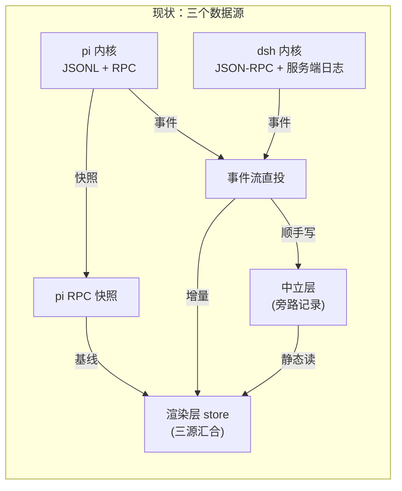

# 会话流重设计：中立层单源

壳里今天同一条对话最多有三处存储：中立层一份（壳自己的会话存储）、内核侧一份（pi 的 JSONL 文件，或 dsh 的服务端日志——按会话归属的内核二选一）；而渲染层面前摆着三条数据源——中立层文件读、pi 进程 RPC 快照、内核事件流直投。本文论证一件事：会话内容只能有一个真相源，就是壳的中立会话；内核的 session 是 AI 的上下文、执行的耗材，不是壳的数据。全部问题从这一条推出来，全部机制从这一条长出来。

**术语约定**（首次出现即定义，后文不再解释）：**壳**是桌面端机制层；**内核**是被壳托管的 agent 运行时（pi / dsh）；**适配器**是每个内核专属形状与壳中立契约之间的翻译层；**圆心**是 `packages/shared/src/domain` 的零依赖类型层。**中立层**是壳自己的会话存储（每个会话一个 JSON 文件），它存的是**中立会话**：若干条 **lineage**（一条线性消息历史；分叉出的分支各是一条）加会话头。**ns** 是壳生成的中立会话主键（UUID）；**根 lineage 的 id 恒等于 ns**，分叉出的分支 lineage 用壳新生成的 id。**中立 entryId** 是条目坐标，形如 `{lineageId}:{seq}`，seq 是条目在该 lineage 内的序号。**seed / 投影**指把中立层的线性内容物化给内核当上下文。**写穿**（write-through）指壳收到内核内容事件时同步落中立层。**总线**（Session Bus）是壳内会话间/会话与插件间的消息路由器。事件命名：正文一律用中性事件名（camelCase，如 messageEnd），内核线格式（下划线，如 message_end）只在引述协议时出现。项目词汇（槽位、插件、能力面 capabilities.extensions/thinking）与 CLAUDE.md 保持一致。

## 1. 问题：会话流为什么"不通"

"不通"不是修辞，是有具体的病。同一条会话在壳里有三个数据源，它们各自只覆盖一部分真相，接缝处全部靠补丁维持。

### 1.1 三个数据源的由来

- **中立层文件读**：`openSession` / `list` / `getTree` 读壳自己的中立会话存储（`NeutralSessionStore`；2026-08 起 header/entries 分文件存，列表只读 header 小文件，见 `docs/design/neutral-storage-split.md`），不碰任何内核存储。这是"中立层作为唯一真相源"改造（`docs/design/kernel-forkless-branch.md` §27 阶段 D）已经落地的部分——静态展示这条腿已经是单源的。

- **pi 进程 RPC 快照**：会话活着时，`sync()` 对 pi 并发发四条命令（get_state / get_entries / get_tree / get_commands，见 `src/server/kernel/pi/backend/resync.ts`）拉回一份全量快照，推给渲染层当基线（渲染层拿它全量替换消息列表的参照底版）。dsh 没有快照面，`sync()` 只能降级返回上一份缓存的基线、没有则空（`session-store.ts` 的 sync 方法）。也就是说"活会话的权威基线"这个位子，今天是 pi 专属的。

- **内核事件流直投**：内核事件经翻译器进 `dispatch`，视图流（只推当前激活会话的事件通道）原样推给渲染层，渲染层的 `applyEvent` 在自己内存里把消息列表拼出来。中立层只是这条洪流的旁路记录——事件先进视图，顺手才写一份进中立层。

### 1.2 三个真相在接缝处漂移

- 漂移的第一种形态是**刷新前后不一致**。壳合成的分隔线（模型切换、改名）曾经只投视图流不落中立层，刷新后全灭；修复手段是"双落点"补丁（`session-store.ts` 的 `dispatchViewDivider`，注释自述了这段历史）——同一条数据写两个地方，靠注释维持两边一致。

- 第二种形态是**功能建立在内核补丁上**。pi 内核的常规持久化路径从不发射 entry_appended 事件，桌面的消息 id 水合（把内核落盘的权威条目 id 补到已渲染的消息上）、收藏/分叉锚点全建在这个事件上，于是壳在装内核时给 pi 的 dist 文件打运行时补丁补发射（`src/server/kernel/pi/extension/patch-rpc-mode.ts`）。内核升级改写目标行，补丁幂等跳过，功能静默消失——没有运行时校验，唯一的信号是收藏按钮不见了。

- 第三种形态是**适配器被迫代壳落盘**。中立层只认 entryAppended 一种上行事件（内核 → 壳方向的内容事件），dsh 没有这个事件，翻译器只好在每条定稿消息后多投一条人造的 entryAppended（`dsh-event-translator.ts` 的 `withNeutralEntry`）。这不是形状翻译，是适配器在补"壳没有权威内容层"的洞——洞在壳这一层，补丁却打在了适配器里。（有两件事不算病灶，别误伤：dsh 翻译器从 request/header 事件派生模型分隔线，是内核旁路变更的合理感知通道，今天的问题只是落点依赖双写；回合中断时把半截输出组装成终态消息，是对齐 pi 原生事件的形状组装。两者 §4.4 另有交代。）

### 1.3 能力面不对称被暴露成展示不对称

- 模型显示链（`src/plugins/sessions/timeline/renderer/index.tsx` 的 currentModel 解析）是六级回落：点选意图 → 快照实况 → 会话头 → 应用默认 → pi 设置默认 → 清单首项，其中"快照实况"和"pi 设置默认"两环只有 pi 有。dsh 会话的当前模型只能落到头域持久值——内核侧旁路改模型（服务端 fallback）时，pi 能经 modelSelect 事件和 sync 回写把实况顶到显示链上，dsh 虽有 request/header 这条感知通道（它落分隔线条目进时间线），但显示链不消费它，徽章显示不动。

- 思考档位同理：dsh 没有这个概念，渲染层却可能显示一个写死的 `"high"`（壳的空快照兜底为了凑齐 pi 的类型形状塞的默认值）——pi 的概念泄漏进了公共基线。

- 统计是双口径：pi 走内核统计 RPC 合并壳自算，dsh 只有壳自算，同一块 token 面板在两个内核下不是同一个来源的数。

- 最刺眼的一条：dsh 重开历史会话再发送，要先发续跑命令让内核把磁盘日志重放进内存，否则发送撞会话 id 冲突（`session-store.ts` 的 prompt 方法里有这段补面）。会话内容中立层里明明一个字不少，却要内核把自己的日志再演一遍——因为在今天的架构里，内核的那份日志仍然被当成"真正的会话"，中立层只是它的缓存。

### 1.4 身份同源，但没有成为不变量

- 三层的会话身份今天基本同源：ns 由壳生成，pi 的会话路径和 dsh 的 sessionId 都从"当前物化 lineage 的 id"确定性派生（pi = `<agentDir>/sessions/<cwd 桶>/<lineageId>.jsonl`，agentDir 是 pi 的会话根目录，cwd 桶是项目路径的编码目录名；dsh = lineageId 恒等）。根 lineage 的 id 恒等于 ns，所以新会话的 pi 文件名就是 ns。但"同源"目前是约定，不是不变量，留了三个边角：

- dsh 后端构造时缺 sessionId 会静默回落成 cwd 桶名——一条没人走的退路，真走到就是会话串台。

- dsh 的 seed 成功后以后端返回值重绑会话标识，不校验它等于请求的 lineageId——按规则必然相等，但没有断言，不等就静默错下去。

- pi 迁移前的旧命名文件（随机时间戳前缀）文件名里不含 ns，反查主键返回空——这批会话对新架构隐形。

## 2. 设计立场

机制从五条立场长出来。每条都是对上面某一类病的根除，不是审美偏好。

### 2.1 内容单源

- 会话内容的唯一真相源是壳的中立会话。列表、打开、树、时间线、收藏、分叉、统计素材——一切读内容的地方，读的都是中立层，没有第二个读口。

- 内核的 session 存储只剩一个用途：给 AI 当上下文。它是执行的耗材，壳可以写它（seed 投影），会话流的运行时读路径永远不读它。这条禁令有两个显式例外，都是离线工具不是会话流：旧数据的一次性迁移导入（§4.3），和中立层自身损坏后的灾难恢复（§6）。例外写在明处，禁令才守得住。

- 判别一件事归不归这条管：它是不是"会话内容"。消息、分隔线、会话名、归档置顶、配图等展示元数据——是。streaming 标志、忙碌状态、当前模型实况——不是，那是下一节的事。

### 2.2 执行态与内容分家

- 判别标准一句话：**刷新后还在不在**（"刷新"涵盖渲染层重载与应用重启两级，两级答案一致的是内容）。在的是内容，进中立层；不在的是执行态，走内存态的执行面。流式进行中的半截文本是执行态（今天刷新后它也活不下来，这个判别和现状行为一致），定稿消息是内容。

- 执行态面由壳从事件流记账，两内核天然同口径——busy 状态、TPS、轮次用量今天就是壳自算的（`dispatch` 里的记账段），模型实况就是壳自己记的发送目标模型。这条面不需要任何内核 RPC：pi 进程状态查询里真正被消费的字段，全能从壳的记账或中立层推出（会话名读中立层头域、消息数数中立层条目，见 §4.2）。

- 分家顺手解决了锚点身份的生命周期问题。用户消息发送即落中立层，从发送起就有中立 entryId、立即可锚（收藏/分叉）；流式中的 assistant 回复是执行态、没有中立 entryId，定稿落库那一刻才获得锚点身份。这不是降级：契约本来就规定分叉锚点必须指向"父 lineage 里一个完整回合之后的位置"（`BaseBackend` 契约的不变量），流式中的半截回复从来不是合法锚点——今天的实现也是等落盘回执后才点亮按钮，新架构只是让这件事从"水合时序"变成"身份语义"。

- 分家之后，"内容"这一侧不再有任何内核 RPC 的影子：没有快照拉取，没有历史回读，没有统计 RPC。内核 RPC 面剩下三样：执行动作（发消息/中断/切模型/seed）、可选的扩展面、以及契约上保留的 getTree/getEntries——它们降级为灾难恢复的离线工具面（§6），不在会话流里。

### 2.3 身份一个生成 id，其余规则推导，推导被守卫

- 壳只生成一种 id：中立主键 ns（fork 时的新 lineageId 同理，也是壳生成的）。pi 的会话路径、dsh 的 sessionId 是它的确定性纯函数——规则已经在了，§1.4 的三个边角说明它还没被当成不变量守。本节把它从约定升级为不变量。

- 不变量靠断言落地，不靠注释：seed（以及 dsh 独有的服务端回切面 resume）之后断言内核返回的标识等于按规则的派生值——**派生的输入是当前物化 lineage 的 id**（pi = 由它派生的文件路径，dsh = lineageId 本身；根 lineage 场景即 ns），不等就显式报错，不静默重绑。dsh 构造参数缺 sessionId 直接报错，删掉桶名回落——宁可早炸，不串会话。

- pi 旧命名文件做一次性导入：逐份读入中立层、以新 ns 立档。这是 §2.1 禁令的显式例外之一，导入完成后旧文件的唯一剩余角色是"打开原始文件"功能的底稿——不再参与任何数据流。

### 2.4 两内核同一条逻辑

- 壳的编排里不出现内核分支。今天残留的 pi 专属口子（steer、followUp、compact、导出 HTML……）逐个定性，去向三类：内容已在中立层的直接退役（统计、分叉、导出）；语义是壳操作的收归壳（克隆）；是执行动作的留在 `capabilities.extensions` 扩展面（steer/bash 等），壳编排只经能力探测调用，不 import 内核身份。完整清单见 §4.2。

- 差异只允许存在适配器里，且适配器只做形状翻译。dsh 翻译器把增量组装成完整消息、把中断时的半截输出组装成终态消息，都是形状翻译，保留；它代壳落盘（多投人造 entryAppended 供中立层上行）是语义补洞，退役——中立层就在手边，落盘是壳自己的事。

### 2.5 统计归插件

- 壳不聚合统计。usage（token 用量）随定稿消息落进中立层条目，是内容的一部分；历史会话与项目总统计的素材唯一来源就是中立层条目，插件自己累计——token 面板的轮次面读执行态面（壳记账的 turn/lastTurn，§3.4），历史面读中立层，各读各的语义层。

- 壳的统计聚合面退役（过渡形态：API 层保留一个版本期供旧插件，见 §5）。插件若要内核精确计价的 cost（pi 的计费口径），经 `capabilities.extensions` 扩展面自取，那是插件和 pi 之间的事，壳不背书、不转发、不合并。

## 3. 目标架构

### 3.1 数据流总图

先给今天的形态画出来，三个数据源、补丁的位置，都在图上：



目标形态把"内容"收成一条回路——一切内容（内核产出的和壳自己合成的）经壳唯一写口落中立层，渲染从中立层读；执行态单独一条轻量通道，不落盘、不进内容：

```mermaid
flowchart LR
    subgraph 目标["目标：内容单源 + 执行态分家"]
        PI2["pi 内核"]
        DSH2["dsh 内核"]
        TR["适配器<br/>(只翻译形状)"]
        SS["壳 session-store<br/>(唯一写口:写穿)"]
        NL2["中立层<br/>(唯一内容真相源)"]
        EX["执行态面<br/>(壳记账,内存态)"]
        R2["渲染层"]
        PI2 --> TR
        DSH2 --> TR
        TR -->|内容事件| SS
        TR -->|执行态事件| EX
        SS -->|用户消息/分隔线(壳自产)| NL2
        SS -->|写穿(内核产出)| NL2
        NL2 -->|变更通知| R2
        EX -->|状态通知| R2
        R2 -->|一切内容读| NL2
    end
```

（图上 SS→NL2 的两条边是同一个写口的两类货源：壳自产内容直落，内核产出内容经事件写穿；NL2→R2 与 EX→R2 两条出边是逻辑流，物理通道见 §3.3。）

- 内容是一条回路：内核事件与壳合成条目 → 唯一写口 → 中立层 → 渲染。渲染层不再拼装消息列表，它持有的是中立层的镜像；打开会话、刷新、流式结束、冷启动，读的全是同一份数据，"刷新前后一致"从一堆补丁变成构造上的必然。

- 执行态是一条直线：流式增量、busy、TPS、模型实况，从翻译器旁路进壳的记账面，直推渲染层的视觉态（光标、转圈、徽章）。它不进中立层、不落盘、刷新即失——这正是它今天的真实语义，只是今天它和内容混在同一条事件流里。

### 3.2 中立层升级为响应式存储

- 中立层当时是哑存储：`NeutralSessionStore` 只有 JSON 整读整写，变更通知是借事件流的东风（entryAppended 顺路广播）。升级动作很小，因为写口本来就收在一处——session-store 是唯一写中立层的地方（今天 dsh 翻译器代投的人造事件也只是上游投喂，最终落盘仍过这一处），把"写"和"通知"焊在一起即可。通知载荷按写入对象分两种：条目变更 = 中立会话 id + 条目本体（自带中立 entryId，订阅方按它幂等 upsert）；头域变更（改名、归档置顶、模型域写回）= 中立会话 id + 头域补丁（镜像含会话头，头域是列表行与徽章的数据源，不进时间线条目）。

  > 修订注（2026-08）：存储格局已按 `docs/design/neutral-storage-split.md` 拆成 header/entries 双文件——本节描述的"响应式存储"通知语义不变，但「整读整写」只适用于 entries 文件；列表与纯头变更只读写 header 小文件。

- 渲染层的镜像逻辑随之换骨：今天渲染层 store 的 `applyEvent`（`src/web/stores/session-store.ts`）按消息 id patch、按 role 倒查占位、对乐观回显做双轨匹配——这近千行防守代码的大部分，根源是"事件流里的消息"和"落盘的条目"是两批身份不明的数据，要靠文本比对相亲。中立层单源之后，每条内容生来带中立 entryId（壳自己派的），渲染层只做 upsert，没有相亲、没有占位、没有水合。

- 镜像的两个配套规则：**顺序**——镜像持有整棵中立树，条目顺序就是写序，entryId 里的 seq 天然是序号，通知乱序到达也按 seq 归位（幂等 upsert + seq 排序天然容错）；**切分支**——渲染显示的是活跃 lineage 的线性投影（沿 fork 链拼前缀，圆心纯函数 `lineageContent` 的语义），用户切到另一条分支 = 本地换活跃 lineageId 重投影，内容全在镜像里，不重读、不回拉。

- 通知如何到渲染层：中立层写口与变更通知的焊接、通知经网关广播扇出上 WS，都装配在壳的组装根（bootstrap）——多个客户端（桌面窗口、远程浏览器）各自维护自己的镜像，中立层在壳侧唯一，镜像是它的投影。

### 3.3 session:event 的重新定性

- `session:event` 这个壳对渲染层的通道保留，插件 API 形状不变（`sessions.onEvent` 照发同形状的 SessionEvent）——会话内容面的插件零改动，这是这次重构不伤生态的关键（统计面例外，有一个发版周期的过渡，见 §5）。变的是壳内部产生这些事件的位置和语义，通道上从此跑两类语义的东西：

- 一类是**执行态通知**：流式增量（messageStart/messageUpdate）、工具三态（toolCallStart/Update/End）、回合起止（agentStart/agentSettled）、自动重试、压缩起止、模型实况——就是今天已经在跑的那些事件，语义重新定性为"执行态"（渲染层不再用它们拼内容，只驱视觉态）。

- 另一类是**内容回执**：条目落中立层的回执，携带已落库的权威条目本体——通知即数据，渲染层按中立 entryId upsert 即可，不需要回拉。今天插件面 entryAppended 事件的形状不变，但来源从"内核补丁补发射"换成"壳在写穿点合成"。对插件来说什么都没变，对壳来说锚点不再寄托在内核补丁上。

- 两类语义按事件类型分流，但分流不是互斥归类：个别事件两跨——压缩结束事件既清执行态的 compacting 标志，又触发壳落压缩边界条目（§4.1）；modelSelect 既更新执行态实况，又触发头域写回（§4.5）。跨不跨看事件携带的语义，不给事件打类型戳。

- 回执的形状契约一句话说死：壳合成的是与今天内核条目同形的条目（`{type, id, timestamp, message}` 结构），id 位填中立 entryId，消费侧的条目→消息映射（圆心的 `sessionEntryToNeutral`）原样工作。两处明说的差异：时间戳语义统一为"壳写穿时刻"（与内核落盘时刻只差进程间传输的毫秒级，对排序与展示无影响）；`kernelEntryId` 在 pi 补丁删除后缺席——壳内的书签/分叉已全走中立 id，无消费方，第三方插件若有依赖按缺字段兜底（它本就是可选字段）。双跑期（§5）对插件面做逐字段对账，不止对渲染读口。

- 图上画的两条出边（中立层 → 渲染层、执行态面 → 渲染层）是逻辑流；物理上它们同走 `session:event` 一条 WS 推送通道，靠事件类型分流——通道不增不减，变的只是语义归属。

### 3.4 执行态面的形状

执行态面不是一个新协议——它的载体就是现有 `SessionEvent` 里除去内容终态之后的那个子集，壳的记账把它们聚合成一份按会话键控的投影。要新增的只有投影类型本身，落在圆心（`domain/events/` 新增 `SessionExecutionState`，零依赖纯类型）：

- **形状**（每会话一份，按会话 key 键控）：
  - `busy: boolean`——回合进行中（agentStart 置位、agentSettled 清位，自动重试退避期视为忙）。
  - `compacting: boolean`——压缩进行中。
  - `retry: { attempt, maxAttempts?, delayMs?, errorMessage? } | null`——重试退避详情，无重试为 null。
  - `streaming: { streamId, role, content, startedAt? } | null`——在飞回复的流式缓冲。流式增量的事件载体沿用今天的 messageStart/messageUpdate（形状不变），差别只在语义定性：它们喂的是这个缓冲，不再是内容。`streamId` 是壳按（回合, 步）合成的临时身份（今天叫"占位 id"），定稿即弃，与中立 entryId 不相干。
  - `inflightTools: Record<toolCallId, { name, args?, partialResult? }>`——在飞工具调用，今天渲染层那个模块级在飞集合的正经归宿。
  - `effectiveModel: { provider, modelId, kernel } | null`——发送时定下的执行模型。
  - 壳自算统计：`turn`（本轮 token 用量）/ `lastTurn`（上一轮）/ `tps` / `turns`（完成回合数）/ `steps`（完成模型调用数）——今天 dispatch 记账段的字段原样成类型。

- **生命周期**：纯内存态，三个粒度各有归属——流式缓冲回合级（定稿即弃）；按会话的投影条目随会话进程条目同生死（进程停止/崩溃/被回收时摘除该 key，不驻留）；应用退出全清。事件逐条驱动字段变更，壳随时能给一份当前快照——"事件增量 + 快照兜底"与今天的快照机制同构，只是内容来源从 pi RPC 换成了壳记账。

### 3.5 多会话：写穿无条件，镜像只一个

- **写穿与激活无关**是不变量：落盘动作挂在按会话的记账上，不挂"是否激活"这个条件。后台会话（总线起的子会话、并行跑的其他会话）的定稿内容照常写穿它自己的中立会话——否则"内容单源"对后台会话直接破裂，后台跑完一轮内容就丢了。

- **渲染层镜像只镜像激活会话**：渲染层只持有当前打开那一条会话的中立层镜像，不切会话不订阅其他。后台会话的变更通知不驱镜像，只驱会话列表的忙碌/未读指示（今天由带会话归属的全量事件通道承担，语义不变）。切会话 = 退订旧镜像、读新会话中立层、订新镜像。

- **离屏期间执行态按会话缓冲**：后台会话的流式增量在壳的执行态面里按会话 key 各自累积，不因为看不见就丢。切回一个正在流式中的会话时，渲染层拿两样东西拼画面：中立层镜像给出已定稿的全部内容，执行态面按 key 重推当前在飞缓冲给出流式半截——接上流，不错位。这条替代了今天"切回活会话靠 pi 快照"的路径，两内核同一条。

## 4. 机制设计

### 4.1 写穿：内容在何处落盘

- **用户消息**：发送时壳乐观写入中立层（现有动作，`prompt()` 里已有），权威时间戳就是壳的发送时刻。确认语义也随之简化：发送 RPC 被内核接受（resolve）即已送达，拒绝或进程崩溃则保留"未送达"标记（渲染层在气泡上标出）——不再等内核的落盘回执来确认，今天那个靠补丁事件水合确认的机制整个退役。内核侧条目 id（`kernelEntryId`）降级为可选的投影线索：内核事件带就记、不带就不记，书签/分叉锚点不依赖它。

- **定稿消息**：触发点是 messageEnd。两个内核都产出终态 messageEnd（pi 内核原生有；dsh 由翻译器把增量组装成完整消息后产出——这是形状组装，保留）。壳在 dispatch 里认它落中立层。落库条目是消息全字段透传——**usage 随条目持久化**（pi 的含 cost，dsh 的 cost 恒 0），历史会话的统计素材由此存在，不需要任何内核在场。

- **分隔线**：壳合成的分隔线（模型切换、改名、思考档位）直落中立层，今天的"双落点"（视图流 + 中立层各投一次）收成单落点——视图流那份本来就是给"刷新后不见"打的补丁，渲染读中立层之后，补丁失去对象。

- **压缩感知与投影规则**：压缩对壳是可感知的——压缩起止两个中性事件两内核都有（pi 与 dsh 的翻译器今天已对齐到 compactionStart/compactionEnd）。壳在压缩结束时往中立层落一条压缩边界条目——就是今天已有的 compaction 类分隔线条目（role 为 divider 的那类元条目），不是新条目类型，中立层 schema 不动（§5）。这就是"中立层怎么知道压缩点"的答案：不靠读内核文件，靠事件。摘要文本按事件载荷带不带分两种情况：带则记进条目，不带则只记边界位置——seed 投影时，边界条目有摘要就以它代身截断投影（投"摘要 + 边界之后的条目"），没有摘要就退回全量投影（保守，宁可多灌上下文不丢语义）；给压缩事件补摘要载荷列为两个内核各自的补面项，不阻塞本设计。这条投影规则写在壳的 seed 组装处，两个内核同一份：中立层留全量给人类看，压缩形态给 AI 用，各得其所。

- **投影的过滤白名单**：中立层的内容分两类——给人看的（custom 消息：分隔线、插件卡片等；展示元数据：配图）和给 AI 的（user / assistant / toolResult 对话消息）。写穿是全量的，两类都落中立层；投影是选择性的——seed 组装处按 role 白名单过滤，只有对话三种 role 进内核，`display` 元数据永不进投影（图是交流机制，不是 AI 输入）。常规运行里 custom 条目也永远不在发送路径上（发往内核的只有用户消息文本/图片）。白名单写在壳的 seed 组装处，与压缩截断规则同一处、两内核同一份。今天它不对称：pi 侧过滤在壳的适配器（`piSeedSession` 只写三种 role，其余丢弃）；dsh 侧壳的适配器不滤 role、全量发给 `session/seed`，取舍交给 dsh 运行时——统一收壳之后，dsh 不再靠运行时自行取舍。另有一条边界纪律：如果某个 custom 消息里装的其实是"要给 AI 看"的语义（比如插件想注入系统级指令），那是走错了路——给 AI 的注入有专用通道（`systemPromptPaths` / `systemPromptTexts`，spawn 时注入），不许伪装成会话内容条目。

### 4.2 pi 内容面退役清单

pi 的快照四命令加若干 RPC，逐个给归宿。先说清退役的精确对象：删的是它们作为**渲染基线/内容读口**的角色；契约上的 getTree/getEntries 方法保留，降级为灾难恢复工具的数据源（§6），不再是常规路径。

- `get_entries` / `get_tree` → 中立层读。今天静态路径已经是（list/openSession/getTree 读中立层），删掉活会话快照这条读路即完成。

- `get_state` → 执行态面。streaming/busy 壳记账已有；当前模型实况用壳自己记的发送目标模型；会话名读中立层头域；消息数数中立层条目。pi 队列深度属 pi 多路并发扩展面，留在 `capabilities.extensions`。

- `get_commands` → pi 扩展面。斜杠命令清单是内核能力，不是会话内容；dsh 显式降级，维持现状。

- `get_session_stats` → 退役。统计归插件（§2.5），壳不再聚合。

- `get_fork_messages` → 中立层读。分叉点前的消息序列就是中立层的前缀截取（沿 fork 链拼到锚点为止），书签快照物化用的前缀截取函数（`materializeLineagePrefix`，把某锚点的完整前缀物化成自包含条目序列）已是这个语义，复用。

- `clone` → 壳操作。克隆 = 中立层整树复制 + 新 ns，内核侧等下次发送时按新 lineage 惰性 seed。今天它要 pi 进程在线做文件 fork，改为纯壳操作后离线可克隆。

- `fork`（pi 的按条目分叉 RPC）→ 退役。分叉语义已整体归壳（中立层切 lineage），这个 RPC 从此没有壳侧消费方，从扩展面摘除——留着它只会留一个"内核侧分叉、壳看不见"的隐形通道，与内容单源直接冲突。

- `export_html` → 退役出内核。内容全在中立层，导出 HTML 是壳（或插件）自己渲染的事，不该问内核要。

- 留在 pi 扩展面的：steer / followUp / abortRetry / cycleModel / compact / setAutoCompaction / setAutoRetry / bash 系 / 队列模式。全是执行动作，与会话内容无关，经 `capabilities.extensions` 探测调用——这个位置不变，变的只是它们不再夹带内容读口。

### 4.3 身份不变量与守卫

- **断言派生一致**：seed 和 resume 之后，断言内核返回的会话标识等于按规则派生的值（pi = 派生路径，dsh = lineageId；根 lineage 场景即 ns）。不等即抛错显形——"按规则必能匹配"从约定升级为不变量，静默错绑这条路堵死。

- **删 dsh 桶名回落**：`DshBackend` 构造缺 sessionId 直接抛错。desktop 流程恒传 ns，这条回落是真走到就是串会话的隐患，删除比留着安全。

- **pi 旧文件一次性导入**：启动时对账扫描（壳启动流程里的内核/数据对账步骤）旧命名（随机时间戳前缀）的会话文件，逐份读入中立层、以新 ns 立档。导入完成后可静态守卫的事实是"pi 会话文件名 ≡ 某个 lineageId"（派生可逆查：文件名 → lineageId 直接读，lineageId → ns 经中立层查），反查不再有落空分支；旧文件仅作"打开原始文件"的底稿留档。

### 4.4 两内核拉平的具体动作

- **entryAppended 的来源换骨**：退役的是"给 pi 内核 dist 打补丁补发射"这个来源；事件形状由壳在写穿点合成续发（§3.3），插件零感知。`patch-rpc-mode.ts` 和它的 postinstall 镜像脚本一并删除——这个补丁的注释里本来就写着"内核天然支持后一起删"，现在是架构不再依赖，提前到删。顺序上它在切换期双跑（§5）验证一致之后执行。

- **dsh 续聊换成 seed 投影**：重开历史 dsh 会话后的首发，从中立层把活跃 lineage 投给内核（seed 面已有），删掉"先续跑让内核重放自己日志"的补面。中立层的内容灌给它，比它演自己的日志更全（含分隔线，且消息是适配器翻译过的中性形态），还顺手消掉一个"重放期间发送撞会话 id 冲突"的时序窗口。

- **dsh 翻译器瘦身**：内容落盘由壳写穿之后，翻译器代投人造 entryAppended 的逻辑（`withNeutralEntry`）失去对象，删。保留的都是形状翻译：增量组装成完整消息、回合中断时把半截输出组装成终态消息（不带它，dsh 会话中断后半截回答就丢了，而 pi 侧内核原生落盘——不保留反而制造新的不对称）、turn/end 投执行态语义（回合收敛原因、中断语义）。适配器回到它该在的位置：只做形状翻译。

- **fork / 切分支的内核上下文供给**（两内核同一条，今天已在跑）：分叉只是中立树插一条空 lineage，内核不动；下次发送前壳检查"内核物化的 lineage"与"活跃 lineage"是否一致，不一致就先把活跃 lineage 的完整线性内容 seed 投影进内核（pi = 写 `<lineageId>.jsonl` 后以该路径起进程，dsh = session/seed RPC），再发送。切回旧分支同理触发重投影——每条 lineage 各有自己的派生文件/会话，不覆写、不错绑；seed 后的断言守卫（§4.3）验的正是这个派生值。这就是"内核是单线执行器"的落地：它永远只物化当前活跃的那条 lineage。

- **request/header 派生分隔线保留**：它是 dsh 侧"内核旁路改模型"的唯一感知通道，是合理的形状翻译；变化的只是落点——随壳写穿直落中立层，不再有双写。

### 4.5 展示链收敛

- 模型显示链从六级收成四级：点选意图（渲染层的待生效模型记忆）→ 执行态面实况 → 中立层头域 → 应用默认。账对齐：删掉 pi 专属的"快照实况"和"pi 设置默认"两环，"清单首项"并入"应用默认"作最终兜底（应用默认缺省时取清单首项，语义不变），新增"执行态面实况"一环——6 − 2 − 1 + 1 = 4。实况由执行态面的发送目标模型承担，这个值发送时定下、写入本条消息，本来就是它的语义，只是今天被 pi 快照盖在后面。

- 内核旁路改模型的回写路径两内核统一：pi 的 modelSelect 事件、dsh 的 request/header 派生，都经事件流进壳——更新执行态面的实况字段，并写回中立层头域。事件驱动，不再靠 sync 回写。

- 思考档位显示按能力面显隐：渲染层从壳的能力面投影读"当前内核有没有 pi 扩展面"（壳侧 `backend.capabilities.extensions`，投影到渲染层叫 `extension`，同一物），dsh 会话不渲染档位选择器，"写死 high 凑类型"的默认值随空快照兜底一起删除。

- 渲染层 store 的消息数组改挂中立层镜像后，`applyEvent` 退役，连带删掉它的大部分防守代码：占位替换、搁浅防线、双轨相亲、id 水合。剩下的（执行态视觉）迁到执行态通道的消费处，代码量腰斩，且每一行都说得出依据。

## 5. 兼容与迁移

- **中立层 schema 不动**。中立会话的字段今天已经够用（entries、kernelEntryId、display、header 全域；usage 是消息自身的透传字段，随写穿落库），本重构是读口和写时机的切换，不是数据格式迁移。存量中立会话文件原样可用。

- **pi 存量 JSONL 的去路**：旧命名文件经 §4.3 的一次性导入获得中立身份；所有存量文件的唯一剩余角色是"打开原始文件"的底稿。壳不再读它们做数据流，seed 投影只看中立层。

- **插件 API 零变化**（会话内容面）。`sessions.onEvent` / `onKernelEvent` 照发同形状事件（来源换成中立层回执与执行态记账，见 §3.3）。统计 API 例外：过渡保留一个发版周期——期间改由壳记账面供数（运行期数据；历史统计插件读中立层，重启不受影响），插件改从执行态面 + 中立层自取后删除。会话插件（timeline、书签、会话树、目标）不感知这次重构，这是"机制与内容分离"应得的回报。

- **切换期双跑，先验证后删补丁**：壳内部先并行跑新旧两条内容路径（中立层写穿 + 旧事件直投），渲染层切读口验证一致、插件面逐字段对账一致后，旧路径关灯；pi 内核补丁的删除（§4.4）排在双跑验证通过之后——先证明不依赖，再删依赖。回滚 = 读口切回，零数据风险。

## 6. 取舍与失败路径

- **统计下沉的代价**：壳不再背书任何统计数字，token 面板的准确性归插件。消息级 cost 是 usage 的字段、随条目落中立层，插件读中立层即得；只有"内核侧会话级聚合口径"的校准值需要插件经 `capabilities.extensions` 自取。dsh 没有 cost 口径，面板对 dsh 会话显示 token 各项之和，不伪造费用。这是用"统计归属正确"换"壳的纯洁"，方向由用户拍板确认。

- **写穿的 IO 开销**：内容只在定稿时落盘（每条消息一次 entries 文件整写），流式期间零 IO——写频次与今天旁路写同一量级（新增的只有压缩边界条目、旁路改模型的头域写回这类低频写入），不新增磁盘压力。中立会话按 header/entries 分文件整读整写（2026-08 拆分，docs/design/neutral-storage-split.md）：纯头变更（归档/置顶/改名/模型域）只写几 KB 的 header 文件，entries 全量重写只发生在真实内容变更时；真遇到巨型会话再换追加格式，那是存储层的内部优化，不动契约。

- **崩溃一致性**：中立层赢。pi 本来就是消息定稿才落盘、中立层 messageEnd 才落，崩溃丢的半截两边都没有，语义天然对齐；乐观用户消息的"未送达"标记保留，只是置位主体从"等落盘回执"换成发送回执本身（发送 RPC 拒绝或进程崩溃即标未送达），下次会话继续时它仍在中立层里，不静默丢。

- **中立层自身损坏**：JSON 损坏按今天的纪律读不出即会话不在列表出现——可接受的诚实失败。灾难恢复路径是从内核投影重建中立层（契约的 getTree/getEntries 在此保留的唯一理由，是离线恢复工具，不是会话流）。

- **pi 补丁删除的窗口**：补丁文件随壳版本发布，删除只影响新壳——新壳的消息锚点是中立 entryId，不读内核的落盘事件。旧壳若回滚、配上已打不上补丁的新内核，会回到 §1.2 的旧病（锚点静默缺失）——这正是病根所在：依赖补丁这件事本身。新架构把它连根拔，回滚代价就是回到旧病，不再更坏。真正失去的是 `kernelEntryId` 的自动回填——它在 §4.1 已降级为可选线索，书签/分叉全走中立 id，无功能损失。

## 7. QA

**Q：流式生成中途刷新页面或重启应用，正在生成的半截回复会怎样？**
A：半截文本是执行态，刷新即失，不落中立层——这与今天的行为一致（今天也只有定稿才落盘）。唯一的例外是用户主动中断：abort 后的半截输出被组装成终态消息落中立层（§4.1/§4.4），刷新后仍在，标"已停止"。

**Q：多个客户端（桌面窗口 + 远程浏览器）同时开着同一会话，会不会串？**
A：不会。中立层在壳侧唯一，每个客户端维护自己的镜像，变更通知经 WS 广播扇出（§3.2）。写只有壳一个写口，读是各端各自的投影——多端最终一致，没有写冲突的位置。

**Q：中立层条目和 pi 内核 JSONL 里同一条消息内容不一致时信谁？**
A：信中立层。内核文件是给 AI 的上下文投影，不是读源（§2.1）。常规路径不会发生分叉；真出现了（比如用户手工编辑了内核文件），以中立层为准，内核侧下次 seed 投影时被中立层覆盖。

**Q：pi 内核将来某个版本天然发射落盘事件了，要恢复补丁吗？**
A：不需要。壳在写穿点自产内容回执（§3.3），内核发不发那个事件都不影响。补丁删除是一次性的，没有恢复路径，也没有保留它的理由。

**Q：执行态面按会话缓冲流式增量，长跑应用内存会不会一直涨？**
A：不会。三个粒度各有回收（§3.4）：流式缓冲定稿即弃；按会话的投影条目随会话进程同生死，进程停即摘除；应用退出全清。没有无限驻留的路径。

**Q：书签物化的是"完整前缀"，压缩之后 bookmark 老节点会丢内容吗？**
A：不会。书签物化给人看，取完整前缀、不做压缩截断；压缩截断只作用于 seed 投影（给 AI 的上下文，§4.1）。两个语义互不影响——人类档案是全量的，AI 上下文是压缩的。

**Q：dsh 没有 cost 口径，token 面板对 dsh 会话显示什么？**
A：显示 token 各项之和，费用位空着，不伪造（§2.5/§6）。消息级 cost 是 usage 的字段，pi 会话的条目里有，插件读中立层即得；要内核聚合口径校准的，插件自己经 `capabilities.extensions` 扩展面拿。

**Q：双跑期间新旧两条内容路径产出不一致，听谁的？**
A：听中立层，差异记日志并视为 bug——双跑的目的就是暴露这些差异（§5）。渲染层切读口、插件面逐字段对账都一致之后，旧路径才关灯、pi 补丁才删。

**Q：fork 之后马上在新分支发送，内核上下文是哪来的？**
A：发送前壳检查"内核物化的 lineage"与"活跃 lineage"，不一致先把活跃分支的完整线性内容 seed 投影进内核再发（§4.4，pi 写派生文件、dsh 走 session/seed）。fork 本身只是中立树插一条空 lineage，零内核动作。

**Q：公共 session 里的 custom 消息（分隔线、插件卡片、配图）会被内核看到、影响 AI 吗？**
A：不会，两个方向上都不会。常规运行：发往内核的只有用户消息文本/图片，custom 条目不在发送路径上。seed 投影：组装处按 role 白名单过滤，只有 user / assistant / toolResult 三种 role 进内核，`display` 元数据永不进投影（§4.1）。它们存在的意义就是给人看——"刷新后还在"的展示内容。
