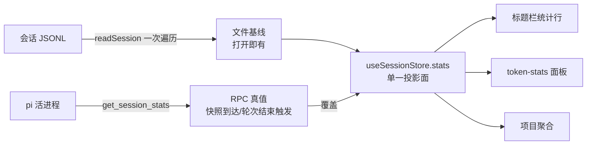
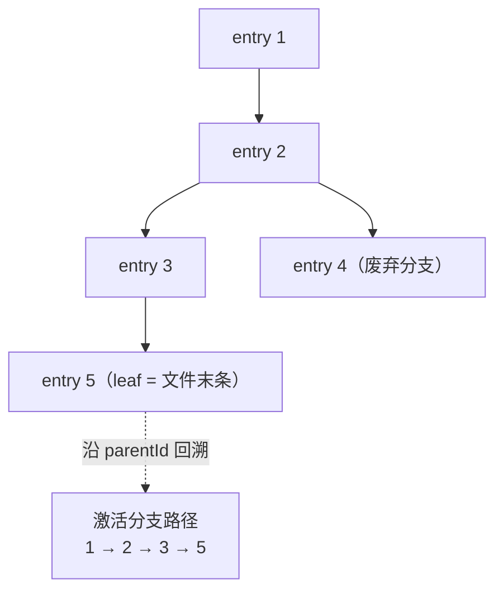

# 会话统计：口径对齐与会话绑定

pi-desktop 的会话统计有两个数据源：打开历史会话时由桌面自己扫会话文件（JSONL 格式，一行一条 entry；每条 entry 带 id 和 parentId，parentId 指向它的父 entry——线性会话里就是前一条，回退重发叉出分支时指向分叉点，entry 因此连成一棵会话树）算出来（文件基线），pi 底座（桌面管理的 AI coding agent 子进程，持有活会话）运行时由底座 RPC 给真值。两个源喂同一块展示面，前提是同口径——而审计结论是：累计类统计大体对齐（细节仍有两处小偏差，见 §2.1），唯一的状态类统计 contextUsage 偏了四处，且根因是同一个。展示侧还有一处断裂：统计搬进标题栏后可见性没跟会话生命周期走，没选中会话时统计还在。这份文档把全部统计项逐项过一遍，给出对齐方案和绑定规则。

## 1. 问题：一套各说各话的统计

### 1.1 统计全景：字段、数据源、消费方

- 统计全集是一个 `SessionStats`（`src/core/domain/events/session-state.ts:39`），三组字段：

  - 计数类：userMessages / assistantMessages / toolCalls / toolResults / totalMessages
  - 用量类：tokens 五项（input / output / cacheRead / cacheWrite / total）+ cost
  - 状态类：contextUsage（tokens / contextWindow / percent）和 tps

- 两个数据源，同一投影面。文件基线由 `readSession`（`src/core/application/sessions/session-scanner.ts:311`）在 openSession 时一次遍历 JSONL 算出，打开即有、不依赖活进程；活会话真值走 `get_session_stats` RPC，框架在快照到达与轮次结束时统一拉取覆盖（`refreshStats`，`src/api/renderer/stores/session-store.ts:290`）。快照指底座激活会话时推送的全量状态投影（模型、思考强度、消息清单、命令清单），是 renderer 侧的基线；轮次结束指 messageEnd / agentSettled / agentEnd 三个事件——messageEnd 是单条 assistant 回复生成结束，agentSettled 是工具调用循环后 agent 落定，agentEnd 是整个 agent 轮次收尾；三者不一定每轮全部触发，refreshStats 重复拉取只会用同口径结果覆盖，多触发无副作用。双源的意义是"秒开 + 最终权威"：基线管第一帧，RPC 管真值。这套架构成立只有一个前提——两个源同口径，否则用户切个状态数字就跳。

- 三个消费面：标题栏统计行（timeline 插件经 titlebar 槽贡献，`stats-titlebar.tsx`，上下文比例条 + ↑↓⚡Σ）、token-stats 面板（轮次明细）、项目聚合（`src/core/application/sessions/project-stats.ts`，跨会话累加，口径继承单会话文件基线——基线错它跟着错）。

**图 1 — 双源统计的数据流：基线管第一帧，RPC 管真值，消费方只读 store**

### 1.2 两类问题：口径漂移与展示断裂

- 口径漂移集中在 contextUsage，四条偏差：尾随增量缺失、compaction 边界错误（compaction 是底座在上下文逼近窗口上限时自动把历史压成摘要的机制，上下文占用从此重置）、有效性过滤缺失、分支不感知（用户在某条消息上回退重发时，会话树会叉出新分支，当前正在用的那条是激活分支，其余是废弃分支）。四条看着像四个 bug，根因是一句话：**统计是消息序列上的投影，桌面给 contextUsage 用了错误的序列**。底座做累计统计用全量序列，做上下文统计用激活分支序列；桌面无论什么都线性扫全文件——四处偏差是这一个差异的四种投影。实证见 §2.2。

- 展示断裂是另一类问题，和口径无关：统计从输入框迁到标题栏后组件常驻，但可见性没跟会话走——没选中会话时统计行还在（一排 "—" 幽灵占位）。统计是会话的属性，会话不在场，统计就不该在场。绑定规则见 §4。

- 还有一处已修复的前科值得记录：标题栏的 "↑" 曾直接显示 `tokens.input`，而底座口径里 input 只是未命中缓存的新 token（实测每轮个位数），真实 prompt 量是 input + cacheRead + cacheWrite 三项之和——差四个数量级。这个 bug 暴露的不是单点失误，是统计口径从来没有被系统审计过。本文就是那次审计。

## 2. 逐项审计：每个统计从哪来、偏在哪

审计基准是 pi 底座源码（开发机上的 pi 仓库本地克隆，本表路径为 `<pi-repo-clone>/packages/coding-agent/`，`~/.local/bin/pi` 的 wrapper 脚本即指向它；行号均指该仓库，读者以自己的克隆路径为准）。下文对底座算法均有自然语言转述，已覆盖全部关键逻辑，行号仅供有克隆的读者交叉验证，不读源码不影响理解审计结论。桌面侧代码在 pi-desktop 仓库。

### 2.1 累计类统计：对齐，两处小偏差

- 底座 `getSessionStats`（agent-session.ts:3023）线性遍历 `getEntries()`——全量序列，不是分支。桌面 `readSession` 也是全文件线性遍历。序列选择一致，累加逻辑逐项核对一致：

  - tokens.input / output / cacheRead / cacheWrite：都是 assistant.usage 对应字段的累加，一致
  - cost：都取 `usage.cost.total`（桌面侧 `messageUsageOf` 额外兼容旧版数字形态，`session-state.ts:155`），一致
  - userMessages / assistantMessages / toolResults / toolCalls：计数口径一致

- 小偏差一：totalMessages。底座数的是**所有** type=message 的 entry（任意 role 都进 totalMessages），桌面只数 user / assistant / toolResult 三种 role 再求和（session-scanner.ts:370）。出现 custom 等其他 role 的消息时桌面偏小。处置：改成数全部 message entry。

- 小偏差二：tokens.total 的兜底。底座的 total 是四项求和重新算的，不信任 totalTokens 字段；桌面直接取 `usage.totalTokens`，字段缺失时得 0（messageUsageOf，session-state.ts:165）。实测数据里 totalTokens 条条都在（且恒等于四项和），但口径跟底座走：缺失时兜底四项求和。

### 2.2 contextUsage：底座的权威算法

- contextUsage 是唯一的状态类统计——它回答"此刻上下文窗口占了多大"（此刻指统计时激活分支的最新状态：末条有效 LLM 调用结束、其后新增消息计入之后），不是"累计消耗了多少"。这个性质决定它不能在全量序列上累加：上下文是下一次请求要发的东西，等于激活分支上的历史。底座 `getContextUsage`（agent-session.ts:3078）三层：

  - 先看模型：contextWindow 缺失或 ≤0 直接返回 undefined——上下文占比是相对窗口的，没有窗口就没有占比
  - 再看 compaction 边界：compaction 把历史压成摘要，上下文从此重置。底座找分支上最新的 `type === "compaction"` entry（`getLatestCompactionEntry`，session-manager.ts:312），边界之后若没有有效的 assistant usage，返回 `tokens: null, percent: null`——诚实的"未知"，因为压缩后的上下文此刻没人知道，要等下一次 LLM 调用才有数
  - 最后估算：`estimateContextTokens`（compaction.ts:176）= 末条有效 usage 的 totalTokens + 该 usage 之后消息的估算 token

- 估算的两个细节值得原样移植。其一，"有效 usage"跳过 stopReason 为 aborted / error 的消息和 totalTokens=0 的消息（`getAssistantUsage`，compaction.ts:128）——stopReason 是 assistant 消息上标记该次 LLM 调用结束原因的字段（正常完成 / aborted 用户中断 / error 底层报错），中断和报错消息的 usage 是半成品，取了会污染基线。其二，尾随估算按 role 遍历内容取字符数除 4：text 取文本长、thinking 取思考长、toolCall 取 name + arguments JSON 长、image 固定按 4800 字符（`estimateTokens`，compaction.ts:240）。底座注释承认这是保守高估——估算宁可高估边界，这不是缺陷是取舍。

- 分支序列由 `buildSessionPath`（session-manager.ts:330）确定：entry 按 id 建索引，从 leaf 沿 parentId 回溯到根。**没有显式 leafId 时 leaf 取文件最后一条 entry**（session-manager.ts:343）——这是底座加载会话文件时的确定行为。"文件读时的激活分支"因此不是猜测，是可复刻的规则。

- 对照桌面现状（session-scanner.ts:318-383），四条偏差逐条命中，且每条都是"扫全文件而非激活分支"这一个根因的投影：取末条 usage 的 totalTokens，丢的是尾随增量；不认 compaction 边界——边界是分支序列上的概念，全文件扫描里它根本不存在（注释声称"compaction 后重置天然对齐底座口径"，实际取的正是压缩前的旧值——压缩的意义就是砍上下文，统计条纹丝不动，这就是用户看到的"不对"）；不筛 stopReason，中断消息的半成品 usage 照收；不认分支，末条 usage 可能来自废弃分支。

### 2.3 tps：桌面自算项，口径独立于底座

- 底座不给 tps，桌面从事件流自算：messageStart 记时刻，messageEnd 取该消息 output tokens 除以耗时（session-store.ts:951-966）。它测的是"上一轮的生成速度"，不是累计速度——单轮口径，诚实。

- 边界行为可接受，逐条核过：

  - 中断轮：abort 也会到 messageEnd，output 是部分值，tps 偏低但不撒谎——那轮就是没跑完
  - 重试轮：autoRetry 会产生新的 messageStart，计时基准天然重置，轮间不串
  - 事件传递时延：事件比真实起止晚到几十毫秒，耗时被低估、速度被轻微高估，量级可感可忽略，不修

- 文件基线 tps = null：文件没有时间信息，诚实留空。显示 "—"。

### 2.4 消费方解析审计：一处单源违规

- usage 形状解析在 domain 层有单源：`messageUsageOf`（session-state.ts:155），注释明确三个消费方。审计结果：

  - session-scanner：✓ 复用
  - project-stats：✓ 复用（project-stats.ts:51）
  - token-stats：✗ 自写了 `extractUsage`（token-stats/renderer/index.tsx:37），逻辑与 messageUsageOf 逐行相同

- 这正是契约单源要防的漂移机制：今天两份一样，明天 usage 形状一变（底座已有 cost 从数字变分解对象的先例），谁记得改谁对，忘了谁错。处置：token-stats 收敛到 messageUsageOf，删本地副本。跨层路径是现成的——插件不能直接 import 内核 core 层，一律经 `packages/contract` 发布面；而 contract 已经在 re-export session-state.ts 的同类解析纯函数（toolCallsOf / thinkingBlocksOf / sessionEntryToNeutral，packages/contract/src/index.ts:55-57），把 messageUsageOf 加进这条 re-export 即可，token-stats 从 @pi-desktop/contract 引用。发布面是投影不是副本：实现仍在 domain，contract 只多一行 re-export。

## 3. 对齐方案：把序列选择挪到统计之前

### 3.1 统一抽象：统计是序列上的投影，序列选择是参数

- 四条偏差不是打四个补丁。看穿了是同一件事：每个统计都是某个 entry 序列上的投影，区别只在取哪个序列——累计类取全量序列，上下文取激活分支序列。桌面现在的病是把"全文件线性扫描"写死成唯一序列；方子是把序列选择挪到统计之前，让它成为参数：

  - 计数 / tokens / cost：继续在全量序列上投影（底座 getSessionStats 也是全量序列，不动）
  - contextUsage：改在激活分支路径上投影

- 这样改完，双源同口径是结构性的——桌面文件基线和底座 RPC 是同一套算法在两侧的执行，不是两个恰好算得接近的近似。

**图 2 — 全量序列与分支路径：累计类统计用全部 entry，contextUsage 只用路径上的。不在回溯路径上的 entry 即所谓"废弃分支"——不在激活路径上而已，文件里没有任何额外标记**

### 3.2 文件读重建分支路径

- `readSession` 本来就线性遍历全文件，遍历的同时顺手建 id→entry 索引，遍历结束后从末条 entry 沿 parentId 回溯到根，得到激活分支路径——底座 `buildSessionPath` 默认行为的移植。算法是纯函数（只依赖 {id, parentId} 最小形状，即入参只需这两个字段），放 domain 层与 messageUsageOf 同侧，scanner 只做编排。为什么够格进 domain：本项目的分层纪律是 domain（圆心）只放零依赖的纯类型与纯函数，application 层做用例编排——scanner 读文件、拼流程是编排，纯计算下沉圆心。判据是换壳测试：把 Electron 换掉、把 React 换掉，这些函数一行不动，所以它们在圆心。（分层纪律的完整表述见项目根 CLAUDE.md"洋葱分区"章。）

- 分支路径只服务 contextUsage。消息展示流保持现状（线性 + deduplicateAdjacent，后者是防御底座重复写入的去重：标准角色相邻去重、非标准角色全量去重，session-state.ts:458）——展示和统计是两种投影，本次只对齐统计；展示是否也要分支感知是另一个议题，不扩围。不一致的后果是有限的：累计类统计与线性展示同为全量序列投影，数字和用户所见天然对得上；唯一分支感知的 contextUsage 其展示面是比例条，用户不会拿消息条数去核对比例条。真正会出现观感不一致的场景只有一种——带分支的会话里，废弃分支的消息仍显示在屏幕上，但它的消耗不进上下文统计；这要求用户用过回退重发且分支被放弃。说它低频是有依据的：当前回退重发入口只有 timeline 消息动作一处，没有分支管理 UI，多分支不是被鼓励的用法——若将来分支成为一等公民，展示与统计的序列就该一起切到分支感知，这正是它被标为演进项（已知缺口，记录在案，不在本次范围，也不藏）的原因。

### 3.3 估算算法移植

- `estimateContextTokens` 与单条 `estimateMessageTokens`（chars/4）作为纯函数移植进 `src/core/domain/events/session-state.ts`，与 messageUsageOf 同文件——usage 解析 + 上下文估算构成 domain 层的口径单源，底座协议的形状解析只此一处。

- 可见性边界要说清，判据是"有没有插件层消费方"：messageUsageOf 进 contract 发布面，因为 token-stats 插件要消费（§2.4）；分支路径重建、estimateContextTokens、estimateMessageTokens 的唯一消费方是 session-scanner（内核 application 层），插件层没有消费方，不进 contract——发布面按需投影，不为"将来可能有用"预铺。

- 估算的输入是分支路径的 NeutralMessage 序列。NeutralMessage 是桌面侧的中性消息类型，对底座 AgentMessage 做宽松透传——字段不逐一收紧定义，底座给什么形状就透传什么，只保证 role 必填——因此 role / content 块形状与底座一致，按 role 遍历的逻辑原样可用。

- 输出保持文件基线现形状：`contextUsage = { tokens, contextWindow: 0, percent: null }`（此处 tokens 即 contextUsage.tokens，估算出的上下文占用）——文件不知道模型窗口，显示层拿当前模型窗口兜底；compaction 边界后无有效 usage 时 tokens 为 null，诚实未知。这和底座"contextWindow≤0 返回 undefined"不矛盾：底座的 undefined 是"模型没有窗口，占比这个概念整体不成立"，桌面基线的 contextWindow:0 是"窗口值未知但 token 数可算"——两种未知，两种返回。两者在显示层的效果完全一致（比例条隐藏，判据见 §4.1），语义区分只为数据诚实与调试可溯，不兑现为 UI 差异。形状上也无需归一：基线与 RPC 产出的都是 domain 的 ContextUsage 类型（{tokens, contextWindow, percent}），store 原样接收两种来源，显示层只读 percent / tokens。

- 对齐后双源的关系随之变化：基线不再只是"打开即有"的近似，而是与 RPC 口径等同的结果，"基线管第一帧，RPC 管真值"里的"真值"从此只指时间上的更新（活会话的新轮次），不再是口径上的纠偏。双源切换不会跳：对齐后基线与 RPC 是同一套算法的两次执行——同样的序列选择、同样的有效性过滤、同样的 chars/4 估算，区别只在手里的数据；同一时刻的数据必然算出同样的结果。唯一残留的跳变源是窗口兜底值：基线侧的 percent 由显示层拿"当前模型窗口"算，RPC 侧是底座给的权威窗口，两个模型来源若不一致（如桌面配置的模型窗口与底座实际模型不同），percent 会小幅跳动——那是配置漂移问题，不是口径问题，不在本次对齐范围。

- 估算误差要说破：chars/4 对英文是准的（约 4 字符一个 token），对中文是系统性低估——一个汉字通常 ≥1 token，按字符除 4 相当于把一个汉字当 0.25 token。底座注释自称"保守高估"，那是对英文而言。照搬不改，理由有三：其一，对齐的目标是双源同口径，两侧用同一个 chars/4，基线和 RPC 之间不相对跳；其二，估算只作用于尾随增量（末条 usage 之后的消息），占整个上下文的比例通常很小；其三，下一轮 RPC 真值即覆盖，误差的存活时间只有一轮。将来要消误差是两侧同时换 tokenizer——那是算法升级，不是口径对齐。

### 3.4 顺带修正与不动清单

- 顺带修正三条，都是审计里已定位的：

  - totalMessages 改数全部 message entry（§2.1 偏差一）
  - tokens.total 在 totalTokens 缺失时兜底四项求和（§2.1 偏差二）
  - token-stats 的 extractUsage 收敛到 messageUsageOf（§2.4）

- 不动清单，显式划界：

  - 双源架构与 refreshStats 触发时机（snapshot / messageEnd / agentSettled / agentEnd）不动
  - RPC 路径（get_session_stats → toSessionStats）不动——底座来的本就是权威口径
  - tps 自算逻辑不动（§2.3 审计结论口径健全）
  - timeline 消息展示流不动

## 4. 会话绑定：展示语义跟会话走

### 4.1 内容驱动可见性

- 规则一条：**stats === null → 统计组件不渲染**（return null）。没有占位，没有幽灵，没有弱化留一排灰。

- 为什么不绑定"是否选中会话"（currentSessionPath）：那是引入一个额外的声明开关，两个信号还要手动保持一致。看数据就知道不需要——所有"无会话"的时点 stats 天然为 null：应用启动未打开（store 初始 null）、新对话（startNewChat 显式置 null，session-store.ts:349）、空会话文件（messageCount=0 时 scanner 返回 null，session-scanner.ts:371）。messageCount 的口径是 user / assistant / toolResult 三种 role 的消息条数：0 字节空文件、只有非消息 entry 的文件都会落到 0；文件本身不存在时 readSession 直接返回 null，openSession 放弃打开，连 stats 都不产生。可见性从数据在场涌现，一条规则覆盖所有时点，开关和数据没有漂移的机会。

- 两层"无值"语义要分清，各管各的：**stats === null** 是会话本身没有统计，整行统计组件不渲染；**stats 非 null 但 contextUsage 为 undefined**（无 usage / 模型无窗口）是累计统计在、上下文不可知，只不渲染比例条，↑↓Σ 照常。null 管整行，undefined 管单项，互不覆盖。比例条的渲染判据只有一条：**percent 算不出来就不渲染**——contextUsage 为 undefined、contextUsage.tokens 为 null（compaction 后无回复，见 §5.2）、窗口值缺失三条路径同归这一个判据，显示层不区分不可知的来路。

- 消费方统一执行：标题栏 SessionStatsTitlebar 在 stats 为 null 时返回 null；token-stats 面板已有 EmptyState，对齐语义——无数据时空状态，不是零值。

### 4.2 生命周期一致性

- 沿会话时间线核对 stats 的值与清零，各归其位：

| 时点 | stats 的值 | 展示 |
|---|---|---|
| 应用启动 | null | 不展示 |
| 打开历史会话 | 文件基线随 detail 到达（openSession，session-store.ts:334） | 立即展示，对齐后口径 |
| 活会话快照到达 / 轮次结束 | refreshStats 覆盖为 RPC 真值 | 展示 |
| 新对话（点"新会话"，会话文件尚未创建） | 显式置 null | 不展示 |
| 切换会话 | sessionGen++ 使旧 RPC 作废，新 detail 覆盖 | 无旧值窗口 |

- 防竞态现状核对：refreshStats 带代际校验——sessionGen 是投影拉取的代际计数器，切换会话时递增（openSession / startNewChat，session-store.ts:286），RPC 回来时比对代际，不一致即丢弃；切会话后在飞的旧 RPC 回来不会污染新会话——已有机制覆盖，本次不加新锁。

- 用户实际观察到的幽灵展示就是缺第一条规则：组件常驻标题栏，stats 为 null 时仍画一排 "—"。修完后无数据即整行消失。

## 5. 边界与失败路径

### 5.1 脏数据

- parentId 缺失 / 孤儿 entry：回溯时找不到父节点就停，路径截断在孤儿点——宁可少算不崩。底座 buildSessionPath 同样行为。

- leaf 是非消息 entry：文件最后一条可能是 compaction 摘要、label（`type: "label"`，会话书签标记）、session_info（`type: "session_info"`，会话命名等元数据，底座自动命名时写入）这类非消息条目——它们是会话生命周期中由底座或桌面功能写入的辅助 entry。回溯照常以它为 leaf（所有 entry 都有 id/parentId，不限于消息），估算算法自然消化——若回溯路径上有 compaction 边界且边界后无有效 usage，落入"诚实未知"，恰是正确结果。

- 单行 JSON 损坏：跳过该行（现状行为，不变）。

- 纯用户输入的会话（无 assistant）：无 usage，contextUsage 为 undefined 不展示比例条，累计类各项为 0 正常展示。

### 5.2 诚实的 null

- compaction 后无回复：tokens = null。展示语义：上下文比例条不渲染（没有可算的占比），↑↓Σ 照常——累计类统计不受 compaction 影响，两条线互不牵连。

- 模型无 contextWindow：底座与桌面的模型窗口信息同源（都读 `~/.pi/agent/models.json` 的模型配置），一侧没有窗口另一侧必然也没有——不存在"一侧有一侧没有"的错位。两侧都算不出占比：没有比例条，只有累计项。

- 这两种"不可知"不展示为 0——0 是一个值，未知是没有值。把未知画成 0，正是"压缩完比例条不降"这类假象的由来。

## 6. QA

**Q：统计行在标题栏出现/消失时，布局会跳吗？需要预留空间或过渡动画吗？**

不处理。标题栏是定高 flex 行，统计只是行内一项：它消失时行高不变，只是相邻项的水平间距变化——与 debug-bar 条件按钮的出现/消失同一节奏。为统计单独做占位或动画，等于给"数据不在场"造视觉残留，和 §4.1"无数据即不渲染"的取向相反。

**Q：compaction 之后，上下文比例条什么时候降下来？**

分两个场景。活会话：compactionEnd 事件触发 sync，快照到达后 refreshStats 拉到底座新口径的 contextUsage——压缩后还没有新回复时底座返回 tokens:null，比例条直接隐藏（不是"停在旧值"），有新回复后显示压缩后的小占比。文件基线：对齐后的 readSession 认出 compaction 边界，同样落入"诚实未知"隐藏比例条。旧实现"压缩完条纹丝不动"的假象从此不存在。

**Q：chars/4 低估中文，用户看到的上下文占比会不会系统性偏小？**

会，但影响被三重限制：估算只作用于尾随增量（末条 usage 之后的消息），占比通常很小；文件基线只在打开会话的第一帧生效，活会话第一轮 RPC 真值即覆盖；双源用同一个 chars/4，基线和 RPC 之间不相对跳。要彻底消误差必须底座和桌面同时换 tokenizer——那是算法升级，需要底座侧配合，不在口径对齐范围。

**Q：为什么标题栏的 "↑" 是 input+cacheRead+cacheWrite，不是底座给的 input？**

底座口径里 input 只是未命中缓存的新 token（实测每轮个位数），prompt 的主体走 cacheRead / cacheWrite。直接显示 input 会让"上传 tokens"比真实 prompt 量小四个数量级。三项之和才是真实发给模型的 prompt 总量，且 Σ ≈ ↑+↓ 从此自洽。这是显示层的口径映射，不改底座原始数据——store 里的 TokenUsage 仍是底座原值。

**Q：对齐后 totalMessages 会比以前大，是回归吗？**

不是。旧口径只数 user / assistant / toolResult 三种 role，底座数全部 message entry——含 custom 等其他 role 的消息。对齐后数字向底座靠拢，带 custom 消息的会话 totalMessages 会略增。这是口径修正，不是统计变多。

**Q：标题栏统计和 token-stats 面板的数字为什么有时对不上？**

粒度不同，口径相同。两者读同一个 store 的同一份 stats：标题栏是会话累计（↑↓Σ 是全会话求和），token-stats 面板在此之上按轮次拆分明细（每轮的 usage 和平均 tps）。对不上只可能发生在"面板按轮聚合的口径"与"累计口径"之间（如 tps 是轮平均不是总量），累计项本身必须一致——若不一致即是 bug，两者消费同一数据源，没有各自计算的余地。

**Q：带分支的会话，屏幕上的消息条数和统计对不上，算 bug 吗？**

不算，是已知边界（§3.2 演进项）。累计类统计与线性展示同为全量序列投影，计数对得上；唯一对不上的是 contextUsage 不含废弃分支的消耗——比例条是"当前上下文占用"，本就不该包含已放弃分支的历史。若将来分支成为一等公民（有分支管理 UI），展示与统计应一起切到分支感知，届时此条自然消解。
