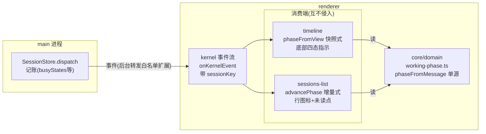

# 会话工作阶段状态：事件通信机制

AI 干活不是"思考中"三个字。一次会话轮次里，模型在请求等待、思考链展开、调用工具、流式输出之间来回切换，四个阶段各自占用几秒到几十秒不等。用户盯着屏幕时想知道的是"它现在在干嘛"——在等响应、在思考、在跑 bash、还是在写回答——而不是一个笼统的"思考中"。这个文档设计一套机制：把"会话此刻处于哪个工作阶段"定义成一种中性状态，从 main 进程经事件流外发给所有消费端，让会话栏每一行、会话流底部指示、以及将来的任何消费方都能看到同一个阶段，互不侵入。

## 0 问题与背景

### 0.1 一个状态，四个阶段

一次 agent 轮次（`agentStart` 到 `agentSettled`）内，会话按顺序或循环经历几个可区分的工作阶段。这些阶段不是设计者发明的分类，是底座事件流里已经存在的事实：`agentStart` 发出后、首个消息块到达前的等待窗口，`messageStart` 携带的 thinking 块、toolCall 块、text 块的流式展开，`toolCallStart/End`（底座原始名 `tool_execution_start/end`，经翻译层映射）标记的工具执行边界。它们只是从来没被组织成一个可见的状态。

用户需要的是全程可见的工作指示，不是局部提示。工具卡内部有绿色的 `running` 字样、思考链块内部有"正在思考…"、文本尾部有流式光标——这些块内标识是完整的，但它们是散的：三套视觉、三个位置，没有一个统一的"这个 AI 现在整体在哪个阶段"的信号。会话流底部那个圆点本来是干这个的，但它只有一档。

### 0.2 现状的三个缺口

**全局指示只有一档，而且经常说错话。** 会话流底部（timeline 末条消息下方）的圆点由全局 `streaming` 单独驱动，文案写死 `shell.thinking`（"agent 思考中…"）。但 `streaming` 覆盖整个轮次：工具执行时它亮着，显示"思考中"——AI 明明在等 bash 结果；thinking level 设为 off（思考已关）时它还是"思考中"——误导；模型在流式输出正文时它依然是"思考中"——该说"生成中"。

**"请求中"阶段完全没有标识。** `agentStart` 之后、首个 `messageStart` 之前有一段等待窗口：请求已发出、底座在等供应商返回首 token。思考强度（thinking level，底座/模型的思考深度档位，在 timeline 输入框（composer）的下拉选择 off/low/medium/high 等）调高时这段能持续数秒。此时消息流底部只有一个含糊的"思考中"圆点，没有任何"请求已发出、在等响应"的提示。阶段一不是"没有标识"而是"被错误标识"。

**会话栏只知道忙不忙，不知道忙在哪——而且后台会话连忙不忙都常不可靠。** sessions-list 每一行有一个执行中图标（LoaderCircle 旋转），它维护一个 `busyByPath` 映射：`messageStart` 置忙、`agentSettled` 清忙。这个二元信号回答不了"它在等响应还是在跑工具"，而用户切到后台会话看列表时，恰恰需要这种粒度——"那个会话还在跑，但卡在工具上了"比"那个会话还活着"有用得多。更要命的是现状的一个实现缺陷：`messageStart` 不在后台会话的事件转发白名单里（见 2.2），后台会话的置忙路径收不到触发事件——后台行的"执行中"标识实际只有清忙的一半在工作，置忙永远不触发。

### 0.3 未读点逻辑的根因

会话栏的未读点（primary 色小圆点）判定是"位标落后"：每个会话在插件配置里存一份已读位标（`readState: path → 最后已读 entry id`；entry 是会话文件的一行——一条消息、一条分隔线或一个自定义条目，entry id 是该行由底座生成的稳定标识，写入行内、重读不变），列表刷新时把活跃会话的位标推进到该会话最新条目。列表刷新入口 `applyList`（`list(currentCwd)` 全量拉取后统一处理列表状态与位标推进的封装）在每次刷新时执行。这条逻辑有三处根因性问题：

- **推进时机耦合在整表 reload 里。** `applyList` 在每次 `list(currentCwd)` 全量拉取后执行，顺手推进活跃会话位标。而 reload 由 `messageStart`/`messageEnd` 等事件触发——流式期间 `messageStart` 已到但新消息还没落盘，这一轮拉到的 `lastEntryId` 是旧值，位标被推进到旧位。此刻用户切走，位标停在旧位而会话实际已有新内容，切走后误亮未读。
- **"从未打开过"等于"永不亮"。** 判定条件里有 `readState[path] != null` 门槛：没打开过的会话位标缺席，永远不亮未读。但"未读"的本义是"最后读过的位置之后有新内容"——从未打开过恰恰更该亮。
- **每次 messageEnd 全量拉表。** 列表刷新和位标推进绑定在一起，一次消息定稿就 `list()` 一遍整个目录，会话多时不必要地重复 IO。

这三处根因的共同点是：**未读的状态变化发生在事件到达的时刻，推进却发生在列表刷新的时刻**。把推进搬回事件到达时刻，是本文第三章要做的修正。

## 1 统一抽象：WorkingPhase

### 1.1 阶段全集与语义

`WorkingPhase` 是一个中性类型，回答"这个会话此刻在干什么"。全集如下，语义各自独立可辨：

```ts
type WorkingPhase =
  | "idle"          // 不工作:agentSettled 后,或进程未起
  | "requesting"    // 请求已发出,等底座首 token(agentStart 后空窗)
  | "thinking"      // 思考链流式展开中
  | "toolExecuting" // 工具调用执行中(toolCall 块 state=pending/running)
  | "outputting"    // 正文文本流式输出中
  | "retrying"      // 自动重试退避等待中(autoRetryStart 后)
  | "compacting";   // 上下文压缩进行中
```

七值的构成是三组，别以为作者数错了：**4 个内容推导阶段**（requesting / thinking / toolExecuting / outputting，由消息内容快照或事件推导，见 1.2）+ **2 个事件覆盖态**（retrying / compacting，有独立事件、优先盖过内容推导，见 2.4）+ **1 个 idle 基线**（不工作）。四个内容阶段是主体，覆盖态与基线是边界。

这是一个状态值，不是一枚类型戳。它不驱动引擎分支——引擎（底座）的行为不依赖它；它是消费者读来渲染状态的数据本身。跟 `SessionState.isStreaming` 同级：那也是一个"会话此刻在干嘛"的中性布尔，phase 是它的粒度升级版，二者可以共存（`isStreaming` 继续服务停止按钮等派生行为，phase 服务展示）。renderer 侧所说的"全局 `streaming`"（`useSessionStore` 字段，0.2/2.4 用到的那个）就是 `SessionState.isStreaming` 的下传镜像——同一个量的两处叫法，后面不重复解释。`isStreaming` 的来历说清楚：它在 `SessionState` 里，而 `SessionState` 是底座经 RPC 提供的快照字段——给 isStreaming 加展示字段，等于要动底座协议与 main/renderer 三层同步；phase 的设计恰好相反，消费端本地推导、零新增状态（见 1.3），这正是"不加字段"的理由。"动底座协议不可接受"补一句背景：底座是独立分发、独立版本的被管理资源（pi-desktop 通过 `pi install/update` 管它），改它的 RPC 协议意味着跟随底座发版、并承受桌面与底座版本错配的风险——为一个展示粒度需求去改底座协议，成本与它服务的价值完全不成比例，而消费端本地推导一分钱协议成本都没有。加字段方案还有一个结构性失效，比动协议更要命：快照字段只服务活跃会话——renderer 拿到快照的只有当前激活会话，后台会话的行（会话栏恰恰需要每个会话的状态，见 2.1）永远喂不到，而 phase 的事件流推导对活跃与后台一视同仁。

### 1.2 同一个抽象的两个投影

phase 有两个推导入口，服务于两类消费端——它们回答同一个问题，输入形态不同，共享同一套"消息内容 → 阶段"的映射：

- **快照式 `phaseFromView(messages, streaming, overlay)`**：输入完整的消息数组 + 全局 streaming + 可选的覆盖态 `overlay: { retrying?: boolean; compacting?: boolean }`（见 2.4，调用方订阅事件维护后传入）。活跃会话消费端用这个——renderer 的 `useSessionStore` 手里有完整消息，直接看最后一条流式消息的内容块就能定阶段，精确且零额外状态。
- **增量式 `advancePhase(prev, event)`**：输入上一阶段 + 一条 `SessionEvent`，输出下一阶段。只有事件流、没有完整消息的消费端用这个——会话栏对后台会话只有 kernel 事件流，靠事件增量推进每会话的阶段。

两个函数共享同一个 `phaseFromMessage(content)`：给定一条消息的内容块数组，按优先级判定——有 `state ∈ {pending, running}` 的 toolCall 块 → 工具执行中（pending 也算：工具已开始、结果未回）；否则有 text 块 → 输出中；否则有 thinking 块 → 思考中；否则 → 请求中（空 content 或只有未知/已完成块，保守视为模型在处理）。toolCall 优先级最高，因为工具执行时 AI 确实在等结果，思考与输出都停着；text 优先于 thinking，因为一条消息的 content 里 thinking 块往往保留到最后（已定型），"已经出可见文本"比"曾有思考块"更接近此刻在干嘛。这个优先级是一个事实陈述，不是设计偏好。

`phaseFromView` 的组合逻辑一次说全：不流式 → idle（不显示指示）；流式且存在末条 `pending === true` 的 assistant 消息 → `phaseFromMessage(该消息的 content)`；流式但**没有** pending 消息（`agentStart` 后空窗、或两轮之间）→ requesting。注意"最后一条消息"必须限定 pending——上一轮已定稿的消息（pending=false）不算，否则第二轮开始时会误报上一轮的 outputting。

`advancePhase` 的转移表就是本机制的增量心脏，逐事件定义：

```
agentStart       → requesting      轮次开始,等首 token
messageStart     → phaseFromMessage(事件携带的 content)
                                   按首个内容块定阶段(后台粒度,见 4.2)
messageUpdate    → phaseFromMessage(最新 content)
                                   活跃会话才有;后台收不到
messageEnd       → requesting      一条消息定稿;AI 进思考下一步;agentSettled 随后纠正
entryAppended    → (保持)          落盘回执,不影响阶段
toolCallStart    → toolExecuting   工具边界开始
messageStart 含 toolCall 块  → toolExecuting   同上,块也可
  (toolCallStart 事件与块双路互补,见 4.1)
toolCallEnd      → requesting      工具结束,AI 思考下一步;并行工具保守,后续事件纠正
autoRetryStart   → retrying
compactionStart  → compacting
compactionEnd    → requesting      覆盖态解除,回轮内默认;agentSettled 纠正
agentEnd         → idle
agentSettled     → idle            权威归零
```

每个非终态转移都带"可被后续事件纠正"的语义，`agentSettled` 是权威归零——这是增量状态机只有事件流、没有完整视图的固有属性：粗粒度概览 + 权威终态自纠正（见 QA）。

### 1.3 判定数据源：全在现有事件，零新增

阶段判定需要的每一条信号都已经存在于现有通道里，不需要底座发任何新事件、不需要任何新 IPC。事件名统一说明一次，后面不再重复：底座的原始事件（`agent_start`、`tool_execution_start` 等下划线命名）经 `core/protocol/event-translator.ts` 映射为中性 `SessionEvent`（驼峰命名，定义在 `core/domain/events/session-state.ts`）——本文一律用中性名。"中性"指不依赖任何框架、库、运行时的纯类型与纯函数。

- `agentStart` / `agentSettled` / `agentEnd`：轮次边界。`agentEnd` 与 `agentSettled` 都是轮次结束信号，底座同帧双发（renderer 侧对二者同样处理），`advancePhase` 对二者同样归 idle；本文以 `agentSettled` 为权威归零只是行文约定，二者在机制里等价。
- `messageStart` / `messageUpdate` / `messageEnd`：消息生命周期，`messageStart` 与 `messageUpdate` 携带 `NeutralMessage.content` 数组。注意 `messageStart` 触发时刻该数组通常只含首个内容块（如第一条 thinking 块），后续块经 `messageUpdate` 补全——增量状态机对后台会话只能按首个块定阶段，见 4.2。
- toolCall 块 `state` 字段（`pending` / `running`）：工具执行边界的现有标记，工具卡已经靠它渲染 `running` 字样；`pending` 与 `running` 都算执行中（见 1.2 的判定）。
- `autoRetryStart` / `autoRetryEnd`、`compactionStart` / `compactionEnd`：重试与压缩的既有事件。
- content 块解析复用圆心已有的 `thinkingBlocksOf` / `toolCallsOf` 契约函数——这两个函数已在圆心定义（timeline 的消息分解、git-review 的轮次追踪都在用），不另写解析。

唯一的通道改动在后台会话的事件转发范围（见 2.2），那是让后台消费端能收到上述事件，不是新增事件本身。

## 2 事件通道设计

### 2.1 通道选型：复用 kernel 事件流，不新增插件间通道

先划清两个通道的边界，避免和既有的插件事件总线（`docs/design/plugin-event-flow.md` 设计的 `ctx.events.emit/on`）混淆：

- **kernel 事件流**（`ctx.sessions.onKernelEvent`）是 main 进程外发的运维流，事件带 `sessionKey` 归属，覆盖全部会话。它已经是"带归属 key 的跨会话事件通知"——这正是本机制需要的东西。
- **插件事件总线**（`ctx.events`）是 renderer 内插件间的发布/订阅，无进程边界，事件不带会话归属。

这个机制选 kernel 事件流，原因有三。其一，**状态源在 main**：busyStates 记账、事件路由都在 `core/application/sessions/session-store.ts` 的 dispatch 里，从这里外发是顺着现有数据流向走，不绕路。其二，**要覆盖后台会话**：会话栏需要每个会话的阶段，而插件事件总线只有活跃会话的 timeline 在订阅，后台会话的阶段没有产生方。其三，**互不侵入**：两个消费端（timeline 与 sessions-list）各自独立订阅同一个事件流，彼此零 import、零 store 互写、零 API 直调——一个插件停用或卸载，另一个照常工作。这正是本机制的核心约束（见 2.5 展开）。

不新增一条 "timeline → sessions-list" 的插件事件通道。那样的通道只能转发活跃会话的阶段（timeline 自己只知活跃会话），后台会话照样缺；还引入了"timeline 必须活着，会话栏才有状态"的运行时依赖——把消费端绑死在另一个插件的生命周期上，与互不侵入直接冲突。会话栏的状态源应该是 main 的事件流，不是 timeline 的转述。

全貌一眼看清：


**图 1 — 一个状态源，事件驱动多处消费；两消费端只共享事件流与圆心纯函数**

### 2.2 产生方：main 侧记账不动，后台转发白名单扩展

main 侧 `SessionStore.dispatch` 的记账（`busyStates`、轮次统计）一行不动——那是 restart-coordinator、会话总线 busy 广播、auto-retry 退避期 isStreaming 折算等消费方的既有契约（它们都经 `isBusy(sessionKey)` 读 `busyStates`）。`busyStates` 在 main 侧按 sessionKey 完整记账（`agentStart` 置忙、`agentSettled` 清忙，与激活无关）；renderer 侧任何 phase 推导都不碰它（见 2.3 的边界说明）。要动的是**后台会话的事件转发范围**。

现状：`dispatch` 向 renderer 转发 kernel 事件时，活跃会话全量转发，后台会话只转发四类 lifecycle 事件（`messageEnd` / `agentSettled` / `agentEnd` / `sessionStart`）。这个收窄本意是"避免后台会话的 `messageUpdate` 刷屏 IPC"，但代价是后台会话收不到 `agentStart`（阶段归零的起点）、`messageStart`（消息开始，也是 0.2 说的 `busyByPath` 置忙信号）、`toolCallStart/End`（工具边界）、`entryAppended`（新条目落盘）。会话栏对后台会话既推不出阶段，也拿不到未读增量——0.3 的未读根因之一就在这；0.2 说的后台行"执行中"置忙不可达，也是这个收窄造成的。

方案是把后台转发白名单从"四类 lifecycle"扩成"全部非流式增量事件"：`agentStart`、`messageStart`、`messageEnd`、`toolCallStart`、`toolCallEnd`、`autoRetryStart`、`autoRetryEnd`、`compactionStart`、`compactionEnd`、`entryAppended`、`agentEnd`、`agentSettled`、`sessionStart`。转发时事件 payload 原样透传、不做裁剪——后台消费端拿到的 `messageStart` 事件与活跃会话同构（`SessionEvent` 类型，见 `core/domain/events/session-state.ts`）。仍排除 `messageUpdate` 与 `toolCallUpdate`——那才是 token 级刷屏源，保持排除。

这一处改动同时服务三个消费：`agentStart`/`toolCallStart` 等喂增量阶段推导（1.2 的 `advancePhase`），`entryAppended` 喂未读增量（第三章），`messageStart` 顺带修复后台行"执行中"置忙不可达的现状缺陷（0.2）。同一处改动三个收益，不额外加通道。

两个不经过会话转发过滤的事件要单独说明：`processExit` 与 `rpcError` 是 main 侧进程生命周期回调直接 `dispatchKernel` 的（`source: "desktop"`，不走 dispatch 的会话事件分支），本来就全量可达，不在白名单讨论范围内——会话栏的"进程死了清空阶段"兜底（4.3）依赖它们，这个依赖现状就成立。

### 2.3 消费方一：sessions-list 增量维护 phaseByPath

会话栏从 kernel 事件流增量推进每个会话的阶段，存一份 `phaseByPath: path → WorkingPhase` 映射，替换现在只有忙/不忙的 `busyByPath`：

- 活跃会话与后台会话走同一个 `advancePhase` 状态机，差别只在输入：活跃会话额外能收到 `messageUpdate`（后台没有），所以活跃会话的阶段可以更细地跟随内容变化。
- 行图标按阶段切换视觉：请求中 = 转圈、思考中 = 脑形、工具执行中 = 扳手形、输出中 = 光标形、空闲 = 静态图标、retrying/compacting = 归入忙碌（转圈）。低保真（对话中确认的形态）展示的样子，实现时落到 lucide 图标 + 主题色。

`busyByPath` 的迁移面先说清楚，别让"迁到"变成黑盒。它的消费方只有 sessions-list 插件内部的两处渲染点（父会话行图标与子会话行图标，都在 `renderer/index.tsx`，全仓库 grep `busyByPath` 仅命中此文件），是纯展示状态——没有其他插件读它。restart-coordinator 消费的是 **main 侧 `busyStates`**（2.2 说的一行不动的那个），与 renderer 侧 `busyByPath` 是两回事，本次迁移不碰它——两处的"busy"概念同名但不同层，别混。

"忙碌 = phase !== idle" 相对旧语义有一个窗口差异要如实交代：旧 `busyByPath` 在 `messageStart` 才置忙，所以 `agentStart` 之后的请求空窗是"不忙"；新推导里 `requesting` 属于忙碌。对行图标这是刻意的改进（请求中就该显示转圈），对 restart 门禁无影响——它走 `busyStates`，`busyStates` 的置位规则（agentStart 置忙）不变，窗口语义不变。

### 2.4 消费方二：timeline 底部指示

会话流底部的固定"思考中"圆点升级为阶段指示。timeline 有完整消息视图，走快照式推导：

```ts
const phase = phaseFromView(messages, streaming, {
  retrying: retrying !== null,
  compacting,
});
```

两个覆盖态的值都由 timeline 自己维护，订阅方式与现有 `retrying` 对称。订阅入口先说清楚：走 kernel 事件流 `ctx.sessions.onKernelEvent`（2.1 那个通道），事件按 `sessionKey` 归属、需与 `currentSessionPath` 比对过滤——别把别的会话的 `compactionStart` 画到当前会话上（归属关系见 4.3）。`retrying` 保留现有的本地 state——它现在就在 timeline 的 `renderer/index.tsx`（形状 `{ attempt, maxAttempts, errorMessage? } | null`，存底座重试信息，供横幅显示"重试 N/max"），`null` 即非重试中，`retrying !== null` 就是布尔化；订阅 `autoRetryStart` / `autoRetryEnd` 置清。`compacting` 是**新增**本地 state（布尔即可），订阅 `compactionStart`（置 true）/ `compactionEnd`（置 false），与 `retrying` 一样在切会话/resync（重拉基线）时清空（防上一会话的覆盖态带进新会话，清空代码挂在 timeline 现有的切会话 effect 里）。注意 renderer 的 `useSessionStore` 虽然也消费 compaction 事件，但它只拿 `compactionEnd` 触发 sync，不向组件暴露 compacting 布尔——所以 timeline 自己维护一份，别指望从 store 捡现成的。

覆盖态优先的理由：它们是有独立事件的特殊工作状态，应盖过内容推导（重试横幅是既有 UI——**圆点的文案与颜色归 phase 管，横幅自己的文案与红字归横幅管**，两者各自独立渲染，只是同一时刻只有一个出现：横幅在、圆点文案同步）。其余阶段由 `phaseFromView` 从消息内容推出，圆点颜色与文案按阶段切换（请求=灰、思考=紫、工具=绿、输出=蓝）。idle 不显示指示（圆点与文案消失，与现状"不 streaming 不显示"一致）；`compacting` 显示"正在压缩…"（灰）。

### 2.5 互不侵入：本机制的设计约束

互不侵入是这一章的原则性约束，落到可检验的形态上有三条：

- **零代码级耦合**：timeline 与 sessions-list 之间不 import、不 dependsOn、不直调对方任何 API。它们各自从 `@pi-desktop/contract` 引用中性类型（`WorkingPhase` + 推导纯函数），从 `ctx.sessions.onKernelEvent` 订阅同一个事件流。事件是唯一的连接。
- **共享的是数据不是实现**：两个插件共享的只有两样——main 外发的事件流（数据）与 contract 里的中性契约（类型与纯函数）。先交代 `useSessionStore` 的归属：它是**框架的 renderer 侧 store**（实体在 `api/renderer/stores/`，经 `packages/react` re-export，不属于任何插件）——两个插件各自读它是各自消费框架状态，不是插件间共享；对它的只读合法，只是不为本机制所依赖。sessions-list 现有对 `streaming` 的只读（行图标兜底）在 phase 迁移完成后可逐步摘除，只剩事件流一个来源——那是数据源收敛，不是纪律惩罚。
- **一挂不连坐**：timeline 停用，会话栏仍从事件流推进阶段；sessions-list 停用，timeline 的阶段指示不受影响。任何一方卸载都不会让另一方断供——这是"纯事件沟通"与"转述式耦合"的分界线。

### 2.6 阶段推导的归属层：圆心

`WorkingPhase` 类型、`phaseFromMessage`、`phaseFromView`、`advancePhase` 放 `core/domain/working-phase.ts`，经 `packages/contract` re-export。理由：

- **契约单源**：两个插件都要用同一份定义，放圆心定义一次，谁都不许本地再写一份。这跟 `isStreaming`、`thinkingBlocksOf` 同纪律——跨插件共享的中性语义只在圆心存在。
- **零依赖约束满足**：这些纯函数只依赖 `NeutralMessage` 的内容块结构（`thinkingBlocksOf` / `toolCallsOf` 已在圆心）与 `SessionEvent` 类型，无 IO、无 React、无框架——物理上放得进 `core/domain`。
- **两个投影在同一文件**：快照式与增量式共享 `phaseFromMessage`，放一处保证优先级判定只有一份实现，两个投影不会漂移。

## 3 未读修正：同一事件流的第二消费

### 3.1 语义修正：从未打开过也亮

未读判定从"位标存在且落后"改为"位标落后或位标缺席"：

```ts
unread = currentSessionPath !== path      // 非活跃
      && lastEntryByPath[path] != null    // 已知该会话的最新条目(事件维护,见 3.2)
      && readState[path] !== lastEntryByPath[path]  // 位标落后,含位标缺席(undefined)
```

`readState[path] != null` 的门槛删掉：位标缺席（从未打开过）意味着"没有任何位置被读过"，只要该会话有新条目就亮。位标是"读到哪了"，缺席就是"读到第 0 行"——不是"不用读"。

### 3.2 增量推进：事件到达即判，不依赖 reload

会话栏维护一份 `lastEntryByPath: path → 最新 entry id`，完全由事件增量驱动：

- **`entryAppended`（任意会话）**：更新 `lastEntryByPath[sessionKey] = entry.id`。若该会话是活跃会话，同时推进位标（活跃 = 已读，见下）；否则只记不读，未读点自然亮起。
- **`messageEnd`（任意会话）**：同上兜底——部分落盘路径可能跳过 `entryAppended`（如自定义消息），`messageEnd` 是第二来源。
- **活跃会话的位标推进**：活跃会话收到新条目事件时立即 `markRead` 到该 entry id，不等列表 reload。0.3 的"流式期间推进到旧位"根因就此消除——推进发生在消息到达时刻，跟列表刷新解耦。
- **列表内容刷新与位标解耦**：列表的刷新（新会话文件、自动命名、mtime 预览）仍走既有事件触发的 reload，那是列表内容的事；位标推进不再裹在 `applyList` 里。

### 3.3 与现有 readState 的关系

位标的存储不动——还是插件配置（`ctx.config.get/set("readState")`），跨重启持久。改的只是两件事：判定门槛（3.1）与推进时机（3.2）。旧的 `applyList` 推进逻辑删除，`markRead` 保留为写入口，触发点从"列表刷新"改为"事件到达"。存量用户的位标数据无需迁移——语义不变，只是判定更宽松、推进更及时。

## 4 边界与兜底

### 4.1 工具 running 状态的数据可靠性

工具卡当前的 `running` 视觉依赖 `message_update` 快照里 toolCall 块的 `state` 字段——renderer 的事件应用函数 `applyEvent`（`api/renderer/stores/session-store.ts` 里把 `SessionEvent` 增量应用到消息数组的纯函数）不消费独立的 `toolCallStart/End` 事件。若底座在工具执行期间不推 `message_update`（可能，工具执行与消息流是两条线），工具卡不会转 `running`，快照式阶段推导也会把 `toolExecuting` 漏掉。

兜底方案：把 `toolCallStart/End` 事件接入 `applyEvent`，按 `toolCallId` 在现有消息的 content 里把对应 toolCall 块的 `state` 置为 `pending` / 补结果。这是对现有消息 patch 的既有模式（`messageUpdate` 就是这么 patch 的），不新增消息条目。独立事件与消息快照两路信号互为补全：快照到了用快照，事件到了用事件，谁先到都成立。

### 4.2 后台会话的分辨粒度限制

`advancePhase` 对后台会话的输入缺 `messageUpdate`（白名单扩展后仍排除，见 2.2），所以后台会话的阶段跟随消息内容变化的粒度比活跃会话粗：`messageStart` 只能定到该消息首个内容块的阶段，中途从思考切到输出、再到工具，后台行要等下一事件才能纠正。这是可接受的取舍——后台行是概览不是细读，粗粒度阶段 + `agentSettled` 权威归 idle 的自纠正，足够回答"它还活着且还在干活"。

### 4.3 流式时序边缘

- **切会话竞态**：kernel 事件的归属键 `sessionKey` 就是会话文件路径（历史会话）或 `new:${cwd}`（新会话、未落盘），renderer 侧 `currentSessionPath` 是当前激活会话的文件路径——同一历史会话两者相等。两者的比较有毫秒级窗口：`lastEntryByPath` 按 sessionKey 记账，与激活状态无关，切走前已记的条目不会因切走而消失；切回来的会话阶段从事件流接着推，不丢不重。
- **流式未落盘的 lastEntryId 滞后**：`entryAppended` 是落盘回执，流式中的最新内容不在里面。未读点只在落盘后亮，流式中的后台会话不亮未读——这是诚实语义：未落盘的内容不算"新消息"，用户切过去看到的是落盘的部分。
- **`messageEnd` 与 `entryAppended` 的双写去重**：两个事件都更新 `lastEntryByPath`，同一条消息的 id 相同，第二次写入是幂等覆盖，不会重复推进或误亮。
- **新会话（未落盘）的 key 迁移**：新会话进程的 key 是 `new:${cwd}`，首次落盘后 `sessionStart` 事件到达、key 迁移为会话文件路径（main 侧 `rekeyProc` 连 `busyStates` 一起迁）。renderer 侧按事件 `sessionKey` 记账时，阶段/未读在迁移前记在 `new:${cwd}` 名下——处置：收到 `sessionStart`（sessionKey = 文件路径）时，以新 key 重新起账，旧 key（`new:${cwd}`）的 phase 记录丢弃（新会话的阶段本就从事件流从头推，没有值得保留的历史）；未读不适用（新会话无 `lastEntryByPath`，本来就不会亮）。
- **进程退出**：`processExit` / `rpcError` kernel 事件把该会话的 phase 清回 `idle`（现有 `busyByPath` 已有此兜底，迁移时保留）。

## 5 QA

**Q：phase 和 isStreaming 会不会重复？为什么不让 isStreaming 直接承担展示？**

`isStreaming` 是布尔，继续服务停止按钮、输入禁用等派生行为——那些只需要"在不在流式中"。phase 是七值枚举，服务展示——需要知道"流式中具体在干嘛"。两个状态同级共存，phase 在消费端由快照或事件推导，不写进 `SessionState`（不增加底座 RPC 的负担），所以没有第三份状态要同步。

**Q：为什么增量状态机不能只看单个事件定准阶段？**

单个事件不携带完整上下文：`messageStart` 只带首个内容块，后台又没有 `messageUpdate` 可纠偏。所以 `advancePhase` 的每个转移都带"可被后续事件纠正"的语义，`agentSettled` 是权威归零。这不是状态机的缺陷，是"只有事件流没有完整视图"的固有粒度——粗粒度概览 + 权威终态自纠正，够用且简单。

**Q：白名单扩展会不会把后台 IPC 流量打回去？**

扩展的十三类事件都是"每条消息级别"的（`messageEnd` 每条消息一次、`toolCallStart/End` 每次工具一次、`agentStart` 每轮一次），不是 token 级。真正的刷屏源是 `messageUpdate`/`toolCallUpdate`（token 级增量），继续排除。后台会话的事件量从现状"每轮 2-5 条"（agentSettled/agentEnd + 每条消息一次 messageEnd）涨到"每轮十几条级别"，对 Electron IPC 是量级内的噪声。

**Q：未读点会不会因为位标缺席而把老会话全部点亮？**

位标缺席的会话都是**从未被打开过**的（`markRead` 只在打开/活跃时写）。一个从未打开过、但今天有新条目的会话亮未读是期望语义；一个从未打开过、最近也没有新条目的会话不亮——因为 `lastEntryByPath[path]` 只随新事件到达而更新，历史会话没有新事件就没有记录，未读判定需要 `lastEntryByPath[path] != null` 这个前提。所以"亮"永远意味着"此刻之后有新东西"，不会把历史库存翻出来全亮。

**Q：存量 readState 数据需要迁移吗？**

不需要。`readState` 的形状和落点（插件 config）都不变，只改判定门槛与推进时机。从未打开过的会话此前位标缺席、不亮，现在位标缺席、有新条目就亮——行为变化是期望的，数据本身不用动。

**Q：timeline 和 sessions-list 各推导一份 phase，会不会漂移？**

两者共享同一份 `phaseFromMessage`（圆心单源），活跃会话的数据源也相同（kernel 事件流，timeline 经 renderer store 的增量应用、sessions-list 直接订阅），所以活跃会话的行图标和底部指示在任意时刻应一致。差异只会出现在后台会话（粒度更粗，见 4.2），那是消费端自身的输入限制，不是两处实现漂移。若将来发现不一致，修圆心函数一处即可，两个消费端同时收敛。

**Q：plugin-event-flow 的事件总线和这里的 kernel 事件流是什么关系？**

两条独立通道，各管一段。事件总线（`ctx.events`）是 renderer 内插件间的发布/订阅，解决"插件 A 做了事怎么通知插件 B"；kernel 事件流是 main 外发的会话运维流，解决"会话状态变了怎么通知所有关心者"。本机制只走后者——阶段与未读都是会话状态，产生方在 main，不是任何插件的行为。将来若有一个插件想对外广播自己的阶段状态，那才走事件总线。
