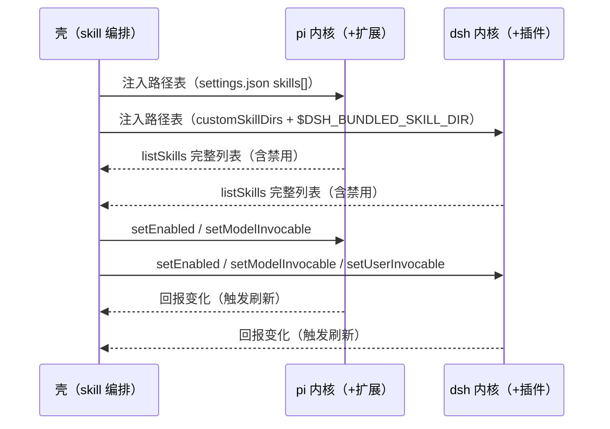
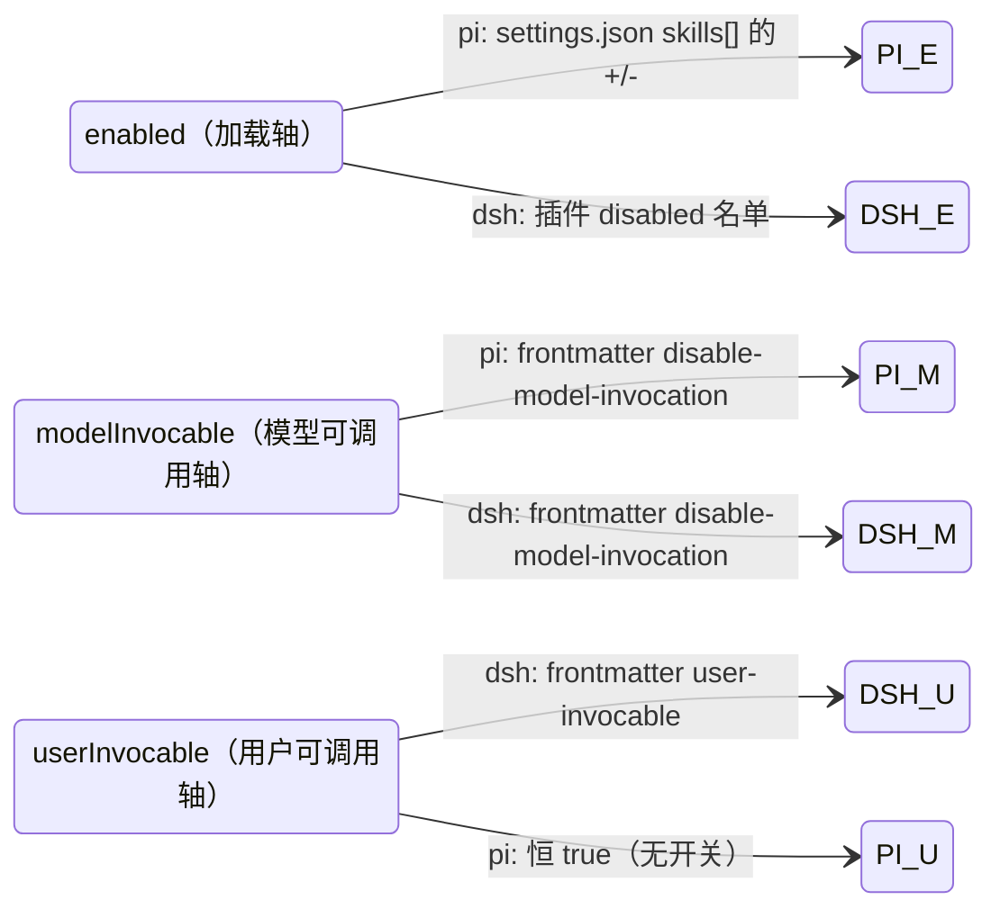

# 技能管理：壳传路径，内核返回

技能管理这个功能在 my-harness-desktop 里已经走了几轮，每一轮都在逼近同一个答案，直到这一轮才摸到内核无关的边。最早一版为了在 GUI 里管理 pi 的技能，选择在壳里复刻 pi 的扫描逻辑——读 `settings.json`、扫目录、算 enabled，因为当时有两条硬约束：pi 的 RPC 不暴露 reload（写完配置没法让当前会话立即重载）、`get_commands` 又只返回 enabled 的子集（管理页要显示"含禁用的全部"就够不着）。这个"壳复刻内核扫描"的决定在当时是合理的，但它埋下了两颗雷。

第一颗雷是壳读了内核存储。扫描器要读 `settings.json` 的 `skills[]`、要扫 `~/.pi/agent/skills` 目录、要解析 SKILL.md 的 frontmatter——这些都是 pi 的持久化格式，壳一旦学会，pi 改格式壳就得跟着改，加内核壳就要再学一套。第二颗雷是语义漂移。壳为了显示"启用/禁用"，在扫描器里复刻了一套 pi 的 `+/-` pattern 判定逻辑，这套逻辑和 pi 内部真正跑的那套是两份代码读同一份文件，任何一边改规则，另一边就漂，壳显示的"启用了几个"和内核真正加载的"几个"可能对不上。

接 dsh 进来之后，事情没有好转，反而把雷压实了。扫描器里又塞进了 dsh 的目录约定（`~/.dsh/skills`）和 `settings.yaml` 的解析，一个文件里同时装着两个内核的持久化细节；更糟的是 dsh 的关闭能力是缺失的——`SkillRegistry` 只有"往里加"没有"往外删"，dsh 压根没有"关掉某个技能"的机制，壳只能拿 frontmatter 的 `disable-model-invocation` 硬凑，结果"禁用"和"固定到上下文"写了同一个字段、互为反值，开关打架。这些坑都不是补丁能填的，根子在于方向错了：让壳去理解内核，而不是让内核对外暴露统一接口。

这一轮的重构就是把这个方向掰回来。核心一句话：**壳只负责把技能路径传给内核，内核自己扫、自己解析、自己判定、把完整列表（含禁用）回报给壳，壳再按能力标志渲染开关**。扫描、解析、判定这三件事从壳的代码里彻底消失，壳对内核的认知收敛成一份中立契约 `SkillProvider` 和一个能力标志。下面是完整的设计论证。

## 1 问题与现状

### 1.1 旧方案让壳读内核存储

技能管理这块，之前落地的方式是：在壳的用例编排层放一个 `skill-scanner.ts`，由它去扫 `~/.pi/agent/skills`、`~/.dsh/skills`、`~/.claude/skills` 这些目录，去读 `~/.pi/agent/settings.json` 和 `~/.dsh/settings.yaml` 里的技能路径配置，去解析每个 SKILL.md 的 YAML frontmatter，最后算出一个"启用了哪些、禁用了哪些"的列表喂给 UI。这条链路跑得通，但它把壳架在了内核的存储格式上。

按内核无关的三条不变量来对照，第一条就破了：**壳不读任何内核的存储**。pi 的技能路径存在 `settings.json` 的 `skills[]` 里、dsh 的存在 `settings.yaml` 的 `skills.filesystem.customSkillDirs` 里、技能正文存在 SKILL.md 的 frontmatter 里——这三样都是内核自己的存储格式。壳的扫描器逐字逐句地读它们，等于壳学会了 pi 和 dsh 各自的持久化细节。加第三个内核，壳的扫描器就要再学一套它的目录约定和配置格式；pi 或 dsh 改一次存储格式，壳的扫描器跟着改。依赖方向反了：内核是会变的细节，壳是稳定的机制，现在却是壳在追着内核的存储格式跑。

这条违规的具体证据，翻旧代码一处就能看见：`skill-scanner.ts` 里同时 import 了 `node:fs` 去读目录、去 `JSON.parse` pi 的 settings.json、去 `parseYaml` dsh 的 settings.yaml，还硬编码了 `~/.pi/agent/skills`、`<cwd>/.pi/skills`、`~/.dsh/skills`、`<cwd>/.dsh/skills` 这一串路径字面量。一个文件里既有 pi 的持久化细节、又有 dsh 的持久化细节，还有壳自己的目录约定，三种知识搅在一起。任何一个内核换格式，这个文件都要动；而它偏偏待在 `core/application`——壳最稳定的用例编排层。

更隐蔽的代价是语义漂移。壳为了显示"启用/禁用"状态，在扫描器里复刻了一套 pi 的 `+/-` pattern 判定逻辑（`isEnabledByOverrides`：默认 true、`!` 排除、`+` 强制启用、`-` 强制禁用），又复刻了一套 dsh 的 frontmatter 解析规则（`disable-model-invocation` 反值、`user-invocable` 正值）。这套复刻逻辑和内核里真正跑的那套逻辑，是两份代码读同一份文件，任何一边改规则，另一边就漂。用户看到的"启用了 20 个"，和内核真正加载的 20 个，可能对不上，而壳无从知道——因为壳没有问内核，是壳自己算的。

漂移不是假设，是已经发生过的事实。这轮调研里就撞见一例：app 从 `pi-desktop` 改名为 `my-harness-desktop` 时，壳写的 `+/-` 绝对路径 pattern 还指着旧数据根 `~/.pi-desktop/skills/...`，改名后新数据根是 `~/.my-harness-desktop/skills/...`，pattern 失配，于是用户之前禁用的内置技能静默复活。根因就是壳自己维护了一份"哪些禁用"的绝对路径清单，而这份清单的语义（绝对路径）在数据根改名时整体失效。如果禁用状态是内核算出来回报的，改名这件事由内核自己的迁移兜底，壳根本不用操心。

### 1.2 pi 的技能机制现状

要把方案讲透，得先把两个内核各自的技能机制摊开看清楚——壳要接的到底是哪一套、缺的是哪一块。先看 pi。

pi 的技能发现走四条路，按优先级从上到下：第一条是 `settings.json` 的 `skills[]` 数组，这是显式声明——用户往 `~/.pi/agent/settings.json` 写 `"skills": ["~/.claude/skills"]`，pi 的 `PackageManager.resolve()` 就把这些路径当来源目录，递归扫出 SKILL.md。第二条是 `~/.pi/agent/skills/`，pi 自己目录里的自动发现。第三条是 `~/.agents/skills/`，跨工具共享目录（Claude Code、Cursor 也可能往里放）。第四条是项目级的 `<cwd>/.pi/skills/` 和 `<cwd>/.agents/skills/`，以及从 cwd 逐级向上找 `.agents/skills/` 直到 `.git` 根为止的祖先链。

发现规则的核心函数是 `collectSkillEntries`：当前目录有 SKILL.md 就当技能、不再递归；否则递归子目录、跳过 `.` 开头和 `node_modules`、follow symlink；在 pi 自己的目录模式下，根目录的裸 `.md` 文件也当技能（向后兼容）。SKILL.md 是一个带 YAML frontmatter 的 Markdown，frontmatter 三个字段：`name`（可选，缺省用目录名）、`description`（必填，缺了技能不加载）、`disable-model-invocation`（可选，true 表示不进 system prompt、只能手动 `/skill` 调）。pi 用 `yaml` 包解析 frontmatter，加载时校验 name 不超过 64 字符、只允许小写字母加连字符、description 不超过 1024 字符，校验失败记 diagnostic 但不崩、该技能不加载其余照常。

启用/禁用是这套机制最精巧的部分，也是壳最容易复刻错的地方。`skills[]` 数组里的条目分两种：不以 `!`/`+`/`-` 开头的普通条目是"来源声明"，扫目录用；以 `!`/`+`/`-` 开头的模式条目是"开关控制"。判定函数 `isEnabledByOverrides` 的优先级从低到高：默认 enabled=true（扫到的默认启用），`!pattern` 排除匹配的，`+path` 强制启用，`-path` 强制禁用，`-` 优先级最高——想关掉某个技能，加一条 `-{相对路径}` 就一定能关。这里的 pattern 是 SKILL.md 相对于来源目录的路径——这是 pi 的原生语义。壳实际写的是绝对路径 pattern（pi 也支持绝对匹配），见取舍五。

加载流程是 `ResourceLoader.reload()`：重新读 settings.json → `PackageManager.resolve()` 扫描所有来源算出每个技能的 enabled → 过滤出 enabled 的 → `loadSkills()` 读 frontmatter 校验 → `formatSkillsForPrompt()` 把技能格式化成 XML 塞进 system prompt。`disableModelInvocation=true` 的不进 prompt。reload 的触发时机有限：交互模式的 `/reload` 命令、`AgentSession.reload()` 方法、print 模式每处理完一个 prompt 调一次——**RPC 模式不暴露 reload**，所以壳经 RPC 写完 settings.json 后，变更在 pi 下次启动新会话时生效。

pi 对外的技能出口只有 `get_commands` RPC，返回当前会话已加载的 enabled 技能（`skill:{name}` 形式）。它只包含 enabled 的、已加载的——被禁用的不在，`disableModelInvocation=true` 的也不在（因为不进 prompt）。管理页要看到"全部含禁用"，`get_commands` 给不了，这就是 pi 侧的缺口。

### 1.3 dsh 的技能机制现状

dsh（DeepSeek Harness）的技能机制和 pi 是两套完全不同的设计。它有一个 `SkillRegistry`（技能注册表）和一个 `skill-filesystem`（本地文件系统 provider），加一个 `tool-skill`（模型消费方）。

`skill-filesystem` 的发现根是一张带 rank 的表，rank 越小越优先：project-dsh（`<projectRoot>/.dsh/skills`，rank 100）、project-agents（`<projectRoot>/.agents/skills`，rank 200）、custom（`customSkillDirs` 配置，rank 300）、user-dsh（`~/.dsh/skills`，rank 400）、user-agents（`~/.agents/skills`，rank 500）、bundled（`$DSH_BUNDLED_SKILL_DIR`，rank 600）。projectRoot 是从 cwd 往上找最近的 `.git` 根。每个根递归扫 `<name>/SKILL.md` 目录 bundle 或 `<name>.md` 平铺文件。

`SkillRegistry` 是分层的：host+per-scope 层，provider 注册进调用方上下文对应的层。合并规则是"同名技能最近层直接赢、rank 只在单层内裁决"——"最近层"指 preset 层比全局层更近，preset 层注册的 provider 产生的同名技能，直接盖过全局层的同名技能，不进入 rank 比较。rank 只在同一层内裁决同名冲突，rank 越小越优先（`project-dsh` 100 < `project-agents` 200 < custom 300 < user-dsh 400 < user-agents 500 < bundled 600；另有 runtime 注册的技能 rank 250，介于 `project-agents` 和 custom 之间）。关键约束是——注册表只有 `registerProvider`（往里加 provider）和 `register`（注册 runtime 技能），**没有 filter/exclude 任何"往外删"的 API**。这是 dsh 架构上"关闭"缺失的根。

frontmatter 规则比 pi 严：`name` 必填且必须 kebab-case（`^[a-z0-9]+(-[a-z0-9]+)*$`）、`description` 必填，另有可选的 `whenToUse`、`metadata`、`disable-model-invocation`、`user-invocable`，并拒绝驼峰旧拼写（`disableModelInvocation` 等）。调用策略 `SkillInvocationPolicy` 把两个字段规范化成两个正向布尔 `modelInvocable` 和 `userInvocable`——`disable-model-invocation: true` 映射成 `modelInvocable: false`，`user-invocable: false` 映射成 `userInvocable: false`。两者都 false 的技能"只能由受信 `ctx.skills.get()` 调用"，即模型目录和用户 slash 菜单都看不到、但仍停在 raw catalog 里。

dsh 对外的技能出口是 `skill.list` RPC，返回**用户可调用**（user-invocable）的技能及其 `modelInvocable` 标志。它只覆盖 user-invocable 的子集，`user-invocable: false` 的技能不在；而且没有"含禁用的完整列表"概念（dsh 本来就没有"禁用/卸载"）。

### 1.4 两个内核暴露面的三个不对称

把 1.2 和 1.3 摊在一起，能看到三个不对称，它们正是方案要补的洞：

**不对称一：回报的都是"加载了/可调用了"的子集。** pi 的 `get_commands` 只回 enabled，dsh 的 `skill.list` 只回 user-invocable。被禁用的、被隐藏的，两边都不回。管理页要显示禁用项并支持重新启用，就得让内核多吐一点。

**不对称二：关闭能力只有 pi 有。** pi 的 `skills[]` 里 `-pattern` 就是关闭开关；dsh 的 `SkillRegistry` 架构上没有删的语义，关闭是真正的能力缺失，要补就得写内核插件在发现阶段过滤。

**不对称三：开关轴数量对不上。** pi 有两根轴（加载 `+/-` + 模型可调用 `disable-model-invocation`）；dsh 有两根轴（模型可调用 + 用户可调用），"加载"这根轴缺失。壳若按自己想象给两边画同一排开关，必然有一边对不上。

## 2 职责划分

### 2.1 壳管路径，内核管技能

一句话切开边界：**壳拥有"技能路径表"这份输入，内核拥有"技能"这个实体**。路径是壳的资源——哪些目录算全局、哪些算当前项目、内置技能目录在哪，这些是壳的配置，壳说了算。技能是内核的资源——路径下面到底有哪些 SKILL.md、frontmatter 怎么解析、加载哪个禁用哪个，这些是内核的运行时行为，内核说了算。

这条边界的物化就是下面这张时序：壳维护一份路径表，启动时把路径表翻译成每个内核能收的格式注入进去；内核扫路径、加载技能；壳要展示列表时向内核要，内核把完整列表（含禁用的）吐回来；壳要开关某个技能时向内核发一个开关意图，内核自己决定落到哪个存储。壳从头到尾不碰任何内核文件，不解析任何 frontmatter。



**图 1 — 壳只和两个内核的统一技能接口对话，不碰任何内核文件**

这张图里最该盯住的是方向：所有箭头要么是"壳把路径/意图发进去"，要么是"内核把列表/变化吐出来"。没有任何一条线让壳去读内核的目录或配置文件。pi 和 dsh 在图里是完全可替换的两个实现，壳对它们的认知只有一份 `SkillProvider` 接口，和一个能力标志告诉壳"这个内核支持哪几根开关轴"。

### 2.2 为什么是"内核补面"而不是"壳扫目录"

要达成上面那张图，得先回答：内核现在吐回来的列表不全（不含禁用），关闭不对称（dsh 没有），这缺口谁来补？答案只能是内核补，不能壳补——因为补这块需要读内核的存储、执行内核的加载语义，壳一旦伸手去补，就又回到了 1.1 的老路。

按能力拉平三分法套一遍。第一档"适配器翻译"管"两边有同一语义、只是形状不同"的差异；第二档"内核插件补面"管"能力缺失"的差异；第三档"显式降级"管"补不了的"差异。"回报完整列表"这件事，pi 侧其实有原生的等价物——pi 内部的 `resourceLoader` 本来就知道全部扫描结果，只是 `get_commands` 这个 RPC 面只挑了 enabled 的子集往外吐。所以 pi 侧要的是"翻译 + 补一个 RPC 面"，把内部已有的全量视图暴露出来，属于第一档。dsh 侧的"关闭"是真正的能力缺失——`SkillRegistry` 架构上就没有删的语义，要补就得写一个内核插件在发现阶段过滤，属于第二档。补不了的（比如 pi 的"用户可调用"轴，pi 压根没有这个语义）就显式降级——能力标志报 false，壳不渲染这个开关。

这些补面落在内核侧，壳只新增一份中立契约，不动扫描器、不读存储。补面的具体形态在 §4 展开，先记住结论：**壳的职责退回到"路径表 + 消费回报 + 转发意图"，扫目录和读配置这件事从壳的代码里彻底消失**。

### 2.3 关键取舍的完整论证

方案里每个"为什么这样不那样"都不是拍脑袋，下面把七个关键取舍逐个摊开，每个都给出被否决的那条路以及否决它的具体理由。

**取舍一：技能列表来自内核回报，而不是壳扫目录。** 被否决的是"壳自己扫目录、读 settings.json/settings.yaml、解析 frontmatter"。否决理由：扫目录需要知道每个内核的目录约定（pi 是 `~/.pi/agent/skills`、dsh 是 `~/.dsh/skills`），读配置需要知道每个内核的配置格式（pi 是 JSON 的 `skills[]`、dsh 是 YAML 的 `customSkillDirs`），解析 frontmatter 需要复刻每个内核的校验规则。这三样知识装进壳，壳就再也不是内核无关的了。而内核本来就有这三样知识——它扫目录、读配置、解析 frontmatter 是它的本分。所以列表该内核回报，壳消费。

**取舍二：关闭 dsh 技能用"发现阶段过滤插件"，而不是"注册同名 tombstone"。** 被否决的 tombstone 方案是：给 dsh 的 `SkillRegistry` 注册一个同名技能、把真技能顶掉。否决理由有两个，都在 dsh 的合并规则里。第一，跨层"最近层直接赢"：项目技能注册在更近的 preset 层，全局层的 runtime tombstone 和它不同层，跨层根本不比 rank、最近层直接赢，所以 tombstone 盖不住项目技能。第二，即便同层，单层内 rank 250 能盖住 custom(300)/user-dsh(400)/user-agents(500)/bundled(600)——project 技能盖不住是上面跨层规则（preset 层最近层赢）已经讲完的事，不再列入同层 rank 比较；而且被盖的真技能仍在 registry 里、受信 `get()` 还能读到，等于关了没关干净。发现阶段过滤是唯一能确保"名单里的技能整个不进 catalog"的做法。

**取舍三：开关渲染靠能力标志，而不是 `if(kernel)` 分支。** 被否决的是在壳插件里写 `if (skill.kernel === "pi") 画两个开关 else 画三个开关`。否决理由：这是内核身份泄漏进壳插件的渲染逻辑，加第三个内核就要改壳插件。能力标志把"支持哪几根轴"变成实现自己声明的一份数据，壳只读数据做渲染，加内核零改动。

**取舍四：开关轴建模成三根正交轴，而不是两根（把 dsh 的"禁用"合并进 model-invocable）。** 被否决的两轴模型是旧方案：dsh 的"禁用"被映射成"写 `disable-model-invocation: true` + `user-invocable: false`"，结果"禁用"和"固定到上下文"写同一个字段、互为反值，开关打架。否决理由：两个语义不同、存储点也不同（一个是"整个不加载"、一个是"模型能不能自动调"），硬并成一个字段必然互相覆盖。拆成三根正交轴后，"禁用"归 enabled 轴（dsh 经插件补 disabled 名单）、"固定到上下文"归 modelInvocable 轴（frontmatter），各写各的，打架的根拔了。

**取舍五：pi 的 enabled 轴继续写绝对路径 pattern，而不是改回相对路径。** 被否决的是相对路径（`-foo/SKILL.md`）。否决理由：相对路径在跨源时撞名——两个来源都有 `foo/SKILL.md` 时，相对 `-foo/SKILL.md` 会同时关掉两个。绝对路径（`-/Users/.../foo/SKILL.md`）只关一个，但代价是数据根改名时失配。两害相权，绝对路径 + 幂等迁移比相对路径 + 永久性跨源误关更划算，所以选绝对路径。

**取舍六：契约用正向布尔（`modelInvocable`/`userInvocable`），而不是照搬 dsh 的负向字段（`disable-model-invocation`）。** 被否决的是把 `disable-model-invocation` 原样放进契约。否决理由：契约是给壳消费的，壳关心"这个技能现在能做什么"（行为），不关心"这个技能被禁了什么"（存储痕迹）。负向字段是存储痕迹，正向布尔是行为。内核翻译成正向后吐给壳，壳只认行为。

**取舍七：列表要完整（含禁用），而不是只显示内核回报的 enabled 子集。** 被否决的是"壳就展示内核现在吐的（enabled 的）"。否决理由：管理页的"启用/禁用开关"是双向的，用户关掉一个技能后要能再点回来；如果列表只显示 enabled，关掉的技能从列表消失，开关就变成单向的、开不回来。所以必须完整列表，禁用项置灰、可重新启用。

## 3 中立契约

### 3.1 SkillInfo：去掉内核身份，只留行为

旧契约里 `SkillInfo` 带着 `layer`（desktop/claude/shared/base/plugin/custom）和 `kernel`（pi/dsh）两个字段，它们是壳为了分类和画徽标而硬编码进契约的。这正好踩了"壳理解内核是啥"的线——契约里出现 `kernel: "pi" | "dsh"`，就是在圆心复制内核身份；出现 `layer: "desktop"`，就是把壳自己的目录分组当成了技能实体的属性。这两个字段把"技能来自哪"这件本该由内核透传的事，变成了壳自己的一套分类法。

新契约只留行为和来源透传。一条技能对壳而言，有意义的就是三件事：它在哪个作用域（全局还是当前项目）、它现在处于什么状态（加载没加载、模型能不能自动调、用户能不能 `/skill` 调）、以及内核愿意透传的一句来源标签。名字和描述是展示用，文件路径是开关操作定位用（改 frontmatter 要落在哪个文件上）。

```ts
// core/domain/skills.ts —— 圆心中性契约，零依赖，不含任何内核/壳的身份字面量
export interface SkillInfo {
  /** 技能名（frontmatter name，内核解析后回报）。 */
  name: string;
  /** 描述（frontmatter description）。 */
  description: string;
  /** 作用域：全局(user) 还是当前项目(project)。 */
  scope: "user" | "project";
  /** 加载与否（pi 的 +/-、dsh 经插件补的 disabled 名单，都归一成这一个布尔）。 */
  enabled: boolean;
  /** 模型可否自动调用（frontmatter disable-model-invocation 的反值，两边通用）。 */
  modelInvocable: boolean;
  /** 用户可否 /skill 调用（frontmatter user-invocable，dsh 有、pi 恒 true）。 */
  userInvocable: boolean;
  /** 来源标签，由内核适配器在翻译时填入（dsh 填 user-dsh/bundled/custom 等、pi 填 builtin/local/auto），壳原样显示、不写死。 */
  source?: string;
  /** SKILL.md 绝对路径（开关操作定位用；纯列表展示可不带）。 */
  filePath?: string;
}
```

先厘清两个维度各自的含义：`scope`（user/project）是壳分区的维度，决定这条技能进"全局"还是"当前项目"两区；`source` 是内核透传的来源标签，决定技能行上的来源提示。两者独立，映射发生在内核适配器、不在壳。

dsh 的六个发现根到 `scope` 的逐根映射，判据是"根名枚举"而非"路径归属"：`project-dsh`、`project-agents` 两个带 project- 前缀的根 → project；`user-dsh`、`user-agents` 两个带 user- 前缀的根 → user；`custom`、`bundled` 两个无前缀的根 → user（它们都是全局配置，customSkillDirs 是全局单例、bundled 是内置目录，无项目级对应物）。这里没有"custom 该进项目列"的张力——壳路径表的项目列只下发给 pi（pi 有 `<cwd>/.pi/settings.json`），下发 dsh 时跳过（dsh 无项目级 customSkillDirs，见 §8 QA），所以 dsh 的 custom 根永远是 user。`source` 原样透传，壳不做映射也不写死任何 source 值。

pi 的 scope 判定同理，由 pi 适配器做，判据是"来源配置归属"：`~/.pi/agent/skills`、`~/.agents/skills`、以及 `~/.pi/agent/settings.json` 的 `skills[]` 普通条目 → user；`<cwd>/.pi/skills`、`<cwd>/.agents/skills`（含祖先链）、以及 `<cwd>/.pi/settings.json` 的 `skills[]` 普通条目 → project。两边适配器各自填 `scope` 和 `source`，壳只消费。

注意 `enabled`/`modelInvocable`/`userInvocable` 这三个布尔，是把两个内核各自的开关语义**归一**到同一套正向布尔上之后的产物。pi 的 `-pattern`、dsh 的 disabled 名单，落成 `enabled`；pi 和 dsh 共有的 `disable-model-invocation`，落成 `modelInvocable` 的反值；dsh 独有的 `user-invocable`，落成 `userInvocable`。壳拿到的是已经翻译好的中性状态，不用知道它来自哪种存储。

为什么用正向布尔（`modelInvocable`）而不是照搬 dsh 的负向字段（`disable-model-invocation`）？因为契约是给壳消费的，正向布尔表达的是"这个技能现在能做什么"，负向字段表达的是"这个技能被禁了什么"，前者是行为、后者是存储痕迹。壳关心行为，不关心存储痕迹。pi 的 `+/-`、dsh 的 disabled 名单、dsh 的 `disable-model-invocation` 都是"存储痕迹"，由内核翻译成正向行为后吐给壳，壳只认 `enabled`/`modelInvocable`/`userInvocable`。

### 3.2 SkillProvider 接口 + 能力标志

壳和内核之间的对话，收敛成一个接口。这个接口和 `BaseBackend` 是同一种东西——圆心定义契约，内核各交一个实现，bootstrap 组装。它包含四类操作：读列表、三个开关、以及订阅变化。

```ts
// core/domain/skills.ts —— 技能域的中立契约（和 BaseBackend 同构）
export interface SkillCapabilities {
  /** 是否支持"加载/卸载"轴（pi 原生有；dsh 经插件补）。 */
  toggleEnabled: boolean;
  /** 是否支持"模型可自动调用"轴（两边都有）。 */
  toggleModelInvocable: boolean;
  /** 是否支持"用户可 /skill 调用"轴（dsh 有；pi 无）。 */
  toggleUserInvocable: boolean;
}

export interface SkillProvider {
  /** 本内核支持哪几根开关轴，壳据此渲染开关、不硬编码内核身份。 */
  readonly capabilities: SkillCapabilities;
  /** 读完整技能列表（含禁用的），供管理页展示。 */
  listSkills(cwd: string): Promise<SkillInfo[]>;
  /** 加载/卸载（对应 enabled 轴）。 */
  setEnabled(skill: SkillInfo, enabled: boolean): Promise<void>;
  /** 模型可自动调用（对应 modelInvocable 轴）。 */
  setModelInvocable(skill: SkillInfo, value: boolean): Promise<void>;
  /** 用户可 /skill 调用（对应 userInvocable 轴）。 */
  setUserInvocable(skill: SkillInfo, value: boolean): Promise<void>;
  /** 订阅技能变化（文件/配置被内外改动时内核回报，壳重拉列表）。 */
  watch(cwd: string, onChanged: () => void): () => void;
}
```

能力标志是"壳对内核无感"的关键。壳渲染开关时不该写 `if (kernel === "pi")`，而该读 `capabilities.toggleEnabled`。pi 报 `toggleEnabled=true, toggleModelInvocable=true, toggleUserInvocable=false`，dsh 在关闭插件补完后报 `toggleEnabled=true, toggleModelInvocable=true, toggleUserInvocable=true`——加第三个内核，就是第三个实现各报各的标志，壳一行不改。这是补面完成后的终态；中间态（dsh 关闭插件还没写）dsh 报 `toggleEnabled=false`，壳自然不渲染"启用/禁用"开关，不硬编码、随能力走。这三根轴也正好覆盖之前理清的"技能状态三轴"：加载、模型可调用、用户可调用。

接口方法为什么都收 `SkillInfo` 而不是收 `name` 或 `filePath` 单独传？因为开关操作需要"定位到这个技能"和"知道它当前状态"两样信息，`SkillInfo` 一次带全。`setEnabled` 需要 `filePath`（写 pi 的 `+/-` pattern 时定位技能）和 `name`（写 dsh 的 disabled 名单）；`setModelInvocable`/`setUserInvocable` 需要 `filePath`（改 frontmatter）。传整个 `SkillInfo` 避免了调用方拆字段、也避免了"传 name 但实现里不知道 filePath"的二次查询。这是"构造在内"——壳把完整上下文交给内核，内核自己拆。

### 3.3 三根轴的语义要钉死

三根轴不能糊在一起，否则开关会互相打架。逐根定义：

- **加载（enabled）**：这个技能是否进入内核的加载列表。pi 的落地是 `settings.json` 的 `+/-` pattern；dsh 的落地是插件维护的 disabled 名单（发现阶段过滤）。这是三根轴里唯一一根"关了技能就整个不在"的轴，它和另外两根是正交的——一个加载了的技能，模型可调用和用户可调用各自再独立决定。
- **模型可调用（modelInvocable）**：这个技能是否进 system prompt、模型能否主动读它。落地是 frontmatter 的 `disable-model-invocation`，两边通用。这是"固定到上下文"开关的准确语义：开了就是"始终进 prompt、模型可自动调"，关了就是"不进 prompt、只能手动 `/skill` 触发"。
- **用户可调用（userInvocable）**：用户能否用 `/skill:name` 手动触发。落地是 frontmatter 的 `user-invocable`，只有 dsh 有独立开关；pi 的技能只要加载了，用户就能 `/skill` 调，没有独立开关，所以 pi 的这轴恒 true、能力标志里报 false（不提供开关）。

三根轴各自落一个独立的存储点，互不覆盖，这是"开关双向完整"的根。旧方案里 dsh 的"禁用"被错误地映射成"写 `disable-model-invocation: true` + `user-invocable: false` 两个 frontmatter"，结果"禁用"和"固定到上下文"写的是同一个字段 `disable-model-invocation`、互为反值——禁用写 true、固定写 false，两个开关打架，用户开了固定、又被禁用覆盖。新方案把"禁用"还给 `enabled` 轴（dsh 经插件补的 disabled 名单），`modelInvocable` 轴就只管"模型可调"，两者正交，打架的根因被拔掉了。

三根轴的组合状态，pi 和 dsh 各自覆盖的子集不同。pi：`enabled` × `modelInvocable`，四象限；`userInvocable` 恒 true。dsh：`enabled`（插件补）× `modelInvocable` × `userInvocable`，八象限。壳不需要理解这些组合，它只按能力标志渲染三根轴、按 `SkillInfo` 的三个布尔显示当前状态。组合的合法性由内核保证——比如 dsh 的"禁用"（`enabled=false`）下，`modelInvocable`/`userInvocable` 的状态仍有意义（它们记录的是"如果加载了会怎样"的偏好），内核翻译时保留、壳原样显示即可。

三根轴各自是独立的布尔，落到每个内核的存储点也各归各，这张状态图把"轴 → 存储点 → 生效时机"一次画全：



**图 2 — 三根轴各自的存储落点，pi/dsh 各占不同的格**

这张图值得盯着看的是：三根轴在 pi 和 dsh 上的存储点**没有一根是重叠的**。`enabled` 轴 pi 写 `settings.json`、dsh 写 disabled 名单；`modelInvocable` 轴两边都写 frontmatter 但那是同一根轴的同一落点；`userInvocable` 轴只有 dsh 写 frontmatter、pi 恒 true。正因为存储点正交，三根轴才不会互相覆盖，开关才是双向完整的。

## 4 内核暴露面

### 4.1 pi：有"接收路径"和"关闭"，缺"完整列表回报"

pi 这半边的底子最好。接收路径不用补——`settings.json` 的 `skills[]` 就是现成的入口，壳往里写普通目录条目，pi 的 `PackageManager.resolve()` 会扫这些目录找 SKILL.md。关闭也不用补——`skills[]` 里的 `+/-` pattern 就是现成的开关，`-pattern` 关、`+pattern` 强开。pi 缺的只有一样：把"完整列表（含禁用）"经 RPC 暴露给壳。

现在 pi 对外的技能出口只有 `get_commands`，它返回的是"当前会话已加载的 enabled 技能"，被禁用的、没加载的都不在。管理页要显示禁用项并支持重新启用，就得让 pi 多吐一点。pi 是独立二进制，壳不能改它的源码，但它有扩展机制——壳之前给 pi 写的 toolgate、subagent、bus 扩展都是装进 pi 进程的 TypeScript 扩展，走同一条通道。给 pi 补一个 skills 扩展，暴露两个东西：`list_skills`（返回扫描到的全部技能，含 `enabled` 标志，等价于 pi 内部的 `resourceLoader` 全量视图而非 `get_commands` 的 enabled 子集），以及 `toggle_skill`（写 `settings.json` 的 `+/-`，等价于 pi 内部的 `toggleTopLevelResource`）。这两样 pi 内部本来就有，扩展只是把它们翻译成 RPC 形状，属于"适配器翻译"而非"能力补面"。

pi 的"模型可调用"轴（frontmatter `disable-model-invocation`）不需要经 pi 的 RPC，由 pi 适配器（`client/pi`）改 SKILL.md 的 frontmatter 即可——这个字段是文件内容，不是 pi 进程状态，改了下次加载生效。壳经 `setModelInvocable` 意图把这个动作交给适配器，壳自己不碰文件。pi 的"用户可调用"轴不存在（恒 true），能力标志报 false，壳不渲染这个开关。

pi 扩展要处理的失败路径：`list_skills` 在 settings.json 损坏时返回空列表而不是抛错（pi 内部 `loadSkills` 对坏配置降级不崩）；`toggle_skill` 写 settings.json 要串行化（和 pi 的 `SettingsManager` 用同一把锁），避免并发写撕裂。这些是扩展实现侧的细节，壳不感知。

### 4.2 dsh：有"接收路径"和"部分回报"，缺"关闭"

dsh 这半边相反：接收路径是现成的（`customSkillDirs` + `$DSH_BUNDLED_SKILL_DIR`），"用户可调用"轴是现成的（frontmatter `user-invocable`），但"关闭"这根轴是真缺。dsh 的 `SkillRegistry` 只有"往里加"没有"往外删"——provider 只能贡献技能候选，没有任何 filter/exclude API 能把某个技能挡掉。要让 dsh 支持"关掉某个技能"，只能给它补一个内核插件。

这个插件要做两件事：维护一份 disabled 名单（存哪由插件定，比如 `~/.dsh/settings.yaml` 的 skills 命名空间，或插件自己的文件），以及在技能发现阶段把名单里的技能过滤掉。过滤的落法见 §4.4——`skill-filesystem` 既是发现又是注册、没有第三方 hook，所以插件要么改 `skill-filesystem` 加过滤字段、要么 fork 一份带过滤的发现 provider 替换它。dsh 是 cordis 架构，壳经 `DshConfigSource.addPlugin` 往 cordis.yml 写一行就能装上这个插件，和启用 `dsh-subagent`、`dsh-compaction-basic` 是同一条通道。

同时，dsh 的回报 `skill.list` 只回 user-invocable 的，插件要把回报扩成"完整列表（含禁用、带 enabled 标志）"。这样 dsh 侧的 `SkillProvider` 实现就齐了：`listSkills` 回完整列表、`setEnabled` 写 disabled 名单、`setModelInvocable`/`setUserInvocable` 改 frontmatter。

这里有个 dsh 架构的硬约束要讲透：`SkillRegistry` 的同名合并是"rank 决定 + 最近层优先"，没有删的语义，所以"关闭"不能靠"注册一个同名 tombstone 把它顶掉"——tombstone 盖不住项目技能——项目技能在更近的 preset 层，跨层最近层直接赢、不比 rank，而且被盖的技能仍在 registry 里、受信 `get()` 还能读到，关不干净。唯一可靠的是在发现阶段过滤，这是插件必须接在 `skill-filesystem` 之后的原因。

### 4.3 完整列表与关闭的暴露形态

两个内核补完之后，壳看到的是同一套形状：`listSkills(cwd)` 返回 `SkillInfo[]`，每条带 `enabled`/`modelInvocable`/`userInvocable`，禁用项也在列表里、只是 `enabled=false`。壳据此画列表——禁用项置灰，开关可点。这是 B 方案（完整列表）的落点：开关双向，关掉能再开回。B 方案对照的是 A 方案——"只显示内核回报的 enabled 子集"；A 的缺陷是禁用项会从列表消失、开关变成单向开不回来，所以弃 A 取 B。

这里要强调一个边界：完整列表里"禁用"的判定，是**内核自己算出来回报的**，不是壳猜的。pi 的扩展用 pi 内部的 `isEnabledByOverrides` 算每个技能是开是关；dsh 的插件用 disabled 名单判每个技能是开是关。壳不参与这个判定，只消费结果。这样"壳显示的 20 个启用"和"内核真正加载的 20 个"永远一致，因为数字是内核报的，不存在第二份复刻逻辑去漂移。

完整列表还顺带解决了一个历史包袱：壳之前为了显示"含禁用的全量"，在扫描器里复刻了 pi 的 `+/-` 判定和 dsh 的 frontmatter 解析。现在这两份复刻逻辑从壳删掉，判定职责还给内核，漂移的温床没了。

### 4.4 翻译与补面的具体形态

补面不是一句"写个扩展/插件"就完，两个内核的补面形态各不一样，落成具体的东西是：

**pi 扩展**：一个装进 pi 进程的 TypeScript 扩展，走 toolgate/subagent/bus 同一条扩展安装通道。它暴露两个 RPC 命令给壳。`list_skills` 返回扫描到的全部技能，每条带 `{ name, description, filePath, scope, enabled, disableModelInvocation }`——其中 `enabled` 是扩展调 pi 内部 `isEnabledByOverrides` 算出来的，`scope` 是 user/project 的区分，这些信息 pi 的 `resourceLoader` 全量视图里都有，只是 `get_commands` 只吐了 enabled 子集。注意 pi 扩展吐的是负向字段 `disableModelInvocation`，由 pi 适配器（`client/pi`）在翻译成中性 `SkillInfo` 时反转成 `modelInvocable`——反转点在适配器，不在契约、不在壳。`toggle_skill` 收 `{ filePath, enabled }`，扩展把它翻译成往 `settings.json skills[]` 写 `+pattern` 或 `-pattern`，等价于 pi 内部 `toggleTopLevelResource` 的行为。扩展的失败处理：settings.json 损坏时 `list_skills` 回空列表不抛错（pi 内部 `loadSkills` 对坏配置降级不崩）；`toggle_skill` 写文件走 pi 的 `SettingsManager` 同一把锁，避免并发写撕裂。

**dsh 插件**：一个 cordis 插件，经 `DshConfigSource.addPlugin` 挂进 cordis.yml。它做两件事。第一，维护一份 disabled 名单，存在 `~/.dsh/settings.yaml` 的 skills 命名空间（或插件自己的文件），名单内容是"被禁用的技能名"。第二，在发现阶段过滤——把 disabled 名单里的技能名剔除，具体落法是 §4.4 的两条路之一（改 `skill-filesystem` 加过滤字段，或 fork 带过滤的发现 provider 替换它）。同时它把 `skill.list` 的回报扩成完整列表（含 `enabled=false` 的禁用项，带 `enabled`/`modelInvocable`/`userInvocable` 三个布尔）。这样 dsh 侧的 `SkillProvider` 实现就是：`listSkills` 走扩展后的 `skill.list`、`setEnabled` 写 disabled 名单、`setModelInvocable`/`setUserInvocable` 改 frontmatter。

**"关闭"在 dsh 侧过滤的落地只有两条路，没有第三条**。要先说清一个约束：`skill-filesystem` 自己既是发现又是注册——它扫目录产出候选、再把这些候选注册进 registry，两者在同一个 provider 内部完成，`SkillRegistry` 没有暴露"发现之后、注册之前"的第三方 hook，所以不存在"包裹一下 skill-filesystem、在中间插一层过滤"的干净缝。剩下的两条路：一是改 `skill-filesystem` 加一个 `disabledSkills` 过滤字段（要动 dsh 核心，dsh 在另一个仓库）；二是 fork 一份带过滤的发现 provider、替换掉 skill-filesystem（不动核心，但要 fork 发现逻辑、承担与 dsh 上游发现逻辑同步的债）。两条路壳都不感知——壳只把 disabled 名单通过 `setEnabled` 意图发给插件。这个岔路是 dsh 侧落地时的实现选择，不在本文契约层面裁决，但要在实施时显式选定，不能两头含糊。

## 5 壳侧编排

### 5.1 路径表与注入

壳的输入是一份路径表，全局和项目各一列。全局列装着壳自己的内置技能目录（`~/.my-harness-desktop/skills`）、跨工具的 Claude Code 目录（`~/.claude/skills`）、以及用户声明过的额外目录；项目列装着 `<cwd>` 下的对应目录。共享目录 `~/.agents/skills` 不在这张表里——它两边内核都原生扫，是内核自己的来源、不是壳要注入的输入（见下文注入对象清单）。这份表存在壳自己的配置里，是壳的存储，不是内核的存储。

注入动作在启动时做一次、幂等：对 pi，把路径表里的普通目录条目写进 `~/.pi/agent/settings.json` 的 `skills[]`（项目级写 `<cwd>/.pi/settings.json`）；对 dsh，把目录写进 `~/.dsh/settings.yaml` 的 `skills.filesystem.customSkillDirs`，内置目录额外经 `$DSH_BUNDLED_SKILL_DIR` 环境变量在 spawn 时注入——这个变量就是 dsh 的 bundled 发现根（rank 600）的目录来源，壳设它 = 给 dsh 的 bundled 根提供目录，是同一个东西、不是并存的两份，壳的内置目录是该根的唯一内容。这里要注意注入的是"壳的路径表里那些内核原生不扫的目录"——`~/.pi/agent/skills`、`~/.agents/skills`、`<cwd>/.pi/skills`、`<cwd>/.dsh/skills` 这些内核本来就会自己扫，**不算路径表的注入对象**、不用壳再注一遍，避免重复发现。路径表只装"两边内核都不原生扫、壳要显式送进去"的目录：内置目录、Claude Code 目录、以及用户声明的额外目录——共享目录 `~/.agents/skills` 是 pi 和 dsh 都原生扫的（pi 的 auto 发现、dsh 的 user-agents/project-agents 根），不进注入对象。用户声明的额外目录存在壳配置 store 的一个键下（如 `skill-manager.customSkillDirs`，全局/项目两段），固定目录由壳的规则推导、不存配置。

注入的去重也很关键：路径表里的 `~/.claude/skills` 如果之前被用户手动写在 pi 的 `skills[]` 里，注入时要按"resolvePath 归一后比对"判断已在不在，在就不重复写。内置目录同理——`ensureBundledSkillsEntry` 已经做的"目标路径已在 skills[] 就跳过"的逻辑，推广到整张路径表。

路径表是只读的：壳不提供"运行时增删路径"的 UI，路径由规则推导（全局固定目录 + 项目固定目录 + 用户历史声明），用户要改就改配置。这满足之前定的"路径来源只读"。路径表变化时（用户改了配置），壳重新注入、再重拉列表——这是事件驱动，不轮询。

### 5.2 消费回报，按能力标志渲染

壳拿到 `SkillInfo[]` 后，按 `scope` 分两区（全局/当前项目），区内按名字排序。每个技能行渲染几个开关，由 `SkillProvider.capabilities` 决定：`toggleEnabled` 真就画"启用/禁用"开关，`toggleModelInvocable` 真就画"固定到上下文（模型可自动调用）"开关，`toggleUserInvocable` 真就画"用户可 /skill 调用"开关。pi 的 provider 报两根轴（启用/禁用 + 固定到上下文），dsh 的报三根（启用/禁用 + 固定到上下文 + 用户可调用），壳的渲染代码里没有一处 `if (kernel)`，只有 `if (capabilities.xxx)`。

来源标签 `source` 是透传的——内核回报里带什么，壳就显示什么，不自己定义 desktop/claude/shared 这套分类。这样壳插件彻底对内核无感：它不知道 pi、dsh、desktop、claude 这些词，只知道"我有一条技能、它在全局还是项目、它有三根轴的当前状态、内核给了一句来源描述"。

开关动作是乐观更新还是等内核回报？这里要和旧方案对齐：旧方案里壳乐观更新本地 state、失败回滚。新方案里开关动作发 `setEnabled` 等，内核回报变化后壳重拉列表——重拉本身就是权威刷新，乐观更新可有可无。为了交互即时性，壳可以乐观更新本地列表（点了立即置灰/点亮），等内核回报后再以回报为准校正；失败时内核不回报或回报未变，壳回滚。这个细节是壳插件的实现自由，不影响契约。

这里要分清两个时机，别混：`watch` 回报变化 → 壳重拉列表，是** UI 的即时刷新**——管理页立即显示你刚改的状态（置灰/点亮）；但内核真正加载/卸载这个技能，是**下次会话**——pi 读 `settings.json` 在新会话启动时、dsh 重新发现时，才按新状态加载。两者不同步，UI 上要提示"变更下次会话生效"。这一条对 `enabled` 轴（写 `settings.json`）在全文是统一的，不存在"内核即时生效"的路径；`modelInvocable`/`userInvocable` 轴（改 frontmatter）在 dsh 下有个轻微例外——dsh 的 watcher 能感知文件变化、下一轮 step 可能就反映，见 §8 QA，壳不承诺实时。

### 5.3 刷新

列表的刷新靠内核回报变化，不靠壳扫目录。`watch(cwd, onChanged)` 订阅内核的技能变化事件——pi 侧是扩展监听到 `settings.json` 或技能目录变化后回报、dsh 侧是插件经 `skills/change` 事件回报——壳收到 `onChanged` 就重拉 `listSkills`。内核的文件监听在各自内核层实现（pi 用 chokidar 听 settings.json 和技能目录、dsh 用 skill-filesystem 自带的 watcher），壳不自己监听目录，也就不存在"壳扫的目录和内核扫的目录不一致"的漂移。

切项目（cwd 变）时，壳重新调 `listSkills(新cwd)` 并重建 watch，项目级技能自然跟着换。路径表变化（用户改了配置）时，壳重新注入、再重拉。这两处都是"事件驱动、重拉全量"，不轮询不 sleep。

刷新粒度是粗的：内核侧把文件/配置变化合并、去抖后回报一次"变了"，壳全量重拉。不做增量 diff——技能发现是递归的，一个目录的增删可能影响整棵树的归属，增量更新复杂且容易和内核不一致。全量重拉在技能数量级（几十到几百）下毫秒级，用户无感。

### 5.4 三个动作的落地细节

注入、开关、刷新这三件事，落到代码上有几个容易踩的细节，逐一说清。

**注入的幂等与去重**。注入"把路径写进内核配置"必须是幂等的，否则每次启动都往 `skills[]` 里追加一条重复路径。判据是"resolvePath 归一后比对"：把路径表的每条路径和内核配置里已有的普通条目做归一化比较（`~` 展开、绝对路径规范化），已经在就不写、不在才追加。内置目录沿用 `ensureBundledSkillsEntry` 已有的"目标路径已在就跳过"逻辑，推广到整张路径表。项目级路径写 `<cwd>/.pi/settings.json`，切项目时旧项目的条目留在旧项目的文件里、不影响新项目。

**开关的定位与并发**。`setModelInvocable`/`setUserInvocable` 改 SKILL.md 的 frontmatter，要手术式地改单字段、保留注释和字段顺序、不整体重排 YAML——因为 frontmatter 是用户可读的内容，整体重写会丢注释。写文件要走锁，避免和别的写路径并发撕裂同一个 SKILL.md。`setEnabled` 在 pi 写 `+/-` pattern，在 dsh 写 disabled 名单，都是配置级写，走内核各自的配置写锁。

**刷新的事件来源**。`watch` 的内核侧监听要覆盖两类变化：配置变化（pi 的 settings.json、dsh 的 settings.yaml/cordis.yml）和目录变化（技能目录里增删 SKILL.md）。配置变化影响"哪些路径/哪些开关"，目录变化影响"路径下有哪些技能"。两类变化合并去抖后回报一次"变了"，壳全量重拉。项目切换是第三类触发——不是文件变化，是 cwd 变了，壳主动重调 `listSkills(新cwd)` 并重建 watch。

**注入失败的兜底**。写内核配置可能失败（目录无写权限、dsh 未安装）。失败不阻塞壳启动，记 warn 并继续——壳照常拉列表，只是那份路径没注进去、对应技能不显示。这和旧方案"settings.json 损坏就空列表"的降级一致。

**迁移与注入的顺序**。改名迁移重写 `settings.json` 的 `+/-` 条目、路径注入写 `settings.json` 的普通条目，两者动同一个文件，必须**先迁移、后注入、串行、共用同一把写锁**，不能并发——否则各自的读-改-写会拿彼此的旧快照互相覆盖。顺序定为迁移在前（把旧数据根的 `+/-` 条目先重写到新数据根），注入在后（再按 resolvePath 归一比对去重写普通目录条目），两者都在启动序列里串行执行。组合幂等：迁移靠迁移标记、注入靠归一比对去重，跑第二遍都不重复改。

## 6 界面

### 6.1 全局/项目两区

技能列表按 `scope` 分"全局"和"当前项目"两区，区内按名字排序。区头挂该区的来源路径（只读列表，从路径表派生）。没有项目时"当前项目"区显示空态。筛选和搜索跨区生效。这满足之前定的"路径必须跟项目走、全局 + 项目两级、别混"。

### 6.2 开关按能力标志渲染

每个技能行的开关数量随内核能力走，不随内核身份走。pi 下两枚（启用/禁用、固定到上下文），dsh 下三枚（启用/禁用、固定到上下文、用户可调用）。禁用项整行置灰、开关仍可点（点了就是重新启用）。开关动作落 `setEnabled`/`setModelInvocable`/`setUserInvocable`，壳不管背后写哪，只等内核回报变化后刷新。

### 6.3 来源透传

来源标签 `source` 原样显示在技能行上，作为"这个技能来自哪"的提示。标签的值由**内核适配器在翻译时填入**——pi 适配器填 `builtin`（内置目录）/`local`（settings.json 显式声明）/`auto`（自动发现目录）之类，dsh 适配器填 dsh 自己的 `SkillSource`（`user-dsh`/`user-agents`/`project-dsh`/`bundled`/`custom`）。壳只负责把它渲染出来，不把它翻译成自己的分类，也不写死任何标签值。

"内置"这个信息也走 source 透传，壳不自己算。pi 适配器（`client/pi`）知道内置目录，把它扫描出来的技能标成 `source: "builtin"`；dsh 的内置技能本来就是 `source: "bundled"`（来自 `$DSH_BUNDLED_SKILL_DIR` 根）。壳只透传 source、不按 `filePath` 自己判断"是否落在内置目录下"——因为"按 filePath 判内置"本质就是把壳自己的目录分组又当成了技能属性，和删除 `layer` 的理由是同一件事，换个地方重新犯。壳侧不做任何来源分类，来源分类全部由内核适配器在翻译时填进 source。

## 7 实现落点

### 7.1 文件清单

按洋葱分区落，每个文件的归属和改动方向如下：

- **`core/domain/skills.ts`（圆心）**：`SkillInfo` 改成中性字段（去掉 `layer`/`kernel`，加 `enabled`/`modelInvocable`/`userInvocable`/`source`），新增 `SkillCapabilities` 和 `SkillProvider` 接口。零依赖，不 import 任何内核。
- **`core/application/skills/`（用例编排）**：删除旧 `skill-scanner.ts`（扫目录、读内核配置的逻辑全部删）；新增一个只依赖 `SkillProvider[]` 接口的聚合器——注入路径表、合并多个内核的 `listSkills` 结果、按能力标志交给上层。壳层代码里不出现任何 `settings.json`/`settings.yaml`/`.pi`/`.dsh` 字面量。
- **`client/pi/`（pi 适配器）**：新增 `pi-skill-provider.ts`，实现 `SkillProvider`。它经 pi 扩展的 RPC 拿 `list_skills`、发 `toggle_skill`，改 frontmatter 走文件写。读 pi 的 settings.json、扫 pi 目录这些 pi 存储细节，都待在这里。
- **`client/dsh/`（dsh 适配器）**：新增 `dsh-skill-provider.ts`，实现 `SkillProvider`。它经 dsh 插件的 RPC 拿完整列表、发 `setEnabled`，改 frontmatter 走文件写。读 dsh 的 settings.yaml、扫 dsh 目录这些 dsh 存储细节，都待在这里。
- **`bootstrap/`（组装根）**：把 `PiSkillProvider`、`DshSkillProvider` 注入聚合器，路径表从壳配置读出注入。
- **`plugins/manager/skill-manager/`（壳插件）**：UI 退化成"调 `ctx.skills` 拿列表 + 按 `capabilities` 画开关"，删掉所有 `layer`/`kernel`/pi/dsh/desktop 字面量。

### 7.2 依赖方向检验

落完之后的依赖方向：`plugins/skill-manager` → `packages/react`（`ctx.skills`）→ `core/domain/skills.ts`（`SkillProvider` 契约）← `client/pi/pi-skill-provider`、`client/dsh/dsh-skill-provider`（实现）。圆心只定义契约，内核适配器在 `client/{kernel}` 实现，组装在 bootstrap。没有一条依赖从内层指向内核实现，也没有一条让壳读内核存储。`grep` 检验：`core/` 生产代码里对 `settings.json`/`settings.yaml`/`.pi/skills`/`.dsh/skills` 的引用归零，`SkillProvider` 的调用方看不到任何内核身份字面量。

### 7.3 实施顺序与验证门

这是个大重构，不能一把梭，但每一步都得是"过了验证门系统能跑"的完整态，不留"删了旧、新没接上"的空窗。先做一个前置 go/no-go 探针，再分三步交付。

**前置探针（不算交付步）：pi 扩展能否返回完整列表。** 这一步不写正式代码，只做探明——pi 内部的 `resourceLoader` 有没有一个"返回全部扫描结果（含禁用、带 enabled 标志）"的 API 能被扩展调用。有，整个方案成立；没有，评估给 pi 提补丁还是降级回旧方案。探针的门：一个最小 pi 扩展能吐出含 `enabled=false` 的完整列表。过不了这道门，后面全停。这一步对系统零改动，是 go/no-go，不是交付。

**第一步，契约 + 双适配器 + 聚合器 + UI 同步切换 + 删扫描器，一次完整落地。** 这一步的关键是"删旧"和"接新"必须同拍：写 `core/domain/skills.ts` 的 `SkillInfo`/`SkillProvider`/`SkillCapabilities`，写 `client/pi/pi-skill-provider`（走扩展 RPC、返回完整列表 + 关闭）和 `client/dsh/dsh-skill-provider`（先降级版——只回 `skill.list` 的 user-invocable 子集、`capabilities.toggleEnabled=false`），写聚合器，**同时**把 skill-manager 壳插件改成"调 `ctx.skills` 拿列表、按 `capabilities` 画开关"，然后才删掉 `skill-scanner.ts`——因为 UI 已经切走，扫描器没消费方了，删它不留空窗。这一步之后系统能跑：pi 侧完整（两枚开关、完整列表、禁用项可见可重新启用），dsh 侧显式降级（只显示 user-invocable 的技能、无"启用/禁用"开关、禁用项不可见——这是能力标志如实报 false 的结果，不是半成品）。验证门：`core/` 里对内核存储的引用归零 + pi 侧开关双向、列表完整 + 系统能启动、旧功能不回归。

**第二步，dsh 关闭插件。** 写 dsh 插件补 disabled 名单 + 完整列表回报，让 dsh 侧 `setEnabled` 有落点、`capabilities.toggleEnabled` 翻成 true。这一步之后 dsh 侧也完整：三枚开关、完整列表、禁用项可见可重新启用。验证门：dsh 下禁用一个技能，`listSkills` 里它变 `enabled=false`、`skill.list` 不再回它 + 旧功能不回归。

**第三步，注入 + 改名迁移 + 删增删路径 IPC。** 写路径注入（settings.json / customSkillDirs / `$DSH_BUNDLED_SKILL_DIR`）、写改名迁移（旧数据根 `+/-` 条目重写）、清掉旧的增删路径 IPC。这一步不碰扫描和渲染，只动输入侧和历史债。验证门：启动后两个内核的配置里都有壳的路径表、旧数据根 `+/-` 条目被重写、管理页路径只读 + 系统能启动、旧功能不回归。

三步各自过了验证门都是"系统能跑"的完整态，只是能力逐步补全；每一步的门都包含"系统能启动、旧功能不回归"这条，不只验新能力对不对。dsh 侧在第一步的"只回 user-invocable 子集、无启用/禁用开关"是能力标志驱动的显式降级，不是半成品占位——它如实反映了"dsh 的关闭能力还没补"这个事实，UI 如实不渲染那个开关。

## 8 QA

**Q：壳只传路径，那"被禁用的技能"壳怎么知道它存在、还能显示出来？**

靠内核回报完整列表。pi 的扩展、dsh 的插件都把"扫描到的全部技能（含 `enabled=false`）"吐回来，壳照单显示、禁用项置灰。壳自己不扫目录，所以"某个路径下到底有哪些 SKILL.md"这个信息永远来自内核，不存在壳自己再扫一遍的第二份真相。

**Q：dsh 的"关闭"插件具体怎么过滤？dsh 的 SkillRegistry 没有 exclude API。**

插件在发现阶段过滤：它拿到 disabled 名单，把名单里的技能名剔除。但要清楚：dsh 的 `SkillRegistry` 没有第三方 hook——`skill-filesystem` 既是发现又是注册，没有"发现之后、注册之前"的插入点，所以插件只有两条路：改 `skill-filesystem` 加过滤字段（动 dsh 核心），或 fork 一份带过滤的发现 provider 替换它（不动核心）。这是"内核插件补面"的典型——壳不碰这个过滤，只把 disabled 名单通过 `setEnabled` 意图发给插件。两条路留给内核侧落地时显式选定，壳不感知。

**Q：为什么不用"注册同名 tombstone"来关闭 dsh 技能，而要发现阶段过滤？**

tombstone 方案不可靠，两层原因。跨层：项目技能注册在更近的 preset 层，全局层的 runtime tombstone 跨层最近层直接赢、不比 rank，盖不住。同层：runtime rank 250 能盖住 custom(300)/user-dsh(400)/user-agents(500)/bundled(600)，project 盖不住是跨层规则已讲。加上被盖的技能仍在 registry 里、受信 `get()` 还能读到，等于"关了但没关干净"。发现阶段过滤是唯一能确保"名单里的技能整个不进 catalog"的做法。

**Q：内置技能被禁用后，app 升级会丢状态吗？**

可能，取决于禁用状态落在哪。若落在 SKILL.md 的 frontmatter（`disable-model-invocation`/`user-invocable`），而内置目录是受管目录、升级强制覆盖镜像，覆盖会把 frontmatter 改回源，禁用状态丢。但"加载/卸载"轴（`enabled`）的禁用状态落在 `settings.json` 的 `+/-` 或 dsh 的 disabled 名单——这些是壳/内核的配置，不在受管目录里，升级覆盖不到，所以 `enabled` 轴的禁用能跨升级持久。结论：三根轴里，`modelInvocable`/`userInvocable` 两轴（写 frontmatter）对内置技能有"升级覆盖丢状态"的边界，`enabled` 轴（写配置）没有。这个不对称要在 UI 提示里说清，不静默。

**Q：dsh 有没有项目级的"用户声明路径"落点？**

没有。dsh 的 `customSkillDirs` 是全局单例，dsh 没有 pi 那种 `<cwd>/.pi/settings.json` 项目级配置文件，项目级技能只来自固定目录 `<cwd>/.dsh/skills`。所以壳路径表的"项目列"里，用户声明的任意项目级路径只能下发给 pi，下发 dsh 时跳过——这是两个内核的一个真实不对称，壳的注入逻辑要显式处理，UI 在 dsh 下不提供"项目级用户声明路径"入口。

**Q：改名 `pi-desktop → my-harness-desktop` 留下的旧数据根 `+/-` 条目怎么办？**

启动时跑一次幂等迁移：把 pi 的 `settings.json skills[]` 里指向旧数据根（`~/.pi-desktop`、`~/.pi-desktop-dev`）前缀的 `+/-` 绝对路径条目重写到新数据根，带迁移标记避免重跑，目标不存在则丢弃。因为 `enabled` 轴继续写绝对路径 pattern，所以这个迁移不是一次性完事，而是"数据根每改一次名就跑一次"的兜底，代价是幂等的一条启动逻辑，换来禁用状态不静默复活。

**Q：壳渲染开关只靠能力标志，会不会把"这个内核支持什么"的判断又藏回了内核实现里？**

会，而且这正是想要的。能力标志是内核实现自己声明的（pi 报它支持哪些、dsh 报它支持哪些），壳只读标志做渲染。判断"支持什么"的知识待在实现里，不散落在壳的 `if(kernel)` 分支里。加第三个内核，它报自己的标志，壳零改动——这符合"多内核默认"和"无特权差异"。

**Q：watch 的"内核回报变化"是什么粒度？会不会内核频繁回报导致壳频繁重拉？**

粗粒度、去抖。内核侧监听文件和配置变化，合并、去抖后回报一次"变了"，壳收到就全量重拉一次列表。不做增量 diff——技能发现是递归的，增量更新复杂且容易和内核不一致，全量重拉在技能数量级（几十到几百）下毫秒级完成。这是事件驱动而非轮询，静默时不打扰。

**Q：这个方案和旧的 skill-manager 插件是什么关系？**

skill-manager 壳插件从"自己扫目录、自己算开关"退化成"调 `ctx.skills` 拿列表、按能力标志画开关"。它的 UI 结构（全局/项目两区、路径只读、开关可编辑）不变，变的只是数据从哪来——从壳扫描器变成内核回报。壳插件对内核无感，内核的暴露面变化不影响壳插件，反之亦然。

**Q：`enabled` 轴的开关在 pi 和 dsh 上，语义是否完全等价？**

基本等价，但有一个细微差异要知情。pi 的 `-pattern` 让技能**完全不进加载列表**；dsh 的 disabled 名单让技能**在发现阶段被过滤、不进 catalog**。两者对用户和模型可见面都是"这个技能不存在"，等价。唯一差异是 dsh 受信 `get()` 还能读到被过滤技能的定义（如果实现没在 get 层也过滤）——这个差异只对写 dsh 编排代码的人可见，对桌面用户不可感知，壳不用区分呈现。

**Q：pi 扩展和 dsh 插件由谁维护、怎么随壳分发？**

都由壳随壳分发，和现有的 toolgate、subagent、bus 扩展一个待遇。pi 扩展装进 pi 的扩展目录、dsh 插件经 cordis.yml 挂载，安装/摘除/升级走壳现有的扩展安装通道。它们是"内核插件"，不是"壳插件"，不进壳的插件加载器，走的是内核侧的装入口。

**Q：如果内核的 RPC 面补不出来（比如 pi 扩展做不到返回完整列表），方案还成立吗？**

不成立，会退回到旧方案。所以 pi 扩展"能否返回完整列表"是这条路的前提，要在实施第一步先验证——pi 内部的 `resourceLoader` 有没有一个"返回全部扫描结果（含禁用）"的 API 可以被扩展调用。有，就照本方案走；没有，就要评估是给 pi 提补丁还是降级回"壳扫目录"。这个前提不能藏在结论里，实施第一步就探明。

**Q：一个技能同名出现在全局和项目（比如全局和项目目录里都有 `foo`），列表里怎么处理？**

都显示，不合并。两个不同物理路径的同名技能是两条独立的记录，`enabled`/`modelInvocable` 各自独立。内核自己处理同名技能的加载优先级（dsh 是 rank 决定、pi 是后加载覆盖），壳不干预这个语义，只如实列出两条。用户看到两条同名技能，各自开关、互不影响。这符合"同名不同路径都收、内核裁决优先级"的既有约定。

**Q：用户声明的路径和固定目录重叠（比如用户手动声明了 `~/.claude/skills`，而它已经是 Claude Code 固定目录），注入时会重复吗？**

不会。注入时按 resolvePath 归一比对去重，`~/.claude/skills` 既是固定目录、又被用户声明过，比对后判定"已在"、不重复写。去重对 pi 和 dsh 各自的内核配置分别做——pi 比对 `skills[]`、dsh 比对 `customSkillDirs`。重叠的路径归固定目录语义，用户声明那份被吸收，不留两份。

**Q：pi 扩展的 `list_skills` 和 pi 原生 `get_commands` 会冲突吗？**

不会，两者是不同用途的两条路。`get_commands` 继续服务会话流（timeline/sessions-list 要的"当前会话已加载的 enabled 技能"），`list_skills` 新增服务管理页（"扫描到的全部技能含禁用"）。一个是运行时已加载视图、一个是扫描全量视图，互不替代。壳的管理页走 `list_skills`，会话流走 `get_commands`，不混。

**Q：dsh 插件的 watcher 和 `skill-filesystem` 自带的 watcher 会不会重复监听、重复回报？**

会各听各的，但回报到壳是合并去抖过的。`skill-filesystem` 的 watcher 听技能目录变化、管它自己的 catalog 失效；dsh 插件的 watcher 听 disabled 名单变化、管过滤结果的失效。两者监听对象不同、职责不同，不重复。壳只订阅一个 `watch`，内核侧把两个 watcher 的事件合并去抖后回报一次，壳无感。

**Q：壳传路径后，内核要多久才生效？**

和旧方案一致：下次会话生效。pi 读 `settings.json` 是在启动新会话时，dsh 读 `customSkillDirs` 也是发现时读，所以壳写完路径后，变更在下次新会话时生效；当前正在跑的会话不实时 reload。这是内核的加载时机决定的，不是壳能改的，UI 上要提示"变更下次会话生效"。唯一的例外是改 frontmatter（`modelInvocable`/`userInvocable`），dsh 的 watcher 能感知到文件变化、下一轮 step 可能就反映，但这是内核内部行为，壳不承诺实时。

**Q：三根轴在"禁用"（enabled=false）时，modelInvocable/userInvocable 的显示还有意义吗？**

有意义，但要理解它是"偏好记忆"而非"当前生效状态"。一个被禁用的技能，它的 `modelInvocable`/`userInvocable` 记录的是"如果重新加载了，这两个面开不开"。内核翻译时保留这两个布尔、壳原样显示（开关仍可点，但整行置灰提示"未加载"）。这样用户禁用一个技能时不会顺带丢掉它的另外两根轴设置，重新启用后那两根轴的状态还在。这是三根轴正交的自然结果。

**Q：路径表存在哪、谁改？**

存在壳自己的配置 store 里，是壳的存储。路径表的"固定目录"部分（内置、Claude Code）由壳的规则推导、不存；共享目录 `~/.agents/skills` 和内核自带目录（`.pi`/`.dsh`/`.agents`）不是壳路径表的内容——它们内核自己扫、不在注入对象里；"用户声明"部分（用户额外加的目录）存在壳配置里。UI 不提供运行时增删路径的入口（路径只读），用户要改"用户声明"部分就改壳配置。注入动作在壳启动和壳配置变化时触发，幂等。
