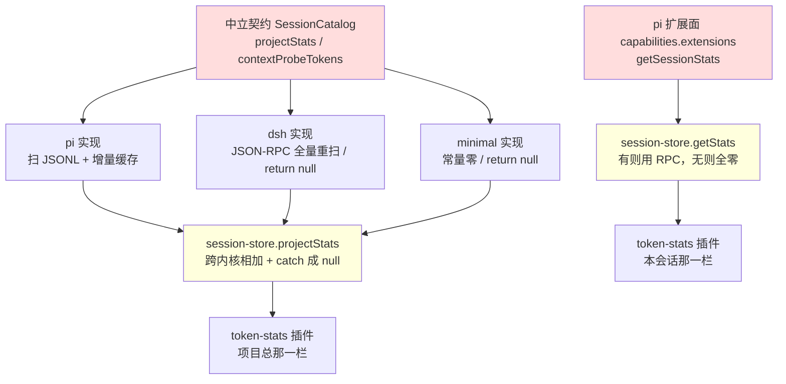
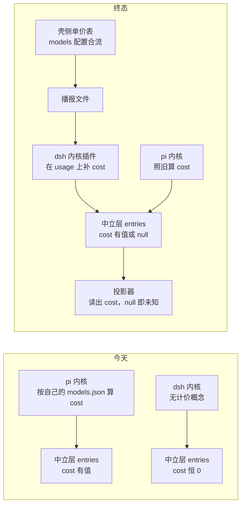
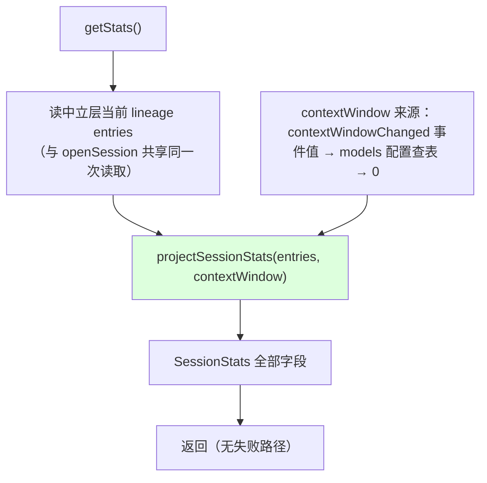
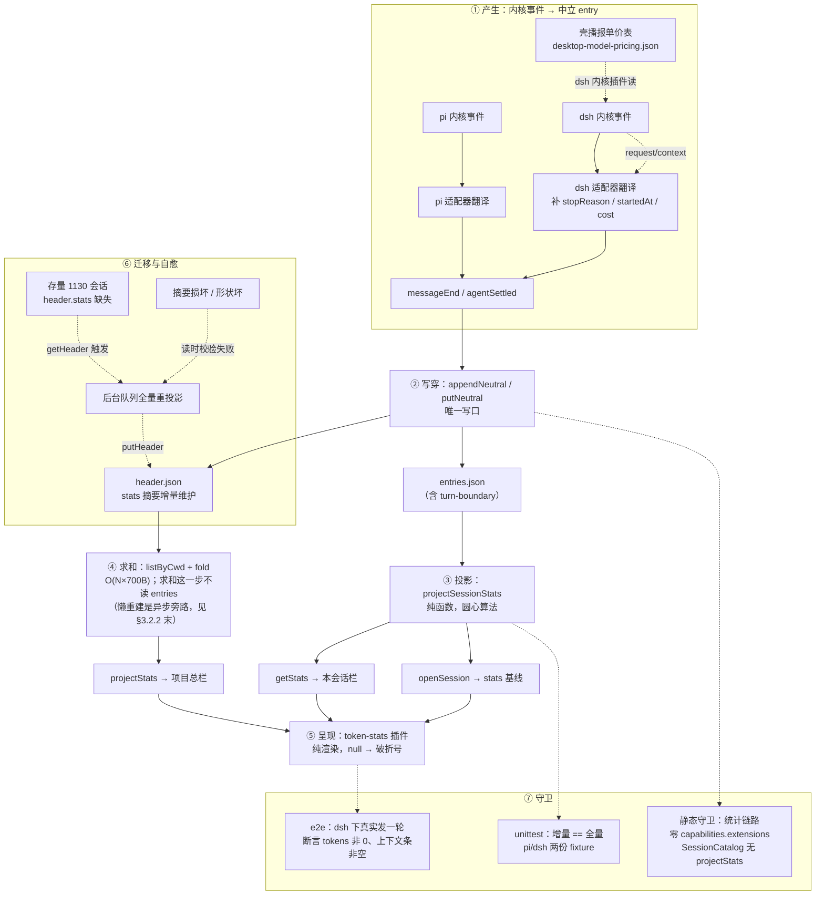

# 统计单源：中立层是统计的唯一真相源

> ⚠ **写稿时态符号说明**：本文成稿于逐轴能力面落地之前。文中以"病灶"身份引用的
> `capabilities.extensions` 桶、`BackendExtensions`/`PiBackendExtensions`、`asPi`、
> pi 的"31 命令"（实为 RpcCommand 联合 29，get_session_stats 在列）都是**当时的形状**，
> 现行代码已拆为圆心 `BackendCapabilities` 的逐轴面（steering/retry/compaction/snapshot/
> stats/modelCycle/toolExec/busFrames/questions/thinking + fileBacked + systemPrompt）、
> `asPi` 已退役为 `faceOf(proc, 轴, 标签)`。这些符号在本文保留作问题现场的原始证据，
> 勿当现状 API 使用。提案本体的"统计交付物 1"（stats-projector.ts）**尚未开工**，
> 与现状核对见 docs/reports/doc-code-gap-audit-2026-10.md。

打开右侧「统计」页签，切到一个 dsh 会话，本会话那一栏的输入、输出、缓存读、缓存写全是 0，上下文占用是一条空杠加一个破折号，只有回合数和步数有数字。切回 pi 会话，同样的栏位全都有值。同一个壳、同一个插件、同一套 UI，两个内核给出的数字差了一个数量级——不是差在精度上，是差在有没有上。

这件事在文档里被记成「已拉平」。`docs/design/kernel-parity-audit.md:82` 那行写着「会话统计 | `get_session_stats` | `session/projectStats` + 壳自算 | ✅（壳自算字段已内核无关）」，`docs/plugins/insight/token-stats.md` §6.4 整节的标题是「dsh 缺面留空、context-probe 补面」，把 dsh 统计为空解释成内核没这个能力，然后援引 CLAUDE.md §7.6 的显式降级说这是合规的诚实态。

这两份文档都错了，而且错在同一个地方：它们假定统计是内核的职责，于是内核给不出就是缺面，缺面就该降级。实测数据把这个假定推翻了——dsh 会话的 token 用量完整地躺在壳自己的中立层存储里，148 条 assistant entry 中 129 条带 usage，剩下 19 条是失败消息本来就没有用量。数字一直都在壳手上，只是没人去读。

本文立一个判断并把它落到底：**统计的真相源是壳的中立会话层，不是任何内核。** 一个投影器、一条代码路径，pi/dsh/minimal 无差别；内核侧的统计接口从统计链路上全部退役，中立契约因此变薄而不是变厚。

## 0. 术语与引用约定

本文用到五个贯穿全文的术语，先一次性交代，后文不再重复解释：

| 术语 | 含义 |
|---|---|
| **中立层 / 中立会话存储** | 壳自己拥有的一套会话存储，与任何内核的存储无关。物理位置 `~/.my-harness-desktop-dev/sessions/`，读写口是 `NeutralSessionStore`（`src/server/application/sessions/neutral-session-store.ts`）。设计源见 `docs/design/neutral-session-first.md` 与 `neutral-storage-split.md`。 |
| **ns** | neutralSessionId，中立会话主键。实测形状是 UUID（如 `66452cba-6159-4593-bfdd-d6c750e16508`）或带时间戳前缀的旧形态（`2026-08-25T08-54-51-575Z_94c2c029-…`），由壳生成，与内核的会话标识双向投影。 |
| **entry** | 中立层里的一条会话条目，类型 `NeutralEntry`（`packages/shared/src/domain/session-neutral.ts:81`），形状是 `{neutralEntryId, kernelEntryId?, message, display?}`。`neutralEntryId` 是 `{ns}:{seq}` 形式的稳定坐标。本文说「一条 entry」指的就是它，`message` 是它的内容主体。 |
| **写穿** | 内核事件到达后，壳把它落成中立层 entry 的动作。实现是 `session-store` 的 `appendNeutral`（追加一条）与 `putNeutral`（覆盖整树），两者是 entries 的唯一写口。 |
| **投影** | 把一串 entry 折成一组统计数字的纯函数运算。本文新增的那个函数叫投影器（§3.1），与既有的「内核私有形状 ↔ 中立坐标的双向投影」（`session-neutral-layer.md` 用语）是两个不同的东西，前者算数字，后者换坐标系。 |

三个已有的数据形状，本文反复引用，先给出定义：

- **`TurnUsage`**（`packages/shared/src/domain/events/session-state.ts:46`）：`{input, output, cacheRead, cacheWrite, cost}` 五个数字，描述一轮的用量。它是 `SessionStats.turn` / `lastTurn` 的类型，也是本文改成可空（`cost: number | null`）的三个类型之一。
- **`modelEvidence`**（`packages/shared/src/domain/sessions.ts` 的 `SessionDetail` 字段）：形状是 `{provider, modelId}`，由打开会话时线性扫描 entries 取末条带模型信息的 assistant 消息得出。本文用它做两件事：查 models 配置拿上下文窗口当分母（§3.4.2），以及作为 `openSession` 返回值的一部分（§3.6.2）。
- **`knownKernelIds`**（`session-store.ts:274`）：bootstrap 注入的已注册内核清单快照。今天的项目总靠遍历它逐个内核要数字（§1.2.1），终态下它在统计链路上不再被用到（§3.3.1）。

两处引用约定：

- **裸章节号指本文**（如「§3.2.1」）。引 CLAUDE.md 的一律写全「CLAUDE.md §x.y」，引其它设计文档写全文件名。本文自己的 §7 是「落地切分」，只到 7.3；凡是看到 §7.5 / §7.6 / §7.7 都是 CLAUDE.md 的。
- **代码锚点给到 `文件:行号`**，行号基于 `main` 分支 `5d58618b`。行号会随代码演进漂移，锚点的价值在于「能找到那一段」，不在于精确到行。

## 1. 问题：统计被定义成了内核的职责

### 1.1 三个内核三条统计路径

统计这件事今天在壳里有三份互相独立的实现，分属三个内核目录，各用各的数据源、各算各的口径。这不是「同一抽象的三个实现」，是「三个内核各自发明了一套统计」。

#### 1.1.1 pi：文件扫描与活进程 RPC 双源

pi 侧有两条互不相干的路径产出统计数字。

- **文件扫描路径**：`piGetProjectStats`（`src/server/kernel/pi/backend/pi-catalog.ts:565`）遍历本 cwd 桶下的全部会话 JSONL，逐行 parse，累加 `message.usage`，按 `mtime + size` 做增量缓存。它算的是项目总。`piReadSession`（同文件 `:160`）用同一套扫描逻辑算单会话基线，产出 `SessionDetail.stats` 与 `modelEvidence`。

- **活进程 RPC 路径**：`get_session_stats` 命令发给 pi 内核进程，返回值经 `toSessionStats`（`src/server/kernel/pi/protocol/context-binding.ts:147`）防御性提取成中性 `SessionStats`。它算的是本会话的实时值。

两条路径口径不同、时机不同、数据源不同，但产出的是同一个类型 `SessionStats`。UI 上「活会话 RPC 真值到达后覆盖文件基线」这句话（`packages/shared/src/domain/sessions.ts:116`）描述的就是这两条路径的合并规则——先显示文件扫的，等进程起来了再拿 RPC 的盖掉。

#### 1.1.2 dsh：JSON-RPC 全量重扫与基座字段全零

dsh 侧只有 RPC 路径，且它算的是项目总而不是本会话。

- **项目总**：`DshSessionCatalog.projectStats`（`src/server/kernel/dsh/backend/dsh-catalog.ts:185`）发一条 `session/projectStats` JSON-RPC。服务端实现（`~/.dsh/node_modules/@deepseek-ai/dsh-sdk-jsonrpc-server/lib/types/server.js:381`）列出全部会话 header，逐个 `persistence.readFrom(header.id, 0)` 全量重读事件流，累加 `assistant/message` 的 usage。零缓存。

- **本会话**：dsh 没有对应 `get_session_stats` 的方法。`handleRequest` 的 switch（同文件 `:591-633`）里 21 个方法，没有一个是会话级统计。于是 `session-store.getStats()` 走到 `shellSessionStats(local)` 分支，基座字段全部返回零值。

- **上下文探针**：`contextProbeTokens` 直接 `return null`（`dsh-catalog.ts:74`），注释说「dsh 的 context usage 由原生暴露，不经此探针」——但翻译器同时把 `request/context` 事件列进丢弃清单（`dsh-event-translator.ts:16`）。原生暴露的数据在适配器里被扔掉了。

#### 1.1.3 minimal：恒零占位

测试内核 `MinimalCatalog.projectStats`（`src/server/kernel/minimal/backend/minimal-catalog.ts:193`）返回全零，注释解释「壳侧 `SessionStore.projectStats` 会把各内核的数字相加，所以恒零不影响总数」。一个内核的统计实现是常量零，靠调用方的加法性质来保证正确——这是把正确性寄托在别人的运算律上。

#### 1.1.4 三条路径的形状对照

| 维度 | pi | dsh | minimal |
|---|---|---|---|
| 本会话基座字段 | `get_session_stats` RPC | 无此面 → 全零 | 无此面 → 全零 |
| 项目总数据源 | 扫本 cwd 桶 JSONL | RPC 让服务端扫全部会话 | 常量零 |
| 项目总缓存 | `mtime + size` 增量 | 无 | 不需要 |
| 需要活进程 | 本会话要，项目总不要 | 都要 | 都不要 |
| turns 口径 | 数 `role:"user"` 的消息条数 | 数全部 `user/message` 事件 | 0 |
| cost 口径 | `usage.cost.total` | 服务端写死 0 | 0 |

六行里只有「需要活进程」一行是真正的行为级差异（存储在哪决定的），其余五行都是同一件事的三种做法。按 CLAUDE.md §3.3 的判据——参数级差异该收敛，行为级差异才各自保留——这张表里 5/6 是欠债。

### 1.2 契约层承认了统计是内核的事

三份实现不是偶然长出来的，是契约要求的。

#### 1.2.1 `SessionCatalog.projectStats` 要求每个内核各交一份

`packages/shared/src/domain/backend.ts:341` 的契约注释写着「项目总统计：聚合本 cwd 桶下全部会话的 usage（含壳未运行期产生的会话）」。这句话把「聚合」定义成内核的义务：每个内核必须能报出它在这个 cwd 下所有会话的用量总和。

于是调用方必须跨内核相加。`session-store.ts:1200`：

```ts
const parts = await Promise.all(
  this.knownKernelIds.map((k) => this.catalogFor(k).projectStats(cwd).catch(() => null))
);
```

遍历已注册内核清单、各要一份、失败吞成 null、然后 reduce 相加。这段代码的形状本身就是契约形状的直接投影——契约说「每个内核交一份」，调用方就只能「问每个内核要一份再拼起来」。

#### 1.2.2 `contextProbeTokens` 只有一个内核填得出来

同一个接口里 `:319` 还有一条 `contextProbeTokens(sessionId): number | null`，注释「pi=context-probe 侧车；dsh 无此面返回 null」。一个契约方法，两个实现里一个读文件一个返回常量 null，第三个（minimal）也返回常量 null。

CLAUDE.md §6.3 检验 ④ 禁止圆心出现按内核名分字段的契约字段，理由是「加内核要改圆心」。`contextProbeTokens` 是这条禁令的另一种违反形态：字段名中立，但语义只有 pi 能兑现。加第三个内核时，这个方法的默认实现必然是 `return null`——契约上多一个所有新内核都填不出来的洞。

#### 1.2.3 契约承认错位的后果



**图 1 — 统计的两条链路。红：契约层把统计定义成内核职责的两个点。黄：调用方被迫做跨内核拼接与内核身份分流的两处。**

### 1.3 实测：数据已经全在中立层

前两节说的是「实现分散」，这一节说的是「分散完全没必要」——因为数据本来就在同一个地方。

#### 1.3.1 中立层的物理形状

壳自己有一套中立会话存储，物理位置 `~/.my-harness-desktop-dev/sessions/`，每个会话两个文件：

- `<ns>.header.json`：平均 493B（实测），装 `NeutralSessionHeader`（kernel / cwd / createdAt / name / lastMessage / pinned / custom…）。
- `<ns>.entries.json`：主体，装全部 lineage 与全部 entry，每条 entry 是 `{neutralEntryId, kernelEntryId, message, display?}`。

`NeutralSessionStore`（`src/server/application/sessions/neutral-session-store.ts`）提供 `get` / `getHeader` / `listByCwd` / `put` / `putHeader` / `delete` 六个方法，写口是 `put` 与 `putHeader` 两个。

实测规模：1130 个会话（pi 1063 / dsh 67）。entries 文件内容合计 268MB（`du` 磁盘占用 271MB，最大单文件 7.6MB），header 文件内容合计 0.53MB（平均 493B × 1130）。两个数字的比例决定了 §3.2.2 的性能主张——注意口径是**文件内容字节**，因为 `readFileSync + JSON.parse` 的代价正比于内容而非磁盘块（header 是小文件，`du` 会把每个补足 4KB 块，按 `du` 算是 4.4MB，但读盘只读内容）。

#### 1.3.2 两边的 usage 是同一种形状

从 entries 里抽 assistant 消息的 usage 字段：

| | pi（38874 条 assistant） | dsh（148 条 assistant） |
|---|---|---|
| usage 覆盖率 | 38874 / 38874 | 129 / 148 |
| 字段形状 | `{input, output, cacheRead, cacheWrite, totalTokens, cost:{…total}, reasoning}` | `{input, output, cacheRead, cacheWrite, cost, totalTokens}` |
| cost | 分解对象 `{input,output,cacheRead,cacheWrite,total}` | 数字，恒 0 |
| stopReason | 38858 条有 | 0 条有（用 `error:true` 表达） |
| startedAt | 38866 条有 | 111 条有 |

实测样本（pi）：

```json
{"input":15578,"output":21,"cacheRead":0,"cacheWrite":0,"totalTokens":15599,
 "cost":{"input":0,"output":0,"cacheRead":0,"cacheWrite":0,"total":0},"reasoning":6}
```

实测样本（dsh）：

```json
{"input":158,"output":147,"cacheRead":8448,"cacheWrite":0,"cost":0,"totalTokens":8753}
```

两者都已被写穿进中立层，都能被同一个函数解析。`messageUsageOf`（`packages/shared/src/domain/events/session-state.ts:215`）的注释写着「消费方：session-scanner（文件基线聚合）、project-stats（项目总聚合）、token-stats（事件流单条提取）——三处入口，形状解析只此一份」，它对 cost 的处理是 `typeof c === "number" ? c : c && typeof c === "object" ? n(c.total) : 0`，一行代码同时吃下 pi 的分解对象与 dsh 的数字零。

**dsh 缺的 19 条 usage 不是缺面，是失败消息**：这 19 条 entry 带 `error:true`，模型请求根本没成功，没有用量是事实。

#### 1.3.3 聚合算法已经在圆心，且内核无关

`session-state.ts` 里这几个函数没有一行提到内核：

- `messageUsageOf`（`:215`）：一条 message → `{tokens, cost}`。
- `contextSeqItemOf`（`:318`）：一条 message → `{est, anchor}`，锚点有效性判据是「assistant + 非 aborted/error + 真测到 prompt」。
- `estimateContextUsageFromSeq`（`:329`）：一串序列项 → `ContextUsage`，含压缩点重置与 trailing 估算。
- `resolveContextUsage`（`:349`）：信任序合成（锚可信 → 原样；不可信 → 用实测；都没有 → 诚实 null）。

`piReadSession`（`pi-catalog.ts:236-244`）算 `SessionStats` 用的正是这四个函数。也就是说：**算统计需要的全部算法早已抬到圆心，只是唯一调用它的人住在 pi 的目录里。**

### 1.4 用户可见的症状

#### 1.4.1 本会话层 dsh 全零

`session-store.ts:2450` 的分流：

```ts
const pi = proc.backend.capabilities.extensions as BackendExtensions | undefined;
if (!pi) return shellSessionStats(local);
```

`shellSessionStats`（`session-state.ts:84`）返回 `tokens` 全零、`cost: 0`、无 `contextUsage`。dsh 会话下「本会话」整栏归零，只有壳自算的 tps/turn/turns/steps 有值。

#### 1.4.2 上下文条恒空

`ContextUsageBar`（`src/plugins/insight/token-stats/renderer/context-usage-bar.tsx`）的判据是 `known = stats != null && used != null && limit > 0`。dsh 下 `stats.contextUsage` 是 undefined → `known` 为 false → 空条加破折号。分母其实拿得到：dsh 每步请求前发 `request/context` 事件，实测带 `{"provider":"us-new","model":"bifrost/dashscope/qwen3.8-max","contextWindow":1000000}`，翻译器把它扔了。

#### 1.4.3 `$0.00` 是伪造不是诚实

`CostRow`（`token-stats/renderer/index.tsx:156`）拿 `cost` 直接 `toFixed`。dsh 的 cost 恒 0，于是渲染成 `$0.00`。`shellSessionStats` 的注释说「不伪造」，但它把「不知道」编码成了 `0`，渲染层无从区分——**零值是伪造的一种形态**，比 null 更隐蔽，因为它长得像真数据。

#### 1.4.4 项目总 turns 被系统注入灌大

dsh 服务端算 turns 的代码是 `if (event.type === 'user/message') turns += 1`，不过滤 `source.kind`。而我们自己的翻译器（`dsh-event-translator.ts:58-66`）为同一件事专门加过过滤，注释记着根因：「dsh 运行时把系统上下文（agent-instructions / skill-catalog 等）也经 user/message 注入会话——这些不是用户发的消息，只在 `source.kind === "user"` 时翻译，否则丢弃，避免 CLAUDE.md / 技能清单等巨型系统内容冒充用户气泡污染会话流」。

同一个事实，翻译器记住了，服务端聚合没记住。于是同一个项目、同样的真实对话量，dsh 报的轮次比 pi 高，高出来的部分是 agent-instructions 与技能清单的注入次数。

#### 1.4.5 切会话 stats 基线丢失，pi 也在退化

`session-store.ts:955` 的 `openSession` 结尾：

```ts
// stats/modelEvidence 是文件扫描基线(pi 专属),中立层无此口径 → null/缺省
return { info, messages, stats: null };
```

中立层成为唯一真相源之后，这一行把 `SessionDetail.stats` 钉死成 null。注释里「pi 专属」的说法在中立层改造前成立，改造后不成立——中立层有 entries，entries 有 usage，两个内核都有。

后果对 pi 同样真实：切会话瞬间 stats 为 null，`SessionStatsTitlebar` 的 `placeholder = !stats` 成立，整行以 0.4 透明度显示四个破折号，要等 `refreshStats()` 起活进程才补真值。`piReadSession` 算好的 stats 与 modelEvidence 现在没有生产调用方（只剩 `pi-legacy-sessions.ts:66` 的迁移路径在用），是半个死代码。

「pi 支持好」不是稳态，是活进程 RPC 兜住了基线丢失，所以用户感觉不出来。

#### 1.4.6 打开统计面板会拉起一个 dsh 常驻进程

`DshSessionCatalog` 的 transport 是懒创建的（`dsh-catalog.ts:33`：`this.transportPromise ??= this.opts.createTransport()`），`createTransport` 会 spawn 一个 `dsh-jsonrpc-agent` 子进程并发 `initialize` 握手（`src/server/kernel/factories/kernel-factories.ts:127`），之后常驻复用。

用户点开统计页签 → `ctx.sessions.projectStats(cwd)` → 遍历 `knownKernelIds` → 问 dsh catalog 要一份 → 触发 spawn。一个纯读面板拉起一个内核进程，且这个进程不会因为关掉面板而回收。

#### 1.4.7 症状与根因的对应

| 症状 | 直接原因 | 根因 |
|---|---|---|
| dsh 本会话全零 | `capabilities.extensions` 分流到 `shellSessionStats` | 基座字段绑死 pi RPC（§1.2） |
| dsh 上下文条恒空 | `contextUsage` undefined | 同上 + `request/context` 被丢弃 |
| dsh cost 显示 `$0.00` | 零值当真实值渲染 | 缺面被编码成 0 而非 null |
| dsh turns 虚高 | 服务端不过滤 `source.kind` | 聚合逻辑在内核侧，壳的修正无法生效 |
| 切会话基线丢失（pi 也有） | `openSession` 返回 `stats: null` | 中立层改造后基线路径未跟进 |
| 打开统计面板 spawn 进程 | catalog 懒创建 transport | 项目总被迫走 RPC |

六个症状，一个根因：**统计的归属搞错了。**

### 1.5 这次是根因修复，不是第五次补丁

CLAUDE.md §3.7 给了两条判别气味，拿来对照统计这块的历史，两条都命中过。

#### 1.5.1 同一症状的重复修复

dsh 统计为空这件事，历史上修过两轮，都不是根因：

- 第一轮修的是 usage 读不到。`dsh-event-translator.ts:70` 的注释记着根因：「usage 在 `data.usage`（与 message 平级），不在 `data.message` 里——读 `message.usage` 恒丢」。修完之后 dsh 的 turn/tps 有值了，但本会话栏的 tokens 依然是 0，因为那一栏走的是 `get_session_stats` 分支，与事件流无关。
- 第二轮修的是项目总只问 pi。`session-store.ts:1197` 的注释记着：「此前只问 pi：别的内核的会话完全不计入，而读起来像是『这个项目的统计』」。修法是遍历 `knownKernelIds` 相加。修完之后 dsh 的项目总有了数字，但那个数字来自一次全量重扫，且 turns 口径与 pi 不一致（§1.4.4）。

两轮修复都在「让 dsh 那份数字出现」这个层面打转，没有问「为什么统计需要每个内核各交一份」。这就是 CLAUDE.md §3.7 说的「修完又发作，说明上一次修的不是根因」——症状从「本会话全零」转移到「项目总口径不齐 + 性能塌陷」，是同一个根因换了个地方冒出来。

#### 1.5.2 文档措辞的升级签名

`kernel-parity-audit.md:82` 那行的状态列写的是 ✅，括号里补了一句「壳自算字段已内核无关」。这个措辞值得注意：它说的是**壳自算的那五个字段**（tps/turn/lastTurn/turns/steps）内核无关，这是真的；但读者会把它读成「会话统计这一项已拉平」，而基座字段（tokens/cost/contextUsage/消息计数）在 dsh 下全零。

一个 ✅ 覆盖了半个事实。这不是文档写错了，是文档的粒度不够——「会话统计」这一行里其实装着两批字段，一批拉平了，一批没有，表格只有一列状态可填。

本文的 §1.1.4 那张对照表就是把这个粒度补回来：六行维度分别判，而不是给「会话统计」一个总评。

#### 1.5.3 根因陈述

> 统计的实现从一开始就长在 pi 的存储扫描与 pi 的 RPC 命令上，中立层成为唯一真相源之后，这块逻辑没有跟着抬上去。

这句话的三个组成部分都可验证：

- 「长在 pi 的存储扫描」——`piGetProjectStats` 与 `piReadSession` 都在 `src/server/kernel/pi/backend/pi-catalog.ts`，读的是 pi 的 JSONL。
- 「长在 pi 的 RPC 命令」——`get_session_stats` 在 pi 的 31 命令契约里（`src/server/kernel/pi/protocol/versions.ts:18`），`getStats()` 经 `capabilities.extensions` 才拿得到。
- 「中立层成为唯一真相源之后没抬上去」——`openSession` 已经改成只读中立层（`session-store.ts:941`），但同一函数的返回值里 `stats: null`，注释还写着「文件扫描基线（pi 专属）」。

第三条是时间线上的关键：中立层改造（`docs/design/neutral-session-first.md`、`neutral-storage-split.md`）把内容读口收归中立层时，统计读口被留在原地，于是 `piReadSession` 的 stats 计算失去了调用方，`openSession` 的 stats 变成了 null。这不是设计选择，是改造的遗漏。

## 2. 抽象：统计是 entry 流的纯投影

### 2.1 一个投影器，范围是参数

#### 2.1.1 三层口径是同一个投影的三个范围

UI 上「本会话 / 本轮 / 上一次 / 项目总」看起来是四件事，其实是同一个函数在不同 entry 范围上的四次调用：

| UI 栏位 | entry 范围 | 附加条件 |
|---|---|---|
| 本会话 | 当前 lineage 全部 entry | — |
| 本轮 | 最后一条回合边界之后的 entry | 未完成时为空区间（§2.2.2） |
| 上一次 | 倒数第二条与最后一条回合边界之间 | 同上，从持久 entry 算 |
| 项目总 | 本 cwd 下全部会话的全部 entry | 跨会话求和 |

「本会话」与「项目总」的差别只是 entry 集合的大小，不是算法的差别。把四层写成四套代码，就是把一个函数的四次调用写成四个函数——CLAUDE.md §3.3 说的「参数级差异该收敛」正是这个意思。

上表的「本轮」与「上一次」两行今天靠内存态（`proc.turn` / `proc.lastTurn`），归一后靠边界切分，因此它们不再是「仅活进程有意义」——存量会话也能算出它最后一轮的用量（只要它有边界 entry，§5.3）。

#### 2.1.2 投影器的输入输出边界

```
输入：NeutralEntry[]（已由调用方完成范围判定的一段线性 entry 流）+ 可选 contextWindow
输出：SessionStats 全部字段（基座字段 + 回合字段）
不做：IO、环境感知、内核身份判断、进程通信、范围判定（归调用方，§3.1.1.2）
```

输出是 `SessionStats` 全部字段而不是「基座子集」：回合字段（turns / steps / turn / lastTurn / tps）在 §2.2.2 拍板全归一之后也归投影器，不再由内存累计提供。唯一不从 entry 来的是「本轮进行中」的未完成部分，而 §2.2.2 的取证表明今天它也不存在（usage 只在 messageEnd 到达）。

它是一个纯函数。按 CLAUDE.md §4.5 的判据——「单元测试需不需要 mock 外部环境」——不需要，所以它是内层材料。但它吃的是 `NeutralEntry`（application 层的存储类型）而不是裸 message，所以物理位置在 `src/server/application/sessions/`，算法继续复用圆心那四个函数。

#### 2.1.3 算法已在圆心，缺的是编排

投影器不新写算法。它做的是把 `pi-catalog.ts:200-244` 那段扫描循环从 pi 的目录里搬出来，输入从「JSONL 行」换成「中立 entry」，其余逐行照旧：

- 逐条 `messageUsageOf` 累加 tokens 与 cost；
- 逐条 `contextSeqItemOf` 喂进序列，最后 `estimateContextUsageFromSeq` 出上下文占用；
- 按 role 计数 userMessages / assistantMessages / toolCalls / toolResults。

搬完之后 pi 侧不再有第二份聚合实现，`piReadSession` 的 stats 计算退役。

#### 2.1.4 投影器为什么不放圆心

本节用到三个 lineage 术语，先定义（它们来自 CLAUDE.md 开篇的 lineage 条目与 `session-neutral.ts`）：

- **祖先链**：从根 lineage 到当前活跃 lineage 经过的那些 lineage。一个会话 fork 过一次就有两条 lineage，当前看的那条的祖先链包含它自己与它 fork 自的那条的前缀部分。
- **旁支**：从同一个分叉点分出去、但不是当前活跃路径的那些 lineage（你 fork 之后回不去的那条）。
- **边界（boundary）**：fork 发生的那个 entry 坐标，`{parentLineageId, boundaryEntryId}`，记在子 lineage 的 `fork` 字段里。

回到分层问题。圆心（`packages/shared/src/domain/`）的准入判据是「零依赖、纯类型与纯函数」。投影器是纯函数，看起来合格，但它吃的输入类型是 `NeutralEntry`——这个类型在圆心（`session-neutral.ts:81`），所以类型依赖不是障碍。

真正的障碍是它的**调用语境**：投影器要决定「哪些 entry 属于当前历史」（§5.2 的 fork/seed 范围判定），而这个判定要读 `NeutralSession` 的 lineage 拓扑、要调 `sortLineagesTopologically`（按祖先关系排序 lineage）与 `resolveForkBoundaries`（把每条 lineage 的 fork 边界解析成具体 entry 坐标）。这两个函数在圆心，但「先解析拓扑再投影」这个编排是 application 层的职责——它属于「用例编排」，不属于「业务规则」。

按 CLAUDE.md §4.5 的分层问法：这段逻辑是业务规则还是用例编排？「一条 message 的 usage 怎么解析」是业务规则（已在圆心）；「这个会话的当前历史包含哪些 entry，然后把它们折成统计」是用例编排。所以投影器放 `src/server/application/sessions/`，与 `session-store.ts`、`neutral-session-store.ts` 同目录。

它仍然可以、也应该被纯函数化地测试（输入 entries 数组，输出 stats，无 mock）——放哪一层与能不能单测是两件事。CLAUDE.md §4.5 那条「需要 mock 的说明它碰了外层」的判据在这里给出的是「不碰 IO 就该可单测」，不是「可单测就该放圆心」。

### 2.2 真相源只有一个

### 2.2 真相源只有一个

#### 2.2.0 单源的准确含义

「单源」这个词容易被读成「只有一个数字来源」，实际含义更窄也更硬：**统计的每一个字段，都只有一条计算路径，且这条路径不区分内核。**

对照今天的状态，违反这条的具体形态有三种，终态各自消除：

| 违反形态 | 今天的实例 | 终态 |
|---|---|---|
| 同一字段两条计算路径 | pi 的 tokens 有文件扫描与 RPC 两条 | 只有投影器一条 |
| 同一字段按内核分流 | `getStats()` 的 `capabilities.extensions` 判断 | 分流消失 |
| 同一字段各内核各算一遍 | projectStats 跨内核相加 | 求和发生在壳的 header 摘要上，与内核无关 |

第三种最隐蔽：它看起来是「统一加法」，但加法的每一项来自不同内核的不同实现，口径由被加数决定。§1.4.4 的 turns 虚高就是这个形态的直接后果——加法本身没错，错在两个被加数的口径不同。

#### 2.2.1 内核统计面退役意味着什么

「彻底替代」不是「不调用」，是三个物理动作：

1. `SessionCatalog` 删掉 `projectStats` 与 `contextProbeTokens` 两个方法 → 三份实现（pi/dsh/minimal）连带删除；
2. `DSH_METHODS.sessionProjectStats` 从方法枚举删除 → **壳不再发这条 RPC**（dsh 服务端自带的方法仍在，那是外部内核的实现，不属于我们的改动范围，详 §3.3.3）；
3. `session-store.getStats()` 不再读 `capabilities.extensions` → pi 的 `getSessionStats` 扩展面方法在统计链路上无调用方。

第 3 条要小心：`PiBackendExtensions.getSessionStats` 是不是也该删？它是 pi 扩展面的一部分，`capabilities.extensions` 这个能力探测机制还服务着 steer / thinkingLevels / onExtensionUI 等其它 pi 专属能力。删方法、留机制——扩展面本身没错，错的是统计借道它。

#### 2.2.2 瞬时量与持久量的分工

取证结论要先摆出来，因为它推翻了「流式实时统计」这个想当然的需求：**tps 与 turn 今天就不是流式更新的。**

先交代这些内存态住在哪里，否则下面的行号没有语境：`session-store` 为每个活会话持一个 `SessionProc` 对象（构造在 `session-store.ts:607`，重置在 `:2348`），里面除了 backend / kernel / cwd / key 这些身份字段，还有一组专为统计而存在的内存计数器：`genStartMs`（本条消息开始时刻）、`roundOut` / `roundGenSec`（本轮累计输出与耗时，tps 的分子分母）、`lastTps`、`turn` / `lastTurn`（`TurnUsage` 形状）、`turns` / `steps`。它们全部是进程内存态，不落盘，`SessionProc` 随会话停止而消失——这就是今天「重启即丢」的物理原因。

在这个前提下看取证结果：`session-store.ts:3008` 的 `proc.lastTps = roundOut / roundGenSec` 与 `:3011-3013` 的 `proc.turn.* +=` 全在 `messageEnd` 分支里，不在 `messageUpdate` 分支。原因是 usage 只在 `messageEnd` 到达——`messageUpdate` 携带的是 text / reasoning 增量，不带 token 计数（dsh 翻译器的 chunk 路径无 usage 映射，pi 侧同理）。

所以「全归一」不需要处理流式窗口。回合结束的那一刻，entry 写穿完成，投影器立刻能算出与今天内存累计完全相同的数字。

| 字段 | 今天的来源 | 终态来源 | 时机差异 |
|---|---|---|---|
| tps | 内存 `proc.lastTps`（messageEnd 更新） | entries 的 `startedAt` / `timestamp` 差值 | 无 |
| turn | 内存 `proc.turn`（messageEnd 累加） | 最后一条回合边界之后的 entry 求和 | 无 |
| lastTurn | 内存 `proc.lastTurn`（agentStart 归档） | 倒数两个回合边界之间的 entry 求和 | 无 |
| turns | 内存 `proc.turns`（agentSettled 计数） | 回合边界 entry 计数 | 无（重启后仍有值，今天会丢） |
| steps | 内存 `proc.steps`（stepEnd 计数） | assistant entry 计数 | 无（重启后仍有值） |

最后一列的「无」指的是**更新时机**不变：两者都在一轮结束时才有新值，归一不会让任何字段变得更晚。它不指「数值逐位相等」——tps 的分母从壁钟时间换成 entry 时间戳，数值会小幅变大（§3.4.3、§5.7）。两个声明不矛盾，但必须分开说：时机不变、tps 量值微调。

而 turns / steps 从「仅活进程内存态，重启即丢」变成持久可算——`SessionStats` 里这两个字段今天的注释明写着「重启/未起进程为 undefined」，归一后这个限制消失。

#### 2.2.3 overlay 是现成的双层结构，不新造

`src/web/stores/session-store.ts:48-117` 已经有一套双层合并，先把两层各装什么说清楚，否则下面的路标读不懂：

- **`base`**：中立层镜像的内容，即从 `openSession` 拿到、后续由 `entryAppended` 增量追加的那一份。它是唯一内容源，对应磁盘上的 entries。
- **`overlay`**：执行态暂存，装两种东西——用户刚敲下发送、还没得到内核确认的乐观回显（user 消息），以及流式进行中的 assistant 占位消息（带 `pending: true`，每个 token 增量就地更新它）。
- **合并**：`mergeMirrorWithOverlay(base, overlay, toolResultLedger)` 是纯函数，把两层拼成渲染用的最终消息列；`applyOverlayEvent` 根据事件增量维护 overlay（messageEnd 到达时把 pending 占位删掉，因为同一条消息已进 base）。

关键在于：overlay 里那些流式占位消息**没有 usage**（§2.2.2 的取证），所以把它们加进统计也是零。

统计如果哪天需要「未完成尾巴」，该复用这个已有结构，而不是给投影器加 live 参数。按 §2.2.2 的取证，现在不需要——overlay 里那些 `pending:true` 的流式占位消息没有 usage，加进来也是零。

这条写在这里是为了留个路标：将来若产品真要 token 级实时统计，正确解法是让 overlay 也携带增量 usage（需要内核在 chunk 里报 usage，属 CLAUDE.md §7.6 第 2 选补面），而不是在投影器上开一个只有活进程填得出来的参数。

#### 2.2.4 投影器与活进程的关系：读同一份存储

归一之后，活进程在统计链路上不再提供任何数据。但活进程仍然是 entry 的**生产者**——事件从内核来，经适配器翻译，经写穿落进中立层。所以链路是单向的：

```
活进程 → 事件 → 写穿 → 中立层 → 投影器 → UI
```

而不是今天的：

```
活进程 → 事件 → 写穿 → 中立层 → 渲染
活进程 → RPC 查询 → 统计 → UI     ← 这条旁路要拆掉
```

拆掉旁路带来一个可观察的行为变化：**统计不再需要活进程在场。** 今天 `getStats()` 第一行是 `if (!proc || !proc.backend.alive) throw new Error("内核未启动")`（`session-store.ts:2447`），前端 `refreshStats()` 靠 catch 兜住这个异常维持破折号占位（`src/web/stores/session-store.ts:502` 的注释说明了这条）。终态下历史会话的统计不依赖进程是否启动，破折号只在「真的没有数据」时出现。

这也顺手解决了 §1.4.6：统计面板不再触发任何 RPC，因此不再 spawn dsh 子进程。

### 2.3 回合边界进中立层

#### 2.3.1 turns 是全归一后唯一算不出来的字段

实测中立层 entries 的 role 分布（200 个会话采样）：

```
toolResult 7960 / assistant 7958 / user 1020 / task-completion-notify 719
divider 664 / claude-md-context 154 / loop-* 系列 ~180 / image 5 / bashExecution 2
```

- `steps`（单次模型调用数）可推导：一条 assistant entry = 一次模型调用。
- `turns`（完成回合数）推导不出来：今天它数 `agentSettled` 事件次数（`session-store.ts:2951`），而 `agentSettled` 是运行时事件，中立层没有对应 entry。

本节标题里的「全归一」是 §2.2.2 那个决策的简称：今天 `SessionStats` 的字段分两批——基座字段（tokens / 消息计数 / cost / contextUsage）问内核要，回合字段（tps / turn / lastTurn / turns / steps）由壳在 `SessionProc` 内存里累计；全归一指两批都改由同一个投影器从中立层 entries 算出，内存累计退役。turns 是归一后唯一没有持久数据可算的字段，所以它需要一个新 entry 类型。

#### 2.3.2 落一条回合边界 entry

`agentSettled` 到达时，往中立层写穿一条边界 entry：

```json
{"neutralEntryId":"<ns>:<seq>","message":{
  "role":"turn-boundary","content":"end_turn","display":false,
  "reason":"end_turn","timestamp":1736000000000}}
```

（这个样例的每个字段为什么这么填，见本节末的隐藏机制讨论。）

这个形态有现成先例。`NeutralMessage.role` 的类型是宽松 `string`（`session-state.ts:171`），不是封闭联合；`divider` 就是同类的非对话 entry，由圆心的 `divider()` 工厂函数（`session-state.ts:631`，模块内部不导出，对外经 `sessionEntryToNeutral` 的各分支调用）构造，形状是 `{role:"divider", kind, i18nKey, i18nArgs, content:"", detail, id, timestamp}`。回合边界与分隔线在物理形状上同构，但有一个关键区别：**分隔线是要渲染的**（`divider` 在 `STANDARD_ROLES` 里，渲染成居中分隔条），而回合边界不渲染。

不进时间线渲染靠的是 `display` 字段，不是 role 名单——这里必须说清，因为容易搞错：

- `isVisibleMessage(msg)`（`session-state.ts:658`）的实现就一行：`return msg.display !== false`。它不看 role。
- `STANDARD_ROLES`（`:665`，内容是 `user`/`assistant`/`toolResult`/`divider`）服务的是 `deduplicateAdjacent` 的去重策略（标准角色只相邻去重、非标准角色全量去重），**不是可见性开关**。
- 渲染层的实际判定在 `src/plugins/sessions/timeline/renderer/blocks.ts:93`：`if (message.display === false) return null;`。

所以回合边界 entry 带 `display: false`，三处（`isVisibleMessage` / `blocks.ts` / 任何走 display 判定的消费方）自动排除它，不需要往 `STANDARD_ROLES` 里加东西。它同时要加进 `STANDARD_ROLES` 吗？**不加。** 加了意味着把它当「用户可合法重复发送的标准角色」，而它既不可见也不参与去重语义。

不加就会落入「非标准 role 全量去重」分支（`session-state.ts:693`，键是 `role::contentKey(content)`）。这个分支对边界 entry 有没有害？分两条路径看，结论不同：

- **渲染路径**（`neutralMessagesOfSession`，`session-neutral.ts:550`）内部调 `deduplicateAdjacent`，所以同一会话里多条 content 相同的边界会被压成一条。**无害**——它们本来就不渲染，压不压都不上屏。
- **统计路径**不能走这个函数。`deduplicateAdjacent` 不看 `display`，它会把 `turn-boundary` 当普通非标准 role 处理，于是 turns 从「真实轮数」变成 1。所以**投影器必须吃 `lineageContent` 的直接输出（`session-neutral.ts:339`，不去重），不能吃 `neutralMessagesOfSession` 的输出**。

这条区分要写进实现约束，因为两个函数名字很像、返回的都是消息列表，很容易拿错。`content` 字段仍建议存 `reason`（而不是空字符串），理由不是避去重（统计路径根本不去重），而是让 entry 自解释：磁盘上直接能看出这一轮是怎么结束的。

于是 §2.3.2 开头那个样例的正确形状是：

```json
{"neutralEntryId":"<ns>:<seq>","message":{
  "role":"turn-boundary","content":"end_turn","display":false,
  "reason":"end_turn","timestamp":1736000000000}}
```

壳自造的边界 entry 没有内核侧对应物，`kernelEntryId` 省略不写——它在 `NeutralEntry`（`session-neutral.ts:84`）里本就是可选字段，注释写明「内核私有 entry id（投影时的 opaque 线索，仅 adapter 用）」，壳自己产生的 entry 无此线索是合法状态。

#### 2.3.3 reason 顺带持久化

`agentSettled` 今天已经携带 reason。`dsh-event-translator.ts:36-39` 的注释记着这次改动：「把 turn/end reason 带进中性流（不再丢弃）：『继续执行』入口据此判断是否异常停机」。

reason 现在只活在内存事件流里，重启即丢。落进边界 entry 之后，「上一轮是异常停机」这件事变成可持久查询的会话历史——继续执行入口重启后仍能判断，goal 的失败归因也能读到历史轮次的停机原因。这是 §2.3 的附带收益，不是主要目的，但它让「多加一种 entry」这笔账更划算。

#### 2.3.4 turns 与 steps 的推导口径

| 字段 | 推导 | 与今天口径的关系 |
|---|---|---|
| turns | `role === "turn-boundary"` 的 entry 计数 | 完全等价（都数 agentSettled 次数） |
| steps | `role === "assistant"` 的 entry 计数 | 今天数 stepEnd 事件；一次模型调用产一条 assistant entry，等价 |
| turn | 最后一条 turn-boundary 之后的 entry 求和 | 等价（agentStart 归档清零 = 边界切分） |
| lastTurn | 倒数两条 turn-boundary 之间的 entry 求和 | 等价，且「中止空轮不覆盖」的语义由「空区间求和为零、跳过零区间」自然表达 |

最后一行值得展开：今天 `session-store.ts:2942` 的归档条件是 `if (proc.turn.input + output + cacheRead + cacheWrite > 0)`，即空轮不归档、不覆盖上一次。投影器要复现这个语义，得在切区间时跳过零用量区间——这是唯一一处不能纯靠计数完成的推导，需要一条明确的规则：**lastTurn = 从后往前第一个用量非零的区间。**

### 2.4 计价是数据事实，不是内核身份

#### 2.4.1 单价表的权威源是壳的模型配置

取证结果：

- `~/.dsh/settings.yaml` 的 model 记录只有 `id / name / contextWindow / maxTokens`，grep `price`、`cost` 零命中。
- `~/.dsh/node_modules/@deepseek-ai/dsh-llm/lib/types/types.d.ts:123` 的 `TokenUsage` 只有 `inputTokens / outputTokens / cacheReadTokens / cacheWriteTokens / reasoningTokens`，无 cost。
- `~/.pi/agent/models.json` 每条 model 带 `cost: {input, output, cacheRead, cacheWrite}`，实测样本 `{"input":0.15,"output":0.6,"cacheRead":0.003,"cacheWrite":0}`（每百万 token 单价）。

所以单价表今天物理上住在 pi 的配置目录里，而 pi 的 usage.cost 是 pi 内核自己按这张表算出来的。dsh 侧从模型元数据到 usage 类型都没有计价概念——**这不是 dsh 缺一个方法，是 dsh 的领域模型里没有「钱」这个维度。**

这里必须把一个归属问题说清楚，否则本文一边主张「pi 无特权」一边把单价表归给 pi，就是自相矛盾：

**单价的权威源是壳的模型配置，不是 pi 内核。** `~/.pi/agent/models.json` 在这个语境下的身份是「壳写入、pi 读取的模型配置文件」，不是「pi 私有的内部数据」。证据是壳今天就在读写它：`src/server/controllers/kernel.ts:68` 的注释写着「pi models.json 整份读写经 `kernelModels["pi"].readConfig/saveConfig`」，设置页的模型管理面板改的就是这份文件。pi 内核只是这份配置的另一个消费方。

于是终态的归属链是两条，起点相同：

- pi：壳的模型配置 → pi 内核自己读 → 自己算 cost → 随 usage 落进中立层；
- dsh：壳的模型配置 → `ModelCatalog` 合流 → 播报文件（壳写）→ dsh 内核插件读 → 算 cost → 随 usage 落进中立层。

没有任何一侧把单价「给」了另一侧，差别只在「算 cost 这个动作发生在哪个进程里」——pi 在内核本体里算（它有这个能力），dsh 在内核插件里算（壳把单价递到它手上）。所以这不构成 pi 特权。

按 CLAUDE.md §7.6 的判断句「内核有没有同一个语义、只是形状不同的对应物」：dsh 没有。所以走第 2 选，内核插件补面。

#### 2.4.2 dsh 经内核插件补面

补面通道有现成先例，两条都可复用：

- **方法补面**：`src/server/kernel/dsh/extension/dsh-extension/index.mjs` 的 `TAKEOVER_METHODS` 表已经补了三个 SDK 方法（`session/setModel`、`session/getThinkingLevels`、`session/setThinkingLevel`），经 `installSdkMethodSupplement` 装进运行时的 `HarnessSdkJsonRpcServer`。
- **壳→内核播报文件**：`~/.dsh/desktop-skills.json` 是壳的技能聚合器写、dsh skill-provider 读的播报文件（`src/server/kernel/dsh/extension/dsh-skill-provider.ts:30`），pi 侧有同名的 `~/.pi/agent/desktop-skills.json`（`pi-skill-provider.ts:3`）。

计价补面用第二条：壳把单价表写成一个播报文件，dsh 内核插件读它，在 `assistant/message` 的 usage 上补出 cost 字段。

#### 2.4.3 匹配不上单价时诚实留空

诚实边界必须先说清楚：dsh 侧的模型 id 与 pi 侧不同名。实测 dsh 用的是 `bifrost/dashscope/qwen3.8-max`、`bifrost/tencent/deepseek-v4-pro`，pi 的 models.json 里带 cost 的是 `private/v_model/glm-flash`、`private/v_model/private-deepseek-v4-flash`。单价按 `(provider, modelId)` 匹配，**匹配不上就没有 cost**。

所以补面不是消灭未知，是缩小未知的范围：配了单价的模型有真值，没配的诚实显示未知。这条决定了 §3.1.2 里 cost 的类型必须是可空的——补面成功与补面失败共用同一个类型，靠值区分，不靠内核身份区分。

#### 2.4.4 cost 的类型改可空是这次改造的必要条件

§3.3.4 会把 `cost` 从 `number` 改成 `number | null`。这个类型变更不是为了让 dsh 好看，是因为**今天的 `number` 类型无法表达「未知」**。

零值是 number 的合法成员，于是「没有计价数据」与「计价结果为零」在类型层不可区分。渲染层拿到 0 只能渲染 `$0.00`，这不是渲染层的错——它没有别的选择。

改成可空之后，三处消费方的行为都变得可判定：

| 值 | 含义 | UI |
|---|---|---|
| `null` | 源不提供计价（无单价表 / 匹配不上 / 补面未装） | 破折号 + tooltip |
| `0` | 真实计算结果为零（免费模型、或用量为零） | `$0.00` |
| `> 0` | 真实计算结果 | `$1.23` |

实测数据支持「0 是真实可能值」这一点：pi 的 models.json 里存在标注 `(Free)` 的模型，其 cost 单价表里 `cacheWrite: 0`；而 `~/.my-harness-desktop-dev/sessions/` 里大量 pi 会话的 `usage.cost.total` 就是 0（实测样本 `{"input":0,"output":0,"cacheRead":0,"cacheWrite":0,"total":0}`）。所以 0 与 null 必须分开，否则免费模型与无计价模型混为一谈。

#### 2.4.5 三条路径的对照

下图的「三条」指终态里 cost 可能取到的三种结果的来路：壳播报的单价进了 dsh 插件（有值）、pi 内核自己算（有值）、两边都拿不到单价（null）。



**图 2 — 计价的三条路径。上：今天两个内核各算各的，dsh 算不出来就写 0。下：单价表由壳播报，dsh 插件补面，投影器统一读，null 表达未知。**

## 3. 机制

### 3.1 投影器

#### 3.1.1 输入形状

```ts
// src/server/application/sessions/stats-projector.ts
export interface StatsScope {
  entries: NeutralEntry[];        // 已由调用方完成范围判定的一段线性 entry 流
  contextWindow?: number;         // 上下文分母，0/undefined = 未知
}
export function projectSessionStats(scope: StatsScope): SessionStats;

/** 项目总折入：吃的是 header 摘要域（§3.2.1），不是 SessionStats——
 *  摘要里没有 contextUsage / tps / turn / lastTurn（项目级上这四个无意义）。
 *  undefined = 待重建（§3.2.2.1）：不计入 tokens，计入返回值的 pending 计数。 */
export type SessionStatsSummary = NonNullable<NeutralSessionHeader["stats"]>;
export function foldProjectStats(
  perSession: (SessionStatsSummary | undefined)[],
): ProjectStats;
```

两个函数，一个算单段，一个把多段折成项目总。都不 IO、都不认识 `KernelId`。

范围由调用方决定，投影器不问范围怎么来的：

- `getStats()` 传当前 lineage 全部 entry；
- `openSession()` 传刚读出的那棵树的 entry；
- `projectStats()` 不传 entry，走 §3.2 的 header 摘要求和（性能原因，见 §3.2.2）。

#### 3.1.1.1 投影器的骨架

不写完整实现，只把结构钉死——因为它直接决定「零内核感知」能不能成立。骨架里用到的五个辅助函数都是本文件内部的纯函数，不对外暴露，形状如下：

```ts
/** 累加器：一次扫描里的中间态。 */
interface StatsAcc {
  tokens: TokenUsage;              // 四项 + total
  cost: number | null;             // null = 遇过未知（§3.5.5）
  userMessages: number; assistantMessages: number;
  toolCalls: number; toolResults: number;
  turns: number; steps: number;
  lastReason?: string;             // 末条边界的 reason（§2.3.3）
}
const zeroAccumulator = (): StatsAcc => ({
  tokens: { input: 0, output: 0, cacheRead: 0, cacheWrite: 0, total: 0 },
  cost: 0, userMessages: 0, assistantMessages: 0,
  toolCalls: 0, toolResults: 0, turns: 0, steps: 0,
});
/** 普通加法（total 由四项重算，不累加内核给的 totalTokens——两个内核对此字段口径不同）。 */
const addTokens = (t: TokenUsage, u: TokenUsage): void => { /* 四项 += ，total = 四项和 */ };
/** 未知传染（§3.1.2）：已是 null 则保持；本条未计价则置 null；否则相加。 */
const mergeCost = (acc: StatsAcc, u: { cost: number | null }): void => { /* … */ };
/** 累加器 → SessionStats 的计数四项 + totalMessages。 */
const counts = (acc: StatsAcc) => ({ …acc 的四个计数, totalMessages: acc.userMessages + acc.assistantMessages + acc.toolResults });
/** 一个区间 → TurnUsage（四项 + cost）；tps 单独算（§3.1.3）。 */
const sumSegment = (seg: NeutralEntry[]): TurnUsage => { /* 区间内逐条 messageUsageOf 求和 */ };
```

```ts
export function projectSessionStats(scope: StatsScope): SessionStats {
  const acc = zeroAccumulator();
  const ctxSeq: ContextSeqItem[] = [];
  const segments: NeutralEntry[][] = [[]];   // 回合边界切分

  for (const { message } of scope.entries) {
    switch (message.role) {
      case "turn-boundary":                  // 切区间，不计数进消息
        acc.turns += 1;
        if (message.reason) acc.lastReason = message.reason;
        segments.push([]);
        continue;
      case "user":      acc.userMessages += 1;      break;
      case "assistant":
        acc.assistantMessages += 1; acc.steps += 1;
        acc.toolCalls += toolCallsOf(message.content).length;   // 圆心函数，与渲染层同一份解析
        break;
      case "toolResult": acc.toolResults += 1;      break;
      default: continue;                     // divider / 自定义 role 不计
    }
    segments[segments.length - 1].push(/* entry */);
    const u = messageUsageOf(message);       // 圆心函数，同时吃 pi/dsh 两种 cost 形状
    if (u) { addTokens(acc.tokens, u.tokens); mergeCost(acc, u); }
    ctxSeq.push(contextSeqItemOf(message));  // 圆心函数
  }

  return {
    ...counts(acc),
    tokens: acc.tokens,
    cost: acc.cost,                          // number | null
    contextUsage: estimateContextUsageFromSeq(ctxSeq, scope.contextWindow ?? 0),
    turns: acc.turns,
    steps: acc.steps,
    turn: sumSegment(segments.at(-1)),
    lastTurn: lastNonZeroSegment(segments),   // §2.3.4 的「空轮不覆盖」规则
    tps: tpsOf(scope.entries),                // startedAt → timestamp 差值
  };
}
```

三个结构特征值得指出：

- **switch 的分支键是 `role`，不是内核。** role 是中立域已有的字段（`NeutralMessage.role: string`），所有内核的消息都经翻译器投成同一套 role。这个 switch 与 `estimateMessageTokens`（`session-state.ts:277`）里那个按 role 分派的 switch 同构——后者已在圆心服役。
- **`mergeCost` 是唯一带「未知传染」逻辑的地方**（§3.1.2 的部分未知即整体未知），其余累加都是普通加法。把这条规则收在一个函数里，不散在各处。
- **`segments` 的切分与 `turn-boundary` 的计数是同一个循环里完成的**，不二次遍历。这决定了投影是 O(n) 单次扫描，与今天 `piReadSession` 的复杂度相同。

#### 3.1.1.2 投影器的输入契约：谁负责给出正确的 entry 范围

投影器接受 `NeutralEntry[]`，但**不判断这个数组该包含什么**。范围判定归调用方，且必须与渲染层同源：

| 调用方 | entry 范围来源 |
|---|---|
| `getStats()` | `neutralStore.get(ns)` → `lineageContent(session, lid)`（与 `openSession` 同一路径、同一份线性化结果） |
| `openSession()` | 同上，复用已读出的 `session` 对象，不二次读盘；范围走 `lineageContent`，**不**走 `neutralMessagesOfSession`（后者含去重，会把 turns 压成 1，§2.3.2） |
| `projectStats()` | 不传 entries，走 header 摘要 |

`openSession` 那行「复用已读出的对象」是性能要求，不是风格偏好：这个函数已经调了 `neutralStore.get(ns)`（读 entries 大文件），投影器再读一次就是同一个 7.6MB 文件读两遍。

fork / seed 造成的旁支排除（§5.2）发生在**调用方构造 entries 数组时**，用 `neutralMessagesOfSession` 同款的拓扑推导。投影器看到的永远是一条已经线性化的历史——这是「构造与执行分开」在本文的具体形态：范围构造在调用方，统计执行在投影器。

#### 3.1.2 基座字段推导

| 字段 | 推导 | 备注 |
|---|---|---|
| userMessages | `role === "user"` 计数 | 写穿时已过滤 `source.kind`，系统注入不进来 |
| assistantMessages | `role === "assistant"` 计数 | 含失败消息（带 `error:true`） |
| toolCalls | assistant content 里 `toolCall` 块计数 | 复用圆心 `toolCallsOf` |
| toolResults | `role === "toolResult"` 计数 | |
| totalMessages | 前三项之和 | 与 `pi-catalog.ts:235` 同口径 |
| tokens | 逐条 `messageUsageOf` 累加 | 四项 + total |
| cost | 逐条累加，**任一条为未知则整体 null** | 未知的判定是形状（§3.5.5），不是值 |
| contextUsage | `contextSeqItemOf` 喂序列 → `estimateContextUsageFromSeq` | 分母来自 §3.4.2 |

cost 的合并规则要单独立一条：**部分未知即整体未知。** 一个会话里 10 条消息有单价、3 条没有，把 3 条当 0 加进去会得出一个偏小的假数字。所以只要有一条 usage 缺 cost，整个会话的 cost 就是 null。这条规则让 §2.4.3 的诚实边界在聚合层不会被加法掩盖。

#### 3.1.3 回合字段推导

按 §2.3.4 的口径：切区间靠 `turn-boundary`，`turns` 数边界，`steps` 数 assistant，`turn` 是最后一个区间，`lastTurn` 是从后往前第一个用量非零的区间。

tps 需要时间戳：`roundOut / roundGenSec`，其中 `roundGenSec` 来自 assistant entry 的 `startedAt → timestamp` 差值累加。实测 pi 38866/38874 条带 `startedAt`，dsh 111/148 条带——缺失的那批见 §3.4.3。缺 `startedAt` 的 entry 不参与 tps 计算（分母不含它、分子也不含它），不是拿 0 当耗时。

#### 3.1.4 上下文占用的锚点与分母

分子走既有的锚点算法。锚点有效性判据 `isValidContextAnchor`（`session-state.ts:249`）要求「assistant + 非 aborted/error + `input + cacheRead + cacheWrite > 0`」。dsh 天然满足前两条之外的第三条——实测 `{"inputTokens":239,"outputTokens":92,"cacheReadTokens":2048}`，prompt 侧有真实数字。

不满足的是第二条：dsh 的 assistant entry 没有 `stopReason`（实测 148 条全 None），用 `error:true` 表达失败。`isValidContextAnchor` 判的是 `stopReason === "aborted" || stopReason === "error"`，dsh 的失败消息因此会被当成有效锚点——**这是全归一后唯一的真实形状差**，修法见 §3.4.1（在适配器归一，不在判据里加分支）。

分母走 §3.4.2 接住的 `contextWindow`，取不到则回落 models 配置查表（`ModelCatalog.listModels()` 的 `ModelInfo.contextWindow`），再取不到则 `contextWindow: 0`，`percent` 随之 null——这是既有的诚实态，`estimateContextUsageFromSeq` 的注释写明「contextWindow 文件里不存在，由调用方给（文件基线给 0=未知，percent 随之 null）」。

### 3.2 增量聚合

#### 3.2.1 header 摘要域随写穿增量维护

`NeutralSessionHeader` 加一个可选域：
```ts
stats?: {
  tokens: TokenUsage;
  cost: number | null;
  userMessages: number; assistantMessages: number;
  toolCalls: number; toolResults: number;
  turns: number; steps: number;
  /** 摘要覆盖到的末条 entry 坐标；与 header.lastEntryId 比对做过期判定（§3.2.1.0）。 */
  statsUpTo?: string;
};
```

维护点是写穿。`session-store` 的 `appendNeutral` / `putNeutral` 是 entries 的唯一写口（`writeThroughMessageEnd`、`backfillUserAuthority`、fork、seed 全部经它），每写一条 entry 就把它的增量折进 header 摘要。回合边界 entry 写入时 `turns += 1`，assistant entry 写入时 `steps += 1` 并累加 usage。

摘要域故意不包含四个字段，理由各自不同：

| 不入摘要的字段 | 理由 |
|---|---|
| `contextUsage` | 它不是可加量（取的是末条锚点 + trailing 估算），两个会话的上下文占用相加无意义 |
| `tps` | 同上，速率不可加；且项目级速率无意义 |
| `turn` / `lastTurn` | 它们是「本轮」语义，只对一个活会话成立；项目级的「本轮」无定义 |
| `totalMessages` | 可加，但等于三个计数之和，存了就是冗余（冗余字段是漂移的另一个来源） |

这四个字段只在 `projectSessionStats`（单会话投影）的返回值里存在，`foldProjectStats` 不读它们。两个函数的入参类型不同（§3.1.1），这个区别在类型层就写死了，不靠约定。

这里说的「一次调用」指的是 `appendNeutral` / `putNeutral` 这两个函数各自的调用——它们内部既写 entries 也写 header，调用方看不到两步。但两个文件不是原子的，这条限制在 §3.2.1.0 展开，它决定了摘要的一致性靠对账而不是靠事务。

#### 3.2.1.0 两个文件不是一次写：一致性靠对账而不是靠原子性

上一段那句「同一次调用里完成」必须立刻限定，否则就是一个错误的主张：entries 与 header 是**两个文件**（§1.3.1），`writeSplit` 分两次 `writeFileSync`，中间没有事务。进程在两次写之间被杀，就会产生「entries 已含新条目、header 摘要还是旧值」的状态——摘要形状合法、字段齐全、数字偏小。

这个形态必须显式处理，因为它能穿过 §5.5 的三条防线：形状校验看不出（字段都在）、懒迁移不会触发（`stats` 不是 undefined）、一致性 unittest 也抓不到（它测的是同一条写路径内的增量与全量等价，不测跨文件的部分写入）。

处置靠既有的对账锚，不引入新机制：

- **锚点**：`NeutralSessionHeader.lastEntryId`（`session-neutral.ts:57`，注释「未读位标：最后一条 entry 的中立 entry id」）已经是「header 认为 entries 到哪了」的记录，且它今天就在 `derivedHeaderFromSession` 里随内容一起派生。
- **写序**：entries 先写、header 后写（`writeSplit:69` 的既有注释「entries 先（header 可从 entries 派生自愈），header 后」已经定了这个序）。于是中断只会产生「entries 新、header 旧」，不会反过来。
- **对账**：摘要域带上它所覆盖到的 entry 坐标 `statsUpTo`（= 摘要最后一次折入的 `neutralEntryId`）。读 header 时若 `statsUpTo !== lastEntryId`（或与 entries 实际末条不符），摘要即判为**过期**，走 §3.2.3 的懒重算，且在重算完成前按「待重建」计入 §3.2.2.1 的 `pending`。

这条对账把「部分写入」归约成「摘要过期」，与「摘要缺失」共用同一条修复路径（全量重投影），不需要 fsync、不需要临时文件 + rename、不需要 WAL。代价是 `stats` 域多一个字符串字段。

对账成立的前提是 entries 侧的末条坐标可廉价取得。今天 `getHeader` 只读 header 文件，要比对 entries 末条就得读大文件——那就白省了。所以规则是：**对账只比 header 内部的两个字段**（`statsUpTo` vs `lastEntryId`），两者都由同一次 `writeSplit` 的 header 写入产出。若中断发生在 entries 写完、header 未写时，`lastEntryId` 也是旧值，两个字段仍然相等——此时摘要与 `lastEntryId` 一致、但都落后于 entries。

这个残留窗口靠既有的自愈机制关掉：`get`（`neutral-session-store.ts:107`）读整树时是 entries 与 header 都读的，此处顺带比对「entries 实际末条」与「header.lastEntryId」，不符则触发 header 愈合（`migrateLegacy:74` 的注释记着同款做法：「heal 头字段…迁移是唯一能免费拿整树的时刻，愈合落盘」）。摘要随 header 愈合一起重算。也就是说：**廉价对账挡大部分，整树读取时顺带愈合挡剩下的，两层都不需要额外读盘。**

#### 3.2.1.1 增量折入的规则表

每种 entry 对摘要的影响必须穷举，否则漏一种就漂移：

| entry 类型 | tokens | cost | 计数 | turns | steps |
|---|---|---|---|---|---|
| `user` | — | — | userMessages +1 | — | — |
| `assistant`（有 usage） | 四项累加 | 按 §3.1.2 合并 | assistantMessages +1 | — | +1 |
| `assistant`（无 usage，失败消息） | — | 不影响（无 usage 即不参与 cost 判定） | assistantMessages +1 | — | +1 |
| `toolResult` | — | — | toolResults +1 | — | — |
| `turn-boundary` | — | — | — | +1 | — |
| `divider` / 其余非对话 role | — | — | — | — | — |

最后一行的「其余」要穷举清楚，否则「必须穷举」这句就是空话。§2.3.1 实测到的全部非对话 role：`task-completion-notify`（719）、`divider`（664）、`claude-md-context`（154）、`loop-*` 系列（~180，goal 插件的循环留痕）、`image`（5）、`bashExecution`（2），以及 `multi-agent-*`、`subagent_*`、`auto-patrol` 等插件自定义 role。它们全部落入最后一行：不计消息数、不计 tokens、不计 turns/steps。

规则写成黑名单而不是白名单：**只有 `user` / `assistant` / `toolResult` / `turn-boundary` 四种 role 参与统计，其余一律不计。** 理由是壳插件可以往中立层写任意自定义 role（§7.3 的 `messageRenderers` 与 custom 域），白名单式枚举会随插件增加而遗漏；黑名单式则保证「新插件加的 role 默认不影响统计」，这是安全的默认方向。

第三行是 dsh 特有的情况（实测 148 条 assistant 里 19 条无 usage），值得单列：失败消息**计入 steps 与消息计数，但不计入 tokens 与 cost 的未知判定**。理由与 §5.3 一致——steps 的语义是「模型调用次数」，失败的调用也是一次调用；而 cost 的「部分未知传染」规则只针对**有 usage 但缺 cost** 的条目，无 usage 的条目压根没有计价对象，不构成未知。

这条区分若不写清，实现时容易把 19 条失败消息当成「cost 未知」，导致整个 dsh 会话的 cost 永久为 null，即使补面成功。

#### 3.2.1.2 覆盖写路径必须全量重算，不能增量

增量规则只对 append 成立。三类路径会改动已有 entry，必须触发全量重投影：

| 路径 | 触发点 | 为什么不能增量 |
|---|---|---|
| fork | `forkFromSession` 截断 lineage | 被截断的 entry 要从摘要里减去，而减法是加法的逆运算，容易与 cost 的未知传染规则打架 |
| seed | `switchKernel` 重建整棵树 | entries 整体替换，旧摘要全部作废 |
| backfill | `backfillUserAuthority` 把乐观条目转正 | 条目内容被替换（id / timestamp 变化），虽然 usage 通常不变，但规则上不保证 |

这三条路径都已经调用 `putNeutral`（整树覆盖写），所以「覆盖写 → 全量重投影」可以作为一条统一规则挂在 `putNeutral` 上，不需要逐个调用点判断：

- `appendNeutral`（追加一条）→ 增量折入；
- `putNeutral`（覆盖整树）→ 全量重投影。

两个写口、两种策略，一一对应，没有第三种情况。这是 §4.4.3 说的「写口唯一是增量维护能成立的物理前提」的具体展开。

全量重投影的成本：单会话最大 7.6MB entries，一次 O(n) 扫描。fork / seed / backfill 都是用户显式操作触发的低频路径，不是每轮对话都走，这个成本可接受。

#### 3.2.2 项目总读 header 求和，求和路径不碰 entries

```
projectStats(cwd) = listByCwd(cwd).map(s => s.header.stats ?? 空).reduce(fold)
```

`listByCwd`（`neutral-session-store.ts:149`）只读 header 文件。它的注释记着这条路径的性能史：「拆分前这里对每棵树全量 readFileSync+JSON.parse，实测 1089 会话/308MB ≈1.75s/次，且被 headerChanged 广播按『归档次数×客户端数』乘法放大；拆分后 O(N×几KB)」。

统计走同一条已验证的路径。按文件内容字节（读盘代价的口径，见 §1.3.1）：header 合计 0.53MB（平均 493B × 1130），对比 entries 合计 268MB——**读盘量差约 500 倍**（约 2.7 个数量级）。加上摘要域后单 header 涨到约 700B、总量约 0.75MB，比值降到约 360 倍，仍是两个数量级以上。而 dsh 今天的路径还要额外付一个进程启动与握手的代价（§1.4.6）。

两组规模数字的来历不同，不是矛盾：本节引的「1089 会话 / 308MB / 1.75s」是 `neutral-session-store.ts:143` 注释里的**历史实测**（header/entries 拆分当时，2026-08），§1.3.1 的「1130 会话 / 271MB」是**本文写作时的实测**（2026-09，entries 合计，不含 header）。会话数涨了，entries 总量反而小了，差额来自期间的会话删除与遗留整树文件迁移。两个数字各自服务自己的论点：前者证明「全量 parse 的代价量级」，后者证明「今天的存储规模」。

刷新时机不变（`token-stats/renderer/index.tsx:63` 订阅 `agentSettled/agentEnd` 哑触发），但代价从「扫全部日志」降到「读 header 求和」，哑触发因此可以留着不动。

标题那句「求和路径不碰 entries」需要限定：求和本身只读 header，但 §3.2.3.1 的懒迁移会在 `projectStats` 被调用时**异步**触发部分会话的 entries 全量投影。两者的区别是：求和不等它、不依赖它（未重建的会话计入 `pending` 而不是阻塞），所以面板打开仍然是即时的；但「整个 projectStats 调用链永不读 entries」不成立。

#### 3.2.2.1 求和时的三种缺失态

`header.stats` 可能缺失或不完整，求和必须区分：

| 状态 | 判定 | 求和处理 | UI |
|---|---|---|---|
| 完整 | `stats` 存在且 `cost` 为 number | 全部字段计入 | 正常 |
| 无计价 | `stats` 存在但 `cost` 为 null | tokens 计入，cost 计入 unknown 计数 | `$X（部分会话无计价）` |
| 待重建 | `stats` 为 undefined | 不计入 tokens，计入 pending 计数 | 「N 个会话统计待重建」 |

第一行的 `X` = 已计价会话（`costCoverage.priced` 那部分）的 cost 之和，是一个真实的下限而不是总额；此时 `ProjectStats.cost` 仍是 number（不是 null），因为至少有一部分是真值，完整度由 `costCoverage` 表达。

这里有一个分层差异需要交代，否则看起来像双标准：**会话级是「部分未知即整体 null」（§3.1.2），项目级是「未知部分排除、已知部分照出」。** 两级规则不同的理由是量级：

- 会话级通常几十到几百条消息，一条无单价就把整会话判 null，损失小且诚实（用户知道这个会话的价格不完整）。
- 项目级可能几百个会话，若沿用同一规则，一个无单价的模型用过一次就让整个项目的 cost 变 null——用户从此看不到任何花费，这比看到「下限 + 完整度标记」信息量少得多。

两级都守住了同一条底线：不把未知当 0 加进去。区别只在「未知的代价由谁承担」：会话级由整个会话承担，项目级由未知那部分承担。

三种状态对应两个计数器（`costCoverage.unknown` 与 `pending`），都进 `ProjectStats` 返回值。关键规则：**pending 的会话不计入 tokens 求和，但计入 `sessionCount`。** 因为 sessionCount 的语义是「这个 cwd 下有多少会话」，与统计是否重建无关；而 tokens 少算比多算安全——多算会让用户以为重建完成后数字变小了（数据「倒退」），少算配合 pending 提示则是明确的增长中状态。

#### 3.2.2.2 为什么不用 mtime 缓存代替摘要域

pi 今天的 `piGetProjectStats` 用的是 `mtime + size` 缓存（`pi-catalog.ts:565-575`）：文件没变就复用上次的聚合结果。这个方案在 pi 侧成立，因为 pi 的会话文件是 append-only 的 JSONL，mtime 变化等价于内容追加。

中立层的 entries 文件不满足这个前提：它是整文件覆盖写（`writeSplit` 里 `writeFileSync(entries…)`），fork / seed / backfill 都会重写整个文件，mtime 必然变化，缓存命中率在这些路径上归零。而且覆盖写意味着「上次聚合的结果」可能包含已被删除的 entry，减法无从做起。

摘要域方案不需要缓存失效逻辑，因为摘要**就是**聚合结果本身，与 entries 在同一次写入里保持一致。这是「派生数据落盘」与「派生数据缓存」的区别：前者有一致性保证（同事务写入），后者靠失效策略（易漏）。

#### 3.2.3 存量 1130 会话的懒迁移

`NeutralSessionStore` 已有懒迁移先例：`migrateLegacy`（`:76`）在读到遗留整树文件时迁移、愈合头字段、写拆分文件、删旧文件。

存量摘要沿用同一模式：`getHeader` 读到 `header.stats` 缺失时，后台排队一次全量投影并 `putHeader` 回写。排队而非同步——同步会让首次列表卡在 271MB 的扫描上（正是 `:149` 注释里那个 1.75s）。

迁移完成前，`header.stats` 为 undefined 的会话在项目总里按「未知」处理：不计入 tokens 求和、`sessionCount` 照计、并在返回值里带一个 `pending` 计数让 UI 能说明「N 个会话统计待重建」。不静默把未知当 0。

#### 3.2.3.1 迁移队列的三条约束

后台重建听起来简单，实际有三个必须钉住的点：

- **并发上限**。1130 个会话若全部并发读 entries，会同时打开上千个文件句柄并吃掉数 GB 内存（最大单文件 7.6MB，parse 后的对象图更大）。**定为 2**：迁移是后台任务，不与前台抢 IO，2 已经能把总时长压到串行的一半以下，再高收益递减而风险（句柄、内存、与写穿竞争）递增。
- **可中断、可续跑**。app 关闭时队列未跑完，下次启动接着跑——判定依据是 `header.stats` 是否存在，不需要额外的进度文件。这条让迁移天然幂等：重复触发只是重复检查。
- **让位给前台操作**。用户正在发消息时，写穿与投影竞争同一个 header 文件。规则是迁移队列在每次任务前检查该会话是否有活进程，有则跳过本轮，等下次触发。跳过的会话仍是 pending，不会丢。

队列的归属要落到具体位置，否则依赖方向会乱：**队列住在 application 层（`session-store` 或与之同目录的一个小模块），不住在 `NeutralSessionStore` 里。** 理由是队列要做两件存储层不该知道的事：读活进程表（`session-store` 的 proc 表）判断让位、调投影器算摘要。`NeutralSessionStore` 的职责边界是「读写中立层文件」（它今天不知道 proc、不知道投影），把队列塞进去就是让存储层反向依赖编排层。

存储层只提供一个触发点：`getHeader` 读到 `stats` 缺失或过期（§3.2.1.0）时，通过构造时注入的一个回调通知上层「这个 ns 需要重建」，自己不做任何计算。回调是可选注入的，单测 `NeutralSessionStore` 时不传即可——这与 CLAUDE.md §3.4 的依赖倒置形态一致（接口在编排层，存储层只负责发信号）。

迁移的触发时机有三个，都是既有事件的顺带：`listByCwd` 被调用时（会话列表加载）、`projectStats` 被调用时（统计面板打开）、`openSession` 时（单会话优先重建，用户正在看的那个先好）。

#### 3.2.3.2 迁移窗口内的用户体验

按实测数据估算：1130 会话、271MB entries，串行 parse 加投影的量级在分钟级。这个窗口不算短，所以 §3.2.2.1 的 pending 提示不是可选修饰，是必需品。

具体的显示形态：项目总那一栏的数字正常显示（已重建部分），下方一行小字「N 个会话统计待重建」。N 递减到 0 时该行消失。不弹通知、不阻塞交互、不显示进度条——后台任务不该抢用户注意力。

#### 3.2.4 增量与全量重算的一致性守卫

增量维护的最大风险是漂移：某条写穿路径漏了更新摘要，或者 entry 被覆盖写（fork / seed / reproject）而摘要没跟着重算。

守卫是一条 unittest：**对同一份 entries，增量累加的结果必须逐字段等于全量重投影的结果。** 测试用两个 fixture（一份 pi 形状、一份 dsh 形状）跑「逐条 append + 增量」与「一次性全量投影」，断言相等。覆盖 fork（entry 被截断）、seed（整树重建）、backfill（乐观条目转正）三条会改动已有 entry 的路径。

外加一条 e2e：真实 app 下跑一轮 pi、一轮 dsh，断言两个内核的统计栏位都非零、上下文条都非空。

#### 3.2.4.1 fixture 从实测数据取，不手写

两份 fixture 直接从 `~/.my-harness-desktop-dev/sessions/` 里挑真实会话截取，而不是手造理想形状。理由是手造 fixture 会漏掉真实数据里的脏情况，而这次改造踩的坑全在脏情况里：

| 实测脏情况 | pi 侧 | dsh 侧 | 会被手造 fixture 漏掉的后果 |
|---|---|---|---|
| assistant 无 usage | 0 / 38874 | 19 / 148 | cost 的未知传染规则被失败消息误触发 |
| 无 stopReason | 16 / 38874 | 148 / 148 | 锚点有效性判据在 dsh 下全失效 |
| 无 startedAt | 8 / 38874 | 37 / 148 | tps 分母被 0 污染，算出无穷大或极小值 |
| 非对话 role | task-completion-notify / divider / claude-md-context / loop-* / image / bashExecution 共 ~1724 | 同类 | 消息计数虚高 |

每条都是一次实测发现，每条都对应投影器里一个必须显式处理的分支。fixture 里若没有这些形状，测试全绿而线上出错——这就是 CLAUDE.md §3.7 说的「没有守卫的修复只是这次对了」的反面：有守卫但守卫测的是理想数据，等于没有。

#### 3.2.4.2 静态守卫两条

除单测外，`npm run audit:deps`（脚本 `scripts/dependency-audit.mjs`）加两条静态检查，与既有的十项多内核专属检验（清单在 CLAUDE.md §6.3）同级：

- **统计链路零内核感知**：`src/server/application/sessions/stats-projector.ts` 与 `session-store.ts` 的 `getStats` / `projectStats` / `openSession` 三个方法体内，不得出现 `capabilities.extensions`、`KernelId` 字面量、`asPi`。

  「方法体内」的判定方式要写清，否则守卫无法实现：`dependency-audit.mjs` 的既有检验都是文本/行级扫描，拿不到 AST。所以本条的实现是：先用正则定位三个方法的起止行（从 `async getStats(` 到下一个同缩进的 `}`），再在该行区间内 grep 禁用词。比 AST 粗，但足够——这三个方法都不长，且嵌套函数不常见。`stats-projector.ts` 是整文件 grep（它整个文件都不该出现这些词）。
- **契约不回潮**：`SessionCatalog` 接口定义里不得出现 `projectStats` 或 `contextProbeTokens` 字段名。

第二条尤其重要——删掉的契约方法最容易被「顺手加回来」，因为加回来能立刻解决某个具体需求（比如「dsh 项目总不准，让它自己报一份」）。静态守卫让这种回潮在 CI 里就失败，而不是等到下一次熵增清理才发现。

#### 3.2.4.3 守卫清单（完整）

上面两节零散提到的守卫在这里收成一张表，实现时逐条落地（CLAUDE.md §3.7「根因修复的闭环不是改完能跑，是留下守卫」）：

| # | 层 | 断言 | 防的是什么 |
|---|---|---|---|
| G1 | unittest | 增量累加 == 全量重投影（逐字段，pi/dsh 两份实测 fixture） | 摘要漂移（§3.2.4） |
| G2 | unittest | fork / seed / backfill 三条覆盖写路径后摘要仍等于全量重算 | §3.2.1.2 的规则被漏挂 |
| G3 | unittest | `turn-boundary` 在时间线渲染（`display:false` → `isVisibleMessage` 返回 false）与 AI 上下文投影（`assembleSeedProjection` 的白名单过滤）两处都被排除；而在 `reprojectEntries`（克隆）里被**保留** | 边界条目污染对话，或克隆体 turns 归零（§2.3.2 末对照表） |
| G12 | unittest | 投影器吃 `lineageContent` 而非 `neutralMessagesOfSession`：构造一个含 5 条同 reason 边界的会话，断言 turns == 5（走错函数会得到 1） | §2.3.2 那条「两个函数名字很像、很容易拿错」的实现约束 |
| G4 | unittest | `statsUpTo !== lastEntryId` 时摘要判过期、走 pending | 部分写入被当成有效摘要（§3.2.1.0） |
| G5 | unittest | cost 的形状判据：对象（含全零）= 真计价，数字 = 未知；一条未知 → 整个会话 cost 为 null；无 usage 的失败消息不触发传染 | §3.1.2、§3.2.1.1、§3.5.5 三条规则打架，或存量 129 条 dsh `cost:0` 被当真零 |
| G6 | unittest | dsh 翻译器：`error:true` 归一出 `stopReason:"error"`；`startedAt` 从流式缓冲锚点补齐 | 锚点判据与 tps 在 dsh 下失效（§3.4.1、§3.4.3） |
| G7 | DOM test | `cost == null` 渲染破折号，不渲染 `$0.00`；`costCoverage.unknown > 0` 追加提示 | 零值伪造回潮（§1.4.3） |
| G8 | 静态 | 统计链路零内核感知 | `capabilities.extensions` 分流回潮 |
| G9 | 静态 | `SessionCatalog` 无 `projectStats` / `contextProbeTokens` | 契约回潮（§3.2.4.2） |
| G10 | e2e | dsh 下真实发一轮：本会话 tokens 非 0、上下文条非空、tps 有值 | 全链路（§7.1 交付物 1 的验收） |
| G11 | e2e | 打开统计面板后断言无新增 dsh 子进程（判据：`process` 模块查 `dsh-jsonrpc-agent` 进程数在面板打开前后不变，或断言 dsh catalog 的 transport 未被创建） | §1.4.6 回潮 |

G3 是这次盲审补上的：§8 Q3 宣称「这是守卫测试要覆盖的一条」，但 §3.2.4 正文并没有对应条文——结论在别处宣示、落点小节里没有条文，是典型的悬空引用。现在它有了编号。

### 3.2.5 本会话统计的读取代价

§3.2.2 只论证了项目总那一半的代价下降。本会话那一半（`getStats()` → 读 entries → 投影）必须单独论证，因为它的调用频率更高：前端 `refreshStats()` 在快照到达与每轮起止时调用（`src/web/stores/session-store.ts:356`），即**每轮对话至少一次**。

#### 3.2.5.1 单会话投影的量级

最坏情况是 7.6MB 的单文件全量 parse 加一次 O(n) 扫描。这个量级需要实测数字支撑，不能只给复杂度声明——所以 §7.1 的交付物 1 的验证里必须包含一条基准：对实测最大的那个 entries 文件（7.6MB，取自 `~/.my-harness-desktop-dev/sessions/2026-05-19T05-13-50-544Z_…`）跑一次 `neutralStore.get` + `projectSessionStats`，记录耗时。

参照系是既有的实测数据：`listByCwd` 拆分前对 1089 会话 / 308MB 做全量 `readFileSync + JSON.parse` 是 1.75s，折算约 **5.7ms/MB**。按同一折算，7.6MB 单文件约 43ms。这个量级对「每轮一次」是可接受的（一轮对话本身是秒级），但对「切会话瞬间」要与渲染抢主线程时间——而切会话本来就要读同一个文件渲染 messages（§3.6.2），统计复用同一次读取，不新增代价。

#### 3.2.5.2 真正要防的是重复读

风险不在单次 43ms，在同一次操作里读两遍。三条规则钉死：

- `openSession` 与紧随其后的 `getStats` 共享同一次 `neutralStore.get` 结果（§3.1.1.2 的表格已规定），实现上是把 `session` 对象缓存在 proc 或调用上下文里传递，不是各自 `get`。
- `refreshStats` 的触发点合并：快照到达与轮次起止若在同一 tick 内先后触发，只投影一次（前端的 `sessionGen` 代际判定已有去重雏形，`src/web/stores/session-store.ts:362`）。
- 本会话统计**不**走 header 摘要。摘要的粒度是整会话（含所有 lineage），而本会话栏要的是「当前 lineage」，粒度不匹配；强行用摘要就得在摘要里按 lineage 分桶，那是把 §3.2.1 的简单结构复杂化。读 entries 是正确代价，不是偷懒。

#### 3.2.5.3 不引入 entries 缓存的理由

`neutralStore.get` 今天没有缓存，本文也不加。理由与 §3.2.2.2 同源：entries 是整文件覆盖写，任何缓存都要解决失效，而失效判据（mtime）在覆盖写下不可靠。真要优化，正确的方向是把 entries 存储改成追加式（那是 `neutral-storage-split` 的演进项），不是给现有覆盖写叠一层缓存。

这条限制的后果要说清楚：**超大单会话（7.6MB 级）的每轮统计有约 43ms 的读盘解析代价。** 这是诚实的已知成本，不是被掩盖的问题；它比今天的路径（起进程 + RPC 往返，百毫秒到秒级，§3.6.2）仍然便宜。

### 3.3 契约瘦身

#### 3.3.1 删 `SessionCatalog.projectStats` 与三份实现

`backend.ts:341` 的方法定义删除，连带三份实现的方法体：`pi-catalog.ts:718`、`dsh-catalog.ts:185`、`minimal-catalog.ts:193`。

`session-store.ts:1196-1216` 的跨内核相加整段替换为 §3.2.2 的 header 求和。`knownKernelIds`（`session-store.ts:274`，bootstrap 注入的已注册内核清单快照）在统计链路上不再被用到。

删除范围要分清「契约与实现」与「死代码清理」两件事，否则 §7.3 会与本节打架：

| 对象 | 本次是否删 | 理由 |
|---|---|---|
| `SessionCatalog.projectStats` 方法定义 | 删 | 契约留着就会有人再实现它 |
| `DshSessionCatalog.projectStats` / `MinimalCatalog.projectStats` | 删 | 接口方法没了，实现必须跟删（否则编译失败） |
| `PiSessionCatalog.projectStats` 方法体 | 删 | 同上 |
| `piGetProjectStats` / `fileCache` / `parseSessionFile` / `zeroStats`（`pi-catalog.ts:520-590`） | **不删**，加 stale 注释指向本文 | 它们失去调用方后是死代码，但删死代码不影响正确性；与架构改造混在一个 commit 里会让 diff 意图变模糊，放 §7.3 的熵增清理批次 |
| `DSH_METHODS.sessionProjectStats` | 删 | 壳不再发这条 RPC，枚举项留着是误导（§3.3.3） |

这条分界与 §7.3 的「不在本次范围内」是同一件事的两面：本次删的是「不删就会形成双真相源」的部分，不删的是「留着只是脏、不会错」的部分。

#### 3.3.2 删 `contextProbeTokens`

`backend.ts:319` 的方法定义删除，连带 `pi-catalog.ts:697` 的 `piReadContextProbeTokens` 调用与 `dsh-catalog.ts:74`、`minimal-catalog.ts:161` 的 `return null`。

`session-store.ts:2456` 的兜底逻辑同步删除——它服务的场景是「供应商不报 prompt token 时拿请求侧实测值兜底」，而投影器的锚点判据已经要求「真测到 prompt」才算有效锚点，测不到就是 null（诚实未知），不需要第二个数据源来救。

pi 的 context-probe 扩展本身不删：它是 pi 内核插件的一个能力，可能服务其它消费方；删的是**契约上那个只有 pi 填得出来的洞**。

#### 3.3.3 删 `DSH_METHODS.sessionProjectStats`

`src/server/kernel/dsh/protocol/dsh-methods.ts:32` 的枚举项删除。这里要区分两个不同对象：**壳的方法枚举**（`DSH_METHODS`，我们的代码）与 **dsh 服务端的方法表**（SDK 自带 `handleRequest` 的 switch，外部内核的代码）。删的是前者；后者仍有 `projectStats` 这个方法，只是壳不再调它——留着不删是因为它是外部内核的实现，不属于我们的改动范围（CLAUDE.md §1.6）。

`dsh-extension-contract.test.ts` 里若有对该方法的断言，同步调整。

#### 3.3.4 `SessionStats.cost` 改可空

`session-state.ts:62` 与 `ProjectStats.cost`（`:109`）的类型从 `number` 改为 `number | null`，`TurnUsage.cost`（`:51`）同改。`shellSessionStats`（`:98`）的 `cost: 0` 改为 `cost: null`——它是「无数据」的表达，不是「零元」的表达。

`ProjectStats` 另加完整度标记：

```ts
cost: number | null;
/** cost 的完整度：unknown 表示有会话缺单价，total 只覆盖 priced 部分。 */
costCoverage?: { priced: number; unknown: number };
```

UI 拿到 `costCoverage.unknown > 0` 时显示「$1.23（部分会话无计价）」，而不是把未知当零加进总数。

#### 3.3.5 契约变更清单

| 位置 | 变更 |
|---|---|
| `backend.ts:319` | 删 `SessionCatalog.contextProbeTokens` |
| `backend.ts:341` | 删 `SessionCatalog.projectStats` |
| `session-state.ts:51` | `TurnUsage.cost` → `number \| null` |
| `session-state.ts:62` | `SessionStats.cost` → `number \| null` |
| `session-state.ts:98` | `shellSessionStats` 的 cost 零值 → null |
| `session-state.ts:109` | `ProjectStats.cost` → `number \| null`，新增 `costCoverage` / `pending` |
| `session-state.ts:215` | `messageUsageOf` 返回值多一个「是否真计价」标志（§3.5.5） |
| `session-state.ts:10` | `ModelInfo` 新增可选 `cost?`（单价播报的来源，§3.5.1） |
| `session-neutral.ts` | `NeutralSessionHeader.stats?` 摘要域（含 `statsUpTo`） |
| `session-state.ts` | 无变更——`turn-boundary` 靠 `display:false` 隐藏、靠 `SEED_PROJECTION_ROLES` 白名单排除，两处都无需改（§2.3.2 末对照表） |
| `dsh-methods.ts:32` | 删 `sessionProjectStats` |

契约净变化：**删三个方法**（`SessionCatalog` 两个 + `DSH_METHODS` 一个枚举项）、**加两个可选字段**（`header.stats` 摘要域、`ModelInfo.cost?`）、**四处 cost 改可空**（`TurnUsage` / `SessionStats` / `ProjectStats` / `shellSessionStats`）、**一处返回值扩字段**（`messageUsageOf`）。中立契约整体变薄：删的都是「要求每个内核各交一份」的方法，加的那个域是壳自己的存储字段，不进内核契约。

### 3.4 适配器补形状

三处形状差，全在适配器解决，投影器与圆心判据一行不改。

为什么必须是适配器而不是投影器：CLAUDE.md §7.5 的不变量 #2 说「壳只认中性事件，翻译器是喂线、不是第二套语义」。如果投影器里出现 `if (message.stopReason === undefined && message.error)` 这种判法，就是在统计层重建了一套「dsh 语义」，下一个消费方（比如 llm-recorder 的用量报表）又得重建一遍。形状差在源头抹平，下游全部无感。

#### 3.4.1 dsh assistant 补 `stopReason`

`dsh-event-translator.ts:74` 的 `assistant/message` 翻译分支，把 `error:true` 归一成 `stopReason:"error"`：

```ts
const m = (d.message ?? {}) as Record<string, unknown>;
const failed = m.error === true || d.error != null;
return { type: "messageEnd", message: {
  role: "assistant", content: normalizeContent(m.content), id,
  ...(failed ? { error: true, stopReason: "error" } : {}),
  ...(usage ? { usage } : {}) } };
```

保留 `error:true`（渲染层可能在用），补 `stopReason`（统计与锚点判据在用）。这是 CLAUDE.md §7.6 第 1 选「同语义、形状不同 → 适配器翻译」的教科书案例。

一个细节本文直接拍板，不留给实现：`failed` 为 false 时**不补** `stopReason`。理由是缺字段比错字段安全——`end_turn` 是 pi 侧的取值，dsh 并未上报「正常结束」这个事实（它只上报失败），补一个 dsh 没说的值就是伪造。下游两个消费方都不受影响：`isValidContextAnchor`（`session-state.ts:249`）只排除 `aborted`/`error`，undefined 不排除；`isRetryFailureEntry`（`:671`）只认 `error`，undefined 不匹配。

#### 3.4.2 接住 `request/context` 的 contextWindow

`dsh-event-translator.ts:16` 的丢弃清单里有 `request/context`。改为翻译成中性事件，proc 态记下 contextWindow，投影器拿它当分母。

中性事件加一种：`{type: "contextWindowChanged", contextWindow: number}`。它的落点是 proc 态的一个新字段（`SessionProc` 加 `contextWindow?: number`，与 `lastPromptAnchorReal`、`lastTps` 等同级，`session-store.ts:607` 的构造处初始化），生命周期与 proc 相同：切会话、停进程即消失。

**它是内存态，不持久化，这是有意的。** 因为分母有两个来源，持久的那个已经存在：

- **活会话**：用 `contextWindowChanged` 事件值（最准，是内核这次请求实际生效的窗口）。
- **历史会话**（无活进程）：用 `modelEvidence` 查 models 配置（`ModelInfo.contextWindow`，`session-state.ts:19`）。`modelEvidence` 是 `SessionDetail` 的字段（`sessions.ts:119`），形状是 `{provider, modelId}`，由 `openSession` 从 entries 里线性扫描末条带 model 的 assistant 消息得出（§3.6.2）——它是持久可算的，因为 entries 里的 assistant 消息实测带 `model`（pi 38862 条、dsh 121 条）。

pi 侧不发 `contextWindowChanged`，只走第二条路。两条路在调用方（§3.6.1）合并成一个 `contextWindow` 入参传给投影器。这不是内核身份分支：投影器不知道事件从哪来，它只认「有没有拿到 contextWindow」。

两个实现注意点：

- **事件名不要叫 dsh 专属名**。`contextWindowChanged` 是中性语义（上下文窗口变了），不是「dsh 的 request/context」。将来 pi 若也上报同类信息，同一条事件直接可用。
- **字段名的两套口径**。本节引的实测样本 `{"provider":"us-new","model":"bifrost/dashscope/qwen3.8-max","contextWindow":1000000}` 取自 **dsh 原始会话日志**（`~/.my-harness-desktop-dev/dsh/sessions/**/session.jsonl`），字段名是 dsh 侧的；§1.3.2 表格里的 `{input, output, cacheRead…}` 取自**中立层 entries**，字段名是翻译后的中性名。两套名字在文中并存是因为取证跨越两层，凡引 dsh 原始字段（`inputTokens` / `cacheReadTokens`）处均为内核侧形状，凡引中性字段处均为中立层形状。

#### 3.4.3 dsh `startedAt` 缺失的那批

实测 dsh 148 条 assistant 里 111 条带 `startedAt`，缺的 37 条与「无 usage 的 19 条」高度重合（失败消息 + 非流式路径）。

修法同 §3.4.1：翻译器在 `assistant/message` 分支补 `startedAt`，取该 step 的首个 chunk 时间（翻译器已为流式缓冲维护 `anchorTs`，见 `dsh-event-translator.ts` 的 `DshStreamBuffer`）。无 chunk 的非流式路径回落到事件时间戳。

tps 因此对 dsh 也能算——今天 dsh 的 tps 有值是因为内存累计走的是事件到达时间，归一后走 entry 时间戳，需要这个字段补齐才等价。

这里有个隐含的口径变化必须说清楚：今天的 tps 分母是「壳收到 messageStart 到收到 messageEnd 的壁钟时间」（`proc.genStartMs = Date.now()`，`session-store.ts:2991`），归一后是「entry 的 startedAt 到 timestamp」。两者在正常情况下相差一个 IPC 传输延迟（毫秒级），但在两种情况下会显著不同：

- **壳阻塞时**：今天壁钟时间包含壳自己的处理延迟（tps 偏低），归一后用内核侧时间戳（更接近模型真实速率）。
- **后台会话**：今天后台会话的事件也走同一个 dispatch，壁钟时间准确；归一后同样准确，无变化。

前者是改进（tps 本来就该度量模型速率而不是壳的响应速度），但会让升级后的 tps 数字略微变大。这属于口径修正，不是 bug，在 §5.7 记一笔。

### 3.5 dsh 计价补面

#### 3.5.1 单价播报文件

沿用 `desktop-skills.json` 的机制：壳侧写 `~/.dsh/desktop-model-pricing.json`，形状是 `{provider, modelId, cost:{input,output,cacheRead,cacheWrite}}` 的数组。

写入方是模型合流层。`ModelCatalog`（`src/server/application/models/model-catalog.ts:23`）持 `KernelModelSource[]`，`listModels()` 返回带 `kernel` 标的 `ModelInfo[]`——但 `ModelInfo`（`session-state.ts:10`）今天没有 cost 字段（它有 `kernel` / `provider` / `id` / `name` / `reasoning?` / `contextWindow?` / `maxTokens?` / `input?`）。所以要先在圆心给 `ModelInfo` 加可选 `cost?`，由 pi 的 model source（`src/server/kernel/pi/model/pi-model-source.ts`）从 `models.json` 读出来填上（数据已经在那儿，见 §2.4.1 实测），dsh 的 source（`dsh-config-source.ts`）填不出就是 undefined。`provider` 与 `id` 两个字段 `ModelInfo` 今天就有，播报文件的匹配键直接用它们，不新造。

播报内容 = `listModels()` 里所有带 cost 的条目，**不按 kernel 过滤**——dsh 用的模型 id 若恰好在 pi 配置里有单价，就该给它用上。这条是 §2.4.3 诚实边界的正向表达：能匹配就补，匹配不上就留空。

写入时机与 `desktop-skills.json` 一致：模型配置变更时重写播报文件。具体锚点是 `dsh-skill-provider.ts` 的同款做法——它由 `src/server/kernel/dsh/extension/dsh-skill-provider.ts:30` 解析路径、在技能清单变更时写盘；计价播报加一个同层的 provider（或并入现有那个），监听的是模型配置变更事件（`system:configFileSaved` / `system:settingsChanged`，CLAUDE.md §8.2 的框架系统事件），触发点在 application 层的模型合流侧。

#### 3.5.1.1 播报文件的形状选择

两种候选形状：

| 形状 | 例子 | 取舍 |
|---|---|---|
| 数组 | `[{provider, modelId, cost}, …]` | 与 `desktop-skills.json` 同构，插件侧遍历匹配；模型多时查找 O(n) |
| 字典 | `{"us-new/bifrost/…": {input,output,…}}` | 查找 O(1)；但拼接键的规则成为隐式契约，两侧必须一致 |

选数组。理由不是性能（模型数量在百量级，O(n) 遍历无感），是契约可见性：数组的每一项都是完整记录，插件侧不需要知道「键怎么拼」；字典则把拼接规则（分隔符、大小写、是否含 provider）变成了两侧必须同步的隐式知识，一旦壳侧改了拼接方式，插件侧静默匹配失败——cost 全部回落到 null，而且不报错。

这与 §3.5.3 的降级设计相冲突吗？不冲突，但会放大它的代价：匹配失败本来就是合法状态（模型无单价），所以拼接规则错了与模型真没单价在现象上无法区分。数组形状从根上消除了这类不可诊断的失败。

#### 3.5.2 内核插件在 usage 上补 cost

dsh 内核插件（`src/server/kernel/dsh/extension/dsh-extension/`）加一块能力：读播报文件、监听变更、在 `assistant/message` 事件的 usage 上按 `(provider, model)` 查表补 cost。

补算需要知道「这一次请求用的是哪个模型」与「往哪个事件上写」，两件事分别在 §3.5.2.1（模型来源与挂载点的拍板）与 §3.5.2.2（壳侧翻译器的对应改动）展开。补面失败时的行为在 §3.5.3。

#### 3.5.2.1 插件拿得到 provider/model 吗

这是补面能否成立的技术前提，必须确认而不是假设。

从已有补面代码看，答案是肯定的：`TAKEOVER_METHODS` 里的 `session/getThinkingLevels` handler 已经在做同款查询——它取 `modelSelectionRefs.get(agent)?.current`，回落到 `agent?.options?.provider`，再回落到 `this.provider`（server 握手值）。这条三级回落链说明「当前生效的 provider/model」在插件上下文里可取。

另一个来源是 `request/header` 事件：翻译器已经在消费它派生模型变更分隔线（`dsh-event-translator.ts` 的 `initialHeader` 与 `lastHeader` 机制），注释说明它是「每步模型请求前落的『真实生效配置』事件」。

**本文拍板用 `request/header`，不用三级回落链。** 理由三条：

- **粒度对得上**。cost 必须与产生它的那次请求的模型对应。回落链的第三级（`this.provider`）是 server 握手值，会话中途切过模型后它就是错的；第二级（`agent.options`）是 agent 创建时的值，同样不随 `session/setModel` 更新；只有第一级（`modelSelectionRefs.current`）是 per-agent 当前值，而它正是 `session/setModel` 的 handler 写入的——也就是说回落链里唯一准确的那一级，与 `request/header` 报告的是同一个事实，而 `request/header` 是内核在真正发请求前落的，比插件侧维护的 ref 更靠近事实。
- **不用插件自己维护状态**。用回落链就必须在插件里维护 per-agent 的 model ref（已有代码为此建了 `modelSelectionRefs` 这个 Map，并且要处理 agent 生命周期）。用 `request/header` 则是「事件到 → 记下 → 下一条 usage 用它」，状态只有一份、随会话流自然推进。
- **配对顺序有保证**。`request/header` 是「每步模型请求**前**」落的，usage 在响应结束后落，所以在事件流上 header 恒在 usage 之前。插件侧只需保存「最近一次 header」即可与随后的 usage 配对，不需要时间戳比对、不需要请求 id 关联。

挂载点随之确定：**走事件钩子（`ctx.on`），不走 `TAKEOVER_METHODS`。** 因为 cost 要在 `assistant/message` 事件落盘前补进 usage，这是事件流上的改写，不是 RPC 方法的接管。插件已有 `ctx.on("agent/pre-step", …)`（`index.mjs:666`）与 `ctx.on("skills/change", …)`（`:733`）两处钩子先例。

实现时须验证的一件事（写进 §7.1 交付物 3 的验收）：`ctx.on` 是否能改写在途事件的 usage 字段。若 dsh 运行时的事件钩子是只读通知（拿得到但改不了），则退回 `TAKEOVER_METHODS` 接管 `session/getEntries` 与事件广播两条出口，在出口处补 cost——代价是要接管两处而不是一处，但语义等价。这个退路必须在实现时先验证再决定，不能等写完才发现钩子只读。

#### 3.5.2.2 翻译器侧的改动

补出来的 cost 随 `assistant/message` 事件流到壳，翻译器的 `mapDshUsage`（`dsh-event-translator.ts:164`）今天把 cost 硬写成 0：

```ts
return { input, output, cacheRead, cacheWrite, cost: 0, totalTokens: … };
```

改为透传上游给的 cost，没有则不带该字段（`mapDshUsage` 已有「没有任何 token 字段视为无 usage，不伪造全零值」的先例，同款处理）。

「不带该字段」与「带 cost: 0」的区别是 §2.4.4 三值语义的落点：前者被 `messageUsageOf` 解成「无 cost」→ 投影器判 null；后者被解成「cost 为零」→ 渲染 `$0.00`。今天硬写 0 正是 §1.4.3 那个伪造的直接来源。

#### 3.5.3 补面失败的显式降级

播报文件不存在、插件未装、单价匹配不上——三种情况都让 cost 保持缺失（null），UI 显示破折号加 tooltip 说明原因。不静默填 0（那是今天的 bug），也不报错打断发送。

这与 CLAUDE.md §1.5「不允许静默缺面」的关系要说清楚：null 加 tooltip 是显式降级，0 加 `$0.00` 是静默伪造。同一个「拿不到数据」的事实，两种编码，只有前者合规。

三种失败在 UI 上要不要区分？不区分。理由是区分它们需要壳知道 dsh 插件的安装状态与播报文件的匹配结果，这是把内核侧的实现细节拉回壳——正好是本文要拆的东西。统一的 tooltip 文案说明「该会话的模型未配置计价」，用户能自查（去 models 配置里看有没有这个模型的 cost），够用了。

#### 3.5.4 pi 侧要不要动

不动。pi 内核自己算 cost 并随 usage 落盘，投影器直接读。这条不对称是合理的：**cost 由产生 usage 的那一侧算**，pi 有能力算就算，dsh 没能力就由插件补。终态两侧都往中立层写带 cost 的 usage，投影器一视同仁。

若将来 pi 的 models.json 里某个模型也没配 cost，pi 侧的 usage.cost 会是全零对象（实测样本正是如此：`{"input":0,"output":0,"cacheRead":0,"cacheWrite":0,"total":0}`）。这里有个 §3.1.2 要处理的细节：全零的 cost 对象算「有计价且为零」还是「无计价」？按 §2.4.4 的三值语义，它是前者（真实为零，免费模型）。

#### 3.5.5 存量 `cost: 0` 怎么判：形状是判据

上一条只说了「不能把 cost=0 当缺失」，这句话不完整，会把存量数据判错。完整的判据是 **cost 字段的形状**，不是它的值。

全库实测（1130 会话、全部 assistant entry）：

| 内核 | cost 形状 | 条数 | 含义 |
|---|---|---|---|
| pi | 对象 `{input,output,cacheRead,cacheWrite,total}` | 38858 | pi 内核按 models.json 真算过，分项齐全 |
| pi | 数字 `0` | 16 | 非内核计价路径落的占位（旧版本或特殊分支） |
| dsh | 数字 `0` | 129 | 翻译器 `mapDshUsage` 硬写的占位（§3.5.2.2） |

所以判据是：

```ts
// 对象 = 产生 usage 的那一侧真算过（哪怕全零，那是免费模型的真值）
// 数字 = 某一层的占位，不是计价结果 → 未知
const priced = typeof raw === "object" && raw !== null;
```

这条判据同时给出两个正确结果：

- **pi 的 38858 条全零对象**→ 真零，渲染 `$0.00`（免费模型确实不花钱）。
- **dsh 的 129 条数字 0 + pi 的 16 条数字 0** → 未知，渲染破折号。

它不需要重写存量数据——判据在投影时生效，懒迁移（§3.2.3）重算摘要时自然按新判据得出 null。这就是 §5.7 表格里「cost（dsh 无单价模型）：升级前 `$0.00` → 升级后破折号」能成立的机制。

pi 那 16 条被归为未知会不会误伤？不会，而且这是修正：它们本来就不是 pi 内核计价的结果，今天把它们当 `$0.00` 渲染同样是 §1.4.3 那个伪造的一种形态，只是量小（16 / 38874）没被注意到。

`messageUsageOf`（`session-state.ts:215`）今天已经能区分两种形状（`typeof c === "number" ? c : c && typeof c === "object" ? n(c.total) : 0`），但它把两种都归成了数字。终态需要它多返回一个「是否真计价」的标志，或让投影器自己看原始 usage 形状——选前者，因为形状解析应该只有一份（该函数注释自称「内核实测形状的唯一解析处，契约单源」）。

### 3.6 消费方

三个壳侧读口加一个渲染层，改动量从小到大排列。它们的共同点是：都从「问内核」变成「读中立层」，且都因此获得「不需要活进程」这个新性质。

本节标题下四个子节里，前三个（§3.6.1–§3.6.3）是 `session-store` 上的读口，第四个（§3.6.4）是插件渲染层。§4.4.2 说「三个消费方」指的是前三个读口——那里讨论的是「面板挂载即调」的冷启动代价，只与读口有关。

#### 3.6.1 `getStats()`



**图 3 — getStats 的终态链路。绿色是唯一计算点，不再有内核身份分流、不再有活进程分支（§2.2.4）。**

对照今天：`proc.backend.capabilities.extensions` 判断、`pi.getSessionStats(local)` RPC、`resolveContextUsage` 的探针兜底，三步全部消失，换成一次投影。

今天这个方法的第一行是 `if (!proc || !proc.backend.alive) throw new Error("内核未启动")`（`session-store.ts:2448`），第三行才是 `capabilities.extensions` 分流（`:2450`），两句都要拆掉。拆掉之后这个方法不再有失败路径——中立层读不到就是空统计（§5.8），不是异常。前端 `refreshStats()` 的 catch 兜底（`src/web/stores/session-store.ts:502`）因此从「必需」变成「防御性保留」。

contextWindow 入参的合并顺序：活进程的 `contextWindowChanged` 事件值 → `modelEvidence` 查 models 配置 → 0（未知）。前两条对 pi/dsh 都可用，只是 dsh 多一个事件源。

#### 3.6.2 `openSession()` 的 stats 基线

`session-store.ts:938` 已经读出了整棵树（`neutralStore.get(ns)`）并投影成 messages（`neutralMessagesOfSession`）。加两行：同一个投影器跑在**同一份已线性化的 entries** 上，`stats` 与 `modelEvidence` 一并返回。

两个「同一份」要分开说，因为它们不完全是同一份：

- **范围相同**：都是当前活跃 lineage 加其祖先链（§5.2），由 `lineageContent` 给出。
- **处理不同**：messages 走 `neutralMessagesOfSession`（= `lineageContent` + 提升 id + `deduplicateAdjacent`），统计走 `lineageContent` 的直接输出（**不去重**，理由见 §2.3.2：去重会把 turns 压成 1）。

所以实现上是 `const linear = lineageContent(session, lid)` 取一次，然后分别喂给两个下游，而不是让投影器自己去读树。这既避开了重复读盘（§3.2.5.2），也避开了拿错函数的坑。

`modelEvidence` 的推导：线性扫描 entries 取末条带 `model`/`provider` 的 assistant 消息——`SessionDetail.modelEvidence` 的注释（`sessions.ts:119`）描述的算法是「model_change 条目 / assistant 消息的 provider+model，线性扫描末条胜出，与内核 getSessionContextSettings 同算法」，中立层的 assistant entry 实测带 `model`（pi 38862 条、dsh 121 条），同款算法可直接复用。

切会话即有基线，pi 与 dsh 同时受益，不等活进程预热。

这一处修复对 pi 的价值不比 dsh 小。今天 pi 切会话的瞬间，`SessionStatsTitlebar` 的 `placeholder = !stats` 成立，整行四个破折号以 0.4 透明度显示，直到活进程 RPC 回来。实测这个窗口包含一次进程启动（若未起）加一次 RPC 往返，量级在百毫秒到秒级。归一后基线与 messages 同时到达，窗口消失。

#### 3.6.3 `projectStats()`

按 §3.2.2 换成 header 求和。返回值加 §3.2.3 的 `pending` 计数与 §3.3.4 的 `costCoverage`。

`session-store.ts:1196` 那段跨内核 reduce 整块删除。

`ProjectStats` 的类型因此扩两个可选字段：

```ts
export interface ProjectStats {
  tokens: TokenUsage;
  cost: number | null;
  costCoverage?: { priced: number; unknown: number };
  sessionCount: number;
  turns: number;
  /** 统计摘要待重建的会话数（懒迁移窗口内 > 0）。 */
  pending?: number;
}
```

两个新字段都是可选的，旧消费方（若有第三方插件读 `ProjectStats`）不会编译失败、不需改代码——它们读的字段名与类型都还在。

但要把「类型兼容」与「数值不变」分开说，否则就是一个错的兼容性承诺：`tokens` / `sessionCount` / `turns` 的**字段语义**（「本 cwd 全部会话的累计量」）不变，但**数值会变**——turns 不再含系统注入（§1.4.4）、tokens 不再含旁支重计（§5.2）。这是口径修正，不是破坏性变更：同一个字段、同一个含义，数字变准了。§5.7 把七处变化逐条列清楚，就是为了不把它伪装成「完全无影响」。

#### 3.6.4 token-stats 的空值渲染

三处渲染要跟进 cost 与 contextUsage 的可空语义：

- `CostRow`（`index.tsx:156`）：`cost == null` 渲染破折号 + tooltip，`costCoverage.unknown > 0` 追加「（部分会话无计价）」；不再对 null 做 `toFixed`。
- `StatRow`：基座字段在 `stats == null` 时已有 placeholder 逻辑（`stats-titlebar.tsx:19` 的三级诚实态），照旧。
- `ContextUsageBar`：`known` 判据不变，dsh 下因为 §3.1.4 补上了分子分母，从恒空变成有值。

插件本身不需要新增内核插件目录——它是纯渲染器（`docs/plugins/insight/token-stats.md` §1 的定位仍然成立），变的是它消费的数据从哪来。

新增一行 pending 提示（§3.2.3.2）是插件唯一的 UI 结构变更，走既有的 i18n 通道加文案 key，四个 locale 同步（`src/plugins/insight/token-stats/locales/` 下的 `zh-CN` / `zh-TW` / `en` / `de`，每个目录里改 `stats.json`）。

## 4. 关键裁决

四条决策，每条按「候选 → 判据 → 结果」三段。

### 4.1 内核各报一份，还是壳单源投影

#### 4.1.1 候选

- **甲**：保留 `SessionCatalog.projectStats`，各内核各报一份，壳相加；给 dsh 补一个会话级统计 RPC，让本会话栏也有值。
- **乙**：统计收归壳，从中立层 entries 单源投影，内核统计面退役。

#### 4.1.2 判据

CLAUDE.md §1.5 的那一问：「壳是不是必须向每一个内核索要它？」统计的答案是**否**——数据已经在壳手上（§1.3 实测），索要纯属多余。

再看 CLAUDE.md §3.3 的参数级/行为级判据：pi 扫 JSONL、dsh 发 RPC、minimal 返回零，三者做的是同一件事（把一堆带 usage 的消息折成几个数字），差别只在消息从哪读。而「从哪读」在中立层改造之后已经不是差别了——中立层是统一读口。所以这是参数级差异，该收敛。

甲方案还有个致命问题：给 dsh 补会话级统计 RPC 是让 dsh 装 pi。`get_session_stats` 是 pi 的命令形状，dsh 没有对应语义（- 它的 SDK server 21 个方法里没有会话统计（`handleRequest` 的 switch 逐个 case 数：initialize、session/prompt、continue、fork、getEntries、getTree、bookmark、resume、abort、setModel、seed、list、get、delete、deleteBookmark、rename、updateHeader、projectStats、shutdown，共 19 个 case，加上我们插件补的 setModel/getThinkingLevels/setThinkingLevel 三个接管方法）），补一个出来就是为了对齐 pi 的接口——CLAUDE.md §3.1 明禁的「让 dsh 装 pi 的翻译层」。

#### 4.1.3 结果

选乙。判据不是「哪个改动小」，是「统计的真相源在哪」——数据在哪，计算就该在哪。

### 4.2 计价由壳自算，还是内核插件补面

#### 4.2.1 候选

- **甲**：壳拿单价表乘 token 自己算 cost，两个内核都有数。
- **乙**：壳播报单价表，dsh 内核插件在 usage 上补 cost；pi 照旧由内核算。
- **丙**：不补，cost 为 null 时显示破折号。

#### 4.2.2 判据

甲的问题是把会变的业务规则焊进壳：单价随供应商变、缓存读写价不同、模型改价后历史会话该按当时价还是现价（无法回溯）。更实际的问题是**口径打架**——pi 内核自己算的 cost 与壳算的 cost 必然对不上（浮点、缓存计价细节、reasoning token 是否单算），同一个会话出现两个数字，用户无法判断信哪个。CLAUDE.md §3.1 的「消费而非翻译」在这里的具体含义是：pi 已经算好了 cost，壳不该再算一遍。

丙合规但不完整：dsh 会话永久看不到花费，而单价数据其实存在（在 pi 的 models.json 里），只是没送到 dsh 手上。CLAUDE.md §7.6 的三分法要求先试补面，补不了才降级。

乙符合 CLAUDE.md §1.6（不改内核源码，只写插件）、有先例（三个 TAKEOVER 方法 + desktop-skills 播报）、且不产生第二套口径（cost 由产生 usage 的那一侧算出，随 usage 一起流动）。

#### 4.2.3 结果

选乙，丙作为乙的降级形态共存（匹配不上单价 → null → 破折号）。甲被否，理由记在这里一次，后文不再提。

### 4.3 turns 落 entry，还是用 user 数推导

#### 4.3.1 候选

- **甲**：`agentSettled` 时写穿一条 `turn-boundary` entry，turns 数边界。
- **乙**：turns 改为数 user entry。
- **丙**：删掉 turns 字段，只留 steps。

#### 4.3.2 判据

乙悄悄改了口径。今天 turns 的定义是「完成回合数」（`session-state.ts:71` 注释：「agentSettled 次数」），乙把它变成「用户消息数」——中止的空轮、失败的轮次都会被计入，同一个会话升级后数字变大，且 UI 标签「回合数」名不副实。这不是实现细节，是指标定义变更。

丙最省事，但 turns 是 `f02027b2` 刚加的指标（提交标题「增加『完成回合数/步数』统计」），删掉是功能回退。

甲的成本是给中立层加一种 entry。这个成本比看上去小：`role` 是宽松 string，`divider` 已是同类先例，隐藏层机制现成，写穿点唯一。收益除了 turns，还有 reason 持久化（§2.3.3）与 turn/lastTurn 的区间切分（§2.3.4）——后两者今天靠内存态，重启即丢。

#### 4.3.3 结果

选甲。判据是「哪个方案让指标定义保持不变的同时把数据持久化」，只有甲同时满足。

#### 4.3.4 turns 指标的来源与消费方

`turns`（完成回合数）与 `steps`（单次模型调用数）是提交 `f02027b2` 加进 `SessionStats` 的，提交标题「feat(stats): 增加『完成回合数/步数』统计,并纠正中性 step 事件命名」。它今天唯一的消费方是 token-stats 插件的统计页签（`src/plugins/insight/token-stats/renderer/index.tsx:94-95`，两行 `StatRow`），标题栏与上下文条都不读它。

记这一笔是为了 §4.3.1 的丙方案（删掉 turns）能被准确评估：删它影响一个面板的两行显示，不影响其它链路。但这两行是「这个会话干了几轮活」的唯一指标，删掉之后用户只能从消息条数间接推测——所以丙被否。

### 4.4 摘要落 header，还是落侧车索引

#### 4.4.1 候选

- **甲**：`NeutralSessionHeader.stats` 摘要域，随写穿增量维护。
- **乙**：独立 `stats-index.json` 侧车文件。
- **丙**：纯内存 Map，冷启动后台重建。

#### 4.4.2 判据

乙多一个文件就多一套失效逻辑：与 entries 的一致性对账、脏写、损坏自愈、mtime 判定。而 header 文件已经是「会话的元数据摘要」，`lastMessage` / `updatedAt` / `lastEntryId` 都是同类派生字段——stats 摘要与它们同源同生命周期，放在一起是内聚，分开放是双真相源。

丙不落盘就没有双真相源问题，但冷启动要扫 271MB 重建，重建完成前项目总不准，且每次启动都要付这个代价。§3.6 的三个读口里，`projectStats` 是面板挂载即调的，等不起后台重建。

甲的唯一代价是圆心类型加一个可选域。可选意味着存量文件不需要迁移就能被读（`header.stats` 为 undefined 走 §3.2.3 的懒迁移），加字段不破坏既有数据。

#### 4.4.3 结果

选甲。写口唯一（`putHeader`）是它能成立的物理前提——如果 entries 有多个写口，增量维护就会漏，那时乙反而更安全。§3.2.1 确认了写口唯一。

## 5. 边界与失败路径

### 5.1 克隆与书签快照会话的双计

`cloneNeutralSession` 产生新 ns，同一份对话在中立层留两份 entries。项目总按 ns 求和，两份都计入。

处置：**按 ns 区分，不按 lineage 区分。** 克隆与 fork 在数据形态上同构（同一份历史在中立层留两份 entries），但语义不同，处置也不同——这个区分必须先立判据，否则 §5.2 会给出相反答案：

| 形态 | 数据形状 | 处置 | 理由 |
|---|---|---|---|
| **克隆 / 书签快照**（`cloneNeutralSession`） | 新 ns，完整复制一份 entries | 两份都计入 | 它是另一个会话（侧栏里就是两行），克隆体后续会独立产生新消耗 |
| **fork**（同 ns 内分叉） | 同一 ns 下多一条 lineage，共享前缀 | 共享前缀只算一次，各自新增分别算 | 它是同一个会话的两条历史，时间线也只显示一条 |
| **seed**（`switchKernel`） | 同一 ns 下旧 lineage + 新 lineage | 只算当前活跃 lineage 加其祖先链 | 旧 lineage 是被切换掉的同一段历史，不是新发生的消耗 |

判据一句话：**跨 ns 的是两个会话，都算；同 ns 内跨 lineage 的是同一个会话的多条历史，只算当前那条。**

克隆体计入带来一个可观察后果：克隆一个大会话后项目总 tokens 翻倍。这是正确行为（侧栏确实多了一个会话，`sessionCount` 也 +1，两个数字对得上），UI 不做特殊标注。

#### 5.1.1 克隆体的摘要从哪来：对账机制自动给出答案

克隆走 `cloneNeutralSession` + `reprojectEntries`（`session-store.ts:2752`），后者把全部 entry 搬过去并重算 `neutralEntryId`（新 ns 前缀）。于是新会话的 `lastEntryId` 与源会话不同。

摘要不跟着复制——即使某个实现顺手把 `header.stats` 一并拷了，`statsUpTo` 指向的仍是旧 ns 的坐标，与新 `lastEntryId` 必然不匹配，按 §3.2.1.0 的对账规则自动判过期 → 走懒重建。所以克隆体在重建完成前按 §3.2.2.1 的「待重建」处理：计入 `sessionCount` 与 `pending`，不计入 tokens。

这意味着 §5.1 说的「两份都计入」是**终态语义**，不是克隆瞬间的状态。重建窗口内项目总只算一份，窗口过后算两份——这个时序与存量迁移（§3.2.3）是同一个机制、同一种 UI 提示，不需要额外条文。

### 5.2 `switchKernel` 后同一逻辑会话跨桶重复

`switchKernel` 的编排是「stop 旧后端 → seed 中性历史 → 起新后端」（CLAUDE.md §9.1）。seed 之后同一个 ns 下会有两条 lineage：旧内核那条与新内核那条。

处置见 §5.1 的三行对照表第三行：同 ns 内跨 lineage 只算当前活跃 lineage 加其祖先链，不算被切换掉的旁支。

具体规则是投影范围取 `lineageContent(session, lineageId)`（`session-neutral.ts:339`）——这个函数已经在做「从当前 lineage 沿 `fork.parentLineageId` 回溯祖先、并把父前缀截到 `boundaryEntryId`」的线性化，正是「当前活跃 lineage 加其祖先链」这个语义的现成实现。

注意它与 `assembleSeedProjection` 的分工：`lineageContent` 不过滤 role（它只做线性化），`assembleSeedProjection` 在它之上加白名单过滤（`:496`）。统计要的是前者——它需要看到 `turn-boundary` 才能数 turns，而 seed 需要排除它。两个消费方共用同一个线性化函数、各自加自己的过滤，这是正确的分工。

统计与内容渲染因此共用同一份「当前历史」判定（`neutralMessagesOfSession` 内部也走同一套推导），不会出现「时间线显示 10 条、统计算了 30 条」。这条同时解决了 fork 的双计（§5.1 第二行）。

### 5.3 存量会话没有回合边界 entry

1130 个存量会话一条 `turn-boundary` 都没有，`turns` 对它们恒为 0。

处置：**诚实显示 0，不做近似推导。** 用 user entry 数近似（§4.3 的乙方案）会给出一个看起来合理但与定义不符的数字，比 0 更坏——0 至少能被理解为「这个会话早于回合记录」。

`steps` 与 tokens 对存量会话完全可用（assistant entry 与 usage 都在），所以存量会话的统计栏位不是全空，只有 turns 与 turn/lastTurn 区间为 0。这个组合是可解释的：「用了多少 token、调了多少次模型」有数，「分几轮完成的」没记录。

### 5.4 ask 续路直写内核存储的那条 toolResult 不进中立层

`SessionCatalog.appendToolResult`（`packages/shared/src/domain/backend.ts` 接口尾段，紧跟 `rawFilePath` 与 `bookmark` 之后）在「提问发起进程已死」的续路场景下，把 toolResult 直接追加进内核会话存储——pi 追加 JSONL 条目，dsh 追加明文日志。这条写入绕过中立层。

处置：**统计上无影响，但要在文档里记一笔。** 这条 entry 没有 usage（它是工具结果，不是模型响应），不影响 tokens / cost / steps。它会让「消息计数」比中立层实际渲染的少一条——但渲染读的也是中立层，所以 UI 上不会看到这条消息，计数与显示是一致的。

真正的风险在别处：如果续路之后内核把这条 toolResult 回放出来（`session/getEntries` 或 resume 重放），它会经正常写穿路径进中立层，此时计数才补上。也就是说这是一个「暂时少一条、回放后补齐」的窗口，不是永久缺失。

### 5.5 增量摘要损坏与自愈

`header.stats` 是派生数据，损坏（写一半、字段缺、数字为负）不该导致会话不可用。

处置：三条防线（第四条对账见 §3.2.1.0，它处理的是「摘要形状合法但落后于 entries」，与本节处理的「摘要本身坏掉」是两种不同形态）。

1. **读时校验**：`getHeader` 已有形状守卫（`neutral-session-store.ts:132`，「合法 JSON 但形状坏」返回 null 并记日志），stats 域加同款校验——字段缺失或类型不对就整个域当 undefined，走懒迁移重算。
2. **重算幂等**：懒迁移是全量重投影，跑几次结果都一样，不存在「修一半」的中间态。
3. **一致性守卫测试**：§3.2.4 的 unittest 断言增量等于全量，CI 里跑，漂移在合入前就被抓住。

### 5.6 单价表变更后历史 cost 是否重算

用户在 models.json 里改了某个模型的单价，历史会话的 cost 该按旧价还是新价？

处置：**不重算，历史按写入时的单价。** 理由是 cost 是 usage 的一部分，随 entry 落盘后就成为历史记录；重算需要遍历全部 entries（271MB）并且无法知道「当时是什么价」（播报文件不留历史）。这与 pi 内核今天的行为一致——pi 的 `usage.cost` 也是响应到达时算好落盘的，改单价不影响历史。

代价是：同一个会话里若跨越了单价变更，cost 是两段价格的混合。这个代价可接受，因为它与内核口径一致，且不引入「壳自己维护价格历史」这个新职责。

`header.stats` 的 cost 摘要同样不重算——它随写穿增量维护，写的时候是什么价就是什么价。

### 5.7 升级后数字会变：七处口径修正

这次改造会让用户看到的数字发生变化，每一处都是有意的修正，不是回归。先列清楚，免得升级后被当成 bug 报回来。下表七行，其中两行是「从无到有」（不算变化，算补齐），五行是已有数字的量值变化。

| 字段 | 升级前 | 升级后 | 变化方向 |
|---|---|---|---|
| 项目总 turns（dsh） | 包含系统注入次数 | 只数真实用户轮次 | 变小 |
| 项目总 tokens（混合项目） | 各内核相加，可能双计 | 按 ns 单源，旁支不重计 | 变小或不变 |
| tps | 壁钟时间（含壳处理延迟） | entry 时间戳差值 | 略变大 |
| 本会话 tokens（dsh） | 0 | 真实值 | 变大 |
| 上下文占用（dsh） | 恒空 | 真实百分比 | 从无到有 |
| turns/steps（重启后） | undefined | 持久值 | 从无到有 |
| cost（dsh 存量与无单价模型） | `$0.00` | 破折号 | 从假变诚实（判据见 §3.5.5） |
| cost（pi 那 16 条数字占位） | `$0.00` | 破折号 | 同上，量小但是同一种伪造 |

其中两处需要特别说明：

- **turns 变小是正确的。** 今天 dsh 的轮次里混着 agent-instructions 与技能清单的注入次数（§1.4.4），一个带大量技能的会话可能每轮多算好几次。升级后与 pi 口径对齐。
- **cost 从 `$0.00` 变成破折号可能被误读为功能退步。** 需要在 tooltip 里说清「该会话的模型未配置计价」，而不是留一个空符号让用户猜。

### 5.8 投影器读不到中立层时

`neutralStore` 是可选依赖（`session-store.ts` 里处处是 `this.neutralStore?.`），它为 null 的场景是数据根未注入或存储损坏。今天 `openSession` 在这种情况下直接 `return null`。

处置：统计跟内容一致——中立层不可用则 `getStats()` 返回 `shellSessionStats` 形态的空统计（此时它的语义终于名副其实：确实无数据），`projectStats()` 返回零值。`pending` 此时无法给出（它需要 `listByCwd` 数会话，而 `neutralStore` 为 null 时这个口也没了），所以 `pending` 为 undefined 而不是一个数字，UI 按「统计不可用」而不是「N 个待重建」呈现。不抛异常，不回落到读内核存储——回落就是重建旁路，而旁路正是本文要拆的东西。

## 6. 全生命周期



**图 4 — 统计的全生命周期：产生 → 写穿 → 投影/求和 → 呈现，旁挂迁移自愈与三级守卫。每个节点在正文的对应小节：① §3.4 + §3.5，② §3.2.1，③ §3.1，④ §3.2.2，⑤ §3.6.4，⑥ §3.2.3 + §5.5，⑦ §3.2.4。**

## 7. 落地切分

每个 commit 自身完整可用（CLAUDE.md「完整设计，一次落地」的拆分边界），且逐个过运行时验证再进下一个（CLAUDE.md §5.5）。

切分按**读口**而不是按改动部位：每个交付物切换一个统计读口，并自带这个读口需要的全部前提（类型变更、entry 写穿、适配器补形状）。不按部位切的原因在 §7.2 说明——按部位切会产生依赖倒置。

### 7.1 四个交付物

| # | 读口 | 内容（含本读口依赖的全部前提） | 交付后的状态 | 验证 |
|---|---|---|---|---|
| 1 | 本会话（`getStats` + `openSession`） | 圆心类型变更（cost 可空化 §3.3.4、`ModelInfo.cost?` §3.5.1）+ turn-boundary 写穿（§2.3）+ 适配器补形状（§3.4）+ 投影器（§3.1）+ 切 `getStats`/`openSession`（§3.6.1、§3.6.2） | 本会话与切会话基线两内核同口径；turns/steps 持久化（重启不丢）；契约方法未删 | unittest G1（部分）/G5/G6/G12（§3.2.4.3）+ e2e G10 + 基准（§3.2.5.1：7.6MB 单文件投影耗时） |
| 2 | 项目总（`projectStats`） | header 摘要增量 + 求和 + 懒迁移 + 对账（§3.2）+ pending 渲染（§3.6.4） | 项目总不再走 RPC、不再 spawn 进程；turns 口径对齐 | unittest G1/G2/G3/G4 + e2e G11（面板打开无子进程） |
| 3 | 计价补面 | 单价播报文件 + dsh 内核插件（§3.5）+ `CostRow` 的 null 渲染（§3.6.4） | 有单价的模型两边都有 cost，无单价的显式未知 | DOM test G7 + unittest G5（补面后）+ 实现前验证 `ctx.on` 能否改写在途 usage（§3.5.2.1 的退路判据） |
| 4 | 契约瘦身 | 删两个 catalog 方法 + 三份实现 + RPC 枚举（§3.3.1–§3.3.3）+ 静态守卫（§3.2.4.2）+ 文档同步（§7.4） | 契约方法删除，回潮被 CI 拦 | `npm run audit:deps` 新增 G8/G9 全绿 |

### 7.2 为什么按读口切，不按部位切

按部位切（先做投影器、再做边界 entry、再做类型变更）会产生两处依赖倒置，两者都压在「投影器」这一步上：

- **投影器算 turns 依赖 turn-boundary entry 已写穿。** 投影器骨架（§3.1.1.1）含 `case "turn-boundary": acc.turns += 1`；但边界 entry 要到它写穿之后才存在。若先上投影器、后上边界，中间态里 turns 恒 0、整段历史是一个区间——相对今天的内存计数是功能回退，违反「每个 commit 自身完整可用」。
- **投影器的 cost 语义依赖类型已可空。** 投影器累加器写的是 `cost: number | null` 加未知传染（§3.1.2、§3.5.5）；若 `SessionStats.cost` 还是 `number`，投影器要么表达不了 null、只能填 0（正是 §1.4.3 定罪的伪造），要么提前改类型。

把这两个前提（类型变更 + 边界写穿）与投影器放进**同一个交付物**，倒置消失：交付物 1 落地时，中立层已经有边界 entry、类型已经可空、适配器已经补形状，投影器一次算全字段。代价是交付物 1 偏大，但它内部是「切换本会话读口所需的最小完整集」，不能再拆——拆开就回到倒置。

其余三个交付物的顺序理由：

- **2 依赖 1**：项目总的 header 摘要复用交付物 1 的投影器（全量重投影走同一个函数，§3.2.1.2）。
- **3 依赖 1**：计价补面要往 cost 字段填值，而 cost 可空类型在交付物 1 已就位。3 可以晚做是因为它只影响 cost 一栏，不影响 token 类字段的正确性；但不能不做，否则 `$0.00` 的伪造留在系统里（补面前 dsh 的 cost 已是 null 而非 0，所以 3 之前不会伪造，只是缺失）。
- **4 放最后**：删契约方法要求前三个读口都已不再使用它们——先删会编译失败，逐步删则留下中间态。

一个跨交付物的事实要说清：**圆心类型变更（§3.3.4 cost 可空、§3.5.1 `ModelInfo.cost?`）落在交付物 1，而契约方法删除（§3.3.1–§3.3.3）落在交付物 4。** 同属 §3.3「契约瘦身」一章，但落地时分散在两个 commit——因为类型变更是投影器的前提（必须早），方法删除是读口切换的收尾（必须晚）。§3.3.5 的清单是全部契约变更的总账，不承诺它们在同一个 commit 里。

### 7.3 不在本次范围内

三件相关但不属于本次改造的事，显式列出免得范围蔓延：

- **token 级实时统计**（流式过程中数字跳动）。§2.2.2 取证表明今天就没这个能力，它需要内核在 chunk 里报 usage，属独立的补面议题。
- **跨内核 resume 的统计连续性**。CLAUDE.md §10 QA 记载跨内核 resume 本身尚未落地，统计跟随它。
- **`piReadSession` 与 `piGetProjectStats` 的物理删除**。它们失去调用方后是死代码，但删除属于熵增清理（CLAUDE.md §5.3），与本文的架构改造分开提交更清楚。本次只删契约方法与 `projectStats` 实现，`piReadSession` 的 stats 计算部分标 stale 注释，下一轮清理带走。

### 7.4 文档同步（交付物 4 的一部分）

本文开头点名两份文档把统计现状记错了，交付物 4 随批纠正，不留「代码已改、文档照旧」的漂移窗口（CLAUDE.md §5.5）：

- `docs/design/kernel-parity-audit.md:82`：「会话统计 | ✅（壳自算字段已内核无关）」改成实证结论——统计已单源中立层，两内核同口径，不再是「壳自算字段拉平、基座字段 dsh 缺面」。
- `docs/plugins/insight/token-stats.md` §6.4「dsh 缺面留空、context-probe 补面」整节重写：dsh 不再缺面，基座字段两内核同走中立层投影；`shellSessionStats` 的语义从「dsh 专用降级」收窄为「中立层也无数据时的诚实空态」。
- CLAUDE.md 若引用了 `SessionCatalog.projectStats` / `contextProbeTokens`（§6.2 的内核层描述里有），随删。

## 8. QA

**Q1：dsh 会话的 cost 补面之后，pi 会话的 cost 会不会变成两套口径？**

不会。pi 的 cost 由 pi 内核按它自己的 models.json 算，随 usage 落进中立层；dsh 的 cost 由 dsh 内核插件按壳播报的单价表算，同样随 usage 落进中立层。两者都是「产生 usage 的那一侧算出 cost」，投影器只是读。唯一可能的差异是单价表本身——播报文件的内容来自 `ModelCatalog.listModels()`，而 pi 的 source 读的正是 models.json，所以同一个 `(provider, modelId)` 在两边拿到的是同一份单价。

**Q2：为什么不给 dsh 补一个 `session/stats` RPC，让服务端算好再返回？**

那是让 dsh 装 pi（§4.1.2）。`get_session_stats` 是 pi 的命令形状，dsh 的 SDK server 没有对应语义，补一个出来纯粹为了对齐 pi 的接口。而且服务端算完还得经 RPC 传输、经适配器翻译，比壳直接读自己存储多两跳。更实际的问题：dsh 服务端今天算 projectStats 是零缓存全量重读（§1.1.2），把会话级统计也放服务端等于把这个性能特征复制到更频繁的调用上（每次 `refreshStats` 都要发一次）。

**Q3：`turn-boundary` entry 会不会污染时间线渲染、AI 投影、或者 seed 到内核的内容？**

三处都不会，但每处的隔离机制不同，值得分别说：

三处都不会，但三处的排除机制完全不同（详 §2.3.2 末的对照表），这里只给结论：

- **时间线渲染**：`display: false` 让它在 `isVisibleMessage`（`session-state.ts:658`）与渲染层 `blocks.ts:93` 两处都被排除，数据驱动，不需改代码。
- **AI 上下文**：`assembleSeedProjection` 用 `SEED_PROJECTION_ROLES`（`session-neutral.ts:452`，内容为 `user`/`assistant`/`toolResult`）白名单过滤，`turn-boundary` 不在其中，天然排除。
- **克隆 / seed 重投影**：`reprojectEntries` 不过滤 role，边界 entry **会被搬走**——这是正确的，克隆体应该有自己的 turns（§2.3.2 末有论证）。

注意第三条与第二条方向相反：进 AI 上下文时排除，进克隆体时保留。两者不矛盾，因为它们是两件事：前者问「模型该看到什么」（只有对话），后者问「新会话该继承什么历史」（全部）。

风险在于这三处的排除机制**各不相同**，不能一概而论。逐个取证（这是实现时最容易踩空的地方）：

| 消费方 | 排除机制 | 类型 | `turn-boundary` 要不要动代码 |
|---|---|---|---|
| 时间线渲染 | `display: false` → `isVisibleMessage`（`session-state.ts:658`）与 `blocks.ts:93` | 数据驱动（字段） | 不要，写 entry 时带 `display:false` 即可 |
| AI 上下文（seed） | `SEED_PROJECTION_ROLES = {"user","assistant","toolResult"}`（`session-neutral.ts:452`），`assembleSeedProjection:496` 用它过滤 | 白名单 | 不要，白名单里没有它就天然排除 |
| 克隆 / 书签重投影 | `reprojectEntries`（`session-neutral.ts:644`）**不过滤 role**，只重算 `neutralEntryId` 并清空内核 id | 全搬 | 不要，且全搬是正确的（见下） |

三处都不需要改代码，但理由完全不同：第一处靠数据字段，第二处靠白名单未收录，第三处根本不排除。把这三者写成「同样只搬对话内容」是错的——`reprojectEntries` 搬的是一切 entry。

**第三处的「全搬」恰好是正确行为。** 克隆一个会话时，克隆体应该有它自己的 turns（它带着完整历史，这些回合确实发生过），边界 entry 跟着搬过去才能让 §5.1「两份都计入」在 turns 上也成立。若 `reprojectEntries` 过滤掉边界，克隆体的 turns 会归零——与它的 tokens 不成比例。

这也回答了克隆体的摘要从哪来（§5.1.1）：`reprojectEntries` 重算了 `neutralEntryId`（新 ns 前缀），于是克隆体 header 的 `lastEntryId` 与源会话不同；若摘要被直接复制过来，`statsUpTo` 指向的是旧 ns 的坐标，与新 `lastEntryId` 必然不匹配 → 按 §3.2.1.0 的对账规则自动判过期 → 走懒重建。对账机制在这里免费给出了正确答案，不需要为克隆单开一条规则。

**Q4：项目总在懒迁移完成前显示的数字偏小，用户会不会以为是 bug？**

会，所以要显式说明。§3.2.3 的 `pending` 计数就是为此：UI 显示「N 个会话统计待重建」，用户知道这个数字还在长。迁移是后台队列，1130 会话按实测的读取速度（`listByCwd` 已证明 header 读是 O(N×几KB)）加上 entries 全量投影，量级在分钟级——这个窗口不算短，静默显示偏小的数字是不可接受的。

**Q5：pi 的 `getSessionStats` 扩展面方法删掉之后，pi 内核那边会不会报错？**

不会。`get_session_stats` 是 pi 内核提供的命令，壳不发这条命令，内核不会有任何反应——它是被动的 RPC 服务端。壳侧要删的是 `PiBackendExtensions.getSessionStats` 这个方法（`pi-backend.ts:271`）与 `toSessionStats`（`context-binding.ts:147`）的调用方；`toSessionStats` 本身若还有别的消费方就留着，没有就一起删。`capabilities.extensions` 这个探测机制保留，steer / thinkingLevels / onExtensionUI 还在用。

**Q6：`contextWindow` 走 dsh 的 `request/context` 事件，那 pi 侧的分母从哪来？**

pi 走 models 配置查表，这是既有路径——`context-usage-bar.tsx:18` 今天就在读 `snapshot?.state.model?.contextWindow`，`SessionDetail.modelEvidence` 的注释（`sessions.ts:119`）也说明编排层会「据此查 models.json 把 contextWindow/percent 填进 stats.contextUsage」。终态是投影器接受一个可选的 contextWindow 入参，调用方按「事件上报值优先、配置查表回落」的顺序提供。dsh 有事件上报（§3.4.2），pi 没有，但 pi 的模型配置里有 contextWindow，两条路都能拿到分母。

这不是内核身份分支：投影器只认「拿到了 / 没拿到」，不认「谁给的」。

**Q7：增量摘要与 entries 的一致性靠什么保证？漏一条写穿路径就永久漂移。**

靠四层。第一层是写口唯一（§3.2.1 确认 `appendNeutral` / `putNeutral` 是 entries 的唯一写口，摘要更新与 entry 写入在同一次调用里）。第二层是跨文件部分写入的对账（§3.2.1.0：`statsUpTo` vs `lastEntryId`，过期即重算）。第三层是 §3.2.4.3 的守卫表，其中 G1/G2/G4 三条直接针对漂移。第四层是读时校验加幂等重算（CLAUDE.md §5.5）——真漂移了，全量重投影能修回来。

如果将来出现第三个写口（绕过 `appendNeutral` / `putNeutral` 直接改 entries 文件），第一层就破了。这该由静态守卫拦：`entries.json` 的写入只允许出现在 `neutral-session-store.ts` 里（与既有 `audit:deps` 同款的路径级 grep）。

**Q8：这次改造之后，加第三个内核要做统计相关的工作吗？**

零。投影器不认识 `KernelId`，中立层是统一读口，新内核只要把事件翻译成中性事件（这是它接入壳的既有义务，CLAUDE.md §6.4「三样东西」里的第二样），它的会话就自动进统计。唯一可能需要动的是计价：新内核若自己算 cost，随 usage 落盘即可；若不算，且壳的单价表里有它的模型，就给它写一个补面插件（§3.5 同款）；两者都没有，cost 显示破折号。这三种情况都不需要改投影器、不需要改契约、不需要改 UI。

对照今天的加内核成本：要实现 `SessionCatalog.projectStats`（否则项目总少一份，且是静默少）、要实现 `contextProbeTokens`（否则返回 null）、要在 `knownKernelIds` 里注册。三个动作，两个是填契约的洞。

**Q9：存量会话的 turns 永远是 0，这个数字长期挂在面板上不难看吗？**

难看，但比给一个错数字好。§5.3 已经说明为何不用 user entry 数近似：那不是近似，是换了指标定义，而且会让同一个会话在升级前后两个数字都说得通、却无法对比。

这个 0 会自然消失：存量会话一旦继续对话，新的回合边界就开始累积，turns 从 0 长到真实值（仅含升级后的轮次）。UI 上不需特殊处理——0 就是一个合法值，与其他字段的破折号（真未知）区分开。

**Q10：header 摘要域会不会让 header 文件变大、拖慢会话列表？**

不会，量级可忽略。摘要域约 10 个数字字段，JSON 序列化后 ≈200 字节。对比现有 header 的 `lastMessage`（末条消息预览，实测可达上百字符）与 `custom`（任意插件域），摘要是小头。

`listByCwd` 的成本模型是 O(N × header 内容大小)。实测单 header 平均 493B、合计 0.53MB，加摘要域后约 700B、合计约 0.75MB——增量约 40%，但绝对量仍是亚 MB 级，而它换来的是项目总从「读 268MB entries」降到「读 0.75MB header」。这笔账没有悬念。

**Q11：为什么不用 SQLite 存摘要，而是写进 JSON header？**

因为中立层的存储选型已经定了（JSON 拆分文件，`neutral-storage-split.md`），统计摘要没有理由引入第二种存储引擎。CLAUDE.md §3.5 说手写收敛到成熟包，但这里不是手写 vs 成熟包的选择，是「跟现有存储保持一致」vs「为统计单开一套」的选择。

单开一套的代价在 §4.4.2 已算过：多一份存储就多一套一致性对账。而 JSON header 方案让摘要与 entries 在同一次写入里保持一致（§3.2.1），一致性是结构保证的，不靠对账。

将来若中立层整体迁到 SQLite（那是 `neutral-storage-split` 的演进项），摘要自然跟着迁，投影器与调用方一行不改——因为它们只读 `header.stats`，不读文件。
